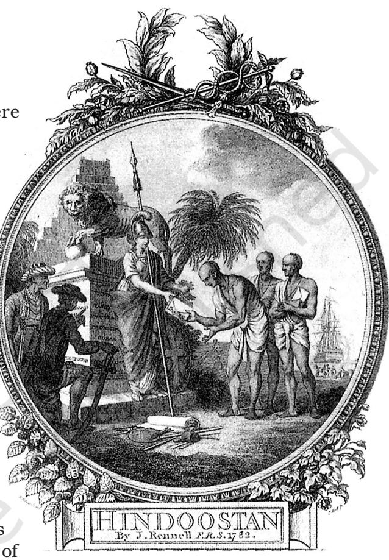
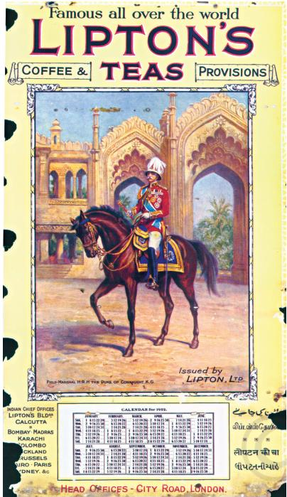
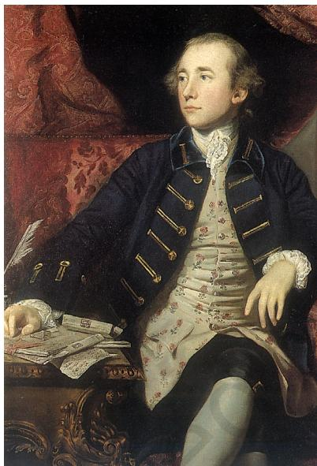
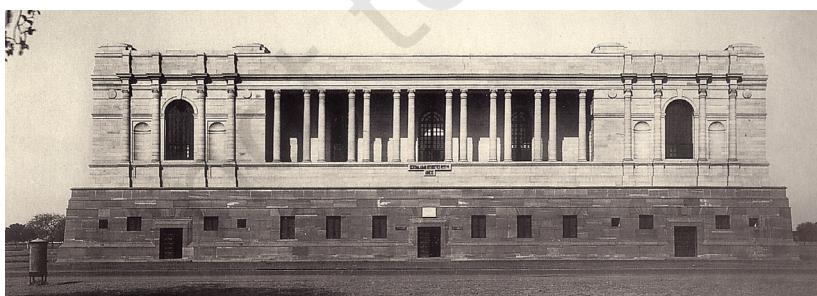
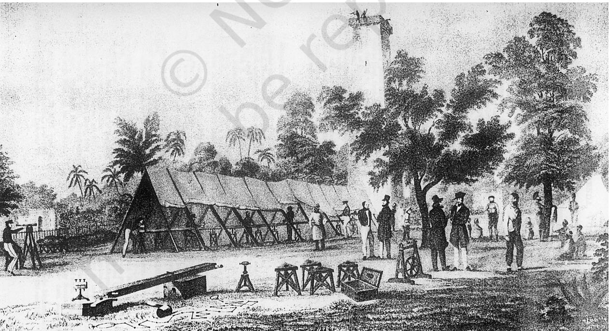
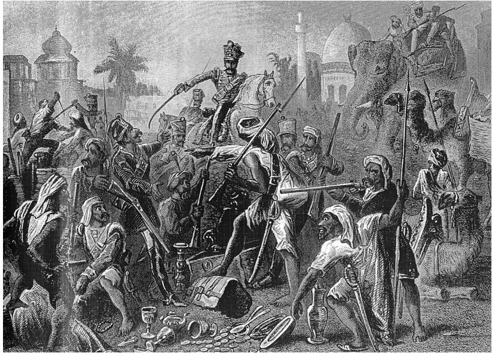

# **Introduction: How, When and Where**

### **How Important are Dates?**

**1**

There was a time when historians were fascinated with dates. There were heated debates about the dates on which rulers were crowned or battles were fought. In the common-sense notion, history was synonymous with dates. You may have heard people say, "I find history boring because it is all about memorising dates." Is such a conception true?

History is certainly about changes that occur over time. It is about finding out how things were in the past and how things have changed. As soon as we compare the past with the present, we refer to time, we talk of "before" and "after".

Living in the world we do not always ask historical questions about what we see around us. We take things for granted, as if what we see has always been in the world we inhabit. But most of us have our moments of wonder, when we are

curious, and we ask questions that actually *are* historical. Watching someone sip a cup of tea at a roadside tea stall, you may wonder – when did people begin to drink tea or coffee? Looking out of the window of a train you may ask yourself – when were railways built and how did people travel long distances before the age of railways? Reading the newspaper in the morning you may be curious to know how people got to hear about things before newspapers began to be printed.

#### **Activity**

Look carefully at Fig.1 and write a paragraph explaining how this image projects an imperial perception.

*Fig. 1 – Brahmans offering the Shastras to Britannia, frontispiece to the first map produced by James Rennel, 1782*

Rennel was asked by Robert Clive to produce maps of Hindustan. An enthusiastic supporter of British conquest of India, Rennel saw preparation of maps as essential to the process of domination. The picture here tries to suggest that Indians willingly gave over their ancient texts to Britannia – the symbol of British power – as if asking her to become the protector of Indian culture.

chap 1-4.indd 1 6/6/2022 12:36:43 PM

*Fig. 2 – Advertisements help create taste*

Old advertisements help us understand how markets for new products were created and new tastes were popularised. This 1922 advertisement for Lipton tea suggests that royalty all over the world is associated with this tea. In the background you see the outer wall of an Indian palace, while in the foreground, seated on horseback is the third son of Queen Victoria of Britain, Prince Arthur, who was given the title Duke of Connaught.

All such historical questions refer us back to notions of time. But time does not have to be always precisely dated in terms of a particular year or a month. Sometimes it is actually incorrect to fix precise dates to processes that happen over a period of time. People in India did not begin drinking tea one fine day; they developed a taste for it over time. There can be no one clear date for a process such as this. Similarly, we cannot fix one single date on which British rule was established, or the national movement started, or changes took place within the economy and society. All these things happened over a stretch of time. We can only refer to a span of time, an approximate period over which particular changes became visible.

Why, then, do we continue to associate history with a string of dates? This association has a reason. There was a time when history was an account of battles and big events. It was about rulers and their policies. Historians wrote about the year a king was crowned, the year he married, the year he had a child, the year he fought a particular war, the year he died, and the year the next ruler succeeded to the throne. For events such as these, specific dates can be determined, and in histories such as these, debates about dates continue to be important.

As you have seen in the history textbooks of the past two years, historians now write about a host of other issues, and other questions. They look at how people earned their livelihood, what they produced and ate, how cities developed and markets came up, how kingdoms were formed and new ideas spread, and how cultures and society changed.

#### Which dates?

By what criteria do we choose a set of dates as important? The dates we select, the dates around which we compose our story of the past, are not important on their own. They become vital because we focus on a particular set of events as important. If our focus of study changes, if we begin to look at new issues, a new set of dates will appear significant.

Consider an example. In the histories written by British historians in India, the rule of each Governor-General was important. These histories began with the rule of the first Governor-General, Warren Hastings, and ended with the last Viceroy, Lord Mountbatten. In separate chapters, we read about the deeds of others— Hastings, Wellesley, Bentinck, Dalhousie, Canning,

chap 1-4.indd 2 4/22/2022 2:49:16 PM

Lawrence, Lytton, Ripon, Curzon, Harding, Irwin. It was a seemingly never-ending succession of Governor-Generals and Viceroys. All the dates in these history books were linked to these personalities – to their activities, policies and achievements. It was as if there was nothing outside their lives that was important for us to know. The chronology of their lives marked the different chapters of the history of British India.

Can we not write about the history of this period in a different way? How do we focus on the activities of different groups and classes in Indian society within the format of this history of Governor-Generals?

When we write history, or a story, we divide it into chapters. Why do we do this? It is to give each chapter some coherence. It is to tell a story in a way that makes some sense and can be followed. In the process we focus only on those events that help us to give shape to the story we are telling. In the histories that revolve around the life of British Governor-Generals, the activities of Indians simply do not fit, they have no space. What, then, do we do? Clearly, we need another format for our history. This would mean that the old dates will no longer have the significance they earlier had. A new set of dates will become more important for us to know.

*Fig. 3 – Warren Hastings became the first Governor-General in 1773* While history books narrated the deeds of Governor-Generals, biographies glorified them as persons, and paintings projected them as powerful figures.

#### How do we periodise?

In 1817, James Mill, a Scottish economist and political philosopher, published a massive three-volume work, *A History of British India*. In this, he divided Indian history into three periods – Hindu, Muslim and British. This periodisation came to be widely accepted. Can you think of any problem with this way of looking at Indian history?

Why do we try and divide history into different periods? We do so in an attempt to capture the characteristics of a time, its central features as they appear to us. So the terms through which we periodise – that is, demarcate the difference between periods – become important. They reflect our ideas about the past. They show how we see the significance of the change from one period to the next.

Mill thought that all Asian societies were at a lower level of civilisation than Europe. According to his telling of history, before the British came to India, Hindu and Muslim despots ruled the country. Religious intolerance, caste taboos and superstitious practices dominated social life. British rule, Mill felt, could civilise India. To do

## **Activity**

Interview your mother or another member of your family to find out about their life. Now divide their life into different periods and list out the significant events in each period. Explain the basis of your periodisation.

chap 1-4.indd 3 6/14/2022 2:38:32 PM

this, it was necessary to introduce European manners, arts, institutions and laws in India. Mill, in fact, suggested that the British should conquer all the territories in India to ensure the enlightenment and happiness of the Indian people. For India was not capable of progress without British help.

In this idea of history, British rule represented all the forces of progress and civilisation. The period before British rule was one of darkness. Can such a conception be accepted today?

In any case, can we refer to any period of history as "Hindu" or "Muslim"? Did not a variety of faiths exist simultaneously in these periods? Why should we characterise an age only through the religion of the rulers of the time? To do so is to suggest that the lives and practices of the others do not really matter. We should also remember that even rulers in ancient India did not all share the same faith.

Moving away from British classification, historians have usually divided Indian history into 'ancient', 'medieval' and 'modern'. This division too has its problems. It is a periodisation that is borrowed from the West where the modern period was associated with the growth of all the forces of modernity – science, reason, democracy, liberty and equality. Medieval was a term used to describe a society where these features of modern society did not exist. Can we uncritically accept this characterisation of the modern period to describe the period of our study? As you will see in this book, under British rule people did not have equality, freedom or liberty. Nor was the period one of economic growth and progress.

Many historians therefore refer to this period as 'colonial'.

#### What is colonial?

In this book, you will read about the way the British came to conquer the country and establish their rule, subjugating local nawabs and rajas. You will see how they established control over the economy and society, collected revenue to meet all their expenses, bought the goods they wanted at low prices, produced crops they needed for export, and you will understand the changes that came about as a consequence. You will also come to know about the changes British rule brought about in values and tastes, customs and practices. When the subjugation of one country by another leads to these kinds of political, economic, social and cultural changes, we refer to the process as colonisation.

You will, however, find that all classes and groups did not experience these changes in the same way. That is why, the book is called *Our Pasts* in the plural.

chap 1-4.indd 4 4/22/2022 2:49:18 PM

### **How do We Know?**

What sources do historians use in writing about the last 250 years of Indian history?

#### Administration produces records

One important source is the official records of the British administration. The British believed that the act of writing was important. Every instruction, plan, policy decision, agreement, investigation had to be clearly written up. Once this was done, things could be properly studied and debated. This conviction produced an administrative culture of memos, notings and reports.

The British also felt that all important documents and letters needed to be carefully preserved. So they set up record rooms attached to all administrative institutions. The village *tahsildar*'s office, the collectorate, the commissioner's office, the provincial secretariats, the lawcourts – all had their record rooms. Specialised institutions like archives and museums were also established to preserve important records.

Letters and memos that moved from one branch of the administration to another in the early years of the nineteenth century can still be read in the archives. You can also study the notes and reports that district officials prepared, or the instructions and directives that were sent by officials at the top to provincial administrators.

In the early years of the nineteenth century, these documents were carefully copied out and beautifully written by calligraphists – that is, by those who specialised in the art of beautiful writing. By the middle of the nineteenth century, with the spread of printing, multiple copies of these records were printed as proceedings of each government department.

*Fig. 4 – The National Archives of India came up in the 1920s* When New Delhi was built, the National Museum and the National Archives were both located close to the Viceregal Palace. This location reflects the importance these institutions had in British imagination.

**Source 1**

## Reports to the Home Department

In 1946 the colonial government in India was trying to put down a mutiny that broke out on the ships of the Royal Indian Navy. Here is a sample of the kind of reports the Home Department got from the different dockyards:

> Bombay: Arrangements have been made for the Army to take over ships and establishment. Royal Navy ships are remaining outside the harbour.

Karachi: 301 mutineers are under arrest and a few more strongly suspected are to be arrested … All establishments … are under military guard.

Vizagapatnam: The positionis completely under control and no violence has occurred. Military guards have been placed on ships and establishments. No further trouble is expected except that a few men may refuse to work.

*Director of Intelligence, HQ. India Command, Situation Report No. 7. File No. 5/21/46 Home (Political), Government of India*

chap 1-4.indd 5 6/3/2022 5:07:10 PM

#### Surveys become important

The practice of surveying also became common under the colonial administration. The British believed that a country had to be properly known before it could be effectively administered.

By the early nineteenth century, detailed surveys were being carried out to map the entire country. In the villages, revenue surveys were conducted. The effort was to know the topography, the soil quality, the flora, the fauna, the local histories, and the cropping pattern – all the facts seen as necessary to know about to administer the region. From the end of the nineteenth century, Census operations were held every ten years. These prepared detailed records of the number of people in all the provinces of India, noting information on castes, religions and occupation. There were many other surveys – botanical surveys, zoological surveys, archaeological surveys, anthropological surveys, forest surveys.

#### What official records do not tell

From this vast corpus of records we can get to know a lot, but we must remember that these are official records. They tell us what the officials thought, what

*Fig. 6 – Mapping and survey operations in progress in Bengal, a drawing by James Prinsep, 1832* Note how all the instruments that were used in surveys are placed in the foreground to emphasise the scientific nature of the project.

*Fig. 5 – A custard-apple plant, 1770s* Botanical gardens and natural history

museums established by the British collected plant specimens and information about their uses. Local artists were asked to draw pictures of these specimens. Historians are now looking at the way such information was gathered and what this information reveals about the

nature of colonialism.

chap 1-4.indd 6 4/22/2022 2:49:21 PM

Images need to be carefully studied for they project the viewpoint of those who create them. This image can be found in several illustrated books produced by the British after the 1857 rebellion. The caption at the bottom says: "Mutinous sepoys share the loot". In British representations, the rebels appear as greedy, vicious and brutal. You will read about the rebellion in Chapter 5.

they were interested in, and what they wished to preserve for posterity. These records do not always help us understand what other people in the country felt, and what lay behind their actions.

For that we need to look elsewhere. When we begin to search for these other sources, we find them in plenty, though they are more difficult to get than official records. We have diaries of people, accounts of pilgrims and travellers, autobiographies of important personalities, and popular booklets that were sold in the local bazaars. As printing spread, newspapers were published and issues were debated in public. Leaders and reformers wrote to spread their ideas, poets and novelists wrote to express their feelings.

All these sources, however, were produced by those who were literate. From these, we will not be able to understand how history was experienced and lived by the tribals and the peasants, the workers in the mines or the poor on the streets. Getting to know their lives is a more difficult task.

Yet this can be done, if we make a little bit of effort. When you read this book, you will see how this can be done.

#### **Source 2**

## "Not fit for human consumption"

N e w s p a p e r s p r o v i d e accounts of the movements in different parts of the country. Here is a report of a police strike in 1946.

- More than 2000 policemen in Delhi refused to take their food on Thursday morning as a protest against their low salaries and the bad quality of food supplied to them from the Police Lines kitchen.
As the news spread to the other police stations, the men there also refused to take food … One of the strikers said: "The food supplied to us from the Police Lines kitchen is not fit for human consumption. Even cattle would not eat the *chappattis* and *dal* which we have to eat."

> *Hindustan Times,*  22 March, 1946

## **Activity**

Look at Sources 1 and 2. Do you find any differences in the nature of reporting? Explain what you observed.

chap 1-4.indd 7 4/22/2022 2:49:22 PM

## **Let's imagine**

Imagine that you are a historian wanting to find out about how agriculture changed in a remote tribal area after independence. List the different ways in which you would find information on this.

## **Let's recall**

- 1. State whether true or false:
	- (a) James Mill divided Indian history into three periods – Hindu, Muslim, Christian.
- (b) Official documents help us understand what the people of the country think.
- (c) The British thought surveys were important for effective administration.

## **Let's discuss**

- 2. What is the problem with the periodisation of Indian history that James Mill offers?
- 3. Why did the British preserve official documents?
- 4. How will the information historians get from old newspapers be different from that found in police reports?

## **Let's do**

- 5. Can you think of examples of surveys in your world today? Think about how toy companies get information about what young people enjoy playing with or how the government finds out about the number of young people in school. What can a historian derive from such surveys?
chap 1-4.indd 8 4/22/2022 2:49:24 PM

