# **From Trade to Territory The Company Establishes Power**

Aurangzeb was the last of the powerful Mughal rulers. He established control over a very large part of the territory that is now known as India. After his death in 1707, many Mughal governors (*subadars*) and big zamindars began asserting their authority and establishing regional kingdoms. As powerful regional kingdoms emerged in various parts of India, Delhi could no longer function as an effective centre.

By the second half of the eighteenth century, however, a new power was emerging on the political horizon – the British. Did you know that the British originally came as a small trading company and were reluctant to acquire territories? How then did they come to be masters of a vast empire? In this chapter you will see how this came about.

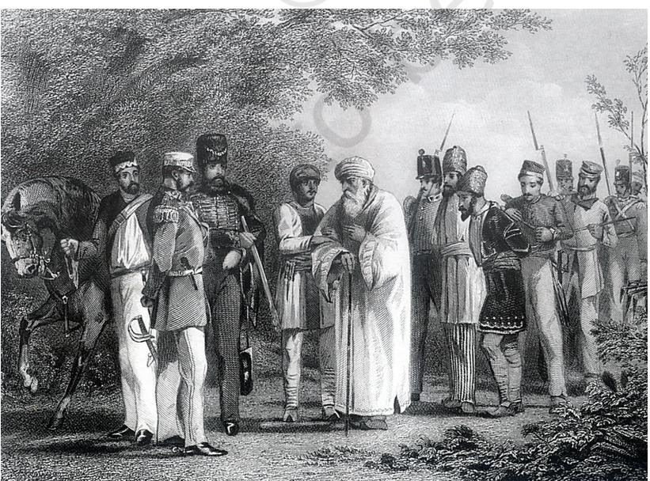

#### *Fig. 1 – Bahadur Shah Zafar and his sons being arrested by Captain Hodson*

After Aurangzeb there was no powerful Mughal ruler, but Mughal emperors continued to be symbolically important. In fact, when a massive rebellion against British rule broke out in 1857, Bahadur Shah Zafar, the Mughal emperor at the time, was seen as the natural leader. Once the revolt was put down by the company, Bahadur Shah Zafar was forced to leave the kingdom, and his sons were shot in cold blood.

chap 1-4.indd 9 4/22/2022 2:49:25 PM

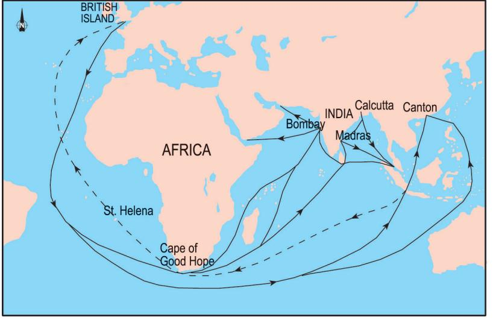

*Fig. 2 – Routes to India in the eighteenth century*

Mercantile – A business enterprise that makes profit primarily through trade, buying goods cheap and selling them at higher prices

## **East India Company Comes East**

In 1600, the East India Company acquired a charter from the ruler of England, Queen Elizabeth I, granting it the sole right to trade with the East. This meant that no other trading group in England could compete with the East India Company. With this charter, the Company could venture across the oceans, looking for new lands from which it could buy goods

at a cheap price, and carry them back to Europe to sell at higher prices. The Company did not have to fear competition from other English trading companies. Mercantile trading companies in those days made profit primarily by excluding competition, so that they could buy cheap and sell dear.

The royal charter, however, could not prevent other European powers from entering the Eastern markets. By the time the first English ships sailed down the west coast of Africa, round the Cape of Good Hope, and crossed the Indian Ocean, the Portuguese had already established their presence in the western coast of India, and had their base in Goa. In fact, it was Vasco da Gama, a Portuguese explorer, who had discovered this sea route to India in 1498. By the early seventeenth century, the Dutch too were exploring the possibilities of trade in the Indian Ocean. Soon the French traders arrived on the scene.

The problem was that all the companies were interested in buying the same things. The fine qualities of cotton and silk produced in India had a big market in Europe. Pepper, cloves, cardamom and cinnamon too were in great demand. Competition amongst the European companies inevitably pushed up the prices at which these goods could be purchased, and this reduced the profits that could be earned. The only way the trading companies could flourish was by eliminating rival competitors. The urge to secure markets, therefore, led to fierce battles between the trading companies. Through the seventeenth and eighteenth centuries they regularly sank each other's ships, blockaded routes, and prevented rival ships from moving with supplies of

chap 1-4.indd 10 4/22/2022 2:49:26 PM

goods. Trade was carried on with arms and trading posts were protected through fortification.

This effort to fortify settlements and carry on profitable trade also led to intense conflict with local rulers. The company therefore found it difficult to separate trade from politics. Let us see how this happened.

#### East India Company begins trade in Bengal

The first English factory was set up on the banks of the river Hugli in 1651. This was the base from which the Company's traders, known at that time as "factors", operated. The factory had a warehouse where goods for export were stored, and it had offices where Company officials sat. As trade expanded, the Company persuaded merchants and traders to come and settle near the factory. By 1696, it began building a fort around the settlement. Two years later, it bribed Mughal officials into giving the Company zamindari rights over three villages. One of these was Kalikata, which later grew into the city of Calcutta or Kolkata as it is known today. It also persuaded the Mughal emperor Aurangzeb to issue a *farman* granting the Company the right to trade duty free.

The Company tried continuously to press for more concessions and manipulate existing privileges. Aurangzeb's *farman*, for instance, had granted only the Company the right to trade duty free. But officials of the Company, who were carrying on private trade on the side, were expected to pay duty. This they refused to pay, causing an enormous loss of revenue for Bengal. How could the Nawab of Bengal, Murshid Quli Khan, not protest?

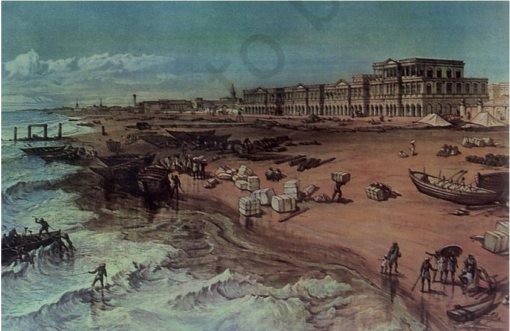

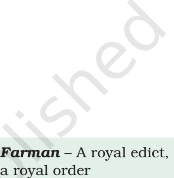

*Fig. 3 – Local boats bring goods from ships in Madras, painted by William Simpson, 1867*

chap 1-4.indd 11 4/22/2022 2:49:27 PM

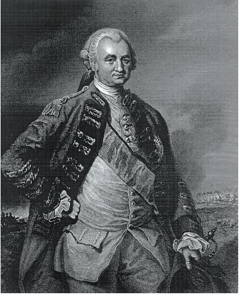

*Fig. 4 – Robert Clive* 

Puppet – Literally, a toy that you can move with strings. The term is used disapprovingly to refer to a person who is controlled by someone else.

## Did you know?

Did you know how Plassey got its name? Plassey is an anglicised pronunciation of Palashi and the place derived its name from the *palash* tree known for its beautiful red flowers that yield *gulal*, the powder used in the festival of Holi.

## How trade led to battles

Through the early eighteenth century, the conflict between the Company and the nawabs of Bengal intensified. After the death of Aurangzeb, the Bengal nawabs asserted their power and autonomy, as other regional powers were doing at that time. Murshid Quli Khan was followed by Alivardi Khan and then Sirajuddaulah as the Nawab of Bengal. Each one of them was a strong ruler. They refused to grant the Company concessions, demanded large tributes for the Company's right to trade, denied it any right to mint coins, and stopped it from extending its fortifications. Accusing the Company of deceit, they claimed that the Company was depriving the Bengal government of huge amounts of revenue and undermining the authority of the nawab. It was refusing to pay taxes, writing disrespectful letters, and trying to humiliate the nawab and his officials.

The Company on its part declared that the unjust demands of the local officials were ruining the trade of the Company, and trade could flourish only if the duties were removed. It was also convinced that to expand trade, it had to enlarge its settlements, buy up villages, and rebuild its forts.

The conflicts led to confrontations and finally culminated in the famous Battle of Plassey.

## The Battle of Plassey

When Alivardi Khan died in 1756, Sirajuddaulah became the nawab of Bengal. The Company was worried about his power and keen on a puppet ruler who would willingly give trade concessions and other privileges. So it tried, though without success, to help one of Sirajuddaulah's rivals become the nawab. An infuriated Sirajuddaulah asked the Company to stop meddling in the political affairs of his dominion, stop fortification, and pay the revenues. After negotiations failed, the Nawab marched with 30,000 soldiers to the English factory at Kassimbazar, captured the Company officials, locked the warehouse, disarmed all Englishmen, and blockaded English ships. Then he marched to Calcutta to establish control over the Company's fort there.

On hearing the news of the fall of Calcutta, Company officials in Madras sent forces under the command of Robert Clive, reinforced by naval fleets. Prolonged negotiations with the Nawab followed. Finally, in 1757, Robert Clive led the Company's army against Sirajuddaulah at Plassey. One of the main reasons for

chap 1-4.indd 12 4/22/2022 2:49:28 PM

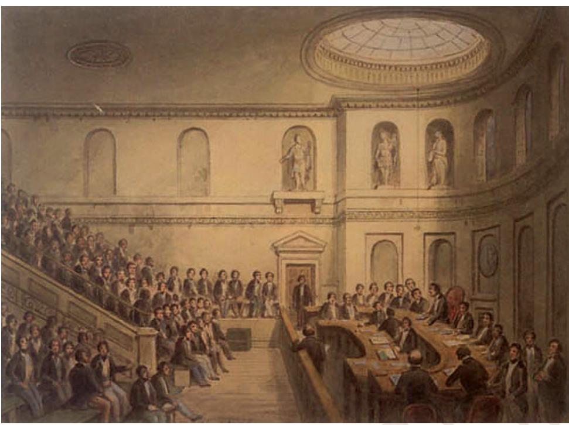

the defeat of the Nawab was that the forces led by Mir Jafar, one of Sirajuddaulah's commanders, never fought the battle. Clive had managed to secure his support by promising to make him nawab after crushing Sirajuddaulah.

The Battle of Plassey became famous because it was the first major victory the Company won in India.

**Source 1**

## The promise of riches

The territorial ambitions of the mercantile East India Company were viewed with distrust and doubt in England. After the Battle of Plassey, Robert Clive wrote to William Pitt, one of the Principal Secretaries of State to the English monarch, on 7 January 1759 from Calcutta:

> But so large a sovereignty may possibly be an object too extensive for a mercantile Company … I flatter myself … that there will be little or no difficulty in obtaining the absolute possession of these rich kingdoms: ... Now I leave you to judge, whether an income yearly of two million sterling with the possession of three provinces … be an object deserving the public attention ...

*Fig. 5 – The General Court Room, East India House, Leadenhall Street*

The Court of Proprietors of the East India Company had their meetings in the East India House on Leadenhall Street in London. This is a picture of one of their meetings in progress.

Fig. 6 – Sirajuddaulah

chap 1-4.indd 13 4/22/2022 2:49:30 PM

**Source 2**

## The Nawab complains

In 1733 the Nawab of Bengal said this about the English traders:

> When they first came into the country they petitioned the then government in a humble manner for liberty to purchase a spot of ground to build a factory house upon, which was no sooner granted but they built a strong fort, surrounded it with a ditch which has communication with the river and mounted a great number of guns upon the walls. They have enticed several merchants and others to go and take protection under them and they collect a revenue which amounts to Rs. 100,000… they rob and plunder and carry great number of the king's subjects of both sexes into slavery into their own country …

After the defeat at Plassey, Sirajuddaulah was assassinated and Mir Jafar made the nawab. The Company was still unwilling to take over the responsibility of administration. Its prime objective was the expansion of trade. If this could be done without conquest, through the help of local rulers who were willing to grant privileges, then territories need not be taken over directly.

Soon the Company discovered that this was rather difficult. For even the puppet nawabs were not always as helpful as the Company wanted them to be. After all, they had to maintain a basic appearance of dignity and sovereignty if they wanted respect from their subjects.

What could the Company do? When Mir Jafar protested, the Company deposed him and installed Mir Qasim in his place. When Mir Qasim complained, he in turn was defeated in a battle fought at Buxar (1764), driven out of Bengal, and Mir Jafar was reinstalled. The Nawab had to pay Rs. 500,000 every month but the Company wanted more money to finance its wars, and meet the demands of trade and its other expenses. It wanted more territories and more revenue. By the time Mir Jafar died in 1765, the mood of the Company had changed. Having failed to work with puppet nawabs, Clive declared: "We must indeed become nawabs ourselves".

Finally, in 1765 the Mughal emperor appointed the Company as the Diwan of the provinces of Bengal. The Diwani allowed the Company to use the vast revenue resources of Bengal. This solved a major problem that the Company had earlier faced. From the early eighteenth century, its trade with India had expanded. But it had to buy most of the goods in India with gold and silver imported from Britain. This was because at this time Britain had no goods to sell in India. The outflow of gold from Britain slowed after the Battle of Plassey, and entirely stopped after the assumption of Diwani. Now revenues from India could finance Company expenses. These revenues could be used to purchase cotton and silk textiles in India, maintain Company troops, and meet the cost of building the Company fort and offices at Calcutta.

#### Company officials become "nabobs" (nawabs)

What did it mean to be nawabs? It meant of course that the Company acquired more power and authority. But it also meant something else. Each company servant began to have visions of living like nawabs.

chap 1-4.indd 14 14-03-2024 14:42:31

After the Battle of Plassey, the actual nawabs of Bengal were forced to give land and vast sums of money as personal gifts to Company officials. Robert Clive himself amassed a fortune in India. He had come to Madras (now Chennai) from England in 1743 at the age of 18. When in 1767 he left India, his Indian fortune was worth £401,102. Interestingly, when he was appointed Governor of Bengal in 1764, he was asked to remove corruption in Company administration but he was himself cross-examined in 1772 by the British Parliament which was suspicious of his vast wealth. Although he was acquitted, he committed suicide in 1774.

However, not all Company officials succeeded in making money like Clive. Many died an early death in India due to disease and war, and it would not be right to regard all of them as corrupt and dishonest. Many of them came from humble backgrounds and their uppermost desire was to earn enough in India, return to Britain and lead a comfortable life. Those who managed to return with wealth led flashy lives and flaunted their riches. They were called "nabobs" – an anglicised version of the Indian word nawab. They were often seen as upstarts and social climbers in British society and were ridiculed or made fun of in plays and cartoons.

## **Company Rule Expands**

If we analyse the process of annexation of Indian states by the East India Company from 1757 to 1857, certain key aspects emerge. The Company rarely launched a direct military attack on an unknown territory. Instead it used a variety of political, economic and diplomatic methods to extend its influence before annexing an Indian kingdom.

After the Battle of Buxar (1764), the Company appointed Residents in Indian states. They were political or commercial agents and their job was to serve and further the interests of the Company. Through the Residents, the Company officials began interfering in the internal affairs of Indian states. They tried to decide who was to be the successor to the throne, and who was to be appointed in administrative posts. Sometimes, the Company forced the states into a "subsidiary alliance". According to the terms of this alliance, Indian rulers were not allowed to have their independent armed forces. They were to be protected by the Company, but **Source 3**

## How did Clive see himself?

At his hearing in front of a Committee in Parliament, Clive declared that he had shown admirable restraint after the Battle of Plassey. This is what he said:

Consider the situation in which the victory at Plassey had placed me! A great prince was dependent on my pleasure; an opulent city lay at my mercy; its richest bankers bid against each other for my smiles; I walked through vaults which were thrown open to me alone, piled on either hand with gold and jewels! Mr Chairman, at this moment I stand astonished at my moderation.

## **Activity**

Imagine that you are a young Company official who has been in India for a few months. Write a letter home to your mother telling her about your luxurious life and contrasting it with your earlier life in Britain.

chap 1-4.indd 15 4/22/2022 2:49:30 PM

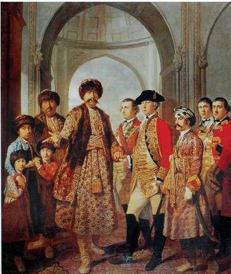

*Fig. 7 – Nawab Shujauddaulah of Awadh, with his sons and the British Resident, painted by Tilly Kettle (oil, 1772)*

The treaties that followed the Battle of Buxar forced Nawab Shujauddaulah to give up much of his authority. Here, however, he poses in regal splendour, towering over the Resident.

Injunction – Instruction Subservience – Submissiveness

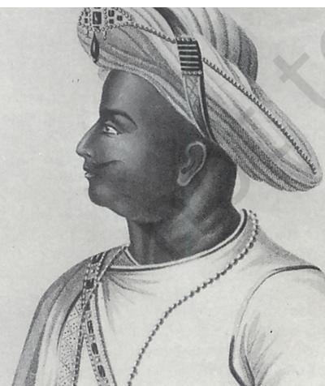

*Fig. 8 – Tipu Sultan*

had to pay for the "subsidiary forces" that the Company was supposed to maintain for the purpose of this protection. If the Indian rulers failed to make the payment, then part of their territory was taken away as penalty. For example, when Richard Wellesley was Governor-General (1798–1805), the Nawab of Awadh was forced to give over half of his territory to the Company in 1801, as he failed to pay for the "subsidiary forces". Hyderabad was also forced to cede territories on similar grounds.

**Source 4**

## What power did the Resident have?

This is what James Mill, the famous economist and political philosopher from Scotland, wrote about the residents appointed by the Company.

> We place a resident, who really is king of the country, whatever **injunctions** of non-interference he may act under. As long as the prince acts in perfect **subservience**, and does what is agreeable to the residents, that is, to the British Government, things go on quietly; they are managed without the resident appearing much in the administration of affairs … but when anything of a different nature happens, the moment the prince takes a course which the British Government think wrong, then comes clashing and disturbance.

The Company resorted to direct military confrontation when

*James Mill (1832)*

## it saw a threat to its political or economic interests. This can be illustrated with the case of the southern Indian state of Mysore. Mysore had grown in strength under the leadership of powerful rulers like Haidar Ali (ruled from 1761 to 1782) and his famous son Tipu Sultan (ruled from 1782 to 1799). Mysore controlled the profitable trade of the Malabar coast where the Company purchased pepper and cardamom. In 1785, Tipu Sultan stopped the export of sandalwood, pepper and cardamom through the ports

Tipu Sultan – The "Tiger of Mysore"

of his kingdom, and disallowed local merchants from trading with the Company. He also established a close

chap 1-4.indd 16 4/22/2022 2:49:32 PM

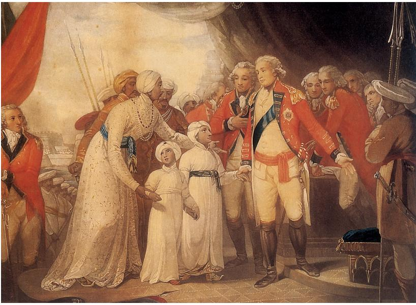

relationship with the French in India, and modernised his army with their help.

The British were furious. They saw Haidar and Tipu as ambitious, arrogant and dangerous – rulers who had to be controlled and crushed. Four wars were fought with Mysore (1767–69, 1780–84, 1790–92 and 1799). Only in the last – the Battle of Shrirangapatnam – did the Company ultimately win a victory. Tipu Sultan was killed defending his capital Shrirangapatnam, Mysore was placed under the former ruling dynasty of the Wodeyars and a subsidiary alliance was imposed on the state.

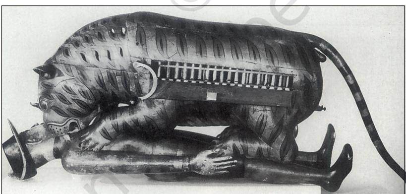

#### *Fig. 10 – Tipu's toy tiger*

This is the picture of a big mechanical toy that Tipu possessed. You can see a tiger mauling a European soldier. When its handle was turned, the toy tiger roared and the soldier shrieked. This toy-tiger is now kept in the Victoria and Albert Museum in London. The British took it away when Tipu Sultan died defending his capital Shrirangapatnam on 4 May 1799.

#### *Fig. 9 – Cornwallis receiving the sons of Tipu Sultan as hostages, painted by Daniel Orme, 1793*

The Company forces were defeated by Haidar Ali and Tipu Sultan in several battles. But in 1792, attacked by the combined forces of the Marathas, the Nizam of Hyderabad and the Company, Tipu was forced to sign a treaty with the British by which two of his sons were taken away as hostages. British painters always liked painting scenes that showed the triumph of British power.

## The legend of Tipu

Kings are often surrounded by legend and their powers glorified through folklore. Here is a legend about Tipu Sultan who became the ruler of Mysore in 1782. It is said that once he went hunting in the forest with a French friend. There he came face to face with a tiger. His gun did not work and his dagger fell to the ground. He battled with the tiger unarmed until he managed to reach down and pick up the dagger. Finally, he was able to kill the tiger in the battle. After this, he came to be known as the "Tiger of Mysore". He had the image of the tiger on his flag.

chap 1-4.indd 17 14-03-2024 10:50:37

#### . **Activity**

Imagine that you have come across two old newspapers reporting on the Battle of Shrirangapatnam and the death of Tipu Sultan. One is a British paper and the other is from Mysore. Write the headline for each of the two newspapers.

#### Confederacy – Alliance

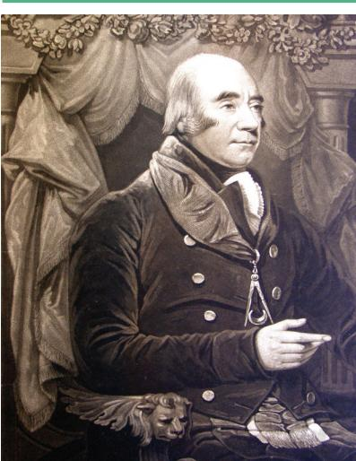

*Fig. 11 – Lord Hastings*

*Fig. 12 – A Statue of the Queen of Kitoor (Karnataka)* 

#### War with the Marathas

From the late eighteenth century, the Company also sought to curb and eventually destroy Maratha power. With their defeat in the Third Battle of Panipat in 1761, the Marathas' dream of ruling from Delhi was shattered. They were divided into many states under different chiefs (*sardars*) belonging to dynasties such as Sindhia, Holkar, Gaikwad and Bhonsle. These chiefs were held together in a confederacy under a Peshwa (Principal Minister) who became its effective military and administrative head based in Pune. Mahadji Sindhia and Nana Phadnis were two famous Maratha soldiers and statesmen of the late eighteenth century.

The Marathas were subdued in a series of wars. In the first war that ended in 1782 with the Treaty of Salbai, there was no clear victor. The Second Anglo-Maratha War (1803–05) was fought on different fronts, resulting in the British gaining Orissa and the territories north of the Yamuna river including Agra and Delhi. Finally, the Maratha power came to end with the Third Anglo-Maratha War of 1817–19. The Peshwa was removed and sent away to Bithur near Kanpur with a pension. The Company now had complete control over the territories south of the Vindhyas.

## The claim to paramountcy

It is clear from the above that from the early nineteenth century, the Company pursued an aggressive policy of territorial expansion. Under Lord Hastings (Governor-General from 1813 to 1823), a new policy of "paramountcy" was initiated. Now the Company claimed that its authority was paramount or supreme, hence its power was greater than that of Indian states. In order to protect its interests, it was justified in annexing or threatening to annex any Indian kingdom. This view continued to guide later British policies as well.

This process, however, did not go unchallenged. For example, when the British tried to annex the small state of Kitoor (in Karnataka today), Rani Channamma took to arms and led an anti-British resistance movement. She was arrested in 1824 and died in prison in 1829. But Rayanna, a poor *chowkidar* of Sangoli in Kitoor, carried on the resistance. With popular support, he destroyed many British camps and records. He was caught and hanged by the British in 1830. You will read more about several cases of resistance later in the book.

chap 1-4.indd 18 26-03-2024 14:44:33

In the late 1830s, the East India Company became worried about Russia. It imagined that Russia might expand across Asia and enter India from the north-west. Driven by this fear, the British now wanted to secure their control over the north-west. They fought a prolonged war with Afghanistan between 1838 and 1842, and established indirect Company rule there. Sind was taken over in 1843. Next in line was Punjab. But the presence of Maharaja Ranjit Singh held back the Company. After his death in 1839, two prolonged wars were fought with the Sikh kingdom. Ultimately, in 1849, Punjab was annexed.

## The Doctrine of Lapse

The final wave of annexations occurred under Lord Dalhousie who was the Governor-General from 1848 to 1856. He devised a policy that came to be known as the Doctrine of Lapse. The doctrine declared that if an Indian ruler died without a male heir his kingdom would "lapse", that is, become a part of Company territory. One kingdom after another was annexed simply by applying this doctrine: Satara (1848),

Sambalpur (1850), Udaipur (1852), Nagpur (1853) and Jhansi (1854).

Finally, in 1856, the Company also took over Awadh. This time the British had an added argument – they said they were "obliged by duty" to take over Awadh in order to free the people from the "misgovernment" of the Nawab! Enraged by the humiliating way in which the Nawab was deposed, the people of Awadh joined the great revolt that broke out in 1857.

#### **Activity**

Imagine that you are a nawab's nephew and have been brought up thinking that you will one day be king. Now you find that this will not be allowed by the British because of the new Doctrine of Lapse. What will be your feelings? What will you plan to do so that you can inherit the crown?

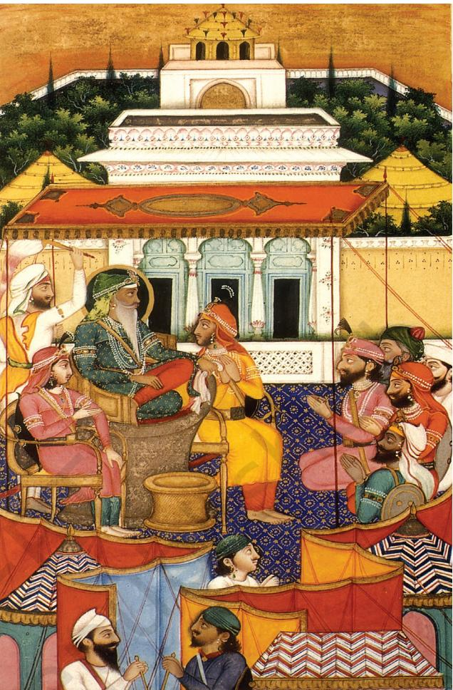

*Fig. 13 – Maharaja Ranjit Singh holding court* 

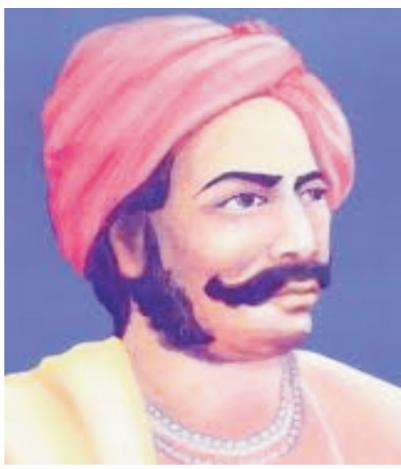

*Fig. 14 – A portrait of Veer Surendra Sai* 

chap 1-4.indd 19 4/22/2022 2:49:39 PM

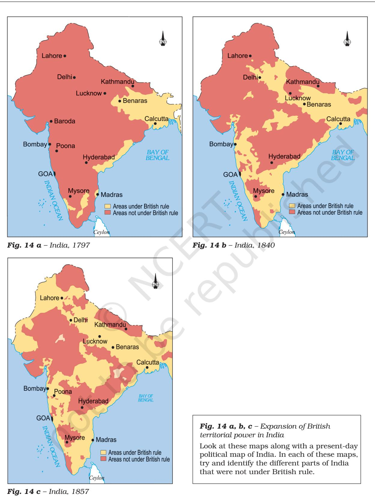

chap 1-4.indd 20 4/22/2022 2:49:40 PM

## **Setting up a New Administration**

Warren Hastings (Governor-General from 1773 to 1785) was one of the many important figures who played a significant role in the expansion of Company power. By his time the Company had acquired power not only in Bengal, but also in Bombay and Madras. British territories were broadly divided into administrative units called Presidencies. There were three Presidencies: Bengal, Madras and Bombay. Each was ruled by a Governor. The supreme head of the administration was the Governor-General. Warren Hastings, the first Governor-General, introduced several administrative reforms, notably in the sphere of justice.

From 1772 a new system of justice was established. Each district was to have two courts – a criminal court (*faujdari adalat*) and a civil court (*diwani adalat*). Maulvis and Hindu pandits interpreted Indian laws for the European district collectors who presided over civil courts. The criminal courts were still under a *qazi* and a *mufti* but under the supervision of the collectors.

#### *Qazi* – A judge

*Mufti* – A jurist of the Muslim community responsible for expounding the law that the *qazi* would administer

Impeachment – A trial by the House of Lords in England for charges of misconduct brought against a person in the House of Commons

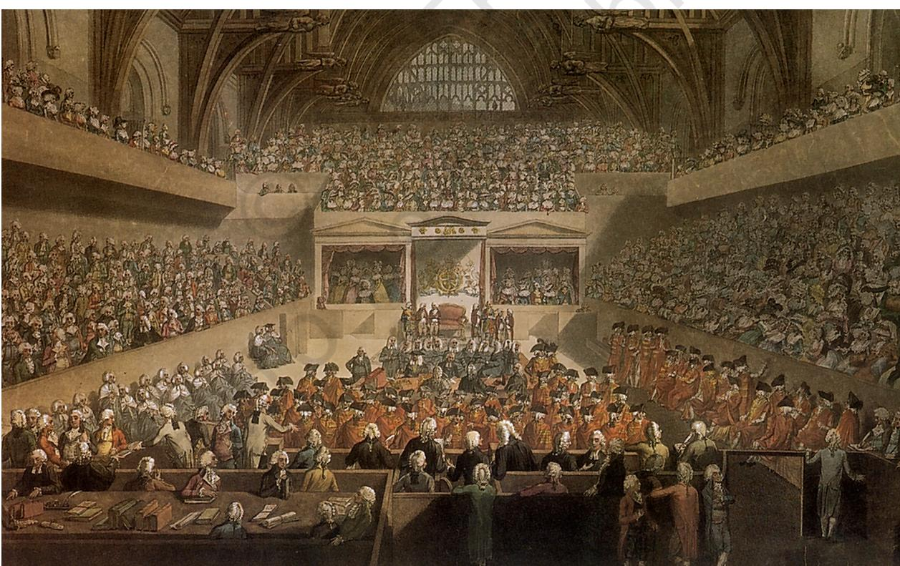

*Fig. 15 – The trial of Warren Hastings, painted by R.G. Pollard, 1789* When Warren Hastings went back to England in 1785, Edmund Burke accused him of being personally responsible for the misgovernment of Bengal. This led to an impeachment proceeding in the British Parliament that lasted seven years.

chap 1-4.indd 21 4/22/2022 2:49:42 PM

**Source 5**

"I impeach the common enemy and oppressor of all."

Here is a passage from Edmund Burke's eloquent opening speech during the impeachment of Warren Hastings:

> I impeach him in the name of the people of India, whose rights he has trodden under his foot and whose country he has turned into a desert. Lastly in the name of human nature itself, in the name of both the sexes, in the name of every age, in the name of every rank, I impeach the common enemy and oppressor of all.

## *Dharmashastras* –

Sanskrit texts prescribing social rules and codes of behaviour, composed from *c*. 500 bce onwards

*Sawar* – Men on horses

Musket – A heavy gun used by infantry soldiers

Matchlock – An early type of gun in which the powder was ignited by a match

A major problem was that the Brahman pandits gave different interpretations of local laws based on different schools of the *dharmashastra*. To bring about uniformity, in 1775 eleven pandits were asked to compile a digest of Hindu laws. N.B. Halhed translated this digest into English. By 1778, a code of Muslim laws was also compiled for the benefit of European judges. Under the Regulating Act of 1773, a new Supreme Court was established, while a court of appeal – the Sadar Nizamat Adalat – was also set up at Calcutta.

The principal figure in an Indian district was the Collector. As the title suggests, his main job was to collect revenue and taxes and maintain law and order in his district with the help of judges, police officers and *darogas*. His office – the Collectorate – became the new centre of power and patronage that steadily replaced previous holders of authority.

#### The Company army

Colonial rule in India brought in some new ideas of administration and reform but its power rested on its military strength. The Mughal army was mainly composed of cavalry (*sawars*: trained soldiers on horseback) and infantry, that is, *paidal* (foot) soldiers. They were given training in archery (*teer-andazi*) and the use of the sword. The cavalry dominated the army and the Mughal state did not feel the need to have a large professionally trained infantry. The rural areas had a large number of armed peasants and the local zamindars often supplied the Mughals with *paidal* soldiers.

A change occurred in the eighteenth century when Mughal successor states like Awadh and Banaras started recruiting peasants into their armies and training them as professional soldiers. The East India Company adopted the same method when it began recruitment for its own army, which came to be known as the sepoy army (from the Indian word *sipahi*, meaning soldier).

As warfare technology changed from the 1820s, the cavalry requirements of the Company's army declined. This is because the British empire was fighting in Burma, Afghanistan and Egypt where soldiers were armed with muskets and matchlocks. The soldiers of the Company's army had to keep pace with changing military requirements and its infantry regiments now became more important.

In the early nineteenth century, the British began to develop a uniform military culture. Soldiers were

chap 1-4.indd 22 14-03-2024 10:51:32

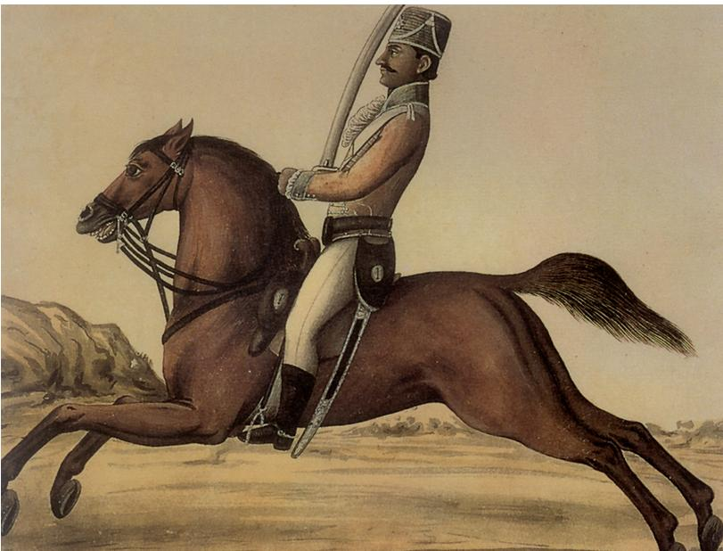

increasingly subjected to European-style training, drill and discipline that regulated their life far more than before. Often this created problems since caste and community feelings were ignored in building a force of professional soldiers. Could individuals so easily give up their caste and religious feelings? Could they see themselves only as soldiers and not as members of communities?

What did the sepoys feel? How did they react to the changes in their lives and their identity – that is, their sense of who they were? The Revolt of 1857 gives us a glimpse into the world of the sepoys. You will read about this revolt in Chapter 5.

## **Conclusion**

Thus the East India Company was transformed from a trading company to a territorial colonial power. The arrival of new steam technology in the early nineteenth century also aided this process. Till then it would take anywhere between six and eight months to travel to India by sea. Steamships reduced the journey time to three weeks enabling more Britishers and their families to come to a far-off country like India.

By 1857, the Company came to exercise direct rule over about 63 per cent of the territory and 78 per cent of the population of the Indian subcontinent. Combined with its indirect influence on the remaining territory and population of the country, the East India Company had virtually the whole of India under its control.

*Fig. 16 – A* sawar *of Bengal in the service of the Company, painted by an unknown Indian artist, 1780*

After the battles with the Marathas and the Mysore rulers, the Company realised the importance of strengthening its cavalry force.

chap 1-4.indd 23 4/22/2022 2:49:43 PM

**Let's imagine**

You are living in England in the late eighteenth or early nineteenth century. How would you have reacted to the stories of British conquests? Remember that you would have read about the immense fortunes that many of the officials were making.

# **Let's recall**

- 1. Match the following:

| Diwani | Tipu Sultan |
| --- | --- |
| "Tiger of Mysore" | right to collect land revenue |
| faujdari adalat | Sepoy |
| Rani Channamma | criminal court |
| sipahi | led an anti-British |
|  | movement in Kitoor |

- 2. Fill in the blanks:
___________.

___________.

- (a) The British conquest of Bengal began with the Battle of ___________.
- (b) Haidar Ali and Tipu Sultan were the rulers of
- (c) Dalhousie implemented the Doctrine of
- (d) Maratha kingdoms were located mainly in the ___________ part of India.

3. State whether true or false:

- (a) The Mughal empire became stronger in the eighteenth century.
- (b) The English East India Company was the only European company that traded with India.
- (c) Maharaja Ranjit Singh was the ruler of Punjab.
- (d) The British did not introduce administrative changes in the territories they conquered.

## **Let's discuss**

- 4. What attracted European trading companies to India?
- 5. What were the areas of conflict between the Bengal nawabs and the East India Company?

chap 1-4.indd 24 4/22/2022 2:49:46 PM

- 6. How did the assumption of Diwani benefit the East India Company?
- 7. Explain the system of "subsidiary alliance".
- 8. In what way was the administration of the Company different from that of Indian rulers?
- 9. Describe the changes that occurred in the composition of the Company's army.

# **Let's do**

- 10. After the British conquest of Bengal, Calcutta grew from small village to a big city. Find out about the culture, architecture and the life of Europeans and Indians of the city during the colonial period.
- 11. Collect pictures, stories, poems and information about any of the following – the Rani of Jhansi, Mahadji Sindhia, Haidar Ali, Maharaja Ranjit Singh, Lord Dalhousie or any other contemporary ruler of your region.

chap 1-4.indd 25 4/22/2022 2:49:46 PM

