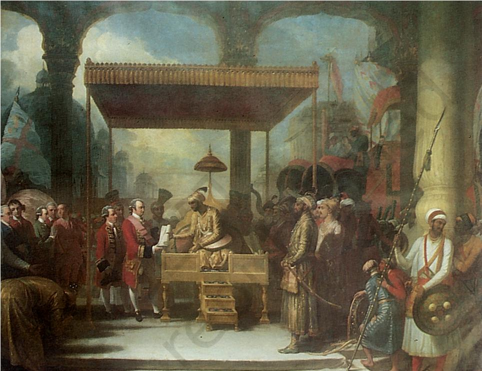
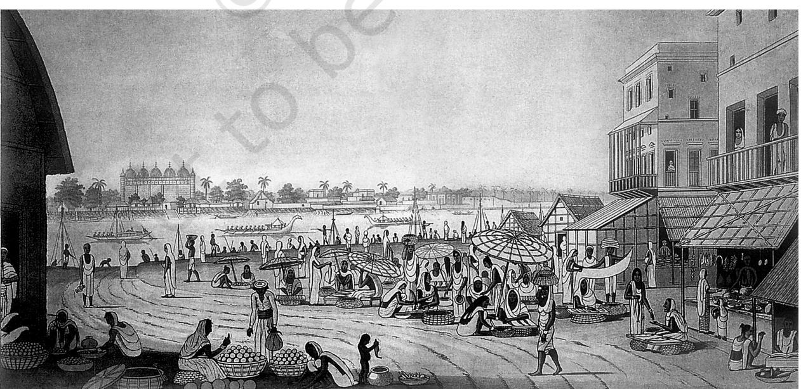
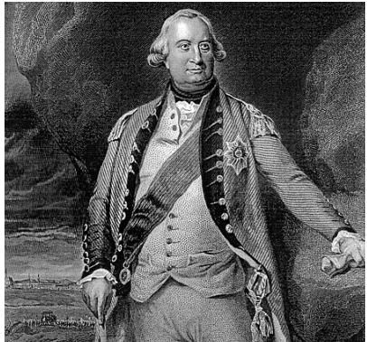
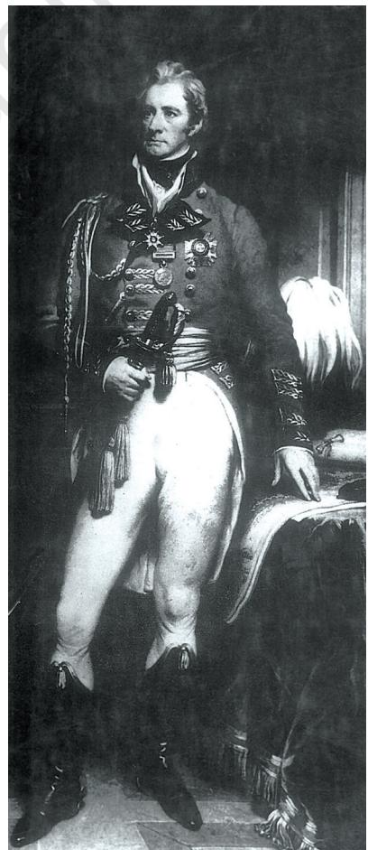
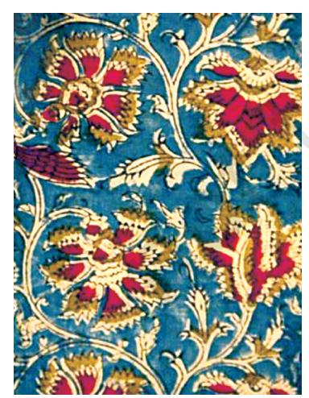
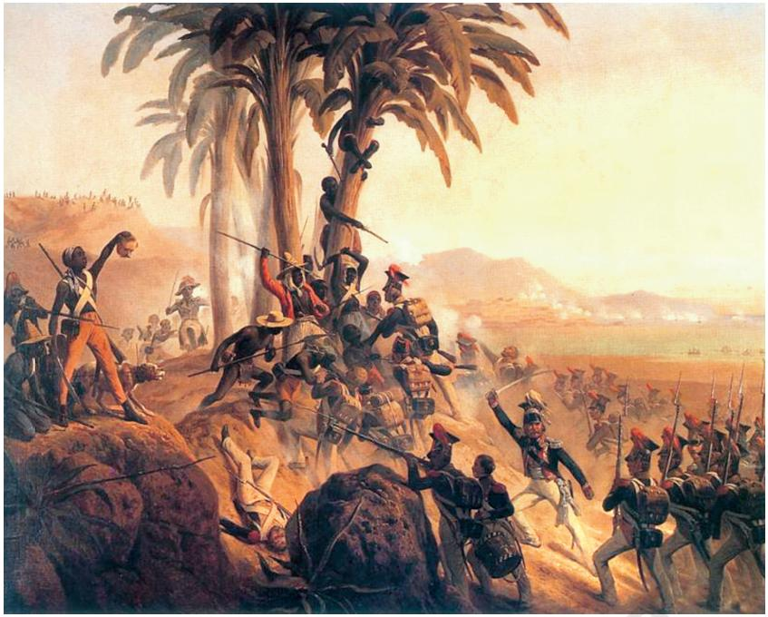
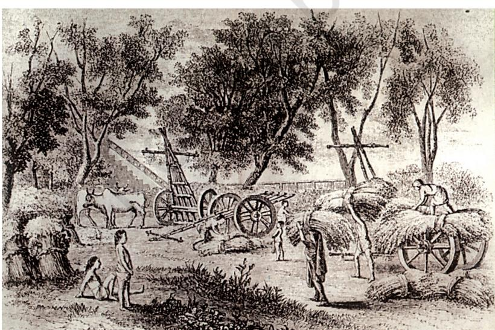
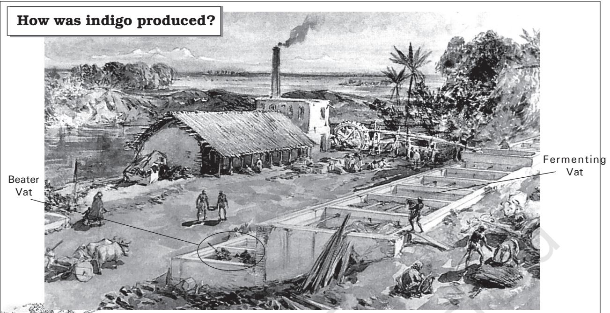
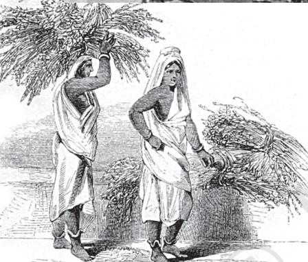
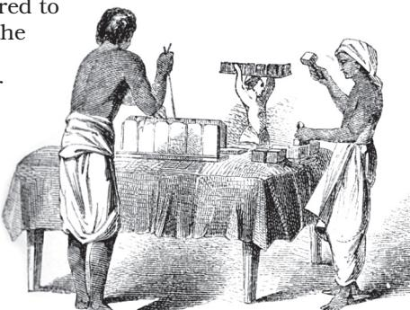

# **3 Ruling the Countryside**

*Fig. 1 – Robert Clive accepting the Diwani of Bengal, Bihar and Orissa from the Mughal ruler in 1765*

## **The Company Becomes the Diwan**

On 12 August 1765, the Mughal emperor appointed the East India Company as the Diwan of Bengal. The actual event most probably took place in Robert Clive's tent, with a few Englishmen and Indians as witnesses. But in the painting above, the event is shown as a majestic occasion, taking place in a grand setting. The painter was commissioned by Clive to record the memorable events in Clive's life. The grant of Diwani clearly was one such event in British imagination.

As Diwan, the Company became the chief financial administrator of the territory under its control. Now it had to think of administering the land and organising its revenue resources. This had to be done in a way that could yield enough revenue to meet the growing expenses of the company. A trading company had also to ensure that it could buy the products it needed and sell what it wanted.

chap 1-4.indd 26 4/22/2022 2:49:47 PM

Over the years, the Company also learnt that it had to move with some caution. Being an alien power, it needed to pacify those who in the past had ruled the countryside, and enjoyed authority and prestige. Those who had held local power had to be controlled but they could not be entirely eliminated.

How was this to be done? In this chapter we will see how the Company came to colonise the countryside, organise revenue resources, redefine the rights of people, and produce the crops it wanted.

#### Revenue for the Company

The Company had become the Diwan, but it still saw itself primarily as a trader. It wanted a large revenue income but was unwilling to set up any regular system of assessment and collection. The effort was to increase the revenue as much as it could and buy fine cotton and silk cloth as cheaply as possible. Within five years, the value of goods bought by the Company in Bengal doubled. Before 1765, the Company had purchased goods in India by importing gold and silver from Britain. Now the revenue collected in Bengal could finance the purchase of goods for export.

Soon it was clear that the Bengal economy was facing a deep crisis. Artisans were deserting villages since they were being forced to sell their goods to the Company at low prices. Peasants were unable to pay the dues that were being demanded from them. Artisanal production was in decline, and agricultural cultivation showed signs of collapse. Then in 1770, a terrible famine killed ten million people in Bengal. About one-third of the population was wiped out.

<i>Fig. 2 *– A weekly market in Murshidabad in Bengal* Peasants and artisans from rural areas regularly came to these weekly markets (*haats*) to sell their goods and buy what they needed. These markets were badly affected during times of economic crisis.

chap 1-4.indd 27 4/22/2022 2:49:47 PM

*Fig. 3 – Charles Cornwallis*  Cornwallis was the Governor-General of Bengal when the Permanent Settlement was introduced.

#### **Source 1**

## Colebrook on Bengal ryots

In many villages of Bengal, some of the powerful *ryots* did not cultivate, but instead gave out their lands to others (the under-tenants), taking from them very high rents. In 1806, H. T. Colebrook described the conditions of these under-tenants in Bengal:

> The under-tenants, depressed by an excessive rent in kind, and by usurious returns for the cattle, seed, and subsistence, advanced to them, can never extricate themselves from debt. In so abject a state, they cannot labour in spirit, while they earn a scanty subsistence without hope of bettering their situation.

#### The need to improve agriculture

If the economy was in ruins, could the Company be certain of its revenue income? Most Company officials began to feel that investment in land had to be encouraged and agriculture had to be improved.

How was this to be done? After two decades of debate on the question, the Company finally introduced the Permanent Settlement in 1793. By the terms of the settlement, the rajas and *taluqdars* were recognised as zamindars. They were asked to collect rent from the peasants and pay revenue to the Company. The amount to be paid was fixed permanently, that is, it was not to be increased ever in future. It was felt that this would ensure a regular flow of revenue into the Company's coffers and at the same time encourage the zamindars to invest in improving the land. Since the revenue demand of the state would not be increased, the zamindar would benefit from increased production from the land.

#### The problem

The Permanent Settlement, however, created problems. Company officials soon discovered that the zamindars were in fact not investing in the improvement of land. The revenue that had been fixed was so high that the zamindars found it difficult to pay. Anyone who failed to pay the revenue lost his zamindari. Numerous zamindaris were sold off at auctions organised by the Company.

By the first decade of the nineteenth century, the situation changed. The prices in the market rose and cultivation slowly expanded. This meant an increase in the income of the zamindars but no gain for the Company since it could not increase a revenue demand that had been fixed permanently.

Even then the zamindars did not have an interest in improving the land. Some had lost their lands in the earlier years of the settlement; others now saw the possibility of earning without the trouble and risk of investment. As long as the zamindars could give out the land to tenants and get rent, they were not interested in improving the land.

## **Activity**

Why do you think Colebrook is concerned with the conditions of the under-ryots in Bengal? Read the preceding pages and suggest possible reasons.

chap 1-4.indd 28 6/14/2022 2:39:26 PM

On the other hand, in the villages, the cultivator found the system extremely oppressive. The rent he paid to the zamindar was high and his right on the land was insecure. To pay the rent he had to often take a loan from the moneylender, and when he failed to pay the rent, he was evicted from the land he had cultivated for generations.

#### A new system is devised

By the early nineteenth century, many of the Company officials were convinced that the system of revenue had to be changed again. How could revenues be fixed permanently at a time when the Company needed more money to meet its expenses of administration and trade?

In the North Western Provinces of the Bengal Presidency (most of this area is now in Uttar Pradesh), an Englishman called Holt Mackenzie devised the new system which came into effect in 1822. He felt that the village was an important social institution in north Indian society and needed to be preserved. Under his directions, collectors went from village to village, inspecting the land, measuring the fields, and recording the customs and rights of different groups. The estimated revenue of each plot within a village was added up to calculate the revenue that each village (*mahal*) had to pay. This demand was to be revised periodically, not permanently fixed. The charge of collecting the revenue and paying it to the Company was given to the village headman, rather than the zamindar. This system came to be known as the *mahalwari* settlement.

#### The Munro system

In the British territories in the South, there was a similar move away from the idea of Permanent Settlement. The new system that was devised came to be known as the *ryotwar* (or *ryotwari* ). It was tried on a small scale by Captain Alexander Read in some of the areas that were taken over by the Company after the wars with Tipu Sultan. Subsequently developed by Thomas Munro, this system was gradually extended all over south India.

Read and Munro felt that in the south there were no traditional zamindars. The settlement, they argued, had to be made directly with the cultivators (*ryots*) who had tilled the land for generations. Their fields had to be carefully and separately surveyed before the revenue assessment was made. Munro thought that the British *Mahal* – In British revenue records, *mahal* is a revenue estate which may be a village or a group of villages.

*Fig. 4 – Thomas Munro, Governor of Madras (1819 –26)* 

chap 1-4.indd 29 4/22/2022 2:49:49 PM

## **Activity**

Imagine that you are a Company representative sending a report back to England about the conditions in rural areas under Company rule. What would you write?

should act as paternal father figures protecting the *ryots* under their charge.

#### All was not well

Within a few years after the new systems were imposed, it was clear that all was not well with them. Driven by the desire to increase the income from land, revenue officials fixed too high a revenue demand. Peasants were unable to pay, *ryots* fled the countryside, and villages became deserted in many regions. Optimistic officials had imagined that the new systems would transform the peasants into rich enterprising farmers. But this did not happen.

### **Crops for Europe**

The British also realised that the countryside could not only yield revenue, it could also grow the crops that Europe required. By the late eighteenth century, the Company was trying its best to expand the cultivation of opium and indigo. In the century and a half that followed, the British persuaded or forced cultivators in various parts of India to produce other crops: jute in Bengal, tea in Assam, sugarcane in the United Provinces (now Uttar Pradesh), wheat in Punjab, cotton in Maharashtra and Punjab, rice in Madras.

How was this done? The British used a variety of methods to expand the cultivation of crops that they needed. Let us take a closer look at the story of one such crop, one such method of production.

*twentieth-century India*

thing common in the *Fig. 5 – A* kalamkari *print, Fig. 6 – A Morris cotton print, latenineteenth-century England*

#### Does colour have a history?

Figs. 5 and 6 are two images of cotton prints. The image on the left (Fig. 5) shows a *kalamkari* print created by weavers of Andhra Pradesh in India. On the right is a floral cotton print designed and produced by William Morris, a famous poet and artist of nineteenth-century Britain. There is one

chap 1-4.indd 30 4/22/2022 2:49:53 PM

two prints: both use a rich blue colour – commonly called indigo. Do you know how this colour was produced?

The blue that you see in these prints was produced from a plant called indigo. It is likely that the blue dye used in the Morris prints in nineteenth-century Britain was manufactured from indigo plants cultivated in India. For India was the biggest supplier of indigo in the world at that time.

#### Why the demand for Indian indigo?

The indigo plant grows primarily in the tropics. By the thirteenth century, Indian indigo was being used by cloth manufacturers in Italy, France and Britain to dye cloth.

However, only small amounts of Indian indigo reached the European market and its price was very high. European cloth manufacturers therefore had to depend on another plant called woad to make violet and blue dyes. Being a plant of the temperate zones, woad was more easily available in Europe. It was grown in northern Italy, southern France and in parts of Germany and Britain. Worried by the competition from indigo, woad producers in Europe pressurised their governments to ban the import of indigo.

Cloth dyers, however, preferred indigo as a dye. Indigo produced a rich blue colour, whereas the dye from woad was pale and dull. By the seventeenth century, European cloth producers persuaded their governments to relax the ban on indigo import. The French began cultivating indigo in St Domingue in the Caribbean islands, the Portuguese in Brazil, the English in Jamaica, and the Spanish in Venezuela. Indigo plantations also came up in many parts of North America.

By the end of the eighteenth century, the demand for Indian indigo grew further. Britain began to industrialise, and its cotton production expanded dramatically, creating an enormous new demand for cloth dyes. While the demand for indigo increased, its existing supplies from the West Indies and America collapsed for a variety of reasons. Between 1783 and 1789, the production of indigo in the world fell by half. Cloth dyers in Britain now desperately looked for new sources of indigo supply.

From where could this indigo be procured?

#### Britain turns to India

Faced with the rising demand for indigo in Europe, the Company in India looked for ways to expand the area under indigo cultivation.

Plantation – A large farm operated by a planter employing various forms of forced labour. Plantations are associated with the production of coffee, sugarcane, tobacco, tea and cotton.

chap 1-4.indd 31 4/22/2022 2:49:53 PM

#### *Fig. 7 – The Slave Revolt in St Domingue, August 1791, painting by January Scuhodolski*

In the eighteenth century, French planters produced indigo and sugar in the French colony of St Domingue in the Caribbean islands. The African slaves who worked on the plantations rose in rebellion in 1791, burning the plantations and killing their rich planters. In 1792, France abolished slavery in the French colonies. These events led to the collapse of the indigo plantations on the Caribbean islands.

Slave – A person who is owned by someone else – the slave owner. A slave has no freedom and is compelled to work for the master.

From the last decades of the eighteenth century, indigo cultivation in Bengal expanded rapidly and Bengal indigo came to dominate the world market. In 1788, only about 30 per cent of the indigo imported into Britain was from India. By 1810, the proportion had gone up to 95 per cent.

As the indigo trade grew, commercial agents a n d o f f i c i a l s o f t h e Company began investing in indigo production. Over the years many Company officials left their jobs to look after their indigo business. Attracted by

the prospect of high profits, numerous Scotsmen and Englishmen came to India and became planters. Those who had no money to produce indigo could get loans from the Company and the banks that were coming up at the time.

#### How was indigo cultivated?

There were two main systems of indigo cultivation – *nij* and *ryoti*. Within the system of *nij* cultivation, the planter produced indigo in lands that he directly controlled. He either bought the land or rented it from other zamindars and produced indigo by directly employing hired labourers.

#### The problem with *nij* cultivation

The planters found it difficult to expand the area under *nij* cultivation. Indigo could be cultivated only on fertile lands, and these were all already densely populated. Only small plots scattered over the landscape could be acquired. Planters needed large areas in compact blocks to cultivate indigo in plantations. Where could they get such land from? They attempted to lease in the land around the indigo factory, and evict the peasants from the area. But this always led to conflicts and tension.

Nor was labour easy to mobilise. A large plantation required a vast number of hands to operate. And labour was needed precisely at a time when peasants were usually busy with their rice cultivation.

chap 1-4.indd 32 4/22/2022 2:49:55 PM

*Nij* cultivation on a large scale also required many ploughs and bullocks. One *bigha* of indigo cultivation required two ploughs. This meant that a planter with 1,000 *bighas* would need 2,000 ploughs. Investing on purchase and maintenance of ploughs was a big problem. Nor could supplies be easily got from the peasants since their ploughs and bullocks were busy on their rice fields, again exactly at the time that the indigo planters needed them.

Till the late nineteenth century, planters were therefore reluctant to expand the area under *nij* cultivation. Less than 25 per cent of the land producing indigo was under this system. The rest was under an alternative mode of cultivation – the *ryoti* system.

#### Indigo on the land of *ryots*

Under the *ryoti* system, the planters forced the *ryots* to sign a contract, an agreement (*satta*). At times they pressurised the village headmen to sign the contract on behalf of the *ryots*. Those who signed the contract got cash advances from the planters at low rates of interest to produce indigo. But the loan committed the *ryot* to cultivating indigo on at least 25 per cent of the area under his holding. The planter provided the seed and the drill, while the cultivators prepared the soil, sowed the seed and looked after the crop. *Fig. 8* – *Workers harvesting* 

*Bigha* – A unit of measurement of land. Before British rule, the size of this area varied. In Bengal the British standardised it to about one-third of an acre.

*indigo in early-nineteenth-century Bengal. From Colesworthy Grant,*  Rural Life in Bengal, *1860*  In India the indigo plant was cut mostly by men.

*Fig. 9 – The Indigo plant being brought from the fields to the factory*

chap 1-4.indd 33 4/22/2022 2:49:56 PM

*Fig. 11 – Women usually carried the indigo plant to the vats.* 

#### *Fig. 12 – The Vat-Beater*

The indigo worker here is standing with the paddle that was used to stir the solution in the vat. These workers had to remain in waistdeep water for over eight hours to beat the indigo solution.

Vat – A fermenting or storage vessel

*Fig. 10 – An indigo factory located near indigo fields, painting by William Simpson, 1863*

The indigo villages were usually around indigo factories owned by planters. After harvest, the indigo plant was taken to the vats in the indigo factory. Three or four vats were needed to manufacture the dye. Each vat had a separate function. The leaves stripped off the indigo plant were first soaked in warm water in a vat (known as the fermenting or steeper vat) for several hours. When the plants fermented, the liquid began to boil and bubble. Now the rotten leaves were taken out and the liquid drained into another vat that was placed just below the first vat.

In the second vat (known as the beater vat), the solution was continuously stirred and beaten with paddles. When the liquid gradually turned green and then blue, lime water was added to the vat. Gradually the indigo separated out in flakes, a muddy sediment settled at the bottom of the vat and a clear liquid rose to the surface. The liquid was drained off and the sediment –

> the indigo pulp – transferred to another vat (known as the settling vat), and then pressed and dried for sale.

*Fig. 13 – The indigo is ready for sale*

Here you can see the last stage of the production – workers stamping and cutting the indigo pulp that has been pressed and moulded. In the background you can see a worker carrying away the blocks for drying.

chap 1-4.indd 34 4/22/2022 2:49:59 PM

When the crop was delivered to the planter after the harvest, a new loan was given to the *ryot*, and the cycle started all over again. Peasants who were initially tempted by the loans soon realised how harsh the system was. The price they got for the indigo they produced was very low and the cycle of loans never ended.

There were other problems too. The planters usually insisted that indigo be cultivated on the best soils in which peasants preferred to cultivate rice. Indigo, moreover, had deep roots and it exhausted the soil rapidly. After an indigo harvest the land could not be sown with rice.

### **The "Blue Rebellion" and After**

In March 1859, thousands of *ryots* in Bengal refused to grow indigo. As the rebellion spread, *ryots* refused to pay rents to the planters, and attacked indigo factories armed with swords and spears, bows and arrows. Women turned up to fight with pots, pans and kitchen implements. Those who worked for the planters were socially boycotted, and the *gomasthas* – agents of planters – who came to collect rent were beaten up. *Ryots* swore they would no longer take advances to sow indigo nor be bullied by the planters' *lathiyals* – the lathi-wielding strongmen maintained by the planters.

Why did the indigo peasants decide that they would no longer remain silent? What gave them the power to rebel? Clearly, the indigo system was intensely oppressive. But those who are oppressed do not always rise up in rebellion. They do so only at times.

In 1859, the indigo *ryots* felt that they had the support of the local zamindars and village headmen in their rebellion against the planters. In many villages, headmen who had been forced to sign indigo contracts, mobilised the indigo peasants and fought pitched battles with the *lathiyals*. In other places even the zamindars went around villages urging the *ryots* to resist the planters. These zamindars were unhappy with the increasing power of the planters and angry at being forced by the planters to give them land on long leases.

The indigo peasants also imagined that the British government would support them in their struggle against the planters. After the Revolt of 1857, the British government was particularly worried about the possibility of another popular rebellion. When the news spread of a simmering revolt in the indigo districts, **Source 2**

## A song from an indigo-producing village

In the moments of struggle, people often sing songs to inspire each other and to build a sense of collective unity. Such songs give us a glimpse of their feelings. During the indigo rebellion, many such songs could be heard in the villages of lower Bengal. Here is one such song:

The long lathis wielded by the planter of Mollahati / now lie in a cluster

The babus of Kolkata have sailed down /to see the great fight

- This time the *raiyats* are all ready, / they will no longer be beaten in silence
They will no longer give up their life / without fighting the *lathiyals*.

chap 1-4.indd 35 4/22/2022 2:49:59 PM

the Lieutenant Governor toured the region in the winter of 1859. The *ryots* saw the tour as a sign of government sympathy for their plight. When in Barasat, the magistrate Ashley Eden issued a notice stating that *ryots* would not be compelled to accept indigo contracts, word went around that Queen Victoria had declared that indigo need not be sown. Eden was trying to placate the peasants and control an explosive situation, but his action was read as support for the rebellion.

As the rebellion spread, intellectuals from Calcutta rushed to the indigo districts. They wrote of the misery of the *ryots*, the tyranny of the planters, and the horrors of the indigo system.

Worried by the rebellion, the government brought in the military to protect the planters from assault, and set up the Indigo Commission to enquire into the system of indigo production. The Commission held the planters guilty, and criticised them for the coercive methods they used with indigo cultivators. It declared that indigo production was not profitable for *ryots*. The Commission asked the *ryots* to fulfil their existing contracts but also told them that they could refuse to produce indigo in future.

#### **Source 3**

### "I would rather beg than sow indigo"

Hadji Mulla, an indigo cultivator of Chandpore, Thana Hardi, was interviewed by the members of the Indigo Commission on Tuesday, 5 June 1860. This is what he said in answer to some of the questions:

> **W. S. Seton Karr, President of the Indigo Commission:** Are you now willing to sow indigo; and if not on what fresh terms would you be willing to do it?

> **Hadji Mulla:** I am not willing to sow, and I don't know that any fresh terms would satisfy me.

> **Mr Sale:** Would you not be willing to sow at a rupee a bundle?

> **Hadji Mulla:** No I would not; rather than sow indigo I will go to another country; I would rather beg than sow indigo.

> > *Indigo Commission Report, Vol. II, Minutes of Evidence, p. 67*

## **Activity**

Imagine you are a witness giving evidence before the Indigo Commission. W.S. Seton Karr asks you "On what condition will *ryots* grow indigo?" What will your answer be?

chap 1-4.indd 36 4/22/2022 2:50:00 PM

After the revolt, indigo production collapsed in Bengal. But the planters now shifted their operation to Bihar. With the discovery of synthetic dyes in the late nineteenth century, their business was severely affected, but yet they managed to expand production. When Mahatma Gandhi returned from South Africa, a peasant from Bihar persuaded him to visit Champaran and see the plight of the indigo cultivators there. Mahatma Gandhi's visit in 1917 marked the beginning of the Champaran movement against the indigo planters.

## **Let's recall**

- 1. Match the following:

| ryot | village |
| --- | --- |
| mahal | peasant |
| nij | cultivation on ryot's lands |
| ryoti | cultivation on planter's own land |

- 2. Fill in the blanks:
	- (a) Growers of woad in Europe saw __________ as a crop which would provide competition to their earnings.
	- (b) The demand for indigo increased in late eighteenth-century Britain because of __________.
	- (c) The international demand for indigo was affected by the discovery of __________.
	- (d) The Champaran movement was against

**Let's discuss**

__________.

- 3. Describe the main features of the Permanent Settlement.
- 4. How was the mahalwari system different from the Permanent Settlement?

chap 1-4.indd 37 4/22/2022 2:50:01 PM

## **Let's imagine**

Imagine a conversation between a planter and a peasant who is being forced to grow indigo. What reasons would the planter give to persuade the peasant? What problems would the peasant point out? Enact their conversation.

- 5. Give two problems which arose with the new Munro system of fixing revenue.
- 6. Why were ryots reluctant to grow indigo?
- 7. What were the circumstances which led to the eventual collapse of indigo production in Bengal?

## **Let's do**

- 8. Find out more about the Champaran movement and Mahatma Gandhi's role in it.
- 9. Look into the history of either tea or coffee plantations in India. See how the life of workers in these plantations was similar to or different from that of workers in indigo plantations.

chap 1-4.indd 38 4/22/2022 2:50:03 PM

