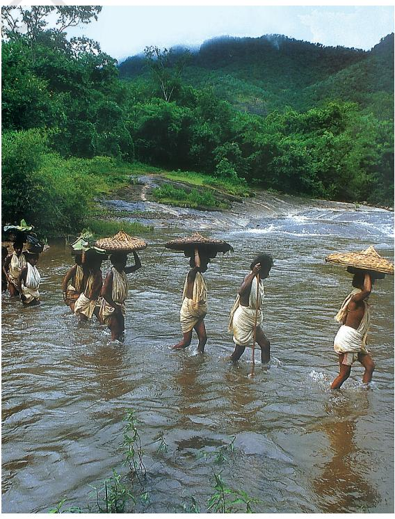
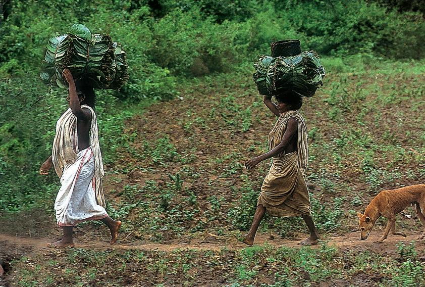
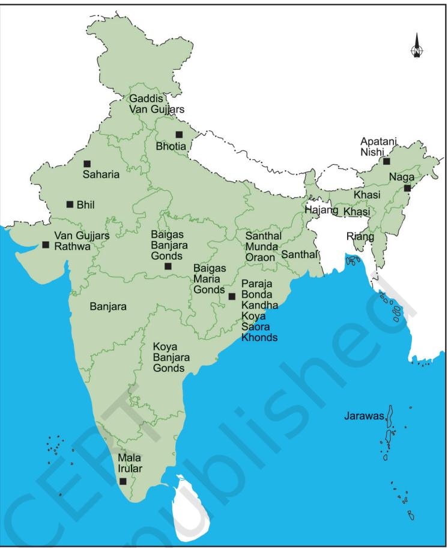
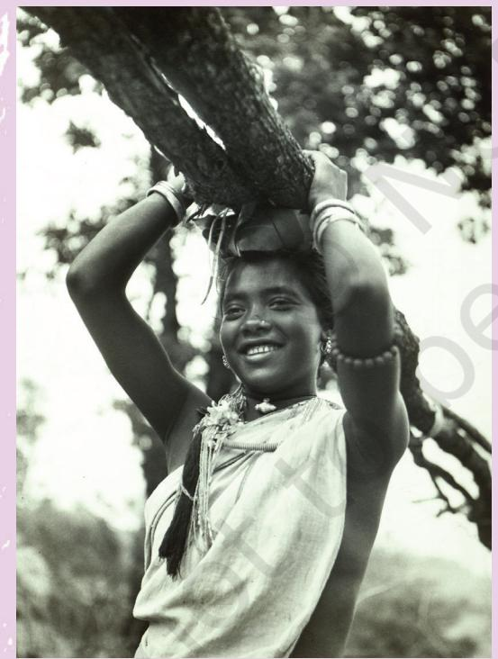
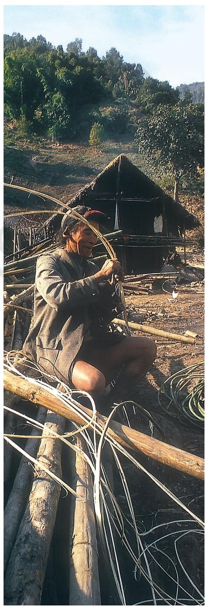
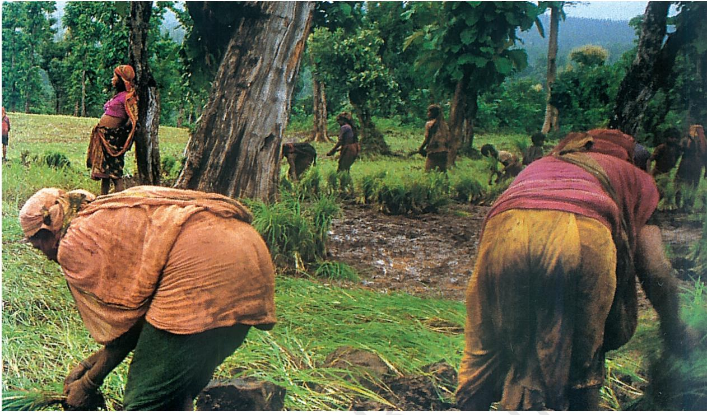
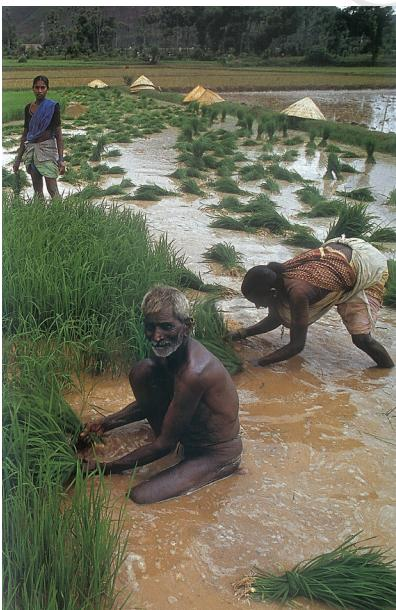
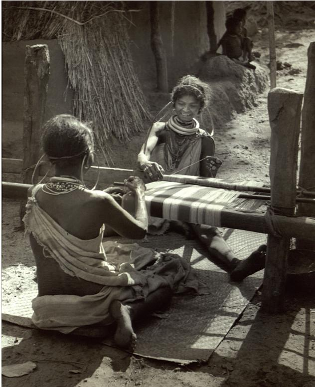
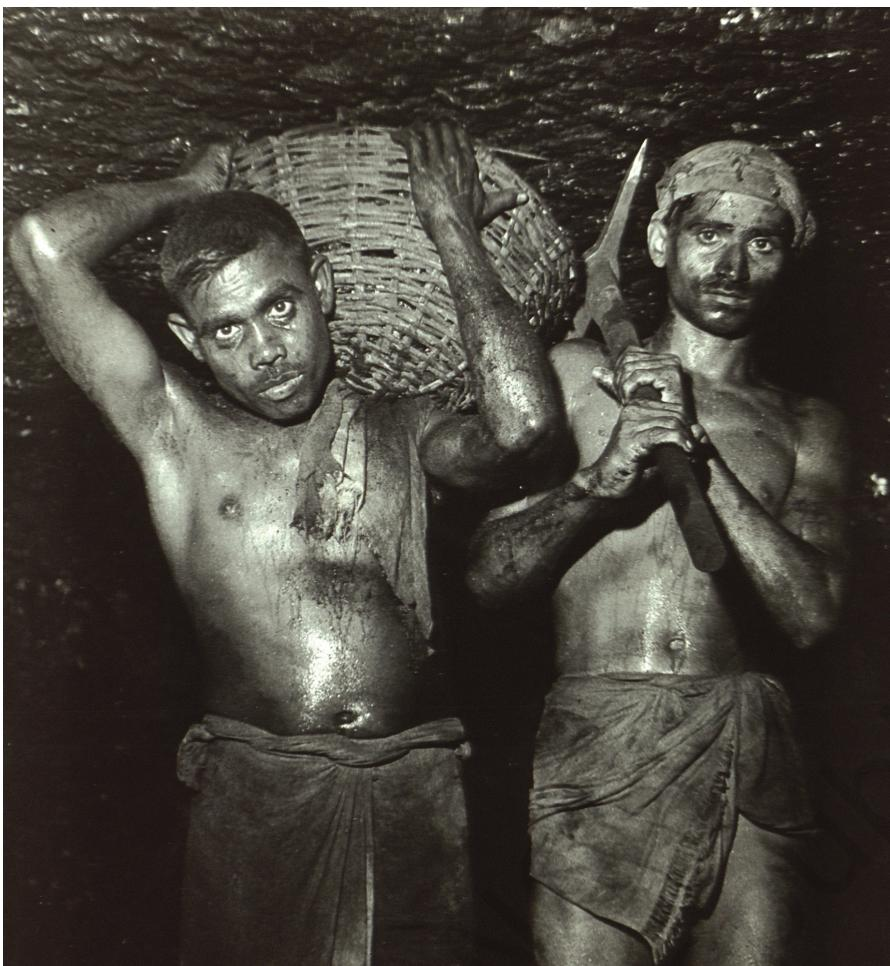
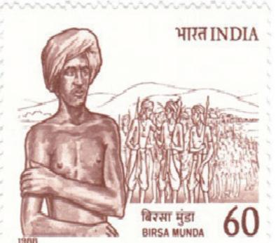

# **Tribals,** *Dikus* **and the Vision of a Golden Age**

In 1895, a man named Birsa was seen roaming the forests and villages of Chottanagpur in Jharkhand. People said he had miraculous powers – he could cure all diseases and multiply grain. Birsa himself declared that God had appointed him to save his people from trouble, free them from the slavery of *dikus* (outsiders). Soon thousands began following Birsa, believing that he was *bhagwan* (God) and had come to solve all their problems.

Birsa was born in a family of Mundas – a tribal group that lived in Chottanagpur. But his followers included other tribals of the region – Santhals and Oraons. All of them in different ways were unhappy with the changes they were experiencing and the problems they were facing under British rule. Their familiar ways of life seemed to be

disappearing, their livelihoods were under threat, and their religion appeared to be in danger.

What problems did Birsa set out to resolve? Who were the outsiders being referred to as *dikus*, and how did they enslave the people of the region? What was happening to the tribal people under the British? How did their lives change? These are some of the questions you will read about in this chapter.

You have read about tribal societies last year. Most tribes had customs and rituals that were very different from those laid down by Brahmans. These societies also did not have the sharp social divisions that were characteristic of caste societies. All those who belonged to the same tribe thought of themselves as sharing common ties of kinship. However, this did not mean that there were no social and economic differences within tribes.

*Fig. 1 – Women of the Dongria Kandha tribe in Orissa wade through the river on the way to the market*

chap 1-4.indd 39 4/22/2022 2:50:04 PM

Fallow – A field left uncultivated for a while so that the soil recovers fertility

*Sal* – A tree

*Mahua* – A flower that is eaten or used to make alcohol

#### *Fig. 2 – Dongria Kandha women in Orissa take home* pandanus *leaves from the forest to make plates*

### **How did Tribal Groups Live?**

By the nineteenth century, tribal people in different parts of India were involved in a variety of activities.

#### Some were *jhum* cultivators

Some of them practised *jhum* cultivation, that is, shifting cultivation. This was done on small patches of land, mostly in forests. The cultivators cut the treetops to allow sunlight to reach the ground, and burnt the vegetation on the land to clear it for cultivation. They spread the ash from the firing, which contained potash, to fertilise the soil. They used the axe to cut trees and the hoe to scratch the soil in order to prepare it for cultivation. They broadcast the seeds, that is, scattered the seeds on the field instead of ploughing the land and sowing the seeds. Once the crop was ready and harvested, they moved to another field. A field that had been cultivated once was left fallow for several years,

Shifting cultivators were found in the hilly and forested tracts of north-east and central India. The lives of these tribal people depended on free movement within forests and on being able to use the land and forests for growing their crops. That is the only way they could practise shifting cultivation.

#### Some were hunters and gatherers

In many regions, tribal groups lived by hunting animals and gathering forest produce. They saw forests as essential for survival. The Khonds were such a community living in the forests of Orissa. They regularly went out on collective hunts and then divided the meat

amongst themselves. They ate fruits and roots collected from the forest and cooked food with the oil they extracted from the seeds of the *sal* and *mahua*. They used many forest shrubs and herbs for medicinal purposes, and sold forest produce in the local markets. The local weavers and leather workers turned to the Khonds when they needed supplies of *kusum* and *palash* flowers to colour their clothes and leather.

#### 40 OUR PASTS – III

chap 1-4.indd 40 4/22/2022 2:50:05 PM

From where did these forest people get their supplies of rice and other grains? At times they exchanged goods – getting what they needed in return for their valuable forest produce. At other times, they bought goods with the small amount of earnings they had. Some of them did odd jobs in the villages, carrying loads or building roads, while others laboured in the fields of peasants and farmers. When supplies of forest produce shrank, tribal people had to increasingly wander around in search of work as labourers. But many of them – like the Baigas of central India – were reluctant to do work for others. The Baigas saw themselves as people of the forest, who could only live on the produce of the forest. It was below the dignity of a Baiga to become a labourer.

Tribal groups often needed to buy and sell in order to be able to get the goods that were

not produced within the locality. This led to their dependence on traders and moneylenders. Traders came around with things for sale, and sold the goods at high prices. Moneylenders gave loans with which the tribals met their cash needs, adding to what they earned. But the interest charged on the loans was usually very high. So for the tribals, market and commerce often meant debt and poverty. They therefore came to see the moneylender and trader as evil outsiders and the cause of their misery.

#### Some herded animals

Many tribal groups lived by herding and rearing animals. They were pastoralists who moved with their herds of cattle or sheep according to the seasons. When the grass in one place was exhausted, they moved to another area. The Van Gujjars of the Punjab hills and the Labadis of Andhra Pradesh were cattle herders, the Gaddis of Kulu were shepherds, and the Bakarwals of Kashmir reared goats. You will read more about them in your history book next year.

*Fig. 3 – Location of some tribal groups in India*

chap 1-4.indd 41 4/22/2022 2:50:06 PM

### A time to hunt, a time to sow, a time to move to a new field

Have you ever noticed that people living in different types of societies do not share the same notion of work and time? The lives of the shifting cultivators and hunters in different regions were regulated by a calendar and division of tasks for men and women.

Verrier Elwin, a British anthropologist who lived among the Baigas and Khonds of central India for many years in the 1930s and 1940s, gives us a picture of what this calendar and division of tasks was like. He writes:

In *Chait* women went to clearings to ... cut stalks that were already reaped; men cut large trees and go for their ritual hunt. The hunt began at full moon from the east. Traps of bamboo were used for hunting. The women gathered fruits like sago, tamarind and mushroom. Baiga women can only gather roots or *kanda* and *mahua* seeds. Of all the *adivasis* in Central India, the Baigas were known as the best hunters … In *Baisakh* the firing of the forest took place, the women gathered unburnt wood to burn. Men continued to hunt, but nearer their villages. In *Jeth* sowing took place and hunting still went on. From *Asadh* to *Bhadon* the men worked in the fields. In *Kuar* the first fruits of beans were ripened and in *Kartik kutki* became ripe. In *Aghan* every crop was ready and in *Pus* winnowing took place. *Pus* was also

*Fig. 4 – A Santhal girl carrying firewood, Bihar, 1946* Children go with their mothers to the forest to gather forest produce.

the time for dances and marriages. In *Magh* shifts were made to new *bewars* and hunting-gathering was the main subsistence activity.

The cycle described above took place in the first year. In the second year there was more time for hunting as only a few crops had to be sown and harvested. But since there was enough food the men lived in the *bewars*. It was only in the third year that the diet had to be supplemented with the forest products.

*Adapted from Verrier Elwin,* Baiga *(1939) and Elwin's unpublished 'Notes on the Khonds' (Verrier Elwin Papers, Nehru Memorial Museum and Library)*

### **Activity**

Look carefully at the tasks that Baiga men and women did. Do you see any pattern? What were the differences in the types of work that they were expected to perform?

chap 1-4.indd 42 4/22/2022 2:50:08 PM

#### Some took to settled cultivation

Even before the nineteenth century, many from within the tribal groups had begun settling down, and cultivating their fields in one place year after year, instead of moving from place to place. They began to use the plough, and gradually got rights over the land they lived on. In many cases, like the Mundas of Chottanagpur, the land belonged to the clan as a whole. All members of the clan were regarded as descendants of the original settlers, who had first cleared the land. Therefore, all of them had rights on the land. Very often some people within the clan acquired more power than others, some became chiefs and others followers. Powerful men often rented out their land instead of cultivating it themselves.

British officials saw settled tribal groups like the Gonds and Santhals as more civilised than hunter-gatherers or shifting cultivators. Those who lived in the forests were considered to be wild and savage: they needed to be settled and civilised.

### **How did Colonial Rule Affect Tribal Lives?**

The lives of tribal groups changed during British rule. Let us see what these changes were.

#### What happened to tribal chiefs?

Before the arrival of the British, in many areas the tribal chiefs were important people. They enjoyed a certain amount of economic power and had the right to administer and control their territories. In some places they had their own police and decided on the local rules of land and forest management. Under British rule, the functions and powers of the tribal chiefs changed considerably. They were allowed to keep their land titles over a cluster of villages and rent out lands, but they lost much of their administrative power and were forced to follow laws made by British officials in India. They also had to pay tribute to the British, and discipline the tribal groups on behalf of the British. They lost the authority they had earlier enjoyed amongst their people, and were unable to fulfil their traditional functions.

#### What happened to the shifting cultivators?

The British were uncomfortable with groups who moved about and did not have a fixed home. They wanted tribal *Bewar* – A term used in Madhya Pradesh for shifting cultivation

*Fig. 5 – A log house being built in a village of the Nyishi tribes of Arunachal Pradesh.* The entire village helps when log huts are built.

chap 1-4.indd 43 4/22/2022 2:50:09 PM

*Fig. 6 – Bhil women cultivating in a forest in Gujarat* Shifting cultivation continues in many forest areas of Gujarat. You can see that trees have been cut and land cleared to create patches for cultivation.

groups to settle down and become peasant cultivators. Settled peasants were easier to control and administer than people who were always on the move. The British also wanted a regular revenue source for the state. So they introduced land settlements – that is, they measured the land, defined the rights of each individual to that land, and fixed the revenue demand for the state. Some peasants were declared landowners, others tenants. As you have seen (Chapter 2), the tenants were to pay rent to the landowner who in turn paid revenue to the state.

The British effort to settle *jhum* cultivators was not very successful. Settled plough cultivation is not easy in areas where water is scarce and the soil is dry. In fact, *jhum* cultivators who took to plough cultivation often suffered, since their fields did not produce good yields. So the *jhum* cultivators in north-east India insisted on continuing with their traditional practice. Facing widespread protests, the British had to ultimately allow them the right to carry on shifting cultivation in some parts of the forest.

*Fig. 7 – Tribal workers in a rice field in Andhra Pradesh* Note the difference between rice cultivation in the flat plains and in the forests.

chap 1-4.indd 44 4/22/2022 2:50:10 PM

#### Forest laws and their impact

The life of tribal groups, as you have seen, was directly connected to the forest. So changes in forest laws had a considerable effect on tribal lives. The British extended their control over all forests and declared that forests were state property. Some forests were classified as Reserved Forests for they produced timber which the British wanted. In these forests people were not allowed to move freely, practise *jhum* cultivation, collect fruits, or hunt animals. How were *jhum* cultivators to survive in such a situation? Many were therefore forced to move to other areas in search of work and livelihood.

But once the British stopped the tribal people from living inside forests, they faced a problem. From where would the Forest Department get its labour to cut trees for railway sleepers and to transport logs?

Colonial officials came up with a solution. They decided that they would give *jhum* cultivators small patches of land in the forests and allow them to cultivate these on the condition that those who lived in the villages would have to provide labour to the Forest Department and look after the forests. So in many regions, the Forest Department established forest villages to ensure a regular supply of cheap labour.

Sleeper – The horizontal planks of wood on which railway lines are laid

#### **Source 2**

### "In this land of the English how hard it is to live"

In the1930s Verrier Elwin visited the land of the Baigas – a tribal group in central India. He wanted to know about them – their customs and practices, their art and folklore. He recorded many songs that lamented the hard time the Baigas were having under British rule.

> In this land of the English how hard it is to live How hard it is to live In the village sits the landlord In the gate sits the Kotwar In the garden sits the Patwari In the field sits the government

In this land of the English how hard it is to live To pay cattle tax we have to sell cow To pay forest tax we have to sell buffalo To pay land tax we have to sell bullock How are we to get our food? In this land of the English

*Quoted in Verrier Elwin and Shamrao Hivale,* Songs of the Maikal*, p. 316.*

chap 1-4.indd 45 4/22/2022 2:50:10 PM

*Fig. 8 – Godara women weaving*

Many tribal groups reacted against the colonial forest laws. They disobeyed the new rules, continued with practices that were declared illegal, and at times rose in open rebellion. Such was the revolt of Songram Sangma in 1906 in Assam, and the forest satyagraha of the 1930s in the Central Provinces.

#### The problem with trade

During the nineteenth century, tribal groups found that traders and moneylenders were coming into the forests more often, wanting to buy forest produce, offering cash loans, and asking them to work for wages. It took tribal groups some time to understand the consequences of what was happening.

Let us consider the case of the silk growers. In the eighteenth century, Indian silk was in demand in European markets. The fine quality of Indian silk was highly valued and exports from India increased

rapidly. As the market expanded, East India Company officials tried to encourage silk production to meet the growing demand.

> Hazaribagh, in present-day Jharkhand, was an area where the Santhals reared cocoons. The traders dealing in silk sent in their agents who gave loans to the tribal people and collected the cocoons. The growers were paid ` 3 to ` 4 for a thousand

cocoons. These were then exported to Burdwan or Gaya where they were sold at five times the price. The middlemen – so called because they arranged deals between the exporters and silk growers – made huge profits. The silk growers earned very little. Understandably, many tribal groups saw the market and the traders as their main enemies.

*Fig. 9 – A Hajang woman weaving a mat* For women, domestic work was not confined to the home. They carried their babies with them to the fields and the factories.

chap 1-4.indd 46 4/22/2022 2:50:13 PM

#### *Fig. 10 – Coal miners of Bihar, 1948*

In the 1920s, about 50 per cent of the miners in the Jharia and Raniganj coal mines of Bihar were tribals. Work deep down in the dark and suffocating mines was not only back-breaking and dangerous, it was often literally killing. In the 1920s, over 2,000 workers died every year in the coal mines in India.

#### The search for work

The plight of the tribals who had to go far away from their homes in search of work was even worse. From the late nineteenth century, tea plantations started coming up and mining became an important industry. Tribals were recruited in large numbers to work at the tea plantations of Assam and the coal mines of Jharkhand. They were recruited through contractors who paid them miserably low wages, and prevented them from returning home.

#### **Activity**

Find out whether the conditions of work in the mines have changed now. Check how many people die in mines every year, and what are the reasons for their death.

### **A Closer Look**

Through the nineteenth and twentieth centuries, tribal groups in different parts of the country rebelled against the changes in laws, the restrictions on their practices, the new taxes they had to pay, and the exploitation by traders and moneylenders. The Kols rebelled in 1831–32, Santhals rose in revolt in 1855, the Bastar Rebellion in central India broke out in 1910 and the Warli Revolt in Maharashtra in 1940. The movement that Birsa led was one such movement.

chap 1-4.indd 47 4/22/2022 2:50:15 PM

**Source 3**

### 'Blood trickles from my shoulders'

The songs the Mundas sang bemoaned their misery.

> Alas! under [the drudgery of] forced labour

> Blood trickles from my shoulders

Day and night the emissary from the zamindars,

Annoys and irritates me, day and night I groan

> Alas! This is my condition

I do not have a home, where shall I get happiness

Alas!

*K.S. Singh,* Birsa Munda and His Movement*, p.12.*

Vaishnav – Worshippers of Vishnu

Birsa Munda

Birsa was born in the mid-1870s. The son of a poor father, he grew up around the forests of Bohonda, grazing sheep, playing the flute, and dancing in the local *akhara*. Forced by poverty, his father had to move from place to place looking for work. As an adolescent, Birsa heard tales of the Munda uprisings of the past and saw the *sirdars* (leaders) of the community urging the people to revolt. They talked of a golden age when the Mundas had been free of the oppression of *dikus*, and said there would be a time when the ancestral right of the community would be restored. They saw themselves as the descendants of the original settlers of the region, fighting for their land (*mulk ki larai*), reminding people of the need to win back their kingdom.

Birsa went to the local missionary school, and listened to the sermons of missionaries. There too he heard it said that it was possible for the Mundas to attain the Kingdom of Heaven, and regain their lost rights. This would be possible if they became good Christians and gave up their "bad practices". Later Birsa also spent some time in the company of a prominent Vaishnav preacher. He wore the sacred thread, and began to value the importance of purity and piety.

Birsa was deeply influenced by many of the ideas he came in touch with in his growing-up years. His movement was aimed at reforming tribal society. He urged the Mundas to give up drinking liquor, clean their village, and stop believing in witchcraft and sorcery. But we must remember that Birsa also turned against missionaries and landlords. He saw them as outside forces that were ruining the Munda way of life.

In 1895, Birsa urged his followers to recover their glorious past. He talked of a golden age in the past – a *satyug* (the age of truth) – when Mundas lived a good life, constructed embankments, tapped natural springs, planted trees and orchards, practised cultivation to earn their living. They did not kill their brethren and relatives. They lived honestly. Birsa also wanted people to once again work on their land, settle down and cultivate their fields.

What worried British officials most was the political aim of the Birsa movement, for it wanted to drive out missionaries, moneylenders, landlords, and the government and set up a Munda Raj with Birsa at its head. The movement identified all these forces as the cause of the misery the Mundas were suffering.

chap 1-4.indd 48 22-03-2024 11:07:43

The land policies of the British were destroying their traditional land system, landlords and moneylenders were taking over their land, and missionaries were criticising their traditional culture.

As the movement spread the British officials decided to act. They arrested Birsa in 1895, convicted him on charges of rioting and jailed him for two years.

When Birsa was released in 1897, he began touring the villages to gather support. He used traditional symbols and language to rouse people, urging them to destroy "Ravana" (*dikus* and the Europeans) and establish a kingdom under his leadership. Birsa's followers began targeting the symbols of *diku* and European power. They attacked police stations and churches, and raided the property of moneylenders and zamindars. They raised the white flag as a symbol of Birsa Raj.

In 1900, Birsa died of cholera and the movement faded out. However, the movement was significant in at least two ways. First – it forced the colonial government to introduce laws so that the land of the tribals could not be easily taken over by *dikus*. Second – it showed once again that the tribal people had the capacity to protest against injustice and express their anger against colonial rule. They did this in their own specific way, inventing their own rituals and symbols of struggle.

*Postal stamp issued in memory of Birsa Munda*

**Let's recall**

- 1. Fill in the blanks:
____________.

- (a) The British described the tribal people as
- (b) The method of sowing seeds in *jhum* cultivation is known as ____________.
- (c) The tribal chiefs got _________ titles in central India under the British land settlements.
- (d) Tribals went to work in the __________ of Assam and the ____________ in Bihar.

chap 1-4.indd 49 26-03-2024 12:35:31

# **Let's imagine**

Imagine you are a *jhum* cultivator living in a forest village in the nineteenth century. You have just been told that the land you were born on no longer belongs to you. In a meeting with British officials you try to explain the kinds of problems you face. What would you say?

- 2. State whether true or false:
	- (a) Jhum cultivators plough the land and sow seeds.
	- (b) Cocoons were bought from the Santhals and sold by the traders at five times the purchase price.
	- (c) Birsa urged his followers to purify themselves, give up drinking liquor and stop believing in witchcraft and sorcery.
	- (d) The British wanted to preserve the tribal way of life.

**Let's discuss**

- 3. What problems did shifting cultivators face under British rule?
- 4. How did the powers of tribal chiefs change under colonial rule?
- 5. What accounts for the anger of the tribals against the *dikus*?
- 6. What was Birsa's vision of a golden age? Why do you think such a vision appealed to the people of the region?

# **Let's do**

- 7. Find out from your parents, friends or teachers, the names of some heroes of other tribal revolts in the twentieth century. Write their story in your own words.
- 8. Choose any tribal group living in India today. Find out about their customs and way of life, and how their lives have changed in the last 50 years.

chap 1-4.indd 50 4/22/2022 2:50:18 PM

