# **When People Revolt 1857 and After**

*Fig. 1 – Sepoys and peasants gather forces for the revolt that spread across the plains of north India in 1857*

## **Policies and the People**

In the previous chapters you looked at the policies of the East India Company and the effect they had on different people. Kings, queens, peasants, landlords, tribals, soldiers were all affected in different ways. You have also seen how people resist policies and actions that harm their interests or go against their sentiments.

### Nawabs lose their power

Since the mid-eighteenth century, nawabs and rajas had seen their power erode. They had gradually lost their authority and honour. Residents had been stationed in many courts, the freedom of the rulers reduced, their armed forces disbanded, and their revenues and territories taken away by stages.

Many ruling families tried to negotiate with the Company to protect their interests. For example, Rani Lakshmibai of Jhansi wanted the Company to recognise her adopted son as the heir to the kingdom after the death of her husband. Nana Saheb, the adopted son of

Chap 5.indd 51 14-03-2024 11:10:30

Peshwa Baji Rao II, pleaded that he be given his father's pension when the latter died. However, the Company, confident of its superiority and military powers, turned down these pleas.

Awadh was one of the last territories to be annexed. In 1801, a subsidiary alliance was imposed on Awadh, and in 1856 it was taken over. Governor-General Dalhousie declared that the territory was being misgoverned and British rule was needed to ensure proper administration.

The Company even began to plan how to bring the Mughal dynasty to an end. The name of the Mughal king was removed from the coins minted by the Company. In 1849, Governor-General Dalhousie announced that after the death of Bahadur Shah Zafar, the family of the king would be shifted out of the Red Fort and given another place in Delhi to reside in. In 1856, Governor-General Canning decided that Bahadur Shah Zafar would be the last Mughal king and after his death none of his descendants would be recognised as kings – they would just be called princes.

#### The peasants and the sepoys

In the countryside, peasants and zamindars resented the high taxes and the rigid methods of revenue collection. Many failed to pay back their loans to the moneylenders and gradually lost the lands they had tilled for generations.

The Indian sepoys in the employ of the Company also had reasons for discontent. They were unhappy about their pay, allowances and conditions of service. Some of the new rules, moreover, violated their religious sensibilities and beliefs. Did you know that in those days many people in the country believed that if they crossed the sea they would lose their religion and caste? So when in 1824, the sepoys were told to go to Burma by the sea route to fight for the Company, they refused to follow the order, though they agreed to go by the land route. They were severely punished, and since the issue did not die down, in 1856 the Company passed a new law which stated that every new person who took up employment in the Company's army had to agree to serve overseas if required.

Sepoys also reacted to what was happening in the countryside. Many of them were peasants and had families living in the villages. So the anger of the peasants quickly spread among the sepoys.

**Activity** 

> Imagine you are a sepoy in the Company army, advising your nephew not to take employment in the army. What reasons would you give?

Chap 5.indd 52 4/22/2022 2:43:01 PM

#### Responses to reforms

The British believed that Indian society had to be reformed. Laws were passed to stop the practice of sati and to encourage the remarriage of widows. English-language education was actively promoted. After 1830, the Company allowed Christian missionaries to function freely in its domain and even own land and property. In 1850, a new law was passed to make conversion to Christianity easier. This law allowed an Indian who had converted to Christianity to inherit the property of his ancestors. Many Indians began to feel that the British were destroying their religion, their social customs and their traditional way of life.

There were of course other Indians who wanted to change existing social practices. You will read about these reformers and reform movements in Chapter 6.

### **Through the Eyes of the People**

To get a glimpse of what people were thinking those days about British rule, study Sources 1 and 2.

*Fig. 2 – Sepoys exchange news and rumours in the bazaars of north India*

#### **Source 1**

### The list of eighty-four rules

Given here are excerpts from the book *Majha Pravaas*, written by Vishnubhatt Godse, a Brahman from a village in Maharashtra. He and his uncle had set out to attend a *yajna* being organised in Mathura. Vishnubhatt writes that they met some sepoys on the way who told them that they should not proceed on the journey because a massive upheaval was going to break out in three days. The sepoys said:

> the English were determined to wipe out the religions of the Hindus and the Muslims … they had made a list of eighty-four rules and announced these in a gathering of all big kings and princes in Calcutta. They said that the kings refused to accept these rules and warned the English of dire consequences and massive upheaval if these are implemented … that the kings all returned to their capitals in great anger … all the big people began making plans. A date was fixed for the war of religion and the secret plan had been circulated from the cantonment in Meerut by letters sent to different cantonments.

> > *Vishnubhatt Godse,* Majha Pravaas*, pp. 23-24.*

Chap 5.indd 53 14-03-2024 11:11:03

Source 2

### "There was soon excitement in every regiment"

Another account we have from those days are the memoirs of Subedar Sitaram Pande. Sitaram Pande was recruited in 1812 as a sepoy in the Bengal Native Army. He served the English for 48 years and retired in 1860. He helped the British to suppress the uprising though his own son was a rebel and was killed by the British in front of his eyes. On retirement he was persuaded by his Commanding Officer, Norgate, to write his memoirs. He completed the writing in 1861 in Awadhi and Norgate translated it into English and had it published under the title *From Sepoy to Subedar*.

Here is an excerpt from what Sitaram Pande wrote:

It is my humble opinion that this seizing of Oudh filled the minds of the Sepoys with distrust and led them to plot against the Government. Agents of the Nawab of Oudh and also of the King of Delhi were sent all over India to discover the temper of the army. They worked upon the feelings of sepoys, telling them how treacherously the foreigners had behaved towards their king. They invented ten thousand lies and promises to persuade the soldiers to mutiny and turn against their masters, the English, with the object of restoring the Emperor of Delhi to the throne. They maintained that this was wholly within the army's powers if the soldiers would only act together and do as they were advised.

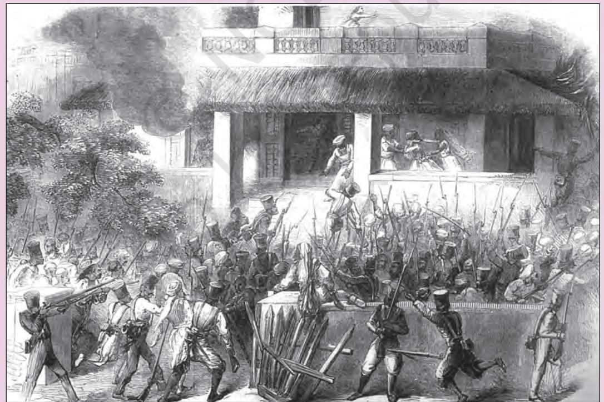

*Fig. 3 – Rebel sepoys at Meerut attack officers, enter their homes and set fire to buildings*

Chap 5.indd 54 14-03-2024 11:11:25

#### **Source 2 contd.**

It chanced that about this time the Sarkar sent parties of men from each regiment to different garrisons for instructions in the use of the new rifle. These men performed the new drill for some time until a report got about by some means or the other, that the cartridges used for these new rifles were greased with the fat of cows and pigs. The men from our regiment wrote to others in the regiment telling them about this, and there was soon excitement in every regiment. Some men pointed out that in forty years' service nothing had ever been done by the Sarkar to insult their religion, but as I have already mentioned the sepoys' minds had been inflamed by the seizure of Oudh. Interested parties were quick to point out that the great aim of the English was to turn us all into Christians, and they had therefore introduced the cartridge in order to bring this about, since both Mahommedans and Hindus would be defiled by using it.

The Colonel sahib was of the opinion that the excitement, which even he could not fail to see, would pass off, as it had done before, and he recommended me to go to my home.

*Sitaram Pande,* From Sepoy to Subedar*, pp. 162-63.*

### **A Mutiny Becomes a Popular Uprising**

Though struggles between rulers and the ruled are not unusual, sometimes such struggles become quite widespread as a popular resistance so that the power of the state breaks down. A very large number of people begin to believe that they have a common enemy and rise up against the enemy at the same time. For such a situation to develop, people have to organise, communicate, take initiative and display the confidence to turn the situation around.

Such a situation developed in the northern parts of India in 1857. After a hundred years of conquest and administration, the English East India Company faced a massive uprising that started in May 1857 and threatened the Company's very presence in India. Sepoys mutinied in several places beginning from Meerut and a large number of people from different sections of society rose up in rebellion. Some regard it as the biggest armed resistance to colonialism in the nineteenth century anywhere in the world.

# **Activity**

- 1. What were the important concerns in the minds of the people according to Sitaram and according to Vishnubhatt?
- 2. What role did they think the rulers were playing? What role did the sepoys seem to play?

Mutiny – When soldiers as a group disobey their officers in the army

Chap 5.indd 55 14-03-2024 11:11:26

#### *Fig. 4 – The battle in the cavalry lines*

On the evening of 3 July 1857, over 3,000 rebels came from Bareilly, crossed the river Jamuna, entered Delhi, and attacked the British cavalry posts. The battle continued all through the night.

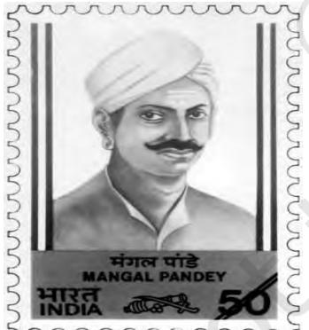

*Fig. 5 – Postal stamp issued in commemoration of Mangal Pandey*

*Firangis* – Foreigners The term reflects an attitude of contempt.

#### From Meerut to Delhi

On 8 April 1857, a young soldier, Mangal Pandey, was hanged to death for attacking his officers in Barrackpore. Some days later, some sepoys of the regiment at Meerut refused to do the army drill using the new cartridges, which were suspected of being coated with the fat of cows and pigs. Eighty-five sepoys were dismissed from service and sentenced to ten years in jail for disobeying their officers. This happened on 9 May 1857.

The response of the other Indian soldiers in Meerut was quite extraordinary. On 10 May, the soldiers marched to the jail in Meerut and released the imprisoned sepoys. They attacked and killed British officers. They captured guns and ammunition and set fire to the buildings and properties of the British and declared war on the *firangis*. The soldiers were determined to bring an end to their rule in the country. But who would rule the land instead? The soldiers had an answer to this question – the Mughal emperor Bahadur Shah Zafar.

The sepoys of Meerut rode all night of 10 May to reach Delhi in the early hours next morning. As news of their arrival spread, the regiments stationed in Delhi also rose up in rebellion. Again british officers were killed, arms and ammunition seized, buildings set on fire. Triumphant soldiers gathered around the walls of the Red Fort where the Badshah lived, demanding to meet him. The emperor was not quite willing to challenge the mighty British power but the soldiers persisted. They forced their way into the palace and proclaimed Bahadur Shah Zafar as their leader.

Chap 5.indd 56 4/22/2022 2:43:06 PM

The ageing emperor had to accept this demand. He wrote letters to all the chiefs and rulers of the country to come forward and organise a confederacy of Indian states to fight the British. This single step taken by Bahadur Shah had great implications.

The Mughal dynasty had ruled over a very large part of the country. Most smaller rulers and chieftains controlled different territories on behalf of the Mughal ruler. Threatened by the expansion of British rule, many of them felt that if the Mughal emperor could rule again, they too would be able to rule their own territories once more, under Mughal authority.

The British had not expected this to happen. They thought the disturbance caused by the issue of the cartridges would die down. But Bahadur Shah Zafar's decision to bless the uprising changed the entire situation dramatically. Often when people see an alternative possibility, they feel inspired and enthused. It gives them the courage, hope and confidence to act.

#### The uprising spreads

After the British were routed from Delhi, there was no uprising for almost a week. It took that much time for news to travel. Then, a spurt of mutinies began.

Regiment after regiment mutinied and took off to join other troops at nodal points like Delhi, Kanpur and Lucknow. After them, the people of the towns and villages also rose up in rebellion and rallied around local leaders, zamindars and chiefs who were prepared to establish their authority and fight the British. Nana Saheb, the adopted son of the late Peshwa Baji Rao who lived near Kanpur, gathered armed forces and expelled the British garrison from the city. He proclaimed himself Peshwa. He declared that he was a governor under Emperor Bahadur Shah Zafar.

In Lucknow, Birjis Qadr, the son of the deposed Nawab Wajid Ali Shah, was proclaimed the new Nawab. He too acknowledged the suzerainty of Bahadur Shah Zafar. His mother Begum Hazrat Mahal took an active part in organising the uprising against the British. In Jhansi, Rani Lakshmibai joined the rebel sepoys and fought the British along with Tantia Tope, the

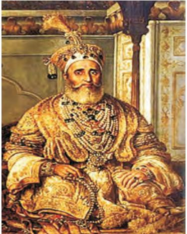

*Fig. 6 – Bahadur Shah Zafar* 

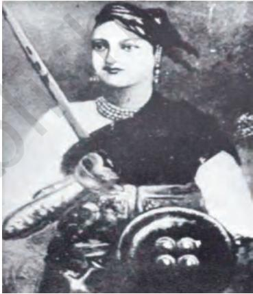

*Fig. 7 – Rani Laxmibai* 

*Fig. 8 – As the mutiny spread, British officers were killed in the cantonments*

Chap 5.indd 57 14-03-2024 12:27:41

#### **Activity**

- 1. Why did the Mughal emperor agree to support the rebels?
- 2. Write a paragraph on the assessment he may have made before accepting the offer of the sepoys.

*Fig. 9 – A portrait of Nana Saheb* 

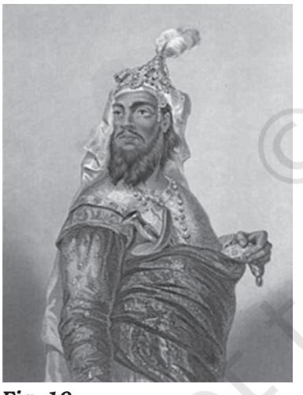

*Fig. 10 – A portrait of Vir Kunwar Singh*

*Fig. 11 – British forces attack the rebels who had occupied the Red Fort (on the right) and Salimgarh Fort in Delhi (on the left)*

general of Nana Saheb. In the Mandla region of Madhya Pradesh, Rani Avantibai Lodhi of Ramgarh raised and led an army of four thousand against the British who had taken over the administration of her state.

The British were greatly outnumbered by the rebel forces. They were defeated in a number of battles. This convinced the people that the rule of the British had collapsed for good and gave them the confidence to take the plunge and join the uprising. A situation of widespread popular uprising developed in the region of Awadh in particular. On 6 August 1857, we find a telegram sent by Lieutenant Colonel Tytler to his Commander-in-Chief expressing the fear felt by the British: "Our men are cowed by the numbers opposed to them and the endless fighting. Every village is held against us, the zamindars have risen to oppose us."

Many new leaders came up. For example, Ahmadullah Shah, a maulvi from Faizabad, prophesied that the rule of the British would come to an end soon. He caught the imagination of the people and raised a huge force of supporters. He came to Lucknow to fight the British. In Delhi, a large number of *ghazis* or religious warriors came together to wipe out the white people. Bakht Khan, a soldier from Bareilly, took charge of a large force of fighters who came to Delhi. He became a key military leader of the uprising. In Bihar, an old zamindar, Kunwar Singh, joined the rebel sepoys and battled with the British for many months. Leaders and fighters from across the land joined the fight.

### **The Company Fights Back**

Unnerved by the scale of the upheaval, the Company decided to repress the revolt with all its might. It brought reinforcements from England, passed new laws so that

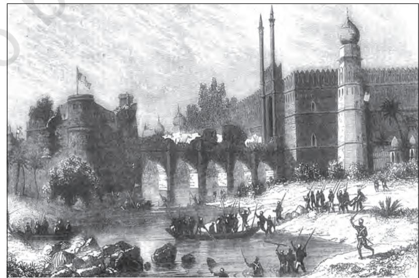

Chap 5.indd 58 14-03-2024 12:27:53

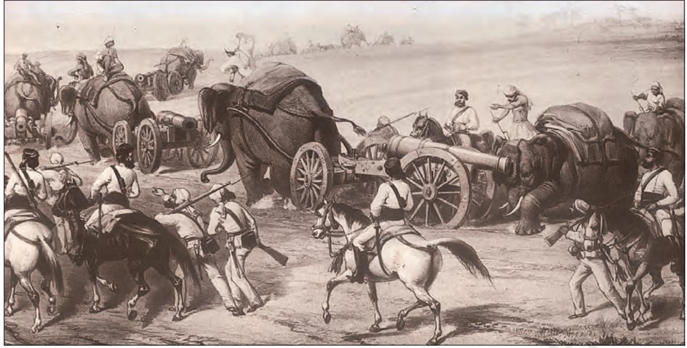

the rebels could be convicted with ease, and then moved into the storm centres of the revolt. Delhi was recaptured from the rebel forces in September 1857. The last Mughal emperor, Bahadur Shah Zafar was tried in court and sentenced to life imprisonment. He and his wife Begum Zinat Mahal were sent to prison in Rangoon in October 1858. Bahadur Shah Zafar died in the Rangoon jail in November 1862.

The recapture of Delhi, however, did not mean that the uprising died down after that. People continued to resist and battle the British. The British had to fight for two years to suppress the massive forces of popular uprising.

Lucknow was taken in March 1858. Rani Lakshmibai was defeated and killed in June 1858. A similar fate awaited Rani Avantibai, who after initial victory in Kheri, chose to embrace death when surrounded by the British on all sides. Tantia Tope escaped to the jungles of central India and continued to fight a guerrilla war with the support of many tribal and peasant leaders. He was captured, tried and killed in April 1859.

Just as victories against the British had earlier encouraged uprising, the defeat of rebel forces encouraged desertions. The British also tried their best to win back the loyalty of the people. They announced rewards for loyal landholders would be allowed to continue to enjoy traditional rights over their lands. Those who had rebelled were told that if they submitted to the British, and if they had not killed any white people,

*Fig. 12– The siege train reaches Delhi* 

*The British forces initially found it difficult to break through the heavy fortification in Delhi. On 3 September 1857, reinforcements arrived – a 7- mile-long siege train comprising cartloads of canons and ammunition pulled by elephants.*

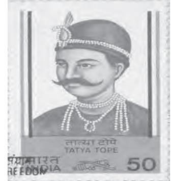

*Fig. 13 – Postal stamp issued in commemoration of Tantia Tope*

#### Activity

Make a list of places where the uprising took place in May, June and July 1857.

Chap 5.indd 59 14-03-2024 12:28:03

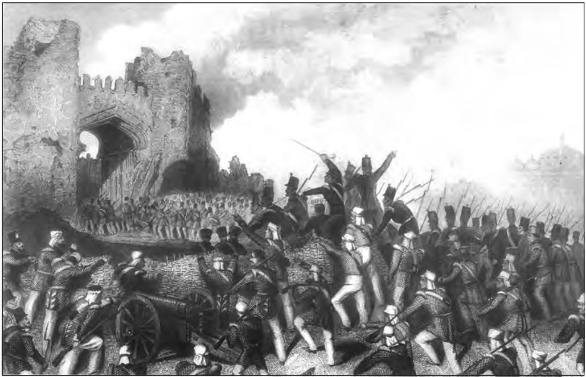

*Fig. 14 – British troops blow up Kashmere Gate to enter Delhi* 

they would remain safe and their rights and claims to land would not be denied. Nevertheless, hundreds of sepoys, rebels, nawabs and rajas were tried and hanged.

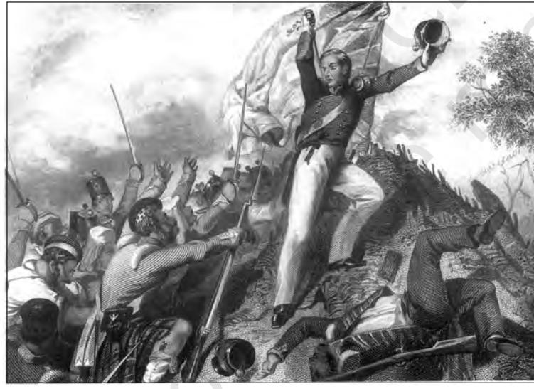

*Fig. 15 – British forces capture the rebels near Kanpur* Notice the way the artist shows the British soldiers valiantly advancing on the rebel forces.

### **Aftermath**

The British had regained control of the country by the end of 1859, but they could not carry on ruling the land with the same policies any more.

Given below are the important changes that were introduced by the British.

1. The British Parliament passed a new Act in 1858 and transferred the powers of the East India Company to the British Crown in order to ensure a more responsible management of Indian affairs. A member of the

British Cabinet was appointed Secretary of State for India and made responsible for all matters related to the governance of India. He was given a council to advise him, called the India Council. The Governor-General of India was given the title of Viceroy, that is, a personal representative of the Crown. Through these measures, the British government accepted direct responsibility for ruling India.

Chap 5.indd 60 4/22/2022 2:43:15 PM

2. All ruling chiefs of the country were assured that their territory would never be annexed in future. They were allowed to pass on their kingdoms to their heirs, including adopted sons. However, they were made to acknowledge the British Queen as their Sovereign Paramount. Thus the Indian rulers were to hold their kingdoms as subordinates of the British Crown.

3. It was decided that the proportion of Indian soldiers in the army would be reduced and the number of European soldiers would be increased. It was also decided that instead of recruiting soldiers from Awadh, Bihar, central India and south India, more soldiers would be recruited from among the Gurkhas, Sikhs and Pathans.

4. The land and property of Muslims was confiscated on a large scale and they were treated with suspicion and hostility. The British believed that they were responsible for the uprising in a big way.

5. The British decided to respect the customary religious and social practices of the people in India.

6. Policies were made to protect landlords and zamindars and give them security of rights over their lands.

Thus a new phase of history began after 1857.

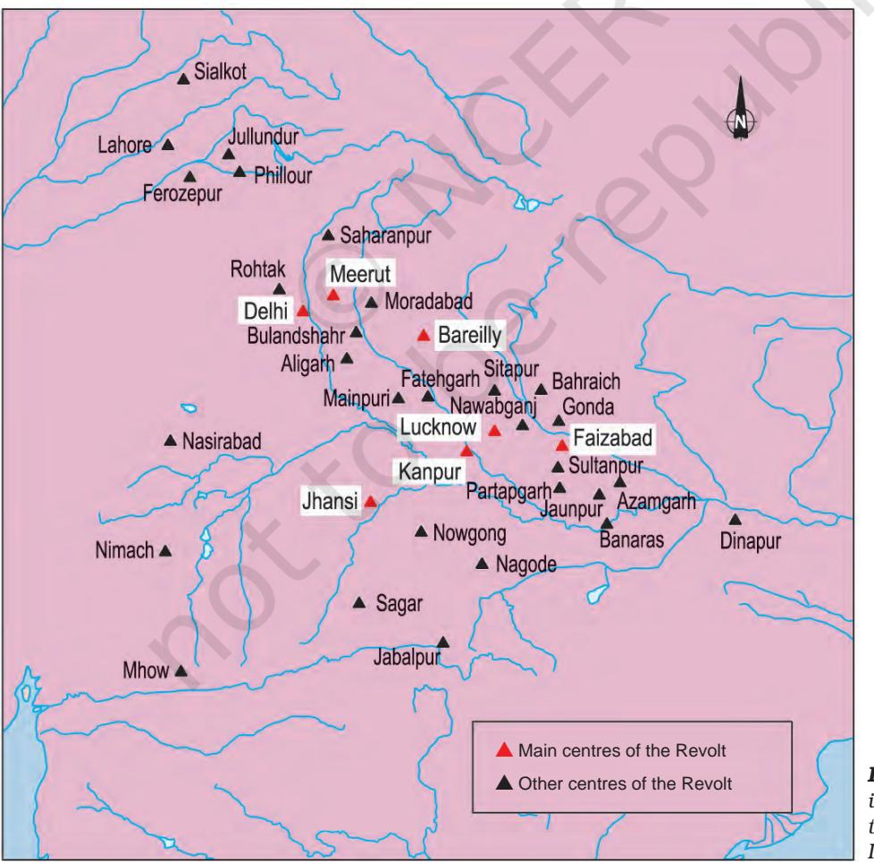

<i>Fig. 16 *– Some important centres of the Revolt in North India*

Chap 5.indd 61 14-03-2024 12:30:27

# The Khurda Uprising – A Case Study

Much before the event of 1857, there had taken place another event of a similar nature at a place called Khurda in 1817. Here, it would be instructive for us to study that event and reflect on how resentment against the colonial policies of the British had been building up since the beginning of the 19th century in different parts of the country.

Khurda, a small kingdom built up in the late 16th century in the south-eastern part of Orissa, was a populous and well-cultivated territory consisting of 105 *garhs*, 60 large and 1109 small villages at the beginning of the 19th century. Its king, Raja Birakishore Dev had to earlier give up the possession of four *parganas*, the superintendence of the Jagannath Temple and the administration of fourteen *garjats* (Princely States) to the Marathas under compulsion. His son and successor, Mukunda Dev II was greatly disturbed with this loss of fortune. Therefore, sensing an opportunity in the Anglo-Maratha conflict, he had entered into negotiations with the British to get back his lost territories and the rights over the Jagannath Temple. But after the occupation of Orissa in 1803, the British showed no inclination to oblige him on either score. Consequently, in alliance with other feudatory chiefs of Orissa and secret support of the Marathas, he tried to assert his rights by force. This led to his deposition and annexation of his territories by the British. As a matter of consolation, he was only given the rights of management of the Jagannath Temple with a grant amounting to a mere one-tenth of the revenue of his former estate and his residence was fixed at Puri. This unfair settlement commenced an era of oppressive foreign rule in Orissa, which paved the way for a serious armed uprising in 1817.

Soon after taking over Khurda, the British followed a policy of resuming service tenures. It bitterly affected the lives of the ex-militia of the state, the *Paiks.* The severity of the measure was compounded on account of an unreasonable increase in the demand of revenue and also the oppressive ways of its collection. Consequently, there was large scale desertion of people from Khurda between 1805 and 1817. Yet, the British went for a series of short-term settlements, each time increasing the demands, not recognising either the productive capacity of the land or the paying capacity of the *ryots.* No leniency was shown even in case of natural calamities, which Orissa was frequently prone to. Rather, lands of defaulters were sold off to scheming revenue officials or speculators from Bengal.

The hereditary Military Commander of the deposed king, Jagabandhu Bidyadhar Mahapatra Bhramarabar Rai or Buxi Jagabandhu as he was popularly known, was one among the dispossessed land-holders. He had in effect become a beggar, and for nearly two years survived on voluntary contributions from the people of Khurda before deciding to fight for their grievances as well as his own. Over the years, what had added to these grievances were (a) the introduction of *sicca* rupee (silver currency) in the region, (b) the insistence on payment of revenue in the new currency, (c) an unprecedented rise in the prices of food-stuff and salt, which had become far-fetched following the introduction of salt monopoly because of which the traditional salt makers of Orissa were deprived of making salt, and (d) the auction of local estates in Calcutta, which brought in absentee landlords from Bengal to Orissa. Besides, the insensitive and corrupt police system also made the situation worse for the armed uprising to take a sinister shape.

The uprising was set off on 29 March 1817 as the *Paiks* attacked the police station and other government establishments at Banpur killing more than a hundred men and took away a large amount of government money. Soon its ripples spread in different directions with Khurda becoming its epicenter. The *zamindars* and *ryots* alike joined the *Paiks* with enthusiasm. Those who did not, were taken to task. A 'no-rent campaign' was also started. The British tried to dislodge the *Paiks* from their entrenched position but failed. On 14 April 1817, Buxi Jagabandhu, leading five to ten thousand *Paiks* and men of the Kandh tribe

Chap 5.indd 62 7/5/2022 12:51:48 PM

seized Puri and declared the hesitant king, Mukunda Dev II as their ruler. The priests of the Jagannath Temple also extended the *Paiks* their full support.

Seeing the situation going out of hand, the British clamped Martial Law. The King was quickly captured and sent to prison in Cuttack with his son. The Buxi with his close associate, Krushna Chandra Bhramarabar Rai, tried to cut off all communications between Cuttack and Khurda as the uprising spread to the southern and the north-western parts of Orissa. Consequently, the British sent Major-General Martindell to clear off the area from the clutches of the *Paiks* while at the same time announcing rewards for the arrest of Buxi Jagabandhu and his associates. In the ensuing operation, hundreds of *Paiks* were killed, many fled to deep jungles and some returned home under a scheme of amnesty. Thus by May 1817, the uprising was mostly contained.

However, outside Khurda it was sustained by Buxi Jagabandhu with the help of supporters like the Raja of Kujung and the unflinching loyalty of the *Paiks* until his surrender in May 1825. On their part, the British henceforth adopted a policy of 'leniency, indulgence and forbearance' towards the people of Khurda. The price of salt was reduced and necessary reforms were made in the police and the justice systems. Revenue officials found to be corrupt were dismissed from service and former land-holders were restored to their lands. The son of the king of Khurda, Ram Chandra Dev III was allowed to move to Puri and take charge of the affairs of the Jagannath Temple with a grant of rupees twenty-four thousand.

In sum, it was the first such popular anti-British armed uprising in Orissa, which had far reaching effect on the future of British administration in that part of the country. To merely call it a 'Paik Rebellion' will thus be an understatement.

**Let's recall**

- 1. What was the demand of Rani Lakshmibai of Jhansi that was refused by the British?
- 2. What did the British do to protect the interests of those who converted to Christianity?
- 3. What objections did the sepoys have to the new cartridges that they were asked to use?
- 4. How did the last Mughal emperor live the last years of his life?

**Let's imagine**

Imagine you are a British officer in Awadh during the rebellion. What would you do to keep your plans of fighting the rebels a top secret?

Chap 5.indd 63 14-03-2024 11:13:17

# **Let's discuss**

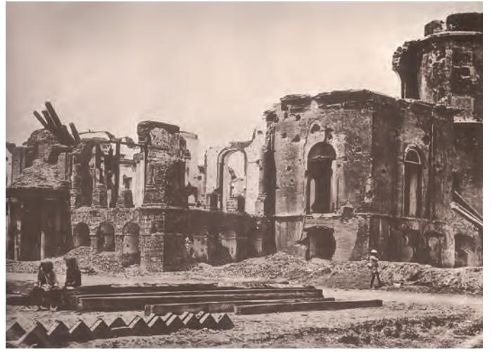

#### *Fig. 17 – Ruins of the Residency in Lucknow*

In June 1857, the rebel forces began the siege of the Residency. A large number of British women, men and children had taken shelter in the buildings there. The rebels surrounded the compound and bombarded the building with shells. Hit by a shell, Henry Lawrence, the Chief Commissioner of Awadh, died in one of the rooms that you see in the picture. Notice how buildings carry the marks of past events.

- 5. What could be the reasons for the confidence of the British rulers about their position in India before May 1857?
- 6. What impact did Bahadur Shah Zafar's support to the rebellion have on the people and the ruling families?
- 7. How did the British succeed in securing the submission of the rebel landowners of Awadh?
- 8. In what ways did the British change their policies as a result of the rebellion of 1857?

- 9. Find out stories and songs remembered by people in your area or your family about *San Sattavan ki Ladaai*. What memories do people cherish about the great uprising?
- 10. Find out more about Rani Lakshmibai of Jhansi. In what ways would she have been an unusual woman for her times?

Chap 5.indd 64 4/22/2022 2:43:22 PM

