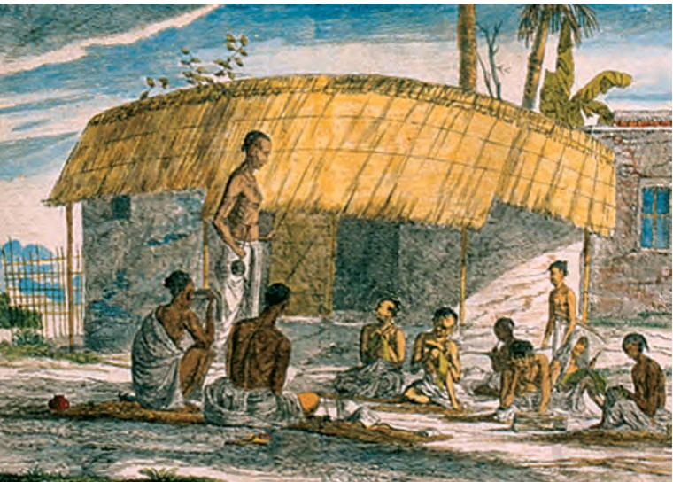
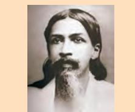

**6**

# **Civilising the "Native", Educating the Nation**

In the earlier chapters, you have seen how British rule affected rajas and nawabs, peasants and tribals. In this chapter, we will try and understand what implication it had for the lives of students. For, the British in India wanted not only territorial conquest and control over revenues. They also felt that they had a cultural mission: they had to "civilise the natives", change their customs and values.

What changes were to be introduced? How were Indians to be educated, "civilised", and made into what the British believed were "good subjects"? The British could find no simple answers to these questions. They continued to be debated for many decades.

## **How the British saw Education**

Let us look at what the British thought and did, and how some of the ideas of education that we now take for granted evolved in the last two hundred years. In the process of this enquiry, we will also see how Indians reacted to British ideas, and how they developed their own views about how Indians were to be educated.

#### The tradition of Orientalism

In 1783, a person named William Jones arrived in Calcutta. He had an appointment as a junior judge at the Supreme Court that the Company had set up. In addition to being an expert in law, Jones was a linguist. He had studied Greek and Latin at Oxford, knew French and English, had picked up Arabic from a friend, and had also learnt Persian. At Calcutta, he began spending many hours a day with pandits who taught him the subtleties of Sanskrit language, grammar and *Fig. 1 – William Jones learning Persian*

Linguist – Someone who knows and studies several languages

Chap 6.indd 65 8/31/2022 5:00:41 PM

*Fig. 2 – Henry Thomas Colebrooke* He was a scholar of Sanskrit and ancient sacred writings of Hinduism.

Madrasa – An Arabic word for a place of learning; any type of school or college

poetry. Soon he was studying ancient Indian texts on law, philosophy, religion, politics, morality, arithmetic, medicine and the other sciences.

Jones discovered that his interests were shared by many British officials living in Calcutta at the time. Englishmen like Henry Thomas Colebrooke and Nathaniel Halhed were also busy discovering the ancient Indian heritage, mastering Indian languages and translating Sanskrit and Persian works into English. Together with them, Jones set up the Asiatic Society of Bengal, and started a journal called *Asiatick Researches.*

Jones and Colebrooke came to represent a particular attitude towards India. They shared a deep respect for ancient cultures, both of India and the West. Indian civilisation, they felt, had attained its glory in the ancient past, but had subsequently declined. In order to understand India, it was necessary to discover the sacred and legal texts that were produced in the ancient period. For only those texts could reveal the real ideas and laws of the Hindus and Muslims, and only a new study of these texts could form the basis of future development in India.

So Jones and Colebrooke went about discovering ancient texts, understanding their meaning, translating them, and making their findings known to others. This project, they believed, would not only help the British learn from Indian culture, but it would also help Indians rediscover their own heritage, and understand the lost glories of their past. In this process, the British would become the guardians of Indian culture as well as its masters.

Influenced by such ideas, many Company officials argued that the British ought to promote Indian rather than Western learning. They felt that institutions should be set up to encourage the study of ancient Indian texts and teach Sanskrit and Persian literature and poetry. The officials also thought that Hindus and Muslims ought to be taught what they were already familiar with, and what they valued and treasured, not subjects that were alien to them. Only then, they believed, could the British hope to win a place in the hearts of the "natives"; only then could the alien rulers expect to be respected by their subjects.

With this object in view, a madrasa was set up in Calcutta in 1781 to promote the study of Arabic, Persian and Islamic law; and the Hindu College was established in Benaras in 1791 to encourage the study of ancient Sanskrit texts that would be useful for the administration of the country.

Chap 6.indd 66 4/21/2022 12:18:02 PM

*Fig. 3 – Monument to Warren Hastings, by Richard Westmacott, 1830, now in Victoria Memorial in Calcutta*

This image represents how Orientalists thought of British power in India. You will notice that the majestic figure of Hastings, an enthusiastic supporter of the Orientalists, is placed between the standing figure of a pandit on one side and a seated *munshi* on the other side. Hastings and other Orientalists needed Indian scholars to teach them the "vernacular" languages, tell them about local customs and laws, and help them translate and interpret ancient texts. Hastings took the initiative to set up the Calcutta Madrasa, and believed that the ancient customs of the country and Oriental learning ought to be the basis of British rule in India.

Not all officials shared these views. Many were very strong in their criticism of the Orientalists.

#### "Grave errors of the East"

From the early nineteenth century, many British officials began to criticise the Orientalist vision of learning. They said that knowledge of the East was full of errors and unscientific thought; Eastern literature was non-serious and light-hearted. So they argued that it was wrong on the part of the British to spend so much effort in encouraging the study of Arabic and Sanskrit language and literature.

James Mill was one of those who attacked the Orientalists. The British effort, he declared, should not be to teach what the natives wanted, or what they respected, in order to please them and "win a place in their heart". The aim of education ought to be to teach what was useful and practical. So Indians should be made familiar with the scientific and technical advances that the West had made, rather than with the poetry and sacred literature of the Orient.

By the 1830s, the attack on the Orientalists became sharper. One of the most outspoken and influential of such critics of the time was Thomas Babington Macaulay. He saw India as an uncivilised country that needed to be civilised. No branch of Eastern knowledge, according to him could be compared to what England had produced. Who could deny, declared Macaulay, that

Orientalists – Those with a scholarly knowledge of the language and culture of Asia

*Munshi* – A person who can read, write and teach Persian

Vernacular – A term generally used to refer to a local language or dialect as distinct from what is seen as the standard language. In colonial countries like India, the British used the term to mark the difference between the local languages of everyday use and English – the language of the imperial masters.

Chap 6.indd 67 4/21/2022 12:18:04 PM

*Fig. 4 – Thomas Babington Macaulay in his study*

#### **Source 1**

## Language of the wise?

Emphasising the need to teach English, Macaulay declared:

> All parties seem to be agreed on one point, that the dialects commonly spoken among the natives ... of India, contain neither literary nor scientific information, and are, moreover, so poor and rude that, until they are enriched from some other quarter, it will not be easy to translate any valuable work into them ...

*From Thomas Babington Macaulay, Minute of 2 February 1835 on Indian Education*  "a single shelf of a good European library was worth the whole native literature of India and Arabia". He urged that the British government in India stop wasting public money in promoting Oriental learning, for it was of no practical use.

With great energy and passion, Macaulay emphasised the need to teach the English language. He felt that knowledge of English would allow Indians to read some of the finest literature the world had produced; it would make them aware of the developments in Western science

and philosophy. Teaching of English could thus be a way of civilising people, changing their tastes, values and culture.

Following Macaulay's minute, the English Education Act of 1835 was introduced. The decision was to make English the medium of instruction for higher education, and to stop the promotion of Oriental institutions like the Calcutta Madrasa and Benaras Sanskrit College. These institutions were seen as "temples of darkness that were falling of themselves into decay". English textbooks now began to be produced for schools.

#### Education for commerce

In 1854, the Court of Directors of the East India Company in London sent an educational despatch to the Governor-General in India. Issued by Charles Wood, the President of the Board of Control of the Company, it has come to be known as Wood's Despatch. Outlining the educational policy that was to be followed in India, it emphasised once again the practical benefits of a system of European learning, as opposed to Oriental knowledge.

One of the practical uses the Despatch pointed to was economic. European learning, it said, would enable Indians to recognise the advantages that flow from the expansion of trade and commerce, and make them see the importance of developing the resources of the country. Introducing them to European ways of life, would change their tastes and desires, and create a demand for British goods, for Indians would begin to appreciate and buy things that were produced in Europe.

Chap 6.indd 68 4/22/2022 11:56:33 AM

Wood's Despatch also argued that European learning would improve the moral character of Indians. It would make them truthful and honest, and thus supply the Company with civil servants who could be trusted and depended upon. The literature of the East was not only full of grave errors, it could also not instill in people a sense of duty and a commitment to work, nor could it develop the skills required for administration.

Following the 1854 Despatch, several measures were introduced by the British. Education departments of the government were set up to extend control over all matters regarding education. Steps were taken to establish a system of university education. In 1857, while the sepoys rose in revolt in Meerut and Delhi, universities were being established in Calcutta, Madras and Bombay. Attempts were also made to bring about changes within the system of school education.

#### **Activity**

Imagine you are living in the 1850s. You hear of Wood's Despatch. Write about your reactions.

*Fig. 5 – Bombay University in the nineteenth century*

#### **Source 2**

## An argument for European knowledge

Wood's Despatch of 1854 marked the final triumph of those who opposed Oriental learning. It stated.

> We must emphatically d e c l a r e t h a t t h e e d u c a t i o n w h i c h we desire to see extended in India is that which has for its object the diffusion of the improved arts, services, philosophy, and literature of Europe, in short, European knowledge.

Chap 6.indd 69 4/21/2022 12:18:08 PM

### The demand for moral education

*Fig. 6 – William Carey was a Scottish missionary who helped establish the Serampore Mission* 

The argument for practical education was strongly criticised by the Christian missionaries in India in the nineteenth century. The missionaries felt that education should attempt to improve the moral character of the people, and morality could be improved only through Christian education.

Until 1813, the East India Company was opposed to missionary activities in India. It feared that missionary activities would provoke reaction amongst the local population and make them suspicious of British presence in India. Unable to establish an institution within British-controlled territories, the missionaries set up a mission at Serampore in an area under the control of the Danish East India Company. A printing press was set up in 1800 and a college established in 1818.

Over the nineteenth century, missionary schools were set up all over India. After 1857, however, the British government in India was reluctant to directly support missionary education. There was a feeling that any strong attack on local customs, practices, beliefs and religious ideas might enrage "native" opinion.

*Fig. 7 – Serampore College on the banks of the river Hooghly near Calcutta*

Chap 6.indd 70 4/21/2022 12:18:12 PM

## **What Happened to the Local Schools?**

Do you have any idea of how children were taught in pre-British times? Have you ever wondered whether they went to schools? And if there were schools, what happened to these under British rule?

#### The report of William Adam

In the 1830s, William Adam, a Scottish missionary, toured the districts of Bengal and Bihar. He had been asked by the Company to report on the

progress of education in vernacular schools. The report Adam produced is interesting.

Adam found that there were over 1 lakh *pathshalas* in Bengal and Bihar. These were small institutions with no more than 20 students each. But the total number of children being taught in these *pathshalas* was considerable – over 20 lakh. These institutions were set up by wealthy people, or the local community. At times they were started by a teacher *(guru)*.

The system of education was flexible. Few things that you associate with schools today were present in the *pathshalas* at the time. There were no fixed fee, no printed books, no separate school building, no benches or chairs, no blackboards, no system of separate classes, no roll-call registers, no annual examinations, and no regular time-table. In some places, classes were held under a banyan tree, in other places in the corner of a village shop or temple, or at the *guru's* home. Fee depended on the income of parents: the rich had to pay more than the poor. Teaching was oral, and the *guru* decided what to teach, in accordance with the needs of the students. Students were not separated out into different classes: all of them sat together in one place. The *guru* interacted separately with groups of children with different levels of learning.

Adam discovered that this flexible system was suited to local needs. For instance, classes were not held during harvest time when rural children often worked in the fields. The *pathshala* started once again when the crops had been cut and stored. This meant that even children of peasant families could study.

*Fig. 8 – A village* pathshala This is a painting by a Dutch painter, Francois Solvyn, who came to India in the late eighteenth century. He tried to depict the everyday life of people in his paintings.

Chap 6.indd 71 4/21/2022 12:18:13 PM

#### **Activity**

- 1. Imagine you were born in a poor family in the 1850s. How would you have responded to the coming of the new system of governmentregulated *pathshalas*?
- 2. Did you know that about 50 per cent of the children going to primary school drop out of school by the time they are 13 or 14? Can you think of the various possible reasons for this fact?

*Fig. 9 – Sri Aurobindo Ghose*

In a speech delivered on January 15, 1908 in Bombay, Aurobindo Ghose stated that the goal of national education was to awaken the spirit of nationality among the students. This required a contemplation of the heroic deeds of our ancestors. The education should be imparted in the vernacular so as to reach the largest number of people. Aurobindo Ghose emphasised that although the students should remain connected to their own roots, they should also take the fullest advantage of modern scientific discoveries and Western experiments in popular governments. Moreover, the students should also learn some useful crafts so that they could be able to find some moderately remunerative employment after leaving their schools.

#### New routines, new rules

Up to the mid-nineteenth century, the Company was concerned primarily with higher education. So it allowed the local *pathshalas* to function without much interference. After 1854, the Company decided to improve the system of vernacular education. It felt that this could be done by introducing order within the system, imposing routines, establishing rules, ensuring regular inspections.

How was this to be done? What measures did the Company undertake? It appointed a number of government pandits, each in charge of looking after four to five schools. The task of the pandit was to visit the *pathshalas* and try and improve the standard of teaching. Each *guru* was asked to submit periodic reports and take classes according to a regular timetable. Teaching was now to be based on textbooks and learning was to be tested through a system of annual examination. Students were asked to pay a regular fee, attend regular classes, sit on fixed seats, and obey the new rules of discipline.

*Pathshalas* which accepted the new rules were supported through government grants. Those who were unwilling to work within the new system received no government support. Over time, *gurus* who wanted to retain their independence found it difficult to compete with the government aided and regulated *pathshalas*.

The new rules and routines had another consequence. In the earlier system, children from poor peasant families had been able to go to *pathshalas*, since the timetable was flexible. The discipline of the new system demanded regular attendance, even during harvest time when children of poor families had to work in the fields. Inability to attend school came to be seen as indiscipline, as evidence of the lack of desire to learn.

## **The Agenda for a National Education**

British officials were not the only people thinking about education in India. From the early nineteenth century, many thinkers from different parts of India began to talk of the need for a wider spread of education. Impressed with the developments in Europe, some Indians felt that Western education would help modernise India. They urged the British to open more schools, colleges and universities, and spend more money on education. You will read about some of these efforts in Chapter 8. There were other Indians,

Chap 6.indd 72 4/21/2022 12:18:14 PM

however, who reacted against Western education. Mahatma Gandhi and Rabindranath Tagore were two such individuals.

Let us look at what they had to say.

#### "English education has enslaved us"

Mahatma Gandhi argued that colonial education created a sense of inferiority in the minds of Indians. It made them see Western civilisation as superior, and destroyed the pride they had in their own culture. There was poison in this education, said Mahatma Gandhi, it was sinful, it enslaved Indians, it cast an evil spell on them. Charmed by the West, appreciating everything that came from the West, Indians educated in these institutions began admiring British rule. Mahatma Gandhi wanted an education that could help Indians recover their sense of dignity and self-respect. During the national movement, he urged students to leave educational institutions in order to show to the British that Indians were no longer willing to be enslaved.

Mahatma Gandhi strongly felt that Indian languages ought to be the medium of teaching. Education in English crippled Indians, distanced them from their own social surroundings, and made them "strangers in their own lands". Speaking a foreign tongue, despising local culture, the English educated did not know how to relate to the masses.

Western education, Mahatma Gandhi said, focused on reading and writing rather than oral knowledge; it

*Fig. 10 – Mahatma Gandhi along with Kasturba Gandhi sitting with Rabindranath Tagore and a group of girls at Santiniketan, 1940*

valued textbooks rather than lived experience and practical knowledge. He argued that education ought to develop a person's mind and soul. Literacy – or simply learning to read and write – by itself did not count as education. People had to work with their hands, learn a craft, and know how different things operated. This would develop their mind and their capacity to understand.

Chap 6.indd 73 4/21/2022 12:18:16 PM

#### **Source 3**

### "Literacy in itself is not education"

Mahatma Gandhi wrote:

By education I mean an all-round drawing out of the best in child and man – body, mind and spirit. Literacy is not the end of education nor even the beginning. It is only one of the means whereby man and woman can be educated. Literacy in itself is not education. I would therefore begin the child's education by teaching it a useful handicraft and enabling it to produce from the moment it begins its training … I hold that the highest development of the mind and the soul is possible under such a system of education. Only every handicraft has to be taught not merely mechanically as is done today but scientifically, i.e. the child should know the why and the wherefore of every process.

*The Collected Works of Mahatma Gandhi,* Vol. 72, p. 79

As nationalist sentiments spread, other thinkers also began thinking of a system of national education which would be radically different from that set up by the British.

#### Tagore's "abode of peace"

Many of you may have heard of Santiniketan. Do you know why it was established and by whom?

Rabindranath Tagore started the institution in 1901. As a child, Tagore hated going to school. He found it suffocating and oppressive. The school appeared like a prison, for he could never do what he felt like doing. So

while other children listened to the teacher, Tagore's mind would wander away.

> The experience of his schooldays in Calcutta shaped Tagore's ideas of education. On growing up, he wanted to set up a school where the child was happy, where she could be free and creative, where she was able to explore her own thoughts and desires. Tagore felt

*Fig. 11 – A class in progress in Santiniketan in the 1930s* Notice the surroundings – the trees and the open spaces.

Chap 6.indd 74 4/22/2022 11:56:58 AM

that childhood ought to be a time of self-learning, outside the rigid and restricting discipline of the schooling system set up by the British. Teachers had to be imaginative, understand the child, and help the child develop her curiosity. According to Tagore, the existing schools killed the natural desire of the child to be creative, her sense of wonder.

Tagore was of the view that creative learning could be encouraged only within a natural environment. So he chose to set up his school 100 kilometres away from Calcutta, in a rural setting. He saw it as an abode of peace (*santiniketan*), where living in harmony with nature, children could cultivate their natural creativity.

In many senses, Tagore and Mahatma Gandhi thought about education in similar ways. There were, however, differences too. Gandhiji was highly critical of Western civilisation and its worship of machines and technology. Tagore wanted to combine elements of modern Western civilisation with what he saw as the best within Indian tradition. He emphasised the need to teach science and technology at Santiniketan, along with art, music and dance.

Many individuals and thinkers were thus thinking about the way a national educational system could be fashioned. Some wanted changes within the system set up by the British, and felt that the system could be extended so as to include wider sections of people. Others urged that alternative systems be created so that people were educated into a culture that was truly national. Who was to define what was truly national? The debate about what this "national education" ought to be continued till after independence*.*

*Fig. 12 – Children playing in a missionary school in Coimbatore, early twentieth century* 

By the mid-nineteenth century, schools for girls were being set up by Christian missionaries and Indian reform organisations.

Chap 6.indd 75 4/21/2022 12:18:19 PM

**Let's imagine** 

Imagine you were witness to a debate between Mahatma Gandhi and Macaulay on English education. Write a page on the dialogue you heard.

## **Let's recall**

- 1. Match the following:

| William Jones | promotion of English |
| --- | --- |
|  | education |
| Rabindranath | respect for ancient cultures |
| Tagore |  |
| Thomas Macaulay | gurus |
| Mahatma Gandhi | learning in a natural |
|  | environment |
| Pathshalas | critical of English education |

- 2. State whether true or false:
	- (a) James Mill was a severe critic of the Orientalists.
	- (b) The 1854 Despatch on education was in favour English being introduced as a medium of higher education in India.
	- (c) Mahatma Gandhi thought that promotion of literacy was the most important aim of education.
	- (d) Rabindranath Tagore felt that children ought to be subjected to strict discipline.

**Let's discuss**

- 3. Why did William Jones feel the need to study Indian history, philosophy and law?
- 4. Why did James Mill and Thomas Macaulay think that European education was essential in India?
- 5. Why did Mahatma Gandhi want to teach children handicrafts?
- 6. Why did Mahatma Gandhi think that English education had enslaved Indians?

Chap 6.indd 76 4/21/2022 12:18:22 PM

## **Let's do**

- 7. Find out from your grandparents about what they studied in school.
- 8. Find out about the history of your school or any other school in the area you live.

CIVILISING THE "NATIVE", EDUCATING THE NATION 77

Chap 6.indd 77 4/21/2022 12:18:22 PM

