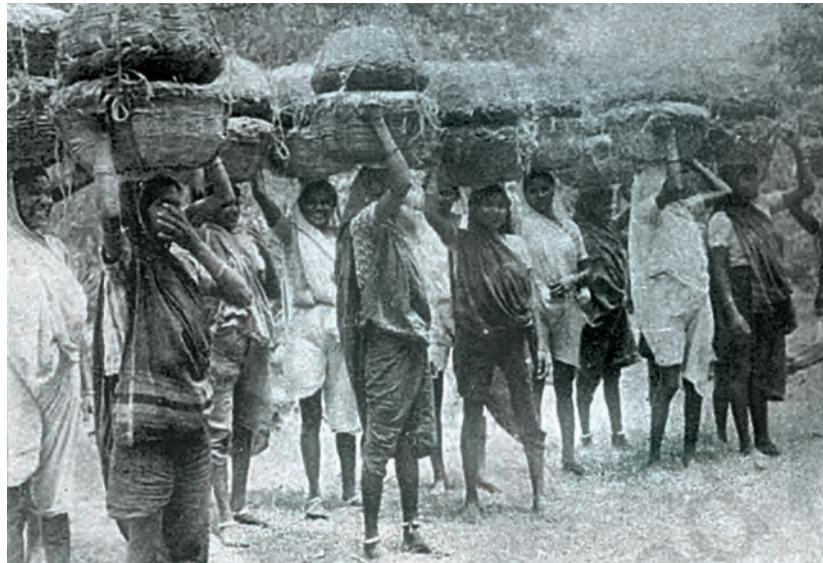

# **Women, Caste and Reform**

Have you ever thought of how children lived about two hundred years ago? Nowadays most girls from middleclass families go to school, and often study with boys. On growing up, many of them go to colleges and universities, and take up jobs after that. They have to be adults before they are legally married, and according to law, they can marry anyone they like, from any caste and community, and widows can remarry too. All women, like all men,

can vote and stand for elections. Of course, these rights are not actually enjoyed by all. Poor people have little or no access to education, and in many families, women cannot choose their husbands.

Two hundred years ago things were very different. Most children were married off at an early age. Both Hindu and Muslim men could marry more than one wife. In some parts of the country, widows were praised if they chose death by burning themselves on

*Fig. 1 – Sati, painted by Balthazar Solvyn, 1813*

**7**

This was one of the many pictures of sati painted by the European artists who came to India. The practice of sati was seen as evidence of the barbarism of the East.

the funeral pyre of their husbands. Women who died in this manner, whether willingly or otherwise, were called "sati", meaning virtuous women. Women's rights to property were also restricted. Besides, most women had virtually no access to education. In many parts of the country people believed that if a woman was educated, she would become a widow.

Chap 7.indd 78 8/31/2022 5:02:04 PM

Differences between men and women were not the only ones in society. In most regions, people were divided along lines of caste. Brahmans and Kshatriyas considered themselves as "upper castes". Others, such as traders and moneylenders (often referred to as Vaishyas) were placed after them. Then came peasants, and artisans such as weavers and potters (referred to as Shudras). At the lowest rung were those who laboured to keep cities and villages clean or worked at jobs that upper castes considered "polluting", that is, it could lead to the loss of caste status. The upper castes also treated many of these groups at the bottom as "untouchable". They were not allowed to enter temples, draw water from the wells used by the upper castes, or bathe in ponds where upper castes bathed. They were seen as inferior human beings.

Over the nineteenth and twentieth centuries, many of these norms and perceptions slowly changed. Let us see how this happened.

### **Working Towards Change**

From the early nineteenth century, we find debates and discussions about social customs and practices taking on a new character. One important reason for this was the development of new forms of communication. For the first time, books, newspapers, magazines, leaflets and pamphlets were printed. These were far cheaper and far more accessible than the manuscripts that you have read about in Class VII. Therefore ordinary people could read these, and many of them could also write and express their ideas in their own languages. All kinds of issues – social, political, economic and religious – could now be debated and discussed by men (and sometimes by women as well) in the new cities. The discussions could reach out to a wider public, and could become linked to movements for social change.

These debates were often initiated by Indian reformers and reform groups. One such reformer was Raja Rammohun Roy (1772–1833). He founded a reform association known as the Brahmo Sabha (later known as the Brahmo Samaj) in Calcutta. People such as Rammohun Roy are described as reformers because they felt that changes were necessary in society, and unjust practices needed to be done away with. They thought that the best way to ensure such changes was by persuading people to give up old practices and adopt a new way of life.

### **Activity**

Can you think of the ways in which social customs and practices were discussed in the pre-printing age when books, newspapers and pamphlets were not readily available?

Chap 7.indd 79 4/21/2022 12:23:24 PM

*Fig. 2 – Raja Rammohun Roy, painted by Rembrandt Peale, 1833*

Rammohun Roy was keen to spread the knowledge of Western education in the country and bring about greater freedom and equality for women. He wrote about the way women were forced to bear the burden of domestic work, confined to the home and the kitchen, and not allowed to move out and become educated.

#### Changing the lives of widows

Rammohun Roy was particularly moved by the problems widows faced in their lives. He began a campaign against the practice of sati.

Rammohun Roy was well versed in Sanskrit, Persian and several other Indian and Europeon languages. He tried to show through his writings that the practice of widow burning had no sanction in ancient texts. By the early nineteenth century, as you have read in Chapter 6, many British officials had also begun to criticise Indian traditions and customs. They were therefore, more than willing to listen to Rammohun who was reputed to be a learned man. In 1829, sati was banned.

The strategy adopted by Rammohun was used by later reformers as well. Whenever they wished to challenge a practice that seemed harmful, they tried to find a verse or sentence in the ancient sacred texts that supported their point of view. They then suggested that the practice as it existed at present was against early tradition.

#### *Fig. 3 – Hook swinging festival*

In this popular festival, devotees underwent a peculiar form of suffering as part of ritual worship. With hooks pierced through their skin they swung themselves on a wheel. In the early nineteenth century, when European officials began criticising Indian customs and rituals as barbaric, this was one of the rituals that came under attack.

Chap 7.indd 80 22-03-2024 09:24:12

#### **Source 1**

### "We first tie them down to the pile"

Rammohun Roy published many pamphlets to spread his ideas. Some of these were written as a dialogue between the advocate and critic of a traditional practice. Here is one such dialogue on sati:

#### ADVOCATE OF SATI:

Women are by nature of inferior understanding, without resolution, unworthy of trust … Many of them, on the death of their husbands, become desirous of accompanying them; but to remove every chance of their trying to escape from the blazing fire, in burning them we first tie them down to the pile.

#### OPPONENT OF SATI:

When did you ever afford them a fair opportunity of exhibiting their natural capacity? How then can you accuse them of want of understanding? If, after instruction in knowledge and wisdom, a person cannot comprehend or retain what has been taught him, we may consider him as deficient; but if you do not educate women how can you see them as inferior.

### **Activity**

This argument was taking place more than 175 years ago. Write down the different arguments you may have heard around you on the worth of women. In what ways have the views changed?

For instance, one of the most famous reformers, Ishwarchandra Vidyasagar, used the ancient texts to suggest that widows could remarry. His suggestion was adopted by British officials, and a law was passed in 1856 permitting widow remarriage. Those who were against the remarriage of widows opposed Vidyasagar, and even boycotted him.

By the second half of the nineteenth century, the movement in favour of widow remarriage spread to other parts of the country. In the Telugu-speaking areas of the Madras Presidency, Veerasalingam Pantulu formed an association for widow remarriage. Around the same time, young intellectuals and reformers in Bombay pledged themselves to working for the same cause. In the north, Swami Dayanand Saraswati, who founded the reform association called Arya Samaj, also supported widow remarriage.

Yet, the number of widows who actually remarried remained low. Those who married were not easily accepted in society and conservative groups continued to oppose the new law.

*Fig. 4 – Swami Dayanand Saraswati* Dayanand founded the Arya Samaj in 1875, an organisation that attempted to reform Hinduism.

Chap 7.indd 81 4/21/2022 12:23:30 PM

*Fig. 5 Ishwarchandra Vidyasagar*

#### *Fig. 6 – Students of Hindu Mahila Vidyalaya, 1875*

When girls' schools were first set up in the nineteenth century, it was generally believed that the curriculum for girls ought to be less taxing than that for boys. The Hindu Mahila Vidyalaya was one of the first institutions to provide girls with the kind of learning that was usual for boys at the time.

#### Girls begin going to school

Many of the reformers felt that education for girls was necessary in order to improve the condition of women.

Vidyasagar in Calcutta and many other reformers in Bombay set up schools for girls. When the first schools were opened in the mid-nineteenth century, many people were afraid of them. They feared that schools would take girls away from home, prevent them from doing their domestic duties. Moreover, girls had to travel through public places in order to reach school. Many people felt that this would have a corrupting influence on them. They felt that girls should stay away from public spaces. Therefore, throughout the nineteenth century, most educated women were taught at home by liberal fathers or husbands. Sometimes women taught themselves. Do you remember what you read about Rashsundari Debi in your book *Social and Political Life* last year? She was one of those who secretly learned to read and write in the flickering light of candles at night.

In the latter part of the century, schools for girls were established by the Arya Samaj in Punjab, and Jyotirao Phule in Maharashtra.

In aristocratic Muslim households in North India, women learnt to read the Koran in Arabic. They were taught by women who came home to teach. Some reformers such as Mumtaz Ali reinterpreted verses from the Koran to argue for women's education. The first Urdu novels began to be written from the late nineteenth century. Amongst other things, these were meant to encourage women to read about religion and domestic management in a language they could understand.

#### Women write about women

From the early twentieth century, Muslim women like the Begums of Bhopal played a notable role in promoting education among women. They founded a primary school for girls at Aligarh. Another remarkable woman, Begum Rokeya Sakhawat Hossain started schools for Muslim girls in Patna and Calcutta. She

Chap 7.indd 82 4/21/2022 12:23:31 PM

was a fearless critic of conservative ideas, arguing that religious leaders of every faith accorded an inferior place to women.

By the 1880s, Indian women began to enter universities. Some of them trained to be doctors, some became teachers. Many women began to write and publish their critical views on the place of women in society. Tarabai Shinde, a woman educated at home at Poona, published a book, *Stripurushtulna,* (A Comparison between Women and Men), criticising the social differences between men and women (Men Dominant Society).

*Fig. 7 Pandita Ramabai*

Pandita Ramabai, a great scholar of Sanskrit, felt that Hinduism was oppressive towards women, and wrote a book about the miserable lives of upper-caste Hindu women. She founded a widows' home at Poona to provide shelter to widows who had been treated badly by their husbands' relatives. Here women were trained so that they could support themselves economically.

Needless to say, all this more than alarmed the orthodox. For instance, many Hindu nationalists felt that

Hindu women were adopting Western ways and that this would corrupt Hindu culture and erode family values. Orthodox Muslims were also worried about the impact of these changes.

As you can see, by the end of the nineteenth century, women themselves were actively working for reform. They wrote books, edited magazines, founded schools and training centres, and set up women's associations. From the early twentieth century, they formed political pressure groups to push through laws for female suffrage (the right to vote) and better health care and education for women. Some of them joined various kinds of nationalist and socialist movements from the 1920s.

In the twentieth century, leaders such as Jawaharlal Nehru and Subhas Chandra Bose lent their support to demands for greater equality and freedom for women. Nationalist leaders promised that there would be full suffrage for all men and women after Independence. However, till then they asked women to concentrate on the anti-British struggles.

**Source 2**

### Once a woman's husband has died...

In her book, *Stripurushtulna,*  Tarabai Shinde wrote:

Isn't a woman's life as dear to her as yours is to you? It's as if women are meant to be made of something different from men altogether, made from dust from earth or rock or rusted iron whereas you and your lives are made from the purest gold. … You're asking me what I mean. I mean once a woman's husband has died, … what's in store for her? The barber comes to shave all the curls and hair off her head, just to cool your eyes. … She is shut out from going to weddings, receptions and other auspicious occasions that married women go to. And why all these restrictions? Because her husband has died. She is unlucky: ill fate is written on her forehead. Her face is not to be seen, it's a bad omen.

Tarabai Shinde, *Stripurushtulna*

Chap 7.indd 83 22-03-2024 09:23:34

### Law against child marriage

With the growth of women's organisations and writings on these issues, the momentum for reform gained strength. People challenged another established custom – that of child marriage. There were a number of Indian legislators in the Central Legislative Assembly who fought to make a law preventing child marriage. In 1929, the Child Marriage Restraint Act was passed without the kind of bitter debates and struggles that earlier laws had seen. According to the Act, no man below the age of 18 and woman below the age of 16 could marry. Subsequently these limits were raised to 21 for men and 18 for women.

#### *Fig. 8 – Bride at the age of eight*

This is a picture of a child bride at the beginning of the twentieth century. Did you know that even today over 20 per cent of girls in India are married below the age of 18?

### **Caste and Social Reform**

Some of the social reformers we have been discussing also criticised caste inequalities. Rammohun Roy translated an old Buddhist text that was critical of caste. The Prarthana Samaj adhered to the tradition of Bhakti that believed in spiritual equality of all castes. In Bombay, the Paramhans Mandali was founded in 1840 to work for the abolition of caste. Many of these reformers and members of reform associations were people of upper castes. Often, in secret meetings, these reformers would violate caste taboos on food and touch, in an effort to get rid of the hold of caste prejudice in their lives.

There were also others who questioned the injustices of the caste social order. During the course of the nineteenth century, Christian missionaries began setting up schools for tribal groups and "lower"-caste children. These children were thus equipped with some resources to make their way into a changing world.

At the same time, the poor began leaving their villages to look for jobs that were opening up in the cities. There was work in the factories that were coming up, and jobs in municipalities. Think of the new demands of labour

Chap 7.indd 84 4/21/2022 12:23:34 PM

this created. Drains had to be dug, roads laid, buildings constructed, and cities cleaned. This required coolies, diggers, carriers, bricklayers, sewage cleaners, sweepers, palanquin bearers, rickshaw pullers. Where did this labour come from? The poor from the villages and small towns, many of them from low castes, began moving to the cities where there was a new demand for labour. Some also went to work in plantations

in Assam, Mauritius, Trinidad and Indonesia. Work in the new locations was often very hard. But the poor, the people from low castes, saw this as an opportunity to get away from the oppressive hold that upper-caste landowners exercised over their lives and the daily humiliation they suffered.

*Fig. 9 – A coolie ship, nineteenth century*

This coolie ship – named *John Allen* – carried many Indian labourers to Mauritius where they did a variety of forms of hard labour. Most of these labourers were from low castes.

### Who could produce shoes?

Leatherworkers have been traditionally held in contempt since they work with dead animals which are seen as dirty and polluting. During the First World War, however, there was a huge demand for shoes for the armies. Caste prejudice against leather work meant that only the traditional leather workers and shoemakers were ready to supply army shoes. So they could ask for high prices and gain impressive profits.

#### *Fig. 10 – Madigas making shoes, nineteenth-century Andhra Pradesh*

Madigas were an important untouchable caste of present-day Andhra Pradesh. They were experts at cleaning hides, tanning them for use, and sewing sandals.

There were other jobs too. The army, for instance, offered opportunities. A number of Mahar people, who were regarded as untouchable, found jobs in the Mahar Regiment. The father of B.R. Ambedkar, the leader of the Dalit movement, taught at an army school.

Chap 7.indd 85 4/21/2022 12:23:37 PM

### No place inside the classroom

I n t h e B o m b a y Presidency, as late as 1829, untouchables were not allowed into even government schools. When some of them pressed hard for that right, they were allowed to sit on the veranda outside the classroom and listen to the lessons, without "polluting" the room where upper-caste

#### **Activity**

- 1. Imagine that you are one of the students sitting in the school veranda and listening to the lessons. What kind of questions would be rising in your mind?
- 2. Some people thought this situation was better than the total lack of education for untouchable people. Would you agree with this view?

boys were taught. *Fig. 11 – Dublas of Gujarat carrying mangoes to the market.* Dublas laboured for upper-caste landowners, cultivating their fields, and working at a variety of odd jobs at the landlord's house.

#### Demands for equality and justice

Gradually, by the second half of the nineteenth century, people from within the Non-Brahman castes began organising movements against caste discrimination, and demanded social equality and justice.

The Satnami movement in Central India was founded by Ghasidas who worked among the leatherworkers and organised a movement to improve their social status. In eastern Bengal, Haridas Thakur's Matua sect worked among Chandala cultivators. Haridas questioned Brahmanical texts that supported the caste system. In what is present-day Kerala, a guru from Ezhava caste, Shri Narayana Guru, proclaimed the ideals of unity for his people. He argued against treating people unequally on the basis of caste differences. According to him, all humankind belonged to the same caste. One

of his famous statements was: *"oru jati, oru matam, oru daivam manushyanu"* (one caste, one religion, one god for humankind).

All these sects were founded by leaders who came from Non-Brahman castes and worked amongst them. They tried to change those habits and practices which provoked the contempt of dominant castes. They tried to create a sense of self-esteem among the

Chap 7.indd 86 4/22/2022 11:58:08 AM

#### *Gulamgiri*

One of the most vocal amongst the "low-caste" leaders was Jyotirao Phule. Born in 1827, he studied in schools set up by Christian missionaries. On growing up, he developed his own ideas about the injustices of caste society. He set out to attack the Brahmans' claim that they were superior to others, since they were Aryans. Phule argued that the Aryans were foreigners, who came from outside the subcontinent, and defeated and subjugated the true children of the country – those who had lived here from before the coming of the Aryans. As the Aryans established their dominance, they began looking at the defeated population as inferior, as low-caste people. According to Phule, the "upper" castes had no right to their land and power: in reality, the land belonged to indigenous people, the so-called low castes.

Phule claimed that before Aryan rule, there existed a golden age when warrior-peasants tilled the land and ruled the Maratha countryside in just and fair ways. He proposed that Shudras (labouring castes) and Ati Shudras (untouchables) should unite to challenge caste discrimination. The Satyashodhak Samaj, an association Phule founded, propagated caste equality.

*Fig. 13 – Jyotirao Phule*

#### **Source 3**

### "Me here and you over there"

Phule was also critical of the anti-colonial nationalism that was preached by upper-caste leaders. He wrote:

> The Brahmans have hidden away the sword of their religion which has cut the throat of the peoples' prosperity and now go about posing as great patriots of their country. They … give this advice to ... our Shudra, Muslim and Parsi youth that unless we put away all quarrelling amongst ourselves about the divisions between high and low in our country and come together, our ... country will never make any progress ... It will be unity to serve their purposes, and then it will be me here and you over there again.

> > *Jyotiba Phule,* The Cultivator's Whipcord

In 1873, Phule wrote a book named *Gulamgiri*, meaning slavery. Some ten years before this, the American Civil War had been fought, leading to the end of slavery in America. Phule dedicated his book to all

#### **Activity**

Carefully read Source 3. What do you think Jyotirao Phule meant by "me here and you over there again"?

Chap 7.indd 87 4/21/2022 12:23:42 PM

**Source 4**

### "We are also human beings"

In 1927, Ambedkar said:

We now want to go to the Tank only to prove that like others, we are also human beings … Hindu society should be reorganised on two main principles – equality and absence of casteism.

*Fig. 14 – The gateway to the Madurai temple, drawn by Thomas Daniell, 1792*

"Untouchables" were not allowed anywhere near such gateways until the temple entry movement began.

those Americans who had fought to free slaves, thus establishing a link between the conditions of the "lower" castes in India and the black slaves in America.

As this example shows, Phule extended his criticism of the caste system to argue against all forms of inequality. He was concerned about the plight of "upper"-caste women, the miseries of the labourer, and the humiliation of the "low" castes. This movement for caste reform was continued in the twentieth century by other great dalit leaders like Dr B.R. Ambedkar in western India and E.V. Ramaswamy Naicker in the south.

#### Who could enter temples?

Ambedkar was born into a Mahar family. As a child he experienced what caste prejudice meant in everyday life. In school he was forced to sit outside the classroom on the ground, and was not allowed to drink water from taps that upper-caste children used. After finishing school, he got a fellowship to go to the US for higher studies. On his return to India in 1919, he wrote extensively about "upper"-caste power in contemporary society.

> In 1927, Ambedkar started a temple entry movement, in which his Mahar caste followers participated. Brahman priests were outraged when the Dalits used water from the temple tank.

> > Ambedkar led three such movements for temple entry between 1927 and 1935. His aim was to make everyone see the power of caste prejudices within society.

Chap 7.indd 88 4/21/2022 12:23:44 PM

#### The Non-Brahman movement

In the early twentieth century, the non-Brahman movement started. The initiative came from those non-Brahman castes that had acquired access to education, wealth and influence. They argued that Brahmans were heirs of Aryan invaders from the north who had conquered southern lands from the original inhabitants of the region – the indigenous Dravidian races. They also challenged Brahmanical claims to power.

E.V. Ramaswamy Naicker, or Periyar, as he was called, came from a middle-class family. Interestingly, he had been an ascetic in his early life and had studied Sanskrit scriptures carefully. Later, he became a member of the Congress, only to leave it in disgust when he found that at a feast organised by nationalists, seating arrangements followed caste distinctions – that is, the lower castes were made to sit at a distance from the upper castes. Convinced that untouchables had to fight for their dignity, Periyar founded the Self Respect Movement. He argued that untouchables were the true upholders of an original Tamil and Dravidian culture which had been subjugated by Brahmans. He felt that all religious authorities saw social divisions and inequality as God-given. Untouchables had to free themselves, therefore, from all religions in order to achieve social equality.

Periyar was an outspoken critic of Hindu scriptures, especially the Codes of Manu, the ancient lawgiver, and the *Bhagavad Gita* and the *Ramayana.* He said that these texts had been used to establish the authority of Brahmans over lower castes and the domination of men over women.

These assertions did not go unchallenged. The forceful speeches, writings and movements of lowercaste leaders did lead to rethinking and some selfcriticism among upper-caste nationalist leaders. But orthodox Hindu society also reacted by founding Sanatan Dharma Sabhas and the Bharat Dharma Mahamandal in the north, and associations like the Brahman Sabha in Bengal. The object of these associations was to uphold caste distinctions as a cornerstone of Hinduism, and show how this was sanctified by scriptures. Debates and struggles over caste continued beyond the colonial period and are still going on in our own times.

*Fig. 15 – E.V. Ramaswamy Naicker (Periyar)*

#### **Source 5**

### Periyar on women

#### Periyar wrote:

Only with the arrival of words such as Thara Mukurtham our women had become puppets in the hands of their husbands … we ended up with such fathers who advise their daughters ... that they had been gifted away to their husbands and they belong to their husband's place. This is the … result of our association with Sanskrit.

> *Periyar, cited in* Periyar Chintahnaikal

#### **Activity**

Why does caste remain such a controversial issue today? What do you think was the most important movement against caste in colonial times?

Chap 7.indd 89 4/21/2022 12:23:45 PM

*Fig. 16 – Keshub Chunder Sen – one of the main leaders of the Brahmo Samaj*

### Organising for reform

#### The Brahmo Samaj

The Brahmo Samaj, formed in 1830, prohibited all forms of idolatry and sacrifice, believed in the Upanishads, and forbade its members from criticising other religious practices. It critically drew upon the ideals of religions – especially of Hinduism and Christianity – looking at their negative and positive dimensions.

#### Derozio and Young Bengal

Henry Louis Vivian Derozio, a teacher at Hindu College, Calcutta, in the 1820s, promoted radical ideas and encouraged his pupils to question all authority. Referred to as the Young Bengal Movement, his students attacked tradition and custom, demanded education for women and campaigned for the freedom of thought and expression.

*Fig. 18 Swami Vivekananda*

#### The Ramakrishna Mission and Swami Vivekananda

Named after Ramakrishna Paramhansa, Swami Vivekananda's guru, the Ramakrishna Mission stressed the ideal of salvation through social service and selfless action.

Swami Vivekananda (1863-1902), whose original name was Narendra Nath Dutta, combined the simple teachings of Sri Ramakrishna with his well founded modern outlook and spread them all over the world. After hearing him in the World Parliament of Religions at Chicago in 1893, the New York Herald reported, "We feel how foolish it is to send missionaries to this learned nation". Indeed, Swami Vivekananda was the first Indian in modern times, who re-established the spiritual pre-eminence of the Vedanta philosophy on a global scale. But his mission was not simply to talk of religion. He was extremely pained at the poverty and the misery of his country men. He firmly believed that any reform could become

successful only by uplifting the condition of the masses. Therefore, his clarion call to the people of India was to rise above the narrow confines of their 'religion of the kitchen' and come together in the service of the nation. By sending out this call, he made a signal contribution to the nascent nationalism of India. His sense of nationalism was, however, not narrow in its conception. He was convinced that many of the problems facing the mankind could only be overcome if the nations of the world come together on an equal footing. Therefore, his exhortation to the youth was to unite on the basis of a common spiritual heritage. In this exhortation, he became truly 'the symbol of a new spirit and a source of strength for the future'.

#### The Prarthana Samaj

Established in 1867 at Bombay, the Prarthana Samaj sought to remove caste restrictions, abolish child marriage, encourage the education of women, and end the ban on widow remarriage. Its religious meetings drew upon Hindu, Buddhist and Christian texts.

#### The Veda Samaj

Established in Madras (Chennai) in 1864, the Veda Samaj was inspired by the Brahmo Samaj. It worked to abolish caste distinctions and promote widow remarriage and women's education. Its members believed in one God. They condemned the superstitions and rituals of orthodox Hinduism.

Chap 7.indd 90 4/21/2022 12:23:49 PM

#### The Aligarh Movement

The Mohammedan Anglo‐Oriental College, founded by Sayyid Ahmed Khan in 1875 at Aligarh, later became the Aligarh Muslim University. The institution offered modern education, including Western science, to Muslims. The Aligarh Movement, as it was known, had an enormous impact in the area of educational reform.

Reform organisations of the Sikhs, the first Singh Sabhas were formed at Amritsar in 1873 and at Lahore in 1879. The Sabhas sought to rid Sikhism of superstitions, caste distinctions and practices seen by them as non‐Sikh. They promoted education among the Sikhs, often combining modern instruction with Sikh teachings.

*Fig. 19 Sayyid Ahmed Khan* 

*Fig. 20 – Khalsa College, Amritsar, established in 1892 by the leaders of the Singh Sabha movement*

## **Let's recall**

- 1. What social ideas did the following people support.
Rammohun Roy Dayanand Saraswati Veerasalingam Pantulu Jyotirao Phule Pandita Ramabai Periyar Mumtaz Ali Ishwarchandra Vidyasagar

- 2. State whether true or false:
	- (a) When the British captured Bengal, they framed many new laws to regulate the rules regarding marriage, adoption, inheritance of property, etc.
	- (b) Social reformers had to discard the ancient texts in order to argue for reform in social practices.
	- (c) Reformers got full support from all sections of the people of the country.
	- (d) The Child Marriage Restraint Act was passed in 1829.

**Let's imagine** 

Imagine you are a teacher in the school set up by Rokeya Hossain. There are 20 girls in your charge. Write an account of the discussions that might have taken place on any one day in the school.

Chap 7.indd 91 4/21/2022 12:23:53 PM

# **Let's discuss**

- 3. How did the knowledge of ancient texts help the reformers promote new laws?
- 4. What were the different reasons people had for not sending girls to school?
- 5. Why were Christian missionaries attacked by many people in the country? Would some people have supported them too? If so, for what reasons?
- 6. In the British period, what new opportunities opened up for people who came from castes that were regarded as "low"?
- 7. How did Jyotirao, and other reformer justify their criticism of caste inequality in society?
- 8. Why did Phule dedicate his book *Gulamgiri* to the American movement to free slaves?
- 9. What did Ambedkar want to achieve through the temple entry movement?
- 10. Why were Jyotirao Phule and Ramaswamy Naicker critical of the national movement? Did their criticism help the national struggle in any way?

Chap 7.indd 92 6/3/2022 5:10:52 PM

