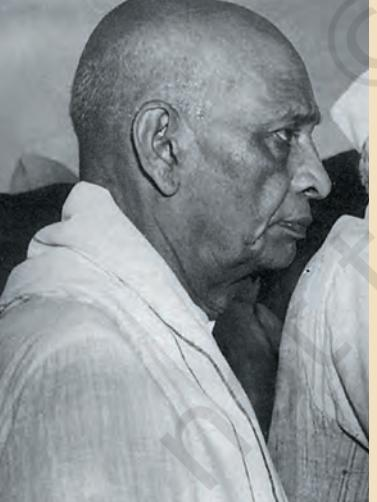

# **The Making of the National Movement: 1870s–1947**

In the previous chapters, we have looked at:

**8**

- The British conquest of territories, and takeover of kingdoms
- Introduction of new laws and administrative institutions
- Changes in the lives of peasants and tribals
- Educational changes in the nineteenth century
- Debates regarding the condition of women
- Challenges to the caste system
- Social and religious reform
- The revolt of 1857 and its aftermath
- The decline of crafts and growth of industries

On the basis of what you have read about these issues, do you think Indians were discontented with British rule? If so, how were different groups and classes dissatisfied?

*Fig. 1 – Police teargas demonstrators during the Quit India movement*

Chap 8.indd 93 8/31/2022 5:03:32 PM

### **The Emergence of Nationalism**

The above-mentioned developments led the people to ask a crucial question: what is this country of India and for whom is it meant? The answer that gradually emerged was: India was the people of India – *all the people* irrespective of class, colour, caste, creed, language, or gender. And the country, its resources and systems, were meant for all of them. With this answer came the awareness that the British were exercising control over the resources of India and the lives of its people, and until this control was ended, India could not be for Indians.

This consciousness began to be clearly stated by the political associations formed after 1850, especially those that came into being in the 1870s and 1880s. Most of these were led by English-educated professionals such as lawyers. The more important ones were the Poona Sarvajanik Sabha, the Indian Association, the Madras Mahajan Sabha, the Bombay Presidency Association, and of course the Indian National Congress.

Note the name, "Poona Sarvajanik Sabha". The literal meaning of "*sarvajanik*" is "of or for all the people" (*sarva* = all + *janik =* of the people). Though many of these associations functioned in specific parts of the country, their goals were stated as the goals of all the people of India, not those of any one region, community or class. They worked with the idea that the people should be sovereign – a modern consciousness and a key feature of nationalism. In other words, they believed that the Indian people should be empowered to take decisions regarding their affairs.

The dissatisfaction with British rule intensified in the 1870s and 1880s. The Arms Act was passed in 1878, disallowing Indians from possessing arms. In the same year, the Vernacular Press Act was also enacted in an effort to silence those who were critical of the government. The Act allowed the government to confiscate the assets of newspapers including their printing presses if the newspapers published anything that was found "objectionable". In 1883, there was a furore over the attempt by the government to introduce the Ilbert Bill. The bill provided for the trial of British or European persons by Indians, and sought equality between British and Indian judges in the country. But when white opposition forced the government to withdraw the bill, Indians were enraged. The event highlighted the racial attitudes of the British in India.

Sovereign – The capacity to act independently without outside interference

Chap 8.indd 94 4/21/2022 12:30:30 PM

The need for an all-India organisation of educated Indians had been felt since 1880, but the Ilbert Bill controversy deepened this desire. The Indian National Congress was established when 72 delegates from all over the country met at Bombay in December 1885. The early leadership – Dadabhai Naoroji, Pherozeshah Mehta, Badruddin Tyabji, W.C. Bonnerji, Surendranath Banerji, Romesh Chandra Dutt, S. Subramania Iyer, among others – was largely from Bombay and Calcutta. Naoroji, a businessman and publicist settled in London, and for a time member of the British Parliament, guided the younger nationalists. A retired British official, A.O. Hume, also played a part in bringing Indians from the various regions together.

#### **Source 1**

### Who did the Congress seek to speak for?

A newspaper, *The Indian Mirror,* wrote in January 1886:

The First National Congress at Bombay … is the nucleus of a future Parliament for our country, and will lead to the good of inconceivable magnitude for our countrymen.

Badruddin Tyabji addressed the Congress as President in 1887 thus:

this Congress is composed of the representatives, not of any one class or community of India, but of all the different communities of India.

### A nation in the making

It has often been said that the Congress in the first twenty years was "moderate" in its objectives and methods. During this period, it demanded a greater voice for Indians in the government and in administration. It wanted the Legislative Councils to be made more representative, given more power, and introduced in provinces where none existed. It demanded that Indians be placed in high positions in the government. For this purpose, it called for civil service examinations to be held in India as well, not just in London.

The demand for Indianisation of the administration was part of a movement against racism, since most important jobs at the time were monopolised by white Publicist – Someone who publicises an idea by circulating information, writing reports, speaking at meetings

*Fig. 2 –* Dadabhai Naoroji Naoroji's book *Poverty and Un-British Rule in India* offered a scathing criticism of the economic impact of British rule.

#### **Activity**

From the beginning the Congress sought to speak for, and in the name of, *all* the Indian *people*. Why did it choose to do so?

Reprint 2024-25

Chap 8.indd 95 4/21/2022 12:30:33 PM

Repeal – To undo law; to officially end the validity of something such as a law

#### **Source 2**

### In pursuit of gold

This is what a Moderate leader, Dinshaw Wacha, wrote to Naoroji in 1887:

> P h e r o z e s h a h i s nowadays too busy with his personal work … They are already r i c h e n o u g h … M r . T e l a n g t o o r e m a i n s b u s y . I wonder how if all remain busy in the pursuit of gold can the progress of the country be advanced?

#### **Activity**

What problems regarding the early Congress does this comment highlight?

officials, and the British generally assumed that Indians could not be given positions of responsibility. Since British officers were sending a major part of their large salaries home, Indianisation, it was hoped, would also reduce the drain of wealth to England. Other demands included the separation of the judiciary from the executive, the repeal of the Arms Act and the freedom of speech and expression.

The early Congress also raised a number of economic issues. It declared that British rule had led to poverty and famines: increase in the land revenue had impoverished peasants and zamindars, and exports of grains to Europe had created food shortages. The Congress demanded reduction of revenue, cut in military expenditure, and more funds for irrigation. It passed many resolutions on the salt tax, treatment of Indian labourers abroad, and the sufferings of forest dwellers – caused by an interfering forest administration. All this shows that despite being a body of the educated elite, the Congress did not talk only on behalf of professional groups, zamindars or industrialists.

The Moderate leaders wanted to develop public awareness about the unjust nature of British rule. They published newspapers, wrote articles, and showed how British rule was leading to the economic ruin of the country. They criticised British rule in their speeches and sent representatives to different parts of the country to mobilise public opinion. They felt that the British had respect for the ideals of freedom and justice, and so they would accept the just demands of Indians. What was necessary, therefore, was to express these demands, and make the government aware of the feelings of Indians.

### "Freedom is our birthright"

By the 1890s, many Indians began to raise questions about the political style of the Congress. In Bengal, Maharashtra and Punjab, leaders such as Bepin Chandra Pal, Bal Gangadhar Tilak and Lala Lajpat Rai were beginning to explore more radical objectives and methods. They criticised the Moderates for their "politics of prayers", and emphasised the importance of self-reliance and constructive work. They argued that people must rely on their own strength, not on the "good" intentions of the government; people must fight for *swaraj*. Tilak raised the slogan, "Freedom is my birthright and I shall have it!"

Chap 8.indd 96 4/21/2022 12:30:34 PM

In 1905, Viceroy Curzon partitioned Bengal. At that time Bengal was the biggest province of British India and included Bihar and parts of Orissa. The British argued for dividing Bengal for reasons of administrative convenience. But what did "administrative convenience" mean? Whose "convenience" did it represent? Clearly, it was closely tied to the interests of British officials and businessmen. Even so, instead of removing the non-Bengali areas from the province, the government separated East Bengal and merged it with Assam. Perhaps the main British motives were to curtail the influence of Bengali politicians and to split the Bengali people.

The partition of Bengal infuriated people all over India. All sections of the Congress – the Moderates and the Radicals, as they may be called – opposed it. Large public meetings and demonstrations were organised and

novel methods of mass protest developed. The struggle that unfolded came to be known as the Swadeshi movement, strongest in Bengal but with echoes elsewhere too – in deltaic Andhra for instance, it was known as the Vandemataram Movement.

*Fig. 3 – Balgangadhar Tilak* Notice the name of the newspaper that lies on the table. *Kesari*, a Marathi newspaper edited by Tilak, became one of the strongest critics of British rule.

*Fig. 4 – Thousands joined the demonstrations during the Swadeshi movement*

Chap 8.indd 97 4/21/2022 12:30:38 PM

*Fig. 5 – Lala Lajpat Rai* A nationalist from Punjab, he was one of the leading members of the Radical group which was critical of the politics of petitions. He was also an active member of the Arya Samaj.

### Revolutionary violence

The use of violence to make a radical change within society

Council – An appointed or elected body of people with an administrative, advisory or representative function

#### **Activity**

Find out which countries fought the First World War.

The Swadeshi movement sought to oppose British rule and encourage the ideas of self-help, *swadeshi* enterprise, national education, and use of Indian languages. To fight for *swaraj*, the radicals advocated mass mobilisation and boycott of British institutions and goods. Some individuals also began to suggest that "revolutionary violence" would be necessary to overthrow British rule.

The opening decades of the twentieth century were marked by other developments as well. A group of Muslim landlords and nawabs formed the All India Muslim League at Dacca in 1906. The League supported the partition of Bengal. It desired separate electorates for Muslims, a demand conceded by the government in 1909. Some seats in the councils were now reserved for Muslims who would be elected by Muslim voters. This tempted politicians to gather a following by distributing favours to their own religious groups.

Meanwhile, the Congress split in 1907. The Moderates were opposed to the use of boycott. They felt that it involved the use of force. After the split, the Congress came to be dominated by the Moderates with Tilak's followers functioning from outside. The two groups reunited in December 1915. Next year, the Congress and the Muslim League signed the historic Lucknow Pact and decided to work together for representative government in the country.

### **The Growth of Mass Nationalism**

After 1919, the struggle against British rule gradually became a mass movement, involving peasants, tribals, students and women in large numbers and occasionally factory workers as well. Certain business groups too began to actively support the Congress in the 1920s. Why was this so?

The First World War altered the economic and political situation in India. It led to a huge rise in the defence expenditure of the Government of India. The government in turn increased taxes on individual incomes and business profits. Increased military expenditure and the demands for war supplies led to a sharp rise in prices which created great difficulties for the common people. On the other hand, business groups reaped fabulous profits from the war. As you have seen (Chapter 6), the war created a demand for industrial goods (jute bags, cloth, rails) and caused a decline of imports from other countries into India. So

Chap 8.indd 98 4/21/2022 12:30:42 PM

Indian industries expanded during the war, and Indian business groups began to demand greater opportunities for development.

The war also lead the British to expand their army. Villages were pressurised to supply soldiers for an alien cause. A large number of soldiers were sent to serve abroad. Many returned after the war with an understanding of the ways in which imperialist powers were exploiting the peoples of Asia and Africa and with a desire to oppose colonial rule in India.

Furthermore, in 1917, there was a revolution in Russia. News about peasants' and workers' struggles and ideas of socialism circulated widely, inspiring Indian nationalists.

### The advent of Mahatma Gandhi

It is in these circumstances that Mahatma Gandhi emerged as a mass leader. As you may know, Gandhiji, aged 46, arrived in India in 1915 from South Africa. Having led Indians in that country in non-violent marches against racist restrictions, he was already a respected leader, known internationally. His South African campaigns had brought him in contact with various types of Indians: Hindus, Muslims, Parsis and Christians; Gujaratis, Tamils and north Indians; and upper-class merchants, lawyers and workers.

Mahatma Gandhi spent his first year in India travelling throughout the country, understanding the people, their needs and the overall situation. His earliest

*Fig. 6 – Founders of the Natal Congress, Durban, South Africa, 1895*

In 1895, along with other Indians, Mahatma Gandhi established the Natal Congress to fight against racial discrimination. Can you identify Gandhiji? He is standing at the centre in the row at the back, wearing a coat and tie.

Chap 8.indd 99 4/21/2022 12:30:47 PM

#### **Activity**

Find out about the Jallianwala Bagh massacre. What is Jallianwala Bagh? What atrocities were committed there? How were they committed?

interventions were in local movements in Champaran, Kheda and Ahmedabad where he came into contact with Rajendra Prasad and Vallabhbhai Patel. In Ahmedabad, he led a successful millworkers' strike in 1918.

 Let us now focus in some detail on the movements organised between 1919 and 1922.

### The Rowlatt Satyagraha

In 1919, Gandhiji gave a call for a *satyagraha* against the Rowlatt Act that the British had just passed. The Act curbed fundamental rights such as the freedom of expression and strengthened police powers. Mahatma Gandhi,Mohammad Ali Jinnah and others felt that the government had no right to restrict people's basic freedoms. They criticised the Act as "devilish" and tyrannical. Gandhiji asked the Indian people to observe 6 April 1919 as a day of non-violent opposition to this Act, as a day of "humiliation and prayer" and *hartal* (strike). *Satyagraha Sabhas* were set up to launch the movement.

*Fig. 7 – The walled compound in which General Dyer opened fire on a gathering of people* The people are pointing to the bullet marks on the wall.

Knighthood – An honour granted by the British Crown for exceptional personal achievement or public service

The Rowlatt Satyagraha turned out to be the first all-India struggle against the British government although it was largely restricted to cities. In April 1919, there were a number of demonstrations and *hartals* in the country and the government used brutal measures to suppress them. The Jallianwala Bagh atrocities, inflicted by General Dyer in Amritsar on Baisakhi day (13 April), were a part of this repression. On learning about the massacre, Rabindranath Tagore expressed the pain and anger of the country by renouncing his knighthood.

Chap 8.indd 100 4/22/2022 11:59:08 AM

During the Rowlatt Satyagraha, the participants tried to ensure that Hindus and Muslims were united in the fight against British rule. This was also the call of Mahatma Gandhi who always saw India as a land of *all* the people who lived in the country – Hindus, Muslims and those of other religions. He was keen that Hindus and Muslims support each other in any just cause.

### Khilafat agitation and the Non-Cooperation Movement

The Khilafat issue was one such cause. In 1920, the British imposed a harsh treaty on the Turkish Sultan or Khalifa. People were furious about this as they had been about the Jallianwala massacre. Also, Indian Muslims were keen that the Khalifa be allowed to retain control over Muslim sacred places in the erstwhile Ottoman Empire. The leaders of the Khilafat agitation, Mohammad Ali and Shaukat Ali, now wished to initiate a full-fledged Non-Cooperation Movement. Gandhiji supported their call and urged the Congress to campaign against "Punjab wrongs" (Jallianwala massacre), the Khilafat wrong and demand *swaraj*.

The Non-Cooperation Movement gained momentum through 1921–22. Thousands of students left governmentcontrolled schools and colleges. Many lawyers such as Motilal Nehru, C.R. Das, C. Rajagopalachari and Asaf Ali gave up their practices. British titles were surrendered and legislatures boycotted. People lit public bonfires of foreign cloth. The imports of foreign cloth fell drastically between 1920 and 1922. But all this was merely the tip of the iceberg. Large parts of the country were on the brink of a formidable revolt.

### People's initiatives

In many cases, people resisted British rule non-violently. In others, different classes and groups, interpreting Gandhiji's call in their own manner, protested in ways that were not in accordance with his ideas. In either case, people linked their movements to local grievances. Let us look at a few examples.

In Kheda, Gujarat, Patidar peasants organised non-violent campaigns against the high land revenue demand of the British. In coastal Andhra and interior Tamil Nadu, liquor shops were picketed. In the Guntur district of Andhra Pradesh, tribals and poor peasants staged a number of "forest *satyagrahas*", sometimes sending their cattle into forests without paying grazing fee. They were protesting because the colonial state **Source 3**

### The eternal law of suffering

W h a t d i d M a h a t m a Gandhi mean by *ahimsa* (non-violence)? How could *ahimsa* become the basis of struggle? This is what Gandhiji said:

> Non-violence comes to us through doing good continually without the slightest expectation of return. … That is the indispensable lesson in non-violence … In South Africa … I succeeded in learning the eternal law of suffering as the only remedy for undoing wrong and injustice. It means positively the law of non-violence. You have to be prepared to suffer cheerfully at the hands of all and sundry and you will wish ill to no one, not even to those who may have wronged you.

> > *Mahatma Gandhi, 12 March 1938*

Picket – People protesting outside a building or shop to prevent others from entering

Chap 8.indd 101 4/21/2022 12:30:51 PM

*Mahants –* Religious functionaries of Sikh gurdwaras

Illegal eviction – Forcible and unlawful throwing out of tenants from the land they rent

#### *Fig. 8 – A popular representation of Mahatma Gandhi*

In popular images too Mahatma Gandhi is often shown as a divine being occupying a place within the pantheon of Indian gods. In this image, he is driving Krishna's chariot, guiding other nationalist leaders in the battle against the British.

had restricted their use of forest resources in various ways. They believed that Gandhiji would get their taxes reduced and have the forest regulations abolished. In many forest villages, peasants proclaimed *swaraj* and believed that "Gandhi Raj" was about to be established.

In Sind (now in Pakistan), Muslim traders and peasants were very enthusiastic about the Khilafat call. In Bengal too, the Khilafat-Non-Cooperation alliance gave enormous communal unity and strength to the national movement.

In Punjab, the Akali agitation of the Sikhs sought to remove corrupt *mahants* – supported by the British – from their gurdwaras. This movement got closely identified with the Non-Cooperation Movement. In Assam, tea garden labourers, shouting *"Gandhi Maharaj ki Jai"*, demanded a big increase in their wages. They left the Britishowned plantations amidst declarations that they were following Gandhiji's wish. Interestingly, in the Assamese Vaishnava songs of the period, the reference to Krishna was substituted by "Gandhi Raja".

### The people's Mahatma

We can see from the above that sometimes people thought of Gandhiji as a kind of messiah, as someone who could help them overcome their misery and poverty. Gandhiji wished to build class unity, not class conflict, yet peasants could imagine that he would help them in their fight against zamindars, and agricultural labourers believed he would provide them land. At times,

ordinary people credited Gandhiji with their *own* achievements. For instance, at the end of a powerful movement, peasants of Pratapgarh in the United Provinces (now Uttar Pradesh) managed to stop illegal eviction of tenants; but they felt it was Gandhiji who had won this demand for them. At other times, using Gandhiji's name, tribals and peasants undertook actions that did not conform to Gandhian ideals.

Chap 8.indd 102 4/21/2022 12:30:52 PM

**Source 4**

### "It was he who got *bedakhli* stopped in Pratapgarh"

The following is an extract from a CID report on the kisan movement in Allahabad district, January 1921:

> The currency which Mr. Gandhi's name has acquired even in the remotest villages is astonishing. No one seems to know quite who or what he is, but it is an accepted fact that what he says is so, and what he orders must be done. He is a Mahatma or *sadhu*, a Pundit, a Brahmin who lives at Allahabad, even a *deota* … the real power of his name is to be traced back to the idea that it was he who got *bedakhli* [illegal eviction] stopped in Pratapgarh … as a general rule, Gandhi is not thought of as being antagonistic to Government, but only to the *zamindars* … We are for Gandhiji and the Sarkar.

#### **Activity**

Read Source 4. According to this report, how did people view Mahatma Gandhi? Why do you think they felt that he was opposed to zamindars but not to the government? Why do you think they were in favour of Gandhiji?

#### The happenings of 1922 –1929

Mahatma Gandhi, as you know, was against violent movements. He abruptly called off the Non-Cooperation Movement when in February 1922, a crowd of peasants set fire to a police station in Chauri Chaura. Twenty- two policemen were killed on that day. The peasants were provoked because the police had fired on their peaceful demonstration.

Once the Non-Cooperation movement was over, Gandhiji's followers stressed that the Congress must undertake constructive work in the rural areas. Other leaders such as Chitta Ranjan Das and Motilal Nehru argued that the party should fight elections to the councils and enter them in order to influence government policies. Through sincere social work in villages in the mid-1920s, the Gandhians were able to extend their support base. This proved to be very useful in launching the Civil Disobedience movement in 1930.

Two important developments of the mid-1920s were the formation of the Rashtriya Swayamsevak Sangh (RSS), a Hindu organisation, and the Communist Party of India. These parties have held very different ideas about the kind of country India should be. Find out about their ideas with the help of your teacher. The revolutionary nationalist Bhagat Singh too was active in this period.

*Fig. 9 – Chitta Ranjan Das* A major figure in the freedom movement, Das was a lawyer from East Bengal. He was especially active in the Non-Cooperation Movement.

Chap 8.indd 103 4/21/2022 12:30:55 PM

*Fig. 10 – Demonstrators oppose the Simon Commission* In 1927, the British government in England decided to send a commission headed by Lord Simon to decide India's political future. The Commission had no Indian representative. The decison created an outrage in India. All political groups decided to boycott the Commission. When the Commission arrived, it was met with demonstrations with banners saying "Simon Go Back".

 The decade closed with the Congress resolving to fight for *Purna Swaraj* (complete independence) in 1929 under the presidentship of Jawaharlal Nehru. Consequently, "Independence Day" was observed on 26 January 1930 all over the country.

*Fig. 11 – Bhagat Singh*

### "It takes a loud voice to make the deaf hear. *Inquilab Zindabad !"*

Revolutionary nationalists such as Bhagat Singh, Chandra Shekhar Azad, Sukhdev and others wanted to fight against the colonial rule and the rich exploiting classes through a revolution of workers and peasants. For this purpose, they founded the Hindustan Socialist Republican Association (HSRA) in 1928 at Ferozeshah Kotla in Delhi. On 17 December, 1928, Bhagat Singh, Azad and Rajguru assassinated Saunders, a police officer who was involved in the lathi-charge that had caused the death of Lala Lajpat Rai.

On 8 April, 1929, Bhagat Singh and B.K. Dutt threw a bomb in the Central Legislative Assembly. The aim, as their leaflet explained, was not to kill but "to make the deaf hear", and to remind the foreign government of its callous exploitation.

Bhagat Singh, Sukhdev and Rajguru were executed on March 23, 1931. Bhagat Singh's age at that time was only 23.

Chap 8.indd 104 4/21/2022 12:30:58 PM

### **The March to Dandi**

*Purna Swaraj* would never come on its own. It had to be fought for. In 1930, Gandhiji declared that he would lead a march to break the salt law. According to this law, the state had a monopoly on the manufacture and sale of salt. Mahatma Gandhi along with other nationalists reasoned that it was sinful to tax salt since it is such an essential item of our food. The Salt March related the general desire of freedom to a specific grievance shared by everybody, and thus did not divide the rich and the poor.

Gandhiji and his followers marched for over 240 miles from Sabarmati to the coastal town of Dandi where they broke the government law by gathering natural salt found on the seashore, and boiling sea water to produce salt.

*Fig. 12 – Mahatma Gandhi breaking the salt law by picking up a lump of natural salt, Dandi, 6 April 1930*

### Women in the freedom struggle: Ambabai from Karnataka

Women from diverse backgrounds participated in the national movement. Young and old, single and married, they came from rural and urban areas, from both conservative and liberal homes. Their involvement was significant for the freedom struggle, for the women's movement, and for themselves personally.

Both British officials and Indian nationalists felt that women's participation gave the national struggle an immense force. Participation in the freedom movement brought women out of their homes. It gave them a place in the professions, in the governance of India, and it could pave the way for equality with men.

What such participation meant for women is best recounted by them. Ambabai of Karnataka had been married at age twelve. Widowed at sixteen, she picketed foreign cloth and liquor shops in Udipi. She was arrested, served a sentence and was rearrested. Between prison terms she made speeches, taught spinning, and organised *prabhat pheris*. Ambabai regarded these as the happiest days of her life because they gave it a new purpose and commitment.

 Women, however, had to fight for their right to participate in the movement. During the Salt Satyagraha, for instance, even Mahatma Gandhi was initially opposed to women's participation. Sarojini Naidu had to persuade him to allow women to join the movement.

Chap 8.indd 105 4/21/2022 12:30:59 PM

#### *Fig. 13 – Sarojini Naidu with Mahatma Gandhi, Paris, 1931*

Active in the national movement since the early 1920s, Naidu was a significant leader of the Dandi March. She was the first Indian woman to become President of the Indian National Congress (1925).

#### Provincial autonomy

Capacity of the provinces to make relatively independent decisions while remaining within a federation

Peasants, tribals and women participated in large numbers. A business federation published a pamphlet on the salt issue. The government tried to crush the movement through brutal action against peaceful *satyagrahis*. Thousands were sent to jail.

The combined struggles of the Indian people bore fruit when the Government of India Act of 1935 prescribed provincial autonomy and the government announced elections to the provincial legislatures in 1937. The Congress formed governments in 7 out of 11 provinces.

In September 1939, after two years of Congress rule in the provinces, the Second World War broke out. Critical of Hitler, Congress leaders were ready to support the British war effort. But in return they wanted that India be granted independence

after the war. The British refused to concede the demand. The Congress ministries resigned in protest.

#### **Source 5**

### Veer Lakhan Nayak was hanged

Baji Mohammed, President of the Nabrangpur Congress, Orissa in the 1930s, reports:

> On August 25, 1942 … nineteen people died on the spot in police firing at Paparandi in Nabarangpur. Many died thereafter from their wounds. Over 300 were injured. More than a thousand were jailed in Koraput district. Several were shot or executed. Veer Lakhan Nayak (a legendary tribal leader who defied the British) was hanged.

Nayak, Baji tells us, was not worried about being executed, only sad that he would not live to see freedom's dawn.

Baji Mohammad mobilised 20,000 people to join the national struggle. He offered *satyagraha* many times over. He participated in protests against the Second World War and in the Quit India movement, and served long jail terms.

Chap 8.indd 106 4/21/2022 12:31:00 PM

*Fig. 14 – Quit India movement, August 1942* Demonstrators clashed with the police everywhere. Many thousands were arrested, over a thousand killed, many more were injured.

### **Quit India and Later**

Mahatma Gandhi decided to initiate a new phase of movement against the British in the middle of the Second World War. The British must quit India immediately, he told them. To the people he said,

"do or die" in your effort to fight the British – but you must fight non-violently. Gandhiji and other leaders were jailed at once but the movement spread. It specially attracted peasants and the youth who gave up their studies to join it.

Communications and symbols of state authority were attacked all over the country. In many areas the people set up their own governments.

The first response of the British was severe repression. By the end of 1943, over 90,000 people were arrested, and around 1,000 killed in police firing. In many areas, orders were given to machine-gun crowds from airplanes. The rebellion, however, ultimately brought the Raj to its knees.

### Towards Independence and Partition

Meanwhile, in 1940 the Muslim League had moved a resolution demanding "Independent States" for Muslims in the north-western and eastern areas of the country. The resolution did not mention partition or Pakistan. Why did the League ask for an autonomous arrangement for the Muslims of the subcontinent?

*Fig. 16 – Jawaharlal Nehru listens to Mahatma Gandhi before the Bombay session of the Congress, July 1946*

Gandhiji's disciple, a Congress Socialist, and an internationalist, Nehru was a leading architect of the national movement and of free India's economy and polity.

### Bose and the INA

*Fig. 15 – Subhas Chandra Bose*

A radical nationalist, with socialist leanings, Bose did not share Gandhiji's ideal of *ahimsa,* though he respected him as the "Father of the

Nation". In January 1941, he secretly left his Calcutta home, went to Singapore, via Germany, and raised the Azad Hind Fauj or the Indian National Army (INA). To free India from British control, in 1944, the INA tried to enter India through Imphal and Kohima but the campaign failed. The INA members were imprisoned and tried. People across the country, from all walks of life, participated in the movement against the INA trials.

Chap 8.indd 107 4/21/2022 12:31:05 PM

*Fig. 17 – Maulana Azad with other members at the Congress Working Committee, Sevagram, 1942*

Azad was born in Mecca to a Bengali father and an Arab mother. Well-versed in many languages, Azad was a scholar of Islam and an exponent of the notion of *wahadat-i-deen*, the essential oneness of all religions. An active participant in Gandhian movements and a staunch advocate of Hindu-Muslim unity, he was opposed to Jinnah's two-nation theory.

*Fig. 18 – Chakravarti Rajagopalachari speaking to Gandhiji before the Gandhi-Jinnah talks, 1944*

A veteran nationalist and leader of the Salt Satyagraha in the south, C. Rajagopalachari, popularly known as Rajaji, served as member of the Interim Government of 1946 and as free India's first Indian Governor-General.

*Fig. 19 – Sardar Vallabhbhai Patel played an important role in the negotiations for independence during 1945–47*

Patel hailed from an impoverished peasantproprietor family of Nadiad, Gujarat. A foremost organiser of the freedom movement from 1918 onwards, Patel served as President of the Congress in 1931.

*Fig. 20 – Mohammad Ali Jinnah with Mahatma Gandhi, Bombay, September 1944*

An ambassador of Hindu-Muslim unity until 1920, Jinnah played an important role in the making of the Lucknow Pact. He reorganised the Muslim League after 1934, and became the major spokesperson for the demand for Pakistan.

Chap 8.indd 108 4/21/2022 12:31:11 PM

From the late 1930s, the League began viewing the Muslims as a separate "nation" from the Hindus. In developing this notion, it may have been influenced by the history of tension between some Hindu and Muslim groups in the 1920s and 1930s. More importantly, the provincial elections of 1937 seemed to have convinced the League that Muslims were a minority, and they would always have to play second fiddle in any democratic structure. It feared that Muslims may even go unrepresented. The Congress's rejection of the League's desire to form a joint Congress-League government in the United Provinces in 1937 also annoyed the League.

The Congress's failure to mobilise the Muslim masses in the 1930s allowed the League to widen its social support. It sought to enlarge its support in the early 1940s when most Congress leaders were in jail. At the end of the war in 1945, the British opened negotiations between the Congress, the League and themselves for the independence of India. The talks failed because the League saw itself as the sole spokesperson of India's Muslims. The Congress could not accept this claim since a large number of Muslims still supported it.

Elections to the provinces were again held in 1946. The Congress did well in the "General" constituencies but the League's success in the seats reserved for Muslims was spectacular. It persisted with its demand for "Pakistan". In March 1946, the British cabinet sent a three-member mission to Delhi to examine this demand and to suggest a suitable political framework for a free India. This mission suggested that India should remain united and constitute itself as a loose confederation with some autonomy for Muslim-majority areas. But it could not get the Congress and the Muslim League to agree to specific details of the proposal. Partition

now became more or less inevitable.

After the failure of the Cabinet Mission, the Muslim League decided on mass agitation for winning its Pakistan demand. It announced 16 August 1946 as "Direct Action Day". On this day riots broke out in Calcutta, lasting several days and resulting in the death of thousands of people. By March 1947, violence spread to different parts of northern India.

Many hundred thousand people were killed and numerous women had to face untold brutalities during the Partition. Millions of people were "General"constituencies Election districts with no reservations for any religious or other community

*Fig. 21 – Khan Abdul Ghaffar Khan, the Pashtun leader from the North West Frontier Province, with his colleagues at a peace march through Bihar, March 1947*  Also known as Badshah Khan, he was the founder of the Khudai Khidmatgars, a powerful nonviolent movement among the Pathans of his province. Badshah Khan was strongly opposed to the Partition of India. He criticised his Congress colleagues for agreeing to the 1947 division.

*Fig. 22 – Refugees from riot-torn Punjab gather in New Delhi, in search of shelter and food*

forced to flee their homes. Torn asunder from their homelands, they were reduced to being refugees in alien

Chap 8.indd 109 4/21/2022 12:31:14 PM

lands. Partition also meant that India changed, many of its cities changed, and a new country – Pakistan – was born. So, the joy of our country's independence from British rule came mixed with the pain and violence of Partition.

**Let's recall**

- 1. Why were people dissatisfied with British rule in the 1870s and 1880s?
- 2. Who did the Indian National Congress wish to speak for?
- 3. What economic impact did the First World War have on India?
- 4. What did the Muslim League resolution of 1940 ask for?

### **Let's discuss**

- 5. Who were the Moderates? How did they propose to struggle against British rule?
- 6. How was the politics of the Radicals within the Congress different from that of the Moderates?
- 7. Discuss the various forms that the Non-Cooperation Movement took in different parts of India. How did the people understand Gandhiji?
- 8. Why did Gandhiji choose to break the salt law?
- 9. Discuss those developments of the 1937–47 period that led to the creation of Pakistan.

## **Let's do**

- 10. Find out how the national movement was organised in your city, district, area or state. Who participated in it and who led it? What did the movement in your area achieve?
- 11. Find out more about the life and work of any two participants or leaders of the national movement and write a short essay about them. You may choose a person not mentioned in this chapter.

**Let's imagine**

Imagine that you are involved in the Indian national movement. Based on your reading of this chapter, briefly discuss your preferred methods of struggle and your vision of a free India.

Chap 8.indd 110 4/21/2022 12:31:16 PM

### **Notes**

Chap 8.indd 111 4/21/2022 12:31:16 PM

### **Notes**

Chap 8.indd 112 4/21/2022 12:31:16 PM

