# **SECTION** I

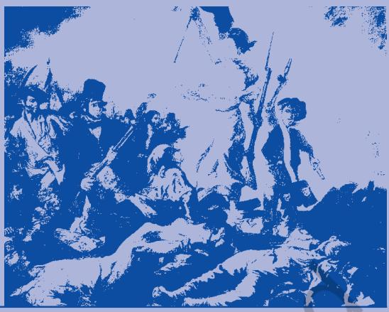

**T h e F r e n c h R e v o l u t i o n**

1

### **EVENTS AND PROCESSES**

In Section I, you will read about the French Revolution, the Russian Revolution, and the rise of Nazism. In different ways all these events were important in the making of the modern world.

Chapter I is on the French Revolution. Today we often take the ideas of liberty, freedom and equality for granted. But we need to remind ourselves that these ideas also have a history. By looking at the French Revolution you will read a small part of that history. The French Revolution led to the end of monarchy in France. A society based on privileges gave way to a new system of governance. The Declaration of the Rights of Man during the revolution, announced the coming of a new time. The idea that all individuals had rights and could claim equality became part of a new language of politics. These notions of equality and freedom emerged as the central ideas of a new age; but in different countries they were reinterpreted and rethought in many different ways. The anti-colonial movements in India and China, Africa and South America, produced ideas that were innovative and original, but they spoke in a language that gained currency only from the late eighteenth century.

In Chapter II, you will read about the coming of socialism in Europe, and the dramatic events that forced the ruling monarch, Tsar Nicholas II, to give up power. The Russian Revolution sought to change society in a different way. It raised the question of economic equality and the well-being of workers and peasants. The chapter will tell you about the changes that were initiated by the new Soviet government, the problems it faced and the measures it undertook. While Soviet Russia pushed ahead with industrialisation and mechanisation of agriculture, it denied the rights of citizens that were essential to the working of a democratic society. The ideals of socialism,

however, became part of the anti-colonial movements in different countries. Today the Soviet Union has broken up and socialism is in crisis but through the twentieth century it has been a powerful force in the shaping of the contemporary world.

Chapter III will take you to Germany. It will discuss the rise of Hitler and the politics of Nazism. You will read about the children and women in Nazi Germany, about schools and concentration camps. You will see how Nazism denied various minorities a right to live, how it drew upon a long tradition of anti-Jewish feelings to persecute the Jews, and how it waged a relentless battle against democracy and socialism. But the story of Nazism's rise is not only about a few specific events, about massacres and killings. It is about the working of an elaborate and frightening system which operated at different levels. Some in India were impressed with the ideas of Hitler but most watched the rise of Nazism with horror.

The history of the modern world is not simply a story of the unfolding of freedom and democracy. It has also been a story of violence and tyranny, death and destruction.

**India and the Contemporary World**

# **The French Revolution**

On the morning of 14 July 1789, the city of Paris was in a state of alarm. The king had commanded troops to move into the city. Rumours spread that he would soon order the army to open fire upon the citizens. Some 7,000 men and women gathered in front of the town hall and decided to form a peoples' militia. They broke into a number of government buildings in search of arms.

Finally, a group of several hundred people marched towards the eastern part of the city and stormed the fortress-prison, the Bastille, where they hoped to find hoarded ammunition. In the armed fight that followed, the commander of the Bastille was killed and the prisoners released – though there were only seven of them. Yet the Bastille was hated by all, because it stood for the despotic power of the king. The fortress was demolished and its stone fragments were sold in the markets to all those who wished to keep a souvenir of its destruction.

The days that followed saw more rioting both in Paris and the countryside. Most people were protesting against the high price of bread. Much later, when historians looked back upon this time, they saw it as the beginning of a chain of events that ultimately led to the execution of the king in France, though most people at the time did not anticipate this outcome. How and why did this happen?

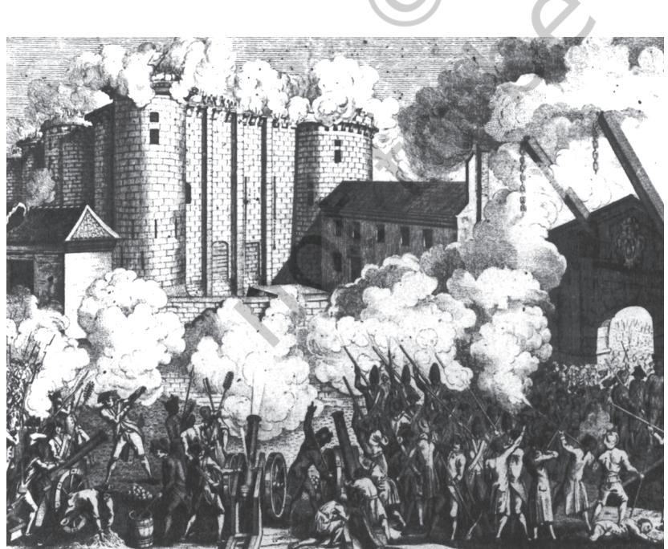

**Chapter I**

3

Fig.1 – Storming of the Bastille. Soon after the demolition of the Bastille, artists made prints commemorating the event.

### **1 French Society During the Late Eighteenth Century**

In 1774, Louis XVI of the Bourbon family of kings ascended the throne of France. He was 20 years old and married to the Austrian princess Marie Antoinette. Upon his accession the new king found an empty treasury. Long years of war had drained the financial resources of France. Added to this was the cost of maintaining an extravagant court at the immense palace of Versailles. Under Louis XVI, France helped the thirteen American colonies to gain their independence from the common enemy, Britain. The war added more than a billion livres to a debt that had already risen to more than 2 billion livres. Lenders who gave the state credit, now began to charge 10 per cent interest on loans. So the French government was obliged to spend an increasing percentage of its budget on interest payments alone. To meet its regular expenses, such as the cost of maintaining an army, the court, running government offices or universities, the state was forced to increase taxes. Yet even this measure would not have sufficed. French society in the eighteenth century was divided into three estates, and only members of the third estate paid taxes.

The society of estates was part of the feudal system that dated back to the middle ages. The term Old Regime is usually used to describe the society and institutions of France before 1789.

Fig. 2 shows how the system of estates in French society was organised. Peasants made up about 90 per cent of the population. However, only a small number of them owned the land they cultivated. About 60 per cent of the land was owned by nobles, the Church and other richer members of the third estate. The members of the first two estates, that is, the clergy and the nobility, enjoyed certain privileges by birth. The most important of these was exemption from paying taxes to the state. The nobles further enjoyed feudal privileges. These included feudal dues, which they extracted from the peasants. Peasants were obliged to render services to the lord – to work in his house and fields – to serve in the army or to participate in building roads.

The Church too extracted its share of taxes called tithes from the peasants, and finally, all members of the third estate had to pay taxes to the state. These included a direct tax, called taille, and a number of indirect taxes which were levied on articles of everyday consumption like salt or tobacco. The burden of financing activities of the state through taxes was borne by the third estate alone.

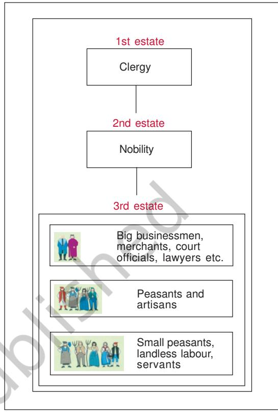

Fig.2 – A Society of Estates. Note that within the Third Estate some were rich and others poor.

### New words

Livre – Unit of currency in France, discontinued in 1794

Clergy – Group of persons invested with special functions in the church

Tithe – A tax levied by the church, comprising one-tenth of the agricultural produce

Taille – Tax to be paid directly to the state

'This poor fellow brings everything, grain, fruits, money, salad. The fat lord sits there, ready to accept it all. He does not even care to grace him with a look.'

# Activity

Explain why the artist has portrayed the nobleman as the spider and the peasant as the fly**.**

'The more the devil has, the more he wants.'

Fig.3 – The Spider and the Fly. An anonymous etching.

'The nobleman is the spider,

the peasant the fly.'

### **1.1 The Struggle to Survive**

The population of France rose from about 23 million in 1715 to 28 million in 1789. This led to a rapid increase in the demand for foodgrains. Production of grains could not keep pace with the demand. So the price of bread which was the staple diet of the majority rose rapidly. Most workers were employed as labourers in workshops whose owner fixed their wages. But wages did not keep pace with the rise in prices. So the gap between the poor and the rich widened. Things became worse whenever drought or hail reduced the harvest. This led to a subsistence crisis, something that occurred frequently in France during the Old Regime.

### New words

2024-25

Subsistence crisis – An extreme situation where the basic means of livelihood are endangered Anonymous – One whose name remains unknown

### **1.2 How a Subsistence Crisis Happens**

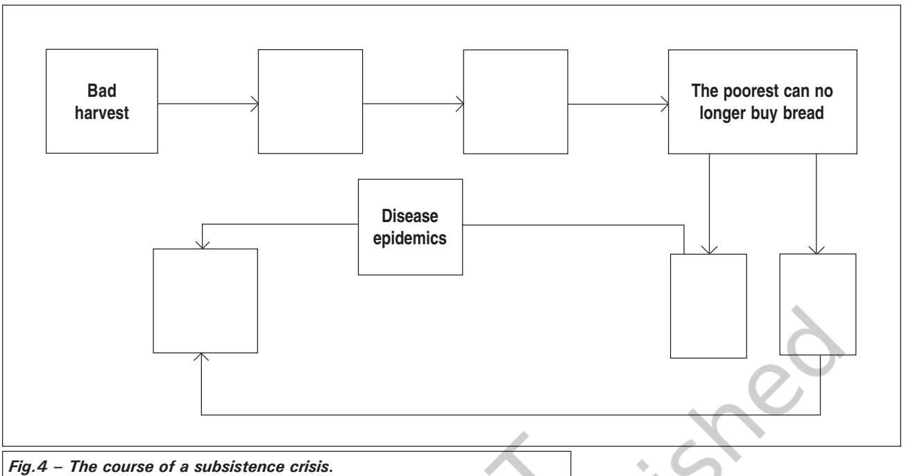

### **1.3 A Growing Middle Class Envisages an End to Privileges**

In the past, peasants and workers had participated in revolts against increasing taxes and food scarcity. But they lacked the means and programmes to carry out full-scale measures that would bring about a change in the social and economic order. This was left to those groups within the third estate who had become prosperous and had access to education and new ideas.

The eighteenth century witnessed the emergence of social groups, termed the middle class, who earned their wealth through an expanding overseas trade and from the manufacture of goods such as woollen and silk textiles that were either exported or bought by the richer members of society. In addition to merchants and manufacturers, the third estate included professions such as lawyers or administrative officials. All of these were educated and believed that no group in society should be privileged by birth. Rather, a person's social position must depend on his merit. These ideas envisaging a society based on freedom and equal laws and opportunities for all, were put forward by philosophers such as John Locke and Jean Jacques Rousseau. In his Two Treatises of Government, Locke sought to refute the doctrine of the divine and absolute right

# Activity

Fill in the blank boxes in Fig. 4 with appropriate terms from among the following:

**Food riots, scarcity of grain, increased number of deaths, rising food prices, weaker bodies.**

2024-25

of the monarch. Rousseau carried the idea forward, proposing a form of government based on a social contract between people and their representatives. In The Spirit of the Laws, Montesquieu proposed a division of power within the government between the legislative, the executive and the judiciary. This model of government was put into force in the USA, after the thirteen colonies declared their independence from Britain. The American constitution and its guarantee of individual rights was an important example for political thinkers in France.

The ideas of these philosophers were discussed intensively in salons and coffee-houses and spread among people through books and newspapers. These were frequently read aloud in groups for the benefit of those who could not read and write. The news that Louis XVI planned to impose further taxes to be able to meet the expenses of the state generated anger and protest against the system of privileges.

#### **Source A**

#### Accounts of lived experiences in the Old Regime

1. Georges Danton, who later became active in revolutionary politics, wrote to a friend in 1793, looking back upon the time when he had just completed his studies:

'I was educated in the residential college of Plessis. There I was in the company of important men … Once my studies ended, I was left with nothing. I started looking for a post. It was impossible to find one at the law courts in Paris. The choice of a career in the army was not open to me as I was not a noble by birth, nor did I have a patron. The church too could not offer me a refuge. I could not buy an office as I did not possess a sou. My old friends turned their backs to me … the system had provided us with an education without however offering a field where our talents could be utilised.'

2. An Englishman, Arthur Young, travelled through France during the years from 1787 to 1789 and wrote detailed descriptions of his journeys. He often commented on what he saw.

'He who decides to be served and waited upon by slaves, ill-treated slaves at that, must be fully aware that by doing so he is placing his property and his life in a situation which is very different from that he would be in, had he chosen the services of free and welltreated men. And he who chooses to dine to the accompaniment of his victims' groans, should not complain if during a riot his daughter gets kidnapped or his son's throat is slit.'

Activity

What message is Young trying to convey here? Whom does he mean when he speaks of' 'slaves'? Who is he criticising? What dangers does he sense in the situation of 1787?

**Source**

### **2 The Outbreak of the Revolution**

Louis XVI had to increase taxes for reasons you have learnt in the previous section. How do you think he could have gone about doing this? In France of the Old Regime the monarch did not have the power to impose taxes according to his will alone. Rather he had to call a meeting of the Estates General which would then pass his proposals for new taxes. The Estates General was a political body to which the three estates sent their representatives. However, the monarch alone could decide when to call a meeting of this body. The last time it was done was in 1614.

On 5 May 1789, Louis XVI called together an assembly of the Estates General to pass proposals for new taxes. A resplendent hall in Versailles was prepared to host the delegates. The first and second estates sent 300 representatives each, who were seated in rows facing each other on two sides, while the 600 members of the third estate had to stand at the back. The third estate was represented by its more prosperous and educated members. Peasants, artisans and women were denied entry to the assembly. However, their grievances and demands were listed in some 40,000 letters which the representatives had brought with them.

Voting in the Estates General in the past had been conducted according to the principle that each estate had one vote. This time too Louis XVI was determined to continue the same practice. But members of the third estate demanded that voting now be conducted by the assembly as a whole, where each member would have one vote. This was one of the democratic principles put forward by philosophers like Rousseau in his book The Social Contract. When the king rejected this proposal, members of the third estate walked out of the assembly in protest.

The representatives of the third estate viewed themselves as spokesmen for the whole French nation. On 20 June they assembled in the hall of an indoor tennis court in the grounds of Versailles. They declared themselves a National Assembly and swore not to disperse till they had drafted a constitution for France that would limit the powers of the monarch. They were led by Mirabeau and Abbé Sieyès. Mirabeau was born in a noble family but was convinced of the need to do away with a society of feudal privilege. He brought out a journal and delivered powerful speeches to the crowds assembled at Versailles.

### **Some important dates** 1774

Louis XVI becomes king of France, faces empty treasury and growing discontent within society of the Old Regime.

#### 1789

Convocation of Estates General, Third Estate forms National Assembly, the Bastille is stormed, peasant revolts in the countryside.

#### 1791

A constitution is framed to limit the powers of the king and to guarantee basic rights to all human beings.

#### 1792-93

France becomes a republic, the king is beheaded.

Overthrow of the Jacobin republic, a Directory rules France.

#### 1804

Napoleon becomes emperor of France, annexes large parts of Europe.

#### 1815

Napoleon defeated at Waterloo.

### Activity

Representatives of the Third Estate take the oath raising their arms in the direction of Bailly, the President of the Assembly, standing on a table in the centre. Do you think that during the actual event Bailly would have stood with his back to the assembled deputies? What could have been David's intention in placing Bailly (Fig.5) the way he has done?

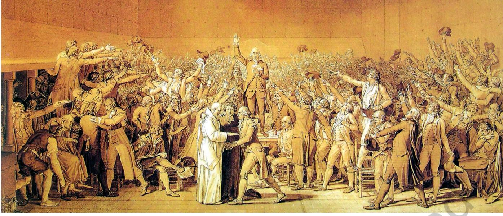

Fig.5 – The Tennis Court Oath. Preparatory sketch for a large painting by Jacques-Louis David. The painting was intended to be hung in the National Assembly.

Abbé Sieyès, originally a priest, wrote an influential pamphlet called 'What is the Third Estate'?

While the National Assembly was busy at Versailles drafting a constitution, the rest of France seethed with turmoil. A severe winter had meant a bad harvest; the price of bread rose, often bakers exploited the situation and hoarded supplies. After spending hours in long queues at the bakery, crowds of angry women stormed into the shops. At the same time, the king ordered troops to move into Paris. On 14 July, the agitated crowd stormed and destroyed the Bastille.

In the countryside rumours spread from village to village that the lords of the manor had hired bands of brigands who were on their way to destroy the ripe crops. Caught in a frenzy of fear, peasants in several districts seized hoes and pitchforks and attacked chateaux. They looted hoarded grain and burnt down documents containing records of manorial dues. A large number of nobles fled from their homes, many of them migrating to neighbouring countries.

Faced with the power of his revolting subjects, Louis XVI finally accorded recognition to the National Assembly and accepted the principle that his powers would from now on be checked by a constitution. On the night of 4 August 1789, the Assembly passed a decree abolishing the feudal system of obligations and taxes. Members of the clergy too were forced to give up their privileges. Tithes were abolished and lands owned by the Church were confiscated. As a result, the government acquired assets worth at least 2 billion livres.

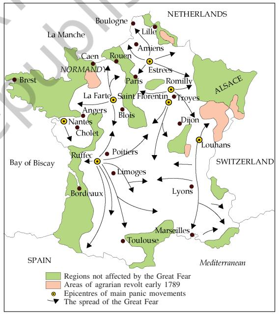

Fig.6 – The spread of the Great Fear. The map shows how bands of peasants spread from one point to another.

### New words

Chateau (pl. chateaux) – Castle or stately residence belonging to a king or a nobleman Manor – An estate consisting of the lord's lands and his mansion

### **2.1 France Becomes a Constitutional Monarchy**

The National Assembly completed the draft of the constitution in 1791. Its main object was to limit the powers of the monarch. These powers instead of being concentrated in the hands of one person, were now separated and assigned to different institutions – the legislature, executive and judiciary. This made France a constitutional monarchy. Fig. 7 explains how the new political system worked.

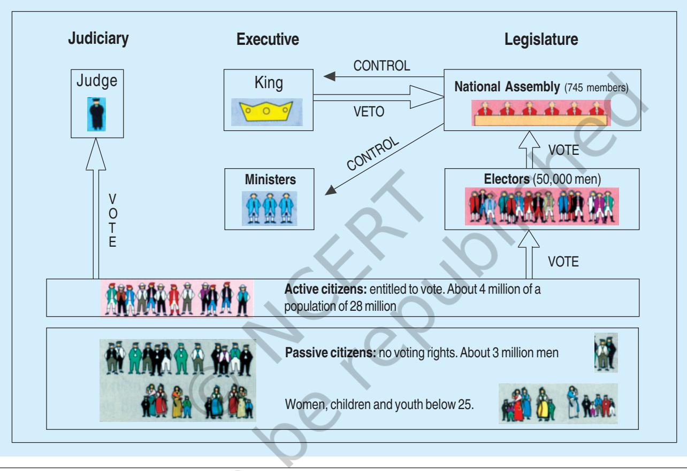

Fig.7 – The Political sytstem under the Constitution of 1791.

The Constitution of 1791 vested the power to make laws in the National Assembly, which was indirectly elected. That is, citizens voted for a group of electors, who in turn chose the Assembly. Not all citizens, however, had the right to vote. Only men above 25 years of age who paid taxes equal to at least 3 days of a labourer's wage were given the status of active citizens, that is, they were entitled to vote. The remaining men and all women were classed as passive citizens. To qualify as an elector and then as a member of the Assembly, a man had to belong to the highest bracket of taxpayers.

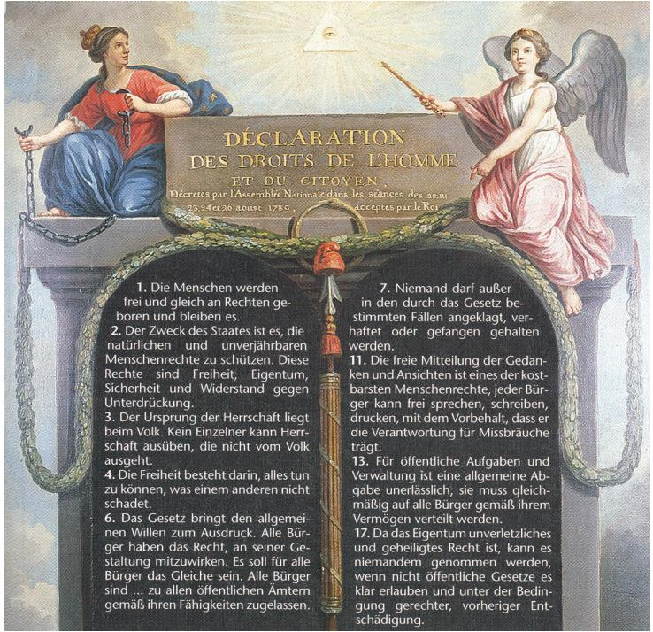

The Constitution began with a Declaration of the Rights of Man and Citizen. Rights such as the right to life, freedom of speech, freedom of opinion, equality before law, were established as 'natural and inalienable' rights, that is, they belonged to each human being by birth and could not be taken away. It was the duty of the state to protect each citizen's natural rights.

#### **Source B**

The revolutionary journalist Jean-Paul Marat commented in his newspaper L'Ami du peuple (The friend of the people) on the Constitution drafted by the National Assembly:

'The task of representing the people has been given to the rich … the lot of the poor and oppressed will never be improved by peaceful means alone. Here we have absolute proof of how wealth

influences the law. Yet laws will last only as long as the people agree to obey them. And when they have managed to cast off the yoke of the aristocrats, they will do the same to the other owners of wealth.'

Source: An extract from the newspaper L'Ami du peuple. Fig.8 – The Declaration of the Rights of Man and Citizen, painted by the artist Le Barbier in 1790. The figure on the right represents France. The figure on the left symbolises the law.

#### **Source C**

#### The Declaration of Rights of Man and Citizen

1. Men are born and remain free and equal in rights.

2. The aim of every political association is the preservation of the natural and inalienable rights of man; these are liberty, property, security and resistance to oppression.

3. The source of all sovereignty resides in the nation; no group or individual may exercise authority that does not come from the people.

4. Liberty consists of the power to do whatever is not injurious to others.

5. The law has the right to forbid only actions that are injurious to society.

6. Law is the expression of the general will. All citizens have the right to participate in its formation, personally or through their representatives. All citizens are equal before it.

7. No man may be accused, arrested or detained, except in cases determined by the law.

11. Every citizen may speak, write and print freely; he must take responsibility for the abuse of such liberty in cases determined by the law.

12. For the maintenance of the public force and for the expenses of administration a common tax is indispensable; it must be assessed equally on all citizens in proportion to their means.

17. Since property is a sacred and inviolable right, no one may be deprived of it, unless a legally established public necessity requires it. In that case a just compensation must be given in advance.

# **Reading political symbols**

The majority of men and women in the eighteenth century could not read or write. So images and symbols were frequently used instead of printed words to communicate important ideas. The painting by Le Barbier (Fig. 8) uses many such symbols to convey the content of the Declaration of Rights. Let us try to read these symbols.

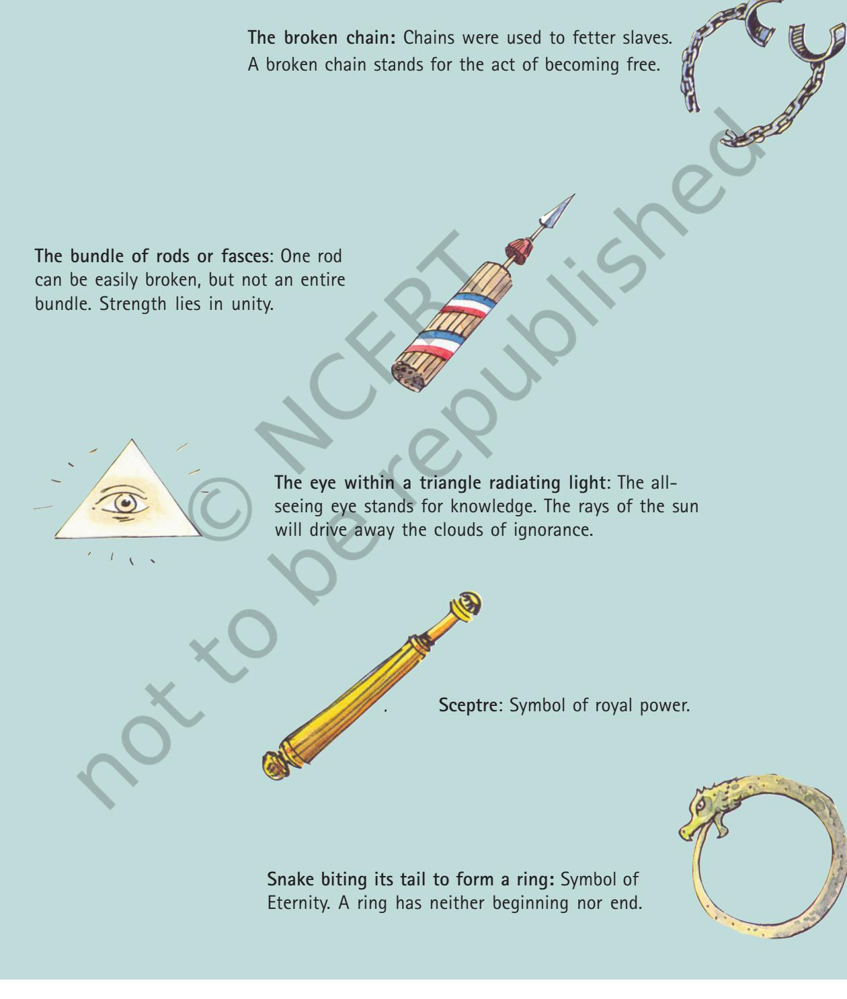

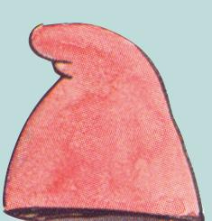

**Red Phrygian cap:** Cap worn by a slave upon becoming free.

**Blue-white-red**: The national colours of France.

**The winged woman:** Personification of the law.

**The Law Tablet:** The law is the same for all, and all are equal before it.

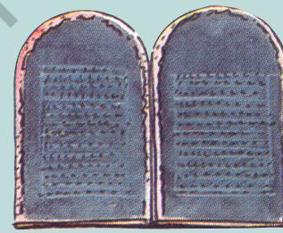

### Activity

- 1. Identify the symbols in Box 1 which stand for liberty, equality and fraternity.
- 2. Explain the meaning of the painting of the Declaration of Rights of Man and Citizen (Fig. 8) by reading only the symbols.
- 3. Compare the political rights which the Constitution of 1791 gave to the citizens with Articles 1 and 6 of the Declaration (Source C). Are the two documents consistent? Do the two documents convey the same idea?
- 4. Which groups of French society would have gained from the Constitution of 1791? Which groups would have had reason to be dissatisfied? What developments does Marat (Source B) anticipate in the future?
- 5. Imagine the impact of the events in France on neighbouring countries such as Prussia, Austria-Hungary or Spain, all of which were absolute monarchies. How would the kings, traders, peasants, nobles or members of the clergy here have reacted to the news of what was happening in France?

### **3 France Abolishes Monarchy and Becomes a Republic**

The situation in France continued to be tense during the following years. Although Louis XVI had signed the Constitution, he entered into secret negotiations with the King of Prussia. Rulers of other neighbouring countries too were worried by the developments in France and made plans to send troops to put down the events that had been taking place there since the summer of 1789. Before this could happen, the National Assembly voted in April 1792 to declare war against Prussia and Austria. Thousands of volunteers thronged from the provinces to join the army. They saw this as a war of the people against kings and aristocracies all over Europe. Among the patriotic songs they sang was the Marseillaise, composed by the poet Roget de L'Isle. It was sung for the first time by volunteers from Marseilles as they marched into Paris and so got its name. The Marseillaise is now the national anthem of France.

The revolutionary wars brought losses and economic difficulties to the people. While the men were away fighting at the front, women were left to cope with the tasks of earning a living and looking after their families. Large sections of the population were convinced that the revolution had to be carried further, as the Constitution of 1791 gave political rights only to the richer sections of society. Political clubs became an important rallying point for people who wished to discuss government policies and plan their own forms of action. The most successful of these clubs was that of the Jacobins, which got its name from the former convent of St Jacob in Paris. Women too, who had been active throughout this period, formed their own clubs. Section 4 of this chapter will tell you more about their activities and demands.

The members of the Jacobin club belonged mainly to the less prosperous sections of society. They included small shopkeepers, artisans such as shoemakers, pastry cooks, watch-makers, printers, as well as servants and daily-wage workers. Their leader was Maximilian Robespierre. A large group among the Jacobins decided to start wearing long striped trousers similar to those worn by dock workers. This was to set themselves apart from the fashionable sections of society, especially nobles, who wore knee breeches. It

### New words

Convent – Building belonging to a community devoted to a religious life

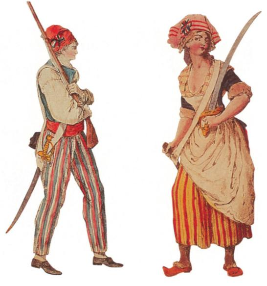

Fig.9 – A sans-culottes couple.

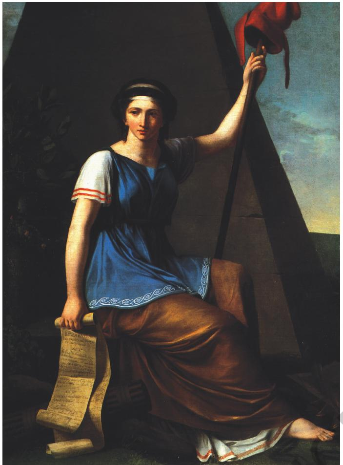

Fig.10 – Nanine Vallain, Liberty.

This is one of the rare paintings by a woman artist. The revolutionary events made it possible for women to train with established painters and to exhibit their works in the Salon, which was an exhibition held every two years.

The painting is a female allegory of liberty – that is, the female form symbolises the idea of freedom.

### Activity

Look carefully at the painting and identify the objects which are political symbols you saw in Box 1 (broken chain, red cap, fasces, Charter of the Declaration of Rights). The pyramid stands for equality, often represented by a triangle. Use the symbols to interpret the painting. Describe your impressions of the female figure of liberty.

was a way of proclaiming the end of the power wielded by the wearers of knee breeches. These Jacobins came to be known as the sans-culottes, literally meaning 'those without knee breeches'. Sansculottes men wore in addition the red cap that symbolised liberty. Women however were not allowed to do so.

In the summer of 1792 the Jacobins planned an insurrection of a large number of Parisians who were angered by the short supplies and high prices of food. On the morning of August 10 they stormed the Palace of the Tuileries, massacred the king's guards and held the king himself as hostage for several hours. Later the Assembly voted to imprison the royal family. Elections were held. From now on all men of 21 years and above, regardless of wealth, got the right to vote.

The newly elected assembly was called the Convention. On 21 September 1792 it abolished the monarchy and declared France a republic. As you know, a republic is a form of government where the people elect the government including the head of the government. There is no hereditary monarchy. You can try and find out about some other countries that are republics and investigate when and how they became so.

Louis XVI was sentenced to death by a court on the charge of treason. On 21 January 1793 he was executed publicly at the Place de la Concorde. The queen Marie Antoinette met with the same fate shortly after.

### **3.1 The Reign of Terror**

The period from 1793 to 1794 is referred to as the Reign of Terror. Robespierre followed a policy of severe control and punishment. All those whom he saw as being 'enemies' of the republic – ex-nobles and clergy, members of other political parties, even members of his own party who did not agree with his methods – were arrested, imprisoned and then tried by a revolutionary tribunal. If the court found them 'guilty' they were guillotined. The guillotine is a device consisting of two poles and a blade with which a person is beheaded. It was named after Dr Guillotin who invented it.

Robespierre's government issued laws placing a maximum ceiling on wages and prices. Meat and bread were rationed. Peasants were forced to transport their grain to the cities and sell it at prices fixed by the government. The use of more expensive white flour was forbidden; all citizens were required to eat the pain d'égalité (equality bread), a loaf made of wholewheat. Equality was also sought to be practised through forms of speech and address. Instead of the traditional Monsieur (Sir) and Madame (Madam) all French men and women were henceforth Citoyen and Citoyenne (Citizen). Churches were shut down and their buildings converted into barracks or offices.

Robespierre pursued his policies so relentlessly that even his supporters began to demand moderation. Finally, he was convicted by a court in July 1794, arrested and on the next day sent to the guillotine.

### Activity

Compare the views of Desmoulins and Robespierre. How does each one understand the use of state force? What does Robespierre mean by 'the war of liberty against tyranny'? How does Desmoulins perceive liberty? Refer once more to Source C. What did the constitutional laws on the rights of individuals lay down? Discuss your views on the subject in class.

### New words

Treason – Betrayal of one's country or government

### **Source D**

#### What is liberty? Two conflicting views:

The revolutionary journalist Camille Desmoulins wrote the following in 1793. He was executed shortly after, during the Reign of Terror.

'Some people believe that Liberty is like a child, which needs to go through a phase of being disciplined before it attains maturity. Quite the opposite. Liberty is Happiness, Reason, Equality, Justice, it is the Declaration of Rights … You would like to finish off all your enemies by guillotining them. Has anyone heard of something more senseless? Would it be possible to bring a single person to the scaffold without making ten more enemies among his relations and friends?'

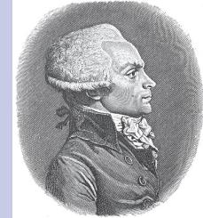

On 7 February 1794, Robespierre made a speech at the Convention, which was then carried by the newspaper Le Moniteur Universel. Here is an extract from it:

'To establish and consolidate democracy, to achieve the peaceful rule of constitutional laws, we must first finish the war of liberty against tyranny …. We must annihilate the enemies of the republic at home and abroad, or else we shall perish. In time of Revolution a democratic government may rely on terror. Terror is nothing but justice, swift, severe and inflexible; … and is used to meet the most urgent needs of the fatherland. To curb the enemies of Liberty through terror is the right of the founder of the Republic.'

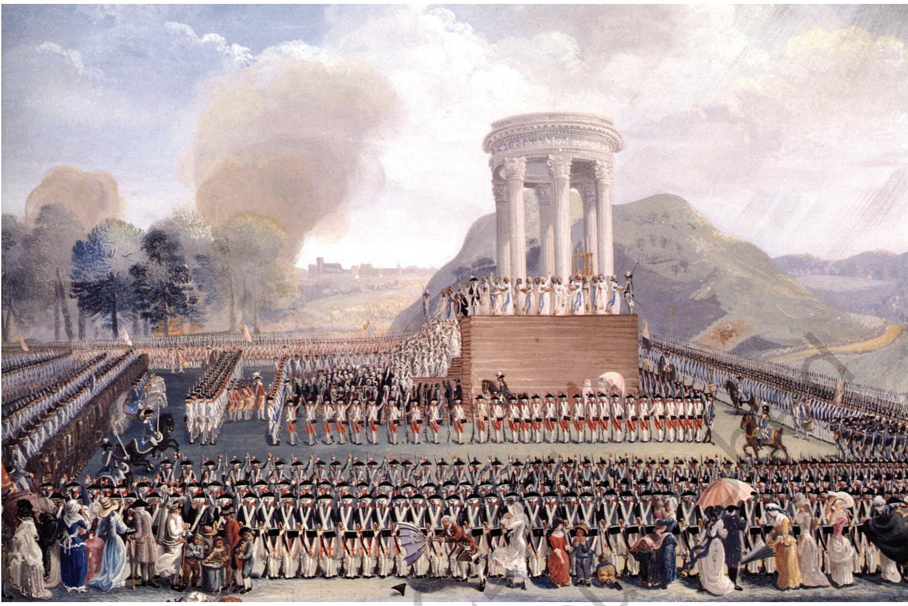

Fig.11 – The revolutionary government sought to mobilise the loyalty of its subjects through various means – one of them was the staging of festivals like this one. Symbols from civilisations of ancient Greece and Rome were used to convey the aura of a hallowed history. The pavilion on the raised platform in the middle carried by classical columns was made of perishable material that could be dismantled. Describe the groups of people, their clothes, their roles and actions. What impression of a revolutionary festival does this image convey?

### **3.2 A Directory Rules France**

The fall of the Jacobin government allowed the wealthier middle classes to seize power. A new constitution was introduced which denied the vote to non-propertied sections of society. It provided for two elected legislative councils. These then appointed a Directory, an executive made up of five members. This was meant as a safeguard against the concentration of power in a one-man executive as under the Jacobins. However, the Directors often clashed with the legislative councils, who then sought to dismiss them. The political instability of the Directory paved the way for the rise of a military dictator, Napoleon Bonaparte.

Through all these changes in the form of government, the ideals of freedom, of equality before the law and of fraternity remained inspiring ideals that motivated political movements in France and the rest of Europe during the following century.

### **4 Did Women have a Revolution?**

Fig.12 – Parisian women on their way to Versailles. This print is one of the many pictorial representations of the events of 5 October 1789, when women marched to Versailles and brought the king back with them to Paris.

From the very beginning women were active participants in the events which brought about so many important changes in French society. They hoped that their involvement would pressurise the revolutionary government to introduce measures to improve their lives. Most women of the third estate had to work for a living. They worked as seamstresses or laundresses, sold flowers, fruits and vegetables at the market, or were employed as domestic servants in the houses of prosperous people. Most women did not have access to education or job training. Only daughters of nobles or wealthier members of the third estate could study at a convent, after which their families arranged a marriage for them. Working women had also to care for their families, that is, cook, fetch water, queue up for bread and look after the children. Their wages were lower than those of men.

In order to discuss and voice their interests women started their own political clubs and newspapers. About sixty women's clubs came up in different French cities. The Society of Revolutionary and Republican Women was the most famous of them. One of their

### Activity

Describe the persons represented in Fig. 12 – their actions, their postures, the objects they are carrying. Look carefully to see whether all of them come from the same social group. What symbols has the artist included in the image? What do they stand for? Do the actions of the women reflect traditional ideas of how women were expected to behave in public? What do you think: does the artist sympathise with the women's activities or is he critical of them? Discuss your views in the class.

main demands was that women enjoy the same political rights as men. Women were disappointed that the Constitution of 1791 reduced them to passive citizens. They demanded the right to vote, to be elected to the Assembly and to hold political office. Only then, they felt, would their interests be represented in the new government.

In the early years, the revolutionary government did introduce laws that helped improve the lives of women. Together with the creation of state schools, schooling was made compulsory for all girls. Their fathers could no longer force them into marriage against their will. Marriage was made into a contract entered into freely and registered under civil law. Divorce was made legal, and could be applied for by both women and men. Women could now train for jobs, could become artists or run small businesses.

Women's struggle for equal political rights, however, continued. During the Reign of Terror, the new government issued laws ordering closure of women's clubs and banning their political activities. Many prominent women were arrested and a number of them executed.

Women's movements for voting rights and equal wages continued through the next two hundred years in many countries of the world. The fight for the vote was carried out through an international suffrage movement during the late nineteenth and early twentieth centuries. The example of the political activities of French women during the revolutionary years was kept alive as an inspiring memory. It was finally in 1946 that women in France won the right to vote.

### **Source E**

### **The life of a revolutionary woman – Olympe de Gouges (1748-1793)**

Olympe de Gouges was one of the most important of the politically active women in revolutionary France. She protested against the Constitution and the Declaration of Rights of Man and Citizen as they excluded women from basic rights that each human being was entitled to. So, in 1791, she wrote a Declaration of the Rights of Woman and Citizen, which she addressed to the Queen and to the members of the National Assembly, demanding that they act upon it. In 1793, Olympe de Gouges criticised the Jacobin government for forcibly closing down women's clubs. She was tried by the National Convention, which charged her with treason. Soon after this she was executed.

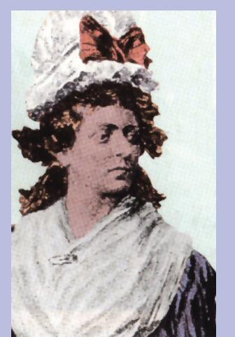

#### Some of the basic rights set forth in Olympe de Gouges' Declaration.

- 1. Woman is born free and remains equal to man in rights.
- 2. The goal of all political associations is the preservation of the natural rights of woman and man: These rights are liberty, property, security, and above all resistance to oppression.
- 3. The source of all sovereignty resides in the nation, which is nothing but the union of woman and man.
- 4. The law should be the expression of the general will; all female and male citizens should have a say either personally or by their representatives in its formulation; it should be the same for all. All female and male citizens are equally entitled to all honours and public employment according to their abilities and without any other distinction than that of their talents.
- 5. No woman is an exception; she is accused, arrested, and detained in cases determined by law. Women, like men, obey this rigorous law.

### Activity

Compare the manifesto drafted by Olympe de Gouges (Source F) with the Declaration of the Rights of Man and Citizen (Source C).

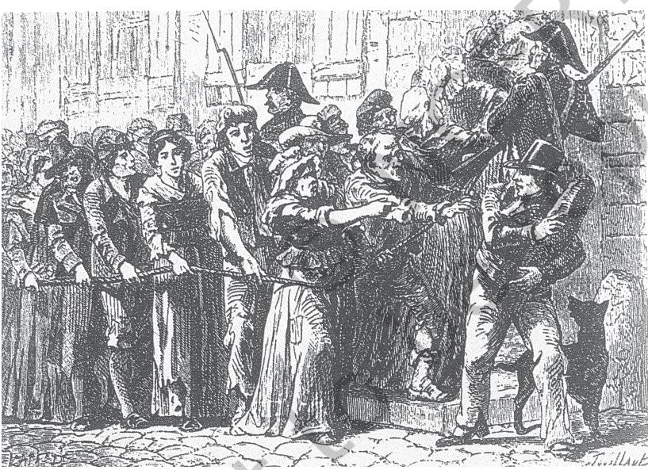

Fig.13 – Women queuing up at a bakery.

### Activity

Imagine yourself to be one of the women in Fig. 13. Formulate a response to the arguments put forward by Chaumette (Source G).

### **Source G**

In 1793, the Jacobin politician Chaumette sought to justify the closure of women's clubs on the following grounds:

'Has Nature entrusted domestic duties to men? Has she given us breasts to nurture babies?

#### No.

She said to Man:

Be a man. Hunting, agriculture, political duties … that is your kingdom.

She said to Woman:

Be a woman … the things of the household, the sweet duties of motherhood – those are your tasks.

Shameless are those women, who wish to become men. Have not duties been fairly distributed?'

# **5 The Abolition of Slavery**

One of the most revolutionary social reforms of the Jacobin regime was the abolition of slavery in the French colonies. The colonies in the Caribbean – Martinique, Guadeloupe and San Domingo – were important suppliers of commodities such as tobacco, indigo, sugar and coffee. But the reluctance of Europeans to go and work in distant and unfamiliar lands meant a shortage of labour on the plantations. So this was met by a triangular slave trade between Europe, Africa and the Americas. The slave trade began in the seventeenth century. French merchants sailed from the ports of Bordeaux or Nantes to the African coast, where they bought slaves from local chieftains. Branded and shackled, the slaves were packed tightly into ships for the three-month long voyage across the Atlantic to the Caribbean. There they were sold to plantation owners. The exploitation of slave labour made it possible to meet the growing demand in European markets for sugar, coffee, and indigo. Port cities like Bordeaux and Nantes owed their economic prosperity to the flourishing slave trade.

Throughout the eighteenth century there was little criticism of slavery in France. The National Assembly held long debates about whether the rights of man should be extended to all French subjects including those in the colonies. But it did not pass any laws, fearing opposition from businessmen whose incomes depended on the slave trade. It was finally the Convention which in 1794 legislated to free all slaves in the French overseas possessions. This, however, turned out to be a short-term measure: ten years later, Napoleon reintroduced slavery. Plantation owners understood their freedom as including the right to enslave African Negroes in pursuit of their economic interests. Slavery was finally abolished in French colonies in 1848.

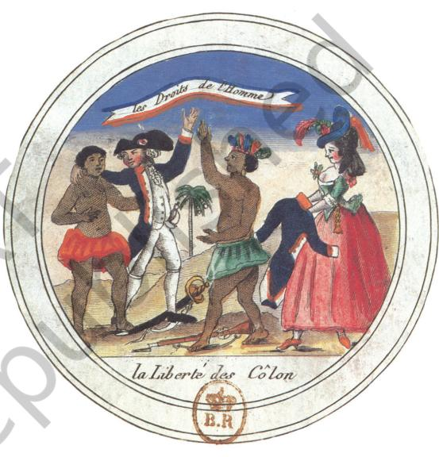

Fig.14 – The emancipation of slaves. This print of 1794 describes the emancipation of slaves. The tricolour banner on top carries the slogan: 'The rights of man'. The inscription below reads: 'The freedom of the unfree'. A French woman prepares to 'civilise' the African and American Indian slaves by giving them European clothes to wear.

### New words

Negroes – A term used for the indigenous people of Africa south of the Sahara. It is a derogatory term not in common use any longer

Emancipation – The act of freeing

### Activity

Record your impressions of this print (Fig. 14). Describe the objects lying on the ground. What do they symbolise? What attitude does the picture express towards non-European slaves?

### **6 The Revolution and Everyday Life**

Can politics change the clothes people wear, the language they speak or the books they read? The years following 1789 in France saw many such changes in the lives of men, women and children. The revolutionary governments took it upon themselves to pass laws that would translate the ideals of liberty and equality into everyday practice.

One important law that came into effect soon after the storming of the Bastille in the summer of 1789 was the abolition of censorship. In the Old Regime all written material and cultural activities – books, newspapers, plays – could be published or performed only after they had been approved by the censors of the king. Now the Declaration of the Rights of Man and Citizen proclaimed freedom of speech and expression to be a natural right. Newspapers, pamphlets, books and printed pictures flooded the towns of France from where they travelled rapidly into the countryside. They all described and discussed the events and changes taking place in France. Freedom of the press also meant that opposing views of events could be expressed. Each side sought to convince the others of its position through the medium of print. Plays, songs and festive processions attracted large numbers of people. This was one way they could grasp and identify with ideas such as liberty or justice that political philosophers wrote about at length in texts which only a handful of educated people could read.

# Activity

Describe the picture in your own words. What are the images that the artist has used to communicate the following ideas: greed, equality, justice, takeover by the state of the assets of the church?

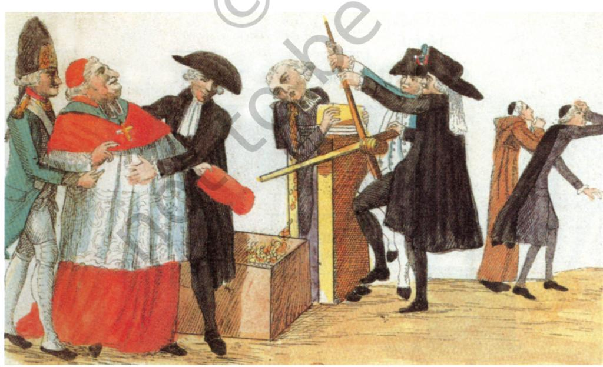

Fig.15 – The patriotic fat-reducing press. This anonymous print of 1790 seeks to make the idea of justice tangible.

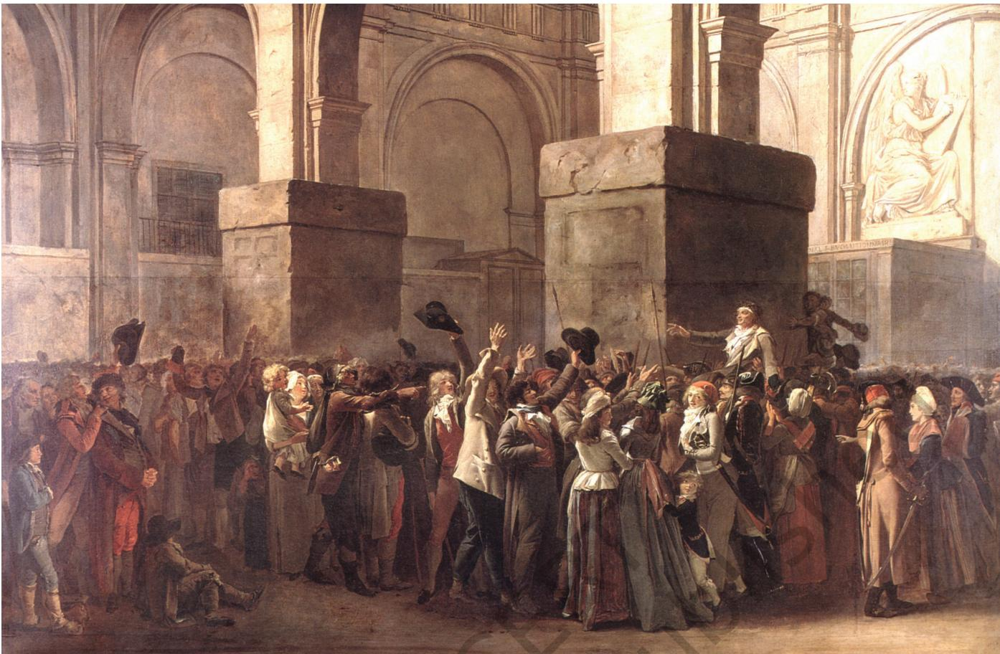

Fig.16 - Marat addressing the people. This is a painting by Louis-Leopold Boilly. Recall what you have learnt about Marat in this chapter. Describe the scene around him. Account for his great popularity. What kinds of reactions would a painting like this produce among viewers in the Salon?

### **Conclusion**

In 1804, Napoleon Bonaparte crowned himself Emperor of France. He set out to conquer neighbouring European countries, dispossessing dynasties and creating kingdoms where he placed members of his family. Napoleon saw his role as a moderniser of Europe. He introduced many laws such as the protection of private property and a uniform system of weights and measures provided by the decimal system. Initially, many saw Napoleon as a liberator who would bring freedom for the people. But soon the Napoleonic armies came to be viewed everywhere as an invading force. He was finally defeated at Waterloo in 1815. Many of his measures that carried the revolutionary ideas of liberty and modern laws to other parts of Europe had an impact on people long after Napoleon had left.

The ideas of liberty and democratic rights were the most important legacy of the French Revolution. These spread from France to the rest of Europe during the nineteenth century, where feudal systems

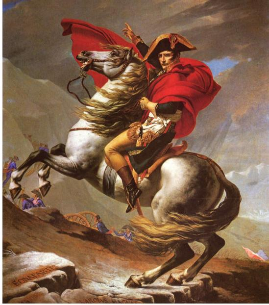

**T h e F r e n c h R e v o l u t i o n**

were abolished. Colonised peoples reworked the idea of freedom from bondage into their movements to create a sovereign nation state. Tipu Sultan and Rammohan Roy are two examples of individuals who responded to the ideas coming from revolutionary France.

#### **Box 2**

Raja Rammohan Roy was one of those who was inspired by new ideas that were spreading through Europe at that time. The French Revolution and later, the July Revolution excited his imagination.

'He could think and talk of nothing else when he heard of the July Revolution in France in 1830. On his way to England at Cape Town he insisted on visiting frigates (warships) flying the revolutionary tri-colour flag though he had been temporarily lamed by an accident.'

Susobhan Sarkar, Notes on the Bengal Renaissance 1946.

### Activities

- 1. Find out more about any one of the revolutionary figures you have read about in this chapter. Write a short biography of this person.
- 2. The French Revolution saw the rise of newspapers describing the events of each day and week. Collect information and pictures on any one event and write a newspaper article. You could also conduct an imaginary interview with important personages such as Mirabeau, Olympe de Gouges or Robespierre. Work in groups of two or three. Each group could then put up their articles on a board to produce a wallpaper on the French Revolution.

### Questions

- 1. Describe the circumstances leading to the outbreak of revolutionary protest in France.
- 2. Which groups of French society benefited from the revolution? Which groups were forced to relinquish power? Which sections of society would have been disappointed with the outcome of the revolution?
- 3. Describe the legacy of the French Revolution for the peoples of the world during the nineteenth and twentieth centuries.
- 4. Draw up a list of democratic rights we enjoy today whose origins could be traced to the French Revolution.
- 5. Would you agree with the view that the message of universal rights was beset with contradictions? Explain.
- 6. How would you explain the rise of Napoleon?

Activities

?

**India and the Contemporary World**

