# **Socialism in Europe and the Russian Revolution**

### **1 The Age of Social Change**

In the previous chapter you read about the powerful ideas of freedom and equality that circulated in Europe after the French Revolution. The French Revolution opened up the possibility of creating a dramatic change in the way in which society was structured. As you have read, before the eighteenth century society was broadly divided into estates and orders and it was the aristocracy and church which controlled economic and social power. Suddenly, after the revolution, it seemed possible to change this. In many parts of the world including Europe and Asia, new ideas about individual rights and who controlled social power began to be discussed. In India, Raja Rammohan Roy and Derozio talked of the significance of the French Revolution, and many others debated the ideas of post-revolutionary Europe. The developments in the colonies, in turn, reshaped these ideas of societal change.

Not everyone in Europe, however, wanted a complete transformation of society. Responses varied from those who accepted that some change was necessary but wished for a gradual shift, to those who wanted to restructure society radically. Some were 'conservatives', others were 'liberals' or 'radicals'. What did these terms really mean in the context of the time? What separated these strands of politics and what linked them together? We must remember that these terms do not mean the same thing in all contexts or at all times.

We will look briefly at some of the important political traditions of the nineteenth century, and see how they influenced change. Then we will focus on one historical event in which there was an attempt at a radical transformation of society. Through the revolution in Russia, socialism became one of the most significant and powerful ideas to shape society in the twentieth century.

### **1.1 Liberals, Radicals and Conservatives**

One of the groups which looked to change society were the liberals. Liberals wanted a nation which tolerated all religions. We should remember that at this time European states usually discriminated in **Chapter II**

25

favour of one religion or another (Britain favoured the Church of England, Austria and Spain favoured the Catholic Church). Liberals also opposed the uncontrolled power of dynastic rulers. They wanted to safeguard the rights of individuals against governments. They argued for a representative, elected parliamentary government, subject to laws interpreted by a well-trained judiciary that was independent of rulers and officials. However, they were not 'democrats'. They did not believe in universal adult franchise, that is, the right of every citizen to vote. They felt men of property mainly should have the vote. They also did not want the vote for women.

In contrast, radicals wanted a nation in which government was based on the majority of a country's population. Many supported women's suffragette movements. Unlike liberals, they opposed the privileges of great landowners and wealthy factory owners. They were not against the existence of private property but disliked concentration of property in the hands of a few.

Conservatives were opposed to radicals and liberals. After the French Revolution, however, even conservatives had opened their minds to the need for change. Earlier, in the eighteenth century, conservatives had been generally opposed to the idea of change. By the nineteenth century, they accepted that some change was inevitable but believed that the past had to be respected and change had to be brought about through a slow process.

Such differing ideas about societal change clashed during the social and political turmoil that followed the French Revolution. The various attempts at revolution and national transformation in the nineteenth century helped define both the limits and potential of these political tendencies.

#### **1.2 Industrial Society and Social Change**

These political trends were signs of a new time. It was a time of profound social and economic changes. It was a time when new cities came up and new industrialised regions developed, railways expanded and the Industrial Revolution occurred.

Industrialisation brought men, women and children to factories. Work hours were often long and wages were poor. Unemployment was common, particularly during times of low demand for industrial goods. Housing and sanitation were problems since towns were growing rapidly. Liberals and radicals searched for solutions to these issues.

#### New words

Suffragette movement – A movement to give women the right to vote.

**India and the Contemporary World**

Almost all industries were the property of individuals. Liberals and radicals themselves were often property owners and employers. Having made their wealth through trade or industrial ventures, they felt that such effort should be encouraged – that its benefits would be achieved if the workforce in the economy was healthy and citizens were educated. Opposed to the privileges the old aristocracy had by birth, they firmly believed in the value of individual effort, labour and enterprise. If freedom of individuals was ensured, if the poor could labour, and those with capital could operate without restraint, they believed that societies would develop. Many working men and women who wanted changes in the world rallied around liberal and radical groups and parties in the early nineteenth century.

Some nationalists, liberals and radicals wanted revolutions to put an end to the kind of governments established in Europe in 1815. In France, Italy, Germany and Russia, they became revolutionaries and worked to overthrow existing monarchs. Nationalists talked of revolutions that would create 'nations' where all citizens would have equal rights. After 1815, Giuseppe Mazzini, an Italian nationalist, conspired with others to achieve this in Italy. Nationalists elsewhere – including India – read his writings.

#### **1.3 The Coming of Socialism to Europe**

Perhaps one of the most far-reaching visions of how society should be structured was socialism. By the mid - nineteenth century in Europe, socialism was a well-known body of ideas that attracted widespread attention.

Socialists were against private property, and saw it as the root of all social ills of the time. Why? Individuals owned the property that gave employment but the propertied were concerned only with personal gain and not with the welfare of those who made the property productive. So if society as a whole rather than single individuals controlled property, more attention would be paid to collective social interests. Socialists wanted this change and campaigned for it.

How could a society without property operate? What would be the basis of socialist society?

Socialists had different visions of the future. Some believed in the idea of cooperatives. Robert Owen (1771-1858), a leading English manufacturer, sought to build a cooperative community called New Harmony in Indiana (USA). Other socialists felt that cooperatives could not be built on a wide scale only through individual initiative: they demanded that governments encourage cooperatives. In France, for instance, Louis Blanc (1813-1882) wanted the government to encourage cooperatives and replace capitalist enterprises. These cooperatives were to be associations of people who produced goods together and divided the profits according to the work done by members.

Karl Marx (1818-1883) and Friedrich Engels (1820-1895) added other ideas to this body of arguments. Marx argued that industrial society was 'capitalist'. Capitalists owned the capital invested in factories, and the profit of capitalists was produced by workers. The conditions of workers could not improve as long as this profit was accumulated by private capitalists. Workers had to overthrow capitalism and the rule of private property. Marx believed that to free themselves from capitalist exploitation, workers had to construct a radically socialist society where all property was socially controlled. This would be a communist society. He was convinced that workers would triumph in their conflict with capitalists. A communist society was the natural society of the future.

### Activity

List two differences between the capitalist and socialist ideas of private property.

**India and the Contemporary World**

### **1.4 Support for Socialism**

By the 1870s, socialist ideas spread through Europe. To coordinate their efforts, socialists formed an international body – namely, the Second International.

Workers in England and Germany began forming associations to fight for better living and working conditions. They set up funds to help members in times of distress and demanded a reduction of working hours and the right to vote. In Germany, these associations worked closely with the Social Democratic Party (SPD) and helped it win parliamentary seats. By 1905, socialists and trade unionists formed a Labour Party in Britain and a Socialist Party in France. However, till 1914, socialists never succeeded in forming a government in Europe. Represented by strong figures in parliamentary politics, their ideas did shape legislation, but governments continued to be run by conservatives, liberals and radicals.

## Activity

Imagine that a meeting has been called in your area to discuss the socialist idea of doing away with private property and introducing collective ownership. Write the speech you would make at the meeting if you are:

- Ø a poor labourer working in the fields
- Ø a medium-level landowner
- Ø a house owner

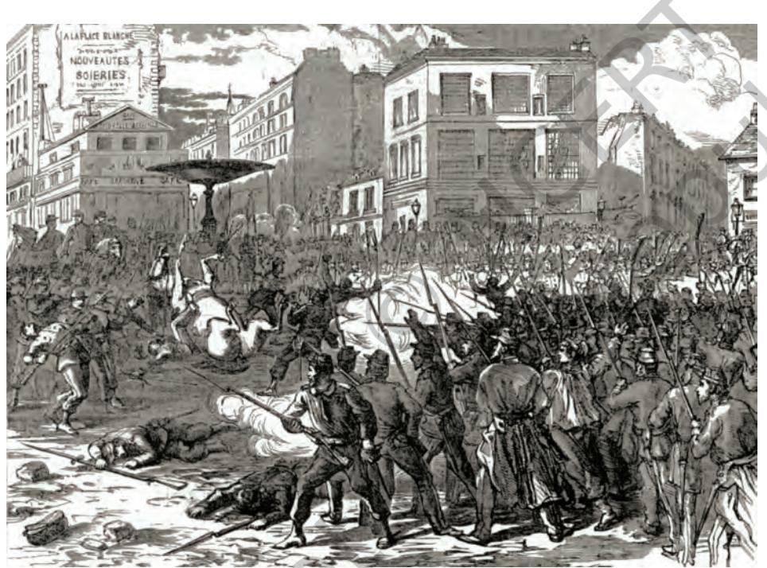

Fig.2 – This is a painting of the Paris Commune of 1871 (From Illustrated London News, 1871). It portrays a scene from the popular uprising in Paris between March and May 1871. This was a period when the town council (commune) of Paris was taken over by a 'peoples' government' consisting of workers, ordinary people, professionals, political activists and others. The uprising emerged against a background of growing discontent against the policies of the French state. The 'Paris Commune' was ultimately crushed by government troops but it was celebrated by Socialists the world over as a prelude to a socialist revolution.The Paris Commune is also popularly remembered for two important legacies: one, for its association with the workers' red flag – that was the flag adopted by the communards ( revolutionaries) in Paris; two, for the 'Marseillaise', originally written as a war song in 1792, it became a symbol of the Commune and of the struggle for liberty.

### **2 The Russian Revolution**

In one of the least industrialised of European states this situation was reversed. Socialists took over the government in Russia through the October Revolution of 1917. The fall of monarchy in February 1917 and the events of October are normally called the Russian Revolution.

How did this come about? What were the social and political conditions in Russia when the revolution occurred? To answer these questions, let us look at Russia a few years before the revolution.

#### **2.1 The Russian Empire in 1914**

In 1914, Tsar Nicholas II ruled Russia and its empire. Besides the territory around Moscow, the Russian empire included current-day Finland, Latvia, Lithuania, Estonia, parts of Poland, Ukraine and Belarus. It stretched to the Pacific and comprised today's Central Asian states, as well as Georgia, Armenia and Azerbaijan. The majority religion was Russian Orthodox Christianity – which had grown out of the Greek Orthodox Church – but the empire also included Catholics, Protestants, Muslims and Buddhists.

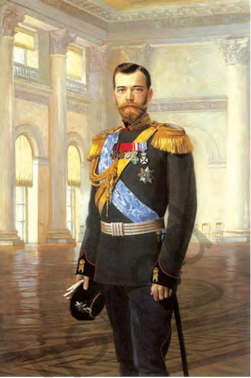

Fig.3 – Tsar Nicholas II in the White Hall of the Winter Palace, St Petersburg, 1900. Painted by Earnest Lipgart (1847-1932)

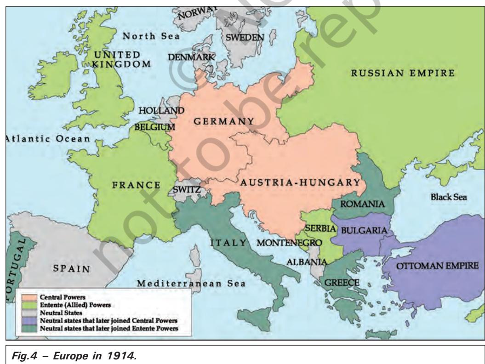

The map shows the Russian empire and the European countries at war during the First World War.

#### **2.2 Economy and Society**

At the beginning of the twentieth century, the vast majority of Russia's people were agriculturists. About 85 per cent of the Russian empire's population earned their living from agriculture. This proportion was higher than in most European countries. For instance, in France and Germany the proportion was between 40 per cent and 50 per cent. In the empire, cultivators produced for the market as well as for their own needs and Russia was a major exporter of grain.

Industry was found in pockets. Prominent industrial areas were St Petersburg and Moscow. Craftsmen undertook much of the production, but large factories existed alongside craft workshops. Many factories were set up in the 1890s, when Russia's railway network was extended, and foreign investment in industry increased. Coal production doubled and iron and steel output quadrupled. By the 1900s, in some areas factory workers and craftsmen were almost equal in number.

Most industry was the private property of industrialists. Government supervised large factories to ensure minimum wages and limited hours of work. But factory inspectors could not prevent rules being broken. In craft units and small workshops, the working day was sometimes 15 hours, compared with 10 or 12 hours in factories. Accommodation varied from rooms to dormitories.

Workers were a divided social group. Some had strong links with the villages from which they came. Others had settled in cities permanently. Workers were divided by skill. A metalworker of St. Petersburg recalled, 'Metalworkers considered themselves aristocrats among other workers. Their occupations demanded more training and skill . . . ' Women made up 31 per cent of the factory labour force by 1914, but they were paid less than men (between half and three-quarters of a man's wage). Divisions among workers showed themselves in dress and manners too. Some workers formed associations to help members in times of unemployment or financial hardship but such associations were few.

Despite divisions, workers did unite to strike work (stop work) when they disagreed with employers about dismissals or work conditions. These strikes took place frequently in the textile industry during 1896-1897, and in the metal industry during 1902.

In the countryside, peasants cultivated most of the land. But the nobility, the crown and the Orthodox Church owned large properties. Like workers, peasants too were divided. They were also

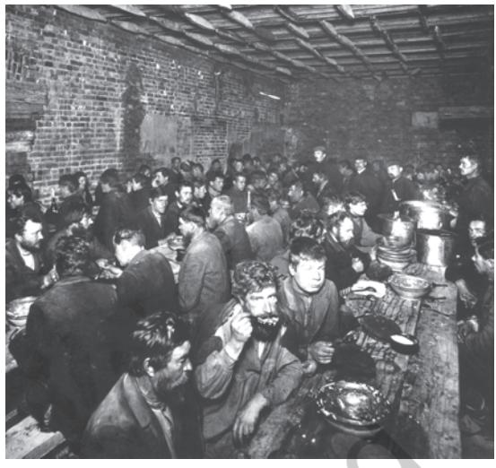

Fig.5 – Unemployed peasants in pre-war St Petersburg. Many survived by eating at charitable kitchens and living in poorhouses.

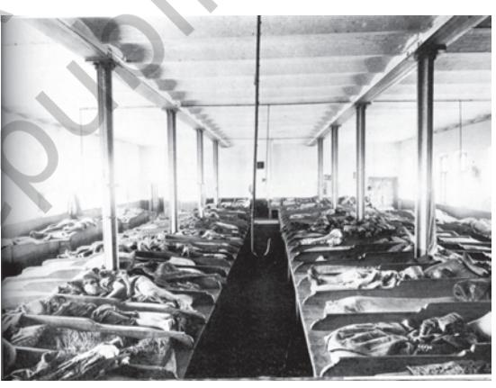

Fig.6 – Workers sleeping in bunkers in a dormitory in pre-revolutionary Russia. They slept in shifts and could not keep their families with them.

deeply religious. But except in a few cases they had no respect for the **Source A** nobility. Nobles got their power and position through their services to the Tsar, not through local popularity. This was unlike France where, during the French Revolution in Brittany, peasants respected nobles and fought for them. In Russia, peasants wanted the land of the nobles to be given to them. Frequently, they refused to pay rent and even murdered landlords. In 1902, this occurred on a large scale in south Russia. And in 1905, such incidents took place all over Russia.

Russian peasants were different from other European peasants in another way. They pooled their land together periodically and their commune (mir) divided it according to the needs of individual families.

#### **2.3 Socialism in Russia**

All political parties were illegal in Russia before 1914. The Russian Social Democratic Workers Party was founded in 1898 by socialists who respected Marx's ideas. However, because of government policing, it had to operate as an illegal organisation. It set up a newspaper, mobilised workers and organised strikes.

Some Russian socialists felt that the Russian peasant custom of dividing land periodically made them natural socialists. So peasants, not workers, would be the main force of the revolution, and Russia could become socialist more quickly than other countries. Socialists were active in the countryside through the late nineteenth century. They formed the Socialist Revolutionary Party in 1900. This party struggled for peasants' rights and demanded that land belonging to nobles be transferred to peasants. Social Democrats disagreed with Socialist Revolutionaries about peasants. Lenin felt that peasants were not one united group. Some were poor and others rich, some worked as labourers while others were capitalists who employed workers. Given this 'differentiation' within them, they could not all be part of a socialist movement.

The party was divided over the strategy of organisation. Vladimir Lenin (who led the Bolshevik group) thought that in a repressive society like Tsarist Russia the party should be disciplined and should control the number and quality of its members. Others (Mensheviks) thought that the party should be open to all (as in Germany).

#### **2.4 A Turbulent Time: The 1905 Revolution**

Russia was an autocracy. Unlike other European rulers, even at the beginning of the twentieth century, the Tsar was not subject to

Alexander Shlyapnikov, a socialist worker of the time, gives us a description of how the meetings were organised:

'Propaganda was done in the plants and shops on an individual basis. There were also discussion circles … Legal meetings took place on matters concerning [official issues], but this activity was skilfully integrated into the general struggle for the liberation of the working class. Illegal meetings were … arranged on the spur of the moment but in an organised way during lunch, in evening break, in front of the exit, in the yard or, in establishments with several floors, on the stairs. The most alert workers would form a "plug" in the doorway, and the whole mass piled up in the exit. An agitator would get up right there on the spot. Management would contact the police on the telephone, but the speeches would have already been made and the necessary decision taken by the time they arrived ...'

Alexander Shlyapnikov, On the Eve of 1917. Reminiscences from the Revolutionary Underground.

parliament. Liberals in Russia campaigned to end this state of affairs. Together with the Social Democrats and Socialist Revolutionaries, they worked with peasants and workers during the revolution of 1905 to demand a constitution. They were supported in the empire by nationalists (in Poland for instance) and in Muslim-dominated areas by jadidistswho wanted modernised Islam to lead their societies.

The year 1904 was a particularly bad one for Russian workers. Prices of essential goods rose so quickly that real wages declined by 20 per cent. The membership of workers' associations rose dramatically. When four members of the Assembly of Russian Workers, which had been formed in 1904, were dismissed at the Putilov Iron Works, there was a call for industrial action. Over the next few days over 110,000 workers in St Petersburg went on strike demanding a reduction in the working day to eight hours, an increase in wages and improvement in working conditions.

When the procession of workers led by Father Gapon reached the Winter Palace it was attacked by the police and the Cossacks. Over 100 workers were killed and about 300 wounded. The incident, known as Bloody Sunday, started a series of events that became known as the 1905 Revolution. Strikes took place all over the country and universities closed down when student bodies staged walkouts, complaining about the lack of civil liberties. Lawyers, doctors, engineers and other middle-class workers established the Union of Unions and demanded a constituent assembly.

During the 1905 Revolution, the Tsar allowed the creation of an elected consultative Parliament or Duma. For a brief while during the revolution, there existed a large number of trade unions and factory committees made up of factory workers. After 1905, most committees and unions worked unofficially, since they were declared illegal. Severe restrictions were placed on political activity. The Tsar dismissed the first Duma within 75 days and the re-elected second Duma within three months. He did not want any questioning of his authority or any reduction in his power. He changed the voting laws and packed the third Duma with conservative politicians. Liberals and revolutionaries were kept out.

### **2.5 The First World War and the Russian Empire**

In 1914, war broke out between two European alliances – Germany, Austria and Turkey (the Central powers) and France, Britain and Russia (later Italy and Romania). Each country had a global empire

## Activity

Why were there revolutionary disturbances in Russia in 1905? What were the demands of revolutionaries?

#### New words

Jadidists – Muslim reformers within the Russian empire

Real wage – Reflects the quantities of goods which the wages will actually buy. and the war was fought outside Europe as well as in Europe. This was the First World War.

In Russia, the war was initially popular and people rallied around Tsar Nicholas II. As the war continued, though, the Tsar refused to consult the main parties in the Duma. Support wore thin. Anti-German sentiments ran high, as can be seen in the renaming of St Petersburg – a German name – as Petrograd. The Tsarina Alexandra's German origins and poor advisers, especially a monk called Rasputin, made the autocracy unpopular.

The First World War on the 'eastern front' differed from that on the 'western front'. In the west, armies fought from trenches stretched along eastern France. In the east, armies moved a good deal and fought battles leaving large casualties. Defeats were shocking and demoralising. Russia's armies lost badly in Germany and Austria between 1914 and 1916. There were over 7 million casualties by 1917. As they retreated, the Russian army destroyed crops and buildings to prevent the enemy from being able to live off the land. The destruction of

crops and buildings led to over 3 million refugees in Russia. The situation discredited the government and the Tsar. Soldiers did not wish to fight such a war.

The war also had a severe impact on industry. Russia's own industries were few in number and the country was cut off from other suppliers of industrial goods by German control of the Baltic Sea. Industrial equipment disintegrated more rapidly in Russia than elsewhere in Europe. By 1916, railway lines began to break down. Able-bodied men were called up to the war. As a result, there were labour shortages and small workshops producing essentials were shut down. Large supplies of grain were sent to feed the army. For the people in the cities, bread and flour became scarce. By the winter of 1916, riots at bread shops were common.

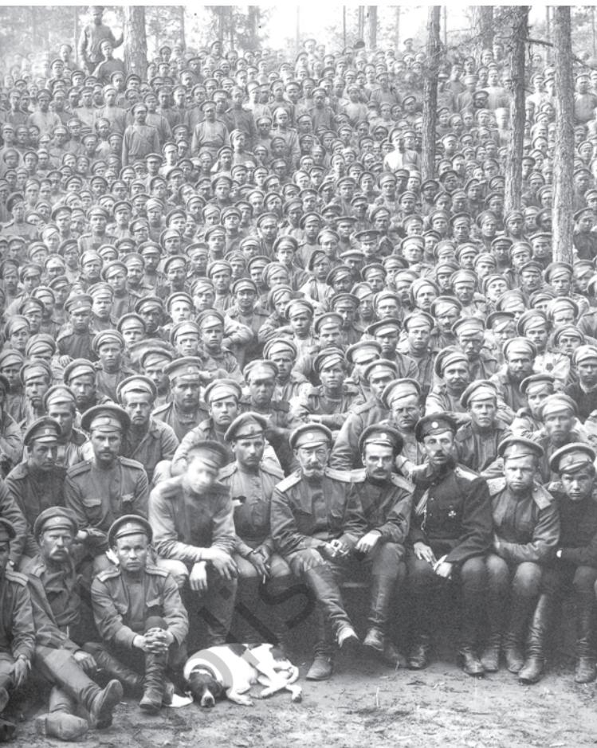

#### Fig.7 – Russian soldiers during the First World War.

The Imperial Russian army came to be known as the 'Russian steam roller'. It was the largest armed force in the world. When this army shifted its loyalty and began supporting the revolutionaries, Tsarist power collapsed.

### Activity

The year is 1916. You are a general in the Tsar's army on the eastern front. You are writing a report for the government in Moscow. In your report suggest what you think the government should do to improve the situation.

### **3 The February Revolution in Petrograd**

In the winter of 1917, conditions in the capital, Petrograd, were grim. The layout of the city seemed to emphasise the divisions among its people. The workers' quarters and factories were located on the right bank of the River Neva. On the left bank were the fashionable areas, the Winter Palace, and official buildings, including the palace where the Duma met. In February 1917, food shortages were deeply felt in the workers' quarters. The winter was very cold – there had been exceptional frost and heavy snow. Parliamentarians wishing to preserve elected government, were opposed to the Tsar's desire to dissolve the Duma.

On 22 Februar y, a lockout took place at a factory on the right bank. The next day, workers in fifty factories called a strike in sympathy. In many factories, women led the way to strikes. This came to be called the International Women's Day. Demonstrating workers crossed from the factory quarters to the centre of the capital – the Nevskii Prospekt. At this stage, no political party was actively organising the movement. As the fashionable quarters and official buildings were surrounded by workers, the government imposed a curfew. Demonstrators dispersed by the evening, but they came back on the 24th and 25th. The government called out the cavalry and police to keep an eye on them.

On Sunday, 25 February, the government suspended the Duma. Politicians spoke out against the measure. Demonstrators returned in force to the streets of the left bank on the 26th. On the 27th, the Police Headquarters were ransacked. The streets thronged with people raising slogans about bread, wages, better hours and democracy. The government tried to control the situation and called out the cavalry once again. However, the cavalry refused to fire on the demonstrators. An officer was shot at the barracks of a regiment and three other regiments mutinied, voting to join the striking workers. By that evening, soldiers and

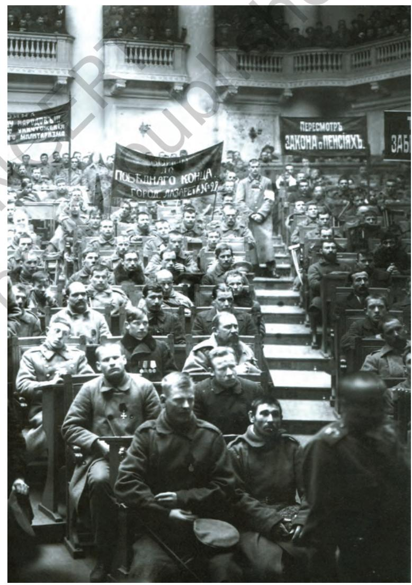

Fig.8 – The Petrograd Soviet meeting in the Duma, February 1917.

striking workers had gathered to form a 'soviet' or 'council' in the same building as the Duma met. This was the Petrograd Soviet.

The very next day, a delegation went to see the Tsar. Military commanders advised him to abdicate. He followed their advice and abdicated on 2 March. Soviet leaders and Duma leaders formed a Provisional Government to run the country. Russia's future would be decided by a constituent assembly, elected on the basis of universal adult suffrage. Petrograd had led the February Revolution that brought down the monarchy in February 1917.

#### **Box 1**

#### Women in the February Revolution

'Women workers, often ... inspired their male co-workers … At the Lorenz telephone factory, … Marfa Vasileva almost single handedly called a successful strike. Already that morning, in celebration of Women's Day, women workers had presented red bows to the men … Then Marfa Vasileva, a milling machine operator stopped work and declared an impromptu strike. The workers on the floor were ready to support her … The foreman informed the management and sent her a loaf of bread. She took the bread but refused to go back to work. The administrator asked her again why she refused to work and she replied, "I cannot be the only one who is satiated when others are hungry". Women workers from another section of the factory gathered around Marfa in support and gradually all the other women ceased working. Soon the men downed their tools as well and the entire crowd rushed onto the street.'

From: Choi Chatterji, Celebrating Women (2002).

#### **3.1 After February**

Army officials, landowners and industrialists were influential in the Provisional Government. But the liberals as well as socialists among them worked towards an elected government. Restrictions on public meetings and associations were removed. 'Soviets', like the Petrograd Soviet, were set up everywhere, though no common system of election was followed.

In April 1917, the Bolshevik leader Vladimir Lenin returned to Russia from his exile. He and the Bolsheviks had opposed the war since 1914. Now he felt it was time for soviets to take over power. He declared that the war be brought to a close, land be transferred to the peasants, and banks be nationalised. These three demands were Lenin's 'April Theses'. He also argued that the Bolshevik Party rename itself the Communist Party to indicate its new radical aims. Most others in the Bolshevik Party were initially surprised by the April Theses. They thought that the time was not yet ripe for a

### Activity

Look again at Source A and Box 1.

- Ø List five changes in the mood of the workers.
- Ø Place yourself in the position of a woman who has seen both situations and write an account of what has changed.

**India and the Contemporary World**

socialist revolution and the Provisional Government needed to be supported. But the developments of the subsequent months changed their attitude.

Through the summer the workers' movement spread. In industrial areas, factory committees were formed which began questioning the way industrialists ran their factories. Trade unions grew in number. Soldiers' committees were formed in the army. In June, about 500 Soviets sent representatives to an All Russian Congress of Soviets. As the Provisional Government saw its power reduce and Bolshevik influence grow, it decided to take stern measures against the spreading discontent. It resisted attempts by workers to run factories and began arresting leaders. Popular demonstrations staged by the Bolsheviks in July 1917 were sternly repressed. Many Bolshevik leaders had to go into hiding or flee.

Meanwhile in the countryside, peasants and their Socialist Revolutionary leaders pressed for a redistribution of land. Land committees were formed to handle this. Encouraged by the Socialist Revolutionaries, peasants seized land between July and September 1917.

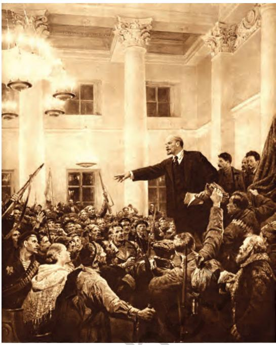

Fig.9 – A Bolshevik image of Lenin addressing workers in April 1917.

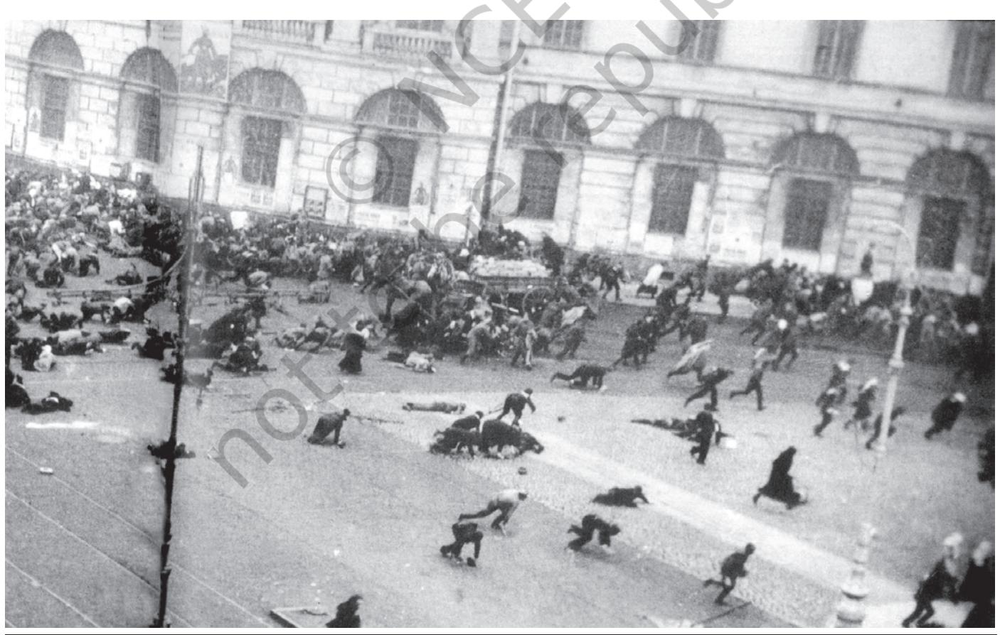

Fig.10 – The July Days. A pro-Bolshevik demonstration on 17 July 1917 being fired upon by the army.

### **Box 2 3.2 The Revolution of October 1917**

As the conflict between the Provisional Government and the Bolsheviks grew, Lenin feared the Provisional Government would set up a dictatorship. In September, he began discussions for an uprising against the government. Bolshevik supporters in the army, soviets and factories were brought together.

On 16 October 1917, Lenin persuaded the Petrograd Soviet and the Bolshevik Party to agree to a socialist seizure of power. A Military Revolutionary Committee was appointed by the Soviet under Leon Trotskii to organise the seizure. The date of the event was kept a secret.

The uprising began on 24 October. Sensing trouble, Prime Minister Kerenskii had left the city to summon troops. At dawn, military men loyal to the government seized the buildings of two Bolshevik newspapers. Pro-government troops were sent to take over telephone and telegraph offices and protect the Winter Palace. In a swift response, the Military Revolutionary Committee ordered its supporters to seize government offices and arrest ministers. Late in the day, the ship Aurora shelled the Winter Palace. Other vessels sailed down the Neva and took over various military points. By nightfall, the city was under the committee's control and the ministers had surrendered. At a meeting of the All Russian Congress of Soviets in Petrograd, the majority approved the Bolshevik action. Uprisings took place in other cities. There was heavy fighting – especially in Moscow – but by December, the Bolsheviks controlled the Moscow-Petrograd area.

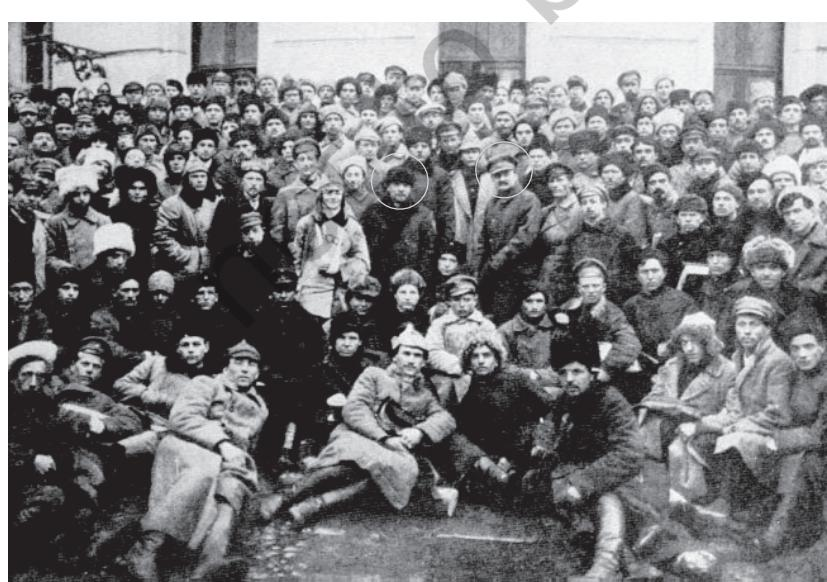

#### **Date of the Russian Revolution**

Russia followed the Julian calendar until 1 February 1918. The country then changed to the Gregorian calendar, which is followed everywhere today. The Gregorian dates are 13 days ahead of the Julian dates. So by our calendar, the 'February' Revolution took place on 12th March and the 'October' Revolution took place on 7th November.

#### **Some important dates**

1850s -1880s Debates over socialism in Russsia.

1898 Formation of the Russian Social Democratic Workers Party.

1905 The Bloody Sunday and the Revolution of 1905.

#### 1917

2nd March - Abdication of the Tsar. 24th October - Bolshevik unprising in Petrograd.

1918-20 The Civil War.

1919 Formation of Comintern.

1929 Beginning of Collectivisation.

38

Fig.11 – Lenin (left) and Trotskii (right) with workers at Petrograd.

### **4 What Changed after October?**

The Bolsheviks were totally opposed to private property. Most industry and banks were nationalised in November 1917. This meant that the government took over ownership and management. Land was declared social property and peasants were allowed to seize the land of the nobility. In cities, Bolsheviks enforced the partition of large houses according to family requirements. They banned the use of the old titles of aristocracy. To assert the change, new uniforms were designed for the army and officials, following a clothing competition organised in 1918 – when the Soviet hat (budeonovka) was chosen.

The Bolshevik Party was renamed the Russian Communist Party (Bolshevik). In November 1917, the Bolsheviks conducted the elections to the Constituent Assembly, but they failed to gain majority support. In January 1918, the Assembly rejected Bolshevik measures and Lenin dismissed the Assembly. He thought the All Russian Congress of Soviets was more democratic than an assembly elected in uncertain conditions. In March 1918, despite opposition by their political allies, the Bolsheviks made peace with Germany

at Brest Litovsk. In the years that followed, the Bolsheviks became the only party to participate in the elections to the All Russian Congress of Soviets, which became the Parliament of the country. Russia became a one-party state. Trade unions were kept under party control. The secret police (called the Cheka first, and later OGPU and NKVD) punished those who criticised the Bolsheviks. Many young writers and artists rallied to the Party because it stood for socialism and for change. After October 1917, this led to experiments in the arts and architecture. But many became disillusioned because of the

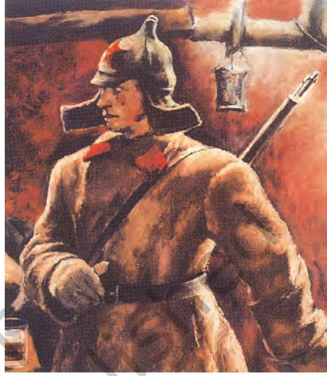

Fig.12 – A soldier wearing the Soviet hat (budeonovka).

censorship the Party encouraged. Fig.13 – May Day demonstration in Moscow in 1918.

#### **Box 3**

#### **The October Revolution and the Russian Countryside: Two Views**

'News of the revolutionary uprising of October 25, 1917, reached the village the following day and was greeted with enthusiasm; to the peasants it meant free land and an end to the war. ...The day the news arrived, the landowner's manor house was looted, his stock farms were "requisitioned" and his vast orchard was cut down and sold to the peasants for wood; all his far buildings were torn down and left in ruins while the land was distributed among the peasants who were prepared to live the new Soviet life'.

From: Fedor Belov, The History of a Soviet Collective Farm

A member of a landowning family wrote to a relative about what happened at the estate:

'The "coup" happened quite painlessly, quietly and peacefully. …The first days were unbearable.. Mikhail Mikhailovich [the estate owner] was calm...The girls also…I must say the chairman behaves correctly and even politely. We were left two cows and two horses. The servants tell them all the time not to bother us. "Let them live. We vouch for their safety and property. We want them treated as humanely as possible…."

…There are rumours that several villages are trying to evict the committees and return the estate to Mikhail Mikhailovich. I don't know if this will happen, or if it's good for us. But we rejoice that there is a conscience in our people...'

From: Serge Schmemann, Echoes of a Native Land. Two Centuries of a Russian Village (1997).

### **4.1 The Civil War**

When the Bolsheviks ordered land redistribution, the Russian army began to break up. Soldiers, mostly peasants, wished to go home for the redistribution and deserted. Non-Bolshevik socialists, liberals and supporters of autocracy condemned the Bolshevik uprising. Their leaders moved to south Russia and organised troops to fight the Bolsheviks (the 'reds'). During 1918 and 1919, the 'greens' (Socialist Revolutionaries) and 'whites' (pro-Tsarists) controlled most of the Russian empire. They were backed by French, American, British and Japanese troops – all those forces who were worried at the growth of socialism in Russia. As these troops and the Bolsheviks fought a civil war, looting, banditry and famine became common.

Supporters of private property among 'whites' took harsh steps with peasants who had seized land. Such actions led to the loss of popular support for the non-Bolsheviks. By January 1920, the Bolsheviks controlled most of the former Russian empire. They succeeded due

### Activity

Read the two views on the revolution in the countryside. Imagine yourself to be a witness to the events. Write a short account from the standpoint of:

- Ø an owner of an estate
- Ø a small peasant
- Ø a journalist

to cooperation with non-Russian nationalities and Muslim jadidists. Cooperation did not work where Russian colonists themselves turned Bolshevik. In Khiva, in Central Asia, Bolshevik colonists brutally massacred local nationalists in the name of defending socialism. In this situation, many were confused about what the Bolshevik government represented.

Partly to remedy this, most non-Russian nationalities were given political autonomy in the Soviet Union (USSR) – the state the Bolsheviks created from the Russian empire in December 1922. But since this was combined with unpopular policies that the Bolsheviks forced the local government to follow – like the harsh discouragement of nomadism – attempts to win over different nationalities were only partly successful.

### Activity

Why did people in Central Asia respond to the Russian Revolution in different ways?

#### **Source B**

#### Central Asia of the October Revolution: Two Views

M.N.Roy was an Indian revolutionary, a founder of the Mexican Communist Party and prominent Comintern leader in India, China and Europe. He was in Central Asia at the time of the civil war in the 1920s. He wrote:

'The chieftain was a benevolent old man; his attendant … a youth who … spoke Russian … He had heard of the Revolution, which had overthrown the Tsar and driven away the Generals who conquered the homeland of the Kirgiz. So, the Revolution meant that the Kirgiz were masters of their home again. "Long Live the Revolution" shouted the Kirgiz youth who seemed to be a born Bolshevik. The whole tribe joined.'

M.N.Roy, Memoirs (1964).

'The Kirghiz welcomed the first revolution (ie February Revolution) with joy and the second revolution with consternation and terror … [This] first revolution freed them from the oppression of the Tsarist regime and strengthened their hope that … autonomy would be realised. The second revolution (October Revolution) was accompanied by violence, pillage, taxes and the establishment of dictatorial power … Once a small group of Tsarist bureaucrats oppressed the Kirghiz. Now the same group of people … perpetuate the same regime ...'

Kazakh leader in 1919, quoted in Alexander Bennigsen and Chantal Quelquejay, Les Mouvements Nationaux chez les Musulmans de Russie, (1960).

#### New words

Autonomy – The right to govern themselves

Nomadism – Lifestyle of those who do not live in one place but move from area to area to earn their living

**Source**

#### **4.2 Making a Socialist Society**

During the civil war, the Bolsheviks kept industries and banks nationalised. They permitted peasants to cultivate the land that had been socialised. Bolsheviks used confiscated land to demonstrate what collective work could be.

A process of centralised planning was introduced. Officials assessed how the economy could work and set targets for a five-year period. On this basis they made the Five Year Plans. The government fixed all prices to promote industrial growth during the first two 'Plans'

#### **Box 4**

#### **Socialist Cultivation in a Village in the Ukraine**

'A commune was set up using two [confiscated] farms as a base. The commune consisted of thirteen families with a total of seventy persons … The farm tools taken from the … farms were turned over to the commune …The members ate in a communal dining hall and income was divided in accordance with the principles of "cooperative communism". The entire proceeds of the members' labor, as well as all dwellings and facilities belonging to the commune were shared by the commune members.'

Fedor Belov, The History of a Soviet Collective Farm (1955).

(1927-1932 and 1933-1938). Centralised planning led to economic growth. Industrial production increased (between 1929 and 1933 by 100 per cent in the case of oil, coal and steel). New factory cities came into being.

However, rapid construction led to poor working conditions. In the city of Magnitogorsk, the construction of a steel plant was achieved in three years. Workers lived hard lives and the result was 550 stoppages of work in the first year alone. In living quarters, 'in the wintertime, at 40 degrees below, people had to climb down from the fourth floor and dash across the street in order to go to the toilet'.

An extended schooling system developed, and arrangements were made for factory workers and peasants to enter universities. Crèches were established in factories for the children of women workers. Cheap public health care was provided. Model living quarters were set up for workers. The effect of all this was uneven, though, since government resources were limited.

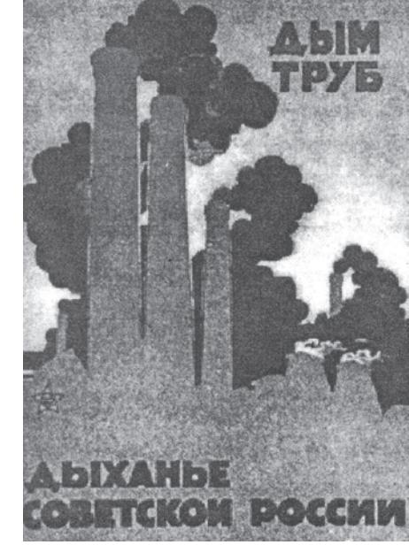

Fig.14 – Factories came to be seen as a symbol of socialism. This poster states: 'The smoke from the chimneys is the breathing of Soviet Russia.'

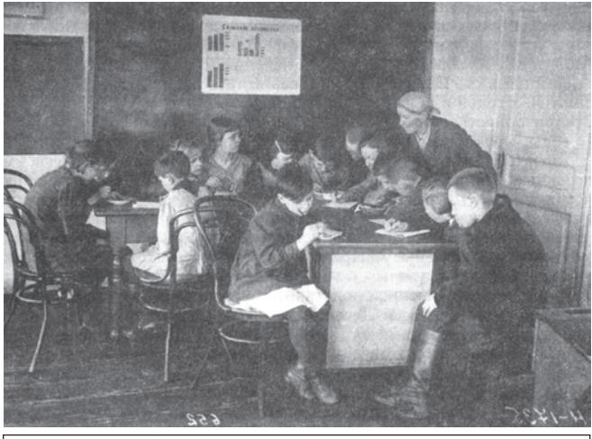

Fig.15 – Children at school in Soviet Russia in the 1930s. They are studying the Soviet economy.

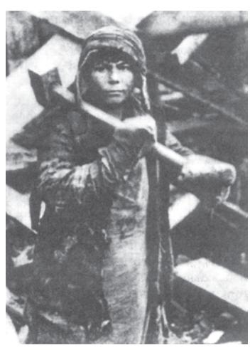

Fig.16 – A child in Magnitogorsk during the First Five Year Plan. He is working for Soviet Russia.

#### **Source C**

#### Dreams and Realities of a Soviet Childhood in 1933

Dear grandfather Kalinin …

My family is large, there are four children. We don't have a father – he died, fighting for the worker's cause, and my mother … is ailing … I want to study very much, but I cannot go to school. I had some old boots, but they are completely torn and no one can mend them. My mother is sick, we have no money and no bread, but I want to study very much. …there stands before us the task of studying, studying and studying. That is what Vladimir Ilich Lenin said. But I have to stop going to school. We have no relatives and there is no one to help us, so I have to go to work in a factory, to prevent the family from starving. Dear grandfather, I am 13, I study well and have no bad reports. I am in Class 5 …

Letter of 1933 from a 13-year-old worker to Kalinin, Soviet President

From: V. Sokolov (ed), Obshchestvo I Vlast, v 1930-ye gody (Moscow, 1997).

**Source**

#### **4.3 Stalinism and Collectivisation**

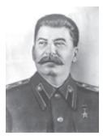

The period of the early Planned Economy was linked to the disasters of the collectivisation of agriculture. By 1927- 1928, the towns in Soviet Russia were facing an acute problem of grain supplies. The government fixed prices

at which grain must be sold, but the peasants refused to sell their grain to government buyers at these prices.

Stalin, who headed the party after the death of Lenin, introduced firm emergency measures. He believed that rich peasants and traders in the countryside were holding stocks in the hope of higher prices. Speculation had to be stopped and supplies confiscated.

In 1928, Party members toured the grain-producing areas, supervising enforced grain collections, and raiding 'kulaks' – the name for wellto-do peasants. As shortages continued, the decision was taken to collectivise farms. It was argued that grain shortages were partly due to the small size of holdings. After 1917, land had been given over to peasants. These small-sized peasant farms could not be modernised. To develop modern farms, and run them along industrial lines with machinery, it was necessary to 'eliminate kulaks', take away land from peasants, and establish state-controlled large farms.

What followed was Stalin's collectivisation programme. From 1929, the Party forced all peasants to cultivate in collective farms (kolkhoz). The bulk of land and implements were transferred to the ownership of collective farms. Peasants worked on the land, and the kolkhoz profit was shared. Enraged peasants resisted the authorities and destroyed their livestock. Between 1929 and 1931, the number of cattle fell by one-third. Those who resisted collectivisation were severely punished. Many were deported and exiled. As they resisted collectivisation, peasants argued that they were not rich and they were not against socialism. They merely did not want to work in collective farms for a variety of reasons. Stalin's government allowed some independent cultivation, but treated such cultivators unsympathetically.

In spite of collectivisation, production did not increase immediately. In fact, the bad harvests of 1930-1933 led to one of most devastating famines in Soviet history when over 4 million died.

#### New words

Deported – Forcibly removed from one's own country. Exiled – Forced to live away from one's own country.

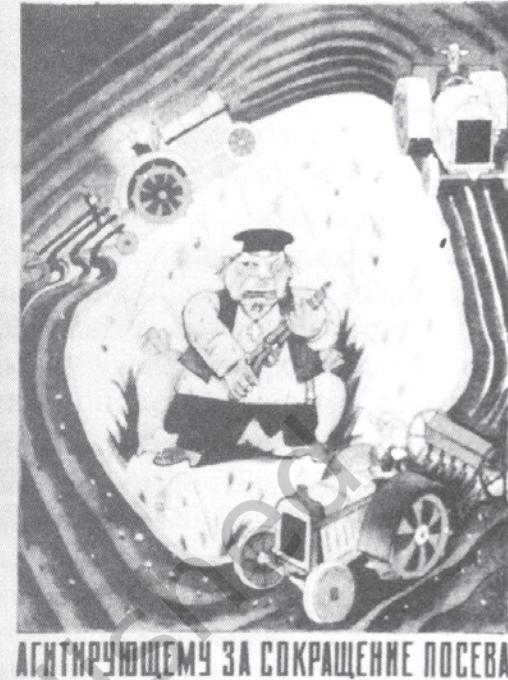

Fig.18 – A poster during collectivisation. It states: 'We shall strike at the kulak working for the decrease in cultivation.'

Fig.19 – Peasant women being gathered to work in the large collective farms.

#### Official view of the opposition to collectivisation and the government response

'From the second half of February of this year, in various regions of the Ukraine … mass insurrections of the peasantry have taken place, caused by distortions of the Party's line by a section of the lower ranks of the Party and the Soviet apparatus in the course of the introduction of collectivisation and preparatory work for the spring harvest.

Within a short time, large scale activities from the above-mentioned regions carried over into neighbouring areas – and the most aggressive insurrections have taken place near the border.

The greater part of the peasant insurrections have been linked with outright demands for the return of collectivised stocks of grain, livestock and tools …

Between 1st February and 15th March, 25,000 have been arrested … 656 have been executed, 3673 have been imprisoned in labour camps and 5580 exiled …'

Report of K.M. Karlson, President of the State Police Administration of the Ukraine to the Central Committee of the Communist Party, on 19 March 1930.

From: V. Sokolov (ed), Obshchestvo I Vlast, v 1930-ye gody

Many within the Party criticised the confusion in industrial production under the Planned Economy and the consequences of collectivisation. Stalin and his sympathisers charged these critics with conspiracy against socialism. Accusations were made throughout the country, and by 1939, over 2 million were in prisons or labour camps. Most were innocent of the crimes, but no one spoke for them. A large number were forced to make false confessions under torture and were executed – several among them were talented professionals.

#### **Source E**

This is a letter written by a peasant who did not want to join the collective farm. To the newspaper Krestianskaia Gazeta (Peasant Newspaper)

'… I am a natural working peasant born in 1879 … there are 6 members in my family, my wife was born in 1881, my son is 16, two daughters 19, all three go to school, my sister is 71. From 1932, heavy taxes have been levied on me that I have found impossible. From 1935, local authorities have increased the taxes on me … and I was unable to handle them and all my property was registered: my horse, cow, calf, sheep with lambs, all my implements, furniture and my reserve of wood for repair of buildings and they sold the lot for the taxes. In 1936, they sold two of my buildings … the kolkhoz bought them. In 1937, of two huts I had, one was sold and one was confiscated …'

Afanasii Dedorovich Frebenev, an independent cultivator.

From: V. Sokolov (ed), Obshchestvo I Vlast, v 1930-ye gody.

**Source**

**Source**

## **5 The Global Influence of the Russian Revolution and the USSR**

Existing socialist parties in Europe did not wholly approve of the way the Bolsheviks took power – and kept it. However, the possibility of a workers' state fired people's imagination across the world. In many countries, communist parties were formed – like the Communist Party of Great Britain. The Bolsheviks encouraged colonial peoples to follow their experiment. Many non-Russians from outside the USSR participated in the Conference of the Peoples of the East (1920) and the Bolshevik-founded Comintern (an international union of pro-Bolshevik socialist parties). Some received education in the USSR's Communist University of the Workers of the East. By the time of the outbreak of the Second World War, the USSR had given socialism a global face and world stature.

Yet by the 1950s it was acknowledged within the country that the style of government in the USSR was not in keeping with the ideals of the Russian Revolution. In the world socialist movement too it was recognised that all was not well in the Soviet Union. A backward country had become a great power. Its industries and agriculture had developed and the poor were being fed. But it had denied the essential freedoms to its citizens and carried out its developmental projects through repressive policies. By the end of the twentieth century, the international reputation of the USSR as a socialist country had declined though it was recognised that socialist ideals still enjoyed respect among its people. But in each country the ideas of socialism were rethought in a variety of different ways.

#### **Box 5**

#### **Writing about the Russian Revolution in India**

Among those the Russian Revolution inspired were many Indians. Several attended the Communist University. By the mid-1920s the Communist Party was formed in India. Its members kept in touch with the Soviet Communist Party. Important Indian political and cultural figures took an interest in the Soviet experiment and visited Russia, among them Jawaharlal Nehru and Rabindranath Tagore, who wrote about Soviet Socialism. In India, writings gave impressions of Soviet Russia. In Hindi, R.S. Avasthi wrote in 1920-21 Russian Revolution, Lenin, His Life and His Thoughts, and later The Red Revolution . S.D. Vidyalankar wrote The Rebirth of Russia and The Soviet State of Russia. There was much that was written in Bengali, Marathi, Malayalam, Tamil and Telugu.

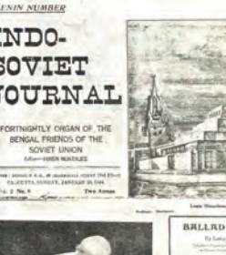

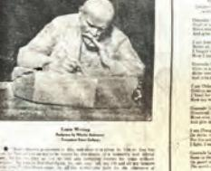

Fig.20 – Special Issue on Lenin of the Indo-Soviet Journal. Indian communists mobilised support for the USSR during the Second World War.

#### An Indian arrives in Soviet Russia in 1920

'For the first time in our lives, we were seeing Europeans mixing freely with Asians. On seeing the Russians mingling freely with the rest of the people of the country we were convinced that we had come to a land of real equality.

We saw freedom in its true light. In spite of their poverty, imposed by the counter-revolutionaries and the imperialists, the people were more jovial and satisfied than ever before. The revolution had instilled confidence and fearlessness in them. The real brotherhood of mankind would be seen here among these people of fifty different nationalities. No barriers of caste or religion hindered them from mixing freely with one another. Every soul was transformed into an orator. One could see a worker, a peasant or a soldier haranguing like a professional lecturer.'

Shaukat Usmani, Historic Trips of a Revolutionary.

#### **Source G**

#### Rabindranath Tagore wrote from Russia in 1930

'Moscow appears much less clean than the other European capitals. None of those hurrying along the streets look smart. The whole place belongs to the workers … Here the masses have not in the least been put in the shade by the gentlemen … those who lived in the background for ages have come forward in the open today … I thought of the peasants and workers in my own country. It all seemed like the work of the Genii in the Arabian Nights. [here] only a decade ago they were as illiterate, helpless and hungry as our own masses … Who could be more astonished than an unfortunate Indian like myself to see how they had removed the mountain of ignorance and helplessness in these few years'.

## Activity

Compare the passages written by Shaukat Usmani and Rabindranath Tagore. Read them in relation to Sources C, D and E.

- Ø What did Indians find impressive about the USSR ?
- Ø What did the writers fail to notice?

## Activities

- 1. Imagine that you are a striking worker in 1905 who is being tried in court for your act of rebellion. Draft the speech you would make in your defence. Act out your speech for your class.
- 2. Write the headline and a short news item about the uprising of 24 October 1917 for each of the following newspapers
	- Ø a Conservative paper in France
	- Ø a Radical newspaper in Britain
	- Ø a Bolshevik newspaper in Russia
- 3. Imagine that you are a middle-level wheat farmer in Russia after collectivisation. You have decided to write a letter to Stalin explaining your objections to collectivisation. What would you write about the conditions of your life? What do you think would be Stalin's response to such a farmer?

### Questions

- 1. What were the social, economic and political conditions in Russia before 1905?
- 2. In what ways was the working population in Russia different from other countries in Europe, before 1917?

?

Activities

- 3. Why did the Tsarist autocracy collapse in 1917?
- 4. Make two lists: one with the main events and the effects of the February Revolution and the other with the main events and effects of the October Revolution. Write a paragraph on who was involved in each, who were the leaders and what was the impact of each on Soviet history.
- 5. What were the main changes brought about by the Bolsheviks immediately after the October Revolution?
- 6. Write a few lines to show what you know about:
	- Ø kulaks
	- Ø the Duma
	- Ø women workers between 1900 and 1930
	- Ø the Liberals
	- Ø Stalin's collectivisation programme.

2024-25

