# **Nazism and the Rise of Hitler**

In the spring of 1945, a little eleven-year-old German boy called Helmuth was lying in bed when he overheard his parents discussing something in serious tones. His father, a prominent physician, deliberated with his wife whether the time had come to kill the entire family, or if he should commit suicide alone. His father spoke about his fear of revenge, saying, 'Now the Allies will do to us what we did to the crippled and Jews.' The next day, he took Helmuth to the woods, where they spent their last happy time together, singing old children's songs. Later, Helmuth's father shot himself in his office. Helmuth remembers that he saw his father's bloody uniform being burnt in the family fireplace. So traumatised was he by what he had overheard and what had happened, that he reacted by refusing to eat at home for the following nine years! He was afraid that his mother might poison him.

Although Helmuth may not have realised all that it meant, his father had been a Nazi and a supporter of Adolf Hitler. Many of you will know something about the Nazis and Hitler. You probably know of Hitler's determination to make Germany into a mighty power and his ambition of conquering all of Europe. You may have heard that he killed Jews. But Nazism was not one or two isolated acts. It was a system, a structure of ideas about the world and politics. Let us try and understand what Nazism was all about. Let us see why Helmuth's father killed himself and what the basis of his fear was.

In May 1945, Germany surrendered to the Allies. Anticipating what was coming, Hitler, his propaganda minister Goebbels and his entire family committed suicide collectively in his Berlin bunker in April. At the end of the war, an International Military Tribunal at Nuremberg was set up to prosecute Nazi war criminals for Crimes against Peace, for War Crimes and Crimes Against Humanity. Germany's conduct during the war, especially those actions which

#### New words

Allies – The Allied Powers were initially led by the UK and France. In 1941 they were joined by the USSR and USA. They fought against the Axis Powers, namely Germany, Italy and Japan.

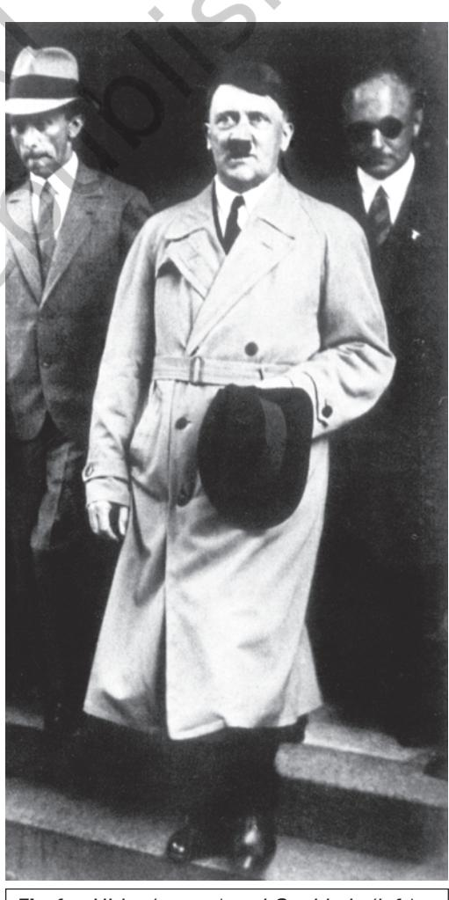

Fig.1 – Hitler (centre) and Goebbels (left) leaving after an official meeting, 1932.

49

came to be called Crimes Against Humanity, raised serious moral and ethical questions and invited worldwide condemnation. What were these acts?

Under the shadow of the Second World War, Germany had waged a genocidal war, which resulted in the mass murder of selected groups of innocent civilians of Europe. The number of people killed included 6 million Jews, 200,000 Gypsies, 1 million Polish civilians, 70,000 Germans who were considered mentally and physically disabled, besides innumerable political opponents. Nazis devised an unprecedented means of killing people, that is, by gassing them in various killing centres like Auschwitz. The Nuremberg Tribunal sentenced only eleven leading Nazis to death. Many others were imprisoned for life. The retribution did come, yet the punishment of the Nazis was far short of the brutality and extent of their crimes. The Allies did not want to be as harsh on defeated Germany as they had been after the First World War.

Everyone came to feel that the rise of Nazi Germany could be partly traced back to the German experience at the end of the First World War.

What was this experinece?

New words

Genocidal – Killing on large scale leading to destruction of large sections of people

# **1 Birth of the Weimar Republic**

Germany, a powerful empire in the early years of the twentieth century, fought the First World War (1914-1918) alongside the Austrian empire and against the Allies (England, France and Russia.) All joined the war enthusiastically hoping to gain from a quick victory. Little did they realise that the war would stretch on, eventually draining Europe of all its resources. Germany made initial gains by occupying France and Belgium. However the Allies, strengthened by the US entry in 1917, won , defeating Germany and the Central Powers in November 1918.

The defeat of Imperial Germany and the abdication of the emperor gave an opportunity to parliamentary parties to recast German polity. A National Assembly met at Weimar and established a democratic constitution with a federal structure. Deputies were now elected to the German Parliament or Reichstag, on the basis of equal and universal votes cast by all adults including women.

This republic, however, was not received well by its own people largely because of the terms it was forced to accept after Germany's defeat at the end of the First World War. The peace treaty at

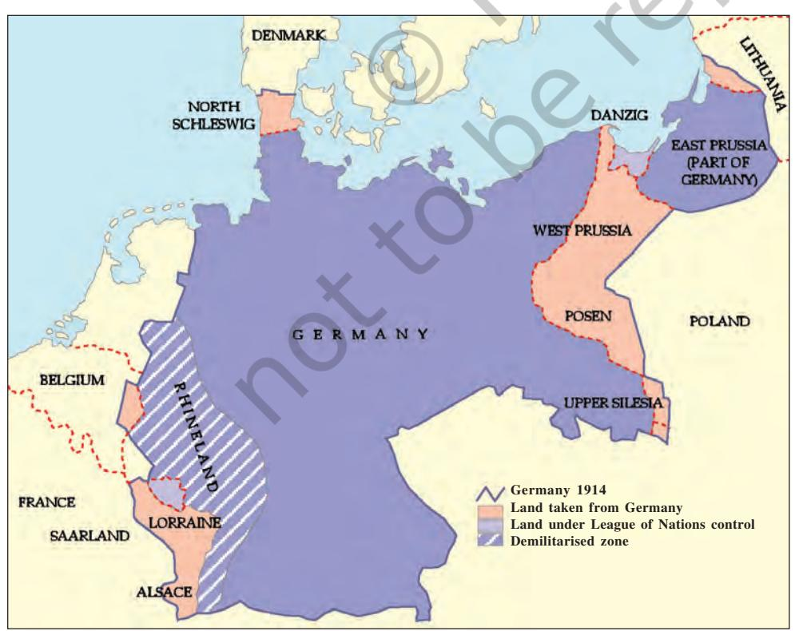

Fig.2 – Germany after the Versailles Treaty. You can see in this map the parts of the territory that Germany lost after the treaty.

Versailles with the Allies was a harsh and humiliating peace. Germany lost its overseas colonies, a tenth of its population, 13 per cent of its territories, 75 per cent of its iron and 26 per cent of its coal to France, Poland, Denmark and Lithuania. The Allied Powers demilitarised Germany to weaken its power. The War Guilt Clause held Germany responsible for the war and damages the Allied countries suffered. Germany was forced to pay compensation amounting to £6 billion. The Allied armies also occupied the resource-rich Rhineland for much of the 1920s. Many Germans held the new Weimar Republic responsible for not only the defeat in the war but the disgrace at Versailles.

#### **1.1 The Effects of the War**

The war had a devastating impact on the entire continent both psychologically and financially. From a continent of creditors, Europe turned into one of debtors. Unfortunately, the infant Weimar Republic was being made to pay for the sins of the old empire. The republic carried the burden of war guilt and national humiliation and was financially crippled by being forced to pay compensation. Those who supported the Weimar Republic, mainly Socialists, Catholics and Democrats, became easy targets of attack in the conservative nationalist circles. They were mockingly called the 'November criminals'. This mindset had a major impact on the political developments of the early 1930s, as we will soon see.

The First World War left a deep imprint on European society and polity. Soldiers came to be placed above civilians. Politicians and publicists laid great stress on the need for men to be aggressive, strong and masculine. The media glorified trench life. The truth, however, was that soldiers lived miserable lives in these trenches, trapped with rats feeding on corpses. They faced poisonous gas and enemy shelling, and witnessed their ranks reduce rapidly. Aggressive war propaganda and national honour occupied centre stage in the public sphere, while popular support grew for conservative dictatorships that had recently come into being. Democracy was indeed a young and fragile idea, which could not survive the instabilities of interwar Europe.

#### **1.2 Political Radicalism and Economic Crises**

The birth of the Weimar Republic coincided with the revolutionary uprising of the Spartacist League on the pattern of the Bolshevik Revolution in Russia. Soviets of workers and sailors were established

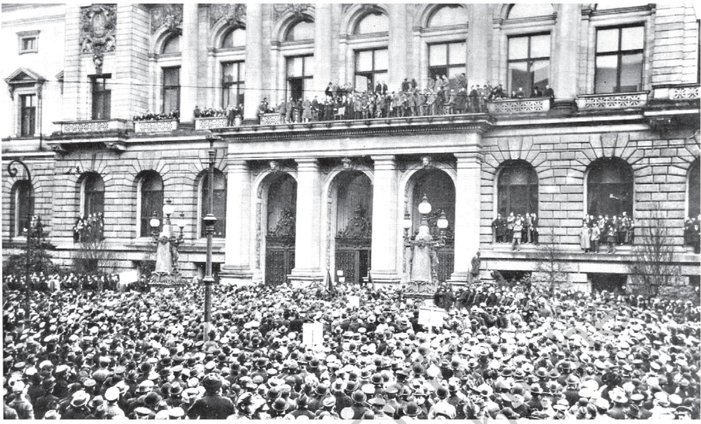

Fig.3 – This is a rally organised by the radical group known as the Spartacist League. In the winter of 1918-1919 the streets of Berlin were taken over by the people. Political demonstrations became common.

in many cities. The political atmosphere in Berlin was charged with demands for Soviet-style governance. Those opposed to this – such as the socialists, Democrats and Catholics – met in Weimar to give shape to the democratic republic. The Weimar Republic crushed the uprising with the help of a war veterans organisation called Free Corps. The anguished Spartacists later founded the Communist Party of Germany. Communists and Socialists henceforth became irreconcilable enemies and could not make common cause against Hitler. Both revolutionaries and militant nationalists craved for radical solutions.

Political radicalisation was only heightened by the economic crisis of 1923. Germany had fought the war largely on loans and had to pay war reparations in gold. This depleted gold reserves at a time resources were scarce. In 1923 Germany refused to pay, and the French occupied its leading industrial area, Ruhr, to claim their coal. Germany retaliated with passive resistance and printed paper currency recklessly. With too much printed money in circulation, the value of the German mark fell. In April the US dollar was equal to 24,000 marks, in July 353,000 marks, in August 4,621,000 marks and at

#### New words

Deplete – Reduce, empty out Reparation – Make up for a wrong done

Fig.4 – Baskets and carts being loaded at a bank in Berlin with paper currency for wage payment, 1923. The German mark had so little value that vast amounts had to be used even for small payments.

98,860,000 marks by December, the figure had run into trillions. As the value of the mark collapsed, prices of goods soared. The image of Germans carrying cartloads of currency notes to buy a loaf of bread was widely publicised evoking worldwide sympathy. This crisis came to be known as hyperinflation, a situation when prices rise phenomenally high.

Eventually, the Americans intervened and bailed Germany out of the crisis by introducing the Dawes Plan, which reworked the terms of reparation to ease the financial burden on Germans.

#### **1.3 The Years of Depression**

The years between 1924 and 1928 saw some stability. Yet this was built on sand. German investments and industrial recovery were totally dependent on short-term loans, largely from the USA. This support was withdrawn when the Wall Street Exchange crashed in 1929. Fearing a fall in prices, people made frantic efforts to sell their shares. On one single day, 24 October, 13 million shares were sold. This was the start of the Great Economic Depression. Over the next three years, between 1929 and 1932, the national income of the USA fell by half. Factories shut down, exports fell, farmers were badly hit and speculators withdrew their money from the market. The effects of this recession in the US economy were felt worldwide.

The German economy was the worst hit by the economic crisis. By 1932, industrial production was reduced to 40 per cent of the 1929 level. Workers lost their jobs or were paid reduced wages. The number of unemployed touched an unprecedented 6 million. On the streets of Germany you could see men with placards around their necks saying, 'Willing to do any work'. Unemployed youths played cards or simply sat at street corners, or desperately queued up at the local employment exchange. As jobs disappeared, the youth took to criminal activities and total despair became commonplace.

The economic crisis created deep anxieties and fears in people. The middle classes, especially salaried employees and pensioners, saw their savings diminish when the currency lost its value. Small businessmen, the self-employed and retailers suffered as their

#### New words

Wall Street Exchange – The name of the world's biggest stock exchange located in the USA.

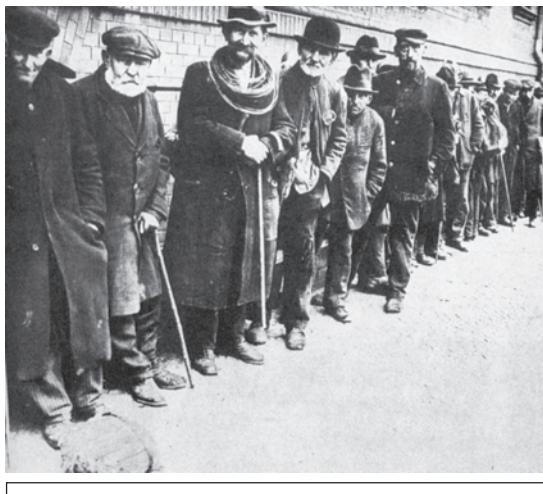

Fig.5 – Homeless men queuing up for a night's shelter, 1923.

Fig.6 – Sleeping on the line. During the Great Depression the unemployed could not hope for either wage or shelter. On winter nights when they wanted a shelter over their head, they had to pay to sleep like this.

54

businesses got ruined. These sections of society were filled with the fear of proletarianisation, an anxiety of being reduced to the ranks of the working class, or worse still, the unemployed. Only organised workers could manage to keep their heads above water, but unemployment weakened their bargaining power. Big business was in crisis. The large mass of peasantry was affected by a sharp fall in agricultural prices and women, unable to fill their children's stomachs, were filled with a sense of deep despair.

Politically too the Weimar Republic was fragile. The Weimar constitution had some inherent defects, which made it unstable and vulnerable to dictatorship. One was proportional representation. This made achieving a majority by any one party a near impossible task, leading to a rule by coalitions. Another defect was Article 48, which gave the President the powers to impose emergency, suspend civil rights and rule by decree. Within its short life, the Weimar Republic saw twenty different cabinets lasting on an average 239 days, and a liberal use of Article 48. Yet the crisis could not be managed. People lost confidence in the democratic parliamentary system, which seemed to offer no solutions.

#### New words

Proletarianisation – To become impoverished to the level of working classes.

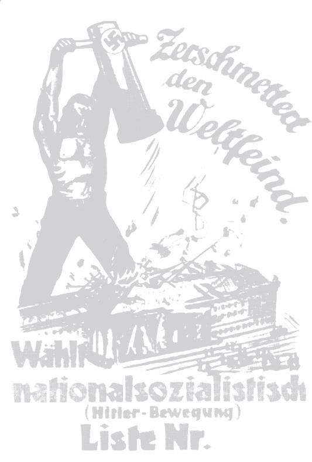

55

**Nazism and the Rise of Hitler**

# **2 Hitler's Rise to Power**

This crisis in the economy, polity and society formed the background to Hitler's rise to power. Born in 1889 in Austria, Hitler spent his youth in poverty. When the First World War broke out, he enrolled for the army, acted as a messenger in the front, became a corporal, and earned medals for bravery. The German defeat horrified him and the Versailles Treaty made him furious. In 1919, he joined a small group called the German Workers' Party. He subsequently took over the organisation and renamed it the National Socialist German Workers' Party. This party came to be known as the Nazi Party.

In 1923, Hitler planned to seize control of Bavaria, march to Berlin and capture power. He failed, was arrested, tried for treason, and later released. The Nazis could not effectively mobilise popular support till the early 1930s. It was during the Great Depression that Nazism became a mass movement. As we have seen, after 1929, banks collapsed and businesses shut down, workers lost their jobs and the middle classes were threatened with destitution. In such a situation Nazi propaganda stirred hopes of a better future. In 1928, the Nazi Party got no more than 2. 6 per cent votes in the Reichstag – the German parliament. By 1932, it had become the largest party with 37 per cent votes.

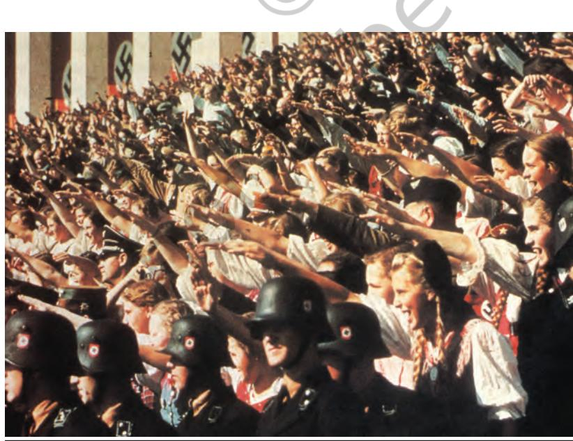

Fig.7 – Hitler being greeted at the Party Congress in Nuremberg in 1938.

#### New words

Propaganda – Specific type of message directly aimed at influencing the opinion of people (through the use of posters, films, speeches, etc.)

**India and the Contemporary World**

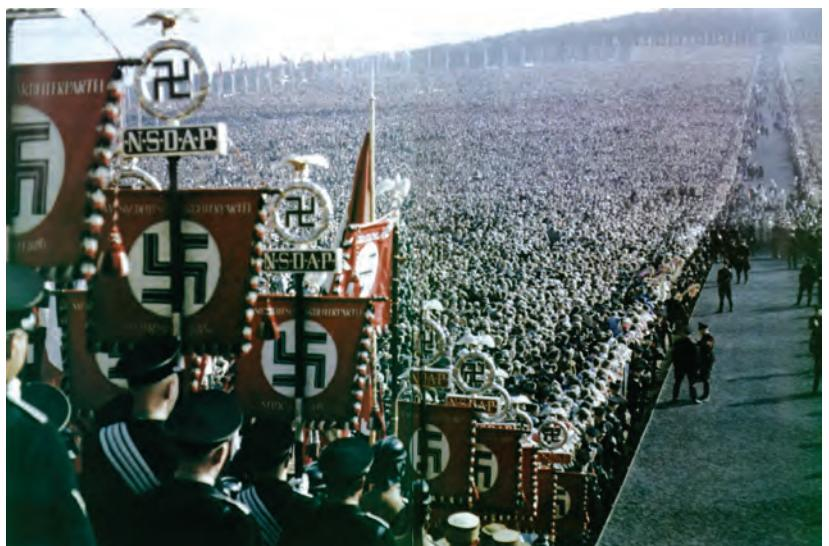

Fig.8 – Nuremberg Rally, 1936. Rallies like this were held every year. An important aspect of these was the demonstration of Nazi power as various organisations paraded past Hitler, swore loyalty and listened to his speeches.

Fig.9 — Hitler addressing SA and SS columns. Notice the sweeping and straight columns of people. Such photographs were intended to show the grandeur and power of the Nazi

Hitler was a powerful speaker. His passion and his words moved people. He promised to build a strong nation, undo the injustice of the Versailles Treaty and restore the dignity of the German people. He promised employment for those looking for work, and a secure future for the youth. He promised to weed out all foreign influences and resist all foreign 'conspiracies' against Germany.

Hitler devised a new style of politics. He understood the significance of rituals and spectacle in mass mobilisation. Nazis held massive rallies

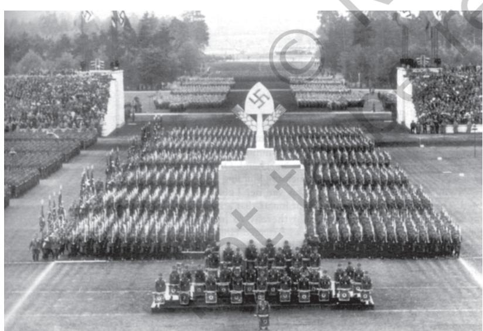

and public meetings to demonstrate the support for Hitler and instil a sense of unity among the people. The Red banners with the Swastika, the Nazi salute, and the ritualised rounds of applause after the speeches were all part of this spectacle of power.

**Nazism and the Rise of Hitler**

movement

Nazi propaganda skilfully projected Hitler as a messiah, a saviour, as someone who had arrived to deliver people from their distress. It is an image that captured the imagination of a people whose sense of dignity and pride had been shattered, and who were living in a time of acute economic and political crises.

#### **2.1 The Destruction of Democracy**

On 30 January 1933, President Hindenburg offered the Chancellorship, the highest position in the cabinet of ministers, to Hitler. By now the Nazis had managed to rally the conservatives to their cause. Having acquired power, Hitler set out to dismantle the structures of democratic rule. A mysterious fire that broke out in the German Parliament building in February facilitated his move. The Fire Decree of 28 February 1933 indefinitely suspended civic rights like freedom of speech, press and assembly that had been guaranteed by the Weimar constitution. Then he turned on his archenemies, the Communists, most of whom were hurriedly packed off to the newly established concentration camps. The repression of the Communists was severe. Out of the surviving 6,808 arrest files of Duesseldorf, a small city of half a million population, 1,440 were those of Communists alone. They were, however, only one among the 52 types of victims persecuted by the Nazis across the country.

On 3 March 1933, the famous Enabling Act was passed. This Act established dictatorship in Germany. It gave Hitler all powers to sideline Parliament and rule by decree. All political parties and trade unions were banned except for the Nazi Party and its affiliates. The state established complete control over the economy, media, army and judiciary.

Special surveillance and security forces were created to control and order society in ways that the Nazis wanted. Apart from the already existing regular police in green uniform and the SA or the Storm Troopers, these included the Gestapo (secret state police), the SS (the protection squads), criminal police and the Security Service (SD). It was the extra-constitutional powers of these newly organised forces that gave the Nazi state its reputation as the most dreaded criminal state. People could now be detained in Gestapo torture chambers, rounded up and sent to concentration camps, deported at will or arrested without any legal procedures. The police forces acquired powers to rule with impunity.

#### New words

Concentration camp – A camp where people were isolated and detained without due process of law. Typically, it was surrounded by electrified barbed wire fences.

**India and the Contemporary World**

#### **2.2 Reconstruction**

Hitler assigned the responsibility of economic recovery to the economist Hjalmar Schacht who aimed at full production and full employment through a state-funded work-creation programme. This project produced the famous German superhighways and the people's car, the Volkswagen.

In foreign policy also Hitler acquired quick successes. He pulled out of the League of Nations in 1933, reoccupied the Rhineland in 1936, and integrated Austria and Germany in 1938 under the slogan, One people, One empire, and One leader. He then went on to wrest Germanspeaking Sudentenland from Czechoslovakia, and gobbled up the entire country. In all of this he had the unspoken support of England, which had considered the Versailles verdict too harsh. These quick successes at home and abroad seemed to reverse the destiny of the country.

Fig.10 – The poster announces: 'Your volkswagen'. Such posters suggested that owning a car was no longer just a dream for an ordinary worker.

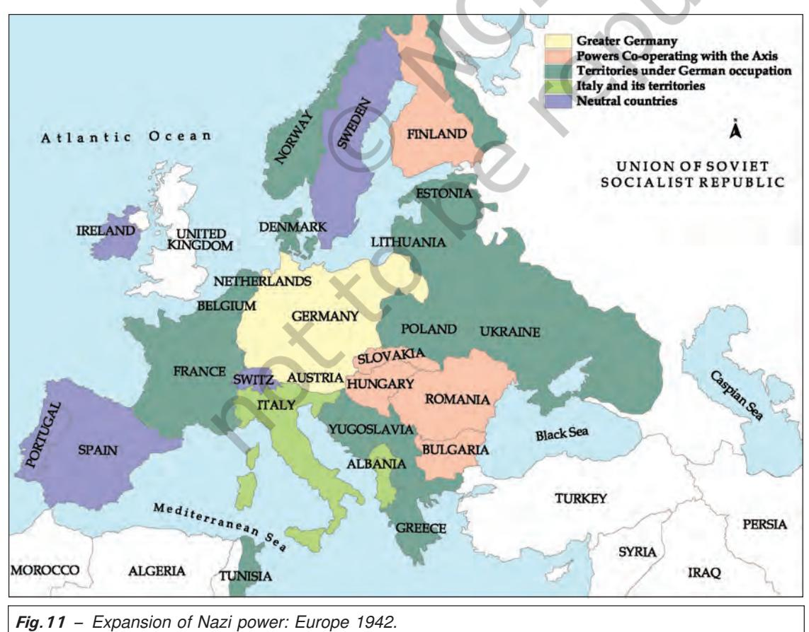

economic crisis. Resources were to be accumulated through expansion of territory. In September 1939, Germany invaded Poland. This started a war with France and England. In September 1940, a Tripartite Pact was signed between Germany, Italy and Japan, strengthening Hitler's claim to international power. Puppet regimes, supportive of Nazi Germany, were installed in a large part of Europe. By the end of 1940, Hitler was at the pinnacle of his power.

Hitler now moved to achieve his long-term aim of conquering Eastern Europe. He wanted to ensure food supplies and living space for Germans. He attacked the Soviet Union in June 1941. In this historic blunder Hitler exposed the German western front to British aerial bombing and the eastern front to the powerful Soviet armies. The Soviet Red Army inflicted a crushing and humiliating defeat on Germany at Stalingrad. After this the Soviet Red Army hounded out the retreating German soldiers until they reached the heart of Berlin, establishing Soviet hegemony over the entire Eastern Europe for half a century thereafter.

Meanwhile, the USA had resisted involvement in the war. It was unwilling to once again face all the economic problems that the First World War had caused. But it could not stay out of the war for long. Japan was expanding its power in the east. It had occupied French Indo-China and was planning attacks on US naval bases in the Pacific. When Japan extended its support to Hitler and bombed the US base at Pearl Harbor, the US entered the Second World War. The war ended in May 1945 with Hitler's defeat and the US dropping of the atom bomb on Hiroshima in Japan.

From this brief account of what happened in the Second World War, we now return to Helmuth and his father's story, a story of Nazi criminality during the war.

Fig.12 – Newspapers in India track the developments in Germany.

2024-25

# **India and the Contemporary World**

# **3 The Nazi Worldview**

The crimes that Nazis committed were linked to a system of belief and a set of practices.

Nazi ideology was synonymous with Hitler's worldview. According to this there was no equality between people, but only a racial hierarchy. In this view blond, blue-eyed, Nordic German Aryans were at the top, while Jews were located at the lowest rung. They came to be regarded as an anti-race, the arch-enemies of the Aryans. All other coloured people were placed in between depending upon their external features. Hitler's racism borrowed from thinkers like Charles Darwin and Herbert Spencer. Darwin was a natural scientist who tried to explain the creation of plants and animals through the concept of evolution and natural selection. Herbert Spencer later added the idea of survival of the fittest. According to this idea, only those species survived on earth that could adapt themselves to changing climatic conditions. We should bear in mind that Darwin never advocated human intervention in what he thought was a purely natural process of selection. However, his ideas were used by racist thinkers and politicians to justify imperial rule over conquered peoples. The Nazi argument was simple: the strongest race would survive and the weak ones would perish. The Aryan race was the finest. It had to retain its purity, become stronger and dominate the world.

The other aspect of Hitler's ideology related to the geopolitical concept of Lebensraum, or living space. He believed that new territories had to be acquired for settlement. This would enhance the area of the mother country, while enabling the settlers on new lands to retain an intimate link with the place of their origin. It would also enhance the material resources and power of the German nation.

Hitler intended to extend German boundaries by moving eastwards, to concentrate all Germans geographically in one place. Poland became the laboratory for this experimentation.

#### **3.1 Establishment of the Racial State**

Once in power, the Nazis quickly began to implement their dream of creating an exclusive racial community of pure Germans by physically eliminating all those who were seen as 'undesirable' in the

#### **Source A**

'For this earth is not allotted to anyone nor is it presented to anyone as a gift. It is awarded by providence to people who in their hearts have the courage to conquer it, the strength to preserve it, and the industry to put it to the plough… The primary right of this world is the right to life, so far as one possesses the strength for this. Hence on the basis of this right a vigorous nation will always find ways of adapting its territory to its population size.'

Hitler, Secret Book, ed. Telford Taylor.

#### **Source B**

'In an era when the earth is gradually being divided up among states, some of which embrace almost entire continents, we cannot speak of a world power in connection with a formation whose political mother country is limited to the absurd area of five hundred kilometers.' Hitler, Mein Kampf, p. 644.

# Activity

Read Sources A and B

- Ø What do they tell you about Hitler's imperial ambition?
- Ø What do you think Mahatma Gandhi would have said to Hitler about these ideas?

#### New words

Nordic German Aryans – One branch of those classified as Aryans. They lived in north European countries and had German or related origin.

extended empire. Nazis wanted only a society of 'pure and healthy Nordic Aryans'. They alone were considered 'desirable'. Only they were seen as worthy of prospering and multiplying against all others who were classed as 'undesirable'. This meant that even those Germans who were seen as impure or abnormal had no right to exist. Under the Euthanasia Programme, Helmuth's father along with other Nazi officials had condemned to death many Germans who were considered mentally or physically unfit.

Jews were not the only community classified as 'undesirable'. There were others. Many Gypsies and blacks living in Nazi Germany were considered as racial 'inferiors' who threatened the biological purity of the 'superior Aryan' race. They were widely persecuted. Even Russians and Poles were considered subhuman, and hence undeserving of any humanity. When Germany occupied Poland and parts of Russia, captured civilians were forced to work as slave labour. Many of them died simply through hard work and starvation.

Jews remained the worst sufferers in Nazi Germany. Nazi hatred of Jews had a precursor in the traditional Christian hostility towards Jews. They had been stereotyped as killers of Christ and usurers.Until medieval times Jews were barred from owning land. They survived mainly through trade and moneylending. They lived in separately marked areas called ghettos. They were often persecuted through periodic organised violence, and expulsion from the land. However, Hitler's hatred of Jews was based on pseudoscientific theories of race, which held that conversion was no solution to 'the Jewish problem'. It could be solved only through their total elimination.

From 1933 to 1938 the Nazis terrorised, pauperised and segregated the Jews, compelling them to leave the country. The next phase, 1939-1945, aimed at concentrating them in certain areas and eventually killing them in gas chambers in Poland.

#### **3.2 The Racial Utopia**

Under the shadow of war, the Nazis proceeded to realise their murderous, racial ideal. Genocide and war became two sides of the same coin. Occupied Poland was divided up. Much of north-western Poland was annexed to Germany. Poles were forced to leave their homes and properties behind to be occupied by ethnic Germans brought in from occupied Europe. Poles were then herded like

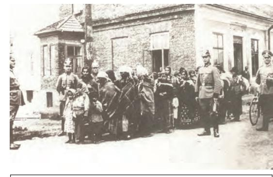

Fig.13 – Police escorting gypsies who are being deported to Auschwitz, 1943-1944.

#### New words

Gypsy – The groups that were classified as 'gypsy' had their own community identity. Sinti and Roma were two such communities. Many of them traced their origin to India. Pauperised – Reduce to absolute poverty Persecution – Systematic, organised punishment of those belonging to a group or religion

Usurers – Moneylenders charging excessive interest; often used as a term of abuse

cattle in the other part called the General Government, the destination of all 'undesirables' of the empire. Members of the Polish intelligentsia were murdered in large numbers in order to keep the entire people intellectually and spiritually servile. Polish children who looked like Aryans were forcibly snatched from their mothers and examined by 'race experts'. If they passed the race tests they were raised in German families and if not, they were deposited in orphanages where most perished. With some of the largest ghettos and gas chambers, the General Government also served as the killing fields for the Jews.

# Activity

See the next two pages and write briefly:

- Ø What does citizenship mean to you? Look at Chapters I and 3 and write 200 words on how the French Revolution and Nazism defined citizenship.
- Ø What did the Nuremberg Laws mean to the 'undesirables' in Nazi Germany? What other legal measures were taken against them to make them feel unwanted?

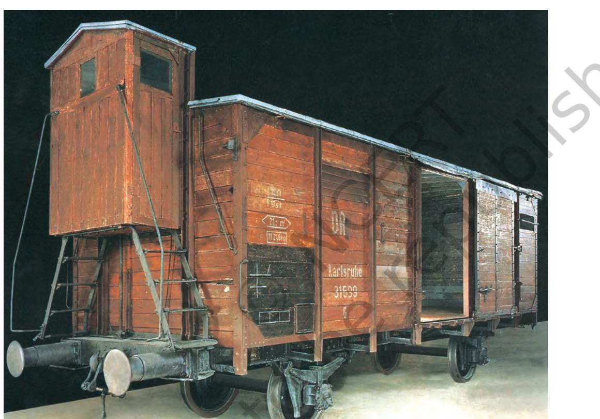

Fig.14 – This is one of the freight cars used to deport Jews to the death chambers.

# **STEPS TO DEATH**

### **Stage 1: Exclusion 1933-1939 YOU HAVE NO RIGHT TO LIVE AMONG US AS CITIZENS**

The Nuremberg Laws of citizenship of September 1935:

- 1. Only Persons of German or related blood would henceforth be German citizens enjoying the protection of the German empire.
- 2. Marriages between Jews and Germans were forbidden.
- 3. Extramarital relations between Jews and Germans became a crime.
- 4. Jews were forbidden to fly the national flag.
- Other legal measures included:
- Boycott of Jewish businesses
- Expulsion from government services
- Forced selling and confiscation of their properties

Besides, Jewish properties were vandalised and looted, houses attacked, **synagogues** burnt and men arrested in a **pogrom** in November. 1938, remembered as 'the night of broken glass'

Fig.16 – Park bench announces: 'FOR ARYANS ONLY'

#### New words

Synagogues – Place of worship for people of Jewish faith

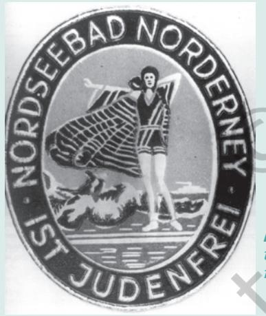

**India and the Contemporary World**

64

Fig.15 – The sign declares that this North Sea bathing resort is free of Jews.

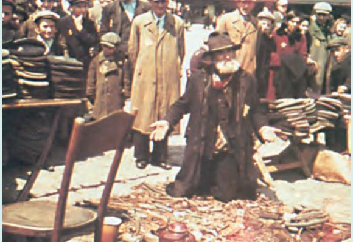

## **Stage 2: Ghettoisation** 1940 - 1944 **YOU HAVE NO RIGHT TO LIVE AMONG US**

Fig.17 – 'This is all I have to sell'. Men and women were left with nothing to survive in the ghettos.

From September 1941, all Jews had to wear a yellow Star of David on their breasts. This identity mark was stamped on their passport, all legal documents and houses. They were kept in Jewish houses in Germany, and in ghettos like Lodz and Warsaw in the east. These became sites of extreme misery and poverty. Jews had to surrender all their wealth before they entered a ghetto. Soon the ghettos were brimming with hunger, starvation and disease due to deprivation and poor hygiene.

#### **Stage 3: Annihilation** 1941 onwards: **YOU HAVE NO RIGHT TO LIVE**

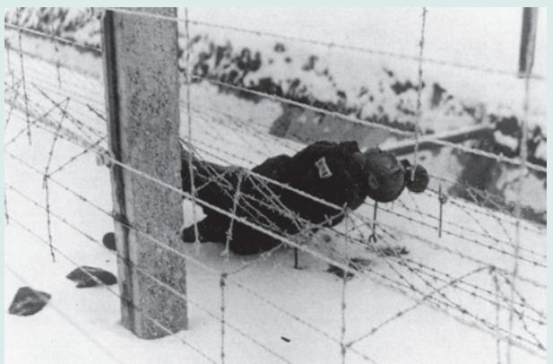

Fig.18 – Killed while trying to escape. The concentration camps were enclosed with live wires.

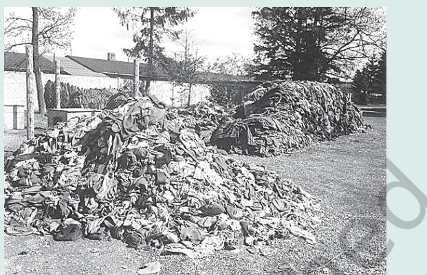

Fig.19 – Piles of clothes outside the gas chamber.

Jews from Jewish houses, concentration camps and ghettos from different parts of Europe were brought to death factories by goods trains. In Poland and elsewhere in the east, most notably Belzek, Auschwitz, Sobibor, Treblinka, Chelmno and Majdanek, they were charred in gas chambers. Mass killings took place within minutes with scientific precision.

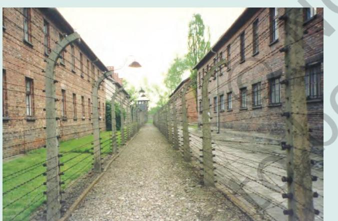

Fig.20 – A Concentration Camp.

Fig.21 – A concentration camp. A camera can make a death camp look beautiful.

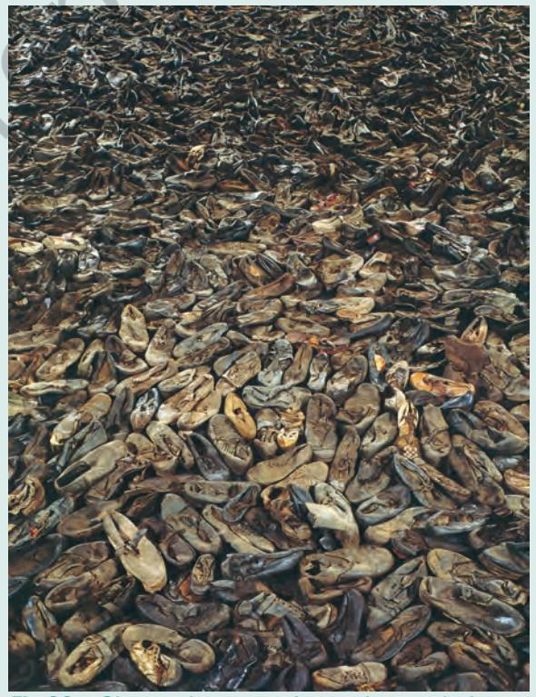

**Nazism and the Rise of Hitler**

65

Fig.22 – Shoes taken away from prisoners before the 'Final Solution'.

# **4 Youth in Nazi Germany**

Hitler was fanatically interested in the youth of the country. He felt that a strong Nazi society could be established only by teaching children Nazi ideology. This required a control over the child both inside and outside school.

What happened in schools under Nazism? All schools were 'cleansed' and 'purified'. This meant that teachers who were Jews or seen as 'politically unreliable' were dismissed. Children were first segregated: Germans and Jews could not sit together or play together. Subsequently, 'undesirable children' – Jews, the physically handicapped, Gypsies – were thrown out of schools. And finally in the 1940s, they were taken to the gas chambers.

'Good German' children were subjected to a process of Nazi schooling, a prolonged period of ideological training. School textbooks were rewritten. Racial science was introduced to justify Nazi ideas of race. Stereotypes about Jews were popularised even through maths classes. Children were taught to be loyal and submissive, hate Jews, and worship Hitler. Even the function of sports was to nurture a spirit of violence and aggression among children. Hitler believed that boxing could make children iron hearted, strong and masculine.

Youth organisations were made responsible for educating German youth in the 'the spirit of National Socialism'. Ten-year-olds had to enter Jungvolk. At 14, all boys had to join the Nazi youth organisation – Hitler Youth – where they learnt to worship war, glorify aggression and violence, condemn democracy, and hate Jews, communists, Gypsies and all those categorised as 'undesirable'. After a period of rigorous ideological and physical training they joined the Labour Service, usually at the age of 18. Then they had to serve in the armed forces and enter one of the Nazi organisations.

The Youth League of the Nazis was founded in 1922. Four years later it was renamed Hitler Youth. To unify the youth movement under Nazi control, all other youth organisations were systematically dissolved and finally banned.

#### New words

Jungvolk – Nazi youth groups for children below 14 years of age.

Fig.23 – Classroom scene depicting a lesson on racial anti-Semitism. From Der Giftpilz (The Poison Mushroom) by Ernst Hiemer (Nuremberg: der Sturmer, 1938), p.7. Caption reads: 'The Jewish nose is bent at its point. It looks like the number six.'

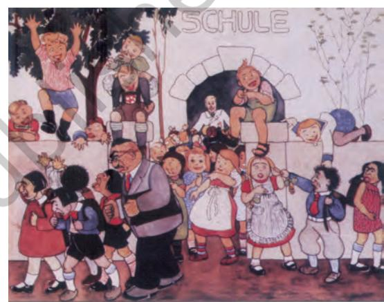

Fig.24 – Jewish teacher and Jewish pupils expelled from school under the jeers of classmates.

From Trau keinem jud auf gruner Heid: Ein Bilderbuch fur Gross und Keom (Trust No Jew on the Green Heath: a Picture Book for Big and Little), By Elvira Bauer (Nuremberg: Der Sturmer, 1936).

# Activity

If you were a student sitting in one of these classes, how would you have felt towards Jews?

Have you ever thought of the stereotypes of other communities that people around you believe in? How have they acquired them?

#### **Source: C**

All boys between the ages of six and ten went through a preliminary training in Nazi ideology. At the end of the training they had to take the following oath of loyalty to Hitler:

'In the presence of this blood banner which represents our Fuhrer I swear to devote all my energies and my strength to the saviour of our country, Adolf Hitler. I am willing and ready to give up my life for him, so help me God.'

From W. Shirer, The Rise and Fall of the Third Reich

#### **Source: D**

Robert Lay, head of the German Labour Front, said:

'We start when the child is three years old. As soon as he even starts to think, he is given a little flag to wave. Then comes school, the Hitler Youth, military service. But when all this is over, we don't let go of anyone. The labour front takes hold of them, and keeps hold until they go to the grave, whether they like it or not.'

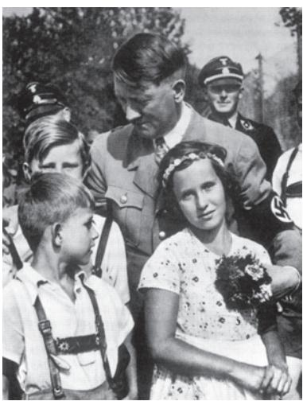

Fig.25 – 'Desirable' children that Hitler wanted to see multiplied.

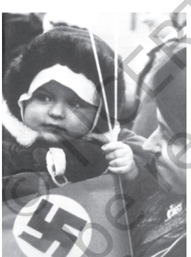

Fig.26 – A German-blooded infant with his mother being brought from occupied Europe to Annexed Poland for settlement.

#### **4.1 The Nazi Cult of Motherhood**

Children in Nazi Germany were repeatedly told that women were radically different from men. The fight for equal rights for men and women that had become part of democratic struggles everywhere was wrong and it would destroy society. While boys were taught to be aggressive, masculine and steel hearted, girls were told that they had to become good mothers and rear pure-blooded Aryan children. Girls had to maintain the purity of the race, distance

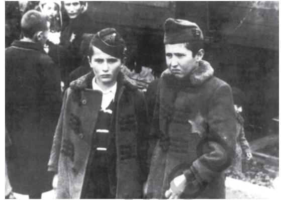

Fig.27 – Jewish children arriving at a death factory to be gassed

# Activity

Look at Figs. 23, 24, and 27. Imagine yourself to be a Jew or a Pole in Nazi Germany. It is September 1941, and the law forcing Jews to wear the Star of David has just been declared. Write an account of one day in your life.

themselves from Jews, look after the home, and teach their children Nazi values. They had to be the bearers of the Aryan culture and race.

In 1933 Hitler said: 'In my state the mother is the most important citizen.' But in Nazi Germany all mothers were not treated equally. Women who bore racially undesirable children were punished and those who produced racially desirable children were awarded. They were given favoured treatment in hospitals and were also entitled to concessions in shops and on theatre tickets and railway fares. To encourage women to produce many children, Honour Crosses were awarded. A bronze cross was given for four children, silver for six and gold for eight or more.

All 'Aryan' women who deviated from the prescribed code of conduct were publicly condemned, and severely punished. Those who maintained contact with Jews, Poles and Russians were paraded through the town with shaved heads, blackened faces and placards hanging around their necks announcing 'I have sullied the honour of the nation'. Many received jail sentences and lost civic honour as well as their husbands and families for this 'criminal offence'.

#### **4.2. The Art of Propaganda**

The Nazi regime used language and media with care, and often to great effect. The terms they coined to describe their various practices are not only deceptive. They are chilling. Nazis never used the words 'kill' or 'murder' in their official communications. Mass killings were termed special treatment, final solution (for the Jews), euthanasia (for the disabled), selection and disinfections. 'Evacuation' meant deporting people to gas chambers. Do you know what the gas chambers were called? They were labelled 'disinfection-areas', and looked like bathrooms equipped with fake showerheads.

Media was carefully used to win support for the regime and popularise its worldview. Nazi ideas were spread through visual images, films, radio, posters, catchy slogans and leaflets. In posters, groups identified as the 'enemies' of Germans were stereotyped, mocked, abused and described as evil. Socialists and liberals were represented as weak and degenerate. They were attacked as malicious foreign agents. Propaganda films were made to create hatred for Jews. The most infamous film was The Eternal Jew. Orthodox Jews were stereotyped and marked. They were shown In an address to women at the Nuremberg Party Rally, 8 September 1934, Hitler said:

We do not consider it correct for the woman to interfere in the world of the man, in his main sphere. We consider it natural that these two worlds remain distinct…What the man gives in courage on the battlefield, the woman gives in eternal self-sacrifice, in eternal pain and suffering. Every child that women bring to the world is a battle, a battle waged for the existence of her people.

#### **Source F**

Hitler at the Nuremberg Party Rally, 8 September 1934, also said:

'The woman is the most stable element in the preservation of a folk…she has the most unerring sense of everything that is important to not let a race disappear because it is her children who would be affected by all this suffering in the first place…That is why we have integrated the woman in the struggle of the racial community just as nature and providence have determined so.'

with flowing beards wearing kaftans, whereas in reality it was difficult to distinguish German Jews by their outward appearance because they were a highly assimilated community. They were referred to as vermin, rats and pests. Their movements were compared to those of rodents. Nazism worked on the minds of the people, tapped their emotions, and turned their hatred and anger at those marked as 'undesirable'.

The Nazis made equal efforts to appeal to all the different sections of the population. They sought to win their support by suggesting that Nazis alone could solve all their problems.

# Activity

How would you have reacted to Hilter's ideas if you were:

- Ø A Jewish woman
- Ø A non-Jewish German woman

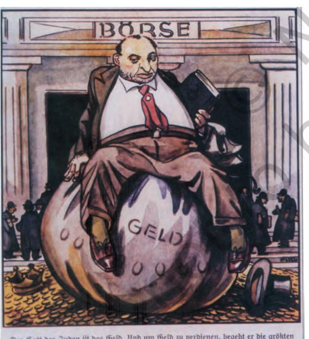

#### Fig.28 – A Nazi poster attacking Jews.

Caption above reads: 'Money is the God of Jews. In order to earn money he commits the greatest crimes. He does not rest, until he can sit on a big sack of money, until he has become the king of money.'

# Activity

What do you think this poster is trying to depict?

# GERMAN FARMER YOU BELONG TO HITLER! WHY?

The German farmer stands in between two great dangers today: The one danger American economic system – Big Capitalism! The other is the Marxist economic system of Bolshevism. Big Capitalism and Bolshevism work hand in hand: they are born of Jewish thought and serve the master plan of world Jewery. Who alone can rescue the farmer from these dangers?

#### NATIONAL SOCIALISM.

From: a Nazi leaflet, 1932.

Fig.29 – The leaflet shows how the Nazis appealed to the peasants.

# Activity

Look at Figs. 29 and 30 and answer the following:

What do they tell us about Nazi propaganda? How are the Nazis trying to mobilise different sections of the population?

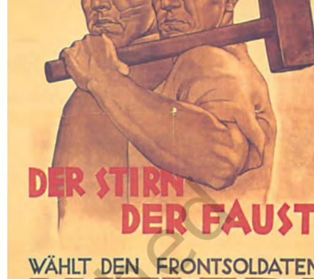

#### **Some important dates**

August 1, 1914 First World War begins.

November 9, 1918 Germany capitulates, ending the war.

November 9, 1918 Proclamation of the Weimar Republic.

June 28, 1919 Treaty of Versailles.

January 30, 1933 Hitler becomes Chancellor of Germany.

September 1, 1939 Germany invades Poland. Beginning of the Second World War.

June 22, 1941 Germany invades the USSR.

June 23,1941 Mass murder of the Jews begins.

December 8 1941 The United States joins Second World War.

January 27,1945 Soviet troops liberate Auschwitz.

May 8, 1945 Allied victory in Europe.

# **5 Ordinary People and the Crimes Against Humanity**

#### How did the common people react to Nazism?

Many saw the world through Nazi eyes, and spoke their mind in Nazi language. They felt hatred and anger surge inside them when they saw someone who looked like a Jew. They marked the houses of Jews and reported suspicious neighbours. They genuinely believed Nazism would bring prosperity and improve general well-being.

But not every German was a Nazi. Many organised active resistance to Nazism, braving police repression and death. The large majority of Germans, however, were passive onlookers and apathetic witnesses. They were too scared to act, to differ, to protest. They preferred to look away. Pastor Niemoeller, a resistance fighter, observed an absence of protest, an uncanny silence, amongst ordinary Germans in the face of brutal and organised crimes committed against people in the Nazi empire. He wrote movingly about this silence:

'First they came for the Communists,

- Well, I was not a Communist –
So I said nothing.

- Then they came for the Social Democrats,
- Well, I was not a Social Democrat

So I did nothing,

- Then they came for the trade unionists,
- But I was not a trade unionist.
- And then they came for the Jews,
- But I was not a Jew so I did little.
- Then when they came for me,

There was no one left who could stand up for me.'

# Activity

Why does Erna Kranz say, 'I could only say for myself'? How do you view her opinion?

#### **Box 1**

Was the lack of concern for Nazi victims only because of the Terror? No, says Lawrence Rees who interviewed people from diverse backgrounds for his recent documentary, 'The Nazis: A Warning from History'.

Erna Kranz, an ordinary German teenager in the1930s and a grandmother now, said to Rees:

'1930s offered a glimmer of hope, not just for the unemployed but for everybody for we all felt downtrodden. From my own experience I could say salaries increased and Germany seemed to have regained its sense of purpose. I could only say for myself, I thought it was a good time. I liked it.'

What Jews felt in Nazi Germany is a different story altogether. Charlotte Beradt secretly recorded people's dreams in her diary and later published them in a highly disconcerting book called the Third Reich of Dreams. She describes how Jews themselves began believing in the Nazi stereotypes about them. They dreamt of their hooked noses, black hair and eyes, Jewish looks and body movements. The stereotypical images publicised in the Nazi press haunted the Jews. They troubled them even in their dreams. Jews died many deaths even before they reached the gas chamber.

#### **5.1 Knowledge about the Holocaust**

Information about Nazi practices had trickled out of Germany during the last years of the regime. But it was only after the war ended and Germany was defeated that the world came to realise the horrors of what had happened. While the Germans were preoccupied with their own plight as a defeated nation emerging out of the rubble, the Jews wanted the world to remember the atrocities and sufferings they had endured during the Nazi killing operations – also called the Holocaust. At its height, a ghetto inhabitant had said to another that he wanted to outlive the war just for half an hour. Presumably he meant that he wanted to be able to tell the world about what had happened in Nazi Germany. This indomitable spirit to bear witness and to preserve the documents can be seen in many ghetto and camp inhabitants who wrote diaries, kept notebooks, and created archives. On the other hand when the war seemed lost, the Nazi leadership distributed petrol to its functionaries to destroy all incriminating evidence available in offices.

Yet the history and the memory of the Holocaust live on in memoirs, fiction, documentaries, poetry, memorials and museums in many parts of the world today. These are a tribute to those who resisted it, an embarrassing reminder to those who collaborated, and a warning to those who watched in silence.

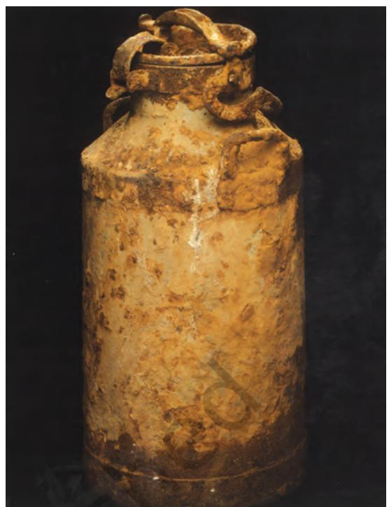

Fig.31 – Inhabitants of the Warsaw ghetto collected documents and placed them in three milk cans along with other containers. As destruction seemed imminent, these containers were buried in the cellars of buildings in 1943. This can was discovered in 1950.

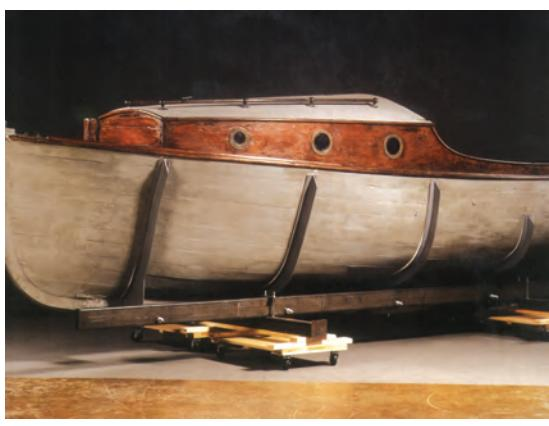

Fig.32 – Denmark secretly rescued their Jews from Germany. This is one of the boats used for the purpose.

**Box 2**

#### **Mahatma Gandhi writes to Hitler**

LETTER TO ADOLF HITLER AS AT WARDHA, C. P., INDIA, July 23, 1939

HERR HITLER BERLIN GERMANY

#### DEAR FRIEND,

Friends have been urging me to write to you for the sake of humanity. But I have resisted their request, because of the feeling that any letter from me would be an impertinence. Something tells me that I must not calculate and that I must make my appeal for whatever it may be worth.

It is quite clear that you are today the one person in the world who can prevent a war which may reduce humanity to the savage state.

Must you pay that price for an object however worthy it may appear to you to be? Will you listen to the appeal of one who has deliberately shunned the method of war not without considerable success? Anyway

I anticipate your forgiveness, if I have erred in writing to you.

I remain,

Your sincere friend, M. K. GANDHI

THE COLLECTED WORKS OF MAHATMA GANDHI VOL. 76.

#### LETTER TO ADOLF HITLER WARDHA,

December 24, 1940

We have found in non-violence a force which, if organised, can without doubt match itself against a combination of all the most violent forces in the world. In non-violent technique, as I have said, there is no such thing as defeat. It is all 'do or die' without killing or hurting. It can be used practically without money and obviously without the aid of science of destruction which you have brought to such perfection. It is a marvel to me that you do not see that it is nobody's monopoly. If not the British, some other power will certainly improve upon your method and beat you with your own weapon. You are leaving no legacy to your people of which they would feel proud. They cannot take pride in a recital of cruel deed, however skilfully planned. I, therefore, appeal to you in the name of humanity to stop the war….

I am, Your sincere friend, M. K. GANDHI

THE COLLECTED WORKS OF MAHATMA GANDHI VOL. 79.

# Activities

- 1. Write a one page history of Germany
	- Ø as a schoolchild in Nazi Germany
	- Ø as a Jewish survivor of a concentration camp
	- Ø as a political opponent of the Nazi regime
- 2. Imagine that you are Helmuth. You have had many Jewish friends in school and do not believe that Jews are bad. Write a paragraph on what you would say to your father.

?

# Questions

- 1. Describe the problems faced by the Weimar Republic.
- 2. Discuss why Nazism became popular in Germany by 1930.
- 3. What are the peculiar features of Nazi thinking?
- 4. Explain why Nazi propaganda was effective in creating a hatred for Jews.
- 5. Explain what role women had in Nazi society. Return to Chapter 1 on the French Revolution. Write a paragraph comparing and contrasting the role of women in the two periods.
- 6. In what ways did the Nazi state seek to establish total control over its people ?

