## **SECTION II**

### **LIVELIHOODS, ECONOMIES AND SOCIETIES**

In Section II we will shift our focus to the study of livelihoods and economies. We will look at how the lives of forest dwellers and pastoralists changed in the modern world and how they played a part in shaping these changes.

All too often in looking at the emergence of the modern world, we only focus on factories and cities, on the industrial and agricultural sectors which supply the market. But we forget that there are other economies outside these sectors, other people too who matter to the nation. To modern eyes, the lives of pastoralists and forest dwellers, the shifting cultivators and food gatherers often seem to be stuck in the past. It is as if their lives are not important when we study the emergence of the contemporary world. The chapters in Section II will suggest that we need to know about their lives, see how they organise their world and operate their economies. These communities are very much part of the modern world we live in today. They are not simply survivors from a bygone era.

Chapter IV will take you into the forest and tell you about the variety of ways the forests were used by communities living within them. It will show how in the nineteenth century the growth of industries and urban centres, ships and railways, created a new demand on the forests for timber and other forest products. New demands led to new rules of forest use, new ways of organising the forest. You will see how colonial control was established over the forests, how forest areas were mapped, trees were classified, and plantations were developed. All these developments affected the lives of those local communities who used forest resources. They were forced to operate within new systems and reorganise their lives. But they also rebelled against the rules and persuaded the state to change its policies. The chapter will give you an idea of the history of such developments in India and Indonesia.

 **Forest Society and Colonialism**

75

Chapter V will track the movements of the pastoralists in the mountains and deserts, in the plains and plateaus of India and Africa. Pastoral communities in both these areas form an important segment of the population. Yet we rarely study their lives. Their histories do not enter the pages of textbooks. Chapter V will show how their lives were affected by the controls established over the forest, the expansion of agriculture, and the decline of grazing fields. It will tell you about the patterns of their movements, their relationships to other communities, and the way they adjust to changing situations.

We cannot understand the making of the contemporary world unless we begin to see the changes in the lives of diverse communities and people. We also cannot understand the problems of modernisation unless we look at its impact on the environment.

**India and the Contemporary World**

# **Forest Society and Colonialism**

Chapter IV

Take a quick look around your school and home and identify all the things that come from forests: the paper in the book you are reading, desks and tables, doors and windows, the dyes that colour your clothes, spices in your food, the cellophane wrapper of your toffee, tendu leaf in bidis, gum, honey, coffee, tea and rubber. Do not miss out the oil in chocolates, which comes from sal seeds, the tannin used to convert skins and hides into leather, or the herbs and roots used for medicinal purposes. Forests also provide bamboo, wood for fuel, grass, charcoal, packaging, fruits, flowers, animals, birds and many other things. In the Amazon forests or in the Western Ghats, it is possible to find as many as 500 different plant species in one forest patch.

A lot of this diversity is fast disappearing. Between 1700 and 1995, the period of industrialisation, 13.9 million sq km of forest or 9.3 per cent of the world's total area was cleared for industrial uses, cultivation, pastures and fuelwood.

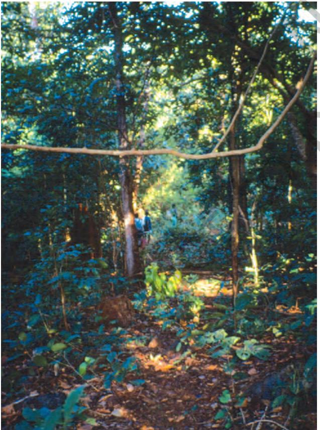

Fig.1 – A sal forest in Chhattisgarh. Look at the different heights of the trees and plants in this picture, and the variety of species. This is a dense forest, so very little sunlight falls on the forest floor.

77

### **1 Why Deforestation?**

The disappearance of forests is referred to as deforestation. Deforestation is not a recent problem. The process began many centuries ago; but under colonial rule it became more systematic and extensive. Let us look at some of the causes of deforestation in India.

#### **1.1 Land to be Improved**

In 1600, approximately one-sixth of India's landmass was under cultivation. Now that figure has gone up to about half. As population increased over the centuries and the demand for food went up, peasants extended the boundaries of cultivation, clearing forests and breaking new land. In the colonial period, cultivation expanded rapidly for a variety of reasons. First, the British directly encouraged

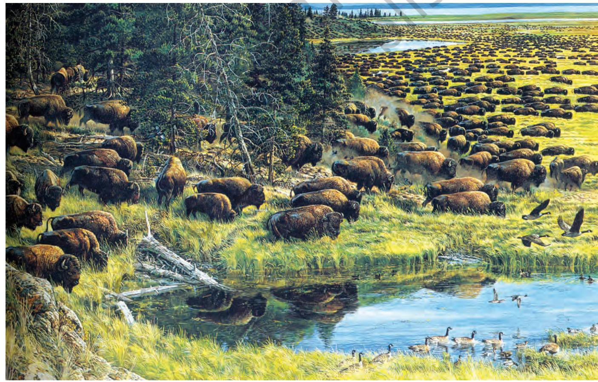

Fig.2 – When the valleys were full. Painting by John Dawson. Native Americans like the Lakota tribe who lived in the Great North American Plains had a diversified economy. They cultivated maize, foraged for wild plants and hunted bison. Keeping vast areas open for the bison to range in was seen by the English settlers as wasteful. After the 1860s the bisons were killed in large numbers.

78

the production of commercial crops like jute, sugar, wheat and cotton. The demand for these crops increased in nineteenth-century Europe where foodgrains were needed to feed the growing urban population and raw materials were required for industrial

#### **Box 1**

The absence of cultivation in a place does not mean the land was uninhabited. In Australia, when the white settlers landed, they claimed that the continent was empty or terra nullius. In fact, they were guided through the landscape by aboriginal tracks, and led by aboriginal guides. The different aboriginal communities in Australia had clearly demarcated territories. The Ngarrindjeri people of Australia plotted their land along the symbolic body of the first ancestor, Ngurunderi. This land included five different environments: salt water, riverine tracts, lakes, bush and desert plains, which satisfied different socio-economic needs.

production. Second, in the early nineteenth century, the colonial state thought that forests were unproductive. They were considered to be wilderness that had to be brought under cultivation so that the land could yield agricultural products and revenue, and enhance the income of the state. So between 1880 and 1920, cultivated area rose by 6.7 million hectares.

We always see the expansion of cultivation as a sign of progress. But we should not forget that for land to be brought under the plough, forests have to be cleared.

#### **Source A**

The idea that uncultivated land had to be taken over and improved was popular with colonisers everywhere in the world. It was an argument that justified conquest.

In 1896 the American writer, Richard Harding, wrote on the Honduras in Central America:

'There is no more interesting question of the present day than that of what is to be done with the world's land which is lying unimproved; whether it shall go to the great power that is willing to turn it to account, or remain with its original owner, who fails to understand its value. The Central Americans are like a gang of semi-barbarians in a beautifully furnished house, of which they can understand neither its possibilities of comfort nor its use.'

Three years later the American-owned United Fruit Company was founded, and grew bananas on an industrial scale in Central America. The company acquired such power over the governments of these countries that they came to be known as Banana Republics.

Quoted in David Spurr, The Rhetoric of Empire, (1993).

#### **1.2 Sleepers on the Tracks**

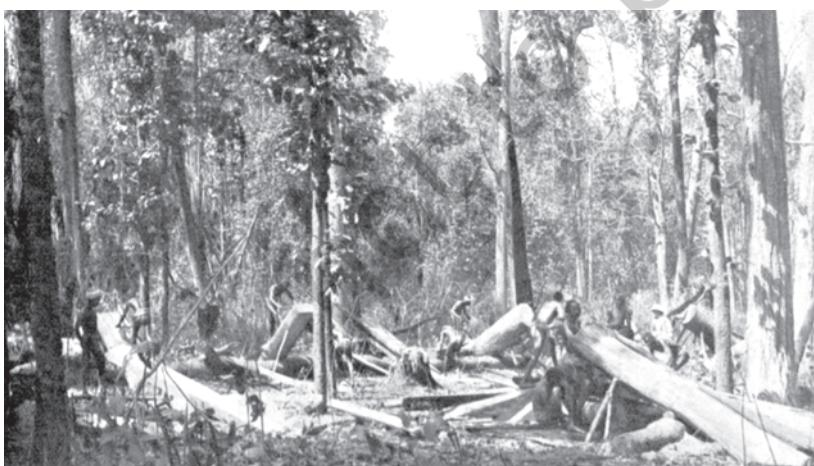

New words

Sleepers – Wooden planks laid across railway tracks; they hold the tracks in position

Fig.3 – Converting sal logs into sleepers in the Singhbhum forests, Chhotanagpur, May 1897. Adivasis were hired by the forest department to cut trees, and make smooth planks which would serve as sleepers for the railways. At the same time, they were not allowed to cut these trees to build their own houses.

By the early nineteenth century, oak forests in England were disappearing. This created a problem of timber supply for the Royal Navy. How could English ships be built without a regular supply of strong and durable timber? How could imperial power be protected and maintained without ships? By the 1820s, search parties were sent to explore the forest resources of India. Within a decade, trees were being felled on a massive scale and vast quantities of timber were being exported from India.

The spread of railways from the 1850s created a new demand. Railways were essential for colonial trade and for the movement of imperial troops. To run locomotives, wood was needed as fuel, and to lay railway lines sleepers were essential to hold the tracks together. Each mile of railway track required between 1,760 and 2,000 sleepers.

From the 1860s, the railway network expanded rapidly. By 1890, about 25,500 km of track had been laid. In 1946, the length of the tracks had increased to over 765,000 km. As the railway tracks spread through India, a larger and larger number of trees were felled. As early as the 1850s, in the Madras Presidency alone, 35,000 trees were being cut annually for sleepers. The government gave out contracts to individuals to supply the required quantities. These contractors began cutting trees indiscriminately. Forests around the railway tracks fast started disappearing.

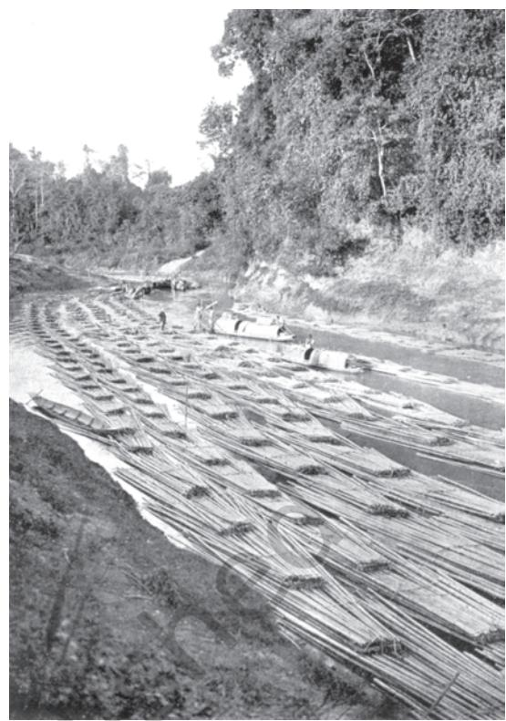

Fig.4 – Bamboo rafts being floated down the Kassalong river, Chittagong Hill Tracts.

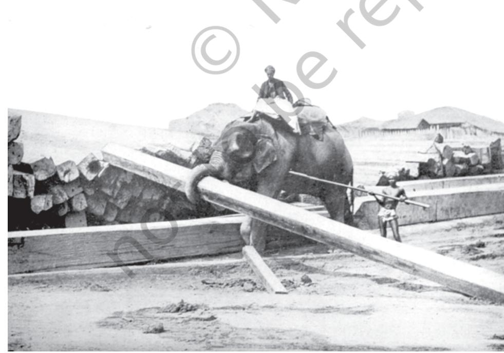

Fig.5 – Elephants piling squares of timber at a timber yard in Rangoon. In the colonial period elephants were frequently used to lift heavy timber both in the forests and at the timber yards.

#### **Source B**

'The new line to be constructed was the Indus Valley Railway between Multan and Sukkur, a distance of nearly 300 miles. At the rate of 2000 sleepers per mile this would require 600,000 sleepers 10 feet by 10 inches by 5 inches (or 3.5 cubic feet apiece), being upwards of 2,000,000 cubic feet. The locomotives would use wood fuel. At the rate of one train daily either way and at one maund per train-mile an annual supply of 219,000 maunds would be demanded. In addition a large supply of fuel for brick-burning would be required. The sleepers would have to come mainly from the Sind Forests. The fuel from the tamarisk and Jhand forests of Sind and the Punjab. The other new line was the Northern State Railway from Lahore to Multan. It was estimated that 2,200,000 sleepers would be required for its construction.'

E.P. Stebbing, The Forests of India, Vol. II (1923).

### Activity

Each mile of railway track required between 1,760 and 2,000 sleepers. If one averagesized tree yields 3 to 5 sleepers for a 3 metre wide broad gauge track, calculate approximately how many trees would have to be cut to lay one mile of track.

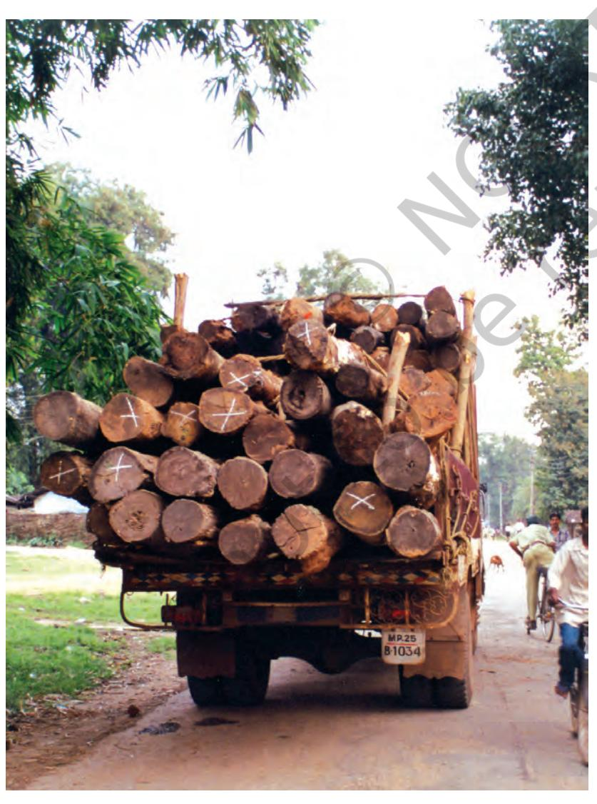

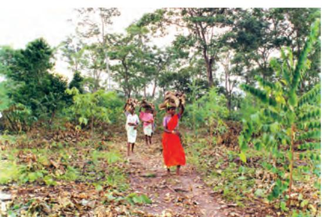

Fig.6 - Women returning home after collecting fuelwood.

#### Fig.7 - Truck carrying logs

When the forest department decided to take up an area for logging, one of the first things it did was to build wide roads so that trucks could enter. Compare this to the forest tracks along which people walk to collect fuelwood and other minor forest produce. Many such trucks of wood go from forest areas to big cities.

### **1.3 Plantations**

Large areas of natural forests were also cleared to make way for tea, coffee and rubber plantations to meet Europe's growing need for these commodities. The colonial government took over the forests, and gave vast areas to European planters at cheap rates. These areas were enclosed and cleared of forests, and planted with tea or coffee.

**India and the Contemporary World**

### **2 The Rise of Commercial Forestry**

In the previous section we have seen that the British needed forests in order to build ships and railways. The British were worried that the use of forests by local people and the reckless felling of trees by traders would destroy forests. So they decided to invite a German expert, Dietrich Brandis, for advice, and made him the first Inspector General of Forests in India.

Brandis realised that a proper system had to be introduced to manage the forests and people had to be trained in the science of conservation. This system would need legal sanction. Rules about the use of forest resources had to be framed. Felling of trees and grazing had to be restricted so that forests could be preserved for timber production. Anybody who cut trees without following the system had to be

### Activity

If you were the Government of India in 1862 and responsible for supplying the railways with sleepers and fuel on such a large scale, what were the steps you would have taken?

#### Fig.9 – One aisle of a managed poplar forest in Tuscany, Italy.

Poplar forests are good mainly for timber. They are not used for leaves, fruit or other products. Look at the straight lines of trees, all of a uniform height. This is the model that 'scientific' forestry has promoted.

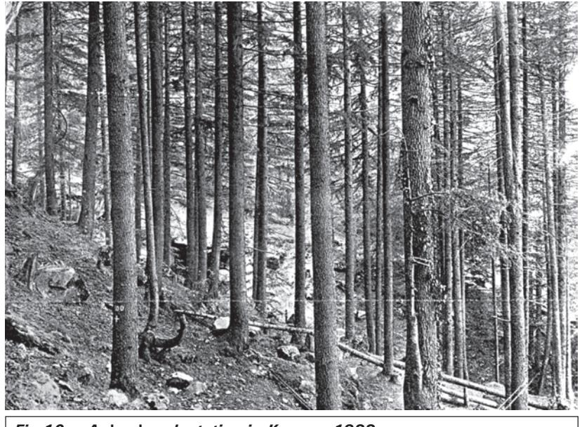

Fig.10 – A deodar plantation in Kangra, 1933. From Indian Forest Records, Vol. XV.

punished. So Brandis set up the Indian Forest Service in 1864 and helped formulate the Indian Forest Act of 1865. The Imperial Forest Research Institute was set up at Dehradun in 1906. The system they taught here was called 'scientific forestry'. Many people now, including ecologists, feel that this system is not scientific at all.

In scientific forestry, natural forests which had lots of different types of trees were cut down. In their place, one type of tree was planted in straight rows. This is called a plantation. Forest officials surveyed the forests, estimated the area under different types of trees, and made working plans for forest management. They planned how much of the plantation area to cut every year. The area cut was then to be replanted so that it was ready to be cut again in some years.

After the Forest Act was enacted in 1865, it was amended twice, once in 1878 and then in 1927. The 1878 Act divided forests into three categories: reserved, protected and village forests. The best forests were called 'reserved forests'. Villagers could not take anything from these forests, even for their own use. For house building or fuel, they could take wood from protected or village forests.

#### **2.1 How were the Lives of People Affected?**

Foresters and villagers had very different ideas of what a good forest should look like. Villagers wanted forests with a mixture of species to satisfy different needs – fuel, fodder, leaves. The forest department on the other hand wanted trees which were suitable for building

Fig.11 – The Imperial Forest School, Dehra Dun, India. The first forestry school to be inaugurated in the British Empire. From: Indian Forester, Vol. XXXI

#### New words

Scientific forestry – A system of cutting trees controlled by the forest department, in which old trees are cut and new ones planted

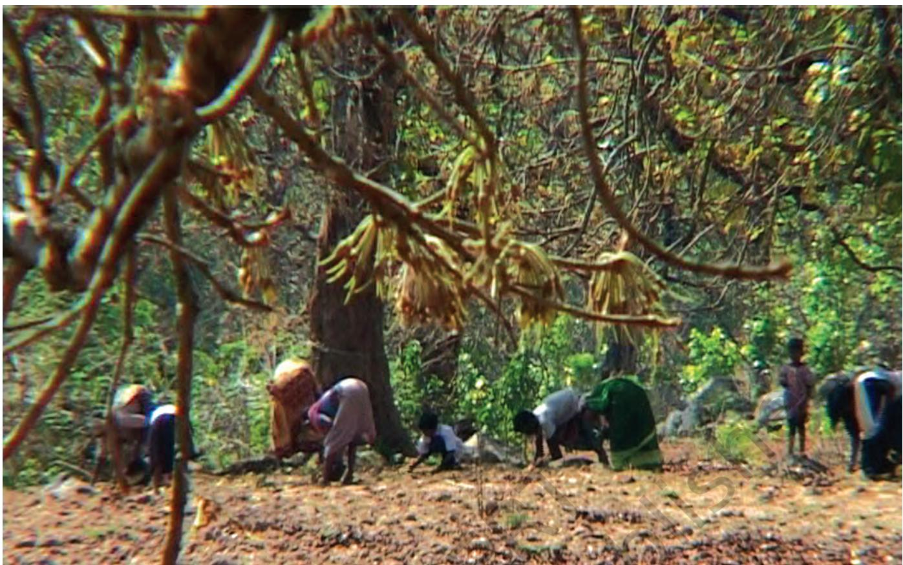

Fig.12 – Collecting mahua ( Madhuca indica) from the forests. Villagers wake up before dawn and go to the forest to collect the mahua flowers which have fallen on the forest floor. Mahua trees are precious. Mahua flowers can be eaten or used to make alcohol. The seeds can be used to make oil.

ships or railways. They needed trees that could provide hard wood, and were tall and straight. So particular species like teak and sal were promoted and others were cut.

In forest areas, people use forest products – roots, leaves, fruits, and tubers – for many things. Fruits and tubers are nutritious to eat, especially during the monsoons before the harvest has come in. Herbs are used for medicine, wood for agricultural implements like yokes and ploughs, bamboo makes excellent fences and is also used to make baskets and umbrellas. A dried scooped-out gourd can be used as a portable water bottle. Almost everything is available in the forest – leaves can be stitched together to make disposable plates and cups, the siadi (Bauhinia vahlii) creeper can be used to make ropes, and the thorny bark of the semur (silk-cotton) tree is used to grate vegetables. Oil for cooking and to light lamps can be pressed from the fruit of the mahua tree.

The Forest Act meant severe hardship for villagers across the country. After the Act, all their everyday practices – cutting wood for their

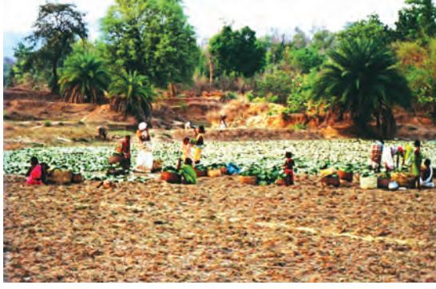

Fig.13 – Drying tendu leaves. The sale of tendu leaves is a major source of income for many people living in forests. Each bundle contains approximately 50 leaves, and if a person works very hard they can perhaps collect as many as 100 bundles in a day. Women, children and old men are the main collectors.

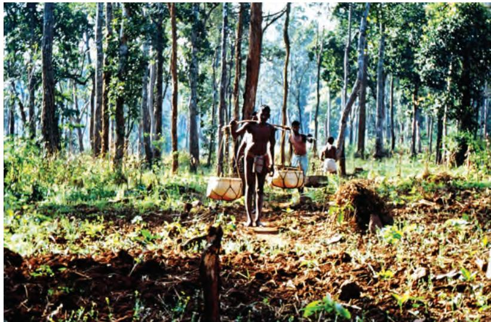

houses, grazing their cattle, collecting fruits and roots, hunting and fishing – became illegal. People were now forced to steal wood from the forests, and if they were caught, they were at the mercy of the forest guards who would take bribes from them. Women who collected fuelwood were especially worried. It was also common for police constables and forest guards to harass people by demanding free food from them.

#### **2.2 How did Forest Rules Affect Cultivation?**

One of the major impacts of European colonialism was on the practice of shifting cultivation or swidden agriculture. This is a traditional agricultural practice in many parts of Asia, Africa and South America. It has many local names such as lading in Southeast Asia, milpa in Central America, chitemene or tavy in Africa, and chena in Sri Lanka. In India, dhya, penda, bewar, nevad, jhum, podu, khandad and kumri are some of the local terms for swidden agriculture.

In shifting cultivation, parts of the forest are cut and burnt in rotation. Seeds are sown in the ashes after the first monsoon rains, and the crop is harvested by October-November. Such plots are cultivated for a couple of years and then left fallow for 12 to 18 years for the forest to grow back. A mixture of crops is grown on these plots. In central India and Africa it could be millets, in Brazil manioc, and in other parts of Latin America maize and beans.

European foresters regarded this practice as harmful for the forests. They felt that land which was used for cultivation every few years could not grow trees for railway timber. When a forest was burnt, there was the added danger of the flames spreading and burning valuable timber.

#### Fig.14 – Bringing grain from the threshing grounds to the field.

The men are carrying grain in baskets from the threshing fields. Men carry the baskets slung on a pole across their shoulders, while women carry the baskets on their heads.

### Activity

Children living around forest areas can often identify hundreds of species of trees and plants. How many species of trees can you name?

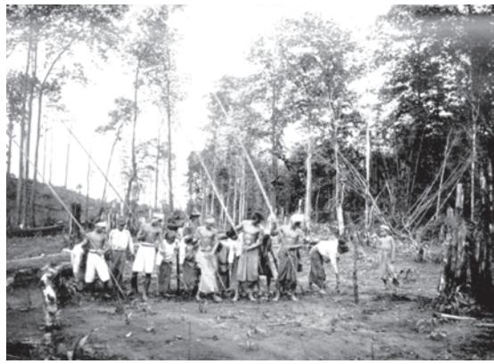

Fig.15 – Taungya cultivation was a system in which local farmers were allowed to cultivate temporarily within a plantation. In this photo taken in Tharrawaddy division in Burma in 1921 the cultivators are sowing paddy. The men make holes in the soil using long bamboo poles with iron tips. The women sow paddy in each hole.

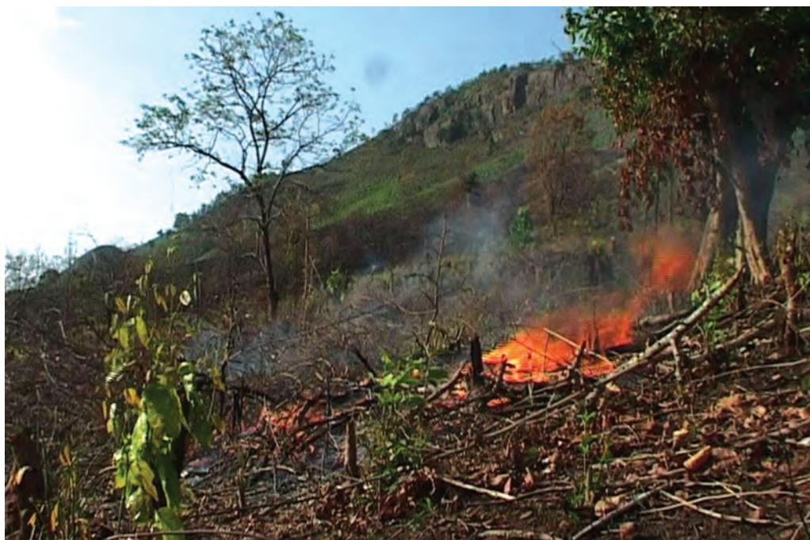

Fig.16 – Burning the forest penda or podu plot. In shifting cultivation, a clearing is made in the forest, usually on the slopes of hills. After the trees have been cut, they are burnt to provide ashes. The seeds are then scattered in the area, and left to be irrigated by the rain.

Shifting cultivation also made it harder for the government to calculate taxes. Therefore, the government decided to ban shifting cultivation. As a result, many communities were forcibly displaced from their homes in the forests. Some had to change occupations, while some resisted through large and small rebellions.

#### **2.3 Who could Hunt?**

The new forest laws changed the lives of forest dwellers in yet another way. Before the forest laws, many people who lived in or near forests had survived by hunting deer, partridges and a variety of small animals. This customary practice was prohibited by the forest laws. Those who were caught hunting were now punished for poaching.

While the forest laws deprived people of their customary rights to hunt, hunting of big game became a sport. In India, hunting of tigers and other animals had been part of the culture of the court and nobility for centuries. Many Mughal paintings show princes and emperors enjoying a hunt. But under colonial rule the scale of hunting increased to such an extent that various species became almost extinct. The British saw large animals as signs of a wild, primitive and savage society. They believed that by killing dangerous animals the British

Fig.17 – The little fisherman. Children accompany their parents to the forest and learn early how to fish, collect forest produce and cultivate. The bamboo trap which the boy is holding in his right hand is kept at the mouth of a stream – the fish flow into it.

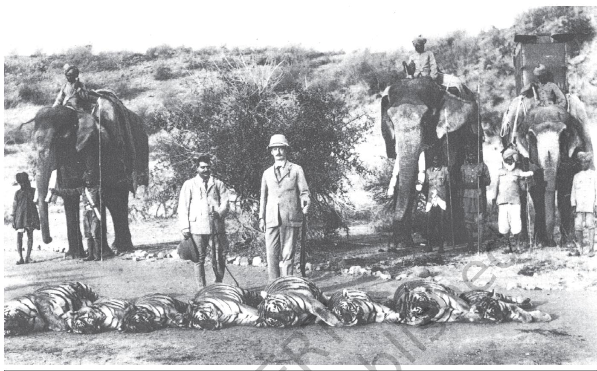

Fig.18 – Lord Reading hunting in Nepal. Count the dead tigers in the photo. When British colonial officials and Rajas went hunting they were accompanied by a whole retinue of servants. Usually, the tracking was done by skilled village hunters, and the Sahib simply fired the shot.

would civilise India. They gave rewards for the killing of tigers, wolves and other large animals on the grounds that they posed a threat to cultivators. 0ver 80,000 tigers, 150,000 leopards and 200,000 wolves were killed for reward in the period 1875-1925. Gradually, the tiger came to be seen as a sporting trophy. The Maharaja of Sarguja alone shot 1,157 tigers and 2,000 leopards up to 1957. A British administrator, George Yule, killed 400 tigers. Initially certain areas of forests were reserved for hunting. Only much later did environmentalists and conservators begin to argue that all these species of animals needed to be protected, and not killed.

#### **2.4 New Trades, New Employments and New Services**

While people lost out in many ways after the forest department took control of the forests, some people benefited from the new opportunities that had opened up in trade. Many communities left their traditional occupations and started trading in forest products. This happened not only in India but across the world. For example,

#### **Source C**

Baigas are a forest community of Central India. In 1892, after their shifting cultivation was stopped, they petitioned to the government:

'We daily starve, having had no foodgrain in our possession. The only wealth we possess is our axe. We have no clothes to cover our body with, but we pass cold nights by the fireside. We are now dying for want of food. We cannot go elsewhere. What fault have we done that the government does not take care of us? Prisoners are supplied with ample food in jail. A cultivator of the grass is not deprived of his holding, but the government does not give us our right who have lived here for generations past.'

Verrier Elwin (1939), cited in Madhav Gadgil and Ramachandra Guha, This Fissured Land: An Ecological History of India.

with the growing demand for rubber in the mid-nineteenth century, the Mundurucu peoples of the Brazilian Amazon who lived in villages on high ground and cultivated manioc, began to collect latex from wild rubber trees for supplying to traders. Gradually, they descended to live in trading posts and became completely dependent on traders.

In India, the trade in forest products was not new. From the medieval period onwards, we have records of adivasi communities trading elephants and other goods like hides, horns, silk cocoons, ivory, bamboo, spices, fibres, grasses, gums and resins through nomadic communities like the Banjaras.

With the coming of the British, however, trade was completely regulated by the government. The British government gave many large European trading firms the sole right to trade in the forest products of particular areas. Grazing and hunting by local people were restricted. In the process, many pastoralist and nomadic communities like the Korava, Karacha and Yerukula of the Madras Presidency lost their livelihoods. Some of them began to be called 'criminal tribes', and were forced to work instead in factories, mines and plantations, under government supervision.

New opportunities of work did not always mean improved wellbeing for the people. In Assam, both men and women from forest communities like Santhals and Oraons from Jharkhand, and Gonds from Chhattisgarh were recruited to work on tea plantations. Their wages were low and conditions of work were very bad. They could not return easily to their home villages from where they had been recruited.

#### **Source D**

Rubber extraction in the Putumayo

'Everywhere in the world, conditions of work in plantations were horrific.

The extraction of rubber in the Putumayo region of the Amazon, by the Peruvian Rubber Company (with British and Peruvian interests) was dependent on the forced labour of the local Indians, called Huitotos. From 1900-1912, the Putumayo output of 4000 tons of rubber was associated with a decrease of some 30,000 among the Indian population due to torture, disease and flight. A letter by an employee of a rubber company describes how the rubber was collected. The manager summoned hundreds of Indians to the station:

He grasped his carbine and machete and began the slaughter of these defenceless Indians, leaving the ground covered with 150 corpses, among them, men, women and children. Bathed in blood and appealing for mercy, the survivors were heaped with the dead and burned to death, while the manager shouted, "I want to exterminate all the Indians who do not obey my orders about the rubber that I require them to bring in." '

Michael Taussig, 'Culture of Terror-Space of Death', in Nicholas Dirks, ed. Colonialism and Culture, 1992.

**Source**

### **3 Rebellion in the Forest**

In many parts of India, and across the world, forest communities rebelled against the changes that were being imposed on them. The leaders of these movements against the British like Siddhu and Kanu in the Santhal Parganas, Birsa Munda of Chhotanagpur or Alluri Sitarama Raju of Andhra Pradesh are still remembered today in songs and stories. We will now discuss in detail one such rebellion which took place in the kingdom of Bastar in 1910.

#### **3.1 The People of Bastar**

Bastar is located in the southernmost part of Chhattisgarh and borders Andhra Pradesh, Orissa and Maharashtra. The central part of Bastar is on a plateau. To the north of this plateau is the Chhattisgarh plain and to its south is the Godavari plain. The river Indrawati winds across Bastar east to west. A number of different communities live in Bastar such as Maria and Muria Gonds, Dhurwas, Bhatras and Halbas. They speak different languages but share common customs and beliefs. The people of Bastar believe that each village was given its land by the Earth, and in return, they look after

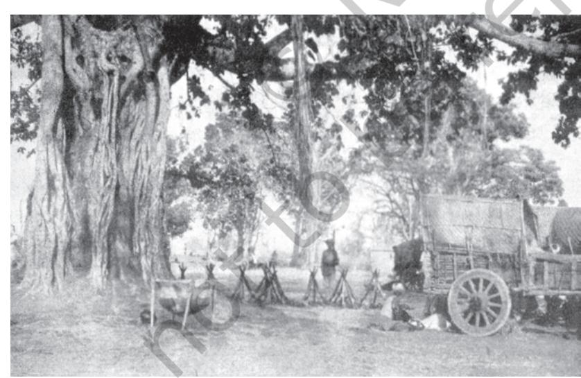

Fig.19 – Army camp in Bastar, 1910. This photograph of an army camp was taken in Bastar in 1910. The army moved with tents, cooks and soldiers. Here a sepoy is guarding the camp against rebels.

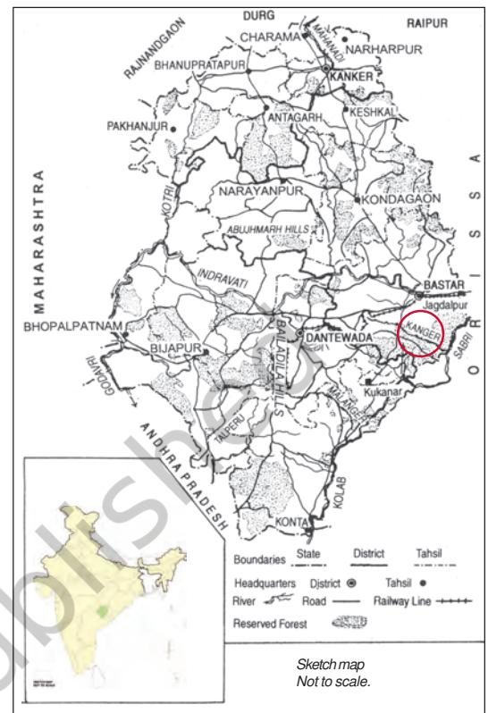

#### Fig.20 – Bastar in 2000.

In 1947 Bastar kingdom was merged with Kanker kingdom and become Bastar district in Madhya Pradesh. In 1998 it was divided again into three districts, Kanker, Bastar and Dantewada. In 2001, these became part of Chhattisgarh. The 1910 rebellion first started in the Kanger forest area (encircled) and soon spread to other parts of the state.

the earth by making some offerings at each agricultural festival. In addition to the Earth, they show respect to the spirits of the river, the forest and the mountain. Since each village knows where its boundaries lie, the local people look after all the natural resources within that boundary. If people from a village want to take some wood from the forests of another village, they pay a small fee called devsari, dand or man in exchange. Some villages also protect their forests by engaging watchmen and each household contributes some grain to pay them. Every year there is one big hunt where the headmen of villages in a pargana (cluster of villages) meet and discuss issues of concern, including forests.

### **3.2 The Fears of the People**

When the colonial government proposed to reserve two-thirds of the forest in 1905, and stop shifting cultivation, hunting and collection of forest produce, the people of Bastar were very worried. Some villages were allowed to stay on in the reserved forests on the condition that they worked free for the forest department in cutting and transporting trees, and protecting the forest from fires. Subsequently, these came to be known as 'forest villages'. People of other villages were displaced without any notice or compensation. For long, villagers had been suffering from increased land rents and frequent demands for free labour and goods by colonial officials. Then came the terrible famines, in 1899-1900 and again in 1907-1908. Reservations proved to be the last straw.

People began to gather and discuss these issues in their village councils, in bazaars and at festivals or wherever the headmen and priests of several villages were assembled. The initiative was taken by the Dhurwas of the Kanger forest, where reservation first took place. Although there was no single leader, many people speak of Gunda Dhur, from village Nethanar, as an important figure in the movement. In 1910, mango boughs, a lump of earth, chillies and arrows, began circulating between villages. These were actually messages inviting villagers to rebel against the British. Every village contributed something to the rebellion expenses. Bazaars were looted, the houses of officials and traders, schools and police stations were burnt and robbed, and grain redistributed. Most of those who were attacked were in some way associated with the colonial state and its oppressive laws. William Ward, a missionary who observed the events, wrote: 'From all directions came streaming into Jagdalpur, police, merchants, forest peons, schoolmasters and immigrants.'

#### **Source E**

'Bhondia collected 400 men, sacrificed a number of goats and started off to intercept the Dewan who was expected to return from the direction of Bijapur. This mob started on the 10th February, burnt the Marenga school, the police post, lines and pound at Keslur and the school at Tokapal (Rajur), detached a contingent to burn Karanji school and captured a head constable and four constables of the State reserve police who had been sent out to escort the Dewan and bring him in. The mob did not maltreat the guard seriously but eased them of their weapons and let them go. One party of rebels under Bhondia Majhi went off to the Koer river to block the passage there in case the Dewan left the main road. The rest went on to Dilmilli to stop the main road from Bijapur. Buddhu Majhi and Harchand Naik led the main body.'

Letter from DeBrett, Political Agent, Chhattisgarh Feudatory States to Commissioner, Chhattisgarh Division, 23 June 1910.

#### **Source F**

Elders living in Bastar recounted the story of this battle they had heard from their parents:

Podiyami Ganga of Kankapal was told by his father Podiyami Tokeli that:

'The British came and started taking land. The Raja didn't pay attention to things happening around him, so seeing that land was being taken, his supporters gathered people. War started. His staunch supporters died and the rest were whipped. My father, Podiyami Tokeli suffered many strokes, but he escaped and survived. It was a movement to get rid of the British. The British used to tie them to horses and pull them. From every village two or three people went to Jagdalpur: Gargideva and Michkola of Chidpal, Dole and Adrabundi of Markamiras, Vadapandu of Baleras, Unga of Palem and many others.'

Similarly, Chendru, an elder from village Nandrasa, said:

'On the people's side, were the big elders – Mille Mudaal of Palem, Soyekal Dhurwa of Nandrasa, and Pandwa Majhi. People from every pargana camped in Alnar tarai. The paltan (force) surrounded the people in a flash. Gunda Dhur had flying powers and flew away. But what could those with bows and arrows do? The battle took place at night. The people hid in shrubs and crawled away. The army paltan also ran away. All those who remained alive (of the people), somehow found their way home to their villages.'

**Source**

The British sent troops to suppress the rebellion. The adivasi leaders tried to negotiate, but the British surrounded their camps and fired upon them. After that they marched through the villages flogging and punishing those who had taken part in the rebellion. Most villages were deserted as people fled into the jungles. It took three months (February - May) for the British to regain control. However, they never managed to capture Gunda Dhur. In a major victory for the rebels, work on reservation was temporarily suspended, and the area to be reserved was reduced to roughly half of that planned before 1910.

The story of the forests and people of Bastar does not end there. After Independence, the same practice of keeping people out of the forests and reserving them for industrial use continued. In the 1970s, the World Bank proposed that 4,600 hectares of natural sal forest should be replaced by tropical pine to provide pulp for the paper industry. It was only after protests by local environmentalists that the project was stopped.

Let us now go to another part of Asia, Indonesia, and see what was happening there over the same period.

**India and the Contemporary World**

### **4 Forest Transformations in Java**

Java is now famous as a rice-producing island in Indonesia. But once upon a time it was covered mostly with forests. The colonial power in Indonesia were the Dutch, and as we will see, there were many similarities in the laws for forest control in Indonesia and India. Java in Indonesia is where the Dutch started forest management. Like the British, they wanted timber from Java to build ships. In 1600, the population of Java was an estimated 3.4 million. There were many villages in the fertile plains, but there were also many communities living in the mountains and practising shifting cultivation.

#### **4.1 The Woodcutters of Java**

The Kalangs of Java were a community of skilled forest cutters and shifting cultivators. They were so valuable that in 1755 when the Mataram kingdom of Java split, the 6,000 Kalang families were equally divided between the two kingdoms. Without their expertise, it would have been difficult to harvest teak and for the kings to build their palaces. When the Dutch began to gain control over the forests in the eighteenth century, they tried to make the Kalangs work under them. In 1770, the Kalangs resisted by attacking a Dutch fort at Joana, but the uprising was suppressed.

#### **4.2 Dutch Scientific Forestry**

In the nineteenth century, when it became important to control territory and not just people, the Dutch enacted forest laws in Java, restricting villagers' access to forests. Now wood could only be cut for specified purposes like making river boats or constructing houses, and only from specific forests under close supervision. Villagers were punished for grazing cattle in young stands, transporting wood without a permit, or travelling on forest roads with horse carts or cattle.

As in India, the need to manage forests for shipbuilding and railways led to the

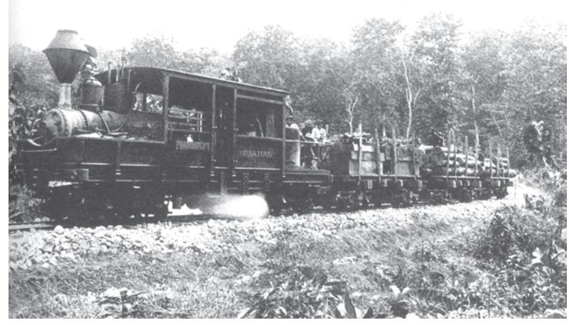

Fig.21 – Train transporting teak out of the forest – late colonial period.

introduction of a forest service. In 1882, 280,000 sleepers were **Source G** exported from Java alone. However, all this required labour to cut the trees, transport the logs and prepare the sleepers. The Dutch first imposed rents on land being cultivated in the forest and then exempted some villages from these rents if they worked collectively to provide free labour and buffaloes for cutting and transporting timber. This was known as the blandongdiensten system. Later, instead of rent exemption, forest villagers were given small wages, but their right to cultivate forest land was restricted.

#### **4.3 Samin's Challenge**

Around 1890, Surontiko Samin of Randublatung village, a teak forest village, began questioning state ownership of the forest. He argued that the state had not created the wind, water, earth and wood, so it could not own it. Soon a widespread movement developed. Amongst those who helped organise it were Samin's sons-in-law. By 1907, 3,000 families were following his ideas. Some of the Saminists protested by lying down on their land when the Dutch came to survey it, while others refused to pay taxes or fines or perform labour.

Dirk van Hogendorp, an official of the United East India Company in colonial Java said:

'Batavians! Be amazed! Hear with wonder what I have to communicate. Our fleets are destroyed, our trade languishes, our navigation is going to ruin – we purchase with immense treasures, timber and other materials for ship-building from the northern powers, and on Java we leave warlike and mercantile squadrons with their roots in the ground. Yes, the forests of Java have timber enough to build a respectable navy in a short time, besides as many merchant ships as we require … In spite of all (the cutting) the forests of Java grow as fast as they are cut, and would be inexhaustible under good care and management.'

Dirk van Hogendorp, cited in Peluso, Rich Forests, Poor People, 1992.

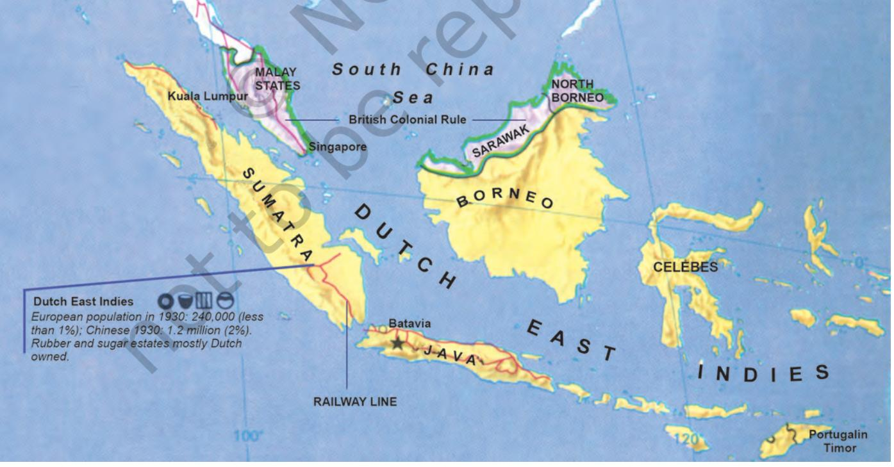

Fig.22 – Most of Indonesia's forests are located in islands like Sumatra, Kalimantan and West Irian. However, Java is where the Dutch began their 'scientific forestry'. The island, which is now famous for rice production, was once richly covered with teak.

#### **4.4 War and Deforestation**

The First World War and the Second World War had a major impact on forests. In India, working plans were abandoned at this time, and the forest department cut trees freely to meet British war needs. In Java, just before the Japanese occupied the region, the Dutch followed 'a scorched earth' policy, destroying sawmills, and burning huge piles of giant teak logs so that they would not fall into Japanese hands. The Japanese then exploited the forests recklessly for their own war industries, forcing forest villagers to cut down forests. Many villagers used this opportunity to expand cultivation in the forest. After the war, it was difficult for the Indonesian forest service to get this land back. As in India, people's need for agricultural land has brought them into conflict with the forest department's desire to control the land and exclude people from it.

Since the 1980s, governments across Asia and Africa have begun to see that scientific forestry and the policy of keeping forest communities away from forests has resulted in many conflicts. Conservation of forests rather than collecting timber has become a more important goal. The government has recognised that in order to meet this goal, the people who live near the forests must be involved. In many cases, across India, from Mizoram to Kerala, dense forests have survived only because villages protected them in sacred groves known as sarnas, devarakudu, kan, rai, etc. Some villages have been patrolling their own forests, with each household taking it in turns, instead of leaving it to the forest guards. Local forest communities and environmentalists today are thinking of different forms of forest management.

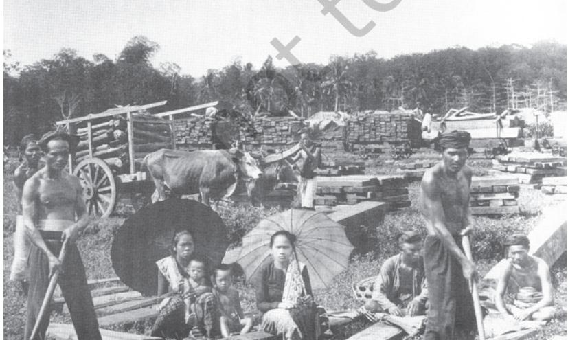

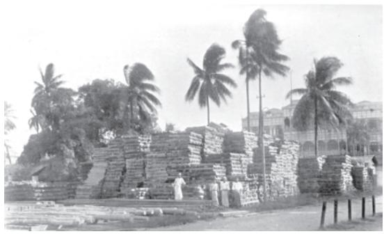

#### Fig.23 – Indian Munitions Board, War Timber Sleepers piled at Soolay pagoda ready for shipment,1917.

The Allies would not have been as successful in the First World War and the Second World War if they had not been able to exploit the resources and people of their colonies. Both the world wars had a devastating effect on the forests of India, Indonesia and elsewhere. The forest department cut freely to satisfy war needs.

Fig.24 – Log yard in Rembang under Dutch colonial rule.

### Activities

- 1. Have there been changes in forest areas where you live? Find out what these changes are and why they have happened.
- 2. Write a dialogue between a colonial forester and an adivasi discussing the issue of hunting in the forest.

### Questions

- 1. Discuss how the changes in forest management in the colonial period affected the following groups of people:
	- Ø Shifting cultivators
	- Ø Nomadic and pastoralist communities
	- Ø Firms trading in timber/forest produce
	- Ø Plantation owners
	- Ø Kings/British officials engaged in shikar (hunting)
- 2. What are the similarities between colonial management of the forests in Bastar and in Java?
- 3. Between 1880 and 1920, forest cover in the Indian subcontinent declined by 9.7 million hectares, from 108.6 million hectares to 98.9 million hectares. Discuss the role of the following factors in this decline:
	- Ø Railways
	- Ø Shipbuilding
	- Ø Agricultural expansion
	- Ø Commercial farming
	- Ø Tea/Coffee plantations
	- Ø Adivasis and other peasant users
- 4. Why are forests affected by wars?

?

