# **Pastoralists in the Modern World**

Chapter V

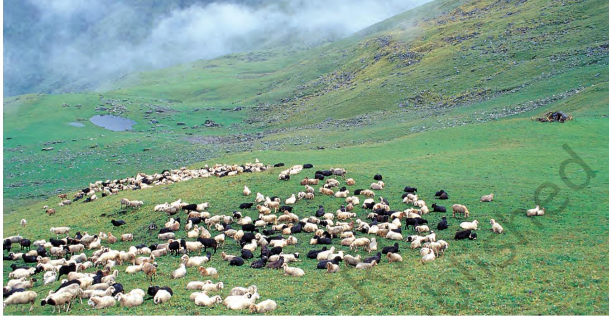

Fig.1 – Sheep grazing on the Bugyals of eastern Garhwal. Bugyals are vast natural pastures on the high mountains, above 12,000 feet. They are under snow in the winter and come to life after April. At this time the entire mountainside is covered with a variety of grasses, roots and herbs. By monsoon, these pastures are thick with vegetation and carpeted with wild flowers.

In this chapter you will read about nomadic pastoralists. Nomads are people who do not live in one place but move from one area to another to earn their living. In many parts of India we can see nomadic pastoralists on the move with their herds of goats and sheep, or camels and cattle. Have you ever wondered where they are coming from and where they are headed? Do you know how they live and earn? What their past has been?

Pastoralists rarely enter the pages of history textbooks. When you read about the economy – whether in your classes of history or economics – you learn about agriculture and industry. Sometimes you read about artisans; but rarely about pastoralists. As if their lives do not matter. As if they are figures from the past who have no place in modern society.

In this chapter you will see how pastoralism has been important in societies like India and Africa. You will read about the way colonialism impacted their lives, and how they have coped with the pressures of modern society. The chapter will first focus on India and then Africa.

97

## **1 Pastoral astoral astoral Nomads and their Movements ovementsovements**

#### **1.1 In the Mountains**

Even today the Gujjar Bakarwals of Jammu and Kashmir are great herders of goat and sheep. Many of them migrated to this region in the nineteenth century in search of pastures for their animals. Gradually, over the decades, they established themselves in the area, and moved annually between their summer and winter grazing grounds. In winter, when the high mountains were covered with snow, they lived with their herds in the low hills of the Siwalik range. The dry scrub forests here provided pasture for their herds. By the end of April they began their northern march for their summer grazing grounds. Several households came together for this journey, forming what is known as a kafila. They crossed the Pir Panjal passes and entered the valley of Kashmir. With the onset of summer, the snow melted and the mountainsides were lush green. The variety of grasses that sprouted provided rich nutritious forage for the animal herds. By end September the Bakarwals were on the move again, this time on their downward journey, back to their winter base. When the high mountains were covered with snow, the herds were grazed in the low hills.

In a different area of the mountains, the Gaddi shepherds of Himachal Pradesh had a similar cycle of seasonal movement. They too spent their winter in the low hills of Siwalik range, grazing their flocks in scrub forests. By April they moved north and spent the summer in Lahul and Spiti. When the snow melted and the high passes were clear, many of them moved on to higher mountain

#### **Source A**

Writing in the 1850s, G.C. Barnes gave the following description of the Gujjars of Kangra:

'In the hills the Gujjars are exclusively a pastoral tribe – they cultivate scarcely at all. The Gaddis keep flocks of sheep and goats and the Gujjars, wealth consists of buffaloes. These people live in the skirts of the forests, and maintain their existence exclusively by the sale of the milk, ghee, and other produce of their herds. The men graze the cattle, and frequently lie out for weeks in the woods tending their herds. The women repair to the markets every morning with baskets on their heads, with little earthen pots filled with milk, butter-milk and ghee, each of these pots containing the proportion required for a day's meal. During the hot weather the Gujjars usually drive their herds to the upper range, where the buffaloes rejoice in the rich grass which the rains bring forth and at the same time attain condition from the temperate climate and the immunity from venomous flies that torment their existence in the plains.'

From: G.C. Barnes, Settlement Report of Kangra, 1850-55.

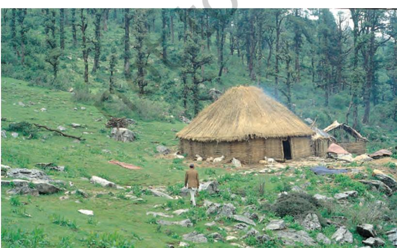

Fig.2 – A Gujjar Mandap on the high mountains in central Garhwal. The Gujjar cattle herders live in these mandaps made of ringal – a hill bamboo – and grass from the Bugyal. A mandap was also a work place. Here the Gujjar used to make ghee which they took down for sale. In recent years they have begun to transport the milk directly in buses and trucks. These mandaps are at about 10,000 to 11,000 feet. Buffaloes cannot climb any higher.

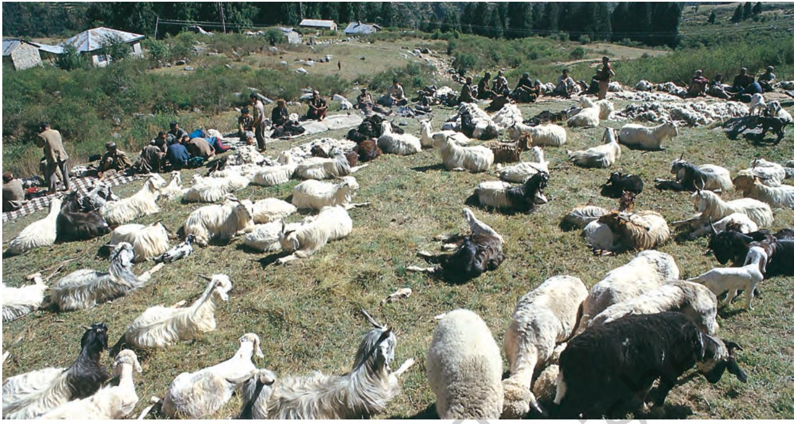

Fig.3 – Gaddis waiting for shearing to begin. Uhl valley near Palampur in Himachal Pradesh.

meadows. By September they began their return movement. On the way they stopped once again in the villages of Lahul and Spiti, reaping their summer harvest and sowing their winter crop. Then they descended with their flock to their winter grazing ground on the Siwalik hills. Next April, once again, they began their march with their goats and sheep, to the summer meadows.

Further to the east, in Garhwal and Kumaon, the Gujjar cattle herders

came down to the dry forests of the bhabar in the winter, and went up to the high meadows – the bugyals – in summer. Many of them were originally from Jammu and came to the UP hills in the nineteenth century in search of good pastures.

This pattern of cyclical movement between summer and winter pastures was typical of many pastoral communities of the Himalayas, including the Bhotiyas, Sherpas and Kinnauris. All of them had to adjust to seasonal changes and make effective use of available pastures in different places. When the pasture was exhausted or unusable in one place they moved their herds and flock to new areas. This continuous movement also allowed the pastures to recover; it prevented their overuse.

## New words

Bhabar – A dry forested area below the foothills of Garhwal and Kumaun Bugyal – Vast meadows in the high mountains

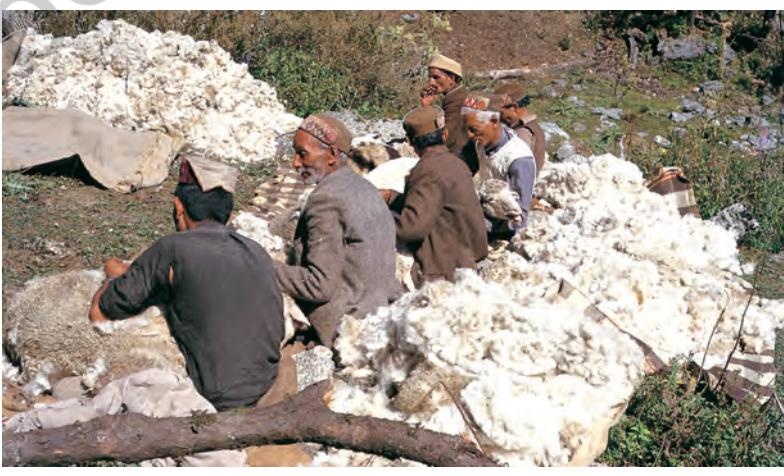

Fig.4 – Gaddi sheep being sheared. By September the Gaddi shepherds come down from the high meadows (Dhars). On the way down they halt for a while to have their sheep sheared. The sheep are bathed and cleaned before the wool is cut.

#### **1.2 On the Plateaus, Plains and Deserts**

Not all pastoralists operated in the mountains. They were also to be found in the plateaus, plains and deserts of India.

Dhangars were an important pastoral community of Maharashtra. In the early twentieth century their population in this region was estimated to be 467,000. Most of them were shepherds, some were blanket weavers, and still others were buffalo herders. The Dhangar shepherds stayed in the central plateau of Maharashtra during the monsoon. This was a semi-arid region with low rainfall and poor soil. It was covered with thorny scrub. Nothing but dry crops like bajra could be sown here. In the monsoon this tract became a vast grazing ground for the Dhangar flocks. By October the Dhangars harvested their bajra and started on their move west. After a march of about a month they reached the Konkan. This was a flourishing agricultural tract with high rainfall and rich soil. Here the shepherds

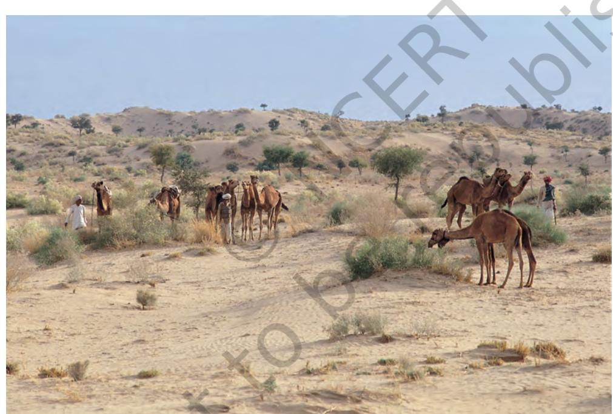

Fig.5 – Raika camels grazing on the Thar desert in western Rajasthan.

Only camels can survive on the dry and thorny bushes that can be found here; but to get enough feed they have to graze over a very extensive area.

were welcomed by Konkani peasants. After the kharif harvest was cut at this time, the fields had to be fertilised and made ready for the rabi harvest. Dhangar flocks manured the fields and fed on the stubble. The Konkani peasants also gave supplies of rice which the shepherds took back to the plateau where grain was scarce. With the onset of the monsoon the Dhangars left the Konkan and the coastal areas with their flocks and returned to their settlements on the dry plateau. The sheep could not tolerate the wet monsoon conditions.

#### New words

Kharif – The autumn crop, usually harvested between September and October Rabi – The spring crop, usually harvested after March Stubble – Lower ends of grain stalks left in the ground after harvesting

# **India and the Contemporary World**

In Karnataka and Andhra Pradesh, again, the dry central plateau was covered with stone and grass, inhabited by cattle, goat and sheep herders. The Gollas herded cattle. The Kurumas and Kurubas reared sheep and goats and sold woven blankets. They lived near the woods, cultivated small patches of land, engaged in a variety of petty trades and took care of their herds. Unlike the mountain pastoralists, it was not the cold and the snow that defined the seasonal rhythms of their movement: rather it was the alternation of the monsoon and dry season. In the dry season they moved to the coastal tracts, and left when the rains came. Only buffaloes liked the swampy, wet conditions of the coastal areas during the monsoon months. Other herds had to be shifted to the dry plateau at this time.

Banjaras were yet another well-known group of graziers. They were to be found in the villages of Uttar Pradesh, Punjab, Rajasthan, Madhya Pradesh and Maharashtra. In search of good pastureland for their cattle, they moved over long distances, selling plough cattle and other goods to villagers in exchange for grain and fodder.

#### **Source B**

The accounts of many travellers tell us about the life of pastoral groups. In the early nineteenth century, Buchanan visited the Gollas during his travel through Mysore. He wrote:

'Their families live in small villages near the skirt of the woods, where they cultivate a little ground, and keep some of their cattle, selling in the towns the produce of the dairy. Their families are very numerous, seven to eight young men in each being common. Two or three of these attend the flocks in the woods, while the remainder cultivate their fields, and supply the towns with firewood, and with straw for thatch.'

From: Francis Hamilton Buchanan, A Journey from Madras through the Countries of Mysore, Canara and Malabar (London, 1807).

In the deserts of Rajasthan lived the Raikas. The rainfall in the region was meagre and uncertain. On cultivated land, harvests fluctuated every year. Over vast stretches no crop could be grown. So the Raikas combined cultivation with pastoralism. During the monsoons, the Raikas of Barmer, Jaisalmer, Jodhpur and Bikaner stayed in their home villages, where pasture was available. By October, when these grazing grounds were dry and exhausted, they moved out in search of other pasture and water, and returned again during the next monsoon. One group of Raikas – known as the Maru (desert) Raikas – herded camels and another group reared sheep and goat.

## Activity

Read Sources A and B.

- Ø Write briefly about what they tell you about the nature of the work undertaken by men and women in pastoral households.
- Ø Why do you think pastoral groups often live on the edges of forests?

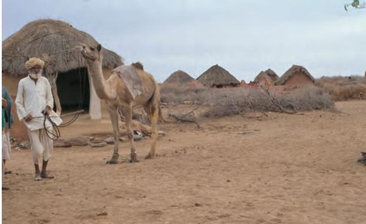

Fig.6 – A camel herder in his settlement. This is on the Thar desert near Jaisalmer in Rajasthan. The camel herders of the region are Maru (desert) Raikas, and their settlement is called a dhandi.

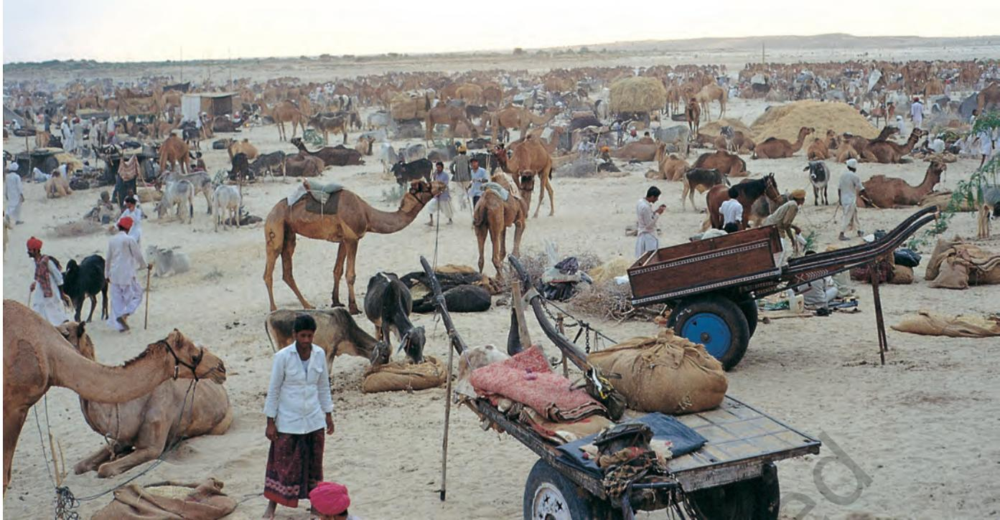

Fig.7 – A camel fair at Balotra in western Rajasthan. Camel herders come to the fair to sell and buy camels. The Maru Raikas also display their expertise in training their camels. Horses from Gujarat are also brought for sale at this fair.

So we see that the life of these pastoral groups was sustained by a careful consideration of a host of factors. They had to judge how long the herds could stay in one area, and know where they could find water and pasture. They needed to calculate the timing of their movements, and ensure that they could move through different territories. They had to set up a relationship with farmers on the way, so that the herds could graze in harvested fields and manure the soil. They combined a range of different activities – cultivation, trade, and herding – to make their living.

How did the life of pastoralists change under colonial rule?

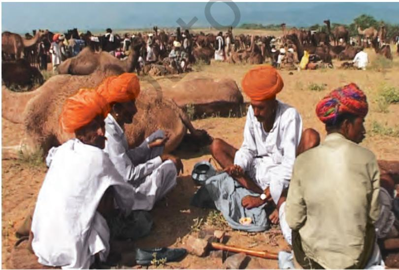

Fig.8 – A camel fair at Pushkar.

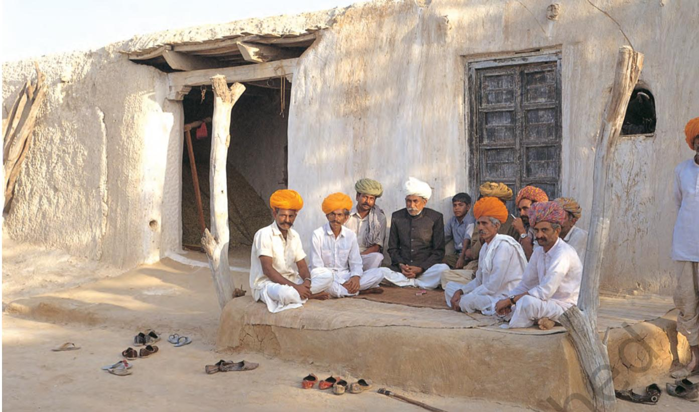

Fig.9 – A Maru Raika genealogist with a group of Raikas. The genealogist recounts the history of the community. Such oral traditions give pastoral groups their own sense of identity. These oral traditions can tell us about how a group looks at its own past.

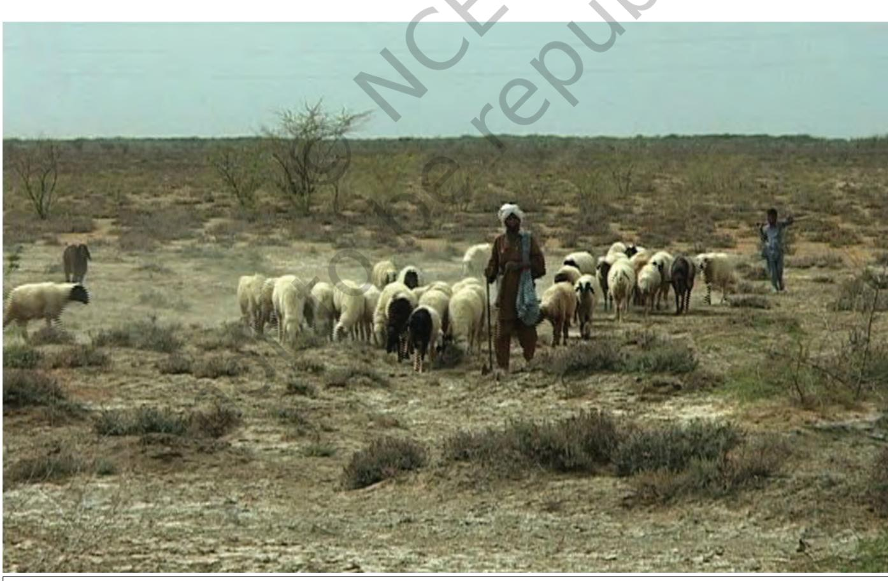

Fig.10 – Maldhari herders moving in search of pastures. Their villages are in the Rann of Kutch.

## **2 Colonial Colonial Colonial Rule and ule and ule and Pastoral astoral astoral Life**

Under colonial rule, the life of pastoralists changed dramatically. **Source C** Their grazing grounds shrank, their movements were regulated, and the revenue they had to pay increased. Their agricultural stock declined and their trades and crafts were adversely affected. How?

First, the colonial state wanted to transform all grazing lands into cultivated farms. Land revenue was one of the main sources of its finance. By expanding cultivation it could increase its revenue collection. It could at the same time produce more jute, cotton, wheat and other agricultural produce that were required in England. To colonial officials all uncultivated land appeared to be unproductive: it produced neither revenue nor agricultural produce. It was seen as 'waste land' that needed to be brought under cultivation. From the mid-nineteenth century, Waste Land Rules were enacted in various parts of the country. By these Rules uncultivated lands were taken over and given to select individuals. These individuals were granted various concessions and encouraged to settle these lands. Some of them were made headmen of villages in the newly cleared areas. In most areas the lands taken over were actually grazing tracts used regularly by pastoralists. So expansion of cultivation inevitably meant the decline of pastures and a problem for pastoralists.

Second, by the mid-nineteenth century, various Forest Acts were also being enacted in the different provinces. Through these Acts some forests which produced commercially valuable timber like deodar or sal were declared 'Reserved'. No pastoralist was allowed access to these forests. Other forests were classified as 'Protected'. In these, some customary grazing rights of pastoralists were granted but their movements were severely restricted. The colonial officials believed that grazing destroyed the saplings and young shoots of trees that germinated on the forest floor. The herds trampled over the saplings and munched away the shoots. This prevented new trees from growing.

These Forest Acts changed the lives of pastoralists. They were now prevented from entering many forests that had earlier provided valuable forage for their cattle. Even in the areas they were allowed entry, their movements were regulated. They needed a permit for entry. The timing of their entry and departure was

H.S. Gibson, the Deputy Conservator of Forests, Darjeeling, wrote in 1913:

'… forest which is used for grazing cannot be used for any other purpose and is unable to yield timber and fuel, which are the main legitimate forest produce …'

## Activity

Write a comment on the closure of the forests to grazing from the standpoint of:

- Ø a forester
- Ø a pastoralist

#### New words

Customary rights – Rights that people are used to by custom and tradition

specified, and the number of days they could spend in the forest **Source D** was limited. Pastoralists could no longer remain in an area even if forage was available, the grass was succulent and the undergrowth in the forest was ample. They had to move because the Forest Department permits that had been issued to them now ruled their lives. The permit specified the periods in which they could be legally within a forest. If they overstayed they were liable to fines.

Third, British officials were suspicious of nomadic people. They distrusted mobile craftsmen and traders who hawked their goods in villages, and pastoralists who changed their places of residence every season, moving in search of good pastures for their herds. The colonial government wanted to rule over a settled population. They wanted the rural people to live in villages, in fixed places with fixed rights on particular fields. Such a population was easy to identify and control. Those who were settled were seen as peaceable and law abiding; those who were nomadic were considered to be criminal. In 1871, the colonial government in India passed the Criminal Tribes Act. By this Act many communities of craftsmen, traders and pastoralists were classified as Criminal Tribes. They were stated to be criminal by nature and birth. Once this Act came into force, these communities were expected to live only in notified village settlements. They were not allowed to move out without a permit. The village police kept a continuous watch on them.

Fourth, to expand its revenue income, the colonial government looked for every possible source of taxation. So tax was imposed on land, on canal water, on salt, on trade goods, and even on animals. Pastoralists had to pay tax on every animal they grazed on the pastures. In most pastoral tracts of India, grazing tax was introduced in the mid-nineteenth century. The tax per head of cattle went up rapidly and the system of collection was made increasingly efficient. In the decades between the 1850s and 1880s the right to collect the tax was auctioned out to contractors. These contractors tried to extract as high a tax as they could to recover the money they had paid to the state and earn as much profit as they could within the year. By the 1880s the government began collecting taxes directly from the pastoralists. Each of them was given a pass. To enter a grazing tract, a cattle herder had to show the pass and pay the tax. The number of cattle heads he had and the amount of tax he paid was entered on the pass.

In the 1920s, a Royal Commission on Agriculture reported:

'The extent of the area available for grazing has gone down tremendously with the extension of area under cultivation because of increasing population, extension of irrigation facilities, acquiring the pastures for Government purposes, for example, defence, industries and agricultural experimental farms. [Now] breeders find it difficult to raise large herds. Thus their earnings have gone down. The quality of their livestock has deteriorated, dietary standards have fallen and indebtedness has increased.'

The Report of the Royal Commission of Agriculture in India, 1928.

## Activity

Imagine you are living in the 1890s. You belong to a community of nomadic pastoralists and craftsmen. You learn that the Government has declared your community as a Criminal Tribe.

- Ø Describe briefly what you would have felt and done.
- Ø Write a petition to the local collector explaining why the Act is unjust and how it will affect your life.

#### **2.1 How Did these Changes Affect the Lives of Pastoralists?**

These measures led to a serious shortage of pastures. When grazing lands were taken over and turned into cultivated fields, the available area of pastureland declined. Similarly, the reservation of forests meant that shepherds and cattle herders could no longer freely pasture their cattle in the forests.

As pasturelands disappeared under the plough, the existing animal stock had to feed on whatever grazing land remained. This led to continuous intensive grazing of these pastures. Usually nomadic pastoralists grazed their animals in one area and moved to another area. These pastoral movements allowed time for the natural restoration of vegetation growth. When restrictions were imposed on pastoral movements, grazing lands came to be continuously used and the quality of patures declined. This in turn created a further shortage of forage for animals and the deterioration of animal stock. Underfed cattle died in large numbers during scarcities and famines.

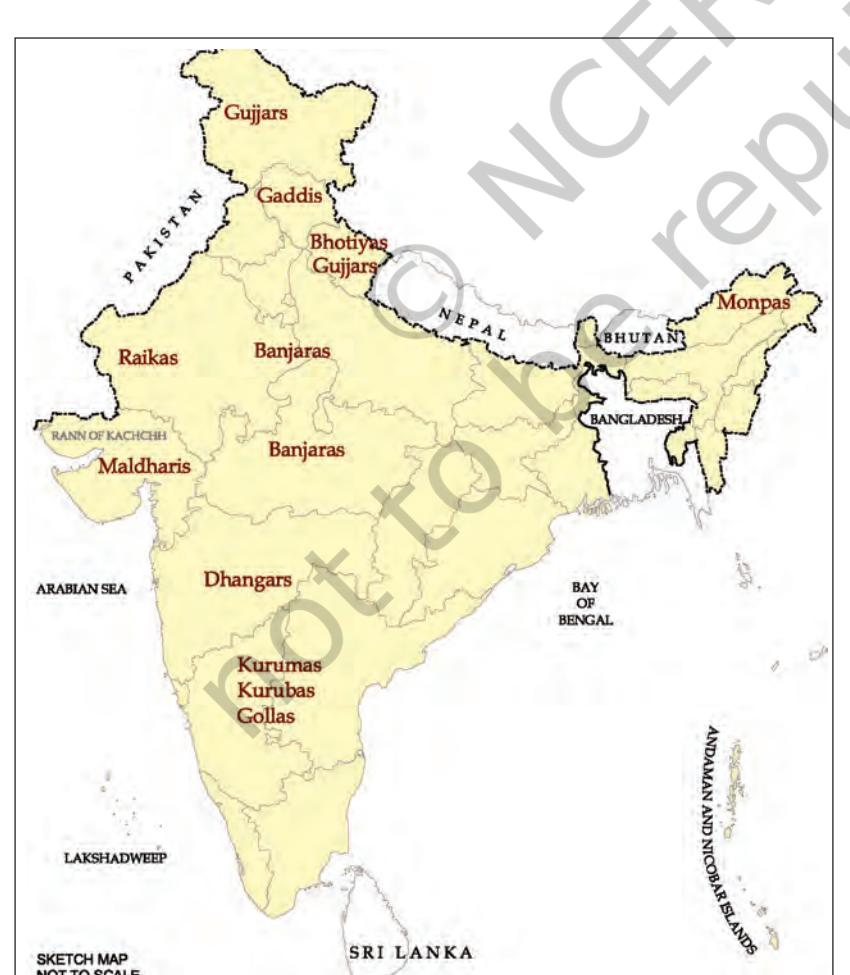

Fig.11 – Pastoralists in India. This map indicates the location of only those pastoral communities mentioned in the chapter. There are many others living in various parts of India.

**India and the Contemporary World**

#### **2.2 How Did the Pastoralists Cope with these Changes?**

Pastoralists reacted to these changes in a variety of ways. Some reduced the number of cattle in their herds, since there was not enough pasture to feed large numbers. Others discovered new pastures when movement to old grazing grounds became difficult. After 1947, the camel and sheep herding Raikas, for instance, could no longer move into Sindh and graze their camels on the banks of the Indus, as they had done earlier. The new political boundaries between India and Pakistan stopped their movement. So they had to find new places to go. In recent years they have been migrating to Haryana where sheep can graze on agricultural fields after the harvests are cut. This is the time that the fields need manure that the animals provide.

Over the years, some richer pastoralists began buying land and settling down, giving up their nomadic life. Some became settled peasants cultivating land, others took to more extensive trading. Many poor pastoralists, on the other hand, borrowed money from moneylenders to survive. At times they lost their cattle and sheep and became labourers, working on fields or in small towns.

Yet, pastoralists not only continue to survive, in many regions their numbers have expanded over recent decades. When pasturelands in one place was closed to them, they changed the direction of their movement, reduced the size of the herd, combined pastoral activity with other forms of income and adapted to the changes in the modern world. Many ecologists believe that in dry regions and in the mountains, pastoralism is still ecologically the most viable form of life.

Such changes were not experienced only by pastoral communities in India. In many other parts of the world, new laws and settlement patterns forced pastoral communities to alter their lives. How did pastoral communities elsewhere cope with these changes in the modern world?

# **3 Pastoralism in Africa**

Let us move to Africa where over half the world's pastoral population lives. Even today, over 22 million Africans depend on some form of pastoral activity for their livelihood. They include communities like Bedouins, Berbers, Maasai, Somali, Boran and Turkana. Most of them now live in the semi-arid grasslands or arid deserts where rainfed agriculture is difficult. They raise cattle, camels, goats, sheep and donkeys; and they sell milk, meat, animal skin and wool. Some also earn through trade and transport, others combine pastoral activity with agriculture; still others do a variety of odd jobs to supplement their meagre and uncertain earnings from pastoralism.

Like pastoralists in India, the lives of African pastoralists have changed dramatically over the colonial and post-colonial periods. What have these changes been?

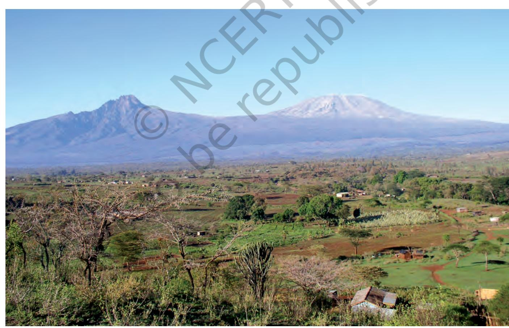

Fig.12 – A view of Maasai land with Kilimanjaro in the background. Forced by changing conditions, the Maasai have grown dependent on food produced in other areas such as maize meal, rice, potatoes, cabbage.Traditionally the Maasai frowned upon this. Maasai believed that tilling the land for crop farming is a crime against nature. Once you cultivate the land, it is no longer suitable for grazing. Courtesy: The Massai Association.

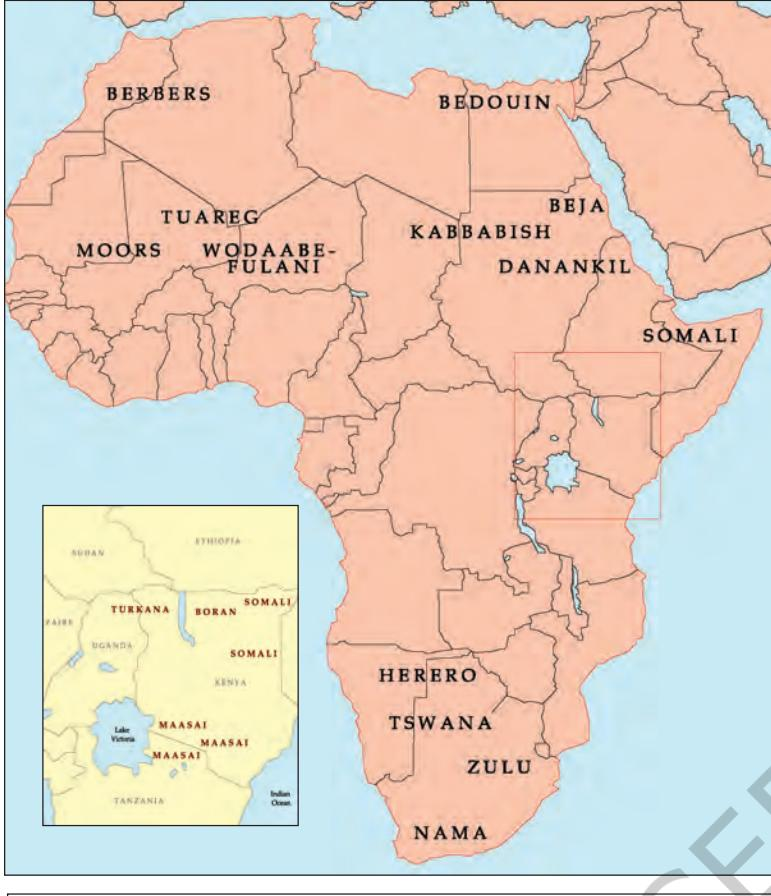

#### Fig.13 – Pastoral communities in Africa. The inset shows the location of the Maasais in Kenya and Tanzania.

We will discuss some of these changes by looking at one pastoral community – the Maasai – in some detail. The Maasai cattle herders live primarily in east Africa: 300, 000 in southern Kenya and another 150,000 in Tanzania. We will see how new laws and regulations took away their land and restricted their movement. This affected their lives in times of drought and even reshaped their social relationships.

### **3.1 Where have the Grazing Lands Gone?**

One of the problems the Maasais have faced is the continuous loss of their grazing lands. Before colonial times, Maasailand stretched over a vast area from north Kenya to the steppes of northern Tanzania. In the late nineteenth century, European imperial powers scrambled for territorial possessions in Africa, slicing up the region into different colonies. In 1885, Maasailand was cut into half with an international boundary between British Kenya and German Tanganyika. Subsequently, the best grazing lands were gradually taken over for white settlement and the Maasai were pushed into a small area in

#### **On Tanganyika**

Britain conquered what had been German East Africa during the First World War. In 1919 Tanganyika came under British control. It attained independence in 1961 and united with Zanzibar to form Tanzania in 1964.

south Kenya and north Tanzania. The Maasai lost about 60 per cent of their pre-colonial lands. They were confined to an arid zone with uncertain rainfall and poor pastures.

From the late nineteenth century, the British colonial government in east Africa also encouraged local peasant communities to expand cultivation. As cultivation expanded, pasturelands were turned into cultivated fields. In pre-colonial times, the Maasai pastoralists had dominated their agricultural neighbours both economically and politically. By the end of colonial rule the situation had reversed.

Large areas of grazing land were also turned into game reserves like the Maasai Mara and Samburu National Park in Kenya and Serengeti Park in Tanzania. Pastoralists were not allowed to enter these reserves; they could neither hunt animals nor graze their herds in these areas. Very often these reserves were in areas that had traditionally been regular grazing grounds for Maasai herds. The Serengeti National Park, for instance, was created over 14,760 km. of Maasai grazing land.

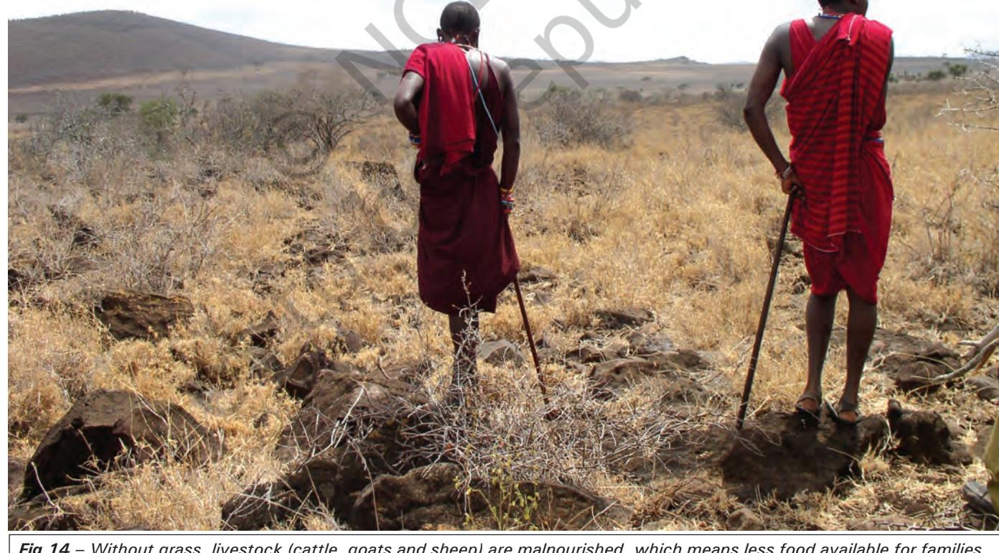

Fig.14 – Without grass, livestock (cattle, goats and sheep) are malnourished, which means less food available for families and their children. The areas hardest hit by drought and food shortage are in the vicinity of Amboseli National Park, which last year generated approximately 240 million Kenyan Shillings (estimated $3.5 million US) from tourism. In addition, the Kilimanjaro Water Project cuts through the communities of this area but the villagers are barred from using the water for irrigation or for livestock.Courtesy: The Massai Association.

**India and the Contemporary World**

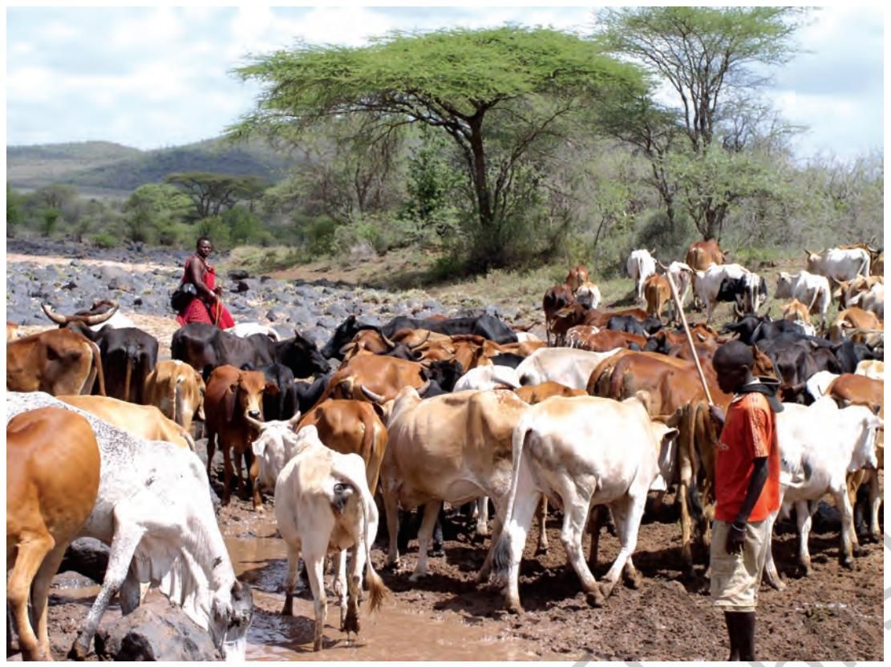

Fig.15 – The title Maasai derives from the word Maa. Maa-sai means 'My People'. The Maasai are traditionally nomadic and pastoral people who depend on milk and meat for subsistence. High temperatures combine with low rainfall to create conditions which are dry, dusty, and extremely hot. Drought conditions are common in this semi-arid land of equatorial heat. During such times pastoral animals die in large numbes. Courtesy: The Massai Association.

#### **Source E**

Pastoral communities elsewhere in Africa faced similar problems. In Namibia, in south-west Africa, the Kaokoland herders traditionally moved between Kaokoland and nearby Ovamboland, and they sold skin, meat and other trade products in neighbouring markets. All this was stopped with the new system of territorial boundaries that restricted movements between regions.

The nomadic cattle herders of Kaokoland in Namibia complained:

'We have difficulty. We cry. We are imprisoned. We do not know why we are locked up. We are in jail. We have no place to live … We cannot get meat from the south … Our sleeping skins cannot be sent out … Ovamboland is closed for us. We lived in Ovamboland for a long time. We want to take our cattle there, also our sheep and goats. The borders are closed. The borders press us heavily. We cannot live.'

Statement of Kaokoland herders, Namibia, 1949.

Quoted in Michael Bollig, 'The colonial encapsulation of the north western Namibian pastoral economy', Africa 68 (4), 1998.

#### **Source F**

In most places in colonial Africa, the police were given instructions to keep a watch on the movements of pastoralists, and prevent them from entering white areas. The following is one such instruction given by a magistrate to the police, in south-west Africa, restricting the movements of the pastoralists of Kaokoland in Namibia:

'Passes to enter the Territory should not be given to these Natives unless exceptional circumstances necessitate their entering … The object of the above proclamation is to restrict the number of natives entering the Territory and to keep a check on them, and ordinary visiting passes should therefore never be issued to them.'

'Kaokoveld permits to enter', Magistrate to Police Station Commanders of Outjo and Kamanjab, 24 November, 1937.

The loss of the finest grazing lands and water resources created pressure on the small area of land that the Maasai were confined within. Continuous grazing within a small area inevitably meant a deterioration of the quality of pastures. Fodder was always in short supply. Feeding the cattle became a persistent problem.

#### **3.2 The Borders are Closed**

In the nineteenth century, African pastoralists could move over vast areas in search of pastures. When the pastures were exhausted in one place they moved to a different area to graze their cattle. From the late nineteenth century, the colonial government began imposing various restrictions on their mobility.

Like the Maasai, other pastoral groups were also forced to live within the confines of special reserves. The boundaries of these reserves became the limits within which they could now move. They were not allowed to move out with their stock without special permits. And it was difficult to get permits without trouble and harassment. Those found guilty of disobeying the rules were severely punished.

Pastoralists were also not allowed to enter the markets in white areas. In many regions, they were prohibited from participating in any form of trade. White settlers and European colonists saw pastoralists as dangerous and savage – people with whom all contact had to be minimised. Cutting off all links was, however, never really possible, because white colonists had to depend on black labour to bore mines and, build roads and towns.

The new territorial boundaries and restrictions imposed on them suddenly changed the lives of pastoralists. This adversely affected both their pastoral and trading activities. Earlier, pastoralists not only looked after animal herds but traded in various products. The restrictions under colonial rule did not entirely stop their trading activities but they were now subject to various restrictions.

#### **3.3 When Pastures Dry**

Drought affects the life of pastoralists everywhere. When rains fail and pastures are dry, cattle are likely to starve unless they can be moved to areas where forage is available. That is why, traditionally, pastoralists are nomadic; they move from place to place. This nomadism allows them to survive bad times and avoid crises.

But from the colonial period, the Maasai were bound down to a fixed area, confined within a reserve, and prohibited from moving in search of pastures. They were cut off from the best grazing lands and forced to live within a semi-arid tract prone to frequent droughts. Since they could not shift their cattle to places where pastures were available, large numbers of Maasai cattle died of starvation and disease in these years of drought. An enquiry in 1930 showed that the Maasai in Kenya possessed 720,000 cattle, 820,000 sheep and 171,000 donkeys. In just two years of severe drought, 1933 and 1934, over half the cattle in the Maasai Reserve died.

As the area of grazing lands shrank, the adverse effect of the droughts increased in intensity. The frequent bad years led to a steady decline of the animal stock of the pastoralists.

#### **3.4 Not All were Equally Affected**

In Maasailand, as elsewhere in Africa, not all pastoralists were equally affected by the changes in the colonial period. In pre-colonial times Maasai society was divided into two social categories – elders and warriors. The elders formed the ruling group and met in periodic councils to decide on the affairs of the community and settle disputes. The warriors consisted of younger people, mainly responsible for the protection of the tribe. They defended the community and organised cattle raids. Raiding was important in a society where cattle was wealth. It is through raids that the power of different pastoral groups was asserted. Young men came to be recognised as members of the warrior class when they proved their manliness by raiding the cattle of other pastoral groups and participating in wars. They, however, were subject to the authority of the elders.

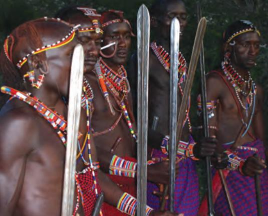

Fig.16 – Note how the warriors wear traditional deep red shukas, brightly beaded Maasai jewelry and carry five-foot, steel tipped spears. Their long pleats of intricately plaited hair are tinted red with ochre. As per tradition they face East to honour the rising sun. Warriors are in charge of society's security while boys are responsible for herding livestock. During the drought season, both warriors and boys assume responsibility for herding livestock. Courtesy: The Massai Association.

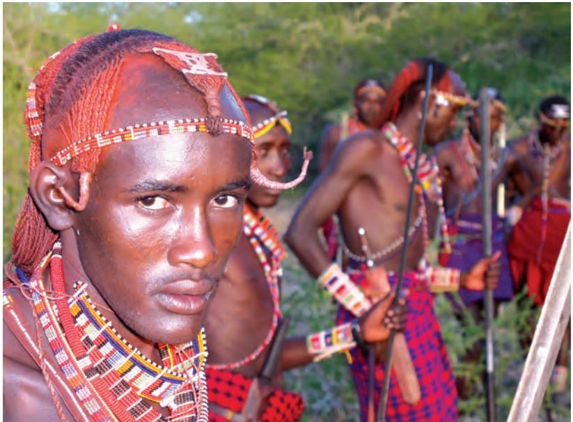

Fig.17 - Even today, young men go through an elaborate ritual before they become warriors, although actually it is no longer common. They must travel throughout the section's region for about four months, ending with an event where they run to the homestead and enter with an attitude of a raider. During the ceremony, boys dress in loose clothing and dance non-stop throughout the day. This ceremony is the transition into a new age. Girls are not required to go through such a ritual. Courtesy: The Massai Association.

To administer the affairs of the Maasai, the British introduced a series of measures that had important implications. They appointed chiefs of different sub-groups of Maasai, who were made responsible for the affairs of the tribe. The British imposed various restrictions on raiding and warfare. Consequently, the traditional authority of both elders and warriors was adversely affected.

The chiefs appointed by the colonial government often accumulated wealth over time. They had a regular income with which they could buy animals, goods and land. They lent money to poor neighbours who needed cash to pay taxes. Many of them began living in towns, and became involved in trade. Their wives and children stayed back in the villages to look after the animals. These chiefs managed to survive the devastations of war and drought. They had both pastoral and non-pastoral income, and could buy animals when their stock was depleted.

But the life history of the poor pastoralists who depended only on their livestock was different. Most often, they did not have the resources to tide over bad times. In times of war and famine, they lost nearly everything. They had to go looking for work in the towns. Some eked out a living as charcoal burners, others did odd jobs. The lucky could get more regular work in road or building construction.

The social changes in Maasai society occurred at two levels. First, the traditional difference based on age, between the elders and warriors, was disturbed, though it did not break down entirely. Second, a new distinction between the wealthy and poor pastoralists developed.

#### **Conclusion**

So we see that pastoral communities in different parts of the world are affected in a variety of different ways by changes in the modern world. New laws and new borders affect the patterns of their movement. With increasing restrictions on their mobility, pastoralists find it difficult to move in search of pastures. As pasture lands disappear grazing becomes a problem, while pastures that remain deteriorate through continuous over grazing. Times of drought become times of crises, when cattle die in large numbers.

Yet, pastoralists do adapt to new times. They change the paths of their annual movement, reduce their cattle numbers, press for rights to enter new areas, exert political pressure on the government for relief, subsidy and other forms of support and demand a right in the management of forests and water resources. Pastoralists are not relics of the past. They are not people who have no place in the modern world. Environmentalists and economists have increasingly come to recognise that pastoral nomadism is a form of life that is perfectly suited to many hilly and dry regions of the world.

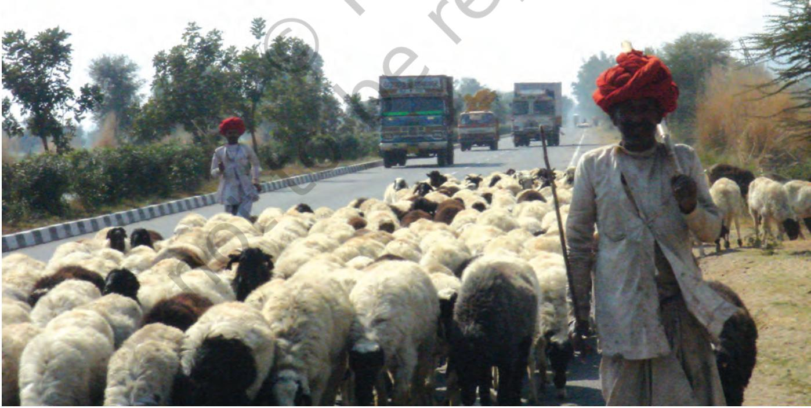

Fig.18 – A Raika shepherd on Jaipur highway. Heavy traffic on highways has made migration of shepherds a new experience. **Pastoralists in the Modern World**

## Activities

- 1. Imagine that it is 1950 and you are a 60-year-old Raika herder living in post-Independence India. You are telling your grand-daughter about the changes which have taken place in your lifestyle after Independence. What would you say?
- 2. Imagine that you have been asked by a famous magazine to write an article about the life and customs of the Maasai in pre-colonial Africa. Write the article, giving it an interesting title.
- 3. Find out more about the some of the pastoral communities marked in Figs. 11 and 13.

## Questions

- 1. Explain why nomadic tribes need to move from one place to another. What are the advantages to the environment of this continuous movement?
- 2. Discuss why the colonial government in India brought in the following laws. In each case, explain how the law changed the lives of pastoralists:
	- Ø Waste Land rules
	- Ø Forest Acts
	- Ø Criminal Tribes Act
	- Ø Grazing Tax
- 3. Give reasons to explain why the Maasai community lost their grazing lands.
- 4. There are many similarities in the way in which the modern world forced changes in the lives of pastoral communities in India and East Africa. Write about any two examples of changes which were similar for Indian pastoralists and the Maasai herders.

?

## Credits

Photographs and pictures

We would like to acknowledge the following:

#### Institutions and photo archives:

Central State Archives of Film-Photo Phono Documents of the USSR (II: 13) Forest Research Institute in Dehradun (IV: 17) Jewish Historical Institute, Warsaw, Poland (III: 31) Majdanek Museum Archives, Lublin, Poland (III: 22) Publications Division, Ministry of Information and Broadcasting, GOI (Most of the Gandhi Photographs) The United States Holocaust Memorial Museum (III: 14, 22)

#### Journals

Indian Forester (IV: 10, 11) The Illustrated London News (II: 2; VII: 7, 8, 9,16)

#### Individuals

Barnela, Sanjay (IV: 11, 12, 15, 16; V: 8, 10 ) Saberwal, Vasant (V: 3, 4) Sundar, Nandini (IV: 6, 13, 14, 17)

#### Publishers and authors

Ballantine, Betty and Ian Ballantine, eds., The Native Americans: An Illustrated History. Atlanta: Turner Publishing Inc., 1993 (IV: 2) Berelowitch, Wladimir and Laurent Gervereau, Russie URSS, 1914 -1991 (II: 10) Burleigh, Michael and Wolfgang Wippermann, The Racial State: Germany 1933-1945, Cambridge University Press (III: 13, 15, 16, 25, 31, 32) Davidson, Eugene, The Making of Adolf Hitler: The Birth and Rise of Nazism, University of Missouri Press, 1977

(III: 4, 5, 6)

Karlekar, Malavika, ed., Visualizing Indian Women 1875–1947, OUP, New Delhi.

Moynahan, Brian, The Russian Century, Seven Dials Illustrated Division, The Orion Publishing Group, 1999 (II: 5, 7, 8, 19)

Obolensky, Chloe, The Russian Empire: A Portrait in Photographs, Jonathan Cape Ltd., London, 1980 (II: 6)

Obshchestvo i Vlast v 30 – yegody, Moscow 1998 (II: 15, 16,17)

- Peluso, Nancy, Rich Forests, Poor People, Berkeley: University of California Press, 1992 (IV: 15, 21, 24) Rees, Laurence, The Nazis: A Warning from History, The New Press, New York, 1997 (III: 7, 17)
Rurup, Reinhard, ed., Topography of Terror: A Documentation, Verlag Willmuth Arenhovel,

Berlin, 1987 (III: 1, 3, 18, 27) Scott, James, Seeing like a State, New Haven: Yale University Press, 1998 (IV: 8)

Stebbing, E P, The Forests of India, John Lane, London (IV: 3, 4, 5, 13, 14, 21)

The Times Atlas of World History, ed. Geoffrey Barraclough, Hammond, 1985 (IV: 22)

Wegner, Gregory Paul, Anti-Semitism and Schooling under the Third Reich, Routledge Falmer, 2002 (III: 23, 24)

Welch, David, The Third Reich: Politics and Propaganda, Routledge, London, 1993(III: 10)

#### Text

Some chapters or sections draw substantially from: Peluso, Nancy, Rich Forests, Poor People, Berkeley: University of California Press, 1992 (IV: Section 4)

