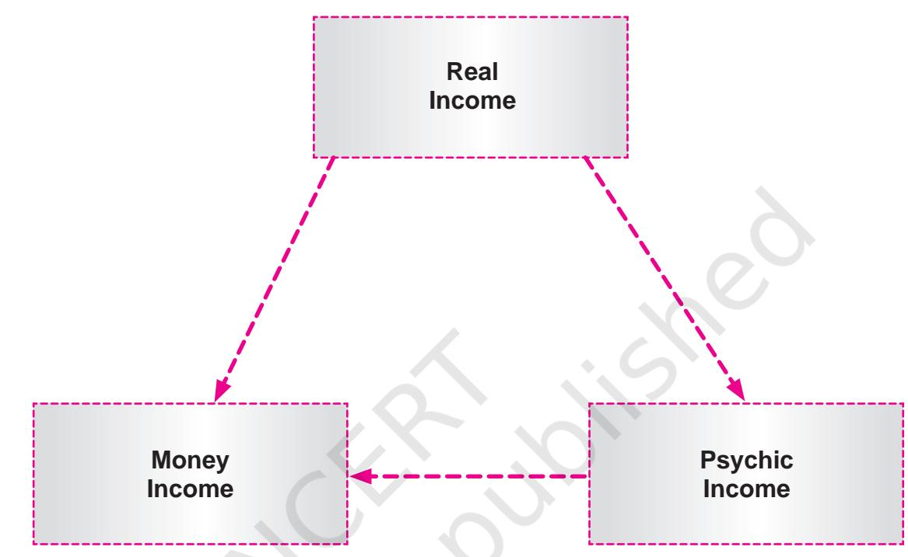
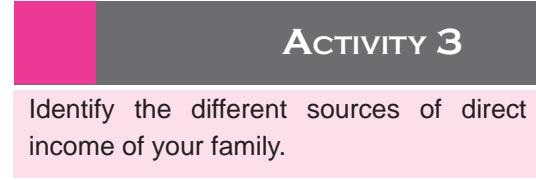
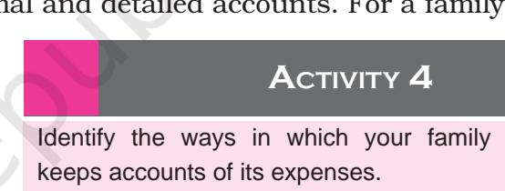

# **UNIT IV**

# Adulthood

187 *With the advent of adulthood, the adolescent passes through the portals of what may be termed as the "real world". One enters the world of higher education, work, and marriage, and gets involved in establishing one's own family. Hence responsibilities of the individual increase manifold. In this unit you will learn about the major factors that play a role in determining the quality of adult life, these being, financial planning and management, maintenance of fabrics and apparel that one uses personally as well as in the home.*

unit_4_as_26_7_09_magenta-Final.indd (M).indd 187 2/9/2023 12:04:39

**10**

#### Learning Objectives

After completing this chapter the learner is able to —

- • understand the meaning and concept of financial management.
- • know the different types of income.
- • explain the steps in making family budgets.
- • describe meaning of savings and investments.
- • discuss the principles of sound investments.

# **10.1 Introduction**

188

- (i) Financial management in the context of a family simply means management of finances. Finances are all types of income available to a family which include salary, wages, rent, interest, dividends, bonus, retirement benefits and all other forms of monetary receipts. Planning, controlling and evaluating the use of all these types of incomes is called financial management. Its purpose is to give the family greatest satisfaction from the resources at hand.
 The quality of living that can be exchanged for financial resources is dependent not only on how much income is available, but more importantly on the regularity and stability of income. Therefore, it is important to learn the skill of managing money as a resource. This chapter will deal with the types of family income, management of income and the steps in making family budgets.

- (ii) Financial planning is a component of financial management. The term budget is often used for the planning stage in financial management. When families make budgets, they see to it that the family income is used in a manner that fulfills all the present needs of the family members and also takes care of the long term goals of the family. Thus
unit_4_as_26_7_09_magenta-Final.indd (M).indd 188 2/9/2023 12:04:41

families are able to achieve their objectives by optimising the use of their resources. In addition, financial planning minimises wastage of money on non-essentials, thus making families save a part of their income for future use. This is, however, possible when the family monitors its financial plans and evaluates the plans from time to time. Commitment of family members towards the success of the financial plan is very important for it to show any results.

 Management is using what you have (resources) to achieve what you want (goals and objectives). Family resources are the resources that are available to the individual or the family at a particular time, which help them reach their family goals. Family resources include human resources such as knowledge, skills, health, time and energy; material resources such as housing, money and investments; and community resources such as the library, parks, community centres, hospitals, etc. In order to ensure maximum utilisation of resources it is important to manage them well.

 A family is a consumption unit while being a social unit, and its purpose is to manage the finances of the family for the well-being of its members. Money is one of the important family resources. A family cannot lead a comfortable life without sufficient money. Managing money effectively to meet present needs and future goals is a learned skill. So let us understand what we mean by family income.

# **10.2 Family Income**

Family income means the sum total of the income of all types and from all sources of all the family members in a given time period. It can be annual, monthly, weekly or daily income. However, for official purposes, it is considered as the annual income in a financial year which is generally from 1st April to 31st March of the next year.

Income may be in the form of

- • Wages
- • Salary
- • Profits from business
- • Commissions
- • Rent from properties
- • Interest on cash loans
- • Dividends
- • Pensions
- • Gifts
- • Royalties
- • Tips and donations
- • Bonus
- • Subsidies, Charities, etc.

#### **Activity 1**

Participate in a group discussion in your class on "Communication Technology – a curse or a boon?"

189

unit_4_as_26_7_09_magenta-Final.indd (M).indd 189 2/9/2023 12:04:41

2024-25

#### Types of family income

There are three types of family income.

Before we go into the details of different types of family income, let us understand what is money and its functions.

Money is what money does. Two most important functions of money are:

- • Serving as a medium of exchange, and
- • Measurement of value

190

Thus money is "anything which is generally acceptable in exchange of commodities and in terms of which the value of other commodities is determined".

#### Importance of money

- • Money serves as a medium of exchange, thus doing away with the problems of spending time for exchange to materialise.
- • Money serves as a standard of value, i.e., a common denominator in terms of which the value of all other commodities is expressed.
- • It works as a standard of deferred payments facilitating savings and investments, which are the basis for capital formation, and hence for better standard of living.
- • Storage in terms of money is durable for long time periods, facilitating accumulation for investment in production and improved standard of living for the family.

unit_4_as_26_7_09_magenta-Final.indd (M).indd 190 2/9/2023 12:04:42

- (a) Money Income is the purchasing power in rupees and paisa that goes into the family treasury in a given period of time. It comes to the family in the form of wages, salary,
#### **Activity 2**

Identify all the sources of money income available to your family in a month.

bonus, commission, rent, dividends, interest, retirement income, royalties and any other allowances to any member of the family. Money income is converted into goods and services required for daily living, and often a part is diverted into savings for delayed use or for investment purposes.

 The frequency and pattern of flow of money income varies from family to family. For example in rural areas agriculture is the main occupation. The income of a farmer is not regular but she/he earns money when she/he sells the crop which may be twice in a year–the rabi and the kharif crops. In contrast, a person having a job will have regular income every month.

- (b) Real Income is defined by economists as a flow of commodities and services available for satisfaction of human wants and needs over a given period of time.
This definition has three important points, namely:

- • Real income is a flow of goods and services, it is not stagnant.
- • It consists of goods and services which might or might not be available with money, e.g., produce from your own land, services of a household.
- • There is a time period involved it may be a month or a year.

Real income is of two types- direct income and indirect income

- 1. Direct Income consists of those goods and services available to the family members without the use of money. For example, services rendered by family members, like cooking, laundering, stitching, maintaining kitchen garden, etc. A house which is fully paid for and community facilities like parks, roads, libraries also come under direct income.
- 2. Indirect Income those material goods and services which are available to the family only after some means of exchange (ordinarily money) has been obtained, e.g., use of money to buy good quality vegetables because it involves one's skill and ability to select.
- (c) Psychic Income is the satisfaction that results from the ownership and utilisation of goods and services. It can also be defined as the satisfaction derived from real income. It is difficult to quantify psychic income in terms of rupees. It is a form of hidden income. It is intangible and subjective and the most important in terms of quality of living.

191

unit_4_as_26_7_09_magenta-Final.indd (M).indd 191 2/9/2023 12:04:42

# **10.3 Income Management**

Income management may be defined as planning, controlling and evaluating the use of all types of income. Its purpose is to simply get the greatest satisfaction from the resources at hand.

No two families, even though they have identical incomes, will have identical needs and desires. Thus every family must devise their own plan of expenditure keeping in mind their goals, needs and desires. For efficient income management it is essential that families recognise and analyse all resources available to them.

# **10.4 Budget**

Budget is the most common planning device for the use of money. A budget is a plan for future expenditure. It represents the first step in the managerial process as applied to money. Its success depends upon

- • its being realistic and flexible.
- • suitability to the group for which it is prepared.
- • quality of the control and evaluation steps which follow.

A family budget gives in detail the income and the expenditure of a family for a month or a year. It mentions all the sources of income during the period and also all the items of expenditure under different headings, such as food, clothing, housing, entertainment, travel, education, health and medicine and savings.

#### Steps in making a budget

There are mainly five steps in making a budget. They are as follows:

(i) List the commodities and services needed by the family members throughout the proposed budget plan. Group the related goods and services together. The following grouping may be helpful:

- • Food and related costs
- • Housing
- • Household operations fuel, utilities
- • Education
- • Transportation
- • Clothing
- • Income tax
- • Medical
- • Personal allowances

unit_4_as_26_7_09_magenta-Final.indd (M).indd 192 2/9/2023 12:04:42

- • Miscellaneous recreation, house furnishings
- • Provision for future saving, retirement
- (ii) Estimate the cost of the desired items totaling each classification and the budget as a whole. General market trends must be considered while making these estimates. For example, if prices are showing an upward trend, sufficient margin should be allowed to cover such increases.
- (iii) Estimate total expected income. It is helpful to list income under two headings – assured and possible income. The budget should ensure that necessities are taken care from the assured income and the 'nice but not necessary' items can be obtained from possible income.
- (iv) Bring expected income and expenditure into balance. Sometimes expenses are more than income. There are two ways to bring them into balance. One can either increase the income (for example by, taking up an extra job/work) or cut expenditures (less frequent outings or less expenditure on festivals).
- (v) Check plans to see that they have a reasonable chance of success. The plans are checked in light of the following factors:
	- • The needs of the family have been met.
	- • The budget allows for emergencies. A joint fund may be kept aside for emergency period.
	- • Solvency is assured. Solvency is the ability to pay bills or debts as they fall due.
	- • The national and world-wide conditions have been considered (e.g., global economic recession).
	- • The long term goals of the family are recognised.

# Advantages of planning family budgets

- • Planning enables a family to take an overview of the use of their income.
- • Amounts allocated to various categories can be studied in relation to total income.
- • The budget helps families use their income to first attain those goals which they consider mostimportant. Spending without a plan frequently results in wastage of income.
- • Family members are less likely to be swayed, as they can make rational decisions which are reflective of long term goals of the family.

# **10.5 Control in Money Management**

After planning, controlling is the next step in money management. Control in financial management is usually of two types: checking to see how well the plan is progressing and adjusting wherever necessary.

193

unit_4_as_26_7_09_magenta-Final.indd (M).indd 193 2/9/2023 12:04:42

Checking is important as it tells how one's plans are progressing and where adjustments are needed. There can be two kinds of checks:

- (i) Mental and mechanical checks: Mental checks are usually established by breaking the allocations into units which can be related to actual expenditures. For example, Rs. 1,000 may appear to be a large amount to a student, but when one realises that one must purchase a pair of shoes, a new dress for a festival and a few books all at one time, it is obvious that one must take extreme care in the selection and the price in light of the total money available. Thus, in mental checking one visualises clearly the items a specific amount must cover.
 A mechanical check is one in which you set aside a certain amount of money in cash to be used for a particular item. For example, many homemakers have a food purse in which monthly allocation for food is kept. All food expenses are carried out from the money in this envelope. Quick disappearance of the money shows how rapidly the money is being spent.

- (ii) Records and accounts: Records and accounts show the distribution of money after expenditures have been made. Such records can be quite casual, such as keeping everyday written account or receipted bills, or they can consist of formal and detailed accounts. For a family
the purpose of records is to show the distribution of money which has been spent and to compare the amounts spent with the amounts allocated to a particular group of items.

Advantages of record keeping for a family

- • Monthly expenditure can be compared with the spending plan and show us where adjustments must be made to avoid excessive expenditure.
- • Helps in identifying those categories or sub-categories where expenditure is too high or too low. This in turn enables us to make better future budgets.
- • Some record keeping methods need bills and receipts to be maintained. Thus a proof of payment is at hand in case of a poor product or service if one wants to lodge a complaint.

Single sheet method is a simple and flexible method of record keeping. The record of expenses are kept on a single sheet (see Figure 1).

Adjusting the plan is very important to keep it on track. Adjustments may be needed if the original planning was poor because of factors beyond the family's control like emergencies, family going on an unplanned shopping spree or inadequate checking mechanisms which do not tell the family that there is a considerable gap between the plan and its execution.

Evaluation is the final step in money management. The satisfaction derived from expenditures is one of the most important means for

194

unit_4_as_26_7_09_magenta-Final.indd (M).indd 194 2/9/2023 12:04:42

determining the success of a budget. Evaluation is done in light of specific goals such as obtaining fair value of money spent, being able to pay bills when they fall due, providing for future and improving economic status of the family.

Records of expenditures may be kept on a single, double or multiple sheets. This method is simple and flexible. Also the sheet can be tacked on the back of a door or cabinet with a pencil hanging nearby, which makes it convenient. Although the double and multiple sheet methods can be more adequate than single sheet, yet if the single sheet is well worked out it may include essential data. Consider the following example

|  | SINGLE SHEET METHOD FOR THE MONTH OF OCTOBER 2008 |  |  |
| --- | --- | --- | --- |
| Category | Amount Allocated | Amount Spent | Total |
| Amount Spent |  |  |  |
| 1. Food |  |  |  |
| Grocery |  |  |  |
| Milk |  |  |  |
| Fruit/veg. |  |  |  |
| Meat – poultry |  |  |  |
| Eating out |  |  |  |
| 2. Housing |  |  |  |
| Rent |  |  |  |
| Repair |  |  |  |
| Loan |  |  |  |
| 3. Clothing |  |  |  |
| Children's clothing |  |  |  |
| Adults' clothing |  |  |  |
| School Uniform |  |  |  |
| 4. Education |  |  |  |
| Fees |  |  |  |
| Notebooks |  |  |  |
| Books |  |  |  |
| 5. Medical |  |  |  |
| 6. Any other |  |  |  |

195

#### **Figure 1: Single sheet method**

After having learnt about the family income and its management by planning, controlling and evaluating we have a good idea about what we need to do to make optimal use of our resources. The next step would then be to learn about savings and investment of money so that we can make good use of it in future.

# **10.6 Savings**

unit_4_as_26_7_09_magenta-Final.indd (M).indd 195 2/9/2023 12:04:42

Savings means keeping aside a part of your money or other resource for use in future or for further production. Savings are important for a family to take care of their future needs. Savings are also important for any economy to survive and grow as savings lead to capital formation and accumulation. This happens when savings are put to productive use by starting a business or depositing money in banks and financial institutions which mobilise public savings and use them for productive use.

Savings of a family depend on the ability to save and willingness to save. Ability to save depends on per capita income. Higher income families have a higher potential to save compared to low income families who have little to save after taking care of their basic needs. Willingness to save depends upon the long term goals of the family and how willing they may be to sacrifice some luxuries in the present to take care of the future.

Saving money is not easy. It takes discipline, planning, co–operation and hard work on the part of family members. But saving money is very important for family security and happiness. Saving for saving's sake is futile. Savings have meaning only when the purpose is well-planned and understood by all family members and the money wisely invested for future use.

# **10.7 Investment**

Investment implies using the money for further production. If savings are put under the folds of a *saree* or kept hidden in a pitcher, it is not going to result in investment. Savings have to be put to productive use in the economic sense to result in investment. Investments may be in two types of assets – physical assets and financial assets. Savings, if put into bank accounts, post offices, or financial credit societies institution, in shares and securities, insurance policies, etc., lead to formation of financial assets. They provide financial security to the family and are productive in economic terms. Savings in physical assets means using your savings to buy land, property, house, gold, household durables, etc. This kind of investmentis not productive in the economic sense of the term and does not result in capital

formation. However, it usually has long term positive returns.

#### **Activity 5**

### Principles underlying sound investments

Identify the various avenues of savings and investments that your family is making use of.

Families spend a lifetime accumulating savings. These savings must be invested wisely to give the family good returns and ensure that the money is safe and available to them when they need it.

Let us now discuss the principles underlying sound investments.

- (i) Safety of the principal amount: The principal itself has to be safe if it is to earn interest or dividends. This principal is the most important

unit_4_as_26_7_09_magenta-Final.indd (M).indd 196 2/9/2023 12:04:42

factor for sound investing. Safety can be ensured by

- • Owning securities in both government and private sectors like National Savings Certificate (NSCs), Public Provident Fund (PPF), *Kisan Vikas Patra* (KVPs), fixed deposits in banks
- • Investing in companies in different geographical zones
- • Owning shares and bonds in different companies
- • Studying the market reputation of the issues of the securities
- • Varying the kind of securities purchased agricultural land, real estate, stocks, bonds, fixed deposits, etc.
- • Understanding prevailing phase of business cycle
- (ii) Reasonable rate of return: In general, the higher the rate of return on an investment, the greater the risk, i.e., safety of principal and rate of return are inversely related. To some people, particularly those depending upon investments as their major source of income, regularity of income is more important than a higher but fluctuating return. This is determined by the selection of securities. Therefore, before investing money one should compare the rate of interest and the associated risk under various schemes and options.
- (iii) Liquidity: It is the ability to convert the securities into cash without sacrificing value. The more liquid an investment is, the higher is its price, or in other words, the lower the return to the investor. Hence income and liquidity must be balanced.
- (iv) Recognition of effect of world conditions: Changes in business trends will affect both the amount of protection needed, the ease of providing it and the methods chosen to provide it. Considering the long time business trends, a family must recognise the effect of their savings on the entire economy. Their willingness or unwillingness to invest in business enterprises at various stages in the cycle may well have an effect in reducing the extremeness of the cycle.
- (v) Easy accessibility and convenience: While choosing an investment option for family funds, one must consider the knowledge required for its success. A family may choose an investment which might result in loss simply because they did not foresee the problems involved in the management of security or property acquired.
- (vi) Investing in needed commodities: The date on which an investment is to mature is important for a family that plans to have funds available for a known future need. Therefore, while investing money, families should purchase securities of lengths and durations so that they mature close to the time of the envisaged need or needs, e.g., for the child's higher education.
- (vii) Tax efficiency: Investments should be made in those instruments which lead to tax saving. A number of provisions in the Income Tax Act can be used to save taxes. Investment in insurance policies,

197

unit_4_as_26_7_09_magenta-Final.indd (M).indd 197 2/9/2023 12:04:42

Employees Provident Fund, PPF, etc., have built-in tax rebates with a specific ceiling limit.

- (viii) After investment service: While selecting an investment instrument, customer care or customer service must be a critical decision-making factor. Good customer care includes easy encashability of securities, good communication network, timely dispatch of interest or dividend warrants, timely disbursal of the due amount after completion of investment period, keeping the customer posted about changes in the policies, interest rate, etc. A customer-friendly company provides the needed support and protection to the investor as and when required.
- (ix) Time period: The "lock in" period is a critical aspect to be considered before deciding on an investment. The longer the period of investment the higher is the rate of return. For example in most fixed schemes the rate of interest is higher for long-term deposits compared to short-term deposits. Thus the investor must choose between a higher return with a longer waiting period or a comparatively lower return for a short lockin-period, based on the needs and requirements of his/her family.
- (x) Capacity: One should not invest beyond one's capacity so that the investments can be free of undue hardships. It is important to balance present needs with future needs and security.

# **10.8 Savings and Investment Avenues**

Following is the list of saving and investment options which are available to an Indian consumer:

- • Post Office
- • Banks
- • Unit Trust of India
- • National Savings Scheme
- • National Savings Certificates
- • Shares and Debentures
- • Bonds
- • Mutual Funds
- • Provident Fund
- • Public Provident Fund
- • Chit Fund
- • Life Insurance and Medical Insurance
- • Pension Schemes
- • Gold, House, Land

# **10.9 Credit**

Inspite of the fact that families save and invest money income they have to

#### **Activity 6**

Visit a bank in your neighbourhood and enquire about the various facilities, investment and savings options available to the customers.

- 198

unit_4_as_26_7_09_magenta-Final.indd (M).indd 198 2/9/2023 12:04:42

sometimes use credit to meet their needs or obligations. That is, families make use of credit to avail of goods and services whose initial cost is too high to bear at once. The word credit comes from the Latin word 'CREDO' meaning 'I believe'. Credit means getting money, goods or services in the present and paying for them in the future. In reality, it is a process of postponed payment, a privilege for which we have to sometimes pay a very high rate. At any given time the use of credit increases purchasing power and thus makes possible the provision of more goods or services than the cash on hand would allow. Families should understand the nature and operation of credit since repayment of the amount borrowed, together with interest for its use, must eventually be made.

#### Need for credit

Families use credit to meet needs or obligations. The need may be real or imaginary. If the initial cost of a commodity seems too large to save before the purchase is made, families borrow money to possess the commodity immediately; for example, land. The cost of the good is spread over a long period of time and the family can have the advantage of using the good during the payment period. Another reason for borrowing is to meet family emergencies like sickness of a family member. Families also borrow to meet obligations like marriage of children or performing rituals during death of a member. A self-supporting and self-sufficient family can always use credit in emergencies and do so with a feeling of confidence.

A lender will make a loan only when she/he believes that the borrower will repay the money she/he borrows. The lender may be a bank or any other financial institution. Their decision to give credit to individuals and families is governed by 4C's, which are mentioned below.

#### 4 Cs of credit

Character means willingness and determination to repay a loan as agreed, even though it is at greater cost and inconvenience than the borrower anticipated.

Capacity means the ability to meet an obligation when it is due. Ordinarily capacity depends upon income. It is important to understand that the capacity of family to repay a loan depends not so much upon total income as upon the available margin over and above necessary expenses. The capacity of a family to repay a loan is determined by the difference between what the family receives and what it spends.

Capital means net worth. A family's capital is determined by the difference between what it owns and what it owes. The existence of this capital provides a margin of safety for the lender, since if the family's income proves to be inadequate to repay the loan, it can draw upon its invested capital.

Collateral consists of specific units of capital which are pledged as

unit_4_as_26_7_09_magenta-Final.indd (M).indd 199 2/9/2023 12:04:42

security for a given loan. Usually these units are placed in the possession of the lender with the understanding that if the borrower fails to pay the loan as agreed, the lender is to reimburse himself in so far as he can from the sale of the pledged collateral.

Commercial banks, cooperative banks and agricultural banks, credit unions, etc., are the main source of taking credit. One can also take credit from self-help groups of which one is a member. The members of this self-help group contribute some money every month and make a corpus amount. From this credit is given to the needy member based on her/his requirement and repaying capacity. These groups have members known to each other and hence no collateral is needed and the interest rate is nominal.

Before using credit the family should consider not only satisfaction gained by possession of the good or service but also future adjustments in family budget imposed by repayment of the loan. Managing credit includes determining when to use credit and when its use has become excessive. Credit is a useful resource when handled with an understanding of its potential and its cost.

If used indiscriminately credit can be disastrous for a family. Avoiding use of credit and taking credit at the lowest possible cost should be the first target for most families.

Let us conclude this chapter with an understanding that money and other financial resources can be multiplied and optimally used if certain measures, mentioned in the chapter, are adopted. As adult members of family, most people have to take care of many things. One such area in daily living is care of clothes and fabrics in the home. If fact, one can learn about the care of one's clothes from a young age. Let us read about this in the next chapter.

#### **Key Terms**

200

Financial Management, Financial Planning, Money Income, Real Income, Psychic Income, Family Budget, Savings, Investments, Credit

#### � Review Exercise

1. Indicate if the following statements are 'True' or 'False'.

- (i) Budget is the first step in money management. (True/False) ________
- (ii) Money serves as a medium of exchange of commodities. (True/False) _________
- (iii) Profits from business and gifts are a form of income. (True/False) _________
- (iv) One should first estimate the cost and then list the commodities and

unit_4_as_26_7_09_magenta-Final.indd (M).indd 200 2/9/2023 12:04:42

services needed while making the budget. (True/False) _________

- (v) Savings in physical assets are productive in economic terms. (True/False) _________
- (vi) The trend in business cycle is an important consideration under the principal of safety. (True/False) _________
- (vii) The time period may be ignored while considering and deciding on an investment. (True/False) _________
- (viii) The 4 C's of credit are character, capacity, capital and collateral (True/False) _________
- (ix) Nature of enterprise is not an important safety consideration. (True/False) _________

#### � Review Questions

- (i) What do you understand by 'management of finances'?
- (ii) Discuss the different types of income.
- (iii) Discuss the steps in making a budget.
- (iv) What are the controls that can be exercised in money management?
- (v) Discuss the principles underlying sound investments.

#### � Practical 16

#### **Financial Management and Planning**

Plan a budget for any festival celebrated in your school. One example under each heading is given.

#### **No. of students: 30 No. of teachers: 5**

| S.No. | Item |  |  | Cost (Rs.) |
| --- | --- | --- | --- | --- |
| 1. | Venue |  |  |  |
|  | arrangement |  |  |  |
|  | Decoration |  |  |  |
|  |  | a) | Flowers | 100.00 |
|  |  | b) |  |  |
|  |  | c) |  |  |
|  |  | d) |  |  |
|  |  | e) |  |  |

201

unit_4_as_26_7_09_magenta-Final.indd (M).indd 201 2/9/2023 12:04:42

|  |  |  |  | Sub total |
| --- | --- | --- | --- | --- |
| 2. | Food |  |  |  |
|  |  | a) | Sweets (Prasad) | 200.00 |
|  |  | b) |  |  |
|  |  | c) |  |  |
|  |  | d) |  |  |
|  |  |  |  | Sub total |
| 3. | Stationery |  |  |  |
|  |  | a) | Coloured paper | 200.00 |
|  |  | b) |  |  |
|  |  | c) |  |  |
|  |  | d) |  |  |
|  |  |  |  | Sub total |
| 4. | Miscellaneous |  |  |  |
|  |  | a) | Transportation |  |
|  |  | b) | Costumes |  |
|  |  | c) | Gifts |  |
|  |  | d) |  |  |
|  |  | e) |  |  |
|  |  | f) |  |  |
|  |  |  |  | Sub total |
|  |  |  |  | Grand total |

202

 *Note: Strike out that which is not applicable.* 

unit_4_as_26_7_09_magenta-Final.indd (M).indd 202 2/9/2023 12:04:42

