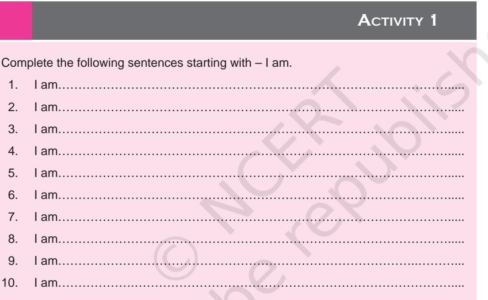
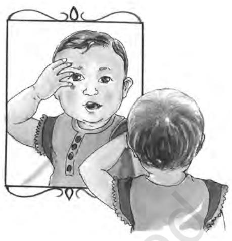
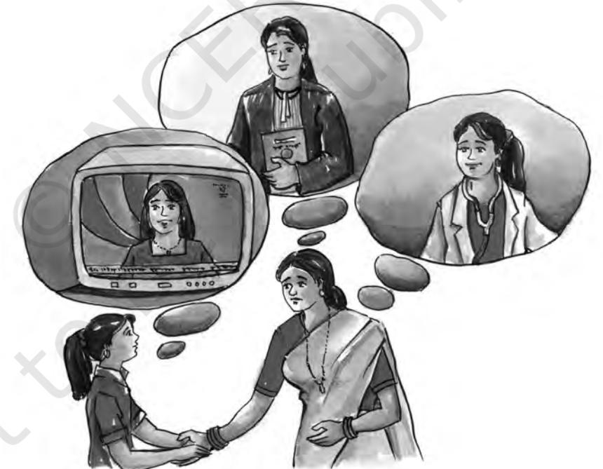

# **UNIT I**

## Understanding Oneself: Adolescence

5 *Unit I focusses on the stage of adolescence the stage of life to which you belong at present. This unit deals with understanding your own self in terms of your personal and social identity, your nutritional and health requirements, management of basic resources of time and space, fabrics around you, and your communication skills. The last chapter of the unit situates the adolescent in the context of the family and larger society, thereby linking it to the next unit that deals with the individual in relation to her/his family, school, community and society.*

Unit 1.indd 5 3/16/2023 10:33:45

## **2** Understanding the Self A. What makes me 'I'

#### Learning Objectives

6

After completing sections A, B and C the learner is able to —

- • discuss the importance of knowing oneself and the significance of developing a positive sense of self.
- • list the factors that influence the development of selfhood and identity.
- • analyse why the period of adolescence is critical for the development of self and identity.
- • describe the characteristics of self during infancy, childhood and adolescence.

## **2A.1 Introduction**

While we all have many things in common with our parents, siblings, other relatives and friends, each one of us is also a unique person, different from all others. This sense of being unique gives us our sense of self — the sense of 'I' which is different from 'you', 'them' and 'others'. How do we develop this sense of self ? What we think about ourselves and how we describe ourselves — does it change over the years? What are the elements of the self? Why should we study about the self? Does our self influence the way we interact with people? In this unit we will study about these and other interesting aspects of the self.

Related to the concept of the self are two other concepts — identity and personality. While psychologists distinguish between these three concepts in terms of their definitions, the concepts are intricately related and we often interchange these terms in common usage.

Unit 1.indd 6 8/4/2022 2:50:34 PM

## **2A.2 What is Self?**

The Webster's Third New International Dictionary contains 500 entries that begin with 'self '. The sense of self refers to the sense of who we are and what makes us different from everyone else. During adolescence the period you are going through presently — we start thinking more than ever about who am I? What makes 'me' different from 'others'? At this stage, more than at any other stage before this, we try to define our 'self '. Some of you may have given this question a lot of thought, while some others may not be aware that they have been thinking of these aspects.

7

Re-examine the statements you wrote to describe yourself, some of these described the physical aspects of yourself, you described your bodily self; in some you referred to your feelings and emotions; in some you described yourself in terms of your mental abilities; in some others you may have described yourself in relation to others, in terms of the roles you perform and the relationships you are involved in every day such as son/daughter, wife/sister, student, i.e., you defined yourself in terms of your social relationships in the family and community. Some of you may have described yourself in terms of your potential or capabilities and some others in terms of your beliefs. In some you described yourself as a doer, as a person performing actions, as an agent, while in others you described yourself as a thinker. Thus, you can see that the self has several dimensions. Very broadly speaking we can think of these various dimensions of the self as the personal and the social. The personal self

Unit 1.indd 7 8/4/2022 2:50:34 PM

has those aspects which relate only to you while the social self refers to those aspects where you are involved with others, and includes aspects like sharing, cooperation, support and unity.

We can say that the term self refers to the totality of a person's experiences, ideas, thoughts and feelings with regard to herself/himself. It is the characteristic way in which we define ourselves. The idea that we hold of ourselves is the notion of the self.

You must have heard and used the terms self-concept and self-esteem with reference to yourself and with others. What do you mean when you use them? Write your thoughts in the box below and discuss these after reading the definitions given after the box.

For your thoughts....

8

Self-concept and self-esteem are elements of identity. Self-concept is a description of oneself. It answers the question of 'Who am I?' Our self-concept includes our qualities, feelings and thoughts and what we are capable of doing.

An important aspect of the self-concept is self-esteem. Self-esteem refers to our judgment of ourselves according to the standards we have set for ourselves which are largely influenced by society. It is one's evaluation of oneself.

Unit 1.indd 8 8/4/2022 2:50:35 PM

### **2A.3 What is Identity?**

Refer to Activity 2 on this page. What did you conclude — 'Yes', you are the same person or 'No', you are not the same person, or was your answer both 'Yes' and 'No'! Which is quite likely. Over the years your body has undergone many changes, you know many more people now as compared to earlier times, and you have developed a certain relationship with them. Your way of responding to and understanding events may have changed, you may have changed some of your beliefs and values, and your likes and dislikes may have also changed. So you are not really the same person as you were even a year ago! Yet, you have an unmistakable sense of having been the same person from as far back as you can remember. Most of us are able to maintain a sense of continuity and sameness throughout our lives despite the many changes and discontinuities that mark our life over the decades. In other words, we all have a sense of identity, a sense of who we are which we carry throughout our lives. Just as in the case of self, we can talk of personal identity and social identity. Personal identity refers to those attributes of a person that make her different from others. Social identity refers to those aspects of the person that link her to a group – professional, social or cultural. Thus, when you think of yourself as an Indian you have linked yourself with a group of people living in a country. When you describe yourself as a Gujarati or a Mizo, you are saying that you share some characteristics with the people living in that state, and that these characteristics seem to you to be different from people living in other states of India. Thus, being a Gujarati is one dimension of your social identity in the same way as being a Hindu, Muslim, Sikh or a Christian or being a teacher, farmer or lawyer.

#### **Activity 2**

Are you the same person that you were five years ago? Reflect on this for some time, and write your views and the reasons for these views in the space below.

Unit 1.indd 9 8/4/2022 2:50:35 PM

The self is thus multi-dimensional in nature. It also undergoes change as a person grows and develops from an infant to an adolescent. The next chapter describes the characteristics of self during infancy, childhood and adolescence.

**Key Terms**

Self, Self-concept, Self-esteem, Identity

#### Review Questions

- 1. Explain what you understand by the term 'self'. Discuss its various dimensions giving examples.
- 2. Why is it important to understand the self?

10

Unit 1.indd 10 8/4/2022 2:50:36 PM

## **2** B. Development and Characteristics of the Self

11

The self is not something that you are born with, but which you create and develop as you grow. In this section we will read about the development and characteristics of the self in infancy, early childhood, middle childhood and adolescence.

## **2B.1 Self during Infancy**

At birth we are not aware of our unique existence. Does that surprise you? This means that the infant does not realise that she/he is separate and distinct from the world outside – she/he has no self-awareness or self-understanding or self-recognition. By each of these terms we mean the mental representation (a mental picture) of the self. The infant brings her/his hand in front of her/his face and looks at it but does not 'realise' that the hand belongs to her/him and that she/he is separate from other people and things she/he sees around her. The sense of self emerges gradually during infancy and self-image recognition happens around 18 months of age. One interesting experiment which has been carried out with infants in the age range 14-24 months is described below. You can try it out too.

#### **Activity 1**

Put a dot of red lipstick/colour on the cheek of the infant and then place the infant in front of the mirror. If the infant has an awareness of the self, she/he will touch her own cheek after looking at the red spot on the face in the mirror. If the infant does not have self-awareness, she/he will touch the reflection in the mirror, or just play with the reflection in the mirror as if it is another infant.

Unit 1.indd 11 8/4/2022 2:50:37 PM

Towards the latter half of the second year, infants begin to use the personal pronouns – I, me and mine. They use these pronouns to indicate possession of persons or objects – "my toy" or "my mother"; to describe themselves or actions they are doing or their experiences – "me eating". Infants also begin to recognise themselves in photographs at this time.

## **2B.2 Self during Early Childhood**

Since children are able to talk quite fluently by the time they are 3 years old, we need not rely only on self-recognition to know young children's selfunderstanding. We canuse verbal means by involving them inconversations about themselves. Researchers have found that the following are the five main characteristics of young children's understanding of themselves.

- 1. They use physical descriptions of their self or material possessions to differentiate themselves from others – they may use descriptive words like 'tall', or 'big' or refer to the clothes they wear or the toys or objects they have. Their self-descriptions are in absolute terms – this means they do not see themselves in comparison with others. To give an example, instead of saying, "I am taller than Kiran", the child will say, "I am tall."
- 2. They describe themselves in terms of things they can do. For example, in terms of their play activities – "I can ride a cycle"; "I can make a house"; "I can count". Thus, their self understanding contains active descriptions of themselves.
- 3. Their self descriptions are in concrete terms i.e., they define themselves in terms of things they can do or what is visible to them – "I have a television."
- 4. They often overestimate themselves. Thus, a child may say, "I am never scared" or "I know all the poems", but may not remember them completely.
- 5. Young children are also unable to recognise that they can possess different attributes – that they can be 'good' and 'bad', 'mean' and 'nice' at different points in time.

The following is a brief interaction between an adult and Radha, a girl aged 3 years 8 months, which reveals the child's perception of herself. The

12

Unit 1.indd 12 8/4/2022 2:50:37 PM

interaction is presented in the form of questions asked and the answers given by the child.

| o;Ld | vius | ckjs esa | dqN | crkvksA |  |  |  |  |  |  |
| --- | --- | --- | --- | --- | --- | --- | --- | --- | --- | --- |
| Adult | Tell | me | something |  | about | yourself |  |  |  |  |
| jk/k | eSa [kkuk | [kkrh | gw¡] eSa | xktj | Hkh | [kkrh | gw¡] | jksVh | Hkh | [kkrh gw¡A eSa cSV&ckWy [ksyrh |
|  | gw¡A rhu | fnu | ckn esjk |  | tUefnu | gksxk | D;ksafd |  | tuojh | esa esjk tUefnu gSA eSa ykbu |
|  | eas [kM+h | gksrh | g¡wA eSa | eEeh | osQ | lkFk | i<+rh | g¡wA |  |  |
| Radha | I eat | food, I | eat | carrots | as | well, | I eat |  |  | chappati also. I play with bat |
|  | and | ball. | After | three | days | is my |  | birthday |  | because my birthday is |
|  | in | January; | I | stand | in a | line; I |  | study | with | my mother. |
| o;Ld | vxj | dksbZ rqels | iwNs | fd | jk/k | oSQlh | cPph | gS] | rks | rqe D;k dgksxh\ |
| Adult | If | someone | asks | you | 'What | is | Radha |  | like', | what would you say? |
| jk/k | eSa vPNh | gw¡ | D;ksafd | eSa | fy[krh | Hkh gw¡A |  | (o;Ld | us | vkSj crkus dks dgk ij cPph |
|  | us dqN | ugh | dgk) |  |  |  |  |  |  |  |
| Radha | I am | good | because | I | write | as | well. | (The |  | adult asked her to explain |
|  | more | but | she did | not |  | respond). |  |  |  | 13 |
| o;Ld | rqEgkjs | eEeh&ikik | dks | rqEgkjs | ckjs | esa | D;k | vPNk |  | yxrk gS\ |
| Adult | What | do | your |  | mummy-papa |  | like | about |  | you? |
| jk/k | eSa | vPNh&vPNh | ckrsa | djrh | gw¡ | vkSj |  | vPNh&vPNh |  | dgkuh lqukrh gw¡A |
| Radha | I talk | about | nice | things | – | I tell | good |  |  | stories. |
| o;Ld | rqEgsa | vius ckjs | esa | D;k | vPNk | yxrk | gS\ |  |  |  |
| Adult | What | do you | like | about |  | yourself? |  |  |  |  |
| jk/k | esjs | xqykch twrs | vPNs |  | yxrs gSa] | csch |  | vPNk | yxrk | gS] viuh lgsfy;k¡ vPNh |
|  | yxrh | gSa--- |  |  |  |  |  |  |  |  |
| Radha | I like | my | pink | shoes, | I like | baby, | I | like |  | my friends… |
| o;Ld | vkSj | crkvks---\ |  |  |  |  |  |  |  |  |
| Adult | Tell | me | more…? |  |  |  |  |  |  |  |
| jk/k | eq>s | le> ugha | vk | jgk--- | eq>s | vius | ckjs | esa | dqN | ughsa irk---A |
| Radha | I don't |  | understand… |  | I don't |  | know |  | anything | about myself... |

Unit 1.indd 13 8/4/2022 2:50:38 PM

## **2B.3 Self during Middle Childhood**

During this period, children's self-evaluations become more complex. There are five key changes that characterise this increasing complexity:

- 1. The child shifts towards describing herself in terms of her internal characteristics. The child is more likely to name her/his psychological characteristics (such as preferences or personality traits) in her selfdefinition and less likely to name physical characteristics. Thus, the child may say, "I am good at making friends", "I can work hard and finish my homework on time."
- 2. The child's descriptions include social descriptions and identity they may define themselves in terms of groups they belong to, "I am in the music choir in school".
- 3. Children begin to make social comparisons and differentiate themselves from others in comparative rather than absolute terms. Thus, they begin to think about what they can do in comparison with others, for example, "I can run faster than Kiran."
- 4. They begin to distinguish between their real self and ideal self. Thus they can differentiate between their actual competencies and those that they want to have or those which they think are most important.
- 5. The self-descriptions become more realistic as compared to those of the pre-school child. This may be because of the ability to see things and situations from the point of view of others.

## **2B.4 Self during Adolescence**

Self understanding becomes increasingly complex during adolescence. Adolescence is also seen as a critical time for identity development. What are the characteristics of this more complex self understanding? Let us discuss the first two aspects and then we shall discuss the features of the adolescent's self.

#### **Activity 2**

Make friends with a 5-year-old, a 9 year-old, and a 13-year-old. Ask them to describe themselves and note what they say. Do you find that their selfdescriptions correspond with what you have read in this section?

### Why is adolescence a critical time for identity development?

According to a well-known psychologist Erik H. Erikson, at each stage of our development, from infancy to old age, we have to accomplish certain tasks which enable us to move on to the next stage of development. For example, a task during late infancy and early childhood (between 2-4 years

14

Unit 1.indd 14 8/4/2022 2:50:38 PM

of age) is to achieve bowel and bladder control. Without this, participation in most social and community activities would become impossible for the child. The task during the period of adolescence, according to Erikson is to develop a sense of identity, a satisfactory self-definition.

The reason why the stage of adolescence is critical for identity development is because there is an enhanced focus on the development of the self. It is believed that the adolescent faces an identity crisis. This is because of three reasons—

- 1. This is the time when the person, more than at any other point of her/his life before this, is preoccupied with trying to know oneself. This means that the person is intensely concerned with understanding herself/himself.
- 2. Towards the end of adolescence the individual creates a relatively lasting sense of selfhood and identity and can say – "This is who I am".
- 3. This is also the time when the individual's identity is influenced by rapid biological changes and changing social demands.

#### Let us understand this in more detail

The adolescent is now expected to behave in an adult-like manner and begin to take on responsibilities related to family, work or marriage. This social transformation from dependent child to independent person occurs differently in different cultures. Western cultures generally emphasise independence in terms of 'separation' from parents (both physical and psychological). On the other hand, non-western cultures, such as the Indian, focus on interdependence within the family. In all cultures, however, adolescence is reported to be accompanied by dilemmas and disagreements. For instance, it is common to see that an adolescent may rebel against being treated "like a child" but at the same time may herself/himself seek comfort as a child would. The parents too may often tell the adolescent to "behave like a grown up", but their other actions may indicate to the adolescent that they do not think that she/he is quite grown up. This may be somewhat different for girls and boys depending on the expectations of the family, in a particular culture. Thus, the adolescent herself experiences conflicting feelings and also receives conflicting messages and social expectations from the people around her/him. You may have experienced this for yourself. For example, the family members may expect you to behave in an adult-like manner in social situations as far as talking or dressing is concerned, but may still think you are too young to discuss the family budget.

Since individuals are differentthey may respond differently to situations. The conflicting expectations from familial and societal sources, one's own changing needs and conflicting emotions may interfere with integrating

Unit 1.indd 15 8/4/2022 2:50:38 PM

the newly emerging selves during adolescence. Thus, the adolescents may experience what is known as role confusion or identity confusion. They may show behaviours like the inability to concentrate on the work at hand, difficulty in starting or finishing work on time, and a general difficulty in coping with schedules. It is important to stress that the difficulties that the adolescent experiences in the process of developing an identity are a normal part of development – there is nothing inappropriate with the contradictory feelings and emotions the adolescent experiences during this period. The feeling of identity crisis or role confusion arises when the adolescent feels that there is a significant gap in terms of what she/ he is expected to do and how she/he is expected to behave as compared to earlier times. However, for many adolescents, especially those who are involved in family occupations, this sense of break may not be distinct and may not cause much emotional upheaval. For example, if a child in a village is assisting the family in agriculture, her/his role does not change much from when she/he was 12 to when she/he is 16, except may be in terms of being given more responsibility.

16

The following are the characteristics of an adolescent's sense of self.

- 1. Self-descriptions during the period of adolescence are abstract. Adolescents are likely to lay less emphasis on describing themselves in physical terms as "tall", or "big"; they emphasise the abstract or inner aspects of their personality. Thus, they may describe themselves as quiet, sensitive, cool headed, brave, emotional or truthful.
Unit 1.indd 16 8/4/2022 2:50:39 PM

- 2. The self during adolescence carries several contradictions. Thus, adolescents may describe themselves as "I am calm but get easily disturbed" or "I am quiet and also talkative."
- 3. The adolescent experiences a fluctuating sense of self. As adolescents experience diverse situations and respond to different experiences, their understanding about their own self fluctuates over situations and over time.
- 4. The self of the adolescent contains 'the ideal self' and 'the real self'. The ideal self becomes more prominent now. Each one of us has an idea of what and how one would ideally like to be. This could be called the ideal self, towards which we would like to develop. For example, a girl may want to be tall but is actually quite short.
- 5. Adolescents, more than children, are self-conscious and preoccupied with themselves. This gives them a feeling of always "being on stage" – a feeling that they are always being noticed. This is the reason why most adolescents are over-concerned about their physical appearance.

We now know about the different characteristics of self during certain life stages. But how do we develop a sense of self in the first place? What influences the development of a person's identity? The next chapter focusses on this aspect.

#### **Key Terms**

Infancy, Early childhood, Middle childhood, Adolescence, Identity development, Real vs. Ideal self

Review Questions

### **Activity 3**

Do you feel that you are experiencing any of the feelings and thoughts we have described above? Do you feel you are able to handle these feelings or do you experience confusion? Have you discussed these aspects with your friends or family members? Talk to your friend about it.

17

## 1. Describe, giving examples, the characteristics of the self during—

- infancy
- early childhood
- middle childhood
- adolescence
- 2. "Adolescence is a time when all adolescents experience identity crisis". Do you agree with this statement? Give reasons for your answer.

Unit 1.indd 17 8/4/2022 2:50:39 PM

## C. Influences on Identity How do we Develop a Sense of Self?

18

You have read that we are not born with a sense of selfhood or identity. How does it develop then? How does it evolve and change over time? The self develops as a result of what you learn about yourself through the experiences you have and through what others tell you about yourself. Each person lives in a web of relationships – these relationships are in the family, school, workplace and community. The sense of self develops as a result of interaction with the people around you and through your actions. Thus multiple people shape the development of your self and the construction of the self is a continuous dynamic process. The word 'construction' implies that the self is not something that you are born with but which you create and develop as you grow.

Human Ecology and Family Sciences – Part I

**2**

Recall any significant experience you have had. Did it influence the way you think about yourself? Note your observations in the space below. .......................................................................................................................................... .......................................................................................................................................... .......................................................................................................................................... .......................................................................................................................................... .......................................................................................................................................... .......................................................................................................................................... **Activity 1**

Let us trace how the sense of self develops from the early years. From the earliest days, parents address the children by a particular name or names in a variety of situations. The children begin to associate the name with themselves. Along with this they also point to the child in the mirror

Unit 1.indd 18 8/4/2022 2:50:40 PM

and in photographs with that name. They use the pronouns 'you' and 'your' and when they are able to speak, the use of the pronouns 'me' and 'mine' appears. The child understands that 'you' and 'your' refer to another person. Parents play various 'body games' pointing and labeling various parts of the child's body and ask the child to point out body parts in turn. All this helps the child to gradually learn to see herself/himself as distinct and separate from others.

Second, as the child grows during infancy she begins to realise that her actions have an effect on the environment. For example, when she touches a toy it moves. All such experiences help her/him have a sense of being separate from other people and objects around her. If you recall the earlier discussion, this is also the time (around 18 months) when the child is able to identify that the spot of red is on her/his face and she/he does not treat the reflection in the mirror as another child.

Third, as the child grows older and can talk, the parents encourage the child to provide self–statements and ask her/him to give reasons. They ask the child, "Why did you do this?" or "How do you feel?" These questions help the child understand what she or he is experiencing or the reasons for certain actions; in this way they help the child in defining the self.

Fourth, during the course of the day the child has several encounters with people and objects around her/him which help to develop an idea about abilities. People also give the child a feedback about her or his behaviour and abilities. To a 6-year-old who helps in cleaning up the food area after the meal, the father may say, "That was a good thing to do. You are a good boy." All this feeds into the child's beliefs about herself/himself. The child thus constructs and re-constructs selfhood and sense of identity through the verbal-social interactions she/he has with caregivers and others.

#### Developing a sense of self and identity

The reasons why each one of us has a unique identity is because

- • each one of us (except identical twins) has a unique combination of genes.
- • each one of us has different experiences.
- • even if we have similar experiences, we respond to these in different ways.
- In this section we will study the influences on the formation of identity. These can be classified as—
- • Biological and physical changes
- • Socio-cultural contexts including family and peer relationships
- • Emotional changes
- • Cognitive changes

Unit 1.indd 19 8/4/2022 2:50:40 PM

## **2C.1 Biological and Physical Changes**

The period of adolescence is marked by certain universal physical and biological changes in the body which take place in particular sequences. These changes lead to the attainment of sexual maturity. The time when sexual maturity is reached is called puberty. Menarche (first menstruation) is usually considered the point of sexual maturity for girls. There is no corresponding definite event marking puberty for boys, although a criterion sometimes used is the production of spermatozoa. Puberty occurs at different average ages in different cultures. A criterion of puberty that has been found useful for both boys and girls is that of maximum yearly increase in height. The age of most rapid growth comes just before menarche for girls and before certain adult characteristics in boys. This period during which physical and biological changes occur, leading to puberty is called pubescence. For most girls this period ranges from 11 years to 13 years, and for boys it is 13 years to 15 years. Following is the list of changes in girls and boys showing normal sequence for development during pubescence.

#### Girls Boys

Initial enlargement of breasts Beginning growth of testes Kinky pubic hair Early voice changes Age of maximum growth First ejaculation of semen Menarche Kinky pubic hair Growth of axillary hair Age of maximum growth

Straight, pigmented pubic hair Straight, pigmented pubic hair Growth of axillary hair Marked voice changes Development of the beard

While the physical changes that take place in the body with the onset of puberty are universal, the psychological and social impact of these changes on the person vary from culture to culture and within a culture from person to person. We will discuss these aspects under the next two headings – socio-cultural contexts and emotional changes.

## **2C.2 Socio-cultural Contexts**

It has been stated that physical changes in the body and the changing social expectations are the two main aspects that influence the process of identity formation during the period of adolescence. But to what extent these physical and social changes impact the process of identity formation varies with cultural, social and familial contexts. In this section, let us first see how cultural and social contexts influence adolescent development and then we will read about the influence of the family.

Unit 1.indd 20 8/4/2022 2:50:40 PM

Different sections of the society may respond differently to the physical changes during adolescence. In traditional Indian society, the onset of puberty places many restrictions on the girls while the boys retain their freedom of movement. Certain avenues of entertainment or work are not seen as appropriate for girls. The elements of the self and the identity of a girl from a traditional community would be very different from that of a girl living in urban areas.

Let us now compare our culture with Western cultures. In most Western cultures (such as the U.S. and U.K.) adolescents are expected to be fairly independent — in many cases they are expected to move away from the family to set up their own home. In the Indian context, a large majority of adolescents continue to be fairly dependent on parents as they are expected to be, and the family continues to exercise control over them. While many adolescents in India, especially in rural and tribal settings, begin to contribute towards the family income, and in this sense begin to assume adult roles, yettheydonotbreakaway fromthe family.Insteadtheir efforts at earning are often aimed at the welfare of family members. The development of the self of an adolescent in these two cultural settings would be quite different. Even within India, the experiences of adolescents would be quite different in different communities. In traditional communities and regions where technology is not yet advanced and where occupational opportunity and choices for alternative lifestyles are limited, children are trained in the traditional family occupations, such as weaving, up to the time they reach adolescence. Such adolescents are, therefore, ready to assume adult roles – this means they are seen as persons with responsibilities of beginning work, getting married and bearing children, like adults. Thus, in these communities the identity of the adolescent would be drawn more from familial sources. The adolescent may not enter into much conflict with elders since they are largely doing what adults expect of them. As a result, there are likely to be fewer confusions and doubts while developing a sense of self. On the other hand, in communities and families where a variety of occupational choices are open for the adolescent, where technology makes available many experiences and options to the individual, the adolescent may need to enter into an extended period of training to prepare herself/ himself for the chosen occupation. During this period the adolescent still remains dependent on the parents. While the period of adolescence is thus extended, that of adulthood is delayed. Also, the increase in choices and exposure to alternate lifestyles may bring the adolescent in conflict with parents and other authority figures in society.

There is another reason why the development of identity is likely to vary in traditional cultures and cultures of the West. In traditional Indian communities, open reflection on oneself and the idea oftalking about oneself is not a common activity among adolescents. In fact, such an attitude is often neither encouraged nor tolerated. Many Indians define themselves

Unit 1.indd 21 8/4/2022 2:50:40 PM

primarily in one or the other roles that they play – son/ daughter, mother/ father, sister/brother. To put it differently, they often speak of themselves in terms of the family and the community – as "we" – rather than as "I". For example, while talking about her views on marriage, an adolescent girl would say, "In our family marriages are arranged by parents", rather than saying, "I would prefer my parents to arrange my marriage". Thus we can see how important the socio-cultural context is in the construction of a sense of self. Of course the impact of these cultural influences will vary from family to family and person to person.

Having discussed how the culture and society impact adolescentidentity development, let us read how the family can impact the development of the sense of identity. During adolescence identity formation is enhanced by family relationships where adolescents are encouraged to have their own point of view and where there is a secure relationship between family members which provides the adolescent with a secure base from which to explore her widening social world. It has also been found that firm and affectionate parenting fosters healthy development of identity. 'Affectionate' parenting means that the parents are warm, loving and supportive of the child's effort and accomplishment. They often praise the child, show enthusiasm in her/his activities, respond sensitively to her/ his feelings, and understand the child's personality and points of view. However, such parents are also firm in disciplining. Such parenting style fosters independence and self-reliance in children.

Adolescence is the period in which the growing individual develops a strong need for support and acceptance from the peers. At times, parental and peer values can be in conflict with each other and the adolescent may tend to lean more towards friends. This can cause disharmony in parentchild relationships. Conforming to peer pressure can be both positive and negative. The negative effects become evident when adolescents indulge in harmful behaviours such as smoking or consuming, drugs or alcohol or bullying. However, often peers and parents serve complementary functions and fulfil different needs of the adolescents. It has been seen that a family atmosphere that promotes both individuality and connectedness is important for the identity development of the adolescent. By 'Individuality' implies greater opportunity and the ability to have one's own point of view. 'Connectedness' suggests greater sensitivity to and respect for others' views and openness to others' views.

### **2C.3 Emotional Changes**

The adolescent experiences many emotional changes in the process of growing up. Many of these changes are a consequence of the biological and physical changes that the adolescent is undergoing. It is true that adolescents are preoccupied with their physical body. They imagine that

22

Unit 1.indd 22 8/4/2022 2:50:40 PM

others are noticing each and every aspect of their body and behaviour. A young person with pimples on the face may feel that everyone is first and foremost noticing that. However, there are individual differences in the way adolescents react to the bodily changes. A boy who does not have adequate growth of facial hair as compared to all the other boys of his age may feel peculiar about it. However, this same lack of facial hair may not disturb another boy. A sense of pride or comfort with the way one is developing physically will contribute positively to the adolescents' sense of self. On the other hand, if the adolescent is dissatisfied with one's appearance beyond a point, it can prevent from concentrating on other aspects of her/his personality, work or studies. This can cause a dip in performance at school and a lowering of self-image or self-esteem. A negative self-image can cause a person to feel insecure and also generate negative feelings about the body. An adolescent with a physical disability may not experience herself/ himself as any less than others, whereas a well-built adolescent boy may feel conscious and inadequate because he feels that his body is not "good enough".

The adolescent also experiences mood swings – for example, desiring the company of family members and friends at one time and wanting to be alone at other times. There may also be sharp bursts of anger. A lot of this happens as the adolescent is trying to make sense of and understand the variety of changes she/he is experiencing at different levels.

### **2C.4 Cognitive Changes**

You will read in detail about the changes in thinking (cognition) that takes place from infancy to adolescence in Unit III titled 'Childhood'. At this point we are briefly describing the cognitive changes that have an impact on the development of the sense of identity.

The child develops from a person who has no sense of a separate identity or sense of the individual self to one who describes the self in concrete and absolute terms during early childhood years. While the self-descriptions during middle childhood are also concrete, the difference is that these descriptions are now in comparative terms. By the time the child is 11, the self descriptions are fairly realistic enabling the child to differentiate between the 'real' and the 'ideal' self.

During adolescence, the leap that takes place is that adolescents can think in abstract terms, i.e., they can think beyond what is present and what they see and experience. Further, as thought becomes flexible, they can think of hypothetical situations — in other words, they can imagine the various possibilities and their outcomes without necessarily having to go through them or act out the steps of any outcome. The implication for identity formation is that adolescents can imaginatively link up their present with a future they imagine for themselves. For example, the

Unit 1.indd 23 8/4/2022 2:50:40 PM

adolescent can think of the possible careers that she/he can take up as an adult which are suited to her/his situation and temperament, and plan the current direction of her/his studies accordingly.

Thus, adolescence is a crucial stage for the development of identity. In fact, adolescence is a significant period of development involving many changes and opportunities. If the adolescent is healthy, she/he is able to deal with the changes in the best possible manner and realise one's full potential. Appropriate food and nutrition are the key elements of good health. The next chapter discusses food, nutrition, health and fitness concerns during adolescence.

#### **Key Terms**

Puberty, Pubescence, Menarche, Personality, Peer pressure

24

#### Review Questions

- 1. Discuss the concepts of puberty and pubescence. Explain the major physical and biological changes in girls and boys during puberty.
- 2. What is the role of family in shaping the personality of the adolescent?
- 3. To what extent does culture shape the adolescent identity? Explain with examples.
- 4. List the major emotional and cognitive changes during adolescence.

Unit 1.indd 24 8/4/2022 2:50:40 PM

#### Practical 1

#### **Development and Characteristics of the Self**

**Theme** Study of one's physical self

- **Tasks** 1. Recording of height, weight, hip size, round waist, round chest/bust
	- 2. Recording of age of menarche (girls) and growth of beard and change in voice (boys)
	- 3. Recording of colour of hair and eyes

**Purpose of practical:** You have read about physical growth and development during the age of adolescence. This practical will help you to understand your physical self better and also help you to know the average rate of growth and development of adolescents in your region as you compare your data with those of others. The measurements stated in Task 1 above are also important for you to know for the purpose of garment sizing–

**Conduct of practical:** Take your own measurements as stated in Task 1 above. Alternatively you can take each other's measurements in the class. The following measurements can be taken as described–

- Around Hip: Use a measuring tape around the widest portion of the hips with two fingers between the tape and the body.
- Around Bust/Chest: Hold the tape and measure across the fullest part of the bust/chest. Hold tape firmly but not tight.
- Around Waist: Hold the tape around waist and let it settle into the smallest portion of the body (that is the waistline). Take the measurement with one finger between tape and body.
- Around neck: Lay a still measure tightly around the neck and gently tap it down until the lower edge settles at the base of the neck where the measurement is taken.
- Across back: It is measurement taken between the lateral ends of scapulae (shoulder blades). Take one more measurement 10–12 cms below the waist measurement over the fullest part of back.

Record information required as per Tasks 1, 2 and 3 in the table below:

| Your name |  | Age |  |
| --- | --- | --- | --- |
| Gender |  | Colour of hair |  |
| Colour of Eyes |  | Age at menarche |  |
| Age at growth of |  | Weight |  |
| beard, change in voice |  | Around chest/ bust |  |
| Height |  | Around neck |  |
| Hip size . |  | Across back |  |
| Around waist |  |  |  |

Unit 1.indd 25 8/4/2022 2:50:40 PM

Now form yourself into groups of 10 students each and pool all your individual data together.

- 1. Note what the range is for each of the above measurements of the body in your group. For example, weight in your group ranges from ……kgs to …..kgs.
- 2. Note the range for age of menarche and the range during which growth of beard and change in voice takes place.
- 3. Correlate the size of ready-made garments you purchase with your measurement.

26

Unit 1.indd 26 8/4/2022 2:50:41 PM

#### Practical 2

#### **Influences on Identity**

- **Theme** Emotions experienced by self
- **Tasks** 1. Making a record of your emotions experienced during a day
- 2. Reflecting on the reasons for experiencing the emotions
- 3. Identifying ways of handling them

**Purpose of the practical:** We all experience a variety of emotions each day and these influence the way we respond to situations. Being more aware of our emotions and the reasons for feeling the way we do, can help us to manage them better and respond appropriately to situations. This practical has been designed with this objective in mind.

**Conduct of practical:** Identify a particular day and bring to your awareness the emotions you experience since morning during that day. Keep a notepad and pen with you and record the emotion, the context situation and the reason for the emotion as soon as you become aware of it. You can use the following table for recording.

| Time of the day |
| --- |
| Emotion |
| Situation / context |
| Your reaction on |
| experiencing |
| the emotion |
| Specific comment |
| or observation |
| you wish to note |

27

Make groups of 4-5 students per group and in your group compare your notes with those of others. Discuss the following:

- 1. Whether similar emotions were experienced by other group members?
- 2. The common features in the various situations that lead to the group members experiencing these emotions.
- 3. Whether each person handled the emotions appropriately?
- 4. Could there have been alternate ways of handling the emotions?

Unit 1.indd 27 8/4/2022 2:50:41 PM

