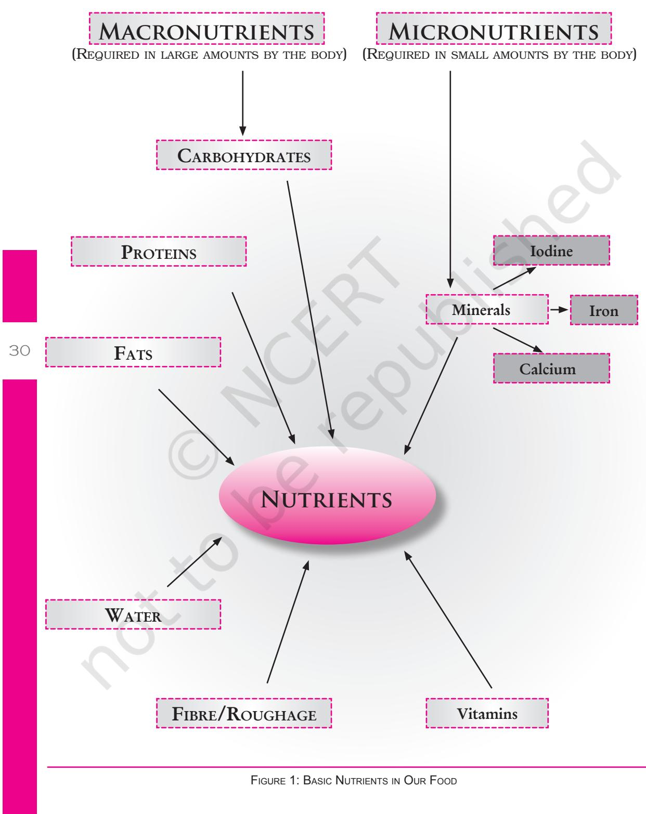
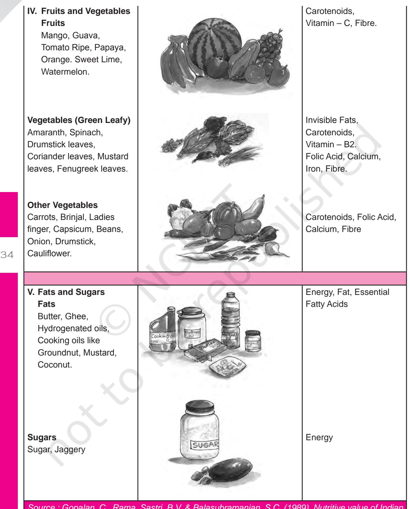
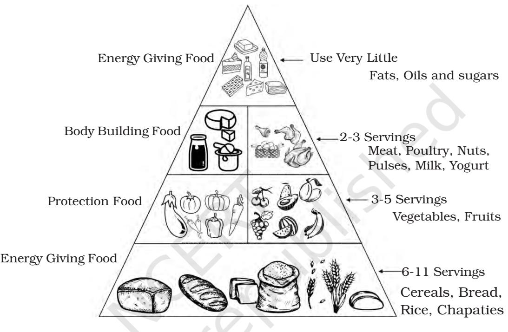

**3**

### Learning Objectives

28

After completing this chapter the learner will be able to —

- • define the terms food, nutrition, nutrients, health, fitness and the role of food and nutrition in maintaining health.
- • understand the term, balanced diet and apply the concept in planning and consuming diets.
- • understand the basis for defining the Recommended Dietary Allowances (RDAs) and the difference between Dietary Requirement and RDA.
- • understand the basis for classifications of foods into appropriate groups.
- • analyse the factors which influence adolescent food habits.
- • identify the causes, symptoms and nutritional interventions related to eating disorders.

# **3.1 Introduction**

The onset of adolescence brings with it many profound changes. The growth rate speeds up dramatically. This growth spurt occurs due to the activity of hormones that affect every organ of the body and this makes healthy eating very important. The nutrient needs rise throughout childhood, peak in adolescence and then level off or even diminish as the teenager becomes an adult. The saying ''You are what you eat" seems to be proven true. We eat different kinds of food such as *dal*, chapatti, bread, rice, vegetables, milk, *lassi,* etc. All these different kinds of food provide us with nutrients to keep us healthy and active. It is important to know what food to eat in order to stay healthy. The science of food and nutrients and their action on our health is called Nutrition.

Unit 1.indd 28 8/4/2022 2:50:43 PM

Nutrition and health, in fact, are two sides of the same coin. They are, therefore, inseparable. Health depends to a large extent on nutrition, and nutrition depends on the food intake. So food, is the most important single factor for health and fitness.

#### Let us define and describe food, nutrition, health and fitness

- • Food can be defined as anything solid or liquid which when swallowed, digestedandassimilatedinthebodyprovides itwithessential substances called nutrients and keeps it well. It is the basic necessity of life. Food supplies energy, enables growth and repair of tissues and organs. It also protects the body from disease and regulates body functions.
- • Nutrition is defined as the science of foods, nutrients and other substances they contain; and of their actions within the body including ingestion, digestion, absorption, metabolism and excretion. While this summarises the physiological dimensions, nutrition has social, psychological and economic dimensions too.
- • Nutrients are the constituents in food that must be supplied to the body in suitable amounts. These include carbohydrates, proteins, fats, minerals, vitamins, water and fibre. We need a wide range of nutrients to keep ourselves healthy. Most foods contain more than one nutrient such as milk has proteins, fats, etc. Nutrients can be classified as macronutrients and micronutrients on the basis of the required quantity to be consumed by us everyday. The figure on the next page shows us the distinction between macronutrients and micronutrients.

# **3.2 Balanced Diet**

A balanced dietis one which includes a variety of foods in adequate amounts and correct proportions to meet the day's requirements of all essential nutrients such as proteins, carbohydrates, fats, vitamins, minerals, water, and fibre. Such a diet helps to promote and preserve good health and also provides a safety margin or reserve of nutrients to withstand short durations of deprivation when they are not supplied by the diet.

The safety margin takes care of the days we fast, or the short-term deficiency of certain nutrients in the daily diet. If the balanced diet meets the Recommended Dietary Allowances (RDAs) for an individual, then the safety margin is already included since RDAs are formulated keeping extra allowances in mind.

#### Recommended Dietary Allowances = Requirements + Margin of safety

A balanced diet takes care of the following aspects.

- 1. Includes a variety of food items
- 2. Meets the RDA for all nutrients
- 3. Includes nutrients in correct proportions

29

Unit 1.indd 29 8/4/2022 2:50:43 PM

Unit 1.indd 30 8/4/2022 2:50:44 PM

- 4. Provides a safety margin for nutrients
- 5. Promotes and preserves good health
- 6. Maintains acceptable body weight for height

# **3.3 Health and Fitness**

According to World Health Organisation (WHO) ''Health is the state of complete physical, emotional, and social well-being, not merely the absence of diseases or infirmity.'' This definition has remained unchanged since 1948.

All of us wantto maintain positive health, i.e., a perfect blend of physical, social and mental. Taking adequate amounts of essential nutrients in our diet is necessary to maintain positive health.

Physical health is probably the most easily understood aspect. Mental health can be defined as a state of emotional and psychological well-being in which an individual is able to use her or his cognitive and emotional capabilities, function in society, and meet the ordinary demands of everyday life. In other words, the absence of a recognised mental disorder is not necessarily an indicator of mental health. One way to assess mental health is to see how effectively and successfully a person functions. Feeling capable and competent, being able to handle normal levels of stress, maintaining satisfying relationships, and leading an independent life; and being able to 'bounce back' or recover from difficult situations are all signs of good mental health.

Physical fitness is good bodily health; it is the result of regular exercise, proper diet and nutrition, and proper rest for physical recovery. The term physical fitness is used in two ways: general fitness (a state of health and well-being) and specific fitness (a task-oriented definition based on the ability to perform specific aspects of sports or occupations). Physical fitness is the capacity of the heart, blood vessels, lungs, and muscles to function at optimal efficiency. Earlier, fitness was defined as the capacity to carry out the day's activities without undue fatigue. Automation, increased leisure time, and changes in lifestyles following the Industrial Revolution meant that this criterion was no longer sufficient. In the present context, optimum efficiency is the key.

Physical fitness is now defined as the body's ability to function efficiently and effectively in work and leisure activities, to be healthy, to resist diseases and to meet emergency situations. Fitness can also be divided into five categories: aerobic fitness, muscular strength, muscular endurance, flexibility, and body composition. Being fit prepares one to meet mental and emotional challenges. One feels strong and energetic if one is fit. Fitness provides one with the ability to meet routine physical demands with enough reserve energy to rise to a sudden challenge, such as running to catch a bus.

Unit 1.indd 31 8/4/2022 2:50:44 PM

Thus, health is a state of complete mental, physical and social wellbeing whereas fitness is the ability to meet the demands of a physical task. A well-nourished and fit person is better able to learn and has more energy, stamina, and self-esteem. A healthy eating pattern along with regular exercise will certainly help to remain fit. Teenagers between the ages of 12 and 18 who have unhealthy eating behaviours and are undernourished develop eating disorders.

# **3.4 Using Basic Food Groups for Planning Balanced Diets**

One of the simplest ways to plan a balanced diet is to divide foods into groups and then make sure that each group is included in the meals. A food group consists of different foods which have common characteristics. These common features may be the source of food, the physiological function performed, or the nutrients present.

Foods can be grouped on the basis of the predominant nutrients present in them. This classification varies from one country to another depending on many factors. The five food group classification is used in India as a guide to meal planning. Many factors have been considered while compiling these groups such as availability of food, cost, meal pattern, and deficiency diseases prevalent. Not all foods in each group are equal in their nutrient content. That is why a variety of foods from each group should be included in the diet.

A classification based on nutrients present will ensure that all nutrients are made available to the body and offer greater variety within the group.

There are five basic food groups suggested by the Indian Council of Medical Research (ICMR). These include:

- • Cereals, grains and products
- • Pulses and legumes
- • Milk and meat products
- • Fruits and vegetables
- • Fats and sugars

**Activity 1**

List 10 foods that you commonly eat. Identify the food group to which each food belongs. Then list the macronutrients and micronutrients present in the foods listed. Identify the foods which are the richest sources of energy.

Unit 1.indd 32 8/4/2022 2:50:44 PM

The five food groups are summarised in the table below:

|  | Table 1: Five Food Groups |  |  |
| --- | --- | --- | --- |
|  | Food group | Main Nutrients |  |
|  |  | Supplied |  |
| I. | Cereals, Grains and | Energy, protein, Invisible |  |
|  | Products | fat, Vitamin – B1, Vitamin |  |
|  | Rice, Wheat, Ragi, | – B2, Folic Acid, Iron, |  |
|  | Bajra, Maize, Jowar, | Fibre |  |
|  | Barley, Rice flakes, |  |  |
|  | Wheat flour. |  |  |
|  | II. Pulses and Legumes | Energy, Protein, Invisible |  |
|  | Bengal gram, Black | fat, Vitamin – B1, |  |
|  | gram, Green gram, Red | Vitamin – B2, Folic Acid, |  |
|  | gram, Lentil (whole as | Calcium, Iron, Fibre. |  |
|  | well as dals) Cowpea, |  |  |
|  | Peas, Rajmah, |  |  |
|  | Soyabeans, Beans. |  | 33 |
|  | III.Milk, Meat and Products | Protein, Fat, Vitamin – |  |
|  | Milk Milk, Curd, Skimmed | B12, Calcium. |  |
|  | milk, Cheese |  |  |
|  | Meat Chicken, Liver, | Protein, Fat, |  |
|  | Fish, Egg, Meat. | Vitamin – B2 |  |

Unit 1.indd 33 8/4/2022 2:50:44 PM

*Source : Gopalan, C., Rama, Sastri, B.V. & Balasubramanian, S.C. (1989). Nutritive value of Indian foods. Hyderabad. National Institute of Nutrition, ICMR.*

Unit 1.indd 34 8/4/2022 2:50:45 PM

**Remember**

- **One gram of • carbohydrate releases 4 Kcal. of** 
	- **energy**
- **• protein releases 4 Kcal. of energy**
- **• fat releases 9 Kcal. of energy**

### Guidelines for using the basic food groups

The five food group system can be used both for planning and assessing balanced diets. It is a simple daily food guide which can be used for nutrition education as well. Guidelines could be adopted depending on the food groups.

- • Include at least one or a minimum number of servings from each food group in each meal.
- • Make choices within each group as foods within each group are similar but not identical in nutritive value.
- • If the meal is vegetarian, use suitable combinations to improve the overall protein quality of the diet. For example, serving cerealpulse combinations or including small quantities of milk or curds in the meal.
- • Include uncooked vegetables and fruits in the meals.
- • Include at least one serving of milk to ensure a supply of calcium and other nutrients as milk contains all nutrients except iron, vitamin C, and fibre.
- • Cereals should not supply more than 75 per cent of total Kcal/ Calories.

In planning balanced diets, food should be chosen from each group in sufficient quantity. Cereals and pulses should be taken adequately, fruits and vegetables liberally, animal foods moderately and oils and sugars sparingly.

Now let us look at the concept of the food guide pyramid.

Unit 1.indd 35 8/4/2022 2:50:45 PM

### Food Guide Pyramid

The following figure (Figure 2) illustrates the food guide pyramid for Indians.

Figure 2: Food Guide Pyramid

The food guide pyramid is a graphic depiction of the daily food guide. The illustration was designed to depict variety, moderation, and also proportions. The size of each section represents the number of daily servings recommended. The broad base at the bottom conveys the message that grains should be abundant and form the foundation of a healthy diet. Fruits and vegetables appear at the next level, showing that they have a less prominent, but still important place in the diet. Meats and milks appear in a smaller band near the top. A few servings of each can contribute valuable nutrients such as proteins, vitamins and minerals, without too much fat and cholesterol. Fats, oils and sweets occupy the tiny apex, indicating that they should be used sparingly.

Alcoholic beverages do not appear in the pyramid, but they too, if consumed, should be limited. Items such as spices, coffee, tea and diet soft drinks provide few, if any, nutrients, but can add flavour and pleasure to meals when used judiciously.

The daily food guide plan and food guide pyramid emphasise grains, vegetables, and fruits. These are all plant foods. Some 75 per cent of a

Unit 1.indd 36 8/4/2022 2:50:45 PM

day's servings should come from these three groups. This strategy helps all people obtain complex carbohydrates, fibre, vitamins, and minerals with little fat. It also makes diet planning for vegetarians easier.

# **3.5 Vegetarian Food Guide**

Vegetarian diets rely mainly on plant foods: grain, vegetables, legumes, fruits, seeds, and nuts. Some vegetarian diets include eggs, milk products, or both. People who do not eat meats or milk products can still use the daily food guide to create an adequate diet. The food groups are similar and the number of servings remains the same. Vegetarians can select alternatives to meat such as legumes, seeds, nuts, tofu and for those who eat them, eggs. Legumes, and at least one cup of dark leafy greens, help to supply the iron that meats usually provide. Vegetarians who do not drink cow's milk can use soy 'milk' – a product made from soyabeans that provides similar nutrients if it has been fortified with calcium, vitamin D, and Vitamin B12 (i.e., these nutrients are added).

The food guide pyramid emphasises foods from the five food groups shown in the three lower sections of the pyramid. Each of these food groups provides some, but not all of the nutrients you need. Foods in one group cannot replace those in another. No one food group is more important than another – for good health you need all of them.

The pyramid is an outline of what to eat each day. It is not a right prescription, but a general guide that lets you choose a healthful diet that is right for you. The pyramid calls for eating a variety of foods to get the nutrients you need, and at the same time, the right amount of Calories to maintain a healthy weight.

# **3.6 Dietary Patterns in Adolescence**

Healthy eating is vital for the teenager's health and well-being. The nutritional needs of adolescents vary tremendously, but generally increase due to rapid growth and changes in body composition that occur during puberty. Adequate nutrition is vital for ensuring overall emotional and physical health. Good eating habits help prevent chronic illness in the future, including obesity, heart disease, cancer and diabetes.

Studies of nutrient intakes have shown that adolescents are likely to obtain less vitamin A, thiamine, iron, and calcium than recommended. They also ingest (consume) more fat, sugar, protein, and sodium than is currently thought to be optimal.

While concern is often expressed over the habit of eating between meals, it has been shown that teenagers obtain substantial nourishment from foods eaten outside of the traditional meals. The choice of foods they make is of greater importance than the time or place of eating. Emphasis

Unit 1.indd 37 8/4/2022 2:50:45 PM

should be placed on fresh vegetables and fruits as well as whole-grain products to complement the foods high in energy value and protein that they commonly choose.

What are the commonly adopted eating habits of adolescents and why are they important to recognise? Understanding diet patterns will help us to be better prepared to evaluate the nutritional adequacy of diets and ensure thatthey are meeting the minimum requirements to maintain health and well-being. Among the more common eating idiosyncracies include skipping meals, consuming fast foods in a routine way, avoiding fruits and vegetables, snacking frequently and dieting. By addressing each of these issues individually you can ensure that you are meeting the minimum nutritional requirements.

Irregular meals and skipping meals: The numbers of meals teenagers miss and eat away from home increases from early adolescence to late adolescence, reflecting the growing need for independence and time away from home. The evening meal appears to be the most regularly eaten meal of the day. Girls are found to skip the evening meal, as well as breakfast and lunch, more often than boys. In some homes with limited resources, the adolescents may not even receive adequate number of meals or amounts, leading to nutrient deficiency.

Breakfast is frequently neglected and is omitted more often by teenagers and young adults under 25 years of age than by any other age groups in the population. A likely explanation as to why girls are more apt to miss breakfast than are boys is the pursuit of thinness and frequent attempts at dieting. Many teenage girls believe that they can control their weight by omitting breakfast or lunch. In fact, this approach is likely to accomplish just the opposite. By mid-morning or lunchtime they may be so hungry that they overcompensate for the "saved kilocalories." As a matter of fact, skipping breakfast can slow your metabolism contributing to weight gain and poor performance.

Snacking: Snacking is probably a survival technique for teens. Snacking does not have to be a bad habit. It can help maintain energy levels, particularly in active and growing adolescents. Many adolescents fail to eat three regular meals per day because of the 'skipping meal' factor. Thus snacking can actually be beneficial to ensure adequate intake of essential nutrients. However, surviving only on snacks is harmful to health.

Fast foods: Adolescents, particularly in urban areas, are more apt to eat fast food because it is convenient and typically a social affair, and they may believe it is the fashion of the day. Fast food is often packed with fat and "empty calories". We should make smart food choices even when visiting fast food restaurants. Table 2 provides important information about fast foods.

Dieting: Obesity is becoming a crucial problem among adolescents. Intervention is needed to maintain ideal body weight among the entire

Unit 1.indd 38 8/4/2022 2:50:45 PM

population. If this is not maintained, 80 per cent of them will stay overweight as adults. This can put them at risk for many medical problems, including diabetes, high blood pressure, high cholesterol and sleep apnea (a sleep disorder).

#### **Table 2: Nutritional Limitations of Fast Foods**

The following factors appear to be the major nutritional limitations of fast-food meals. **Calcium, riboflavin, vitamin A:** These essential nutrients are low unless milk or a milkshake is ordered.

**Folic acid, fibre:** There are few fast food sources of these key factors.

**Fat:** The percentage of energy from fat is high in many meal combinations.

**Sodium:** The sodium content of fast food meals is high, which is not desirable.

**Energy:** Common meal combinations contain excessive energy when compared with the amounts of other nutrients provided.

Although fast foods can contribute nutrients to the diet, they cannot completely meet the nutritional needs of teenagers. Both adolescents and health professionals should be aware that fast foods are acceptable nutritionally when they are consumed judiciously and as a part of a well-balanced diet. But when they become the mainstay of the diet there is cause for concern. A nutrient imbalance may not appear to be a problem until a number of years have gone by, unless some specific problem such as a chronic disease exists. However, evidence is accumulating to show that food intake patterns of teenagers affect their health in later life.

However, adolescents with normal weight often diet because of the perception that "thin is in". Girls are bombarded with messages from the media aboutthinness,images ofwhatis considered a beautiful body, andways to achieve a lower body-weight. The images, in the context of a society that places a high value on physical beauty, sends mixed messages to teenagers and may result in unhealthy, unnecessary attempts to lose weight.

Dieting unsupervised by experts can lead to dangerous outcomes including eating disorders in teens. Some symptoms of dieting include: skipping meals, 'binge' eating, fasting or use of laxatives or diet pills. Consequences of such dieting include its possible association with cycles of weight loss and regain that increase the likelihood of developing eating disorders and obesity, lowered self-esteem and other psychological problems. This can lead to increased cardiovascular risk (heart problems) and possible mortality.

One approach to overcome the problems related to dieting is to attempt to eliminate the term 'diet' and replace it with 'healthy eating'. If you regularly incorporate healthy lifestyle and dietary practices into your life, you are less likely to diet on a consistent basis. Recognising good eating habits is the first step towards encouraging healthy diets. It is best to adopt a healthy lifestyle that incorporates sound eating habits and regular exercise.

Unit 1.indd 39 8/4/2022 2:50:45 PM

# **3.7 Modifying diet related behaviour**

As you have read in the chapter on 'Self ', adolescence is a time when an individual begins to question authority and tries to establish her/his status. Eating behaviour is one of the mediums through which individuality may be expressed by adolescents. Thus, rejection of routine home food (which may be healthy) and eating outside (not so healthy), sometimes in order to conform to peer preferences, is not uncommon in adolescence.

It is easier for us to change lifestyle and diet patterns if we are convinced that we want to do so. What are the ways in which adolescents can modify their own behaviour? The next section tells us more about how to adopt healthy dietary practices.

Limiting television viewing: Television viewing should be limited to about one or two hours each day (this includes playing video games or using the computer). Watching television does not use up many Calories and it encourages eating erratically, since it is common to eat while watching TV. Overeating and under-eating is common among those who do it.

Healthy eating habits: Eat three balanced meals of average size each day, plus two nutritious snacks. One must try not to skip meals.

Snacks: Snacks should be limited to two each day and they can include low calorie foods, such as raw fruits or vegetables. Avoid using high calorie or high fat foods for snacks, especially potato chips, biscuits and fried foods. Of course, favourite snacks can be consumed once in a while, but this should not be made a habit.

Drinking water: Drinking four to six glasses of water each day, especially before meals is a good habit. Water has no calories and it will create a feeling of fullness. Avoid drinking soft drinks and fruit juices too frequently, as they are high in energy (150-170 calories per serving).

Diet journal: It helps to keep a weekly journal of food and beverage intake and also of the amount of time that is spent in watching television, playing video games and exercising. Recording body weight each week is a good practice.

Exercise: This is essential for healthy life. Participating in extracurricular activities such as sports helps to keep activity levels high.

Some tips to increase physical activities include:

- • Walk or ride a bicycle for short distances.
- • Use stairs instead of elevators in a building.
- • Do regular exercise for 20-30 minutes, 3-4 times each week. This can include walking, jogging, swimming or bike riding. Playing games and sports, such as skipping rope, hockey, basketball, volleyball, or football, and doing yoga are also advisable at all ages.

Substance use and abuse: Substance use and abuse in adolescence is a public health problem of major significance and concern. The substances

Unit 1.indd 40 8/4/2022 2:50:45 PM

most widely abused by adolescents are tobacco, alcohol, and marijuana and other addictive drugs. The abuse of drugs and alcohol has a harmful effect on the nutrition and health status of adolescents. Nutrition intervention, support, and counselling would play a major role in the physical and psychosocial rehabilitation process.

Much of what we have discussed may be more relevant for adolescents in urban and semi-urban areas. Rural environments would be different. Rural girls and boys are often engaged in agricultural tasks. They may also be helping their parents in enterprises such as poultry-keeping, cattlerearing and bee-keeping. Boys may be helping in farming. Girls also help in looking after their younger siblings as well as cooking and cleaning while their parents earn livelihood. Then there are the tasks of collecting fodder for the cattle, firewood and water. In tribal areas many people are dependent on forest products like berries, flowers, leaves, roots. They spend time gathering and processing these products.

Girls and boys doing these tasks will have high activity levels and therefore, their energy needs will be higher. Protein needs are also higher due to the high growth rate at adolescence. The chances of adolescents being malnourished are, therefore, very high in rural areas among the poorer communities. Girls in particular are known to be anaemic (low iron in blood) and require iron rich foods to be healthy. Adolescents from rich families in rural areas would face many of the same problems as those in urban areas in the higher income groups. They would tend to be sedentary and enjoy rich food having plenty of fat and carbohydrate.

#### **Adolescence and Anaemia**

Anemia afflicts an estimated two billion people worldwide, mostly due to iron deficiency. It primarily affects women and girls. The latest National Family Health Survey-3 (NFHS-3) conducted in 2005-06 has revealed that 56 per cent of adolescent girls are anaemic as compared to 30 per cent of adolescent boys. Compare this with the figure of 70 per cent for young children in the age range 6-59 months. It has also been found that the incidence of anaemia is actually increasing when compared to the last survey conducted in 1991-92.

 The prevalence of anemia is disproportionately high in developing countries like India, due to poverty, inadequate diet, certain diseases, repetitive pregnancy and lactation, and poor access to health services.

 Adolescence is an opportune time for interventions to address anaemia. In addition to growth needs, girls need to improve iron status before pregnancy. Both boys and girls have access to information about anaemia through schools, recreational activities and via the mass media. This can be used effectively to transmit messages about iron-rich foods and iron supplements where necessary.

Unit 1.indd 41 8/4/2022 2:50:45 PM

- • Social-economic-political system
- • Food availability, production, and distribution system

#### External factors

- • Family unit and family characteristics
- • Parenting practices
- • Peers
- • Social and cultural
- • Norms and values
- • Mass media
- • Fast foods
- • Food fads
- • Nutrition knowledge
- • Personal experiences
- Internal factors
- • Physiological needs and characteristics
- • Body image and self-concept
- • Personal values and beliefs
- • Food preferences and meanings
- • Psychosocial development
- • Health

Individual food behaviour

Life-style

Unit 1.indd 42 8/4/2022 2:50:45 PM

42

# **3.8 Factors influencing eating behaviour**

By the time a person reaches adolescence the influences on eating habits are numerous and the formation of those habits is extremely complex, as shown in Figure 3. The growing independence of adolescents, increased participation in social life, and a generally busy schedule of activities have a definite impact on what they eat. They are beginning to buy and prepare more food for themselves and they often eat rapidly and away from home.

In order to encourage adolescents to form reasonably healthy eating habits parents should give their children the opportunity to choose from a range of nourishing foods as they are growing up. By the time they are teenagers they will need some freedom to use the kitchen; this is true for boys as well as for girls.

While the basic foundation for eating habits is found in the family, many influences on eating behaviour originate outside the home. The influence of peers can be a useful source of support, as well as a source of stress for the adolescent. Peer influence and support can be helpful for overweight teenagers, although the same peers can also target such adolescents for teasing.

Teenagers are very vulnerable to advertising messages. Television food commercials and eating habits portrayed in programme content have influenced people for more than a decade. The majority of advertisements are for products with a high concentration of sweetness and fat. Hence, adolescents have to be discerning while consuming such food products.

The ease of obtaining food that is ready to eat also influences the eating habits of teenagers. Through home delivery/vending machines, at movies, melas and sporting events, at fast-food outlets and convenience groceries, food is available at numerous times throughout the day. Hence, adolescents may eat more often as well as more of not-so-healthy food stuffs. Watching this tendency is advisable.

# **3.9 Eating disorders at adolescence**

Adolescence is associated with rapid physical growth and body-image development eating disorders are of special concern at this time. These changes intensify associated self-esteem problems. Anorexia nervosa, for example, is a disorder so tied to body image distortion that it is most commonly seen in adolescence, the period when a person is struggling with self-identity and most vulnerable to body image problems. Progress in adopting a normal adult body image will be interrupted for the teenager with an eating disorder.

Unit 1.indd 43 8/4/2022 2:50:46 PM

To understand anorexia nervosa let us take the example of Sonam. She aspires to have a perfect body. She has been ignoring the advice of her parents and teachers and almost stopped eating. She has become obsessed with having a very thin body. Although her current weight is normal, she feels pressured to be "ideally" thin like some actresses in movies or models in magazines. She has a low self-esteem and remains depressed, and this has resulted in her withdrawing from her family and friends. She is unaware that she is undernourished and insists that she is fat. She is a clear case of the eating disorder called anorexia nervosa. She is unaware that drastic loss of weight can even lead to death.

Bulimia is another type of eating disorder. Bulimia often begins in late adolescence or early adulthood after a series of various unsuccessful weight reduction diets. Those with bulimia indulge in bingeing (overeating) and inducing purging by vomiting or using laxatives. Although more common in females, about five to ten per cent of all eating disorders occur in males too.

Anorexia and bulimia can have serious consequences such as convulsions, renal failure, irregular heartbeats and dental erosion. In adolescent girls, anorexia can delay the onset of menstruation, permanently minimise stature and result in osteoporosis (weakening of bones).

Perhaps a person's best defense against these disorders is to learn to appreciate one's uniqueness. Respecting and valuing oneself will certainly be life saving. Important dietary interventions include ensuring balanced diets, enhancing dietary fibre intake and using nutrient/food supplements to make up losses.

To sum up, physical, social and emotional changes experienced during adolescence can profoundly impact the adolescent's nutritional status and eating patterns. Although young people are rarely motivated to learn about nutrition for the sake of longevity, learning how to apply sound dietary principles to reach our health goals can help build the foundation to a healthier life, now and in the future.

Health is a key resource of young people; it influences the availability and use of other resources that are important in everyday life. What are the other resources that an individual has? The following chapter on Management of Resources addresses this question and also discusses how best one can utilise and manage key resources such as time, energy and money.

**Key terms and their meaning**

#### **Activity level**

Level of activity of a person, i.e., sedentary or light, moderate, and heavy. This is closely related to one's occupation.

Unit 1.indd 44 8/4/2022 2:50:46 PM

### **Balanced diet**

A diet which includes a variety of foods in adequate amounts and correct proportions to supply all essential nutrients which promote and preserve good health.

### **Food group**

A number of foods sharing common characteristics which are grouped together. Characteristic for grouping may be function, nutrient, or source.

### **Lactation**

The period when the mother nurses her infant.

### **Physiological state**

State when nutrient needs increase because of normal physiological events such as pregnancy and lactation.

### **Recommended Dietary Allowances**

Allowances of nutrients which cover the needs of practically all healthy individuals. These are not requirements for any individual but guidelines which tell us the amount of nutrients to be consumed daily.

### Review Questions

- 1. Differentiate between the terms RDA and requirement.
- 2. Explain how the use of food groups simplifies planning of balanced meals.
- 3. List 10 foods which belong to the protective food group, stating reasons for your choice.
- 4. Discuss the factors that influence eating behaviour at adolescence.
- 5. Explain the two eating disorders that may arise at adolescence. What would be the best way to prevent their occurrence?

### Practical 3

### **Food, Nutrition, Health and Fitness**

- 1. List 10 signs of good health. Evaluate yourself using the following format.

| Signs of good health | Rating of yourself |  |  |
| --- | --- | --- | --- |
|  | Satisfactory | Normal | Below normal |
| 1. |  |  |  |
| 2. |  |  |  |
| 3. |  |  |  |

45

Unit 1.indd 45 8/4/2022 2:50:46 PM

| 4. |
| --- |
| 5. |
| 6. |
| 7. |
| 8. |
| 9. |
| 10. |

- 2. Record your diet for a day. Evaluate each meal in terms of inclusion of the five food groups. Do you think the diet is balanced? Use the following format to write your response.

| Meal/menu | Inclusion of five food | Comment on whether meal |
| --- | --- | --- |
|  | groups | is balanced/not balanced |

- 3. Interview members of your family such as your grandmother, mother or aunt to collect information about—
	- (a) food taboos giving reasons why the taboos are followed.
	- (b) food practices during fasting and festivity from the region of India to which you belong.
	- (c) preparations during fasting.

Tabulate the information as follows.

| Region | Occasion (nature | Preparation | Nutrients present |
| --- | --- | --- | --- |
|  | of fast) |  |  |

Give two inferences on the basis of the information tabulated.

46

Unit 1.indd 46 8/4/2022 2:50:46 PM

