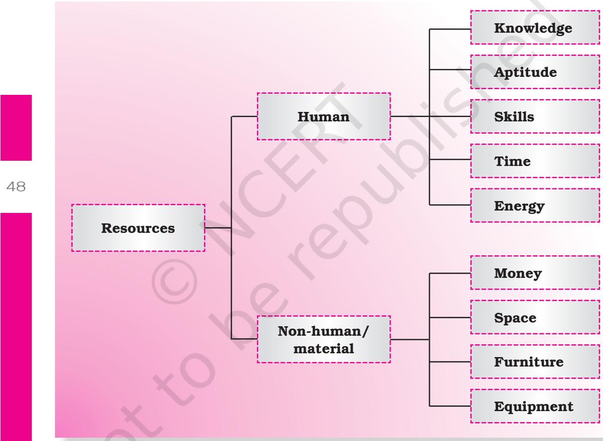
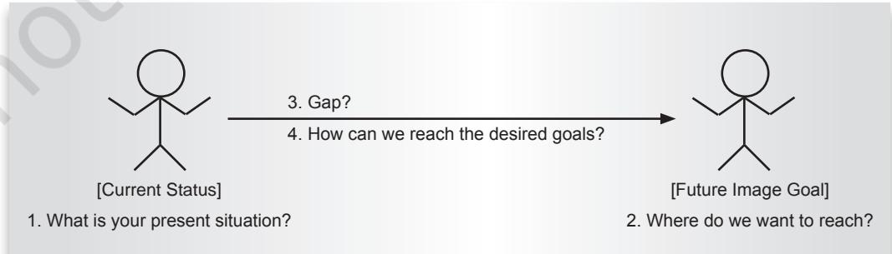

47

# Management of **4** Resources

### Learning Objectives

After completing this chapter the learner is able to

- • discuss the concept of a resource.
- • identify various resources.
- • classify resources into human and non-human.
- • describe the characteristics of resources.
- • explain the need for managing resources.
- • analyse the management process.

## **4.1 Introduction**

Everyday we carry out various activities. Think of any activity you do and you will find that to complete that activity you need one or more of the following.

- • Time
- • Energy
- • Money for purchasing required material
- • Knowledge
- • Interest/Motivation
- • Skills/Strengths/Aptitude
- • Material goods like paper, pen, pencil, colours, etc.
- • Water, air
- • School building

All these – time, energy, money, knowledge, interest, skills, materials – are resources. Resources are anything which we make use of while carrying out any activity. They help us in accomplishing our goals. You may need more of a certain resource for a particular activity as compared

Unit 1.indd 47 8/4/2022 2:50:48 PM

to other resources. In the previous chapter, you have learnt about your own strengths. These are your resources.

Anything which is not used by us is not a resource. For example, a bicycle which has not been used for long and is just lying at your place may not be a resource for you. However, it may be a resource to someone else.

If you re-look at the list of resources above, you will find that resources can be classified as–

- • Human resources
- • Non Resources-human resources or material goods

#### Resources

Resources can be classified in different ways.

- • Human/non-human resources
- • Individual/shared resources
- • Natural/community resources

We will read about each of these classifications.

Unit 1.indd 48 8/4/2022 2:50:48 PM

#### Human and Non-human Resources

#### Human Resources

Human resources are central to carrying out any activity. These resources can be developed through training and self-development. For example, knowledge regarding any field/task can be acquired, skill may developed which will help you to develop aptitude. Let us read about human resources in detail.

- (a) *Knowledge* It is a resource one uses throughout one's life and is a pre-requisite for carrying out any activity successfully. A cook must have knowledge of how to operate cooking gas or *chullah* before she/he starts preparing food. A teacher who does not have thorough knowledge of her/his subject, cannot become an effective teacher. One needs to be open to acquiring knowledge throughout one's life.
- (b) *Motivation/Interest:* There is a common saying, 'Where there is a will there is a way'. This indicates that to accomplish any task, the worker must be motivated and interested in doing it. For example, if a student is not interested in learning a task, even when other resources are available, she/he still may give excuses and not finish the task. We may pursue dance, painting, reading fiction, art and craft and other hobbies as per our motivation.
- (c) *Skills/Strength/Aptitude:* All individuals may not be skilled in performing all activities. Each one of us has an aptitude in certain areas. We can therefore carry out activities in these areas better as compared to others. For example, pickles and chutney prepared by different individuals will taste different depending upon their skill. However, we can acquire skills we do not have through learning and training.
- (d) *Time:* It is a resource available to everyone equally. There are 24 hours in a day and every one spends it in her/his own way. Time once lost cannot be regained. Hence, it is the most valuable resource. Managing time in a specific period and attaining the goal is very important. We need to continuously plan and be able to utilise the available time to finish the desired task.

 Time can be thought of in terms of three dimensions — work time, non-work time, rest and leisure time. We need to learn and balance time across these three dimensions in order to be able to accomplish one's goals. When one learns to balance all the three dimensions, it helps the individual to be physically fit, emotionally strong and intellectually alert. You should be aware of the peak periods when you are best able to work and use this precious resource effectively to accomplish your goals.

- (e) *Energy:* For sustaining individual growth and physical output, energy is essential. Energy levels vary from person to person, according to their physical fitness, mental condition, personality, age, family background
49

Unit 1.indd 49 8/4/2022 2:50:48 PM

and their standard of living. To conserve energy and to use it most effectively, one must carefully think and plan through the activity so that one can complete the task efficiently.

#### Non-human Resources

- (a) *Money*: We all require this resource but it is not equally distributed among us – some have less of this resource as compared to others. We need to remember that money is a limited resource and must be spent judiciously to fulfil our requirements.
- (b) *Material Resources:* Space, furniture, clothes, stationery, food items, etc., are some of the material resources. We require these resources to carry out activities.

#### Individual and Shared Resources

- (a) Individual Resources: These are resources which are available to an individual for personal use only. These can be human or non-human resources. Your own skills, knowledge, time, your school bag, your clothes are some of the examples of individual resources.
- (b) Shared resources: These are resources which are available to many members of the community/society. Shared resources can be natural or community based.

#### Natural and Community Resources

- (a) Natural Resources: Resources available in nature, like water, mountains, air, etc., are natural resources. These are available to all of us. In order to protect our environment, each one of us has the responsibility of judiciously using these resources.
- (b) Community Resources: These resources are available to an individual as a member of community/society. These are generally provided by government. These may be human or non-human. Consultancy provided by government hospitals, doctors, roads, parks and post offices are some examples of community resources. Every individual must strive to optimally use these resources and feel responsible in maintaining them.

#### Characteristics of Resources

Though we can categorise resources in various ways, they also have certain similarities. The following are some characteristics of resources.

- (i) Utility : 'Utility' means the importance or usefulness of a resource in helping one to achieve a goal. Whether or not a resource has utility

50

Unit 1.indd 50 8/4/2022 2:50:48 PM

#### **Activity 1**

Think of your own self and make a list of the human resources you have. Use the following guidelines to reflect on this.

- Knowledge which areas are you knowledgeable about
- Motivation/interest what activities do you enjoy doing most
- Skills/strengths/aptitude what are you particularly good at doing
- Time which periods of the day are you most active
- Energy Do you largely feel energetic or tasteless/tired?

depends on the goal and the situation. For example, cow dung is considered waste. However, it can be used as a fuel and can also be used to prepare humus (manure). Proper use of important resources available to a family or community leads to greater satisfaction.

- (ii) Accessibility : First, certain resources are more easily available as compared to others. Second, resources may be more easily available to some people as compared to others. Third, the availability of resources changes over time. Thus, we can say that accessibility of resources varies from person to person and from time to time. For example, every family has money as a resource. While some have sufficient money to meet their needs, others have limited budgets. The amount of available money is also different during the beginning of a month as compared to towards the end of the month.
- (iii) Interchangeability : Almost all the resources have substitutes. If one resource is not available, it can be substituted by another. For example, if your school bus does not arrive on time to pick you up, you can go to school in your car, tractor, bullock cart or scooter. Thus, the same function can be performed by a number of resources.
- (iv) Manageable : Resources can be managed. Since resources are limited, they should be managed properly and effectively for their optimum utilisation. Resources should be used in such a way that we attain maximum output with minimum input of resources. For example, we should avoid using two-three buckets of water to wash clothes if we can wash them using one bucket.

#### Managing Resources

It is important to note that none of the resources are unlimited. All resources are finite. We need to utilise resources effectively to achieve our goals faster and efficiently. Resources, therefore, should not be misused and wasted. Thus, to achieve our goals, effective management of resources is extremely essential.

Unit 1.indd 51 8/4/2022 2:50:49 PM

Managing resources is about getting the most from the resources which are available to us. For example, everybody has 24 hours in a day. While some plan their schedule everyday and utilise every hour to achieve their goals, others waste their time and are not able to do anything productive the entire day.

Management of resources involves implementing resource management procedures which include planning, organising, implementing, controlling and evaluation. We will read about these in detail in the following section.

#### The Management Process

As stated above, the management process involves five aspects – planning, organising, implementing, controlling and evaluation.

- (a) Planning: It is the first step in any management process. It helps us to visualise the path to reach our goals. In other words, to plan is to produce a scheme for action to achieve specified goals by using the available resources.
 Planning involves selecting the course of action. To plan effectively to achieve a goal, you must ask the following four basic questions. The answers to these questions will help you to develop a plan.

- 1. What is our present situation? This involves assessing the present situation, analysing what one has at present and what one would like to have in future.
- 2. Where do we want to reach? This involves setting specific goals or targets which we desire to achieve keeping in mind the present and future needs.
- 3. Gap. This is the difference between our present situation and the desired situation. We need to cover this gap in order to achieve our goal.
- 4. How can we reach our desired goals? Answering this question will help you to decide how to cover this gap. This involves making a plan to achieve goals.

52

Unit 1.indd 52 8/4/2022 2:50:49 PM

- *• Steps in planning : The basic steps in planning are–*
	- 1. Identifying the problem
	- 2. Identifying different alternatives
	- 3. Choosing between alternatives
	- 4. Acting to carry out the plan/Putting the plan into action
	- 5. Accepting the consequences

 For example,there is only one monthleftfor your annual examination and you have not completed your revision (present situation); your aim is to score good marks (goal). To achieve this goal you need to study five subjects in the specified time period (gap). You would think of a way of achieving this goal (prepare a plan of action), which will include the number of hours you will devote to each subject, prioritising subjects, curtailing other activities and so on.

List the resources you would need in order to secure good marks and study well. Compare your list with others. _____________________________________________________________________ _____________________________________________________________________ _____________________________________________________________________ _____________________________________________________________________ _____________________________________________________________________ **Activity 2**

- (b) Organising: It is collecting and arranging appropriate resources in order to implement plans in an effective and efficient manner. If we take the above example, you would organise and arrange all the resources which you may require to study and secure good marks.
Some resources could include books, notes, space to study, light, stationery, energy and time.

- (c) Implementing: This stage involves carrying out the prepared plan. In the above example, you would put the plan into action by starting to study from the available resources (e.g., books, stationary, notes, etc.).
- (d) Controlling: It refers to the task of ensuring that your activities are producing the desired results. In other words, the plan you have put into action is getting the desired results. Controlling helps monitor the outcome of activities and makes sure that the plans are being implemented correctly. It is important as it provides feedback and helps to check errors. Feedback helps you to revise your plan of action so you can achieve your goal. Therefore, while you are putting your study

53

Unit 1.indd 53 8/4/2022 2:50:49 PM

plan into action, yet you are unable to complete your allotted chapter because you watch television, this gives you the feedback that you need to minimise your distractions. You will not watch T.V., play or chat with friends during the study hours, as it can affect the outcome of your formulated plan (i.e., study as per the decided number of study hours).

- (e) Evaluation: In the final stage, the outcomes that you have arrived at after putting your plan into action are evaluated. The end result of the task is compared with the desired result. All the limitations and the strengths of the task are noted so that they can be used in future to achieve one's goals effectively. With reference to the example of studying, evaluation is what you do when you get back the checked answer sheets of the examination. You evaluate your marked answer sheets as per the preparation you had done for the examination and the results you had wanted to achieve. If the scores for any subject fall short of your expectations, you try to identify the reasons for the same. At the same time, you also try to find out your strengths which helped you to secure good marks in other subjects. Then you use these strengths to overcome your limitations to secure better marks in your next examination.
In addition to the different resources discussed in this chapter, there are some other non-human resources that form an integral part of our daily living. One such resource is fabrics. The following chapter tells us about the various fabrics that we come into contact with and their properties.

#### **Key Terms**

Resources, Human Resources, Non-human resources, Planning, Organising, Implementing, Controlling, Evaluation

Unit 1.indd 54 8/4/2022 2:50:49 PM

## **Activity 3**

You wish to arrange a farewell party for Class XII students. Identify your resources and state the aspects you will keep in mind at each stage of the management process in organising the party.

|  |  |  | Farewell Party for Class XII Students |  |  |  |
| --- | --- | --- | --- | --- | --- | --- |
| S.No. | Resources | Planning | Organising | Implem | Controlling | Evaluation |
|  | Available |  |  | entation |  |  |
| 1. | Human – | Venue? | Division | (i) Decor | Checking if | Assess if |
|  | Non-human | Menu? | of respon | ating the | the decor | the venue is |
|  |  |  | sibility | venue? | ation is being | looking good |
|  |  |  |  | (ii) Keeping food | done as per the plan? | or not? |
|  |  |  |  | ready? |  |  |
| 2. |  |  |  |  |  |  |
| 3. |  |  |  |  |  |  |
|  |  |  |  |  |  | 55 |
| 4. |  |  |  |  |  |  |
| 5. |  |  |  |  |  |  |
| 6. |  |  |  |  |  |  |
| 7. |  |  |  |  |  |  |

## Review Questions

- 1. Define a resource.
- 2. Classify resources in three different ways giving the definition of each resource and two examples of each.
- 3. Why should resources be managed?
- 4. Explain the steps in the management process, using one example to clarify each step.

Unit 1.indd 55 8/4/2022 2:50:49 PM

## Practical 4

#### **Management of Resources – Time, Money, Energy and Space**

(A) Record your day's activity from 6.00 a.m. onwards

|
|  |

56

(B) Only one week is left for the annual examination. Prepare a time plan indicating the number of study hours for each day. An example is given for Monday.

| Day | Hours |  |  |  |  |  |  |  |  |  |  |  |  |  |  |  |
| --- | --- | --- | --- | --- | --- | --- | --- | --- | --- | --- | --- | --- | --- | --- | --- | --- |
|  | 7-8 | 8-9 | 9-10 | 10- | 11-12 | 12-1 | 1-2 | 2-3 | 3-4 | 4-5 | 5-6 | 6-7 | 7-8 | 9-10 | 10-11 | 11-on |
|  |  |  |  | 11 |  |  |  |  |  |  |  |  |  |  |  | wards |
| Mon | Science |  | Maths |  | Break | Revise | Lunch | Social |  | Sleep | English |  | Hindi | Revise | Dinner | Sleep |
|  | Chapter 3 |  | Chapter |  |  | Science |  | Science |  |  | Chapter |  | Chapter |  |  |  |
|  |  |  | 4, 5 |  |  |  |  | Chapter 3 |  |  | 5, 6 |  | 4 |  |  |  |
| Tue |  |  |  |  |  |  |  |  |  |  |  |  |  |  |  |  |
| Wed |  |  |  |  |  |  |  |  |  |  |  |  |  |  |  |  |
| Thu |  |  |  |  |  |  |  |  |  |  |  |  |  |  |  |  |
| Fri |  |  |  |  |  |  |  |  |  |  |  |  |  |  |  |  |
| Sat |  |  |  |  |  |  |  |  |  |  |  |  |  |  |  |  |
| Sun |  |  |  |  |  |  |  |  |  |  |  |  |  |  |  |  |

Unit 1.indd 56 8/4/2022 2:50:49 PM

