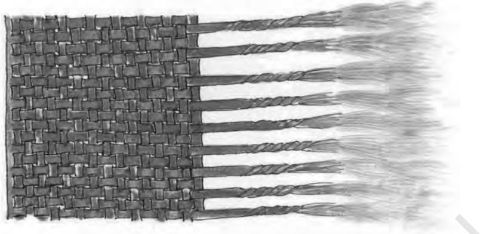
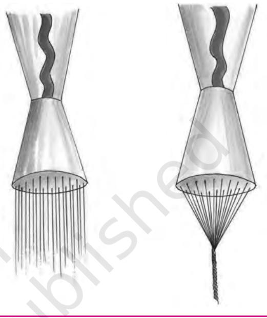
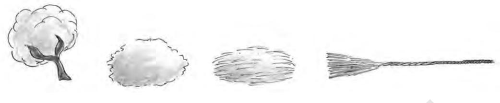
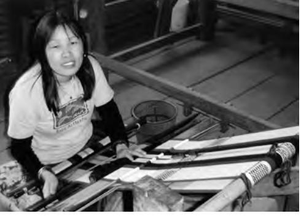
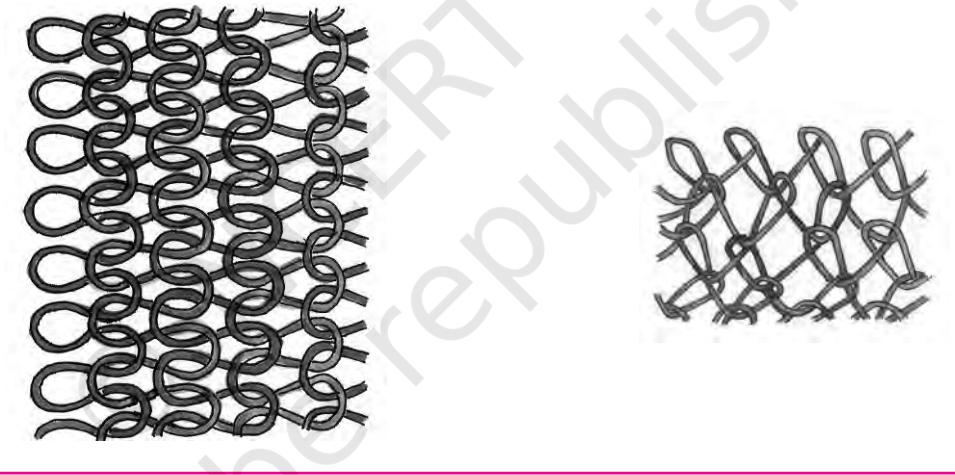

57

# Fabrics **5** Around Us

## Learning Objectives

After completing this chapter the learner will be able to —

- • discuss the diversity in fabrics.
- • name and classify the fabrics commonly seen around.
- • explain the concept of yarn and fabric making.
- • describe the properties of each group of fabrics.
- • make informed selection of textile products for specific end use.

# **5.1 Introduction**

Fabrics are all around us. They are an important part in our lives. Fabrics give comfort and warmth, bring colour and decorative style, and add texture. Just think of a day's activity and recall how fabrics touch you. When you wake up from your bed, the bedsheets and pillow covers are fabrics. As you get ready for school the towel you use after bath is a soft and absorbent fabric, and the school dress you wear is again a fabric of a special type. The school bag in which you carry your books and other items is also a fabric, but again different in texture. It may be slightly stiff and coarse but strong enough to bear the load. If you observe your home you will find fabrics in almost all places, from curtains to kitchen dusters, floor mops and *durries*. Fabrics are of different kinds, weights and thickness and their choice is related to their end use.

If you take a typical fabric in hand, and unravel it, you may be able to pull out the thread like structures from it. These may be interlaced with each other at right angles or interlooped as in your woollen cardigan or T shirts, or knotted as in nets and laces. These are called yarns. If you try to untwist the yarn you will see very tiny and fine hair like structures.

Unit 1.indd 57 8/4/2022 2:50:51 PM

Figure1: Fabric to Fibre

These are called fibres. Thus fibres are the basic building blocks of fabrics. All these materials — fibres, yarns and fabrics are called textile products or simply textiles. After the fabric is ready it may be subjected to further processing which may improve its appearance (cleaning, whitening, colouring) or make it more lustrous or improve its touch and feel qualities or improve its service ability. This is called finishing. A large variety of fabrics are available in the market these days and each one behaves differently when in use. The behaviour of the fabric in use and in care and maintenance depends on various factors such as type of fibre, yarn, fabric and finishing.

## **Activity 1**

Collect different kinds of fabric samples from home, a tailor's shop, a cloth shop or friends. Name each fabric.

# **5.2 Fibre properties**

58

The properties of fibre contribute to the properties of the final fabric. For a fibre to be really important anduseful, it must be available inlarge quantities and be economical. The most essential property is its spinnability, i.e., a characteristic which is essential for ease of conversion into yarn and later into fabric. It is the sum together of properties such as length, strength, flexibility and surface structure of the fibre. From the point of view of consumer satisfaction, properties such as colour, luster, weight, moisture and dye absorption and elasticity are desired. Factors that affect care and maintenance of the fabric such as abrasion resistance, effect of chemicals, soaps and detergents, effect of heat, and resistance to biological organism are also important to the user.

Unit 1.indd 58 8/4/2022 2:50:52 PM

# **5.3 Classification of textile fibres**

Textile fibres can be classified on the basis of their origin (natural or man-made or manufactured), general chemical type (cellulosic, protein or synthetic), generic types (animal hair or animal secretion) and common trade name (polyester, as terene or dacron). Further, fibres can be staple, i.e., short length like cotton, or filament, i.e., long length like silk, polyester, etc.

## Natural Fibres

Natural fibres are those which are available to us in nature. There are four types of natural fibres.

#### *(a) Cellulosic fibres—*

- 1. Seed hair-cotton, kapok
- 2. Bast fibres-flax(linen), hemp, jute
- 3. Leaf fibres-pineapple, agave(*sisal*)
- 4. Nut husk fibres-coir(coconut)
- *(b) Protein fibres*
- 1. Animal hair–wool, specially hair (goat, camel), fur
- 2. Animal secretion–silk
- *(c) Mineral fibre: Asbestos*
- *(d) Natural rubber*

Manufactured Fibres (also called man-made fibres)

Most of you must have seen a cotton flower with fibres sticking to the seeds, or sheep with long overgrown hair. You can also imagine how these may be used for yarn and fabric production. However, you may find it difficult to understand how the manufactured or synthetic fibres came to exist.

The first manufactured fibre–Rayon–was commercially produced in AD 1895, while most others are products of the 20th century.

The concept of creating fibres perhaps originated from human desire to produce a fibre like silk. Possibly, the thought process could have been like this: the silk worm, which basically feeds on mulberry leaves, digests them and spews a liquid through its spinnerettes (two holes), which on solidifying becomes the silk filament (cocoon). Thus if a cellulose substance is digested it should be possible to produce something like silk. Therefore for a long time the rayons were referred to as Artificial Silk or simply Art Silk.

The earliest manufactured fibres were made by modifying a non-fibrous material into a fibrous form. These were mainly from cellulosic substances 59

Unit 1.indd 59 8/4/2022 2:50:52 PM

like cotton waste or wood pulp. The second group of fibres were synthesised completely from use of chemicals. Whatever may be the raw material the basic steps for converting it into a fibrous form are the same.

- • The solid raw materials are converted into a liquid form of a specific viscosity. This may be due to a chemical action, dissolution, heat application or a combination action. This is called the spinning solution.
- • This solution is passed through a spinnerette – a small thimble shaped nozzle with a series of very small holes, into an atmosphere which hardens it or coagulates it into fine filaments.
- • As the filaments harden they are collected and stretched for further fineness and orientation or subjected to further processing like texurisation to improve its stretch and/or bulk characteristics.

Figure 2: Spinnerettes

## Types of Manufactured Fibres

- (a) Regenerated cellulosic fibres: Rayon–cuprammonium, viscose, highwet-modulus
- (b) Modified cellulosic: Acetate–secondary acetate, triacetate
- (c) Protein fibres: Azlon
- (d) Non-cellulosic(synthetic) fibres
- (i) nylon
- (ii) polyester terelene, terrene
- (iii) acrylic Orlon, cashmilon
- (iv) modacrylic
- (v) spandex
- (vi) rubber

#### (e) Mineral fibres

- (i) Glass fibreglass
- (ii) Metallic lurex

Unit 1.indd 60 8/4/2022 2:50:52 PM

60

# **5.4 Yarns**

The textiles in the form of fibres cannot always be used for consumer products except in products like surgical cotton, stuffing for pillows, quilts, mattresses and cushions. To convert fibres into fabric form as we see around us, they have to be converted into a continuous strand. Although there are some fabrics like felts or non-wovens which are made directly from fibres, in most cases the fibres are processed to an intermediate stage called yarn.

Yarn can be defined as a continuous strand of textile fibres, filaments or material in a form suitable for knitting, weaving or otherwise intertwining to form a textile fabric.

## Yarn Processing

Yarn processing from natural staple fibres is called spinning, although spinning is the last stage in the processing.

Earlier young unmarried girls were commonly involved in spinning the finest yarn because of their nimble fingers. The term 'spinster' for unmarried women originated in that context.

Yarn processing, i.e., conversion of fibre into a yarn involves a number of stages.

Let us take them one by one.

- (i) Cleaning: Natural fibres generally contain extraneous impurities depending upon their source, like seeds or leafy matter in cotton, twigs and suint in wool. These are removed, fibres sorted out and converted into laps (rolled sheets of loose fibres).
- (ii) Making into a sliver: Laps are unrolled and subjected to straightening processes which are carding and combing. The process is similar to combing and brushing your hair. Carding disentangles the fibres and lays them straight and parallel to one another. For finer fabrics the laps are subjected to combing after carding. This process removes finer impurities and short fibres as well. The lap then passes through a funnel shaped device which helps to convert it into a sliver. Sliver is a rope like mass of loose fibres, 2-4 cms in diameter.
- (iii) Attenuating, drawing out and twisting: Now that the fibres have been converted into a continuous strand, it needs to be made to the size required. This is called attenuation. Several slivers are combined for uniformity. The slivers are gradually drawn out so that they become longer and finer. If a blended yarn is required (e.g., cotswol-cotton and wool) slivers from different fibres are combined at this stage. The resultant sliver is still of the same size as the original sliver.

 The sliver after drawing is taken to the roving machine where it is further attenuated till it becomes of its original diameter. It is given 1 1 4 8

61

Unit 1.indd 61 8/4/2022 2:50:52 PM

a slight twist to keep the fibres together. The next stage is spinning. Here the strand is given the final shape as the yarn. It is stretched to the required fineness and the desired amount of twist given to it and wound on cones.

Figure 3: Cotton spinning

 All manufactured fibres are first made as filaments. The yarn can be composed of a single filament or a multifilament yarn when a number of individual filaments are taken together and twisted as one. It is also possible to cut the filament into staple length fibres. These are then subjected to spinning process as for natural fibres and are called spun yarns. Staple length fibres are also required when a mixed fabric/ blend like 'terecot' (terene and cotton) or 'terewool' (terene and wool) or 'polycot' (rayon and cotton) is required.

## Yarn Terminology

62

- (a) Yarn number: You may have seen certain numbers 20, 30, 40, etc., on the labels of thread reels. If you observe carefully and compare the fineness of the thread you will realise that thread reel with a higher number is finer. There is a fixed relationship between the weight of the fibre and the length of yarn drawn from it. This is designated as yarn number which becomes the indication of the fineness of the yarn.
- (b) Yarn twist: As fibres are transformed into yarn, twist is added to hold the fibres together and is indicated as t.p.i. (twist per inch). Loosely twisted yarns are softer and more lustrous, whereas tightly twisted yarns may show as ridges such as in denim material of jeans.
- (c) Yarn and thread: Yarn and thread are basically similar. Yarn is the term usually used in the manufacturing of a fabric, whereas, thread indicates a product used to join pieces of fabrics together.

## **5.5 Fabric production**

There are many types of fabric available in the market. Variation in different fabrics is due to the basic fibre content (cotton, wool, e.g.) or as you have just learnt, the type of yarn. When you look at the fabrics you may be able to distinguish between different structures as well.

Unit 1.indd 62 8/4/2022 2:50:52 PM

We will now discuss how these fabrics are produced. Most of the fabrics you see are made from yarns. However, a small group of fabrics can be made directly from fibres.

There are two main types of fabrics that are made directly from fibres–felts and non-wovens or bonded fibre fabrics. These fabrics are formed by laying the fibre (after carding and combing) in the form of a matt and then adhesion is caused between them. The matt can be made

## **Activity 2**

Try and note the difference between the structure of the material of your shirt or dress, pant/jeans, towel, socks, shoe laces, floor covering felts *(namdas)* and carpets.

not only of required thickness but also of any shape.

As already mentioned, the majority of fabric constructions require the intermediate yarn stage. The main methods of fabric construction are weaving and knitting and to a small extent braiding and knotting.

## Weaving

Weaving is the oldest form of textile art, which was originally used for making mats and baskets. A woven fabric consists of two sets of yarns which are interlaced at right angles to each other, to form a compact construction. It is done on machines called looms. One set of yarns is fitted on the loom, which determines the length and width of the fabric to be woven. These are called warp yarns. The loom helps to maintain these yarns at a fixed tension and even space. The second yarn, which is the filling yarn, is then interlaced to form the fabric. The simplest interlacing is when the filling yarn moves over

and under one warp yarn alternately in one row and reverses the process in the second row. By passing the filling yarn over and under different number of warp yarns, in a specified sequence, different designs can be created. Attachments like the dobby or jacquard to the loom can help to create figurative designs as well. These designs become clearer when different coloured yarns are used for warp and filling. Certain designs make use of an extra yarn which may run parallel to warp or filling yarns. This can be held up as loops

during weaving, which may be left uncut or cut afterwards. This makes the texture like one sees in towels (uncut) or velvets and corduroy (cut).

The direction of the yarns in a woven fabric is referred to as grain. Warp yarns run along the length wise grain or selvedge. Filling yarns run along the width wise grain or weft. Thus the length and width in a woven fabric is called the selvedge and weft. When you buy a fabric, you see it has two cut sides and two bound sides. The bound sides are the selvedges. The fabric is strongest along the selvedge.

Unit 1.indd 63 8/4/2022 2:50:52 PM

## Knitting

Knitting is the interlooping of atleast one set of yarns. It may be done by hand using a set of two needles for flat fabrics or a set of four needles for circular fabrics. Knitting may be done on machines. The process consists of making a series of loops along the knitting needle or machine bed. Each successive row is formed by interlooping with the first row of loops. The movement of the yarn is along the width of the material and therefore it is called filling or weft knitting. This method of knitting is used to produce articles which can be shaped while being constructed.

At the industrial level, the knitting machines used are like the looms for weaving. They have a set of yarns (like warp yarns) fitted on the machine. The interlooping occurs with adjacent yarns. This is known as warp knitting. This can produce continuous lengths of material, which unlike the weft knitted fabric can be cut and stitched.

Figure 4: Weft knitting Figure 5 : Warp knitting

Knitted fabrics can be made more rapidly. Because of the system of loops they have more elasticity and thus are suitable for fitted articles like vests, underwear, socks, etc. They are porous and permit free circulation of air, are comfortable and allow freedom of movement and are therefore ideally suited for sportswear.

## Braiding

Braided fabrics have a diagonal surface effect and are made by plaiting three or more yarns that originate from a single location and lie parallel before interlacing occurs. Braids appear in items as shoelaces, ropes, insulation for wires and trimmings.

Unit 1.indd 64 8/4/2022 2:50:52 PM

## Nets

Nets are open mesh fabrics with large geometric interstices between the yarns. These are made by inter-knotting of yarns by hands or machines.

## Laces

Lace is an openwork fabric consisting of a network of yarns formed into intricate designs. It is a product of a combination of procedures including yarn twisting, interloping and knotting.

# **5.6 Textile Finishing**

If you see the fabric as it comes out from the loom you will not be able to recognise it as the material you see in the market. All of the fabrics that are available in the market have received one or more finishing treatments, and except for whites, colour has been added to them in some form or the other.

A finish is any treatment on the fabric which can change its appearance, its textures or its behaviour for specific use. Finishes that are considered absolutely necessary are known as 'routine'. The finishes may be durable (do not

get removed on washing or drycleaning) like dyeing, or renewable (need to be applied repeatedly as they get removed on washing) like starching or blueing. A few important finishes depending upon their functions are:

- • *Change appearance* : Cleaning (scouring, bleaching), straightening and smoothening (calendering and tentering)
- • *Change textures:* Starching or sizing, special calendering
- • *Change behaviour :* Wash and wear, permanent press, water repellent or water proof, mothproof, flame retardant or fire proof, antishrink (sanforisation).
- (a) Finishing with colour: Colour is often the most important factor in selection of fabric, whether it is to be used for apparel or in the house. Substances that can add colour to the fabric in a manner that it does not easily wash out are known as dyes. The method of dying depends on the chemical natures of the fibre and the dye, and the type of effect desired. Colour application can be done:
	- • at fibre stage for yarns of different colours or designed felts.
	- • at yarn stage for woven checks, stripes or other woven patterns.

**Activity 3**

Collect five labels of fabrics. Match the information with what you have just read.

Unit 1.indd 65 8/4/2022 2:50:52 PM

- • at fabric stage the most common method for solid colour dye, as also for designed dying like *batik* and tie and dye and printing.
- (b) Printing: It is a more advanced or specialised form of dyeing. It involves the localised application of colour which is restricted within the given limits of design. Printing uses special tools which cause the transfer of colour only to the specified areas. Thus, it allows the application of a number of different colours on the fabric. Printing can be done by hand tools like blocks, stencils or screens and at industrial level like roller printing or automatic screen printing.

# **5.7 Some important fibres**

## Cotton

Cotton is the most widely used fibre for apparel and home textiles. India is the first country where cotton was grown and used, and it continues to be one of the largest cotton growing areas. Cotton fibres are obtained from the seed pod of the cotton plant. Each seed has a large number of hair attached to it. When the seeds ripen the pod bursts open. The seeds are separated from the fibres by a process called ginning and sent as large bundles (bales) for spinning.

#### Properties

66

- • Cotton is a natural cellulosic, staple fibre. It is the shortest fibre with length varying from 1 cm to 5 cms, therefore the yarn or the fabric made is dull in appearance and slightly rough to touch. It is heavier in weight than most of the other fibres.
- • Cotton has good moisture absorbency and it also dries easily. Thus it is comfortable for summer use.
- • It is available in fabrics of all types of weights, fineness, structures and finishes. Muslin, cambric, poplin, long cloth (*latha*), casement, denim, sheeting material and furnishing material are some of the cotton fabrics available in the market.

## Linen

Linen is a bast fibre, obtained from the stems of the flax plant. The term bast means the fleshy part inside the bark. To obtain the fibres the stems are steeped in water for a long time to rot away the soft parts, in a process called retting. After retting the woody parts are separated and the linen fibres are collected and sent for spinning.

#### Properties

- • Linen is also a cellulosic fibre, therefore, many of its properties are similar to that of cotton.
Unit 1.indd 66 8/4/2022 2:50:53 PM

- • The fibre is longer and finer than cotton, so the yarn produced is stronger and more lustrous.
- • Like cotton, linen also absorbs moisture readily and, therefore, is comfortable. However, it does not absorb dyes very readily and therefore colours produced are not so bright.

Flax plant is cultivated in very few areas worldwide. Also it requires longer processing time, therefore, linen is used less than cotton.

Jute and Hemp are also bast fibres like Linen. They are coarser fibres and do not have good flexibility, and are therefore used for making ropes, gunny bags and other such products.

## Wool

Wool is obtained from sheep hair. It can also be obtained from other animals like goats, rabbits and camels. These fibres are called speciality hair fibres. Different breed of sheep provide different types of hair. Some breeds are raised only for good quality of fibres they produce. Removal of hair from the animal is called shearing. It may be done once or twice a year depending on the climatic conditions. While shearing, effort is made to keep the hair in one piece which is called fleece. This makes the sorting of fibres easy because hair from different parts of the body vary in length and fineness. After sorting, the fibres are scoured to get rid of dirt, grease and dried perspiration. This is followed by carbonisation which removes entangled vegetable matter like leaves and twigs. Thereafter, the fibres are sent for spinning.

#### Properties

- • Wool is a natural protein fibre. The fibres vary in length from 4 cms to 40 cms and may be coarse or fine depending on the breed of the sheep and the part of the animal body. It is characterised by a natural crimp or a built-in waviness responsible for elasticity and elongation properties.
- • Compared to other fibres wool has low strength but has good resilience, and elastic recovery.
- • Wool has surface scales which are water repellant in nature. However, it can absorb large amount of water but does not feel wet on the surface. This ability is responsible for its comfort in humid and cold atmospheres.

Wool is also used as blends with cotton, rayon and polyester, which improves its care and maintenance properties.

Unit 1.indd 67 8/4/2022 2:50:53 PM

## Silk

Silk is a natural filament fibre produced by the secretion of silk worms. If silk is produced in controlled conditions (cultivated or mulberry silk), it is smooth, and longer fibres are produced which results in a smoother, finer and lustrous fabric. If silk is produced in wild or natural conditions, the resulting silk is coarser, stronger and short in length, which results in a thicker, coarser but stronger fabric (e.g., tussar silk). For production of good quality silk, silk worm cultivation is carefully controlled. It is called sericulture. Being a filament fibre silk does not require the spinning process but has to be reeled carefully from the cocoon. The yarns are made by twisting a number of filaments together. If the filaments break or when the insects break the cocoon, the broken filaments are processed through spinning like cotton, and this is called spun silk.

It is believed that silk was discovered accidentally when the cocoon of an insect fell in the cup of tea of a Chinese princess. She took it out and discovered that she could pull out a long continuous filament from the cocoon. The Chinese kept the art of producing silk a secret for over 2000 years—until about 500 A.D.

#### Properties

- • Silk is a natural protein fibre and the natural colour of silk is off white to cream. Wild silk is brownish in colour. Silk filaments are very long, fine, smooth and have a relatively high lustre or sheen. It contains a natural gum which gives silk a crisp texture.
- • Silk is one of the stronger fibres used in making fabrics. It has good elastic recovery and moderate elongation.

## Rayon

This is a manufactured cellulosic fibre. Cellulosic because it is made from wood pulp and manufactured because this wood pulp is treated with chemicals and regenerated into fibres.

#### Properties

- • As rayon is a manufactured fibre the size and shape can be controlled. It has uniform diameter and is clear and lustrous.
- • Rayon being a cellulosic fibre has most properties like cotton. But it has a lower strength and durability.

The main advantage of rayon and manufactured cellulosic fibres is that they can be reprocessed out of waste material and have an appearance like silk.

68

Unit 1.indd 68 8/4/2022 2:50:53 PM

## Nylon

Nylon was the first true synthetic fibre (totally manufactured from chemicals) to be manufactured. It was first introduced as bristles for tooth brushes. In 1940, the first fabrics from Nylon were socks and stocking which were very successful. Thereafter, it was used for all kinds of fabrics. It also provided the impetus for other synthetic fibres which followed.

### Properties

- • Nylon filaments are usually smooth and shiny, with uniform diameter.
- • Nylon has very good strength and abrasion resistance. Its resistance to abrasion makes it appropriate to be used in brushes, carpets, etc.
- • Nylon is a highly elastic fibre. Very fine and transparent fibres are used for 'one-size' garments like stockings.
- • Nylon is a popular fabric used in apparel, socks, undergarments, swimsuits, gloves, nets, sarees, etc. It is a leading fibre in the manufacture of hosiery and lingerie. For outerwear it may be blended with other fibres.

## Polyester

Polyester is another manufactured synthetic fibre. It is also referred to as Terylene or Terene.

#### Properties

- • Polyester fibre has uniform diameter, smooth surface and rod like appearance. It can be made in any strength, length and diameter as per the requirements of the end use. The fibre is partially transparent and lustrous.
- • The moisture regain of polyester is very low, i.e., it does not absorb water easily. Thus, it is not very comfortable to wear in hot dry summer months.
- • The most advantageous property of polyster is its wrinkle resistance. It is one of the most commonly used fibre for blending with rayon, cotton and wool and, to some extent, spun silk.

## Acrylic

This is another synthetic fibre. It resembles wool so much that even an expert may not be able to find the difference between the two. It is commonly called as Cashmilon. It is cheaper than wool.

#### Properties

Like all manufactured fibres the length, diameter and fineness of the fibre are controlled by the manufacturer. The fibre can be made in varied degrees of crimp and luster.

69

Unit 1.indd 69 8/4/2022 2:50:53 PM

- • Acrylic is not very strong and its strength is similar to cotton. The fibres have high elongation with good elastic recovery.
Acrylic is used as a substitute for wool and is used in children's wear, apparels, blankets and knitted goods. 

## Elastomeric fibres

Apart from the fibres mentioned so far, there are a few less known ones. These are elastic, rubbers like substances and can be produced in various forms. In its natural form they include rubber and the synthetic equivalent is spandex or Lycra. These are usually used as blends with any of the above fibres with low elasticity.

Having studied about fabrics in this chapter, you will be introduced to the world of apparel, i.e., clothes, made from fabrics later under the section 'Childhood'.

Knowing about fabrics is important for the adolescent as it would enable one to make wise selection of clothes – an interest that is commonly shared by all adolescents. Apart from clothes, another interest that binds adolescents from different contexts is media and communication. Let us learn more about these two interrelated aspects in the next chapter on Media and Communication Technology.

#### **Key Terms**

Fabrics, Yarns, Fibres, Textiles, Textile finishing, Weaving, Knitting, Cotton, Linen, Wool, Silk, Rayon, Nylon, Polyster, Acrylic.

## Review Questions

- 1. Name five articles of everyday use that are made from different types of fabrics.
- 2. How are textile fibres classified? Briefly discuss their characteristics.
- 3. What is a yarn? Explain different methods of yarn processing?
- 4. List the processes in fabric production.
- 5. Mention any three properties of each of the following fibres.
	- Cotton
	- Linen
	- Wool
	- Silk
	- Rayon
	- Nylon
	- Acrylic

Unit 1.indd 70 8/4/2022 2:50:53 PM

## Practical 5

#### **Fabrics Around Us**

- **Theme** Fabrics around us
- **Task** 1. Make a record of fabrics and apparels used in a day
- 2. Analyse the suitability of the fabrics to the product

**Conduct of the practical:** Identify a particular day and note the fabrics and apparel that you use and experience throughout the day. You can use the following table for recording in various categories – (for self and 'in surroundings' like the examples given in the table).

E.g.

| Time of day | Use | Product | Fabric |
| --- | --- | --- | --- |
| 6:00 am | Self | Towel | Cotton |
| 6:00 am | Surrounding | Pillow cover | Cotton |

Form groups of 4-5 students and pool your observations; and also discuss the fabrics used for apparel worn by them in school and at home.

## Practical 6

## **Fabrics Around Us**

**Theme** Thermal property and inflammability of fabrics **Task** Burning test on various fabrics and analysis of its type

**Purpose of the Activity:** Inflammability of fabrics will help to test the behaviour of fabrics in flame and while approaching flame. This will help consumer in taking special care when in use. This is also a way of identifying fibre content of fabrics which are in five composition.

Heat affects different fibres in different ways. Some fibres scorch and flame, others melt and/or flame or shrink. Some fibres are self extinguishing, others are completely non-combustible.

|  |  |  | Burning Characteristics of Fibres |  |  |
| --- | --- | --- | --- | --- | --- |
| Fibre | Approaching | In flame | Removed | Odour | Ash or |
|  | flame |  | from flame |  | residue |
| Cotton and | Does not | Burns | Continues | Burning | Light, soft |
| Linen | shrink, | quickly | burning, | paper | ash, |
|  | catches fire |  | has an |  | retains |
|  |  |  | afterglow |  | shape |

Unit 1.indd 71 8/4/2022 2:50:53 PM

| Wool and | Curls away | Burns slowly | Self extin | Burning | Brittle, |
| --- | --- | --- | --- | --- | --- |
| silk | from flame |  | guishing | hair | curled, |
|  |  |  |  |  | small |
|  |  |  |  |  | amount, |
|  |  |  |  |  | crushable |
|  |  |  |  |  | ash |
| Rayon | Does not | Burns | Continues to | Burning | Light, fluffy |
|  | shrink, | quickly | burn rapidly | paper | residue, |
|  | catches fire |  |  |  | very small |
|  |  |  |  |  | amount |
| Nylon | Shrinks | Melts, | Continues | Acrid | Hard, tan |
|  |  | catches fire | melting |  | coloured |
|  |  |  |  |  | bead |
| Polyster | Shrinks | Melts, | Continues | Plastic burn | Hard, black |
|  |  | catches fire | melting | ing | coloured |
|  |  |  |  |  | bead |
| Acrylic | Does not | Burns | Continues | Acrid | Hard, black |
|  | shrink, | rapidly with | burning |  | coloured, |
|  | catches fire | melting |  |  | crinkly bead |

72

## **Conduct of the practical**

- 1. Take a narrow strip of the fabric ( ½ cm X 5 cm)
- 2. Hold the strip with a forceps or tongs and do the burning test by bringing it near a burning candle, or low flame of spirit lamp.

## **Precaution**

Perform this experiment on a very low flame of a candle or spirit lamp under the supervision of a teacher.

- 3. Repeat the process by taking 4-5 samples of different fabrics and record the observations.

| from flame (colour | flame and |  |  |
| --- | --- | --- | --- |
|  |  |  | Appro |
| aching |  |  |  |
|  | texture) | Odour | In flame Removed Residue Conclusion |

Unit 1.indd 72 8/4/2022 2:50:53 PM

