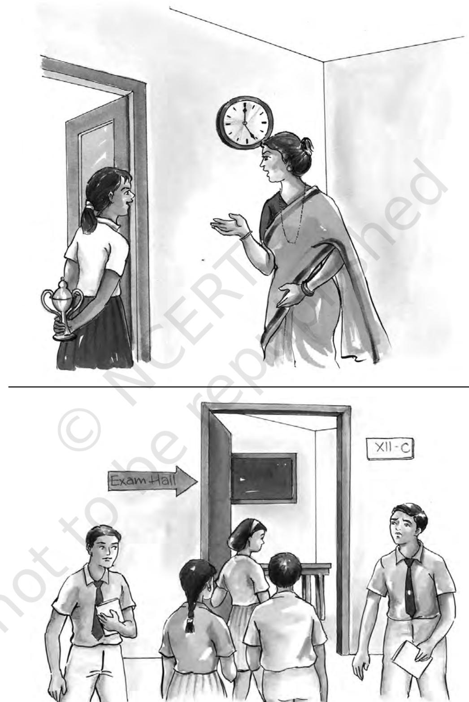
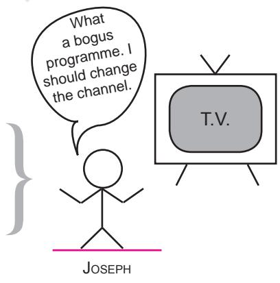
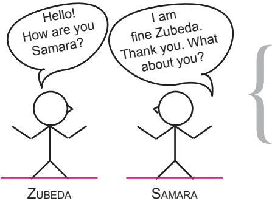
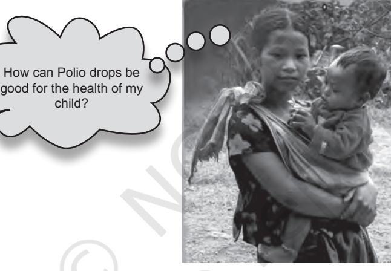
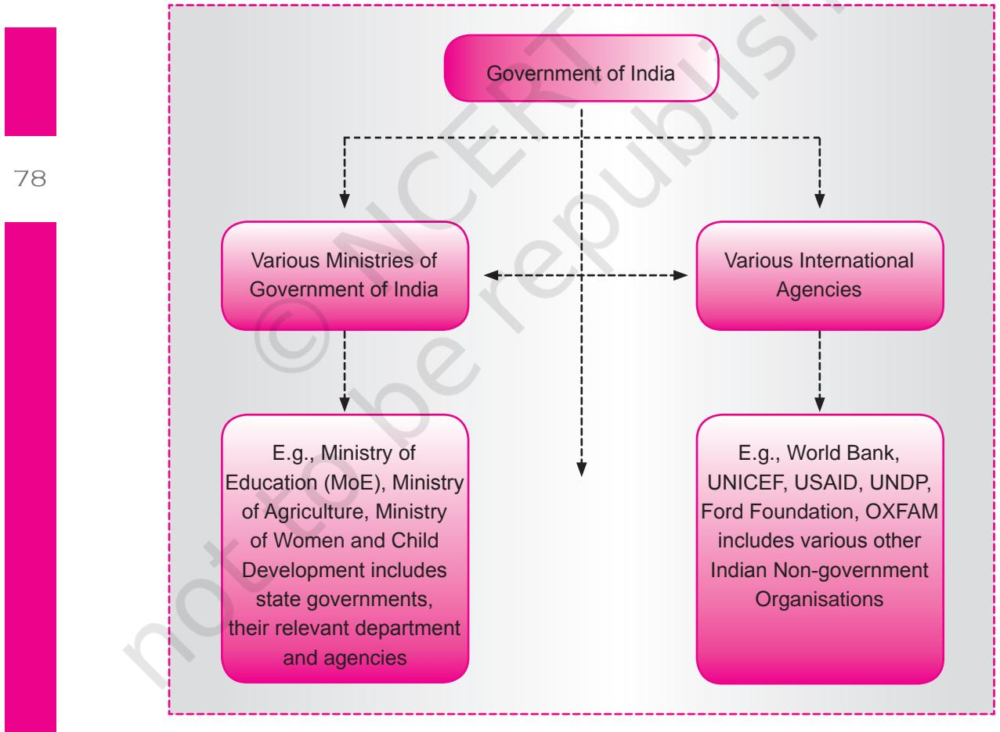
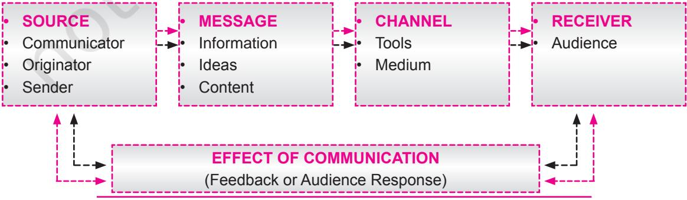
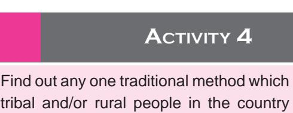
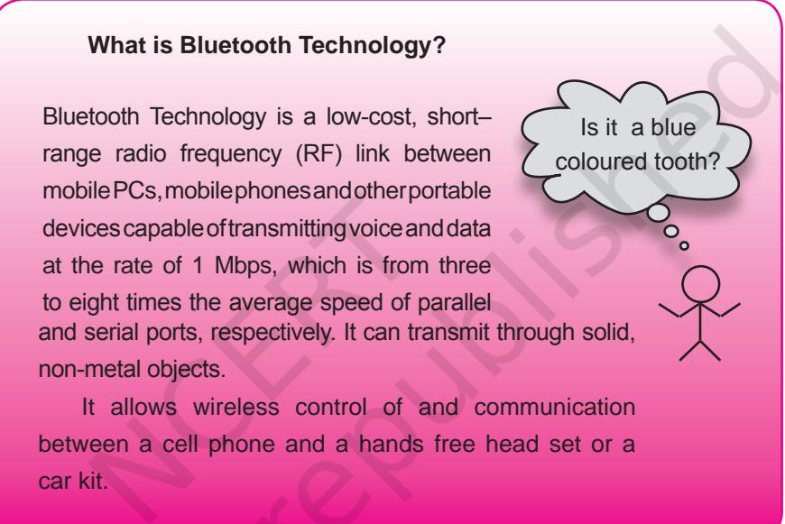

**6**

73

## Learning Objectives

After completing this chapter the learner is able to —

- • define the concept of communication.
- • discuss the significance of communication in everyday life.
- • enlist the different types of communication.
- • describe the process of communication.
- • explain the classification and functions of media.
- • analyse the various communication technologies.

An important field of study that has an impact on adolescents is that of media and communication. In this chapter we will discuss how these two aspects of our everyday ecology have become an integral part of our lives, usually adding to the quality of our lives. We will begin with the concept of communication first.

# **6.1 Communication and communication technology**

Communication is very basic and vital for human survival and has existed since the inception of life on earth. In modern times, with fast developing technologies, new communication methods and gadgets are introduced in the market almost every week. Some of these have become more popular due to their cost effectiveness and utility, and have sustained over time.

Observe the following pictures and interpret the situation, feelings and thoughts of the different persons.

Unit 1.indd 73 8/4/2022 2:50:56 PM

74

2024-25

Unit 1.indd 74 8/4/2022 2:50:56 PM

## What is communication?

Communication is the process of thinking, observing, understanding, analysing, sharing, and transmitting or transferring feelings to others through a variety of mediums in diverse settings. It also refers to seeing or watching, listening or hearing, and exchanging ideas, thoughts, experiences, facts, knowledge, impressions, moments, emotions, and the like with self or with others.

As the name suggests, the word communication stems from the Latin word communis meaning common. It is therefore, not only sharing of ideas, thoughts or imparting knowledge and information, but it also involves understanding the exact meaning of the content in a way that is common to both, the communicator and the receiver. Thus, effective communication is a conscious effort in creating a shared understanding about the intended meaning of the message among people involved in the communication. The process of communication is continuous and permeates all areas of social life, including home, school, community and beyond.

## Classification of Communication

Communication can be classified on the basis of the following depending on the levels, types, forms and modes.

#### A. Classification based on the type of interaction

- (i) *One-way communication:* In such situations the receiver receives information but is either never able to reciprocate to the sender or cannot respond immediately. Therefore, communication remains one–way. Speeches, lectures, sermons, listening to music on the radio or a music system, watching any entertainment programmes on television, using internet to search information on a website, etc., are examples of one-way communication.

- (ii) *Two-way communication:* This is comm-unication that takes place between two or more persons where all the parties communicating with each other share or exchange ideas, thoughts, information, etc., either

Unit 1.indd 75 8/4/2022 2:50:56 PM

silently or verbally. Some of the examples could be talking on mobile phone, discussing about future plans with one's mother, using internet for chatting, etc.

*When a baby cries to communicate her/his hunger, she/he is fed by the mother in response. The cry of the baby is the message that communicates the hunger of the child and is vital for the* 

*survival of the baby. Thus, in this case the communication is two-way.*

#### B. Classification based on the levels of communication

(i) *Intra-personal communication:* This refers to communicating with

76

oneself. This is a form of mental process involving observing, analysing, and drawing conclusions meaningful to the individual's present, past and future behaviour and life. It is an on-going process that transpires inside an individual. For instance, mental rehearsal before appearing in an interview or oral exam.

- (ii) *Inter-personal communication:* It refers to sharing of thoughts and
ideas with one or more people in a face-to-face situation. It can take place in a formal or an informal situation. Varied means of communication like body movements, facial expressions, gestures, postures, written text and verbal modes such as words and sounds

child?

Face to face communication Patient – doctor conversation

Unit 1.indd 76 8/4/2022 2:50:57 PM

can be used for this type of communication. Examples are talking to your friend about difficulties faced while studying or conducting an experiment or participating in a panel discussion followed by questionanswer session.

 Inter-personal communication is the most effective and ideal type of communication for two reasons. First, there is always proximity and direct contact between the communicatee and the communicator, and therefore it is easy to persuade, motivate and convince the communicatee for acceptance of the introduced idea or thought. Second, instantaneous and strong feedback with direct response of communicatee on the introduced idea is possible.

- (iii) *Group Communication:* This form of communication is direct and personal, such as inter-personal communication, but with the involvement of more than two persons in the communication process. Group communication helps to facilitate a participatory approach and collective decision-making, gives an opportunity for self-expression, and increases the individual's impact in a gathering, thereby augmenting one's status in the group. It also helps in recreation and relaxation, socialising and motivating. A range of audio-visual aids may be used to enhance group communication.
77

- (iv) *Mass Communication:* As a result of considerable advancement in technology, making thoughts, ideas and innovations reach the larger section of society has become possible. Mass communication can be defined as the process of multiplying messages with the help of any mechanical device and disseminating the same to the masses. The means and media of mass communication are radio, TV, satellite communication, newspapers, and magazines. The audiences of mass communication are very large in size, heterogeneous and anonymous, spread over a large area and separated from the communicator in terms of time and space. For these reasons it is not possible to take a correct, complete, direct and immediate feedback; rather there is slow, cumulative, expensive, and delayed feedback.
- (v) *Intra-organisational Communication:* Organisational communication takes place in highly structured settings. Just like human beings, when people work together in an organisation, organisations also establish and maintain relationships. They use various levels of communication within their environment and amongst their departments or sections. Every organisation has different levels or hierarchy of ranks working together for achieving common goals. The information flow in such organisations is expected to be two-way at the same level and one-way across levels.

Unit 1.indd 77 8/4/2022 2:50:57 PM

2024-25

- (vi) *Inter-organisational Communication:* This refers to the communication system developed by one organisation to communicate with other organisations with the aim of working in cooperation and coordination with each other. For example, for assistance in developmental activities of the country, both technical and financial support is provided by international agencies, whereas, administrative support is given by the Central government and State governments.
It is important to note that in both inter-organisational and inter-organisational setups, communication does not take place among the departments or organisations; rather it is always human beings working in these organisations who communicate with each other. Therefore, understanding of the human factor is very important.

Figure 1: Communication System among various Organisations

Unit 1.indd 78 8/4/2022 2:50:57 PM

#### C. Classification based on the means or modes of communication

- (i) *Verbal communication:* Auditory means or verbal modes like speaking, singing and sometimes even the tone of voice, etc., are of significance in verbal communication.
#### Research shows that on an average, an individual spends about 70 per cent of her/his active time in communicating verbally, i.e., listening, speaking and reading aloud.

- (ii) *Non-Verbal Communication:* Non-verbal means of communication are gestures, facial expressions, disposition, posture, eye contact, touch, para-language, writing, clothing, hair styles, and even architecture, symbols and sign language such as smoke signals used by some tribal people.
#### D. Classification based on the involvement of number of human senses

Have you ever tried to know why learning about our rich traditional heritage by simply watching folk or classical dance performance live or on television makes it easy to understand and more interesting than reading about them in a book?

| Our senses and Communication |  |  |  |
| --- | --- | --- | --- |
| • | People retain 10% of what they | Read | visual |
| • | People remember about 20 – 25% of what they | Hear | audio |
| • | People keep in mind about 30 – 35% of what they | See | visual |
| • | People remember 50% and more of what they have | Seen, | audio-visual |
|  |  | Heard |  |
| • | People remember 90% and more of what they have | Seen and | audio-visual |
|  |  | Heard and Done |  |
| Involvement | of more number of senses makes | the learning | more clearly |
| understandable | and permanent |  |  |

| Table 1: Classification of communication based on number of senses involved |  |
| --- | --- |
| Type of communication | Examples |
| Audio | Radio, audio recordings, CD players, |
|  | lectures, landline or mobile phones |

Unit 1.indd 79 8/4/2022 2:50:57 PM

## **Activity 1**

List the various means or modes, types and levels of communication involved in the following experience. Pen down your observations—Did you have the opportunity to live or visit a rural area or a village or a small town in the country? What was your experience? Did you observe symbols of advanced technology and communication like mobile phones, fax machines and other equipments, electricity poles and other similar things? How was the experience of meeting and interacting with people–young, women and older persons? Discuss this in your class.

| Visual | Symbols, printed materials, charts, posters |
| --- | --- |
| Audio-Visual | Television, video films, multi-media, |
|  | internet |

## How does communication take place?

#### The process of communication

Communication is the process of transferring information or content from a sender to a receiver with the use of a medium. It involves flexibility to exchange information using several methods in which the information is correctly, clearly and completely understood by both sender and receiver. It also takes the feedback of the audience on the message sent for further planning in the same way as carrying out market surveys before launching a product in the market.

Let us see the sequence in which the communication events occur. One way to describe it is as follows: Who says, what, to whom, when, in what manner, under what circumstances and with what effect. The basic elements of any communication process in general are arranged in a definite order to complete the cycle. Six elements have to be handled skillfully for effective and successful communication and can be easily understood by "The SMCRE Model" of communication.

Figure 2: The SMCRE Model of Communication

Unit 1.indd 80 8/4/2022 2:50:57 PM

TheSMCRE model (Figure 2) shows the complete process of communication and the elements involved in it.

- 1. Source: It is the person who initiates the process of communication. She/he is the key factor responsible for the effectiveness of the whole communication process. She/he gives the message to a specific group of audience in such a manner that it not only results in correct
interpretation of the message but also yields the desired response. She/he could be your teacher, parents, friend or classmate, extension worker, leader, administrator, writer, a farmer or a tribal person from a remote area of the country possessing indigenous knowledge.

## **Activity 2**

Identify the possible sources of information in villages/rural areas.

- 2. Message: It is the content or information a communicator wishes to receive, accept or act upon. It could be any technical, scientific or simply generalised information or ideas, specific or general to any field of
knowledge or day-to-day life of an individual, group or even a larger section. A good message should be simple yet appealing and clear. It should also be very specific, authentic, timely, appropriate and applicable for the channels selected and the nature and type of the receiver group.

- Collect one news story or a campaign or a social message from any two media such **Activity 3**
as radio, print or TV.

- 3. Channel: The medium of communication through which the information flows from a sender to one or two receivers is a channel. Face-to-face, word-of-mouth is the simplest and one of the most effective means of communication. It is perhaps the most widely used medium of
communication in a majority of developing and less-developed countries of the world. But with the passage of time and social change in society the emphasis has shifted to advanced mass media and multi media technologies.

tribal and/or rural people in the country use to make important announcements in their areas.

Unit 1.indd 81 8/4/2022 2:50:57 PM

There can be two types of channels:

- (i) Inter personal communication channels such as individuals and groups.
- (ii) Mass media communication channels, e.g., satellite, wire-less and sound waves.
- 4. Receiver: It is the intended audience of the message or the target of the communication function.

It could be an individual or group, men or women, rural or urban, old or young. The more homogeneous the receiver group, the greater are the chances of successful communication.

## **Activity 5**

As a receiver of information write down the type and quality of information you tend to get from your school.

- 5. Effect of communication (feedback): A communication process is incomplete unless the response to the message is received. It is the initiating step as well as the terminating element in any communication process. Termination occurs when the response to the message is the same as expected. In such a situation, since the objective is achieved, the cycle is complete. However, if the response of the intended audience does not yield the desired results, rethinking and recasting of message occurs and the entire communication process is repeated. Here are a few examples: (a) When a teacher has taught a lesson, at the end she/he asks the students questions to find out if the lesson has been understood. The activity of asking questions and finding out what themes and parts were understood and which topics need to be explained again is a feedback. (b) Letters from readers in newspapers and magazines are a form of feedback to the editor and writers. (c) The ratings Television Rating Points (TRPs) of a television programme are another form of feedback from viewers.
# **6.2 What is Media?**

If you listen to the radio or watch television, perhaps you are aware that what you hear or see influences you in one way or the other. That is media influence. Let us see how the media influences us.

Identify the most common element in the following: Advertisements and programmes we see on television, films on TV or theatre, the news we read in the newspapers, the speech of a politician, instructions imparted by the teacher in the classroom, or a complaint that is registered when an appliance is not functioning well, or shopping through internet sitting at home.

82

Unit 1.indd 82 8/4/2022 2:50:57 PM

You will find that the common element in all these is that some or the other medium has been used to pass on or share varied messages or information across diverse fields. For instance, when we talk to someone or hear someone talking, it is the air that acts as a medium through which the sound waves travel since no sound can be transmitted in a vacuum.

Therefore, if communication is a process, media is the means that uses various methods of communication for disseminating and sharing, ideas, thoughts, feelings, innovations experiences, etc. Mass media essentially uses modern technology for communication but the presence of technology does not always denote that mass communication is taking place. Mass media is always meant for heterogeneous, anonymous and large audience groups.

Does media mean only radio, and TV? No, all types of satellite transmission, computer and wireless technology are also included in it. Media has gone through a lot of change and development. Now numerous modern technologies are available as media for communication purpose.

## Media classification and functions

Media can be classified into two broad categories, traditional and modern media.

Traditional media: Till very recently most rural extension work was completely dependent on traditional media such as fairs and radio. The situation is no different even today. Inter-personal communication media largely remains the most used and effective medium of communication in rural and remote areas. Examples of other traditional folk media are puppetry, folk dances, folk theatre, oral literature, fairs and festivals, rituals and symbols, print media such as charts, posters, newspapers, magazines, and other local publications from ancient times. Various traditional folk media are being used as indigenous channels of communication. Some very popular examples are – traditional folk theatre or drama like *Jatra* (Bengal), *Ramleela* and *Nautanki* (Uttar Pradesh), *Bidesia* (Bihar), *Tamasha* (Maharashtra), *Yakshagana*, *Dashavatar* (Karnataka) or *Bhavai* (Gujarat). Likewise various oral literature-cum-musical forms basically include folk or tribal songs and dances such as *Baul* and *Bhatiali* (Bengal), *Sna* and *Dadaria* (Madhya Pradesh), *Duha* and *Garba* (Gujarat), *Chakri* (Kashmir), *Bhangra* and *Gidda* (Punjab), *Kajri*, *Chaiti* (U.P.) and *Allha* (U.P. and Bihar), *Powda* and *Lavni* (Maharashtra), *Bihu* (Assam) and *Mand*, *Panihari*, and songs sung by *Charans* and *Bhaatt* (Rajasthan). There are various drum

83

Unit 1.indd 83 8/4/2022 2:50:57 PM

festivals with very rhythmic drum beats followed by dance and songs of the North-eastern and other tribal communities of the country. Different types of puppetry forms have also been common media for communicating messages along with providing entertainment. Among the most common are the string puppets or '*Sutradharika*' mainly used in Rajasthan and Gujarat, and *Chhaya Putli* (shadow puppets) which are more common in the southern parts of the country. Besides, there are numerous festivals, fairs, social rituals and ceremonies, *yatras,* etc., for conveying messages, expressions, feelings and traditions of the diverse communities across the country.

With changing times it became apparentthattraditional communication media were neither sufficient nor well-equipped to meet the diverse information needs ofthe modern audiences. Hence, new media technologies have been popularised.

Modern media: With the advent of modern technology the range of communication media has expanded tremendously. New communication technologies, such as the mobile phone, are emerging with exciting features that have improved the quality and capacity of broadcast. The handy size of equipments has made them convenient for use in rural as well as remote areas. It has also increased the reach of modern communication technology. The availability of and access to computers, particularly the internet

facility, has ushered a completely new era of communication media. Radio, satellite television, modern print media, films projected though various type of projectors, audio cassette and compact disk technology, cable and wireless technology, mobile phone, video film and video conferencing are some examples of modern media.

Collect information on different folk media used in your state in both urban and rural areas. If there are tribal areas in your state, collect the folk media relevant there.

Functions of media: The previous chapters have made you aware that as an adolescent you are likely to be influenced by media. It has the following functions.

- 1. *Information*: It includes both, providing information and information exchange. These days information is power. Communication is facilitated through various media such as radio, television, magazines, newspapers.
- 2. *Persuasion/Motivation*: We are not always convinced about whatever idea or thought we come across. Suitable communication media can be used to persuade an audience to accept an idea. This needs a

Unit 1.indd 84 8/4/2022 2:50:57 PM

deeper understanding of audience psychology and their socio-cultural background.

- 3. *Entertainment*: Both, traditional and modern communication media provide a wide variety of entertainment options starting from folk media and oral tradition to Direct to Home (DTH) telecast. Even for educational purposes media is used in an entertaining form to make learning easy and interesting.
- 4. *Interpretation*: Use of communication media, particularly pictographic presentations,andfactsandfiguresmakemanydifficultandcomplicated concepts easy to understand. For example, it is easy to locate and understand a geographical area with the help of a cartographic map or model of a globe than merely reading about it in a textbook.
- 5. *Transmission of values*: Media is expected to foster development of a healthy society by the transmission of wholesome values. For example, use of puppetry and cartoon films for teaching values through the story format that are attractive options.
- 6. *Education or training*: New learning experiences with the help of appropriate communication media in local language, and focussing on local problems always enrich the teaching–learning experience. These include interactive instruction video and audio cassettes, and discs of basic printed teaching-learning material on various concepts.
- 7. *Coordination*: Due to the introduction of modern interactive communication technologies, distance and physical proximity has become less important. Pace, scope and accuracy of communication has expanded to such an extent that it has now become very easy to sit in one place and coordinate large projects spread over a vast geographical area.
- 8. *Behavioural change*: All extension education activities related to varied fields, be it health, literacy, environmental issues, empowerment programmes and adoption of innovations depend largely on the art and technique of effective communication. Media remains the main vehicle for the transmission of useful messages, acceptance of which leads to direct and indirect behavioural change in the target people.
- 9. *Development:* Media is a catalyst (medium) in national development. Communication mediates between specialists and lay persons. Thus, communication occupies a pivotal position in the process of development. Media has accelerated the pace of development and made the world smaller by bringing people closer through communication.

 Both communication and media employ modern technology for reaching out to people. We will read about this in the next section.

Unit 1.indd 85 8/4/2022 2:50:57 PM

## **6.3 What is communication technology?**

The global scenario is passing through a communication revolution and communication technologies are changing very fast. What is new today may be obsolete tomorrow. People want to know everything in a very short span of time. There is information overflow and it is easily available and accessible to all through a wide variety of traditional and modern mediums. It is here that communication technology is playing a key role.

We have been using different mediums and communication technologies for communicating in different times (in the past and at present), in different settings, for example rural/urban/tribal.

> "We all know that distance is dead. What used to be far is near, what is local is global" *– Sam Pitroda Chairman of World Tel*

86

Let us have a look around us. You may have observed that many new technologies related to electronic media have revolutionised communication media?

> Do you know that Pij village in Gujarat acquired the first TV transmitter in India, which provided programmes in local language along with common programmes from Delhi via satellite.

Unit 1.indd 86 8/4/2022 2:50:58 PM

Communication technology refers to various technologies developed and used to handle information and aid communication. This includes modern technologies that are used to transmit data, which could either be analogue (electronic signals) or digital. There are hardware, organisational structures, as well as social values which individuals access to collect, process, and exchange information.

## Classification of communication technologies

A wide range of communication technologies are available. These fall into two broad groups.

- (i) Cable (land) based technologies: These are comparatively cheap and less complicated. Landline telephone or a personal computer without internet are examples of such technology.
- (ii) Wireless technologies: These generally require less infrastructure,

but can be more expensive to use than cable-based technologies. Some examples are radio, microwave and satellite wireless telephony, or use of 'bluetooth' technology in mobile phones and computers.

class on "Communication Technology – a curse or a boon?"

Two significant communication technologies that acted as media and changed the whole communication scenario are the radio and the television.

Radio: Radio commands a universal audience by geographical spread, income, education, age, sex and religion. Through on-the-spot broadcast or simulated broadcast it can overcome the barriers of time and space. With the use of small size transistors it was made possible to receive communication in the remotest parts of the country.

Television: TV was introduced in India in 1959 primarily to impact education and promote rural development. TV programmes are planned and produced using various techniques of visual magnification, sound amplification, super-imposition, split screen processes, fading, zooming, etc. These techniques make it more effective and strengthen the impact on the viewer.

## Modern Communication Technologies

The list of modern communication technologies is long and every other day we hear of innovation in the existing technology. Following are some 87

Unit 1.indd 87 8/4/2022 2:50:58 PM

of the major types of modern communication technologies used primarily for extension purposes.

- 1. Micro Computers: Computers are classified as mainframes (large and costly), mini computers (less powerful) and micro-computers (based on microchip technology). This classification is based on their power, speed of executing a set of instructions and the amount of memory available to store data as well as degree of inter connectivity that the computer offers.

 The functions of micro-computer, particularly for extension work, include processing, keeping record of all kinds of information, performing accounting function, acting as repository of various cases, experiences to be used for research and field purpose in a very small space and publishing information material at reasonable cost. Computers can also communicate with each other if linked together and provide sourcing of information from across the globe.

- 2. Video text: Video text or view-data is an electronic text service transmitted from central computer to home TV–set via telephone network or cable system. It is interactive in the sense that the viewer has the option to access the desired data.
- 3. Electronic mail (E-mail): It is the system which passes information electronically from sender to receiver. E-mail system is like surface mail in which a message is typed on the computer and sent to another computer via the mobile phone. It is a simple way of communicating

Unit 1.indd 88 8/4/2022 2:50:58 PM

between two or more persons through the provision of a mail box. The message is stored in the computer which acts as a post office, unless the receiver asks for it. The mail can be viewed using a modem connected to the telephone.

- 4. Interactive video: Interactive video refers to a video system which is a combination of computer and video. It uses multi–media approach, i.e., text, still photographs, video, audio, slides, overheads, etc. The messages stored in different forms are received by the users as per their choice. The users' response to the system determines the path to be followed.
- 5.Teleconferencing: Teleconferencingisinteractivegroupcommunication. It refers to a system meant for creating dialogue between geographically dispersed participants and physically distant people. Advances in telecommunication have made it possible to hold meetings without travelling to long distances.

| Activity 8 |
| --- |
| Write any two messages that you remember from the hoardings displayed on road sides. |
| Also write your interpretation of the messages: |
| • Message: _______________________________________________________ |
| Interpretation: ____________________________________________________ |
| ________________________________________________________________ |
| • Message: _______________________________________________________ |
| Interpretation: ____________________________________________________ |
| ________________________________________________________________ |

89

Communication Technology thus greatly facilitates communication; more and more people across the world are using these technologies. Yet the human touch cannot be ignored. In our everyday lives we need to engage in face-to-face communication with different people. Every individual hence, needs to develop certain basic skills for effective communication. The next chapter on Effective Communication Skills, will help us understand this.

#### **Key Terms**

Communication, Group communication, Mass communication, Verbal and nonverbal communication, Media, Communication technology, Bluetooth technology, Satellite communication.

Unit 1.indd 89 8/4/2022 2:50:58 PM

## Review Questions

- 1. What do you understand by the term communication? What are the various modes of verbal and non–verbal communication?
- 2. Explain the process of communication with the help of an example.
- 3. "The more the number of senses involved in the communication process, the more effective and sustainable is the communication". Write your comments with justification.
- 4. How does media affect our day-to-day life? Enumerate the different types of media.
- 5. How is the term communication technologies defined? Discuss two important communication technologies that have brought a revolution in the communication arena, giving justification for your answer.

Unit 1.indd 90 8/4/2022 2:50:58 PM

