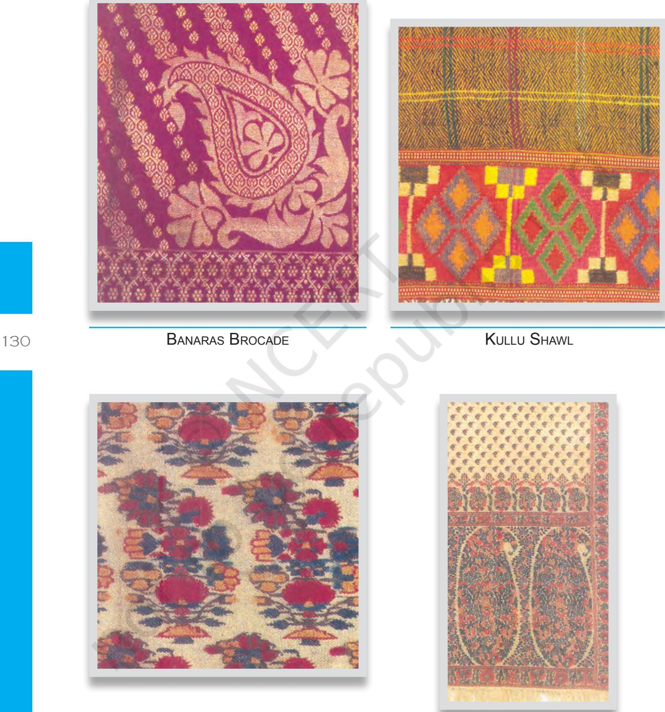
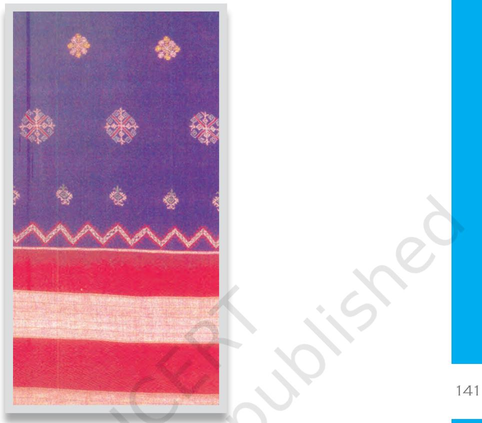

# **UNIT II**

# Understanding Family, Community and Society

91 *The chapters in Unit I were all addressed to you for the understanding of self and of the factors that influence your decision making. Let us now move on to understanding the family, the community and the society that you are a part of. Chapter 7 will discuss concerns and needs, such as those of health, work, resources, education and textile tradition in the adolescent's diverse social contexts.*

Unit 2.indd 91 2/8/2023 14:32:38

**7**

# Concerns and Needs in Diverse Contexts A. Nutrition, Health and Hygiene

#### Learning Objectives

92

After completing this section the learner is able to—

- • discuss the importance of health and its dimensions.
- • understand the interrelationship of nutrition and health.
- • identify the consequences of undernutrition and overnutrition.
- • select appropriate and healthy food choices.
- • identify the interrelationship between nutrition and disease.
- • explain the importance of hygiene and sanitation for preventing food- borne diseases.

# **7A.1 Introduction**

Every person wants to live a good quality life and have a sense of wellbeing. As far back as 1948, the Universal Declaration of Human Rights stated: "Everyone has the right to a standard of living adequate for the health and well-being of oneself and one's family including food". Yet, many of the environmental conditions and our own lifestyles affect our health, sometimes having harmful effects. At the outset let us define "health". The world's premier organisation concerned with health, the World Health Organisation (WHO) defines health as "a state of complete mental, physical and social well-being and not merely the absence of disease". Disease means impairment of body health, alteration/disruption/derangement in function of some part or organ of the body, interrupting normal functions and deviating from a state of complete well-being. Health is a fundamental human right. All persons, irrespective of age, gender, caste, creed/religion, place of stay (urban, rural, tribal) and nationality, throughout their lives,

Unit 2.indd 92 9/6/2022 12:16:30 PM

should have the opportunity to achieve and maintain the highest attainable state of health.

# **7A.2 Health and Its Dimensions**

It is the aim of every health professional (persons who deal with various aspects of health) to promote good health; in other words, to promote maintenance of well-being or wellness, quality of life.

You must have noticed that the definition of health includes various dimensions–social, mental and physical. Let us briefly deal with all three dimensions before we discuss physical health in greater detail.

Social health: It refers to health of individuals and of a society. When we are concerned with society, it refers to a society in which there is equal opportunity and access for all citizens to the goods and services essential for good health. When we refer to individuals, we refer to each person's well-being – how well the individual gets along with other people and with social institutions. This includes our social skills and the ability to function as a member of the society. When we are faced with problems and stress, social support helps us to cope with them and solve the problems facing us. Social support measures contribute to positive adjustment in children and adults, and encourages personal growth. Emphasis on social health is gaining importance as scientific studies have shown that persons who are socially well adjusted, tend to live longer and recover faster from disease. A few social determinants of health are:

- Employment status
- – Safety in workplaces
- Access to health services
- – Cultural/religious beliefs, taboos and value systems
- Socio-economic and environmental conditions

Mental health: This refers to emotional and psychological well-being. An individual who experiences a sense of well-being can utilise his/her cognitive and emotional capabilities, function well in society and meet the ordinary demands of daily life. The box below lists the indicators of mental health.

- A person who has positive mental health–
- • feels that he/she is capable and competent.
- • can handle normal levels of stress he/she faces in daily life.
- • has satisfying relationships.
- • can lead an independent life.
- • if faced with any mental or emotional stress or events, he/she can cope with them and recover from them.
- • does not fear things.
- • does not feel defeated or depressed for unusually long periods of time when small difficulties/problems are encountered.

Unit 2.indd 93 9/6/2022 12:16:30 PM

Physical health: This aspect of health encompasses physical fitness and functioning of the body. A physically healthy person is able to undertake normal activities, does not feel unusually fatigued and has adequate resistance to infection and disease.

## **7A.3 Health Care**

Every individual is responsible for his/her own health, but it is also a major public concern. Thus the government assumes considerable responsibility and provides health services at various levels to the citizens of the country. This is because good health is the foundation for good quality of life and standard of living for the individual and the family, and is the key for ensuring social, economic and human development of a community and a nation.

Health care consists of all the various services provided to individuals or communities by agents of health services or professions for the purpose of promoting, maintaining, monitoring or restoring health. Thus health care includes preventive, promotive and therapeutic care. Health Care services are delivered at three levels – primary care, secondary care and tertiary care levels.

Primary Health Care: The first level of contact between individuals with the health care system is known as Primary Health Care.

Secondary Health Care: When patients from primary health care are referred to specialised hospital also like district hospitals, it is called as Secondary Health Care.

Tertiary Health Care: When patients are referred from primary and secondary health system for specialised intensive care, advanced diagnostic support serious and medical care, then it is called as Tertiary Health Care.

# **7A.4 Indicators of Health**

Health is multidimensional, with each dimension being influenced by several factors. Therefore, several indicators are employed to assess health. These include indicators of mortality, morbidity (illness/disease), disability rates, nutritional status, health care delivery, utilisation, environment, health policy, quality of life, etc.

# **7A.5 Nutrition and Health**

Nutrition and health are intimately interlinked. In the global campaign of 'Health for All', promotion of nutrition is one of the primary elements. Nutrition is concerned with maintenance of body organs and tissues in structure and function. It is also concerned with growth and development of the body. Good nutrition enables the person to enjoy good health, resist infection, have adequate energy levels and perform daily tasks without

Unit 2.indd 94 9/6/2022 12:16:30 PM

feeling fatigued. In case of children and adolescents, nutrition is vital for their growth, mental development and achieving their potential. For adults, adequate nutrition is crucial to lead a socially and economically productive and healthy life. In turn, the health status of an individual determines the nutrient requirements of a person and food intake. During illness, nutrient requirements increase, and breakdown of nutrients are higher. Therefore, illness and disease adversely affect nutritional status. Hence, nutrition is a 'fundamental pillar' of human life, health and development.

### **7A.6 Nutrients**

There are more than 50 nutrients in food. Nutrients are broadly classified into macronutrients (required in relatively larger amounts) and micronutrients (required in small quantities) based on the amounts required by the human body. Macronutrients are generally fat, protein, carbohydrate and fibre. Micronutrients include the minerals such as iron, zinc, selenium and the various fat-soluble and water-soluble vitamins, each of which performs important functions. Some of them function as co-factors and co-enzymes in the various metabolic reactions that occur in the body. Nutrients can also influence gene expression and transcription. Different organs and systems play a critical role in the digestion, absorption, metabolism, storage and excretion of nutrients and their end products of metabolism. In essence, each and every cell in all parts of the body requires nutrients. Nutrient requirements in the normal healthy state vary according to age, sex and the physiological state, i.e., during periods of growth such as infancy, childhood, adolescence, and pregnancy and lactation in women. Level of physical activity also determines requirements for energy and nutrients involved in energy metabolism, e.g., vitamins like thiamine and riboflavin.

Knowledge about nutrients, their metabolism and sources as well as functions are vital. One should consume a balanced diet which includes

foods that will provide allthenecessary nutrients in required amounts.

The science of nutrition is concerned with access to, availability and utilisation of food and nutrients for life, growth, development and well-being. Nutritionists (professionals who work in this field) are concerned with myriad aspects. These range from biological and metabolic aspects to what happens Balanced meal in disease states and how the body

Unit 2.indd 95 9/6/2022 12:16:30 PM

is nourished (clinical nutrition). Nutrition as a discipline studies the nutritional needs of populations and their nutritional problems, including health problems caused by lack of nutrients (public health nutrition) and prevention of diseases such as heart disease, diabetes, cancer, hypertension.

We all know that when one is ill, one may not feel like eating. What and how much is eaten by a person not only depends on taste but availability of food (food security) which in turn is influenced by purchasing power (economic factors), environment (water and irrigation), and policies at the national and international levels. Culture, religion, social status, beliefs and taboos also influence our food choices, food intake, and nutritional status.

How do good health and nutrition help? Look around you. You will notice that people in good health are generally in a happier frame of mind and are more productive than others. Healthy parents are able to take adequate care of their children, and healthy children are generally happy and do well in school. Thus, when one is healthy, one is more constructive for oneself and can take active part in activities at the community level. It is therefore obvious that one cannot achieve good health and be productive, sociable and a contributory member of society if one is starving and undernourished.

|  |  | Table 1: Optimum nutritional status is important because it— |  |
| --- | --- | --- | --- |
| ƒ | maintains body weight | ƒ | provides resistance to infection |
| ƒ | maintains muscle mass | ƒ | helps to cope with physical and |
|  |  |  | mental stress |
| ƒ | decreases risk of disability | ƒ | improves productivity |

Figure 1: Health and Nutritional inputs required for Productivity

Unit 2.indd 96 9/6/2022 12:16:30 PM

Figure 2 summarises the benefits of good nutritional status for children's education.

Figure 2: Benefits of Good Nutritional Status for Children's Education

What is malnutrition? Malnutrition is a deviation from the normal state of nutrition. When the intake of nutrients is less than the amount that is required by the body, or in excess of the requirements, malnutrition results. Malnutrition can take the form of overnutrition or undernutrition. Excess intake of nutrients results in overnutrition; inadequate intake results in undernutrition. Wrong food choices and combinations can be a very significant cause of malnutrition in adolescents.

# **7A.7 Factors Affecting Nutritional Well-being**

The World Health Organisation has listed four main factors (as shown in the diagram) that are important for nutritional well-being.

Unit 2.indd 97 9/6/2022 12:16:31 PM

Food and nutrient security means that each and every person (regardless of age) has access to and can obtain adequate food and nutrients throughout the year, as per his/her requirements to enable him/her to lead a healthy life.

Care for those who are vulnerable means that each individual needs loving care and attention reflected by caring behaviour. In the case of babies it means whether the baby receives the correct type and amount of food as well as care and attention. In case of expectant mothers, it refers to whether they get all the care and support they need from the family, the community and in case of working mothers, from employers. Similarly, persons who are ill and suffer from any disease require care and support in various ways including food, nourishment, medication, etc.

Health for all includes prevention of disease and curing disease when it occurs. Special attention needs to be paid to infectious diseases since they can deplete the body of nutrients and lead to poor health and poor nutritional status. Every citizen should get a minimum amount of health care. Health is a basic human right. Some of the diseases that take their toll in India, especially among young children are diarrhoea, respiratory infections, measles, malaria, tuberculosis among others.

Safe environment focusses on all aspects of environment including physical, biological and chemical substances which may influence health. This includes safe, potable drinking water, hygienic food, and prevention of environmental pollution and degradation.

# **7A.8 Nutritional Problems and Their Consequences**

In India, there exist several nutritional problems in the population. Undernutrition is a major problem which is reflected in the high numbers of pregnant women who are undernourished and have small babies with low birth weight as well as young children (below 3 years of age) who are

98

Unit 2.indd 98 9/6/2022 12:16:31 PM

underweight and stunted. One-third of the babies born in India are low birth weight, i.e., less than 2500 gms. Similarly, considerable percentage of women too are underweight. There are other nutrition-related deficiencies such as iron deficiency anaemia, vitamin A deficiency and consequent blindness and iodine deficiency. Undernutrition has several negative effects on the individual.

Undernutrition not only reduces body weight but has devastating effects on children's cognitive development, immunity and can also result in disability, e.g., blindness due to vitamin A deficiency. Iodine deficiency is a threat to health and development, specially for young children and pregnant women since it results in goitre, still birth, and miscarriage in women, and deaf-mutism, mental retardation and cretinism in children.

Iron deficiency also has negative impact on health and well-being. In infants and young children, its deficiency impairs psychomotor and cognitive development, and thus adversely affects scholastic performance. It also decreases physical activity. Iron deficiency during pregnancy affects the growth of the foetus and increases risk of morbidity and mortality for the mother.

Conversely, overnutrition is also not good. Intake in excess of requirements leads to several health problems. In case of some nutrients if may lead to toxicity, and the person may become overweight and even obese. Obesity in turn increases the risk of several diseases such as diabetes, heart disease and hypertension. In India, we face problems at both ends of the spectrum, i.e., undernutrition (nutritional deficiencies) and overnutrition (diet-related chronic, non-communicable diseases). This has been termed "double burden of malnutrition". In our country, the fourth National Family Health Survey (NFHS-4) shows that 26.6 per cent men and 31.3 per cent women from urban areas are overweight or obese, the percentage being much lower among rural men (15.0 per cent) and women (14.3 per cent).

Nutrition and infection: Providing enough food to fulfil nutritional requirements is not adequate. The influence of environment is also important. Nutritional status does not depend only on sufficient supply of food and nutrients but also on the person's health status, to a great extent. Nutrition and infection are intimately interlinked. Poor nutritional status decreases resistance and immunity, and thus increases risk of infection. On the other hand, during infection, the body loses considerable amount of its nutrient reserves (through vomiting and diarrhoea), while the nutrient requirements are actually increased. If nutrient intake is insufficient compared to the requirement due to loss of appetite or inability to eat (if there is nausea and/or vomiting), infections will affect the nutritional status adversely. Thus the risk of another infection increases, and all persons, especially children, the elderly and those undernourished are at the risk of contracting more infections/diseases.

Unit 2.indd 99 9/6/2022 12:16:31 PM

In developing countries, food-borne illnesses such as diarrhoea and dysentery are major problems since they can lead to dehydration and death. Many of the infectious and communicable diseases are due to poor environmental sanitation, poor household, personal and food hygiene. The key therefore is to look into how these diseases can be prevented.

# **7A.9 Hygiene and Sanitation**

Prevention and control of disease has to address both intrinsic and extrinsic factors which are linked with various diseases. The box below lists these factors.

| Table 2: Intrinsic and Extrinsic factors linked with various diseases |  |
| --- | --- |
| Intrinsic/host factors Extrinsic/environmental factors |  |
| Age, sex, ethnicity, race Physical environment – air, water, soil, |  |
| housing, climate, geography, heat, light, |  |
| noise, radiation |  |
| Biological factors such as heredity, blood Biological environment includes the human |  |
| groups, levels of various being, all other living beings such as | enzymes, |
| substances in blood, e.g., cholesterol animals, rodents, insects, plants, viruses, |  |
| Functioning of various organs and systems micro organisms |  |
| Some of these act as disease-producing |  |
| agents, some as reservoirs of infection, |  |
| intermediate hosts and vectors of disease |  |
| Social and economic characteristics, e.g., Psychosocial factors-emotional well-being, |  |
| occupation, marital status, housing cultural values, customs, habits, beliefs, |  |
| attitudes, religion, lifestyle, health services, Lifestyle factors, e.g., nutrition, diet, physical |  |
| etc. activity, habits, use of addictive | living |
| substances such as drugs, alcohol, etc. |  |

Among these factors sanitationandhygiene,nutritionandimmunisation are key inputs. When we speak of hygiene we are concerned with essentially two aspects: personal and environmental. Health depends to a great extent on the social environment as well as on lifestyle and behaviour, including food intake. It is also closely related to hygiene. Poor hygiene leads to several infections and infestations such as worm infestations.

Environmental hygiene comprises external matter, both organic and inorganic, at the domestic hygiene (home) and community levels. This includes physical factors such as water, air, housing, radiation, etc., as well as biological factors such as plants, bacteria, viruses, insects, rodents and animals.

100

Unit 2.indd 100 9/6/2022 12:16:31 PM

Figure 4: Environmental Aspects of Hygiene

Unit 2.indd 101 9/6/2022 12:16:31 PM

Environmental health needs attention so as to create and maintain ecological conditions that will promote health and prevent disease. Among these, safe drinking water and sanitation, especially feaces disposal, are of great importance. Similarly air and water pollution are of concern. Water quality is important as contaminated water is the cause for many diseases such as diarrhoea, worm infestations, skin and eye infections, guinea worm, etc.

Food Hygiene: Food-borne illnesses occur when we consume food that contains disease-causing (pathogenic) micro-organisms. Several factors are needed for a food-borne illness to occur.

- • Either the organism or the toxin must be present in the food eaten.
- • The number of pathogenic micro-organisms must be in sufficient numbers.
- • The contaminated food must have been consumed in sufficient quantity.

The illnesses that are caused include diarrhoea, dysentery, amoebiasis, infective hepatitis, typhoid, listeriosis, botulism, cholera, gastroenteritis. Most of these are traced back to poor personal and food handling practices as outlined below.

- Use of food items that are spoiled/infected/unsafe, include water, spices, seasonings, mixes.
- Improper storage leading to multiplication of disease causing microorganisms.
- Not practising insect and vermin control.
- Use of contaminated equipment, utensils and plates, spoons, glasses
- Inadequate cooking.
- Storageoffoodsattemperaturesfavourabletogrowthofmicroorganisms ( 4 to 600C).
- Improper cooling.
- Improper/inadequate heating/reheating of cooked foods/left overs.
- Cross contamination.
- Leaving food uncovered.
- Use of contaminated substances for garnishing.
- Poor hygiene and sanitation of persons handling food, such as unclean clothes, not washing of hands, dirt and grime under the nails.

Effective practices related to nutrition, health and hygiene are essential to be productive in the work that one does, within home or outside the home. The next chapter discusses the relationship between work, worker and workplace.

#### **Key Terms**

Health care, Nutrients, Malnutrition, Hygiene and sanitation, Food hygiene.

102

Unit 2.indd 102 9/6/2022 12:16:31 PM

#### Exercises

- 1. **Look up the following websites and discuss them in the class**
	- • UNICEF's report on State of the World's Children http://www.unicef.org/sowc08/
	- • Human Development Index http://hdr.undp.org/en/statistics/
	- • WHO's World Health Report http://www.who.int/whr/en/
- 2. Identify at least 5-6 key indicators that you think are important for health and see how India ranks among the various countries in the world. Or

**Alternative for rural students:** Interview two mothers of young children in your village. Ask each mother how many episodes of diarrhoea have occurred in the case of her child in the last one year. Give your comments on the reasons given by the mothers.

103

- 3. There are so many dimensions of health. List the various occupations or professions which are involved in providing services for health and nutrition – including prevention of health problems, promotion of good health and therapeutic services.
Review Questions

- 1. "Nutrition affects productivity, income and quality of life". Write your opinion about this statement.
- 2. How is nutrition linked to mental and visual disability and quality of life?
- 3. Divide the class into groups. Each group should visit a food service establishment, e.g., canteen/cafeteria, restaurant, street food vendor. Identify the poor hygiene practices related to (a) food hygiene (b) personal hygiene.
- 4. Have a class discussion on how hygiene can be improved and food can be rendered safer.

Or

 Divide yourselves into three groups. One group will study the 'Food' aspect, the second will study 'People' and the third will assess 'Unit, facilities and equipment'. After listing the various aspects/parts/activities that increase risk of illness, the groups can be asked to give a presentation followed by a discussion on remedial measures.

Unit 2.indd 103 9/6/2022 12:16:31 PM

#### *Note for Teachers*

*Teachers may guide students to organise an exhibition on Health, Nutrition and Hygiene for the school children, parents and members of community.*

#### *Note for students*

*In the vicinity of (a) your school (b) your home, observe and rate as very good, good, fair, poor and very poor at least three factors that are related to environmental hygiene.*

#### Practical 10

#### **A. Nutrition, Health and Hygiene**

Compare the energy, protein, calcium and iron content of 150 g. edible portion of foods using the food composition tables provided—

#### **(a) Cereals**

|  | Name of Cereal |  |  | Energy | Protein | Calcium | Iron content |
| --- | --- | --- | --- | --- | --- | --- | --- |
|  |  |  |  | content | content (g. | content (mg | (mg per |
|  |  |  |  | (Kcal. | per 150 g.) | per 150 g.) | 150 g.) |
|  |  |  | per 150 g) |  |  |  |  |
| 1. | Bajra |  |  |  |  |  |  |
| 2. | Rice | (raw, milled) |  |  |  |  |  |
| 3. | Maize | (dry) |  |  |  |  |  |
| 4. | Wheat | (whole) |  |  |  |  |  |

#### **(b) Pulses**

| Name of Pulse/ |  |  |  | Energy | Protein | Calcium | Iron content |
| --- | --- | --- | --- | --- | --- | --- | --- |
| legume |  |  |  | content | content (g. | content (mg | (mg per |
|  |  |  |  | (Kcal. per 150 g) | per 150 g.) | per 150 g.) | 150 g.) |
| 1. | Bengal | gram | dal |  |  |  |  |
| 2. | Black | gram | dal |  |  |  |  |
| 3. | Lentil |  |  |  |  |  |  |
| 4. | Soyabean |  |  |  |  |  |  |

#### **(c) Vegetables**

|  | Name of Vegetable | Energy | Protein | Calcium | Iron content |
| --- | --- | --- | --- | --- | --- |
|  |  | content | content (g. | content (mg | (mg per |
|  |  | (Kcal. per 150 g) | per 150 g.) | per 150 g.) | 150 g.) |
| 1. | Spinach |  |  |  |  |
| 2. | Brinjal |  |  |  |  |
| 3. | Cauliflower |  |  |  |  |
| 4. | Carrot |  |  |  |  |

104

Unit 2.indd 104 9/6/2022 12:16:31 PM

#### **(d) Fruits**

|  | Name of Fruit |  | Energy | Protein | Calcium | Iron content |
| --- | --- | --- | --- | --- | --- | --- |
|  |  |  | content | content (g. | content (mg | (mg per |
|  |  |  | (Kcal. | per 150 g.) | per 150 g.) | 150 g.) |
|  |  |  | per 150 g) |  |  |  |
| 1. | Mango | (ripe) |  |  |  |  |
| 2. | Orange |  |  |  |  |  |
| 3. | Guava | (country) |  |  |  |  |
| 4. | Papaya | (ripe) |  |  |  |  |

**B. Identify the rich sources of carbohydrate, protein, fat, vitamin A, iron and calcium in your family's diet. Can you suggest improvements? Use the following formats to record your answer.**

| Sources | Sources of | Sources of | Sources of | Sources of | Sources of |
| --- | --- | --- | --- | --- | --- |
| of carbo | protein | fat | vitamin A | iron | calcium |
| hydrate |  |  |  |  |  |

| Diet practices | Suggestions |
| --- | --- |
| which need improvement |  |

#### *Note for Teachers*

*Teachers can encourage students to calculate the nutritive value of foods in their own region (which may not be listed in the table provided). A useful reference published by Indian Council of Medical Research (ICMR) is as follows.*

105

Unit 2.indd 105 9/6/2022 12:16:31 PM

#### **FOOD COMPOSITION TABLES (Nutritive Value per 100 g edible portion)**

#### **Cereals**

| Name |  | Energy (Kcal.) | Protein (g.) | Calcium (mg.) | Iron (mg) |
| --- | --- | --- | --- | --- | --- |
| Bajra |  | 361 | 11.6 | 42 | 8.0 |
| Rice milled) | (raw, | 345 | 6.8 | 10 | 0.7 |
| Maize | (dry) | 342 | 11.1 | 10 | 2.3 |
| Wheat | (whole) | 346 | 11.8 | 41 | 5.3 |

#### **Pulses**

| Name |  | Energy (Kcal.) | Protein (g.) | Calcium (mg.) | Iron (mg) |
| --- | --- | --- | --- | --- | --- |
| Bengal gram dal |  | 360 | 17.1 | 56 | 5.3 |
| Black gram | dal | 347 | 24.0 | 154 | 3.8 |
| Lentils |  | 343 | 25.1 | 69 | 7.58 |
| Soyabean |  | 432 | 43.2 | 240 | 10.4 |

#### **Vegetables**

106

| Name | Energy | Protein (g.) | Calcium (mg.) | Iron (mg) |
| --- | --- | --- | --- | --- |
|  | (Kcal.) |  |  |  |
| Spinach | 26 | 2.0 | 73 | 17.4 |
| Brinjal | 24 | 1.4 | 18 | 0.38 |
| Cauliflower | 30 | 2.6 | 33 | 1.23 |
| Carrot | 48 | 0.9 | 80 | 1.03 |

#### **Fruits**

| Name |  | Energy | Protein (g.) | Calcium (mg.) | Iron (mg) |
| --- | --- | --- | --- | --- | --- |
|  |  | (Kcal.) |  |  |  |
| Mango | (ripe) | 74 | 0.6 | 14 | 1.3 |
| Orange |  | 48 | 0.7 | 26 | 0.32 |
| Guava | (country) | 51 | 0.9 | 10 | 0.27 |
| Papaya | (ripe) | 32 | 0.6 | 17 | 0.5 |

*(Source : Nutritive Value of Indian Foods (1985), by C. Gopalan, B.V. Rama Sastri and S.C. Balasubramanian, Revised and Updated (1989), by B.S. Narasinga Rao, Y.G. Deosthale and K.C. Pant (Reprinted 2007))*

Unit 2.indd 106 9/6/2022 12:16:31 PM

# **7** B. Resource Availability and Management

#### Learning Objectives

After completing this section the learner is able to—

- • describe time and space as important resources.
- • analyse the need for managing time and space.
- • discuss ways of managing time and space.
- • discuss tools in time management.
- • explain the principles of planning space.

As you have learnt in the previous chapter, resources are possessions, material or funds which can be used to achieve goals. You have also learnt that money, time, space and energy are some examples of resources. These resources are assets for an individual. They are rarely in abundant supply and are also not equally available to everyone. Therefore, to achieve our goals appropriate management of all the resources that are available to us is important. If these resources are wasted or not utilised properly we may be hindered in reaching our goals.

107

Timely and efficient management of resources enhances their optimism utilisation. In this chapter, you will learn about time and space management. Money as a resource and its management will be dealt with in Unit IV.

# **7B.1 Time Management**

Time is limited and irreversible. Time is measured in years, months, days, hours, minutes and seconds. We are provided with 24 hours of time each day to use it as we like. The key is how we use that time. If not managed properly, time keeps slipping away inspite of our effort to control it. No

Unit 2.indd 107 9/6/2022 12:16:31 PM

matter how important and valuable an individual may be, one cannot stop time, nor slow it down, or speed it up. Once passed, time can never be regained.

In today's fast changing lifestyle, our demands and responsibilities at home, at school and at work have increased. This has made the need for managing time very important. To be successful it is essential to develop time management skills. People who use these techniques become high achievers in all walks of life, from agriculture to business to sports to public service in all other professions and personal life. Time management allows one to have adequate rest and recreation along with work.

The principle of time management is to concentrate on results, not on being busy. People often spend their days getting anxious about the unfinished task, but achieve very little, as they do not concentrate on what matters the most– time. For example, some students may spend their time worrying about examinations rather than actually studying for them.

All time management begins with planning. A time plan is necessary. A time plan can be defined as an advance schedule of activities to be performed in a given time period.

#### How good is your time management?

Before understanding the steps in time and activity planning, it is essential to determine how effective your own time management is. How often are you able to complete the task planned? Are you able to efficiently complete your weekly, daily or hourly work? For most of us, it seems that there is just never enough time in the day to complete all our activities.

#### **Activity 1**

The activity given below will help you identify your own time management skills.

**Instructions:** Score the questions given below and determine how well these statements describe you. The following are the ratings for your answers:

| Not at all | = 1 |
| --- | --- |
| Rarely | = 2 |
| Sometimes | = 3 |
| Often | = 4 |
| Very often | = 5 |

**Examples:** If for the first question the answer of your choice is 'often', then write a score of '4' in the respective box, and if your answer is 'rarely' you may write your score as '2' and so on.

After answering all the questions add your scores across all the questions to get the final total.

Unit 2.indd 108 9/6/2022 12:16:31 PM

| Question |  | Not at | Rarely | Some | Often | Very |
| --- | --- | --- | --- | --- | --- | --- |
|  |  | all |  | times |  | often |
| 1. | Are you able to complete your highest |  |  |  |  |  |
|  | priority tasks during the day? |  |  |  |  |  |
| 2. | Are you able to place all your tasks |  |  |  |  |  |
|  | according to their priority? |  |  |  |  |  |
| 3. | Are you able to perform your tasks in |  |  |  |  |  |
|  | the given time period? |  |  |  |  |  |
| 4. | Do you keep separate time for planning |  |  |  |  |  |
|  | and scheduling? |  |  |  |  |  |
| 5. | Do you keep track of the time spent on |  |  |  |  |  |
|  | the jobs done by you? |  |  |  |  |  |
| 6. | How often are you able to work without |  |  |  |  |  |
|  | distractions and interruptions? |  |  |  |  |  |
| 7. | Do you do goal setting to help you |  |  |  |  |  |
|  | decide the various tasks you would |  |  |  |  |  |
|  | work on? |  |  |  |  |  |
| 8. | Do you keep extra time margin in your |  |  |  |  |  |
|  | schedule to deal with 'the unexpected'? |  |  |  |  |  |
| 9. | Do you prioritise the importance of any |  |  |  |  | 109 |
|  | new assignment given? |  |  |  |  |  |
| 10. | Are you able to complete your task |  |  |  |  |  |
|  | without being pressured by deadlines |  |  |  |  |  |
|  | and commitments? |  |  |  |  |  |
| 11. | Are you able to work effectively |  |  |  |  |  |
|  | on important tasks because of |  |  |  |  |  |
|  | distractions? |  |  |  |  |  |
| 12. | Are you able to complete your work |  |  |  |  |  |
|  | at the work place instead of taking it |  |  |  |  |  |
|  | home? |  |  |  |  |  |
| 13. | Do you prepare a "To do" list or an |  |  |  |  |  |
|  | action programme before carrying out |  |  |  |  |  |
|  | the tasks? |  |  |  |  |  |
| 14. | Do you consult persons with |  |  |  |  |  |
|  | experience before setting priorities for |  |  |  |  |  |
|  | a given task? |  |  |  |  |  |
| 15. | Do you consider whether the task |  |  |  |  |  |
|  | would be worth the time put in, before |  |  |  |  |  |
|  | you start your task? |  |  |  |  |  |

**Total =**

Unit 2.indd 109 9/6/2022 12:16:32 PM

#### **Score Interpretation**

#### **Score Comment**

- 46-75 You are managing your time very effectively! However, check the section below to make it even better.
- 31-45 You are good at some aspects, but there is scope for improvement elsewhere. Focus on the key issues in the section below and you will most likely find that work becomes less stressful.
- 15-30 The good news is that you have a great opportunity to improve your effectiveness at work for long term success! However, to realise this you have to improve your time management skills.

#### Steps in time and activity plan

- (a) Start your work as quickly as possible. Do not waste time in avoiding or delaying the task. When a student reaches home, she/he should relax for a while, have a meal and then start with the school work without postponing it for the end of the day.
- (b) Get into a routine every day. Choose a time to accomplish certain tasks, such as completing school work, doing household chores; and then stick to the routine activities. The student should make an everyday routine to complete work in time, without any delay.
- (c) Prioritise your tasks. Before picking up any new task make sure it does not impact the already existing activities. Do not undertake too many activities at a particular time. If the time available is less and work is more then keep the optional tasks for a later time and complete compulsory activities first. For example, if the student has a class test, she/he should first study for the test, then do homework and later get involved in other activities.
- (d) Do not commit yourself to unimportant and low priority tasks. Learn to say 'No'. If you have less time and more tasks in hand, you should be able to say 'No' to the tasks which are not very important. For example, the student can avoid watching television, if she/he has to complete a task for the next day.
- (e) Divide the big tasks into a series of small manageable activities. The day's school work (big task) can be divided into smaller tasks by dividing the work as per different subjects.
- (f) Do not waste energy and time on tasks which do not need much attention.
- (g) Deal with a task one at a time till it is completed or decide when to deal with it. Do not put it aside before completion.
- (h) Arrange 'start' and 'stop' times to schedule activities. Appropriate time should be allotted to each subject without spending too much time on each subject.

110

Unit 2.indd 110 9/6/2022 12:16:32 PM

- (i) Make a schedule of your activities and tasks. This will help to effectively manage time allocated to each task. A proper time schedule should be prepared for the entire day, which must always include leisure time.

Unit 2.indd 111 9/6/2022 12:16:32 PM

# **Activity 2**

An example of a time and activity plan of a student studying in Class XII, who lives in a small town and lives near the school, is given below. In the next column write your own time and activity plan.

|  | Time Plan of a Student | Your Time Plan |
| --- | --- | --- |
| 5:00 am | wakes up |  |
| 5:00 am – 6:00 am | daily personal activities |  |
| 6:00 am – 7:00 am | studying/helping in kitchen |  |
|  | work |  |
| 7:00 am – 7:30 am | bathing and getting ready |  |
|  | for school |  |
| 7:30 am – 7:50 am | breakfast and reading |  |
|  | newspaper |  |
| 7:50 am – 8:00 am | reaching school |  |
| 8:00 am – 2:00 pm | in school |  |
| 2:00 pm – 2:10 pm | reaching home |  |
| 2:10 pm – 3:00 pm | changing clothes, washing |  |
|  | hands and face, eating |  |
|  | lunch, etc. |  |
| 3:00 pm – 4:00 pm | Resting/sleeping |  |
| 4:00 pm – 6:00 pm | studying and completing |  |
|  | school related work |  |
| 6:00 pm – 8:30 pm | playing outdoor, leisure |  |
|  | time, watching TV, spending time with |  |
|  | parents, siblings, and |  |
|  | friends, etc. |  |
| 8:30 pm – 9:00 pm | Dinner |  |

112

Unit 2.indd 112 9/6/2022 12:16:32 PM

| 9:00 pm – 10:00 pm | studying and preparing |
| --- | --- |
|  | school bag for next day |
| 10:00 pm – 5:00 am | Sleeping |

Time plans are made according to the individual needs of a person. Every individual has different goals and requirements, and therefore, a different routine. For example a time plan for a student is very different from a time plan of a person who goes out to work.

|  |  | Activity 3 |
| --- | --- | --- |
|  | Time Plan of a Rural | Your Mother's Time |
|  | Homemaker | Plan |
| 4:00 am | wakes up |  |
| 4.00 am – 5.00 am | feeds and milks the cow |  |
| 5:00 am – 5:30 am | bathes and offers prayer |  |
| 5:30 am – 7:00 am | cooks and serves meal to |  |
|  | family |  |
| 7:00 am – 9:00 am | works in the fields |  |
| 9:00 am – 10:30 am | finishes other household |  |
|  | chores like cleaning the |  |
|  | house, utensils, washing |  |
|  | clothes. |  |
| 10:30 am – 12:30 pm | rest period which includes |  |
|  | activities like knitting, |  |
|  | chatting with family |  |
|  | members and neighbours, |  |
|  | watching TV |  |
| 12:30 pm – 1:30 pm | serves lunch to the family |  |
|  | and self |  |
| 1:30 pm – 3:00 pm | afternoon rest |  |
| 3:00 pm – 4:30 pm | fetches water for cooking |  |
|  | and drinking |  |

113

Unit 2.indd 113 9/6/2022 12:16:32 PM

| 4:30 pm – 6:00 pm | other household chores |
| --- | --- |
| 6:00 pm – 7:30 pm | prepares dinner |
| 7:30 pm – 8:30 pm | serves dinner and has it |
|  | herself |
| 8:30 pm – 9:30 pm | finishes the remaining |
|  | household chores and |
|  | winds up |
| 9:30 pm – 10:00 pm | watches T.V., goes to sleep |

Tips for effective time management

#### **1.** Create a simple "To Do" list

It helps you to identify the activities, reasons for doing them and a timeline for completing them.

|
|  |

114

Unit 2.indd 114 9/6/2022 12:16:32 PM

#### 2. Daily/weekly planner

| DAY |  |  |  |  |  |  |  | Hours |  |  |  |  |  |  |  |
| --- | --- | --- | --- | --- | --- | --- | --- | --- | --- | --- | --- | --- | --- | --- | --- |
|  | A.M. |  |  |  |  | P.M. |  |  |  |  |  |  |  |  |  |
|  | 7-8 | 8-9 | 9- | 10- | 11- | 12- | 1-2 | 2-3 | 3-4 | 4-5 | 5-6 | 6-7 | 7-8 | 9- | 10- |
|  |  |  | 10 | 11 | 12 | 1 |  |  |  |  |  |  |  | 10 | 11 |
| Mon |  |  |  |  |  |  |  |  |  |  |  |  |  |  |  |
| Tue |  |  |  |  |  |  |  |  |  |  |  |  |  |  |  |
| Wed |  |  |  |  |  |  |  |  |  |  |  |  |  |  |  |
| Thur |  |  |  |  |  |  |  |  |  |  |  |  |  |  |  |
| Fri |  |  |  |  |  |  |  |  |  |  |  |  |  |  |  |
| Sat |  |  |  |  |  |  |  |  |  |  |  |  |  |  |  |
| Sun |  |  |  |  |  |  |  |  |  |  |  |  |  |  |  |

#### 3. Long term planner

Use a monthly chart so that you can plan ahead. Long-term planners will also serve as a reminder to constructively plan time for oneself.

115

| January |
| --- |
| February |
| March |
| April |
| May |
| June |
| July |
| August |
| September |
| October |
| November |
| December |

Unit 2.indd 115 9/6/2022 12:16:32 PM

#### Tools in time management

Following are the tools which help in managing time effectively—

- (i) Peak load period: It is the maximum load of work during a specified period of time. For example, early morning time or dinner time.

- (ii) Work Curve: A device to trace the work against time. Here, a to b is warming up period, c is plateau of maximum ability to do work and d is maximum fall due to fatigue.
- (iii) Rest periods/break periods are defined as unproductive interruptions of working time. The frequency and duration of rest period is very important. It should neither be too long nor too short.

- (iv) Work simplification can be
defined as the conscious seeking of the simplest, easiest and quickest method of doing work. It implies proper blending and management of two important resources, namely time and human energy. It aims at accomplishing more work with a given amount of time and energy, or at reducing the amount of either or both to accomplish a given amount of work. In order to bring change in work procedure as well as to simplify it, three levels of changes are important. These include the following—

- *Change in hand and body motions:* It involves changes in hand and body motion only, keeping the same work tools and product. Many tasks can be completed with less effort by—
Unit 2.indd 116 9/6/2022 12:16:32 PM

- (i) Eliminating and combining certain process as, for example
	- • Allowing dishes to dry on utensil racks eliminates the need to dry them by wiping.
	- • Making a list of all the items required from the market and buying them together rather than getting each item separately.
- (ii) By improving the sequence and rhythm of work, for example
	- • Doing like tasks together while cleaning the house, all the processes of dusting, sweeping and mopping should be done in continuation in all rooms together, rather than cleaning each room separately. This also helps in maintaining rhythm.
- (iii) By developing skills at work knowing and mastering a job well help to eliminate extra motions thereby saving both time and energy.
- (iv) By improving body posture i.e., maintaining a correct and good body posture (see Figure 2 below), using muscles effectively, keeping the body parts in alignment and finally carrying the maximum weight on the bony framework, thus releasing the muscles of all strains. For example, use of long handle on the broom instead of bending and sweeping in order to maintain a stable posture (see Figure 3).

**Good Standing Posture** – a good standing position is one in which the head, neck, chest and abdomen are balanced one upon the other, so that the weight is carried mainly by the bony framework and minimum effort and strain is placed upon the muscles and ligaments.

Similarly, **Good Sitting Posture** for work is a well-balanced and poised position. The weight is carried by the bony support of the skeleton thus releasing the muscles and nerves of all strain. The poise is such that as much adjustment is done as is necessary to carry out the work.

Figure 2: Figure showing alignment of body parts in line with gravity

117

Unit 2.indd 117 9/6/2022 12:16:32 PM

- *Change in work, storage space and equipment used:* This requires organising storage spaces, rearranging kitchen equipment, planning work surfaces with proper height and width according to the user, using labour-saving devices like pressure cookers, washing machines, microwave oven, etc., which help in saving time as well as hand motions.
Figure 3

- *Change in the end product:* These changes result from the use of
	- – Different raw materials for example, using readymade ground spices instead of whole spices, using organic seeds to grow produce, etc.
	- – Making different products from same raw materials for example, making *kulfi* instead of ice-cream, *lauki paranthas*  instead of *kofta* curry, etc.
	- – Changes in both the raw material and finished product for example, using ball pen instead of ink pen, etc.

# **7B.2 Space management**

Space is utilised by people to carry out various activities at home, outside the home and at workplace. You must have observed that a well-designed room gives a sense of spaciousness, while a room with similar dimensions, if not managed well, results in the room looking apparently cramped or cluttered. Space management involves planning of space, organising it as

Unit 2.indd 118 9/6/2022 12:16:32 PM

per the plan, implementing the plan in terms of its utilisation, and evaluating it in terms of achieving functionality and aesthetic appeal. A well-managed space not only offers comfort while working but also appears attractive.

#### Space and the home

Sitting, sleeping, studying, cooking, bathing, washing, entertainment, etc., are the major activities to be carried out in the home. To conduct each of these activities and the actions that may follow them, usually specific areas are identified in the home. Wherever there is space available, specified rooms are built to carry out such activities. Most urban middle Socio-economic Status (SES) homes are likely to have sitting room/area, bed room/rooms, kitchen, store room, bathroom and toilet, verandah/ courtyard (optional).

Besides the above, some homes may additionally have other rooms like dining room, study room, entertainment room, dressing room, guest room, children's room, garage (for scooter, car), stairs, passages, *puja* room, garden, terrace, etc. Let us learn, how to plan spaces?

Make a list of different rooms/areas in your house and the activities carried out in each of these. For example–

| Rooms | Activities |
| --- | --- |
| Kitchen | Cooking |

#### Principles of space planning

Space must be planned for its optimal utilisation. Following are the principles to be kept in mind while assigning/designing work areas in the house–

**Activity 5**

Unit 2.indd 119 9/6/2022 12:16:32 PM

- (i) Aspect: 'Aspect' indicates the arrangement of doors and windows in the external walls of a building which allows the occupants to enjoy the nature in the form of sunshine, breeze, scenery, etc.
- (ii) Prospect: 'Prospect' in its proper sense, is the impression or impact that a house is likely to make on a person who looks at it from outside. Therefore, it includes the attainment of pleasing appearance using natural beauty, positioning of doors and windows, and covering up of undesirable views.
- (iii) Privacy: Privacy is one of the most important principles in space planning. Privacy requires consideration in two ways:
	- *Internal privacy* : Privacy of one room from another is referred to as internal privacy. It is attained by careful planning in the house with respect to grouping, positioning of doors, provision of small corridor or lobby, etc. Internal privacy can be also be achieved by setting up screens and curtains. In some homes with large families separate sitting area is provided for women, ensuring their privacy.
	- *External privacy* : This means privacy of all parts of a house from the neighbouring buildings or houses, public streets and by-ways. It can be a shade secured by carefully planning the entrance and covering it with a tree or creepers.

External privacy – A house secured by fence and shrubs

#### **Activity 6**

Talk to members of your family from different age groups and ask them what they understand by privacy.

120

Unit 2.indd 120 9/6/2022 12:16:32 PM

- (iv) Grouping: It implies the outlook of rooms with respect to their relative position with each other. For example, in a building, the dining area must be close to the kitchen and the kitchen must be away from the toilet.

121

House plan

- (v) Roominess: It is the spacious effect a room gives to those who live in it. The available space should be made use of fully. For example, one can have built-in wall cupboard, shelves and storage area so that the floor of the room is left free for various activities. In addition, the size and shape of the room, the furniture arrangement as well as the colour scheme used have a bearing on its roominess. Well proportionate rectangular room looks spacious compared to a square room of similar dimensions. Light colours make a room look more spacious than dark ones.
- (vi) Furniture requirements: The rooms must be planned with due thought to the furniture to be placed there. Every room in a building should serve its purpose well. Care must be taken to place only

Unit 2.indd 121 9/6/2022 12:16:33 PM

required pieces of furniture. Furniture must be arranged in such a way so that one gets free circulation spaces.

122

Unfurnished rooms, which are later furnished, meeting all the furniture requirements

Unit 2.indd 122 9/6/2022 12:16:33 PM

- **(vii) Sanitation:** Sanitation consists of providing ample light, ventilation, facilities for cleaning and sanitary conveniences in the following manner:
	- (a) Light: Light has two-fold significance, firstly it illuminates, and secondly, it helps maintain hygiene. Light in a building may be provided by natural or artificial sources. Windows, bulbs, tubelights are some sources of light.
	- (b) *Ventilation:* It is the supply of the outside air into the building. Good ventilation is an important factor which affects comfort in the building or room. This is generally achieved by placing the windows, doors and ventilators such that they may allow as much breeze as possible. Windows, if placed opposite to each other, provide good ventilation. Lack of fresh air in the building may lead to headaches, sleepiness, inability to focus attention, etc. Ventilation may be natural or mechanical (using exhaust fan).
	- (c) *Cleanliness and sanitary conveniences:* General cleaning and up- keep of the building is the responsibility of the occupants, but even then some provision to facilitate cleaning and prevention of dust are necessary in planning. Sanitary conveniences include the provision of bathrooms, water closets and lavatories in a building. Lavatories and bathrooms in rural houses are constructed as a separate unit, usually in the backyard or the frontyard, away from the other rooms, thus maintaining hygiene.
- **(viii)Circulation:** Air circulation from room to room should be possible. Good circulation includes an independent entry to each living space through a common space. It also ensures privacy to members.

A School Building

Unit 2.indd 123 9/6/2022 12:16:33 PM

- **(ix) Practical Considerations:** While planning spaces, one may consider practical points such as strength and stability of the structure, convenience and comfort for the family, simplicity, beauty and provision for expansion in future. One should not economise by creating a weak structure.
- **(x) Elegance:** 'Elegance' is the effect produced by the general layout of the plan. Without compromising on economy, the space plan should be aesthetically appealing.

 The above mentioned principles when considered, aid in space planning and management.

In this chapter we learnt about two very important resources—time and space, and the efficient ways to use them. In the next chapter we shall learn about yet another significant resource – knowledge, and the ways in which it can be acquired. The processes of learning, education and extension are basic for knowledge acquisition.

#### **Key Terms**

Time management, Space management, Time plan, Activity plan, Work simplification.

#### Review Questions

- 1. Describe time and space resources.
- 2. Why is time management necessary?
- 3. Discuss the steps in a time and activity plan.
- 4. What are the tools in time management?
- 5. Define space management. Discuss the principles of planning space inside the home.

Unit 2.indd 124 9/6/2022 12:16:33 PM

# C. Textile Traditions in India

#### Learning Objectives

After completing this section the learner is able to—

- • recognise the diversity of textile products produced in India since millennia.
- • identify the areas associated with production of cotton, silk and wool fabrics.

125

**7**

- • describe the concept of dyeing and its occurrence on textiles.
- • explain the characteristic features of embroideries of different parts of the country.
- • discuss the significance of prevailing traditions of textile production in the socio-cultural and economic setup of our lives.

# **7C.1 Introduction**

In the earlier chapter 'Fabrics Around Us' you became aware of the diversity of the textile products and their usage. Have you ever wondered how these came to exist, and how in India they are considered an important heritage? If you ever visited a museum, you must have noticed a section where fabrics and apparel are displayed. You may have realised that not only there are fewer exhibits in this section, they are also not as old as other objects. This is because fabrics decay much more quickly than bone, stone or metal. However, archaeological records depicting clothed human figures on wall and sculptures indicate that humans knew the art of making cloth even 20,000 years ago. We also learn about them from references in ancient literature and paintings on walls in caves and buildings.

Textile materials have fascinated humans since ancient times and have been an essential part of civilisation. People of all ancient civilisations developed techniques/technologies for utilising the raw material available

Unit 2.indd 125 9/6/2022 12:16:33 PM

in their region. They also created their own distinctive designs and produced elaborately designed products.

# **7C.2 Historical Perspective in India**

The manufacture of sophisticated textiles in India is as ancient as the Indian civilisation. Fabric has been used as a symbol while describing the creation of the universe in the *Rig Veda* and the *Upanishads*. The universe, in these texts, is described as 'a fabric woven by the Gods'. The appearance of Day and Night, as they bring light and darkness over the earth, are compared to the movement of the shuttle in the loom by the weaver.

Weaving is one of the oldest arts and fine fabric products have been made from very early times. Cloth fragments, as well as terracotta spindles and bronze needles, that have been found at the excavation site at Mohenjo-Daro, are evidence that the traditions of cotton spinning, weaving, dyeing and embroidery in India are at least 5000 years old. India was first among the ancient civilisations to discover colour and perfect the technique of application on textile materials, especially on cotton. Dyed and printed cotton fabrics were exported to other nations and they were known for their colourfastness properties. Classical (Greek and Latin) literature has reference to them, e.g., "colour on Indian fabrics is as lasting as wisdom".

Throughout the period of recorded history there are references extolling the excellence of Indian fabrics made from cotton, silk and wool. They were known for their fabric characteristics as also for designs produced on them through weaving, resist dyeing, printing and embroidery. They soon became coveted items of trade, helped in political linkages and influenced the establishment of such industries in other countries. From around 15th century onwards India was the greatest exporter of textiles ever known. The setting up of the various East India Companies by the European nations was associated with textile trade from India.

# **7C.3 The Three Main Fibres**

Traditionally Indian fabric production is associated with three main natural fibres, which are cotton, silk and wool. Let us now discuss their significance.

#### Cotton

India is the home of cotton. Cotton cultivation and its use in weaving are known since prehistoric times. The spinning and weaving techniques developed here produced fabrics, which came to be known for their extreme fineness and decorations. Cotton travelled from India to all over the world. That it was a trade item is learnt from the material recovered

Unit 2.indd 126 9/6/2022 12:16:33 PM

from archeological digs in the ancient land of Babylon with *Harappan* seals. When the Romans and Greeks first saw cotton, they described it as wool that grew on trees.

The legends associated with cotton weaving are many. Dacca (now in Bangladesh) produced the finest fabric—the *mulmul khas* or the royal muslin. It was so fine that it was almost invisible and thus had poetic names; *baft-hava* (woven air), *abe-rawan* (flowing water), *shabnam* (evening dew). The *Jamdani* or the figured muslin traditionally woven in Bengal and parts of North India using cotton is one of the finest brocade products of Indian weaving.

In regular weaving, the filling yarn passes over and under the warp yarn in a specific sequence. But when **brocade** designs in silk, cotton, or gold/silver yarns are to be woven, these yarns are transfixed in between regular weaving. Depending upon the fibre content used for patterning there may be cotton brocades, silk brocades, or *zari* (metallic yarn) brocades.

Besides the proficiency in making cotton fabrics, India's crowning textile accomplishment was the creation of pattern in the cotton cloth with brilliant fast dyes. Untilthe 17thcentury,Indians alonehad mastered the complicated chemistry of cotton dyeing, which was not mere application of pigments to the surface, but produced fast and lasting colours. Indian Chintz (printed and painted cotton cloth) had revolutionised European fashion and market. Indian craftpersons were 'the master dyers to the world'.

Cotton is woven universally all over India. Super fine yarn is still spun and woven in many places, though the bulk production may be thick. The materials are made in a variety of designs and colours and find specific usages in different parts of the country.

#### Silk

Silk fabrics have been made in India since ancient times. We learnt in the earlier chapter that the origin of silk was in China. However, some silk must have been used in India as well. Silk weaving is mentioned as early as the 3rd century BC., and distinction is made between Indian and Chinese silk. The silk weaving centres developed in and around the capitals of kingdoms, holy cities or trade centres. As the weavers migrated, it helped in the development and creation of many new centres. Different regions in our country have specific silk weaving styles. Some of the important centres are–

Varanasi in Uttar Pradesh, which has an old tradition in weaving special styles. Its best-known product is the brocade or *kinkhwab*. Its splendour and elegance and the high cost of the fabric gave it its name *kinkhwab* meaning something a person cannot even dream of or a fabric which is seldom seen in a dream or the golden (*kin*) dream (*khwab*).

127

Unit 2.indd 127 9/6/2022 12:16:33 PM

West Bengal is traditionally famous for its silk weaving. By using a loom similar to that of *Jamdani* weavers, the weavers of West Bengal weave a silk brocaded sari called *Baluchar Butedar*. This style originated from a place called Baluchar in Murshidabad district. It is now successfully being produced in Varanasi. Here the plain-woven fabric is brocaded with untwisted silk thread. The most characteristic feature of these sarees is their *pallav* or the end piece. It has unique designs, depicting scenes from epics, royal court, domestic or travel scenes with riders and *palanquins*. Mango motif is most commonly used in borders and *pallavs*.

Gujarat developed its own style of *kinkhwabs*. Very fine textiles were produced in Bharuch and Cambay, which were popular in the courts of Indian rulers. The *Ashavali* sarees of Ahmedabad are known for their beautiful brocade borders and *pallavs*. They have rich gold or silver metallic background on which patterns are woven with coloured threads, giving the fabric an enamalled appearance. Human, animal and bird motifs are frequently incorporated into the pattern as they are an integral part of Gujarati folk tradition.

Kanchipuram in Tamil Nadu is a famous brocade weaving centre in South India from ancient times. The traditional sarees display bird and animal motifs with rich brocaded *pallav*. Dark colours like red, purple, orange, yellow, green and blue predominate in South Indian fabrics.

Paithan, located on banks of Godavari River near Aurangabad in Maharashtra, is one of the oldest cities in Deccan region. It is famous for a special silk saree with gold inlay weaving for borders and motifs. The tapestry weave used in Paithan is the oldest technique of decorative weaving. It is known for its closely woven golden fabric. In the shimmering gold background, various patterns (*butas*, the tree of life, stylised buds and floral borders) are worked in red, green, pink and purple glow like jewels.

> Tapestry weave utilises the principle of discontinuous weft or filling yarns, thus allowing multicoloured yarns to be used. It results in the fabric appearing the same on its face and reverse side.

Surat, Ahmedabad, Agra, Delhi, Burhanpur, Tiruchirapalli and Thanjavur are other traditionally renowned centres of *zari* brocade weaving.

#### Wool

The development of wool is associated with the colder regions like hills of Ladhakh, Jammu and Kashmir, Himachal Pradesh, Uttar Pradesh, hills of West Bengal, some N.E. states, Punjab, Rajasthan and a few places of Central and West India. Specialty hair, i.e., the hair of animals other than sheep, (mountain goats, rabbits and camels) have also been used in India.

128

Unit 2.indd 128 9/6/2022 12:16:33 PM

Piathani

Unit 2.indd 129 9/6/2022 12:16:35 PM

Kashmir Jamwar Shawls

Unit 2.indd 130 9/6/2022 12:16:38 PM

The earliest references of wool make mention of very fine hair obtained from mountain goats and some deer like animals.

Kashmiri literature of 11th century confirms the weaving of multicoloured woolen fabrics during the period. From the 14th century, the Persian influence led to the production of *shawls*. It utilised the most complex tapestry weave in a multitude of colours and intricate patterns. The best shawls were made from *pashmina* and *shahtus*, the hair of mountain goats. The Mughal emperors were responsible for promoting this art and shawls of Kashmir became world famous. Like the printed cotton these were a major export item from 18th century. Later embroidery was also introduced in shawls. The designs of the *shawls* copy the beauty of nature of Kashmir. The mango motif, also known as *paisley*, is seen in countless varieties and colour combinations.

> Akbar is said to have introduced the style of *Jamawar* shawls. These were large *shawls* designed in a manner, which were also suitable for making garments (*Jama,* i.e., cloak and war meaning yardage). You may have noticed in paintings in museums or illustrations in books, the Mughal rulers usually have large shoulder wraps in intricate designs.

The *shawls* of Himachal Pradesh are mostly woven in angular geometrical motifs grouped in straight horizontal lines, bands and stripes, one or two placed vertically as well. Kullu valley specifically is known for shawl weaving and several other woollen fabrics like *pattu* and *dohru* (wraps for men).

In the recent years *shawl* weaving in other places have also gained importance. Special mention can be made of Amritsar and Ludhiana in Punjab, Uttrakhand and Gujarat.

# **7C.4 Dyeing**

We have already learnt that the history of dyeing in India is very old. Before the middle of 19th century the dyes were obtained only from natural sources. Most of the dyes used were from plants – roots, bark, leaves, flowers and seeds. Some insects and minerals also yielded colour. The analysis of the old samples confirms that Indians had a deep knowledge of chemistry of dyes and techniques of dye application to produce fabrics, renowned for their colourfastness properties.

#### Resist dyed fabrics

The oldest form of designing with colour is resist dyeing. Having perfected the art of dyeing, it must have been discovered that if certain parts of 131

Unit 2.indd 131 9/6/2022 12:16:38 PM

material were prevented from absorbing the dye, it would retain its original colour and thus appear designed. The resist material could be thread, pieces of fabric, or substances such as clay and wax that offer physical resistance. The most common method of resist is tying with thread. There are two methods of tie and dye fabrics produced in India; fabric tie and dye and yarn tie and dye. In both cases the part where design is required, is tied up by tightly winding a thread around it and dyeing. During the dyeing process, the tied areas retain the original colour of the ground. On drying, some tied up parts are opened and some more tied and dyed again. The process can be further repeated for more colours, always proceeding from light to dark colours.

Tie and dye has a ritualistic significance. Among the Hindus, the thread tied around the wrist before any religious ceremony is white, yellow and red tie-dyed. Tie and dyed fabrics are considered auspicious for marriage ceremonies; the dress of the bride and turbans of male members are generally of these fabrics.

- (i) Fabric tie and dye: *Bandhani, chunari, laheria* are some of the names of materials in which the pattern is created by tie-dyeing the fabric after it is woven. A typical tie and dye design is *bandhej* where the patterns comprise innumerable dots; another is the *laheria* type where the pattern is in the form of diagonal stripes. Gujarat and Rajasthan are the homes of this type of fabrics.
- (ii) Yarn tie and dye: This is a complicated process of producing designed fabrics. These are known as *Ikat* fabrics. Fabrics are produced by a technique in which the warp yarns or filling/weft yarns or both are tie-dyed before weaving. Thus, when the fabric is woven, a specific pattern appears depending on the dyed spaces of the yarns. If only one yarn, i.e., only warp or weft yarn is tie-dyed, it is called single *Ikat*; if both yarns are so treated, it can be combined *Ikat* (both are creating separate patterns) or double *Ikat* (a unified pattern is created).

The *Ikat* artisan is not only proficient in the art of dyeing; she/he also has the technical knowledge of weaving. The process consists of calculating the amount of warp and filling yarns required for the article to be made. The tying of the yarn and weaving it after dyeing require great expertise so that warp and filling yarns match to produce the design.

Gujarat has the richest tradition of *Ikat* weaving. *Patola* is the most colourful double *Ikat* sari made in silk. Its manufacture is concentrated in Patan, in Mehsana district. Apart from geometrical design patterns inspired from local architecture, other designs are flowers, birds, animals and dancing dolls. The colours most commonly used are red, yellow, green, black and white. They tend to flow into one another without the harshness of outline.

132

Unit 2.indd 132 9/6/2022 12:16:38 PM

Ikat Fabrics

Unit 2.indd 133 9/6/2022 12:16:41 PM

Unit 2.indd 134 9/6/2022 12:16:43 PM

Orissa is another region where *Ikat* saris and fabrics of cotton and silk are produced. The process here is known as *Bandha*, which may be single or combined *ikat*. Compared to *Patola*, the designs here have a softer and curvilinear quality. They are also characterised by the addition of extra weft yarn woven in small figurative designs.

*Pochampalli* and *Chirala* in Andhra Pradesh have the tradition of production of cotton *ikat* fabrics called *Telia Rumals*. These were designed 75–90 cms. square pieces of fabric usually woven as a pair. The coarser ones were used as *lungis*, shoulder cloth or loincloth by the fishermen community and the finer ones as *dupattas* or veils.

# **7C.5 Embroidery**

Embroidery is the art of surface ornamentation of fabric with threads of silk, cotton, gold or silver using needle or needle like tools. Embroidery, an ancient art form, referred to as painting with a needle, was practised in many parts of the world. In India too it has been practised from very early times and there is evidence to indicate that embroidery was prevalent all over the country–

- • at all socio-economic levels from the nomadic cattlemen to members of royal households.
- • on all kinds of fabrics from the most coarse cotton and camel wool to finest of silks and *pashminas.*
- • with all materials and threads cotton, wool, silk or *zari* along with *cowrie* shells, bits of mirror and glass, beads, gems and coins.
- • used in making varied articles personal clothing, household use, home decoration, offerings for religious places and decorative items for their animals and cattle.

Embroidery is generally regarded as a homely handicraft, an occupation that women undertake during their leisure hours, mainly to ornament or decorate articles of apparel or household use. Nevertheless, certain embroideries became items of trade within country and also in different parts of the world. Let us now have a glimpse into some of the styles, which are being commercially produced today.

#### *Phulkari*

*Phulkari* is the art of embroidery of Punjab. It is the term used for both the embroidery and the *chaddar* or shawl made with this type of embroidery. *Phulkari* means 'flower work' or a bed of flowers. The other term *bagh* (literally a garden) has also the same connotation. *Phulkari* was mainly a domestic craft, executed by the girls and ladies of the household and sometimes by women servants under their directions. The embroidery is

Unit 2.indd 135 9/6/2022 12:16:43 PM

done on coarse cotton (*khaddar*) material with untwisted silk floss called *pat*. In the heavily embroidered *baghs*, the embroidery covers the fabric so completely that the base colour of the fabric can only be seen on the reverse side. Traditionally, this embroidery was associated with wedding ceremonies and *baghs* were made by the maternal grandmother for her grand-daughter or by the paternal grandmother for her grand daughterin-law.

#### *Kasuti*

Kasuti is the term used for the embroidery of Karnataka. *Kasuti* word is derived from the Persian word *kashida*, which means embroidery. Like *phulkari*, it is also a domestic craft mainly done by women. This is the most subtle form of embroidery, where the embroidery threads follow the pattern of the weave of the fabric. It is done on silk material with fine strands of silk threads. Even the colours used tend to blend with the background material. The main designs seem to be inspired from the temple architecture of the area.

#### *Kantha*

136

*Kantha* embroidery of Bengal is done on a base prepared by 3-4 layers of old cotton *sarees* or *dhotis*. The embroidery is like quilting – small running stitches going through all the layers of the base material. The article thus produced are also known as *Kantha*. This embroidery may have had its origin in darning to strengthen the worn-out areas, but now the stitches fill up the shapes that are drawn on it. It generally has a white base with embroidery in multi-coloured threads, which were originally pulled out from borders of old *sarees*. The articles made vary from small comb case and wallet to shawls of various sizes. There are also *kanthas* with ritualistic importance made for presentation to religious places or for use on special occasions.

#### *Kashida*

*Kashida* is the general term used for embroidery in Kashmir. The two most important embroideries are *suzani* and *zalakdozi*. Kashmir being the land of wool, the embroidery is done on woollen fabrics – from the finest of shawls to medium thickness cloaks like '*pherans*', to thick *namdas* used as floor coverings.

On shawls and fine woollens, perhaps the embroidery had its origin in repairing the defects that occurred during weaving. Later the multicoloured weaving patterns were copied, to which were added the styles of Chinese embroideries like satin stitch and long and short stitch. The

Unit 2.indd 136 9/6/2022 12:16:43 PM

Tie and Dye Fabrics

Unit 2.indd 137 9/6/2022 12:16:47 PM

138

#### Phulkari Embrodery

Unit 2.indd 138 9/6/2022 12:16:48 PM

*suzni* embroidery includes all the stitches that lie flat on the surface and also show uniformity on both sides of the material. This embroidery is done with silk threads, in a multitude of colours, and shades to make the designs look natural.

> The twill tapestry technique that was used for weaving often required small corrections and alterations. This was done like embroidery repeating the pattern of the weave, thus was called darning. The embroiderers in Kashmir are still referred to as *rafugars,* i.e., darners.

*Zalakdozi* is the chain stitch embroidery done with *'ari'* – a hook like the cobblers use. Originally it was done mainly on *namdas*, but now it is done on all kinds of materials, including *shawls*. Unlike the other embroideries discussed so far, Kashmir embroidery is a commercial activity, done by men folk and thus caters to the demand of the buyers.

#### *Chikankari*

*Chikankari* of Uttar Pradesh is the embroidery, which was commercialised at a very early stage. Although ladies do the main work, the master craft persons and organisers of the trade are mainly men. Lucknow is considered the main centre for the work. Originally it was done on white material with white thread. The main effects produced are shadow work by embroidering on the wrong side of the material, net like surface by tightening the yarns of the fabric with embroidering, and raised patterns on the face of the fabric by knotting stitch resembling rice or millet grains. The past few years have also seen the inclusion of *zari* threads, small beads and shiny discs (*sitara*) incorporated in the designs. Since it is a commercial activity, the designs and styles keep changing with fashion.

#### Gujarat has a very rich tradition in embroidery

It has basically been a land of nomadic tribes who have thus been responsible for amalgamation of designs and techniques of various cultures. Here embroidery is used for all aspects of life; decoration of the doorways with *torans* or *pachipattis* and walls with *chaklas* or *chandrawas*, ganesh *sthapnas* (all these are important in a nomadic lifestyle), garments for men, women and children in styles specific to various tribes, coverings for cattle, horses, elephants. Many of the embroideries are known by the names of the tribes – *Mahajan, Rabari, Mochibharat, Kanbibharat,* and *Sindhi*. Most of the colours used are bright and loud.

Appliqué work in Gujarat has its own style. It is a patchwork, in which the pieces of fabric with different designs are cut in different sizes and shapes and sewn on a plain background. This is used mainly on household items.

Unit 2.indd 139 9/6/2022 12:16:48 PM

Bead work of *Saurashtra* and *Kutch* is also an important art. It is not an embroidery, but interlacing of different coloured beads through a network of threads to create coverlets for utensils, hangings, purses, etc.

The close proximity of the states of Gujarat and Rajasthan, and because Rajasthan also has a tribal population has resulted in embroidery in a similar style. The colours and the motifs used vary between the tribes and the occasions for which they are produced.

#### *Chamba rumals*

Chamba rumals, from the erstwhile hill state of Chamba in Himachal Pradesh were made mainly for covering trays of gifts, when being presented to dignitaries or special guests. They depicted mythological scenes similar to *Pahadi* Paintings, by using running stitch in outline and darn-stitch in filling. At their best, the scenes appeared the same on either side of the textile.

# **7C.6 Conclusion**

India has beautiful textiles which have been recognised the world over for their beauty and craftsmanship. Repeated and persistent invasions, migrations, political upheavals and many other ups and downs led to a synthesis that enriched the textile craft of India. The richness and diversity of contemporary form of art practised in India owes much to the coexistence of numerous cultural strains on its soil.

Specific geographical regions in India have age-long traditions associated with fabric production. This is in terms of different fibre groups – cotton, silk and wool and different manufacturing processes – spinning, weaving, dyeing and printing and surface ornamentation. With changing times, the production centres have evolved their own grammar in terms of colour, design and ornamentation and their usage for specific products. A large number of such centres continue to be important in the social and economic life not only for the production of items associated with religious and social rites, also in their effort to make a statement which fits into contemporary usage. Thus they are making an effort to go in for product diversification and alternate usage of traditional textiles. Gradually the emphasis is also shifting from customised products to mass production.

Almost all the traditions of Indian textiles have survived. New design development has only enriched these age-old traditions. Numerous government and non-government organisations, along with many academic institutions, have joined hands to preserve, revive and contemporarise the textile traditions.

Unit 2.indd 140 9/6/2022 12:16:48 PM

Kasuti Embrodery

Chikan Kari Embrodery

Unit 2.indd 141 9/6/2022 12:16:49 PM

Kantha Embrodery

Chikan Kari Chakla

142

Toran

2024-25

Unit 2.indd 142 9/6/2022 12:16:50 PM

#### **Key Terms**

Brocade, *Mulmul, Jamdani, Kinkhwab,* Shawl, Tapestry, Tie and Dye, *Ikat, Patola,*  Embroidery, *Phulkari, Kashida, Chikankari.* 

#### Review Questions

- 1. From which historical sources of information can one learn about the antiquity of Indian textile art?
- 2. What are the two aspects of cotton production which made the Indian fabrics world famous?
- 3. Name some of the areas associated with silk brocade weaving. What are the special characteristics of each?
- 4. Why were the Indians called 'master dyers' *to the world*?
- 5. What do you associate with the following terms: *phulkari, kasuti, kashida, kantha* and *Chikankari*.

#### Practical 11

#### **Textile Traditions in India**

- **Theme** Documentation of traditional textile art/craft of neighbouring area **Task** Make a folder or catalogue giving information and pictures of traditional textile art and craft of any one selected area.
**Purpose of the practical:** Indian craft and its millions of prastising craft people are a huge and important resource of traditional knowledge and indigenous technologies. It will help the students to understand and appreciate the craft traditions of India. They will be able to collect relevant information and develop their creative skills in expressing textile traditions. Also it is a means of linking rural and urban youth.

**Conduct of the practical:** Visit a nearby exhibition or craft *mela* or museum to collect information on selected textile craft in terms of origin/history, fabrics, techniques, colour, design and products of the selected craft. Present it in the form of a folder or a catalogue.

Craft could be associated with any one more of fabric production processes – spinning, weaving, dyeing, printing or embroidery.

143

Unit 2.indd 143 9/6/2022 12:16:50 PM

