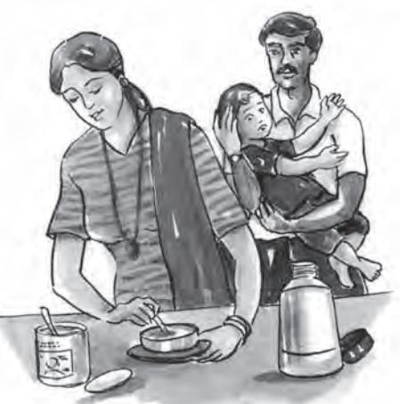
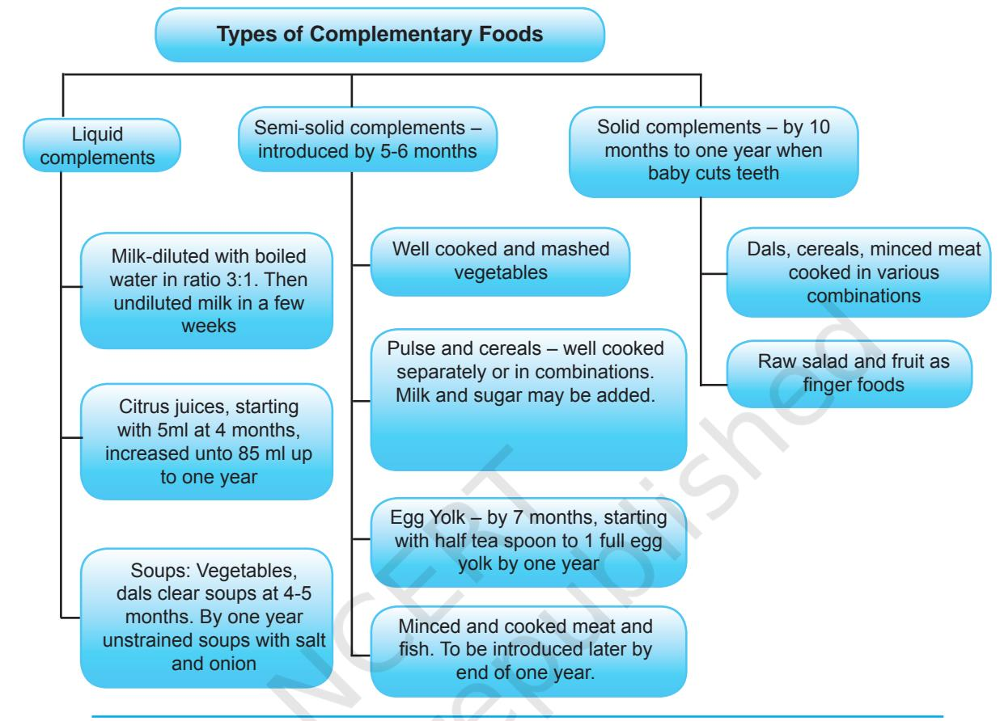

# **UNIT III**

# Childhood

151 *The theme of this unit is 'Childhood'. You may wonder why did the book address the adolescent years first and childhood later. Well, it is because if you as an adolescent understand issues about yourself first, it would be easier to grasp the issues that are concerned with the stage of childhood, and later with adulthood. In this unit you will be studying about, critical concerns of children about their health, nutrition, education and clothing. As we would like children with disabilities to be an inclusive part of our society, the chapters provide us important information on their needs and ways to meet them.*

unit_3_as_26_7_09_cyan-Final.indd 151 2/9/2023 12:09:40

#### Learning Objectives

After completing this chapter the learner is able to–

- describe the nutritional needs of children at different stages of development.
- make suggestions for planning balanced meals for children
- discuss food habits of children.
- identify important health and nutrition related problems of children.
- describe the immunisation schedule.

# **8.1 Introduction**

152

Do you remember learning about food and nutrition in Chapter 5? You also learnt about aspects of survival, growth and development of children in the previous chapter? Let us go over some important points again, briefly. Our diet is made up of the foods we eat. Nutrition is "food at work", a process by which we obtain nutrients and metabolise them for growth, repair and well-being. When we talk of nutrition we need to understand the composition of foods and to know which food provides what nutrients.

Let us now focus on nutrition, health and well-being of children.

Children grow continuously and so their nutritional needs depend on their rate of growth, body weight, and on how effectively the nutrients are utilised at each stage of their development. Since physical and mental development takes place very rapidly in children, nutritional deficiency at this stage can result in lifelong impairments and disabilities. On the other hand, adequate nutrition ensures that the children grow to their full potential. We, therefore, need to understand the art of balancing their

unit_3_as_26_7_09_cyan-Final.indd 152 2/9/2023 12:09:42

food intake while enjoying variety of foods from all the food groups. It is generally believed that good nutrition is reflected in height and weight gained by children, but effectively it improves and maintains their well being in totality. Adequate nutrition contributes towards–

- functions of the organs and systems of the body.
- cognitive performance.
- body's ability to fight diseases and restore healing.
- increase in energy levels.
- develop pleasant and positive attitude.

# **8.2 Nutrition, Health and Well-being During Infancy (birth-12 months)**

Infancy is marked by rapid growth; and changes especially during early infancy (birth–6 months) are phenomenal. In fact, it is known that infants require twice as many calories per kg of body weight as required by an adult doing heavy work. It is possible to fulfil this requirement through adequate nutrition. Besides energy, children should get:

#### **Did you know?**

#### **In infants–**

- • Weight–doubles in 6 months, triples in 1 year
- • Length—50-55cm at birth increases to 75 cm by 1 year
- • Head circumference and chest circumference both increase.

153

- **Protein** For muscular growth.
- **Calcium** For healthy bones.
- **Iron** For growth and expansion of blood volume.

## Dietary requirements of infants

Infants are able to regulate their needs by consuming more milk or less milk. Their nutritional requirements are met through the composition of breast milk and contributions from complementary foods given to them.

The recommended nutrients are computed on the basis of composition of mother's milk. An average secretion of 850 ml of breast milk of a wellnourished mother should provide all the nutrients for the first 4–6 months. The baby thrives well if the mother is well nourished. She must, therefore, eat a diet rich in protein, calcium and iron and consume adequate quantities of fluids like milk, soups, fruit juices, and even water to avoid malnutrition.

unit_3_as_26_7_09_cyan-Final.indd 153 2/9/2023 12:09:42

| Human Ecology and Family Sciences |
| --- |

| Table 1: Recommended Dietary Allowances for Infants |  |  |
| --- | --- | --- |
| Recommended by ICMR* |  |  |
| Nutrient | Birth to 6 Months | 6-12 Months |
| Energy (Kcal.) | 108 / kg body weight | 98 / kg body weight |
| Protein (gm) | 2.05 / kg body weight | 1.65 / kg body weight |
| Calcium (mg) | 500 | 500 |
| Vitamin A |  |  |
| Retinol (µg) | 350 | 350 |
| Or |  |  |
| Beta Carotene(µg) | 1200 | 1200 |
| Thiamine (µg) | 55 / kg body weight | 50 / kg body weight |
| Niacin (µg) | 710 / kg body weight | 650 / kg body weight |
| Riboflavin (µg) | 65 / kg body weight | 60 / kg body weight |
| Pyridoxine (µg) | 0.1 | 0.4 |
| Ascorbic Acid (µg) | 25 | 25 |
| Folic Acid (µg) | 25 | 25 |
| Vitamin B12 (µg) | 0.2 | 0.2 |

** Indian Council of Medical Research (ICMR),2010*

# 154 Breast feeding

Mother's milk is nature's gift to the newborn baby. It is enriched with all the required nutrients which are easily absorbed. WHO recommends exclusive breast feeding for six months. During breast feeding even water is not required. Babies should be put on breast milk soon after birth. During the first 2–3 days a yellow coloured fluid known as **colostrum** is produced. Babies must be fed on it as it is very rich in antibodies and protects a child from infections.

#### **Benefits of breast feeding**

- It is nutritionally tailor-made for meeting the infant's nutritional needs.
- It is enriched with all the nutrients in required proportion and form (e.g,. the fat present is emulsified). Its low amount of protein reduces pressure on the kidneys and Vitamin C is also not destroyed.
- It is a simple, hygienic and convenient method of feeding both for the mother and the child. Milk is available at all times and at the right temperature.

unit_3_as_26_7_09_cyan-Final.indd 154 2/9/2023 12:09:42

- It protects babies from gastro-intestinal, chest, and urinary infections due to the presence of antibodies in it giving it natural immunity, and it is free from allergens.
- It gives protection to mothers against breast and ovarian cancers, and also from developing weak bones.
- It is very conducive for a healthy, happy emotional relationship between the mother and the child.

Babies know when and how much they want and so the "best clock is baby's hunger", though efforts must be made towards regularising the feeding intervals, after a baby reaches one month of age.

#### Feeding the low birth weight infant

You may know that some children are born low in body weight. A baby weighing less than 2.5 kgs at birth is considered as low birth weight. The problems facing such babies are that they have poor sucking and swallowing reflexes. Their absorption capacity is also very low because of the small size of their stomachs and intestines, but they have a relatively high calorie requirement. Breast milk produced by their mothers has all the essential amino acids, calories, fat and sodium content. It meets all their requirements. Anti-microbial property of their mother's milk protects them from infections.

So, undoubtedly, mother's milk is the best food for low birth weight babies. Simultaneously, they require vitamins, calcium, phosphorus, and iron to promote steady growth. Dietary supplements should be considered only if the baby does not gain weight satisfactorily.

#### Complementary foods

Complementary feeding is the process of gradually introducing other foods along with breast milk. Foods that are introduced are thus called complementary foods. These can be introduced by 6 months of age. It is important that in the process of complementary feeding good hygienic conditions must be maintained when using feeding bottles and utensils to avoid infection to the baby.

In order to ensure the fulfilment of nutritional needs of infants,

155

unit_3_as_26_7_09_cyan-Final.indd 155 2/9/2023 12:09:43

Table 2 : Types of Complementary Foods

complementary foods should be calorie-dense and should provide at least 10 per cent of energy as proteins.

#### **Some low cost complementary foods**

- y Indian multipurpose flour low fat groundnut flour and bengal gram (75:25)
- y Malt food cereal malt, low fat groundnut flour and bengal gram (4:4:2)
- y Balahar whole wheat, groundnut and bengal gram flours (7:2:2)
- y Win food pearl millet, green gram dal, groundnut and jaggery (5:2:2:2)
- y Poshak cereal (wheat/maize/rice/jowar) pulse (*chana*/green gram), groundnut and jaggery (4:2:1:2)
- y Amutham rice, ragi, bengal gram and sesame, groundnut flours and jaggery
- y (1.5:1.5:1.5:2.5:2.5)

156

- y Amritham wheat, bengal gram, soya and groundnut flours and beet sugar (4:2:1:1:2)
All these foods are prepared from locally available cereals which are roasted and mixed in relevant proportions as shown, seasoned and fortified with vitamins and calcium. They are very nutritious and can be easily prepared at home.

unit_3_as_26_7_09_cyan-Final.indd 156 2/9/2023 12:09:43

## Guidelines for complementary feeding

- Only one food should be introduced at a time.
- Small quantities should be fed in the beginning which can be gradually increased.
- Do not force if the child dislikes any food. Try something else and re-introduce later.
- Spicy and fried foods should be avoided for small babies.
- All types of food should be encouraged without showing personal dislikes.
- Variety in foods is very important to make new foods acceptable.

#### **Activity 1**

Ask your parent/grandparent/aunt about the traditional complementary foods of your region. Do you think these foods are nutritious? Give reasons for your answers.

#### Immunisation

Good health and well-being are not entirely dependent on good nutrition. We all are aware of the role of immunisation in protecting children from various diseases.

You may be interested in knowing how immunisation protects children from diseases. A vaccine that contains an inactive form of a bacterium/virus/toxin made by the germ is injected in the child. Being inactive it does not cause infections but induces white blood cells to produce antibodies. These antibodies then kill the germs when they attack the child's system.

| Table 3: National Immunisation Schedule |  |
| --- | --- |
| (Recommended by ICMR) |  |
| Age of the child | Vaccine |
| Birth | BCG, OPV, HEP B |
| 6 weeks | OPV, PENTA (DPT, HEP B, HiB) |
| 10 weeks | OPV, PENTA (DPT, HEP B, HiB) |
| 14 weeks | OPV, PENTA (DPT, HEP B, HiB) |
| 9 months | MR (Measles, Rubella) |

1. BCG-Bacillus Calmette-Guerin (anti TB)

- 2. OPV-Oral Polio Vaccine
- 3. DPT-Diphtheria, Pertusis and Tetanus
- 4. HEP B- Hepatitis B
- 5. Hi B- Haemophilus influenza type b bacteria

**Source:** *National Immunisation Schedule, Government of India*

157

unit_3_as_26_7_09_cyan-Final.indd 157 2/9/2023 12:09:43

## Common health and nutrition problems in infants and young children

We have learnt in Chapter X in Part I how malnutrition and infections are interrelated. In fact malnutrition is a national problem. It is a consequence of several factors such as illiteracy, poverty, ignorance about nutritional needs of children, and poor access to health care, especially in rural and tribal areas.

Children begin to be malnourished when breast milk is no longer available in adequate amounts and they continue to remain so till they can make full use of the family diet. During this period incidence of diarrhoea is very common in infants. It results in depletion of water and electrolytes from the body and this condition is a major cause of infant mortality. Research evidence favours the view that nutritional factors play a role in causation of tuberculosis particularly in populations subjected to food shortage. Primary herpes simplex is another infectious disease which affects children if they are suffering from malnutrition at the same time.

 Nutritional deficiency diseases may set in at this stage if the infant is not exclusively breast fed and when complementary foods do not meet the nutrient needs of infants. Let us list the important deficiency diseases that may occur in childhood precisely

- Protein Energy Malnutrition (PEM): leads to growth retardation and infections leading to diarrhoea and dehydration
- Anemia : caused due to iron deficiency
- Nutritional blindness : results due to vitamin A deficiency
- Rickets and osteopenia are bone-related : due to shortage of vitamin D and calcium
- Goitre (enlargement of the thyroid gland) : due to deficiency of Iodine

Much of the major effects of nutrition on communicable diseases have already been focussed in the previous chapter. The six dreaded communicable diseases namely polio, diphtheria, tuberculosis, pertusis, measles and tetanus compound the incidence of mortality and morbidity, more so in developing countries like India. The low age of attack is one more factor responsible for high fatality. The problem worsens when infection and malnutrition co-exist in the same infant. Immunisation given at different stages of the first year of life gives life-long immunity to children against communicable diseases.

In rural and tribal areas, factors such as poor access to health centres, climatic conditions, certain local customs, and use of untested traditional methods of treatment increase the child's susceptibility to infectious diseases. There is need to inform people about the health hazards of contaminated food, poor environmental sanitation and inadequate personal hygiene and their role in causing communicable diseases.

158

unit_3_as_26_7_09_cyan-Final.indd 158 2/9/2023 12:09:43

## **CHECK YOUR PROGRESS** • What do DPT, OPV and BCG vaccines stand for? • How does diarrhoea result in dehydration? • Why is the mother's health and nutrition important to avoid deficiency diseases in infants?

- Classify complementary foods.
# **8.3 Nutrition, health and well-being of preschool children (1-6 YEARS)**

Preschoolers, as you all know are very energetic, active and spirited. The rapid growth of infancy is comparatively slowed down now. But the child is very active. There continues to be physical, mental and psychological development.

Preschoolers are still developing their eating habits and working on chewing and swallowing skills. It is, therefore, an excellent time to help the child become familiar with eating healthy meals and snacks. Healthy eating habits formed during these years are likely to be reflected in their food behaviour later on.

### Nutritional needs of preschool children

Basic nutritional needs of preschoolers are similar to the nutritional needs of other members of the family. The amounts needed differ because of age, height, current weight and health status, and also their activity level. There is also an increased demand for energy to support growth and development.

|  | Table 4: Recommended dietary allowances for preschool children |  |
| --- | --- | --- |
|  | (Recommended by ICMR), 2010 |  |
| Nutrient | Age in years: 1–3 years | Age in years: 4–6 years |
| Energy(Kcal) | 1240 | 1690 |
| Protein(g) | 22 | 30 |
| Fat(g) | 25 | 25 |
| Calcium(mg) | 400 | 400 |
| Iron(mg) | 12 | 18 |
| Vitamin: Retinol(µg) | 400 | 400 |
| Or Beta-carotene(µg) | 1600 | 1600 |
| Thiamine (mg) | 0.6 | 0.9 |
| Riboflavin (mg) | 0.7 | 0.1 |
| Niacin (mg) | 8 | 11 |
| Vitamin C (mg) | 40 | 40 |
| Pyridoxine (mg) | 0.9 | 0.9 |
| Folic Acid (µg) | 30 | 40 |
| Vitamin B-12 (µg) | 0.2-1 | 0.2-1 |

159

unit_3_as_26_7_09_cyan-Final.indd 159 2/9/2023 12:09:43

It is important to note here that because of basal losses and additional requirements, needs may vary a little from child to child.

### Guidelines for healthy eating for preschoolers

We know that like many other habits the child should also develop good food habits early in life. In order to teach them that "healthy eating is part of healthy life style" one can follow the suggestions given below–

- Mealtime can be a family time. Eating together as a family in a pleasant and enjoyable atmosphere helps children. Children learn by imitating the eating behaviour of other members of the family.
- Variety is one of the important aspects and hence offering a choice of foods in child size portions is important. The child should be taught to finish everything on the plate. At the same time give them enough time to finish.
- There should be regularity in mealtime and snack time so the child gets properly hungry.
- Put new items on the menu along with the child's preferred foods. A balance between hard, soft and colourful foods should be maintained to stimulate interest.
- Menus must include dishes which are easy to handle and eat, like in the form of finger foods such as small sandwiches, *chapatti* rolls, small size *samosas/idlis*, whole fruit or hard boiled eggs.
- Serve meals at one place and not when the child is walking around. You may want to select suitable seating arrangements for the physical comfort of the child.
- Above all, have the child rest before meals. A tired child may not be interested in eating.
- It is suggested that never ever bribe or punish the child to eat and finish certain foods. It is injurious to building healthy food habits.

## Planning balanced meals for preschool children

An active preschool child's energy needs rival those of some grown up women. So we need not track their calorie consumption. But given the velocity of growth and activity, if the child is denied of nutritious balanced meals, she/he may not achieve her/his full genetic potential for adult height. It may affect the health also. Children suffer from Protein-Energy Malnutrition (PEM), xerophthalmia (vitamin A deficiency) and anaemia if protein, vitamin A and iron respectively are lacking in their meals. Universal use of iodised salt is a simple and cheap method of preventing Iodine Deficiency Disorders.

The diet of a preschool child should emphasise three aspects–

- **– Variety** in textures, tastes, smells and colours, to broaden a child's nutritional intake and eating experience,

160

unit_3_as_26_7_09_cyan-Final.indd 160 2/9/2023 12:09:43

- **Balance** of complex carbohydrates, lean proteins and essential fats,
- **Moderation** while indulging in sweets, ice creams, fast foods rich in fats and refined flours.

 Now do you remember the five food groups you learnt in Chapter III in part I? The five food groups suggested by ICMR permit us to plan balanced meals according to our recommended dietary allowances. While planning daily diets foods must be chosen from all the food groups. In order to make planning more convenient, ICMR has suggested diets for different age groups. We could refer to Table 5 below for the quantities of various food groups to be included in a balanced diet for preschool children.

|  |  | Table 5: Balanced Diet for Preschool Children |  |
| --- | --- | --- | --- |
|  |  | (Recommended by ICMR), 2010 |  |
| S.No. | Food Groups |  | Quantity (gm) |
|  |  | 1–3 years | 4–6 years |
| 1. | Cereals and Millets | 60 | 120 |
| 2. | Pulses | 30 | 30 |
| 3. | Milk (ml) | 500 | 500 |
| 4. | Fruits and vegetables |  |  |
|  | Roots and tubers | 50 | 100 |
|  | Green leafy vegetables | 50 | 50 |
|  | Other vegetables | 50 | 100 |
|  | Fruits | 100 | 100 |
| 5. | Sugar | 15 | 25 |
|  | Fats/Oils (visible) | 20 | 25 |

Now we should be able to plan three meals and two snacks for a preschool child. You may be wondering why snacks. Because it is hard for the preschoolers to eat enough in three meals, healthy snacks in between meals provide the calories and nutrients they need. Besides snack time is a good time to introduce new foods. Snacks also go well in school tiffin.

Let us look at a situation and analyse how we can plan snacks and meals for a preschooler.

The parents of a six years old child can plan and prepare the following meals for a day–

**Breakfast:** Wheat porridge cooked in milk/bread or *roti*, egg and seasonal fruit.

**School tiffin:** Sandwich with vegetable filling and a healthy drink.

**Lunch:** Vegetable/*paratha*/*roti*, rice, curd, boiled *channa* and salad.

161

2024-25

unit_3_as_26_7_09_cyan-Final.indd 161 2/9/2023 12:09:43

#### **Evening snack:** Milk, biscuit/peanuts and fruit.

**Dinner:** *Chapati*/rice, dal/chicken, cooked seasonal vegetable and salad. Now how do you rate the parent's attempt to plan and serve balanced *meals* to the child?

Snacks served to the children in the different regions include items such as *murukku, laddoos, upma, mathi, chana-chur* which are traditional preparations and are nutritious. The high activity levels of children increases the energy needs and hence such snacks may be useful in providing enough calories to meet their needs.

#### Some examples of low cost snacks

- Equal amounts of *soya bean dal* and sunflower seeds are ground, mixed and fermented together.
- Sweet *chikki* (like traditional peanut *chikki*) has great acceptability in rural and semi-urban areas of India.
- Indigenous foods such as flours of rice, cow pea, horse grain and amaranths, jaggery are mixed in equal amounts with ground nut oil to prepare various snacks.
- *Sundal*, *Payasam*, *Dhokla* and *Upma* are popular snacks.
- Vegetable soup prepared from seasonal and locally available vegetables. Even leftover vegetables, dals and cereals can be added.
- Spiced baked potatoes.
- *Chiwrha (poha)* prepared from rice, wheat or maize flours or other products and stuffed with seasonal vegetables can be served with sauce.

#### **Activity 2**

You are asked to take care of a four-year-old child for a day from 10 am to 6 pm. Keeping a balanced diet in mind suggest what you will serve to her/him for meals and snacks.

#### Feeding children with special needs

Feeding children with special needs often poses challenges at mealtimes. While helping them with feeding and other nutritional issues, three main aspects have to be taken into account–

162

unit_3_as_26_7_09_cyan-Final.indd 162 2/9/2023 12:09:43

**Observations:** Closely observe the child's behaviour and progress at mealtimes. Observe their abilities to handle food, food preferences, allergies and any specific condition. Promote and help them develop the skill they need to get adequate nutrition and experience pleasant mealtimes.

**Developing eating skills:** Children with disability are likely to require more time to eat. They often struggle to feed themselves and make bigger messes. Focus on positive reinforcement to keep them motivated and prevent resistance.

Make sure the child is seated comfortably and avoid feeding her/him if she/he can do it himself. Help them develop self-feeding skills.

Allow the child to eat increasingly challenging textures as she/he progresses. Adaptive equipment may be used if needed.

Respect the child's food preferences, eating space and whether or not she/he chooses to eat. Try and set regular feeding timings.

**Special diets:** Some of the children may require modifications in their diets and mealtime routine depending on their ability. Spastic children may struggle with different food textures. Thin liquids may be thickened and dry or lumpy foods can be chopped or softened to make it easier for the child to swallow. A feeding tube may be used if required.

Some children with disability have a tendency to be overweight making eating difficult. Children with autism have an altered sense of taste or smell affecting their acceptance of food. Depending on their choices extra fat, limited liquids, special formula or other dietary changes may be needed.

All foods to which a child with special needs is allergic should immediately be removed from her/his diet as it may cause damage.

#### Immunisation

Some more vaccinations in combating communicable diseases are due now. Refer to Table 6 below and note that the preschool child is now due for measles, mumps and rubella (MMR) and Typhoid Vaccines besides booster doses of DPT and OPV.

|  | Table 6: Immunisation schedule |
| --- | --- |
| Age of Child | Vaccine |
| 15–18 months | MMR (for measles, mumps and rubella ) |
| 16 months–2 years | DPT, OPV-booster doses |
| 2 years | Typhoid Vaccine |
| 5 years | DT |
| 10 years and 16 years | Tetanus Toxoid (TT) |
| 18,24,30,36 months | Vitamin A (drops) |

unit_3_as_26_7_09_cyan-Final.indd 163 2/9/2023 12:09:43

#### **CHECK YOUR PROGRESS** 1. How many Kcal of energy is required by a four-year-old child? 2. What is the importance of iodine, iron, calcium and protein in the diet of preschool children? 3. Which are the three aspects to be taken into account while planning diets for preschoolers? 4. Why are snacks important in a preschooler's diet? 5. What is MMR vaccine for?

# **8.4 Health, nutrition and well-being of school-age children (7-12 years)**

School age children too are extremely active physically. With the incidence of communicable diseases out of the way, the child is now quite strong. You may notice that the growth pattern is rather slow now. Instead body changes occur gradually, especially from 9 to 10 years onwards, when boys and girls show different growth patterns.

#### Nutritional requirement of school children

Though it is a latent period of growth there are several activities to pack in the child's day now. Retaining her/his energy is therefore very crucial. Nutritional requirements are the same for both boys and girls upto the age of 9 years after which there is a change in some of the nutrient requirement for boys and girls. You may recall that the energy requirements for girls remain almost the same throughout but they need increased amounts of protein, iron and calcium to help bone growth and preparation for menarche. Boys of 10-12 years need enough calories to maintain adequate reserves for the spurt in their growth during adolescence.

| Table 7: Recommended Dietary Allowances of |  |  |  |
| --- | --- | --- | --- |
| School Age Children (7–12 Years) |  |  |  |
| (Recommended by ICMR) |  |  |  |
| Nutrients |  | Age (in years) |  |
| 7-9 |  | 10-12 |  |
|  |  | Boys | Girls |
| Energy (k. cal) | 1690 | 2190 | 2010 |
| Protein (g.) | 29.5 | 39.9 | 40.4 |
| Fat (g.) | 30 | 35 | 35 |
| Calcium (mg.) | 600 | 800 | 800 |
| Iron (mg) | 16 | 21 | 27 |
| Vitamin A |  |  |  |
| Retinol (µg) OR | 600 | 600 | 600 |
| Β Carotene (µg) | 4800 | 4800 | 4800 |
| Thiamine (mg) | 1.0 | 1.1 | 1.0 |
| Riboflavin (mg) | 1.2 | 1.3 | 1.2 |
| Pyridoxine (mg) | 1.6 | 1.6 | 1.6 |
| Folic acid (µg) | 120 | 140 | 140 |
| Ascorbic acid (mg) | 40 | 40 | 40 |
| Vitamin B12 (mg) | 0.2-1 | 0.2-1 | 0.2-1 |
| Niacin (mg) | 13 | 15 | 13 |

unit_3_as_26_7_09_cyan-Final.indd 164 2/9/2023 12:09:43

## Planning diets for school-age children

Following all aspects and guidelines of diet planning for preschool children, it may appear that by school age the children establish a particular pattern of food intake. To an extent you are right but planning balanced meals for school children may differ in other aspects. Let us discuss these briefly.

**Aim for variety:** We know that no single food can provide all the nutrients in the amount the child needs every day. The most consistent nutrition message therefore is to eat a variety of foods. Variety also increases the likelihood of accepting new foods.

**Ensure good nutrition:** We know that children at this age need more protein, calcium, iron and iodine. They must be encouraged to eat vegetables, fruits, whole grains. Fruits

and vegetables improve the macronutrient density in their diets and whole grains reduce the risk of diseases like cardiovascular and diabetes. Iodised salt, as mentioned earlier, is the easiest way to avoid iodine deficiency.

**Limit intake of saturated fat, salt and sugar:** You know that the growth of school children has now slowed down. Maintain fat calories to 20 per cent of total calories. Diets rich in fats and sugars increase the risk of obesity and its related problems. Foods with added sugars are also a cause of dental caries. A high sodium intake may increase blood pressure leading to major risk factors of stroke, kidney and coronary diseases. Do you know that young children are frequently falling prey to diabetes and high blood pressure now-a-days?

**Ensure eating breakfast:** Breakfast is a special meal. It should contain more of protein and energy. After the long night's fasting the child should never be allowed to skip breakfast. Skipping breakfast will negatively affect her/his physical and mental performance, and the loss of calories and nutrients cannot be made up later in the day.

**Involve children in meal planning:** As children grow older they can be involved in planning their meals. It will make healthy eating interesting for them. Amrita has an 8-year-old son and 10-year-old daughter. She talks to them about making choices and planning balanced meals. She even takes them along to buy ingredients, at the same time she teaches them what to check while buying raw food material. Don't you think she makes the task of serving them nutritious meals attractive? Besides, encourage children in age- appropriate tasks of cooking their meals, and serving. They often get excited and develop healthy and positive concepts of food.

165

unit_3_as_26_7_09_cyan-Final.indd 165 2/9/2023 12:09:43

Besides following the guidelines for planning balanced diets you may refer to Table 8 for the quantities of foods to be consumed by school going children as recommended by ICMR:

|  |  | Table 8: Balanced Diet for School Going Children (ICMR), 2010 |  |  |
| --- | --- | --- | --- | --- |
| S.No. | Food Groups |  |  | Quantities (g) |
|  |  | 7–9 |  | 10–12 years |
|  |  | years | Boys | Girls |
| 1. | Cereals and Millets | 180 | 300 | 240 |
| 2. | Pulses and Legumes | 60 | 60 | 60 |
| 3. | Milk and products | 500 | 500 | 500 |
| 4. | Fruits and vegetables |  |  |  |
|  | Roots and Tubers | 100 | 100 | 100 |
|  | Green Leafy Vegetables | 100 | 100 | 100 |
|  | Other Vegetables | 200 | 200 | 200 |
|  | Fruits | 100 | 100 | 100 |
| 5. | Sugars | 20 | 30 | 30 |
|  | Fats | 30 | 35 | 35 |

Amrita and Ankit very particular about serving three balanced meals and two healthy snacks to their **school age children**. Let us view the diet plan prepared by them for their children for today. You can use it as cross reference.

- **Breakfast:** Milk and cornflakes, *Rawa upma* and an apple or any seasonal fruit
- **School Tiffin:** Grilled sandwich with egg filling for their daughter but *paneer* filling for the son (who is allergic to egg) and a seasonal fruit.
- **Lunch:** Vegetable *pulao,* tomato rings and cucumber sticks for salad and butter milk.
- **Evening Snack:** Boiled potato and *moong* sprout *chaat*.
- **Dinner:** Bengal gram *dal* or chicken curry, okra and onion vegetable, *chapati* and raw salad.

In rural areas the breakfast may consist of items such as *upma* (with banana), *pootu* (with *chana* curry or banana), *idli* or *dosa* (with *sambar*/ coconut chutney) or *appams* (with potato/chicken curry) in the south or *paranthas* with buttermilk or *poori* with potato preparation in the north. Snacks may include items prepared from rice flour with a filling of jackfruit and a paste of nuts or rice flour extruded from a mould in thin strands – both items being steamed. *Murukku* is another item that can be served as a snack for older children. In tribal areas emphasis is placed on foods gathered from the forest such as nuts, berries and other fruits/flowers obtained from trees. Lunch and dinner can consist of *chapattis* and rice, a pulse/*dal* preparation and a vegetable preparation.

166

unit_3_as_26_7_09_cyan-Final.indd 166 2/9/2023 12:09:43

#### **Activity 3**

Suppose you have a 9-year-old sister and an 11-year-old brother, and both are vegetarian. Suggest what you will serve them for breakfast and dinner.

Factors that influence diet intake of preschool-age and school-age children

Despite all the planning and preparation of the child's meals, chances are that the younger child is missing out on some vital nutrients. Do you know why? Because children are in the process of developing their eating habits and many factors are influencing these habits. These are discussed below.

**Family environment:** Put simply, families that use positive parenting practices encourage total well-being of children. We generally observe that with or without conscious effort the family guides and shapes the food preferences and establishes the food patterns of their school children. Parents should therefore acquire proper nutritional knowledge and incorporate it into planning diets for their children. Eating together in a comfortable and happy atmosphere is conducive to good eating habits and nutrient intake.

**Media:** TV commercials and their favourite film stars endorsing the products have very strong influence. More exposure, more independence and above all more understanding of the catchy slogans tempts children of this age. Attracted by the messages conveyed by commercials they insist on foods which are low in fibre, and high in sugar, fat and sodium. Similarly, an attractive display of foods with harmful additives during festivities influences their between meals snacking which in turn lessens their appetite for proper meals. A conducive family environment would help to combat this issue.

**Peers:** As the child enters school, there is a change of dependence from parental standards to those set by the peer group. So food intake may differ from what is followed at home due to peer influence. Adequacy in terms of nutrients does not depend on what food is available to children of this age but on what their friends eat. Children usually eat well in the company of friends. The tiffin given for school is often finished. When they eat along with their peers, they are willing to eat new foods which they otherwise refuse. In order to promote a positive attitude towards good food habits in preschoolers it is best to have group settings.

**Socio-cultural Influences:** Every region has its typical foods and flavours. The family usually serves the same food to young children that 167

unit_3_as_26_7_09_cyan-Final.indd 167 2/9/2023 12:09:43

adults eat. Eating with the family encourages children to like foods typical of their own region, and also of other regions. As an example, children in the north of India enjoy eating southern dishes such as *idlis* and *dosas*  with relish, while children in southern states like *parathas* and *rajma*-rice of the north.

**Erratic Appetite:** You may notice that the child may eat one meal well while refusing the next altogether. This should not be worrying because these are temporary moods and disappear if not reinforced by bribes, punishments or rigid rules.

#### Healthy habits

Now you can understand that **good health is a blend of physical and emotional well-being.** Besides adequacy of food in terms of nutrients, school children need to develop some **healthy habits**–

- **Establish sensible eating habits:** Children at this age sometimes turn into munching machines glued to the TV and having no physical activity. Radha has an innovative solution for a situation like this. She prepares a bowl of fruit and vegetable salad with lots of lettuce leaves, some nuts/sprouts/boiled chick peas/steamed beans or carrots/ tofu or paneer chunks, adds some interesting dressing and serves this in plenty. She keeps changing the combinations giving them fancy names.
- **Encourage physical activity:** Healthy eating and physical activity go hand in hand with moderate activity of 45–60 minutes promotes good health. Limit television watching and encourage sports. Children should be encouraged to take part in extracurricular activities of school and community. Parents have to be a model on active lifestyle and healthy eating patterns.
- **Ensure food safety:** Children should be trained to eat under hygienic conditions. Food consumed should be clean and safe before eating. They must wash their hands, fruits, and vegetables before eating. My neighbours Kanta involves her children in washing, cutting, mixing and cooking (under her supervision). It has become their habit to prepare and eat food under hygienic conditions.
- **Ensure control over quantity intake:** Children of 9–12 years can gauge how hungry they are. We must never force them for more if they do not want to eat. Doing so will override their feeling of fullness. Food should not be used as a way of showing love. Besides, skipping a meal is no problem as long as the child is healthy. But this should not be made a habit.

2024-25

unit_3_as_26_7_09_cyan-Final.indd 168 2/9/2023 12:09:43

### Health and nutrition issues of school age children

With the concerted efforts of parents in following immunisation schedules and healthy nutrition pattern the child by this time is strong enough to fight occasional colds and cough.

You may know that **obesity** is a growing health risk among children now. This is largely due to a diet rich in fatty foods high in salt, low in fiber and beverages with added sugar. Non-active lifestyle further complements the situation. The problem is more among children from higher socioeconomic sections of our society.

Type II diabetes and hypertension, earlier rare among children, are becoming more common among youngsters nowadays. This is attributed to the rise in childhood obesity.

**Under nutrition** still remains a serious health hazard among lower socio-economic groups. Children from poor families go to school on an empty stomach. The result is that these malnourished children are not likely to perform well in school. Instead they are at a greater risk of morbidity and mortality.

The mid-day meal scheme (MDMS) implemented by our government provides free lunch to school children from Classes I–VIII. The scheme has shown very good results. Teachers report that classroom performance and attention spans of children have improved significantly. Not only has this school enrolment increased but drop-out rate has declined too. MDMS has been shown to reduce the gender gap in education by boosting female attendance.

In our country we face the dual problem of undernutrition as well as over-nutrition. So if we continue to spread the benefits of healthy nutrition it will have an impact in the long run. Besides "School Health" programmes providing free health checks and treatment will increase overall well-being of children.

The overall development of children requires concerned care and quality education. This is what will be discussed in the next chapter.

#### **Key terms and their meaning**

**Complementary feeding:** Inclusion of other foods to the infant's diet in addition to breast milk

**Malnutrition:** Refers to both undernutrition and overnutrition. In undernutrition the body suffers due to lack of nutrients and in overnutrition the body suffers due to excess of nutrients.

**Obesity:** Deposit of excess fat in the body leading to body weight rising above normal levels. This is caused by intake of more calories than can be spent on body metabolism and physical activity.

unit_3_as_26_7_09_cyan-Final.indd 169 2/9/2023 12:09:43

**Hypertension:** High blood pressure

**Diabetes:** Deficiency of insulin in the body leading to rise in blood glucose and presence of glucose in the urine.

## Review Questions

- 1. Why should we limit the intake of saturated fats, excess sugars and salt in a school child's diet?
- 2. How does involving children in meal planning help in healthy eating?
- 3. "Childhood obesity is on the increase." Give reasons.
- 4. How has the Mid-day Meal Scheme" boosted children's health as well as school performance?

#### Suggested activities

- (a) You are visiting your native village or any other village where you find that children are malnourished and victims of many resulting diseases. If you were asked to talk to the parents what would you say about–
	- (i) role of adequate nutrition in protecting children from diseases?
	- (ii) planning balanced meals for young children?
	- (iii) communicable diseases and importance of immunisation?
	- (iv) immunisation schedule during preschool years?
- (b) Your neighbour's two-month-old child suffers from diarrhoea repeatedly. Explain about–
	- • Nutritional needs of infants
	- • Importance of exclusive breast feeding for the baby's health and development
	- • Low cost complementary foods and their preparation from locally available food stuffs
- (c) Enlist and explain briefly the steps involved in developing healthy food habits in school going children.
- (d) Explain the aspects you will take into account in helping children with special needs with nutritional issues–
	- (i) Observation
	- (ii) Physical activity
	- (iii) Developing eating skills
	- (iv) Variety

170

- (v) Special diets
- (e) How do family, media and peers influence the food intake of children?

unit_3_as_26_7_09_cyan-Final.indd 170 2/9/2023 12:09:43

