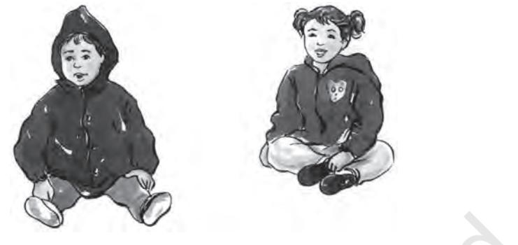

**9**

171

# Our Apparel

### Learning Objectives

After completing this chapter the learner is able to —

- discuss the clothing functions and the factors influencing selection of clothes.
- identify general clothing needs of the children.
- recognise the characteristic features and clothing requirements of children from different age groups.
- discuss the clothing needs of children with special needs.

 When you meet people for the first time what impacts you the most? Their clothing, or face or their personality or all of these? Our posture, walk, smile or frown and other forms of body language contribute to the impression we create. Actually of all these aspects clothing creates the first impression. We recognise that good appearance is important. In order to appreciate the true importance of dress or clothing we need to discover how we feel about the clothes we wear.

## **9.1 Clothing Functions and the Selection of Clothes**

Look at the clothes you are wearing today and think about why you are wearing them. May be it was the weather that determined what you chose or the kind of activity in the school that you were to perform or may be the function you were to attend with your family or friends, or for no particular reason.

We all wear clothing and we wear different types of clothing. Let us begin to understand why we select the clothing we wear. At the same

unit_3_as_26_7_09_cyan-Final.indd 171 2/9/2023 12:09:46

time let us gain some insight into other people's reasons for their clothing choices.

#### Modesty

Probably the most obvious reason for wearing clothes is simply that in our society, people do not go around without them; we wear clothing for modesty. You probably know that young children do not feel embarrassed going about without any clothing. The need to have their bodies covered is something that they are taught.

Ideas about modesty are shaped by the society in which we live. What is considered modest in one society might not be considered as modest in another. For example in some communities women not covering heads may be considered as a sign of immodesty, whereas, in other communities women not covering their legs is thought to be immodest.

#### Protection

172

We wear clothing to protect ourselves from the environment – from harsh weather conditions, dirt and pollution. We change our clothing according to the different seasons. In hot summer months we wear light weight cotton clothes and may even cover our heads to protect ourselves from the scorching sun, whereas in winter months we cover ourselves in layers of woollen clothing for protection.

Clothing can also protect us from physical harm. Fire fighters wear special clothing for protection from fire, smoke and water. Many sports activities such as football, hockey and cricket require clothing that is specially designed to protect the players from injury. You must have noticed the arm guards, leg guards, wrist bands that these players wear along with their normal dress for special protection.

#### **Activity 1**

Can you identify the clothing that is needed in the rainy season? What type of fabrics, garments and accessories are needed in that weather? Make a list and discuss with your friends.

### Status and prestige

Clothes can also be a sign of status. It used to be true that you could identify people's social and economic status by their clothing. You may have seen in certain historical films that the king's and courtesan's clothing are quite different from the common people's clothing. Everybody's sense of identity

unit_3_as_26_7_09_cyan-Final.indd 172 2/9/2023 12:09:46

includes a feeling of social status or prestige, and the manner of dress is one way by which this can be accomplished. In India on festivals and important family events people wear clothes that may reflect their social status.

However, as more and more stylish clothing become available at reasonable prices, today many more young people can afford to buy them. Thus, as similar kinds of clothing (T-shirt, jeans, salwar-kurta) become available for all ages and economic levels, these also serve as social class levellers, a step towards social equity in a democratic society.

#### Adornment

What about wearing clothes just because you want to look attractive? Yes, we wear good clothes to enhance our appearance. The need to decorate and adorn the body seems to be one of the more universal drives of men and women and can be found to some degree in all societies. Ear piercing, nail polishing, tattooing, hair braiding and knotting are forms of body decoration still used. The desirability of each type of adornment is determined by the society.

 There is a vast range of fabrics available in the market, a large number of which are used for clothing and apparel. In an earlier chapter (Chapter 7) you learnt about these fabrics in terms of their fibre content, yarn and fabric types and the finishes applied during production. Thus, you can relate the fabric characteristics with their suitability for diverse usages and care requirements. Selection of the type of clothing and apparel not only takes into consideration the fabric characteristics but also the right style of garment and its accessory details. Having earlier discussed the reasons for wearing clothes, let us look at the clothing needs and selection of clothing for different age groups.

## **9.2 Factors Affecting Selection of Clothing in India**

Assessment of clothing needs and the final decision in the selection is dependent on the geographical features, climate and seasonal features of the area where they have to be used. It is also affected by easy availability, cultural influences and even more strongly the family traditions. In general, the factors that affect selection of clothing can be summarised as follows–

#### Age

Age is an important factor to be considered at all stages of life. It becomes more important while selecting clothes and apparel for children, since it is

unit_3_as_26_7_09_cyan-Final.indd 173 2/9/2023 12:09:46

parents or elders of the family who are taking the decision regarding their clothes. It is important to remember that children, specially infants and toddlers, are not dolls to be dressed up and decorated for the satisfaction of adults. Their physical growth, motor development, association with people and things around them and activities they indulge in, all have to be taken into consideration from the point of view of comfort and safety.

As children grow, their association and interaction with people outside their immediate family increases. They become aware of clothes that other people wear and how others view their clothes. Conformity to peers begins to become important in middle childhood and increases in importance with age. Clothes and apparel play an important role in helping the growing child feel a sense of belonging and acceptance. As children grow, their clothing changes and clothing for girls and boys becomes different. Approaching adolescence, the rapid physical growth brings about even further gender differentiation in clothing. The adolescents also start recognising cultural and societal norms as well as contemporary trends which influence their selection of clothes. They are often convinced that their popularity and relationships in a group are dependent on appearance, which in turn is due to the "right clothes."

#### Climate and season

In the previous section you read that protection from environment and weather is one of the main reasons for wearing clothes. Hence the selection of clothing for children has to be suited to the climate. Clothing requirements for cold climate or season would be very different from warm or temperate climate and even for areas with heavy rains or high humidity. When some types of clothes and fabrics are suitable only for 3–4 months in a year, their cost and quantity has to be considered carefully. This is more important for growing children because they would have outgrown them by the next season.

#### Occasion

Selection of clothes also depends a lot on the occasion and time of the day. There are also unwritten rules and traditions for clothing for each occasion. Most schools have dress uniforms and rules regarding not wearing accessories and ornaments. In schools, where it is not compulsory to wear a uniform, very formal, very dressy or very sporty clothes can cause disciplinary problems for children. They may become objects of ridicule by their peers or may be deterred from joining group activities whole heartedly.

Social get-togethers and parties are the occasions when children like to use 'nice' apparel to highlight their individuality. At family functions

174

unit_3_as_26_7_09_cyan-Final.indd 174 2/9/2023 12:09:46

such as a wedding even children may have to follow the traditional norms and wear something suitable. In most communities, rites and ceremonies associated with the passage of life continue to follow traditional, some time modified, norms. The clothing selection is reflected not only in the style of dress, but also in the choice of fabric type and texture, colour and accessories. Concepts of clothing in terms of modesty and protection vary with occasion, activity and time of the day. Wearing the right thing at the right time is most important.

#### Fashion

The term 'fashion' is identified with a style which has contemporary appeal for the masses. With children's constant exposure to TV, even they become quite fashion conscious. Fashion may be inspired by important personalities, social or political leaders, film stars or even important national events. These can be reflected in apparel in terms of fabric types, colour and design of the material, shape or cut of the garment or simply the accessories (like scarves, bags, badges, belts, etc.) that go with it. Certain fashions that highly exaggerate some features of dress or may affect only part of the society, or a specific area are very short lived. These are known as 'fads'. Children and adolescents are quite likely to be taken up by fads.

#### Income

The amount of money available also affects the selection of clothing. This is reflected not only in the initial cost while purchasing it, but also in its use for varied purposes, durability, and care and maintenance requirements. The number of children in a family, their age gaps and gender may also affect the final choice. Families of high-income group often have greater variety in clothing, specially with reference to special occasions. In families with modest or low income, the clothes of older siblings are recycled and worn by younger ones to economise on the expenditure on clothes.

One reason why schools prescribe a uniform dress for children is to deemphasise the socio-economic differences among students.

## **9.3 Understanding Children's basic Clothing Needs**

As children grow, they like to identify with their peers and or adults whom they admire. One way of doing that is to dress like them. This is an emotional experience for them. Children's clothes must be suitable for their different activities, and must give them freedom to play, something that is so essential for their physical growth. The clothing needs of children,

unit_3_as_26_7_09_cyan-Final.indd 175 2/9/2023 12:09:46

from infancy to adolescence, are discussed below in detail.

#### Comfort

The most important requirement for children is comfort. They need to roll, crawl, squat, climb, run and jump without being hindered by clothes. They need to play without fear of getting their clothes dirty. Tight clothes are avoided as they restrict activity and even interfere with natural blood circulation. Similarly elastic bindings should not be so tight as to cause pain.

Heavy and bulky clothes are difficult to handle and tiring for children. Select lightweight clothes that are made of acrylic and nylon fibres, especially for winter apparel, to keep warm. Children need to bend and stoop often, so sufficient ease is essential in the crotch to allow for comfortable movement. Clothes that hang from shoulders are generally more comfortable than those hanging from waistline. Necklines have to be wide enough so that there is no strain across the throat. Similarly sleeves with bands at the end are irritable as it restricts free movement.

Essentially, be sure that fabrics are soft and absorbent, suitable for the child's sensitive skin. Organdy collars for girls' frocks and heavily starched shirts for little boys are uncomfortable to wear. Clothes that are too large can be as uncomfortable as those that are too small. To avoid this, select garments that fit but have enough allowance for child's growth. Regarding sleeves, raglan sleeves provide for more freedom as well as growth than set-in fitted sleeves.

### Safety

176

Comfort and safety go hand-in-hand for children's clothing. Clothes which are too large may be uncomfortable and may also be unsafe. Loose garments can catch on fire more easily (than fitting clothes) around the cooking area. Hanging sashes and trims can get caught in the moving parts of the tricycle or objects. As bright colours can be more easily seen by motorists than dark and gray colours, it is advisable to use such colours for children's clothing. Loose buttons and trims are unsafe for infants and toddlers who put every thing into their mouth.

#### Self-help

Dressing and undressing themselves give children a feeling of confidence and self-reliance. Many of children's clothes are too difficult to put on or take off by the children themselves. Remember, it becomes frustrating for a child who wants to dress on her/his own.

The most essential self-help feature is the opening in a dress. This must

unit_3_as_26_7_09_cyan-Final.indd 176 2/9/2023 12:09:46

be large enough so that the child can get in and out of the garment easily. Front openings are easier to handle. Buttons should be large enough to be grasped by a child's hand. Front and back side of the dress should look different so that the child can learn to identify it easily. Small snaps, hooks and eyes, and bows tied at the waist or the neck and small buttons with thread loops retard the self-help features in a dress.

#### Appearance

Children have their own ideas about their clothing and they should be allowed to express their preferences. Exercising some choice at the younger ages will help them develop their ability to select appropriate clothes. Bright colours for outer wear make it easier to spot a child on the play ground or street. Lines should highlight desirable features and camouflage undesirable ones. Fabric designs should be in scale with smaller figures. Usually small checks, strips, plaids and dainty prints are best. Although large designs may be interesting, often they overpower the small child wearing it.

#### Allowance for growth

Children's clothing should have allowance for growth, especially in length. It is not advisable to buy a much larger size as they are neither comfortable nor safe. It is better to choose clothes to fit with the provision to increase length. Select fabrics which do not shrink. Trousers can have cuffs at the hemline which can be later let down to increase the leg length. Adjustable straps on skirts are a must. Raglan sleeves allow for growth better than setin sleeves. Tucks and pleats at the shoulder line can allow for increasing width.

#### Easy care

Children are happier if they do not have to be worried about getting their clothes dirty. Even mothers appreciate easy care clothes, ones which can be easily washed and need little or no ironing. Flat seams are essential as they wear longer than plain seams. Areas of strains as knees, pocket corners and elbows can be reinforced.

#### Fabrics

Soft, firmly woven or knitted fabrics that are easy to care for, comfortable to skin, that do not wrinkle or soil readily, are the desirable fabrics for children's clothing. Avoid clothing which must be drycleaned. Printed 177

unit_3_as_26_7_09_cyan-Final.indd 177 2/9/2023 12:09:46

fabrics, corduroy and textured fabrics show less wrinkles and soil. Cotton is the most widely used fabric as it is easily washable and comfortable to wear. Wool is warm but requires special care; it may irritate children's delicate skin, and hence must not be worn next to skin. Polyester, nylon and acrylic clothes wear well and are cared for easily. A blend of cotton and polyester is often more comfortable for a child than pure polyester, as it is more absorbent.

## **Activity 2**

Observe children of various age groups and note what clothing they wear at ages 2 years, 5 years, 8 years, 11 years and 16 years.

## **9.4 Clothing requirements at different childhood stages**

We have seen the general clothing needs of the children in the last section. Each stage of childhood has specific characteristics that need to be kept in mind while selecting their clothes.

## Infancy (birth to six months)

During the early months the most important factors are warmth, comfort and hygiene. At this age, infants are basically feeding, sleeping and eliminating. Hence the clothes must be comfortable. One can stitch or select clothes which open down the front or have large openings to avoid slipping the dress over their heads. Also, draw strings, especially around the neck, should be avoided as these can get entangled. The fasteners used can be placed so that they can be reached easily and they can be of a kind that will not injure the baby in any way. It is advisable to have plenty of garments that need to be changed often like shirts and diapers.

Physically at this stage, the baby's skin is very delicate and sensitive and thus would demand very soft, light-in-weight and simple-to-put-on

Figure 1: Clothes for Infants

178

unit_3_as_26_7_09_cyan-Final.indd 178 2/9/2023 12:09:46

and take-off clothes. The fabrics with sizing are not suitable for the babies as it might scratch the skin. Even all wool flannel fabrics for winters would be irritating to the skin, thus a baby flannel, a mix of wool and cotton or silk is preferred. Infants grow very fast at this stage so it is advisable not to buy too many clothes in smaller sizes.

Diapers are the first and most essential requirement for infants. These have to be soft, absorbent, easily washed and quick drying. It is quite common for families to make cotton diapers at home. If old cotton sheets are used for the purpose, they need to be well sterilised and disinfected. Many families have replaced home made diapers with 'gauze' and bird's eye diapers that are available in the market. Pre-shaped diapers are also available but one should be certain about the fit for the baby.

Undershirts are worn in most climates; depending on the weather and geographical location, the material for the undershirt should be selected suitably. Cotton undershirt is suitable for warm climate and soft wool-cotton blend shirts are suitable in cold climate. Usually, shirts and diapers form the basic garments for the infant. Cotton shirts in various

179

Figure 2: Pre-shaped diapers

styles that slip on easily are preferred.

In rural areas, it has been observed that infants wear clothes which are simple and homemade from used materials.

## Creeping age (6 months to one year)

This is the stage when the child begins to show signs of independence. It is very interesting to see babies pull themselves up to the furniture to stand, trying to reach out to objects, to sit or stand on their own. You will notice that all these activities would need clothes for protection and comfort.

Apparel for children in this age group has to be such that it allows for free movement. Thus, the basic clothing needs are loose and non-interfering garments. For clothes to fit loosely, both knitted and bias cut garments are most suited as they stretch allowing for some growth. As this is the stage to develop good posture, care must be taken in selection of right clothes. Too much bulk can hamper motor movement. Light weight garments are preferred over tightly knitted or woven ones. These would

unit_3_as_26_7_09_cyan-Final.indd 179 2/9/2023 12:09:46

be easier during play and will also be comparatively warmer to enmesh air, specially in winters. Do not make children wear too many clothes. The

Figure 3: Comfortable clothes for crawling age

clothes should be made of suitable fabric, i.e., one that is soft, smooth and does not collect soil readily. They should be easy to care for, i.e., wash and iron. Some fabrics like knits and seersuckers (crimpled striped material) are excellent as they do not require ironing. Some cottons and rayons are wrinkle resistant as they are treated with special finishes. As children spend most of their time playing, their clothes may require frequent changes as these would get soiled. It is thus important to look at the feature of convenient openings in the garment to slip off and put on easily.

Most suitable garments for this age are rompers and sun-suits made from knitted or woven material.

Figure 4: Apparel designs suitable for crawling age

While selecting these garments it is important to keep in mind the features of size and looseness so that the garment does not come in the way of the child's movements. During the crawling stage, soft-soled shoes may be worn if protection from the cold is needed. Training pants are often worn when toilet training begins. These are made of fabrics that fit snuggly at the hip.

unit_3_as_26_7_09_cyan-Final.indd 180 2/9/2023 12:09:46

#### Toddlerhood (1–2 years)

If you observe a few children in this age-group and you will notice that they are very active. They need freedom to play indoors as well as outdoors. They want to do most of the things themselves. Now as they start walking, they want to reach out for anything they see. At this stage shoes or footwear become a very essential part of the clothing. The correct fit in shoes and socks for a small child is essential for foot comfort and health. The principle clothing concern in the toddler age is the selection of shoes. When walking begins, flexible soled shoes with rough soles of 1 8 inch thickness are worn. These may be without heel or a slight heel, and should be full and puffy in the toe area.

Shoes should be selected and fitted carefully because the soft bones of a child's foot may be injured by wrong fitting or badly shaped shoes. One must be sure to consider the length, width, height of toe space and fit of the heel.

Figure 5: Correct fit of Shoe

For correct fit, they should be fitted on the child. The shoes that fit well help to build good body skills in balance, climbing and running. As children outgrow their shoes quickly, shoes need replacement frequently to avoid foot related health dangers.

For toddlers overalls are the most suitable dresses. These need to be large at the crotch to allow for diapers. By the time children are 2 years old, they want to dress on their own. Then it is important to select garments with self-help features that have been listed earlier.

### **Activity 3**

Make a size chart of toddlers according to weight and height by measuring four children in this age group, two girls and two boys.

unit_3_as_26_7_09_cyan-Final.indd 181 2/9/2023 12:09:46

#### Preschool age (2–6 years)

Like other age groups, health and comfort of preschoolers is an important consideration in selection of their clothes. Clothes have to be selected suitably for these children as they play a lot, and the garments should be able to withstand the wear and tear that the average child will give them. Clothes should be made from light weight materials that are pre-shrunk and are easy to care. Cotton is the most suitable fabric for preschoolers. It is hygienic, absorbent and easy to launder.

The design features on the ready-to-wear preschooler's dress must provide ease in care. Sometimes dresses have trimmings that make the garment difficult to wash and iron. It should be such that it can withstand many launderings and hard wear. Be sure that fasteners and trimmings are securely attached, decorations are easy to iron, and seams are flat and well finished.

Figure 6: Apparel for preschoolers

Children in this age grow rapidly so it is important to make or buy only few garments that will serve for all occasions and purposes. While buying expensive clothes, look for growth features as discussed in the previous section. This will enable a garment to be worn over a longer period of time.

Preschoolers may have definite preference for colours and styles. They start showing interest in their clothing. Personality plays an important role in children's choice of clothing. Some girls prefer feminine style and like to wear frocks with frills. Preschool boys may not be as dress conscious as girls, but they like to dress like other boys and be comfortable. It has been observed that, at this stage, girls are permitted to wear pants/jeans/ shorts like boys, although the opposite is not true for boys.

182

unit_3_as_26_7_09_cyan-Final.indd 182 2/9/2023 12:09:47

Individuality of each child should be respected through clothes, even if they are twins. Identical twins should not be dressed alike unless they wish to. It is important that preschoolers be given a chance to express their choice while making a purchase for their clothing.

Self-help features are important for both child and the mother. These features help the child to become more independent and self-reliant. The desirable features of preschoolers' dresses are one piece garment with front long openings that can be easily reached, large buttons, large and comfortable necklines without collar and large armholes.

In brief, clothes for preschoolers should be comfortable to wear, easy to maintain, durable to use that provide allowance for growing needs, look attractive in design and colour, and encourage self-reliance.

#### Elementary School Years (6–11 years)

As you read in the previous chapter this is the stage of middle childhood. It is a period of heightened physical activity, and both boys and girls are interested in sports. Clothing now plays an important role in their social and emotional development.

They develop   likes and dislikes for certain clothes to gain acceptance from their peers, and parents need to understand this developmental change. A sensitive child may experience humiliation and develop lack of confidence if her/his clothes appear very different from those of her/his peers.

Figure 7: Sporty and comfortable dresses for 5–8 Years

Comfortable clothing is essential at this age too. Boys now are very active and prefer wearing rugged clothes that can withstand their roughand-tumble play. Girls may prefer 'boyish' clothes or may opt for feminine dresses.

Most children can select what they want to wear, and resent suggestions from parents.

Fitting is an important aspect to be considered while selecting clothing for school children. A poor fit dress is often discarded by the children. However, some children may select a dress on the basis of style even if it is not comfortable.

#### 183

unit_3_as_26_7_09_cyan-Final.indd 183 2/9/2023 12:09:47

To cater to their physical needs the children would require absorbent fabrics so as to absorb perspiration. Most suitable fabrics are cotton, voile, etc. Factors like safety, easy care, growth allowance and suitability to their physique are also important for school

Figure 8: Comfortable clothing for elementary school age group going children, just

like younger children as has been discussed in the previous sections.

#### Adolescents (11–18 years)

During adolescent years, growth is very rapid and different parts of the body grow at different rates. In early adolescence, a minimal wardrobe is advisable at any one time, since the child is going to outgrow the clothes very quickly.

The qualities in clothes that are most important to teenagers are fit and style. They may not be guided by the quality of fabric or its construction.

Adolescents not only wear new styles, they also create new styles. They are earnest followers of fashion and fads. They would like to spend large sums of money for their clothing. Dressing the way peers are dressed or imitating their role models in dress is a sign of their struggle for a sense of identity.

Figure 9: Apparel designs for Adolescents

184

unit_3_as_26_7_09_cyan-Final.indd 184 2/9/2023 12:09:47

When dressing up for sports or workouts, one should make choice of clothes and shoes that are comfortable and prevents such problems as strains, blisters, sprains and sore legs and ankles. Fabrics should be easy to wash, as simple hygiene can save the skin from irritation and rashes. Garment design and fabric should allow for free movement and absorption of perspiration.

## **9.5 Clothes for Children with Special Needs**

You would now agree that apart from protection, clothing provides an opportunity to the child to develop a sense of autonomy and competence. It communicates impressions of the self to others in the social environment. Sometimes children with disability may have limited physical movement, but they have all the potential for learning and growing.

The task of dressing and undressing is very important for children with special needs. Depending on the nature of disability, some children are able to dress themselves independently. This gives them emotional satisfaction and also a feeling of pride. But if the child is severely disabled or incontinent, she/he is helped by the carer, making the process time consuming and tiresome.

Garments for children with special needs are selected according to the type of disability and the associated difficulties. As **comfort** is the primary criterion, cotton is the most preferred fabric for summer, and velvet corduroy and cotswool for winter. The garments selected should be strong so as to withstand abrasion in case the children use orthotic devices or wheel chairs. Garments should have **reinforcements** at specified areas for calipers and braces. Openings should be easily accessible and easy to fasten. Hence, velcros and zippers with key chains are good choices. Needless to say, garments should be easy to wash. Wearing and taking off should be simple, and so wider necklines, waist belts with elastics, front open plackets and front pockets can be the preferred choices.

It's very important to look at the **aesthetic appeal** of the clothes. They should look like clothes for any child, well-stitched yet easy to wear. They should be appealing in colour and print so that the wearer feels good. However, the best garment is the one that is constructed to cater to the individual needs of the wearer and carer.

On the whole, this chapter informs us that what children wear, i.e., their apparel, has an important role in their personality development. The clothes not only must be appealing to the eye and comfortable to wear, but also ecologically and socio-culturally appropriate.

With this chapter we conclude the unit on childhood. Having studied adolescence in the first two Units, we now move to adulthood from the next section, i.e., Unit IV.

185

unit_3_as_26_7_09_cyan-Final.indd 185 2/9/2023 12:09:47

#### **Key terms**

Apparel, Clothes, Fashion, Clothing need, Childhood stages, Children with special needs.

## Review Questions

- 1. Give any three reasons for why you wear clothes.
- 2. What are the factors that affect the selection of clothing for children?
- 3. Discuss any four clothing needs of children.
- 4. Why do children's clothing requirements change with age? Discuss the clothing features of children at infancy, preschool age and elementary school years.
- 5. What should be the features of clothes for children with special needs?

#### Practical 15

#### **Our Apparel**

- **Theme:** Clothing practices related to various occasions
- **Tasks:** 1. Record the different types of apparel used for various occupations, rites and rituals.
- 2. Find out the significance for their usage.

**Purpose of practical:** To help the students understand the significance of clothing practices for various occupations, and rites and rituals.

#### **Conduct of practical**

- (A) With respect to occupation–
	- • Observe and interact with people involved in any of these professions – Medicine, Defence, Government Department, Construction or any other.
	- • List the fabric type, colour and apparel worn by them.
- (B) With respect to rites and rituals
	- • Observe and interact with people regarding any of the following events– marriage, child birth, death and initiation ceremonies like *mundan* and *namkaran*.
	- • List the fabric type, apparel, colour and designs of the clothing worn by them.
- (C) Prepare an illustrative report with discussion and suggestions on appropriateness of the apparel in terms of fabric, colour, design and texture.

186

unit_3_as_26_7_09_cyan-Final.indd 186 2/9/2023 12:09:47

