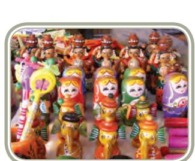
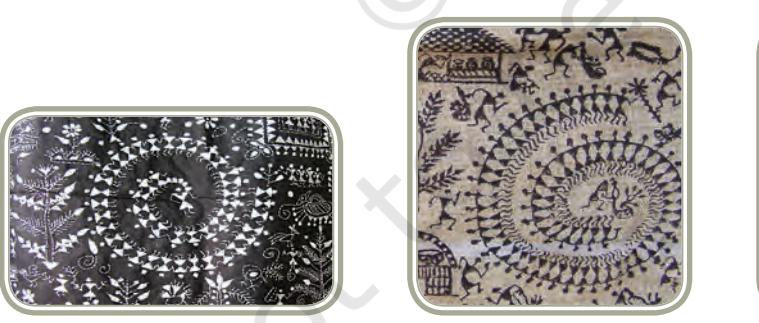
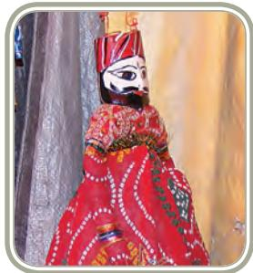
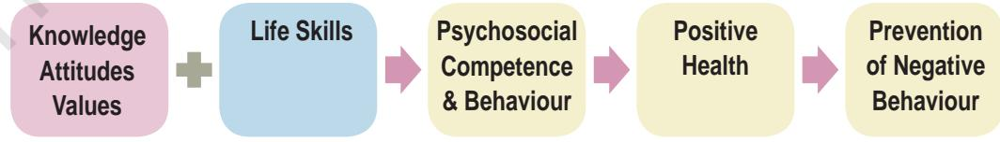
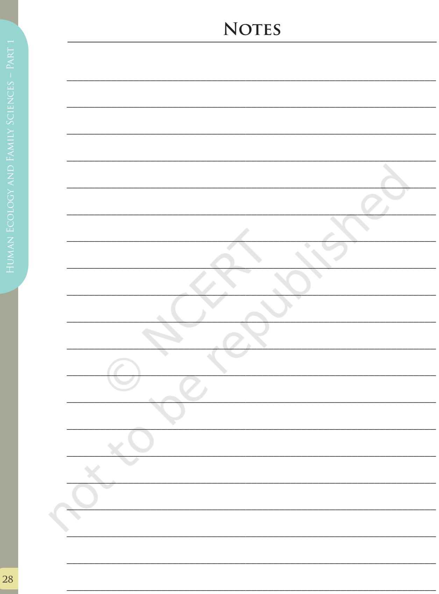

# **UNIT I**

Unit I - Work, Livelihood and Career

1

# **WORK, LIVELIHOOD AND CAREER**

Chapters.indd 1 8/12/2022 3:29:09 PM

# Work, Livelihood and Career

# Learning Objectives

After completing this chapter, the learner will be able to:

- z explain meaningful work, livelihood, careers and entrepreneurship.
- z understand the concepts of standard of living and quality of life.
- z know the importance of social responsibility and volunteerism.
- z explain the attitudes and approaches that contribute to quality of work life and successful careers.
- z be sensitive to the issues of work in relation to traditional occupations and special groups namely women, children and elderly.
- z describe the characteristics of a healthy work environment

# Introduction

2

Deciding a career for oneself is not an easy task. On one hand, there are several career avenues to choose from, and on the other, for a young person, aptitude and talent are yet to be identified and recognised. Also in some cases, interests are very diverse. Thus, it is not easy to make a choice. In order to make the right choice, it is essential that youth be exposed to different possible options. First, it is important to explore oneself in order

Chapters.indd 2 8/12/2022 3:29:09 PM

to identify one's own aptitudes, talent, personal preferences, needs and aspirations. Then the exploration of options must start, in which one tries to combine one's strength for personal benefit as well as social contribution. An appropriate choice will bring the person success and satisfaction.

#### **Work and Meaningful Work**

Work is primarily an activity that all human beings have to perform and through which each one 'fits' into the world, creates new relations, uses an individual's unique talents and skills and above all, learns and grows to develop one's identity and a sense of belongingness to society. Work can be described as essential activities undertaken for a purpose or out of necessity.

Work is central in all cultures, although every culture has its own values and perceptions about it. In fact, work essentially constitutes the bulk of daily life activities for all human beings. The type of work undertaken by people depends on several factors such as education, health, age, access to opportunities, globalisation, geographic location, financial returns, family background and so on.

Most human beings work to acquire money, provide for their families, and to earn leisure, recreation, play and free time. Work can serve as a catalyst for developing one's personal identity and boosting self-esteem. Work contributes in many forms. When we work, we contribute to ourselves—our sense of confidence or well-being and for financial gain. We also contribute to the organisation that employs us by helping to create better products or a better reputation for the organisation, or greater profits. Our work has an impact on the quality of life in the world around us.

It can be rightly said that 'work is the oil that lubricates the machine of society'. Not only human beings, but all creatures and elements of nature are constantly 'working', contributing to life itself. In fact, it is the collective work of humans and nature that gives us our basic necessities, comforts and luxuries. While in most cases, work primarily enables the worker to earn a livelihood, there are persons who work ceaselessly for pleasure, intellectual stimulation, contribution to society *per se*, despite the fact that they do not earn any amount of money, for example, the work done by family members for the family, volunteers, etc. Thus, work is not always about how much money a person earns; rather it is about whether one makes a contribution to oneself, one's family, one's employers, to society, to nation or to the world.

Chapters.indd 3 8/12/2022 3:29:09 PM

Work may be viewed as:

- z A 'job' and a means of making a 'living'.
- z A task, or duty that entails a sense of obligation.
- z A means of security of livelihood through securing job and income.
- z *'Dharma'* or duty, an expression of one's true Self, an expression of one's unique talents that influences the quality of life of self and others around us.
- z A part of spiritual practice.
- z A vehicle for one's creations.
- z A source of joy and fulfillment.
- z Working and earning one's livelihood offers scope for hope, self-esteem and dignity.
- z A symbol of status, power and control.
- z A rewarding experience, a sort of mental or physical workout that can result in success.
- z A means of self development and self-actualisation (reflecting values and aspirations).

When an individual is involved in meaningful work, s/he develops a sense of identity, worth, and dignity.

*What is meaningful work?* : Meaningful work is useful to society or to others, is done responsibly and is enjoyable to the worker. It enables the worker to use his/her skills and judgment, to showcase his/her creativity, or problem-solving ability. Ideally, work should be performed in an environment that stimulates the development of positive professional relationships and also brings recognition and/or rewards.

When the outcome or result of the work performed is meaningful or successful, it contributes to personal growth, instills confidence and self worth and may eventually even lead to actualisation of full potential. Work provides opportunities to contribute to the improvement of one's own life conditions and that of society in the wider context.

For any person, being involved in work (as an employee or self employed) that best suits one's personal attributes, talents or aptitude, competence and skills is very important. This paves the way for a life long career. So it is important to choose something to sustain the individual's enthusiasm to carry on his/her work. Therefore, the work life for anyone and everyone should ideally be an expression of one's potentials and aspirations. Persons entering work life and also those thinking of building a career can ask themselves the following questions:

z What are my special talents, traits and interests vis–a–vis an occupation?

Chapters.indd 4 8/12/2022 3:29:09 PM

- z Is the work stimulating and challenging?
- z Is the occupation likely to give me a sense of being useful?
- z Does the job make me feel that I am contributing to society?
- z Are the ethos and environment of the workplace likely to be suitable to me?

For most persons, it is definitely imperative and obligatory to earn a livelihood in order to fulfill the basic needs of self and family. Most work can be for earning money – such work is conventionally referred to as a 'job'. However, many individuals choose to go beyond a job, to make a career, working steadily on a chosen career path. Thus a 'career' is more than just a job. One may distinguish between a job and a career by saying 'job is an involvement in work for the sake of it' whereas 'a career is driven by a deep desire to excel and a passionate need to grow, develop and prove oneself within the chosen field of work'.

There have been changes in concepts about careers over the years. It is no longer sufficient to get a job. It is very important to continually upgrade and learn newer skills, update knowledge and build or enhance competencies, in order to achieve success. Thus, in the modern world, education should not stop in youth or early adulthood but needs to continue into one's middle career years and if necessary, into one's later career years.

How does one decide what career to pursue? Many children may choose to follow in their parents' footsteps. Others may select careers that differ from their parents or what their parents might have planned for them. One of the most important criteria for selecting an avenue is that one must feel a sense of keen interest and desire for the chosen path. One of the crucial aspects in making decisions about the choice of career is that one must find enjoyment in the job, particularly when one assumes financial responsibility for the family.

#### **Work, Careers and Livelihoods**

Work is a set of activities with an intended set of outcomes. Yet it is not necessarily tied to paid employment, but may include entrepreneurship, consulting, volunteerism, contract, social work for community welfare and other professional activities. Livelihood denotes the means and occupation by which a person supports oneself to meet basic needs, and sustain one's lifestyle. It involves choice of occupation and career path and the design of a work lifestyle. On the other hand, careers are unique to each person and are dynamic, unfolding throughout life. Career is a life management concept. Growing in one's career is a lifelong process that involves managing roles, maintaining a balance between paid and unpaid work, learning, personal life roles, and making transitions whenever or wherever necessary to move towards a personally determined future. The

Chapters.indd 5 8/12/2022 3:29:09 PM

Webster dictionary defines career as "a field for or pursuit of consecutive progressive achievement especially in public, professional, or business life" and work as "the labor, task, or duty that is one's accustomed means of livelihood/profession or occupation chosen as one's life's work". Whatever one chooses, in a holistic sense it should nourish body as well as mind and benefit self as well as others.

Work has several perspectives. By and large, the popular connotations of work are:

- (i) *Work as a job and livelihood:* Here work is mainly a source of income enabling desired outcomes; for instance, doing a job to support one's family. The person finds job satisfaction primarily from the income earned.
- (ii) *Work as a career:* The person views his/her work as a path to progressively ascend professionally in terms of higher posts/positions, status, pay, and responsibility. A person who works for a career will dedicate considerable amounts of time and energy to the work, because these are temporary costs of future gain. Such a person gets job satisfaction from continuing advancement and achievements.
- (iii) *Work as a calling:* Seeing work as a calling, a person derives satisfaction from the work itself. The person feels called to do the work based on inner drives and the feeling that the work derives from an inner or higher direction.

The following anecdote illustrates the concepts discussed hitherto: *Three men were breaking boulders with strong hammers. When asked what they were doing, the first man answered, "This is my job, I am breaking these rocks into smaller pieces". The second man said, "This is my livelihood. I break rocks to make a living in order to feed my family". The third man said "I have a vision, to become a sculptor and therefore I am carving a statue out of this big stone".* The third man, visualised that each hammer blow would contribute to the shaping of his career, while the first and second men were clearly focused on their job and livelihood.

#### **Review Questions**

- z What are the different ways in which work can be perceived?
- z Differentiate between job and career.
- z What is meant by meaningful work?

Chapters.indd 6 8/12/2022 3:29:09 PM

# Traditional Occupations of India

India is one of the richest countries as far as art and culture are concerned. Few countries in the world have such an ancient and diverse culture as does this country. Despite diversity, there has been cultural and social cohesiveness of an enduring nature. Over the years, the stability of this culture has been

maintained more through the social and cultural practices, though there have been some disruptions through foreign invasions and upheavals.

Agriculture has been one of the major occupations for a large proportion of the population because the climatic conditions in most parts of India are suitable for agricultural activities. Since almost 70 per cent of the population lives in rural areas, farming is the largest source of employment for millions of people. A considerable proportion of them are involved in farming small plots of land, many of which may not even be owned by them leading to only marginal production of crops. Such poor yield may not be even sufficient for family consumption, leave alone permitting sale of produce for profit. In most parts of the country, some farmers produce cash crops for sale in urban markets, and in some areas, crops such as tea, coffee, cardamom and rubber are of great economic importance because they bring in foreign exchange. India is the largest producer of cashew nut, coconut, milk, ginger, turmeric and black pepper in the world. It is the one of the largest producers of fruits and vegetables, spices and condiments and tea. Yet another important traditional occupation has been fishing because of the country's very long coastline.

Handicrafts have been one of the traditional occupations in Indian villages, and today many Indian arts and crafts are very popular in the international market and have become a means of livelihood for the rural folk. Some examples of crafts are wood craft, pottery, metal craft, jewellery making, ivory craft, comb craft, glass and paper craft, embroidery, weaving, dyeing and printing, shell craft, sculpture, terracotta, sholapitha craft, dhurries, rugs and carpets, clay and iron items, etc. Weaving is a cottage industry in India. Each state has typical woven fabrics, embroideries and traditional costumes which are suitable for the region-specific climate and life style. Different regions in India are famous for different types of weaving. Indian hand-woven fabrics have won acclaim for centuries.

Chapters.indd 7 8/12/2022 3:29:09 PM

In the past many of these were made for daily use and others for decorative purposes. These occupations and many others are reflective of the base of the socio-economic culture. However, the modern economy has catapulted such craft items into the global market, earning the country considerable foreign exchange.

*Shola craft of Odisha Channapatna dolls of Stone Sculpture*

*Karnataka*

Traditionally, the processes, techniques and skills of the crafting and manufacturing were handed from one generation to the next, to members within the family. The transfer of this indigenous knowledge and training thereof, was primarily home-based training, and the know-how and finer nuances were tightly guarded secrets within closed groups in a given occupation. In India, the dynamics of religion, caste and occupation have been tightly interwoven, coupled with hierarchical order of clusters within the social fabric of the country. There are hundreds of different traditional occupations, for example, hunting and trapping birds and animals, gathering and selling foreign produce, garland making, salt making, tapping of *neera* or palm sap juice, mining, brick and tile making. Other inter-generational traditional occupations include priests, sweepers, scavengers, leather workers, etc.

Like weaving, embroidery and the visual arts, each region of India has a typical cuisine, comprising a vast variety of local foods cooked with indigenous ingredients and spices. India is well known for its tasty, tonguetickling cuisine which has emerged as a source of livelihood for innumerable persons, ranging from street food vendors to speciality restaurants and theme pavilions in 5-star hotels. Many popular traditional foods and spice mixes and *masalas* are in demand in other countries.

8

Chapters.indd 8 8/12/2022 3:29:10 PM

*Embroidery and Textiles of India*

India has a multiplicity of visual arts that have been in practice for over four thousand years. Historically, the artists and artisans were supported by two main categories of patrons: the larger Hindu temples and the princely rulers of various states. The main visual arts arose in the context of religious worship. Distinctive regional styles of architecture are seen in different parts of India, reflecting various religions namely Islam, Sikhism, Jainism, Christianity and Hinduism, which typically co-existed across the country. Therefore in different places of worship and mausoleums (burial chambers), palaces, etc. a great variety of images skilfully carved in stone, or cast in bronze or silver, or modeled in terra-cotta or wood or colourfully painted were commonly prevalent, most of which have been preserved in India's vast heritage. In the modern scenario, these arts are preserved and promoted through the efforts of government and several non-governmental organisations, providing occupational avenues including entrepreneurship.

*Warli Painting of Maharashtra Puppetry Craft*

Despite the rich heritage of traditional occupations, in the modern context, these works of art are gradually losing out to mass–produced goods, leaving the artisans with meager sources of income on the one

Chapters.indd 9 8/12/2022 3:29:11 PM

hand and a gradual erosion of the aesthetic appreciation of fine arts on the other. Illiteracy, general socio-economic backwardness, slow progress in implementing land reforms and inadequate or inefficient finance and marketing services are major constraints that cause this trend. Shrinkage of forests, depletion of resource base and general environmental degradation are responsible for various problems faced in this context.

*Coconut craft of Kerala Bamboo craft of Assam*

These are tremendous challenges and indicate an urgent need for the revival and sustaining of the indigenous knowledge, know-how and skills which are fast losing ground. Some of the areas where interventions are required are design innovations, preservation and refinement strategies, use of eco-friendly raw materials, packaging, establishment of training facilities, conservation of traditional knowledge and protection of intellectual property rights (IPR). It is important for the modern youth and communities to be aware of the tremendous scope and potential for career avenues for individuals. In addition, such efforts and initiatives will go a long way to enhance the income generation potential of the rural folk. It is worthy to note that the Government of India is making concerted efforts in this direction. The need of the hour and the challenge confronting Indian society is to maintain the diversity without the hierarchy or caste-based work divisions in the democratic milieu.

#### **Activity 3**

Visits to local artisans can be arranged by the school. This may be followed by students preparing resource file on the local traditional arts, crafts, cuisines.

Chapters.indd 10 8/12/2022 3:29:11 PM

#### **Activity 4**

An exhibition may be organised to showcase the local traditional arts and crafts.

### Work, Age and Gender

The age and sex of members of any workforce influence the dynamics of personal and professional lives, both from the perspective of the individual (micro perspective) and also that of society and nation(macro perspective). The health and development of children and women is at stake when they are forced into labour that is not suitable to their physiological and psychological state. These segments of the population as well as the elder population need attention from several perspectives. Let us briefly discuss the challenges facing these three groups.

#### **Gender Issues in Relation to Work**

Nature distinguishes the two sexes clearly in most forms of life, with biological and functional differences being well established. Human beings generally differentiate between the two sexes, i.e. men and women. However, lately India's Supreme Court has recognised transgender people as a third gender who are also refered to as transsexual, cross dressers etc. The differences between men and women range from biological to sociocultural. The terms '**sex**' and '**gender**' indicate the differentiations from the biological to the social and cultural perspectives. The term sex and gender are often used interchangeably, but strictly speaking they have different biological meanings. Sex refers to the bilogical categorisation based on genetics, reproductive organs or similar things, whereas, gender is based on social identity. Male denotes boys and men whereas female denotes girls and women. The external manifestation of sex is through the primary sexual organs or the genitals. This difference is due to XX and XY or some other chromosome combinations. In every society, the social and cultural practices determine how various genders are expected to behave and the type of work they do, thus constructing the identity of individual's right from an early age which slowly continues to impact all throughout their growth and development. The members of any society or community are expected to perform their roles in particular ways as demanded by social and cultural traditions thereby creating and establishing norms of gender role identity. Over a period of time, these norms and practices become stereotyped and then it is considered the normal and expected behaviour from each one of its members. Although these norms and practices are

Chapters.indd 11 8/12/2022 3:29:11 PM

not written down and there is no rule book for these, they are generally passed on from one generation to another and continue to be practised. Therefore, it is said that *Gender is socially constructed*.

Any deviation from that normal and expected becomes unconventional, non-traditional and sometimes even defiant. However, with time roles and behaviours are evolving, resulting in 'continuity with change'. It can be seen that the age old assigned roles as bread winner for men and as home maker for women are in transition. However, in India, women have all along been engaged in production and in some societies even in marketing. In rural India, women are intensively and extensively involved in agriculture and animal husbandry. In urban areas, women are involved in construction activities or are employed as domestic labour. All these are working women and have been contributing to the income of the family in one way or the other. In many families, women are the sole bread-earners.

Despite their active participation in earning and contributing to the family resources, freedom to make decisions and vogue to independence are denied to women. Women therefore continue to remain powerless. The need of the hour is to educate and empower women and give them their rightful voice and place in society.

Women cannot be empowered until the work they do at home is valued and is considered equivalent to paid work. The work performed by women as homemakers has rarely been valued or even counted as an economic activity. However, there is a saying 'money saved is money earned'. The household chores and the domestic work that women do to support the family, in all stages of their life as mother, sister, daughter, wife and grandmother, demands energy throughout their lifetime. Such contributions help other members of the family to perform their roles and duties more efficiently. Therefore, domestic work done by women needs to be valued as an economic contribution and productive activity.

Women's participation in the workforce outside the home has helped emancipate the woman as well as improve the family's resources. Women have started participating in each sector of the economy, many of them occupying senior positions. However, this has placed a double burden on women, since they are still expected to perform most or all of their household chores and be the primary caregivers.

#### **Issues and Concerns Related to Women and Work**

Opportunities of participation by women in the labour market have declined and they have been marginalised due to the need for skilled workers. Therefore, to safeguard the interests of women, training facilities to develop skills need to be increased. Primary earning members are considered to be

Chapters.indd 12 8/12/2022 3:29:11 PM

men and women's earnings are considered supplementary and secondary, and even if they are sole bread earners, they do not have a similar standing in the market. Some of the other issues concerning women in modern India are stress and adverse effects on health, security and safety at work places without gender discrimination, maternity benefits and social support for child care.

*Constitutional Rights, Acts and The State Initiatives:* It is important to note that the Constitution of India guarantees equality to both men and women in all walks of life, including guaranteeing equal opportunity for all citizens in matters relating to employment or appointment to any office under the State and forbids discrimination in respect of any employment or office on grounds of caste, creed, colour, race or sex. It also stipulates that women workers be provided just and humane conditions of work and be protected from any kind of exploitation, and be supported and encouraged in their educational and economic pursuits. The Indian Constitution also empowers the State to make special provisions for women and children. Also, there are Acts which safeguard Constitutional rights of women such as the Factories Act of 1948, the Plantation Labour Act of 1951, the Mines Act of 1952, etc. which provide protection to women in various industrial sectors, Employees State Insurance Act (ESI Act) and the Maternity Benefit Act, 1961.

Article 16 (1) of the Constitution of India guarantees equality of opportunity for all citizens in matters relating to employment and appointment to any office under the state.

Besides this, Section 48 of the Factories Act states that creches should be maintained if more than 30 women are employed in an industry or factory. Children below six years should be looked after in these crèches which will be maintained by the industry itself. Many state initiatives were taken to improve the condition of women in employment and in need of employment. Women's cells were created in the Ministry of Labour to look at the problems of women workers. The Equal Remuneration Act for equal wages for the same work or work of a similar nature also came into force. A National Plan of Action (NPA) for women was taken up by the Department of Social Welfare to implement the Equal Remuneration Act. A working group on women's employment was also constituted by the Planning Commission for enhancing the employment opportunities for women belonging to rural areas and to review the labour laws on women's work and their participation in economic and productive activities. A steering

Chapters.indd 13 8/12/2022 3:29:11 PM

committee to build the data base on women's work, particularly in the rural areas, was also formed by the Planning Commission.

Over the years there has been a paradigm shift in the ways women's programmes have been initiated. During the earlier decades the programmes for women were based on the welfare approach, slowly it moved to equality of opportunity and then finally to development approach. It was realised that until women's development programmes are in full swing benefits cannot be reaped as women are part of human resource. Although in some sectors women have been achievers, economically and financially they have to march long roads to achieve equal partnership with men. The mindset has to be modern. The attitude and approach have to change to ensure dramatic transformation in the way gender issues related to work are approached in the society.

*Kasturba Gandhi Balika Vidyalaya (KGBV):* KGBV was initiated as a scheme of Government of India under *Sarva Shiksha Abhiyaan* (SSA). Currently, it is subsumed under *Samagra Shiksha Abhiyaan*, an overarching scheme and the umbrella programme of Government of India for the school education. KGBV started as a scheme for bringing never-enrolled and dropout girls from rural, remote and disadvantaged sections of the society into school education till elementary level in residential schools. The scheme now has been extended till Class XII to ensure inclusive and equitable quality education at all levels of school education. All the girls enrolled in KGBVs study the Bridge Course for preparing them for the entry level. The entry level in KGBVs for these girls is Class VI. The KGBVs have been opened in backward blocks of each district. This scheme also helps in the implementation of 'Right to Education Act' (RTE) of the Government of India.

#### **Woman Entrepreneur**

Kiran Mazumdar Shaw (a Biotechnologist), the Chairperson and Managing Director of Biocon India Ltd., is an eminent woman entrepreneur. She started her professional career as a trainee brewer in Carlton & United Beverages and in 1978 formed her own company, Biocon India Ltd. Under her leadership, Biocon has transformed to an integrated biopharmaceutical company with strategic research initiatives. Today Biocon is India's pioneering enterprise. Kiran Mazumdar Shaw received many prestigious awards such as ET Business Woman of the Year, Leading Exporter, Technology Pioneer and Best Woman Entrepreneur. In 1989 she was honoured with Padmashri and in 2005 with Padma Bhushan. She continues to be a model entrepreneur and a successful technocrat of global understanding.

Chapters.indd 14 8/12/2022 3:29:11 PM

#### **Review Questions**

- z What do you understand by the terms gender and sex?
- z Who are home makers? What is their contribution in the economy of the family?
- z How will the women get recognition in the family and the society?
- z How are women guaranteed equality in India?
- z What are the government initiatives in favour of women?

#### **Activity 5**

Find out about organisations or individuals in your region who are helping women to become empowered and self-reliant.

Make a scrap book and display for the entire school.

#### **Activity 6**

Collect information on women in your region who have contributed significantly to society.

#### **Activity 7**

Prepare a power point presentation (with the help of teachers) of distinguished women in Science, Technology, Mathematics, Sports, Education, Literature, Medicine and other important areas.

#### *Organised Efforts for Empowerment of Women*

Shri Mahila Griha Udyog Lijjat Papad is an organisation of, by and for women. Its objective is to provide employment to women to enable them to earn a decent and dignified livelihood. This society was started in 1959 with 7 members and in 1966 it was registered under the Bombay Public Trust and Societies Registration Act. During this period it also got recognition from Khadi and Village Industries (KVIC) as a 'village industry'. Later *Lijjat* was also awarded 'Best Village Industry'. Today their products include *Khakhra, masala, wadi,* detergent powder, *chapattis,* cakes and other bakery products. The society gives self employment to about 45,000 members all over India with the sales turnover of ` 1,600 crores annually including export to many countries, paving the way for women to become self-reliant.

Chapters.indd 15 8/12/2022 3:29:11 PM

# Attitudes and Approaches to Work, Life Skills and Quality of Work Life

#### **Attitudes and Approaches to Work**

The attitude towards work is not only about the work / job itself. It is also about how any individual perceives ones' own work situation, handles the circumstances and demands of the job and the various tasks entailed. An individual's experience of job satisfaction or dissatisfaction is considerably influenced by their attitude, rather than being determined entirely by the job *per se*. Further, an individual's perception can be affected by comparisons they may make. For instance, if a person compares only the salary s/he receives with that of another, without taking into account the work responsibilities, the qualifications required, the work output, sincerity and dedication of the other person, there is scope for dissatisfaction. On the other hand, under realistic scrutiny of all aspects (both positive and negative) of one's own job, the possibility of satisfaction and happiness is greater. Most people spend a considerable proportion of time everyday at work. Therefore, the importance of work routines being established along with good health practices such as eating healthy, balanced diets, sleeping well and using leisure time proactively should be emphasised. But often, some people perceive work as something they have to 'do somehow or anyhow' and therefore are unable to enjoy or even think of enjoying the work. However, when a person perceives his/her 'work' as a source of energy, fulfillment and learning, job satisfaction is ensured.

On the other hand, some persons enjoy their jobs, look forward to challenges, handle difficult tasks with a positive outlook and this makes them feel good about their jobs. Similarly, opportunities for progress in their career and to use their abilities, skills and knowledge contribute to personal happiness and the 'quality of working life' of the organisation.

#### **Quality of Work Life**

Quality of Work Life (QWL) of employees is considered important by organisations. In this approach, the employees are considered to be 'assets' and it is believed that people perform better when they are satisfied with their work conditions. It is generally accepted that satisfying employees' social and psychological needs is as important as satisfying their economic needs to help motivate them. It incorporates several perspectives which are not only work-based factors such as job and career satisfaction, satisfaction with pay and relationships with work colleagues, absence of

Chapters.indd 16 8/12/2022 3:29:11 PM

stress at work, and opportunities for participative decision making, balance between work / career and home and general feelings of well-being.

All human beings like to survive and thrive in an environment that encourages and motivates them to do all the good work that they are capable of. Therefore, it is crucial to have a culture of creating happy and healthy work environments, not only in the physical and social sense but also in the deeper psychological / mental and emotional aspects. A healthy work environment is a positive work environment. Such an environment can be created by focusing on:

- z Paying adequate attention to the individual employee's needs and expectations in addition to organisational needs
- z Building a positive work climate
- z Motivating individuals
- z Being fair and treating people equally
- z Ensuring and facilitating technical competence
- z Providing an attractive and safe work environment
- z Making the job interesting and challenging
- z Matching the person to the task
- z Delegating wherever necessary
- z Fostering team spirit and team responsibility
- z Developing employees through training, building confidence, feedback, encouragement and praise, support, positive reinforcement and involvement
- z Empowering employees, giving them authority wherever appropriate
- z Sustained opportunities for self-development

All of this can help the employer to boost the morale of those involved in the organisation/ work place. In short, any wise employer / manager recognises that people are assets and are the ultimate valuable resource. Hence creating an environment where employees feel a sense of loyalty to the organisation and organisational development is as important as self development.

It is important not only to focus on the pay package but also to look at the entire life holistically. It is not how much you make that matters. What is important is whether or not you are able to live your life in a happy way. Look at your life as a whole. Think about your free time, your family, your friends, etc. This will help you to reach retirement age without remorse and regret about why you did not spend them on things that were more important.

Chapters.indd 17 8/12/2022 3:29:11 PM

One of the prerequisites is to possess and hone certain life skills that will help us to function effectively, with minimum stress and maximum productivity in personal and professional lives.

#### **Life Skills for Livelihood**

Life skills are abilities for adaptive and positive behaviour that enable individuals to deal effectively with the demands and challenges of everyday life.

Why are life skills important? Life skills help people to deal with the demands and challenges of everyday life. They are important because they apply across the life span and promote and protect life, health and well-being in all situations. According to the World Health Organisation, life skills are thinking, coping, and social skills, which are abilities that can enhance people's interactions with others and with the environment, and which may even give rise to greater individual resilience in situations of adversity.

Ten core sets of skills have been identified by experts:

| Self-awareness | Empathy |
| --- | --- |
| Communication | Interpersonal relationships |
| Decision making | Problem solving |
| Creative thinking | Critical thinking |
| Coping with emotions | Coping with stress |

Life skills are abilities that enable people to behave in healthy ways, particularly in situations that challenge them. It is important to develop appropriate skills as indicated above, in order to prevent manifesting unhealthy or negative behaviour. Appropriate and adequate knowledge, attitudes and values enable one to develop healthy life skills, and prevent negative health behaviour as indicated in the conceptual model below:

Chapters.indd 18 8/12/2022 3:29:11 PM

Life skills enable people to act in ways that can contribute to personal and social changes for the promotion of their own health and development, as well as that of the communities in which they live. They are needed by individuals to function effectively and constructively in society. They include personal and social skills and help the person to function confidently and competently in their families and in society. Life skills are competencies and actual behaviours which cannot be taught in a classroom; rather experiential learning helps people to acquire them.

#### **Improving One's Own Work Life**

Improving work life in totality is crucial for the organisation. However, it is more vital for each individual to consciously improve one's work life and thereby ensure job satisfaction and enhanced quality and quantity of output. Quality of work life from the perspective of the employee/worker is not so much about the job alone but also about how it is perceived by him/her. Towards this it is important to look at one's work as a source of energy, fulfilment and learning. Some general tips in this context are given herein:

- z *Develop healthy personal habits.* Take care of one's body, mind and spirit, maintaining a healthy lifestyle, by eating a wholesome diet, taking adequate and appropriate exercise and getting enough sleep. Such a lifestyle is helpful to face challenges and pressures at the workplace.
- z *Be empathetic and compassionate*. Interacting with peers, subordinates and supervisors is inevitable and calls for empathetic approach, which in turn will yield positive outcomes.
- z All persons at work have to remember the interdependence on each other, personally, professionally and psychologically. Positive attitudes and behaviour and interactions with peers, subordinates and supervisors will generate goodwill all round. People who help each other tend to experience greater satisfaction and reward and help a person to fulfil her / his own needs. Good communication and interpersonal skills are vital for successful completion of tasks and career development.
- z It is important to maintain loyalty and commitment to the organisation and to be *professionally ethical* at all times.
- z *Encourage partnerships and work as a member of a team*.
- z People who help each other in this way tend to experience greater satisfaction and reward. Interactions with others should generate

Chapters.indd 19 8/12/2022 3:29:11 PM

results for mutual benefit. Work in collaboration with others, respecting and recognising their contributions and achievements.

- z It is wise to *be responsive to situations and not reactive*. For example, when faced with a reprimand at work by a senior, it is appropriate to respond by examining the situation realistically and calmly, rather than react with justifications and emotional outbursts. If the reprimand is deserved, one should take corrective measures, including apologising, if necessary.
- z *Flexibility, adaptability and problem-solving attitude and skills are core abilities* essential in the work arena, whether you are self-employed or working for others.
- z *Be a good citizen and create a healthy community around you.*
- z People who follow these tips tend to attract like-minded persons. Together, they can often create a community of like-minded folks who strive to get the job done while serving everybody's needs. For job satisfaction, be a good citizen within your organisation, recognise others for their achievements and work in collaboration with others to effect responsible change.
- z *Learn from the lessons of life*.

Job satisfaction is all about taking those day-to-day challenges, pressures and upsetting situations and turning them into life lessons that allow you to grow and move on as a better, more fulfilled person and professional.

This balance between life and work is not easy to achieve but the ability to positively adapt to societal and environmental change is essential. In any occupation, core abilities/essential workplace skills are the basic requirements. They cannot be taught as 'academic lessons' in schools or colleges, but they are vital to enable persons to become competent, and have to be acquired and honed as one develops as a person.

#### **Review Questions**

- 1. Explain the terms:
	- (a) Quality of work life
	- (b) Life skills
- 2. What is meant by healthy work environment? How can it be created?

Chapters.indd 20 8/12/2022 3:29:11 PM

#### **Essential Soft Skills at Workplace**

- z *Working productively*  The worker applies effective work habits and attitudes in his/her job and tasks. This requires sufficient knowledge, skills and expertise as well as experience. Productivity is also influenced by enthusiasm, zeal and dynamism. Involvement with the job and sense of belonging to the organisation are important factors.
- z *Learning effectively* Every individual requires some necessary skills in reading, writing, and computing as well as skills in acquiring information within the field, and ability to use learning tools and strategies. Equally essential is the motivation to work hard and update oneself to keep pace with advances/ developments in one's field in order to be acclaimed/ renowned in the field.
- z *Communicating clearly* Apply appropriate writing, speaking, and listening skills so that one can precisely convey information, ideas, and opinions.
- z *Working cooperatively* Every individual must work with others to complete tasks, solve problems, resolve conflicts, provide information, and offer support. Cultivate a sense of belonging to the organisation
- z *Thinking critically and creatively* Every successful person applies the principles and strategies of analytical thinking, critical evaluation, being innovative and creative.
- z *Other skills required* Concentration, alertness, presence of mind, tactfulness, empathy, soft skills, abilities to train, to delegate and to get others to do their work, forethought and vision, and the ability to multitask.

#### **Work, Ethics and Dignity of Labour**

Work, whether a paid job or unpaid work in the home, as a caregiver, or in a volunteer capacity, is fundamental to human nature. Every human being is infinitely worthy; however, in modern times wealth is being given more importance. Whatever the type of work done, or the position held, or financial status, every person deserves respect. The Universal Declaration of Human Rights states that all human beings are born free and equal in dignity and rights. Every individual, through his or her share of work, however big or small, contributes to the betterment of the society.

Chapters.indd 21 8/12/2022 3:29:11 PM

 Dignity of labour means that the person takes pride in whatever she/he does. Abraham Lincoln was the son of a farmer and rose from a penniless boy to become the President of the United States of America. Mahatma Gandhi was a shining example of the dignity of labour. He did sweeping, scavenging and cleaning in his 'Ashram' in Wardha. He never felt degraded or insulted in doing the jobs that some people consider inferior or menial. He used to clean his own toilet, to demonstrate the dignity of labour.

In this context, it is necessary to remember that whatever a person does should be driven by values and ethics. Values and ethics provide behavioural rules. Values are beliefs, preferences, or assumptions about what is desirable or good for humans. Values affect how we practise. There are six important values: service, social justice, dignity and worth of all persons, importance of human relationships and integrity.

 Ethics are a formal system or set of rules which are explicitly adopted by a group of people, e.g., professional ethics, medical ethics. Ethics can be defined as 'the rules or standards governing the conduct of a person or the members of a profession'. Being ethical at all times, earns respect of one's colleagues or peers and encourages them also to be ethical. At the workplace, values and ethics help to reduce waste of time and money and simultaneously increase employee morale, confidence and productivity.

In all work settings, generic norms of ethics and dignity are applicable. However, young workers/children and senior citizens as well as the female workforce are special groups and their presence in the workplace has many implications and ramifications in terms of their own quality of life as well as the society at large.

#### **Review Questions**

- z What is meant by dignity of labour?
- z Explain briefly the role of values and ethics in professional life.

## Ergonomics

Ergonomics is the study of humans at work, in order to understand the complex interrelationships of people with their job requirements, methods of working, tools/equipment used and the environment. Ergonomics is derived from two Greek words — 'ergon' (work) and 'nomics' (natural laws). It may also be spoken of as 'Human Factors Engineering'. In short, ergonomics is the study of work with the primary goal being to adapt the work environment to the worker. The objective is to generate

Chapters.indd 22 8/12/2022 3:29:11 PM

working conditions that are not hazardous to human health, are acceptable to the workers / the work force and are optimal for work output and productivity.

Ergonomics is "Adjustment of human and Machine�. It involves application of human biological sciences combined with engineering science to achieve optimum *mutual adjustment of human work,* with the benefit being measured in terms of human efficiency and well being. Tools, machines and workstations are designed to fit the work so that stress and problems reduce stress and health problems.

Important aspects that are considered by ergonomists are in relation to worker capacity (both physiological and psychological), task demands (comprising nature and complexity, force required, duration, posture) and the work environment (noise, humidity, vibration, light, temperature). The science of ergonomics is set on the four pillars, namely anthropometry (body size and measurements), biomechanics (musculoskeletal activities and forces exerted), physiology and industrial psychology.

#### Need for ergonomics:

Use of ergonomics in the workplace is important for :

- z Improving safety and health by
	- reducing number and severity of workplace injuries.
	- reducing possibility of accidents due to human error.
- z Improving job effectiveness by
	- increasing productivity
	- reducing errors
	- eliminating or reducing injuries

Ergonomics: An effective productivity tool that addresses matters related to:

- z workplace / workstation design
- z task design / design of work methods
- z equipment design
- z facilities
- z environment

Chapters.indd 23 8/12/2022 3:29:12 PM

- z Improving job effectiveness by
	- increasing job satisfaction through comfortable working conditions.

Benefits of Ergonomics

- Reduces risk of injury and accidents
- Increases productivity
- Reduces mistakes and need to do the work again
- Increases efficiency
- Decreases absenteeism due to ill health / accidents / stress
- Improves morale of workers.

The importance of ergonomics can be illustrated with a simple example. For a person who does office work, sitting on a chair that does not conform to ergonomic safety specifications can cause back pain*.* According to ergonomic principles, it is necessary that the chair height and stand be adjustable to the user's height and body measurements. The number of chair legs must be suitable to its size to avoid falling.

Any ergonomics intervention must be viewed in light of its effect on productivity, and the best ergonomics solutions will often improve productivity. Simply put, reducing unnecessary or awkward postures and exertions almost necessarily reduces the time it takes to complete a given task, thus improving productivity. Creating a safe and productive work environment is critical for any work place. Employees represent an organisation's most important asset. When a task is matched with the ability of the people who will perform it, they will make fewer errors and produce less waste. Ergonomic design considerations have been shown to influence employee productivity and retention.

We have discussed at length various employment-related aspects that are pertinent to livelihoods and productive professional careers. At this juncture, it is necessary to also direct attention to the exciting possibility of self-employment, personal enterprise and entrepreneurship. Selfemployment and innovative entrepreneurial ventures can be challenging, stimulating and highly rewarding; hence they merit attention as an avenue for building satisfying careers.

Chapters.indd 24 8/12/2022 3:29:12 PM

# Entrepreneurship

Entrepreneurship is the act of creating a new and innovative enterprise/ product or service. The function of entrepreneurs is to change the pattern of a production or design of a product through innovations / invention or even attempting new technological methods/modifications for producing a new commodity or producing an old one in a new way*.* An entrepreneur is a person who undertakes the creation of such changes in an enterprise or business. Entrepreneurs use their acumen to assemble resources and/ or finances and aim to make a livelihood. This may even result in new organisations or may be part of revitalising existing organisations.

An entrepreneur is a person who can take risks for converting a novel idea into reality. An entrepreneur is innovative, creative, organised, and risk taker. India has excellent examples of entrepreneurs who had the vision and thought e.g., Mr. Narayan Murthy, JRD Tata, Dhirubhai Ambani to name only a few.

Entrepreneurial activities differ depending on the type of organisation that is being started. Entrepreneurship ranges from small individual projects / micro units, sometimes involving the entrepreneur only parttime, to major undertakings which give jobs to many people in addition to the entrepreneur himself / herself. Many kinds of organisations now exist to support aspiring entrepreneurs, including government agencies, scientific institutes and organisations, financial institutions, such as banks and some voluntary organisations.

Entrepreneurs make things happen:

- zz May be a concept, product, policy or institution.
- zz They become champions of new process(es), engineers of change

### Characteristics of Entrepreneurs

An entrepreneur must necessarily have some personal attributes that enable him to take on the challenges of an enterprise. These include:

- z Willingness to work hard
- z Knowledge and skills for planning and implementation
- z Skills of management of finances, materials, personnel and time

Chapters.indd 25 8/12/2022 3:29:12 PM

- z Having the courage to take calculated risks
- z Ability and preparedness to handle many tasks simultaneously
- z Ability to learn and acquire the necessary skills for the tasks at hand
- z Ability to deal with tough issues and find the solutions
- z Being realistic and not expecting easy solutions
- z Ability to cope with set-backs, challenges and failures
- z Ability to develop partnerships, and able networking
- z Ability to negotiate, strategise and prioritise
- z Being flexible and able to handle crises
- z Have good communication skills.

In short, to achieve his / her objectives, the entrepreneur must be innovative, creative and goal-oriented. The entrepreneur must be ready to initiate direct action and be motivated to seek and adopt more effective means of doing things. Recently, more comprehensive and holisitic conceptualisations of entrepreneurship have emerged wherein entrepreneurship is seen as a specific mindset resulting in different forms of entrepreneurial initiatives such as social entrepreneurship and knowledge entrepreneurship.

Social entrepreneurship focusses on doing social good. The social entrepreneur aims to achieve large scale benefits through entrepreneurship for a specific group or to society at large. Generally, the social entrepreneur works for the benefit of the underserved, neglected, disadvantaged groups or individuals who do not have the financial resources to achieve the benefit by themselves. Social entrepreneurs are 'social catalysts', visionaries who create basic social changes and sustainable improvements. Such actions may have the potential to stimulate global improvements in their specifically selected areas, be it education, health care, economic development, the environment, the arts, or any other social field. The success of social entrepreneurship is ascertained not so much by the profits made but more by the social benefits and impact.

Chapters.indd 26 8/12/2022 3:29:12 PM

#### **Activity 13**

Form groups of 6-8 children and organise a discussion in the groups about issues concerning unemployment. The discussion and presentation should focus on the following:

- zz Do you know anyone who is unemployed?
- zz How is that person's standard of living and state of mind affected by the fact that he/she is unemployed?
- zz Does he/she want to work?
- zz Is unemployment a problem in our country?
- zz What do you think are the main causes of unemployment in India?
- zz What does the government (locally and nationally) do about the problem?
- zz What other suggestions can you make to resolve this problem?

#### **Key Terms**

Work, meaningful work, careers, livelihood, rest and recreation, standard of living, social responsibility, ethics, volunteerism, traditional occupations, age and gender, child labour, attitudes and approaches to work, life skills, work and dignity, quality of work life, job satisfaction, creativity and innovation, work environment, occupational health, entrepreneurship.

Chapters.indd 27 8/12/2022 3:29:12 PM

