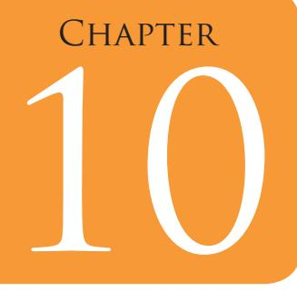
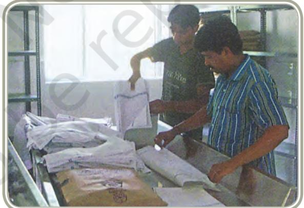

# Care and Maintenance of Fabrics in Institutions

## Learning Objectives

After completing this section the learner will be able to —

- z discuss the significance of care and maintenance of fabrics and textile products
- z describe the concept of care and maintenance of fabrics in hospitals and hotels
- z explain the process and various equipments required and their usage
- z discuss how a student can prepare for a career in this field.

## Introduction

The use of fabrics in a family setup for apparel and household is well known. You may also be aware that some special fabrics are used for industrial purposes, for interiors in institutions for heat and sound insulation and for bandages, masks etc. in hospitals. Since fabrics with specific properties are selected for specific usage and functionality, it becomes important that these characteristics are retained for the expected life of the material. Efforts are also made to prolong the period of the serviceability of the product by taking good care of them. Care and maintenance of fabrics includes two aspects:

Chapters.indd 190 8/16/2022 12:28:41 PM

- z Keeping the material free of physical damage and rectifying any damage that may have occurred during its use.
- z Retaining or refreshing the appearance in terms of removal of stains and dirt and retaining the textural and visual characteristics.

## Basic Concepts

Clean fresh hygienic clothes, spotless and crisp household linen are the outcome of successful laundering or dry-cleaning. Laundry is both a science and an art. It is a science because it is based on application of scientific principles and techniques. It is also an art since its application requires the mastering of certain skills to produce aesthetically pleasing results.

You are aware that care and maintenance requirements of different fabrics depend on its fibre content, type of yarn and fabric construction techniques, the finishes given to the fabrics and the purpose for which they are used. You are also aware of the process of laundry, stain removal, role of water — suitability of soaps and detergents, methods of washing, finishing treatments, ironing and hot pressing, folding. Let us now briefly discuss the equipments required for these activities. There are mainly three types of equipments in common use:

- A. Washing Equipment
- B. Drying Equipment
- C. Ironing/Pressing Equipment

At household level, a large amount of washing is done manually, using equipments like buckets, basins, bowls and scrubbing boards and brushes. In some cases, basic washing machines have been added.

#### **A. Washing Equipment**

- Two types of models of washing machines are available top loading (where the garments are put into the machine from the top) and front loading (where the garments are put in the machine from the front side).
#### **Activity 1**

Do a survey of types of washing machines available in the market. Collect pictures and paste them in the given boxes.

191

Chapters.indd 191 8/16/2022 12:28:41 PM

*Top Loading Front Loading Two Tub Washing Machine Washing Machine Machine*

*These machines may further be:*

- (a) Fully automatic: These machines have a single time setting of controls for each use i.e water filling, temperature of water, wash cycle and number of rinses. No further intervention of the operator is required.
- (b) Semi-automatic: These machines require intervention of the operator at frequent intervals. Rinse water in such machines has to be filled and drained out with each cycle. These are generally two-tub machines.
- (c) Manually operated: In these machines, 50 per cent or more of the work is manually done by the operator.

*Automatic Washer* performs the following operations

- a. *Filling up water.*
- b. *Water Level Control* is also an important feature. The water level is controlled either automatically or manually.
- c. *Regulation of Temperature of Water:* The machine has a button, dial or panel indication which permits selection of desired temperature of the water. The temperature may be same for wash and rinse or different for the two operations.
- d. *Washing:*

The principle of all washing machines is to keep the fabric in movement in the washing solution to carry away the dirt. The major methods of this are:

- i. Agitation This is used in top loading machines. The agitator has blades which may rotate (movement in one direction) or
192

Chapters.indd 192 8/16/2022 12:28:41 PM

oscillate (alternate movement in two directions) which cause the creation of a current in the tub, forcing water into the fabric.

- ii. Pulsation This is also used in top loading machines. The movement is caused by a vertical pulsator, which has very rapid movements vertically.
- iii. Tumbling This is used in front loading machines. Washing takes place in a horizontally placed cylinder which is perforated and which revolves in a partially filled tub. With each revolution the clothes are carried to the top and then dropped in the wash water. This means that the clothes move through the water rather than water moving through clothes as in the previous two types.

Depending on the size of the machine and the type of fabrics to be treated, the agitators may be made of plastic, metal (aluminium) or bakelite, and are such that they are not affected by detergents, bleaches, softeners etc. Agitation speed can also be varied depending on the type of fabric.

- e. *Rinsing*
This is the important phase in the wash cycle. If the rinse is not thorough, the clothes may look grey and dull and have a harsh texture.

- f. *Water Extraction*
Water is extracted after the wash phase and after each rinse phase of the cycle. It can be done in three ways:

- i. Spinning: Spinning at speeds greater than 300 rpm, which generates a centrifugal force which in turn throws the water up and out. This water is pumped down the drain.
- ii. Bottom-drain: Machines with perforated tubs stop at the end of wash phase and then at the end of the rinse phase and drain through the bottom. At the end of the drain period, the tub begins to spin as described above which removes the remaining water from clothes.
- iii. Combination Bottom-drain and Spin: Some machines drain through the bottom without stopping i.e. the bottom draining occurs during the spin period. This system provides the best water extraction because it can remove the heavy dirt at the bottom and dirt in suspension in water.

193

Chapters.indd 193 8/16/2022 12:28:41 PM

The amount of water extracted from the clothes during spinning is directly affected by the speed at which the tub spins. The speed can vary from 333–1100 rpm. Spinning to near dryness is avoided because it may cause wrinkles which are difficult to remove during ironing. The optimum speed is approximately 600–620 rpm.

#### **B. Drying Equipment and Process**

Apart from drying in the open, driers are used at commercial and institutional level.

There are two types of circulation systems in driers:

- (a) Air of relatively low temperature is circulated at high velocity. Room air enters the drier from under the front panel, passes over the source of heat and then through the clothes and leaves through an exhaust. Thus the temperature and humidity of the room stays normal.
- (b) Air of high temperature is circulated slowly. In this after the air enters the drier and passes over the heat source, it is drawn by a small fan through perforations at the top of the drier, then downwards through the clothes and out through the exhaust. Since the movement of the air in this drier is slow, the relative humidity of the exhausted air is high.

### **C. Ironing and Hot pressing**

Most households have an iron and a temporary or permanent place for work. Ironing is the process of smoothening out wrinkles created with use or during washing. Pressing helps to put creases such as in sleeves, trouser legs and pleated skirts. Irons have smooth metal surface which can be heated. Most electric irons have an inbuilt thermostat, which can adjust the temperature to suit the fabric. The iron may also have a system of producing steam while in use. The weight of the iron varies from 1.5–3.5 kgs. At household level light weight irons are preferred. Heavier articles like curtains, bed covers etc. may require heavier irons.

Though in most cases the heating is with electricity, in India one can still see some charcoal irons. Charcoal iron is like a metal box with a lid, in which live coal pieces are put to heat the iron.

Chapters.indd 194 8/16/2022 12:28:42 PM

Care and maintenance of apparel and articles of household usage within the family may be done at different levels. Household laundry takes care of clothing and small articles of daily use. Bigger articles of household linen and some special articles are sent to commercial laundries. Sometimes services are hired of individual professionals who collect material from household for washing and/or ironing and

finishing. Such professional (often called *dhobis*) serve individual households and institutions like student hostels, small hotels and restaurants. They generally work from their homes. For washing they make use of specially marked places in towns and cities called *dhobighats.*

#### **Activity 2**

Make a list of the type of fabric articles in your home. Categorise them according to the maintenance activities done within the household, sent to commercial laundry or use made of certain professionals.

The concept of individual workers grew up into 'Laundries' or 'Drycleaning' shops. Here the customer takes the articles for cleaning and comes back a few days later to collect finished articles. The customer may be an individual or an institution. Bigger laundries often have several centers or shops in different parts of the city. Some laundries also provide services of transport of material to and from the customer. This is specially so in the case of institutions like hostels, small hotels, restaurants and also small hospitals and nursing homes.

The commercial laundries are organised in different sections. Each section deals with a specific job, such as washing, water extraction, drying, pressing and ironing. Some laundries may have a separate section for hospital and institutional work, and another for individual and personal work. They also may have separate sections for dry-cleaning, for fibre specific articles like woolens, silks and synthetics, and for special articles like blankets and carpets. Some laundries also have arrangement for dyeing and special finishes like *zari* polishing. Most laundries would have units for inspection, sorting out of materials and taking care of pretreatments like mending, repairing and stain removal.

These laundries have bigger equipment and in larger numbers. The washing machines have the capacity to handle 100 kg or more of load in one cycle (as against 5–10 kgs in domestic washing machines). They have separate machines or dry-cleaning. Other equipments include hydro extractors, driers, flat bed ironing and pressing equipment, roller ironing

195

Chapters.indd 195 8/16/2022 12:28:42 PM

and calendaring machines, folding and packaging tables and trolleys to carry material from one place to another.

The commercial establishments have a system of keeping record. When the article is received, it is checked and any damage or special care requirement is recorded. The customer is given an invoice for the kind and number of articles received and the date of delivery. System of code tags matching the invoice helps to identify the items of each customer or invoice.

### Institutions

Large institutions that require a constant flow of clean linen, workingclothing or uniform, like hospitals, prisons and hotels, will usually have their own laundry departments. The organised collection, laundering and timely delivery of processed material is essential to the operation of the institution.

There are two types of institutions which have in-house laundry and maintenance setups, i.e., within their organisation. These are hotels and hospitals. Both have a large quantum of bed linen and other room furnishing requirements as also staff uniforms and accessories such as aprons, caps, head dresses and masks.

The hospital laundry takes care of hygiene, cleanliness and disinfection. However, a number of hospitals have started using disposables where there is a threat of infection, which are then destroyed by burning. Most of the articles in hospitals are of cotton and dyed (in colours specific to the hospital and department) with dyes which have excellent wash-fastness. Only the blankets are woolen. The daily laundry thus emphasises mainly on cleanliness of cotton materials. Here too the stubborn stains may not be taken notice of and finishing like starching and whitening is not included. Even the ironing and pressing may not be done to perfection. Repair and mending and condemnation of unusable material may or may not form a part of the services required.

In the hospitality sector, i.e. for hotel and restaurants, aesthetics and final finish of the articles are the most important. As compared to hospitals the articles here may be of different fibre contents. Final finishing of laundered goods, i.e., starching, ironing pressing and correct and perfect folding, are emphasised. They also have to care of guests' personal laundry when required. As mentioned earlier the smaller hotels may have link ups with commercial laundries from outside.

Chapters.indd 196 8/16/2022 12:28:42 PM

Process of laundry functioning in hospitals

- 1. Collection from Emergency, main OT, OPD, various specialised centres and wards
- 2. Transportation from linen bank or directly from hospital to laundry plant
- 3. Unloading dirty linen and sorting
	- Bed linen— clean, mildly soiled and very soiled
	- Patients' dress
	- Doctors' dress
	- Blankets
- 4. Washing is done in large washing machines which have a capacity of 100 kg per load.
- 5. Hydro-extraction Hydro extractors work in centrifugal motion which gets rid of 60–70% moisture.
- 6. Drying
- 7. Pressing, ironing, folding and stacking
- 8. Mending and segregation of condemned articles
- 9. Packing
- 10. Distribution

The quantum of work, especially for bed linen, is much larger for hospitals as compared to hotels. The big hotels may have upto 400–500 rooms.The larger hospitals may have to take care of 1,800–2,000 beds or even more. Of these, sheets in Operation Theater, Maternity ward and Labour room may require 5 or more changes per day. Linen requirement in stock is a minimum of six sets per bed. Each set normally consists of bed sheet, draw sheet and a pillow slip. The blankets are not changed daily unless soiled. Apart from linen for patient's bed, the other articles to be laundered are dress (gowns, kurta, pyjamas etc.) for patients, dress (coats, gowns, kurta and pyjama) for doctors (that is generally a different colour from dress for patients and may be of tericot material), and some general material like table cloths and curtains.

As in the case of commercial laundries there is a system of keeping record for collection and disbursement of material to each department. An example is given as follows.

197

Chapters.indd 197 8/16/2022 12:28:42 PM

|  |  | NAME OF THE HOSPITAL Receipt for Washable Linen |  |
| --- | --- | --- | --- |
| Receipt No……… |  |  |  |
|  | Received from………………………………………... |  |  |
|  | Dated………………. |  | Time ………… |
| S.No | Name of the clothing | No. | Remarks |
| 1 | Bed Sheet |  |  |
| 2 | Draw Sheet (White) |  |  |
| 3 | Draw Sheet (Green) |  |  |
| 4 | Patient's Kurta |  |  |
| 5 | Patient's pajama |  |  |
| 6 | Doctor's Kurta |  |  |
| 7 | Doctor's Pajama |  |  |
| 8 | Doctor's Gown |  |  |
| 9 | Towel split |  |  |
| 10 | Towel Hand |  |  |
| 11 | Face mask |  |  |
| 12 | Baby Frocks |  |  |
| 13 | Blanket Big/ Baby |  |  |
| 14 | Pillow Cover |  |  |
| 15 | Slings |  |  |
| 16 | Apron |  |  |
| 17 | Dirty Linen Bag |  |  |
| 18 |  |  |  |
| 19 |  |  |  |

## Preparing for a career

The field of Care and Maintenance of Fabrics is a technical field. The primary requirements are:

- z Knowledge of the material, i.e., its fibre content, yarn and fabric production technique, and the colour and finishes applied, in terms of the effect of care required.
Chapters.indd 198 8/16/2022 12:28:42 PM

198

- z Knowledge of the processes involved.
- z Knowledge of the chemicals and other reagents used in the process and their effect on the fabric.
- z Working knowledge of the machinery requirements and its functioning.

Generally, Laundry Management courses are short term programmes, which offer coaching, job placement assistance, assistance to start business, practical training with stipend in hi-tech laundry, job opportunities in airways, ship, railways, hotels and hi-tech hospitals. However, since each setup may have different types of equipment and different requirements, a practical training or internship would be required. Qualifications in Textile Science, Textile Chemistry, Fabric and Apparel would be extremely useful. These courses are offered as specialisation for the graduate degree by several institutions throughout the country that offer Home Science.

### Scope

This is one area where persons with specialisation in Textiles and Clothing, Fabric and Apparel can venture into entrepreneurial activities. These services provide much needed help and support for the end users, in metropolitan areas especially where women are working outside the home.

There may also be a large number of nursing homes, small hospitals, day care centres etc. which would need such services on a regular basis. One may also choose to work in hi-tech laundries of railways, airways, shipping lines, hotels and hospitals, i.e., institutions and organisations that have in house program for care and maintenance of fabrics and textiles.

199

Chapters.indd 199 8/16/2022 12:28:42 PM

### **Key Terms**

Laundry, washing, ironing, dry-cleaning, disinfection, washing machines, hydro-extractors, calendaring, tunnel washing systems

### **Review Questions**

- 1. What are the two aspects of care and maintenance of fabrics?
- 2. What are the factors which affect the process of cleaning of fabrics?
- 3. How are the different sections organised in a commercial or institutional laundry?
- 4. What are the differences in processing laundry work in commercial laundries and hospital laundries?

200

Chapters.indd 200 8/16/2022 12:28:42 PM

### **Practical 1**

| Theme: | Care and maintenance of fabric products: Stain Removal |
| --- | --- |
| Task: | To remove different types of stains like ball pen, blood, |
|  | coffee, tea, lipstick, curry, grease, ink. |

**Purpose :** A stain is an unwanted mark or colouration on a fabric caused by contact and absorption of foreign matter which needs special treatment before the actual washing process.

**Conduct of the Practical :** In order to use the right procedure for removing the stain, it is important to identify the stain.

#### **"Refer to the Chapter 17 in Class XI textbook for HEFS Care and Maintenance of Fabrics".**

**Procedure :** Take two samples of each stain on white cotton cloth of 4"X4". Treat one while keep the other as controlled sample. Remove the stain by referring to the table given:

| Stain | Condi | Cotton and Linen | Silk and Wool | Synthetics |
| --- | --- | --- | --- | --- |
|  | tion |  |  |  |
| 1. Blood | Fresh | Soak in cold water. | Sponge with cold | Wash in cold |
|  |  | Then wash in dilute | water. | water. |
|  |  | ammonia. |  |  |
|  | Old | Steep in cold water | 1. Same as for | - |
|  |  | and salt until stain | cotton |  |
|  |  | is removed (1 oz to 2 | 2. Apply starch |  |
|  |  | pints). | paste. Leave it to dry and |  |
|  |  |  | brush it. |  |
| 2. Ball |  | 1. Steep in | Same as cotton | Same as |
| pen ink |  | methylated |  | cotton |
|  |  | spirit. |  |  |
|  |  | 2. Wash with soap |  |  |
|  |  | and water. |  |  |
| 3. Curry | Fresh | 1. Wash with soap | Same as cotton | Same as |
| stain |  | and water. |  | cotton |
|  |  | 2. Bleach in |  |  |
|  |  | sunlight and |  |  |
|  |  | air. |  |  |

201

Chapters.indd 201 8/16/2022 12:28:42 PM

|  | Old | 1. | Same as for | Treat with | Bleach with |
| --- | --- | --- | --- | --- | --- |
|  |  |  | fresh. | potassium | sodium |
|  |  | 2. | Bleach with | permanganate | perborate. |
|  |  |  | javelle water. | and ammonia. Dip the |  |
|  |  |  |  | stained portion |  |
|  |  |  |  | alternately in the |  |
|  |  |  |  | above solutions. |  |
| 4. Grease | Fresh |  | Wash with hot water | 1. If washable, | Same as silk |
|  |  | and soap |  | same as cotton. | and wool |
|  |  |  |  | 2. For |  |
|  |  |  |  | unwashable, |  |
|  |  |  |  | spread French |  |
|  |  |  |  | chalk on the stain. Brush |  |
|  |  |  |  | off the powder |  |
|  |  |  |  | after an hour. |  |
|  | Old | 1. | Treat with | Same as cotton | Same as |
|  |  |  | grease solvent |  | cotton |
|  |  |  | (Petrol, |  |  |
|  |  |  | methylated |  |  |
|  |  |  | spirit). |  |  |
|  |  | 2. | Wash with |  |  |
|  |  |  | hot water and |  |  |
|  |  |  | soap. |  |  |
| 5. Ink | Fresh | 1. | Rub the stain | Treat with sour | Same as silk |
|  |  |  | with a cut | milk or curd as | and wool |
|  |  |  | tomato and salt | for cotton. |  |
|  |  |  | wash. |  |  |
|  |  | 2. | Soak the stain |  |  |
|  |  |  | immediately in |  |  |
|  |  |  | sour milk or |  |  |
|  |  |  | curd for half an |  |  |
|  |  |  | hour. Wash. |  |  |
|  |  | 3. | Apply salt and |  |  |
|  |  |  | lime juice and |  |  |
|  |  |  | leave it for half |  |  |
|  |  |  | an hour. Wash. |  |  |
|  | Old | 1. | Try above no. | 1. Same as | Same as silk |
|  |  |  | 2 and 3 with | cotton | and wool |
|  |  |  | prolonged | 2. Rinse in |  |
|  |  |  | treatment. | dilute |  |
|  |  | 2. | Steep in dilute | ammonia |  |
|  |  |  | oxalic acid. | solution. |  |
|  |  | 3. | Rinse |  |  |
|  |  |  | thoroughly |  |  |
|  |  |  | with dilute |  |  |
|  |  |  | borax solution. |  |  |

202

Chapters.indd 202 8/16/2022 12:28:42 PM

| 6. Lipstick | Fresh | Steep in methylated | Same as cotton | Same as |
| --- | --- | --- | --- | --- |
|  |  | spirit and wash with |  | cotton |
|  |  | soap and water. |  |  |
|  | Old | Moisten and soften | Same as cotton | Steep in |
|  |  | by working glycerine |  | kerosene or |
|  |  | into a stain. Leave |  | turpentine. |
|  |  | for a short while. |  | Wash with |
|  |  | Rinse and then |  | soap and |
|  |  | wash with soap and |  | warm water. |
|  |  | water. |  |  |
| 7. Tea and | Fresh | Pour boiling water | 1. Steep in | Steep in |
| coffee |  | through. | warm water. | warm |
|  |  |  | 2. Steep in | sodium |
|  |  |  | dilute Borax | perborate |
|  |  |  | solution (1/2 | solution (1 |
|  |  |  | tsp to 2 cups | tsp-1pint) |
|  |  |  | of water) |  |
|  | Old | 1. Spread Borax | 1. Steep in |  |
|  |  | over and pour | Borax |  |
|  |  | boiling water | Solution |  |
|  |  | through. | 2. Treat with |  |
|  |  | 2. Steep in | dilute |  |
|  |  | glycerine | hydrogen |  |
|  |  | until stain is | peroxide. |  |
|  |  | removed. |  |  |

### **Note**

After conducting the practical stick the control and treated samples in your file.

203

Chapters.indd 203 8/16/2022 12:28:42 PM

### **References For Further Reading**

Bheda, R. 2002. *Managing Productivity In The Apparel Industry.* CBS Publishers & Distributors.

Belfer, N. 1992. *Batik and Tie Dye Techniques.* Dover Publications.

Dantyagi, S. 1987. *Fundamentals of Textiles and Their Care.* Orient Longman.

D Souza, N. 1994. *Fabric Care.* New Age International, New Delhi.

Kunz, G. I. 2009. *Merchandising: Theory, Principles and Practice*. Fairchild Publications.

Landi, S. 2002. *The Textile Conservator's Manual.* Butterworth- Heinmann Publications.

Mehta, Pradip V. and S.K. Bhardwaj, 1998. *Managing Quality in the Apparel Industry.* National Institute of Fashion Technology & New Age International Publishers, New Delhi.

Mills, J. and J. Smith, 1996. *Design Concepts.* Fairchild Publications.

204

Chapters.indd 204 8/16/2022 12:28:42 PM

