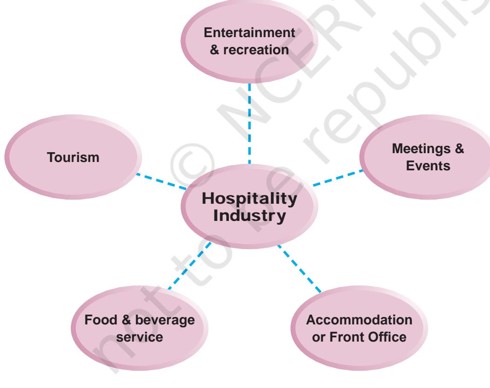
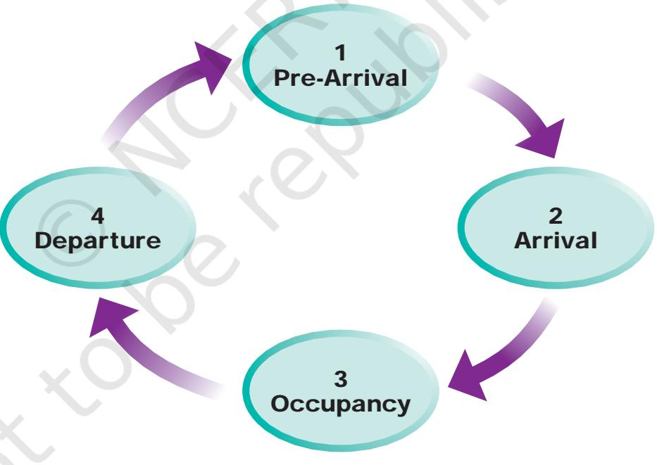
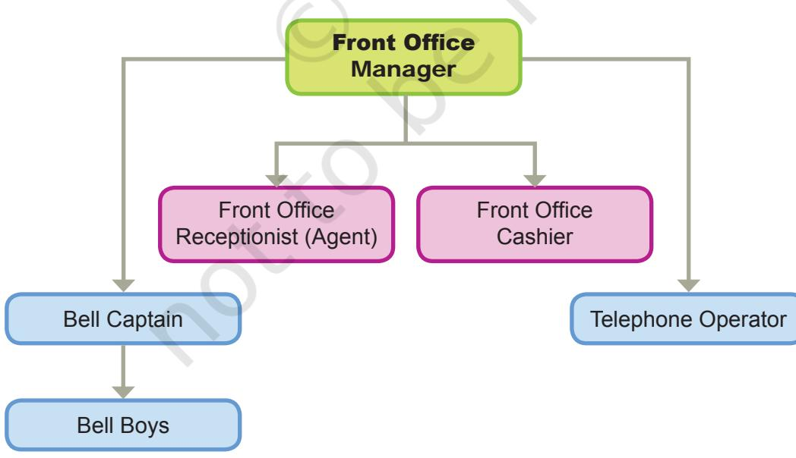
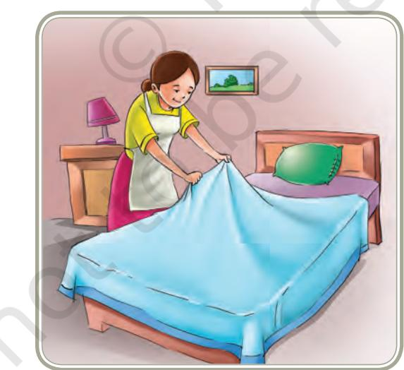
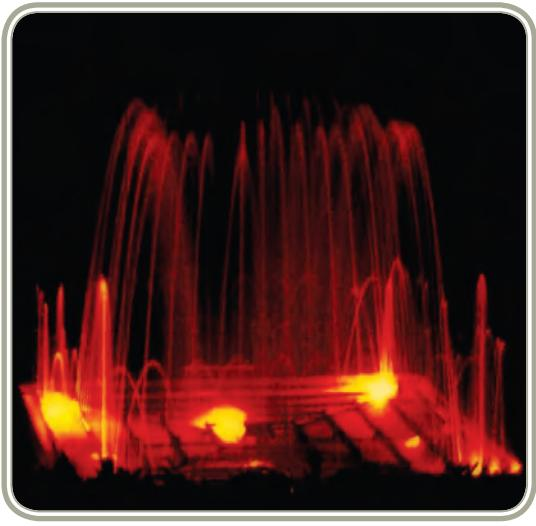
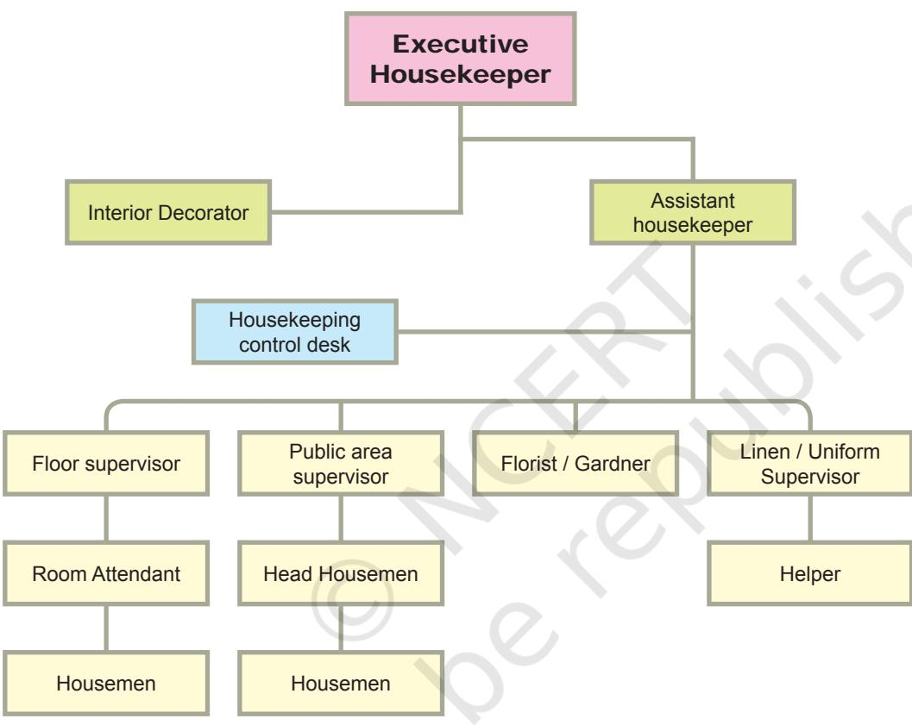

# **UNIT V**

Unit V - Resource Management

205

# **RESOURCE MANAGEMENT**

Chapters.indd 205 8/16/2022 12:28:42 PM

# Introduction

Resource Management focuses on the allocation and utilisation of human and non-human resources to achieve the goals of the individual and family in any organisation. It emphasises areas in consumer and family finance, ergonomics, design and management of interior and exterior spaces including environment as well as hospitality and event management. Students are taught to appreciate the importance of Ergonomics and its applications in the home, in public places and in industries.

All of us aspire to have a good standard of living and quality of life. This implies that as consumers we expect all products and services that we need and utilise are of good quality. When we purchase goods or products we often need advice. When we have any problems we need professionals who can help us to sort out the problems by approaching consumer guidance and counselling centers.

In addition, families as well as organisations need assistance for organising and conducting various events. You will find many events taking place in different parts of the country, varying from launching of products, film previews, launching of government schemes, marathons, fund raising, exhibitions, conferences, among many others such as weddings, parties, celebrations, etc. Persons/organisations that are responsible for these can approach and avail of professional services to organise such events. With increasing number of events in cities, metros and rural areas, event management is now becoming a specialty profession.

For any function, hospitality is an integral part of services and is required on daily basis whether it is a hotel, hospital or other related service organisations, such as hostels, service apartments and corporate houses, among others. This has opened up numerous career opportunities for persons at various hierarchal levels. Many companies today are looking for outsourcing hospitality related activities. Therefore, these areas offer tremendous potential for entrepreneurial ventures.

Whatever we do and wherever we work, performance and productivity are vital for success. Hence the role of human resource management is a critical component. Besides this, all of us like to work and live in attractive, user friendly places. This can be made possible by well-planned and managed spaces, both indoors and outdoors. Interior designers can help to render services to people/organisations for designing spaces. Similarly, the exterior of any building or place, parks, conversion of waste land to green zones are required to be done by landscape designers. The Interior Design course focusses on drafting and arranging as well as creating interiors of private and commercial spaces. It also prepares students to significantly and positively address local, regional and global environmental issues concerned with sustainable living and to create new ways to enhance the environmental concerns.

206

Chapters.indd 206 8/16/2022 12:28:42 PM

# Hospitality Management

Chapter

11

# Learning Objectives

After completing this chapter the learner will be able to:

- z explain the importance of hospitality management
- z explain the functioning of food and beverage departments of the hospitality industry
- z describe the functioning of housekeeping department
- z discuss the functioning of front office in hospitality industry
- z know the various career opportunities available in this field.

# Introduction

When we go to a restaurant or hotel, we expect to be greeted and served properly. If not, we are unlikely to repeat the visit. In Indian culture guests are regarded as God-like and treated accordingly, as encapsulated in the words "Athithi Devo Bhava". This implies that each and every guest must be received with warmth and given the best possible care and service in all respects. In ancient times, people generally stayed with relations or friends or in 'dharmashalas'. However, in modern times, increasing trade and commerce within the country and between different countries has necessitated provision of paid services for hospitality.

Chapters.indd 207 8/16/2022 12:28:42 PM

# Significance

With globalisation, the world has become a small place, where people travel from one place to another, within the country, and internationally for many reasons. It may be for business purposes, marketing products, for official purposes, study, pilgrimages, seeking health care (medical tourism), enjoying leisure time/vacation, visiting relatives or for shopping. Some people travel to see various places especially for experiencing different cultures, seeing heritage monuments, wildlife or natural beauty. You must have seen attractive advertisements for festivals like shopping festivals, wildlife tours etc. and photographs of people who come from many different places for events like the Pushkar and Kumbh melas, the Dusshera festival in Mysore, the Ganapati festival in Mumbai and Pune etc. All people who visit/participate in such events need a place to stay that is comfortable, safe and hygienic. If not, one carries unpleasant memories. Hence, tourists (Tourist is one who travels and stays temporarily in another place) need comforts and facilities similar or close enough to what they are accustomed to at home. The hospitality industry, hence, has grown to provide "*A Home Away From Home*" and this is one of the fastest growing industries.

Let us now explore the world of the hospitality industry and understand the efforts that the industry must make so that the tourists feel comfortable**.**

# Basic Concepts

Let us start with the term 'Hospitality'. *Hospitality* is the relationship between the guest and the host. It is the act/practice of being hospitable including friendly generous reception/welcoming of guests, their entertainment and providing services with warmth and courteousness. It is basically concerned with providing a place to stay, food, entertainment and other facilities to make the stay comfortable. Different types of establishments offer hospitality services e.g., hotels, motels, lodges, resorts, and furnished apartments.

- z A *hotel* is a commercial establishment offering lodging, meals and other services to its guests.
- z A *motel* provides services like a hotel and provides parking facility near the room or a room door that opens out onto the parking lot.
- z A *lodge* offers rented accommodation especially for sleeping and may not offer food and other services.

208

Chapters.indd 208 8/16/2022 12:28:42 PM

- z A *resort* is known for its leisure attraction. It offers a broad range of amenities, sports facilities and leisure activities for ensuring a total vacation experience.
- z *Furnished apartments* provide all essential amenities needed by the guests.
- z *Furnished camps* provide hospitality to people who go hiking, undertake adventure sports etc.

In addition to these, hospitality services are integral to the services provided at conventions, conferences and other events including weddings and parties, theme parks, cruise lines, amusement parks as well as guest houses, hospitals. Organisations which provide hospitality generally have management departments. Hospitality services are also provided by hostels. The fundamental principles of hospitality management are applicable to one and all. In order to have smooth and efficient functioning the tasks are carried out by different sectors or departments as shown in Fig. 17.1.

*Fig. 17.1: Departments/Sectors in Hospitality Industry*

209

Chapters.indd 209 8/16/2022 12:28:42 PM

In order to have a better understanding of the different departments it is necessary to understand the concept of "Guest Cycle".

What is the Guest Cycle? The *"***Guest Cycle"** starts even before the guests physically steps into a hotel and it consists of four stages (Fig. 17.2).

- 1. *Pre-arrival stage*  The activities done in the pre-arrival stage include: (i) quoting rates for a guest (ii) reserving a room as a part of central reservation system or reservation department.
- 2. *Arrival Stage*  In this stage, as the title suggests, the guest actually arrives and registers or checks-in.
- 3. *Occupancy* This stage consists of providing various services as per the guest's requirements, ensuring security of the guest and coordination of various guest services. Guest satisfaction is the main focus in order to ensure and encourage the guest to patronise and use the services of the establishment again; in other words, to obtain and retain 'customer loyalty'.

*Fig. 17.2: Stages of the "Guest Cycle"*

- 4. *Departure*  This is the final stage of the Guest Cycle where the guest is ready to leave/move out or "check-out" of the accommodation. An up-to-date record of the room occupancy of the guest is kept along with other information about the guest known as 'guest history'
210

Chapters.indd 210 8/16/2022 12:28:42 PM

including feedback from the guest about his/her opinion about the services.

#### *Departments Involved In Hospitality Management of an Organisation*

*Front office*: The guest cycle falls largely under the domain of Front Office. The guest arrives at the front office and comes in contact with the staff of the hospitality industry for the first time. Interaction between the guest and the staff is very critical to develop good relationship between the guest and the organisation and also in building a good image. Hence, the front office is the focal point of any hotel.

The services offered by the staff here include — welcoming guests, meeting and greeting them, organising reservation status of room availability, registering guests and allocation of rooms, maintaining records of check-in and check-out details, porter services, issuing room keys to guests, passing messages to customers, coordinating with other guest services, providing in-house and external information to the guests, and preparing and settling their bills. The manner in which the services are offered plays a central role in image building of the institution and ultimately determines the revenue generated. Would you like to be greeted/served by a person who is expressionless and indifferent? Not at all! The front office staff also coordinate with various departments for providing services to guests such as the Transport for assisting the guest with transport, Accounts, Billing, Room service, Restaurants, Engineering, Stores, Sales and Housekeeping departments. The organisational chart of Front office is shown in Fig. 17.3.

*Fig. 17.3: Organisation of the Front Office Department*

211

Chapters.indd 211 8/16/2022 12:28:42 PM

The services offered by different staff members under front office desk are shown in Table 17.1.

#### **Table 17.1: Designations and Functions/Duties of various Personnel in the Front Office**

| Designations | Functions/Duties |
| --- | --- |
| Front Office Manager | Responsible for managing the front office, lobby, |
|  | transport activities. Schedules shifts/staff rotations |
|  | and duties of the staff in shifts, since all hotels |
|  | work for 24 hours. Checks the arrivals of the day, |
|  | the "V.I.P."s, coordinates with housekeeping and |
|  | other departments. |
| Front Office Supervisor | Is responsible for a shift. Meets and greets all |
|  | arrivals, ensures accurate and speedy rooming |
|  | procedure. She/He checks occupancy. |
| Front Office Cashier | Is responsible for maintaining the guests' bills and |
|  | receiving payments when the guests checkout. |
| Telephone Operator / | Is responsible for providing information and |
| Information assistant | communicates with in-house guests and visitors. |
| Assistant Manager | Organises and supervises the front office in the |
| Front Office | absence of front office manager and ensures |
|  | smooth functioning of the front office. |
| Lobby Manager | Organises, supervises and controls all uniformed |
|  | services. |
| Receptionist (Front | Reserves, registers and assigns rooms to guests |
| office Agent) | and provides information as and when necessary to |
|  | guests during their stay in the hotel. |
| Bell Captain | Organises, supervises and controls all uniformed |
|  | services, bell boys in the lobby, supervises all |
|  | baggage movement during check-in and check-out. |
| Bellboy | Is responsible for shifting of baggage of guests, |
|  | within and out of the room. |
| Doorman | Welcomes guests upon arrival and escorts them to |
|  | the registration desk. |

Chapters.indd 212 8/16/2022 12:28:42 PM

*Housekeeping Department:* Housekeeping department is primarily responsible for providing a healthy environment by ensuring cleanliness and maintaining high standards of hygiene along with ensuring that the aesthetics of the entire establishment are maintained. The guest's decision to stay and repeatedly visit the hotel in future largely depends upon the quality of the services provided. In case of hotels, room decor, facilities provided within the rooms, safety, cleanliness and hygiene are most important.

Nowadays, many organisations, including corporate offices, are hiring housekeeping services on contractual basis. This provides an avenue for many people to start their own enterprise. When housekeeping consultancy is done on a commercial basis, it has a greater volume of activities and challenges. The work of maintaining numerous rooms and public areas becomes a gigantic and complex task. In order to provide valuable services to the client, it is essential to plan and organise the department with various sections and trained staff.

#### *Functions of Housekeeping Department*

As the prime function is to maintain cleanliness and space hygiene, it is responsible for the following —

- z Cleaning of public areas and guestrooms
- z Supply, upkeep of laundry and exchange of various linen and uniforms.

*Fig. 17.4: Housekeeper replacing linen*

- z Internal flower arrangement and maintenance of external landscape or garden.
213

Chapters.indd 213 8/16/2022 12:28:43 PM

*Fig. 17.5: Special Lighting effect in the Garden of a Hotel*

- z Coordination and communication with other departments such as front office, restaurants, engineering, accounts, etc., through control desk.
- z Pest control is also the responsibility of this department.

In order to perform these functions efficiently, the housekeeping department is divided into sections, which are as follows:

- 1. *Housekeeping control desk* passes on the information to housekeeping staff who are working in various parts of the hotel.
- 2. *Housekeeping management*  plans, organises and controls all the activities of the housekeeping department.
- 3. *Guestroom brigade*  upkeeps and cleans the guestrooms.
- 4. *Public area brigade*  maintains cleanliness of foyer, lobby, front office and other common areas.
- 5.*Linen and uniform room*  coordinates with laundry; responsible for providing clean linen to entire establishment and uniform to all the staff.
- 6. *Horticulture and flower arrangement team*  maintains landscape of the hotel and arranges flowers in rooms and at various places.
- 7. *Lost and found section*  deposits misplaced luggage of guests.

Chapters.indd 214 8/16/2022 12:28:43 PM

#### *Staffing pattern of Housekeeping Department*

In order to run the department efficiently it is essential to select appropriate manpower to match the various posts within. The organisational chart as given in Fig. 17.4 shows the staff hierarchy in a hotel. The organisational structure and hierarchy may vary from one organisation / hotel to another. One may appoint different individuals in different posts or have some staff 'multi-tasking'.

#### *Fig. 17.6: General Organisational Chart of a Housekeeping Department*

*Responsibilities of the housekeeping department personnel:*

- *1. Executive Housekeeper*  is responsible for managing the functioning of the department through judicious use of manpower, materials, money, time and other available resources. S/he checks schedules, cleanliness and all functioning of the housekeeping department.
- *2. Assistant Housekeeper*  There may be one for each shift of duty in a large hotel. Prepares duty schedule and checks cleanliness and functioning of the workers.

215

Chapters.indd 215 8/16/2022 12:28:43 PM

- 
- *3. Desk control supervisor*  coordinates with front office for information on departure of guests, gets vacated rooms cleaned and hands over cleaned rooms. This desk should be manned 24 hours, as guests and staff contact this desk to receive or transmit information any time.
	- *4. Floor supervisor*  There is one supervisor for each floor, responsible for cleanliness and maintenance of guest rooms, corridors, and staircase and floor pantries.
	- *5. Room attendant*  does actual cleaning of guest rooms and bath rooms. Housemen perform the heavy cleaning activities such as vacuuming, mopping, sweeping, shifting of furniture.
	- *6. Public Area Supervisor*  is responsible for maintaining cleanliness of the public areas (Main entrance, corridor, offices, banquet halls, restaurants etc.). Gets work done through Housemen.
	- *7. Florist/Gardner*  May be one person in case of small hotel. Maintains garden and does flower arrangement in various parts of the hotel.
	- *8. Linen room/uniform room supervisor* is responsible for supply, acquisition, storage, issue and cleanliness of the linen and uniforms required in various parts of the hotel.

Cleaning is an integral part of any organisation/office/hotel, hence it involves planning and having a well-organised approach in selecting staff with practical housekeeping operational skills with correct cleaning procedures and skill to do the task well under a qualified superviser to ensure quality services. Appropriate selection of specialised equipment, tools, and cleaning solutions and knowledge of latest technological applications is an essential part of training. The cleaning activities are performed either on daily, weekly, monthly or seasonal basis.

Cleaning of various *surfaces* in the hotel is done with suitable tools, cleaning solutions and specific methods. Various materials and finishes used for wall, floor, counter tops and furniture are *wood, granite, marble, ceramic tiles, stones, linoleum, plastic, vinyl, fibre glass, metals, leather, cane, rubber, cloth, paints, wall papers,* etc. Various *equipments* are needed for keeping good cleanliness. The commonly used equipments are *vacuum cleaners, various types of brushes, brooms and mops, containers, cleaning cloth and trolleys to carry multiple equipments.* Various *cleaning agents* such as *water, ammonia, vinegar, soaps and detergents, washing soda, abrasives, polishes, acids and other such liquids are used for cleaning various surfaces and materials.* One should be very cautious while using these cleaning agents. Some strong agents may damage the surface while cleaning the material hence choice of appropriate cleaning agents is important.

Chapters.indd 216 8/16/2022 12:28:43 PM

#### **Activity 1**

Students are to be divided into four groups. One group will visit a hotel to observe and learn cleaning. Each group will be asked to observe daily, weekly, monthly and seasonal/spring cleaning procedures and note down the steps for each in detail, the materials cleaned, the equipment/tools used in the following format.

*Note:* The steps are many.

#### **GROUP 1**

Cleaning Procedure Daily/Weekly/ Tools used steps Monthly/Seasonal 1 ------------------------- 2 -------------------------

3 -------------------------

#### **GROUP 2**

Find out the methods of common cleaning of various surfaces in the following format.

#### **Material Method of cleaning**

Wood

Granite

Marble

#### **GROUP 3**

Conduct a market survey to find out various cleaning equipments such as brooms, brushes, mops etc. and draw the diagrams and uses in the practical book. Note the cost of the cleaning equipments

Brooms: Types – cost – diagram

Brushes: Types – cost – diagram

Mops: Types – cost – diagram

#### **GROUP 4**

Conduct a market survey to find out various cleaning agents available in the market and their cost. Record the brand, cost, properties and the label information. List the use and precautions given on the label by the manufacturer.

217

Chapters.indd 217 8/16/2022 12:28:43 PM

The linen and uniform room is an integral part of the house keeping department. The laundry may be done in the department if facilities are provided. Otherwise it can be given to an outside agency. The linen room stores and maintains enough stock of bed linen, bath linen, linen for restaurant(s) etc. and uniforms of all the staff members of the hotel.

Flowers are used to enhance the aesthetic appeal of various interior spaces. The establishment may give a contract to florists to supply flower arrangements regularly. Alternatively the flower arrangements in various areas of the premises may be made by the housekeeping department.

#### **Activity 2**

Visit a hotel to see the flower arrangement(s) done at various places such as restaurant, banquet hall, reception, centre table of a meeting room, dais of a conference table etc. Note down the size of the arrangement and placement.

In many hotels, staff is trained for environmental conservation and eco-friendly practices such as using 100% organic cotton bed sheets, chemical-free laundry cycle and using agents which are non-toxic, waterbased, hypoallergenic and biodegradable. Cards are put in hotel rooms urging the reuse of towels, promoting the saving of natural resources like water, electricity, detergent used for laundering. Use of energy-efficient light bulbs in rooms can help save electricity.

#### *Food and Beverages Department*

The Food and Beverages department is responsible for the sale of food and beverages. The relevant service departments involved are kitchen(s), banquets, restaurants, room service, stewarding and bars/coffee shops etc.

*Kitchen* is the place where food is prepared. In large hotels the kitchen may have independent sections for various aspects related to food preparations, such as butchery (to deal with raw meat), bakery and confectionery, vegetable preparations, soups section, pantry, hot range and so on. In smaller hotels the kitchen would combine the sections. In large establishments there could be various staff (kitchen crew) in the kitchen. The executive chef (Chef-de-cuisine) is the head of the kitchen responsible for planning, organising and controlling the kitchen operations. The next is the deputy chef. There are supervisors for some sections of the kitchen called "Chef-de-parties". Then there are number of cooks who make the common food items. The restaurant personnel coordinate closely with the kitchen for the supply of food orders to guests.

218

Chapters.indd 218 8/16/2022 12:28:43 PM

*Kitchen Stewarding* is concerned with the storage, maintenance, cleanliness and issue of cutlery, crockery and glassware to the restaurant and kitchen. It is the responsibility of this department to maintain cleanliness in the kitchen and to wash the pots and pans used. This department may have an executive kitchen steward, kitchen steward, dishwasher, pot washer and utility workers to clean the kitchen. Those working in this department must have high standards of grooming, hygiene and sanitation, and good manners and basic etiquette. Each hotel serves different varieties of food and beverages to the customers.

*Restaurant* is a commercial facility that provides food and beverages to the customers. It is equipped with dining tables, chairs and other required furniture with crockery, cutlery, linen and décor, varying in quality as suited to the objectives, concept and standards of the establishment. The restaurant has various staff members. A *restaurant manager* is responsible for overall functioning of the restaurant. The senior *Restaurant supervisor*  and *Head Waiter* lead a team of *waiters/stewards* who actually serve the food and the *assistant waiter* who clears the table. They see that the standard of cleanliness, hygiene and service are maintained. They have to be smiling, courteous to the guests and possess good manners and etiquette. They should have thorough knowledge of the ways of serving the food.

#### *Support Service Departments*

A hotel has other departments which provide support and are involved in the overall management and efficient functioning of the hotel. These departments which may also be referred to as 'back office' departments are: *Finance and Accounts, Engineering, Human Resources department, Sales and Marketing* departments. Thus, a hotel has various departments having complex relationships amongst them. The smooth functioning of the organisation requires efficient management of man, material and other resources.

#### *Management Functions*

The management functions are planning, organising, co-ordinating, staffing, directing, controlling and evaluating the use of resources in light of the goals of the institution. Each of these functions have been briefly discussed in the chapter on Catering Management.

## Scope

The organisational structure of the hotel has a hierarchy of top management, middle management, junior management, supervisors and operations staff. There are job opportunities at each of these levels in

219

Chapters.indd 219 8/16/2022 12:28:43 PM

the hospitality industry. Youth form the major part of workforce. Hotels prefer youth because they have high energy to work for long hours, as compared to middle aged people. They are better informed and have better competencies through advancement in education. They are open to new ideas and latest technologies. They have ambition for success and earn high monetary returns. Since hospitality industry is fast growing, there are ample opportunities for you to be absorbed in this field. The fundamentals of hospitality management are applicable to hostels and large hospitals also.

The essential competencies required to work in this industry are: The staff needs to be well groomed, have good hygiene, orderliness, good manners and etiquettes besides a smiling face. The cheerful attitude, self discipline, courtesy, physical fitness and good communication skills along with self-confidence and multiple language skills add to the possibility of ideal front office staff. Some of the other aspects to be kept in mind by the staff are a clean and neatly pressed uniform, minimum accessories and well groomed hair. Nails should be clean and properly manicured. The front office staff must be seen at their best at all times as this projects a good image not only of themselves but also of the establishments.

Across the country there are various catering and hospitality management courses offered starting from certificate to degree courses.

Hotel Management is one of the most popular choices for a carrer. Catering and Hospitality Management courses are offered by various institutes. Candiadates can pursue catering courses at undergraduates as well as post graduate level. Apart from degree course, one can also pursue diploma and certificate course in this field.

#### **Career Opportunities**

- zz Positions in housekeeping departments at various hierarchical levels
- zz Entrepreneurial opportunities in housekeeping
- zz Positions in front office and reception/control desk in hotels
- zz Entrepreneurial opportunities for supply of flower arrangements, etc.
- zz Specialised in theme-based events within the organisation.

Chapters.indd 220 8/16/2022 12:28:43 PM

### **Key Terms**

Hospitality management, Front Office, Housekeeping, Food and Beverages department.

### **Review Questions**

- 1. What is the importance of 'Front Office' in a hotel?
- 2. Write the responsibilities of any three members of the front office staff.
- 3. Write the responsibilities of any three members of the housekeeping department of a hotel.
- 4. Explain the meaning and functioning of restaurant and kitchen.
- 5. What are the different types of food services in a hotel?
- 6. What are the management functions in relation to hotels?
- 7. State whether the following statements are **True** or **False**.
	- (a) Smile is the most enduring competency required of Front Office personnel.
	- (b) 'A Suite' has two rooms, one serves as a living-cum-dining area and the other room has a bed.
	- (c) Housekeeping department provides food to the customers.
	- (d) Kitchen stewarding is concerned with the preparation of food.
	- (e) Controlling is the function of ensuring that the plans and objectives keep to the schedules and allocated budget.

221

Chapters.indd 221 8/16/2022 12:28:43 PM

