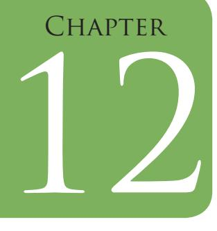

# Consumer Education and Protection

## LEARNING OBJECTIVES

After completing this chapter the learner will be able to —

- z understand the importance and role of Consumer Education and Protection
- z explain the basic concepts related to Consumer Education and Protection
- z analyse the knowledge and skills needed for a career in this field
- z understand the scope and career options.

## Introduction

222

All of us purchase a variety of goods and services to satisfy our needs and desires. Hence, every human is a natural consumer. Have you, your parents or friend experienced any problem where, even after paying for the goods, you found that the quality was not as per your expectations for the price paid or the quantity supplied was less than what was promised? Did you pay for some services which appeared attractive in the advertisement but in reality fell far short of the image portrayed? Under such circumstances what was your reaction? Did you feel frustrated and cheated? What did you do? Did you take any action, draw attention of the manufacturer/service

Chapters.indd 222 8/16/2022 12:28:43 PM

provider to the problem you experienced? Did they give you a hearing and take any kind of corrective measures? Were you satisfied? If not, did you feel that the situation could have been better if you had some support? Let us try to find answers to these questions.

You have already learnt in Class XI about family finance management incorporating money income, its management, savings and investment, credit and also realised how important it is to get maximum satisfaction on spending each penny that you earn. Consumer education teaches you to be an efficient and alert consumer.

### Significance of Consumer Education and Protection

Look around and you will find that the number of products being manufactured and sold is steadily increasing in both urban and rural markets. We are all aware that manufacturers are responsible for supplying good quality products and if there is a problem, consumers have the right to redressal. Manufacturers can no longer take consumers/customers for granted. With increasing number of consumers and volume of consumption of goods and services, manufacturers/suppliers/service providers have begun to realise that it is important to respect and satisfy the 'consumer', since the reputation of the company and its profits are determined by consumer opinion. India has been transforming from an underdeveloped to a developing economy. Much of this can be attributed to industrialisation and globalisation. These economic changes have improved the standard of living along with increased buying power. We are living in a 'global village' and facing the challenges of global markets. The march towards 'global economy' necessitates a global outlook on the part of consumers who cannot sit back and watch. They have to emerge as a progressive force to ensure their welfare. They have to understand the economic system and inter relationships of individuals with each other, with business and with government. It is necessary for today's consumer to be careful, alert and be well informed. Consumer education and protection have thus become important.

Further, the Indian government has become liberal and opened the doors to foreign companies. Thus we can see a variety of products, made by multinationals that have established their manufacturing/assembly units in India or imported items, on the shelves of many stores. This has advantages but, at the same time, there are disadvantages. On the positive side the Indian consumer has much to choose from and can look

223

Chapters.indd 223 8/16/2022 12:28:43 PM

for better products with competitive pricing. The disadvantage of having a large array of products is that choosing the right product is now more difficult since one has to understand new technology, new products and new features. One has to compare the price and quality, in order to be able to make an informed decision, especially because consumers face problems such as malpractices, exploitation by unscrupulous sellers, misleading advertisements, making it important for each one of us to be wise consumers.

### Basic Concepts

*Let us first briefly examine the word 'consumer'*. We can define *Consumers* as the final buyers of goods and services, for the satisfaction of their personal needs and wants, ranging from products of nature to products and/or services from the market. Consumers are the primary component of a socio-economic system since every human being who is a consumer to a smaller to larger extent would like to have a good standard of living. Hence as purchasing power increases, people tend to purchase products that will give comfort, satisfaction and as a symbol of prestige, contributing to increasing number of 'consumer footfalls'. The more people buy, more money comes into the market/system and thus contributes to the development and growth of the country's economy.

Let us acquaint ourselves with a few other relevant terms:

*Consumer product*: The term means any article, produced or distributed for sale to a consumer for personal or family use in one's home or in an institution e.g., school, hospital, college, office, etc., or for business purposes.

*Consumer behaviour:* It is a process through which the buyer makes decisions about purchasing.

*Consumer forum*: A place/organisation where consumers can discuss consumer products/services and their advantages and disadvantages. Some forums work as advocacy groups that seek to protect consumers and help them address problems faced vis-a-vis consumer products.

*Consumer footfalls*: This means the number of customers/consumers who visit any given space such as a store or a mall. Thus with increasing consumption in a country, consumer footfalls are higher. Fig. 20.1 summarises what a customer expects when s/he buys either a product or service.

Chapters.indd 224 8/16/2022 12:28:43 PM

*Fig. 20.1: Consumers' expectations while purchasing goods*

However, many a times consumers face problems because the manufacturers/service providers may be unable to fulfill all expectations, some of them may cheat and many consumers do not take manufacturers/ retailers to task for shoddy products, high prices, adulteration, faulty weights and measures and/or are unaware of various protection measures. It is important to know about these *problems* so that one can ensure that one is not cheated. It is universally recognised that the level of consumer awareness and protection is an indicator of a country's development and progress. Let us now look at some of the major problems faced by consumers.

- 1. *Substandard/poor quality goods:* Various manufacturers can make the same product such as large multinational corporations, local Indian manufacturers and some may be imported from other countries. However, the material used may be different and the product quality may also vary, making it difficult for a consumer to identify a poor quality product. Many consumers are ignorant about quality standards.
- 2. *Adulteration:* Adulteration may be intentional or unintentional. A substance is said to be adulterated when some substances are either added to or removed from a product. Consequently the composition, nature or quality is altered. Adulteration is a serious problem not only because it is exploitative but because it can cause harm to health and safety of the consumer.

225

Chapters.indd 225 8/16/2022 12:28:43 PM

- 3. *High Prices:* Every consumer expects that s/he will be charged a fair price for a product. However, we must bear in mind that prices are influenced by government policy, availability, quality, delivery system, market location, method of distribution, costs of promotion, method of purchase and consumer's desire for convenience. Despite this, some consumers tend to relate price to quality of an item, though it is not necessary. Prices of same quality goods may vary because of high/low cost of production, overhead expenses, advertising etc. Some suppliers may overcharge when they find that the customer is not well informed and lacks knowledge.
- 4. *Lack of Consumer Information:* Most consumers are unaware of their rights and responsibilities and do not know the various legislative provisions that have been made to protect them.
- 5. *Inadequate or Erroneous Information given by Manufacturer:* This includes:
	- z Labels of most products are not factually correct, some are deceptive and misleading. Most labels fail to give complete essential information and often use terminologies which a common consumer is unable to understand.
	- z Advertisements are not informative and are limited in their ability to answer many essential questions about qualities or uses of the product. Seldom advertisements do focus on features, care and maintenance, after sales service, etc.
	- z There is a lack of buying guides on consumer durables and nondurables to aid the consumer in decision-making.
	- z Packaging is being used as a potent marketing tool. Attractive packages persuade consumers to make impulsive purchases. At times the container used for packing products is larger than the contents. Many a times several layers of expensive packing material is used. Manufacturers repackage existing products into attractive looking and novel shapes of packs and advertise the product to be "in a new pack", although the product quality is the same. However, the consumer is enticed by the new packing.
- 

6. *Incorrect Weights and Measures:* The consumer sometimes ends up getting less quantity than what he pays for due to incorrect weights and measures. This is because either the weights and scales are altered by the retailers or correct measures are incorrectly used. Measures are often deceptive and exploit consumers of their money. Weights and measures without seal or verification stamp are not genuine.

Chapters.indd 226 8/16/2022 12:28:43 PM

- 7. *Spurious /Duplicate/ Imitation Products:* Consumers are confused and cheated by spurious and substandard products, duplicates of well known brands, some having similar packaging, colour scheme and similar sounding brand names. Often such imitations are of poor quality and may be injurious and unsafe to use.
- 8. *Sales Promotion Schemes to Entice the Consumer:* Indian market is flooded with a plethora of products. Companies, national as well as multinational, are competing with one another to capture larger market share. To do so, they come out with several sales promotion schemes like exchange offers, bonus, lucky draws etc. Such means of sales promotion are not always genuine and deceive the consumer. Consumers tend to get swayed by these enticing sales promotion gimmicks and fall prey to them.
- 9. *Consumer Problems with regards to services:* Consumers face problems not only with regards to consumption of products of daily use but they also face grievances when they use a wide variety of services. This includes services provided by public utilities such as MCD, water, electricity, banks, Insurance and other financial institutions. There are poor after sales services provided to the consumers. The provider of the services do not deliver what they promise under the sales contract.

#### **Activity 1**

Interview five people in your locality and find out the consumer problems faced by them. Find out what actions they took to solve those problems. Make a list of problems faced and actions taken, and discuss in the class.

Eco-friendly Production and Green Consumption Sustainability is the buzz word these days. It is essentially related to the production and consumption system. Green marketing provides consumers with products that are more in tune with nature, which creates less waste products, uses few raw materials and saves other resources.

In order to effectively deal with the onslaught of clever and deceptive market interests, marketing strategies and other problems, consumers need to be aware and educated about their rights, responsibilities and protection mechanisms. Consumer Education and Protection are thus tools which empower and equip consumers to protect themselves from adverse market forces. In addition, they help the consumers understand legislation and policy matters which would directly have a bearing on their rights and choices as consumers.

227

Chapters.indd 227 8/16/2022 12:28:43 PM

The Government of India has accepted, established and enshrined six consumer rights under the *Consumer Protection Act (CPA)1986*. There are four basic rights— (i) right to safety, (ii) right to be informed, (iii) right to choose and (iv) right to be heard. Two additional rights areright to redressal and right to education.

*Fig. 20.2: Consumer Protection*

The Consumer Protection Act is a landmark legislation in the interest of the consumer. The main function of this Act is to protect consumers from fraudulent trade practices prevalent in the market place and provide redressal to them for their grievances. It is based on the principle of self help and protects consumer against all kinds of exploitation and unfair dealing. It intends to provide simple, speedy and inexpensive redressal to consumers for their grievances. The Act has two implications: First, it gives the consumer the right to complain to an authority about his/ her grievances and seek speedy redressal. Secondly, consumer can claim compensation for any loss or injury suffered on account of the negligence of the manufacturer. It applies to all goods and services unless otherwise expressly notified by the central government. The Act has made the consumer movement powerful, broad based, effective and people oriented.

The Consumer Protection Act (CPA) 2019 has recently replaced the three decade old CPA 1986. The new act proposed some measures and tightens the existing rules to further safeguard consumer rights. Introduction of a central regulator, strict penalties for misleading advertisements and guidelines for e-commerce and electronic service providers are some of the key highlights. Students can take detailed information on the revised CPA from the website.

*Consumer rights* are those rights, which are or should be provided legally to protect consumer interests. In other words, these are rights designed to ensure that all consumers obtain goods and services of reasonable quality, at fair prices. Let us briefly examine what the six rights under the *Consumer Protection Act* cover:

- *1. Right to Safety:* This refers to the right to be protected against hazardous effect that may be caused to the health/life of a consumer. This right specifies that the consumer has the right to be protected against products, production processes and services which are hazardous to health or life.
228

Chapters.indd 228 8/16/2022 12:28:44 PM

- *2. Right to be Informed*: This means the right to be informed about the quality, quantity, potency, purity, standard and price of goods and services, so as to protect the consumers against unfair trade practices.
- *3. Right to Choose*: This implies that every buyer has the right to have access to products of varying quality and quantities, prices, size and design, at competitive prices, and to choose according to his needs and wants.
- *4. Right to be heard:* The right to be heard means that consumers' interests will receive due consideration at appropriate forums. It also includes the right to be represented in various forums that are working to ensure consumer welfare. To enable consumers to exercise this right, both the state and voluntary agencies are expected to provide such forums.
- *5. Right to seek redressal:* Every consumer has the right to seek redressal against unfair trade practices or unscrupulous exploitation. It also includes the right to fair settlement of genuine grievances. It involves the right to receive compensation for faulty goods and services.
- *6. Right to Consumer Education:* This refers to every person's right to acquire knowledge and skill to be an informed consumer, so that s/he will be able to make wise decisions while purchasing goods and hiring services. This right implies that the consumer should be educated enough to be able to solve the problem himself.

#### **Activity 2**

Divide the class into two groups. Group A will deal with consumer rights and Group B with consumer responsibilities.

**Group A:** Talk to three people in your locality and find out the extent of their knowledge about consumer rights.

**Group B:** Talk to three people in your locality and find out awareness about consumer responsibilities among them.

Discuss your findings in the class and suggest what can be done to increase awareness about consumer rights.

Another mechanism of consumer protection is through standardisation marks. Consumers must purchase products with standardisation mark to ensure the quality/purity of the product. It is important for the consumer to know about different standard marks and the products covered under them. Standardisation is a prime requisite for attaining quality. Let us learn more about these standard marks.

229

Chapters.indd 229 8/16/2022 12:28:44 PM

*ISI Mark:* This is the certification mark of Bureau of Indian Standards (BIS), earlier called the Indian Standards Institution (ISI). Under this scheme, licences are issued to manufacturers whose goods meet the relevant standards. Indian standards cover food items such as vegetables, fruits and meat products, spices and condiments, processed foods, cereal and soya products, candies and beverages etc. Other products

covered by with the BIS standards include electrical goods, soaps, detergents, paints, paper etc. Among the various items covered under the scheme, some are under mandatory certification.

*AGMARK and fruit Product Order (FPO):* These standards have been promulgated by the Government of India. These certificates specifically pertain to food products. A consumer should look for AGMARK seal before purchasing any agricultural product as it ensures product reliability. FPO lays down statuary minimum standards in respect of quality of various fruits and vegetable products, and processing facilities. FPO also lays limits on metallic contaminants and preservatives for different fruit products.

*Fig. 20.4: Standardisation marks*

*Wool-mark:* Wool-mark is the standard mark of quality of the International Wool Secretariat for wool or woolen garments. It indicates that the wool is pure and the marked garment is not *made of other fibers but only pure wool.*

*The Silk Mark:* is a quality assurance label for the assurance of pure silk and in addition serves as a brand for generic promotion of pure silk. Silk Mark ensures '100% natural silk'.

*Hallmark:* It indicates that the precious metals such as platinum, silver and gold articles have been evaluated and tested at an official Assaying and Hallmarking Centre and they have certified that the metal used conforms to the national/ international standard of fineness/purity.

*Fig. 20.5: BSI Hallmark*

*Ecomark Scheme:* BIS operates the Ecomark scheme for labeling of household consumer products such as soaps and detergents, paper, packaging material, plastic products, etc. The logo for Ecomark scheme

230

Chapters.indd 230 8/16/2022 12:28:44 PM

*Fig. 20.6: Ecomark*

is an earthern pot which signifies that this product is environment friendly and does not produce any hazardous waste, is biodegradable and can be recycled.

*FSSAI:* The Food Safety and Standards Authority of India (FSSAI) has been established under Food Safety and Standards Act 2006. This lays down science based standards for articles of food and to regulate their manufacture, storage, distribution and sale to ensure the availability of same for human consumption. *Fig. 20.7: FSSAI mark*

 Apart from statutory, semi-government and non-government bodies looking after consumer interests like Bureau of Indian Standards (BIS) and Directorate of Marketing and Inspection (DMI), Government of India, there are *Protection Councils* set up by the government at central and state levels.

Non-governmental organisations (NGO's)/voluntary *consumer organisations* play an important role in consumer education and protection due to their non-partisan interests. They also disseminate information through their magazines, booklets, newsletters, buying guides, audio visual material and research reports. Many consumer organisations are engaged in comparative testing of products, creating consumer awareness about harmful and unsafe products, product recalls, disseminating information about new legislative provisions for consumers, legal advice and advocacy, handling consumer grievances and complaints and acting as vigilance groups. They hold public meetings and have libraries and documentation centres, and play an important role in consumer awareness, empowerment and consumer movement. In India we have several consumer organisations bringing out publications in the interest of the consumer. VOICE, a Delhi based consumer organisation, brings out 'Consumer Voice', CERC, an Ahmedabad based consumer organisation, brings out 'Insight'. Similarly, the Consumers Union in the US brings out 'Consumer Reports'; Consumer Association in UK brings out 'Which' and the Australian Consumers Association brings out 'Choice'.

Every human being has not only rights but also responsibilities. You may have heard some people speak of 'rights and responsibilities', clearly indicating that both go hand in hand. Thus in order to be able to exercise one's right it is necessary to be aware of one's duty. As consumers therefore, we need to be aware of our responsibilities. *Consumer responsibilities* are:

- 1. Consumers should have responsibility towards regularly updating their knowledge of various laws and legislative provisions made by the government.
- 2. Consumers should be honest in all their dealings and must pay for all their purchases.

231

Chapters.indd 231 8/16/2022 12:28:45 PM

- 3. Before making a purchase, consumers should do a market survey to find out the different brands, features etc. of items available in different shops and different markets and should compare the prices. This will help them make a wise choice.
- 4. Consumers should feel free to choose from the variety available as per their needs and requirements.
- 5. While making a purchase, s/he should read all the information given on the label/ brochure.
- 6. To be assured of quality he should buy products with standardisation marks.
- 7. Consumer should keep receipts and other relevant documents of purchase. These may be needed as proof of purchase for filing complaints in case of problems/defective/malfunctioning products.
- 8. In case of purchase of services like insurance, credit cards, bank deposits etc., s/he should read and understand all terms and conditions, liabilities, service charges etc. and make an effort to get the representative to clarify points that are not clearly written.
- 9. S/he must have increasing awareness about various national and international consumer organisations in terms of their activities, work and understand the benefits of becoming a member of such organisations.

### **Skills Required for Career in Consumer Studies Field**

To be successful in the field of consumer studies you need knowledge about consumer protection mechanisms and redressal agencies but you also need soft skills like good communication and interpersonal skills, empathetic and understanding attitude, being a good listener, being creative in developing programmes, advertisements, talks etc. for consumer awareness. You should have writing skills for developing educational material for consumer education, reporting consumer tests of consumer products and a willingness to help fellow consumers and public at large.

A person desirous of entering this field as a professional must have thorough knowledge about quality standards of various kinds of products, adulteration and detection of adulterants as well as consumer protection laws, consumer rights and responsibilities.

Several career options in the area of consumer education and protection will be open to you after pursuing courses at the under

232

Chapters.indd 232 8/16/2022 12:28:45 PM

graduate and post-graduate levels. These programmes aim at creating an overall awareness and training on Consumer Affairs with special emphasis on Consumer Protection.

One has the option of doing a degree course in B.Sc. Home Science/ B.A. Home Science, B.Sc. Family Resource Management/B.Sc. Home Management/B.Sc. Resource Management/Bachelor of Business Adminstration (B.B.A.)/Bachelor of Business studies (B.B.S.), etc. In different institutions the subject may be called Consumer Studies, Consumer Education, Consumer Behaviour, Consumer in the Market.

### Scope

Having taken training in the area of consumer education and protection you could develop your career in the following areas:

- z Work in government organisations like Bureau of Indian Standards, Directorate of Marketing and Inspection, Ministry of Consumer Affairs in various decision making managerial and technical positions.
- z Work in voluntary consumer organisations for product testing, creating consumer awareness, consumer education or empowerment, publication of their magazine, etc.
- z Work in the Consumer division of corporate houses which deal with consumer complaints and consumer suggestions or in customer relationship management and customer facilitation division looking into creating customer data bases and dealing with them on a one to one personal basis.
- z Work with market research organisations in areas of consumer behaviour, product reach, consumer acceptance of new products, consumer feedback and suggestions.
- z Start your own consumer organisation dealing with the issues discussed in the chapter.
- z Work in National Consumer Helpline for doing consumer counselling, helping people in getting redressal to their complaints.
- z Work as consultants to consumer clubs being run by schools and colleges such as managing and planning their educative and outreach activities, taking up teaching assignments in schools and colleges in the area of consumer studies. You can also function as a freelance consultant for redressal guidance through consumer courts and other alternative redressal mechanisms.
- z Work with the Department of Audio-visual Publicity as content developer for their advertisements dealing with consumer awareness and education in the print and electronic media.

233

Chapters.indd 233 8/16/2022 12:28:45 PM

- z Work as an analyst in consumer testing laboratories for comparative evaluation of products.
- z Some persons may also become consumer activists, and with legal training can plead cases in Consumer Protection Courts.
- z Those who have excellent writing skills may take up journalism related to consumer affairs.

Besides all of the above, with some additional training, those interested can work at junior level to assist individuals in financial management. With further training and experience, one can move into careers related to insurance, shares and financial portfolio management.

### **Key Terms**

Consumer, Consumer Rights, Consumer Protection Act, Consumer Rights and Responsibility, Standardisation Marks.

### **Review Questions**

- 1. Explain the following terms in 2–3 lines:
	- a. Consumer
	- b. Consumer rights
	- c. Consumer responsibilities
	- d. Consumer Protection Act
	- e. Consumer problems
- 2. List the following:
	- a. Any three consumer rights
	- b. Any three consumer responsibilities
	- c. Any five consumer problems
	- d. Any three standardisation marks
- 3. State true or false:
	- a. ISI mark is given by BIS.
	- b. Agmark is meant for agricultural products.
	- c. Right to safety is not a consumer right.
	- d. VOICE is the name of a consumer organisation.
- 4. Discuss in brief the basics concepts of consumer education and protection.

234

Chapters.indd 234 8/16/2022 12:28:45 PM

### **PRACTICAL 1**

**Theme:** Develop leaflet/pamphlet for Consumer Education and Protection

### **Tasks:**

- 1. Collecting relevant information on the topic
- 2. Learn to compile the topic in limited space in a leaflet or pamphlet form
- 3. Putting the concepts in simple way which is understood by the target group
- 4. Each write up should have a crisp introduction, body and conclusion or application to enable the reader to be a wise consumer.

### **Purpose**

- 1. Students will understand the art of preparing leaflet/ pamphlet for awareness camp.
- 2. It will enable the students to collect information on the given topic and use simple language to express the content by giving the heading, sub-heading and salient features.
- 3. Creating Awareness on Consumer Education.

### **Conducting the Practical**

- 1. Class can be divided into five groups.
- 2. Each group can work on one topic—Consumer Protection, Consumer Rights, Consumer Responsibilities, Standardisation Marks, Consumer Rederessal.
- 3. Each group can collect information on the given topic with introduction, body and conclusion to be compiled in simple words or local language.
- 4. Get the same approved by the teacher in-charge.
- 5. Then place the content in the leaflet or pamphlet form along with the names of school and group members.
- 6. Present the information to other class mates.
- 7. Get the same printed or photocopied to use it for awareness camps in the local community/area.

235

Chapters.indd 235 8/16/2022 12:28:45 PM

A leaflet may consist of a single sheet of paper that is printed on both sides and folded in various ways. The most common types of single-sheet leaflets are the bi-fold (a single sheet printed on both sides and folded into halves) and the tri-fold (the same, but folded into thirds). A bi-fold brochure results in four panels (two panels on each side), while a tri-fold results in six panels (three panels on each side). Important points to be kept in mind while designing a leaflet:

- z *Heading:* The leaflet heading is normally the most important part of the leaflet because it is the part that first catches the eye. The heading must be brief, summarising the theme by using short, forceful words.
- z *Subheading:* Leaflet subheadings are used when it is impossible to summarise the text in the main heading and further explanation is needed. They may also be used to introduce separate paragraphs in the body of the text and to bridge gaps between headline and text.
- z *Text:* To gain the interest of a target audience within the first few words, the first or two sentences of the text should contain the substance of the message, with the facts and details following. The text should be simple and to the point, presenting the message to the target audience without confusing them. The leaflet normally presents only one theme. A leaflet which presents two or more unrelated or vaguely related themes confuses the target audience.
- z *Pictures*: When pictures, preferably photographs, are used, the picture and the text must complement each other, convey the same idea to the target audience, each expanding the ideas of the other.

The leaflet/pamphlet for Consumer Education can be on any one of the following topics:

- a. Consumer Protection Act
- b. Consumer Rights
- c. Consumer responsibilities
- d. Standardisation marks
- e. Consumer problems/redressal

### **Additional Activities**

### **Activity No. 4**

Read newspaper regularly and keep a cutting of news article on any case reported under the Consumer Protection Act for purposes of redressal. Discuss it in the class.

Chapters.indd 236 8/16/2022 12:28:45 PM

236

#### **Activity No.5**

Collect labels/packages of any ten commodities of daily use (like spices, biscuits, bulbs, sugar, sauce, jam, etc.) and see which standardisation marks are found on them. Discuss these in the class.

### **Activity No.6**

Visit the websites of your state university and other major Indian universities and find out the subjects on offer at the under graduate degree, diploma and certificate programmes. Make a detailed listing of the same and discuss in the class.

At the post-graduate level- PG Diploma in Consumer Education, PG Diploma in Management of Voluntary organisations, PG Diploma in Consumer services are on offer by several universities. Post graduate degree courses like M.Sc. Home Science, M.Sc. Resource Management and Design Application, Family Resource Management, MBA with specialisation in marketing would deal with consumer issues in terms of empowerment, protection and consumer behaviour.

#### **Activity No.7**

Visit the websites of your state university and other major Indian Universities and find out post-graduate diploma and degree courses in the area of Consumer Studies. In addition look at courses offering this as one of the subjects and the eligibility for the same. Make notes and discuss in the class.

237

Chapters.indd 237 8/16/2022 12:28:45 PM

### **References For Further Reading**

Agrawal, A. 1989. *Problems of Consumer in Modern India.* Discovery Publishing House. Delhi.

Agrawal, A.D. 1989. *A Practice Handbook for Consumers*. India Book & Course. Bombay.

Agarwal, A. and M. Agarwal, *Careers in Hotel Management*. Vision Books Pvt. Ltd. New Delhi.

Andrews, S. 1982. *Hotel Front Office – Training Manual*. Tata McGraw Hill Publishing Co. Ltd. New Delhi.

Basotia, G.R. 1999. *Human Resource Management*. Mangaldeep Publication. Jaipur.

Bhatt, P. 2001. *Foundation of Art and Design*. Jagruti Printing Press. Mumbai.

Gaur, S.S. and S.V. Saggere. 2001. *Event Marketing and Managemen.* Frank Bros. & Co.

Gill, R. W. 2003. *Rendering With Pen And Ink*. Thames and Hudson Ltd. London.

Gulshan, S.S. 1994. *Consumer Protection and Satisfaction*. Wiley Eastern Ltd. Mumbai.

Gupta, C.B. and R. Nair, 2001. *Marketing Management (6th ed.).* Sultan Chand & Sons. New Delhi.

Himachalan, D. 1998. *Consumer Protection and Law*. APH Publishing Corporation. New Delhi.

Jones, U. 1986. *Catering: Housekeeping and Front Office: Companion Volume to Catering: Food Preparation and Service*. Edward Arnold. London.

Kasu, A. A. 2004. *Introduction to Art, Craft, Technique, Science and Profession of Interior Design*. Iquara Publications. Mumbai.

Kumar, N. 1999. *Consumer Protection in India*. Himalaya Publishing House. Mumbai.

Mathe, J.M. 2006. *Hospitality Marketing and Management*. Avishkar Publications.

Mehta, K. 1987. *Easy Housekeeping*. Tarang Publications. New Delhi.

Pareek, U. and V. Rao 1997. Designing *and Managing Human Resource Systems (2nd Edition).* Oxford & IBH Pub. Co. Pvt. Ltd. New Delhi.

238

Chapters.indd 238 8/16/2022 12:28:45 PM

Rao, P.S. 1995. *Human Aspects of Management*. Himalaya Publishing House. Mumbai.

Sharma, A.M. 1999. *Personnel and Human Resource Management*. Himalaya Publishing House. Mumbai

Shah, M.G., G.M. Kale. and S.Y. Patki, 1993. *Building Drawings with an Integrated Approach to Built Environment.* Tata McGraw Hill Publication Company Ltd. New Delhi.

Shahi, R.V. 2001. *Human Resource and Management for The New Millennium.* Himalaya Publishing House.

Son, H. 1987. *India: Decoration, Interior, Design*. Watson Guptill. New York.

Walker, J R. 2005. *Introduction to Hospitality Management.* Pearson Education Pvt. Ltd. Delhi.

239

Chapters.indd 239 8/16/2022 12:28:45 PM

Chapters.indd 240 8/16/2022 12:28:45 PM

