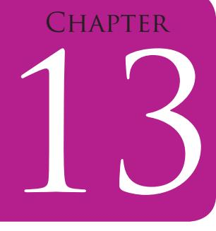
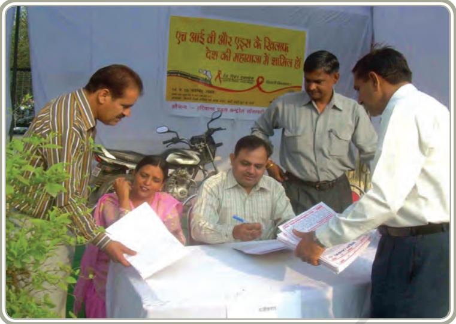
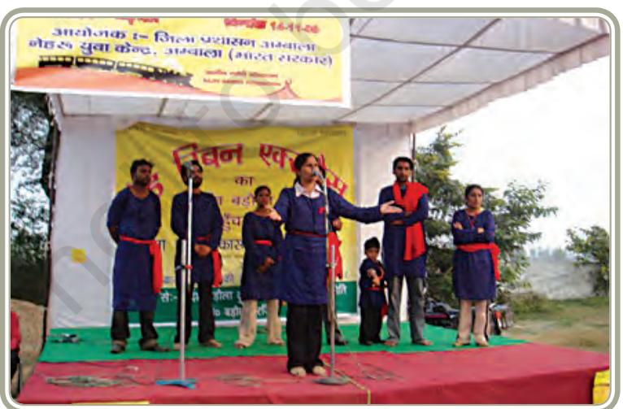

# **UNIT VI**

Unit VI - Communication and Extension

241

COMMUNICATION AND EXTENSION

Chapters.indd 241 8/16/2022 12:28:45 PM

### Introduction

In India, there is a concerted effort to reach higher levels of development and to ensure that benefits of development reach all, including the vast rural population. Today's 'information society' needs to tackle this crucial challenge by using the discipline of *Communication and Extension* to create awareness, sensitise, educate and empower the masses. Communication and Extension Education are crucial ingredients in the country's endeavours to respond to the needs of families and communities for promoting their development.

This discipline provides a core curriculum that integrates theory and practice in planning development programmes, media and communication. It allows students to analyse development programmes, policies and the role of mass media and journalism in the process of development. In recent years, national and international donors and development agencies have increasingly worked to share information about their policies and activities through their websites, publications, videos and other interactive multi-media. Non-governmental organisations have become more sophisticated in using a variety of media and communication strategies. With globalisation, the need to understand international development issues has increased. In order to sensitise society about the needs of the disadvantaged, use of advocacy is gaining popularity. Advocacy means to be an advocate for a cause. It is not used here in terms of legal provisions but largely to support a cause. The causes may be like preventing early marriage of girls, enhancing educational opportunities for children in rural and tribal areas or for preventing deforestation. Advocacy involves lobbying with governments and multilateral bodies to build alliances and networks, and to inform supporters.

Consequently there is an increasing demand for staff with skills in media and therefore offers a range of career avenues for graduates of this programme. Specialising in Communication and Development will prepare students to work in the communication and information departments of national and international development agencies, extension and advisory services in the public, commercial and not-for-profit sectors. Besides this, a person may choose to have an independent career in development communication.

In the year 2015, world leaders had set seventeen broad timebound development goals. These are commonly known as Sustainable Development Goals (SDGs). The SDGs are global but are adapted by each country to suit specific local, development needs. They provide a framework for the entire international community to work together towards a common end — ensuring that human development reaches everyone, everywhere.

242

Chapters.indd 242 8/16/2022 12:28:45 PM

Today, with the perspectives of the Sustainable Development Goals, extension programmes are planned to address the challenges India is facing such as poverty alleviation, enhancing food security, improvement of health and sanitation, non formal education, environmental conservation and gender equity and these continue to be the major goals of extension programmes. Extension educators are required to extend critical information, transfer new technologies and build skills and capacities of different stakeholders working in Development Programmes, with Non-Governmental Organisations, education and research institutes and as entrepreneurs. Over time, extension programmes have changed and evolved new methodologies and strategies to meet the challenges of enabling behaviour change of people to adopt healthy practices.

Various organisations like government ministry/department, international agencies, non-governmental organisations, voluntary agencies or even corporate bodies involved in corporate social responsibility activities require persons who can provide direct technical assistance and support for devising appropriate Social and Behaviour Change Communication (SBCC) strategies, interventions, tools and training to support programmes of health, nutrition, education, HIV/AIDS, natural resource management and social development.

Communication and Extension which is one of the domains of HEFS, is taught in numerous colleges and universities across the country. In different institutions, different names may be used for this domain, such as Education Extension or Extension Education, Extension and Development Communication, Home-Science and Communication Management, Development Communication and Extension, Extension and Communication. While the core of the subject remains same, the emphasis and coverage determine the nomenclature.

243

Chapters.indd 243 8/16/2022 12:28:45 PM

## Development Communication And Journalism

## Learning Objectives

After completing this chapter, the learner will be able to—

- z understand the importance of development communication and journalism for social change and development
- z identify the skills required for a career in communication and journalism
- z comprehend the scope of this discipline and the career options available.

## Introduction

Communication is an integral part of our social and professional life. On television, radio and newspapers, you must have seen, heard or read about the issues related to health, environment, consumption, poverty and other topics, besides news. Have you ever wondered who writes about such issues? Have you also sensed that mass media wield the power to investigate and question what is happening, where and why? These issues point to a special concern in our society regarding the role played by media in journalism. Development Journalism is a social activity and through various media, the journalist communicates feelings of the community to the community. The importance of journalism comes from the people's

Chapters.indd 244 8/16/2022 12:28:45 PM

would not be a reality without the various forms of media including social media. People today depend greatly on the media for being informed. Journalism is taken as an inseparable part of any democratic system. The Press plays a vital role in democratic society. People's participation is the foundation of democracy. Press is called the fourth pillar of democracy. The theory and practice of development communication and journalism continues to evolve and has become indispensable part of our lives today.

## Significance

It is characterised by conceptual flexibility.

How does communication help in working towards development? It creates awareness about available technologies and mobilises people to use them for the betterment of society. It links Government agencies, NGOs and people. Development communication and Development Journalism are important fields of study that sensitise students to the process of development and train them to write and/or speak about issues related to equitable and impartial society. Development Communication and Journalism aim at equipping students, current and prospective journalists, campaigners and media professionals to deepen their knowledge and practical skills on development issues.

right to opinion and expression since right to opinion and expression

## **Basic Concepts**

*Development* means positive changes in the socio-economic and cultural lives of the majority of people on a permanent basis without exploitation or violence. Development in most parts of the world calls for intensive efforts to tackle the problems of mass illiteracy, population, malnutrition, poor health, hunger and pollution, etc.

*Development Journalism* is a relatively newer concept. It has come into existence after the colonial era ended. Prior to independence, reporting used to be done about issues like struggles, fights, assassinations, disasters, wars and whatever the colonial rulers chose to communicate. The newly liberated countries like India were undergoing a lot of expansion in development activities. The newsmen and journalists had to take notice of these activities. Now, development journalism focusses on success stories of people who have adopted new technologies, tried new methods and helped the society. It seeks to describe the people at work in new projects and processes.

*Development Communication* is utilising the power of communication as a catalyst for social development. It is the practice of systematically

Chapters.indd 245 8/16/2022 12:28:45 PM

applying the processes, strategies, and principles of communication to bring about positive social change. The term "Development Communication" was first coined in 1972 by Nora Quebral. It is the 'art and science of human communication' used for facilitating development of a disadvantaged society in a planned manner to ensure equity and achievement of individual potential*.*

Development communication has the following essential features:

- z It is oriented to socio-economic development and happiness of the people and community at large.
- z It aims at giving information and educating the community.
- z It combines suitable mass media and interpersonal communication channels for greater impact.
- z It is based on the audience characteristics and their environment.

Development communication is a two way process of communication between those who have information and those who are ignorant. It assumes that people who face the problem have the innate ability to find solutions. They may need help or assistance in seeking resources. It views motivation as the key element. It tries to build dialogue between people and development agencies. Therefore, it is a social process designed to seek a common understanding or consensus among all the participants in development leading to concerted action.

Now you will read about some of the outstanding examples of Development Communication initiatives in India. Similar initiatives have been carried out in other parts of the world too, especially in developing countries like Brazil, Peru, Indonesia, Bangladesh and many others. This will help you not only to understand how the development communication efforts use technologies and means of mass communication but also employ them chiefly for development purposes involving local people and find sustainable solutions for the future. This will also give you an idea about the future scope of this area and what kinds of job opportunities are available to the students interested in this field.

We will learn about Journalism, Campaigns on Radio/Television/Print media/Video as means of Development Communication in order to enable you to appreciate and be informed about similar attempts on other mass media channels for prevention of smoking, tuberculosis, HIV/AIDS and for promotion of sanitation literacy, immunisation, safe child birth and consumer awareness through campaigns like *'Jago Grahak Jago'.*

Given below is an example of a multi media campaign with coordination between all the participants or stakeholders aimed at breaking silence about HIV/AIDS in rural areas of India.

Chapters.indd 246 8/16/2022 12:28:45 PM

## **Red Ribbon Express (RRE)**

*Fig. 21.1: Red Ribbon Express (RRE)*

RRE was a nationwide communication campaign for generating awareness about HIV/AIDS. A specially designed train traversed over 9,000 km a year, covering 180 districts/halt stations, and held programmes and activities in 43,200 villages. It comprised of seven coaches, equipped with educational material, primarily on HIV/ AIDS, interactive touch screens and 3-D models, services in the context of HIV-TB co-infection, an LCD projector and platform for folk performances, counselling cabins and two doctors' cabins for providing counselling and treatment.

*Fig. 21.2: Programme organised by Red Ribbon Express* 

247

Chapters.indd 247 8/16/2022 12:28:45 PM

RRE started its journey from Kanyakumari, followed the 'parikrama' style and halted at 180 stations and covered almost all the states of India. During the halt at each station the performing artists divided themselves into different groups. Each group had orators and performers who went to different villages to undertake Information Education Communication (IEC) activities such as street plays, folk songs, stories and group counselling sessions. Locally mobilised youth groups joined the team from the trains.

The Project was implemented by National AIDS Control Organisation (NACO), Nehru Yuva Kendra Sangathan (NYKS) and International Agencies such as UNICEF and UNAIDS, is cooperation with Indian Railways.

It aimed to:

- zz Spread information regarding primary prevention services
- zz Develop an understanding of the disease, to reduce stigma and discrimination against people with AIDS
- zz Enhance people's knowledge about preventive measures, health habits and lifestyle.

Many methods are used in this field. In this unit, let us review some selected methods.

**1. Campaign** is a combination of the usage of different communication methods and materials such as meetings, tours, newspaper articles, leaflets and exhibitions about a theme for a predefined period of time. It is a well organised and intensive activity. A campaign creates public awareness and provides specific message. Use of dramatics through different channels ensures attention and interest. It lasts in the memory of the people and stimulates action. It creates conducive environment for adoption of practices. For example, to accelerate the efforts to achieve universal sanitation coverage and to put focus on sanitation, the Prime Minister of India had launched the Swachh Bharat Mission on 2nd October 2014. The mission was implemented as a nation wide campaign/*Janandolan* which aimed at eliminating open defecation in rural areas during the period 2014 to 2019 through mass scale behaviour change, construction of householdowned and community-owned toilets and establishing mechanisms for monitoring toilet construction and usage.

#### **Activity 1**

List any two issues for which campaigns have been initiated. Briefly describe the methods and materials used for the campaign. Were you part of that campaign? If yes, in what capacity?

Chapters.indd 248 8/16/2022 12:28:45 PM

**2. Radio and Television** are the most popular, cheapest and convenient mass media that can be used for development purposes. The field of broadcast journalism has distinct advantage over print media, as it can be used to reach out to more people, particularly those with poor literacy levels. It also has an advantage over television as it is available at a comparatively lower cost. Radio is the most accessible mass medium. It is a mobile medium i.e. it can move with the listener at work or rest.

Radio programmes are presented in the form of news, interviews, discussions, documentaries, drama, quiz etc. News cover many different topics in a short time. Interesting facts and stories of current human interest are broadcast at regular intervals. Public Service Announcement (PSA) is a brief 10–60 second message between programs, generally in the form of jingles. They provide information or suggestions for action. These are basically advertisement of some idea or a message for public good like 'obey traffic rules' or 'say no to tobacco' and more. These are generally found to be quite effective because of their catchy slogan(s) and repeated broadcasts.

The earlier limitation of radios (of not receiving feedback) is overcome with the newer interactive format and local radio stations and community radio which has been successfully used as a people's medium. Owing to the popularity of radio as a medium of communication, Ministry of Information and Broadcasting has introduced a new concept of 'local radio station' called Community Radio (CR) where the local people have an important role to play. With a small investment, and training of few local people by NGOs working for capacity building to support CRS, a radio station can be set up with broadcasting possible in a limited area. It is run and managed by local people and the contents are for local use in their local dialect. The local radio station generally supports local programmes of development. It gives opportunity to people to participate and express their views and also display their talents. Radio thus becomes the voice of the people, a catalyst for people's development, and encourages youth to prepare for a career in DCJ (Development Communication Journalism).

Participatory content development and appraisal along with rapport formation with the community become important prerequisites for a successful community radio initiative. NGOs and educational institutions can seek license to set up a local community radio station to broadcast

#### **Activity 2**

Plan and list the programmes you would broadcast for your listeners from a campus radio of your school or colony.

information on developmental aspects. Participation of local community is encouraged. This powerful media is also used as information dispenser about government policies, entitlements, programmes, schemes and services. There have been some successful attempts in using community

249

Chapters.indd 249 8/16/2022 12:28:45 PM

radio in different parts of the country. Some examples are Community radio being operated in Vanasthali Vidyapeeth (Rajasthan), Self Employed Women's Association (SEWA) (Gujarat), Delhi University (DU) FM in North Delhi and many such others that are helping communities in voicing their problems and finding solutions.

In September 2004, India launched Education Satellite (**EDUSAT)**  which was the first Indian satellite built exclusively to serve the educational sector. EDUSAT is used to meet the demand for an interactive satellitebased distance education system in India.

Television today offers a variety of programmes through several channels, international, national and local levels. Some of the programmes have scope for people to participate in the form of talk shows, reality shows, competitions, etc. Other programmes of immense educational value like 'Kyunki Jeena isi Ka Nam hai' and 'Main Kuch Bhi Kar Sakti Hun' can be viewed on private channels. These indicate the scope of education and entertainment to be harnessed together for common good.

#### **Activity 3**

Prepare an exhaustive list of programmes/jingles on different national and local channels which try to generate awareness among masses on issues related to Health, Sanitation, Food, Literacy, Environment, Pollution, Energy conservation or any kind of donations. Additionally, encourage students to plan and conduct a quiz.

**3. Print media** The bulk of news appearing in the national and regional dailies is urban in its approach. In general, reports on agriculture, problems of rural areas, and other development concerns remain low in priority. Newspapers and periodicals operating in rural areas, covering local themes are few. Still the power of press cannot be denied. Though limited to a very few good examples, it is a medium of continuous education.

Given below is an example of an experiment '**Project Village Chhatera**', which is considered a success story.

The Project Village Chhatera was started in 1969 and focussed its attention on a small village Chatera in Northwest Delhi. The Hindustan Times started a regular fortnightly column describing the lives of the people. A team of enterprising reporters wrote with sensitivity giving detailed stories of the situation in the village. They wrote about the Village Chaupal, aspirations of people, livelihood issues and festivities. The problems of eletricity, water supply and deficit rainfall etc. were reported with photographs. It proved to be a catalyst in bringing various services and benefits. Solutions to

Chapters.indd 250 8/16/2022 12:28:45 PM

problems were available due to attention of the local leaders. The print coverage brought machines, bridges, roads and banks into the project area.

There is a dearth of DCJ professionals who write with passion and sensitivity for rural poor. This is one area which can be taken up by Communication and Extension students to demonstrate the impact of Press on development. Print journalists can cover different stories and send to the editors of different dailies. Their working day may involve interviewing people, attending press conferences or making phone calls and sending emails to create story leads. For development journalists, the internet is a valuable research tool and without a basic level of computer literacy, one is unable to work satisfactorily.

#### **4. Information, and Communication**

**Technologies (ICTs)** is an umbrella term that includes computer hardware and software, digital broadcast and telecommunications technologies. ICTs have been used for informing people. In both poor and wealthy countries, mobile phone use has enabled and facilitated the expansion of markets, social business and public services. An entire range of economic services, enabled by mobile phones, have enabled banking and financial transactions, marketing and distribution, employment and public services. ICTs are proving to be economically, socially and politically transformative.

A more direct approach to the use of ICTs aimed at bettering the lives of the poor is through the setting up of tele-centres. Many projects were started in India over the last decade or so and there is a sizeable research literature on the topic, some of which will be summarised here. For example:

- zz *The Sustainable Access in Rural India (SARI) project in the state of Tamilnadu:* Some 80 tele-centre kiosks were set up offering a range of services including basic computer education, e-mail, web browsing and various e-government services including the provision of certificates.
#### **Activity 4**

Identify a newsletter or a small newspaper in circulation in your area. Find more details about its circulation, contributors and editorial board.

#### **Activity 5**

Write or express your opinion about an issue concerning people living in your colony, village or locality.

Chapters.indd 251 8/16/2022 12:28:45 PM

#### zz *Empowering Women at the Grassroots: SEWA and ICTs*

The Self Employed Women's Association (SEWA) is a union of several thousand poor women working in the informal sector in India. SEWA's aim is to achieve full employment and self-reliance for women workers by focussing both on work and support in other related areas like income, food and social security (health, childcare and shelter). Having understood the effect of poor access to information on poverty, SEWA embarked on a journey to include ICTs within its work. The vision was to make ICTs a tool for empowering its ever-increasing numbers of grassroots members. It now runs programmes which develop women's abilities in the use of computers, radio, television, video, telephone, fax machines, mobile phones and satellite communication. Community Learning Centres (CLCs) have been set up in rural areas, and focus on IT training to build the capacity of members including areas such as electrical, mechanical and IT engineering. Besides savings in time and cost, this medium enables the members of SEWA to achieve quick and easy communication and problem-solving across districts.

## Knowledge and Skills required for a career in this field

*Cognitive skills* are required to be able to comprehend an issue. *Creative skills* are required to project the issues and concepts in a creative way to attract attention and make an impact. Any student with skills in media designing, production and technical instrument handling will have an advantage while undertaking assignments or jobs with media houses and advertising agencies.

*Technical skills —* Those interested to work as a development filmmaker, need to know camera techniques and video production apart from content development and implementation. Apart from these, skill in editing comes handy for marketing management.

DCJ professionals need to learn the technical skills to operate equipment correctly to optimise their presentations. They need to learn laws and regulations about what they can and cannot do. Developing presentation techniques to deliver smooth and entertaining programs along with interviewing techniques are important. They need to learn about the computers used to operate the station, basic radio production skills using suitable software and how to write a creative brief that effectively communicates. A development communication student as an apprentice

Chapters.indd 252 8/16/2022 12:28:45 PM

generally gains real experience at writing a radio spot and having it recorded and scheduled for airplay. For a career in DCJ, a combination of journalistic and presentation skills are required. Interest in current affairs and local conditions, hands-on experience in radio, the ability to communicate and knowledge of music are useful.

*Questioning ability* helps to look into the finer details of any issue. Passion for adventure and travel are added advantages because travel to the remotest parts of the country would help to gather unique and interesting stories.

*Ability to work with diverse groups* is imperative for a development communication student. S/he needs to be people centric to understand people's viewpoint on issues affecting their lives and find solutions which will work for them. For this, it is important to know the principles of social work. The guiding principle has to be 'helping people help themselves'. Also, acquiring and practising leadership skills helps to be successful. If a person is keen on being a development communication specialist, the person should be a good listener too, to write with sensitivity. Excellent interpersonal skills, ability to interact professionally with staff, partners and consultants are the demands of present day work culture.

*Language and computer skills* are very essential. Command in any one language is important and includes speaking, writing and reading with an ability to write technical reports and documents. Basic computer skills in using Microsoft Office applications, including Word, Excel and PowerPoint are desirable for success.

## Scope and Career avenues in Development Communication

This field employs a variety of media and communication techniques to address issues like information dissemination and education, behavior change, social marketing, media advocacy, communication for social change, and participatory development communication. Thus, this field has a wide scope in terms of content and use. Undertaking training, advisory and action projects that help build up the communication capabilities and resources of people in the development process also fall in the scope of study.

A development communication specialist can take up a variety of career paths in the social sector like media houses, government and nongovernment organisations. Since large scale projects are run by Government departments with the help of international agencies, employment

253

Chapters.indd 253 8/16/2022 12:28:45 PM

opportunities are satisfying both economically and psychologically.

Some more options can be summarised as:

- z *Development Journalist* in Print, TV, Radio, community media, traditional media, radio jockeying and anchors
- z *Research scholar* in research organisations to study aspects/ issues in gender and development, environment, consumption behaviour, health, agriculture and livelihood issues etc.
- z *Trainer* to train grassroots level and field functionaries, policy makers, and officers of corporate houses
- z *Freelancer and consultant* for organisations.

Thus it is clear that Development Communication offers a vast range of careers and will diversify in the future too.

#### **Key Terms**

Development communication, mass communication, campaign, community radio, print media, Information, communication technologies ICTs, questioning.

#### **Review Questions**

- 1. What is Development Communication? And what is its role in development?
- 2. What are the essential features of Development Communication?
- 3. What is a Campaign? Design a slogan for a campaign on any issue of your choice.
- 4. How is community radio different from All India Radio?
- 5. Take one newspaper from your school library. Look for news related to environment. Discuss in the class the visibility of news related to cinema, life styles and development and the possible reasons.
- 6. 'ICTs are the future vehicles of development'. Comment.

Chapters.indd 254 8/16/2022 12:28:46 PM

#### **Practical 1**

| Theme: | Study of Radio Public Service Announcement (PSA) |
| --- | --- |
| Task: | Listen and record PSA on radio for its content, relevance, |
|  | impact and technique. |
| Purpose: | Gain an insight into how radio as a mass media is able to |
|  | create awareness through Public Service Announcements. |
| Procedure: | Divide the class into four groups for analysis of radio PSA. |
|  | The student group listens to the recorded PSA and then |
|  | analyses it based on the parameters provided. After the |
|  | analysis scoring can be given to analyse the quality of a |
|  | PSA. |

#### **Analyse the recorded PSA on the following parameters**

| Topic/Message |  |
| --- | --- |
| Date and Time |  |
| Duration |  |
| Techniques used | E.g. Dialogue with humor/Jingle |
| Channel |  |
| Target Group |  |
| Medium of Instruction |  |
| Objectives |  |

|  | Excellent(3) | Good(2) | Average(1) | Poor(0) |
| --- | --- | --- | --- | --- |
| Suitability of the day/date/time |  |  |  |  |
| Engage the listener |  |  |  |  |
| Create Interest |  |  |  |  |
| Promote Awareness |  |  |  |  |
| Motivate Audience |  |  |  |  |
| Selection of voice over |  |  |  |  |
| Clarity of message |  |  |  |  |
| Clarity of sound recording |  |  |  |  |
| Appropriateness of sound effects |  |  |  |  |
| Mention the source or originator of |  |  |  |  |
| the PSA |  |  |  |  |

Total Score= ____/30

Discussion could be held to examine the contribution made by radio in creating awareness about social issues like Swachh Bharat Abhiyan for sanitation through PSAs.

255

Chapters.indd 255 8/16/2022 12:28:46 PM

