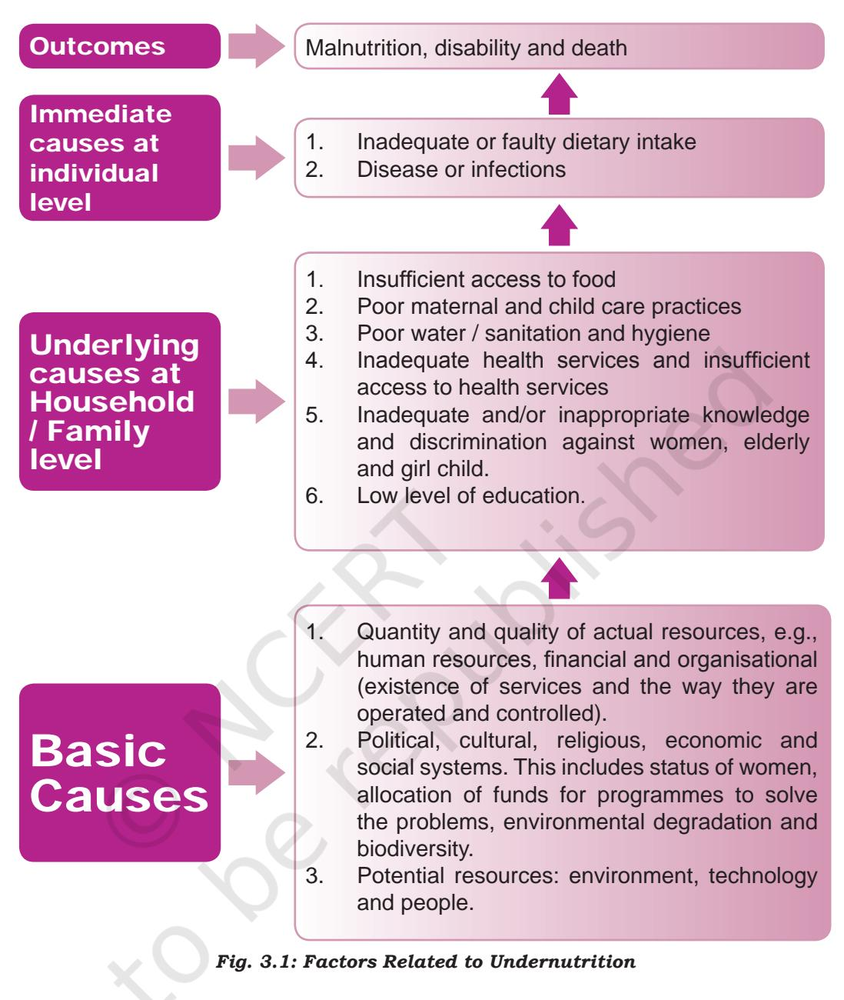
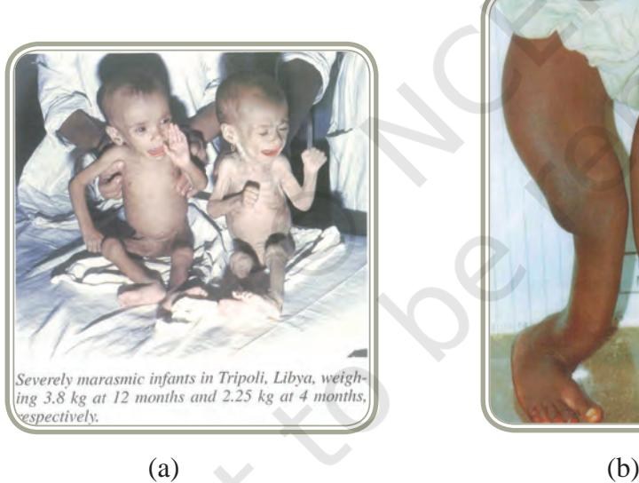
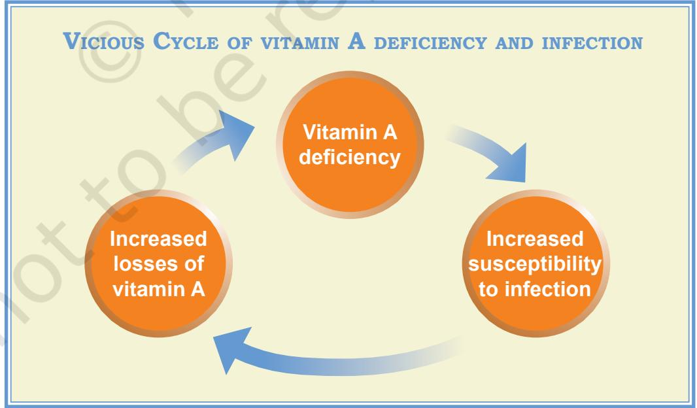
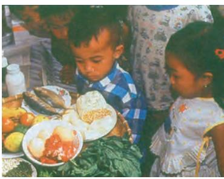
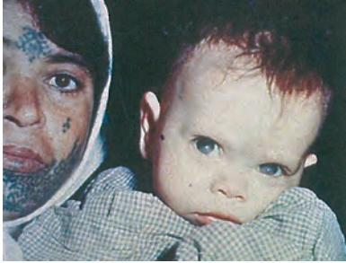
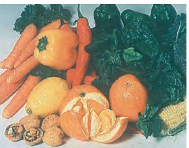
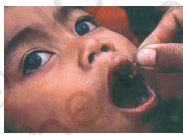
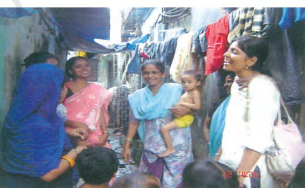

# Public Nutrition And Health

## Learning Objectives

After completing this chapter the learner will be able to:

- z understand the significance and scope of public nutrition.
- z have knowledge about the nutritional problems of public health significance.
- z be acquainted with the government programmes that are in operation to tackle important nutritional problems.
- z describe the role and functions of a public health nutritionist.
- z explain the knowledge and skills required for a career in public health nutrition.

## Introduction

In Class XI you studied the basic concepts of nutrition and health, physical fitness and wellness. You must be aware of the importance of good nutrition as the foundation and cornerstone of health. So what is significant about the introduction of the word 'public' in this context? Let us find out. You are already familiar with the definition of health given by the World Health Organisation. The concept of public health refers to the collective action taken by society to protect and promote the health of the whole populations.

Chapters.indd 46 8/12/2022 12:13:53 PM

In Class XI, you were introduced to the terms undernutrition and overnutrition. The mission in public health nutrition is to prevent both undernutrition and overnutrition and to maintain optimal nutritional status of the population.

### Significance

Why do we need to focus on this specific aspect in the field of nutrition? Malnutrition is the underlying cause of at least 50 per cent deaths of children under five years of age. The statistics for nutrition-related problems in our country reveal an alarming situation:

- z Almost one-fifth of the infants born in India are low birth weight babies i.e., they weigh less than 2500g or 2.5kg. Low birth weight may have adverse effects throughout their growing years and may have adverse implications even in adult life. Low birth weight may even lead to child mortality.
- z There is widespread prevalence of growth retardation among preschoolers (from socio-economically disadvantaged families) and almost half the children suffer from mild and moderate under nutrition.
- z A large proportion of children (and adults) suffers from micronutrient deficiencies in varying degrees of severity also known as hidden hunger. The micronutrients of most concern are iron, zinc, vitamin A, vitamin C, vitamin D, iodine, folic acid and B12.

If these problems are not controlled in time, they will not only affect physical growth which may lead to smaller body stature in adulthood, but may also affect mental and cognitive development. All of these, in turn, can have negative impact on productivity and quality of life. The costs of malnutrition are very high. Experts have estimated that productivity losses are more than 10 per cent of lifetime earnings for individuals and 2-3 percent of gross domestic product for the nation. This clearly indicates that if we tackle malnutrition, we can help India to develop, grow economically and become a powerful nation.

India mostly faces the problem of under nutrition; however, the problem of over nutrition is also on the rise. Gradually, over the years, large numbers of persons have altered their dietary patterns and lifestyles. With respect to lifestyle, people have become more sedentary, relying on faster means of transportation, walking less and doing less amount of physical activity. In large cities, even children do not play enough outdoor games. Simultaneously dietary patterns have become less 'healthful'. Food choices have become less 'healthy' because processed foods, fast foods,

47

Chapters.indd 47 8/12/2022 12:13:53 PM

snacks, western type foods, e.g., burgers, pizzas, biscuits, chocolates, cakes and pastries, soft drinks, even Indian *mithais*, *samosas,* etc. (that are high in energy, sugar, fat, salt and low in other nutrients and fibre) are increasingly becoming part of the daily diet. At the same time, intake of whole grains, pulses, vegetables and fruits has reduced. All these lead to undesirable/inappropriate weight gain, overweight and obesity and ultimately lead to diseases such as hypertension, heart disease, diabetes, cancer, arthritis, among others. These diseases are non-communicable and take their toll not only on the physical health but also on quality of life, adding to the financial burden.

Thus India is said to face 'the double burden of malnutrition' i.e., coexistence of both undernutrition and overnutrition. Further, although communicable diseases like smallpox have been controlled, newer ones like HIV/AIDS and old ones like tuberculosis, hepatitis, malaria, are increasing in prevalence. The ultimate consequences of these communicable diseases are far worse for those who are not optimally nourished i.e., those who are undernourished and those who have lower immunity due to obesity, diabetes, HIV/AIDS, etc. This poses challenges for doctors, nutritionists and the government in terms of treatment, control and prevention.

There is a tremendous need for a trained cadre of public health professionals including public health nutritionists, to address and solve these problems. Let us first acquaint ourselves with what is public health nutrition.

## Basic Concepts

#### **What is Public Health Nutrition?**

Public health nutrition is the field of study that is concerned with promotion of good health through prevention of nutrition–related illnesses / problems in the population, and the government policies and programmes that are aimed at solving these problems. Public health nutritionists / professionals use large scale, organised and multidisciplinary approaches to solve the problems that affect the population i.e., large number of people for whom group action is necessary. Therefore, this field is multidisciplinary in nature and is built on the foundations of biological and social sciences. It differs from other fields of nutrition e.g. clinical nutrition and dietetics, because the professionals are required to address problems of the community / public specially the vulnerable groups. Public Nutrition is a special body of knowledge derived from the nutritional, biological, behavioural, social and managerial sciences. It can also be described as the art and science of promoting health and preventing diseases, prolonging life, through the organised efforts/action of society.

A **community** is a specific group of people who share common characteristics, e.g. a common language, exposed to similar conditions, common lifestyle or the same health problem.

Any professional in the field of public nutrition has to promote good nutrition and /or to prevent nutritional problems, for which it is important to identify the problem and its magnitude , understand how and why these problems occur and then plan strategies and actions to implement them and evaluate their impact.

In any society, nutritional problems are not just linked to food but to a variety of interacting/interrelated factors at various levels which have been summarised in Figure 3.1. While poverty is often the underlying cause, the situation becomes worse when a substantial proportion of families do not have access to basic amenities. Rural households have less access to toilets. Poor sanitation results in loss of work days and further economic loss. Further, considerable proportion of the population does not have safe drinking water. Working days are lost each year due to water borne diseases.

As shown in Figure 3.1, the factors related to nutritional problems range from economic factors (availability of financial resources), agricultural policy (production, price of various food stuffs), health care facilities/ services, their availability and access to the government policies, political will and socio-cultural factors.

*Nutritional Problems in India*: It is important to have knowledge about the nutritional problems in our country.

Let us discuss these in brief:

- a) *Protein- Energy Malnutrition(PEM)* : Can be found in every society, even in developed and industrialised countries, although the numbers are fewer in the latter as compared to developing countries. It is caused by inadequate food intake vis–a–vis the requirements, i.e., insufficient intake of the macronutrients (energy and protein). Children are at greatest risk although PEM can occur in adults especially the elderly, as well as in some diseases e.g. T.B., AIDS, etc. It is assessed by evaluating the anthropometric measurements (weight, height, headchest circumference, etc.).

Chapters.indd 50 8/12/2022 12:13:53 PM

A person is said to be underweight when his/her body weight is less than adequate for his/her age. Stunting (short stature) is said to be present when the height is less than adequate for age. When weight is not adequate relative to height, it is termed 'wasting'.

Severe undernutrition due to deficiency of food and energy is termed as 'marasmus' and that caused by protein deficiency is termed 'kwashiorkor'.

- b) *Micronutrient deficiencies*: If the diet is deficient in energy and protein content it is also likely to contain inadequate amounts of other nutrients especially micronutrients viz. minerals and vitamins. The term "hidden hunger" is used to refer to micronutrient deficiency. The deficiencies of iron, vitamin A, iodine, zinc are of major public health concern. In addition, there is growing concern about deficiency of vitamin B12, folic acid, calcium, vitamin D and riboflavin. Some micronutrient deficiencies of public health concern are described below:

*Source: SIGHT and LIFE, Basel, Switzerland*

- (i) *Iron-deficiency anemia (IDA)*: It is the most common nutritional disorder in the world and is prevalent in both developed and developing countries. The vulnerable groups are women in child–bearing age, adolescent girls, pregnant women and school age children. IDA occurs when hemoglobin production is considerably reduced and it results in low levels of hemoglobin in blood. Symptoms depend on the rate of fall in hemoglobin. Since hemoglobin is required for carrying oxygen in the body, any physical exertion leads to shortness of breath (breathlessness on slight exertion) and the person complains of fatigue and may feel lethargic. Manifestations of IDA include general pallor, paleness of conjunctiva of eyes, tongue and nail beds and soft palate. In children, cognitive functions (attention span, memory, concentration) are adversely affected.
- (ii) *Vitamin A deficiency* (VAD): Vitamin A is necessary for maintenance of healthy epithelium, normal vision, growth and immunity. Deficiency of vitamin A results in night blindness which progresses to complete blindness if corrective measures are not taken. Also, there is less resistance to infection and growth may be adversely affected. There is a vicious cycle between vitamin A deficiency and infection. Vitamin A deficiency is the most common cause of childhood blindness.

52

Chapters.indd 52 8/12/2022 12:13:55 PM

- (iii) *Iodine deficiency disorders* (IDD): Iodine is required for normal mental and physical growth and development. IDD is an ecological phenomenon, largely due to deficiency of iodine in the soil. Some of the states in India where IDD is common are– Jammu and Kashmir to Arunachal Pradesh in the Himalayan belt, Andhra Pradesh, Karnataka, Kerala, Maharashtra and Madhya Pradesh. The term '*Iodine Deficiency Disorders*' refers to a spectrum of disabling conditions that affect the health of humans, from fetal life through adulthood due to inadequate dietary intake of iodine. Deficiency of iodine results in insufficient amount of thyroid hormone which is synthesised by the thyroid gland.
Enlarged thyroid known as 'goitre' is the most common manifestation of iodine deficiency in adults. In children it manifests as cretinism. Iodine deficiency in adults during pregnancy has several adverse effects specially resulting in mental retardation and congenital abnormalities of the fetus. Unfortunately this effect is irreversible. IDD is estimated to affect about 13 per cent of the world's population and about 30 per cent are at risk.

#### **Strategies/intervention to tackle Nutritional Problems**

As our former Prime Minister Dr. Manmohan Singh stated in one of his speeches "*The problem of malnutrition is a matter of national shame …… I appeal to the nation to resolve and work hard to eradicate malnutrition in 5 years*". There is a need to adopt a multi-disciplinary approach to solve nutritional problems. Government is making considerable efforts to solve the problems. POSHAN Abhiyaan or the PM's Overarching Scheme for Holistic Nutrition was launched in Jhunjhunu, Rajasthan in March 2018. It targets stunting, under-nutrition, anaemia (among young children, women and adolescent girls) and low birth rate. It is meant to monitor and review the implementation of all such schemes. Its large component involves gradual scaling-up of interventions to all districts in the country by 2022. The Ministry of Women and Child Development (MWCD) is implementing POSHAN Abhiyaan in 315 districts in the first year, 235 districts in the second year and remaining districts will be covered in the third year. Through robust multi-ministerial convergence mechanism and other components POSHAN ABHIYAN strives to create the synergy. Some direct short term interventions are: (a) Integrated Child Development Services (ICDS )to cover all vulnerable children in the age group of 0-6 years and all pregnant and lactating mothers, (b) fortification of essential foods (salt fortified with iodine), (c) production and popularisation of low cost nutritious foods from indigenous and locally available raw material by

Chapters.indd 53 8/12/2022 12:13:55 PM

involving women in this activity and (d) control of micronutrient deficiencies among vulnerable groups, namely deficiencies of iron, vitamin A, folic acid and iodine among children, pregnant women and nursing mothers by supplementing these nutrients, distributing free tablets, etc.

Indirect policy instruments include long term strategies for achieving national goals through indirect institutional or structural changes such as: (a) ensuring food security i.e., improving availability of food, (b) improvement in dietary patterns by ensuring availability of nutritionally rich foods and (c) poverty alleviation for rural and urban poor through employment generation schemes and public distribution system, implementing land reforms, improving health and family welfare, prevention of food adulteration, involvement of media, basic nutrition and knowledge, monitoring of nutrition programmes, improvement of status of women, education and literacy and community participation.

There are various strategies that can be used to combat public nutrition problems. They are broadly classified as:

- a) Diet or food-based strategies
- b) Nutrient-based approach or medicinal approach

*Diet or food-based strategies*: They are preventive and comprehensive strategies that use food as a tool to overcome nutritional deficiencies. They can play an important role in preventing micronutrient deficiencies by increasing the availability and consumption of micronutrient-rich foods. One of the important advantages of this strategy is that it is sustainable and will have long-term benefits. Other benefits are that they are costeffective, can be adapted to different cultural and dietary traditions and very importantly they do not carry risk of overdose or toxicity which may happen in case of nutrient–based / medicinal approach. Some important food-based approaches include dietary diversification and modification, horticulture interventions e.g., home gardening, nutrition and health education, food fortification.

*Nutrient-based or medicinal approach* : In this approach nutrient supplements are given to vulnerable groups i.e., those who are at risk of deficiency and those who have deficiency. It is a short term strategy particularly used for vitamin A, iron and folic acid in India. Supplementation programmes are often expensive and there may be problems of coverage. Key target groups are different for various nutrients.

Table 3.1 compares the two approaches. It must be remembered that the long-term goal should be to shift away from supplementation towards food-based approaches.

*Providing nutritious food*

*Source: SIGHT and LIFE, Basel, Switzerland*

*Child with Vitamin A deficiency*

*Source: SIGHT and LIFE, Basel, Switzerland*

*Yellow, green & orange fruits and vegetables are good source of Vitamin A*

*Vitamin A deficiency picture of eye*

*Iron and Folic acid drops*

*Weighing of a Child Counselling with mothers*

Chapters.indd 55 8/12/2022 12:13:57 PM

| Intervention | Appropriate for | Advantages | Challenges/ |
| --- | --- | --- | --- |
|  |  |  | Disadvantages |
|  | Medicinal or Nutrient Based |  |  |
| Nutrient | Therapeutic | Timely | More costly than other |
| Supplementation | treatment |  | measures |
|  | Prevention | Sustainability |  |
|  | programmes for |  | Narrow scope of |
|  | specific nutrient and |  | coverage |
|  | specific target groups |  |  |
|  | Food Based or Diet Based Strategies |  |  |
| Fortification | Prevention (Universal | Highly cost | Requires research |
| (fortifying food | /For all) | effective | Participation of food |
| with nutrients) |  | Wide coverage | industry |
|  |  | Sustainable |  |
|  |  |  | Does not lead to |
|  |  |  | awareness in the |
|  |  |  | population about |
|  |  |  | the importance |
|  |  |  | of nutrition and |
|  |  |  | nutrients |
|  |  |  | Does not lead to |
|  |  |  | long-term dietary/ |
|  |  |  | behavioral changes |
| Dietary | Prevention (Universal | Highly cost | Requires changes in |
| Diversification | /For all) | effective | eating behaviour |
|  |  | Wide coverage | Requires economic |
|  |  | Sustainable | development to be |
|  |  |  | feasible |
|  |  | Provides many |  |
|  |  | micronutrients | Requires change in |
|  |  | simultaneously | agricultural policies |
|  |  | Improves food |  |
|  |  | security |  |

#### **Table 3.1: Different Interventions for Tackling Malnutrition**

*Adapted from: Public Nutrition (Course Material) published by Indira Gandhi Open University*

Let us enlist the Nutrition programmes operating in our country:

- 1. ICDS: It is an outreach programme for early childhood care and development, covering pregnant and nursing mothers and infants and young children upto 6 years.
- 2. Nutrient Deficiency Control programmes, namely, National Prophylaxis Programme for Prevention of Blindness due to Vitamin A deficiency, National Nutritional Anemia Prophylaxis programme, National Iodine Deficiency Disorder Control Programme,
- 3. Food Supplementation Programmes like the Mid-Day Meal Programme,
- 4. Food Security Programmes, namely, Public Distribution System, Antodaya Anna Yojana, Annapurna Scheme, National Food for Work Programme, and
- 5. Self-employment and wage employment schemes.

Self-employment and wage employment are social safety net programmes.

**Health Care:** Health is a fundamental human right. It is the responsibility of the government to provide adequate health care to the citizens. Health care is not just medical care but it includes a multitude of services that should help to promote, maintain, monitor or restore health. In India, health care is provided at three levels : primary, secondary and tertiary. Primary level is the first level of contact of the individual, family or community with the health system. In our country, these services are provided through a network of primary health centres (PHCs).

More complex health problems are resolved at the second level through district hospitals and community health centres. Community health centres function as the first referral level. Tertiary is the third and the highest level of health care. It deals with the more complex health problems that cannot be dealt with at the first two levels. Institutions at tertiary level are medical college hospitals, regional hospitals, specialised hospitals and All-India Institutes of Medical Sciences.

### Scope

*Role of Public Nutritionist*: Nutrition is an important determinant of health. The changing health scenario globally has increased the challenges for public nutritionists. The public nutritionist (also called community nutritionist), who is well trained and equipped in key areas, is eminently suited to participate in all the strategies of health promotion and prevention. The key areas include nutritional science, nutritional needs throughout the life cycle, nutritional assessment, nutritional care, food science, educational methods, mass media and communication and programme management. A community nutritionist can work in the following areas/situations.

- (a) As a part of outreach programmes undertaken by hospitals for prevention and promotion and education.
- (b) As a part of the national Integrated Child Development Services, at different levels based on qualifications and expertise.
- (c) At the government level as consultants, advisors, or in policy making committees.
- (d) In all developmental programmes of government, voluntary organisations, NGOs and international organisations like UNICEF, USAID, GAIN, Nutrition International, TATA Trust, IFPRI and others are numerous other national and regional organisations.
- (e) They can be involved with organisations who undertake large scale feeding programmes for various target groups such as young children, school children, adolescents, pregnant and lactating mothers, elderly, challenged individuals.
- (f) Nutritionists or school health counsellors in school health programmes.
- (g) They can be involved with corporate CSR programmes dealing with food and nutrition security to vulnerable groups.

Besides this, there are avenues in teaching, research, entrepreneurship with agencies involved in developing communication materials and educational packages for those who have adequate and appropriate training.

#### **Activity 1**

School to organise visit to Anganwadis (ICDS centres). Students can interact with supervisor (if possible) or sevika, observe the activities (if possible, be present when the food is distributed) and prepare a power point presentation about the same.

#### **Activity 2**

School to organise an interactive session with medical officer /health in charge of PSM dept / PHC / Municipal Corporation about the problems of undernutrition and its the possible causes.

#### **Activity 3**

School to organise an exhibition on nutritional problems in India, their causes, vulnerable groups and simple preventive measures.

Chapters.indd 58 8/12/2022 12:13:57 PM

#### **Activity 4**

Log on to the websites of WHO, UNICEF, Poshan Abhiyaan, Ministry of Health and Family Welfare and Ministry of Women and Child Development to learn more about their programmes and activities.

#### **Career Avenues**

- z Community nutritionist in PSM departments of hospitals
- z Nutrition programmes of the government. e.g., ICDS, Food and Nutrition Board
- z In voluntary organisations (regional, national and international) as nutritionists
- z As consultants
- z Nutritionists or counselors for schools, industries, etc.
- z Teaching and academics
- z Research

#### **Key Terms**

Nutritional status, undernutrition, malnutrition, public health, public nutrition, nutrition programmes, community health.

#### **Review Questions**

- 1. Explain the terms: Stunting, low birthweight baby, IDD, wasting, 'double burden of malnutrition', marasmus, kwashiorkor, community.
- 2. Discuss the various strategies that can be adopted to combat public nutrition problems.
- 3. What is public health nutrition?
- 4. What are the common nutritional problems facing India?
- 5. What are the consequences of IDA and IDD?
- 6. What is the scope of public health nutrition? List some of the career choices in this area.

59

Chapters.indd 59 8/12/2022 12:13:57 PM

### **Practical 1**

**Theme:** Development and Preparation of Supplementary Foods for Nutrition Programmes

**Tasks:** 1. Obtaining the prices of commonly consumed, locally available foods

- 2. Planning of low-cost recipes for supplementary food for preschoolers attending an *Anganwadi.*
- 3. Preparation of selected recipes
- 4. Evaluation of the prepared recipes

**Purpose :** This practical will provide insights to the students into planning, costing and preparation of supplementary foods for preschoolers within a given budget.

#### **Conducting the Practical**

- 1. Divide students into 4 groups
- 2. The groups should plan the recipes to provide selected nutrients as follows:

Each group should plan 2 recipes and calculate the cost using the price list. Plan should be made for 5 servings.

Group A: To plan recipes that will be good sources of energy and protein

Group B: To plan recipes that will be good sources of iron

Group C: To plan recipes that will be good sources of vitamin A or Beta carotene

Group D: To plan recipes that will be good sources of calcium

 **Note: Students are not required to calculate the nutritive values/nutrient content of the recipes**

> A cost limit is to be given by the teacher (Not more than ` 5 per serving).

- 3. Each group should identify the possible locally available food sources for the specific nutrient for which they have to plan the recipes.
- 4. The planned recipes should be checked by the teacher and one suitable recipe should be selected for preparation.
- 5. The product should be prepared in class and evaluated for (a) serving size, (b) cost (c) suitability for preschoolers (d) appearance (e) taste (f) acceptability by children.
- 6. Observations and comments should be recorded and suggestions given for improvement.

60

