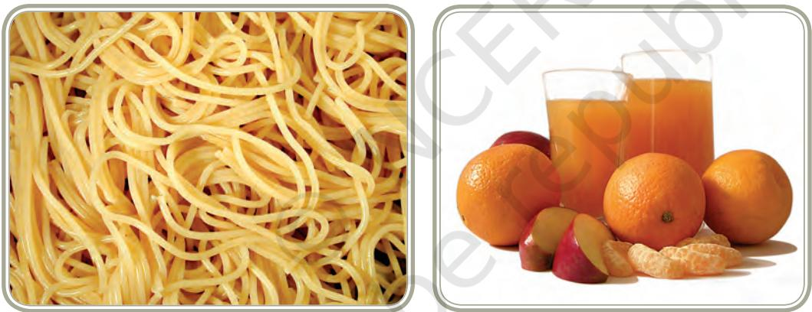

Food Processing And Technology

4

Chapter

# Learning Objectives

After completing this chapter the learner will be able to:

- z understand what is food processing and technology, its history, development and present status
- z explain the significance and basic concepts of the subject
- z be aware of the skills required to be a professional food technologist
- z be aware of the career opportunities available and educational qualifications required for specific careers in the industry
- z know the scope for self employment as small, medium or large scale entrepreneurs.

# Introduction

Food items are being processed for various reasons. Since times immemorial, grains have been dried after harvest to increase their shelf life. Initially, foods were processed primarily to improve digestibility, palatability and to ensure a continuous supply. In India pickles, *murabbas* and *papads* are examples of preserved products made from certain vegetables/ fruits/ grains. With passage of time, improved transportation, communication and increasing industrialisation, the needs of consumers have become

more diverse and there is now increasing demand for 'fresh' and 'organic' foods, 'safer and healthier' foods and foods with adequate shelf life. Consumers expect better-quality foods with retention of nutrients, many a time having specific functional properties and taste/texture/consistency, while being shelf-stable and easy to package, store and transport. This has served as a stimulus to scientists to develop methods and techniques to process foods in a manner that the food products will meet the requirements and demands of the consumers. All of us eat readymade foods. These range from biscuits, bread, pickles/papads to foods such as ready-to-eat curries, meal items, snacks, etc. Such foods are manufactured using a variety of processes and technologies. For some, simple traditional methods are still used while newer processes and technologies are employed to produce processed foods in bulk.

**Significance:** India has progressed from an agro-deficit to an agrosurplus country creating need for storage and processing of agricultural and horticultural produce. Indian food industry has thus emerged as a major producer of processed foods and ranks fifth in terms of size, contributing nearly 6 per cent of GDP. Besides, changes in lifestyle, increasing mobility and globalisation have increased the demands for various types of products, making the research for newer technologies necessary. It is well known that simple diets based largely on staple foods such as cereals are often deficient in certain nutrients leading to their deficiency disorders. Therefore, *food fortification* is done by adding the nutrient that is lacking in the food stuffs or condiments to ensure that minimum dietary requirements are met. Some examples are iodised salt, folic acid added to flour, vitamin A and D added to milk and oils/fats. In fact, FSSAI has laid down standards for fortification of staple food like salt, wheat flour, milk and oats. Increasing prevalence of diseases like heart disease and diabetes and concern about wellness, has made it necessary for scientists to alter the nutrient content of foods, for example reducing the Calorie content of processed foods in several ways such as using artificial *sweeteners*. Likewise fat from ice creams is replaced by specially treated proteins which give ice cream the smooth texture associated with fat but the energy value is reduced. Also, consumer perceptions about food have changed. The demand for foods free of chemicals, pesticides and preservatives, yet having a longer shelf life and retaining their natural flavour and appearance, is rapidly increasing. All this has increased the importance of food processing and technology as a discipline and there is a huge demand for food technologists.

# **Basic Concepts**

*Food Science:* It is a distinct field involving the application of basic sciences such as chemistry and physics, culinary arts, agronomics and microbiology. It is a broad discipline concerned with all the technical aspects of food, beginning with harvesting or slaughtering and ending with cooking and consumption. Food Scientists have to use the knowledge of biology, physical sciences and engineering to study the composition of foods, changes that occur at various stages from harvest through different processes and storage, causes of their spoilage and the principles underlying food processing. Food scientists deal with physico-chemical aspects of food, thus helping us to understand the nature and properties of food.

*Food Processing*: It is the set of methods and techniques used to transform raw ingredients into finished and semi-finished products. Food processing requires good quality raw materials from either plant and/or animal source to be converted into attractive, marketable and often long shelf-life food products.

*Food Technology*: Technology is the science and application of scientific, as well as socio-economic knowledge and legal rules for production. Food technology uses and exploits knowledge of Food Science and Food Engineering to produce varied foods. Study of Food Technology gives in-depth knowledge of science and technology, and develops skills for selection, storage, preservation, processing, packaging, distribution of safe, nutritious, wholesome, desirable as well as affordable, convenient foods. Another significant aspect of food technology is to promote sustainability to avoid waste and save and utilise all the food produced and ensure safe and sustainable processing practices.

*Food manufacturing*: It is the mass production of food products using principles of food technology to meet the diverse needs of the growing population. Food manufacturing is one of the largest manufacturing industries in the present times.

### **Development of Food Processing and Technology**

Research in the field of Food Technology has been conducted for decades. In 1810, development of the canning process by Nicolas Appert was a decisive event. Canning had a major impact on food preservation techniques. Later Louis Pasteur's research, in 1864, on spoilage of wine and his description of how to avoid spoilage was an early attempt to put food technology on a scientific basis. Besides wine spoilage, Pasteur conducted research on production of alcohol, vinegar, wines, beer and souring of milk. He developed 'pasteurisation'- the process of treating milk to destroy disease producing organisms. Pasteurisation was a significant advance in ensuring microbiological safety of food.

Food Technology was initially used to serve military needs. In the 20th century, world wars, exploration of space and the rising demand for varied products from consumers contributed to the growth of Food Technology. Products such as instant soup mixes and ready-to-cook items including meals were developed, specially catering to needs of working women. Further, food industry was compelled to focus on nutritional concerns. Food preferences and choices changed and people started incorporating into their diet food items/preparations from different regions and countries. The desire to have seasonal foods all year round increased. Food technologists made efforts to provide both safer and fresher food using new techniques. In the 21st century, food technologists are challenged to produce foods suitable for health and other changing needs of consumers. Food technology has provided a vast variety of safe and convenient foods. In developing countries this rapidly expanding and developing field, has been helpful in improving food security and has opened avenues for employment at all levels.

#### **Importance of Food Processing and Preservation**

It has already been mentioned that food processing is a branch of manufacturing wherein raw materials are transformed into intermediate foodstuffs or edible products through the application of scientific knowledge and technology. Various processes are used to convert bulky, perishable and sometimes inedible food materials into more useful, concentrated, shelf-stable and palatable foods or potable beverages. Changes in the products often reduce preparation time for the cook. Most of the time, processing of foods adds value to the resultant product by increasing storability, portability, palatability and convenience. Professionals in the food processing need to be knowledgeable about general characteristics of raw food materials, principles of food preservation, processing factors which influence quality, packaging, water and waste management, good manufacturing processes and sanitation procedures. Let us briefly examine the need, principles, methods and modernisation of food processing.

Foods are subject to physical, chemical and biological deterioration. Food deterioration is associated with spoilage, development of off-flavors, deterioration of textures, discoloration and loss of nutritional value in varying degrees, reducing aesthetic appeal and rendering it unfit/unsafe for consumption. A number of factors can lead to food deterioration or spoilage e.g. pests, infestation by insects, inappropriate temperatures used for processing and/or storage, excessive exposure to light and other radiations, oxygen, moisture. Food is also contaminated by micro organisms [bacteria, fungus and moulds) or chemicals such as pesticides. Food can also be spoiled due to degradation by naturally present enzymes (a specific class of protein molecules that act as biological catalysts to accelerate chemical reactions). In addition, physical and chemical changes in certain constituents of food from plant and animal sources occur soon after harvesting or slaughtering, altering the food quality.

Therefore food processing and preservation are required to preserve food in edible and safe form. Methods by which food is preserved from spoiling after harvesting or slaughtering date back to prehistoric times. The oldest methods were sun drying, controlled fermentation, salting/pickling, candying, roasting, smoking, baking and using spices as preservatives. These tried and tested techniques are still used although, with the advent of industrial revolution, new methods have been developed. Food processing incorporates and unifies the general characteristics of different classes of foods and principles of food science, chemistry, food microbiology,

65

nutrition, sensory analysis and statistics including good manufacturing practices as per regulations.

### **Classes of Foods Based on Perishability**

Perishable foods are foods that spoil quickly within one or two days e.g., milk, curds, fish and meat.

Semi perishable foods can last for 1–2 weeks. Examples are fruits and vegetables. Root crops like onions and potatoes last for 2–4 weeks.

Non-perishable are those foods that generally last for one year e.g., grains like rice, wheat, pulses and dals, oilseeds.

Many food processing operations are designed to extend the shelf life of the food products. The concepts associated with food processing are reducing/eliminating microbial activity and other factors that influence food spoilage. The principle micro organisms that cause food spoilage are bacteria, fungi, yeasts and moulds. Just recollect that you studied in biology how they grow typically very rapidly under congenial conditions. Factors influencing microbial growth are nutrient availability, moisture, pH, oxygen levels and the presence or absence of inhibiting substances e.g. antibiotics. The activity of enzymes inherently present in foods also depends on pH and temperature. Oxidative enzymes in fresh fruits and vegetables continue to use oxygen to metabolise, reducing the shelf life of fruits and

vegetables. So the basic concepts in food processing methods to prevent food spoilage are:

- 1. Application of heat,
- 2. Removal of water moisture,
- 3. Lowering of temperature during storage,
- 4. Reduction of pH,
- 5. Controlling the availability of oxygen.

## **Did You Know?**

- z *Bacteria prefer protein rich foods e.g. meat, fish, poultry, eggs, and dairy products. These are known as High Risk Foods.*
- z *Bacteria grow at any temperature between 5–600 C. This temperature range is known as the Danger Zone.*

66

Processed foods can be classified on the basis of extent and type of processing as follows:

- 1. *Minimally processed foods:* These are processed as little as possible in order to retain the quality of fresh foods. Generally the processes used are cleaning, trimming, shelling, cutting, slicing and storage at low i.e., refrigeration temperatures.
- 2. *Preserved foods:* The methods of preservation used do not change the character of the product substantially e.g., frozen peas and frozen vegetables, dehydrated peas, dehydrated vegetables, canned fruits and vegetables.
- 3. *Manufactured foods:* In such products, the original characteristics of the raw products are lost and some basic methods of preservation are used, often using various ingredients such as salt, sugar, oil or even chemical preservatives. Examples are pickles, jams, marmalades, squashes, papads, wadis.
- 4. *Formulated foods:* These are products prepared by mixing and processing of individual ingredients to result in relatively shelfstable food products such as bread, biscuits, ice cream, cakes, kulfi.
- 5. *Food derivatives:* In industry, components of foods may be obtained from the raw product through purification, e.g., sugar from sugarcane or oil from oil seeds. In some cases, the derivative or the component may be processed further, e.g., conversion of oil to vanaspati (the process is called hydrogenation).
- 6. *Functional foods:* These are foods that can have a beneficial effect on human health, e.g., probiotics.
- 7. *Medical foods:* These are used in dietary management of diseases, for example, low sodium salt, lactose–free milk for persons with lactose intolerance.

#### **Activity 1**

- zz In your region/community, list the foods that are preserved at home and identify the method and preservatives used for preservation.
- zz Identify the processed food made using artificial sweeteners that are available in your area.

Professionals who are involved in food processing and technology need to have a wide range of knowledge and skills. Table 5.1 shows categorisation of food production in three stages and lists the knowledge and skills required for each:

- 1. Food as a material
- 2. Food Product development
- 3. Recipe development

### **Table 5.1 Knowledge and Skills needed for Food Processing and Technology**

|  | Food as a material |  | Food Product Development |  | Recipe Development |
| --- | --- | --- | --- | --- | --- |
| • | Seasonal | • | Knowledge of food | • | Expertise in cooking |
|  | availability of food |  | preparation and cooking | • | Knowledge of nature and |
|  | stuffs |  | skills for large scale food |  | properties of food |
|  |  |  | production |  |  |
| • | Nature and |  |  | • | Uses of ingredients, |
|  | properties of food | • | Knowledge of product |  | measuring and weighing |
|  |  |  | specifications, and |  |  |
| • | Nutritional content |  | testing it |  | them accurately |
|  | and its analysis |  |  | • | Designing, analysing and |
| • | Cost of food stuff | • | Observing and |  | adapting a basic recipe |
|  |  |  | measuring Quality |  |  |
| • | Influence |  | Control as per | • | Food handling skills |
|  | of chemical |  | specifications | • | Food production |
|  | pesticides,time, | • | Assessment by sensory |  | following hygiene and |
|  | moisture, |  |  |  | safety norms |
|  | temperature and |  | methods [by testing and |  |  |
|  | additives |  | tasting produced foods] | • | Handling tools and |
| • | Assessment of the | • | Industrial practices and |  | equipment accurately |
|  | quality of raw foods |  | manufacturing systems | • | Innovations in product |
|  | and ingredients for |  | and their control |  | design and preparation |
|  | quality production | • | Labelling and packaging |  | according to consumer |
|  | of food |  | of marketable product |  | perceptions |
| • | Food Hygiene and | • | Hazard Analysis and | • | Use of Information |
|  | Food Safety |  | Critical Control point. |  | Technology for |
|  |  |  | {HACCP} |  | contemporary production |
| • | Knowledge of |  |  |  |  |
|  | Information |  |  |  |  |
|  | Technology for |  |  |  |  |
|  | contemporary food |  |  |  |  |
|  | production |  |  |  |  |

# Preparing for a career

Food industry is involved in processing/manufacture, research and development (modifying existing food products, developing new products, researching consumer markets and developing new technologies), ensuring food safety and monitoring food quality, improving quality control procedures, costing to ensure profitable production, and regulatory affairs. They may specialise in a particular branch of food technology such as beverages, dairy products, meat and poultry, sea food, fats and oils, stabilisers/preservatives/colours, food grains and additives. A professional in this area requires knowledge and skills about:

- z Food science, food chemistry, microbiology, food processing, safety/ quality assurance, good manufacturing practices and nutrition.
- z Analysis of raw and cooked/manufactured foods for composition, quality and safety.
- z Food ingredients, their uses in food preparations and food production on a large scale.
- z Product specifications and food product development.
- z Sensory evaluation and acceptability.
- z Industrial practices, systems control, distribution channels, consumer purchase patterns.
- z Food packaging and labeling.
- z Ability to use information technology to support product design.
- z Skills in food preparation and cooking.
- z Ability to design, analyse, follow a design brief and adapt recipes.

After successful completion of 10+2 or equivalent examination, one can pursue short term certificate, craft and diploma courses at various institutes/colleges in different states, as well as at the Central Food Technological Research Institute [CFTRI], Mysore. Such courses are suitable for self-employment and for placement in small scale units of food preservation and processing, and catering establishments. Bachelor's and Master's degrees and research qualifications provide the most comprehensive grounding for jobs in the food industry, particularly large scale units, and for taking up research and training as well as entrepreneurship. Many universities in India and abroad offer graduate and post graduate degrees in the food technology. There are institutes offering post graduate courses in specialised aspects of Food Processing and Technology like National Institute of Food Technology and Entrepreneurship Management (NIFTEM) at Sonepat.

69

## Scope

The demand for processed, packed and convenient food with prolonged shelf life requires well-trained human resource in the food industry. There is an encouraging, challenging and rewarding future for professions and careers in Food Technology and Food Processing industry. As this field requires the application of science and technology to the processing, utilisation, preservation, packaging and distribution of food and food products, it encompasses a diverse range of specialisations.

The work of food technologists is mainly in food industries, quality control departments, hotels, hospitals, labeling and packaging industries, breweries/distilleries, soft drink industries, dairy, confectionery, fish and meat processing, fruit and vegetable processing, processing of grains, cereals, millets, rice and flour mills, etc. Their expertise is useful in various departments such as purchase and storage, processing/manufacture, quality monitoring and management, safety assessment, as well as research and development. Besides this, entrepreneurship is a highly rewarding avenue. There are various avenues for employment.

### **Career Avenues**

- zz Production Managers
- zz Project Implementation
- zz Marketing and Sales Personnel
- zz Sensory Evaluation
- zz Quality Assurance
- zz Research and Development, Product Development
- zz Project Financing
- zz Project Appraisal
- zz Teaching and Research
- zz Entrepreneurship Development
- zz Consultancy
- zz Technical Marketing of products

With globalisation, Indian shores have opened up to foreign investments and technologies. As a result, many foreign companies and multinational companies are setting up their production, R&D, educational and outsourcing facilities in our country. Thus there is ample scope for food technologists/scientists in Indian as well as foreign organisations. Also, food processing industry provides good opportunity for export of products. Employment exchanges will also be strengthened and upgraded.

*Self Employment Avenues*: Food processing in India has always been practised as household or cottage scale activity. Despite lack of basic training in food processing operations, sweets, papads, murrabas, pickles, fried snacks, roasted and puffed cereals were prepared and marketed for local consumption. Now with the growth in agriculture, horticulture and pisiculture, the production of raw material has improved. Also the Government is giving incentives and support for enterpreneurs who want to start their own enterprise by way of providing finances, training, infrastructure and marketing facilities. Financial support is provided by many banks, with encouragement for women entrepreneurs. State Governments also contribute by providing space to those desirous of obtaining the same. A self employment venture in food technology may be highly technology-oriented and investment–intensive, or it can be a very low key technology and low investment unit, e.g., salted peanuts, drinking water pouches, dehydrated products, pickles, among others.

The Indian food industry with a size of 61 billion US dollars, ranks 5th in terms of size, contributes nearly 6 per cent of GDP, 13 per cent of Indian exports and involves 6 per cent of total industrial investment in the country. Besides, it is estimated to grow at the rate of 20 per cent of which processed food segment accounts for 25 per cent. Key segments of this industry are milk and milk products, snack foods, bakery products, fruit and vegetable products, beverages (alcoholic and non alcoholic), fish and meat processing, food processing machines and allied equipment. Exports are rising and this boosts employment avenues.

### **Key Terms**

Food processing, food technology, food preservation, food science, food spoilage, food product development

### **Review Questions**

- 1. Explain the following terms:(A) Food Science (B) Food Processing (C) Food Technology (D) Food Manufacturing and (E) Food Spoilage
- 2. Explain briefly the significance of Food Technology. How has it affected the life of modern housewives, specially working women?
- 3. List some of the old methods of food preservation followed at home giving examples and their viability in present times.
- 4. Give a brief account of development of food preservation to its present status.
- 5. As a prospective food technologist what knowledge and skills does the industry require you to have?
- 6. Keeping the concept of health and wellness in mind, explain with examples how food scientists are trying to enhance the food values in processed and packaged foods.
- 7. Explain the following briefly:
	- Why do we need to process and preserve food?
	- What causes food spoilage and renders it unfit for human consumption?
	- Food spoilage is generally caused by bacteria. What are the four conditions that bacteria need to grow and multiply?
	- What is done in food processing to extend shelf life?
	- After the completion of 10+2 examination what is the professional scope in the field of Food Processing and Technology?

### **Practical 1**

### **Theme: Design, Prepare and Evaluate a Processed Food Product**

- Tasks: 1. Identify and prepare a product that can be preserved.
	- 2. Evaluate the product for acceptability.
	- 3. Prepare a label.

### **Purpose**

This practical is intended to give the students first hand experience of planning, preparing, packaging and labeling a processed product which can be preserved. It will also provide an opportunity to appreciate the importance of maintaining hygiene throughout the process and to evaluate the processed product.

### **Conducting the Practical**

Divide the class into groups of 5-6 students each. Each group should do the practical separately following the steps given below:

- 1. Identify a product that has long shelf life (that can be preserved and stored) that you would like to prepare, e.g., pickles, jams, squash, murabba, papad.
- 2. Try and make it different from products already available in the market by using different raw ingredient(s) or consider using artificial sweetener partly instead of sugar. Make approximately 500 gm of the product. Try to use locally available fruits and vegetables/ fruit or vegetable peels e.g., watermelon rind, orange peel or lemon rind/ sweet lime rind, pumpkin seeds, melon seeds, dudhi peel.
- 3. Make a list of vegetables/fruits, ingredients, preservatives, utensils, gadgets and medium of heat required, and collect all.
- 4. List the criteria used in the selection of raw materials, equipment and accessories.
- 5. Write the recipe and method of preparation, step-wise, in detail.
- 6. Identify the packaging material e.g., glass/plastic bottle or polyethylene pouches or bags.
- 7. Prepare the product under as hygienic conditions as possible.
- 8. Do costing in terms of cost of food materials and ingredients, energy consumed, labour cost and cost of storage and packing material.
- 9. Evaluate the product in terms of texture, taste, colour and quality and write down your observations.
- 10. Also prepare a label for the product. The label information should include the following:
	- a) Name of the product and a picture or drawing (if possible).
	- b) Name and address of the manufacturer.
	- c) List of ingredients used (the ingredients should be listed in descending order of the proportions used), net weight/volume.
	- d) Instructions for use (if any).
	- e) Storage instructions.
	- f) Indicate the 'Use By' or 'Best Before' date.

