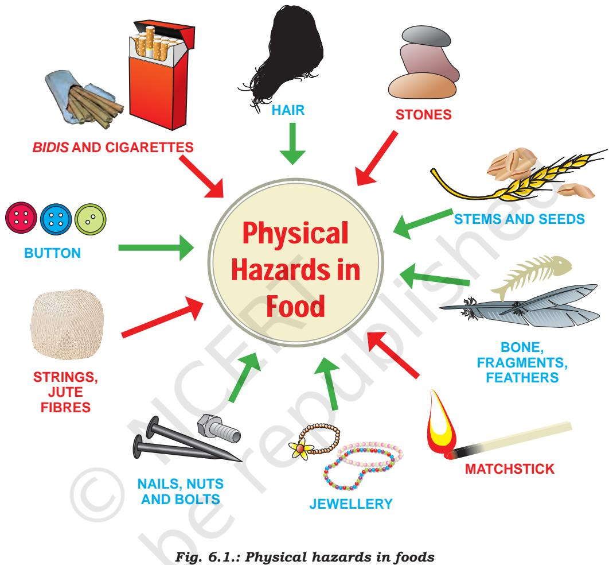
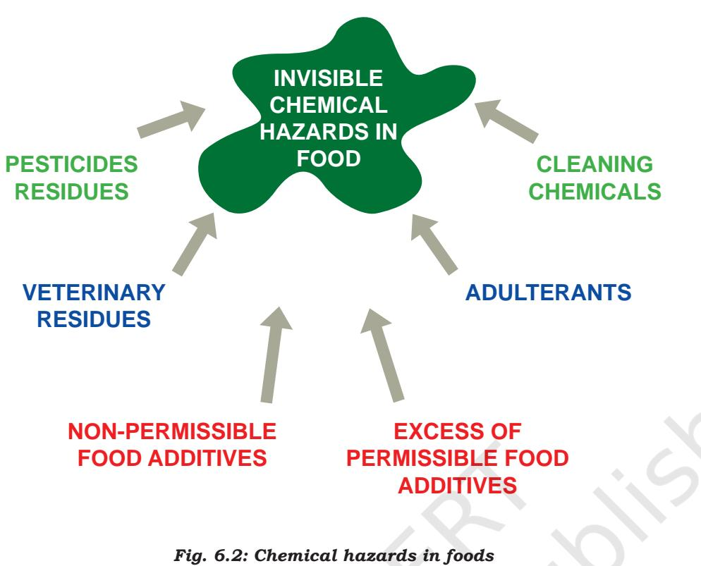
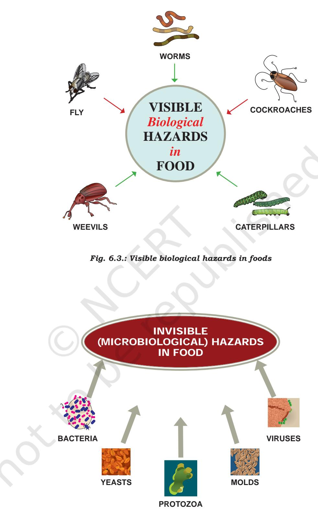
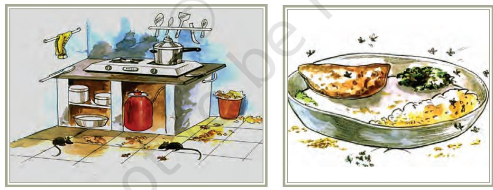
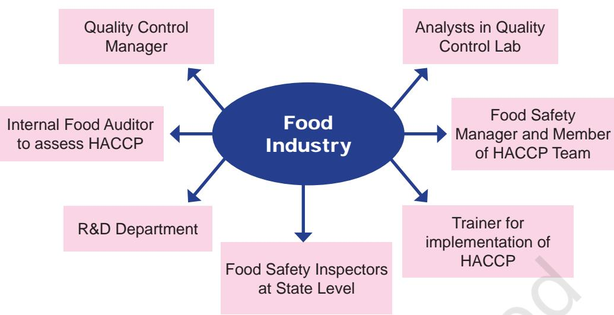

Food Quality and Food Safety

5

Chapter

# Learning Objectives

After completing this chapter the learner will be able to:

- � explain the importance of various issues related to food safety and quality
- � understand how food-borne illnesses occur
- � know about national and international food standards and their role in ensuring food quality and safety
- � understand the importance of food safety management systems
- � be acquainted with various career avenues / options in this area.

# Introduction

Food is a major determinant of health, nutritional status and productivity of the population. It is, therefore, essential that the food we consume is wholesome and safe. Unsafe food can lead to a large number of foodborne diseases. You may have seen reports in the newspapers about health problems caused by contaminated or adulterated foods. Globally, food-borne illness is a major problem of public health concern. In India, the National Family Health Survey, 2015–2016 stated

Chapters.indd 75 8/12/2022 12:15:46 PM

that more than 9 lakh children less than five years of age suffered from acute diarrhea. Food-borne illness can not only result in mortality but can damage trade and tourism, lead to loss of earnings, unemployment and litigation and thus can impede economic growth, and therefore food safety and quality have gained worldwide significance.

## Significance

Food safety and quality are important at the home level, but are critical in large scale food production and processing, and also where food is freshly prepared and served. In the past, many foods were processed at home. Advancement in technology and processing, higher per capita incomes and better purchasing power as well as increased consumer demand have led to a variety of processed foods, food for health / functional foods being manufactured. Safety of such foods needs to be assessed.

The quality of food stuff, raw as well as processed is of public health concern and must be addressed. In the past decade, safety challenges faced globally as well as in India have changed significantly and issues related to food quality and food safety have gained tremendous importance. A number of factors are responsible for this:

- � With fast changing lifestyles and eating habits, more people are eating outside their homes. In commercial settings, foods are prepared in bulk handled by many persons, thus there are more chances of food getting contaminated. Further, food items are prepared many hours in advance, and may spoil if not stored appropriately.
- � There are many processed and packaged foods. Safety of these foods is important.
- � Spices and condiments, oilseeds were processed at home in former times and purity of these were not a concern. In today's world, prepackaged individual spices, condiments, spice powders and mixes are in demand, especially in cities and metros. Quality of even raw food stuff besides processed foods is of public health concern and must be addressed.
- � Logistics governing transport of bulk food is complex and there is a long gap between processing and consumption. Thus risk assessment and safety management during mass production and mass distribution is critical.
- � Microbial adaptations, antibiotic resistance, altered human susceptibility and international traveling have all contributed to increasing incidence of food-borne microbial diseases. Nearly half of

Chapters.indd 76 8/12/2022 12:15:46 PM

all known food-borne pathogens have been discovered during the past 25-30 years. There are still many food borne illnesses of unknown etiology. This is an issue of global public health concern and there is a need to detect, identify and recognise emerging pathogens and establish active surveillance networks, nationally and internationally.

- � India is a signatory to the World Trade Organisation (WTO) non-tariff agreement, which has provided greater access to world markets and opportunities to all countries to enter international trade. In this scenario, it has become essential for every country to protect the safety and quality of foods and also ensure that imported foods are of good quality and safe to eat. Effective food standards and control systems are required to protect food production within the country as well as to facilitate trade with other nations. All food manufacturers are required to meet the given standards of quality and safety, and need to have their products regularly tested.
- � Pollution in atmosphere, soil and water, including use of pesticides in agriculture, bring their share of contaminants. Also use of additives such as preservatives, colourants, flavouring agents and other substances such as stabilisers makes the analysis of food for various components—both nutrients and contaminants—imperative.

Owing to the above factors, there is a growing concern for safe, wholesome and nutritious foods in a highly dynamic food business environment, which in turn has greatly expanded the scope and has increased career opportunities in this sector. Before learning about the various career options in this field, it will be worthwhile for us to understand the basic concepts regarding food quality, food safety, risk assessment, food standards and quality management systems.

# Basic Concepts

## **Food Safety**

*Food safety* means assurance that food is acceptable for human consumption according to its intended use. An understanding of food safety is improved by defining two other concepts — toxicity and hazard.

*Toxicity* is the capacity of a substance to produce harm or injury of any kind under any conditions. *Hazard* is the relative probability that harm or injury will result when substance is not used in a prescribed manner and quantity. Hazards can be physical, chemical and biological causing harmful / adverse effects on the health of consumers.

Chapters.indd 77 8/12/2022 12:15:46 PM

*Physical hazard* is any physical material not normally found in food, which causes illness or injury and includes wood, stones, parts of pests, hair etc. (Fig. 6.1).

78

Chapters.indd 78 8/12/2022 12:15:48 PM

*Chemical hazards* are chemicals or deleterious substances which may be intentionally or un-intentionally added to foods. This category of hazards includes pesticides, chemical residues, toxic metals, polychlorinated biphenyls, preservatives, food colours and other additives (Fig. 6.2).

*Biological hazards* are living organisms and include microbiological organisms (Fig. 6.3 and 6.4). Those micro-organisms which are associated with food and cause diseases are termed food-borne pathogens. There are two types of food-borne diseases from microbial pathogens—infections and poisoning.

Chapters.indd 79 8/12/2022 12:15:48 PM

*Fig. 6.4.: Invisible/microbiological hazards in foods*

80

Chapters.indd 80 8/12/2022 12:15:51 PM

*Food infection /Food Poisoning* results from ingestion of live pathogenic organisms which multiply in the body and cause disease. *Salmonella* is a classic example. This organism exists in the intestinal tract of animals. Raw milk and eggs are also sources. Heat destroys *Salmonella,* however, inadequate cooking allows some organisms to survive. Often *Salmonella* is spread through cross-contamination. This could happen when a cook cuts raw meat/poultry on a chopping board and without cleaning uses it for another food which does not involve any cooking, such as salad. Food may become infected by *Salmonella* if an infected food handler does not wash hands with soap after using bathroom and before touching food. *Salmonella* can reproduce very quickly and double their number every 20 minutes. The symptoms of *Salmonella* infection include diarrhea, fever and abdominal cramps.

*Food intoxication:* Some bacteria produce harmful toxins which are present in food even if pathogen has been killed. Organisms produce toxins when the food has not been hot enough or cold enough. Toxins in food cannot be detected by smell, appearance or taste. Hence foods which smell and appear good are not necessarily safe. One example of such an organism is *Staphylococcus aureus*. Such organisms exist in air, dust, water. They are also present in the nasal passage, throat and on skin, hair of 50 per cent of healthy individuals. People who carry this organism, contaminate food if they touch these places on body while food handling. Diarrhea is also one of the symptoms of this contamination.

Parasites can also cause infestation, e.g., worm infestation by tape worm in pork. In addition to this, food can be infested by pests and insects (Fig. 6.5).

*Fig. 6.5: Infestation of foods*

Among the various hazards, biological hazards are an important cause of food-borne illnesses. In spite of all the efforts in the area of food safety, microbial food-borne pathogens are still a serious concern and new pathogens continue to emerge.

81

Chapters.indd 81 8/12/2022 12:15:52 PM

Factors that are important in the emergence of pathogens include human host, animal hosts and their interactions with humans, the pathogen itself, and the environment including how food is produced, processed, handled and stored. For example, changes in host susceptibility due to malnutrition, age and other conditions can allow for the emergence of new infections in vulnerable populations. Genetic exchange or mutations in the organisms can create new strains with the potential to cause disease. Exposure to new pathogens through changes in eating habits, climate, mass production, food processing and increased globalisation of the food supply can allow pathogens to emerge in new populations or new geographic areas.

Examples are *Norovirus, Rotavirus*, hepatitis E contributing to about 70 per cent of cases. New pathogens will continue to evolve and there is a need to develop methods to isolate them, control them and detect their presence in foods.

In the context of food safety, it is important to understand the terms contamination and adulteration.

*Contamination*: It is the presence of harmful, or objectionable foreign substances in food such as chemicals, micro-organisms, dilutants before/during or after processing or storage.

*Adulteration:* Food adulteration is the process in which the quality of food is lowered either by the addition of inferior quality material or by extraction of valuable ingredient. It not only includes the intentional addition or substitution of the substances but biological and chemical contamination during the period of growth, storage, processing, transport and distribution of the food products. It is also responsible for lowering or degradation of the quality of food products.

*Adulterants:* are those substances which are used for making the food products unsafe for human consumption.

Having understood what food safety is, let us discuss food quality.

Food Quality: The term food quality refers to attributes that influence a product's value to consumers. This includes both negative attributes such as spoilage, contamination, adulteration, food safety hazards as well as positive attributes such as colour, flavour, texture. It is therefore a holistic concept integrating factors such as nutritional traits, sensorial properties (colour, texture, shape, appearance, taste, flavour, odour), social considerations, safety. Safety is a preliminary attribute and precursor of quality. In order to ensure that foods are safe and of good quality, across the world various governments and international bodies have laid down food standards that manufacturers/suppliers are expected to adhere to.

Chapters.indd 82 8/12/2022 12:15:52 PM

Thus, all food service providers (those involved at all stages of pre-preparation and preparation/processing, packaging and service) should adhere to good manufacturing practices and ensure food safety. Salient points to be borne in mind are:

- 1. Quality of raw materials and water
- 2. Cleanliness of the premises, personnel, equipment, food preparation and storage and serving areas
- 3. Storage of food at appropriate temperature
- 4. Food hygiene
- 5. Good service practices.

### **Activity 1**

Collect 5 fresh fruits, 5 fresh vegetables and one food preparation e.g., bread/chapati/roti and list the signs of quality in the given format. Store them at room temperature for one week, observe the changes and prepare a chart listing the changes in quality. Name of Foodstuff / Product

|  | Fresh | During storage |  |
| --- | --- | --- | --- |
|  |  | Day 2 or 3 | Day 7 |
| Appearance |  |  |  |
| i) Bright / Dull |  |  |  |
| ii) Shrivelled |  |  |  |
| iii) Mouldy |  |  |  |
| Texture (Firmness/ |  |  |  |
| softness/soggy) |  |  |  |
| Colour |  |  |  |
| Odour |  |  |  |

### **Food Standards**

Effective food standards and control systems are required to integrate quality into every aspect of food production and service, to ensure the supply of hygienic, wholesome food as well as to facilitate trade within and between nations. There are four levels of standards which are well coordinated.

- a. *Company Standards*: These are prepared by a Company for its own use. Normally, they are copies of National Standards.
- b. *National Standards*: These are issued by the national standards body, Food Safety and Standards Authority of India (FSSAI).

83

Chapters.indd 83 8/12/2022 12:15:52 PM

- c. *Regional Standards:* Regional groups with similar geographical, climate, etc. have legislation standardisation bodies.
• Laying down mechanisms and guidelines for accreditation of certification bodies for certification of food safety management system for food businesses and accreditation of laboratories

• To provide scientific advice and technical support to Central Government and State Governments for framing the policy and

• Collect and collate data regarding food consumption, incidence and prevalence of biological risk, contaminants in food, residues of various contaminants in food products, identification of

• Creating an information network across the country so that the public, consumers, Panchayats, etc., receive rapid, reliable and objective information about food safety and issues of concern. • Provide training programmes for persons who are involved or

• Contribute to the development of international technical standards for food, sanitary and phyto-sanitary standards. • Promote general awareness about food safety and food

emerging risks and introduction of rapid alert system.

and notification of the accredited laboratories.

rules related to food safety and nutrition.

intend to get involved in food businesses.

For more information visit: https://fssai.gov.in

standards.

- d. *International Standards:* The International Organisation for Standardisation (ISO) and Codex Alimentarius Commission (CAC) publish international standards.
## **Food Standards and Regulations in India**

*Voluntary product certification:* There are voluntary grading and marking schemes such as ISI mark of BIS and Agmark. The Bureau of Indian Standards (BIS) deals with standardisation of various consumer goods including food products and runs a voluntary certification scheme known as 'ISI' mark for processed foods. Agmark is a voluntary scheme of certification of agricultural products (raw and processed) for safeguarding the health of consumers.

Since the government had several regulations and laws, food industry found it cumbersome to adhere to. A need was therefore felt to integrate all such laws for regulating the quality of food. With this in view, *Indian Government* has passed Food Safety and Standards Act (FSSA), 2006, to bring the different pieces of legislation pertaining to food safety under one umbrella.

**Food Safety and Standards Act, 2006:** The objects of the Act are to consolidate the laws relating to food. The Food Safety and Standards Authority of India (FSSAI) has been established under Food Safety and Standards, 2006, which consolidates various acts and orders that have hitherto handled food related issues in various Ministries and Departments. The Food Safety and Standards Authority of India was established for laying down *science-based standards* for food and to regulate their manufacture, storage, distribution, sale and import, to ensure availability of safe and wholesome food for human consumption. The Act has provisions for maintenance of hygienic conditions in and around manufacturing premises, assessment and management of risk factors to human health in a scientific manner, which were not specified in the PFA. The FSSA reflects the international shift in food laws, from compositional standards or vertical standards to safety or horizontal standards.

Food Safety and Standards Authority of India (FSSAI) has been mandated by the Food Safety Standards Act, 2006 for performing the following functions:

- Framing of regulations to lay down the standards and guidelines for articles of food and system of enforcing various standards.
Chapters.indd 84 8/12/2022 12:15:52 PM

- Laying down mechanisms and guidelines for accreditation of certification bodies for certification of food safety management system for food businesses and accreditation of laboratories and notification of the accredited laboratories.
- To provide scientific advice and technical support to Central Government and State Governments for framing the policy and rules related to food safety and nutrition.
- Collect and collate data regarding food consumption, incidence and prevalence of biological risk, contaminants in food, residues of various contaminants in food products, identification of emerging risks and introduction of rapid alert system.
- Creating an information network across the country so that the public, consumers, Panchayats, etc., receive rapid, reliable and objective information about food safety and issues of concern.
- Provide training programmes for persons who are involved or intend to get involved in food businesses.
- Contribute to the development of international technical standards for food, sanitary and phyto-sanitary standards.
- Promote general awareness about food safety and food standards.

For more information visit: https://fssai.gov.in

## **International Organisations and Agreements in the Area of Food Standards, Quality, Research and Trade**

Since ancient times, governing authorities the world over, have made attempts to develop and implement food standards in order to protect health of consumers and prevent dishonest practices in sale of food. There have been several international organisations and agreements which have played a role in enhancing food safety, quality and security, facilitating research and trade. The major organisations which are playing a key role are:

- 1. Codex Alimentarius Commission (CAC)
- 2. International Organisation for Standardisation
- 3. World Trade Organisation

c. *Regional Standards:* Regional groups with similar geographical,

d. *International Standards:* The International Organisation for Standardisation (ISO) and Codex Alimentarius Commission (CAC)

*Voluntary product certification:* There are voluntary grading and marking schemes such as ISI mark of BIS and Agmark. The Bureau of Indian Standards (BIS) deals with standardisation of various consumer goods including food products and runs a voluntary certification scheme known as 'ISI' mark for processed foods. Agmark is a voluntary scheme of certification of agricultural products (raw and processed) for safeguarding

Since the government had several regulations and laws, food industry found it cumbersome to adhere to. A need was therefore felt to integrate all such laws for regulating the quality of food. With this in view, *Indian Government* has passed Food Safety and Standards Act (FSSA), 2006, to bring the different pieces of legislation pertaining to food safety under one

**Food Safety and Standards Act, 2006:** The objects of the Act are to consolidate the laws relating to food. The Food Safety and Standards Authority of India (FSSAI) has been established under Food Safety and Standards, 2006, which consolidates various acts and orders that have hitherto handled food related issues in various Ministries and Departments. The Food Safety and Standards Authority of India was established for laying down *science-based standards* for food and to regulate their manufacture, storage, distribution, sale and import, to ensure availability of safe and wholesome food for human consumption. The Act has provisions for maintenance of hygienic conditions in and around manufacturing premises, assessment and management of risk factors to human health in a scientific manner, which were not specified in the PFA. The FSSA reflects the international shift in food laws, from compositional standards

Food Safety and Standards Authority of India (FSSAI) has been mandated by the Food Safety Standards Act, 2006 for performing

• Framing of regulations to lay down the standards and guidelines for articles of food and system of enforcing various standards.

or vertical standards to safety or horizontal standards.

the following functions:

climate, etc. have legislation standardisation bodies.

publish international standards.

the health of consumers.

umbrella.

**Food Standards and Regulations in India**

#### *1. Codex Alimentarius Commission*

CAC is an intergovernmental body formed with the objective of establishing international standards to protect the health of the consumers and facilitate

85

Chapters.indd 85 8/12/2022 12:15:52 PM

food and agricultural trade. In 2017, the membership of Codex was 187 member countries and one Member Organisation (European Community) respectively. India is a member through the Ministry of Health and Family Welfare. CAC has become the single most important international reference point for developments associated with food standards. The document published by the CAC is Codex Alimentarius which means 'Food Code' and is a collection of internationally adopted Food Standards. The document includes Standards, Codes of Practice, Guidelines and other recommendations in order to protect consumers and ensure fair practices in food trade. Different countries use Codex Standards to develop national standards.

The Prevention of Food Adulteration Act 1954 (PFA, 1954) was enacted by the Government of India to prevent adulteration of food. The Act has been amended over 200 times as per need. In addition to PFA, there are other Orders or Acts that help to ensure the quality of specific foods such as:

- Fruit and Vegetable Product Order: Specifications for fruit and vegetable products are laid down.
- Meat Food Products Order: Processing of meat products is licensed under this order.
- Vegetable Oil Products Order: Specifications for vanaspati, margarine and shortenings are laid down.

All such acts have been consolidated under the Food Safety and Standards Act.

All food products manufactured in India, or imported and sold in India have to meet the requirements prescribed under the Food Safety and Standards Act.

#### *2. International Organisation for Standardisation (ISO)*

The International Organisation for Standardisation (ISO) is a worldwide, non-governmental federation of national standards bodies (ISO member bodies). The mission of ISO is to promote the development of standardisation and related activities in the world with a view to facilitate the international exchange of goods and services, and to develop cooperation in the spheres of intellectual, scientific, technological and economic activity. The work done by ISO results in international agreements which are published as International Standards.

ISO 9000 is an international reference for quality requirements. It is concerned with "Quality Management" of an organisation. Adoption of these standards is voluntary. The difference between Codex and ISO are given in the box given hereby.

Chapters.indd 86 8/12/2022 12:15:52 PM

| Differences between Codex and ISO |  |  |
| --- | --- | --- |
| Codex |  | ISO |
| � Used to develop national | � | Voluntary |
| regulations | � | Standards are reviewed |
| � Slow to change |  | every five years. |
| � Describe the minimal | � | Describe current |
| acceptable practices |  | standard industrial |
|  |  | practices. |
| For more information visit http.www.iso.org |  |  |

## 3. *World Trade Organisation (WTO)*

WTO was established in 1995. The main objective of WTO is to help trade flow smoothly, freely, fairly and predictably, by administering trade agreements, settling trade disputes, assisting countries in trade policy issues. The WTO Agreement covers goods, services and intellectual property.

In order to enforce adoption and implementation of standards, there is a need for a strong Food Control System. An effective food control system must consist of — (i) Food Inspection and (ii) Analytical capability.

*Food Inspection:* Conformity of products to standards is verified through inspection. This will ensure that all foods are produced, handled, processed, stored and distributed in compliance with regulations and legislation. Government / Municipal authorities appoint food inspectors to investigate the status of quality conformity to standards in their laboratories.

*Analytical capability*: There is need for well-equipped, state-of-the-art accredited laboratories to carry out analysis of food. Further, well- trained personnel having knowledge of principles of laboratory management and physical, chemical and microbiological analysis of food, test foods and food products are also required. A broad range of analytical capabilities is required for detecting food contaminants, environmental chemicals, biotoxins, pathogenic bacteria, food-borne viruses and parasites.

#### **Food Safety Management Systems**

Over the years, issues related to food safety and quality have gone beyond just the avoidance of food-borne pathogens, chemical toxicants and other hazards. A food hazard can enter/come into the food at any stage of the food chain, therefore, adequate control through out the food chain is essential. Food safety and quality can be ensured through:

87

Chapters.indd 87 8/12/2022 12:15:52 PM

- � Good Manufacturing Practices (GMP)
- � Good Handling Practices (GHP)
- � Hazard Analysis Critical Control Points (HACCP)

*Good Manufacturing Practices* (GMP) are a part of quality assurance to ensure that manufacturers/processors take proactive steps to ensure that their products are safe. It enables to minimise or eliminate contamination and false labelling, thereby protecting the consumer from being misled and helping in purchasing products that are not harmful. GMP is a good business tool that helps to refine compliance and performance by the manufacturers/producers.

*Good Handling Practices* indicate a comprehensive approach from the farm to the store or consumer, in order to identify potential sources of risk and indicates what steps and procedures are taken to minimise the risk of contamination. It ensures that all persons who handle food have good hygiene practices.

## **Hazard Analysis Critical Control Point (HACCP)**

HACCP is a means of providing assurance about safety of food. HACCP is an approach to food manufacture and storage in which raw materials and each individual step in a specific process are considered in detail and evaluated for its potential to contribute to the development of pathogenic micro organisms or other food hazards. It involves identification of hazards, assessment of chances of occurrence of hazards during each step /stage in the food chain — raw material procurement, manufacturing, distribution, usage of food products and defining measures for hazard(s) control.

#### Why implement HACCP? **Activity 2**

Visit a nearby restaurant/canteen/dhaba/street food vending outlet and observe the following:

- � The area where food is prepared and served
- � How the food is prepared and stored
- � How the food is served
- � The food service area
- � Washing area
- � The area surrounding the unit
- � All persons involved in handling the food from pre-preparation till its service.

Comment on the cleanliness and hygiene and give suggestions for improvement.

Prepare a pamphlet on food safety and hygiene for the workers using ICT.

88

Chapters.indd 88 8/12/2022 12:15:52 PM

- � It is a preventive approach to ensure food safety.
- � End product inspection and testing, although important, is time consuming, expensive and detects the problems only after they occur. In contrast, HACCP enables us to detect hazards at any stage of processing or manufacture in order to ensure a good quality end product, by taking appropriate action at the stage where the problem occurs.
- � It enables producers, processors, distributors and exporters to utilise resources efficiently and in a cost effective manner for assuring food safety.
- � FSSA, 2006 places primary responsibility for safe food with producers and suppliers through HACCP, GMP, GHP. This is important for consumer protection and international food trade.
- � It assures consistently good quality products.

# **Scope**

India is experiencing growth in the area of food processing. The food industry in India accounts for about 26 per cent of the gross domestic product (GDP) and will be one of the major growth areas in the years ahead. This has given impetus to international trade but has also increased the responsibility to achieve appropriate level of safety in terms of sanitary and phyto-sanitary protection. Further, the Indian Food Safety and Standards Act of 2006, reflects a major shift in food laws and seeks to provide greater consumer protection by ensuring safety and wholesomeness of food at all stages of the food chain. This changing scenario has widened the scope and increased career options/opportunities in this area.

Professionals who take up careers in this area need to have adequate knowledge and expertise in Food Chemistry, Food Processing and Preservation, Food Analysis and Quality Control. It is also desirable to be well versed in Food Microbiology, Food Laws and Sensory Evaluation. Professionals may be employed with regulatory and public health agencies as food legislators, food safety officers (inspectors), food analysts/public analysts. Professionals can also work in voluntary agencies such as Agmark, BIS, as well as in the Quality Control Laboratories. One can work as food auditor after undergoing required training. Further, large food industries, flight kitchens, etc. have in-house quality control units which require trained professionals. In a Food Industry, numerous opportunities are available as shown in Fig. 6.6.

Chapters.indd 89 8/12/2022 12:15:52 PM

*Fig. 6.6: Job Opportunities in Food Industry*

*Self-employment and Entrepreneurship:* One can initiate entrepreneurship activities through analytical food laboratory, food safety consultancy and Food Safety and Sanitation Education.

Placement options are emerging at different levels in both regulatory and health agencies. Integrated approaches in Home Science curriculum, especially in the discipline of Food Science and Nutrition, impart the knowledge to improve safety and quality. The courses enable to develop skills necessary to understand and manage food safety hazards.

## **Career Avenues**

- � Quality Control Laboratories in food industry as analysts or at managerial level
- � Food testing laboratories in public and private sector various positions including food inspectors, food testing
- � Specialist in HACCP
- � Food Auditors
- � Quality Certification such as ISO
- � Teaching and Academics
- � Research
- � Scientific writers
- � Involuntary organisations in various capacities

90

Chapters.indd 90 8/12/2022 12:15:52 PM

## **Key Terms**

Food borne illness, food poisoning, food quality, food safety, hazards, food standards, Food Safety and Standards Act.

## **Review Questions**

- 1. Explain why food safety and quality are of global concern.
- 2. Explain the terms: hazard, toxicity, contamination, food quality, adulteration.
- 3. What is Codex Alimentarius?
- 4. Discuss the significance of HACCP.
- 5. List the national and international food standards.

## **Practical 1**

## **Theme: Test of Food Adulteration**

- **Tasks:** 1. Visit local shops and collect various food materials raw and cooked
	- 2. Examine the foods for presence of adulterants
	- 3. Record observations

**Purpose:** This practical will expose the students to simple ways of identifying adulteration in foods and understand the importance of quality and safety.

## **Conducting the Practical**

- 1. Divide the class into 3 groups.
- 2. Each group will bring samples of food as follows:
	- *Group A:* raw foods such as rice, wheat, pulses, spices such as mustard seeds, coriander seeds, *jeera*, tea leaves (Note : 100 g of each should be procured from two different shops, preferably loose unpacked materials should be procured).
	- Group B will bring snacks such as *pakodas*, *idlis*, *samosas* or any that are available locally from two or three different roadside vendors.
	- Group C will bring assorted *mithais*/Indian sweets from two different vendors.
- 3. All groups will use the work sheet given and evaluate the foods for the presence or absence of various hazards.

91

Chapters.indd 91 8/12/2022 12:15:52 PM

## **Work Sheet**

|  | Present in | Present in | Present in | Absent |
| --- | --- | --- | --- | --- |
|  | Large Amounts/ | Moderate | Small Amounts/ |  |
|  | Numbers | Amounts/ | Numbers |  |
|  |  | Numbers |  |  |
|  |  | Have you found any of the following raw food ingredients used in your preparations? |  |  |
| Hair |  |  |  |  |
| Stones |  |  |  |  |
| Stems & seeds |  |  |  |  |
| Matchsticks |  |  |  |  |
| Stapler pins |  |  |  |  |
| Bidis/ |  |  |  |  |
| Cigarettes |  |  |  |  |
| Camphor balls |  |  |  |  |
| Worms/Insect |  |  |  |  |
| parts |  |  |  |  |
| Mercury balls |  |  |  |  |
| Infested grains |  |  |  |  |
| Any other |  |  |  |  |

- 4. Use separate worksheets for each vendor and each food.
- 5. Compare and comment on the quality of various food items.

Chapters.indd 92 8/12/2022 12:15:52 PM

## **Practical 2**

## **Theme: Qualitative Tests for Food Adulteration**

- **Tasks:** 1. Collect all the chemicals and glassware needed for the tests listed below.
	- 2. Collect the foods to be tested from different sources such as branded, unbranded packed and loose.
	- 3. Perform the tests for the foodstuffs as per the procedures given.
	- 4. Interpret the results of the tests.
	- 5. Compare the branded, unbranded packed and loose food items and comment on the quality of the food stuffs.

**Purpose:** This practical will acquaint students with some qualitative tests of food adulteration. It will provide hands-on experience in testing the foods and enable them to comment on the quality of the tested foods. It will also enable them to appreciate the importance of good quality foodstuffs.

## **Conducting the Practical**

Class is to be divided into groups of 3-4 each. Each group is to bring to class samples of the following:

- 1. Pepper: branded packed, unbranded packed and loose 25 g each
- 2. Ice cream : branded and unbranded (manufactured and sold by local vendor) 1 small cup
- 3. Milk : branded packaged, loose ( 100ml)
- 4. Vegetable oil :– sesame oil, groundnut oil, hydrogenated fat/ vanaspati, branded and unbranded loose pure ghee( 25g each)
- 5. Tea leaves: branded , loose locally available leaf teas ( 3 in number) 100g of each sample
- 6. Turmeric powder: branded, unbranded packed and loose
- 7. Asafoetida powder: branded and unbranded loose

Collect the chemicals as listed in the practical for each foodstuff.

Conduct the tests as per the procedures outlined.

Chapters.indd 93 8/12/2022 12:15:52 PM

#### **Tests**

- **1. Test for Detection of Sesame Oil in Pure Ghee to determine whether the ghee is adulterated with hydrogenated fat/ vanaspati which contains sesame oil.**
	- **Chemicals**: 1 per cent sucrose solution

Concentrated hydrochloric acid

**Procedure:** Take 5 test tubes.

In Test tube A pour approx 2 ml of sesame oil.

In Test tube B pour approx 2 ml of groundnut oil.

In Test tube C pour approx 2 ml of melted vanaspati.

 In Test tube D pour approx 2 ml of melted branded ghee.

 In Test tube E pour approx 2 ml of melted loose ghee.

To each test tube, add 1 ml of 1 per cent sucrose solution.

Then to each test tube, add 1ml of concentrated hydrochloric acid.

Shake each test tube well.

**Observation**: Note if a pink colour develops. Development of pink colour indicates presence of sesame oil.

**Interpretation**: Are the ghee samples pure or adulterated?

## **2. Test for presence of excessive amount of stalks in tea leaves**

- **Procedure:** 1. Weigh 5 gm of tea leaves into a conical flask or a beaker. Label the container.
- 2. To this add 500 ml of water and boil the flask/beaker for 15 minutes.
- 3. Filter out the water.
	- 4. Transfer the tea sample to a flat white plate and with a forceps, pick out the stalks and place them in a preweighed petridish or crucible.
- 5. Dry the stalks at 100 degrees until all the moisture has evaporated.

Chapters.indd 94 8/12/2022 12:15:52 PM

- 6. Weigh the stalks.
- 7. Calculate the percentage of stalks in the tea.

## **3. Test for detecting Light berries in Black Pepper**

**Chemicals:** Alcohol water mixture (sp.gr 0.8 to 0.82)

- **Procedure:** 1. Take about 10g of the pepper sample in a 250 ml beaker.
- 2. Add approximately 150–200 ml of the alcohol water mixture.
- 3. Pick out the berries which rise to the top and float.
- 4. Dry the berries and weigh them.
- 5. Calculate the percentage of dried berries.
	- **Interpretation:** The higher percentage of light berries, suggests that the berries have been extracted from the black berries.

## **4. Test for the presence of metanil yellow in turmeric**

| Chemicals: | Hydrochloric acid concentrated |
| --- | --- |
| Procedure: 1. | Take about 2 g of turmeric sample in a |
|  | test tube. |
| 2. | Add 5ml of distilled water. |
| 3. | Mix well. |
| 4. | Add concentrated hydrochloric acid (about |
|  | 5 ml to 10 ml) slowly into the tube. |
| Observation: | Observe the test-tube for development of |
|  | pink to magenta colour. |

## **Interpretation:** Development of pink to magenta colour denotes the presence of metanil yellow which is a toxic adulterant.

Chapters.indd 95 8/12/2022 12:15:52 PM

<b>Interpretation: The proportion of stalks in the tea should be less than 25 per cent.

## **5. Test for the presence of starch in milk and ice cream**

| Chemicals: | Iodine solution |
| --- | --- |
| 1. Procedure: | In a test tube, add approximately 10 ml of |
|  | milk or melted ice cream. |
| 2. | Add iodine solution, drop by drop. |
| 3. | Mix the contents of the test tube. |
| Observation: | Observe for appearance of blue colour. |
| Interpretation: | Development of blue colour indicates the |
|  | presence of starch in the sample. |

## **6. Test for the presence of colophenial resins in asafetida (hing)**

|
|  |

**Procedure:** 1. Take about 1-2 g of asafetida sample in a test tube. Add approximately 10 ml of petroleum ether.

2. Shake the test tube well.

not permitted.

Chapters.indd 96 8/12/2022 12:15:52 PM

2024-25

3. Filter the contents of the tube.

- 4. To 5 ml of the filterate add 5 ml of copper acetate solution.
5. Shake and allow the layers to separate.

**Observation:** Note whether a blue or green colour develops

in the ether layer. **Interpretation:** Development of blue or green colour denotes the presence of colophenial resins that are

96

## **References for Further Reading**

 Chandrashekar, U. 2002. Food Science and Applications in Indian Cookery. Phoenix Publishing House Pvt. Ltd.

 Food Safety and Standards Authority of India. Ministry of Health and Family Welfare, Government of India.

 Insel, P., Turner, E.R., Ross, D. *Nutrition*, 3rd edition. American Dietetic Association.

 Jood, S. and N. Khetarpaul, 1991. *Food Preservation*. Agrotech Publishing Academy. Jaipur.

 Joshi, S.A. 2010. *Nutrition and Dietetics with Indian Case Studies*. Tata McGraw Hill Education Pvt. Ltd., Mumbai.

 Manay, S.N. and M. Shadaksharawamy, 2001. (Eds) *Foods, Facts and Principles*. 3rd edition, New Age International. New Delhi.

 Mudambi, S.R. and M.V. Rajgopal 2006. *Fundamentals of Foods and Nutrition*. Wiley Eastern Ltd.

 Raheena Begum. 1989. *A Textbook of Foods, Nutrition and Dietetics*. Sterling Publishers Pvt. Ltd. New Delhi.

 Rao, J.P. 2006. *Nutrition and Food Science*. Aavishkar Publishers, Distributors, Jaipur.

 Satarkar, A. 2008. *Food Science and Nutrition*. ABD Publishers. Jaipur.

 Sethi, M. 2008. *Institutional Food Management*. New Age Publishers. New Delhi.

 Subbulakshmi, G. and S.A. Udipi, 2006. *Food Processing and Preservation*. New Age Publishers, New Delhi.

UNICEF State of the World's Children. Report.

UNICEF website www.unicef.org

Wadhwa, A. and S. Sharma, 2003. *Nutrition in the Community. A Textbook*. Elite Publishing House Pvt. Ltd.

 Websites of Government of India's Ministry of Food Processing, Ministry of Health and Family Welfare, Women and Child Development

WHO website www. whoindia.org, www.who.int

Chapters.indd 97 8/12/2022 12:15:52 PM

