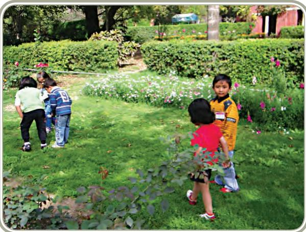

# **UNIT III**

**HUMAN DEVELOPMENT AND FAMILY STUDIES**

Unit I - Work, Livelihood and Career

99

Chapters.indd 99 8/12/2022 12:16:55 PM

# Introduction

In Class XI, you have read about the importance of studying development of a person from a young age onwards. There are many changes that take place in a person as he or she grows up. Students, who choose to specialise in Human Development and Family Studies (HDFS) study these changes and also learn the ways in which they can provide effective and meaningful services for people at different ages, with different needs and under different circumstances. In the forthcoming chapters, we will explore the different options for careers in this domain. We all know that studying HEFS helps us to know ourselves and the people around us better and to lead a more meaningful life, well integrated in our cultural tradition, with the knowledge of the developing world, science, technology and progress. The home and workplace are treated with equal respect and the personal, family life of any individual is given full consideration in understanding the person.

In accordance with the National Curriculum Framework (2005), all ethnic groups, languages, religions and communities are regarded as equal. In the forthcoming chapters, we will explore the careers that are available to students who wish to work in this field.

At the college level, the discipline of HDFS is referred to by different names in different institutions as Child Development, Human Development and Childhood Studies, and Human Ecology. While the core of the discipline remains the same, there may be slight differences in their perspectives. For example, when the discipline is referred to as Child Development, there may be a greater focus on childhood and less emphasis on the life span development. However, these differences are only a matter of degree and the substantive component of the discipline remains essentially similar.

A career in HDFS is especially suitable for those who feel drawn towards understanding interpersonal relationships and find it comfortable to talk about these issues. A fair degree of honest self-reflection is usually a part and parcel of the career in HDFS – this can be exciting as you learn more about yourself and others around you.

While the HDFS discipline helps you to develop the abilities to work with individuals and groups across the life span, from the very young to the old, you will find that the organisations and the programmes in the field focus on specific dimensions. Some may work with children in the early childhood years to create conditions for their all round development; some may be involved in providing counselling services to specific age groups; and some may strive to design interventions in the sector of education. In fact, further in the chapter, we have identified the major areas of work within the domain of HDFS and presented the information accordingly as follows:

100

Chapters.indd 100 8/12/2022 12:16:55 PM

(i) Early Childhood Care and Education, (ii) Guidance and Counselling, (iii) Special Education and Support Services, and (iv) Management of Support Services, Institutions and Programmes for Children, Youth and Elderly.

101

# Early Childhood Care and Education

# Learning Objectives

After completing this section the learner will be able to:

- z understand the basic principles of Early Childhood Care and Education (ECCE) as they apply to Indian society
- z understand the importance of early care and learning experiences for children
- z understand how children play and learn
- z explain the knowledge and skills required for a career in ECCE

# Significance

Early childhood care and education is a very important area of study in Human Development. We have learnt in Class XI, how the infant begins to learn from a very early age. In addition to learning new things about the world around him or her, the infant is developing an attachment with family members, particularly with the mother and father, as well as with siblings, and grandparents. The young child also begins to recognise other family members and people whom he or she meets regularly. This way, the child will also be able to distinguish between people who he/she recognises and those who look unfamiliar. This recognition is manifested in the behaviour where a young baby of around 8–12 months can show

Chapters.indd 102 8/12/2022 12:16:56 PM

fear of unknown people. This fear is not simply an emotional display, it shows a capacity to recognise familiar faces and thereby indicates a fear of unfamiliar people. Further, the child is deeply attached to the mother who is generally, but not always, the primary caregiver and can also start to cry when she leaves the room. The young child of around one year will try to cling to the mother or other caregiver and follow her everywhere. In most cases, this behaviour is soon discarded because the child develops the ability to know that the mother does not 'vanish' when she goes into another room. The child develops a sense of security even about the primary caregiver's absence. Further, the child is growing very rapidly, learning to walk, pick up things with precision, and manage his or her body in many ways. The child is also developing control over bladder and bowel movements.

In most cases, children are brought up exclusively within a family for the first few years. In some instances, where the mother is working outside the home, there may be a need for substitute provisions for the care of the child. Traditionally, the care of the child was usually the responsibility of another female of the household who lived with the family permanently (as in joint families) or temporarily resided with the family for support in child care. In recent times, however, there has been an increasing need for the provision of institutional child care. This can take the form of informal family care settings, where a woman in a neighbourhood sets up a 'crèche' in her home for business purposes or an institutionalised centre where children are cared for. The crèche or family care is primarily seen as substitute for the mother/primary caregiver. However, these may not be seen as an essential experience for the enrichment of a child's learning and development.

#### **Activity 1**

From your memory of last year's course, list some of the things that you think a child should know how to do or be capable of performing before entering Class1. For example, can a child walk, talk, read full sentences?

(Teacher should discuss these and then add/delete from to the list.)

Ideally, once the child is around three years of age, the activities and experiences begin to expand. However, experts differ on the exact age until which a child should be kept at home, before entry to formal school. Although the child is still capable of enjoying only informal and small group activities, there is an increasing value for opportunities to engage

103

Chapters.indd 103 8/12/2022 12:16:56 PM

with people outside the family and close community. These early years are extremely important for a child to learn new things, explore the environment and discover the world around. Once the children learn to walk and run, manipulate things and speak, they become capable of actively engaging with the environment. It is in interaction with people and materials around them that children at this age gather all the information. Vocabulary in the mother tongue is growing rapidly at this time, as is the child's understanding of nature like sand, water, flowers, birds, machines and other materials. They are curious to learn more and are often heard asking adults when they see something, "Why is this so?". Thus satisfying a child's curiosity by providing an optimal learning environment without overburdening the child to do more than what s/he is capable of is an essential consideration at this age. If we force a child to sit in one place and learn like in a formal school meant for older children, the curiosity will diminish, and a child will feel anxious and insecure. It is thus very important to understand that the best learning environment for a child at this age is one that is safe, secure, loving, with a variety of people and play materials (toys or natural), and the presence of a caring adult, whether it is the mother, grandparent, or a preschool teacher, or a sibling.

The learning and other experiences provided by a good preschool have been found to be extremely beneficial for young children at this age. The child centred approach and the play way method which makes learning enjoyable is ideally suited for young children. Children enjoy the company of other children and learn very quickly to do things that often surprise even the parents. One such observation that often takes place in preschool settings is the sheer wonder that parents of young children express when their child has been known to eat by himself or herself, and also eats things that he/she may not have eaten at home. Children learn very quickly among peers and for these and other reasons, preschool experiences become important at this age. Also, for children who live in difficult circumstances or who may need additional support for learning, a good preschool environment is known to be very beneficial.

Does that mean that children who do not go to nursery school are not learning? Absolutely not! All children learn, naturally. Preschool experiences help to enhance the child's exposure to other adults and other environments and materials; and more importantly, to prepare the young child for formal schooling. Preschool education in a programme which is child-centred and informal, provides the child with a good learning environment that complements the advantages of a good learning environment at home. Also, if in situations where the home environment may be lacking in some way or the other, the preschool experience can be an important factor in assisting the child's growth and development outside the home.

Chapters.indd 104 8/12/2022 12:16:56 PM

In several communities, especially those living in remote areas or those with fewer resources at their disposal, older children who are of schoolgoing age are often given the responsibility for the care of younger ones, as parents go out for work. Consequently, the older child is unable to participate in schooling. Therefore institutional care for young children is beneficial for the older child as well since he/she is released from the task of child care and can attend school. Thus, children, both young and of school age, can be helped to have access to services when they live in difficult circumstances. Further these services also provide for interventions in nutrition, health, besides learning as and when there is a requirement. Thus, there is a support to society in the task of developing and building the next generation for the future. Early childhood care and education and care is an activity that benefits childhood in different circumstances, as well as families by providing the support to parents and the community in these basic tasks.

As per the NCF (2005) Position Paper on Early Childhood Education published by NCERT, the basic objectives of ECCE are:

- z Holistic development of the child to enable him/her to realise the potential
- z Preparation for school
- z Providing support services for women and children

# Basic concepts

There are some important concepts associated with early childhood care and education that we must understand before proceeding further. Early childhood is the phase of life from birth till 8 years of age, and is commonly divided into two, from birth to three years and 3–8 years, based on the developmental changes that characterise young children in these two stages. Infancy is the period between birth and one year (some experts also denote infancy till two years), during which a child is largely dependent upon adults for everyday needs. This period is of intense dependence on adults, usually the mother or father, or any other primary caregiver who maybe the grandmother or helper. In circumstances where the mother is employed outside the home, the infant has to be cared for by a substitute caregiver, who may be a family member or a hired person. The location of the substitute care arrangement may be the child's own home or the home of the caregiver or an institution or crèche. Crèche is the name given to an institutional setting that is particularly designed for the care of infants and young children in the absence of home care. Day care, on the other hand, is the care of children in the preschool years and may include infants

105

Chapters.indd 105 8/12/2022 12:16:56 PM

and preschoolers, who are cared for, again in the absence of a primary caregiver at home.

Day care and crèches are usually all-day programmes. Teachers and helpers in these programmes need to be especially trained for the care of very young children, their safety, their feeding, toilet habits, language development, social and emotional needs and learning. Teachers, who have to deal with children above three years of age, require different skill sets. The child between two and three is sometimes referred to as a toddler, a term that is derived from the jumpy walk that a young child has at this age. A preschool child is so called because he or she is now ready for experiencing some sort of environment beyond that of the family (extra-familial). Even for this programme, a teacher needs to be specially trained as a pre-school or nursery school teacher. Some pre-schools for young children are often called Montessori schools. These are schools based on the principles of early childhood education as outlined by a well-known educationist Maria Montessori. It is worth mentioning that the Government of India has addressed the needs of this age grouping by offering pre-school education through the *anganwadis* that operate under its *Integrated Child Development Services* (ICDS*)*. There are angawadis in urban and rural areas.

Some of the other concepts related to this field that we need to know, deal with understanding the fact that children at this age have a very different approach to understanding the things that happen around them. The developmental psychologist Jean Piaget spent his life trying to comprehend and explain that young children have different ways of understanding the world, due to which, they need a supportive environment to explore phenomena in their own ways. You have studied these features of children's development last year in Class XI. It is important to keep those details in mind in order to understand the principles of care and education of young children.

Another important principle to be kept in mind is the fact that any ECCE institution must realise the importance of the cultural context within which it operates and works along with, rather than in opposition to, the family. Although this is true for all ages, it becomes more significant for the young child since he or she is unable to make distinctions about different perspectives and different realities in the ways that an older child or adult can. Thus we have to understand that the educational and care arrangements for children must follow these principles.

106

Chapters.indd 106 8/12/2022 12:16:56 PM

As per the NCF (2005) on ECCE, the guiding principles of ECCE are:

- z Play as the basis for learning
- z Art as the basis of education
- z Recognition of the special features of children's thinking
- z Primacy of experience rather than expertise (i.e., experiential learning is emphasised)
- z Experience of familiarity and challenge in everyday routines
- z Mix of formal and informal interactions
- z Blend of textual and cultural sources
- z Use of local materials, arts and knowledge
- z Developmentally appropriate practices, flexibility and plurality
- z Health, well-being and healthy habits.

#### **Activity 2**

From your childhood, recall and write down any story that you heard and that you enjoyed a lot. Also mention who used to tell you the story and what you liked about the story. Mention which character you liked the best in the story and why.

The teacher should choose some stories for presentation to the class so that the students can learn from each other and share the enjoyment of collective memories and interaction. Also it gives students an opportunity to gain an understanding of other families, cultures and communities.

*Children at play Children enjoy painting*

Chapters.indd 107 8/12/2022 12:16:56 PM

*Children exploring nature* 

## Preparing for A Career

It has been mentioned earlier that since children under 6 years of age have particular ways of understanding the world and social relationships, have specific developmental needs, any adult attempting to work with children must be carefully and well trained in the field of early child development and care. We might think here that when young women and men become parents, they are not required to have any training in child care, why should a teacher or a caregiver require any training?

There are several reasons why even parents would also benefit from knowing more about how and why children do the things that they do. Parents would also benefit very much from knowing more about expected differences between children of the same age and also appreciate that there are individual differences. They should realise that there is often no point in competitive comparisons between children and even between siblings. Thus we must understand that ALL adults in contact with children WILL, certainly benefit from a scientific understanding of development and growth leading to realistic expectations and interactions with children.

Training and scientific knowledge of childhood, and developmental changes and challenges is even more critical for those adults who choose early childhood programmes as a career. Early child care professionals are responsible for children other than their own. The activities they perform as child care professionals constitute their work and they receive formal recognition for this. Teachers and caregivers are responsible to children who may not be their biological offspring, to the large group of adults who are family members of the children under their supervision and to the

108

Chapters.indd 108 8/12/2022 12:16:56 PM

institution they work for, as well as the larger society. ECCE professionals have to be committed to the children, their well-being and learning, be aware and knowledgeable about their needs and the challenges for providing opportunities for their growth and development.

What is the expectation from an adult teacher/caregiver of young children? During preschool years, a teacher needs to keep all the above points in mind, but there is less of a requirement for supervision of physical care of preschool children, like cleaning, feeding, toilet activity since the child develops the capability to speak, to control his or her bowel and bladder movements, eat independently. A teacher needs to focus more on providing interesting and stimulating opportunities for children to learn new things, experience natural phenomena, provide ample opportunities for a variety of experiences like physical, language, social-emotional and other learning experiences. The focus is on enhancing creative expression and exploration, although these aspects are equally important in the earlier years too.

It is necessary to focus on providing opportunities to young children primarily because they have a greater requirement for adult guidance. If we want to express ourselves creatively as adults, we are quite capable of arranging the necessary conditions for this. If we want to talk to someone, we can take the initiative to do so. Children during pre-school years need the support of adults for such tasks. Lev Vygotsky, a psychologist and educator, had outlined the great need that children have for a concerned, caring and knowledgeable adult. The pre-school educator must have knowledge specifically about the child's capabilities, more than information about the world. By knowing how much a child actually knows and is capable of knowing, an adult can help to provide the optimal environment wherein learning is easy, enjoyable and meaningful. The tasks given to a child should be neither too easy nor too difficult; otherwise a child will either lose interest and/or motivation to engage in the activity.

Some of the skills an early childhood professional needs to have are:

- z An interest in children and their development
- z Knowledge about the needs and capabilities of young children
- z Capacity and motivation for interacting with children
- z Skills for creative and interesting activities with children in all areas of development
- z Enthusiasm for activities like story-telling, exploration, nature and social interaction
- z Willingness and interest in answering children's queries
- z Capacity for understanding individual differences

109

Chapters.indd 109 8/12/2022 12:16:56 PM

- z Be energetic and prepared for physical activity for considerably long periods of time
Further, in order to prepare for a career in this field, it is essential to have studied about children's development and basic principles of care. For this you will be required to have an undergraduate degree in a subject that has child/human development and/or child psychology as part of the course. However, if there a desire to enter into the field soon after completion of schooling, there is also the option of one year diploma or Open University educational courses in the field. Nursery Teacher Training is another course that offers training in this field.

In addition to the courses that one can attend, and degrees that can be acquired, it is also important to remember that having a predisposition to be open and interactive with children is a fundamental requirement if one wants to become an effective early childhood specialist. The person should also be aware of the community and culture so that the pre-school activities are in the context of the culture and regional environment in which the child is growing up. The teacher also needs to be capable of administrative and management skills that are required for record keeping, accounting, report-writing so that the institution maintains proper records, and the contact and interaction with the parent community is effective and productive.

It is also extremely helpful for a teacher to be equipped with a good repertoire of skills in the arts. The skills of story-telling, dance, music, voice modulation, of organising playful outdoor and indoor activities are mandatory when working with children. The training courses will offer several such sessions for the trainees but it is also important for a person to be deeply engaged with and willing to interact with children in several different ways.

Young children have a short attention span when compared with older children and adults. Hence, it is not only important to be prepared with several activities, it is also essential to be adaptive and flexible with children, rather than focussed on completing one's own plan of action. A pre-school teacher has often to quickly change her lesson plan, her strategies and techniques to deal with the needs of young children so that s/he can be an effective teacher. For this, good preparation of a large repertoire of activities and skills is essential before entering the career with children.

## Scope

The scope of early childhood care and education is very widespread. A person who is trained as an educator or caregiver for young children can

110

Chapters.indd 110 8/12/2022 12:16:56 PM

Family Studies

Unit III - Human Development And

either work as teacher in a nursery school, a caregiver in a crèche or as a member of a team of people working for programmes with young children. Additionally, several governmental and non-governmental organisations hire professionals for planning and promoting campaigns or services for young children. A person can also set up his or her own child care and education-related programme as an entrepreneur, which would mean setting up one's own programme, either at home or in a separate space. Such an enterprise would require the expertise related to organisation and management of such institutions over and beyond the training as a child care worker and educator. Depending on your qualification and interest, you can also find a job as coordinator of a programme run by someone else or as a trainer of teachers in the same subject. If you wish to pursue higher studies, you can enrol in a post-graduate diploma or degree in early childhood education and go on to a doctoral degree in the field which will equip you to do further research in the field and also take on other more senior activities as a professional in the field.

Some of the commonly available services in this field are:

- z Crèches
- z Day care centres
- z Nursery schools
- z NGOs
- z ICDS
- z Training institutes

#### **Careers**

- zz Teacher in Nursery schools
- zz Caregiver in day care centres and crèches
- zz Team members for programmes for young children
- zz Professionals to plan and promote campaigns or services for young children organised by Governments or NGOs
- zz Entrepreneur in child related activities: Camps, edu-picnics, activity clubs, preschool education centres
- zz Higher studies: a post-graduate diploma or degree in early childhood education, later doctoral degrees with research in the field.

111

Chapters.indd 111 8/12/2022 12:16:56 PM

#### **Activity 3**

Name the different types of child care services available in your neighbourhood.

#### **Key Terms**

ECCE, Child care, Preschool education, Caregiver, Day Care, Crèche

#### **Review questions:**

- 1. What do you understand by the term early childhood care and education?
- 2. What are the different care arrangements young children may require?
- 3. What are some of the reasons why young children need a special informal programme before formal schooling?
- 4. What is meant by a child-centred approach?
- 5. What is a crèche, and what services does this centre provide?
- 6. List the skills an ECCE worker must have.
- 7. Describe how we can prepare for a career in ECCE.

Chapters.indd 112 8/12/2022 12:16:56 PM

### **Practical 1**

#### **Theme: Activities for preschool children**

**Tasks:** 1. Visit to playground or outside open area

- 2. Collection of play material
**Purpose:** This practical is intended to prepare the student for planning and preparing materials for the activities with young children**.** A specific emphasis is placed on using locally available low-cost or no-cost material.

#### **Conducting the Practical**

- 1. Divide the class into groups of 5 students each. Together, take a walk around the playground in your school or any open area outside the school.
- 2. Look around; collect any materials that you think would be clean, safe and appropriate for play with young children. Some suggestions are: rocks, stones, pebbles, flowers, leaves, sticks.
- 3. Once you have collected the material be sure to clean it properly so that it can be used with children.
- 4. Each group should prepare one activity for children using any one or more of the following concepts:
	- Colour Texture
	- Number Shape

- 
- Type of material Size

**Example 1:** Taking leaves of different sizes and shapes, arrange the leaves collected into two sets based on size and shape. Try to identify the plants or trees from which these leaves are taken. Taking two sheets of newspaper, paste the leaves in the two sets. Discuss the names of plants/trees from which the leaves are taken. Other suggestions can be to discuss colour of leaves, matching flowers, names of plants.

**Example 2:** Using the same material, the children (with your guidance) can make a scenery depicting a home, school or forest where some portions can be drawn or painted and some can have materials collected stuck on the paper. The same can also be done on the floor or wall. In case there is any local craft or art that is indigenous to the area in which the children live, care must be taken to link with the folk activity so that children's home environment is also attended to.

**Example 3:** Children can be made to act like birds, animals and insects around the foliage that has been collected. Discussions can take place

113

Chapters.indd 113 8/12/2022 12:16:56 PM

about which animals they have seen that eat foliage. Other characteristics of animals can also be discussed.

These are a few examples: the teacher in a classroom can actually plan many activities around the same play material depending upon what gets the children interested. Story–telling and role play is particularly fascinating for children.

#### **Practical 2**

**Theme: Preparation and use of teaching aids,** using indigenous and locally available material to communicate socially relevant messages for children, adolescents and adults in the community.

Note for the teacher: Several practicals are being suggested based on the objectives stated in this assignment. You may divide your class into four groups so that of the four practicals being proposed, one group of students conducts one practical. At the end they share their materials and experiences.

**Task:** Make a puzzle for young children with indigenous material.

**Purpose:** Providing learning experiences of developing and preparing play material; for example, a puzzle so that young children's development be facilitated.

#### **Conducting the Practical**

- 1. Instruct the students to bring used boxes made of cardboard (*gatta*)/ old notebook's cover.
- 2. Students are instructed to draw two single identical pictures of any animal e.g., Fish/elephant or locally available food article e.g., mango, banana.
- 3. Paint the pictures in bright colours.
- 4. Stick one picture on the inside of the box/cover of the notebook.
- 5. The other identical picture should be glued on the other cardboard.
- 6. After the picture dries, cut it into four pieces.
- 7. Arrange the pieces on the picture stuck on the cardboard box.
- 8. The puzzle is ready.
- 9. Puzzles can also be made out of drawings that are taken from the newspaper or magazines. Cut pictures can also be used to make a

Chapters.indd 114 8/12/2022 12:16:56 PM

114

scrap book with cut pictures and drawings. Some ideas for scrap books are a collection called my family, or my school, or my neighbourhood, village. Pictures of fruits, animals, household objects, natural things, can be used for several activities like these.

#### **Practical 3**

#### **Theme: Preparation of play materials**

**Task:** Making puppets and masks

**Purpose of the Practical:** The students have to learn how to make play material for children. Young children enjoy playing with masks and also drawing and creating materials themselves. When such an activity is done with 4–6 year old children, they should be involved in the making of the material. Low cost materials have to be used. Usage of masks and puppets promotes language and socio emotional development.

#### **Conducting the Practical**

Collect stiff paper, newspaper, pieces of cloth, thread, leaves and flowers (for colouring the paper). Take a piece of paper and then do as instructed below:-

- 1. Draw a face on it the size of a 10-year-old child's face. Draw an outline of a mask in the image of a sun, flower or any animal.
- 2. Draw a small face and join to it pieces of cloth as arms, legs and hair.
- 3. Using the prepared puppets and masks, tell a story or do a role-play as an interactive activity.
- 4. Analyse what children can learn through such an activity.

Note for the teacher: Supervise the making of masks with or without children and guide the discussion about learning outcomes.

Chapters.indd 115 8/12/2022 12:16:56 PM

