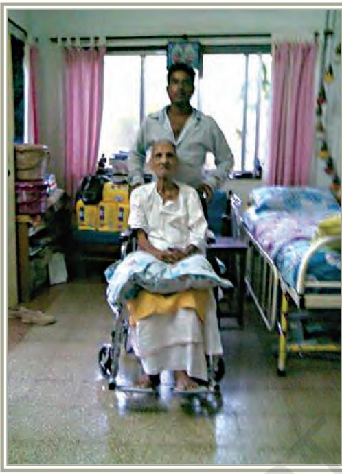
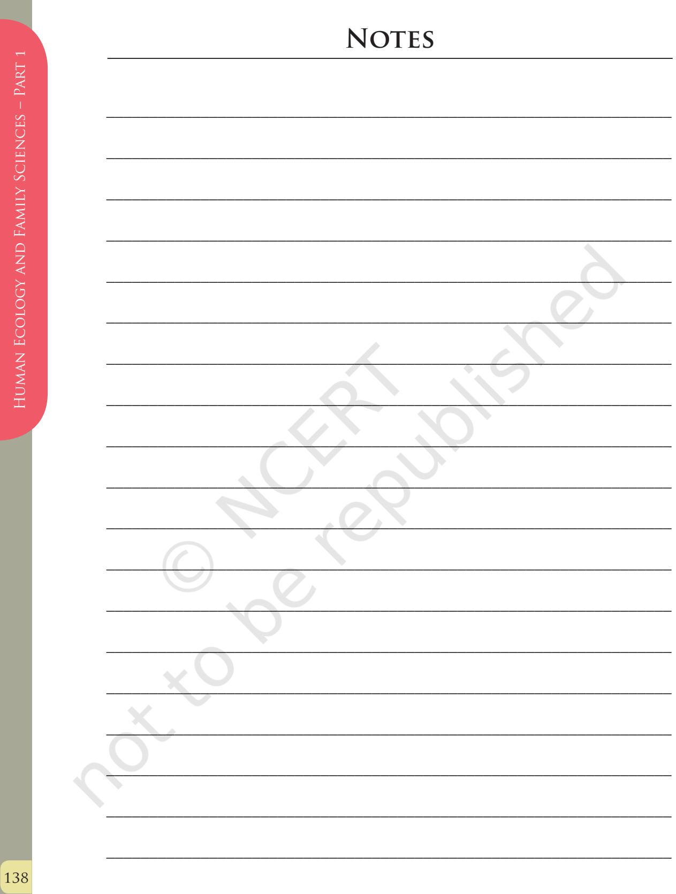
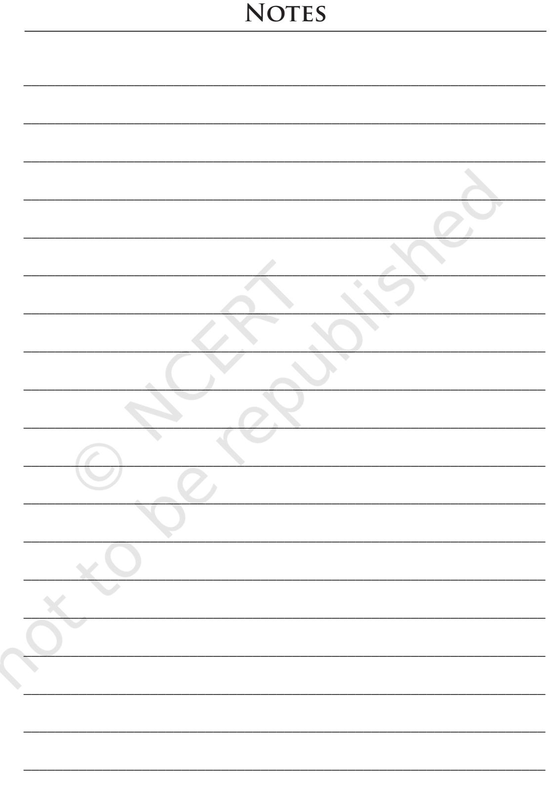

# Chapter 7

# Management of Support Services, Institutions and Programmes for Children, Youth and Elderly

# Learning Objectives

After completing this section the learner will be able to:

- z explain why services, institutions and programmes are needed for children, youth and elderly
- z describe the aspects involved in management of institutions and programmes
- z discuss the knowledge base and skills set required to manage and run institutions and programmes
- z become aware of the career opportunities available in this field.

# **Significance**

Family is the basic unit of the society and one of its chief functions is to look after the needs of its members. The members in a family could include parents, their children of various ages and the grandparents. The composition of the family will vary from one household to another but at

Chapters.indd 116 8/12/2022 3:28:53 PM

different stages in its life cycle, the family has different composition and the members together try to meet each others' needs. However, a family cannot always provide all the specialised services that are needed for the optimal growth and development of its members. For example, young children need formal education; all the members need health care. Therefore, each community creates other structures like schools, hospitals, universities, recreation centres, training centres which provide specialised services or support services which can be accessed by different members of the family to meet their needs.

Generally a family, along with other structures of the society like schools, hospitals etc., is expected to meet the needs of its members. However many families in our country are unable to meet even the basic needs of their members and/or access as well as utilise the various services provided by other structures of the society due to various reasons, one of them being lack of resources, especially financial. See the box given below for some pertinent details in this regard. Further, many children, youth and elderly are separated from their families and are left to cope on their own. By themselves, they find it difficult to meet their own needs.

- zz Poverty in India is widespread, with the nation estimated to have a third of the world's poor.
- zz According to the Planning Commission of India, in 2011–2012, 29.5 per cent of the population was living below the national poverty line.
- zz Less than 30 per cent of our population has access to adequate sanitation facilities.
- zz Less than half of all deliveries in a year are conducted by trained birth attendants, which is a cause of high maternal and infant mortality and morbidity.
- zz Less than half the country's households consume iodised salt. Lack of iodine adversely affects mental and physical growth of the child.
- zz Pervasive discrimination against girls and women, which is reflected in a range of adverse indicators, including nutritional and educational outcomes, and the declining ratio of girls to boys, particularly in the youngest age group, are matters of concern.

117

Chapters.indd 117 8/12/2022 3:28:53 PM

For such families, or the members who are in challenging and difficult circumstances, the state/society has to step in and make efforts to look after the needs of its members. This is because it is the responsibility of the government and society to ensure that all citizens have a decent life, and children and youth have opportunities for holistic development in a healthy and stimulating environment. One of the ways in which the government responds to the needs of those who are in difficult circumstances, is by setting up institutions and initiating programmes dedicated to the children, youth and the elderly. It also provides support to the efforts of the private sector and/or the NGO sector. Some of these institutions and programmes may focus on meeting specific needs while some programmes adopt a holistic perspective and provide intervention and services to meet various needs of the individuals together. The latter approach stems from the philosophy that all the needs of the individual must be met together to have optimal impact.

# Basic Concepts

Why are we focussing more on children, youth and elderly? This is because these are 'vulnerable' groups in our society. What do we mean by 'vulnerable'? The word 'vulnerable' refers to those persons / groups in a society, who are more likely to be affected by adverse circumstances and on whom adverse circumstances are likely to have a more harmful impact. What makes children, youth and elderly vulnerable? This can be answered by understanding the needs of these groups. If the needs of any individual are not met in the course of daily life, that person becomes vulnerable.

## **Activity 1**

Form three groups in the class and on the basis of what you learned in Class XI, list the needs of (i) Children, (ii) Youth, (iii) Elderly. Try to list (at least 5-8) of the special characteristic needs for each group. A group leader should then present the list of each group to the rest of the class.

# Why are Children Vulnerable?

Children are vulnerable because childhood is a period of rapid development in all domains, and development in one area influences development in all others. In order for the child to grow optimally in all areas, it is important

Chapters.indd 118 8/12/2022 3:28:53 PM

that the child's needs for food, shelter, health care, love, nurturance and stimulation be met in a holistic manner. Adverse experiences can have a lasting impact on the child's development.

All children are vulnerable, but some are more vulnerable than others. These are the children who are living in such challenging conditions and difficult circumstances that their basic needs of food, health, care and nurturance are not met and this prevents them from developing their full potential.

Box given below clearly highlights that the needs of a large proportion of child population are not met.

- zz Nearly two–thirds of children under five years of age suffer from moderate or severe malnutrition. Malnutrition affects development in all areas.
- zz About 3 million children live on the streets without any shelter.
- zz Only one in three children of the pre-school age has the opportunity to be in an early learning programme.
- zz Less than half of India's children between ages 6 and 14 years go to school.
- zz A little over one-third of all children who enrol in Standard I reach Standard VIII. The others drop out of school for one or the other reason.
- zz 17 million children in India work, as per official estimates. The actual numbers may be even more. According to the World Bank the number may be 44 million.

All children in difficult circumstances need care and protection but some may violate the law or be involved in anti-social activities. The Juvenile Justice (Care and Protection of Children) Act, 2000 is the first legal framework for juvenile justice in India. The Act concerns itself with two categories of children: those who are "in conflict with law" and those considered to be "in need of care and protection." Children "in conflict with law" (also called juvenile delinquents) are those who have been caught by the police for violating the Indian penal code. In other words, they are arrested by the police because they have committed/ are accused of a crime. The Act provides for a special approach towards the prevention and treatment of juvenile delinquency and provides a framework for the

119

Chapters.indd 119 8/12/2022 3:28:53 PM

protection, treatment and rehabilitation of children. It relates to 'juveniles in conflict with law' and 'children in need of care and protection', by providing for proper care, protection and treatment, by catering to their development needs, and by adopting a child-friendly approach in the adjudication and disposition of matters in the best interest of children and for their ultimate rehabilitation through various institutions. This Act is in compliance with the Child Rights Convention and the identified children in need of care and protection are those:

- z who are without any home or settled place or abode or without any means of sustenance. This includes abandoned children, street children, runaway children and missing children;
- z who live with a person (guardian or not) who is unfit to exercise control over the child or where there is a chance of the child being killed, abused or neglected by the person;
- z who are mentally or physically challenged, ill or suffering from terminal illness or incurable disease and have no one who can support or look after them;
- z who are abused, tortured or exploited for purpose of sexual abuse or illegal acts;
- z who are vulnerable to being inducted into drug abuse or trafficking;
- z who are victims of armed conflict, civil commotion, or natural calamity;
- z who are likely to be abused for unconscionable gain. These include abandoned, orphaned, trafficked minors rescued from red-light area, child labourers rescued from factories, lost, runaways, special needs children and children of prisoners.

#### **Institutions, Programmes and Initiatives for Children**

There are several programmes and services operating in the country to meet the needs of vulnerable children. Here we shall briefly describe some significant initiatives and efforts in order to acquaint you with the various activities carried out by the government and the non-governmental organisations.

- z *Integrated Child Development Services (ICDS)* of the Government of India. It is the world's largest early childhood programme which aims to meet the health, nutrition, stimulation and early learning / education needs of children below six years of age in an integrated manner so as to foster their development. The programme offers health, nutrition and hygiene education to mothers, non-formal
Chapters.indd 120 8/12/2022 3:28:53 PM

pre-school education to children aged three to six, supplementary feeding for all children below six years and diet for pregnant and nursing mothers, growth monitoring and basic healthcare services such as immunisation and vitamin A supplements. The programme today covers over 41 million children. These services are delivered in an integrated manner at the childcare centre named 'anganwadi'.

- z *SOS Children's Villages:* This is an independent non–governmental social organisation which has pioneered a family approach to the long term care of orphaned and abandoned children. SOS villages have the vision of providing family-based, long-term care to children who can no longer grow up with their biological families. In each SOS home there is a 'mother' who looks after 10-15 children. This unit lives like a family and the children experience relationships and love once again, which helps children to recover from traumatic experiences. They grow up in a stable family environment, and are supported individually until they become independent young adults. The SOS families live together, forming a supportive 'village' environment. They are integrated with the local community and contribute to the social life.
In India, the first SOS village was set up in 1964. Now the organisation cares for about 6000 needy/abandoned children in 40 unique villages across the country. Whenever India has experienced unrest or environmental and natural disasters like the toxic gas accident of 1984 in Bhopal, or devastating cyclones, , catastrophic earthquakes as well as Tsunami the SOS Children's Villages rendered immediate assistance with emergency relief programmes, which were converted into permanent facilities, mostly SOS Children's Villages.

- z *Children's Homes run by the Government for children from 3–18 years who are in state custody for various reasons.*
There are three kinds of homes for children:

- a) Observation Homes where children stay temporarily till the completion of an investigation to track down their parents and collect information on their family background.
- b) Special Homes where juveniles (children under 18 years of age) found guilty in terms of violation of law, are placed in custodial care.

Chapters.indd 121 8/12/2022 3:28:53 PM

- Human Ecology and Family Sciences Part 1
- c) Juvenile /Children's Homes where children whose families are not traceable, or are unfit/dead or simply unwilling to take the child back stay. The government is responsible for providing room, board, education, and vocational training. Most of these Homes are run by government in partnership with NGOs. Efforts are made to help the children develop skills which will enable them to become productive members of society.
	- *Adoption:* India has a long tradition of child adoption. Earlier adoption was limited within the family and was covered by social and religious practices. But with changing times, adoption beyond the family has been institutionalised and legalised. While the Government of India and State Governments provide necessary support and guidance through policies and programmes, Non-Governmental Organisations (NGOs) provide necessary delivery systems for the process of adoption. In order to strengthen adoption rules and facilitate adoption, the Government of India under the advice of the Supreme Court has constituted a Central Agency, Central Adoption Resource Authority (CARA), to set up guidelines for adoption to safeguard the welfare and rights of children.

# Why are Youth Vulnerable?

The National Youth Policy, 2014 defined 'youth' as persons in the age group of 15–29 years. Those between 13 and 19 years are called adolescents. Our national progress depends, crucially, on the ways and means through which youth are encouraged and nurtured as a positive force for national growth and are enabled to contribute to socio-economic development. Youth is a vulnerable period due to many reasons. During this period an individual is trying to come to terms with many biological changes in her/ his body which have an impact on the person's sense of well-being and identity. This is also the period when the individual is preparing to take on adult roles, two of the foremost being earning a livelihood and marriage, followed by raising a family.

Peer pressure and pressure to excel in an increasingly competitive world are other factors that can cause a lot of stress and turmoil. When the family/environment is unable to provide positive support to the

Chapters.indd 122 8/12/2022 3:28:53 PM

adolescent, some adolescents may consume alcohol and drugs (also termed substance abuse). Such maladjustive behaviour for combating stress is on the rise. Health is another aspect which is of critical concern. Youth face significant risks related to sexual and reproductive health, and many lack the knowledge and power to make informed sexual and reproductive health choices. Within the broad category 'youth', there are some groups who are especially vulnerable. They are:

- Rural and Tribal Youth;
- Out-of-school Youth;
- Adolescents, particularly female adolescents;
- Youth with disabilities;
- Youth under specially difficult circumstances like victims of trafficking, orphans and street children.

In order to be socially useful and economically productive, youth need appropriate education and training, gainful employment and adequate opportunities for personal development and advancement. They also need requisite shelter and a clean environment, as also basic health services of quality, social defense and protection from all manner of exploitation. Suitable participation in decision-making bodies which are concerned with issues relating to the youth, and with socio-economic and cultural matters, as well as access to sports, physical education, adventure and recreational opportunities are other requisites.

# **Youth Programmes in India**

The Ministry of Youth Affairs and Sports adopted the National Youth Policy in 2003.

- z *The National Service Scheme (NSS)* aims at involving college level students in programmes of social service and national development like construction and repair of roads, school buildings, village ponds, tanks, activities related to environmental and ecological improvement like tree plantation, removal of weeds from lakes, digging pits, activities related to hygiene and sanitation, family welfare, child-care, mass immunisation, vocational training in craft, tailoring, knitting, and organising co-operatives. NSS students also render assistance to local authorities for implementing of various relief and rehabilitation programmes to meet the needs of the economically and socially weaker sections of the community.
Chapters.indd 123 8/12/2022 3:28:53 PM

- Human Ecology and Family Sciences Part 1
- z *The National Service Volunteer Scheme* provides opportunities to students (who have completed their first degree) to involve themselves, on a whole-time basis for a short period of one or two years, in programmes of national development mainly through *Nehru Yuva Kendras*. They are involved in programmes of adult education, establishment of youth clubs, organisation of work camps, youth leadership training programmes, vocational training, promotion of rural sports and games, etc. The Nehru Yuvak Kendras also aim to enable the non-student youth of the rural areas to contribute to development in the rural areas. Through the various activities the Kendras aim to popularise nationally accepted objectives such as self-reliance, secularism, socialism, democracy, national integration and development of scientific temper. Some such activities are non-formal education, social service camps, development of sports activities for young people, cultural and recreational programmes, vocational training, youth leadership training camps and promotion and establishment of youth clubs. These activities are organised for the purpose of helping the non-student youth acquire literacy and numeracy skills for self-reliance, upgrade their functional capabilities, and make them aware of possibilities of their development, thus making the youth functionally efficient, economically productive and socially useful.
- z *Promotion of Adventure:* Many youth clubs and voluntary organisations organise activities like mountaineering, trekking, hiking, exploration for collection of data, study of flora and fauna in the mountains, forests, deserts and sea, canoeing, coastal sailing, raft-exhibitions, swimming, cycling, etc., by using the financial assistance provided by the government for promotion of adventure. These activities are aimed at encouraging the spirit of adventure, risk-taking, co-operative team-work, capacity of ready and vital response to challenging situations and endurance among the youth. Government also provides assistance for establishment and development of institutions to facilitate such activities.
- z *Scouts and Guides:* The Government provides financial support for training scouts and guides, organising rallies, jamborees, etc. This aims at developing the character of boys and girls to make them good citizens by inculcating in them a spirit of loyalty, patriotism and thoughtfulness for others. It also promotes balanced physical and mental development and inculcates a desire for social service.
- z *Commonwealth Youth Programme:* India is participating in the Commonwealth Youth Programme which is aimed at making the youth participate in development processes of their respective countries and

Chapters.indd 124 8/12/2022 3:28:53 PM

to provide a forum for increasing co-operation and understanding among the Commonwealth countries. Under this programme, three regional centres for advanced studies in youth work have been set up in India, Zambia and Guyana. The Asia Pacific Regional Centre has been set up at Chandigarh, India.

- z *Promotion of National Integration*: Financial assistance is given by the Government to many voluntary agencies to organise visits of youth living in one state to another state with marked cultural differences, in order to promote greater understanding of the historical and cultural heritage of the country, of the problems being faced by the people of different regions and environment, social customs etc. in other parts of the country. Camps, seminars, etc. are also organised with the objective of promoting national integration.
# Why are the Elderly Vulnerable?

In a number of countries, a Senior Citizen is a person in the age group 65 years and above. However, in India Senior Citizens constitute persons in the age group of 60 years and above. There has been a steady rise in the population of older persons in India, since life expectancy, which was approximately 29 years in 1947, has increased to 69.3 years in 2009–13 for females and 65.8 years for males. India is home to the second largest number of Senior Citizens in the world after China. The number of elderly will account for nearly 9 per cent of the population in 2016. (Source: Human Development Report).

The special features of the elderly population in India are:

- z Majority (80%) of them are in the rural areas, thus making service delivery a challenge
- z Feminisation of the elderly population
- z Increase in the number of the older-old (persons above 80 years)
- z A large percentage (30%) of the Senior Citizens is below the poverty line.

The elderly are a vulnerable group due to various reasons. Firstly, health is a major concern for many individuals at this age. The elderly are more vulnerable to disease because of decreased physiological reserves and defence mechanisms. Besides illness, the aging process itself leads to certain disabilities such as low vision and blindness resulting from cataracts, deafness resulting from nerve impairment, loss of mobility from arthritis and a general inability to care for oneself.

Chapters.indd 125 8/12/2022 3:28:53 PM

Secondly, in the family life cycle for many, this may be a period when they find themselves alone because the children are likely to have moved away from the family either because of marriage or to earn a living. Many may experience feelings of loneliness, isolation and a sense of being a burden on others. Many individuals find themselves financially dependent on the younger generation which may add to their feeling of stress. Further, especially in metropolitan cities, there is fragmentation of the traditional family network and the traditional value system is also undergoing change. Certain features of city life (small family size, nuclear families, lack of free time to care for the aged, limited living space, high cost of living, long working hours), lead to reduced support within the immediate and extended family. Sometimes concepts like privacy, space, independence, materialism, focus on self are also responsible for the inability to adequately care for the elderly. Thus many elderly persons are left to fend for themselves at a time when family support is most necessary for them. Ageing has become a major social challenge and it is necessary to provide for the economic and health needs of the elderly and to create a social milieu which is conducive and sensitive to emotional needs of the elderly.

The above description should not make you think that there are only problem and difficulties in old age. Many old people continue to live fulfilling lives. In many families the elderly are well respected and continue to find fulfillment. One positive feature concerning the elderly population is that most 60 or more years old are economically active, presumably because they are engaged in sectors for which there is no specific age of retirement. What is needed is to recognise the elderly as a human resource and their rich experience and residual capacities be put to optimum use for the benefit of national development. Their ability to lead healthy and fruitful lives should be ensured by the Government. The government adopted the National Policy for Older Persons in 1999.

#### **Activity 3**

Divide the class into two groups. Let one group discuss the situation of elderly in their neighbourhood. The other group should discuss how the elderly can contribute to family and society. Let the discussion of each group be presented to the class through a group leader.

Chapters.indd 126 8/12/2022 3:28:53 PM

# Some Programmes for the Elderly

Government, Non-Government Organisations, Panchayati Raj Institutions, local bodies are implementing different types of programmes for the elderly in India. Some of the programmes operating in the country for the elderly are as follows:

- z Programmes catering to the basic needs of Older Persons particularly food, shelter and health care to the destitute elderly;
- z Programmes to build and strengthen intergenerational relationships particularly between children/youth and Older Persons;
- z Programmes for encouraging Active and Productive Ageing;
- z Programmes for providing Institutional as well as Non Institutional Care/Services to Older Persons;
- z Research, Advocacy and Awareness building programmes in the field of Ageing;
- z *Old Age homes* to provide food, care and shelter;
- z *Respite Care Homes and Continuous Care Homes* for Older Persons who live in old age homes but are seriously ill requiring continuous nursing care and respite;

127

Chapters.indd 127 8/12/2022 3:28:53 PM

- z *Multi-Service Centres for Older Persons* to provide daycare, educational and entertainment opportunities, healthcare, companionship; z *Mobile Medicare Units* to provide medical care to the older persons living in rural and isolated and backward areas;
	- z *Day Care Centres for Alzheimer's Disease/Dementia Patients* to provide specialised day-care;
	- z *Help-lines and Counseling Centres for older persons;*
	- z *Mental health care and Specialised care for the Older Persons* to provide Mental Health Care Intervention Programmes to the elderly;
	- z *Disability care and hearing aids for older persons;*
	- z *Physiotherapy clinics for older persons;*
	- z *Awareness Generation Programmes for Older Persons and Care Givers* like self-care, preventive health care, disease management, preparation for old age/healthy and productive ageing, intergenerational bonding;
	- z *Training of Caregivers for older persons;*
	- z *Sensitising programmes for children, particularly in Schools and Colleges;*
	- z *National Old Age Pension Scheme (NOAPS)* meant for old persons who are considered destitute i.e., not having any regular means of subsistence on their own or through financial support from family members. Beneficiaries should be above 65 years, need to provide proof of age and their destitute status. The state governments can add to the amount from their own resources.

# Preparing for a Career

In this career choice, you may either work as in-charge or manager of certain activities in an already functioning programme/institution, or you may choose to initiate set up of an organisation/programme for the youth, children or the elderly. Whatever be the case, it will be a career for which you will be required to develop a broad knowledge base and multiple skills.

Let us first understand what management of institutions and programmes involves. A career in management of institutions and programmes for children, youth and elderly will need honing of the abilities and skills of a planner, manager and an evaluator, may be even an entrepreneur as well as strong knowledge of the needs, characteristics

Chapters.indd 128 8/12/2022 3:28:53 PM

and modes of care giving for the target group would also be necessary. The following are some skills and abilities you will need to develop:

- z *People* Skills: Running or working in an organisation means interacting with people in different roles and from different backgrounds. The following are some groups of people you are likely to interact with:
	- (i) *The Community:* A programme or an institution for children will be successful if the community feels a sense of involvement and ownership with it. This happens when the programme is planned by involving the people for whom it is intended right from the start. Participatory planning, management and implementation are the pillars of effective programmes. Thus, building linkages with the community and invoking community participation will be a major aspect of your work.
	- (ii) *The Private Sector:* The private sector financial institutions, companies and organisations have come in a big way to support innovative programmes and institutions. This is a positive step as it is an opportunity for the private sector to discharge its social responsibilities.
	- (iii) *The Officials in the Government:* You may need to interact with government departments for various purposes, including funding and fulfilling other legal requirements.
	- (iv) *People within the organisation:* For smooth functioning of the organisation, it is important that the people (both beneficiaries and personnel working therein) enjoy a harmonious relationship with each other. Cultivating cordial interpersonal relations is a major factor in the success of an organisation.
- z *Administrative Skills:* Running or managing an organisation or programme involves handling finances, recruiting personnel, renting space, buying equipment, maintaining records and stocks. While there may be other specific people dealing with each of these aspects, it would also be necessary and helpful for you to have a basic understanding of the issues involved in each of these.

Some person may even wish to start and establish a new organisation for some specific needy target group. Such enterprising person will need to consider the aspects of appropriate location, who should it cater to suit the target beneficiaries, the services/combination of services to be provided, finances to run the organisation, recruitment of staff with

129

Chapters.indd 129 8/12/2022 3:28:53 PM

different skills and knowledge base to handle the various aspects of the programme including handling formalities of registering the organisation, implementing the programme, improving the activities based on periodic evaluation and feedback.

Last but not the least, the person needs to have vision about what he/she wants to achieve, how the organisation will contribute to meeting the needs of the target group. A person with a vision is usually deeply committed to that cause and has a strong passion for work in that area.

The need for programmes and institutions for children, youth and elderly which provide quality services will continue to remain a basic need of civil society. The first step in preparation for this career is to develop a knowledge base and an understanding about children, youth and the elderly. Towards this end, it will be appropriate to obtain an undergraduate degree in Home Science (also known by other names such as Family and Community Sciences) or Social Work or any other social sciences. These degree programmes usually focus on such three vulnerable groups in the population. You can chose to enter the employment market after the undergraduate degree or choose to study further. Along with pursuing a programme of study through the conventional system, you can also explore the opportunities provided by the Open and Distance learning in the country to pursue programmes which will equip you to work with the children, youth and elderly. The Indira Gandhi National Open University offers programmes which may be of interest to you. These programmes can be done along with studying for the regular degree course. Some such courses are

- Certificate Programme in NGO Management
- Diploma in Youth Development Work

There are State Open Universities as well which offer programmes through the distance mode. It will be worthwhile to explore the websites of IGNOU and other State Open Universities for more details.

# Scope

Depending upon the type of programme you wish to be involved with and your own inclination, the field offers a variety of possibilities. Career avenues are shown in the box.

Chapters.indd 130 8/12/2022 3:28:53 PM

# **Career Avenues**

- zz Set up your own institution for services to any target group
- zz Be a manager in an established institution or a programme
- zz Be a functionary at any level/cadre
- zz Be a researcher consulting with / assessing /evaluating existing programmes and institutions.

# **Key Terms**

Children, youth, elderly, vulnerable, difficult and challenging circumstances, people skills, administrative skills.

# **Review Questions**

- 1. Why are children, youth and elderly vulnerable?
- 2. What type of programmes are appropriate for youth?
- 3. What are some of the concerns with respect to the elderly?
- 4. Describe two programmes each for children, youth and elderly.
- 5. What advice will you give to someone who is planning to set up her/ his own institution for children/youth/elderly?
- 6. Describe the knowledge and skills you will need in order to pursue a career in management of institutions and programmes for children/ youth/elderly.

131

Chapters.indd 131 8/12/2022 3:28:53 PM

## **Theme: Care and Welfare of the Elderly.**

**Task:** To prepare a script and enact a play about dynamics in a large joint family.

**Purpose:** In families there are people of all ages. A healthy, happy family is one where the needs and requirements of members of every age-group are fulfilled and each member has an important place in the family. Role-play is a powerful technique to communicate these dynamics.

### **Conducting the Practical**

A group of 5-6 students are selected and assigned roles of different family members: children, parents, grandparents. They are instructed to present a 15-minutes role play for which they have to write a script for the different characters in imaginary situations.

The role-play will be discussed and analysed to evaluate the students' understanding of the role of the elderly and their place in a family.

#### **Note to the teacher**

After the role-play presentation, the teachers should guide the discussion with reference to the participation of the elderly in family and society, attitude and behaviour of the younger members and the well being of the family.

Chapters.indd 132 8/12/2022 3:28:53 PM

# **Practical 2**

**Theme: Making a small booklet** of four line poems on environment, birds and animals, with illustrations.

**Purpose:** Providing the students learning experiences of developing and preparing play material, poem booklet, so that young children's language development could be promoted.

# **Conducting the Practical**

- 1. Students in groups of six will be instructed to choose one theme on which they would write one poem.
- 2. The theme could be environment, birds, animals, water, nature, etc.
- 3. Students could collect relevant pictures from magazines/newspapers related to their theme. The students may draw and paint the pictures themselves also if they wish to.
- 4. From one sheet of chart paper cards of 4˝ × 6˝ could be cut. The students could also use old notebooks covers.
- 5. Use one card for one poem.
- 6. With the help of glue, stick the relevant picture to the poem/or draw the relevant picture.
- 7. Write the poem using bold big letters with coloured pen/wax colours.
- 8. Complete 4-5 cards in similar manner.
- 9. Make a cover page, writing the title with pictures.
- 10. Make holes in the cards and tie these cards with an old string. The booklet of poems is ready.

Chapters.indd 133 8/12/2022 3:28:53 PM

### **References for Further Reading**

Arya, S. 1996. *Infant and Child Care*. Vikas Publications. New Delhi. Doctor NDTV. 2009. *Child Development*. Byword Books. New Delhi. Doctor NDTV. 2009. *Adolescence*. Byword Books. New Delhi. Ghosh, S. 1981. *The Feeding and Care of Infants and Young Children*. Voluntary Health Association of India. New Delhi. Kakar, S. 1981. *The Inner World: The Psychoanalytic Study of Childhood and Society in India*. Oxford Publishers. New Delhi. Krishnan, L. 1998. *Child Rearing: An Indian Perspective*. In: A. K. Srivastava (Ed.), *Child Development: An Indian perspective*. pp. 25– 55. National Council for Educational Research and Training. New Delhi. Santrock, J. W. 2006. *Child Development*. McGraw Hill. New York. Sharma, N. 2009. *Understanding Adolescence*. National Book Trust. Swaminathan, M. 1998. *The first five years: A critical perspective on early childhood care and education in India*. Sage Publications. New Delhi.

134

Chapters.indd 134 8/12/2022 3:28:53 PM

APPENDIX

# Syllabus

# Human Ecology and Family Sciences (Classes XI-XII)

# Rationale

The curriculum in Human Ecology and Family Sciences (HEFS), formerly known as Home Science, has been framed keeping in view the principles of the National Curriculum Framework-2005 of the NCERT. Traditionally, the field of Home Science encompasses five areas, namely, Food and Nutrition, Human Development and Family Studies, Fabric and Apparel, Resource Management and Communication and Extension. All these domains have their specific content and focus that contribute to the study of the individual and the family in Indian socio-cultural context. The new curriculum has attempted to break away from the conventional framework of the discipline in significant ways. In the new conceptualisation the boundaries between different areas of the discipline have been dissolved. This has been done to enable students to develop a holistic understanding of life in the home and society. A special effort has been made to communicate respect for every student's life at home and in society by making the curriculum appropriate for both boys and girls, living in different contexts, including those who are homeless. It has also been ensured that all the units address, in their content, the significant principles of equity, equality and inclusiveness. These include gender sensitivity, respect for diversity and plurality in relation to rural-urban-tribal location, caste, class, value for both traditional and modern influences, concern for society and pride in national symbols. Additionally, the novel approach has made concerted efforts, to integrate learning at school by building bridges with other subjects in the sciences and social sciences.

The practicals have an innovative and contemporary character and reflect the utilisation of new technology and applications that would strengthen critical engagement with the lived realities of people. More specifically, there is a deliberate shift to field-based experiential learning. The practicals are designed to foster critical thinking. Further, conscious effort has been made to move away from stereotyped gender roles, thus

135

Chapters.indd 135 8/12/2022 3:28:53 PM

making the experiences more inclusive and meaningful for both boys and girls. It is imperative that the practicals are conducted keeping in mind the resources available with the family and community.

The course adopts a developmental framework in Class XI using the life-span approach, starting with adolescence, the stage of development being experienced by the student. Beginning with one's own stage of development would instill interest and enable identification with the physical and emotional changes that the student is undergoing. Following this is the study of childhood and adulthood. In each unit, the challenges and concerns have been addressed along with the activities and resources necessary to meet these challenges.

For Class XI the 'self and family' and the 'home' are focal points for understanding the dynamics of individual lives and social interaction. The rationale for using this approach is that it will enable the adolescent student to understand herself/himself in the context of the family, which in turn is nested within the wider Indian socio-cultural milieu.

For Class XII, the emphasis is on 'work and careers' through the lifespan. In this context, work is perceived as essential human activity that contributes to the development and sustenance of individuals, families and society. Its value is not linked only to its economic ramifications. The student will be helped to explore the significance of work, jobs and careers and their inter relationship. To understand this concept, the student will be imparted life skills and work skills in the respective areas of HEFS. This will facilitate the acquisition of basic skills and orientation to advanced professional skills needed for specialisation in the selected fields discussed in the course. It is significant that these skills will be useful for the student in her/his personal-social life, as well as serve as a springboard for pursuing a career in the future.

Chapters.indd 136 8/12/2022 3:28:53 PM

# Objectives

The Human Ecology and Family Sciences (HEFS) curriculum has been framed to enable the learners to:

- 1. Develop an understanding of the self in relation to family and society.
- 2. Understand one's role and responsibilities as a productive individual and as a member of one's family, community and society.
- 3. Integrate learning across diverse domains and form linkages with other academic subjects.
- 4. Develop sensitivity and undertake a critical analysis of issues and concerns of equity and diversity.
- 5. Appreciate the discipline of HEFS for professional careers.

Chapters.indd 137 8/12/2022 3:28:53 PM

# Class XI

#### **Theory Total Periods 180**

**Introduction:** Evolution of the discipline and its relevance to **2** the quality of life

**Unit I:** Understanding oneself: Adolescence **60**

- A. Sense of self-understanding 'Who am I'?
B. Characteristics and needs

- C. Influences on identity formation
- Biological and physical changes
	- Socio-cultural contexts
	- Emotional changes
	- Cognitive changes
- D. Food, nutrition, health and fitness
- E. Management of resources time, money, energy and space
- F. Fabric and apparel
- G. Media and communication technology
- H. Communication skills
- I. Living and working in a global society

**Unit II:** Understanding family, community and society **50**

A. Relationships and interactions with 'significant others';

- Family
- School peers and educators
- Community
- Society
- B. Concerns and needs in diverse contexts: Family, school, community and society

140

Chapters.indd 140 8/12/2022 3:28:53 PM

#### Key areas:

- a. Health, nutrition and hygiene
- b. Activity, work and environment
- c. Resource availability and management
- d. Learning, education and extension
- e. Textile heritage of India

#### **Unit III:** Childhood **30**

Survival, growth and development

Nutrition, health and well being

Care and education

Clothes and apparel

Children with special needs

Socio-cultural influences on children

#### **Unit IV:** Adulthood **38**

- Health and wellness
- Financial planning and management
- Care and maintenance of fabrics and apparel
- Perspectives in communication
- Individual's responsibilities and rights.

Unit III - Human Development And

Family Studies

141

Chapters.indd 141 8/12/2022 3:28:53 PM

# Practicals for Class XI

- 1. Study of physical self with reference to:
	- a. Age, height, weight, hip size, round chest/bust, round waist
	- b. Age at menarche: girls
	- c. Growth of beard, change in voice: boys
	- d. Colour of hair and eyes
- 2. Understanding oneself with reference to :
	- a. Developmental norms
	- b. Peers, both male and female
	- c. Health status
	- d. Garment sizing
- 3. a. Record own diet for a day
	- b. Evaluate qualitatively for adequacy
- 4. a. Record the fabrics and apparel used in a day
	- b. Categorise them according to functionality
- 5. a. Record one day's activities relating to time use and work
	- b. Prepare a time plan for oneself.
- 6. a. Record own emotions for a day in different contexts
	- b Reflect on the "why" of these emotions and ways of handling them
- 7. List and discuss five messages from print and electronic media which have influenced own self.

Chapters.indd 142 8/12/2022 3:28:53 PM

- 8. Collection of information from different regions in India and critical discussion on:
	- a. Food practices including food taboos, fasting and festivity preparations
	- b. Clothing practices related to rites, rituals and occupation
	- c. Childcare practices in early years gender similarities and differences
	- d. Traditional forms of communication including festive and special occasions
- 9. List and discuss 4–5 areas of agreement and disagreement with:
	- a. Mother
	- b. Father
	- c. Siblings
	- d. Friends
	- e. Teacher

How would you resolve the disagreements to reach a state of harmony and mutual acceptance?

- 10. Documentation of a traditional textile art/craft of neighbouring area.
- 11. Visit to any one programme/institution (Govt. /NGO) for children; observation of activities in the programme and report writing.

Or

Observation of any two children of different ages in the neighbourhood and reporting on their activities and behaviour.

- 12. Construction of Quality Of Life (QOL) and Human Development Index (HDI).
- 13. Relationship of fibre properties to their usage:
	- a. Thermal property and flammability
	- b. Moisture absorbency and comfort

143

Chapters.indd 143 8/12/2022 3:28:53 PM

- 14. Study one female adult and one male adult in the age range of 35 to 60 years with reference to:
	- a. Health and illness
	- b. Physical activity and time management
	- c. Diet behaviour
	- d. Coping with challenges
	- e. Media availability and preferences
- 15. Calculation of nutritive value of foods to identify rich sources of nutrients.
- 16. Preparation of different healthy snacks for an adolescent suitable in her/his context.
- 17. Study of labels on:
	- a. Food
	- b. Drugs and cosmetics
	- c. Fabrics and apparel
	- d. Consumer durables
- 18. Observation and recording of group dynamics in different locations/ situations such as:
	- a. Home
	- b. Eateries
	- c. Playfield
	- d. School
	- e. Recreation areas
- 19. Analysis of own communication styles and skills.
- 20. Plan a budget for self for a given situation/ purpose.
- 21. List five problems faced by self or family as consumer. Suggest solutions to overcome the same.

Chapters.indd 144 8/12/2022 3:28:53 PM

144

# Class XII

# **Theory Total Periods 140**

**Unit I:** Work, livelihood and career; Preparation, choices and selection **35**

- − Work, age and gender
- − Occupational heritage of India
- − Career options
- − Entrepreneurship and self-employment
- − Life skills for career building

## **Unit II:** Career Opportunities **5**

Scope of Human Ecology and Family Sciences in higher education and careers

Major concepts, relevance and skills in the following units;

# **A. Nutrition, Food Science and Technology 20**

Specific Careers and Areas

- Clinical nutrition and dietetics
- Public nutrition and health
- Catering and food services management
- Food processing and technology
- Food quality and food safety

# **B. Human Development and Family Studies 20**

Specific Careers and Areas

- Early childhood care and education
- Guidance and counselling
- Special education and support services
- Support services for children in difficult circumstances
- Management of institutions and programmes for children, youth and elderly

Chapters.indd 145 8/12/2022 3:28:53 PM

#### **C. Fabric and Apparel 20**

Specific Careers and Areas

- Care and maintenance of fabrics in institutions
- Design for fabric and apparel
- Retailing and merchandising
- Production and quality control in garment industry
- Museumology and textile conservation

#### **D. Resource Management 20**

Specific Careers and Areas

- Human Resource Management
- Hospitality management
- Designing of interior and exterior space
- Event management
- Consumer services

#### **E. Communication and Extension 20**

Specific Careers and Areas

- Management of development programmes
- Development communication and journalism
- Media management and advocacy
- Media design and production
- Corporate communication and public relations

146

Chapters.indd 146 8/12/2022 3:28:54 PM

# Practicals for Class XII

### **Specialisations in HEFS**

#### **Nutrition, Food Science and Technology**

- 1. Qualitative tests on food adulteration
- 2. Development and preparation of supplementary foods for nutrition programmes.
- 3. Planning messages for nutrition, health and life skills using different modes of communication for different focal groups.
- 4. Preservation of foods using traditional and / or contemporary methods.
- 5. Packaging and study of shelf life of the prepared products.

#### **Human Development and Family Studies**

- 6. Preparation and use of teaching aids, using indigenous and locally available material to communicate socially relevant messages for children, adolescents and adults in the community.
- 7. Conducting mock sessions among peers in career guidance, nutrition counselling and personal counselling under supervision.

### **Fabric and Apparel Science**

- 8. Preparation of articles using applied textile design techniques: tie and dye/batik/block printing.
- 9. Application of quality control techniques in garment industry:
	- a. Fabric inspection
	- b. Quality of seams and notions
	- c. Size labels
	- d. Packaging
- 10. Care and maintenance of fabric products:
	- a. Mending
	- b. Cleaning
	- c. Storage

Chapters.indd 147 8/12/2022 3:28:54 PM

#### **Resource Management**

- 11. Open an account in bank/ post office. Learn basic banking operations (Mock exercises in the lab with real bank forms)
- 12. Application of traditional/contemporary techniques of home decorations:
	- a. Floor and wall decorations
	- b. Flower arrangement
	- c. Other forms of local decorations

#### **Extension and Communication**

- 13. Analysis and discussion of print, radio, and electronic media with reference to: focus, presentation, technology and cost
- 14. Communicating with groups on any one of the following themes.
	- a. Social messages- gender equality, AIDs, female foeticide, child labour, rights abuse and other such themes)
	- b. Scientific fact/discovery
	- c. Any significant incident/event

#### **Projects**

Anyone of the following projects may be undertaken and evaluated:

- 1. a. Analysis of traditional occupations prevalent in one's own local area, their beginnings, present status and challenges faced.
	- b. Analysis of gender roles, entrepreneurial opportunities, and future careers and family participation.
- 2. Documentation of any public/mass campaign being implemented in own area, with reference to:
	- a. Purpose of campaign
	- b. Focal group
	- c. Modalities of implementation
	- d. Stakeholders involved
	- e. Media and methods used
	- f. Comment on the relevance of the campaign.

Chapters.indd 148 8/12/2022 3:28:54 PM

- 3. Study of an integrated community-based programme being implemented in own area, with reference to:
	- a. Programme objectives
	- b. Focal group
	- c. Modalities of implementation
	- d. Stakeholders involved
- 4. Visit to the neighbouring areas and interviews with two adolescents and two adults regarding their perception of persons with special needs.
- 5. Profile any one person with special needs, child or adult: to find out their diet, clothing, activities, physical and psychological needs.
- 6. Observe and document any event in your school/ home or neighbourhood. Evaluate the same with respect to:
	- a. Its relevance
	- b. Resource availability and mobilisation
	- c. Planning and execution of the event
	- d. Financial Implications
	- e. Feedback from stakeholders
	- f. Suggest modifications for the future.

Chapters.indd 149 8/12/2022 3:28:54 PM

# Feedback Questionnaire (Human Ecology and Family Sciences Textbook)

Please give your comments on the textbook by filling this feedback questionnaire. You may please send the questionnaire by post, or through email, to Dr. Tannu Malik, *Assistant Professor,* Department of Education in Social Sciences, NCERT, Sri Aurobindo Marg, New Delhi-110016. Email: tannu_malik@rediffmail.com

We welcome feedback from teachers, students, parents and any other user of the textbook. *You may attach a separate sheet as per your requirement.*

Name__________________________________________________________________

| Teacher/Student/Parent/Any other (please specify) |
| --- |

| School address ________________________________________________________ |  |  |  |
| --- | --- | --- | --- |
| ________________________________________________________________________ |  |  |  |
| 1a. | Is the cover page and printing of the textbook attractive? | Yes/No |  |
| 1b. | If not, please specify |  |  |
| _________________________________________________________________ |  |  |  |
| 1c. | Do you find the language simple and easy to understand? | Yes/No |  |
| 1d. | Mention the chapters/pages where the language is difficult to understand. |  |  |
| Chapter No | Page No. | Lines |  |
| _________________ | _________________ | _________________ |  |
| _________________ | _________________ | _________________ |  |
| 2a. | Do you find the content of the textbook adequate to meet the | requirements of the syllabus? | Yes/No |
| 2b. | Mention the chapters which are lengthy. |  |  |
| __________________________________________________________________ |  |  |  |
| 2c. | Mention the chapters which are too sketchy. |  |  |
| __________________________________________________________________ |  |  |  |
| 3a. | Does the textbook explain the scope and significance of each | domain of HEFS? |  |
| Yes/No |  |  |  |
| 3b. | If no, please specify. |  |  |
| _________________________________________________________________ |  |  |  |
| 4a. | Certain practical and activities have been suggested in the textbook. Which of them | have you undertaken in your class? Mention those which you found useful, engaging |  |

__________________________________________________________________________________

Chapters.indd 150 8/12/2022 3:28:54 PM

and enriching.

4b. Mention difficulties, if any, faced while organising/doing these practical/ activities.

__________________________________________________________________

| 5a. | Do you find the illustrations helpful in understanding the content? |  | Yes/No |
| --- | --- | --- | --- |
| 5b. | Mention the illustrations which are not helpful in understanding the content. |  |  |
|  | Chapter No. | Page No. | Figure No. |
|  | _________________ | _________________ | _________________ |
|  | _________________ | _________________ | _________________ |
| 6. | Mention the printing errors, if any. |  |  |
|  | Chapter No. | Page No. | Line |
|  | _________________ | _________________ | _________________ |

- 7. Any specific comments/suggestions for overall improvement of the textbook.
__________________________________________________________________

| 2 |  |
| --- | --- |
| र |  |
| 2 |  |
| 0 |  |
| 9 |  |
| C |  |

Chapters.indd 151 8/12/2022 3:28:54 PM

