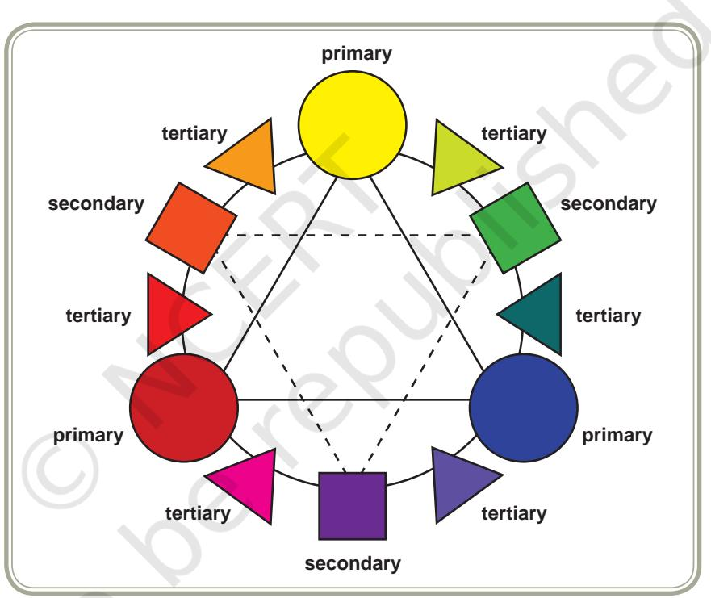
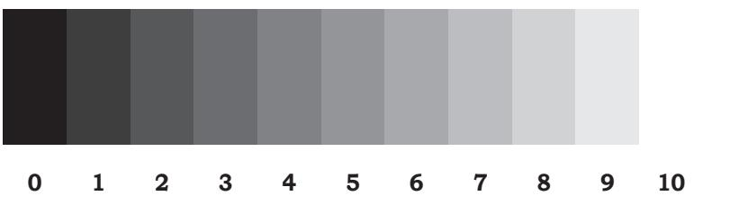
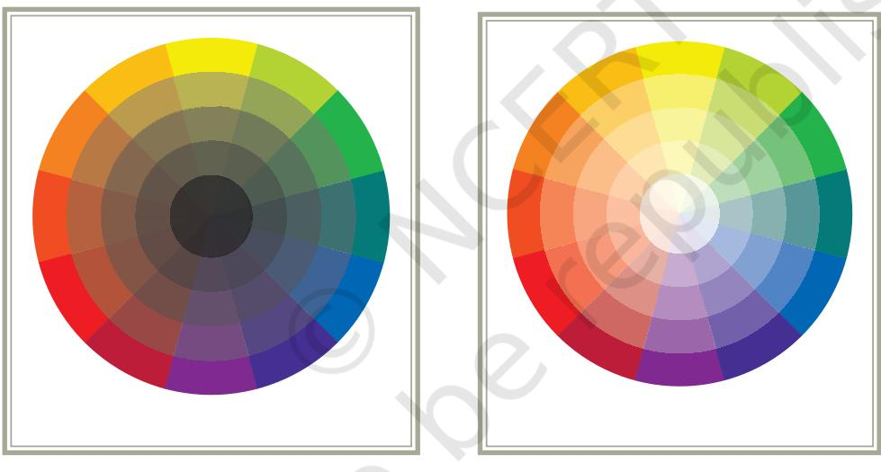
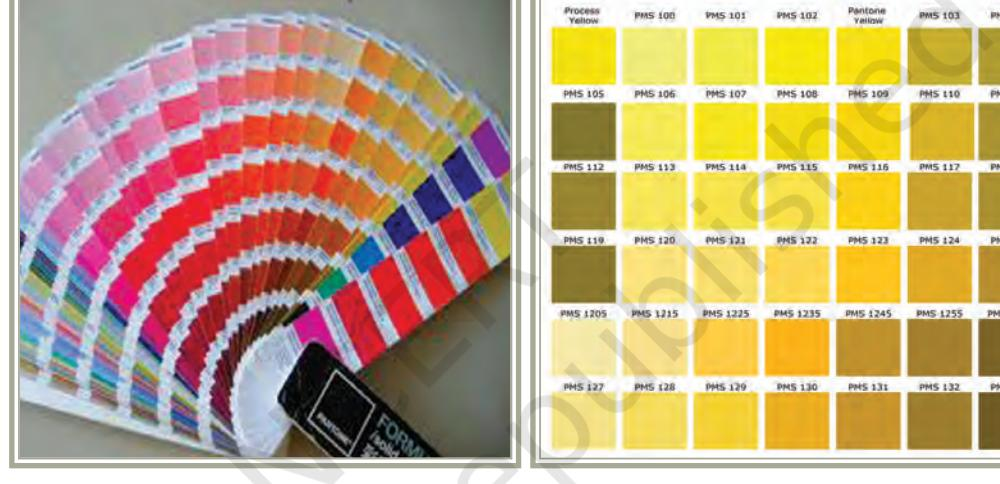
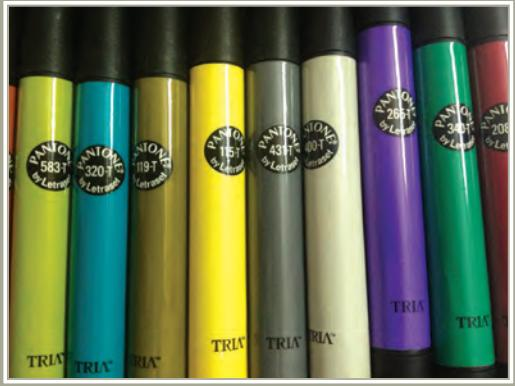
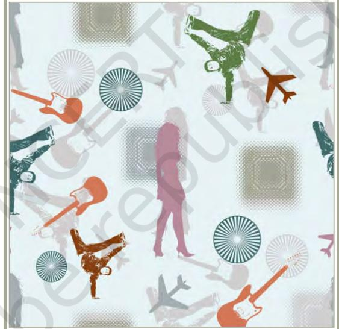
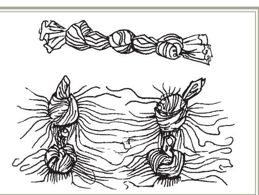
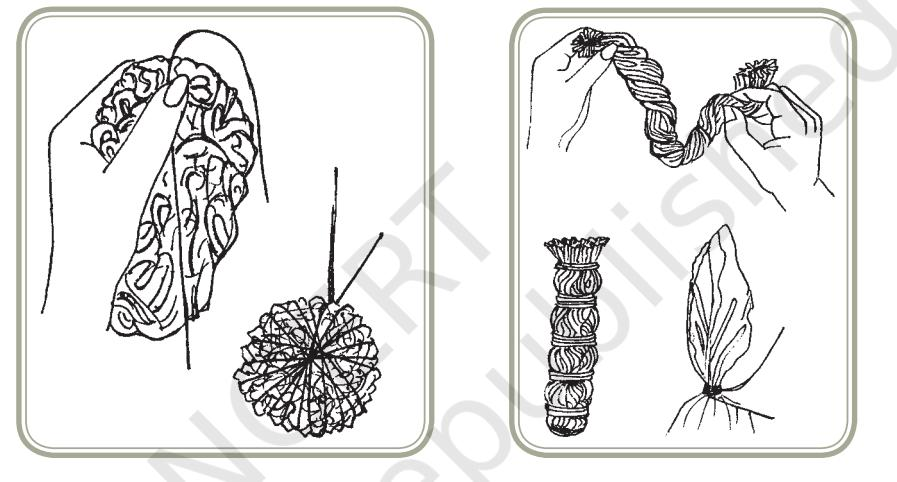
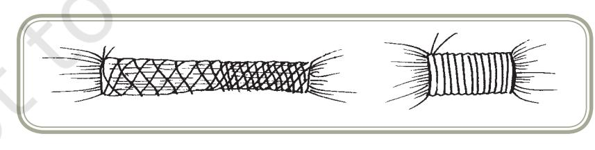
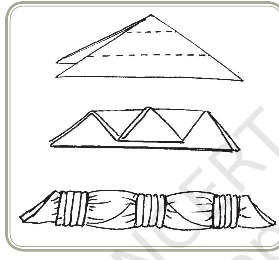

# **UNIT IV**

Unit IV - Fabric And Apparel

153

# FABRIC AND APPAREL

Chapters.indd 153 8/16/2022 12:28:32 PM

# Introduction

Textile materials are among the oldest materials known to the human world. Fabrics made from fibres like cotton, wool, linen and silk have been used from pre-historic times for apparel and household articles, and also for fishing and hunting nets, ropes, sails for ships, among others. To these lists of natural fibres, the last century saw the addition of manufactured and synthetic fibres. Textile materials have also provided a suitable medium for human creativity, producing items of arts and artifacts. These items are valued for their aesthetic appeal apart from their versatility of usage.

From your knowledge of Class XI, the various facets of Fabric and Apparel study you can recall:

- z Knowledge of basic textile materials and their properties, which make the selection suitable for the specific need and for their appropriate care and maintenance
- z Significance of clothing and apparel in terms of:
	- z social, psychological and economic aspects
	- z geographical, cultural and religious needs
	- z age and physical growth of the person
	- z purely aesthetic or decorative aspects
- z Appreciation of the rich heritage of Indian textiles and its importance to India's economy.

Let us now see how individuals with appropriate education can make careers in these areas. From the vast range of possible options, we will discuss some selected areas which are promising avenues for career development and/or entrepreneurial ventures, which are therefore gaining importance in formal study. Foremost in this section are those related to **Design.**

Design is a term commonly used to describe the appearance and appeal of any article. It may be used for the cut and style of a dress, or the colour and print of a fabric. However, it is not mere decoration. It is the planning and creation of an article for a specific purpose. You have learnt in the Class XI that the process of manufacturing and application of special treatments on all fibres have made it possible to have fabrics and materials suitable for specific use. This would be a good example of Textile Designing.

Chapters.indd 154 8/16/2022 12:28:32 PM

Clothes are an important part of our life. They become part of our memories as we remember some of our special occasions by what we were wearing. Over a period of time we develop a special style. Very often we look for a designer who can provide us that consistent look and also adapt current trends. They are referred to as Fashion Designers.

The areas that are discussed in this Unit are:

- z Design in Fabric and Apparel—Understanding the Fundamentals of Design
- z Fashion Design and Merchandising—The design industry is a vibrant, varied and dynamic creative sector that plays a powerful and important role in many areas of our lives. Fashion design as a subject can introduce and prepare students to know how the fashion business operates and what to expect while working in it.
- z Production and Quality Control in the Garment Industry—The Garment Industry of India is an important part of Indian economy. It provides an increasing avenue of jobs in view of the popularity and wider usage of technology in this field.
- z Conservation of textile products, particularly in Museums which are resource centres for revival and preservation of heritage, for reproduction and development and for creating awareness.
- z Care and Maintenance of Fabrics in Institutions—This provides opportunities for entrepreneurship and professional enterprises, be it services rendered at the domestic/household level through commercial laundries to special care of fabrics in institutions included in the hospital and hospitality sectors.

The subject of Fabric and Apparel has been part of all erstwhile Home Science courses. In different Universities and colleges, it is referred to by different nomenclatures like Textiles and Clothing or Clothing and Textiles, Textiles and Fashion Study or Fashion and Textile Science, Textile Science and Apparel Design. These courses are taught as after-school-courses, as degree programmes / diplomas in Home Science Colleges, Polytechnics teaching Textile Design and Fashion Design, and Art and Design Institutes. There is also in-house training in many institutes catering to special vocations and professions at all levels. Each of these institutes may focus on a specific aspect. Home Science Colleges which offer P.G. degrees attempt to give a more comprehensive knowledge covering all aspects.

155

Chapters.indd 155 8/16/2022 12:28:32 PM

# Note for the Teachers

- z The schools should have a fabric library, which has additions regularly. The fabrics collected would be the common ones, purchased from the local market, so that the students identify with them.
- z Outside sources to be included are brochures, advertisement leaflets, pattern books and the latest information from internet.
- z Brain storming with students prior to activities would bring in better flow of ideas.
- z In practicals, demonstration by the teacher is very necessary.
- z If possible some field trips should be organised exhibitions, artisans at work, museums, garment production unit (even if it is at small level).

156

Chapters.indd 156 8/16/2022 12:28:32 PM

Design for Fabric and Apparel

Chapter

8

# Learning Objectives

After completing this section the learner will be able to:

- z discuss the concepts of design
- z recognise the elements that constitute design
- z explain the application of design principles for fabric and apparel
- z discuss how a student can prepare for a career in the field.

# Introduction

The word 'design' is a popular contemporary term which has different connotations and meanings assigned to it. Very often it is used for high fashion dress and its accessories. In fabrics it is associated with the colour scheme, or more specifically, the print on it. However, it does not give the complete picture. Design is not mere decoration. The most aesthetically pleasing object cannot be considered well designed if it is not functional or not appropriate to its usage. Design has several meanings. In the broadest sense, it can be described as harmony in form. The most important aspect of design, however, lies in the meaning and use of the designers' creative urge and expression and therefore, the greatest harmony is achieved only when the aesthetic aspect of *good design* is truly integrated with the utility of the object which has been created. Thus, we can say that "Design is the

Chapters.indd 157 8/16/2022 12:28:32 PM

157

human power to conceive, plan, and realise products that serve human beings in the accomplishment of any individual or collective purpose." A good design is more than aesthetically pleasing. It is the right use of materials to give what people expect in price, colour and service.

# Basic Concepts

*Design Analysis***:** Design is an arrangement according to a plan for creation of a desired object. It goes one step further than the functional part of planning and produces a result which gives aesthetic satisfaction. It is studied in two aspects, viz. *Structural* and *Applied.*

*Structural* design is that which depends on form and not superimposed ornamentation. In fabric production, it takes into account the basic processing of fibre, types of fibres and yarns, variations of weaving, knitting etc. and the stages at which colour is added. In dress, it refers to the basic cut or silhouette of the garment. *Applied* design is the part of the design which has been super imposed on the basic structure. On fabric finishes, dyeing and printing, embroidery and fancy needle-work can change the appearance. On garments, it includes trims and notions (fasteners) which add to the value of the final product. Fabric Design and Dress Design are as much an Art as Architecture, Painting or Sculpture, thus the same Grammar of Art is applicable.

Design consists of two main factors: *Elements and Principles.*

*Elements of Design* are the tools of the Art. These are colour, texture, and line, shape or form. The elements of design are manipulated to create harmony, balance, rhythm, proportion and emphasis. These are the *Principles of Design.* 

# Elements of Design

*Colour:* Colour is all around us in many forms. It is one of the most important aspects of all textile materials — be it for apparel, household, commercial or institutional use. The identity of the product is most often attributed to colour. Everyone responds to colour and has definite preferences. Colour reflects the season, events and the spirit of people. The choice is affected by culture, tradition, climate, season, occasion or purely personal reason. Colour is an important part of Fashion. Designers carefully choose fabric colours to make a definite statement.

Chapters.indd 158 8/16/2022 12:28:32 PM

*Colour Theory:* Colour can be defined as reflection of light striking the surface of an object. It is the visual sensation resulting from reflection of visible light rays that strike the retina and stimulate cells in the nerves of the eye. The nerves send a message to the brain, which produces a sensation of a specific kind, and we see colour. The colour that is observed by the brain is dependent on the particular wave length or combination of wave lengths of the light source. To see colour on any material, light must be reflected from the object to be seen by the eye. When all light rays are reflected, the object appears white; when none are reflected it is black.

#### **Understanding Colour**

Study of colour is dependent on light. Light is a form of radiant energy and forms a part of electro-magnetic radiation spectrum. Sunlight is the radiant energy reaching the Earth from Sun by light waves. Light falling on raindrops are scattered to produce the spectrum of seven colours —VIBGYOR (Violet, Indigo, Blue, Green, Yellow, Orange and Red). Sunlight rays are thus composed of these seven visible colours along with ultra-violet and infra-red rays.

Light rays of short wavelengths are grouped as *receding or restful colours* — green, blue green, blue and purple. Longer wave lengths have red orange and yellow, which are *advancing or stimulating colours*. Because light is composed of different wavelengths, colour is seen in different values and intensities.

Colour is specified in three aspects: *Hue, Value and Intensity or Chroma.*

*Hue* is the common name of the colour. Spectrum specifies the seven colours as VIBGYOR. To understand colour from a design point of view, reference is made to the Munsell's Colour Wheel. This divides colours as;

- z *Primary* colours : These cannot be produced by mixing any other colour. These are red, yellow and blue (refer circles in the Fig.11.1).
- z *Secondary* colours : These are made by mixing two primary colours orange, green and violet (squares in the Fig.11.1).

Chapters.indd 159 8/16/2022 12:28:32 PM

- z *Tertiary or intermediates:* These are made by mixing one primary and one secondary colour, lying adjacent to each other on the colour wheel. Thus we have red-orange, yellow-orange, yellow-green, blue-green, blue-purple and red-purple (the small triangles in the Fig. 11.1).
Apart from these there are the groups known as *neutral* colours such as white, black, grey, silver and metallics. These are called *achromatics,*  i.e., colours without colour.

The common colour wheel shows colours in their purest form and fullest intensity.

*Fig. 11.1: Colour Wheel*

*Value* describes lightness or darkness of a hue, which is referred to as *tint or shade.* White has maximum value, while black has the least. Grey Scale and Value Chart are 11 (0–10) grades scale for judging value. It shows 0 for black, 10 for white and 5 as the mid value for grey or hue. When the hue approaches white, it is a tint; when it approaches black it is a shade. Grey Scale also helps us to judge the equivalent value of any hue.

Chapters.indd 160 8/16/2022 12:28:32 PM

| BLACK |  |  |  |  | GREY |  |  |  |  | WHITE |
| --- | --- | --- | --- | --- | --- | --- | --- | --- | --- | --- |
| 0 S | 1 H | 2 A | 3 D | 4 E | 5 HUE | 6 T | 7 I | 8 N | 9 T | 10 S |

*Shades (0 – 5) Dark Value Tints (10–5) Light Value*

*Fig. 11.3: Colour Shades & Tints*

*Chroma or intensity* is the brightness or purity of colour. Dullness results when the colour is blended with other colour, specifically with the colour opposite to it on colour wheel.

*Recognising colour* : Most of us with normal eyesight are able to distinguish between values and intensities of different hues and give them names (e.g., brick red, blood red, tomato red, ruby red, carrot red, etc.). Colour names are derived from natural sources—flowers, trees, woods; food, fruits, vegetables, spices; birds, animals, fur; stones and metals,

Chapters.indd 161 8/16/2022 12:28:39 PM

Human Ecology and Family Sciences – Part 2 minerals earth; pigments and paints; among many others. In each group you may be able to see reds and pinks, yellows and orange, purples and violet, blues, greens, browns and greys. Names often have regional flavour. Thus a name of one area may not mean the same to the people of another area. In today's world, when there is international trade in a large number of goods, (especially Textile Products) a system of using numbers along with names has been devised. The *Pantone* Shade Card shows (Fig. 11.4) all possible hues, tints and shades in varying intensities. Each has been given a code number, which is recognised internationally. This helps in Fashion Forecasting and when orders for products are given in foreign lands.

*Fig. 11.4: Pantone Shade Card Fig. 11.5: Pantone Color Chart*

*(for a specific order)*

*Colour in Fabric:* Colour can be seen in fabrics in various design forms. We see fabrics which have uniform one solid colour, others where the colour seems to follow the yarn interlacing and still others may have colour in any shape. Stages of fabric production when colour is added give a vast range of designs.

- z Dyeing is very rarely done at the *Fibre stage*, because it proves to be the most

*Fig. 11.6: Pantone colours in pens*

expensive process. However it is resorted to for some manufactured fibres which are not easily dyed or if the design requirement is for a yarn with multicoloured fibres.

Chapters.indd 162 8/16/2022 12:28:40 PM

- z Dyeing done at *Yarn stage* helps to create multifarious designs. Woven stripes, checks, plaids, or even simple chambrays are common designs produced. Brocade and Jacquard patterning is produced by weaving dyed yarns. When yarns are tie-dyed it results in beautiful *Ikat* patterns.
- z Dyeing at *Fabric stage* is the most common method. It may be done to produce simple single coloured fabrics and also as designed materials through tie and batik.
- z Colour can also be added at the fabric stage by painting, printing, embroidery and patch or appliqué work. Here the colour application can be in any shape and form.

Textile designers need to have a sound knowledge of the dyeing properties of different fibres and fabrics. Depending upon the requirements of the final product, they decide the stage and technique of colour application.

#### *Colour Schemes or Colour Harmonies*

Certain basic colour schemes are used as guides for combining colours. A colour scheme merely suggests the hues that can be combined; the values and intensities of the hue and the quantities of each to be used are the decisions taken by the designer or the consumer. Colour schemes are best studied with reference to the Colour Wheel.

*Colour Schemes* can be discussed in two groups: Related and Contrasting

*Related* schemes have at least one hue in common. These are:

- z *Monochromatic harmony* which means a harmony based on one hue. This single hue may be varied in value and/or intensity.
- z *Achromatic harmony* uses only neutrals such as a combination of black and white.
- z *Accented neutral* utilises one hue and a neutral or an achromatic colour.
- z *Analogous harmony* refers to a color combination using two or three hues that lie side by side on the colour wheel. Use of four or more hues may create a jumble unless each one is in very small quantity.

*Contrasting* schemes can be the following:

- z *Complementary harmony* refers to a harmony using two hues that lie directly opposite to one another on the Colour Wheel.
- z *Double complementary* has two pairs of complements, generally neighbours on the Colour Wheel.

163

Chapters.indd 163 8/16/2022 12:28:40 PM

- z *Split complementary* harmony is a three color combination utilising a hue, its complement (directly across on the Colour Wheel) and neighbor. It may also use a hue and two neighbors of its complement.
- z *Analogous complementary* is a combination of analogous and complementary schemes, a complement selected for dominance in a group of neighbouring colours.
- z *Triadic Harmony* is a combination of three hues that lie equidistant from one another on the Colour Wheel.

#### **Activity 1**

Collect samples of fabric, printed paper, illustrations of dresses, illustrations of interiors of rooms etc. Analyse the colour harmonies, specifying hue, value and intensity.

*Texture:* Texture is the sensory impression of sight and touch and refers to the tactile and visual qualities of the material. Each material has a distinctive texture (whether textile or otherwise). Texture can be described in terms of —

*How it looks* — shiny, dull, opaque, dense, transparent, translucent, glossy;

*How it behaves* — hangs limp, stiff, sticking out, clinging, flowing out;

*How it feels* — soft, crisp, harsh, smooth, rough, coarse, grainy, pebbly.

In the chapter 'Fabrics Around Us' of the Class XI book, we learnt that it is mainly the textile materials that bring texture in our daily life. You may also recall the factors which determine the texture in textile materials. These can be summarised as —

- z Fibre content fibre type (natural or man-made), its length and fineness and its surface characteristics;
- z Yarn processing and yarn type method of processing, twist inserted during processing, fineness of the yarn and yarn type (simple, complex, novelty or textured);
- z Fabric construction technique weaving (type of weave and its compactness), knitting, felting, braiding, lace-making etc.;
- z Fabric finishes stiffening (starching, sizing or gumming), ironing, calendaring and tentering, napping, fulling;
- z Surface ornamentation tufting, flock printing, embroidery, and stitched effects.

Chapters.indd 164 8/16/2022 12:28:40 PM

The main purpose of texture in dress design is to create interest and to enhance the desirable features of the person. Textures used should have a pleasing relationship to each other to achieve harmony. In dress, the texture used should be appropriate to figure, personal characteristics, silhouette or form of costume, and occasion.

#### **Activity 2**

Collect samples of textile materials showing different textures. Try to describe their texture in suitable terms (shiny, stiff, smooth, etc.) Analyse the factors due to which the texture has been achieved.

#### **Note for the Teacher**

Supplementary classroom material can include different textile products, types of wood, stones, minerals, metals, sand, etc., to be used for touch and visual characteristics.

#### *Line*

Line is defined as a mark that connects two points; it has a beginning and an end. It can also be formed as the outline of an object, shape or form. Line is used to define the shape or different parts of a silhouette of a design. As an element of design it indicates the shape of things, provides movement and determines direction. Line and shape are two elements, which together create the pattern or plan of every design. Every decorative detail on all articles we see or use is a combination of lines and shapes.

*Types of Line:* There are two basic types of line — the straight line and the curved line.

*Straight Lines*: The straight line is a rigid unbroken line. Straight lines create different effects depending on their direction. They can also express mood.

- z Vertical lines stress up and down movement, emphasise height and give the effect that is severe, dignified and reserved.
- z Horizontal lines stress side to side movement and create a illusion of width. Since they repeat the ground line, they give a stable and placid effect.
- z Oblique or diagonal lines increase or decrease width and height depending on the degree and direction of angle. They can create an active, startling or dramatic effect.

165

Chapters.indd 165 8/16/2022 12:28:40 PM

*Curved Lines*: The curved line is one with any degree of roundness. The curved line can be a simple arc or a complicated free hand curve. The degree of roundness determines the curve. A slight degree of roundness is called a restrained curve; a great degree of roundness gives a circular curve. Certain objects are associated with these curves and named as such, for example, parabola, scroll, meander, hairpin, whiplash, or serpentine, figure of 8, ogee, etc.

*Patterns:* A pattern is formed when shapes are grouped together. This grouping may be all of one shape or a combination of two or more types of shapes. The arrangement of these shapes can also be natural, stylised,

The development of a successful design depends on the understanding of basic design principles. Principles of design are the rules that govern how design elements are mixed in the most appropriate way. These include proportion, balance, emphasis, rhythm and harmony. Although each principle is a separate entity, combining them successfully produces an

*Proportion:* Proportion concerns the relation of one part of an object to another. A good design does not permit easy dissection. The elements are so skillfully blended that where one leaves off and the other one begins is not really apparent. This relationship may be created in size, color, shape and texture. All these need to be pleasingly related to each other and to the whole. This is generally based on the proportion of golden mean which is represented by ratios like 3:5:8 to 5:8:13 and so on. The smaller part 3 has the same relationship to the larger part 5 as the larger part 5 has to the whole 8. The garment is horizontally divided into 3:5, 5:8 or 8:13 section. These sections appear at the waist line, yoke and hemline. A dress appears pleasing if the blouse, skirt and total body represents the ratio of 3:5:8.

For example, in a skirt and blouse dress, the blouse represents 3, the skirt should represent 5, and combined effect represents 8; similarly, in a shirt-pant dress, the shirt should represent 5 and pant should represent

*Proportion of colour*: Different colours can be worn as shirt and pant to

*Proportion of texture*: This is achieved when various textures of material used for making a dress increase or decrease the size of the person wearing the garment e.g., heavy and bulky textures appear overpowering on a thin

*Proportion of shape and form*: The size and positioning of motifs or print in a dress are in proportion to the size of the wearer. Width of the figure, length of waist or torso, length of legs may differ from the classic ideal figure. Clothing modifies the figure and creates proportion in awkward body proportions in a pleasing way. For example, a high waist bodice used in maternity clothes camouflages the fullness of the abdomen.

geometric or abstract.

appealing product.

and petite person.

Principles of Design

8 and combined effect created is 13.

create proportion of colour by using the golden mean.

- z Long and flowing curved lines appear most graceful and rhythmic.
- z Large rounded curves lend a dramatic touch and tend to exaggerate size.
- z Tiny, puffy curves are youthful and gay.

Line expresses visual meaning; straight lines indicate force, strength and rigidity, whereas, curved lines appear soft and graceful when used in design. If straight lines are more dominant, the design effect is masculine. Curved lines give the impression of feminity and daintiness.

*Shapes or Forms:* These are made by connecting lines. Shapes can be two dimensional, as a drawing or a print on paper or fabric. They can be three dimensional as an object that can be viewed from three or more sides, like a human body or the garments on it. Since shapes are formed by connecting lines, the characteristics of the lines used will determine the characteristics of the shape. If only straight lines are used the shape will be different than if only curved lines are used. By using different types of lines in different combinations, numerous varieties of shapes can be created. There are four basic groups of shapes:

- z *Natural shapes* are those that copy nature or common shapes of man-made objects.
- z *Stylised shapes* are simplified or modified natural shapes. They may have some part distorted or exaggerated.
- z *Geometric shapes* are those that can be mathematically formed, or gives a similar impression. They can be formed by using rulers, compasses, or other measuring instruments.
- z *Abstract shapes* are free-form. They do not resemble any specific object but, may represent different things to different people because of personal association.

Shape and form in fabric refer to the fall or drape of the material; to the shape of ornamentation and motifs; and the type of placement or repeat i.e. the final pattern formation. In apparel it represents the silhouette, cut, and final detailing.

166

Chapters.indd 166 8/16/2022 12:28:40 PM

*Patterns:* A pattern is formed when shapes are grouped together. This grouping may be all of one shape or a combination of two or more types of shapes. The arrangement of these shapes can also be natural, stylised, geometric or abstract.

# Principles of Design

The development of a successful design depends on the understanding of basic design principles. Principles of design are the rules that govern how design elements are mixed in the most appropriate way. These include proportion, balance, emphasis, rhythm and harmony. Although each principle is a separate entity, combining them successfully produces an appealing product.

*Proportion:* Proportion concerns the relation of one part of an object to another. A good design does not permit easy dissection. The elements are so skillfully blended that where one leaves off and the other one begins is not really apparent. This relationship may be created in size, color, shape and texture. All these need to be pleasingly related to each other and to the whole. This is generally based on the proportion of golden mean which is represented by ratios like 3:5:8 to 5:8:13 and so on. The smaller part 3 has the same relationship to the larger part 5 as the larger part 5 has to the whole 8. The garment is horizontally divided into 3:5, 5:8 or 8:13 section. These sections appear at the waist line, yoke and hemline. A dress appears pleasing if the blouse, skirt and total body represents the ratio of 3:5:8.

For example, in a skirt and blouse dress, the blouse represents 3, the skirt should represent 5, and combined effect represents 8; similarly, in a shirt-pant dress, the shirt should represent 5 and pant should represent 8 and combined effect created is 13.

*Proportion of colour*: Different colours can be worn as shirt and pant to create proportion of colour by using the golden mean.

*Proportion of texture*: This is achieved when various textures of material used for making a dress increase or decrease the size of the person wearing the garment e.g., heavy and bulky textures appear overpowering on a thin and petite person.

*Proportion of shape and form*: The size and positioning of motifs or print in a dress are in proportion to the size of the wearer. Width of the figure, length of waist or torso, length of legs may differ from the classic ideal figure. Clothing modifies the figure and creates proportion in awkward body proportions in a pleasing way. For example, a high waist bodice used in maternity clothes camouflages the fullness of the abdomen.

167

Chapters.indd 167 8/16/2022 12:28:40 PM

Equal divisions make a person look shorter and wider, whereas unequal horizontal division makes a person look slimmer.

*Balance***:** It is defined as equalling the distribution of weight from the central point of the garment. A garment needs to be balanced both vertically (from centre line) and horizontally (from top to bottom). It can be achieved in three ways—formal, informal and radial. The elements of design—line, form, color, texture—all are considered while creating a balance in a dress.

*Formal Balance*: An average human body is symmetrical, which means the body appears to be the same on each side of a central vertical line. Two arms, two eyes, two legs are seen on either side of the central axis; but actually slight differences still occur. If the body differs noticeably on one side, carefully designed clothes can minimise the difference. Formal vertical balance is the least expensive and most expected type of design, found on less expensive garments. Formal balance gives a feeling of stability, dignity and formality but tends to get monotonous. *Horizontal Balance* is basically used to correct figure problems by using various elements of design, for example, dark hue for big size.

*Emphasis:* The emphasis or focal point of the garment is the area that first attracts the viewer's eye. It adds interest to the garment and may be created by the use of colour, design lines, detailing or accessories. Emphasis creates centers of interest by focussing the viewers' attention on a specific area of the garment. Details that focus on the face are particularly effective because the face is the focal point of beauty in our culture. A beautiful embroidered yoke or a contrasting colour blouse further emphasises the face. People with figure problems can emphasise or camouflage their figure problems for example, woman with small waist can wear a bright and contrasting belt to emphasise the positive part of her figure, whereas a woman with large hips, wearing a hip belt or other design details at the hip area would highlight it further. Emphasis can be created by using contrasting colours, different unusual shapes, lines and textures.

*Rhythm:* Rhythm is repeating of lines, colours, other elements of design or details to create a pattern by which the eye can flow through the material or article/garment. Rhythm can be created by use of lines, shapes, colours and textures in such a way that it gives visual unity. It can be created by:

- z Repetition of embroidery laces, buttons piping, colour, etc. at necklines, sleeves and hemlines.
- z Cordation by gradual increase or decrease in size of motifs, lines, buttons, colours and textures.

Chapters.indd 168 8/16/2022 12:28:40 PM

- z Radiation where eyes move in an organised way from a central point e.g., gathers in waist, yolk or cuffs, etc.
- z Parallelism where elements lie parallel to each other e.g., tucks in a yoke or knife pleats in a skirt. Bands of colour also create a rhythm effect in a dress.

*Harmony:* Harmony or unity is created when all elements of design come together to give a pleasing harmonious effect. It is a critical factor in producing marketable (publicly acceptable) designs. *Harmony by shape* is created when all areas of a garment reflect the same shape. The collar, cuff and hem are curved and it square pockets are given they would interrupt the continuity of the design. Harmony by texture can be created by using the right kind of texture for a dress when dress is in several pieces as in salwar kurta and dupatta. A silk kurta and salwar will show bad harmony by use of cotton dupatta.

*Composition:* A composition is defined as an artwork or concept developed by the arrangement or placement of elements of design and applying principles of designs in the best possible way in a given space. To create a composition, the creator can select two or three principles of designs befitting best to the requirement of the final artwork and good visual appeal. In other words, it's a play of elements of design in a given space which can be 2-Dimensional or 3-Dimensional.

*Fig. 11.7: Composition*

# **Preparing for a career**

The field of Design for Fabric and Apparel has expanded and has become so vast that it can actually be considered as two specialisations. Fabric has found usage in numerous things other than apparel and household; and apparel is using material other than just fabric. Each use has specific requirements in terms of appearance and durability, and the cost allocations. The fabric designer, thus, has to have a thorough knowledge of fibre characteristics, its advantages and limitations and its processing,

169

Chapters.indd 169 8/16/2022 12:28:40 PM

which can help achieve the desired results. He/she must have a sound knowledge of the dyeing properties of different fibres and fabrics. Depending upon the requirements of the final product, he/she decides the stage and technique of colour application. He/she also understands the principles of design.

Various institutes offer both long and short term courses leading to a certificate, a diploma, an associate, or a bachelors degree in this field. Your choice depends upon a number of factors that take into consideration the unique qualities of each degree programme.

# Scope

Design industry is a vibrant, varied and dynamic creative sector that plays a powerful and important role in several areas of our lives. Working in textile or fabric design demands awareness of the changing trends and styles and an ability to produce designs that are fresh, current or even ahead of the fashion curve. Textile designs for apparel fashion tend to have a quicker turnaround than designs for furnishing. Textile designers work in industry— researching and producing designs for textiles companies or fashion houses, but they might also work for a design agency or as freelancers.

# **Key Terms**

Design, structural and applied design, elements of design, colour, texture, line form/shape and pattern, principles of design, harmony, proportion, rhythm, balance, emphasis, hue, value, intensity, spectrum, VIBGYOR

## **Review questions**

- 1. What do you understand by the term 'design'?
- 2. What are the factors that affect the texture of a fabric during its manufacture?
- 3. How does the application of colour during the different stages of fabric manufacture affect the design in fabric?
- 4. What are the different types of lines and shapes? How do they create different effects and moods?
- 5. How do you achieve rhythm and harmony in dress?

Chapters.indd 170 8/16/2022 12:28:40 PM

# **Practical 1**

| Theme: | Preparation of articles using applied textile design technique |
| --- | --- |
|  | (Tie and Dye) |
| Task: | Learning to draw the different techniques of tie and dye |

**Theory:** The oldest form of designing with colour is resist dyeing. The resist material could be thread, pieces of fabric, or substances such as clay and wax that offer physical resistance. The most common method of resist is tying with thread. **Tie and dye** is the name of a technique in which the areas to be in pattern are resisted by means of tightly wound thread. When dipped into dye, the resisted areas retain the original colour of the ground. You may recall from Class XI, *Bandhani, chunari, laheria* are some of the names of materials in which the pattern is created by tie-dyeing the fabric after it is woven. A typical tie and dye design is *bandhej* where the patterns comprise of innumerable dots; another is the *laheria* type where the pattern is in the form of diagonal stripes. Gujarat and Rajasthan are the homes of this type of fabrics.

#### **Purpose**

- 1. To learn the concept of tie and dye
- 2. To learn the process of tie and dye through various techniques
- 3. Eye and hand coordination
- 4. Understand curves and shades on the patterns.

#### **Conducting the Practical**

Observe the different shapes of leaves and flowers in nature. Draw them with pencil by observing. Shade them with different shadows to create depth.

As a modern day craft, numerous techniques of tying are employed to get variegated effects. Resist can be offered by using threads of different thicknesses, or by the material itself through knotting, crumpling or folding and then tying over it. Some of the techniques are described below:

*Knotting:* It is one of the easiest and quickest ways of producing *Fig. 11.8: Knotting*

171

Chapters.indd 171 8/16/2022 12:28:40 PM

the design. Knots can be tied in several ways depending on the size, shape and grain of the fabric. The best results are achieved on fine fabric. It creates shaded circular patterns.

*Marbling:* This effect can be achieved in two ways. The material is gathered and turned into a ball and tied in all directions until it becomes solid mass. The fabric can also be twisted and coiled length wise and tied to create marbling effect. This method gives variegated and irregular cloud like effects. It is thereafter generally dyed in light colours, and may be repeated in two or more colours. It helps to create a multicoloured background, which can later be tie-dyed in a more definite pattern.

*Fig. 11.9: Making a Ball Fig. 11.10: Coiling*

*Binding:* Certain parts of fabric are bound very tightly with thread before dyeing. Binding can be done in the form of a dot, a band, line, criss-cross or spiral. Designs are like stripes — straight or diagonal *(lehria)*, circles or spots *(bandhej).*

*Fig. 11.11: Binding*

*Tritik or sewing:* The fabric is sewn with a needle using simple tacking stitches along a definite pattern. A strong thread is used with a large knot in the beginning. It is pulled so that cloth is gathered closely; and finished

Chapters.indd 172 8/16/2022 12:28:41 PM

with a knot again to hold the gathers together. The patterns created are pleasing bands of dotted textures of various shapes.

*Folding:* The fabric is folded in different forms, like pleats, squares, triangles. To hold the folds together binding or clipping is done using thread or clips respectively. The pattern created is in the form of symmetrical stripes, bands, squares etc. Best effects are achieved on thick materials because the fabric itself forms the resist. These patterns can be later used as background for block printing and embroidery.

*Fig. 11.12: Folding*

In the class make the above designs on small samples of white cotton cloth.

After tying, dye the cloth by simple dyeing method.

### **Note**

Before tying the cloth, design the fabric by washing in hot soapy water so that the dye is absorbed evenly by the fabric.

173

Chapters.indd 173 8/16/2022 12:28:41 PM

**Theme:** Preparation of articles using applied textile design technique: **(Batik)**

**Task:** Learning the technique of Batik

**Theory:** Batik is a form of resist printing, where the resist is obtained by applying wax on the fabric in design. Dyeing is then carried out in cold to avoid melting of wax, thus confining the colouration to the unwaxed area. Further, selective application of wax and re-dyeing allows variety of colourings. The beauty of batik is to get cracks in the wax during dyeing and allowing colour to enter through these cracks.

# **Purpose**

- 1. To learn the concept of batik
- 2. To learn the process of batik by preparing an article

# **Conducting the Practical**

Make the fabric for batik totally free from dirt and grease. Then stretch it on a frame for ease in drawing of design and application of wax. Two main types of wax are used i.e. light, easily removed type essentially consisting of paraffin wax and a darker more adhesive type consisting essentially of bees wax. To get various types of cracks take both paraffin and bees wax in varied proportions

*Application of wax:* The most commonly used tools are brushes of various widths and sizes. The brushes should have natural hair bristles (not of nylon or thermoplastic substances). Apply wax onto the fabric with any of the following techniques/ methods.

- z Painting i.e. painting the design area with wax
- z Outlining i.e. painting the outline of the design/ motif with wax.
- z Dry brushing i.e. application with a flat brush, which is free of excess wax and carried along the design lines to give a shaded effect
- z Scratching i.e. covering a part of the fabric with wax and then scratching the design line with the back of a pin or brush.

Melt the wax in smell container and apply onto the material with brush in a pre-determined pattern using any of the above techniques. The wax should reach both sides of the material and may have to be applied both on the face and back of the fabric.

*Dyeing:* After the application of wax, dye the fabric. Dyeing is carried out by any of the dyes that are applied at temperatures below 35o C. The

Chapters.indd 174 8/16/2022 12:28:41 PM

174

dyes used are commonly known as ice colours or batik colours. Multiple colour effects are obtained by subsequent wax application/removal of wax and additional wax application and then dyeing in another colour.

*Removal of Wax:* Dry the fabric after dyeing. Fold and pack in water proof packet and freeze it. Remove and crush the frozen wax to reduce it to dust. Remove the remaining wax by hot pressing between layers of absorbent paper and finally soaping it at boil.

# **Practical 3**

| Theme: | Preparation of articles using applied textile design technique |
| --- | --- |
|  | (Block Printing) |
| Task: | Learning the technique of block printing and creating |
|  | patterns using blocks |

**Theory:** One of the oldest methods for application of design onto fabric is block printing. In block printing, a separate block is required for each different colour in the finished design. The blocks are constructed so that the design area is raised, and the background area, which is not to be printed, is carved away. The majority of the blocks are made of wood, but metal may be used to reinforce parts of the design. The blocks may have single motif patterns, border patterns or all-over patterns

#### **Purpose**

- 1. To learn the concept of block printing
- 2. To learn the process of block printing

#### **Conducting the practical**

Colours for fabric printing and wooden block printing are available in the market. Begin the process of printing with laying the fabric flat on a padded table which is covered with a protective sheet. Care must be taken to attach the fabric firmly to the table so that its movement during printing is prevented. Apply the dye paste in a uniform layer to the raised portion of the block, by lightly pressing the block in the printing tray containing the dye paste on a sponge base. Then press the block on the fabric surface with sufficient pressure to force the colour into the fabric. When using multicoloured blocks, start printing with the outline block in the darkest colour and then print with the filling blocks in lighter colours.

Leave the fabric to dry. Later hot press it from the wrong side.

175

Chapters.indd 175 8/16/2022 12:28:41 PM

