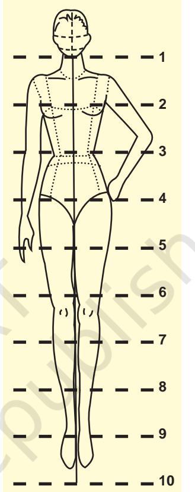

# Fashion Design and Merchandising

## Learning Objectives

After completing this section the learner will be able to:

- z explain the significance of fashion design and merchandising in garment industry
- z describe the fundamentals of fashion
- z explain the knowledge and skills required to be in fashion business
- z discuss how a student can prepare for a career in fashion industry

## Introduction

176

Fashion design and merchandising are among the most exciting career options in today's world. In a country like India, where textile industries have been thriving for ages, the recent boom in fashion designing has led to new prospects in the existing domain of garment and accessory design. The fashion industry satisfies both the creative urge and the materialistic needs of people. You hear the term Fashion merchandising many times. Did you ever think what goes into it? Let us understand merchandising from its origin. You can recall from your early history lessons that barter of products and crafts was the start of trading practices. Slowly trading moved to 'what was available was saleable', so there were no complications

Chapters.indd 176 8/16/2022 12:28:41 PM

in distribution system. However, the year 1920 gave birth to 'ready-to- wear' and soon retailers realised that sale of such garments was big business. In a very short span of time, fashion apparel became the most important type of merchandise in department stores. As a result of the economic opportunities of fashion, a new specialisation came into being — Fashion merchandising.

## **Significance**

Fashion design and merchandising will enable you to understand how the fashion business works. It includes all the processes involved with producing raw material, apparel and accessories, and the retail stores that sell fashion merchandise to the public. It is a part of the fashion business where you also learn about textiles (fabrics and the fibers used to make

them). Fashion merchandising equips to first respond to what, why and when a style becomes a fashion, and then helps to determine its suitability for the particular retail operation and for what length of time. So simply put, it encompasses 'planning, buying and selling'.

#### **Did You Know?**

*Women did not start wearing jeans until the 1950s.*

### Basic concepts

Fashion today is a big business employing millions of people in design, manufacturing, distribution, marketing, retailing, advertising, communications, publishing and consulting. To understand fashion design, one needs to understand the nature of fashion and how it works. The fundamentals of fashion and the relationships between fashion and the factors that affect it are also essential concepts to be understood.

#### **FASHION TERMINOLOGY**

Fashion is a complex subject and certain words and phrases are often used to discuss various aspects of fashion. These should be understood in order to understand the concepts of fashion industry. These include —

- z **Fashion** is the style or styles most popular at a given time.
- z **Style** is any particular look or characteristic in apparel or accessories. A style may come and go in fashion but the specific style always remains.

177

Chapters.indd 177 8/16/2022 12:28:41 PM

- z **Fads** or short lived fashions, can come and go in a single season. They lack the design strength to hold consumer attention for long. For example, hot pants, baggy pants and unmatched buttons.
- z **Classic** or styles that never become completely obsolete, but instead remain more or less accepted for an extended period. Classic is characterised by simplicity of design, which keeps it from being easily dated. Examples of classics include blazer jackets, polo shirts, and Chanel suit.

## FASHION DEVELOPMENT

To understand the working of the fashion industry, one has to have knowledge of Fashion Fundamentals. First in the sequence is to know how the fashion business developed. Thus the history of fashion helps the designers to make decisions for the present day and future fashions. Ideas from the past are often reinterpreted for today's fashion.

Fashion, as we know it, is relatively new. In ancient and medieval times, styles remained practically unchanged for a century at a time. During Renaissance, Western civilisation discovered different cultures, customs and costumes leading to acceleration in fashion change. With the availability of new fabrics and ideas, people yearned for more new things.

#### **FRANCE — THE CENTRE OF FASHION**

France's dominance over international fashion began in early 18th century.

Until Industrial Revolution, people belonged to two main classes: wealthy and poor. Only the wealthy could afford fashionable clothes. By the turn of 18th century, King Louis XIV's court members became the trendsetters of taste, making Paris the fashion capital of Europe. Many of the French cities were supplying the court with silk fabrics, ribbons and laces. At this time intricate seaming of fashion required painstaking hand sewing. All the clothes were hand made and custom made i.e. made to fit the customer's exact measurements.

France became the centre of fashion due to support from the royal court and the development of the silk industry there. *Couture* (koo-tour') was the term used for the art of dress making. A male designer was a *couturier* and his female counterpart was a *couturiere.* 

The Industrial Revolution marked the beginning of technological advances in textile and apparel production. Due to the developments more fabrics were produced in less time. During this time spinning jenny and power looms were invented. This gave rise to development of American textile

Chapters.indd 178 8/16/2022 12:28:41 PM

industry. Rapidly increasing trade and industry in return created a middle class with money to spend on the luxuries of life, including better clothing.

The invention of sewing machine turned the handcraft into an industry. This democratised fashion and made it accessible for everyone. In 1859, Issac Singer developed the foot treadle for the sewing machine which left the hands free to guide the fabric. An early use for sewing machines was to make Civil War uniforms.

In 1849, fabric intended for tents and wagon covers was used to make long wearing pants with pockets for tools by a young boy Levi Strauss. Later these became popular and were called denims. This was the beginning of clothes specially made for labourers. This is the only apparel that has remained same for the last nearly 150 years!

Women started wearing separate skirts and blouses in 1880s. This was a step towards manufacture of ready-to-wear clothes for women. Lengths and waistlines could be easily adjusted and this made it possible for the working class to add variety to their wardrobe simply by mixing separates.

By 19th century affordable fashions were made available to the general public through fairs and *bazaars*. The travelling merchants brought clothes to these markets, and both buyers and sellers usually bargained. As large number of people settled in towns, general stores were established to cater to their demands. With the growing demand for a variety of goods, retail stores grew in cities.

Prêt-à-porter (ready-to-wear) clothing lines were the first radical alternative to couture pieces when they hit boutiques in the 1960s. The term describes factory-made clothing that is sold in finished condition and in standardised sizes (as distinct from bespoke, made-to-measure haute couture). Yves Saint Laurent (YSL) is credited as being the first French haute couturier to come out with a full prêt-à-porter line.

#### **FASHION EVOLUTION**

*Fashion cycle —* Fashion moves in a cycle. The way in which fashion changes is described as a fashion cycle. The stages of fashion cycle include introduction, rise, culmination and then decline in acceptance of a style. It is represented by a bell shaped curve of time and sales.

*Fig. 12.1: Stages of fashion cycle* 

179

Chapters.indd 179 8/16/2022 12:28:41 PM

- z Introduction of a Style Designers interpret their research and creative ideas into apparel and then offer the new styles to the public. Designs are created by changing elements such as line, colour, shape, fabric and details, and their relationship to one another.
- z Increase in Popularity As the new fashion is purchased, worn and seen by many people, it may begin to rise in popularity.
- z Peak of Popularity When a fashion is at the height of its popularity, it may be in such demand that many manufacturers copy it or produce adaptations of it at different price levels.
- z Decline in Popularity Eventually so many copies are mass produced that fashion-conscious people tire of the style and begin to look for something new. These declining styles are put on sale racks in the retail stores.
- z Rejection of a Style or Obsolescence In the last phase of the fashion cycle, some consumers have already turned to new looks, thus beginning a new cycle.

## FASHION MERCHANDISING

Fashion merchandising refers to the planning required to have the right merchandise, at the right time, at the right place, at the right price and with the right sales promotion. If all these conditions are planned, one can achieve maximum profits.

**Fashion Merchandiser** is a person who facilitates conversion of inspiration into design, uses technology to conceptualise and address the planning, production, promotion and distribution of products in the fashion industry, to meet the needs and demands of a consumer.

To understand fashion merchandising well, it is important to examine the role that fashion merchandising plays in manufacturing, buying, promoting and selling fashion items. Let us examine the role of the fashion merchandiser in each of these aspects.

In *manufacturing***,** a fashion merchandiser makes significant input on the types of fabrics used to make a piece of clothing. Having a strong historical and socio-cultural understanding of the fabrics helps change a designer's vision into reality. By applying the knowledge about fabric and clothing construction, a fashion merchandiser takes a designer's piece and finds the best way to manufacture the item, at the same time taking things like price and target market into consideration.

180

Chapters.indd 180 8/16/2022 12:28:41 PM

*Buying* becomes part of fashion merchandising when a merchandiser buys fashion items to be presented in a store. A fashion merchandiser must be aware of the target market for the fashion item and also be very well-versed in fashion trend analysis and forecasting. This allows for more accurate ordering. A fashion merchandiser working with a designer will once again offer expertise to the designer on textiles and fabrics.

In the event that a fashion merchandiser is working for the designer, *promoting* the designer's product to stores that may want to buy large quantities is a number one priority role. Not only is the fashion merchandiser required to have a creative mind and strong visual merchandising skills, production skills must be sharp as well. Fashion merchandising promotes a designer's items through the use of fashion shows where creations and visual effects are exaggerated to capture the attention of potential buyers. Additionally, fashion merchandisers seek out the target market for a designer's clothing, such as children's clothing stores, department stores or discount retailers.

The final component of fashion merchandising is *selling*. A fashion merchandiser who works with a designer is responsible for selling fashion items to stores, which then sell to consumers. Again the merchandiser must have an idea about forecasting and market trends to give recommendations regarding production of the item. Creativity is important because a merchandiser must offer suggestions on how to display the items within the store. When a fashion merchandiser works for a retail store, responsibilities include buying and presenting fashion items within the store.

Merchandising takes place at several levels. In fashion industry there are *three* Levels of Merchandising

- z *Retail Organisation Merchandising*  It is a specialised management function within the fashion industry. It is the business that moves the fashion world from designers' showroom to retail sales floor and into the hands of consumers. It is achieved by the internal planning that takes place within a retail organisation. It ensures that adequate amount of merchandise are on hand and sold at prices that the consumers are willing to pay to ensure a profitable operation.
- z *Buying Agency Merchandising* provides services for goods buying consultancy. Buying agency acts as procurement office for the buyers. Selling through buying agencies is profitable for exporters as it helps in significant cost and time saving. The responsibility of the buying agent is to identify vendors, negotiate costs, check in-process quality, and perform pre-shipment quality inspection. They keep a regular control over quality during production process.

181

Chapters.indd 181 8/16/2022 12:28:41 PM

- z *Export House Merchandising* To understand this it is best to understand the role of a merchandiser in an export house. There are two types of merchandisers in an export house—the buyer merchandiser and the production merchandiser. The buyer merchandisers act as a link between the buyer and the manufacturer. They have the responsibility of ensuring that the product is developed as per the requirements of the buyer. So they have the responsibility of sourcing, sampling and communication with the buyer. The production merchants on the other hand, are a link between production and buyer merchants. They have the responsibility of ensuring that the production goes according to the schedule and requirements of the buyer.
Other concepts and requirements in fashion merchandising that one needs to understand are:

*Target Market* : It is defined as category of consumers one is targeting at for selling the product. It is essential to understand the target market as this will allow the sales department to focus on that category of consumers who are 'most likely' to purchase the offering. It is also to insure the highest return for the marketing/sales expenditures.

This can be done through *Market segmentation.* Market segmentation is a strategy that involves dividing a larger market into subsets of consumers who have common needs and applications for the goods and services offered in the market.

Market can be segmented in various ways—

**Demographic Segmentation** is on the basis of Population, Age, Sex, Occupation, Education and Income.

**Geographic Segmentation** is on the basis of cities, states and regions. Climate of various places may vary and it plays an important role as choice of merchandise, especially as selection of clothes is climate dependent.

**Psychographic Segmentation** is on the basis of lifestyle like social activities, interests, leisure pursuits, needs and wants. People having similar lifestyles can make up a target market group.

**Behavioural Segmentation** is on the basis of opinion on specific products or services. Many times rating of usage of products and services is done. This helps in improving the service/product and make it different from others.

As a merchandiser one needs to interpret consumer demand also. There is a need to understand what customers' buying motivations are.

Chapters.indd 182 8/16/2022 12:28:41 PM

182

#### **Merchandising Rights**

*Right Merchandise:* Retailers must fill their shelves with the merchandise that the customer wants.

*At Right Place:* The location of the merchandise is of prime importance since it decides accessibility.

*At Right Time:* Much merchandise is seasonal in nature and must be on hand when it is most needed.

*In Right Quantity:* This means a profitable balance between volume of sales and amount of inventory.

*Right Price:* Merchandiser must arrive at a price that is high enough to give the store profit and yet low enough to meet the competition and customers' expectations.

*With Right Promotion:* Right balance between investment and the appeal created for the customers ensures successful promotion.

#### **Fashion Retail Organisations — Overview of retailing**

Organisational Structure includes a clear understanding of the authority and responsibility for each job to be done. Organisational system differs with the difference in type of merchandise, size of retail firm and target customer.

**Small Single-unit Store** is a neighbourhood store. These are owner and family operated single stores.

**Department Stores** consist of separate sections, known as departments, such as clothing, sporting goods, automotive supplies, health and beauty products and electronics equipment. Some department stores may also sell food products.

183

Chapters.indd 183 8/16/2022 12:28:41 PM

**Chain stores** are retail outlets that share a brand and central management, and usually have standardised business methods and practices.

#### **Major Divisions**

- z *Merchandising division***:** buying, merchandise planning and control, selling, fashion coordination.
- z *Sales and promotion division*: advertising, visual merchandising, special events, publicity and public relations.
- z *Finance and control division*: credit, account payable and inventory control.
- z *Operational division*: maintenance of facilities, stores and merchandise

**Activity 1**

Visit a market place. Observe, identify and list the various types of store in the market.

protection, personnel, customer service and receiving and marking of merchandise.

- z *Personnel and Branch Store Division*: may function separately if the store operations are very large.
## **Preparing for a career**

For the reason that this career combines style with business sense, a flair for fashion (alone) will not bring you success. Rather, there are three primary (and divergent) skills that a fashion designer, merchandiser and marketer must possess in order to succeed in this field.

- z *Forecasting ability*. The ability to forecast fashion trends is an essential part of this career. This requires a thorough knowledge of past future trends, current future trends (as represented by sometimes minute changes within the fashion industry) and an awareness of how the marketing of an item contributes to these fashion trends. Moreover, they must be able to keep well ahead of these fashion trends to capitalise on them in time.
- z *Analytical ability*. Fashion merchandisers and marketers must be able to analyse the 'dollars and sense' part of their jobs. This means that they must keep abreast of the economy as a whole, the economy of their particular companies, and how certain styles will fit into a consumer's budget. They must juggle a complex set of factors to ensure that they make a profit for their employers.

184

Chapters.indd 184 8/16/2022 12:28:41 PM

- z *Communication ability*. Excellent communication skills are absolutely essential in this field. They must be able to negotiate prices with manufacturers and sell their fashion choices to the public. To this end, they frequently write advertising copy, press releases, and even personalised letters to consumers. All of this takes skilled communication skills.
Fashion designers typically need an associate or a bachelor's degree in fashion design. Some fashion designers also combine a fashion design degree with a business, marketing, or fashion merchandising degree, especially those who want to run their own business or retail store. There are several different degree programmes in fashion design and merchandising. You can earn a certificate, a diploma, an associate's, or a bachelor's degree in this field. Your choice depends upon a number of factors that take into consideration the unique qualities of each degree programme.

- z Certificate or diploma degree programmes in fashion merchandising can usually be completed in 6 months to 1 year. The programme duration is so short because the coursework will focus on the actual job of fashion merchandising. A certificate or diploma programme may suit you if you do not have the patience for long-term schooling and if you want to be able to enter the fashion field more quickly.
- z Fashion Merchandising related degrees are 2-year Master's programmes that combine a certain amount of liberal arts (or general educational) requirements with fashion and business courses.
- z Bachelors' degrees in fashion design or fashion merchandising are 4-year programmes that combine a substantial amount of liberal arts requirements with fashion and business courses. If you have the patience for long-term schooling, the desire for a broad education and yearning for various promotional opportunities, a bachelor's degree may be suitable for you.

## Scope

Many are attracted to pursue a career in the fashion industry due to lucrative income opportunities. In addition, the idea that you can succeed on your own, further motivates aspirants. As a matter of fact, about one-third of professional fashion designers are self-employed.

In general, fashion designer professionals have innate artistic and creative qualities. They use their creative gifts and artistic talents to create unique design concepts for various fashion applications. Today, fashion

185

Chapters.indd 185 8/16/2022 12:28:41 PM

designer professionals are in demand in a variety of industries. Since there is a constant demand for fashion designers specialising in a particular field, most of the aspirants focus their talent in one specialised fashion area like interior designing, merchandise displays, clothing/apparel, theatre sets and many more. You need to always equip yourself with fresh and new ideas since market and fashion trends are constantly changing.

Currently, there are a number of fashion design careers available. Some of the popular fashion design careers that you could consider are as follows:

- z Visual Merchandise Designers: They are mainly responsible for designing window displays, arranging store merchandise, creating props and accents, organising clothing placement, styling mannequins, and spearheading marketing campaigns.
- z Fashion Designers: Those working as fashion designer professionals are typically tasked to create designs for clothing and apparel. Some work with popular fashion designers while others manage their own fashion labels.
- z Set Designer: As the name implies, set designers are primarily assigned to conceptualise designs needed for movies, television and theatre productions. Their styles and designs must always be in line with what the script or the director requires. Some set designers produce unique set designs for trade shows and museums.
- z Interior Designer: The main goal of interior designers is to perfectly combine form with function. Their primary function is to introduce interior concepts that will increase the beauty, safety and functionality of a particular space or area. Interior designers work in a variety of settings including retail stores, residential homes, offices, hospitals, hotels and many more.

Chapters.indd 186 8/16/2022 12:28:41 PM

### **Key Terms**

Fashion, Style, Fad, Classic, Couture, mass production, Fashion Cycle, Fashion Merchandising, target market, buying houses/agencies, export houses, market segmentation and retail organisations.

#### **Review questions**

- 1. Outline the major developments in fashion.
- 2. Identify and explain the various stages of fashion cycle.
- 3. What do you understand by the term fashion merchandising?
- 4. Describe various levels of merchandising?
- 5. 'To interpret consumer demand one should understand target market and customer motivations'. Elaborate.
- 6. Enumerate the knowledge and skills that a fashion designer and merchandiser must possess.
- 7. What advice would you give to your friend who wants to pursue fashion designing and merchandising as a career?

187

Chapters.indd 187 8/16/2022 12:28:41 PM

### **Practical 1**

**Theme:** Developing a female fashion figure **Task:** To learn sketching of a fashion figure and proportions

**Purpose:** This practical will help students to understand the proportions of different parts of the body to create a figure. This would result in a form, on which they can communicate their design ideas for apparel. Fashion figure is referred to as *croquis* (which means an outline or rough sketch). *Croquis* is constructed using head as the unit of measurement. Fashion figure has 8 ½ to 10 heads as its full size. Multiples of head are taken as the measure for different proportions of different parts of the body. Basic head measurements will vary depending on the fashion look at a particular time.

**Requirements:** Sketch file and pencils.

#### **Conducting the Practical**

Croqui proportions are as follows—

- z Shoulders are widest
- z Waist is smallest
- z Hips are in between the two
- z Fashion figure is approximately ½ from top of head to bottom of torso, and ½ from end of torso to ankle

Horizontal guidelines include the following levels —

- z Shoulderline
- z Bustline
- z Waistline
- z Hip plane
- z End of torso

Vertical guidelines are —

- z Centre front
- z Armhole
- z Princess

Chapters.indd 188 8/16/2022 12:28:41 PM

#### **Sketching**

- 1. Draw a central line that measures 10 heads, where one head measures 1". This is Centre front line.
- 2. Divide it in 10 parts as shown in the figure.

Now mark the following at the levels indicated —

- 3. Eye line ½ head
- 4. Shoulder line —1½ heads
- 5. Bust line just below 2
- 6. Waist line just below 3
- 7. Hip plane 3½ head
- 8. End of torso bit above 4½ heads
- 9. Knees 6½ heads
- 10. Ankles above or at 9
- 11. With a pencil join the levels and develop the form as shown in the figure.
- 12. The croquis is ready to be used for showing your design ideas.
- 13. Practice at least 5 croquis with different head measurements.

Unit IV - Fabric And Apparel

189

Chapters.indd 189 8/16/2022 12:28:41 PM

