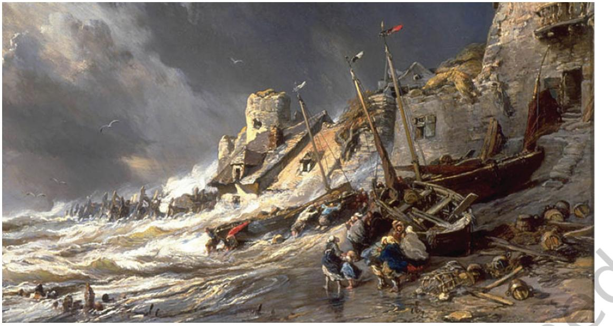
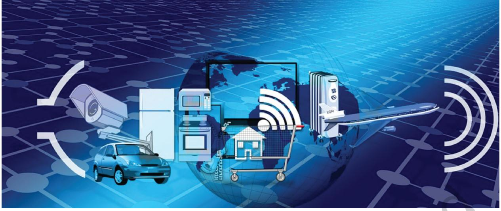
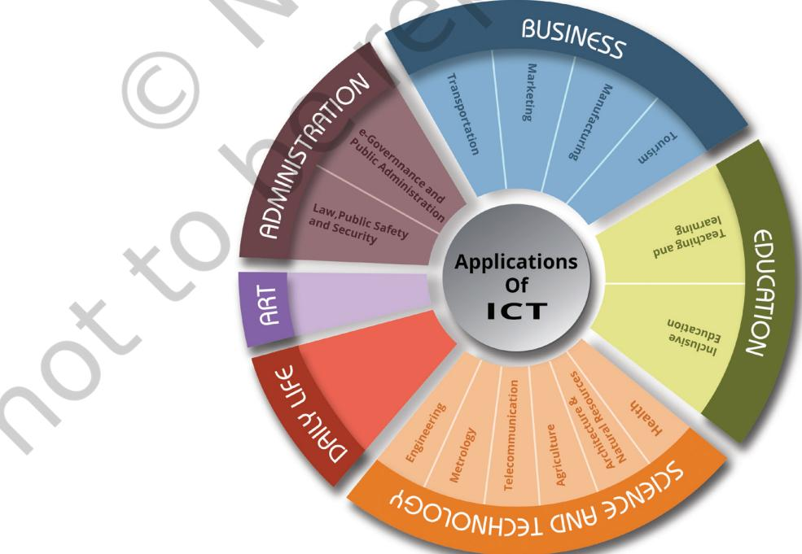
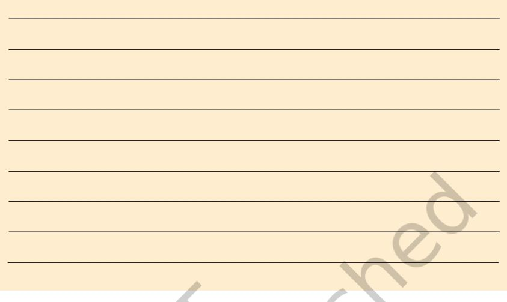

# **ICT** Chapter

**1**

# **Introduction to**

Muskan performed an experiment to find out the weight of a solid metallic ball in different media like air, water and mustard oil using spring balance. The weight of the ball in every medium was noted by Muskan in her notebook. The weight was found to be least in water and comparatively higher in air than in mustard oil. Muskan recorded the entire experiment as a video, explaining about the variation of weight in various medium.

Muskan shared this video with her classmates using a Messenger App. One of her friends suggested her to create a blog to share her experiences. Muskan created a blog and regularly shared her learning experiences and reflections on this blog. She also uses web tools and technology that made her learning experience very engaging. Muskan is excited about the potential of technology use for learning.

This is only an example to describe how Information and Communication Technology (ICT) has started influencing the learning experiences. With the world becoming more and more digital with time, schools are also progressing in their use of ICT. In this chapter you will be introduced to the basic ideas of ICT and its uses in the learning process.

### **What is ICT?**

ICT is the short form of three basic terms—Information, Communication and Technology. The representation of data in a meaningful way is called Information. For example, Muskan is a student of Class IX of the Government School, Tajpur. She is 14 years old and is a Table Tennis player. Her hobbies include singing, drawing, reading, dancing, gardening, etc. This is the description about Muskan available in her profile at school. Based on this information, Muskan's teacher selected her to participate in an inter‑school poster making competition‑on "Dance forms of India". Thus information (meaningful data) can help in decision‑making also.

The term communication may be referred as imparting or exchanging of information by speaking, writing, or using some other medium. In other words, it may be referred as conveying your feelings, thoughts and emotions in any verbal and non-verbal medium. Any communication has four essential elements, namely 'sender', 'message', 'medium' and 'receiver'. When all four elements are in sync with each other in terms of sequence, relevance, appropriateness, etc., then communication becomes effective. Analyse the elements of communication followed when Muskan shared the video of experiment she recorded.

| Activity 1 |  |  |  |  |  |
| --- | --- | --- | --- | --- | --- |
| Identify | the | information | communicated | through | Figure 1.1. |
| ___________________________________________________ | ___________________________________________________ |  |  |  |  |
| ___________________________________________________ | ___________________________________________________ |  |  |  |  |
| ___________________________________________________ | ___________________________________________________ |  |  |  |  |
| ___________________________________________________ | ___________________________________________________ |  |  |  |  |
| ___________________________________________________ | ___________________________________________________ |  |  |  |  |
| ___________________________________________________ |  |  |  |  |  |

2 ICT Textbook—Class IX

*Figure 1.1: Coast Scene Source: https://goo.gl/ZsTCaq*

**Technology** refers to methods, systems and devices, which are a result of scientific knowledge, being used for practical purposes. For example, Muskan went to an excursion to Bhubaneswar and visited the State Museum. She saw various mineral ores in the mineral section of the museum. She decided to capture photographs to share with others who may not have seen the ores. She borrowed her teacher's mobile and clicked pictures of the rare collection. She shared all the pictures on her blog along with a description of the ores. Many viewers commented and appreciated Muskan for sharing those pictures and description.

Technology can be used for creation and communication of information. The term **Information and Communication Technology (ICT)** includes various forms of technologies that are used to create, display, store, process, transmit, share or exchange information by electronic means (UNESCO 2007). Such a discipline which deals in the creation and communication of information is called **ICT** (see Fig.1.2).

Radio, television, and print media (Newspaper, Books, Magazines, etc.) are the popular technologies used for communication. The digital revolution has transformed the way these traditional technologies function. For example, analog television has become

*Figure 1.2: ICT Around Us Source: https://goo.gl/vytpr7*

digital television. In addition to printed newspapers now we also have their electronic versions. Along with traditional radio, we also have online radio.

#### **Evolution of ICT**

We cannot live in isolation. We need to interact and communicate with each other and with our surroundings. In the ancient times people used smoke signals, drum sounds, pigeons and messengers as modes of communication. These were relatively slow, unreliable and sometimes unsafe means of communication.

With the advent of new technologies, the modes and methods of communication are changing very fast. Radio, television, computers, telephones, smartphones, digital camera, laptop and interactive board have revolutionised the ways of communication. These are very fast and can link distant locations within no time.

We can easily send messages across the globe and learn about events all over the world in a blink of eye. Numerous technological tools have come up which help us not only to communicate but to create, store and manage information. The diverse set of technological tools and resources used to store, manage, manipulate, create and communicate digital information come under information and communication technologies (ICTs).

# **Why ICT?**

ICT facilitates communication anywhere, anytime and by anyone. It has become easier to communicate worldwide through the use of ICTs, for example, social media sites and apps, blogs, wikispace, etc. The use of ICT is time saving and cost effective in various ways.

ICT has revolutionised the world. There was a generation that did not have telephone; there was a time when radio and television were considered as the most advanced sources of information. However now the new generation lives in the world of Internet, wireless, augmented and virtual space. The world around has drastically changed. The dramatic change due to ICT has resulted in innovation in every field. These innovations have reduced the size of the technological tools and increased the speed with which they operate to process data and communicate information.

All these advancements and innovations give scope for betterment and effectiveness.

Muskan has a cousin Nishi who lives in Bengaluru and who is also of her age. She has same hobbies like her, such as dancing and gardening. Both of them are very fond of each other. They like to talk very often, they discuss about new things they do in gardening for hours together over phone. But making phone calls frequently was very costly and unaffordable for them.

 Hence they always had to restrict their discussions on gardening. A friend of Muskan informed her about online video calling facility like Skype, Google Meet, etc., which is more cost effective than making, phone calls. Muskan installed Skype on her laptop and her cousin also installed it on her Smartphone. They are now able to discuss on several topics without any restriction.

- **• Access to instant data:** Access to instant data supports in predictions, decision making and also knowledge acquisition.
Muskan's family planned to go on a trip to Mount Abu. While packing, her mother was a little confused about carrying woollen clothes as she was unaware of the temperature in Mount Abu. Knowledge about ICT helped Muskan to help her mother. She checked the temperature in Mount Abu during the past few days from meteorological website. As the recorded temperature showed a higher temperature for past 15 days, she informed her mother to carry more semi woolen clothes. Instant access to data helped them to reduce the luggage and have a pleasant journey with required preparedness.

- **● Creation of information for communication:** ICTs can be used to create communication pieces in various forms like text, image, audio, video, multimedia, etc. Once the information is in digital form it can be used for recreating resources out of the original. Digital information is also easy to modify and share.
Muskan's cousin Nishi visited a historical place 'Hampi' in Karnataka. When she saw the beauty of the architecture she thought of sharing it with Muskan.

Nishi decides to show Muskan the archeological site through Skype, but her father suggested her to share it through Facebook live so that not only Muskan but her other friends can also see her exploration. As the mobile had a 4G network, the speed of the Internet supported online streaming.

This act of Nishi helped Muskan to have a virtual trip to Hampi. She thought for a while and found a solution to make a great resource about Hampi that can be shared with others. So she downloaded the video shared by Nishi. Using a video editor, she edited the unwanted content, added a background music and shared it with her schoolmates who never saw Hampi. The knowledge of ICT helped in capturing the events Muskan herself had never seen and sharing them through online streaming.

- **● Store and organise:** ICT helps in organising information in various forms. This organisation of information helps in retrieving the required data. For example, in libraries, all the information about books are organised as database by using management software. If anyone wants to check
the availability of books, it is easy to search in the database and find the availability.

Muskan's grandfather had a great collection of postage stamps. He gifted his collection to Muskan on her birthday. She was thrilled to get this collection but she observed that the collection compiled in an album will perish over time. She decides to give the collection a lasting life by converting it into a digital collection. She along with her brother scanned all the stamps and added tags like country to which they belonged, date of release, event, personality, phenomenon depicted on the stamp, etc. This digital storing and organising helped her to retrieve any stamp whenever she require and also to easily maintain the record.

- **● Scope for learning:** ICT provides a great opportunity to learn. One can learn anytime, anywhere and at his or her own pace. We can also create our own personal learning environment. Availability of online courses, e-tutorials have opened up avenues for continuous and life‑long learning.
Muskan used to visit her grandmother's place for every summer vacation, but this summer her parents were busy with some work. She could not visit her grandmother. She was very sad and did not know what to do during her summer vacations. Hasmukh, a friend, suggested her to do an online course on Puppetry. He sent her information about this free course. When she further searched about the course she found it to be a Massive Open Online Course (MOOC). As she was not aware of MOOC, she searched for information about MOOC and learnt that MOOCs are free online courses that can be taken up by anyone at anytime from anywhere. Muskan joined the course immediately and started learning different puppet‑making techniques as well as storytelling using puppets. She enjoyed the online course on puppetry and planned to do a puppet show in her class as a holiday project once the school reopens.

- **● Plan and manage :** Use of ICT tools can help in time management by scheduling the works across devices and using various features like alerts, priorities,
highlights, etc. ICT tools can also be used in planning and managing the activities.

Muskan often forgets the deadlines of returning books issued from the library. To avoid paying fines, she sets the dates in her father's mobile using a calendar mobile app. Also she schedules her exam dates using a digital calendar.

# Activity 2

Discuss with your friends, parents and other people in your surroundings about how ICT is essential in their daily life. Note down the main points emerged.

___________________________________________________ ___________________________________________________ ___________________________________________________

# **How ICT is Useful?**

ICT has wide range of applications for the society but the extent of its use depends on the user. ICT has its existence in all fields. Some of the fields are shown in Fig. 1.3.

*Figure 1.3: Applications of ICT*

8 ICT Textbook—Class IX

#### **1. Application of ICT in Everyday Life**

ICTs have become a way of life in the present day world. We are using various ICTs in our day-to-day life for reading e-newspapers, e-magazines and e-books, online shopping, paying bills for food, using mobile apps, getting online appointments from doctors and so on.

# Activity 3

Write a few observations on the uses of ICT at home.

___________________________________________________ ___________________________________________________

#### **2. Application of ICT in Education**

- *a***. Teaching, Learning and Assessment:** ICT finds presence and expression in almost all the functions of the schools, such as admission, time table, classroom instruction, evaluation, laboratory management, learning resources management, examination and certification. It is also being used for office automation. E‑resources like websites, e-books, e-newsletters, Open Educational Resources (OERs), etc., are used by most of the schools.
- *b***. Inclusive Education:** ICT is used for catering to the educational needs of every section of the society, including children with special needs. Various assistive devices and technologies are being developed which play an important role in fulfilling the specific needs of these children. For example, talking books, talk back feature of mobile phones, GPS inbuilt walking sticks, etc., are making substantial changes in people's lives.
- **3. Application of ICT in Art:** Creative construction and connection are being done in various domains with the advent of ICT. Creative composition, compilation and communication can be done quickly by compatible ICTs. The role of ICT is vital in disseminating various art forms popular in one area to another. The appreciation of Art and Culture gained popularity through ICT. ICT has made it possible to showcase the creative works to the larger audience.

Write a few observations of ICT use in areas related to art and culture.

___________________________________________________ ___________________________________________________

#### **4. Application of ICT in Science and Technology**

- *a***. Health:** The use of ICT in surgeries has made them less invasive, highly precise and automated. Due to this the recovery time has reduced many folds. Robotic technology has got a positive impact on present medical sciences. Now‑a‑days distance is not a constraint for any complicated medical intervention to be done jointly by doctors located at different places through networking.
- *b***. Telecommunication:** The field of Information Technology has seen a lot of advancement with the help of ICT. The satellite communication has advanced a lot and reached a number of people belonging to different setups. Low‑cost smartphones and very cost‑effective services have made the availability of these to almost everybody in the society. App based services available in different areas have made people's life easy.
- *c***. Agriculture and Natural Resources:** Frequent and almost accurate weather updates have revolutionised the agriculture sector. Early prediction of rains or other weather conditions by Metrological Department has equipped the farmers in getting better yield. The sustainable use of natural resources has also become possible due to ICT integration; now it is possible to locate the oil wells, coal mines, etc., with the help of satellite technology.

# Activity 5

___________________________________________________ ___________________________________________________

Explore more areas of Science and Technology where ICT is applied.

#### **5. Application of ICT in Business Transportation**

ICT is used very effectively in the area of transportation. The GPS system is installed in vehicles, to provide security and easy navigation to the commuters. Airplanes and trains use RADAR systems for their control and path finding. Application-based services have revolutionised the experience of transport system by their users. Online reservations of flights, trains, buses and other services have further made our lives easier.

- *a***. Marketing:** Online marketing through various websites and mobile applications is very popular in today's world. People find them useful and hassle free. They are not only cost effective but also saves a lot of time and effort of the people. The online sales and services have generated a new type of employment, which require very less investment at the source.
- *b***. Tourism:** Various online hotel booking systems have provided a great experience to the users. With the advancement of ICT even checking the overall scenario of a place before planning a visit has become feasible. Also, online payment facilities have simplified the travel experience.

#### **6. Application of ICT in Administration**

- *a***. Public Safety and Security:** Deployment of ICT makes it possible for the police departments to collect, store and rapidly disseminate the information to enhance public safety. ICT can also be used for the identification of criminals by tracing their digital footprints.
- *b***. e-Governance and Public Administration:** e-Governance is generally understood as the use of Information and Communication Technology (ICT) at all the level of the Government in order to provide services to the citizens, interaction with business enterprises and communication and exchange of information between different agencies of the Government in a speedy, convenient efficient and transparent manner.

# Activity 6

List your observations of ICT use in areas related to e-Governance.

#### Exercises

- 1. Which of the following are ICTs? Give reasons why it is or not an ICT.

| Items | ICT Yes/No | Reason |
| --- | --- | --- |
| Digital camera |  |  |
| Refrigerator |  |  |
| Smart TV |  |  |
| Telephone |  |  |
| DVD player |  |  |
| Computer |  |  |
| Headphone |  |  |
| WIFI |  |  |
| Radio |  |  |
| Hard disk |  |  |

- 2. Discuss with various professionals like tailor, shopkeeper, milkman, doctor, engineer, nurse, etc., in your surroundings and write the ways in which each of them use ICT in their profession.
Exercises

|
|  |

- 3. My principal wants to make a short movie of this function for our school website, I will record the event and edit it using ______________ video editor.
All the students are willing to present gifts for teachers. They selected the gifts from ______________ and ordered them, so that they can reach us on time.

Introduction to ICT 13

