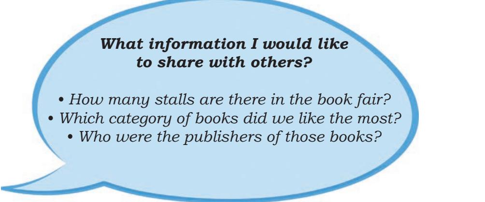
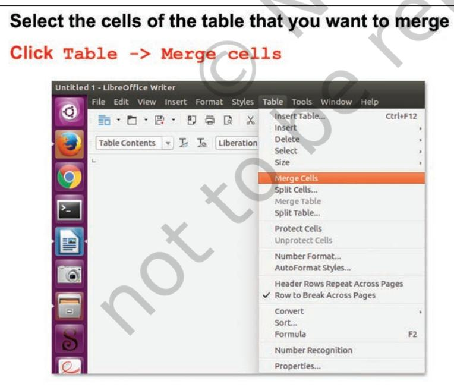

# **Creating Textual Communication** Chapter **2**

Tanya and Rishi had gone to a book fair. They had a great time there. They wanted to share their experiences with others. So, they decided to record their experiences. Let us see how Tanya and Rishi recorded their experiences. Consider Fig. 2.1 given below and put

*Fig. 2.1: Book Fair*

Chapter 2.indd 14 7/22/2020 12:34:21 PM

yourself in place of Tanya and Rishi and think what information may be shared with others about the book fair.

Let us see in Figs. 2.2 and 2.3 how they presented their experiences.

Creating Textual Communication 15

Chapter 2.indd 15 7/22/2020 12:34:24 PM

*Fig. 2.3: Rishi's Report*

Rishi was amazed to see Tanya's report. It contained text of varied colour, style and size. It also had a picture and certain symbols before each category of books. Tanya had communicated her ideas and thoughts in an organised, systematic, effective and presentable manner through her report. Rishi asked Tanya how could she communicate her thoughts so effectively?

*Tanya*: Rishi, you should know that there are digital tools which can be used to create effective and digital documents.

Chapter 2.indd 16 7/22/2020 12:34:26 PM

You can delete the errors and also take multiple copies of a digital document. My elder sister helped me to create this document using a word processor (LibreOffice Writer 5.1.6.2) on a computer (fig. 2.4).

*Fig. 2.4: LibreOffice*

Rishi also wanted to prepare his report using word processor. So, he asked Tanya to help him. After taking permission from their teacher, Rishi and Tanya went to the computer lab of their school. Tanya opened the text editor and asked Rishi to create a new document. Tanya explained to him the use of various keys on the keyboard (Fig. 2.5) for entering the text.

*Fig. 2.5: Keyboard*

Creating Textual Communication 17

Chapter 2.indd 17 7/22/2020 12:34:27 PM

### **Getting Familiar with a Keyboard**

#### **Enter key**

- Press once to move to next line.
#### **Tab key**

- Press once to move 5 spaces to the right of the cursor.
#### **Insert key**

- Press once more to replace the old text with the currently typed text.
- Press once again to activate the insert mode.

## **Delete key**

- Deletes the character to the right of the cursor.
### **Backspace key**

- Deletes the character to the left of the insertion point.
#### **Caps Lock key**

- Press once to type the alphabets in uppercase.
- Press once more to revert and type in lowercase.

## **Shift key**

- Press along with the alphabet key to type in uppercase if Caps Lock is OFF and in lowercase if Caps Lock is ON.
- Press along with non-alphabet key to type the special character/symbol that is above the main character.

*Tanya*: Rishi, let's open the text editor by double clicking on the Writer icon on the desktop. Let us try to understand how we can work on the Text Editor. When we open text editor, a blank document as shown below (Fig 2.6) will appear. Tanya also demonstrated how to open a new file in the text editor. Rishi followed the steps demonstrated by Tanya for creating a new document.

The title bar of the new document contains the name of the document and the name of the application

**Document:** Any piece of information created using a text editor is called a document.

**Cursor:** A vertical blinking line in a text editor that indicates the place where anything that is typed will appear.

Chapter 2.indd 18 7/22/2020 12:34:27 PM

*Fig. 2.6: Creating a New Document*

(OpenOffice Writer). As Rishi had not given any name to his document, 'Untitled 1' is displayed on the title bar.

*Tanya*: First fix the setting of the document (Fig. 2.7) so that the page size, orientation, margins, and background colour can be fixed for the report.

*Rishi*: Why do we need to do that?

*Tanya*: Rishi, you must have noticed that the pages of your notebook are of the same size and contain margins too. This gives a consistent look to your notebook Similarly if you set the margins and size of the document in the text editor, it will give a consistent look.

*Rishi*: What are the orientation types?

*Tanya*: If you want your document vertically elongated, select 'Portrait' orientation, if you want it to be horizontally elongated, select 'Landscape' orientation.

Creating Textual Communication 19

Chapter 2.indd 19 7/22/2020 12:34:32 PM

*Rishi*: OK, so I will select page size as A4, orientation as Portrait and 0.79 inch margin on all four sides of the page.

*Tanya*: Fine! And what about the background colour?

*Rishi*: My favourite colour is yellow ochre, so I will select that as the background for my document.

Rishi was happy to see the outcome of the page setting of his document and the coloured background of his page. He started typing the text in his report. After typing, his report looked as it is shown in Fig 2.8.

Rishi was happy to see the outcome of the page setting of his document and the coloured background of his page.

 *Fig. 2.7: Formatting the Page*

Chapter 2.indd 20 7/22/2020 12:34:34 PM

He started typing the text in his report. After typing, his report looked as shown in Fig. 2.8.

| Date: 27/2/2018 |
| --- |
| Report |
| Visit to Book Fair |
| Recently I visited the World Book Fare, held from 6th-14th January, in Pragati Maidan. |
| It was an extremely enjoyable experience for me and my friends. The book lovers |
| considered it a paradise and those who weren't so fond of books, found the mselves |
| attracted towards the endless varieties of books. |
| Stephen King famously said that "Books are a uniquely portable magic." |
| As the entire venue was stacked with books of all kinds- comics, classics, pop-up books |
| for children and many more, we could feel the magical essence of stories |
| tempting us to flip through the pages of several novels. |
| The various genres that we came across include: |
| Classics |
| Crime and Murder |
| Mystery |
| Romance |
| Adventure |
| Comic |
| Thriller |
| It is always fun to have new memories, capture them in photos and share them with |
| everyone else. |
| The students also found some books that intrigued them so much, they wanted the |
| books to be a part of the School library collection. |
| It is rightly said that reading is dreaming with your eyes open! Our visit to the book fair |
| simply reminded all of us: students and teachers alike, to never give up the habit of |
| reading. We must always keep the magical essence of books alive in our lives. |
| WE HAD LOT OF FUN! |

*Fig. 2.8: Rishi's report*

Chapter 2.indd 21 7/22/2020 12:34:37 PM

# Activity 1

Create a text document on a topic of your choice. Choose A4 as page size and 'portrait' as page orientation. Now change the page orientation to 'landscape' and observe the change in the document.

Once the report was typed, Tanya suggested him to save the document as shown in Fig. 2.9 and then close it. It is only when the document is saved by a name, it can be opened again for viewing or editing. In fact, while creating a document it must be saved at regular intervals so that the changes made are permanently saved. To close the file click *File → Close* option. To close the word processor (Writer), you may click Close button on the top-left corner of the screen.

*Fig. 2.9: Saving a File*

Chapter 2.indd 22 7/22/2020 12:34:41 PM

Rishi saved the file by the name *bookFairReportRishi. odt* and then closed it by clicking on the Close button. Rishi wanted to learn more from Tanya, so he opened his file again.

| • Choose Save As |
| --- |
| option when you |
| are saving the file |
| for the first time |
| or you want to |
| give a different |
| name to an |
| already saved file. |
| • Choose Save |
| option when you |
| want to simply |
| save the changes |
| made in an already |
| existing file. |
| You should always |
| save a file with a |
| meaningful name. |

 *Fig. 2.10: Opening a Document*

You can also perform a task using keys from the keyboard. These are called Shortcut keys. Some of the shortcut keys are listed below:

Opening a new document Ctrl + N Saving a document Ctrl + S Opening a document Ctrl + O

Rishi was excited to see his report on the monitor but he wanted coloured text of different sizes in his report with a bold and underlined title. Tanya demonstrated the tools on the Formatting toolbar as shown in Fig. 2.11 that would help Rishi add these features to his report. He could choose the font name, size and style of his choice. Tanya also showed him some fonts names like Times New Roman, Courier New, Arial, Calibri, etc. She further mentioned tools to edit the font size and style—bold, italic or underlined.

Creating Textual Communication 23

You should always save a file with a meaningful name. This helps you to easily identify the file when you want to open it later.

Chapter 2.indd 23 7/22/2020 12:34:42 PM

|  | Bold Italic Underline |  |  |  |
| --- | --- | --- | --- | --- |
|  | BZUSA |  |  |  |
|  | ont Size |  |  | Alianment T |
| The formatting can also be done by clicking Format -> Character -> Font tab in |  |  |  |  |
| the Character dialog box. |  |  |  | Font Style |
|  | ects Position Hyperlink Highlighting Borders |  |  |  |
| Family |  | Style |  |  |
| Font Name |  |  |  |  |
|  | English (India) |  |  |  |
|  | The same font will be used on both your printer and your screen. |  |  |  |
|  | Liberation Serif |  |  |  |
| Help |  | OK | Cancel | Reset |

*Fig. 2.11: Formatting text*

Rishi formatted the text in his document by using the tools on the formatting toolbar, now he wanted the title in the centre of the page and date on the top-right corner. Tanya then introduced Rishi to various alignment tools:

- Align left: aligns the text to the left margin of the page
- Center horizontally: aligns the text to centre of the page
- Align right: aligns the text to right margin of the page
- Justified: aligns the text to both left and right margin of the page

Rishi felt that his report was looking congested. He wanted a little bit more spacing between the lines of the paragraph. Tanya then explained that the spacing can be set between the lines and also between the paragraphs as shown in Fig. 2.12. The former is called

Chapter 2.indd 24 7/22/2020 12:34:46 PM

line spacing and the latter is called paragraph spacing. Demarcating a new paragraph by adding few blank spaces in the beginning of the first line of the paragraph can also be done. This is called indentation.

*Fig. 2.12: Formatting a Paragraph*

Rishi was happy to apply all the formatting effects to his document. Now his report, in Fig. 2.13 appeared more effective as compared to that shown in Fig. 2.8.

| Rishi's Report |  |
| --- | --- |
| Date: 24/2/2018 | Right Aligned |
| Report |  |
| Visit to Book Fair | Center Aligned |
| Recently I visited the World Book Fare, held from 6th-14th January, in Pragati Maidan. |  |
|  | Justified |
| attracted towards the endless varieties of books. |  |
| As the entire venue was stacked with books of all kinds- comics, classics, pop-up books |  |
| for children and many more, we could feel the magical essence of stories tempting us | Paragraph with spacing |
| to flip through the pages of several novels. |  |
| Stephen King famously said that "Books are a uniquely portable magic." | Font with colour and style |
| It was an extremely enjoyable experience for me and my friends. The book lovers |  |
| considered it a paradise and those who weren't so fond of books, found themselves \ |  |
| The various genres that we came across include: |  |

*Fig 2.13: Rishi's Page with Formatting Effects*

Creating Textual Communication 25

Chapter 2.indd 25 7/22/2020 12:34:49 PM

## Activity 2

## **Shortcut keys**

Bold Ctrl + B Italic Ctrl + I Underline Ctrl + U Using a text editor, write a paragraph on 'My Favourite Festival' and apply various formatting effects listed below.

Also add a quote 'Festivals' in the beginning of the chapter. Mark a tick in front of the features that you were able to apply in your document.

- Title: Bold and Centre aligned
- Important points: Underlined, Bold
- Paragraph: Justified
- Background and Text: Coloured
- Font Style
- Indentation and Line Spacing

There were certain red and green wavy lines in Rishi's document. As Rishi asked her about the lines, Tanya told him that the red wavy line appears below a spelling mistake and the green wavy line appears below a grammatical error. Now, Rishi tried to correct the mistakes by placing the cursor at the appropriate position and retyping them. Tanya explained that instead of doing it manually, it can be done by using the **Spelling and Grammar** check feature of the word processor as shown in Fig. 2.14.

| Place your cursor in the beginning of the document |  |  |  |
| --- | --- | --- | --- |
| Click Tool->Spelling and Grammar |  |  |  |
| Spelling and Grammar: English (India) |  |  |  |
| Text language: | A English (India) | . | Click Ignore Once to reject the |
| Not in dictionary |  | 0 2 | suggestion |
| Recently, I visted the World Book Fare, held from 6th - 14th January, in Pragati Maidan |  |  | Ignore Once |
|  |  |  | Ignore All |
| Add to Dictionary |  |  |  |
| Suggestions |  |  |  |
| visited |  |  | Correct |
| vested listed |  |  |  |
| misted |  |  | Correct All |
| fisted |  |  | Always Correct |
| Check grammar |  |  | Click Correct button to accept the suggestion |
| Help Options ... |  | Undo | Close |

*Fig. 2.14: Spelling and Grammar Check*

Chapter 2.indd 26 7/22/2020 12:34:50 PM

Suddenly, Tanya noticed that the word 'Pragati Maidan' had a red wavy line below it although it was not a spelling mistake. On the other hand, Rishi had typed the word 'fare' instead of 'fair' in his document but it did not have a red wavy line below it, as shown in Fig. 2.15.

*Fig. 2.16: Find and Replace*

Chapter 2.indd 27 7/22/2020 12:34:52 PM

## **Shortcut keys**

Cut Ctrl + X Copy Ctrl + C Paste Ctrl + V Spelling & Grammar F7 Find & Replace Ctrl + H

Rishi wanted to change the position of the quote by Stephen Hawking. One method is to delete it from its present position and retype at the new position. The better way is to use the cut and paste commands, through which the text will be removed from the original position and pasted to the new position. If you want the text to be duplicated and pasted at the new position, then choose the Copy command instead of Cut command (Refer Fig. 2.17).

| Fig. 2.17: Cut, Copy and Paste |
| --- |

## Activity 3

Open the file that you created in Activity 2. Copy the quote and Paste it at the end of the document. Thereafter do it by Cut and Paste. What difference did you notice between Cut and Copy options?

Chapter 2.indd 28 7/22/2020 12:34:55 PM

In Tanya's report, Rishi had also seen certain symbols preceding the names of the genres of books. When Rishi asked her, Tanya explained that such a list can be created using the **Bullets and Numbering** feature of the text editor as shown in Fig. 2.18. Using Bullets feature, the list is preceded by certain symbols. For list items, shown by bullets ordering is not important, on the other hand, **Number and Alphabets** feature can be used when there is some order in the list.

Rishi used bullets as shown in Fig. 2.19 to list the different categories of books he had seen in the book fair.

*Fig. 2.18: Creating a Bulleted List*

*Fig. 2.19: Rishi's List with Bullets*

Chapter 2.indd 29 7/22/2020 12:34:57 PM

# Activity 4

Tick the appropriate options given in the bracket and create at least one bulleted and one numbered list using a word processor.

- List of fruits you like (Bullets/Numbering)
- List of fruits you like in order of preference (Bullets/ Numbering)
- Steps to make a cup of tea (Bullets/Numbering)
- List of your favourite games (Bullets/Numbering)

During his visit to the book fair, Rishi had made a list of his favourite books and CDs in his diary. He wanted to create a table depicting Serial Number of the listed books and CDs, Title of the book and CD and Name of the Publisher. Tanya explained the table feature to help him complete the task. He inserted a table (as shown in Fig. 2.20) with three rows and four columns. Tanya also explained him how to insert more rows and columns in the table. He inserted two more rows at the bottom of the table (as shown in Fig. 2.21), since he needed to add 5 names.

| Click Table -> Insert Tab |  |  |  |  |  |  |  |  |  |  |
| --- | --- | --- | --- | --- | --- | --- | --- | --- | --- | --- |
| Specify table name |  |  |  |  |  |  |  |  |  |  |
| 90 Insert Table | Untitled 1 - LibreOffice Writer | File Edit View Insert Format Styles Table Tools Window Help | General |  |  |  |  |  |  |  |
| Ctrl+F12 | Insert Table ... | 中国·B·D·B | 10 | Insert | Table1 | Name: |  |  |  |  |
| Delete | 工工 | Default Style | Liberation | > | Select | 4 8 | .. | Columns: | Rows: | 4 |
| Size | Merge Cells | Ontinne |  |  |  |  |  |  |  |  |
| Split Cells ... | Specify number of | Merge Table | ■■ |  |  |  |  |  |  |  |
| Split Table ... | rows and columns | w pages | Protect Cells |  |  |  |  |  |  |  |
| Unprotect Cells | Heading rows: 1 | Number Format ... |  |  |  |  |  |  |  |  |
| 可 6 |  |  |  |  |  |  |  |  |  |  |
| AutoFormat Styles ... | Don't split table over pages | Header Rows Repeat Across Pages |  |  |  |  |  |  |  |  |
| Border | Row to Break Across Pages | Convert |  |  |  |  |  |  |  |  |
| AutoFormat | Sort .. | Formula | F2 |  |  |  |  |  |  |  |
| Number Recognition | Help | Cancel | Insert | Properties ... |  |  |  |  |  |  |

*Fig. 2.20: Inserting a table*

Chapter 2.indd 30 7/22/2020 12:34:59 PM

| Click Table -> Insert -> Rows |  |  |  |  |  |  |  |
| --- | --- | --- | --- | --- | --- | --- | --- |
| Insert Rows | × | File Edit View | Insert Table. | 0 0 . |  |  |  |
| ROWS ADDWE | Insert | Insert | Rows Below | Delete | 1 To | Table Contents   ~ | Liberation |
| Select | Size | 4 | Columns Lerc | Number: |  |  |  |
| . | Columns Right | Merge Cells | Columns ... | Split Cells .. |  |  |  |
| Merge Table | ਜ | Position | Split Table |  |  |  |  |
| Specify the | Protect Cells | 可可以 | Unprotect Cells | Before | number of rows |  |  |
| Number Format .. | AutoFormat Styles: |  |  |  |  |  |  |
| O After | leader Rows Repeat Across Pa | Row to Break Across Pages | Convert |  |  |  |  |
| . | Sort |  |  |  |  |  |  |
| F2 | Formula | Help | OK | Cancel | Number Recognition |  |  |
| Properties ... |  |  |  |  |  |  |  |
| Choose before to add row(s) after the current row |  |  |  |  |  |  |  |

*Fig 2.21: Inserting Rows in a Table*

Rishi successfully inserted the table in his document. He also wanted to add a border to his table, so Tanya showed him how to format the table to add borders (Refer Fig. 2.22).

| Click Table -> Properties -> Borders |  | alo |
| --- | --- | --- |
| Table Properties |  |  |
| Table Text Flow Columns Borders Background |  |  |
| Line Arrangement | Line | Spacing to Contents |
| Presets: | Style: | Left: 0.10 cm = |
| ■■■■■■ |  | Right: 0.10 cm . |
| User-defined: | Width: |  |
|  | 0.05 pt | Top: 0.10 cm . . |
|  |  | Bottom: 0.10 cm = |
| Color: |  |  |
| + | Black | Synchronize > |
|  |  | Select style, width |
| Choose border | Distance: | and colour of border |
| arrangement | 0.18 cm - | Gray |
| Properties |  |  |
| Merge adjacent line styles |  |  |
| Help |  | OK Cancel Reset |

*Fig. 2.22: Borders tab*

Creating Textual Communication 31

Chapter 2.indd 31 7/22/2020 12:35:02 PM

Rishi was able to apply green borders to his table. He also gave headings to his table by using **Bold** tool on the formatting toolbar. That is how Rishi's table looks (Refer Fig. 2.23).

| S. No. | Title of Book/CD | Category (Book/CD) | Name of the Publisher |
| --- | --- | --- | --- |
| 1. | Science – Vigyan | Textbooks | NCERT |
| 2. | Urdu – Gulzar-e-Urdu | Textbooks | NCERT |
| 3. | Mathematics for Grade 6 | Textbooks | NCERT |
| 4. | Mind Map Your Brain | Audio /Video CDs | ------- |
| 5. | Encyclopedia | Audio /Video CDs | Britannica |
| 6. | What on earth is energy? | Children's Book | NCERT |
| 7. | Indian Education | Journals | NCERT |
| 8. | Barkha – A Reading Series for All | Miscellaneous | NCERT |

*Fig 2.23: Table Inserted by Rishi*

*Fig. 2.24 : Merging Cells of a Table*

He observed that the category 'Textbooks' was repeating in three rows. He wanted the word 'Textbooks' to appear in such a manner that it represents all the books under this category. Similarly, he wanted 'Audio and Video CDs' to represent both type of CDs. This could be done using **Merge** feature of the text editor, as shown in Figs. 2.24 and 2.25.

Chapter 2.indd 32 7/22/2020 12:35:04 PM

| S. No. | Title of Book/CD | Category (Book/CD) | Name of the Publisher |
| --- | --- | --- | --- |
| 1. | Science – Vigyan |  | NCERT |
| 2. | Urdu – Gulzar-e-Urdu | Textbooks | NCERT |
| 3. | Mathematics for Grade 6 |  | NCERT |
| 4. | Mind Map Your Brain | Audio /Video CDs | ------- |
| 5. | Encyclopedia |  | Britannica |
| 6. | What on earth is energy? | Children's Book | NCERT |
| 7. | Indian Education | Journals | NCERT |
| 8. | Barkha – A Reading Series for All | Miscellaneous | NCERT |

*Fig. 2.25: Table with Merged Cells*

Rishi had a very good photograph of book fair saved on the desktop. He wanted to insert that photograph in his report. Tanya helped Rishi to insert the photograph in his report (Refer Fig. 2.26).

| Click Insert -> |  | Place the cursor at a position where you want to insert the image or picture. Choose the location of the image file |
| --- | --- | --- |
| · Search | Walload | Size Modified Wednesday 11 October 2017 |
| Recently Used ciet Desktop |  | 43.6 kB Tuesday 10 October 2017 44.9 kB Wednesday 11 October 2017 |
| 145 GB V 210 GB V |  | Choose the file name |
|  |  | <All formats> Frame Style: Graphics |
| Preview Insert as Link |  | Cancel Open |

*Fig. 2.26: Inserting a Picture*

Chapter 2.indd 33 7/22/2020 12:35:05 PM

To further enhance the report, Tanya demonstrated how to insert headers and footers in the document as shown in Fig. 2.27. A header contains the text that will be displayed on the top of each page of the document while the text in footer will be displayed at the bottom of each page of the document. Rishi wanted to insert the text 'Rishi's Report' as the header and page number as the footer.

<i>Fig. 2.27: Inserting a Header

Tanya explains him how to insert Header and Footer to document (Refer Fig. 2.28).

Chapter 2.indd 34 7/22/2020 12:35:11 PM

# Activity 5

In the document created in Activity 2, do the following:

- Insert the list of food items prepared during the festival
- Insert the 'Favourite Festival' in the header and page number in the footer
- Add a table describing atleast five activities that happens during festivals

Tick mark the features you have added to your document.

- Bulleted list/numbered list
- Tables with headings
- Merge rows/columns
- Header and footer
- Picture/photograph

Answer the following questions based on the above activity.

- In which menu option did you find the table option?
- Have you inserted a bullet list or a number list?
- How many rows and columns does your table have?
- What did you insert as a footer in your document?

Rishi was very happy to see his document now. He wanted to show it to his teacher and parents. So, he decided to take two printouts. Before giving the print command, Tanya clicked the File→Print Preview button

Keep saving your document at regular intervals.

*Fig. 2.29: Print Preview*

Creating Textual Communication 35

Chapter 2.indd 35 7/22/2020 12:35:13 PM

Take a print out only if it is required. Avoid wasting paper and contribute your bit towards saving trees.

If the report is in digital form, either saved in some storage device or seen on the monitor, it is called a **soft copy.**

The report that is printed on the paper is called a **hard copy.**

It is not ethical to see or edit other people's documents and material without seeking permission.

to show Rishi how the document would appear on paper. By doing so both the pages of Rishi's report were displayed as shown in Fig. 2.29. Tanya told him how to set the number of pages that he wanted to see while previewing the document. Since Rishi was happy with his final report, he clicked Close Preview button to close the preview. Tanya again reminded him to save the document and Rishi clicked the Save command. Now it was time to print Rishi's report. He switched on the printer and made sure that the printer was connected to the computer. Then he opened the Print dialog box and selected '2' for the number of copies of the document to be printed as shown in Fig. 2.30.

#### *Fig. 2.30: Printing a document*

Next day, Rishi and Tanya opened the document to show it to their friends in the computer lab of their school. On opening the file, they were surprised to see that the document was not the same one that they had saved a day before. Some student might have altered the report. Their teacher explained that their document had been saved in an editable format, so it could be modified or edited by anybody. If they wanted that their document should not be edited or modified in any manner, then they should convert and save their file in a non-editable format. One such format is a Portable Document Format (pdf). Once a document is saved in

Chapter 2.indd 36 7/22/2020 12:35:14 PM

this format (as shown in Fig. 2.31), it becomes non-editable. Their teacher then explained how to convert the final document into pdf format.

| Click File -> Export as PDF |  |  |  |  |
| --- | --- | --- | --- | --- |
| X PDF Options |  |  |  |  |
| General Initial View |  | User Interface Links Security Digital Signatures |  |  |
| Range |  |  | General |  |
| 0 All |  |  | Hybrid PDF (embed ODF file) |  |
| Pages: |  |  | Archive PDF/A-1a (ISO 19005-1) |  |
| Selection |  |  | Tagged PDF (add document structure) |  |
| Images |  |  | Create PDF form |  |
| Lossless compression |  |  | Submit format: FDF |  |
| · JPEG compression |  |  | Allow duplicate field names |  |
| Quality: | 90% | 4 8 | Export bookmarks |  |
| Reduce image resolution | 300 DPI | P | Export placeholders Export comments |  |
| Watermark Sign with watermark |  |  |  | Export automatically inserted blank pages |
| Text: |  |  | View PDF after export Use reference XObjects |  |
| Help |  |  |  | Export Cancel |

*Fig. 2.31: Converting to PDF Format*

Tanya and Rishi were delighted to show the report to their friends. They had learned to use the various features of a text editor. Their teacher was also very proud of them and encouraged other students to learn how to use a text editor. This will help them to create their own digital document.

## Exercises

## **Do it Yourself**

- 1. Identify whether the following statements are True or False
	- a. Spelling and Grammar check is a part of text editor.
	- b. Bullet listing and numbering can be done using Format option in a text editor.

Creating Textual Communication 37

Chapter 2.indd 37 7/22/2020 12:35:16 PM

- c. Copy feature is used to make copies of a picture.
- d. Before taking a printout, check if its Print Preview is favourable.
- 2. In your school, Independence Day was celebrated. Prepare a detailed digital report using a text editor so that it could be printed in the school magazine.
- 3. Using a text editor, create a document to express your thoughts on your favourite movie.
- 4. You got a chance to view a cricket match in the stadium. Create a document to share the experiences with your friends.
- 5. The Red Cross Society is organising a Cleanliness Drive in your locality. Create a document to summarise the welfare activities performed by them during that period.
- 6. Collect the family details (5–6 families) of the people living in your locality and present that information in a tabular form. Format the table and check, if some rows or columns can be merged to simplify the table. After creating the document, save it and submit the printout to your teacher.

Chapter 2.indd 38 7/22/2020 12:35:16 PM

