# **Creating Audio**  Chapter **Video Communication 4**

In the last chapter, we learnt how to create still images and enhance them, now it will be interesting to see how to create audio and video resources.

The use of more than one medium of expression or communication is called multimedia. Multimedia uses a combination of text, audio, images, animation, videos and interactives. This is different from traditional forms of printed or hand produced material.

Content means something that can be expressed through some media like speech, writing or any other form of art.

Students in a class are discussing about the activity they have performed on purification of water.

*Neer*: Why is this activity necessary?

*Nancy*: What is the use of this activity?

*Raima* joins the school after a long gap. She is surrounded by her friends, everyone is curious to know the reason for her long absence from the school.

*Neer*: Raima, you were always very regular in attending school, why were you absent for a week?

*Raima*: I was suffering from diarrhoea and fever.

Nancy: Oh! What did the doctor say?

Interactives mean a two-way communication where the user interacts with the content and gets feedback.

#### *List of waterborne diseases*

- Diarrhoea
- Dysentery
- Typhoid Fever
- Cholera
- Hepatitis A
- Jaundice etc

Chapter 4.indd 57 7/16/2020 2:45:40 PM

*Raima*: The doctor said it was due to drinking contaminated water. The doctor also told me that many people are dying because of water pollution and waterborne diseases every year.

*Neer*: Oh, it is a very serious issue.

*Nancy*: You know Raima, yesterday only, we did an activity on water purification.

*Raima*: Oh! It is good that you performed such a relevant activity. Can you explain me what you learnt.

Neer and Nancy explained all the activities they performed yesterday.

*Raima*: Had I performed the activity myself, I would have learnt better by performing the activity.

*Neer*: Let us do something, so that you may not miss out the learning.

*Nancy*: Specially this water purification activity is very useful for everyone.

*Neer*: We can create posters to generate awareness on the importance of water purification.

*Raima*: Let us make something which can be more impactful and interesting than a printed material.

# Activity 1

Imagine yourself as a part of this activity, what media will you use to explain this?

*Nancy*: Can we record an audio?

*Raima*: It is similar to what you explained to me but I did not understand it. I think we need to demonstrate the process.

*Neer*: So, you want us to do the activity all over again.

*Raima*: Yes, and this time we will record it. We will also add posters, text, images, audios and may be some more materials and create a small video film.

*Nancy*: Yes, it will help us understand the concept better and we can also share it with others.

*Neer*: What all do we need to do for making this video film?

Chapter 4.indd 58 27-Feb-19 4:47:23 PM

*Raima*: We already have a topic, the title of our video film will be 'Waterborne diseases and their prevention.'

# Activity 2

Think about what content should be included to make a video film on Water Pollution.

*Nancy*: So we need to have information on water pollution, causes of water pollution, effects of water pollution, waterborne diseases and methods of purification of contaminated water.

*Raima*: So first of all, we had to collect all relevant information to make this video film, we also need to know sources of information.

*Neer*: We can use books in the library to collect information about Water Pollution and its effects and present it through images and audio narration.

*Nancy*: We can talk to a doctor to learn more about waterborne diseases and then present it through text and audio narration.

*Raima*: We will request our science teachers to help us in identifying more activities for water purification. We will record a video of water purifying techniques.

*Nancy*: So now we have to decide who will do what.

Raima: I can go to the doctor and collect more information on waterborne diseases.

*Neer* and *Nancy*: Raima can learn more water purifying techniques form the science teacher then we will record a video on the techniques of purifying water.

*Nancy*: I can search information from the library.

The students have collected all the information in the form of text and images. They have also recorded a video showing the techniques of water purification.

*Neer*: Now we have to write the audio script based on the information we have collected from various sources.

*Raima*: But how are we going to record an audio?

*Neer*: Let's record it in the evening through my mom's smartphone.

Chapter 4.indd 59 27-Feb-19 4:47:23 PM

## *How to record an audio?*

There are two types of recording devices: analog and digital.

It has its own merits and demerits and they may be used as per need of the task.

## *List of recording devices*

- Mini Disc Recorder
- DAT Recorder
- Desktop and headphone
- Laptop Audio Interface
- Smartphone

# *List of audio tools*

- Audacity
- Mixxx
- Ardour

In the evening, they all gathered at Neer's house to record the narration. But while playing back they noticed some disturbance in the audio.

*Nancy*: How to remove this disturbance from the audio?

*Raima*: We can use software to edit the audio narration. So, let's first get familiar with the Audacity interface. (Refer Fig. 4.1).

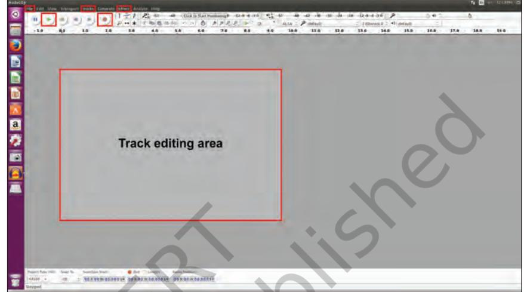

*Fig. 4.1 : Audacity Interface*

Let's begin with Audacity and Record Narration.

1. Go to file and click "New". A new window will appear (Refer Fig. 4.2).

*Raima*: Let us start creating our audio resource.

# *Audacity*

- Audacity is a free open source digital audio editor to record computer software application, available for Windows, macOS/ OS X, Linux and other operating systems.
- Interestingly, you do not need sound mixer or any other

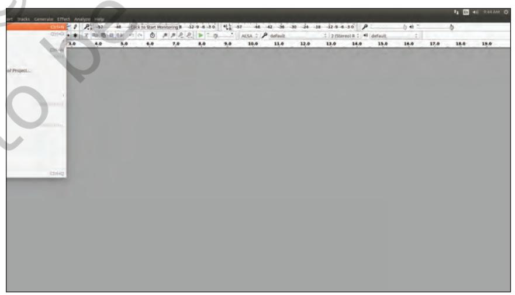

*Fig. 4.2 : Getting started*

Chapter 4.indd 60 27-Feb-19 4:47:24 PM

*Raima*: Let us add a new track (Refer Fig. 4.3).

| Audacity |  |  |  |  |  |  |  |  |  |  |  |  |  |  |  |  | 1 1 1 1 111.01 0 |
| --- | --- | --- | --- | --- | --- | --- | --- | --- | --- | --- | --- | --- | --- | --- | --- | --- | --- |
|  |  |  | Tile Edit View Thansport Thicks Cenerate Effect Analyze Beng- |  |  |  |  |  |  |  |  |  |  |  |  |  |  |
| Q | 11 1 | 10 | Ack time |  |  | Hom Tack Stineb Track. |  |  | Sinticiping 4 0 0 12 17 18 42 26 20 24 18 12 9 4 10 12 9 4 10 12 - 1 0 10 12 0 1 0 12 - 1 0 1 0 12 - 0 1 0 1 |  |  |  |  | b # = |  | 1 |  |
|  | - 8.0 | 0.0 | William # 11,00 (8) 40000 44 REE ROOM ROOMS |  |  | Lidrol Ruck Kens Track | 10 4 8.0 8.0 | HEA: P (ideal 10.0 | 11.0 | 42.0 | =   Z (Steres) in C = 4 / diefault. 13.0 | 14.0 | 15.0 | 19 16.0 | 27.0 | 18.0 | 18.0 |
|  |  |  | (1) 11 |  |  |  |  |  |  |  |  |  |  |  |  |  |  |
|  |  |  | WPSH T 1003 |  |  |  |  |  |  |  |  |  |  |  |  |  |  |
|  |  |  | M.Jze All Tacks |  | Clifeld |  |  |  |  |  |  |  |  |  |  |  |  |
|  |  |  | Unmule All Tracks |  | Schildlel |  |  |  |  |  |  |  |  |  |  |  |  |
|  |  |  | Align Tracks |  | 0 |  |  |  |  |  |  |  |  |  |  |  |  |
|  |  |  | Move Selection when Alloning |  |  |  |  |  |  |  |  |  |  |  |  |  |  |
|  |  |  | Syno Lock Tricks |  |  |  |  |  |  |  |  |  |  |  |  |  |  |
|  |  |  | Add Liber At Selection |  | ------------ |  |  |  |  |  |  |  |  |  |  |  |  |
|  |  |  | Addriver 1 |  |  |  |  |  |  |  |  |  |  |  |  |  |  |
|  |  |  | LAULABAL. |  |  |  |  |  |  |  |  |  |  |  |  |  |  |
|  |  |  | Sert Tracks. |  |  |  |  |  |  |  |  |  |  |  |  |  |  |
| Shipped. | Project fulbe lifer 44500 = | Seate The 1 Car | 560plint, Stard / Chi | Ond T Length I DONSUM CODDAL - DONGOM SO DOGS - DO ROOM DO DODE - | Audio Profile). |  |  |  |  |  |  |  |  |  |  |  |  |
| 日日日日 | DID 20 0 |  |  |  |  |  |  |  |  |  |  |  |  |  |  |  |  |

*Fig. 4.3 : Adding a new track*

A new track will appear in which you can record your voice or sound using either default microphone or the external microphone. Ensure that proper silence is maintained while recording. To start the recording click on the Red recording button (Fig. 4.4) and speak. To finish recording, press the Stop button or the Space Bar on your computer. You can insert more tracks in a similar fashion.

sophisticated device to use it.

## *Using Audacity you can*

- 1. record by default microphone or by external microphone.
- 2. edit, import and export audio files.
- 3. mix tracks by using envelop.
- 4. create effects and even increase amplitude.
- 5. use multiple tracks.

|  | Audacity Edit View | Transport Tracks Generate Effect Analyze He |  |  |  |  |  |  |  |  |  |  |  |  |  |  |  |  |  |  |
| --- | --- | --- | --- | --- | --- | --- | --- | --- | --- | --- | --- | --- | --- | --- | --- | --- | --- | --- | --- | --- |
|  | 11 |  |  |  | -43 | 0 0 | e |  |  |  | 2154 |  |  |  | 2 (Stereo) R = default |  |  |  |  |  |
|  | - 1.0 0 3 1.0 |  | 2.0 | 3.0 |  | 5.0 | 6.0 | 20 | 8,0 | 9.0 | 10.0 | 11.0 | 12.0 | 13.0 | 14.0 | 15.0 | 16.0 | 17.0 | 18.0 | 19.0 |
|  | Stop |  |  |  |  |  |  |  |  |  |  |  |  |  |  |  |  |  |  |  |
|  | Recording |  |  |  |  |  |  |  |  |  |  |  |  |  |  |  |  |  |  |  |
|  |  |  | Begin |  |  |  |  |  |  |  |  |  |  |  |  |  |  |  |  |  |
|  | DEDDDDBBB |  | Recording |  |  |  |  |  |  |  |  |  |  |  |  |  |  |  |  |  |
| Selection Start: | 5640 B Project Rate (Hz) |  | Erd . Length |  |  | Natio Posibion |  |  |  |  |  |  |  |  |  |  |  |  |  |  |
|  | 44100 W OH Stonner |  | 00 h 00 m 00 000 s - 00 h 00 m 00 000 s - |  |  |  | 00 h 00 m 00 000 s . |  |  |  |  |  |  |  |  |  |  |  |  |  |

*Fig 4.4 : Recording an audio*

Chapter 4.indd 61 27-Feb-19 4:47:25 PM

*Nancy*: While recording, you have coughed a couple of times. How can it be removed?

*Raima*: After recording, editing can be done to remove unwanted sounds, such as fumble, repeated sentences, coughing, pops, etc. Using the selection tool we can select the portions to be deleted, as shown in Fig. 4.5.

Once selected, press *Delete* on your keyboard or delete using the *Edit* menu.

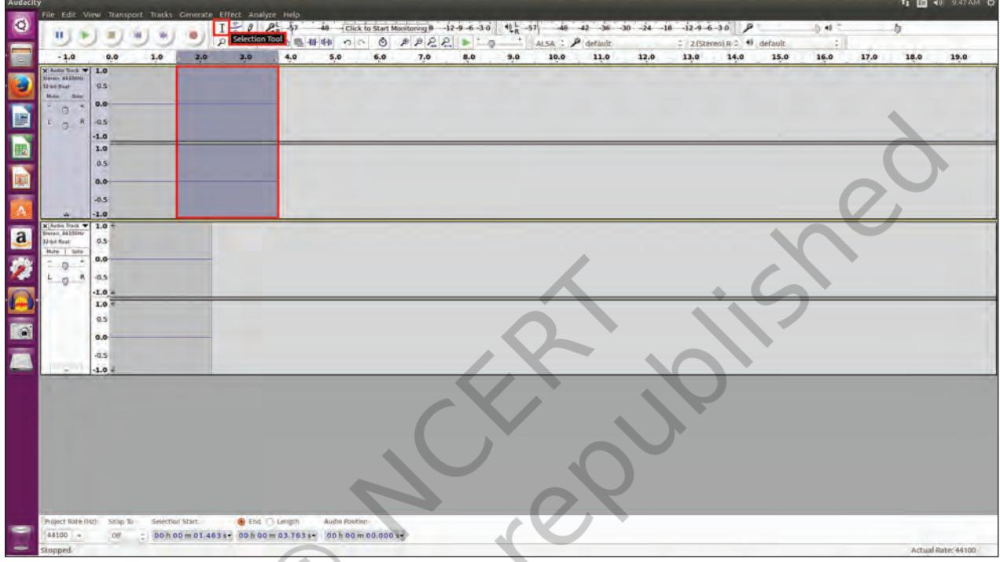

*Fig. 4.5 Editing the track*

*Neer*: Can we add music and sound effects?

*Raima*: Add a new Track to put Music or Sound effects. Make sure that you already have the required music file on your computer. Click on the File in the menu bar and choose the *Import* option. After clicking on the *Import* option, browse and select the audio file.

It will be imported on the new track.

*Neer*: How do we mix these tracks?

*Raima*: You can mix tracks using the *Tracks Menu* option.

Chapter 4.indd 62 27-Feb-19 4:47:26 PM

| Audacity | 11 10 40 9:48 AM # | File Edit View Transport Tracks Generate Effect Analyze Help | 0 | 1 - 1 8 Pa - 5 - 40 - Click to Sant Maritoring B - 12 - - - 3 0 - 24 - 18 - 12 |  |  |  |  |  |  |  |  |  |  |  |  |  |  |  |  |
| --- | --- | --- | --- | --- | --- | --- | --- | --- | --- | --- | --- | --- | --- | --- | --- | --- | --- | --- | --- | --- |
| 9 | 4 | ( 200 | . | ■ | 11 1 | - - Envelope Tool # # n - 0 A P & 2 = 0 + | ALSA : P default | 2 (Stereo) R = 49 default | : |  |  |  |  |  |  |  |  |  |  |  |
| 19.0 | 0.0 | 1.0 | 2.0 | 3.0 | 4,0 | 5.0 | 6.0 | 7.0 | 8.0 | 9,0 | 10.0 | 11.0 | 12.0 | 13.0 - 14.0 | 15,0 | 16.0 | 17.0 18.0 | - 1.0 | X Andre Back ▼ 1.0 | 314rater, 64100Hz |
| 2 | 02 | 32-biz 86at | Mola | Note | 0.0- | C |  |  |  |  |  |  |  |  |  |  |  |  |  |  |
| ■ | -0.5 | K | C | -1.0 | 6814 | 1.0 |  |  |  |  |  |  |  |  |  |  |  |  |  |  |
| 0.5 | 0.0 |  |  |  |  |  |  |  |  |  |  |  |  |  |  |  |  |  |  |  |
| -0.5 | -1.0 | A |  |  |  |  |  |  |  |  |  |  |  |  |  |  |  |  |  |  |
| X Audio Dock + 1.0 | a | Shereo, ad 100Hz | 0.5 | 32-ant first |  |  |  |  |  |  |  |  |  |  |  |  |  |  |  |  |
| Mar - Sale | 0.0 | . | 9 |  |  |  |  |  |  |  |  |  |  |  |  |  |  |  |  |  |
| -0.5 | P | D | -1.0 € |  |  |  |  |  |  |  |  |  |  |  |  |  |  |  |  |  |
| 1.0 | 0.5 | 0 |  |  |  |  |  |  |  |  |  |  |  |  |  |  |  |  |  |  |
| 0.0- | -05 |  |  |  |  |  |  |  |  |  |  |  |  |  |  |  |  |  |  |  |
| -1.0 |  |  |  |  |  |  |  |  |  |  |  |  |  |  |  |  |  |  |  |  |
| End. End. Leigth | Project Rate (Rz): 5dap To | Selection Start: | Austin Position: | 0 | = 00 h 00 m 01,463 = 00 h 00 m 03,763 = 00 h 00 m 00,000 s = | 44100 - | OH |  |  |  |  |  |  |  |  |  |  |  |  |  |
| Actual Rate: 44100 | Stopped. |  |  |  |  |  |  |  |  |  |  |  |  |  |  |  |  |  |  |  |

*Fig. 4.6 Mixing of tracks*

The software will mix your narration and other sound tracks effects, as shown in Fig. 4.6.

*Raima*: Before going further, lets save our file. The final track can be saved in the default .aup format (Audacity Project) which is an editable format.

*Nancy*: Is it possible to add this track in my presentation?

*Raima*: For this you have to convert it into a suitable format like .mp3 or .ogg using the Export option. Refer Fig. 4.7.

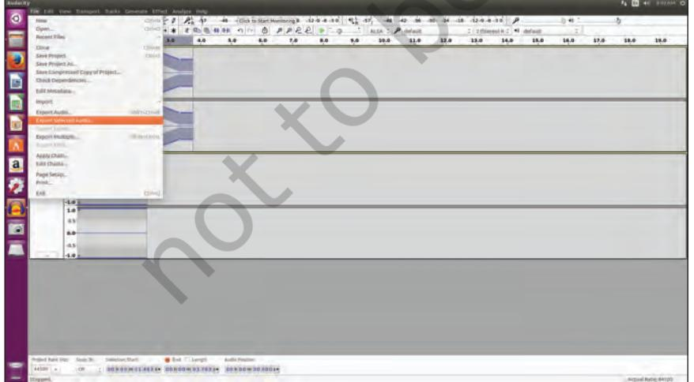

*Fig. 4.7 Exporting the audio*

Creating Audio‑Video Communication 63

Chapter 4.indd 63 27-Feb-19 4:47:27 PM

# *Types of Video editing software*

- Openshot video Editor
- Blender
- DScaler
- Pitivi shortcut
- Videolan movie creator
- Video Editor
- Avidemux, etc.

*Nancy* and *Neer*: Now we have learnt the creation and editing of audio file. Let's now learn about the Video editing tool.

*Raima*: I know an editing tool OpenShot video editor for editing videos, as shown in Fig. 4.8.

*Nancy*: Let's try and edit the video showing the techniques of water purification that we have recorded earlier.

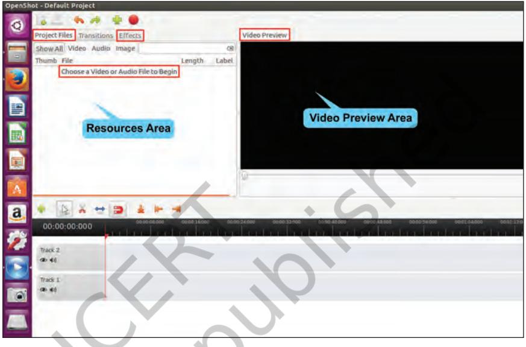

*Fig. 4.8 Openshot Interface*

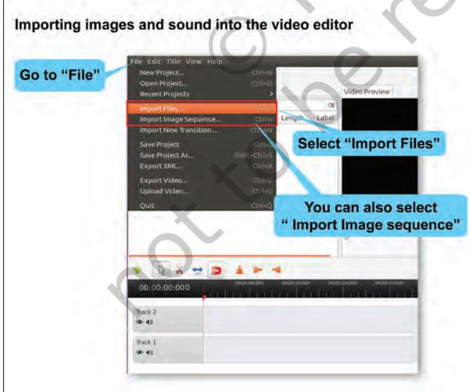

*Fig. 4.9 (A) Importing files (Method 1)*

*Neer*: I am sure the first step is to compile all the information and organise the video files and record audio narration in a folder.

*Raima*: You are very right Neer. Once, you complete organizing the information, you need to import all images and video files to the openshot video editor, as shown in Fig. 4.9(A) & Fig. 4.9(B).

Chapter 4.indd 64 27-Feb-19 4:47:29 PM

*Raima*: Interestingly, there are two ways to add images on the timeline. One of them is to drag the three pictures one after the other to "Track 2", as shown in Fig. 4.10. Remember that it is possible to change the sequence in which these images will appear in the slide show by dragging and re‑arranging them in the timeline.

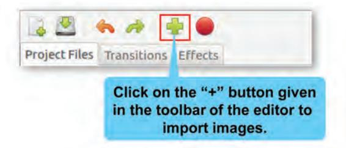

*Fig 4.9 (B) : Importing files (Method 2)*

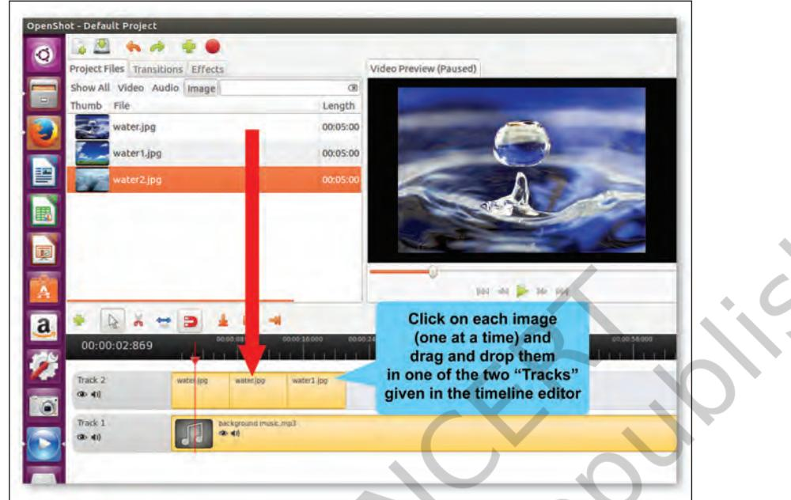

*Fig. 4.10: Adding images on the timeline (Method 1)*

*Raima*: The other way is to select one image at a time by using the Add to Timeline option, as shown in Fig. 4.11(A) and Fig. 4.11(B).

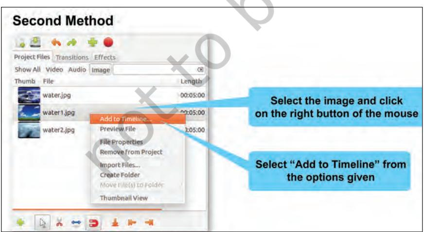

*Fig 4.11 (A) : Adding images on the timeline (Method 2)*

Image and audio files can also be imported using the shortcut key "Ctrl+F".

Creating Audio‑Video Communication 65

Chapter 4.indd 65 7/16/2020 2:45:56 PM

|  | Add to Timeline |  |  |
| --- | --- | --- | --- |
| Thumb | File Lengl ▼ Timeline Location water.ipg 00:05: Start Time (seconds): | 2.87 |  |
|  | Top Track: | Track 2 |  |
|  | Bottom Track: | Track 1 A |  |
|  | Fade |  | Click on "Add" to |
|  | Fade: | No Fade | add the image |
|  | Length (in seconds): | 2.00 | to the timeline |
|  | Transition Transition: | No Transition |  |
|  | Length (in seconds): | 2.00 |  |
|  |  | Cancel Add |  |

*Fig. 4.11 (B): Adding images on the timeline (Method 2)*

*Neer* : Can we add some background music to the slideshow to make it more interesting?

*Raima*: Yes, you can easily add an audio file by dragging it from "Project File" window and dropping it in "Track 1" of the timeline, as shown in Fig. 4.2.

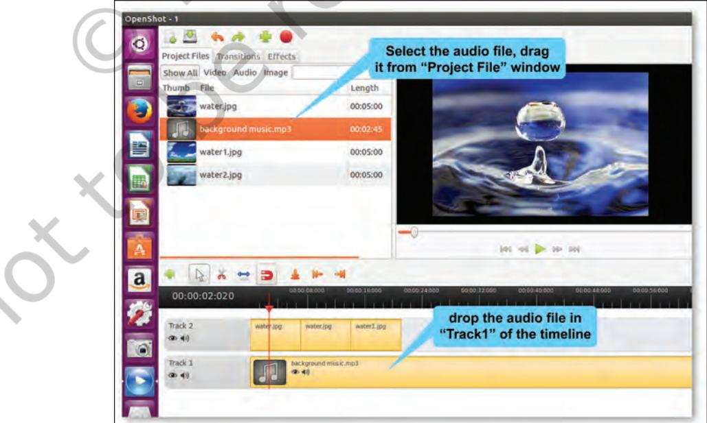

*Fig. 4.12: Adding sound to the timeline*

66 ICT Textbook—Class IX

Chapter 4.indd 66 7/23/2020 3:29:11 PM

*Nancy*: Does this "♫" mean that an audio has been added on Track 1?

*Raima*: Good observation Nancy.

*Nancy*: Can I now preview the project?

*Raima*: Yes. You can do that by clicking on the "Play" button in the preview window. Refer Fig. 4.13. Remember, if you need to re-arrange any clips, just drag and drop the clips to move them.

Neer: Can I use this video in my presentation?

Raima: First let's save this video in the default .osp format (as shown in Fig. 4.14) which will allow us to edit it later. But to use this video in our presentation, we will have to export it in a suitable format like .mp4 or .ogg., as shown in Fig. 4.15.

Click on the save Icon in the toolbar or use shortcut key Ctrl+S to save your project.

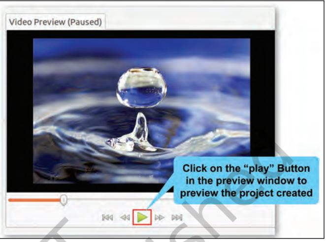

*Fig. 4.13: Project Preview*

| File Edit Title View Help |  |  |
| --- | --- | --- |
| New Project ... |  |  |
| Open Project ... |  |  |
| Recent Projects |  |  |
| Import Files ... |  |  |
| Import Image Sequence ... | Ctrl+ |  |
| Import New Transition ... | Ctrl+W |  |
| Save Project |  | Click on File menu and select 'Save |
| Save Project As ... | Shift+Ctrl+S | project' option |
| Export XML ... | Ctrl+X |  |
| Export Video ... | Ctrl+E |  |
| Upload Video ... | Ctrl+U |  |
| Quit | Ctrl+0 |  |

*Fig. 4.14: Save the project*

Chapter 4.indd 67 27-Feb-19 4:47:33 PM

| × Export Video |  |  |  | Choose name for |
| --- | --- | --- | --- | --- |
| File Name: | Default Project |  |  | the project |
| Export to Folder |  |  |  | Choose location for the project |
| Simple |  | Advanced |  |  |
| Select a Profile to start: |  |  |  | Select "All Formats" in |
| Profile: | All Formats |  |  | "Profile" |
| Select from the following options: |  |  |  | "Target" by |
| Target: | OGG (theora/vorbis) |  |  | default will be |
| Video Profile: | HD 720p 29.97 fps |  |  | "OGG" |
|  |  |  |  | . For "Video |
| Quality: | Med |  |  | Profile" select |
|  |  |  |  | "HD 720p |
|  |  |  |  | 24fps" option |
|  |  | Cancel | Export Video | Select "medium" |
| Click "Export Video" |  |  |  | "Quality" of |
| to complete the |  |  |  | the project |
| process |  |  |  |  |

*Fig. 4.15: Export the project*

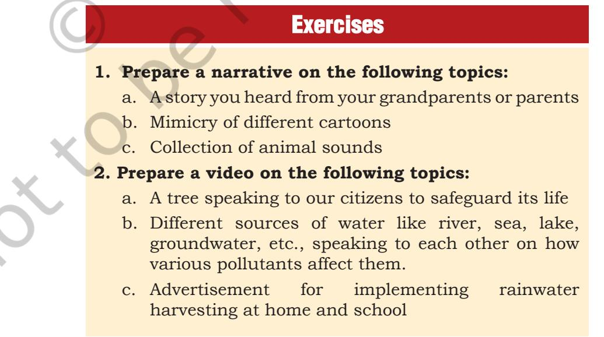

Chapter 4.indd 68 27-Feb-19 4:47:34 PM

# **3. Test yourself**

- a. Match the following

| Audacity | Recording Device |
| --- | --- |
| Smart Phone | Audio Tool |
| Open Shot | File Format |
| .osp | Video Editor |
| .aup | Audacity |

- b. Identify whether the following statements are True or False
	- i. .MP3 is the format in which video files can be saved. (T/F)
	- ii. Blender is a video editing software. (T/F)
	- iii. Audacity is a free and open source digital audio editor. (T/F)
	- iv. Open Shot is a software used for audio editing.
	- v. Music files can be imported in Audacity to prepare audio resource. (T/F)

(T/F)

Creating Audio‑Video Communication 69

Chapter 4.indd 69 27-Feb-19 4:47:34 PM

