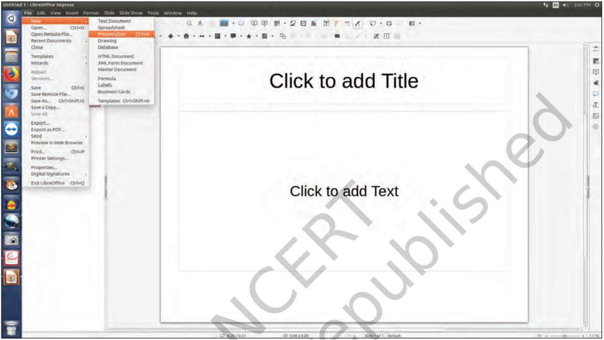

During their recent school trip, Samayra and Shirom got the chance to explore the historical places of Delhi, the capital of India. Few of their classmates were not able to join them.

*Samayra*: I wish all our friends were here with us. They not only missed the fun but also the knowledge about our rich heritage.

*Shirom*: It does not matter. Let us do something so that they don't miss out on the learning.

*Samayra*: That would be nice. But how can we do it?

*Shirom*: Let us compile our experiences, highlighting the captured moments of the trip in a report.

*Samayra*: But this report will not give our friends the real picture of our experience and our interaction with the guide, etc.

*Shirom*: True. Then let's make a presentation.

*Samayra*: Shirom, what do you mean by a presentation?

*Shirom*: A presentation is used to present information using text, images, audio, video and animations. Do you know we can even add our narration to the slides ?

*Samayra*: Oh is it? This would be wonderful.

Chapter 5.indd 70 7/16/2020 2:51:42 PM

*Shirom*: There are various ways to make effective presentations by including voice overs, videos and animations. It is going to be very interesting. Let us use *Impress*, a presentation tool from *Libre* **Office Suite.**

*Shirom*: Let us start. The first step is to open it by clicking on the *Impress* icon present on the desktop.

*Fig. 5.1: Impress interface*

*Shirom*: By default a slide with Title Layout will appear, when we open a blank presentation as shown in Fig.

5.1. We can choose the desired Layout from the various layouts, as shown in Fig. 5.2. *Samayra*: Let us start.

*Shirom*: We can start with the first slide by giving a title: 'Historical Place of Delhi' in the top placeholder and subtitle below it in the workspace area, as shown in Fig. 5.3.

*Samayra*: Shirom, can we add our names also?

*Fig. 5.2: Choosing the slide layout*

Presenting Ideas 71

Chapter 5.indd 71 7/16/2020 2:51:55 PM

*Shirom*: Sure, let us do that.

*Fig. 5.3: The title slide*

Layout helps to decide the placement of text or pictures on a slide.

*Samayra*: Can we add more content, such as text (as shown in Fig. 5.4), photographs or images, audio and videos, which we have collected during the visit.

*Shirom*: No. We will need more slides for that. Let us add more slides to our presentation.

*Samaira*: Great! Seems interesting. I hope our presentation will help them to get the feel of the trip.

*Fig. 5.4: Adding text content*

Chapter 5.indd 72 28-Feb-19 3:35:59 PM

*Samayra*: Shirom, can we add a picture of the Red Fort?

*Shirom*: Yes, we can do that by using the **Insert Menu**  (Refer Fig. 5.5).

*Fig. 5.5: Inserting an image*

*Samayra*: Once, we have inserted the image, can we also add some special effects to our images and text to make our presentation more attractive and grab attention of the audience.

*Shirom*: Yes, indeed! Let us select the text or object to be animated and add some custom animation to it, as shown in Fig. 5.6.

*Fig 5.6 : Animating the image*

For example, you may choose to apply various effects that may change the Font Size and apply special effects to the text, such as Blink and save that effect on the text.

Presenting Ideas 73

Chapter 5.indd 73 7/16/2020 2:52:13 PM

Similarly, you can apply different effects in your slide to make your presentation interesting and attractive.

*Samayra*: Oh! Great but tell me how to check what we have done so far?

*Shirom*: For this we will preview our presentation using Slide show option, as shown in Fig. 5.7. To do, press F5 key or using the Slide Show menu. Let me now tell you one more interesting feature: *Slide Transition* which can be added from the view menu.

*Fig. 5.7: Slide show*

*Samayra*: I have taken a recording clip of the guide narrating the story. Also if we could insert the audio clip too! Moreover we have some video clips that also could be inserted in our presentation. It will make our presentation lively and more informative.

*Shirom*: Yes, let us do it using the *Audio or Video*  option of the *Insert Menu*, as shown in Fig. 5.8.

*Samayra*: Tell me the steps how I should do it.

Chapter 5.indd 74 28-Feb-19 3:35:59 PM

*Fig. 5.8: Adding sound*

*Shirom*: Now, if you wish, you can add more information in your presentation to enhance it with various colourful slides, animations, transitions effects and media and make it ready for the show. You can share your experiences of the trip with your classmates in the class with the help of projector and cherish the moments by viewing the slideshow. Once the show has started and in between if you would like to go to the next slide or previous one at a time, then Right-clicking anywhere on the screen brings up the floating menu that allows navigation of the slides as shown in Fig. 5.9.

*Fig. 5.9: Navigating in slide show*

*Samayra*: Shirom, can we view the sequential arrangement of all the slides on a single screen?

Avoid adding too many animation effects on a slide as it reduces the focus on the main content.

Chapter 5.indd 75 7/16/2020 2:52:28 PM

*Shirom*: Yes, we can. The slide sorter view (as shown in Fig. 5.10) shows all the slides on the same screen which may help us re-arrange them if required.

*Fig. 5.10: Slide sorter view*

*Samayra*: Now we are ready to share our presentation with all our classmates.

*Shirom*: No wait. To share the presentation we should convert it into Portable Document Format (PDF) (as shown in Fig. 5.11) which is an open standard file format for file viewing and sending it to someone.

*Fig. 5.11: Exporting to PDF*

Chapter 5.indd 76 28-Feb-19 3:36:00 PM

*Samayra*: It was so interesting to learn how to make a presentation and share it with our friends. No effects or

## Exercises

## **1. Prepare a presentation on the following topics:**

- (i) Your personal experience of meeting people in orphanage, old age home, etc.
- (ii) Experience of summer vacation
- (iii) School's Annual day celebrations
- (iv) Biography of a scientist or a historian

## **2. Test yourself**

- (a) Identify whether the following statements are True or False
	- (i) We can make changes in the PDF version of any file. (T/F)
	- (ii) We can insert video and audio clips in a presentation. (T/F)
	- (iii) The number of slides that can be added in a presentation has a limit. (T/F)
	- (iv) Impress is a free and open source presentation tool. (T/F)
	- (v) The background and design of the presentation cannot be changed once saved. (T/F)

animations can be seen in PDF.

Chapter 5.indd 77 28-Feb-19 3:36:00 PM

