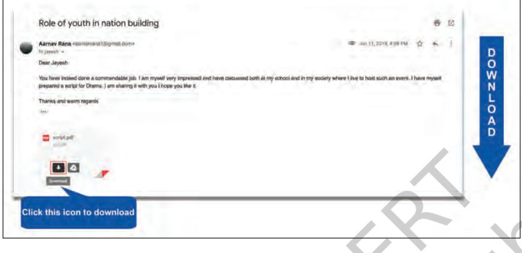

Recall the instances in previous chapters when

- • Muskan shared video of her experiment with her classmate using a messenger app.
- • She created a blog and shared the images she clicked when she visited the state museum of Bhubaneswar.
- • She thought of placing the song on web which she sang in a school function.
- • She started speaking to Hasmukh on Skype instead of telephone.
- • She shared the digital album of her birthday with Hasmukh through email.
	- • She decided to join an online course on puppetry during her summer vacation.

Reflect how all this was possible.

Internet is used to search and gather resources to enhance knowledge and to complete your projects. In earlier times, library was the most sought after place for gathering information from books and encyclopaedias. But nowadays Internet has made it possible to search and gather variety of multimedia resources for learning. Take example of a project on "Role of youth in the development of a nation".

Chapter 6.indd 78 7/16/2020 2:57:11 PM

You can get resources on the above topic from the Internet. These days, almost all information and services are available on the Internet. For logging on to the Internet, you just need an electronic device (preferably computer/laptop/smartphone/tablet) with an Internet connection. You can access a large number of resources and information stored on the World Wide Web (WWW). In order to access the resources in WWW, we need a software called Web Browser. Web browsers are generally present in our computer system. A few popular web browsers have been shown in Fig. 6.1 , fill in the blanks with any two other web browsers.

*Fig. 6.1: Web browsers*

When you click on the browser icon in your computer, the following window will be opened. On top of the browser window, there is an address bar as shown in Fig. 6.2.

| CA Binglant: (x) 1.991 |  |  |
| --- | --- | --- |
|  | About Us   Organisation   Constituents & Departments   Programmas   Gallery   Publications   Announcements |  |
| 800 1 |  |  |
| TODAY'S WORD | LINKS Lest Updated: 8/6/2018 | NUTC BOARD |
|  | · Leading the Change, 50 years of NCERT · Images · 50 years of NCERT | THE FOR HE STORE FOR F |
|  | · National Policy on Education · Linguistic Resources and tools | · Transmission schedule for the month of May 2018 7 ver |
|  | · NCFs and XXI National Focus Group Position Papers Syllabus of Classes I-XII |  |
|  | . E-Books | Specimen copy of Omr answer |
| Interaction of Hon'ble PH with students | Annual Reports   Accounts | sheet Lists |
| National Repository | Syllabus for Pupil Teachers (B.Ed   M.Ed   M.Phil Books for Pupil Teachers : B.Ed Textbooks |  |
| Results Framework Document | Space Application in Education | Download E-Admit Card for |
| Talent Search [NTSE] | Ebasta | NTS-Stage-il Examination to be |
| Research Grants [ERIC] | Vikaspedia | held on 13.05.2018 1/2 |
| Educational Survuy | Shaala Sarathi |  |
| Innovative Awards | Ministry of Human Resource Development (MHRD). |  |
| Science Exhibition [JNNSHEE] | Government of India |  |
| Adolescence Education | ANNOUNCEMENTS |  |
| NCERT Library | · Online Course on Action Research in Education New |  |
| Quality Monitoring Lools (QHTs) | = National Conference on Ancient Indian knowlege: Science |  |
| School Kits & Lab Manual Official Language | and Technology(July, 17-19, 2018) Most · Interview of the candidates for the post of Assistant |  |
|  | Professor in English    Corrigendum/ Addendum New! |  |
| PROCUREMENT Online Textbooks | · Interview of the candidates for the post of Associate Professor in English New |  |
| HEAD PUBLICATION DIVISION | · Interview of the candidates for the post of Professor in English New |  |

*Fig. 6.2: Layout of Mozilla Firefox browser*

GETTING CONNECTED : INTERNET 79

World Wide Web (WWW) is an information space on the Internet where documents and other resources are stored.

A Web browser is a software for accessing information and resources on the World Wide Web.

Chapter 6.indd 79 28-Feb-19 3:38:19 PM

A Webpage is a collection of information in the form of multimedia resources. The Website is a collection of Webpages.

The address bar let you type the address of the resource which you want to access on the web. Every resource is available in a web page on the web. Once you type the URL in the address bar, the webpage will open from where you can access the resources.

A website contains many webpages. The first page that you see, when you open a website is the Home Page.

### Activity 1

- Open the website by typing the address creativecommons.org in the address bar.
- Keeping in mind the title "Role of youth in the development of a nation", explore resources related to your project.

While exploring the website, you might have noticed that when you hover the mouse over certain text/ images, the cursor changes to <insert hand symbol>. This signifies that the text/image is a link to another webpage or resource which is known as Hyperlink.

# Activity 2

• List and click on any of the three hyperlinks in the website: *creativecommons.org*

___________________________________________________ ___________________________________________________ ___________________________________________________

A Search Engine is a tool that allows to search for information on web.

Suppose you are not aware of the URL of the website from where you can access the resources or if you want to search the web for finding more information/ resources, you can take help of the Search Engine.

Following are a few popular search engines:

| Name | Address |
| --- | --- |
| Google | google.com |
| Bing | bing.com |

Chapter 6.indd 80 7/16/2020 2:57:39 PM

| Yahoo | yahoo.com |
| --- | --- |
| Ask | ask.com |
| DuckDuck | duckduckgo.com |

*Table 6.1: Popular search engines*

To search information/resources using a search engine you need to use keyword in the Search Box as shown in Fig. 6.3.

| Fig. 6.3: Search Engine |
| --- |

While using search engines, a good plan can save your time. Before searching ask yourself the following questions like:

- What type of information am I seeking (ideas, facts, opinions, options)?
- What form of information am I seeking (text, images, videos)?

According to the above questions, select the keywords. Use words related to the type of information you seek.

Chapter 6.indd 81 7/16/2020 2:57:39 PM

Word or phrase entered in the search box helps the search engines to list those webpages which contain that word or phrase. Now for your specific search the entered word or phrase becomes the keyword.

Select precise words and avoid common words, such as the, of, apply etc.

## Activity 3

As per the project titled "Role of youth in the development of a nation", you need to get the information and resources. So you can use the keyword "Role of youth in the development of a nation" in the search engine to search for resources. Explore the result page and answer the following questions:

- • What types of multimedia resources you could see?
- • Did you find any hyperlinks in the result page?
- • How can you get a different result page for the same keyword?
- • Were you able to find a result page for your search containing only images?

Did you get what you were looking for, by using the keyword which you had listed above? If not, reframe the keyword by answering the following questions:

- • What exactly are you looking for?
- • What words will describe your search best?
- • What if you want only images related to your keyword?

If you are sure about the type of multimedia resource you are looking for, then the search engine helps you filter the resources based on your requirement. If you notice in the result page, by default the results are displayed under the heading 'All' but there are other headings that help you to categorise the search result on the result page as shown below.

*Fig. 6.4: Heading in search engine*

In order to get a result page containing only images, you can click on the Images heading or if you are looking for only videos, you can click on the Videos heading. This helps to categorise the search based on particular type of resources.

Chapter 6.indd 82 28-Feb-19 3:38:20 PM

Sometimes while accessing multimedia resources you might come across a prompt asking you to install a 'plug‑in' by clicking on the link mentioned in the prompt. Go ahead and click on the link to install plug‑in and access the resources.

## Activity 4

Use the keywords written in the above graphic organiser to search only for images in search engine.

*Note*: Whenever you use the resources taken from the web, you should cite reference to the source from where you have taken it. It ensures that you are giving credit to the owner who actually created it.

To plan further for your event and to collect resources according to your requirement, you need to identify the keywords for the programme items. Fill in the graphic organiser depicted in Fig. 6.5 with appropriate keywords for the listed programme items and write programme items of your choice along with keywords for searching resources for these programme items using the search engine.

*Fig. 6.5: Identifying keywords*

Now you must be comfortable using simple keywords in search engines to collect resources for your event. But if you want to search information/resources very specific to your requirement, then you can do advanced search using search operators like **AND, OR,** " ", … as

GETTING CONNECTED : INTERNET 83

A plug‑in is a software which provides additional functionality to the browser allowing it to display the content.

Chapter 6.indd 83 28-Feb-19 3:38:20 PM

mentioned in the table given below. These operators help the search engine to narrow down the focus of search (Refer Table 6.2).

| Operator | Example |  |  |  | Purpose |
| --- | --- | --- | --- | --- | --- |
| AND | youth AND nation |  |  |  | The result shown will include pages having all the keywords. |
| OR | youth OR nation |  |  |  | The result shown will include pages having at least one of the keywords. |
| " " | "Role in | of | youth | the | The result shown will include pages |
|  | development of nation" |  |  |  | having the entire keywords. |
| … | "Role of youth" 1990…2018 |  |  |  | The result shown will include pages having the specified number range. |

| Table 6.2: Search operators |
| --- |

The process of saving the URL of the webpage for future reference is known as Bookmarking.

While searching for resources, you might come across certain web pages which you wish to refer to later. You can take a print out of the web page but that would lead to paper wastage. So instead you can bookmark the web page to enable quick access to the webpage in future. To bookmark the webpage or website, click on the Bookmark icon (which looks like a star) in the address bar as shown in Fig. 6.6.

|  | lick here to book mark |
| --- | --- |
|  | Edit View history Search Wikipedia |
|  | From Wikipedia, the free encyclopedia |
| Main page | For nation-building in the sense of enhancing the capacily of state institutions, building state-society relations and also external interventions, see State-building. |
| Contents | Nation-building is constructing or structuring a national identify using the power of the state. [ It is thus narrower than what Paul James calls "nation", the |
| Featured content |  |
| Current events | broad process through which nations come into being.00 Nation-building aims at the unlication of the people within the state so that it remains politically stable and viable |
| Random article | in the long run. According to Harris Mylonas, "Legitimate authority in nodern national states is connected to popular rule, to majorities. Nation-building is the process- |
| Donate to Wikipedia | through which these majorities are constructed. 131 |
| Wikipedia store | Nation builders are those members of a state who take the initiative to develop the national community through government programs, including milliary conscription and |
| Interaction | national content mass schoping. No Nation-building can involve the use of propaganda or major infrastructure development to foster social harmory and economic |
|  | growth. |
| Help |  |
| About Wikipedia | Contents (hide] |
| Community portal |  |
| Recent changes | 1 Overview |
| Contact page | 2 Terminology: Nation-building versus state-building |
|  | 3 References |
| Tools | 4 Sources |
| What links here |  |
|  | 5 External links |
| Related changes |  |
| Upload file |  |
| Special pages | Overview (edit) |
| Permanent link |  |
| Page information | In the modern era, nation-building relemed to the efforts of newly independent nations, natably the patiens of Arica bui atso in the Balkans, PD I by redeline l're populace o |
| Wikidata item | territories that had been carved out by colonial powers or empires without regard to ethnic, religious, or diber boundaries.00 These reformed states would then become . |
| Cite this page | viable and coherent national entitles. 91 |
| Printlexport | Nation-building includes the creation of national paraphernalia such as flags, antherns, national stadiums, national stadiums, national arifines, national larifines, national |

*Fig. 6.6: Bookmarking*

Chapter 6.indd 84 28-Feb-19 3:38:22 PM

### **Evaluation of the Resources**

You must have gathered lot of information from the Internet for your event by now. But you should remember that all the information available on the Internet cannot be guaranteed for quality or accuracy. So it is important to evaluate the resource or information. Keep in mind that anyone can publish anything they wish on the Web. It is often difficult to determine the ownership of the Web resources. So it is your responsibility to evaluate the resources effectively based on the following criteria:

- • Who has made the website and how to contact the website owner?
- • What is the website about? Is it commercial, educational, etc.?
- • Is the website for teachers or for students or for both?
- • Is the information reliable on the website? Always cross check the given information from other websites and other authentic sources like books, experts, etc.
- • Check whether the website offers free information or paid information?

After gathering resources, it is time to make use of them for your event. You might have downloaded text, images, audio, videos related to your programme items. Use your creativity by customising the resources gathered from the web using the ICT tools. You should identify the right ICT tools to prepare the programme using the resources you have gathered.

*Fig. 6.7: ICT tools in identification*

Getting Connected : Internet 85

Chapter 6.indd 85 28-Feb-19 3:38:22 PM

### **Safe Practices while Searching**

- • While searching information for your event on the internet, few questions might have struck your mind like
	- • Is the Internet safe for me?
	- • How can I differentiate between a real and a fake website?
	- • What do I have to do to be a safe user of Internet?

All computer users ask these questions to themselves every day. The Internet offers so many opportunities to explore. But it is important to keep yourself safe and secure, so that you can make the most of it. The tips given below will help you to search the web safely and securely.

- • It is always advisable to access resources from websites which have "https" in the URL as it indicates that it is a secured website.
- • Make sure the "Safe Search" Setting of the web browser is ON.
- • Think twice before clicking the links as it might lead to websites not appropriate for your age.
- • Most of the interaction with the Web is through the browser. So the choice of the Web browser should be of utmost priority.

Now you are ready to present a great show with a variety of multimedia resources created by you for the event. Ensure the required hardware resources like projector, speaker, etc., are available to use these multimedia resources during the event. Such remarkable effort will lead to an exceptional result but it is advisable to take feedback and remedial measures to ensure an effective event execution.

You have taken the first step of showcasing a remarkable event that was appreciated by the audience who were present there. With the appreciations you received, you are motivated to share your experience, the photographs and videos taken during the event to your friends.

Chapter 6.indd 86 28-Feb-19 3:38:22 PM

# Activity 5

Can you think of various ways through which you can share your experience with your friends?

_______________________________________________________ _______________________________________________________ _______________________________________________________

You have effectively acquired the skills of searching information using a search engine. Besides searching you can also communicate and share information with the people using Internet. There are many ways of communicating and sharing information on the Internet, one of them is Electronic mail (Email). Emails can be sent from anywhere, anytime through the Internet‑enabled devices, such as like PC, laptop, smartphone, etc. To send and receive emails you need to create an account with any of the email service providers some of which are mentioned in Table 6.3.

| Email Service Providers | URL |
| --- | --- |
| Gmail | gmail.com |
| Yahoo mail | login.yahoo.com |
| mail | mail.com |
| Outlook | outlook.com |

| Table 6.3: Email service providers |
| --- |

To create an email account on the email service provider you need to follow the below given steps.

- • Type the URL of any of the email service provider in the browser and click Create account/Sign Up/ Register.
- • Specify a unique username. (The email service provider prompts in case the username is already chosen).
- • Choose a strong password consisting of uppercase, lowercase letters, numbers and special symbol(s). Passwords are case sensitive.

Chapter 6.indd 87 28-Feb-19 3:38:22 PM

- • Fill in the mandatory personal information like first name, last name, date of birth, gender, etc.
- • Carefully go through the Terms and Conditions before clicking on Agree button.

The account created will be in the format username@ email-service-provider like shiksha@gmail.com or shiksha@yahoo.co.in

- • Click Compose/Write
- • Enter your friend's email ID in "To" box
- • Write the subject of your email
- • Write the content of the message
- • Attach your document(s) if needed as shown in Fig. 6.9.

Chapter 6.indd 88 28-Feb-19 3:38:23 PM

### **Components of email message**

**To**–Mail ID of the person to whom we want to send the mail.

**Subject** –It is a description of the topic of the message

**Cc (Carbon copy)** –Mail ID of the person to whom we want to send the copy of the mail

**Bcc (Blind Carbon Copy)**–Mail ID of the person to whom we want to send the copy of the mail but these mail IDs will not be visible in the email.

 –Attachment icon to insert documents in the mail. Send–A button which sends the mail when clicked.

Chapter 6.indd 89 28-Feb-19 3:38:26 PM

*Fig. 6.9: Attaching a document*

You have successfully sent the mail to your friends about your event experience with some documents as attachments.

One of your friends, Taleem who received your email also shared the script written by him for a similar event that he has planned and is asking for your opinion. You can see his mail in the inbox. You can click on the email to read its content as shown in Fig. 6.10.

| Goagle |  |  |  | a | ::: . 124 |
| --- | --- | --- | --- | --- | --- |
| Gmail · | 17 | C | More T |  | 1-50 of 2,424 > 0- |
| COMPOSE |  | Divya Talwar (via Google. |  |  | Jun 13 |
| Inbox (705) |  | Tarkeshwar Gupta |  |  | B Jun 13 |
| Starred Important |  | Deeply Gupta |  |  | B Jun 13 |
| Sent Mail |  | Martur, ma (2) |  |  | B Jun 13 |
| Drafts (52) |  | Sujata Solanki |  |  | E Jun 13 |
| · Categories |  | Chelna Khanna |  |  | B Jun 12 |
| [imap]/Sent Jimaoy Trash |  | Chetna Khanna |  |  | B Jun 12 |
|  |  | Sender |  |  | Signifies the mail has an attachment |

If there is any attachment in the mail then you need to be careful and question yourself before downloading the attachment as there is a chance that the attachment is infected with virus.

90 ICT TEXTBOOK — CLASS IX

Attaching a document to your email is also known as uploading.

Inbox is an electronic folder in the email account where all the received mails are stored.

Chapter 6.indd 90 28-Feb-19 3:38:28 PM

### **Checklist for Downloading**

Always be alert. An attachment can be a malware, such as virus which are harmful to the computer and its user. So check for the following before proceeding.

- • Is it from a trusted source?
- • Is it in a known format?
- • Did you perform anti‑virus scan?

Once you get answers for the above questions positively, and then follow the steps shown in the Fig. 6.11.

A virus is a harmful program which when enters the computer, affects the performance of the computer and destroys its data.

#### Anti‑virus

programmes are used to detect and destroy computer virus. Examples of Anti‑ virus programs are Norton, Kaspersky, Mcafee, etc.

*Fig. 6.11: Inbox*

We learnt how to access the Internet and communicate using email. You must have also heard about the various security concerns in this Internet‑based world known as cyber world. The threats associated with technology are largely due to inappropriate use of technology and to expect that all the users will exhibit ideal behaviour is unreal. Hence, it becomes our primary responsibility to exercise caution and at the same time behave responsibly like we do in the real world by setting an example for others. We will learn about safe internet practices in Chapter 7.

## Exercises

- 1. Open the websites given below and identify the purpose for which they can be accessed.

| Website Address | Purpose |
| --- | --- |
| mygov.in |  |

GETTING CONNECTED : INTERNET 91

Transferring documents/files from Internet to the computer is called downloading.

Chapter 6.indd 91 28-Feb-19 3:38:30 PM

| swayam.gov.in |
| --- |
| ndl.iitkgp.ac.in |
| farmer.gov.in |
| ors.gov.in |

- 2. Using a search engine try to find the website address of the following and enter it in the Table given below:
	- • Indian railways website
	- • Tourism website
	- • NCERT website

| Searched for | Website Address |
| --- | --- |
| Indian railways |  |
| Delhi tourism |  |
| NCERT |  |

- 3. Identify keywords and the type of resources required and create multimedia resources (presentation video) on the following topics:
	- • Technology—the latest trends
	- • Plastic—A friendly foe
- 4. Identify the invalid email ID and specify the reason.
- i. Aayush. gmail.com
- ii. School_yahoo.com
- iii. Suhana@rediffmail.com
- 5. Download your syllabus from the NCERT website. Save it on your device and email it to your friends. Also, send the same syllabus file to your parents.
- 6. My teacher has asked me to write an essay on 'Green Revolution', and also I need to prepare a list of 'Keywords' for searching information on the topic. I have prepared a list, help me to identify which of the key words are not much useful among the following:
	- • Agriculture
	- • Norman Borlaug
	- • M.S. Swaminathan
	- • Wheat farming
	- • Dairy farming
	- • Fish farming
	- • Crop yield
	- • Genetically modified crops
	- • Biotechnology

Chapter 6.indd 92 28-Feb-19 3:38:30 PM

