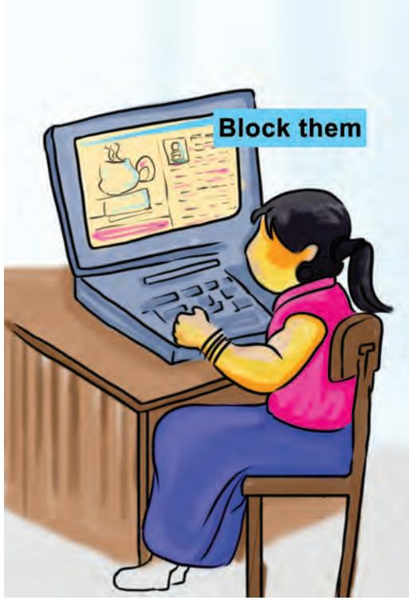

# **Safety and Security** Chapter **in the Cyber World 7**

Since childhood our parents and elders have been guiding and suggesting us to take care of our eating habits, practice hygiene, be wary of strangers, communicate effectively and so on to ensure that we develop into confident, strong and positive individuals who are able to cope up with the competition and complexities of the real world. With the advent of

*Fig. 7.1: Cyber World*

#### *Digital footprint* is

the information about a particular person that exists on the Internet as a result of their online activity even after its deletion.

Chapter 7.indd 93 28-Feb-19 3:40:50 PM

Internet, all of us have also become a part of a cyber world wherein we share and access resources, connect and interact with many people. Just like real world we need to be cautious and alert while working in this cyber world as well.

Email is used to send and receive information and messages but one needs to be careful while using email as many a times one may find emails which are from unknown source saying that you are a lucky winner or asking you to provide personal information. These mails will tempt you to follow the instructions written in the contents of the mail. Such emails are called spam mails and are sent with malicious intent to get you into trouble.

Let's look at some of the examples of spam mails.

*Fig. 7.2 : Sample email-1*

Chapter 7.indd 94 7/20/2020 11:23:04 AM

In the Fig. 7.2 given above, you can find some common signals that you would usually find in a spam email.

Assume there is another email in your inbox asking you to download a popular game for free which otherwise costs `3,500/- as shown in Fig. 7.3.

| From: game download@fiffa.com | Check for incorrect spelling |
| --- | --- |
| Subject: Congratulation! Download Fifa game worth Rs. 3500 for Free!! |  |
| Hi. |  |
| Congratulation, you are one of the few lucky recepients of a free download of the popular Fifa 2018 | Don't fall for attractive |
| game which costs Rs. 3500 in the market. | offers |
| Click on the download attachment or the link below to download the game for FREE. |  |
| winner.fifa-download.org/free game | Don't click on links or attachment from unknown |
|  | senders |
| Please note that this offer is valid only for the next 48 hours after which you will not be able to access | Don't make hasty decision |
| the email. HURRY !!! |  |
| Regards, |  |
| Chairman, |  |
| FIFA Team |  |
| London |  |

*Fig. 7.3: Sample email-2*

# Activity 1

In the Fig. 7.3 given above, which one of the following proves that it is a fake email? Choose the option from the list given below.

- The offer is valid only for the next 48 hours.
- Incorrect spelling of FIFA in the email ID in 'From' Box.
- The cost of the game mentioned in the mail is not correct.

Assume there is another email in your inbox which contains links asking you to provide account details for verification purpose. If you click on such links or download any attachments, they may lead you to a phishing website or install harmful malware (malicious software) on your device, as shown in Fig. 7.4.

Chapter 7.indd 95 7/20/2020 11:23:04 AM

Activity 2

*Phishing* is an attempt to obtain sensitive information such as username, password and credit card details etc. for malicious reasons, by osing as a trustworthy source in email.

Identify the URL(s) which are indicative of a fake website?

http://www.uiidai.gov.in/ http://www.incometakindiaefilling.gov.in/ https://onlinesbi.com

The above scenarios are examples of fraudulent emails. You need to be cautious before proceeding with any of the instructions given in the email.

Chapter 7.indd 96 28-Feb-19 3:40:51 PM

#### **Protection from email fraud**

- Do not reply to emails from unknown senders even if it looks like a genuine email.
- Do not provide personal information like name, date of birth, school name, address, parent's names or any other information.
- Do not fall for lucrative offers/discounts as they might be coming from unknown source and it may not be reliable. Ignore/delete those mails.
- Do not open attachments or click on links from unknown senders, since they may contain malicious files that might affect your device. Only click the links and downloads from websites that you trust.
- Beware of phishing websites—check the URL to confirm if the website is secure.
- Do not forward spam or suspicious emails to others.
- Do not send excessive forwards as it might be distracting to the receiver.

You have learnt how to use email for sharing information and what safety precautions to be taken while using email. Through email you can reach out to people only if you have their email ID.

# Activity 3

Can you think of ways to share your event with a larger audience?

The Internet allows us to exchange and share information, connect with people online across the world and create our own networks through social networking sites.

In order to create an account on a social networking site you need to use your email ID as username.

Chapter 7.indd 97 28-Feb-19 3:40:51 PM

# Activity 4

Search and write the names of any three social networking sites

- 1. ____________________________________________________ 2. ____________________________________________________
	- 3. ____________________________________________________

Though social networking is very interesting as it gives you a chance to get connected with people around the world you should make sure you follow all safety precautions while using social networking as it is extremely difficult to judge and recognise a person here. We only know them by the identity they choose to present.

While creating an account on social networking sites, you need to take care of the following:

- Avoid revealing too much of your personal information like your age, address, contact details, school name, etc., as this can lead to identity theft
- Do your privacy settings very carefully on social networking sites

Anyone on social networking, needs to take care of the following:

- Never reveal your password to anyone other than your parent or guardian
- Change your password frequently
- Communicate and collaborate only with people known to you
- Do not post anything which hurts others feelings
- Always be careful while posting photographs, videos and any other sensitive information on social networking sites as they leave digital footprints which stay online forever
- Do not post your friends' information on social networking sites, which may possibly put them at risk. Protect your friends' privacy by not posting the group photos, school names, locations, age, etc.

#### **Social networking**

site is an online platform to connect and network with people around the world. One can also send and exchange messages and share photos, videos, etc., through such platforms.

Check your privacy settings Make sure you know what information is being shared publicly.

Chapter 7.indd 98 28-Feb-19 3:40:51 PM

- • Avoid posting your plans and activities on social networking sites.
- • Do not create fake profiles for yourself on any social networking sites.
- • If you suspect that your social networking account details have been compromised or stolen, report immediately to the support team of networking site.
- • Do not forward anything that you read on social media without verifying it from a trusted source.
- • Always avoid opening links and attachment through social networking sites.
- • Never leave your account unattended after login and log out immediately when you are not using it.

The photographs and the resources you share might get you positive feedback and comments. However, at times you might face instances of cyber bullying. Cyber bullying includes:

- • Nasty comments on your posts or posts about you.
- • Someone creating a fake profile in your name and trying to defame you.
- • Threatening or abusive messages online or on the mobile phone.
- • Being excluded from online groups and forums.
- • Embarrasing photographs put online without your permission.
- • Rumors and lies about you on a site.
- • Stealing your account password and sending unwanted/inappropriate messages from your account.
- • Offensive chat.
- • Fake online profiles created with an intent to defame you.

If you become a Victim of Cyberbullying, do the following:

## **• Do not Respond**

If someone is cyber bullying you, do not respond or retaliate by doing the same thing back. Responding or retaliating to cyber bullying may make matters worse or even get you into trouble.

Safety and Security in the Cyber World 99

Identity theft is the deliberate use of someone else's identity to obtain credit and benefits in the name of another person or to sometimes even defame that person. It is one of the most common cyber crimes. It poses a severe threat to a person's reputation, unlike the real world the cyber world has a far larger reach, hence it is essential that we exercise the following precautions to prevent any such incident:

- • Never share password with anyone
- • Keep strong passwords
- • Do not divulge your personal information

Cyber bullying includes sending, posting or sharing negative, harmful, false or mean information and content about someone. It is a serious offence which is punishable under Cyber Law.

Chapter 7.indd 99 7/20/2020 12:07:14 PM

*Fig. 7.5: Block*

## **• Screenshot**

Take a screenshot of anything that you think could be cyber bullying and keep a record of it.

## **• Block and Report**

Most online platforms have this feature, if someone bothers you, make sure you block and report the offender to the social media platform.

#### **• Talk About It**

Cyber bullying may affect you in many different ways. Dont feel that you are alone. Let your parents and teachers know what is going on. Never keep it to yourself.

*Fig. 7.6: Talk about it*

## **• Be Private**

Keep your social media privacy settings high and do not connect with anybody who you do not know offline. You would not talk to random people on the street, so why do it online?

#### **• Be Aware**

Remain updated with all the preventive and security measures in the cyber world.

# Exercises

#### **1. Fill in the blanks**

- a. ______________ often directs users to a fake website whose look and feel are almost identical to the actual website.
Chapter 7.indd 100 28-Feb-19 3:40:53 PM

- b. Undesired or illegal email messages are often known as ______________.
- c. The protection of internet connected systems including hardware, software and data from cyber attacks is termed as _____________________.
- d. A __________________ is a form of malicious software program which can corrupt or destroy systems or data.

#### **2. Match the following**

- 1 Malware a. Email
- 2 Spamming b. Virus
- 3 Cyber law c. Stealing data
- 4 Phishing d. Cyber crime

#### **3. Identity whether the following statements are True or False**

- a. Hacking is a cybercrime.
- b. Phishing is a type of attack which is capable of stealing your password or credit card number.
- c. Social networking sites are used to share passwords and other secret information.
- d. When you are receiving harmful messages on your computer, you may block or delete them.

Chapter 7.indd 101 28-Feb-19 3:40:53 PM

