Jason is the sports captain of his school. He was thrilled to receive the Chief Minister's scholarship for his outstanding performance in sports. But his scholarship amount has to be credited to his bank account and Jason does not have a savings bank account. He does not even know how to open a bank account. So he approaches a bank in his locality and the bank employee at the helpdesk gives him instructions to complete the task as given below.

- 1. Take the account opening form from the counter.
- 2. Fill the details in the form carefully.
- 3. Put your signature at the designated place on the form.
- 4. Attach a copy of the photo identity card.
- 5. Submit the form at the counter with a minimum deposit.

After understanding the process to open a bank account, Jason gets on to work. When he went to complete the final step, which was to submit the form, the clerk informed him that his account could not be opened. What would have gone wrong? What reasons can you think of?

Chapter 8.indd 102 7/22/2020 12:36:46 PM

_____________________________ _____________________________ _____________________________ Once again Jason checked the steps to open the bank account. It was then that he realized that he had missed Step no 3 which was to put signature at the designated place on the form and that was why the task of opening the bank account could not be completed. Thereafter, he put his signature and submitted his form again. His account was finally successfully opened.

Have you ever faced such a problem while completing a particular task? What happens if you do not follow the correct sequence of steps? Will you get the desired result?

## Activity 1

On the eve of the Independence day, you want to listen to the Prime Minister's address on the radio. Write the steps to complete the task.

_______________________________________________________ _______________________________________________________ _______________________________________________________ _______________________________________________________ _______________________________________________________ _______________________________________________________

Now ask your friend to follow the steps written by you. Are you able to tune in to listen to the Prime Minister's address? What happens if you interchange any of the steps? Are you still able to get the desired result?

By now, you must have understood the importance of instructions and the sequence of instructions to complete a particular task. To accomplish a task and to get the desired output, you have to mention each instruction clearly, sequentially and logically, as shown in Fig. 8.1. So to achieve a task, the steps are listed below.

- 1. Clearly identify the output that you want.
- 2. Analyse the instructions required to find a solution to get the desired output.
- 3. Finalise and give instructions in the proper sequence.
- 4. Verify whether the output produced is as desired by you in Step 1.

Chapter 8.indd 103 7/22/2020 12:36:46 PM

| Identify the Output | • | Do you clearly know what output has to be produced? |
| --- | --- | --- |
| Analyse | • | Do you have multiple solutions? |
|  | • | Which is the best possible option? |
|  | • | Have you identified the correct sequence of |
|  |  | instructions? |
| Finalise Instructions | • | Give the instructions in logical sequence. |
| Verify the Output | • | Is the output same as you had identified in Step 1? |

*Fig. 8.1: Steps to complete a task*

Consider a situation where the Twirly cat has lost the way to her house as shown in Fig. 8.2.

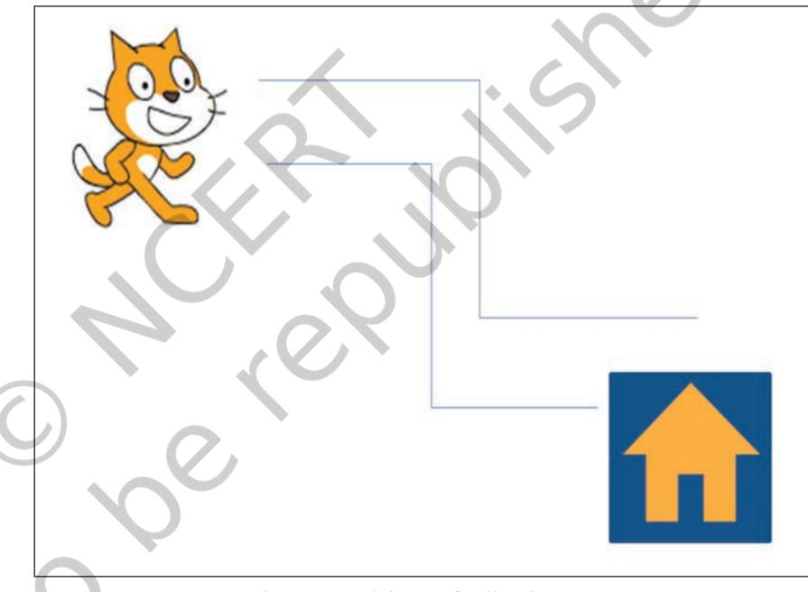

*Fig. 8.2: Twirly cat finding its way*

What instructions would you give her to help her reach the house? Write them in the space provided below:

Chapter 8.indd 104 7/22/2020 12:36:47 PM

Step 1: Move forward by 10 steps. Step 2: Turn right by 90 degrees

Have you given the right instructions? Will Twirly cat reach its home? Can you check the given instructions using any software application or tool? Yes, you can do so by using the Scratch application. Using this application you can create your own stories, games and various other animations using simple drag and drop instructions.

Animations in Scratch can be created offline as well as online mode. As it is an open source software you can download it from https://scratch.mit.edu , install it on your computer and then use it. You can also create and share your animations online using the above URL.

On opening Scratch, you see the interface as shown in Fig. 8.3. Each object on the scratch window is called a sprite. This object can be any person, an animal, an automobile, a building or even text.

Scratch is a free programming language developed by MIT in the year 2005.

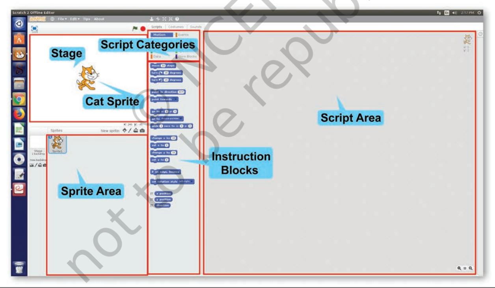

*Fig. 8.3: Scratch Interface*

After learning about the Scratch interface let us now verify the steps that would take out Twirly cat home. In

Fun with Logic 105

Chapter 8.indd 105 7/22/2020 12:36:48 PM

the Scratch window, our Twirly cat will be called a cat sprite. To make the sprite move on a specific path, you have to choose the appropriate instruction block and drag it to the script area. Make sure you choose the instructions in a logical sequence. When the script is complete, you need to execute it to see the output on the stage (Refer Fig. 8.4).

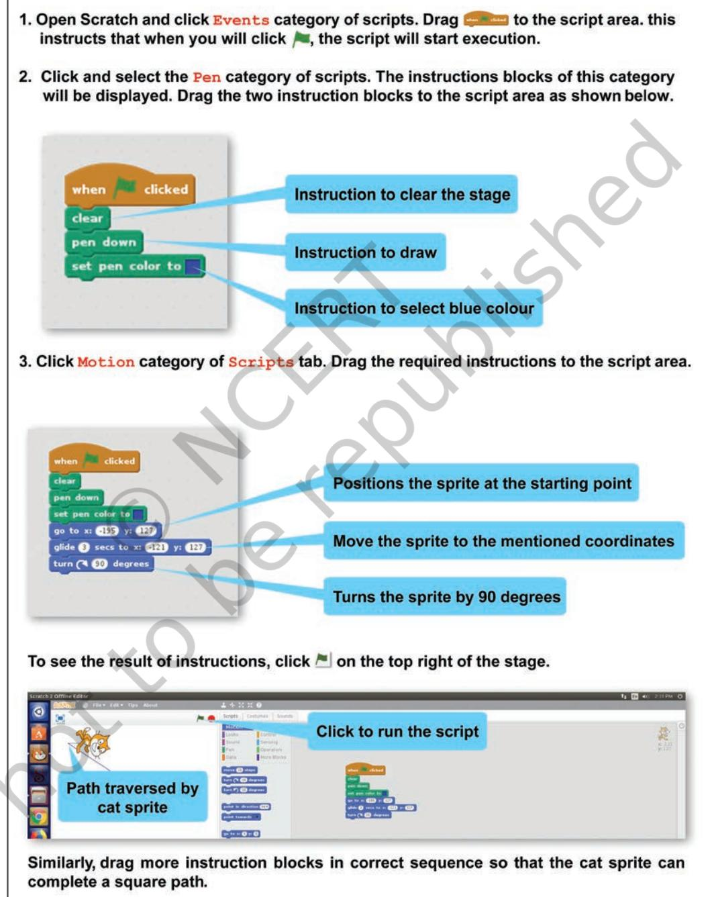

Chapter 8.indd 106 7/22/2020 12:36:50 PM

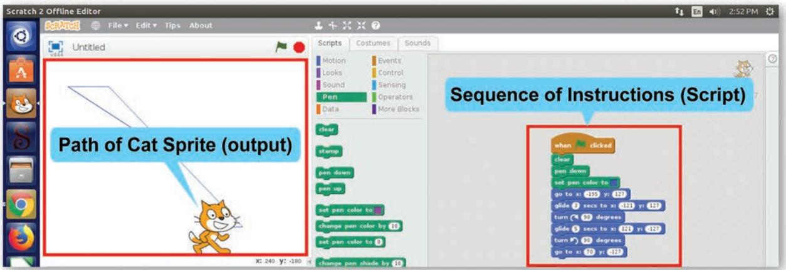

*Fig. 8.4: Path traversed by cat sprite*

# Activity 2

Build a script to make the cat sprite follow the paths drawn below.

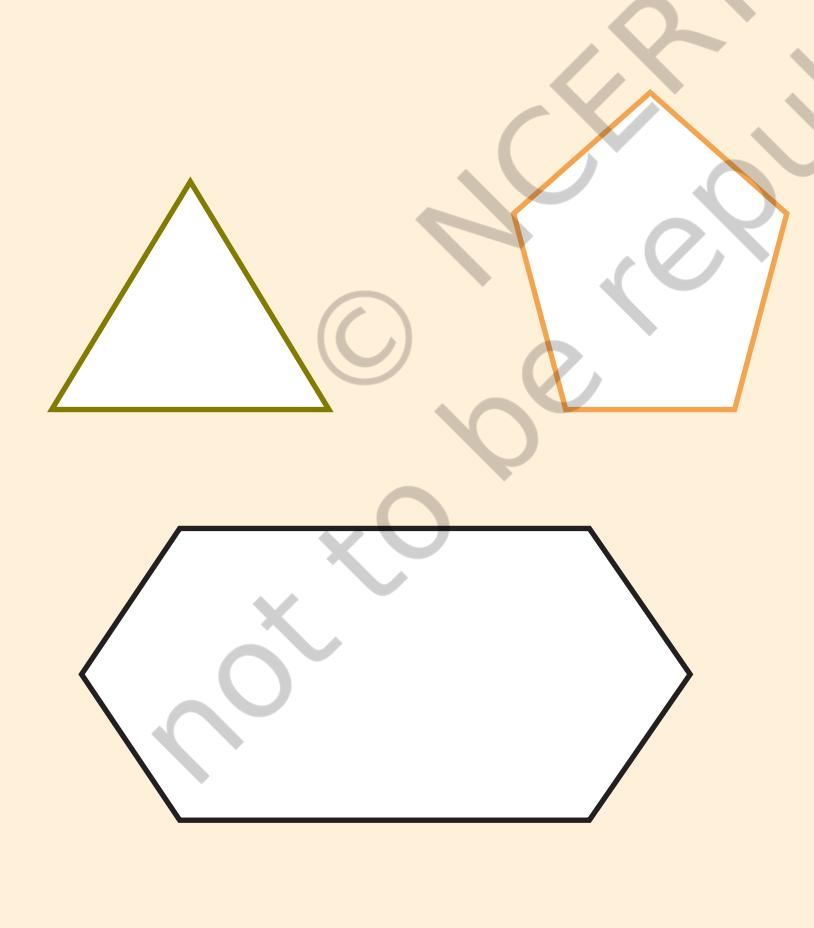

Fun with Logic 107

Chapter 8.indd 107 7/22/2020 12:36:52 PM

Scratch is not just about static shapes. You can even create an animated story using various characters (sprites), instructions and tools using Scratch.

Have you ever thought that instructions have to be given in a logical sequence to communicate your ideas too? In the previous chapters, you have learnt to communicate your ideas through text, images, video and audio using various tools and applications. The audio and video tools helped you to communicate with realistic images and videos. But what if you had an imaginary concept or story to communicate with your friends? Such a story may not have any realistic character. For example, a fairy tale or a story of two animals going on a space voyage or two fishes talking in water. Can that be done using any text editing, image editing or presentation tool?

Let us create a story where the underwater animals are talking about water pollution. Our imaginary characters will be a star fish named Twinkle, an octopus named Octi, a whale named Blue and a fish named Laali. In our story we need the following objects:

- Underwater background
- Octi, an octopus
- Twinkle, a starfish
- Blue, a whale
- Laali, a fish
- Text in the form of dialogues or messages
- Sound of cough
- Sound of water drops and ripples

Chapter 8.indd 108 7/22/2020 12:36:52 PM

### **Script for the story to be created**

*(Underwater backdrop with water, water plants and water animals) A red fish glides from right side, comes towards the centre and then slowly moves out from left side)*

*(sound of water drops and ripples will be heard at frequent intervals throughout the movie)*

*Twinkle : Cough… Cough (sound of male cough) Octi (glides from left side) : Hey Octi … Are you OK? What happened? (moves a bit) Twinkle: Oh Octi…Cough Cough…This dirty water will kill me. (sound of male cough) Octi : OHH!! Blue: (glides from right side) OH GODD!! My eyes are burning. Octi : These humans , they pollute our water and we suffer. (sound of male cough) Blue: What's wrong with the water today? Blue: We all will die one day. (Blue whale glides down) Octi: Let's all request them. (Twinkle and Octi move towards their left) Message pops up on the screen " Stop Water Pollution"*

So in your story, you will need an underwater background with four sprites that you can add from the variety of sprites provided by Scratch. When you open Scratch, the default cat sprite will be present in the centre of the stage. All sprites that you will further add will also appear on the stage, as shown in Fig. 8.5.

Chapter 8.indd 109 7/22/2020 12:36:52 PM

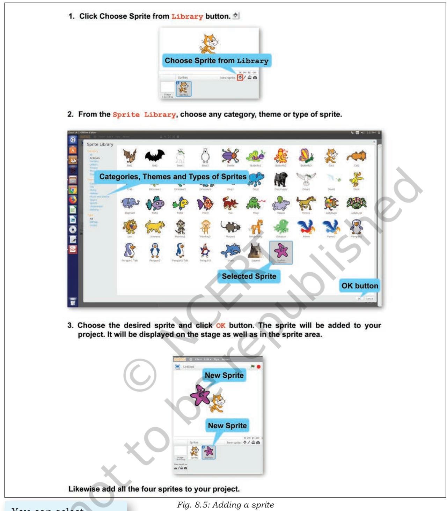

You can select multiple sprites from the Sprite Library by keeping the Shift key pressed while selecting the sprites.

Chapter 8.indd 110 7/22/2020 12:36:56 PM

to be deleted, as shown in Fig. 8.6.

By default, the cat sprite is displayed in all Scratch projects but in your story you do not need it. So it has

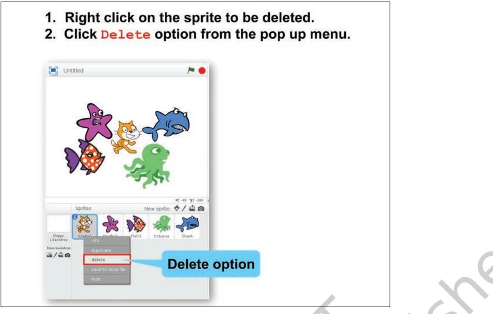

*Fig. 8.6: Deleting a sprite*

You want to give a message at the end. For this purpose you need to add a text sprite also (Refer Fig. 8.7).

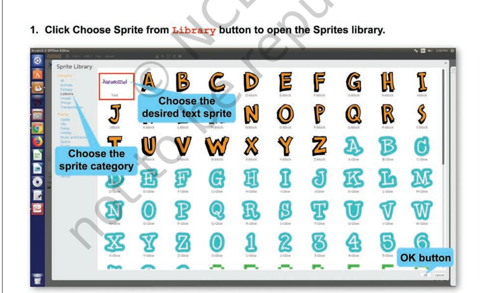

Fun with Logic 111

Chapter 8.indd 111 7/22/2020 12:36:59 PM

- 
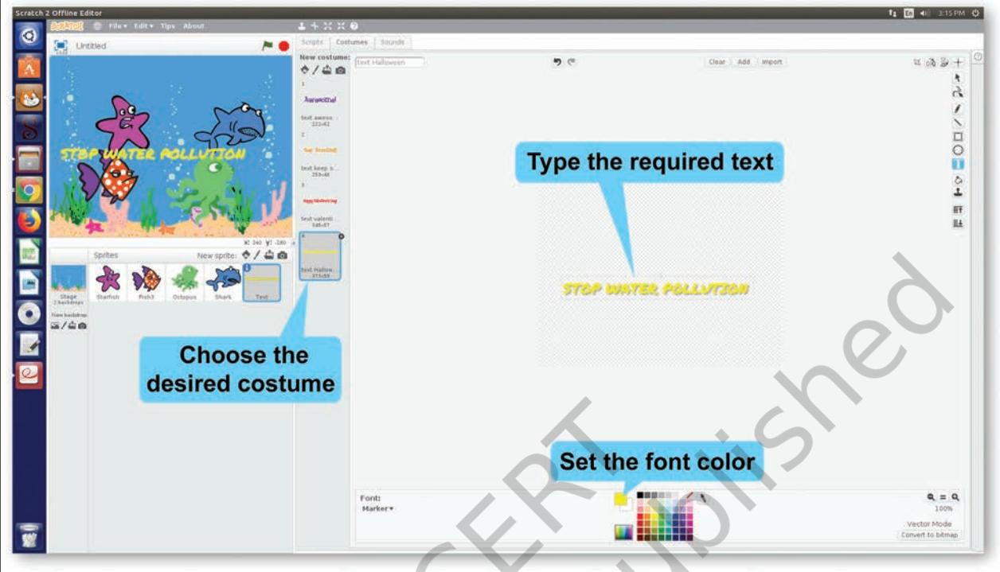

*Fig. 8.7: Adding a text sprite*

You may require to move a sprite from one position to another. Scratch helps you to specify position of a particular character using coordinates. The stage on which the characters are placed is just like a coordinate plane with x and y coordinates as shown in Fig. 8.8.

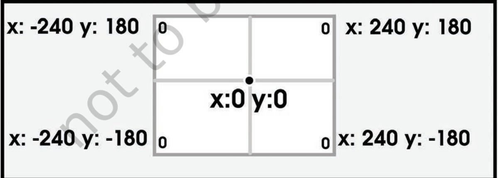

*Fig. 8.8: Coordinates of X-Y plane (stage)*

Chapter 8.indd 112 7/22/2020 12:37:02 PM

According to this plane any character placed on the centre of the stage has the X any Y coordinates as (0,0). The maximum and minimum values for any of the coordinates can be 240 and –180, respectively. As you move your mouse pointer on the stage, the x and y coordinates displayed on the right bottom of the stage keep on changing.

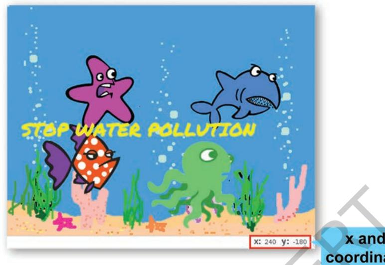

*Fig. 8.9: Coordinates of mouse pointer*

You might need to specify these coordinates while giving instructions for movement of the selected sprite from one position to another.

As per your story six sprites (4 characters plus 1 text sprites) have been added to the project. But the stage is having a white backdrop while your script requires a backdrop that depicts the underwater world. (Refer Fig. 8.10).

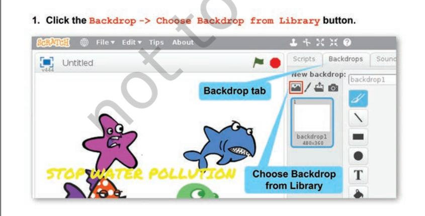

Fun with Logic 113

Chapter 8.indd 113 7/22/2020 12:37:04 PM

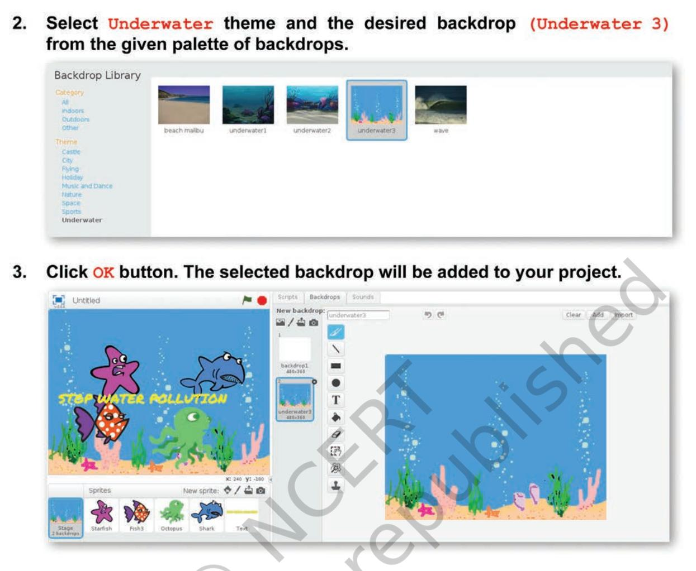

*Fig 8.10: Adding a backdrop to animation*

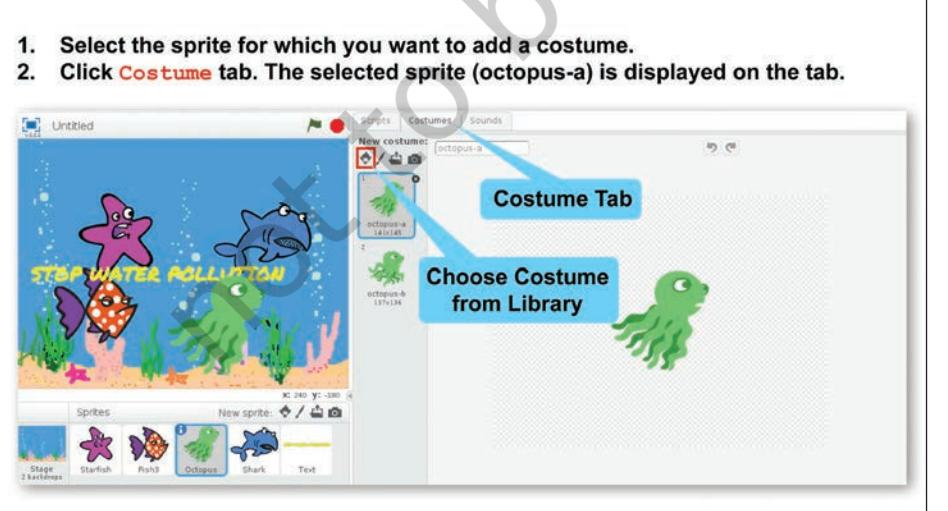

So now you are in the water world. Next, you might need to select different forms of the added sprites. Each form is known as a costume. You can add as many costumes as required by you for the story (Refer Fig. 8.11).

Chapter 8.indd 114 7/22/2020 12:37:07 PM

- 
*Fig. 8.11: Adding costumes to a sprite*

After the costumes for each sprite are added, add the sounds required in your project for each sprite, as shown in Fig. 8.12.

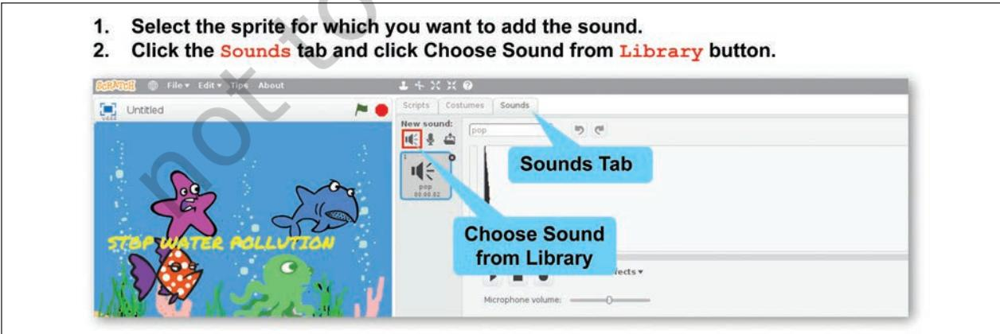

Fun with Logic 115

Chapter 8.indd 115 7/22/2020 12:37:12 PM

| The sound library will be displayed. |  |
| --- | --- |
| Sound Library |  |
| on the required sound |  |
| Click OK | Select the category of sound |
| Likewise add all sounds for the selected sprite. For example, for the starfish character, | the sounds of water drops, coughing male and ripples are added. All these sounds are |
| displayed on the Sounds tab for the selected sprite. |  |

*Fig. 8.12: Adding sound*

After adding sprites, costumes and sounds, our next step is to build an animated story using these sprites, their costumes and sound effects. This process involves giving instructions in a logical sequence and the set of instructions for each sprite is called a script. The script will contain instructions for each and every action for that particular sprite. These actions may include movement, sound, change of costume, etc., as shown in Table 8.1. Each instruction is dragged from the Scripts tab to the script area. You can drag as many

Chapter 8.indd 116 7/22/2020 12:37:15 PM

instructions as you want and add them to the script stack in the script area on the right side of the Scratch window. The added instructions will be executed in the same sequence as you have stacked them. Some of the commonly used instructions are listed below along with their explanations.

|  | Some commonly used script categories and instructions |  |
| --- | --- | --- |
| Category | Instructions | Explanation |
| Motion | Move <n> steps | Move the sprite by n number of steps |
|  | Turn <n> degrees | Turn right by n degrees |
|  | Glide <n1> secs to | Move while gliding in n1 seconds to xn and yn |
|  | x:<xn> and y: <yn> | coordinates |
| Looks | Hide | Hide the sprite |
|  | Show | Show the sprite |
|  | Say <text> | Display text in speech bubble |
|  | Say <text> for <n> | Display text in speech bubble for n seconds |
|  | secs | Change the costume of the sprite to any of the |
|  | Switch costume to <cst> | added costumes (cst) |
| Sound | Play sound <audio> | Play audio and move to next instruction block |
|  | Play sound <audio> | Play audio till it is complete and then move to |
|  | until done | next block |
|  | Stop all sounds | Stop all sounds |
| Events |  | Run the script when green flag is clicked |
|  | When clicked |  |
| Control | Wait <n> secs | Wait for n seconds, then move to next block of |
|  |  | instruction |

| Table. 8.1: Types of instructions |
| --- |

After learning about some of the instructions that can be given to the sprites, you can now start forming the scripts for each sprite, as shown in Figs. 8.13 and Fig. 8.14.

Once you have formed scripts for your sprite, you would like to see the output (Refer Fig. 8.15).

Chapter 8.indd 117 7/22/2020 12:37:15 PM

- 
- 
- 

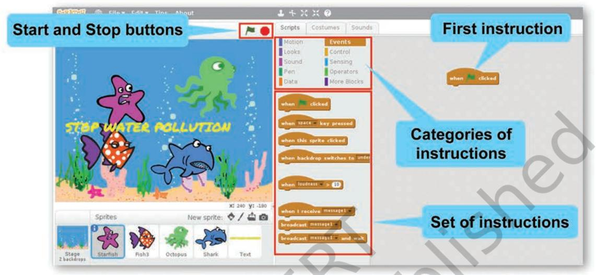

- 
- 

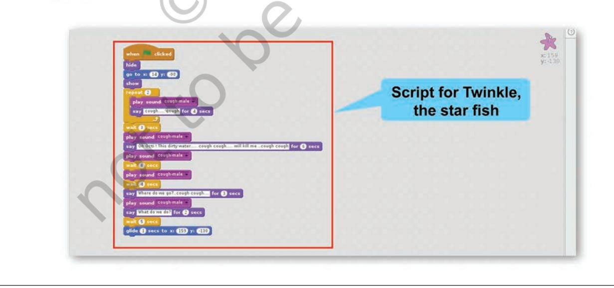

*Fig. 8.13: Forming a script for Starfish Sprite*

Chapter 8.indd 118 7/22/2020 12:37:19 PM

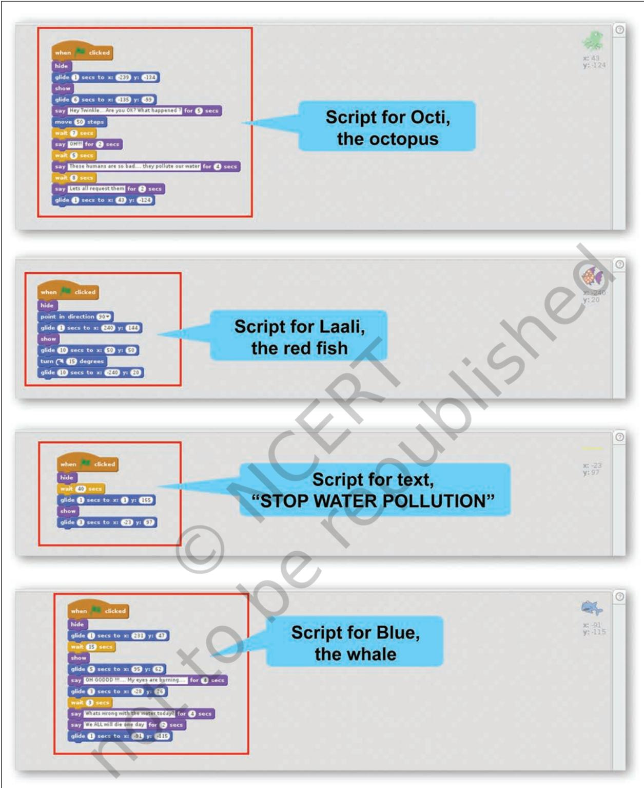

*Fig. 8.14: Scripts for all characters of the story*

Chapter 8.indd 119 7/22/2020 12:37:21 PM

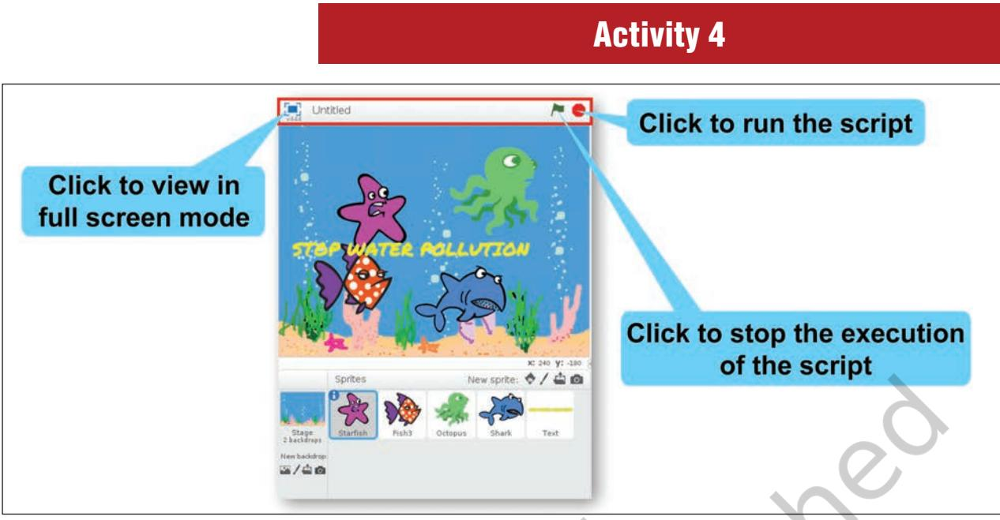

*Fig. 8.15: Playing the animation*

Create an animation in which your name appears in an animated manner. (Hint: Use letter sprites)

#### **After completing the activity, answer the following questions:**

- 1. How many sprites did you add?
- 2. Did you add costume for any of the sprite?
	- 3. Did you add sound?
	- 4. Did you run the script in full screen mode?

### Exercises

#### **Do it Yourself**

- **1. Use Scratch to draw the following alphabets:** A, E, F, H, M, W, Y, Z
Chapter 8.indd 120 7/22/2020 12:37:22 PM

- **2. Draw the following figures in Scratch**
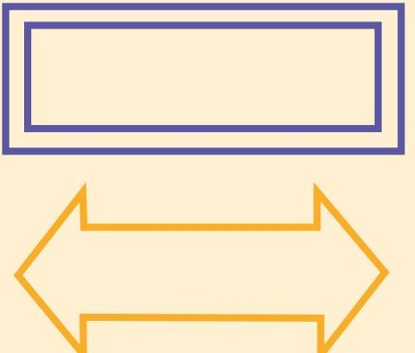

- **3. Create an animated story using Scratch for the following:**
Exercises

- a. A jungle where a lioness is giving safety tips to her cubs.
- b. A spacecraft moving in space.
- c. A dance performance on stage by a fairy.
- **4. Identify True and False Statements from the following:**
	- a. You can create animated stories with imaginary characters by Scratch. (T/F)
	- b. Animations in Scratch can be created online only. (T/F)
	- c. By using Scratch we can create static shapes as well as animated stories using various sprites, instructions and tools. (T/F)
	- d. Each object on the Scratch window is called a sprite. (T/F)
	- e. Scratch has an inbuilt library of sprites. (T/F)

Chapter 8.indd 121 7/22/2020 12:37:22 PM

Chapter 8.indd 122 7/22/2020 12:37:22 PM

