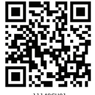

**Chapter**

**1**

# **Computer System**

#### *In this chapter*

- » Introduction to Computer System
- » Evolution of Computer
- » Computer Memory
- » Software

*"A computer would deserve to be called intelligent if it could deceive a human into believing that it was human."* 

*— Alan Turing*

# **1.1 Introduction to Computer System**

A computer is an electronic device that can be programmed to accept data (input), process it and generate result (output). A computer along with additional hardware and software together is called a computer system.

A computer system primarily comprises of a central processing unit, memory, input/output devices, and storage devices. All these components function together as a single unit to deliver the desired output. A computer system comes in various forms and sizes. It can vary

Chap 1.indd 1 19-Jul-19 3:05:06 PM

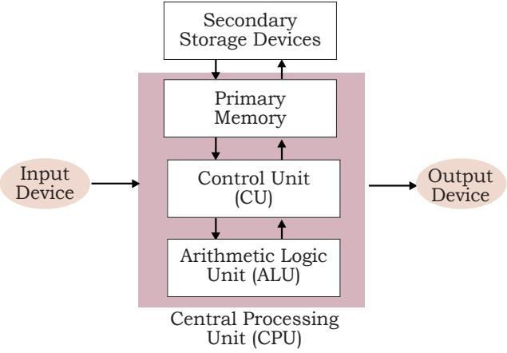

*Figure 1.1: Components of a Computer System*

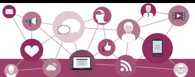

from a high-end server to a personal desktop, laptop, tablet computer, or smartphone.

Figure 1.1 shows the block diagram of a computer system. The directed lines represent the flow of data and signal between the components.

### **1.1.1 Central Processing Unit (CPU)**

It is the electronic circuitry of a computer that carries out the actual processing and is usually referred to as the brain of the computer. It is also

commonly called 'processor' also. Physically, a CPU can be placed on one or more microchips called integrated circuits (IC). The ICs comprise semiconductor materials.

The CPU is given instructions and data through programs. The CPU then fetches the program and data from the memory and performs arithmetic and logical operations as per the given instructions and stores the result back to memory.

While processing, the CPU stores the data as well as instructions in its local memory, 'called' registers. Registers are part of the CPU chip and they are limited in size and number. Different registers are used for storing data, instructions or intermediate results.

Other than the registers, the CPU has two main components — Arithmetic Logic Unit (ALU) and Control Unit (CU). ALU performs all the arithmetic and logic operations that need to be done as per the instruction in a program. CU controls sequential instruction execution, interprets instructions and guides data flow through the computer's memory, ALU and input or output devices. CPU is also popularly known as microprocessor.

# **1.1.2 Input Devices**

The devices through which control signals are sent to a computer are termed as input devices. These devices convert the input data into a digital form that is acceptable by the computer system. Some examples of input devices include keyboard, mouse, scanner, touch screen, etc., as shown in Figure 1.2. Specially designed braille keyboards are also available to help the visually impaired for entering data into a computer. Besides, we *Figure 1.2:* can now enter data through voice, for example, we can *Input Devices*

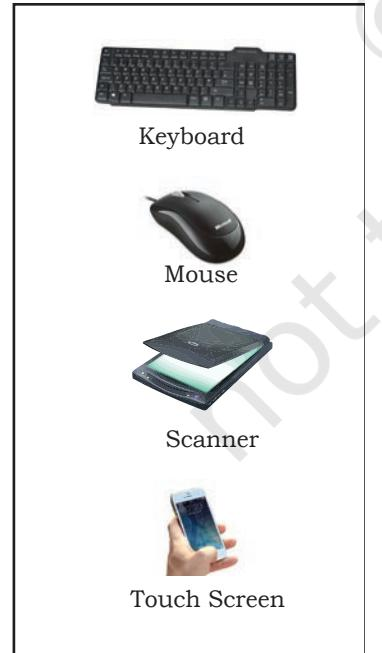

Chap 1.indd 2 19-Jul-19 3:05:07 PM

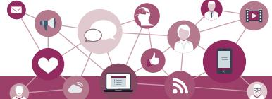

use Google voice search to search the web where we can input the search string through our voice.

Data entered through input device is temporarily stored in the main memory (also called RAM) of the computer system. For permanent storage and future use, the data as well as instructions are stored permanently in additional storage locations called secondary memory.

#### **1.1.3 Output Devices**

The device that receives data from a computer system for display, physical production, etc., is called output device. It converts digital information into humanunderstandable form. For example, monitor, projector, headphone, speaker, printer, etc. Some output devices are shown in Figure 1.3. A braille display monitor is useful for a visually challenged person to understand the textual output generated by computers.

A printer is the most commonly used device to get output in physical (hardcopy) form. Three types of commonly used printers are inkjet, laserjet and dot matrix. Now-a-days, there is a new type of printer called 3D-printer, which is used to build physical replica of a digital 3D design. These printers are being used in manufacturing industries to create prototypes of products. Their usage is also being explored in the medical field, particularly for developing body organs.

# **1.2 Evolution of Computer**

From the simple calculator to a modern day powerful data processor, computing devices have evolved in a relatively short span of time. The evolution of computing devices is shown through a timeline at Figure 1.5.

The Von Neumann architecture is shown in Figure 1.4. It consists of a Central Processing Unit (CPU) for processing arithmetic and logical instructions, a memory to store data and programs, input and output devices and communication channels to send/receive the output data. Electronic Numerical Integrator And

Computer (ENIAC) is the first binary programmable computer based on Von Neumann architecture.

During the 1970s, Large Scale Integration (LSI) of electronic circuits allowed integration of

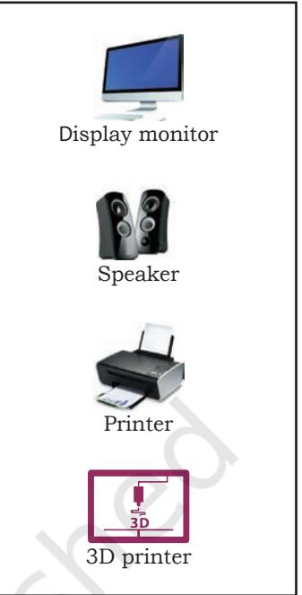

*Figure 1.3: Output Devices*

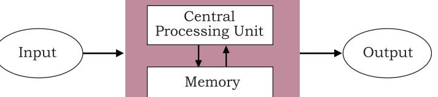

*Figure 1.4: Von Neumann Architecture for the Computer* 

Chap 1.indd 3 19-Jul-19 3:05:07 PM

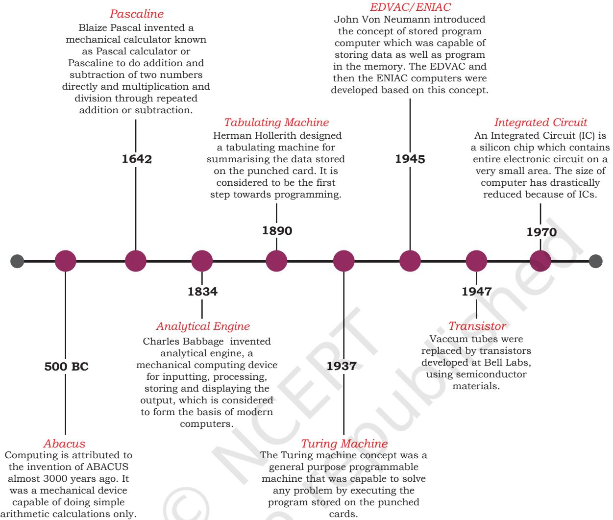

*Figure 1.5: Timeline Showing Key Inventions in Computing Technology*

A punched card is a piece of stiff paper that stores digital data in the form of holes at predefined positions.

complete CPU on a single chip, called microprocessor. Moore's Law predicted exponential growth in number of transistors that could be assembled in a single microchip. In 1980s, the processing power of computers increased exponentially by integrating around 3 million components on a small-sized chip termed as Very Large Scale Integration (VLSI). Further advancement in technology has made it feasible to fabricate high density of transistors and other components (approx 106 components) on a single IC called Super Large Scale Integration (SLSI) as shown in Figure 1.6.

IBM introduced its first personal computer (PC) for the home user in 1981, Apple introduced Macintosh machines in 1984. The popularity of the PC surged by the introduction of Graphical User Interface (GUI)

Chap 1.indd 4 19-Jul-19 3:05:07 PM

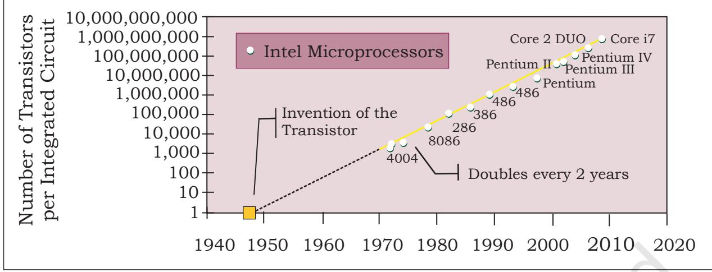

based operating systems by Microsoft and others in place of computers with only command line interface, like UNIX or DOS. Around 1990s, the growth of world wide web (WWW) further accelerated mass usage of computers and thereafter computers have become an indispensable part of everyday life.

Further, with the introduction of laptops, personal computing was made portable to a great extent. This was followed by smartphones, tablets and other personal digital assistants. These devices have leveraged the technological advancements in processor miniaturisation, faster memory, high speed data and connectivity mechanisms.

The next wave of computing devices includes wearable gadgets such as smart watch, lenses, headbands, headphones, etc. Further, smart appliances are becoming a part of the Internet of Things (IoT), by leveraging the power of artificial intelligence.

# **1.3 Computer Memory**

A computer system needs memory to store the data and instructions for processing. Whenever we talk about the "memory" of a computer system, we usually talk about the main or primary memory. The secondary memory (also called storage device) is used to store data, instructions and results permanently and for future use.

#### **1.3.1 Units of Memory**

A computer system uses binary numbers to store and process data. The binary digits 0 and 1, which are the

In 1965, Intel cofounder Gordon Moore introduced Moore's Law which predicted that the number of transistors on a chip would double every two years while the costs would be halved.

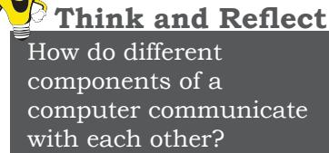

2024-25

Chap 1.indd 5 19-Jul-19 3:05:07 PM

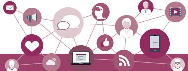

basic units of memory, are called bits. Further, these bits are grouped together to form words. A 4-bit word is called a Nibble. Examples of nibble are 1001, 1010, 0010, etc. A two nibble word, i.e., 8-bit word is called a byte, for example, 01000110, 01111100, 10000001, etc.

Like any other standard unit, bytes are grouped

#### **Table 1.1 Measurement units for digital data**

| Unit | Description | Unit | Description |
| --- | --- | --- | --- |
| KB (Kilobyte) | 1 KB = 1024 Bytes | PB (Petabyte) | 1 PB = 1024 TB |
| MB (Megabyte) | 1 MB = 1024 KB | EB (Exabyte) | 1 EB = 1024 PB |
| GB (Gigabyte) | 1 GB = 1024 MB | ZB (Zettabyte) | 1 ZB = 1024 EB |
| TB (Terabyte) | 1 TB = 1024 GB | YB (Yottabyte) | 1 YB = 1024 ZB |

together to make bigger chunks or units of memory. Table 1.1 shows different measurement units for digital data stored in computer memories.

#### **1.3.2 Types of Memory**

Human beings memorise many things over a lifetime, and recall from memory to make a decision or take some action. However, we cannot rely on our memory completely, so we make notes and store important data and information using other mediums such as notebook, manual, journal, document etc. for a longterm storage. Similarly, computers have two types of memories namely —primary memory and secondary memory.

#### *(A) Primary Memory*

The primary memory is an essential component of a computer system. Program and data are loaded into the primary memory before processing. The CPU interacts directly with the primary memory to perform read/ write operation. It is of two types viz. i) Random access memory (RAM), and ii) Read only memory (ROM).

RAM is volatile i.e. as long as the power is supplied to the computer, it retains the data in it. But as soon as the power supply is turned off, all the contents of RAM are wiped out. It is used to store data temporarily while the computer is working. Whenever the computer is started or a software application is launched, the required program and data are loaded into RAM for processing. RAM is usually referred to as main memory and it is faster than the secondary memory or storage devices.

On the other hand, ROM is non-volatile, means its contents are not lost even when the power is turned off. It is used as a small but faster permanent storage for the contents which are rarely changed. For example, the

Suppose there is a computer with RAM but no secondary storage. Can we install a software on that computer?

Chap 1.indd 6 19-Jul-19 3:05:07 PM

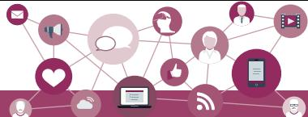

startup program (boot loader) that loads the operating system into RAM is stored in a ROM.

# *(B) Cache Memory*

RAM is faster than secondary storage, but not as fast as a computer processor. So, because of RAM, a CPU may have to slow down. To speed up the operations of the CPU, a very high speed memory is placed between the CPU and the primary memory known as cache. It stores the copies of the data from frequently accessed primary memory locations, thus, reducing the average time required to access data from primary memory. When the CPU needs to access memory, it first examines the cache. In case the requirement is met, it is read from the cache, otherwise the primary memory is accessed.

# *(C) Secondary Memory*

Primary memory has limited storage capacity and is either volatile (RAM) or read-only (ROM). Thus, a computer system needs auxiliary or secondary memory to permanently store the data or instructions for future use. The secondary memory is non-volatile and has larger storage capacity than primary memory. It is slower and cheaper than the main memory. But, it cannot be accessed directly by the CPU. Contents of secondary storage need to be first brought into the main memory for the CPU to access. Examples of secondary memory devices include Hard Disk Drive (HDD), CD/ DVD, Memory Card, etc., as shown in Figure 1.7.

However, these days, there are secondary storage devices like Solid-State Drive (SSD) which support very fast data transfer speed as compared to earlier HDDs. Also, data transfer between computers have become easier and simpler due to the availability of small sized and portable flash/pen drives.

# **1.3.3 Data Capturing, Storage, and Retrieval**

To process the data, we need to first input or capture the data. This is followed by its storage in a file or a database so that it can be used in the future. Whenever data is to be processed, it is first retrieved from the file/ database so that we can perform further actions on it.

# *(A) Data Capturing*

It involves the process of gathering data from different sources in digital form. Data may be coptured using, keyboard bar code readers (Used at shopping outlets as

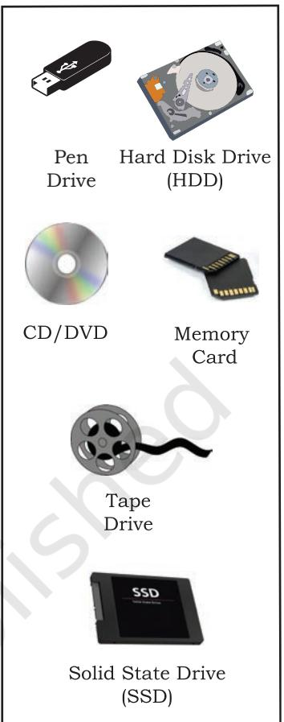

<i>Figure 1.7: *Storage Devices* 

List all secondary storage devices available in your school or home.

Chap 1.indd 7 19-Jul-19 3:05:07 PM

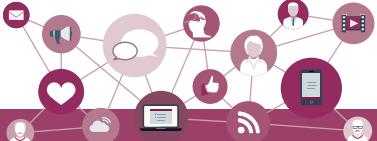

*Figure 1.8: Capturing Data using Barcode Reader*

Visit some of the places like bank, automobile showroom, shopping mall, tehsil office, etc., and find out 2–3 names of tools/instruments used to capture data in digital format.

**Activity 1.2**

Explore possible ways of recovering deleted data or data from a corrupted device.

shown in Fig. 1.8 (Figure 1.8)), remore sensors on earth orbiting satellites etc. comments/ports over multiple social media are also captured as data. Sometimes, heterogeneity among data sources makes data capturing a complex task.

#### *(B) Data Storage*

It is the process of storing the captured data for processing later. Now-a-days data is being produced at a very high rate, and therefore data storage has become a challenging task. However, the decrease in the cost of digital storage devices has helped in simplifying this task. There are numerous digital storage devices available in the market as shown in Figure 1.7.

Data keeps on increasing with time. Hence, the storage devices also require to be upgraded periodically. In large organisations, computers with larger and faster storage called data servers are deployed to store vast amount of data. Such dedicated computers help in processing data efficiently. However, the cost (both hardware and software) of setting up a data server as well as its maintenance is high, especially for small organisations and startups.

#### *(C) Data Retrieval*

It involves fetching data from the storage devices, for its processing as per the user requirement. As databases grow, the challenges involved in search and retrieval of the data in acceptable time, also increase. Minimising data access time is crucial for faster data processing.

#### **1.3.4 Data Deletion and Recovery**

One of the biggest threats associated with digital data is its deletion. The storage devices can malfunction or crash down resulting in the deletion of the stored data. Users can accidentally erase data from storage devices, or a hacker/malware can delete the digital data intentionally.

Deleting digitally stored data means changing the details of data at bit level, which can be very timeconsuming. Therefore, when any data is simply deleted, its address entry is marked as free, and that much space is shown as empty to the user, without actually deleting the data.

In case data gets deleted accidentally or corrupted, there arises a need to recover the data. Recovery of the data is possible only if the contents/memory space

Chap 1.indd 8 19-Jul-19 3:05:08 PM

marked as deleted have not been overwritten by some other data. Data recovery is a process of retrieving deleted, corrupted and lost data from secondary storage devices.

There are usually two security concerns associated with data. One is its deletion by some unauthorised person or software. These concerns can be avoided by limiting access to the computer system and using passwords for user accounts and files, wherever possible. There is also an option of encrypting files to protect them from unwanted modification.

The other concern is related to unwanted recovery of data by unauthorised user/software. Many a times, we discard our old, broken or malfunctioning storage devices without taking care to delete data. We assume that the contents of deleted files are permanently removed. However, if these storage devices fall into the hands of mischief-mongers, they can easily recover data from such devices; this poses a threat to data confidentiality. This concern can be mitigated by using proper tools to delete or shred data before disposing off any old or faulty storage device.

# **Activity 1.4**

Create a test file and then delete it using Shift+Delete from the keyboard. Now recover the file using the methods you have explored at Activity 1.3.

# **1.4 Software**

Till now, we have studied about the physical components or the hardware of the computer system. But the hardware is of no use on its own. Hardware needs to be operated by a set of instructions. These sets of instructions are referred to as software. It is that component of a computer system, which we cannot touch or view physically. It comprises of the instructions and data to be processed using the computer hardware. The computer software and hardware complete any task together.

The software comprises of set of instructions which on execution deliver the desired outcome. In other words, each software is written for some computational purpose. Some examples of software include operating systems like Ubuntu or Windows 7/10, word processing tools like LibreOffice Writer or Microsoft Word, video player like VLC Player, photo editors like Paint and LibreOffice Draw. A document or image stored on the hard disk or pen drive is referred to as a softcopy. Once printed, the document or an image is called a hardcopy.

Hardware refers to the physical components of the computer system which can be seen and touched. For example, RAM, keyboard, printer, monitor, CPU etc. On the other hand, software is a set of instructions and data that makes hardware functional to complete the desired task.

Chap 1.indd 9 19-Jul-19 3:05:08 PM

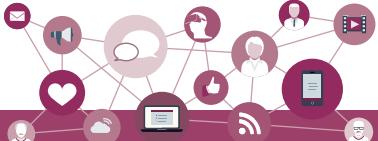

#### **1.4.1 Need of Software**

The sole purpose of a software is to make computer hardware useful and operational. A software knows how to make different hardware components of a computer work and communicate with each other as well as with the end user. We cannot talk to or instruct the hardware of a computer directly. Hence, software acts as an interface between human users and the hardware.

Depending on the mode of interaction with hardware and functions to be performed, software can be broadly classified into three categories viz. i) System software ii) Programming tools and iii) Application software. The categorisation of software is shown in Figure 1.9.

#### **1.4.2 System Software**

The software that provides the basic functionality to operate a computer by interacting directly with its constituent hardware is termed as system software. A system software knows how to operate and use different hardware components of a computer. It provides services directly to the end user, or to some other software. Examples of system software include operating systems, system utilities, device drivers, etc.

#### *(A) Operating System*

As the name implies, operating system is a system software that operates the computer. An operating system is the most basic system software, without which other software cannot work. The operating system manages other application programs and provides access and security to the users of the system. Some of the popular operating systems are Windows, Linux, Macintosh, Ubuntu, Fedora, Android, iOS, etc.

#### *(B) System Utilities*

Software used for maintenance and configuration of the computer system is called system utility. Some system utilities are shipped with the operating system, for example disk defragmentation tool, formatting utility, system restore utility, etc. Another set of utilities are those which are not shipped with the operating system but are required to improve the performance of the system, for example, anti-virus software, disk cleaner tool, disk compression software, etc.

Chap 1.indd 10 19-Jul-19 3:05:08 PM

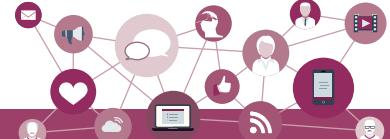

# *(C) Device Drivers*

As the name signifies, the purpose of a device driver is to ensure proper functioning of a particular device. When it comes to the overall working of a computer system, the operating system does the work. But everyday new devices and components are being added to a computer system. It is not possible for operating system alone to manage all of the existing and new peripherals, where each device has diverse characteristics. The responsibility for overall control, operation, and management of a

particular device at the hardware level is delegated to its device driver.

The device driver acts as an interface between the device and the operating system. It provides required services by hiding the details of operations performed at the hardware level of the device. Just like a language translator, a device driver acts as a mediator between the operating system and the attached device.

#### **1.4.3 Application Software**

The system software provides the core functionality of the computer system. However, different users need the computer system for different purposes depending upon their requirements. Hence, a new category of software is needed to cater to different requirements of the endusers. This specific software that works on top of the system software is termed as application software. There are again two broad categories of application software: general purpose and customised application software.

#### *(A) General Purpose Software*

The application software developed for generic applications, to cater to a bigger audience in general are called general purpose software. Such ready-made application software can be used by end users as per their requirements. For example, spreadsheet tool LibreOffice Calc can be used by any computer user to do calculation or to create an account sheet. Adobe Photoshop, GIMP, Mozilla web browser, iTunes, etc. fall in the category of general purpose software.

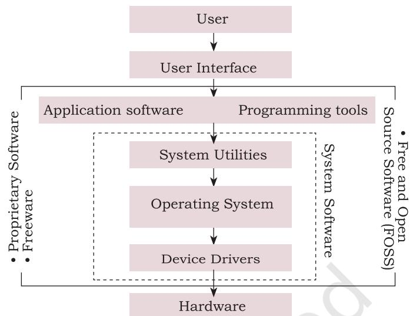

Ask your teacher to help you locate any two device drivers installed on your computer.

A computer system can work without application software, but it cannot work without system software. For example, we can use a computer even if no word processing software is installed, but if no operating system is installed, we can not work on the computer. In other words, the use of computer is possible in the absence of application software.

Chap 1.indd 11 19-Jul-19 3:05:08 PM

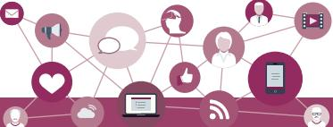

With the help of your teacher, install one application software in your computer.

# *(B) Customised Software*

These are custom or tailor-made application software, that are developed to meet the requirements of a specific organisation or an individual. They are better suited to the needs of an individual or an organisation, considering that they are designed as per special requirements. Some examples of user-defined software include websites, school management software, accounting software, etc. It is similar to buying a piece of cloth with specific color and fabric and get it stitched as desired.

# **1.4.4 Proprietary or Free and Open Source Software**

Developers of some software allow public to freely use their software along with source code with an aim to improve further with each other's help. Such software is known as Free and Open Source Software (FOSS). For example, the source code of operating system Ubuntu is freely accessible for anyone with the required knowledge to improve/add new functionality. More examples of FOSS include Python, Libreoffice, Openoffice, Mozilla Firefox, etc. Sometimes, software are freely available for use but source code may not be available. Such software is called freeware. Examples of freeware are Skype, Adobe Reader etc.

When software to be used has to be purchased from the vendor who has the copyright of the software, then it is a proprietary software. Examples of proprietary software include Microsoft Windows, Tally, Quickheal etc. A software can be freeware or open source or proprietary software depending upon the terms and conditions of the person or group who has developed and released that software.

Chap 1.indd 12 19-Jul-19 3:05:08 PM

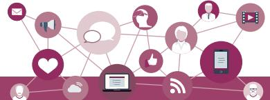

# **Summary**

- A computing device, also referred as computer processes the input data as per given instructions to generate desired output.
- Computer processes data to generate information whose further analysis and interpretation yields knowledge.
- Computer system has four physical components viz. i) CPU ii) Primary memory iii) Input device and iv) Output device. They are referred to as hardware of computer.
- Computer system has two types of primary memories viz. i) RAM the volatile memory and ii) ROM the non-volatile memory.
- Software is a set of instructions written to achieve the desired task and are mainly categorised as system software, programming tools and application software.
- Hardware of a computer cannot function on its own. It needs software to be operational or functional.
- Operating system is an interface between the user and the computer and supervises the working of computer system i.e. it monitors and controls the hardware and software of the computer system.

# **Exercise**

- 1. Name the software required to make a computer functional. Write down its two primary functions.
- 2. What is the need of RAM? How does it differ from ROM?
- 3. What is the need for secondary memory?
- 4. Draw the block diagram of a computer system. Briefly write about the functionality of each component.
- 5. Differentiate between proprietary software and freeware software. Name two software of each type.
- 6. Mention any browsers used for browsing the internet.

**Notes**

Chap 1.indd 13 19-Jul-19 3:05:08 PM

# **Notes**

- a) To output audio
- b) To enter textual data
- c) To make hard copy of a text file
- d) To display the data/information
- e) To enter audio-based command
- f) To build 3D models
- g) To assist a visually impaired individual in entering data
- 8. Identify the category (system, application, programming tool) of the following software:
	- a) Compiler
	- b) Assembler
	- c) Ubuntu
	- d) Text editor
- 9. Convert the following into bytes:
	- a) 2 MB
	- b) 3.7 GB
	- c) 1.2 TB
- 10. What is the security threats involved when we throw away electronic gadgets that are non-functional?
- 11. Write down the type of memory needed to do the following:
	- a) To store data permanently
	- b) To execute the program
	- c) To store the instructions which can not be overwritten.

Chap 1.indd 14 19-Jul-19 3:05:08 PM

