# **Chapter 2**

*"Computer science is no more about computers than astronomy is about telescopes"* 

*— Edsger Dijkstra*

## **2.1 Introduction to Emerging Trends**

Computers have been around for quite some time now. New technologies and initiatives emerge with each passing day. In order to understand the existing technologies and have a better view of the developments around us, we must keep an eye on the emerging trends. Many new technologies are introduced almost every day. Some of these do not succeed and fade away over time. Some of these new technologies prosper and persist over time, gaining attention from users. Emerging trends are the state-of-the-art technologies, which gain

#### *In this chapter*

- » Introduction to Emerging Trends
- » Artificial Intelligence (AI)
- » Big Data
- » Internet of Things (IoT)
- » Cloud Computing
- » Grid Computing
- » Blockchains

Chap 2.indd 15 19-Jul-19 3:06:47 PM

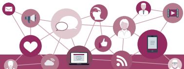

popularity and set a new trend among users. In this chapter, we will learn about some emerging trends that will make a huge impact (in the future) on digital economy and interaction in digital societies.

## **2.2 Artificial Intelligence (AI)**

Have you ever wondered how maps in your smartphone are able to guide you to take the fastest route to your destination by analysing real time data, such as traffic congestion? On uploading a photo on a social networking site, has it ever happened that your friends in the photograph were recognised and tagged automatically? These are some of the examples of application of Artificial Intelligence. The intelligent digital personal assistants like Siri, Google Now, Cortana, Alexa are all powered by AI. Artificial Intelligence endeavours to simulate the natural intelligence of human beings into machines, thus making them behave intelligently. An intelligent machine is supposed to imitate some of the cognitive functions of humans like learning, decisionmaking and problem solving. In order to make machines perform tasks with minimum human intervention, they are programmed to create a knowledge base and make decisions based on it. AI system can also learn from past experiences or outcomes to make new decisions.

#### **2.2.1 Machine Learning**

Machine Learning is a subsystem of Artificial Intelligence, wherein computers have the ability to learn from data using statistical techniques, without being explicitly programmed by a human being. It comprises algorithms that use data to learn on their own and make predictions. These algorithms, called models, are first trained and tested using a training data and testing data, respectively. After successive trainings, once these models are able to give results to an acceptable level of accuracy, they are used to make predictions about new and unknown data.

#### **2.2.2 Natural Language Processing (NLP)**

The predictive typing feature of search engine that helps us by suggesting the next word in the sentence while typing keywords and the spell checking features are examples of Natural Language Processing (NLP). It deals with the interaction between human and

A knowledge base is a store of information consisting of facts, assumptions and rules which an AI system can use for decision making.

Find out how NLP is helping differentlyabled persons?

Chap 2.indd 16 19-Jul-19 3:06:47 PM

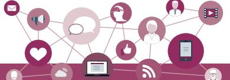

computers using human spoken languages, such as Hindi, English, etc.

In fact it is possible to search the web or operate or control our devices using our voice. All this has been possible by NLP. An NLP system can perform text-to-speech and speech-to-text conversion as depicted in Figure 2.1.

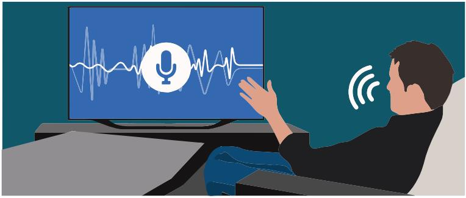

*Figure 2.1: Use of natural language processing*

Machine translation is a rapidly emerging field where machines are able to translate texts from one language to another with fair amount of correctness. Another emerging application area is automated customer service where a computer software can interact with customers to serve their queries or complaints.

#### **2.2.3 Immersive Experiences**

With the three-dimensional (3D) videography, the joy of watching movies in theatres has reached to a new level. Video games are also being developed to provide immersive experiences to the player. Immersive experiences allow us to visualise, feel and react by stimulating our senses. It enhances our interaction and involvement, making them more realistic and engaging. Immersive experiences have been used in the field of training, such as driving simulators (Figure 2.2), flight simulator and so on. Immersive experience can be achieved using virtual reality and augmented reality.

#### *(A) Virtual Reality*

Everything that we experience in our reality is perceived through our senses. From this came the idea that if we can present our senses with made-up or nonreal information, our perception of reality would also alter in response to that. Virtual Reality (VR) is a three-dimensional, computer-generated situation that simulates the real world. The user can interact with and explore that environment by getting immersed in it while interacting with the objects and other actions of the user. At present, it is achieved with the help of VR Headsets. In order to make the experience of VR more realistic, it promotes other sensory information like sound, smell, motion, temperature, etc. It is a comparatively new field

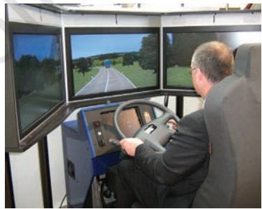

*Figure 2.2: Driving Simulator*

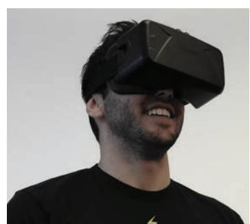

*Figure 2.3: VR Headset*

Chap 2.indd 17 19-Jul-19 3:06:48 PM

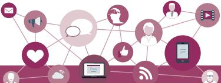

Unlike Virtual Reality, the Augmented Reality does not create something new, it just alters or augments the perception of the underlying physical world through additional information.

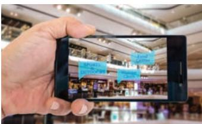

*Figure 2.4: Location based Augmented Reality*

Find out what role are robots playing in the medical field?

Robotics is an interdisciplinary branch of technology requiring applications of mechanical engineering, electronics, and computer science, among others. Robotics is primarily concerned with the design, fabrication, operation, and application of robots.

and has found its applications in gaming (Figure 2.3), military training, medical procedures, entertainment, social science and psychology, engineering and other areas where simulation is needed for a better understanding and learning.

## *(B) Augmented Reality*

The superimposition of computer generated perceptual information over the existing physical surroundings is called as Augmented Reality (AR). It adds components of the digital world to the physical world, along with the associated tactile and other sensory requirements, thereby making the environment interactive and digitally manipulable. Users can access information about the nearest places with reference to their current location. They can get information about places and choose on the basis of user reviews. With thet help of location-based AR App, travellers can access real-time information of historical places just by pointing their camera viewfinder to subjects as depicted in Figure 2.4. Location-based AR apps are major forms of AR apps.

#### **2.2.4 Robotics**

A robot is basically a machine capable of carrying out one or more tasks automatically with accuracy and precision. Unlike other machines, a robot is programmable, which means it can follow the instructions given through computer programs. Robots were initially conceptualised for doing repetitive industrial tasks that are boring or stressful for humans or were labour-intensive. Sensors are one of the prime components of a robot. Robot can be of many types, such as wheeled robots, legged robots, manipulators and humanoids. Robots that resemble humans are known as humanoids. Robots are being used in industries, medical science, bionics, scientific research, military, etc. Some examples are:

- NASA's Mars Exploration Rover (MER) mission is a robotic space mission to study about the planet Mars (Figure 2.5).
- Sophia is a humanoid that uses artificial intelligence, visual data processing, facial recognition and also imitates human gestures and facial expressions, as shown in Figure 2.6.
- A drone is an unmanned aircraft which can be remotely controlled or can fly autonomously through

Chap 2.indd 18 19-Jul-19 3:06:48 PM

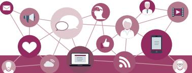

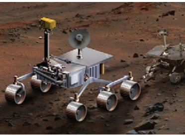

*Figure 2.5: NASA's Mars Exploration Rover (MER)* 

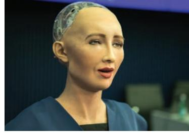

*Figure 2.6: Sophia : a Humanoid*

software-controlled flight plans in their embedded systems, working in conjunction with onboard sensors and GPS (Figure 2.7). Drones are being used in many fields, such as journalism, filming and aerial photography, shipping or delivery at short distances, disaster management, search and rescue operations, healthcare, geographic mapping and structural safety inspections, agriculture, wildlife monitoring or pooching, besides law-enforcement and border patrolling.

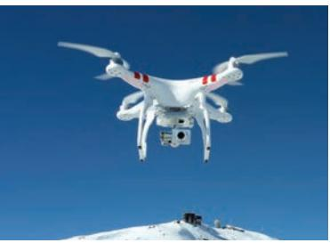

*Figure 2.7: an unmanned aircraft*

**Think and Reflect** Can a drone be helpful in the event of a natural calamity?

## **2.3 Big Data**

With technology making an inroad into almost every sphere of our lives, data is being produced at a colossal rate. Today, there are over a billion Internet users, and a majority of the world's web traffic is coming from smartphones. Figure 2.8 shows that at the current pace, around 2.5 quintillion bytes of data are created each day, and the pace is increasing with the continuous evolution of the Internet of Things (IoT).

This results in the generation of data sets of enormous volume and complexity called *Big Data*. Such data cannot be processed and analysed using traditional data

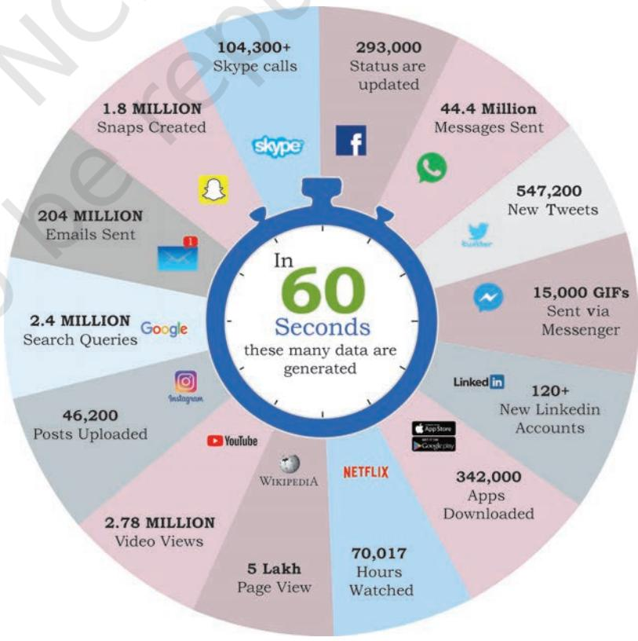

*Figure 2.8: Sources of big data (numbers are approximate)*

Chap 2.indd 19 19-Jul-19 3:06:50 PM

activities contributing to generation of Big data?

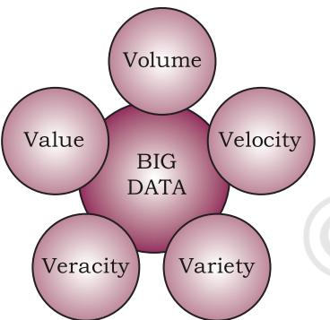

*Figure 2.9: Characteristics of big data*

processing tools as the data is not only voluminous, but also unstructured like our posts, instant messages and chats, photographs that we share through various sites, our tweets, blog articles, news items, opinion polls and their comments, audio/video chats, etc. Big data not only represents voluminous data, it also involves various challenges like integration, storage, analysis, searching, processing, transfer, querying and visualisation of such data. Big data sometimes hold rich information and knowledge which is of high business value, and therefore there is a keen effort in developing software and methods to process and analyse big data.

#### **2.3.1 Characteristics of Big Data**

Big data exhibits following five characteristics shown in Figure 2.9, that distinguish it from traditional data.

#### *(A) Volume*

The most prominent characteristic of big data is its enormous size. If a particular data set is of such large size that it is difficult to process it with traditional DBMS tools, it can be termed as big data.

#### *(B) Velocity*

It represents the rate at which the data under consideration is being generated and stored. Big data has an exponentially higher rate of generation than traditional data sets.

#### *(C) Variety*

It asserts that a data set has varied data, such as structured, semi-structured and unstructured data. Some examples are text, images, videos, web pages and so on.

#### *(D) Veracity*

Big data can be sometimes inconsistent, biased, noisy or there can be abnormality in the data or issues with the data collection methods. Veracity refers to the trustworthiness of the data because processing such incorrect data can give wrong results or mislead the interpretations.

#### *(E) Value*

Big data is not only just a big pile of data, but also possess to have hidden patterns and useful knowledge which can be of high business value. But as there is cost of investment of resources in processing big data, we should make a preliminary enquiry to see the potential

Chap 2.indd 20 19-Jul-19 3:06:50 PM

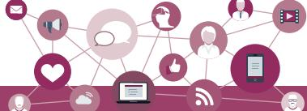

of the big data in terms of value discovery or else our efforts could be in vain.

#### **2.3.2 Data Analytics**

Data analytics is the process of examining data sets in order to draw conclusions about the information they contain, with the aid of specialised systems and software.

Data analytics technologies and techniques are becoming popular day-by-day. They are used in commercial industries to enable organisations to make more informed business decisions. In the field of science and technology, it can be useful for researchers to verify or disprove scientific models, theories and hypotheses. Pandas is a library of the programming language Python that can be used as a tool to make data analysis much simpler.

## **2.4 Internet of Things (IoT)**

The term computer network that we commonly use is the network of computers. Such a network consists of a laptop, desktop, server, or a portable device like tablet, smartphone, smartwatch, etc., connected through wire or wireless. We can communicate between these devices using Internet or LAN. Now imagine what if our bulbs, fans and refrigerator also became a part of this network. How will they communicate with each other, and what will they communicate? Think about the advantages and tasks that can be accomplished if all these devices with smart connectivity features are able to communicate amongst themselves and

we are also able to communicate with them using computers or smartphones!

The 'Internet of Things' is a network of devices that have an embedded hardware and software to communicate (connect and exchange data) with other devices on the same network as shown in Figure 2.10. At present, in a typical household, many devices have advanced hardware (microcontrollers) and software. These devices are used

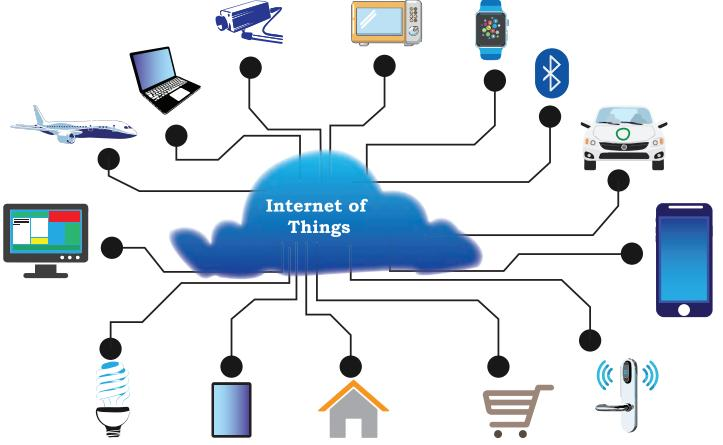

*Figure 2.10: Internet of Things (IoT)*

Explore and list a few IoT devices available in the market.

Chap 2.indd 21 19-Jul-19 3:06:50 PM

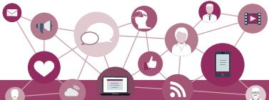

in isolation from each other, with maximum human intervention needed for operational directions and input data. IoT tends to bring together these devices to work in collaboration and assist each other in creating an intelligent network of things. For example, if a microwave oven, an air conditioner, door lock, CCTV camera or other such devices are enabled to connect to the Internet, we can access and remotely control them on-the-go using our smartphone.

#### **2.4.1 Web of Things (WoT)**

Internet of Things allows us to interact with different devices through Internet with the help of smartphones or computers, thus creating a personal network. But to interact with 'n' number of different devices, we need to install 'n' different apps. Wouldn't it be convenient to have one interface to connect all the devices? The web is already being used as a system to communicate with each other. So, will it be possible to use the web in such a way that all things can communicate with each other in the most efficient manner by integrating them together? Web of Things (WoT) allows the use of web services to connect anything in the physical world, besides human identities on web. It will pave way for creating smart homes, smart offices, smart cities and so on.

#### **2.4.2 Sensors**

What happens when you hold your mobile vertically or horizontally? The display also changes to vertical or horizontal with respect to the way we hold our mobile. This is possible with the help of two sensors, namely accelerometer and gyroscope (gyro). The accelerometer sensor in the mobile phones detects the orientation of the phone. The gyroscope sensors tracks rotation or twist of your hand and add to the information supplied by the accelerometer.

Sensors are very commonly used for monitoring and observing elements in real world applications. The evolution of smart electronic sensors is contributing in a large way to the evolution of IoT. It will lead to creation of new sensor-based, intelligent systems.

A smart sensor is a device that takes input from the physical environment and uses built-in computing resources to perform predefined functions upon detection of specific input and then process data before passing it on.

#### **Activity 2.4**

We use GPS to navigate outdoors. VPS is another emerging trend that uses Augmented Reality. Explore and find its other utilities.

Chap 2.indd 22 19-Jul-19 3:06:50 PM

**Think and Reflect** What are your ideas of

#### **2.4.3 Smart Cities**

With rapid urbanisation, the load on our cities is increasing day-by-day, and there are challenges in management of resources like land water, waste, air pollution, health and sanitation, traffic congestions, public safety and security, besides the overall city infrastructures including road, rail, bridge, electricity, subways, disaster management, sports facilities, etc. These challenges are forcing many city planners around the world to look for smarter ways to manage them and make cities sustainable and livable.

The idea of a smart city as shown in Figure 2.11 makes use of computer and communication technology along with IoT, WoT to manage and distribute resources efficiently. The smart building shown here uses sensors to detect earthquake tremors and then warn nearby buildings so that they can prepare themselves accordingly. The smart bridge uses wireless sensors to detect any loose bolt, cable or crack. It alerts

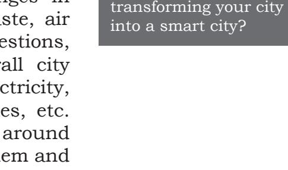

*Figure 2.11:Smart City*

concerned authorities through SMS. The smart tunnel also uses wireless sensors to detect any leakage or congestion in the tunnel. This information can be sent as wireless signals across the network of sensor nodes to a centralised computer for further analysis.

Every sphere of life in a city like transportation systems, power plants, water supply networks, waste management, law enforcement, information systems, schools, libraries, hospitals and other community services work in unison to optimise the efficiency of city operations and services.

## **2.5 Cloud Computing**

Cloud computing is an emerging trend in the field of information technology, where computer-based services are delivered over the Internet or the cloud, for the case

Chap 2.indd 23 19-Jul-19 3:06:50 PM

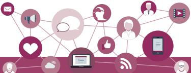

of their accessibility form any where using any smart device. The services comprise software, hardware (servers), databases, storage, etc. These resources are provided by companies called cloud service providers and usually charge on pay per use basis, like the way we pay for electricity usage. We already use cloud services while storing our pictures and files as backup on Internet, or host a website on the Internet. Through cloud computing, a user can run a bigger application or process a large amount of data without having the required storage or processing power on their personal computer as long as they are connected to the Internet. Besides other numerous features, cloud computing offers cost-effective, on-demand resources. A user can avail need-based resources from the cloud at a very reasonable cost.

#### **2.5.1 Cloud Services**

A better way to understand the cloud is to interpret everything as a service. A service corresponds to any facility provided by the cloud. There are three standard models to categorise different computing services delivered through cloud as shown in Figure 2.12. These are Infrastructure as a Service (IaaS), Platform as a Service (PaaS), and Software as a Service (SaaS).

#### *(A) Infrastructure as a Service (IaaS)*

The IaaS providers can offer different kinds of computing infrastructure, such as servers, virtual machines (VM), storage and backup facility, network components,

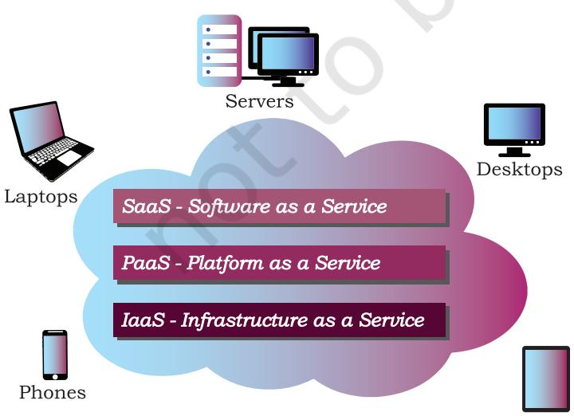

and security. *Figure 2.12: Cloud Computing Services*

operating systems or any other hardware or software. Using IaaS from the cloud, a user can use the hardware infrastructure located at a remote location to configure, deploy and execute any software application on that cloud infrastructure. They can outsource the hardware and software on demand basis and pay as per the usage, thereby they can save the cost of software, hardware and other infrastructures as well as the cost of setting up, maintenance

Chap 2.indd 24 19-Jul-19 3:06:50 PM

#### *(B) Platform as a Service (PaaS)*

Through this service, a user can install and execute an application without worrying about the underlying infrastructure and their setup. That is, PaaS provides a platform or environment to develop, test, and deliver software applications. Suppose we have developed a web application using MySQL and Python. To run this application online, we can avail a pre-configured Apache server from cloud having MySQL and Python preinstalled. Thus, we are not required to install MySQL and Python on the cloud, nor do we need to configure the web server (Apache, nginx). In PaaS, the user has complete control over the deployed application and its configuration. It provides a deployment environment for developers at a much reduced cost lessening the complexity of buying and managing the underlying hardware and software.

#### *(C) Software as a Service (SaaS)*

SaaS provides on-demand access to application software, usually requiring a licensing or subscription by the user. While using Google doc, Microsoft Office 365, Drop Box, etc., to edit a document online, we use SaaS from cloud. A user is not concerned about installation or configuration of the software application as long as the required software is accessible. Like PaaS, a user is provided access to the required configuration settings of the application software, that they are using at present.

In all of the above standard service models, a user can use on-demand infrastructure or platform or software and is usually charged as per the usage, thereby eliminating the need of a huge investment upfront for a new or evolving organisation. In order to utilise and harness the benefits of cloud computing, Government of India has embarked upon an ambitious initiative — 'GI Cloud' which has been named as 'MeghRaj' (https:// cloud.gov.in).

## **2.6 Grid Computing**

A grid is a computer network of geographically dispersed and heterogeneous computational resources as shown in Figure 2.13. Unlike cloud, whose primary focus is to provide services, a grid is more application specific and creates a sense of a virtual supercomputer

Name a few data centers in India along with the major services that they provide.

Chap 2.indd 25 19-Jul-19 3:06:50 PM

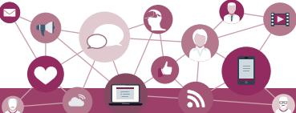

**Think and Reflect**

How can some of the emerging trends discussed in this chapter be used as assistive tools for people with disabilities?

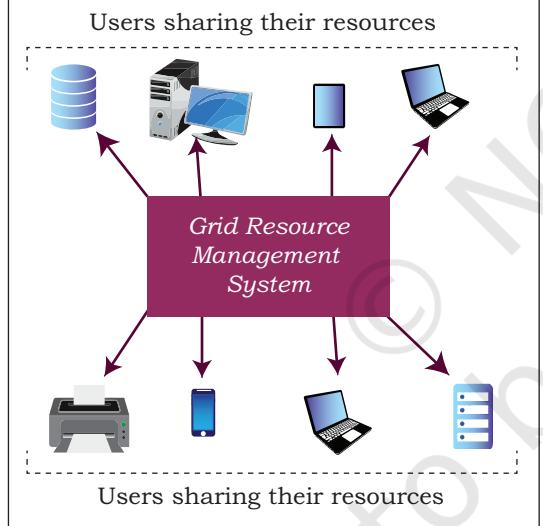

*Figure 2.13:Grid computing*

with an enormous processing power and storage. The constituent resources are called nodes. These different nodes temporarily come together to solve a single large task and to reach a common goal.

Nowadays, countless computational nodes ranging from hand-held mobile devices to personal computers and workstations are connected to Local Area Network (LAN) or Internet. Therefore, it is economically feasible to reuse or utilise their resources like memory as well as processing power. The grid provides an opportunity to solve computationally intense scientific and research problems without actually procuring a costly hardware.

Grid can be of two types— (i) Data grid, used to manage large and distributed data having the required multi-user access, and (ii) CPU or Processor grid, where processing is moved from one PC to another as needed or a large task is divided into subtasks, and allotted to various nodes for parallel processing.

> Grid computing is different from IaaS cloud service. In case of IaaS cloud service, there is a service provider who rents the required infrastructure to the users. Whereas in grid computing, multiple computing nodes join together to solve a common computational problem.

> To set up a grid, by connecting numerous nodes in terms of data as well as CPU, a middleware is required to implement the distributed processor architecture. The Globus toolkit (http://toolkit.globus.org/toolkit) is one such software toolkit used for building grids, and it is as open source. It includes software for security, resource management, data management, communication, fault detection, etc.

## **2.7 Blockchains**

Traditionally, we perform digital transactions by storing data in a centralised database and the transactions performed are updated one by one on the database. That is how the ticket booking websites or banks operate. However, since all the data is stored on a central location, there are chances of data being hacked or lost.

The blockchain technology works on the concept of decentralised and shared database where each computer

Chap 2.indd 26 19-Jul-19 3:06:51 PM

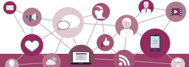

has a copy of the database. A block can be thought as a secured chunk of data or valid transaction. Each block has some data called its header, which is visible to every other node, while only the owner has access to the private data of the block. Such blocks form a chain called blockchain as shown in Figure 2.14. We can define blockchain as a system that allows a group of connected computers to maintain a single updated and secure ledger. Each computer or node that participates in the blockchain receives a full copy of the database. It maintains an 'append only' open ledger which is updated only after all the nodes within the network authenticate the transaction. Safety and security of the transactions are ensured because all the members in the network keep a copy of the blockchain and so it is not possible for a single member of the network to make changes or alter data.

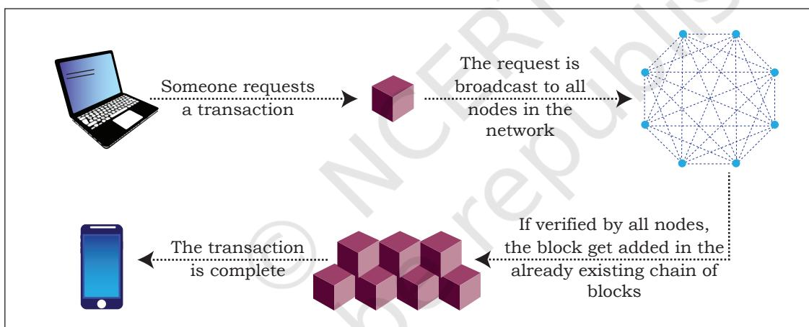

*Figure 2.14: Block chain technology*

The most popular application of blockchains technology is in digital currency. However, due to its decentralised nature with openness and security, blockchains are being seen as one of the ways to ensure transparency, accountability and efficiency in business as well as in governance systems.

For example, in healthcare, better data sharing between healthcare providers would result in a higher probability of accurate diagnosis, more effective treatments, and the overall increased ability of healthcare organisations to deliver cost-effective care. Another potential application can be for land registration records, to avoid various disputes arising out of land ownership

**Think and Reflect** Name any two areas

other than those given where the concept of blockchain technology can be useful.

Chap 2.indd 27 19-Jul-19 3:06:51 PM

## **Notes**

claims and encroachments. A blockchain based voting system can solve the problem of vote alterations and other issues. Since everything gets stored in the ledger, voting can become more transparent and authentic. The blockchain technology can be used in diverse sectors, such as banking, media, telecom, travel and hospitality and other areas.

## **Summary**

- Artificial Intelligence endeavours to simulate the natural intelligence of human beings into machines thus making them intelligent.
- Machine learning comprises of algorithms that use data to learn on their own and make predictions.
- Natural language processing (NLP) facilitates communicating with intelligent systems using a natural language.
- Virtual reality allows a user to look at, explore, and interact with the virtual surroundings, just like one can do in the real world.
- The superimposition of computer-generated perceptual information over the existing physical surroundings is called augmented reality.
- Robotics can be defined as the science primarily associated with the design, fabrication, theory, and application of robots.
- Big data holds rich information and knowledge which can be of high business value. Five characteristics of big data are: Volume, Velocity, Variety, Veracity, and Value.
- Data analytics is the process of examining data sets in order to draw conclusions about the information they contain.
- The Internet of Things (IoT) is a network of devices that have an embedded hardware and software to communicate (connect and exchange data) with other devices on the same network.
- A sensor is a device that takes input from the physical environment and uses built-in computing resources to perform predefined functions upon detection of specific input and then processes data before passing it on.

Chap 2.indd 28 19-Jul-19 3:06:51 PM

- Cloud computing allows resources located at
	- remote locations to be made available to anyone anywhere. Cloud services can be Infrastructure as a Service (IaaS), Platform as a Service (PaaS), and Software as a Service (SaaS).
- Block chair technology uses a shared data base of chaired blocks where copies of data base exist on multiple computers.

**Exercise**

- 1. List some of the cloud-based services that you are using at present.
- 2. What do you understand by the Internet of Things? List some of its potential applications.
- 3. Write a short note on the following:
	- a) Cloud computing
	- b) Big data and its characteristics
- 4. Explain the following along with their applications. a) Artificial Intelligence b) Machine Learning
- 5. Differentiate between cloud computing and grid computing with suitable examples.
- 6. Justify the following statement- 'Storage of data is cost effective and time saving in cloud computing.'
- 7. What is on-demand service? How it is provided in cloud computing?
- 8. Write examples of the following:
	- a) Government provided cloud computing platform
	- b) Large scale private cloud service providers and the services they provide
- 9. A company interested in cloud computing is looking for a provider who offers a set of basic services such as virtual server provisioning and on-demand storage that can be combined into a platform for deploying and running customised applications. What type of cloud computing model fits these requirements?
	- a) Platform as a Service
	- b) Software as a Service
	- c) Infrastructure as a Service

**Notes**

Chap 2.indd 29 19-Jul-19 3:06:51 PM

2024-25

**Notes**

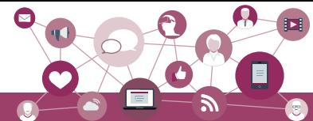

#### 10. Which is not one of the features of IoT devices?

- a) Remotely controllable
- b) Programmable
- c) Can turn themselves off if necessary
- d) All of the above
- 11. If Government plans to make a smart school by applying IoT concepts, how can each of the following be implemented in order to transform a school into IoT enabled smart school?
	- a) e-textbooks
	- b) Smart boards
	- c) Online tests
	- d) Wifi sensors on classrooms doors
	- e) Sensors in buses to monitor their location
	- f) Wearables (watches or smart belts) for attendance monitoring
- 12. Five friends plan to try a startup. However, they have a limited budget and limited computer infrastructure. How can they avail the benefits of cloud services to launch their startup?
- 13. Governments provide various scholarships to students of different classes. Prepare a report on how blockchain technology can be used to promote accountability, transparency and efficiency in distribution of scholarships?
- 14. How IoT and WoT are related?
- 15. Match the following:

| Column A | Column B |
| --- | --- |
| You got a reminder to take medication | Smart Parking |
| You got a sms alert that you forgot to lock the door | Smart Wearable |
| You got the sms alert that parking space is available near your block | Home Automation |
| You turned off your LED TV from your wrist watch | Smart Health |

Chap 2.indd 30 19-Jul-19 3:06:51 PM

