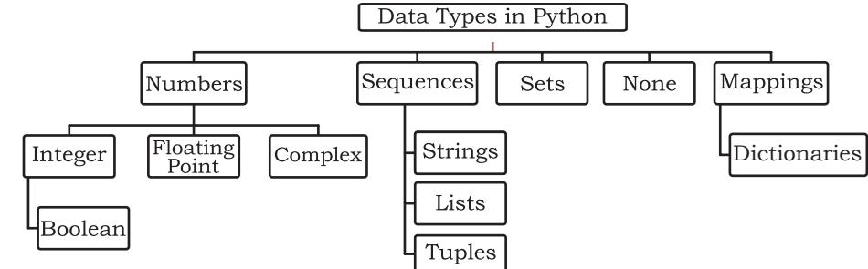
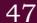

**Chapter**

**3**

*"Don't you hate code that's not properly indented? Making it [indenting] part of the syntax guarantees that all code is properly indented."* 

*— G. van Rossum*

# **3.1 Introduction to Python**

An ordered set of instructions or commands to be executed by a computer is called a *program*. The language used to specify those set of instructions to the computer is called a programming language for example Python, C, C++, Java, etc.

This chapter gives a brief overview of Python programming language. Python is a very popular and easy to learn programming language, created by Guido van Rossum in 1991. It is used in a variety of fields, including software development, web development, scientific computing, big data

# *In this chapter*

- » Introduction to Python
- » Python Keywords
- » Identifiers
- » Variables
- » Data Types
- » Operators
- » Expressions
- » Input and Output
- » Debugging
- » Functions
- » if..else Statements
- » for Loop
- » Nested Loops

Chap 3.indd 31 19-Jul-19 3:16:31 PM


and Artificial Intelligence. The programs given in this book are written using Python 3.7.0. However, one can install any version of Python 3 to follow the programs given.

#### Download Python **3.1.1 Working with Python**

The latest version of Python is available on the official website: https://www.python.

org/

To write and run (execute) a Python program, we need to have a Python interpreter installed on our computer or we can use any online Python interpreter. The interpreter is also called *Python shell*. A sample screen of Python interpreter is shown in Figure 3.1. Here, the symbol >>> is called Python prompt, which indicates that the interpreter is ready to receive instructions. We can type commands or statements on this prompt for execution.

*Figure 3.1:Python Interpreter or Shell*

# **3.1.2 Execution Modes**

There are two ways to run a program using the Python interpreter:

- a) Interactive mode
- b) Script mode

# *(A) Interactive Mode*

In the interactive mode, we can type a Python statement on the >>> prompt directly. As soon as we press enter, the interpreter executes the statement and displays the result(s), as shown in Figure 3.2.

Working in the interactive mode is convenient for testing a single line code for instant execution. But in the interactive mode, we cannot save the statements for

*Figure 3.2:Python Interpreter in Interactive Mode*

Chap 3.indd 32 19-Jul-19 3:16:32 PM


future use and we have to retype the statements to run them again.

# *(B) Script Mode*

In the script mode, we can write a Python program in a file, save it and then use the interpreter to execute the program from the file. Such program files have a .py extension and they are also known as scripts. Usually, beginners learn Python in interactive mode, but for programs having more than a few lines, we should always save the code in files for future use. Python scripts can be created using any editor. Python has a *built-in editor* called IDLE which can be used to create programs. After opening the IDLE, we can click File>New File to create a new file, then write our program on that file and save it with a desired name. By default, the Python scripts are saved in the Python installation folder.

IDLE : Integrated Development and Learning Environment

*Figure 3.3:Python Code in Script Mode (prog3-1.py)*

To execute a Python program in script mode,

- a) Open the program using an editor, for example IDLE as shown in Figure 3.3.
- b) In IDLE, go to [Run]->[Run Module] to execute the prog3-1.py as shown in Figure 3.4.
- c) The output appears on shell as shown in Figure 3.5.

| 2 prog3-1.py - C:\NCERT\prog3-1.py (3.7.0) |  | I | X |
| --- | --- | --- | --- |
| File Edit Format Run Options Window Help |  |  |  |
| print ("Save | Python Shell |  |  |
| print ( 'Pres | Check Module Alt+X |  |  |
| Run Module F5 |  |  |  |

*Figure 3.4:Execution of Python in Script mode using IDLE*

| Python 3.7.0 Shell |
| --- |
| File Edit Shell Debug Options Window Help |
| Python 3.7.0 (v3.7.0:1bf9cc5093, Jun 27 2018, 04:06:47) (MSC v.1914 32 bit (Intel)] on win32 |
| Type "copyright", "credits" or "license ()" for more information. |
| RESTART: C:\NCERT\prog3-1.py === |
| Save Earth |
| Preserve Future |

*Figure 3.5:Output of a Program prog 3-1.py executed in Script Mode*

Chap 3.indd 33 19-Jul-19 3:16:32 PM


# **3.2 Python Keywords**

Keywords are reserved words. Each keyword has a specific meaning to the Python interpreter. As Python is case sensitive, keywords must be written exactly as given in Table 3.1.

| False | class | finally | is | return |
| --- | --- | --- | --- | --- |
| None | continue | for | lambda | try |
| True | def | from | nonlocal | while |
| and | del | global | not | with |
| as | elif | if | or | yield |
| assert | else | import | pass |  |
| break | except | in | raise |  |

# **Table 3.1 Python keywords**

# **3.3 Identifiers**

In programming languages, *identifiers* are names used to identify a variable, function, or other entities in a program. The rules for naming an identifier in Python are as follows:

- The name should begin with an uppercase or a lowercase alphabet or an underscore sign (_). This may be followed by any combination of characters a-z, A-Z, 0-9 or underscore (_). Thus, an identifier cannot start with a digit.
- It can be of any length. (However, it is preferred to keep it short and meaningful).
- It should not be a keyword or reserved word given in Table 3.1.
- We cannot use special symbols like !, @, #, $, %, etc. in identifiers.

For example, to find the average of marks obtained by a student in three subjects namely Maths, English, Informatics Practices (IP), we can choose the identifiers as marksMaths, marksEnglish, marksIP and avg rather than a, b, c, or A, B, C, as such alphabets do not give any clue about the data that variable refers to.

avg = (marksMaths + marksEnglish + marksIP)/3

# **3.4 Variables**

Variable is an identifier whose value can change. For example variable age can have different value for different person. Variable name should be unique in a program. Value of a variable can be string (for example,

Chap 3.indd 34 19-Jul-19 3:16:32 PM


'b', 'Global Citizen'), number (for example 10,71,80.52) or any combination of alphanumeric (alphabets and numbers for example 'b10') characters. In Python, we can use an assignment statement to create new variables and assign specific values to them.

```
gender = 'M'
message = "Keep Smiling"
price = 987.9
```
Variables must always be assigned values before they are used in the program, otherwise it will lead to an error. Wherever a variable name occurs in the program, the interpreter replaces it with the value of that particular variable.

Program 3-2 Write a Python program to find the sum of two numbers.

```
#Program 3-2
#To find the sum of two given numbers
num1 = 10
num2 = 20
result = num1 + num2
print(result) 
#print function in python displays the output
```
# Output:

30

Program 3-3 Write a Python program to find the area of a rectangle given that its length is 10 units and breadth is 20 units.

```
#Program 3-3 
  #To find the area of a rectangle
  length = 10
  breadth = 20
  area = length * breadth
  print(area)
Output:
  200
```
# **3.5 Data Types**

Every value belongs to a specific data type in Python. Data type identifies the type of data which a variable can hold and the operations that can be performed on those data. Figure 3.6 enlists the data types available in Python.

Comments are used to add a remark or a note in the source code. Comments are not executed by interpreter. They are added with the purpose of making the source code easier for humans to understand. They are used primarily to document the meaning and purpose of source code.

In Python, a single line comment starts with # (hash sign). Everything following the # till the end of that line is treated as a comment and the interpreter simply ignores it while executing the statement.

Chap 3.indd 35 19-Jul-19 3:16:32 PM




*Figure 3.6:Different Data Types in Python*

#### **3.5.1 Number**

Number data type stores numerical values only. It is further classified into three different types: int, float and complex.

|  | Table 3.2 Numeric data types |  |
| --- | --- | --- |
| Type/ Class | Description | Examples |
| int | integer numbers | -12, -3, 0, 123, 2 |
| float | floating point numbers | -2.04, 4.0, 14.23 |
| complex | complex numbers | 3 + 4i, 2 - 2i |

Boolean data type (bool) is a subtype of integer. It is a unique data type, consisting of two constants, True and False. Boolean True value is non-zero. Boolean False is the value zero.

Let us now try to execute few statements in interactive mode to determine the data type of the variable using built-in function type().

# *Example 3.1*

```
>>> quantity = 10
>>> type(quantity)
<class 'int'>
>>> Price = -1921.9
```
>>> type(price) <class 'float'>

Variables of simple data types like integer, float, boolean etc. hold single value. But such variables are not useful to hold multiple data values, for example, names of the months in a year, names of students in a class, names and numbers in a phone book or the list of artefacts in a museum. For this, Python provides sequence data types like Strings, Lists, Tuples, and mapping data type Dictionaries.

#### **3.5.2 Sequence**

A Python sequence is an ordered collection of items, where each item is indexed by an integer value. Three

Chap 3.indd 36 19-Jul-19 3:16:32 PM


types of sequence data types available in Python are Strings, Lists and Tuples. A brief introduction to these data types is as follows:

# *(A) String*

String is a group of characters. These characters may be alphabets, digits or special characters including spaces. String values are enclosed either in single quotation marks (for example 'Hello') or in double quotation marks (for example "Hello"). The quotes are not a part of the string, they are used to mark the beginning and end of the string for the interpreter. For example,

```
>>> str1 = 'Hello Friend'
>>> str2 = "452"
```
We cannot perform numerical operations on strings, even when the string contains a numeric value. For example str2 is a numeric string.

# *(B) List*

List is a sequence of items separated by commas and items are enclosed in square brackets [ ]. Note that items may be of different date types.

# *Example 3.2*

```
#To create a list
>>> list1 = [5, 3.4, "New Delhi", "20C", 45] 
#print the elements of the list list1
>>> list1 
[5, 3.4, 'New Delhi', '20C', 45]
```
# *(C) Tuple*

Tuple is a sequence of items separated by commas and items are enclosed in parenthesis ( ). This is unlike list, where values are enclosed in brackets [ ]. Once created, we cannot change items in the tuple. Similar to List, items may be of different data types.

#### *Example 3.3*

```
#create a tuple tuple1
>>> tuple1 = (10, 20, "Apple", 3.4, 'a') 
#print the elements of the tuple tuple1
>>> print(tuple1) 
(10, 20, "Apple", 3.4, 'a')
```
# **3.5.3 Mapping**

Mapping is an unordered data type in Python. Currently, there is only one standard mapping data type in Python called Dictionary.

**Notes**

Chap 3.indd 37 19-Jul-19 3:16:32 PM


# *(A) Dictionary*

Dictionary in Python holds data items in key-value pairs and Items are enclosed in curly brackets { }. dictionaries permit faster access to data. Every key is separated from its value using a colon (:) sign. The key value pairs of a dictionary can be accessed using the key. Keys are usually of string type and their values can be of any data type. In order to access any value in the dictionary, we have to specify its key in square brackets [ ].

#### *Example 3.4*

```
#create a dictionary
>>> dict1 = {'Fruit':'Apple', 
'Climate':'Cold', 'Price(kg)':120} 
>>> print(dict1)
{'Fruit': 'Apple', 'Climate': 'Cold', 
'Price(kg)': 120}
#getting value by specifying a key
>>> print(dict1['Price(kg)'])
120
```
# **3.6 Operators**

An operator is used to perform specific mathematical or logical operation on values. The values that the operator works on are called *operands*. For example, in the expression 10 + num, the value 10, and the variable num are operands and the + (plus) sign is an operator. Python supports several kind of operators, their categorisation is briefly explained in this section.

# **3.6.1 Arithmetic Operators**

Python supports arithmetic operators (Table 3.3) to perform the four basic arithmetic operations as well as modular division, floor division and exponentiation.

'+' operator can also be used to concatenate two strings on either side of the operator.

```
>>> str1 = "Hello"
>>> str2 = "India"
>>> str1 + str2
'HelloIndia'
```
'*' operator repeats the item on left side of the operator if first operand is a string and second operand is an integer value.

```
>>> str1 = 'India'
>>> str1 * 2
'IndiaIndia'
```
Python compares two strings lexicographically (According to the theory and practice of composing and writing dictionary), using ASCII value of the characters. If the first character of both strings are same, the second character is compared, and so on.

Chap 3.indd 38 19-Jul-19 3:16:32 PM


| Operator | Operation | Description | Example (Try in Lab) |
| --- | --- | --- | --- |
| + | Addition | Adds two numeric values on | >>> num1 = 5 |
|  |  | either side of the operator | >>> num2 = 6 |
|  |  |  | >>> num1 + num2 |
|  |  |  | 11 |
| - | Subtraction | Subtracts the operand on the | >>> num1 = 5 |
|  |  | right from the operand on the left | >>> num2 = 6 |
|  |  |  | >>> num1 - num2 |
|  |  |  | -1 |
| * | Multiplication | Multiplies the two values on both | >>> num1 = 5 |
|  |  | sides of the operator | >>> num2 = 6 |
|  |  |  | >>> num1 * num2 |
|  |  |  | 30 |
| / | Division | Divides the operand on the left | >>> num1 = 5 |
|  |  | by the operand on the right of the | >>> num2 = 2 |
|  |  | operator and returns the quotient | >>> num1 / num2 |
|  |  |  | 2.5 |
| % | Modulus | Divides the operand on the left | >>> num1 = 13 |
|  |  | by the operand on the right and | >>> num2 = 5 |
|  |  | returns the remainder | >>> num1 % num2 |
|  |  |  | 3 |
| // | Floor Division | Divides the operand on the left | >>> num1 = 5 |
|  |  | by the operand on the right and | >>> num2 = 2 |
|  |  | returns the quotient by removing | >>> num1 // num2 |
|  |  | the decimal part. It is sometimes | 2 |
|  |  | also called integer division. | >>> num2 // num1 |
|  |  |  | 0 |
| ** | Exponent | Raise the base to the power of the | >>> num1 = 3 |
|  |  | exponent. That is, multiply the | >>> num2 = 4 |
|  |  | base as many times as given in | >>> num1 ** num2 |
|  |  | the exponent | 81 |

#### **Table 3.3 Arithmetic operators in Python**

Operators (+) and (*) work in similar manner for other sequence data types like list and tuples.

# **3.6.2 Relational Operators**

Relational operator compares the values of the operands on its either side and determines the relationship among them. Conside the given Python variables num1 = 10, num2 = 0, num3 = 10, str1 = "Good", str2 = "Afternoon" for the following examples in Table 3.4:

| Table 3.4 Relational operators in Python |
| --- |

| Operator | Operation | Description | Example (Try in Lab) |
| --- | --- | --- | --- |
| == | Equals to | If values of two operands are | >>> num1 == num2 False |
|  |  | equal, then the condition is True, |  |
|  |  | otherwise it is False. | >> str1 == str2 |
|  |  |  | False |

Chap 3.indd 39 19-Jul-19 3:16:32 PM


|  |  | If values of two operands are not | >>> num1 != num2 True |
| --- | --- | --- | --- |
|  |  | equal, then condition is True, | >>> s tr1 != str2 |
| != | Not equal to | otherwise it is False | True |
|  |  |  | >>> num1 != num3 |
|  |  |  | False |
| > | Greater than | If the value of the left operand is greater than the value of the right | >>> num1 > num2 True |
|  |  | operand, then condition is True, | >>> s tr1 > str2 |
|  |  | otherwise it is False. | True |
| < | Less than | If the value of the left operand is less than the value of the right | >>> num1 < num3 |
|  |  | operand, the condition is true | False |
|  |  | otherwise it is False |  |

Similarly, there are other relational operators like <= and >=.

# **3.6.3 Assignment Operators**

Assignment operator assigns or changes the value of the variable on its left, as shown in Table 3.5.

| Table 3.5 Assignment operators in Python |
| --- |

| Operator | Description | Example (Try in Lab) |
| --- | --- | --- |
| = | Assigns value from right side operand to left | >>> num1 = 2 |
|  | side operand | >>> num2 = num1 |
|  |  | >>> num2 |
|  |  | 2 |
|  |  | >>> country = 'India' |
|  |  | >>> country |
|  |  | 'India' |
| += | It adds the value of right side operand to the left | >>> num1 = 10 |
|  | side operand and assigns the result to the left | >>> num2 = 2 |
|  | side operand. | >>> num1 += num2 |
|  | Note: x y + = is same as x x = + y | >>> num1 |
|  |  | 12 |
|  |  | >>> num2 |
|  |  | 2 |
| -= | It subtracts the value of right side operand | >>> num1 = 10 |
|  | from the left side operand and assigns the | >>> num2 = 2 |
|  | result to left side operand. | >>> num1 -= num2 |
|  | y − = is same as x x = − y Note: x | >>> num1 |
|  |  | 8 |

Similarly, there are other assignment operators like *=, /=, %=, //=, and **=.

# **3.6.4 Logical Operators**

There are three logical operators (Table 3.6) supported by Python. These operators (and, or, not) are to be written in lower case only. The logical operator evaluates to either True or False based on the logical operands on its either side.

Chap 3.indd 40 19-Jul-19 3:16:33 PM


| Table 3.6 Logical operators in Python |
| --- |

| Operator | Operation | Description | Example (Try in Lab) |
| --- | --- | --- | --- |
| and | Logical AND | If both operands are True, | >>> num1 = 10 |
|  |  | then condition becomes | >>> num2 = -20 |
|  |  | True | >>> num1 == 10 and num2 == -20 |
|  |  |  | True |
|  |  |  | >>> num1 == 10 and num2 == 10 |
|  |  |  | False |
| or | Logical OR | If any of the two operands | >>> num1 = 10 |
|  |  | are True, then condition | >>> num2 = 2 |
|  |  | becomes True | >>> num1 >= 10 or num2 >= 10 |
|  |  |  | True |
|  |  |  | >>> num1 <= 5 or num2 >= 10 |
|  |  |  | False |
| not | Logical NOT | Used to reverse the logical | >>> num1 = 10 |
|  |  | state of its operand | >>> not (num1 == 20) |
|  |  |  | True |
|  |  |  | >>> not (num1 == 10) |
|  |  |  | False |

# **3.6.5 Membership Operators**

Membership operator (Table 3.7) is used to check if a value is a member of the given sequence or not.

| Table 3.7 Membership operators in Python |
| --- |

| Operator | Description | Example (Try in Lab) |
| --- | --- | --- |
| in | Returns True if the variable or value is found in the | >>> numSeq = [1,2,3] |
|  | specified sequence and False otherwise | >>> 2 in numSeq |
|  |  | True |
|  |  | >>> '1' in numSeq |
|  |  | False |
|  |  | #'1' is a string while |
|  |  | #numSeq contains number 1. |
| not in | Returns True if the variable/value is not found in | >>> numSeq = [1,2,3] |
|  | the specified sequence and False otherwise | >>> 10 not in numSeq |
|  |  | True |
|  |  | >>> 1 not in numSeq |
|  |  | False |

# **3.7 Expressions**

An expression is defined as a combination of constants, variables and operators. An expression always evaluates to a value. A value or a standalone variable is also considered as an expression but a standalone operator is not an expression. Some examples of valid expressions are given below.

 (i) num – 20.4 (iii) 23/3 -5 * 7(14 -2) (ii) 3.0 + 3.14 (iv) "Global"+"Citizen"

Chap 3.indd 41 19-Jul-19 3:16:33 PM


**Notes**

# **3.7.1 Precedence of Operators**

So far we have seen different operators and examples of their usage. When an expression contains more than one operator, their precedence (order or hierarchy) determines which operator should be applied first. Higher precedence operator is evaluated before the lower precedence operator. In the following example, '*' and '/' have higher precedence than '+' and '-'.

#### *Note:*

- a) Parenthesis can be used to override the precedence of operators. The expression within () is evaluated first.
- b) For operators with equal precedence, the expression is evaluated from left to right.

*Example 3.5* How will Python evaluate the following expression?

20 + 30 * 40

*Solution:*

| #precedence of * is more than that of + |  |
| --- | --- |
| = 20 + 1200 | #Step 1 |
| = 1220 | #Step 2 |

*Example 3.6* How will Python evaluate the following expression?

(20 + 30) * 40

*Solution:*

| = (20 + 30) * 40 | # Step 1 |
| --- | --- |
| #using parenthesis(), we have forced |  |
| precedence of + to be more than that of * |  |
| = 50 * 40 | # Step 2 |
| = 2000 | # Step 3 |

*Example 3.7* How will the following expression be evaluated?

 15.0 / 4.0 + (8 + 3.0) *Solution:*

 = 15.0 / 4.0 + (8.0 + 3.0) #Step 1 = 15.0 / 4.0 + 11.0 #Step 2 = 3.75 + 11.0 #Step 3 = 14.75 #Step 4

# **3.8 Input and Output**

Sometimes, we need to enter data or enter choices into a program. In Python, we have the input() function for taking values entered by input device such as a keyboard. The input() function prompts user to enter data. It accepts all user input (whether alphabets,

Chap 3.indd 42 19-Jul-19 3:16:33 PM


numbers or special character) as string. The syntax for input() is:

variable = input([Prompt])

Prompt is the string we may like to display on the screen prior to taking the input, but it is optional. The input() takes exactly what is typed from the keyboard, converts it into a string and assigns it to the variable on left hand side of the assignment operator (=).

#### *Example 3.8*

```
>>> fname = input("Enter your first name: ")
Enter your first name: Arnab
>>> age = input("Enter your age: ")
Enter your age: 19
```
The variable fname gets the string 'Arnab' as input. Similarly, the variable age gets '19' as string. We can change the datatype of the string data accepted from user to an appropriate numeric value. For example, the int() function will convert the accepted string to an integer. If the entered string is non-numeric, an error will be generated.

#### *Example 3.9*

```
#function int() to convert string to integer
>>> age = int(input("Enter your age: "))
Enter your age: 19
>>> type(age)
<class 'int'>
```
Python uses the print() function to output data to standard output device — the screen. The function print() evaluates the expression before displaying it on the screen. The syntax for print() is:

print(value)

*Example 3.10*

| Statement | Output |
| --- | --- |
| print("Hello") | Hello |
| print(10*2.5) | 25.0 |

# **3.9 Debugging**

Due to errors, a program may not execute or may generate wrong output. :

- i) Syntax errors
- ii) Logical errors
- iii) Runtime errors

**Notes**

Chap 3.indd 43 19-Jul-19 3:16:33 PM


**Notes**

# **3.9.1 Syntax Errors**

Like any programming language, Python has rules that determine how a program is to be written. This is called syntax. The interpreter can interpret a statement of a program only if it is syntactically correct. For example, parentheses must be in pairs, so the expression (10 + 12) is syntactically correct, whereas (7 + 11 is not due to absence of right parenthesis. If any syntax error is present, the interpreter shows error message(s) and stops the execution there. Such errors need to be removed before execution of the program.

# **3.9.2 Logical Errors**

A logical error/bug (called semantic error) does not stop execution but the program behaves incorrectly and produces undesired /wrong output. Since the program interprets successfully even when logical errors are present in it, it is sometimes difficult to identify these errors.

For example, if we wish to find the average of two numbers 10 and 12 and we write the code as 10 + 12/2, it would run successfully and produce the result 16, which is wrong. The correct code to find the average should have been (10 + 12) /2 to get the output as 11.

# **3.9.3 Runtime Error**

A runtime error causes abnormal termination of program while it is executing. Runtime error is when the statement is correct syntactically, but the interpreter can not execute it.

For example, we have a statement having division operation in the program. By mistake, if the denominator value is zero then it will give a runtime error like "division by zero".

The process of identifying and removing logical errors and runtime errors is called debugging. We need to debug a program so that is can run successfully and generate the desired output.

# **3.10 Functions**

A function refers to a set of statements or instructions grouped under a name that perform specified tasks. For repeated or routine tasks, we define a function. A function is defined once and can be reused at multiple

Chap 3.indd 44 19-Jul-19 3:16:33 PM


places in a program by simply writing the function name, i.e., by calling that function.

Suppose we have a program which requires to calculate compound interest at multiple places. Now instead of writing the formula to calculate the interest every time, we can create a function called CalcCompInt and inside that function we write the code to take inputs (like interest rate, duration, principle), calculate interest, and display output. We can simply call the function by writing the function name CalcCompInt whenever compound interest is to be computed and thus reuse the code to save time and efforts.

Python has many predefined functions called built‑in functions. We have already used two built-in functions print() and input(). A module is a python file in which multiple functions are grouped together. These functions can be easily used in a Python program by importing the module using import command. Use of built-in functions makes programming faster and efficient. To use a built‑in function we must know the following about that function:

- Function Name name of the function.
- Arguments While calling a function, we may pass value(s), called argument, enclosed in parenthesis, to the function. The function works based on these values. A function may or may not have argument(s).
- Return Value − A function may or may not return one or more values. A function performs operations on the basis of argument (s) passed to it and the result is passed back to the calling point. Some functions do not return any value.

Let us consider the following Python program using three built-in functions input(), int() and print():

```
#Calculate square of a number
num = int(input("Enter the first number"))
square = num * num
print("the square of", num, " is ", square)
```
# *Observe:*

- Two built‑in functions are used in the first statement, int() and input(). The third line has a function print().
- The input function accepts an argument, "Enter your name". Argument(s) is the value(s) passed within the parenthesis.

Chap 3.indd 45 19-Jul-19 3:16:33 PM


**Notes**

- Similarly the print function has four arguments "the square of", num, "is", square separated by commas.
- The int function in the first line takes as argument the value entered by the user from the keyboard and converts it into a string and returns it. Thus the return value from the int() function is an integer.

Some of the most commonly used built-in functions in Python are listed in Table 3.8 under four broad categories.

# **Table 3.8 Some commonly used built-in functions in Python**

| Input/ | Datatype | Mathematical | Other |
| --- | --- | --- | --- |
| Output | Conversion | Functions | Functions |
| input() | bool() | abs() | __import__() |
| print() | chr() | divmod() | len() |
|  | dict() | max() | range() |
|  | float() | min() | type() |
|  | int() | pow() |  |
|  | list() | sum() |  |
|  | ord() |  |  |
|  | set() |  |  |
|  | str() |  |  |
|  | tuple() |  |  |

# **3.11 if..else Statements**

Usually statements in a program are executed one after another. However, there are situations when we have more than one option to choose from, based on the outcome of certain conditions. This can be done using if.. else conditional statements. Conditional statements let us write program to do different tasks or take different paths based on the outcome of the conditions.

There are three ways to write if..else statements:

- if statement executes the statement(s) inside if when the condition is true. '
# *Example 3.11*

```
age = int(input("Enter your age "))
if age >= 18: # use ':' to indicate end of 
condition.
 print("Eligible to vote")
```
Chap 3.indd 46 19-Jul-19 3:16:33 PM



- if...else statement executes the statement(s) inside if when the condition is true, otherwise executes the statement(s) inside else (when the condition is false)
#Program to subtract smaller number from the #larger number and display the difference. num1 = int(input("Enter first number: ")) num2 = int(input("Enter second number: ")) if num1 > num2: diff = num1 - num2 else: diff = num2 - num1

```
print("The difference of",num1,"and",num2, 
"is",diff)
```
#### Output:

```
Enter first number: 5
Enter second number: 6
The difference of 5 and 6 is 1
```
- if...elif....else is use dot check multiple conditions and execute statements accordingly. Meaning of elif is elseif. We can also write elseif instead of elif for more clarity.

```
Example 3.12 Check whether a number is positive, 
            negative, or zero.
   number = int(input("Enter a number: ")
   if number > 0:
    print("Number is positive")
   elif number < 0:
    print("Number is negative")
   else:
    print("Number is zero")
```
When the conditional statements appear, the Python interpreter executes code inside one block that is selected based on the condition. Number of elif is dependent on the number of conditions to be checked. If the first condition is false, then the next condition is checked, and so on. If one of the conditions is true, then the corresponding indented block executes, and the if statement terminates. After that, the statements outside the if..else are executed or the program terminates if there are no further statements.

Python uses indentation for block as well as for nested block structures. Leading whitespace (spaces and tabs) at the beginning of a statement is called indentation. In Python, the same level of indentation associates statements into a single block of code. The interpreter checks indentation levels very strictly and throws up syntax errors if indentation is not correct. It is a common practice to use a single tab for each level of indentation.

Chap 3.indd 47 19-Jul-19 3:16:34 PM


# **3.12 For Loop**

Sometimes we need to repeat certain things for a particular number of times. For example, a program has to display attendance for every student of a class. Here the program has to execute the print statement for every student. In programming, this kind of repetition is called looping or iteration, and it is done using for statement. The for statement is used to iterate over a range of values or a sequence. The loop is executed for each item in the range. The values can be numeric, string, list, or tuple.

When all the items in the range are exhausted, the statements within loop are not executed and Python interpreter starts executing the statements immediately following the for loop. While using for loop, we should know in advance the number of times the loop will execute.

Syntax of the for Loop:

```
for <control-variable> in <sequence/items in 
range>:
```
<statements inside body of the

loop>

Program 3-4 Program to print even numbers in a given sequence using for loop.

```
#Program 3-4
#Print even numbers in the given sequence
numbers = [1,2,3,4,5,6,7,8,9,10]
for num in numbers:
 if (num % 2) == 0:
 print(num,'is an even Number')
2 is an even Number
```
# Output:

4 is an even Number 6 is an even Number 8 is an even Number 10 is an even Number

*Note:* Body of the loop is indented with respect to the for statement.

Chap 3.indd 48 19-Jul-19 3:16:34 PM


# **3.12.1 The range() Function**

The range() is a built-in function in Python. Syntax of range() function is:

```
 range([start], stop[, step])
```
It is used to create a list containing a sequence of integers from the given start value upto stop value (excluding stop value), with a difference of the given step value. If start value is not specified, by default the list starts from 0. If step is also not specified, by default the value is incremented by 1 in each iteration. All parameters of range() function must be integers. The step parameter can be a positive or a negative integer excluding zero.

#### *Example 3.13*

```
>>> list(range(10))
[0, 1, 2, 3, 4, 5, 6, 7, 8, 9]
#start value is given as 2
>>> list(range(2, 10)) 
[2, 3, 4, 5, 6, 7, 8, 9] 
#step value is 5 and start value is 0
>>> list(range(0, 30, 5)) 
[0, 5, 10, 15, 20, 25] 
#step value is -1. Hence, decreasing 
#sequence is generated
>>> list(range(0, -9, -1)) 
[0, -1, -2, -3, -4, -5, -6, -7, -8]
```
The function range() is often used in for loops for generating a sequence of numbers.

# Program 3-5 Program to print the multiples of 10 for numbers in a given range.

```
#Program 3-5
 #Print multiples of 10 for numbers in a range
 for num in range(5):
  if num > 0:
  print(num * 10)
Output:
 10
```
20 30

- 40
Chap 3.indd 49 19-Jul-19 3:16:34 PM


# **3.13 Nested Loops**

A loop may contain another loop inside it. A loop inside another loop is called a nested loop.

```
Program 3-6 Program to 
           demonstrate 
           working of 
           nested for
           loops.
```

```
#Program 3-6
  #Demonstrate working of nested for loops
  for var1 in range(3):
   print( "Iteration " + str(var1 + 1) + " of outer loop")
   for var2 in range(2): #nested loop
   print(var2 + 1)
   print("Out of inner loop")
  print("Out of outer loop")
Output:
  Iteration 1 of outer loop
  1
  2
  Out of inner loop
  Iteration 2 of outer loop
  1
  2
  Out of inner loop
  Iteration 3 of outer loop
  1
  2
  Out of inner loop
  Out of outer loop
```
Chap 3.indd 50 19-Jul-19 3:16:34 PM


# **Summary Notes**

- Python is an open-source, high level, interpreterbased language that can be used for a multitude of scientific and non-scientific computing purposes.
- Comments are non-executable statements in a program.
- An identifier is a user defined name given to a variable or a constant in a program.
- Process of identifying and removing errors from a computer program is called debugging.
- Trying to use a variable that has not been assigned a value gives an error.
- There are several data types in Python integer, boolean, float, complex, string, list, tuple, sets, None and dictionary.
- Operators are constructs that manipulate the value of operands. Operators may be unary or binary.
- An expression is a combination of values, variables, and operators.
- Python has input() function for taking user input.
- Python has print() function to output data to a standard output device.
- The if statement is used for decision making.
- Looping allows sections of code to be executed repeatedly under some condition.
- for statement can be used to iterate over a range of values or a sequence.
- The statements within the body of for loop are executed till the range of values is exhausted.

# **Exercise**

- 1. Which of the following identifier names are invalid and why?

| a) | Serial_no. | e) | Total_Marks |
| --- | --- | --- | --- |
| b) | 1st_Room | f) | total-Marks |
| c) | Hundred$ | g) | _Percentage |
| d) | Total Marks | h) | True |

Chap 3.indd 51 19-Jul-19 3:16:34 PM


| Notes | 2. | Write the corresponding Python assignment statements: |
| --- | --- | --- |
|  |  | a) Assign 10 to variable length and 20 to variable |
|  |  | breadth. |
|  |  | b) Assign the average of values of variables length and |
|  |  | breadth to a variable sum. |
|  | c) | Assign a list containing strings 'Paper', 'Gel Pen', and |
|  |  | 'Eraser' to a variable stationery. |
|  |  | d) Assign the strings 'Mohandas', 'Karamchand', and |
|  |  | 'Gandhi' to variables first, middle and last. |
|  | e) | Assign the concatenated value of string variables |
|  |  | first, middle and last to variable fullname. Make sure |
|  |  | to incorporate blank spaces appropriately between |
|  |  | different parts of names. |
|  | 3. | Which data type will be used to represent the following |
|  |  | data values and why? |
|  |  | a) Number of months in a year |
|  |  | b) Resident of Delhi or not |
|  | c) | Mobile number |
|  |  | d) Pocket money |
|  | e) | Volume of a sphere |
|  | f) | Perimeter of a square |
|  | g) | Name of the student |
|  |  | h) Address of the student |
|  | 4. | Give the output of the following when num1 = 4, num2 = |
|  |  | 3, num3 = 2 |
|  |  | a) num1 += num2 + num3 |
|  |  | b) print (num1) |
|  | c) | num1 = num1 ** (num2 + num3) |
|  |  | d) print (num1) |
|  | e) | num1 **= num2 + c |
|  | f) | num1 = '5' + '5' |
|  | g) | print(num1) |
|  |  | h) print(4.00/(2.0+2.0)) |
|  | i) | num1 = 2+9*((3*12)-8)/10 |
|  | j) | print(num1) |
|  |  | k) num1 = float(10) |
|  | l) | print (num1) |
|  |  | m) num1 = int('3.14') |

Chap 3.indd 52 19-Jul-19 3:16:34 PM


- n) print (num1)
- o) print(10 != 9 and 20 >= 20)
- p) print(5 % 10 + 10 < 50 and 29 <= 29)
- 5. Categorise the following as syntax error, logical error or runtime error:
	- a) 25 / 0
	- b) num1 = 25; num2 = 0; num1/num2
- 6. Write a Python program to calculate the amount payable if money has been lent on simple interest. Principal or money lent = P, Rate = R% per annum and Time = T years. Then Simple Interest (SI) = (P x R x T)/ 100.

Amount payable = Principal + SI.

P, R and T are given as input to the program.

- 7. Write a program to repeat the string ''GOOD MORNING" n times. Here n is an integer entered by the user.
- 8. Write a program to find the average of 3 numbers.
- 9. Write a program that asks the user to enter one's name and age. Print out a message addressed to the user that tells the user the year in which he/she will turn 100 years old.
- 10. What is the difference between else and elif construct of if statement?
- 11. Find the output of the following program segments:

```
a) for i in range(20,30,2):
    print(i)
b) country = 'INDIA'
   for i in country:
    print (i)
c) i = 0; sum = 0
   while i < 9:
       if i % 4 == 0:
    sum = sum + i
    i = i + 2
   print (sum)
```
# **Case Study Based Question**

Schools use "Student Management Information System" (SMIS) to manage student related data. This system provides facilities for:

**Notes**

Chap 3.indd 53 19-Jul-19 3:16:34 PM

# **Notes**


- Recording and maintaining personal details of students.
- Maintaining marks scored in assessments and computing results of students.
- Keeping track of student attendance, and
- Managing many other student-related data in the school. Let us automate the same step by step.

Identify the personal details of students from your school identity card and write a program to accept these details for all students of your school and display them in this format.

Chap 3.indd 54 19-Jul-19 3:16:34 PM

