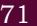

**4**

*"Computer Science is a science of abstraction– creating the right model for a problem and devising the appropriate mechanizable techniques to solve it."* 

*— A. Aho and J. Ullman*

# **4.1 Introduction to List**

The data type list is an ordered sequence which is mutable and made up of one or more elements. Unlike a string which consists of only characters, a list can have elements of different data types such as integer, float, string, tuple or even another list. A list is very useful to group elements of mixed data types. Elements of a list are enclosed in square brackets and are separated by comma.

## *Example 4.1*

```
#list1 is the list of six even numbers
>>> list1 = [2,4,6,8,10,12]
>>> print(list1)
[2, 4, 6, 8, 10, 12]
```
## *In this chapter*

- » Introduction to List
- » List Operations
- » Traversing a List
- » List Methods and Builtin Functions
- » List Manipulation
- » Introduction to Dictionaries
- » Traversing a Dictionary
- » Dictionary Methods and Built-in Functions
- » Manipulating Dictionaries

Chap 4.indd 55 19-Jul-19 3:31:20 PM


**Notes**

```
#list2 is the list of vowels
>>> list2 = ['a','e','i','o','u']
>>> print(list2)
['a', 'e', 'i', 'o', 'u']
#list3 is the list of mixed data types
>>> list3 = [100,23.5,'Hello']
>>> print(list3)
[100, 23.5, 'Hello']
#list4 is the list of lists called nested 
#list
>>> list4 =[['Physics',101],['Chemistry',202], 
 ['Mathematics',303]] 
>>> print(list4)
[['Physics', 101], ['Chemistry', 202],
 ['Mathematics', 303]]
```
## **4.1.1 Accessing Elements in a List**

Each element in list is accessed using value called index. The fist index value is 0, the second index is 1 and so on. Elements in the list are assigned index values in increasing order sterling from 0.

To access an element, use square brackets with the index [] value of that element. We may also use negative index value to access elements starting from the last element in the list, having index value -0.

```
#initialing a list named list1 
>>> list1 = [2,4,6,8,10,12] 
>>> list1[0] #returns first element of list1
2
>>> list1[3] #returns fourth element of list1
8
#Out of range index value for the list returns error
>>> list1[15]
IndexError: list index out of range
#an expression resulting in an integer index 
>>> list1[1+4]
12
>>> list1[-1] #return first element from right
12
#length of the list1 is assigned to n
>>> n = len(list1)
>>> print(n)
6
#Get the last element of the list1 
>>> list1[n-1]
12
```
Chap 4.indd 56 19-Jul-19 3:31:20 PM


```
#Get the first element of list1 
>>> list1[-n]
2
```
## **4.1.2 Lists are Mutable**

In Python, lists are mutable. It means that the contents of the list can be changed after it has been created.

```
#List list1 of colors 
  >>> list1 = ['Red','Green','Blue','Orange'] 
#change/override the fourth element of list1 
  >>> list1[3] = 'Black' 
  >>> list1 #print the modified list list1
['Red', 'Green', 'Blue', 'Black']
```
# **4.2 List Operations**

The data type list allows manipulation of its contents through various operations as shown below.

## **4.2.1 Concatenation**

Python allows us to join two or more lists using concatenation operator using symbol +.

```
#list1 is list of first five odd integers 
>>> list1 = [1,3,5,7,9] 
#list2 is list of first five even integers 
>>> list2 = [2,4,6,8,10] 
#Get elements of list1 followed by list2 
>>> list1 + list2 
[1, 3, 5, 7, 9, 2, 4, 6, 8, 10]
>>> list3 = ['Red','Green','Blue']
>>> list4 = ['Cyan', 'Magenta', 'Yellow' 
,'Black']
>>> list3 + list4
['Red','Green','Blue','Cyan','Magenta', 
 'Yellow','Black']
```
Note that, there is no change in original lists i.e., list1, list2, list3, list4 remain the same after concatenation operation. If we want to use the result of two concatenated lists, we should use an assignment operator.

For example,

#Join list 2 at the end of list >>> new List = list 1 + list 2 [1, 3, 5, 7, 9, 2, 4, 6, 8, 10]

>> new list The concatenation operator '+' requires that the operands should be of list type only. If we try to concatenate a list with elements of some other data type, TypeError occurs.

Concatenation is the merging of two or more values. Example: we can concatenate strings together.

Chap 4.indd 57 19-Jul-19 3:31:20 PM


**Notes**

```
>>> list1 = [1,2,3]
>>> str1 = "abc"
>>> list1 + str1
TypeError: can only concatenate list (not 
"str") to list
```
## **4.2.2 Repetition**

Python allows us to replicate the contents of a list using repetition operator depicted by symbol *.

```
>>> list1 = ['Hello']
#elements of list1 repeated 4 times
>>> list1 * 4 
['Hello', 'Hello', 'Hello', 'Hello']
```
#### **4.2.3 Membership**

The membership operator in checks if the element is present in the list and returns True, else returns False.

```
>>> list1 = ['Red','Green','Blue']
>>> 'Green' in list1
True
>>> 'Cyan' in list1
False
```
The Operator not in transpose returns True if the element is not present in the list, else it returns False.

```
>>> list1 = ['Red','Green','Blue']
>>> 'Cyan' not in list1
True
>>> 'Green' not in list1
False
```
#### **4.2.4 Slicing**

Slicing operations allow us to create new list by taking out elements from an existing list.

```
>>> list1 =['Red','Green','Blue','Cyan', 
'Magenta','Yellow','Black']
#subject from indexes 2 to 5 of list 1
>>> list1[2:6]
['Blue', 'Cyan', 'Magenta', 'Yellow'] 
#list1 is truncated to the end of the list
>>> list1[2:20] #second index is out of range 
['Blue', 'Cyan', 'Magenta', 'Yellow', 
'Black']
>>> list1[7:2] #first index > second index
[] #results in an empty list
```
Chap 4.indd 58 19-Jul-19 3:31:20 PM


```
#return sublist from index 0 to 4 
>>> list1[:5] #first index missing
['Red','Green','Blue','Cyan','Magenta']
```

```
#slicing with a given step size 
>>> list1[0:6:2] 
['Red','Blue','Magenta']
#negative indexes
#elements at index -6,-5,-4,-3 are sliced 
>>> list1[-6:-2] 
['Green','Blue','Cyan','Magenta']
```

```
#both first and last index missing
>>> list1[::2] #step size 2 on entire list
['Red','Blue','Magenta','Black']
```

```
#Access list in the reverse order using 
negative step size
>>> list1[::-1]
['Black','Yellow','Magenta','Cyan','Blue', 
'Green','Red']
```
# **4.3 Traversing a List**

We can access each element of the list or traverse a list using a for loop or a while loop.

```
(A) List traversal using for loop:
```

```
>>> list1 = ['Red','Green','Blue','Yellow', 
    'Black']
   >>> for item in list1:
    print(item)
  Output:
   Red
   Green
   Blue
   Yellow
   Black
Another way of accessing the elements of the list is 
using range() and len() functions:
   >>> for i in range(len(list1)):
    print(list1[i])
```
len (list1) returns the length or total number of elements of list1. range(n) returns a sequence of numbers starting from 0, increases by 1 and ends at n-1 (one number less than the specified number i.e. is)

Output:

Red Green Blue Yellow Black

Chap 4.indd 59 19-Jul-19 3:31:20 PM


# **4.4 List Methods and Built-in Functions**

The data type list has several built-in methods that are useful in programming. Some of them are listed in Table 4.1.

| Table 4.1 Built-in functions for list manipulation |
| --- |

| Method | Description | Example |
| --- | --- | --- |
| len() | Returns the length of the list passed as | >>> list1 = [10,20,30,40,50] |
|  | the argument | >>> len(list1) |
|  |  | 5 |
| list() | Creates an empty list if no argument is | >>> list1 = list() |
|  | passed | >>> list1 |
|  |  | [ ] |
|  |  | >>> str1= 'aeiou' |
|  | Creates a list if a sequence is passed as | >>> list1 = list(str1) |
|  | an argument | >>> list1 |
|  |  | ['a', 'e', 'i', 'o', 'u'] |
| append() | Appends a single element passed as an | >>> list1 = [10,20,30,40] |
|  | argument at the end of the list | >>> list1.append(50) |
|  |  | >>> list1 |
|  | A list can also be appended as an ele | [10, 20, 30, 40, 50] |
|  | ment to an existing list | >>> list1 = [10,20,30,40] |
|  |  | >>> list1.append([50,60]) |
|  |  | >>> list1 |
|  |  | [10, 20, 30, 40, [50, 60]] |
| extend() | Appends each element of the list passed | >>> list1 = [10,20,30] |
|  | as argument at the end of the given list | >>> list2 = [40,50] |
|  |  | >>> list1.extend(list2) >>> list1 |
|  |  | [10, 20, 30, 40, 50] |
| insert() | Inserts an element at a particular index in the list | >>> list1 = [10,20,30,40,50] |
|  |  | #inserts element 25 at index value 2 |
|  |  | >>> list1.insert(2,25) |
|  |  | >>> list1 |
|  |  | [10, 20, 25, 30, 40, 50] |
|  |  | >>> list1.insert(0,100) |
|  |  | >>> list1 |
|  |  | [100, 10, 20, 25, 30, 40, 50] |

Chap 4.indd 60 19-Jul-19 3:31:20 PM


| count() | Returns the number of times a given | >>> list1 = [10,20,30,10,40,10] |
| --- | --- | --- |
|  | element appears in the list | >>> list1.count(10) |
|  |  | 3 |
|  |  | >>> list1.count(90) |
|  |  | 0 |
| find() | Returns index of the first occurrence of | >>> list1 = [10,20,30,20,40,10] |
|  | the element in the list. If the element is | >>> list1.index(20) |
|  | not present, ValueError is generated | 1 |
|  |  | >>> list1.index(90) |
|  |  | ValueError: 90 is not in list |
| remove() | Removes the given element from the | >>> list1 = [10,20,30,40,50,30] |
|  | list. If the element is present multi | >>> list1.remove(30) |
|  | ple times, only the first occurrence is | >>> list1 |
|  | removed. If the element is not present, |  |
|  | then ValueError is generated | [10, 20, 40, 50, 30] >>> list1.remove(90) |
|  |  | ValueError:list.remove(x):x not in |
|  |  | list |
| pop() | Returns the element whose index is | >>> list1 = [10,20,30,40,50,60] |
|  | passed as argument to this function | >>> list1.pop(3) |
|  | and also removes it from the list. If no | 40 |
|  | argument is given, then it returns and | >>> list1 |
|  | removes the last element of the list | [10, 20, 30, 50, 60] |
|  |  | >>> list1 = [10,20,30,40,50,60] |
|  |  | >>> list1.pop() |
|  |  | 60 |
|  |  | >>> list1 |
|  |  | [10, 20, 30, 40, 50] |
| reverse() | Reverses the order of elements in the | >>> list1 = [34,66,12,89,28,99] |
|  | given list | >>> list1.reverse() |
|  |  | >>> list1 |
|  |  | [ 99, 28, 89, 12, 66, 34] |
|  |  | >>> list1 = [ 'Tiger' ,'Zebra' , |
|  |  | 'Lion' , 'Cat' ,'Elephant' ,'Dog'] |
|  |  | >>> list1.reverse() |
|  |  | >>> list1 |
|  |  | ['Dog', 'Elephant', 'Cat', 'Lion', |
|  |  | 'Zebra', 'Tiger'] |
| sort() | Sorts the elements of the given list in | >>>list1 = ['Tiger','Zebra','Lion', |
| place |  | 'Cat', 'Elephant' ,'Dog'] |
|  |  | >>> list1.sort() |
|  |  | >>> list1 |
|  |  | ['Cat', 'Dog', 'Elephant', 'Lion', |
|  |  | 'Tiger', 'Zebra'] |
|  |  | >>> list1 = [34,66,12,89,28,99] |
|  |  | >>> list1.sort(reverse = True) |
|  |  | >>>list1 |
|  |  | [99,89,66,34,28,12] |

Chap 4.indd 61 19-Jul-19 3:31:20 PM


| sorted() | It takes a list as parameter and creates | >>>list1 = [23,45,11,67,85,56] |
| --- | --- | --- |
|  | a new list consisting of the same ele ments but arranged in ascending order | >>> list2 = sorted(list1) |
|  |  | >>> list1 |
|  |  | [23, 45, 11, 67, 85, 56] |
|  |  | >>> list2 |
|  |  | [11, 23, 45, 56, 67, 85] |
| min() | Returns minimum or smallest element | >>> list1 = [34,12,63,39,92,44] |
|  | of the list | >>> min(list1) |
|  |  | 12 |
| max() | Returns maximum or largest element of | >>> max(list1) |
|  | the list Returns sum of the elements of the list | 92 |
| sum() |  | >>> sum(list1) |
|  |  | 284 |

## **4.5 List Manipulation**

In this chapter, we have learnt to create a list and the different ways to manipulate lists. In the following programs, we will apply the various list manipulation methods.

Program 4-1 Write a program to allow user to perform any those list operation given in a menu. The menu is:

- 1. Append an element
- 2. Insert an element
- 3. Append a list to the given list
- 4. Modify an existing element
- 5. Delete an existing element from its position
- 6. Delete an existing element with a given value
- 7. Sort the list in the ascending order
- 8. Sort the list in descending order
- 9. Display the list.

```
#Program 4-1
#Menu driven program to do various list operations
myList = [22,4,16,38,13] #myList having 5 elements
choice = 0
For attempt in range (3): print ("Attempt number:", attempt)
print("The list 'myList' has the following elements", myList)
print("\nL I S T O P E R A T I O N S")
print(" 1. Append an element")
print(" 2. Insert an element at the desired position")
print(" 3. Append a list to the given list")
print(" 4. Modify an existing element")
print(" 5. Delete an existing element by its position")
print(" 6. Delete an existing element by its value")
```
Chap 4.indd 62 19-Jul-19 3:31:20 PM

```
print(" 7. Sort the list in ascending order")
print(" 8. Sort the list in descending order")
 print(" 9. Display the list")
 choice = int(input("ENTER YOUR CHOICE (1-9): "))
 #append element
 if choice == 1: 
 element = eval(input("Enter the element to be appended: "))
 myList.append(element)
 print("The element has been appended\n")
 #insert an element at desired position
 elif choice == 2: 
 element = eval(input("Enter the element to be inserted: "))
 pos = int(input("Enter the position:"))
 myList.insert(pos,element)
 print("The element has been inserted\n")
 #append a list to the given list
 elif choice == 3: 
 newList = eval(input("Enter the list to be appended: "))
 myList.extend(newList)
 print("The list has been appended\n")
 #modify an existing element
 elif choice == 4: 
 i = int(input("Enter the position of the element to be 
modified: "))
 if i < len(myList):
 newElement = eval(input("Enter the new element: "))
 oldElement = myList[i]
 myList[i] = newElement
 print("The element",oldElement,"has been modified\n")
 else:
 print("Position of the element is more then the length 
of list")
 #delete an existing element by position
 elif choice == 5: 
 i = int(input("Enter the position of the element to be 
deleted: "))
 if i < len(myList):
 element = myList.pop(i)
 print("The element",element,"has been deleted\n")
 else:
 print("\nPosition of the element is more then the length 
of list")
```
Chap 4.indd 63 19-Jul-19 3:31:20 PM


```
 #delete an existing element by value
  elif choice == 6: 
  element = int(input("\nEnter the element to be deleted: "))
  if element in myList:
  myList.remove(element)
  print("\nThe element",element,"has been deleted\n")
  else:
  print("\nElement",element,"is not present in the list")
  #list in sorted order
  elif choice == 7: 
  myList.sort()
  print("\nThe list has been sorted")
  #list in reverse sorted order
  elif choice == 8: 
  myList.sort(reverse = True)
  print("\nThe list has been sorted in reverse order")
  #display the list
  elif choice == 9: 
  print("\nThe list is:", myList)
  else:
  print("Choice is not valid")
Output:
 The list 'myList' has the following elements [22, 4, 16, 38, 13]
 Attempt number : 1
 L I S T O P E R A T I O N S
   1. Append an element
   2. Insert an element at the desired position
   3. Append a list to the given list
   4. Modify an existing element
   5. Delete an existing element by its position
   6. Delete an existing element by its value
   7. Sort the list in ascending order
   8. Sort the list in descending order
   9. Display the list
 ENTER YOUR CHOICE (1-10): 8
 The list has been sorted in reverse order
 The list 'myList' has the following elements [38, 22, 16, 13, 4]
 Attempt number : 2
 L I S T O P E R A T I O N S
   1. Append an element
```
Chap 4.indd 64 19-Jul-19 3:31:20 PM

```
2. Insert an element at the desired position
     3. Append a list to the given list
     4. Modify an existing element
     5. Delete an existing element by its position
     6. Delete an existing element by its value
     7. Sort the list in ascending order
     8. Sort the list in descending order
     9. Display the list
   ENTER YOUR CHOICE (1-9) 5
   Enter the position of the element to be deleted: 2
   The element 16 has been deleted
   The list 'myList' has the following elements [38, 22, 13, 4]
   Attempt number : 3
   L I S T O P E R A T I O N S
    1. Append an element
    2. Insert an element at the desired position
    3. Append a list to the given list
    4. Modify an existing element
    5. Delete an existing element by its position
    6. Delete an existing element by its value
    7. Sort the list in ascending order
    8. Sort the list in descending order
    9. Display the list
   ENTER YOUR CHOICE (1-9) 10
   choice is not valid
Program 4-2 A program to calculate average marks 
            of n students where n is entered by 
            the user.
   #Program 4-2
   #create an empty list 
   list1 = [] 
   print("How many students marks you want to enter: ")
   n = int(input())
   for i in range(0,n):
    print("Enter marks of student",(i+1),":")
    marks = int(input())
    #append marks in the list
      list1.append(marks) 
    #initialize total 
      total = 0 
    for marks in list1:
```
Chap 4.indd 65 19-Jul-19 3:31:20 PM


```
 #add marks to total 
    total = total + marks 
    average = total / n
   print("Average marks of",n,"students is:",average)
 Output:
   How many students marks you want to enter:
   5
   Enter marks of student 1:
   45
   Enter marks of student 2:
   89
   Enter marks of student 3:
   79
   Enter marks of student 4:
   76
   Enter marks of student 5:
   55
   Average marks of 5 students is: 68.8
Program 4-3 Write a program to check if a number is 
            present in the list or not. If the number 
            is present, print the position of the 
            number. Print an appropriate message if 
            the number is not present in the list.
   #Program 4-3
   list1 = [] #Create an empty list
   print("How many numbers do you want to enter in the list: ")
   maximum = int(input())
   print("Enter a list of numbers: ")
   for i in range(0,maximum):
    n = int(input())
    list1.append(n) #append numbers to the list
   num = int(input("Enter the number to be searched: "))
   position = -1
   for i in range (0, lin (list1)
   if list1[i] == num: #number is present
   position = i+1 #save the position of number
   if position == -1 :
    print("Number",num,"is not present in the list")
   else:
    print("Number",num,"is present at",position + 1, "position") 
 Output:
   How many numbers do you want to enter in the list
   5
```
Chap 4.indd 66 19-Jul-19 3:31:20 PM


```
Enter a list of numbers:
23
567
12
89
324
Enter the number to be searched:12
Number 12 is present at 3 position
```
# **4.6 Introduction to Dictionaries**

The data type *dictionary* falls under mapping. It is a mapping between a *set of keys* and a *set of values*. The key-value pair is called an *item*. A key is separated from its value by a colon(:) and consecutive items are separated by commas. Items in dictionaries are unordered, so we may not get back the data in the same order in which we had entered the data initially in the dictionary.

## **4.6.1 Creating a Dictionary**

To create a dictionary, the items entered are separated by commas and enclosed in curly braces. Each item is a key value pair, separated through colon (:). The keys in the dictionary must be unique and should be of any immutable data type i.e. number, string or tuple. The values can be repeated and can be of any data type.

```
Example 4.2
```

```
#dict1 is an empty dictionary
>>> dict1 = {} 
>>> dict1
{}
#dict3 is the dictionary that maps names of 
#the students to marks in percentage
>>> dict3 = {'Mohan':95,'Ram':89,'Suhel':92, 
'Sangeeta':85}
>>> dict3
{'Mohan': 95, 'Ram': 89, 'Suhel': 92, 
'Sangeeta': 85}
```
## **4.6.2 Accessing Items in a Dictionary**

We have already seen that the items of a sequence (string, list and tuple) are accessed using a technique called indexing. The items of a dictionary are accessed via the keys rather than via their relative positions or indices. Each key serves as the index and maps to a value.

Chap 4.indd 67 19-Jul-19 3:31:20 PM

**Notes**

The following example shows how a dictionary returns the value corresponding to the given key:

```
>>> dict3 = {'Mohan':95,'Ram':89,'Suhel':92, 
'Sangeeta':85}
>>> dict3['Ram'] 
89
>>> dict3['Sangeeta']
85
#using unspecified key
>>> dict3['Shyam'] 
KeyError: 'Shyam'
```
In the above examples the key 'Ram' always maps to the value 89 and key 'Sangeeta' always maps to the value 85. So the order of items does not matter. If the key is not present in the dictionary we get KeyError.

#### **4.6.3 Membership Operation**

The membership operator in checks if the key is present in the dictionary and returns True, else it returns False.

```
>>> dict1 = {'Mohan':95,'Ram':89,'Suhel':92, 
'Sangeeta':85}
>>> 'Suhel' in dict1
True
```
The not in operator returns True if the key is not present in the dictionary, else it returns False.

```
>>> dict1 = {'Mohan':95,'Ram':89,'Suhel':92, 
'Sangeeta':85}
>>> 'Suhel' not in dict1
False
```
## **4.6.4 Dictionaries are Mutable**

Dictionaries are mutable which implies that the contents of the dictionary can be changed after it has been created.

#### *(A) Adding a new item*

We can add a new item to the dictionary as shown in the following example:

```
>>> dict1 = {'Mohan':95,'Ram':89,'Suhel':92, 
'Sangeeta':85}
>>> dict1['Meena'] = 78
>>> dict1
{'Mohan': 95, 'Ram': 89, 'Suhel': 92, 
'Sangeeta': 85, 'Meena': 78}
```
Chap 4.indd 68 19-Jul-19 3:31:20 PM


# *(B) Modifying an existing item*

The existing dictionary can be modified by just overwriting the key-value pair. Example to modify a given item in the dictionary:

```
>>> dict1 = {'Mohan':95,'Ram':89,'Suhel':92, 
'Sangeeta':85}
#Marks of Suhel changed to 93.5
>>> dict1['Suhel'] = 93.5 
>>> dict1
{'Mohan': 95, 'Ram': 89, 'Suhel': 93.5, 
'Sangeeta': 85}
```
# **4.7 Traversing a Dictionary**

We can access each item of the dictionary or traverse a dictionary using for loop.

```
>>> dict1 = {'Mohan':95,'Ram':89,'Suhel':92, 
'Sangeeta':85}
```
# **Method 1:**

```
>>> for key in dict1:
 print(key,':',dict1[key])
Mohan: 95
Ram: 89
Suhel: 92
Sangeeta: 85
```
## **Method 2:**

```
>>> for key,value in dict1.items():
 print(key,':',value)
Mohan: 95
```
Ram: 89 Suhel: 92 Sangeeta: 85

# **4.8 Dictionary Methods and Built-in Functions**

Python provides many functions to work on dictionaries. Table 4.2 lists some of the commonly used dictionary methods.

| Table 4.2 Built-in functions and methods for dictionary |
| --- |

| Method | Description | Example |
| --- | --- | --- |
| len() | Returns the length or number of | >>> dict1 = {'Mohan':95,'Ram':89, |
|  | key: value pairs of the dictionary | 'Suhel':92, 'Sangeeta':85} |
|  | passed as the argument | >>> len(dict1) |
|  |  | 4 |

Chap 4.indd 69 19-Jul-19 3:31:21 PM


| dict() | Creates a dictionary from | a pair1 = [('Mohan',95),('Ram',89), |
| --- | --- | --- |
|  | sequence of key-value pairs | ('Suhel',92),('Sangeeta',85)] |
|  |  | >>> pair1 |
|  |  | [('Mohan', 95), ('Ram', 89), ('Suhel', |
|  |  | 92), ('Sangeeta', 85)] |
|  |  | >>> dict1 = dict(pair1) |
|  |  | >>> dict1 |
|  |  | {'Mohan': 95, 'Ram': 89, 'Suhel': 92, |
|  |  | 'Sangeeta': 85} |
| keys() | Returns a list of keys in the | >>> dict1 = {'Mohan':95, 'Ram':89, |
|  | dictionary | 'Suhel':92, 'Sangeeta':85} |
|  |  | >>> dict1.keys() |
|  |  | dict_keys(['Mohan', 'Ram', 'Suhel', |
|  |  | 'Sangeeta']) |
| values() | Returns a list of values in the | >>> dict1 = {'Mohan':95, 'Ram':89, |
|  | dictionary | 'Suhel':92, 'Sangeeta':85} |
|  |  | >>> dict1.values() |
|  |  | dict_values([95, 89, 92, 85]) |
| items() | Returns a list of tuples (key — | >>> dict1 = {'Mohan':95, 'Ram':89, |
|  | value) pair | 'Suhel':92, 'Sangeeta':85} |
|  |  | >>> dict1.items() |
|  |  | dict_items([( 'Mohan', 95), ('Ram', 89), |
|  |  | ('Suhel', 92), ('Sangeeta', 85)]) |
| get() | Returns the value corresponding | >>> dict1 = {'Mohan':95, 'Ram':89, |
|  | to the key passed as the argument | 'Suhel':92, 'Sangeeta':85} |
|  |  | >>> dict1.get('Sangeeta') |
|  | If the key is not present in the | 85 |
|  | dictionary it will return None |  |
|  |  | >>> dict1.get('Sohan') |
|  |  | >>> |
| update() | appends the key-value pair of | >>> dict1 = {'Mohan':95, 'Ram':89, |
|  | the dictionary passed as | the 'Suhel':92, 'Sangeeta':85} |
|  | argument to the key-value pair of | >>> dict2 = {'Sohan':79,'Geeta':89} |
|  | the given dictionary | >>> dict1.update(dict2) |
|  |  | >>> dict1 |
|  |  | {'Mohan': 95, 'Ram': 89, 'Suhel': 92, |
|  |  | 'Sangeeta': 85, 'Sohan': 79, 'Geeta': 89} |
|  |  | >>> dict2 |
|  |  | {'Sohan': 79, 'Geeta': 89} |
| clear() | Deletes or clear all the items of | >>> dict1 = {'Mohan':95,'Ram':89, |
|  | the dictionary | 'Suhel':92, 'Sangeeta':85} |
|  |  | >>> dict1.clear() |
|  |  | >>> dict1 |
|  |  | { } |

Chap 4.indd 70 19-Jul-19 3:31:21 PM



|
|  |

| del() | Deletes the item with the given | >>> dict1 = {'Mohan':95,'Ram':89, |
| --- | --- | --- |
|  | key | 'Suhel':92, 'Sangeeta':85} |
|  | To delete the dictionary from the | >>> del dict1['Ram'] |
|  | memory we write: |  |
|  | del Dict_name | >>> dict1 |
|  |  | {'Mohan':95,'Suhel':92, 'Sangeeta': 85} |
|  |  | >>> dict1 |
|  |  | NameError: name 'dict1' is not defined |

# **4.9 Manipulating Dictionaries**

In this chapter, we have learnt how to create a dictionary and apply various methods to manipulate it. The following examples show the application of those manipulation methods on dictionaries.

- (a) Create a dictionary 'ODD' of odd numbers between 1 and 10, where the key is the decimal number and the value is the corresponding number in words.

```
>>> ODD = {1:'One',3:'Three',5:'Five',7:'Seven',9:'Nine'}
>>> ODD
```

```
{1: 'One', 3: 'Three', 5: 'Five', 7: 'Seven', 9: 'Nine'}
```
- (b) Display the keys in dictionary 'ODD'.

```
>>> ODD.keys()
dict_keys([1, 3, 5, 7, 9])
```
- (c) Display the values in dictionary 'ODD'.

```
>>> ODD.values()
dict_values(['One', 'Three', 'Five', 'Seven', 'Nine'])
```
- (d) Display the items from dictionary 'ODD'

```
>>> ODD.items()
dict_items([(1, 'One'), (3, 'Three'), (5, 'Five'), (7, 'Seven'), (9, 
'Nine')])
```
- (e) Find the length of the dictionary 'ODD'.

```
>>> len(ODD)
5
```
- (f) Check if 7 is present or not in dictionary 'ODD'

```
>>> 7 in ODD
True
```
Chap 4.indd 71 19-Jul-19 3:31:21 PM


- (g) Check if 2 is present or not in dictionary 'ODD'

```
>>> 2 in ODD
False
```
- (h) Retrieve the value corresponding to the key 9

```
>>> ODD.get(9)
'Nine'
```
- (i) Delete the item from the dictionary, corresponding to the key 9. 'ODD'

```
>>> del ODD[9]
   >>> ODD
   {1: 'One', 3: 'Three', 5: 'Five', 7: 'Seven'}
Program 4-4 σ n number of write a program to enter 
             names of employees and their salaries 
             as input and store them in a dictionary. 
             Here n is to input by the user.
   #Program 4-4
   #Program to create a dictionary which stores names of employees
   #and their salary
   num = int(input("Enter the number of employees whose data to be 
   stored: "))
   count = 1
```

```
employee = dict() #create an empty dictionary
```

```
for count in range (n):
 name = input("Enter the name of the Employee: ")
 salary = int(input("Enter the salary: "))
 employee[name] = salary
```

```
print("\n\nEMPLOYEE_NAME\tSALARY")
```
for k in employee: print(k,'\t\t',employee[k])

```
Output:
```

```
Enter the number of employees to be stored: 5
Enter the name of the Employee: 'Tarun'
Enter the salary: 12000
Enter the name of the Employee: 'Amina'
Enter the salary: 34000
Enter the name of the Employee: 'Joseph'
Enter the salary: 24000
Enter the name of the Employee: 'Rahul'
Enter the salary: 30000
Enter the name of the Employee: 'Zoya'
Enter the salary: 25000
EMPLOYEE_NAME SALARY
'Tarun' 12000
'Amina' 34000
```
Chap 4.indd 72 19-Jul-19 3:31:21 PM


```
'Joseph' 24000
'Rahul' 30000
'Zoya' 25000
```
Program 4-5 Write a program to count the number of times a character appears in a given string.

```
#Program 4-5
#Count the number of times a character appears in a given string
st = input("Enter a string: ")
dic = {} #creates an empty dictionary
for ch in st:
 if ch in dic: #if next character is already in dic
 dic[ch] += 1
 else:
```
dic[ch] = 1 #if ch appears for the first time

```
for key in dic:
```

```
 print(key,':',dic[key])
```
## Output:

```
Enter a string: HelloWorld
H : 1
e : 1
l : 3
o : 2
W : 1
r : 1
```

```
d : 1
```
Program 4-6 Write a program to convert a number entered by the user into its corresponding number in words. for example if the input is 876 then the output should be 'Eight Seven Six'.

```
# Program 4-6
num = input("Enter any number: ") #number is stored as string
 #numberNames is a dictionary of digits and corresponding number 
  #names
 numberNames = {0:'Zero',1:'One',2:'Two',3:'Three',4:'Four',\
 5:'Five',6:'Six',7:'Seven',8:'Eight',9:'Nine'}
 
 result = ''
 for ch in num:
 key = int(ch) #converts character to integer
 value = numberNames[key]
```
Chap 4.indd 73 19-Jul-19 3:31:21 PM


```
 result = result + ' ' + value
print("The number is:",num)
print("The numberName is:",result)
```
#### Output:

```
Enter any number: 6512
The number is: 6512
The numberName is: Six Five One Two
```
# **Summary**

- Lists are mutable sequences in Python, i.e. we can change the elements of the list.
- Elements of a list are put in square brackets separated by comma.
- List indexing is same as that of list and starts at 0. Two way indexing allows traversing the list in the forward as well as in the backward direction.
- Operator + concatenates one list to the end of other list.
- Operator * repeats the content of a list by specified number of times.
- Membership operator in tells if an element is present in the list or not and not in does the opposite.
- Slicing is used to extract a part of the list.
- There are many list manipulation methods. Few are: len(), list(), append(), extend(), insert(), count(), find(), remove(), pop(), reverse(), sort(), sorted(), min(), max(), sum().
- Dictionary is a mapping (non scalar) data type. It is an unordered collection of key-value pair; keyvalue pair are put inside curly braces.
- Each key is separated from its value by a colon.
- Keys are unique and act as the index.
- Keys are of immutable type but values can be mutable.

Chap 4.indd 74 19-Jul-19 3:31:21 PM


- **Exercise**
- 1. What will be the output of the following statements?
	- a) list1 = [12,32,65,26,80,10] list1.sort() print(list1)
	- b) list1 = [12,32,65,26,80,10] sorted(list1) print(list1)
	- c) list1 = [1,2,3,4,5,6,7,8,9,10] list1[::-2] list1[:3] + list1[3:]
	- d) list1 = [1,2,3,4,5] list1[len(list1)-1]
- 2. Consider the following list myList. What will be the elements of myList after each of the following operations?
	- myList = [10,20,30,40]
		- a) myList.append([50,60])
		- b) myList.extend([80,90])
- 3. What will be the output of the following code segment?

 myList = [1,2,3,4,5,6,7,8,9,10] for i in range(0,len(myList)): if i%2 == 0: print(myList[i])

- 4. What will be the output of the following code segment?
	- a) myList = [1,2,3,4,5,6,7,8,9,10] del myList[3:] print(myList)
	- b) myList = [1,2,3,4,5,6,7,8,9,10] del myList[:5] print(myList)
	- c) myList = [1,2,3,4,5,6,7,8,9,10] del myList[::2] print(myList)
- 5. Differentiate between append() and extend() methods of list.


**Notes**

Chap 4.indd 75 19-Jul-19 3:31:21 PM

```
Notes 6. Consider a list:
```

```
 list1 = [6,7,8,9]
```
What is the difference between the following operations on list1:

- a) lis t1 * 2
- b) lis t1 *= 2
- c) lis t1 = lis t1 * 2
- 7. The record of a student (Name, Roll No, Marks in five subjects and percentage of marks) is stored in the following list:

```
stRecord = ['Raman','A-36',[56,98,99,72,69], 
 78.8]
```
Write Python statements to retrieve the following information from the list stRecord.

- a) Percentage of the student
- b) Marks in the fifth subject
- c) Maximum marks of the student
- d) Roll No. of the student
- e) Change the name of the student from 'Raman' to 'Raghav'
- 8. Consider the following dictionary stateCapital: stateCapital = {"Assam":"Guwahati", "Bihar":"Patna","Maharashtra":"Mumbai", "Rajasthan":"Jaipur"}

Find the output of the following statements:

- a) print(stateCapital.get("Bihar"))
- b) print(stateCapital.keys())
- c) print(stateCapital.values())
- d) print(stateCapital.items())
- e) print(len(stateCapital))
- f) print("Maharashtra" in stateCapital)
- g) print(stateCapital.get("Assam"))
- h) del stateCapital["Assam"] print(stateCapital)

# **Programming Problems**

- 1. Write a program to find the number of times an element occurs in the list.
Chap 4.indd 76 19-Jul-19 3:31:21 PM


- 2. Write a program to read a list of n integers (positive **Notes** as well as negative). Create two new lists, one having all positive numbers and the other having all negative numbers from the given list. Print all three lists.
- 3. Write a program to find the largest and the second largest elements in a given list of elements.
- 4. Write a program to read a list of n integers and find their median.

*Note:* The median value of a list of values is the middle one when they are arranged in order. If there are two middle values then take their average.

*Hint:* Use an inbuilt function to sort the list.

- 5. Write a program to read a list of elements. Modify this list so that it does not contain any duplicate elements i.e. all elements occurring multiple times in the list should appear only once.
- 6. Write a program to create a list of elements. Input an element from the user that has to be inserted in the list. Also input the position at which it is to be inserted.
- 7. Write a program to read elements of a list and do the following.
	- a) The program should ask for the position of the element to be deleted from the list and delete the element at the desired position in the list.
	- b) The program should ask for the value of the element to be deleted from the list and delete this value from the list.
- 8. Write a Python program to find the highest 2 values in a dictionary.
- 9. Write a Python program to create a dictionary from a string 'w3resource' such that each individual character mates a key and its index value for fist occurrence males the corresponding value in dictionary.

Expected output : {'3': 1, 's': 4, 'r': 2, 'u': 6, 'w': 0, 'c': 8, 'e': 3, 'o': 5}

- 10. Write a program to input your friend's, names and their phone numbers and store them in the dictionary as the key-value pair. Perform the following operations on the dictionary:
	- a) Display the Name and Phone number for all your friends.
	- b) Add a new key-value pair in this dictionary and display the modified dictionary

Chap 4.indd 77 19-Jul-19 3:31:21 PM

## **Notes**


- c) Delete a particular friend from the dictionary
- d) Modify the phone number of an existing friend
- e) Check if a friend is present in the dictionary or not
- f) Display the dictionary in sorted order of names

# **Case Study Based Question**

## **For the SMIS System given in Chapter 3, let us do the following:**

- 1. Write a program to take in the roll number, name and percentage of marks for n students of Class X and do the following:
	- Accept details of the n students (n is the number of students).
	- Search details of a particular student on the basis of roll number and display result.
	- Display the result of all the students.
	- Find the topper amongst them.
	- Find the subject toppers amongst them.

(**Hint:** Use Dictionary, where the key can be roll number and the value an immutable data type containing name and percentage.)

# **Case Study**

- 1. A bank is a financial institution which is involved in borrowing and lending of money. With advancement in technology, online banking, also known as internet banking allows customers of a bank to conduct a range of financial transactions through the bank's website anytime, anywhere. As part of initial investigation you are suggested to:
	- Collect a Bank's application form. After careful analysis of the form, identify the information required for opening a savings account. Also enquire about the rate of interest offered for a savings account.
	- The basic two operations performed on an account are Deposit and Withdrawal. Write a menu driven program that accepts either of the two choices of Deposit and Withdrawal, then accepts an amount, performs the transaction and accordingly displays the balance. Remember every bank has a requirement of minimum balance which needs to be taken care of during withdrawal operations.

Chap 4.indd 78 19-Jul-19 3:31:21 PM


Enquire about the minimum balance required in your bank.

- Collect the interest rates for opening a fixed deposit in various slabs in a savings bank account. Remembers rate may be different for senior citizens.
 Finally, write a menu driven program having the following options (use functions and appropriate data types):

- Open a savings bank account
- Deposit money
- Withdraw money
- Take details such as amount and period for a Fixed Deposit and display its maturity amount for a particular customer.
- 2. Participating in a quiz can be fun as it provides a competitive element. Some educational institutes use it as a tool to measure knowledge level, abilities and/ or skills of their pupils either on a general level or in a specific field of study. Identify and analyse popular quiz shows and write a Python program to create a quiz that should also contain the following functionalities besides the one identified by you as a result of your analysis.
	- Create an administrative user ID and password to categorically add or modify delete a question.
	- Register the student before allowing her/him to play a quiz.
	- Allow selection of category based on subject area.
	- Display questions as per the chosen category.
	- Keep the score as the participant plays.
	- Display final score.
- 3. Our heritage monuments are our assets. They are a reflection of our rich and glorious past and an inspiration for our future. UNESCO has identified some of Indian heritage sites as World Heritage sites. Collect the following information about these sites:
	- What is the name of the site?
	- Where is it located?
		- District
		- State

**Notes**

Chap 4.indd 79 19-Jul-19 3:31:21 PM

## **Notes**


- When was it built?
- Who built it?
- Why was it built?
- Website link (if any)

Write a Python program to:

- Create an administrative user ID and password to add, modify or delete an entered heritage site in the list of sites.
- Display the list of world heritage sites in India.
- Search and display information of a world heritage site entered by the user.
- Display the name(s) of world heritage site(s) on the basis of the state input by the user.

Chap 4.indd 80 19-Jul-19 3:31:21 PM

