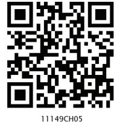
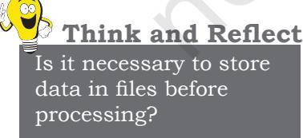
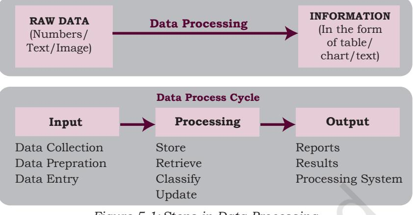

**Chapter**

**5** 

# **Understanding Data**

*"Data is not information, Information is not knowledge, Knowledge is not understanding, Understanding is not wisdom."* 

*— Gary Schubert* 

# **5.1 Introduction to Data**

Many a time, people take decisions based on certain data or information. For example, while choosing a college for getting admission, one looks at placement data of previous years of that college, educational qualification and experience of the faculty members, laboratory and hostel facilities, fees, etc. So we can say that identification of a college is based on various data and their analysis. Governments systematically collect and record data about the population through a process called census. Census data contains

#### *In this chapter*

- » Introduction to Data
- » Data Collection
- » Data Storage
- » Data Processing
- » Statistical Techniques for Data Processing

Chap 5.indd 81 09-Aug-19 11:49:18 AM

valuable information which are helpful is planning and formulating policies. Likewise, the coaching staff of a sports team analyses previous performances of opponent teams for making strategies. Banks maintain data about the customers, their account details and transactions. All these examples highlight the need of data in various fields. Data are indeed crucial for decision making.

In the previous examples, one cannot make decisions by looking at the data itself. In our example of choosing a college, suppose the placement cell of the college has maintained data of about 2000 students placed with different companies at different salary packages in the last 3 years. Looking at such data, one cannot make any remark about the placement of students of that college. The college processes and analyses this data and the results are given in the placement brochure of the college through summarisation as well as visuals for easy understanding. Hence, data need to be gathered, processed and analysed for making decisions.

In general, data is a collection of characters, numbers, and other symbols that represents values of some situations or variables. Data is plural and singular of the word data is "datum". Using computers, data are stored in electronic forms because data processing becomes faster and easier as compared to manual data processing done by people. The Information and Communication Technology (ICT) revolution led by computer, mobile and Internet has resulted in generation of large volume of data and at a very fast pace. The following list contains some examples of data that we often come across.

- Name, age, gender, contact details, etc., of a person
- Transactions data generated through banking, ticketing, shopping, etc. whether online or offline
- Images, graphics, animations, audio, video
- Documents and web pages
- Online posts, comments and messages
- Signals generated by sensors
- Satellite data including meteorological data, communication data, earth observation data, etc.

#### **5.1.1 Importance of Data**

Human beings rely on data for making decisions. Besides, large amount of data when processed with the help of a computer, show us the possibilities or hidden

A knowledge base is a store of information consisting of facts, assumptions and rules which an AI system can use for decision making.

Chap 5.indd 82 09-Aug-19 11:49:19 AM

traits which are otherwise not visible to humans. When one withdraws money from ATM, the bank needs to debit the withdrawn amount from the linked account. So the bank needs to maintain data and update it as and when required. The meteorological offices continuously keep on monitoring satellite data for any upcoming cyclone or heavy rain.

In a competitive business environment, it is important for business organisations to continuously monitor and analyse market behavior with respect to their products and take actions accordingly. Besides, companies identify customer demands as well as feedbacks, and make changes in their products or services accordingly.

The dynamic pricing concept used by airlines and railway is another example where they decide the price based on relationships between demand and supply. The cab booking Apps increase or decrease the price based on demand for cabs at a particular time. Certain restaurants offer discounted price (called happy hours), they decide when and how much discount to offer by analysing sales data at different time periods.

Besides business, following are some other scenarios where data are also stored and analysed for making decisions:

- The electronic voting machines are used for recording the votes cast. Subsequently, the voting data from all the machines are accumulated to declare election results in a short time as compared to manual counting of ballot papers.
- Scientists record data while doing experiments to calculate and compare results.
- Pharmaceutical companies record data while trying out a new medicine to see its effectiveness.
- Libraries maintain data about books in the library and the membership of the library.
- The search engines give us results after analysing large volume of data available on the websites across World Wide Web (www).
- Weather alerts are generated by analysing data received from various satellites.

#### **5.1.2 Types of Data**

As data come from different sources, they can be in different formats. For example, an image is a collection

Chap 5.indd 83 09-Aug-19 11:49:19 AM

Observe Voter Identity cards of your family members and identify the data fields under which data are organised. Are they same for all?

of pixels; a video is made up of frames; a fee slip is made up of few numeric and non-numeric entries; and messages/chats are made up of texts, icons (emoticons) and images/videos. Two broad categories in which data can be classified on the basis of their format are:

#### *(A) Structured Data*

Data which is organised and can be recorded in a well defined format is called structured data. Structured data is usually stored in computer in a tabular (in rows and columns) format where each column represents different data for a particular parameter called attribute/ characteristic/variable and each row represents data of an observation for different attributes. Table 5.1 shows structured data related to an inventory of kitchen items maintained by a shop.

| ModelNo | ProductName | Unit Price | Discount(%) | Items_in_Inventory |
| --- | --- | --- | --- | --- |
| ABC1 | Water bottle | 126 | 8 | 13 |
| ABC2 | Melamine Plates | 320 | 5 | 45 |
| ABC3 | Dinner Set | 4200 | 10 | 8 |
| GH67 | Jug | 80 | 0 | 10 |
| GH78 | Table Spoon | 120 | 5 | 14 |
| GH81 | Bucket | 190 | 12 | 6 |
| NK2 | Kitchen Towel | 25 | 0 | 32 |

#### **Table 5.1 Structured data about kitchen items in a shop**

Given this data, using a spreadsheet or other such software, the shop owner can find out how many total items are there by summing the column Items_in_ Inventory of Table 5.1 The owner of the shop can also calculate the total value of all items in the inventory by multiplying each entry of column 3 (Unit Price) with corresponding entry of column 5 (Items_in_Inventory) and finding their sum.

Table 5.2 shows more examples of structured data recorded for different attributes.

# **Entity/Activities Data Fields/Parameters/Attributes** Books at a shop BookTitle, Author, Price, YearofPublication Depositing fees in a school StudentName, Class, RollNo, FeesAmount, DepositDate Amount withdrawal from ATM AccHolderName, AccountNo, TypeofAcc, DateofWithdrawal, AmountWithdrawn, ATMid, TimeOfWithdrawal

#### **Table 5.2 Attributes maintained for different activities**

**Activity 5.1**

Chap 5.indd 84 09-Aug-19 11:49:19 AM

#### *(B) Unstructured Data*

A newspaper contains various types of news items which are also called data. But there is no fixed pattern that a newspaper follows in placing news articles. One day there might be three images of different sizes on a page along with five news items and one or more advertisements. While on another day there, might be one big image with three textual news items. So there is no particular format nor any fixed structure for printing news. Another example is the content of an email. There is no fixed structure about how many lines or paragraphs one has to write in an email or how many files are to be attached with an email. In summary, data which are not in the traditional row and column structure is called unstructured data.

Examples of unstructured data include web pages consisting of text as well as multimedia contents (image, graphics, audio/video). Other examples include text documents, business reports, books, audio/video files, social media messages. Although there are ways to process unstructured data, we are going to focus on handling structured data only in this book.

Unstructured data are sometimes described with the help of some other data called metadata. Metadata is basically data about data. For example, we describe different parts of an email as subject, recipient, main body, attachment, etc. These are the metadata for the email data. Likewise, we can have some metadata for an image file as image size (in KB or MB), image type (for example, JPEG, PNG), image resolution, etc.

# **5.2 Data Collection**

For processing data, we need to collect or gather data first. We can then store the data in a file or database for later use. Data collection here means identifying already available data or collecting from the appropriate sources. Suppose there are three different scenarios where sales data in a grocery store are available:

- Sales data are available with the shopkeeper in a diary or register. In this case we should enter the data in a digital format for example, in a spreadsheet.
- Data are already available in a digital format, say in a CSV (comma separated values) file.
- The shopkeeper has so far not recorded any data in either form but wants to get a software developed for

**Think and Reflect**

When we click a photograph using our digital or mobile camera, does it have some metadata associated with it?

Chap 5.indd 85 09-Aug-19 11:49:19 AM

**Think and Reflect** Identify attributes needed for creating an Aadhaar Card.

maintaining sales data and accounts. The software may be developed using a programming language such as Python which can be used to store and retrieve data from a CSV file or a database management system like MySQL, which will be discussed further.

Data are continuously being generated at different sources. Our interactions with digital medium are continuously generating huge volumes of data. Hospitals are collecting data about patients for improving their services. Shopping malls are collecting data about the items being purchased by people. On analysing such data, suppose it appears that bedsheets and groceries are frequently bought together. Hence, the shop owner may decide to display bedsheets near the grocery section in the mall to increase the sales. Likewise, a political analyst may look at the data contained in the posts and messages at a social media platform and analyse to see public opinion before an election. Organisations like World Bank and International Monetary Fund (IMF) are collecting data related to various economic parameters from different countries for making economic forecasts.

# **5.3 Data Storage**

Once we gather data and process them to get results, we may not then simply discard the data. Rather, we would like to store them for future use as well. Data storage is the process of storing data on storage devices so that data can be retrieved later. Now a days large volume of data are being generated at a very high rate. As a result, data storage has become a challenging task. However, the decrease in the cost of digital storage devices has helped in simplifying this task. There are numerous digital storage devices available in the market like, Hard Disk Drive (HDD), Solid State Drive (SSD), CD/DVD, Tape Drive, Pen Drive, Memory Card, etc.

We store data like images, documents, audios/ videos, etc. as files in our computers. Likewise, school/ hospital data are stored in data files. We use computers to add, modify or delete data in these files or process these data files to get results. However, file processing has certain limitations, which can be overcome through Database Management System (DBMS).

Chap 5.indd 86 09-Aug-19 11:49:19 AM

# **5.4 Data Processing**

We are interested in understanding data as they hold valuable facts and information that can be useful in our decision making process. However, by looking at the vast or large amount of data, one cannot arrive at a conclusion. Rather, data need to be processed to get results and after analysing those results, we make conclusions or decisions.

*Figure 5.1:Steps in Data Processing*

We find automated data processing in situations like online bill payment, registration of complaints, booking tickets, etc. Figure 5.1 illustrates basic steps used to process the data to get the output.

Figure 5.2 shows some tasks along with data, processing and generated output/information.

#### Processing of filled in details for correctness of data received, eligibility as per advertisement or not, fees paid or not, photo and signature uploaded or not. Then, generate a roll number and add this applicant in the list of eligible applicants. Student details like name, address, qualification, marks, mobile number, photo and sign, center choice, online fee payment details like credit/debit card, net banking or other mode of payment, etc. Examination Admit card specifying roll number, center address, date and time of test. **A website handling online filling of student details for a competitive examination and generating admit card** Checking for valid PIN number, existing bank balance, if satisfied, then deduction of amount from that account and counting of rupees and initiate printing of receipt ATM PIN number, account type, account number, card number, ATM location from where money was withdrawn, date and time, and amount to be withdrawn. Currency notes, printed slip with transaction details **A Bank handling withdrawals of cash through ATMs of its own branch** Verify login details and check **Issue of train ticket**

Journey start and end stations, date of journey, number of tickets required, class of travel (Sleeper/AC/other), berth preference (if any), passenger name(s) and age(s), mobile and email id, payment related details, etc.

availability of berth in that class. If payment done, issue tickets and deduct that number from the total available tickets on that coach. Allocate PNR number and berths or generate a waiting number for that ticket.

Problem Statement Processing Output Inputs against which data are collected

Generate ticket with berth and coach number, or issue ticket with a waiting list number

Chap 5.indd 87 09-Aug-19 11:49:19 AM

**Notes**

# **5.5 Statistical Techniques for Data Processing**

Given a set of data values, we need to process them to get information. There are various techniques which help us to have preliminary understanding about the data. Summarisation methods are applied on tabular data for its easy comprehension. Commonly used statistical techniques for data summarisation are given below:

## **5.5.1 Measures of Central Tendency**

A measure of central tendency is a single value that gives us some idea about the data. Three most common measures of central tendency are the *mean*, *median*, and *mode*. Instead of looking at each individual data values, we can calculate the mean, median and mode of the data to get an idea about average, middle value and frequency of occurrence of a particular value, respectively. Selection of a measure of central tendency depends on certain characteristics of data.

## *(A) Mean*

*Mean* is simply the average of numeric values of an attribute. Mean is also called *average*. Suppose there are data on weight of 40 students in a class. Instead of looking at each of the data values, we can calculate the average to get an idea about the average weight of students in that class.

*Definition:* Given *n* values *x1, x2, x3,...xn*, mean is computed as *x i n* ∑ *i* .

#### *Example 5.1*

Assume that height (in cm) of students in a class are as follows [90,102,110,115,85,90,100,110,110]. Mean or average height of the class is

$90+102+110+115+85+90+100+110+110=912=101.33\,$cm.  
  

Mean is not a suitable choice if there are outliers in the data. To calculate mean, the outliers or extreme values should be removed from the given data and then calculate mean of the remaining data.

*Note:* An outlier is an exceptionally large or small value, in comparison to other values of the data. Usually, outliers are considered as error since they can influence/affect the average or other statistical calculation based on the data.

Chap 5.indd 88 09-Aug-19 11:49:20 AM

*n*

# *(B) Median*

Median is also computed for a single attribute/variable at a time. When all the values are sorted in ascending or descending order, the middle value is called the *Median*. When there are odd number of values, then median is the value at the middle position. If the list has even number of values, then median is the average of the two middle values. Median represents the central value at which the given data is equally divided into two parts.

#### *Example 5.2*

Consider the previous data of height of students used in calculation of mean value. In order to compute the median, the first step is to sort data in ascending or descending order. We have sorted the height data in ascending order as [85,90,90,100,102,110,110,110, 115]. As there are total 9 values (odd number), the median is the value at position 5, that is 102 cm, whether counted from left to right or from right to left. Median represents the actual central value at which the given data is equally divided into two parts.

#### *(C) Mode*

Value that appears most number of times in the given data of an attribute/variable is called *Mode*. It is computed on the basis of frequency of occurrence of distinct values in the given data. A data set has no mode if each value occurs only once. There may be multiple modes in the data if more than one values have same highest frequency. Mode can be found for numeric as well as non-numeric data.

#### *Example 5.3*

In the list of height of students, mode is 110 as its frequency of occurrence in the list is 3, which is larger than the frequency of rest of the values.

# **5.5.2 Measures of Variability**

The measures of variability refer to the spread or variation of the values around the mean. They are also called measures of dispersion that indicate the degree of diversity in a data set. They also indicate difference within the group. Two different data sets can have the same mean, median or mode but completely different levels of dispersion, or vice versa. Common measures of dispersion or variability are Range and Standard Deviation.

**Think and Reflect** Out of Mean and Median, which one is more sensitive to outliers in data?

Chap 5.indd 89 09-Aug-19 11:49:20 AM

**Notes**

#### *(A) Range*

It is the difference between maximum and minimum values of the data (the largest value minus the smallest value). *Range* can be calculated only for numerical data. It is a measure of dispersion and tells about coverage/spread of data values. For example difference in salaries of employees, marks of a student, price of toys, etc. As range is calculated based on the two extreme values, any outlier in the data badly influences the result.

Let *M* be the largest or maximum value and *S* is the smallest or minimum value in the data, then Range is the difference between two extreme values i.e. *M – S or Maximum – Minimum.*

#### *Example 5.4*

In the above example, minimum hight value is 85 cm and maximum hight value is 115 cm. Hane range is 115-85 = 30 cm.

#### *(B) Standard deviation*

Standard deviation refers to differences within the group or set of data of a variable. Like Range, it also measures the spread of data. However, unlike Range which only uses two extreme values in the data, calculation of standard deviation considers all the given data. It is calculated as the positive square root of the average of squared difference of each value from the mean value of data. Smaller value of standard deviation means data are less spread while a larger value of standard deviation means data are more spread.

Given *n* values *x1, x2, x3,...xn*, and their mean *x*, the standard deviation, represented as σ (greek letter sigma) is computed as

$$\sum={\sqrt{\frac{\sum_{i=1}^{n}(\mathbf{X}_{i}-{\bar{\mathbf{X}}})^{2}}{n}}}$$

#### *Example 5.5*

Let us compute the standard deviation of the hight of nine students that we used while calculating Mean. The Mean (*x*) was calculated to be 101.33 cm. Subtract each value from the mean and take square of that value. Dividing the sum of square values by total number of values and taking its square not gives the standard deviation in data. See Table 5.3 for details.

Chap 5.indd 90 09-Aug-19 11:49:21 AM

=

∑ =

1

i

∑

−

( ) X X n i

n 2

= = 104 22 10 . .2cm

|  |  | Table 5.3 Standard deviation of attendance of 9 students |  |  |
| --- | --- | --- | --- | --- |
| Height (x) in cm | _ x _ x | _ 2 (x _ x ) |  |  |
| 90 | -11.33 | 128.37 | n |  |
| 102 | 0.67 | 0.36 | ∑( i i = 1 | 2 ) X X − |
| 110 | 8.67 | 75.17 | = n |  |
| 115 | 13.67 | 186.87 |  |  |
| 85 | -16.33 | 266.67 | = 938 = 9 | 104 22 . |

) = 0.03 ∑x-x

_ )

2 = 938.00

Let us look at the following problems and select the suitable statistical technique to be applied (Mean/ Median/Mode/Range/Standard Deviation):

_

_ =101.33 ∑x-x

 *n* = 9 x

 -11.33 128.37 -1.33 1.77 8.67 75.17 8.67 75.17

| Problem Statement | Choose suitable statistical method |
| --- | --- |
| The management of a company wants to know about disparity in salaries of |  |
| all employees. |  |
| Teacher wants to know about the average performance of the whole class in |  |
| a test. |  |
| Compare height of residents of two cities |  |
| Find the dominant value from a set of values |  |
| Compare income of residents of two cities |  |
| Find the popular color for car after surveying the car owners of a small city. |  |

It is important to understand statistical techniques so that one can decide which statistical technique to use to arrive at a decision. Different programming tools are available for efficient analysis of large volumes of data. These tools make use of statistical techniques for data analysis. One such programming tool is Python and it has libraries specially built for data processing and analysis. We will be covering some of them in the following chapters.

Chap 5.indd 91 09-Aug-19 11:49:21 AM

# **Notes**

# **Summary**

- Data refer to unorganised facts that can be processed to generate meaningful result or information.
- Data can be structured or unstructured.
- Hard Disk, SSD, CD/DVD, Pen Drive, Memory Card, etc. are some of the commonly used storage devices.
- Data Processing cycle involves input and storage of data, its processing and generating output.
- Summarizing data using statistical techniques aids in revealing data characteristics.
- Mean, Median, Mode, Range, and Standard Deviation are some of the statistical techniques used for data summarisation.
- Mean is the average of given values.
- Median is the mid value when data are sorted in ascending/descending order.
- Mode is the data value that appears most number of times.
- Range is the difference between the maximum and minimum values.
- Standard deviation is the positive square root of the average of squared difference of each value from the mean.

# **Excercise**

- 1. Identify data required to be maintained to perform the following services:
	- a) Declare exam results and print e-certificates
	- b) Register participants in an exhibition and issue biometric ID cards
	- c) To search for an image by a search engine
	- d) To book an OPD appointment with a hospital in a specific department
- 2. A school having 500 students wants to identify beneficiaries of the merit-cum means scholarship, achieving more than 75% for two consecutive years and having family income less than 5 lakh per annum.

Chap 5.indd 92 09-Aug-19 11:49:22 AM

Briefly describe data processing steps to be taken by the to beneficial prepare the list of school.

- 3. A bank 'xyz' wants to know about its popularity among the residents of a city 'ABC' on the basis of number of bank accounts each family has and the average monthly account balance of each person. Briefly describe the steps to be taken for collecting data and what results can be checked through processing of the collected data.
- 4. Identify type of data being collected/generated in the following scenarios:
	- a) Recording a video
	- b) Marking attendance by teacher
	- c) Writing tweets
	- d) Filling an application form online
- 5. Consider the temperature (in Celsius) of 7 days of a week as 34, 34, 27, 28, 27, 34, 34. Identify the appropriate statistical technique to be used to calculate the following:
	- a) Find the average temperature.
	- b) Find the temperature Range of that week.
	- c) Find the standard deviation temperature.
- 6. A school teacher wants to analyse results. Identify the appropriate statistical technique to be used along with its justification for the following cases:
	- a) Teacher wants to compare performance in terms of division secured by students in Class XII A and Class XII B where each class strength is same.
	- b) Teacher has conducted five unit tests for that class in months July to November and wants to compare the class performance in these five months.
- 7. Suppose annual day of your school is to be celebrated. The school has decided to felicitate those parents of the students studying in classes XI and XII, who are the alumni of the same school. In this context, answer the following questions:
	- a) Which statistical technique should be used to find out the number of students whose both parents are alumni of this school?
	- b) How varied are the age of parents of the students of that school?
- 8. For the annual day celebrations, the teacher is looking for an anchor in a class of 42 students. The teacher would make selection of an anchor on the basis of singing skill, writing skill, as well as monitoring skill.
	- a) Which mode of data collection should be used?
	- b) How would you represent the skill of students as data?

# **Notes**

Chap 5.indd 93 09-Aug-19 11:49:22 AM

**Notes**

- 9. Differentiate between structured and unstructured data giving one example.
- 10. The principal of a school wants to do following analysis on the basis of food items procured and sold in the canteen:
	- a) Compare the purchase and sale price of fruit juice and biscuits.
	- b) Compare sales of fruit juice, biscuits and samosa.
	- c) Variation in sale price of fruit juices of different companies for same quantity (in ml).

Create an appropriate dataset for these items (fruit juice, biscuits, samosa) by listing their purchase price and sale price. Apply basic statistical techniques to make the comparisons.

Chap 5.indd 94 09-Aug-19 11:49:22 AM

