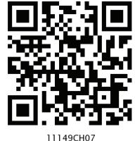
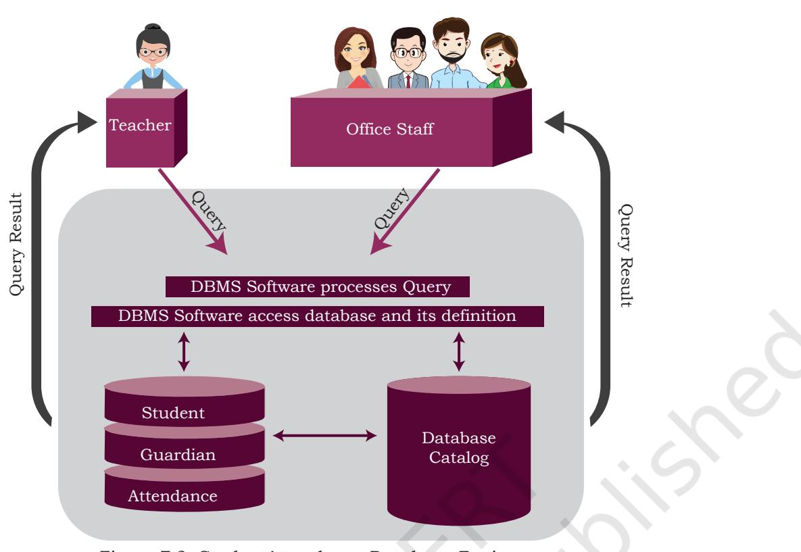

# **Chapter**

**7** 

*"Inconsistency of your mind… Can damage your memory… Remove the inconsistent data… And keep the original one !!!"* 

*— Nisarga Jain*

# **7.1 Introduction**

After learning about importance of data in the previous chapter, we need to explore the methods to store and manage data electronically. Let us take an example of a school that maintains data about its students, along with their attendance record and guardian details.

The class teacher marks daily attendance of the students in the attendance register. The teacher records 'P' for present or 'A' for absent against each student's roll number on each working day. If class strength is 50 and total working days in

#### *In this chapter*

- » Introduction
- » File System
- » Database Management System
- » Relational Data Model
- » Keys in a Relational Database

Chap 7.indd 123 19-Jul-19 3:45:07 PM

a month are 26, the teacher needs to record 50 × 26 records manually in the register every month. As the volume of data increases, manual data entry becomes tedious. Following are some of the limitations of manual record keeping in this example:

- 1) Entry of student details (Roll number and name) in the new attendance register when the student is promoted to the next class.
- 2) Writing student details on each month's attendance page where inconsistency may happen due to incorrectly written names, skipped student records, etc.
- 3) Loss of data in case attendance register is lost or damaged.
- 4) Erroneous calculation while consolidating attendance record manually.

The office staff also manually maintain Student details viz. Roll Number, Name and Date of Birth with respective guardian details viz. Guardian name, Contact Number and Address. This is required for correspondence with guardian regarding student attendance and result.

Finding information from a huge volume of papers or deleting/modifying an entry is a difficult task in pen and paper based approach. To overcome the hassles faced in manual record keeping, it is desirable to store attendance record and student details on separate data files on a computerized system, so that office staff and teachers can:

- 1) Simply copy the student details to the new attendance file from the old attendance file when students are promoted to next class.
- 2) Find any data about student or guardian.
- 3) Add more details to existing data whenever a new student joins the school.
- 4) Modify stored data like details of student or guardian whenever required.
- 5) Remove/delete data whenever a student leaves the school.

# **7.2 File System**

A file can be understood as a container to store data in a computer. Files can be stored on the storage device of a computer system. Contents of a file can be texts, computer program code, comma separated values

Visit a few shops where records are maintained manually and identify a few limitations of manual record keeping faced by them.

Chap 7.indd 124 19-Jul-19 3:45:07 PM

(CSV), etc. Likewise, pictures, audios/videos, web pages are also files.

Files stored on a computer can be accessed directly and searched for desired data. But to access data of a file through software, for example, to display monthly attendance report on school website, one has to write computer programs to access data from files.

Continuing the example of attendance at school, we need to store data about students and attendance in two separate files. Table 7.1 shows the contents of STUDENT file which has six columns, as detailed below:

- RollNumber Roll number of the student
- SName Name of the student

SDateofBirth – Date of birth of the student

- GName Name of the guardian
- GPhone Phone number of the student guardian
- GAddress Address of the guardian of the student

#### **Table 7.1 STUDENT file maintained by office staff**

| Roll | SName | SDateof | GName | GPhone | GAddress |  |  |
| --- | --- | --- | --- | --- | --- | --- | --- |
| Number |  | Birth |  |  |  |  |  |
| 1 | Atharv Ahuja | 2003-05-15 | Amit Ahuja | 5711492685 | G-35, | Ashok | Vihar, |
|  |  |  |  |  | Delhi |  |  |
| 2 | Daizy Bhutia | 2002-02-28 | Baichung | 3612967082 | Flat no. 5, Darjeeling |  |  |
|  |  |  | Bhutia |  | Appt., Shimla |  |  |
| 3 | Taleem Shah | 2002-02-28 | Himanshu Shah | 4726309212 | 26/77, | West | Patel |
|  |  |  |  |  | Nagar, Ahmedabad |  |  |
| 4 | John Dsouza | 2003-08-18 | Danny Dsouza |  | S -13, Ashok Village, |  |  |
|  |  |  |  |  | Daman |  |  |
| 5 | Ali Shah | 2003-07-05 | Himanshu Shah | 4726309212 | 26/77, | West | Patel |
|  |  |  |  |  | Nagar, Ahmedabad |  |  |
| 6 | Manika P. | 2002-03-10 | Sujata P. | 3801923168 | HNO-13, B- block, Preet |  |  |
|  |  |  |  |  | Vihar, Madurai |  |  |

Table 7.2 shows another file called ATTENDANCE which has four columns, as detailed below:

| AttendanceDate – Date for which attendance was |
| --- |
| marked |
| RollNumber – Roll number of the student |
| SName – Name of the student |
| AttendanceStatus – Marked as P (present) or A (absent) |

Chap 7.indd 125 3/31/2023 3:44:54 PM

| Table 7.2 ATTENDANCE file maintained by class teacher |
| --- |

| AttendanceDate | RollNumber | SName | AttendanceStatus |
| --- | --- | --- | --- |
| 2018-09-01 | 1 | Atharv Ahuja | P |
| 2018-09-01 | 2 | Daizy Bhutia | P |
| 2018-09-01 | 3 | Taleem Shah | A |
| 2018-09-01 | 4 | John Dsouza | P |
| 2018-09-01 | 5 | Ali Shah | A |
| 2018-09-01 | 6 | Manika P. | P |
| 2018-09-02 | 1 | Atharv Ahuja | P |
| 2018-09-02 | 2 | Daizy Bhutia | P |
| 2018-09-02 | 3 | Taleem Shah | A |
| 2018-09-02 | 4 | John Dsouza | A |
| 2018-09-02 | 5 | Ali Shah | P |
| 2018-09-02 | 6 | Manika P. | P |

# **7.2.1 Limitations of a File System**

File system becomes difficult to handle when number of files increases and volume of data also grows. Following are some of the limitations of file system:

#### *(A) Difficulty in Access*

Files themselves do not provide any mechanism to retrieve data. Data maintained in a file system are accessed through application programs. While writing such programs, the developer may not anticipate all the possible ways in which data may be accessed. So, sometimes it is difficult to access data in the required format and one has to write application program to access data.

#### *(B) Data Redundancy*

Redundancy means same data are duplicated in different places (files). In our example, student names are maintained in both the files. Besides, in Table 7.1, students with roll numbers 3 and 5 have same guardian name and therefore same guardian name is maintained twice. Both these are examples of redundancy which is difficult to avoid in a file system. Redundancy leads to excess storage use and may cause data inconsistency also.

#### *(C) Data Inconsistency*

Data inconsistency occurs when same data maintained in different places do not match. If a student wants to get changed the spelling of her name, it needs to be

Chap 7.indd 126 19-Jul-19 3:45:07 PM

changed in SName column in both the files. Likewise, if a student leaves school, the details need to be deleted from both the files. As the files are being maintained by different people, the changes may not happen in one of the files. In that case, the student name will be different (inconsistent) in both the files.

# *(D) Data Isolation*

Both the files presented at Table 7.1 (STUDENT) and at Table 7.2 (ATTENDANCE) are related to students. But there is no link or mapping between them. The school will have to write separate programs to access these two files. This is because data mapping is not supported in file system. In a more complex system where data files are generated by different person at different times, files being created in isolation may be of different formats. In such case, it is difficult to write new application programs to retrieve data from different files maintained at multiple places, as one has to understand the underlying structure of each file as well.

# *(E) Data Dependence*

Data are stored in a specific format or structure in a file. If the structure or format itself is changed, all the existing application programs accessing that file also need to be change. Otherwise, the programs may not work correctly. This is data dependency. Hence, updating the structure of a data file requires modification in all the application programs accessing that file.

#### *(F) Controlled Data Sharing*

There can be different category of users like teacher, office staff and parents. Ideally, not every user should be able to access all the data. As an example, guardians and office staff can only see the student attendance data but should not be able to modify/delete it. It means these users should be given limited access (read only) to the ATTENDANCE file. Only the teacher should be able to update the attendance data. It is very difficult to enforce this kind of access control in a file system while accessing files through application programs.

# **7.3 Database Management System**

Limitations faced in file system can be overcome by storing the data in a database where data are logically related. We can organise related data in a database so that it can be managed in an efficient and easy way.

Database Concepts 127

# **Notes**

Chap 7.indd 127 19-Jul-19 3:45:07 PM

A database management system (DBMS) or database system in short, is a software that can be used to create and manage databases. DBMS lets users to create a database, store, manage, update/modify and retrieve data from that database by users or application programs. Some examples of open source and commercial DBMS include MySQL, Oracle, PostgreSQL, SQL Server, Microsoft Access, MongoDB.

A database system hides certain details about how data are actually stored and maintained. Thus, it provides users with an abstract view of the data. A database system has a set of programs through which users or other programs can access, modify and retrieve the stored data.

The DBMS serves as an interface between the database and end users or application programs. Retrieving data from a database through special type of commands is called querying the database. In addition, users can modify the structure of the database itself through a DBMS.

Databases are widely used in various fields. Some applications are given in Table 7.3.

| Table 7.3 Use of Database in Real-life Applications |
| --- |

| Application | Database to maintain data about |  |  |  |  |
| --- | --- | --- | --- | --- | --- |
| Banking | customer information, account details, loan details, |  |  |  |  |
|  | transaction details, etc. |  |  |  |  |
| Crop Loan | kisan credit card data, farmer's personal data, land area and cultivation data, loan history, repayment |  |  |  |  |
|  | data, etc. |  |  |  |  |
| Inventory | product details, customer information, order details, |  |  |  |  |
| Management | delivery data, etc. |  |  |  |  |
| Organisation | employee department | records, | salary | details, |  |
| Resource | information, branch locations, etc. |  |  |  |  |
| Management |  |  |  |  |  |
| Online | items users | description, | user | login | details, |
| Shopping | preferences details, etc. |  |  |  |  |

#### **7.3.1 File System to DBMS**

Let us revisit our school example where two data files were maintained (Table 7.1 by office and Table 7.2 by teacher). Let us now design a database to store data of those two files. We know that tables in a database are linked or related through one or more common columns or fields. In our example, the STUDENT (Table 7.1) file and ATTENDANCE (Table 7.2) file have RollNumber and SName as common field names. In order to convert

Some database management systems include a graphical user interface for users to create and manage databases. Other database systems use a command line interface that requires users to use programming commands to create and manage databases.

Chap 7.indd 128 19-Jul-19 3:45:07 PM

these two files into a database, we need to incorporate the following changes:

- a) SName need not be maintained in ATTENDANCE file as it is already there in STUDENT. Details for a student can be retrieved through the common field RollNumber in both the files.
- b) If two siblings are in the same class, then same guardian details (GName, GPhone and GAddress) are maintained for both the siblings. We know this is a redundancy and by using a database we can avoid this. So let us split the STUDENT file into two file (STUDENT file and GUARDIAN) file so that each guardian data are maintained only once.
- c) One and more guardians can have the same name. So it will not be possible to identify which guardian is related to which student. In such case, we need to create an additional column, say GUID (Guardian ID) that will take unique value for each record in the GUARDIAN file. The column GUID will also be kept with STUDENT file for relating these two files.

*Note:* We could distinguish guardians by their phone numbers also. But, phone number can change, and therefore may not truly distinguish guardian.

Figure 7.1 shows the related data files for the STUDENT, GUARDIAN and ATTENDANCE details. Note that this is not the complete database schema since it does not show any relationship among tables.

| STUDENT | GUARDIAN | ATTENDANCE |
| --- | --- | --- |
| RollNumber | GUID | AttendanceDate |
| SName | GName | RollNumber |
| SDateofBirth | GPhone | AttendanceStatus |
| GUID | GAddress |  |

*Figure 7.1: Record structure of three files in STUDENTATTENDANCE Database*

The tables shown at Figure 7.1 are empty, which are to be populated with actual data as shown in Table 7.4, 7.5 and 7.6.

| Table 7.4 Snapshot of STUDENT table |
| --- |

| RollNumber | SName | SDateofBirth | GUID |
| --- | --- | --- | --- |
| 1 | Atharv Ahuja | 2003-05-15 | 444444444444 |
| 2 | Daizy Bhutia | 2002-02-28 | 111111111111 |

High Cost is incurred while shifting from file system to DBMS:

- Purchasing sophisticated hardware and software.
- Training users for querying.
- Recurrent cost to take regular backup and perform recovery operations.

Chap 7.indd 129 19-Jul-19 3:45:07 PM

| 3 | Taleem Shah | 2002-02-28 |  |
| --- | --- | --- | --- |
| 4 | John Dsouza | 2003-08-18 | 333333333333 |
| 5 | Ali Shah | 2003-07-05 | 101010101010 |
| 6 | Manika P. | 2002-03-10 | 466444444666 |

#### **Table 7.5 Snapshot of GUARDIAN table**

| GUID | GName | GPhone | GAddress |
| --- | --- | --- | --- |
| 444444444444 | Amit Ahuja | 5711492685 | G-35, Ashok Vihar, Delhi |
| 111111111111 | Baichung Bhutia | 3612967082 | Flat no. 5, Darjeeling Appt., Shimla |
| 101010101010 | Himanshu Shah | 4726309212 | 26/77, West Patel Nagar, Ahmedabad |
| 333333333333 | Danny Dsouza |  | S -13, Ashok Village, Daman |
| 466444444666 | Sujata P. | 3801923168 | HNO-13, B- block, Preet Vihar, Madurai |

| Date | RollNumber | Status |
| --- | --- | --- |
| 2018-09-01 | 1 | P |
| 2018-09-01 | 2 | P |
| 2018-09-01 | 3 | A |
| 2018-09-01 | 4 | P |
| 2018-09-01 | 5 | A |
| 2018-09-01 | 6 | P |
| 2018-09-02 | 1 | P |
| 2018-09-02 | 2 | P |
| 2018-09-02 | 3 | A |
| 2018-09-02 | 4 | A |
| 2018-09-02 | 5 | P |
| 2018-09-02 | 6 | P |

#### **Table 7.6 Snapshot of ATTENDANCE table**

 Figure 7.2 shows a simplified database called STUDENTATTENDANCE, which is used to maintain data about the student, guardian and attendance. As shown here, the DBMS maintains a single repository of data at a centralized location and can be used by multiple users (office staff, teacher) at the same time.

# **7.3.2 Key Concepts in DBMS**

In order to efficiently manage data using a DBMS, let us understand certain key terms:

#### *(A) Database Schema*

Database Schema is the design of a database. It is the skeleton of the database that represents the structure (table names and their fields/columns), the type of data each column can hold, constraints on the data to be stored (if any), and the relationships among the tables.

Chap 7.indd 130 3/31/2023 3:56:48 PM

*Figure 7.3: StudentAttendance Database Environment*

Database schema is also called the visual or logical architecture as it tells us how the data are organised in a database.

# *(B) Data Constraint*

Sometimes we put certain restrictions or limitations on the type of data that can be inserted in one or more columns of a table. This is done by specifying one or more constraints on that column(s) while creating the tables. For example, one can define the constraint that the column *mobile number* can only have non-negative integer values of exactly 10 digits. Since each student shall have one unique roll number, we can put the NOT NULL and UNIQUE constraints on the RollNumber column. Constraints are used to ensure accuracy and reliability of data in the database

## *(C) Meta-data or Data Dictionary*

The database schema along with various constraints on the data is stored by DBMS in a database catalog or dictionary, called meta-data. A meta-data is data about the data.

#### *(D) Database Instance*

When we define database structure or schema, state of database is empty i.e. no data entry is there. After

Chap 7.indd 131 19-Jul-19 3:45:08 PM

loading data, the state or snapshot of the database at any given time is the database instance. We may then retrieve data through queries or manipulate data through updation, modification or deletion. Thus, the state of database can change, and thus a database schema can have many instances at different times.

#### *(E) Query*

A query is a request to a database for obtaining information in a desired way. Query can be made to get data from one table or from a combination of tables. For example, "find names of all those students present on Attendance Date 2000-01-02" is a query to the database. To retrieve or manipulate data, the user needs to write query using a query language called, which is discussed in chapter 8.

#### *(F) Data Manipulation*

Modification of database consists of three operations viz. Insertion, Deletion or Update. Suppose Rivaan joins as a new student in the class then the student details need to be added in STUDENT as well as in GUARDIAN files of the Student Attendance database. This is called Insertion operation on the database. In case a student leaves the school, then his/her data as well as her guardian details need to be removed from STUDENT, GUARDIAN and ATTENDANCE files, respectively. This is called Deletion operation on the database. Suppose Atharv's Guardian has changed his mobile number, his GPhone should be updated in GUARDIAN file. This is called Update operation on the database.

#### *(G) Database Engine*

Database engine is the underlying component or set of programs used by a DBMS to create database and handle various queries for data retrieval and manipulation.

# **7.4 Relational Data Model**

Different types of DBMS are available and their classification is done based on the underlying data model. A data model describes the structure of the database, including how data are defined and represented, relationships among data, and the constraints. The most commonly used data model is Relational Data Model. Other types of data models include object-oriented data model, entity-relationship data model, document model and hierarchical data model. This book discusses the DBMS based on relational data model.

#### **Limitations of DBMS**

*Increased Complexity:*  Use of DBMS increases the complexity of maintaining functionalities like security, consistency, sharing and integrity

#### *Increased data vulnerability*: As data are stored centrally, it increases the chances of loss of data due to any failure of hardware or software. It can bring all operations to a halt

for all the users.

Chap 7.indd 132 19-Jul-19 3:45:08 PM

In relational model, tables are called relations that store data for different columns. Each table can have multiple columns where each column name should be unique. For example, each row in the table represents a related set of values. Each row of Table 7.5 represents a particular guardian and has related values viz. guardian's ID with guardian name, address and phone number. Thus, a table consists of a collection of relationships.

It is important to note here that relations in a database are not independent tables, but are associated with each other. For example, relation ATTENDANCE has attribute RollNumber which links it with corresponding student record in relation STUDENT. Similarly, attribute GUID is placed with STUDENT table for extracting guardian details of a particular student. If linking attributes are not there in appropriate relations, it will not be possible to keep the database in correct state and retrieve valid information from the database.

Figure 7.3 shows the relational database Student Attendance along with the three relations (tables) STUDENT, ATTENDANCE and GUARDIAN.

*Figure 7.4: Representing StudentAttendance Database using Relational Data Model*

| Table 7.7 Relation schemas along with its description of Student Attendance |
| --- |
| database |

| Relation Scheme | Description of attributes |
| --- | --- |
| STUDENT(RollNumber, | RollNumber: unique id of the student |
| SName, SDateofBirth, | SName: name of the student |
| GUID) | SDateofBirth: date of birth of the student |
|  | GUID: unique id of the guardian of the student |
| ATTENDANCE | AttendanceDate: date on which attendance is taken |
| (AttendanceDate, | RollNumber: roll number of the student |
| RollNumber, | AttendanceStatus: whether present (P) or absent(A) |
| AttendanceStatus) | Note that combination of AttendanceDate and RollNumber will be unique |
|  | in each record of the table |
| GUARDIAN(GUID, | GUID: unique id of the guardian |
| GName, GPhone, | GName: name of the guardian |
| GAddress) | GPhone: contact number of the guardian |
|  | GAddress: contact address of the guardian |

Chap 7.indd 133 19-Jul-19 3:45:08 PM

Each tuple (row) in a relation (table) corresponds to data of a real world entity (for example, Student, Guardian, and Attendance). In the GUARDIAN relation (Table 7.5), each row represents the facts about the guardian and each column name in the GUARDIAN table is used to interpret the meaning of data stored under that column. A database that is modeled on relational data model concept is called Relational Database. Figure 7.4 shows relation GUARDIAN with some populated data.

Let us now understand the commonly used terminologies in relational data model using Figure 7.4.

| Relation Guardian |
| --- |
| with 4 attribute/ |
| columns |

| GUID | GName | GPhone | GAddress |  |
| --- | --- | --- | --- | --- |
| 444444444444 | Amit Ahuja | 5711492685 | G-35, Ashok Vihar, Delhi |  |
| 111111111111 | Baichung Bhutia | 3612967082 | Flat no. 5, Darjeeling Appt., Shimla | Re |
| 101010101010 | Himanshu Shah | 4726309212 | 26/77, West Patel Nagar, Ahmedabad | St la at |
|  |  |  |  | tio e |
| 333333333333 | Danny Dsouza |  | S -13, Ashok Village, Daman | n |
| 466444444666 | Sujata P. | 3801923168 | HNO-13, B- block, Preet Vihar, Madurai |  |

Facts about RELATION GUARDIAN: 1. Degree (Number of attributes) = 4

*Record/tuple/row*

- 2. Cardinality (Number of rows/tuples/records) = 5
- 3. Relation is a flat file i.e, each column has a single value and each record has same number of columns

*Figure 7.5: Relation GUARDIAN with its Attributes and Tuples*

- i) **ATTRIBUTE:** Characteristic or parameters for which data are to be stored in a relation. Simply stated, the columns of a relation are the attributes which are also referred as fields. For example, GUID, GName, GPhone and GAddress are attributes of relation GUARDIAN.
- ii) **TUPLE:** Each row of data in a relation (table) is called a tuple. In a table with n columns, a tuple is a relationship between the n related values.
- iii) **DOMAIN:** It is a set of values from which an attribute can take a value in each row. Usually, a data type is used to specify domain for an attribute. For example, in STUDENT relation, the attribute RollNumber takes integer values and hence its domain is a set of integer values. Similarly, the set of character strings constitutes the domain of the attribute SName.

Chap 7.indd 134 3/31/2023 4:13:04 PM

- iv) **DEGREE:** The number of attributes in a relation is called the Degree of the relation. For example, relation GUARDIAN with four attributes is a relation of degree 4.
- v) **CARDINALITY:** The number of tuples in a relation is called the Cardinality of the relation. For example, the cardinality of relation GUARDIAN is 5 as there are 5 tuples in the table.

# **7.4.1 Three Important Properties of a Relation**

In relational data model, following three properties are observed with respect to a relation which makes a relation different from a data file or a simple table.

**Property 1:** imposes following rules on an attribute of the relation.

- Each attribute in a relation has a unique name.
- Sequence of attributes in a relation is immaterial.

**Property 2:** governs following rules on a tuple of a relation.

- Each tuple in a relation is distinct. For example, data values in no two tuples of relation ATTENDANCE can be identical for all the attributes. Thus, each tuple of a relation must be uniquely identified by its contents.
- Sequence of tuples in a relation is immaterial. The tuples are not considered to be ordered, even though they appear to be in tabular form.

**Property 3:** imposes following rules on the state of a relation.

- All data values in an attribute must be from the same domain (same data type).
- Each data value associated with an attribute must be atomic (cannot be further divisible into meaningful subparts). For example, GPhone of relation GUARDIAN has ten digit numbers which is indivisible.
- No attribute can have many data values in one tuple. For example, Guardian cannot specify multiple contact numbers under GPhone attribute.
- A special value "NULL" is used to represent values that are unknown or non-applicable to certain attributes. For example, if a guardian does not share his or her contact number with the school authorities, then GPhone is set to NULL (data unknown).

**Notes**

Chap 7.indd 135 19-Jul-19 3:45:08 PM

# **Notes**

# **7.5 Keys in a Relational Database**

The tuples within a relation must be distinct. It means no two tuples in a table should have same value for all attributes. That is, there should be at least one attribute in which data are distinct (unique) and not NULL. That way, we can uniquely distinguish each tuple of a relation. So, relational data model imposes some restrictions or constraints on the values of the attributes and how the contents of one relation be referred through another relation. These restrictions are specified at the time of defining the database through different types of keys as given below:

#### **7.5.1 Candidate Key**

A relation can have one or more attributes that takes distinct values. Any of these attributes can be used to uniquely identify the tuples in the relation. Such attributes are called candidate keys as each of them are candidates for the primary key.

As shown in Figure 7.4, the relation GUARDIAN has four attributes out of which GUID and GPhone always take unique values. No two guardians will have same phone number or same GUID. Hence, these two attributes are the candidate keys as they both are candidates for primary key.

#### **7.5.2 Primary Key**

Out of one or more candidate keys, the attribute chosen by the database designer to uniquely identify the tuples in a relation is called the primary key of that relation. The remaining attributes in the list of candidate keys are called the alternate keys.

In the relation GUARDIAN, suppose GUID is chosen as primary key, then GPhone will be called the alternate key.

#### **7.5.3 Composite Primary Key**

If no single attribute in a relation is able to uniquely distinguish the tuples, then more than one attribute are taken together as primary key. Such primary key consisting of more than one attribute is called Composite Primary key.

In relation ATTENDANCE, Roll Number cannot be used as primary key as roll number of same student will appear in another row for a different date. Similarly, in relation Attendance, AttendanceDate cannot be used as primary key because same date is repeated for each roll number. However combination of these two attributes RollNumber and AttendanceDate together would always have unique value in ATTENDANCE table as on any working day, of a student would be marked attendance only once. Hence {RollNumber,

Chap 7.indd 136 19-Jul-19 3:45:08 PM

AttendanceDate} will make the of ATTENDANCE relation composite primary key.

# **7.5.4 Foreign Key**

A foreign key is used to represent the relationship between two relations. A foreign key is an attribute whose value is derived from the primary key of another relation. This means that any attribute of a relation (referencing), which is used to refer contents from another (referenced) relation, becomes foreign key if it refers to the primary key of referenced relation. The referencing relation is called Foreign Relation. In some cases, foreign key can take NULL value if it is not the part of primary key of the foreign table. The relation in which the referenced primary key is defined is called primary relation or master relation.

In Figure 7.5, two foreign keys in Student Attendance database are shown using schema diagram where the foreign key is displayed as a directed arc (arrow) originating from it and ending at the corresponding attribute of the primary key of the referenced table. The underlined attributes make the primary key of that table.

*Figure 7.2: StudentAttendance Database with the Primary and Foreign keys*

# **Summary**

- A file in a file system is a container to store data in a computer.
- File system suffers from Data Redundancy, Data Inconsistency, Data Isolation, Data Dependence and Controlled Data sharing.
- Database Management System (DBMS) is a software to create and manage databases. A database is a collection of tables.
- Database schema is the design of a database
- A database constraint is a restriction on the type of data that that can be inserted into the table.
- Database schema and database constraints are stored in database Catalog.

Chap 7.indd 137 19-Jul-19 3:45:08 PM

- Whereas the snapshot of the database at any given time is the database instance.
- A query is a request to a database for information retrieval and data manipulation (insertion, deletion or update). It is written in Structured Query Language (SQL).
- Relational DBMS (RDBMS) is used to store data in related tables. Rows and columns of a table are called tuples and attributed respectively. A table is referred to as a relation.
- Destructions on data stored in a RDBMS is applied by use of keys such as Candidate Key, Primary Key, Composite Primary Key, Foreign Key.
- Primary key in a relation is used for unique identification of tuples.
- Foreign key is used to relate two tables or relations.
- Each column in a table represents a feature (attribute) of a record. Table stores the information for an entity whereas a row represents a record.
- Each row in a table represents a record. A tuple is a collection of attribute values that makes a record unique.
- A tuple is a unique entity whereas attribute values can be duplicate in the table.
- SQL is the standard language for RDBMS systems like MySQL.

# **Exercise**

- 1. Give the terms for each of the following:
	- a) Collection of logically related records.
	- b) DBMS creates a file that contains description about the data stored in the database.
	- c) Attribute that can uniquely identify the tuples in a relation.
	- d) Special value that is stored when actual data value is unknown for an attribute.
	- e) An attribute which can uniquely identify tuples of the table but is not defined as primary key of the table.
	- f) Software that is used to create, manipulate and maintain a relational database.
- 2. Why foreign keys are allowed to have NULL values? Explain with an example.

Chap 7.indd 138 19-Jul-19 3:45:08 PM

- 3. Differentiate between:
	- a) Database state and database schema
	- b) Primary key and foreign key
	- c) Degree and cardinality of a relation
- 4. Compared to a file system, how does a database management system avoid redundancy in data through a database?
- 5. What are the limitations of file system that can be overcome by a relational DBMS?
- 6. A school has a rule that each student must participate in a sports activity. So each one should give only one preference for sports activity. Suppose there are five students in a class, each having a unique roll number. The class representative has prepared a list of sports preferences as shown below. Answer the following:

# Table: Sports Preferences

| Roll_no | Preference |
| --- | --- |
| 9 | Cricket |
| 13 | Football |
| 17 | Badminton |
| 17 | Football |
| 21 | Hockey |
| 24 | NULL |
| NULL | Kabaddi |

- a) Roll no 24 may not be interested in sports. Can a NULL value be assigned to that student's preference field?
- b) Roll no 17 has given two preferences sports. Which property of relational DBMC is violated here? Can we use any constraint or key in the relational DBMS to check against such violation, if any?
- c) Kabaddi was not chosen by any student. Is it possible to have this tuple in the Sports Preferences relation?
- 7. In another class having 2 sections, the two respective class representatives have prepared 2 separate Sports Preferences tables, as shown below:

Sports preference of section 1 (arranged on roll number column)

Table: Sports Preferences

| Roll_no | Sports |
| --- | --- |
| 9 | Cricket |
| 13 | Football |
| 17 | Badminton |
| 21 | Hockey |
| 24 | Cricket |

Sports preference of section 2 (arranged on Sports name column, and column order is also different)

# **Notes**

|  |  |  |  |  |
| --- | --- | --- | --- | --- |
|  |  |  |  |  |
|  | 1 |  |  |  |
|  |  |  |  |  |

2024-25

Chap 7.indd 139 19-Jul-19 3:45:08 PM

# **Notes**

#### Table: Sports Preferences

| Sports | Roll_no |
| --- | --- |
| Badminton | 17 |
| Cricket | 9 |
| Cricket | 24 |
| Football | 13 |
| Hockey | 21 |

Are the states of both the relations equivalent? Justify.

- 8. The school canteen wants to maintain records of items available in the school canteen and generate bills when students purchase any item from the canteen. The school wants to create a canteen database to keep track of items in the canteen and the items purchased by students. Design a database by answering the following questions:
	- a) To store each item name along with its price, what relation should be used? Decide appropriate attribute names along with their data type. Each item and its price should be stored only once. What restriction should be used while defining the relation?
	- b) In order to generate bill, we should know the quantity of an item purchased. Should this information be in a new relation or a part of the previous relation? If a new relation is required, decide appropriate name and data type for attributes. Also, identify appropriate primary key and foreign key so that the following two restrictions are satisfied:
		- i) The same bill cannot be generated for different orders.
		- ii) Bill can be generated only for available items in the canteen.
	- c) The school wants to find out how many calories students intake when they order an item. In which relation should the attribute 'calories' be stored?
- 9. An organisation wants to create a database EMP-DEPENDENT to maintain following details about its employees and their dependent.

#### EMPLOYEE(AadharNumber, Name, Address, Department,EmployeeID)

#### DEPENDENT(EmployeeID, DependentName, Relationship)

- a) Name the attributes of EMPLOYEE, which can be used as candidate keys.
- b) The company wants to retrieve details of dependent of a particular employee. Name the tables and the key which are required to retrieve this detail.

Chap 7.indd 140 19-Jul-19 3:45:08 PM

- c) What is the degree of EMPLOYEE and DEPENDENT relation?
- 10. School uniform is available at M/s Sheetal Private Limited. They have maintained SCHOOL_UNIFORM Database with two relations viz. UNIFORM and COST. The following figure shows database schema and its state.

| Attributes and Constraints |  |  | School Uniform Database | Table: |  |  |
| --- | --- | --- | --- | --- | --- | --- |
|  |  |  |  | UCode | Size | COST Price |
| Table: UNIFORM |  |  |  | 1 | M | 500 |
| Attribute | UCode | UName | UColor | 1 | L | 580 |
| Constraints | Primary Key | Not Null | - | 1 | XL | 620 |
|  |  |  |  | 2 | M | 810 |
| Table: COST |  |  |  | 2 | L | 890 |
| Attribute | UCode | Size | Price | 2 | XL | 940 |
| Constraints Composite Primary Key |  |  | >0 |  |  |  |
|  |  |  |  | 3 | M | 770 |
|  |  |  |  | 3 | L | 830 |
| Table: UNIFORM |  |  |  | 3 | XL | 910 |
| UCode | UName | UColor |  | 4 | S | 150 |
| 1 | Shirt | White |  | 4 | L | 170 |
| 2 | Pant | Grey |  | 5 | S | 180 |
| 3 | Skirt | Grey |  | 5 | L | 210 |
| 4 | Tie | Blue |  | 6 | M | 110 |
| 5 | Socks | Blue |  | 6 | L | 140 |
| 6 | Belt | Blue |  | 6 | XL | 160 |

- a) Can they insert the following tuples to the UNIFORM Relation? Give reasons in support of your answer.
	- i) 7, Handkerchief, NULL
	- ii) 4, Ribbon, Red
	- iii) 8, NULL, White
- b) Can they insert the following tuples to the COST Relation? Give reasons in support of your answer.
	- i) 7, S, 0
	- ii) 9, XL, 100
- 11. In a multiplex, movies are screened in different auditoriums. One movie can be shown in more than one auditorium. In order to maintain the record of movies, the multiplex maintains a relational database consisting of two relations viz. MOVIE and AUDI respectively as shown below:

Movie(Movie_ID, MovieName, ReleaseDate) Audi(AudiNo, Movie_ID, Seats, ScreenType, TicketPrice)

Chap 7.indd 141 19-Jul-19 3:45:08 PM

- a) Is it correct to assign Movie_ID as the primary key in the MOVIE relation? If no, then suggest an appropriate primary key.
- b) Is it correct to assign AudiNo as the primary key in the AUDI relation? If no, then suggest appropriate primary key.
- c) Is there any foreign key in any of these relations?

|  |  |  |  | Student Project Database |  |  |
| --- | --- | --- | --- | --- | --- | --- |
| Table: STUDENT |  |  |  |  |  |  |
| Roll No | Name | Class Section |  | Registration_ID |  |  |
| 11 | Mohan | XI | 1 | IP-101-15 |  |  |
| 12 | Sohan | XI | 2 | IP-104-15 |  |  |
| 21 | John | XII | 1 | CS-103-14 | Table: PROJECT ASSIGNED |  |
| 22 | Meena | XII | 2 | CS-101-14 | Registration_ID | ProjectNo |
| 23 | Juhi | XII | 2 | CS-101-10 | IP-101-15 | 101 |
| Table: PROJECT |  |  |  |  | IP-104-15 | 103 |
| ProjectNo |  | PName |  | SubmissionDate | CS-103-14 | 102 |
| 101 |  | Airline Database |  | 12/01/2018 | CS-101-14 | 105 |
| 102 |  | Library Database |  | 12/01/2018 | CS-101-10 | 104 |
| 103 |  | Employee Database |  | 15/01/2018 |  |  |
| 104 |  | Student Database |  | 12/01/2018 |  |  |
| 105 |  | Inventory Database |  | 15/01/2018 |  |  |
| 106 |  | Railway Database |  | 15/01/2018 |  |  |

- 12. For the above given database STUDENT-PROJECT, answer the following:
	- a) Name primary key of each table.
	- b) Find foreign key(s) in table PROJECT-ASSIGNED.
	- c) Is there any alternate key in table STUDENT? Give justification for your answer.
	- d) Can a user assign duplicate value to the field RollNo of STUDENT table? Jusify.
	- 13. For the above given database STUDENT-PROJECT, can we perform the following operations?
		- a) Insert a student record with missing roll number value.
		- b) Insert a student record with missing registration number value.
		- c) Insert a project detail without submission-date.
		- d) Insert a record with registration ID IP-101-19 and ProjectNo 206 in table PROJECT-ASSIGNED.

Chap 7.indd 142 19-Jul-19 3:45:08 PM

