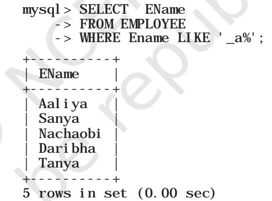

**Chapter**

**8** 

# **Introduction to Structured Query Language (SQL)**

*"The most important motivation for the research work that resulted in the relational model was the objective of providing a sharp and clear boundary between the logical and physical aspects of database management."* 

*– E. F. Codd*

#### *In this chapter*

- » Introduction
- » Structured Query Language (SQL)
- » Data Types and Constraints in MySQL
- » SQL for Data Definition
- » SQL for Data Manipulation
- » SQL for Data Query
- » Data Updation and Deletion

# **8.1 Introduction**

We have learnt about Relational Database Management System (RDBMS) and purpose in the previous chapter. There are many RDBMS such as MySQL, Microsoft SQL Server, PostgreSQL, Oracle, etc. that allow us to create a database consisting of relations and to link one or more relations for efficient querying to store, retrieve and manipulate data on that database. In this chapter, we will learn how to create, populate and query database using MySQL.

Chap 8.indd 143 19-Jul-19 3:45:57 PM


## **8.2 Structured Query Language (SQL)**

One has to write application programs to access data in case of a file system. However, for database management systems there are special kind of programming languages called query language that can be used to access data from the database. The Structured Query Language (SQL) is the most popular query language used by major relational database management systems such as MySQL, ORACLE, SQL Server, etc.

SQL is easy to learn as the statements comprise of descriptive English words and are not case sensitive. We can create and interact with a database using SQL in an efficient and easy way. The benefit with SQL is that we don't have to specify how to get the data from the database. Rather, we simply specify what is to be retrieved, and SQL does the rest. Although called a query language, SQL can do much more besides querying. SQL provides statements for defining the structure of the data, manipulating data in the database, declare constraints and retrieve data from the database in various ways, depending on our requirements.

In this chapter, we will learn how to create a database using MySQL as the RDBMS software. We will create a database called StudentAttendance (Figure 7.5) that we had identified in the previous chapter. We will also learn how to populate database with data, manipulate data in that and retrieve data from the database through SQL queries.

## **8.2.1 Installing MySQL**

MySQL is an open source RDBMS software which can be easily downloaded from the official website https:// dev.mysql.com/downloads. After installing MySQL, start MySQL service. The appearance of mysql> prompt (Figure 8.1) means that MySQL is ready for us to enter SQL statements.

Few rules to follow while writing SQL statements in MySQL:

- SQL is case insensitive. That means name and NAME are same for SQL.
- Always end SQL statements with a semicolon (;).
- To enter multiline SQL statements, we don't write ';' after the first line. We put enter to continue on next line. The prompt mysql> then changes to '->',


Explore LibreOffice Base and compare it with MySQL

Chap 8.indd 144 19-Jul-19 3:45:57 PM


indicating that statement is continued to the next line. After the last line, put ';' and press enter.

# **8.3 Data Types and Constraints in MySQL**

*Figure 8.1: MySQL Shell*

We know that a database consists of one or more relations and each relation (table) is made up of attributes (column). Each attribute has a data type. We can also specify constraints for each attribute of a relation.

## **8.3.1 Data type of Attribute**

Data type indicates the type of data value that an attribute can have. The data type of an attribute decides the operations that can be performed on the data of that attribute. For example, arithmetic operations can be performed on numeric data but not on character data. Commonly used data types in MySQL are numeric types, date and time types, and string (character and byte) types as shown in Table 8.1.


What are the other data types supported in MySQL? Are there other variants of integer and float data type?


# **Think and Reflect**

Can you think of an attribute for which fixed length string is suitable?

| Data type | Description |
| --- | --- |
| CHAR(n) | Specifies character type data of length n where n could be any value from 0 to |
|  | 255. CHAR is of fixed length, means, declaring CHAR (10) implies to reserve |
|  | spaces for 10 characters. If data does not have 10 characters (for example, |
|  | 'city' has four characters), MySQL fills the remaining 6 characters with spaces |
|  | padded on the right. |
| VARCHAR(n) | Specifies character type data of length 'n' where n could be any value from 0 |
|  | to 65535. But unlike CHAR, VARCHAR is a variable-length data type. That is, |
|  | declaring VARCHAR (30) means a maximum of 30 characters can be stored |
|  | but the actual allocated bytes will depend on the length of entered string. So |
|  | 'city' in VARCHAR (30) will occupy the space needed to store 4 characters only. |

**Table 8.1 Commonly used data types in MySQL**

Chap 8.indd 145 19-Jul-19 3:45:57 PM


| INT | INT specifies an integer value. Each INT value occupies 4 bytes of storage. The |
| --- | --- |
|  | range of values allowed in integer type are -2147483648 to 2147483647. For |
|  | values larger than that, we have to use BIGINT, which occupies 8 bytes. |
| FLOAT | Holds numbers with decimal points. Each FLOAT value occupies 4 bytes. |
| DATE | The DATE type is used for dates in 'YYYY-MM-DD' format. YYYY is the 4 digit |
|  | year, MM is the 2 digit month and DD is the 2 digit date. The supported range |
|  | is '1000-01-01' to '9999-12-31'. |

## **8.3.2 Constraints**

**Think and Reflect** Which two constraints when applied together will produce a Primary Key constraint?

Constraints are certain types of restrictions on the data values that an attribute can have. They are used to ensure the accuracy and reliability of data. However, it is not mandatory to define constraint for each attribute of a table. Table 8.2 lists various SQL constraints.

#### **Table 8.2 Commonly used SQL Constraints**

| Constraint | Description |
| --- | --- |
| NOT NULL | Ensures that a column cannot have NULL values where NULL means missing/ unknown/not applicable value. |
| UNIQUE | Ensures that all the values in a column are distinct/unique. |
| DEFAULT | A default value specified for the column if no value is provided. |
| PRIMARY KEY | The column which can uniquely identify each row or record in a table. |
| FOREIGN KEY | The column which refers to value of an attribute defined as primary key in another table. |

# **8.4 SQL for Data Definition**

SQL provides commands for defining the relation schemas, modifying relation schemas and deleting relations. These are called Data Definition Language (DDL) through which the set of relations are specified, including their schema, data type for each attribute, the constraints as well as the security and access related authorisations.

Data definition starts with the create statement. This statement is used to create a database and its tables (relations). Before creating a database, we should be clear about the number of tables in the database, the columns (attributes) in each table along with the data type of each column. This is how we decide the relation schema.

#### **8.4.1 CREATE Database**

To create a database, we use the CREATE DATABASE statement as shown in the following syntax:

CREATE DATABASE databasename;

Chap 8.indd 146 19-Jul-19 3:45:57 PM


To create a database called StudentAttendance, we will type following command at mysql prompt.

> mysql> CREATE DATABASE StudentAttendance; Query OK, 1 row affected (0.02 sec)

*Note:* In LINUX environment, names for database and tables are case-sensitive whereas in WINDOWS, there is no such differentiation. However, as a good practice, it is suggested to write database or table name in the same letter cases that were used at the time of their creation.

A DBMS can manage multiple databases on one computer. Therefore, we need to select the database that we want to use. Once the database is selected, we can proceed with creating tables or querying data. Write the following SQL statement for using the database:

> mysql> USE StudentAttendance; Database changed

Initially, the created database is empty. It can be checked by using the Show tables command that lists names of all the tables within a database.

> mysql> SHOW TABLES; Empty set (0.06 sec)

## **8.4.2 CREATE Table**

After creating database StudentAttendance, we need to define relations (create tables) in this database and specify attributes for each relation along with data types for each attribute. This is done using the CREATE TABLE statement.

*Syntax:*

CREATE TABLE tablename( attributename1 datatype constraint, attributename2 datatype constraint, : attributenameN datatype constraint);

It is important to observe the following points with respect to the Create Table statement:

- N is the degree of the relation, means there are N columns in the table.
- Attribute name specifies the name of the column in the table.
- Datatype specifies the type of data that an attribute can hold.
- Constraint indicates the restrictions imposed on the values of an attribute. By default, each attribute can take NULL values except for the primary key.


Type the statement show database;. Does it show the name of StudentAttendance database?

Show

Chap 8.indd 147 19-Jul-19 3:45:57 PM


Let us identify data types of the attributes of table STUDENT along with their constraint, if any. Assuming maximum students in a class to be 100 and values of roll number in a sequence from 1 to 100, we know that 3 digits are sufficient to store values for the attribute RollNumber. Hence, data type INT is appropriate for this attribute. Total number of characters in student names (SName) can differ. Assuming maximum characters in a name as 20, we use VARCHAR(20) for SName column. Data type for the attribute SDateofBirth is DATE and supposing the school uses guardian's 12 digit Aadhaar number as GUID, we can declare GUID as CHAR(12) since Aadhaar number is of fixed length and we are not going to perform any mathematical operation on GUID.

Table 8.3, 8.4 and 8.5 show the chosen data type and constraint for each attribute of the relations STUDENT, GUARDIAN and ATTENDANCE, respectively.

#### **Table 8.3 Data types and constraints for the attributes of relation STUDENT**

| Attribute Name | Data expected to be stored | Data type | Constraint |
| --- | --- | --- | --- |
| RollNumber | Numeric value consisting of maximum 3 digits | INT | PRIMARY KEY |
| SName | Variant length string of maximum 20 characters | VARCHAR(20) | NOT NULL |
| SDateofBirth | Date value | DATE | NOT NULL |
| GUID | Numeric value consisting of 12 digits | CHAR(12) | FOREIGN KEY |

#### **Table 8.4 Data types and constraints for the attributes of relation GUARDIAN**

| Attribute Name | Data expected to be stored |  |  |  |  |  | Data type | Constraint |
| --- | --- | --- | --- | --- | --- | --- | --- | --- |
| GUID | Numeric value consisting of 12 digit Aadhaar number |  |  |  |  |  | CHAR(12) | PRIMARY KEY |
| GName | Variant characters | length | string | of | maximum | 20 | VARCHAR(20) | NOT NULL |
| GPhone | Numeric value consisting of 10 digits |  |  |  |  |  | CHAR(10) | NULL UNIQUE |
| GAddress | Variant length string of size 30 characters |  |  |  |  |  | VARCHAR(30) | NOT NULL |

#### **Table 8.5 Data types and constraints for the attributes of relation ATTENDANCE.**

| Attribute Name | Data expected to be stored | Data type | Constraint |
| --- | --- | --- | --- |
| AttendanceDate | Date value | DATE | PRIMARY KEY* |
| RollNumber | Numeric value consisting of maximum 3 | INT | PRIMARY KEY* |
|  | digits |  | FOREIGN KEY |
| AttendanceStatus | 'P' for present and 'A' for absent | CHAR(1) | NOT NULL |

**means part of composite primary key*

Once data types and constraints are identified, let us create tables without specifying constraint along with the attribute name for simplification. We will learn to incorporate constraints on attributes in Section 8.4.4.

Chap 8.indd 148 19-Jul-19 3:45:57 PM


*Example 8.1* Create table STUDENT.

mysql> CREATE TABLE STUDENT(

- -> RollNumber INT,
- -> SName VARCHAR(20),
- -> SDateofBirth DATE,
- -> GUID CHAR(12),
- -> PRIMARY KEY (RollNumber));
- Query OK, 0 rows affected (0.91 sec)

*Note:* ',' is used to separate two attributes and each statement terminates with a semi-colon (;). The symbol '->' indicates line continuation as SQL statement may not complete in a single line.

## **8.4.3 DESCRIBE Table**

We can view the structure of an already created table using the describe statement.

*Syntax:*

DESCRIBE tablename;

MySQL also supports the short form DESC of DESCRIBE to get description of table. To retrieve details about the structure of relation STUDENT, we can write DESC or DESCRIBE followed by table name:

mysql> DESC STUDENT;

| +--------------+-------------+------+-----+---------+-------+ |  |  |  |  |  |  |
| --- | --- | --- | --- | --- | --- | --- |
| Field   Type   Null   Key   Default   Extra |  |  |  |  |  |  |
| +--------------+-------------+------+-----+---------+-------+ |  |  |  |  |  |  |
| RollNumber   int   PRI   NULL |  | NO |  |  |  |  |
| SName   varchar(20)   YES |  |  |  | NULL |  |  |
| SDateofBirth   date |  | YES |  | NULL |  |  |
| GUID | char(12) | YES |  | NULL |  |  |
| +--------------+-------------+------+-----+---------+-------+ |  |  |  |  |  |  |

4 rows in set (0.06 sec)

The show table command will now return the table STUDENT:

> mysql> SHOW TABLES; +------------------------------+ | Tables_in_studentattendance |

```
+------------------------------+
| student |
```
+------------------------------+

1 row in set (0.00 sec)

## **8.4.4 ALTER Table**

After creating a table we may realize that we need to add/remove an attribute or to modify the datatype of an existing attribute or to add constraint in attribute. In all such cases, we need to change or alter the structure of the table by using the alter statement.

*Syntax:*

ALTER TABLE tablename ADD/Modify/DROP attribute1, attribute2,..

**Think and Reflect** Can we have a CHAR or VARCHAR data type for contact number (mobile, landline)?


Create the other two relations GUARDIAN and ATTENDANCE as per data types given in Table 8.4 and 8.5, and view their structures. Don't add any constraint in the two tables.

Chap 8.indd 149 19-Jul-19 3:45:57 PM


#### *(A) Add primary key to a relation*

Let us now alter the tables created in Activity 8.4. The below MySQL statement adds a primary key to the GUARDIAN relation:

> mysql> ALTER TABLE GUARDIAN ADD PRIMARY KEY (GUID); Query OK, 0 rows affected (1.14 sec) Records: 0 Duplicates: 0 Warnings: 0

Now let us add primary key to the ATTENDANCE relation. The primary key of this relation is a composite key made up of two attributes — AttendanceDate and RollNumber.

> mysql> ALTER TABLE ATTENDANCE -> ADD PRIMARY KEY(AttendanceDate, -> RollNumber); Query OK, 0 rows affected (0.52 sec) Records: 0 Duplicates: 0 Warnings: 0

#### *(B) Add foreign key to a relation*

Once primary keys are added the next step is to add foreign keys to the relation (if any). A relation may have multiple foreign keys and each foreign key is defined on a single attribute. Following points need to be observed while adding foreign key to a relation:

- The referenced relation must be already created.
- The referenced attribute must be a part of primary key of the referenced relation.
- Data types and size of referenced and referencing attributes must be same.

## *Syntax:*

ALTER TABLE table_name ADD FOREIGN KEY(attribute name) REFERENCES referenced_table_name (attribute name);

Let us now add foreign key to the table STUDENT. Table 8.3 shows that attribute GUID (the referencing attribute) is a foreign key and it refers to attribute GUID (the referenced attribute) of table GUARDIAN (Table 8.4). Hence, STUDENT is the referencing table and GUARDIAN is the referenced table.

> mysql> ALTER TABLE STUDENT -> ADD FOREIGN KEY(GUID) REFERENCES -> GUARDIAN(GUID); Query OK, 0 rows affected (0.75 sec) Records: 0 Duplicates: 0 Warnings: 0

## *(C) Add constraint UNIQUE to an existing attribute* In GUARDIAN table, attribute GPhone has a constraint UNIQUE which means no two values in that column should be same.

*Syntax:*

**Think and Reflect**

Name foreign keys in table ATTENDANCE and STUDENT. Is there any foreign key in table GUARDIAN.

Chap 8.indd 150 19-Jul-19 3:45:57 PM


ALTER TABLE table_name ADD UNIQUE (attribute name);

Let us now add the constraint UNIQUE with attribute GPhone of the table GUARDIAN as shown at table 8.4.

mysql> ALTER TABLE GUARDIAN -> ADD UNIQUE(GPhone); Query OK, 0 rows affected (0.44 sec) Records: 0 Duplicates: 0 Warnings: 0

# *(D) Add an attribute to an existing table*

Sometimes, we may need to add an additional attribute in a table. It can be done using the syntax given below:

ALTER TABLE table_name ADD attribute_name DATATYPE;

Suppose the principal of the school has decided to award scholarship to some needy students for which income of the guardian must be known. But school has not maintained income attribute with table GUARDIAN so far. Therefore, the database designer now needs to add a new attribute income of data type INT in the table GUARDIAN.

> mysql> ALTER TABLE GUARDIAN -> ADD income INT; Query OK, 0 rows affected (0.47 sec) Records: 0 Duplicates: 0 Warnings: 0

## *(E) Modify datatype of an attribute*

We can modify data types of the existing attributes of a table using the following ALTER statement.

*Syntax:*

ALTER TABLE table_name MODIFY attribute DATATYPE;

Suppose we need to change the size of attribute GAddress from VARCHAR(30) to VARCHAR(40) of the GUARDIAN table. The MySQL statement will be:

> mysql> ALTER TABLE GUARDIAN -> MODIFY GAddress VARCHAR(40); Query OK, 0 rows affected (0.11 sec) Records: 0 Duplicates: 0 Warnings: 0

## *(F) Modify constraint of an attribute*

When we create a table, by default each attribute takes NULL value except for the attribute defined as primary key. We can change an attribute's constraint from NULL to NOT NULL using alter statement.

#### *Syntax:*

ALTER TABLE table_name MODIFY attribute DATATYPE NOT NULL;

*Note:* We have to specify the data type of the attribute along with constraint NOT NULL while using MODIFY.


Add foreign key in the ATTENDANCE table (use fig. 8.1 to identify referencing and referenced tables).

# **Think and Reflect**

What are the minimum and maximum income values that can be entered in the income attribute given the data type is INT?

Chap 8.indd 151 19-Jul-19 3:45:57 PM

**Notes**

To associate NOT NULL constraint with attribute SName of table STUDENT (table 8.3), we write the following MySQL statement:

> mysql> ALTER TABLE STUDENT -> MODIFY SName VARCHAR(20) NOT NULL; Query OK, 0 rows affected (0.47 sec) Records: 0 Duplicates: 0 Warnings: 0

## *(G) Add default value to an attribute*

If we want to specify default value for an attribute, then use the following syntax:

> ALTER TABLE table_name MODIFY attribute DATATYPE DEFAULT default_value;

To set default value of SDateofBirth of STUDENT to 15th May 2000, we write the following statement:

> mysql> ALTER TABLE STUDENT -> MODIFY SDateofBirth DATE DEFAULT -> 2000-05-15; Query OK, 0 rows affected (0.08 sec) Records: 0 Duplicates: 0 Warnings: 0

*Note:* We have to specify the data type of the attribute along with DEFAULT while using MODIFY.

#### *(H) Remove an attribute*

Using ALTER, we can remove attributes from a table, as shown in the below syntax:

ALTER TABLE table_name DROP attribute;

To remove the attribute income from the table GUARDIAN (8.4), we can write the following MySQL statement:

> mysql> ALTER TABLE GUARDIAN DROP income; Query OK, 0 rows affected (0.42 sec) Records: 0 Duplicates: 0 Warnings: 0

#### *(I) Remove primary key from the table*

While creating a table, we may have specified incorrect primary key. In such case, we need to drop the existing primary key of the table and add a new primary key.

*Syntax:*

ALTER TABLE table_name DROP PRIMARY KEY;

To remove primary key of table GUARDIAN (Table 8.4), we write the following MySQL statement:

> mysql> ALTER TABLE GUARDIAN DROP PRIMARY KEY; Query OK, 0 rows affected (0.72 sec) Records: 0 Duplicates: 0 Warnings: 0

*Note:* We have dropped primary key from GUARDIAN table, but each table should have a primary key to maintain uniqueness. Hence, we have to use ADD command to specify primary key for the GUARDIAN table as shown in earlier examples.

Chap 8.indd 152 19-Jul-19 3:45:57 PM


# **8.4.5 DROP Statement**

Sometimes a table in a database or the database itself needs to be removed. We can use DROP statement to remove a database or a table permanently from the system. However, one should be very cautious while using this statement as it cannot be undone.

> *Syntax to drop a table:* DROP TABLE table_name;

*Syntax to drop a database:* DROP DATABASE database_name;

## *Cautions:*

- 1) Using the Drop statement to remove a database will ultimately remove all the tables within it.
- 2) DROP statement will remove the tables or database created by you. Hence you may apply DROP statement at the end of the chapter.

# **8.5 SQL for Data Manipulation**

In the previous section, we created the database StudentAttendance having three relations STUDENT, GUARDIAN and ATTENDANCE. When we create a table, only its structure is created but the table has no data. To populate records in the table, INSERT statement is used. Similarly, table records can be deleted or updated using SQL data manipulation statements.

Data Manipulation using a database means either retrieval (access) of existing data, insertion of new data, removal of existing data or modification of existing data in the database.

# **8.5.1 INSERTION of Records**

INSERT INTO statement is used to insert new records in a table. Its syntax is:

> INSERT INTO tablename VALUES(value 1, value 2,....);

Here, value 1 corresponds to attribute 1, value 2 corresponds to attribute 2 and so on. Note that we need not to specify attribute names in insert statement if there are exactly same number of values in the INSERT statement as the total number of attributes in the table.

*Caution:* While populating records in a table with foreign key, ensure that records in referenced tables are already populated.

**Notes**

Chap 8.indd 153 19-Jul-19 3:45:58 PM


Let us insert some records in the StudentAttendance database. We shall insert records in the GUARDIAN table first as it does not have any foreign key. We are going to insert the records given in Table 8.6.

#### **Table 8.6 Records to be inserted into the GUARDIAN table**

| GUID | GName | GPhone | GAddress |
| --- | --- | --- | --- |
| 444444444444 | Amit Ahuja | 5711492685 | G-35, Ashok Vihar, Delhi |
| 111111111111 | Baichung Bhutia | 3612967082 | Flat no. 5, Darjeeling Appt., Shimla |
| 101010101010 | Himanshu Shah | 4726309212 | 26/77, West Patel Nagar, Ahmedabad |
| 333333333333 | Danny Dsouza |  | S -13, Ashok Village, Daman |
| 466444444666 | Sujata P. | 3801923168 | HNO-13, B- block, Preet Vihar, Madurai |

The below statement inserts the first record in the table.

> mysql> INSERT INTO GUARDIAN -> VALUES (444444444444, 'Amit Ahuja', -> 5711492685, 'G-35,Ashok vihar, Delhi' ); Query OK, 1 row affected (0.01 sec)

We can use the SQL statement SELECT * from table_ name to view the inserted records. The SELECT statement will be explained in next section.

mysql> SELECT * from GUARDIAN;

| +--------------+-----------------+------------+-------------------------------+ |  |  |  |
| --- | --- | --- | --- |
| GName | GUID | Gphone   GAddress |  |
| +--------------+-----------------+------------+-------------------------------+ |  |  |  |
| 444444444444   Amit Ahuja |  | 5711492685   G-35, Ashok vihar, Delhi |  |
| +--------------+-----------------+------------+-------------------------------+ |  |  |  |

1 row in set (0.00 sec)

If we want to provide values only for some of the attributes in a table (supposing other attributes having NULL or any other default value), then we shall specify the attribute name alongside each data value as shown in the following syntax of INSERT INTO statement.

*Syntax:*

INSERT INTO tablename (column1, column2, ...) VALUES (value1, value2, ...);

To insert the fourth record of Table 8.6 where GPhone is not given, we need to insert values in the other three fields (GPhone was set to NULL by default at the time of table creation). In this case, we have to specify the names of attributes in which we want to insert values. The values must be given in the same order in which attributes are written in INSERT command.

> mysql> INSERT INTO GUARDIAN(GUID, GName, GAddress) -> VALUES (333333333333, 'Danny Dsouza',


Write SQL statements to insert the remaining 3 rows of table 8.6 in table GUARDIAN.

Chap 8.indd 154 3/31/2023 3:57:16 PM


#### -> 'S -13, Ashok Village, Daman' ); Query OK, 1 row affected (0.03 sec)

*Note:* Text and date values must be enclosed in ' ' (single quotes).

mysql> SELECT * from GUARDIAN;

| +--------------+--------------+------------+----------------------------------+ |  |
| --- | --- |
| GUID   GName   Gphone   GAddress |  |
| +--------------+--------------+------------+----------------------------------+ |  |
| 333333333333   Danny Dsouza   NULL   S -13, Ashok Village, Daman |  |
| 444444444444   Amit Ahuja   5711492685   G-35, Ashok vihar, Delhi |  |
| +--------------+--------------+------------+----------------------------------+ |  |

2 rows in set (0.00 sec)

Let us now insert the records given in Table 8.7 into the STUDENT table.

#### **Table 8.7 Records to be inserted into the STUDENT table**

| RollNumber | SName | SDateofBirth | GUID |
| --- | --- | --- | --- |
| 1 | Atharv Ahuja | 2003-05-15 | 444444444444 |
| 2 | Daizy Bhutia | 2002-02-28 | 111111111111 |
| 3 | Taleem Shah | 2002-02-28 |  |
| 4 | John Dsouza | 2003-08-18 | 333333333333 |
| 5 | Ali Shah | 2003-07-05 | 101010101010 |
| 6 | Manika P. | 2002-03-10 | 466444444666 |

To insert the first record of Table 8.7, we write the following MySQL statement

```
mysql> INSERT INTO STUDENT 
 -> VALUES(1,'Atharv Ahuja','2003-05-15', 
 -> 444444444444);
Query OK, 1 row affected (0.11 sec)
```
## OR

```
mysql> SELECT * from STUDENT;
+------------+--------------+--------------+--------------+
| RollNumber | SName | SDateofBirth | GUID |
    mysql> INSERT INTO STUDENT (RollNumber, SName, 
     -> SDateofBirth, GUID)
     -> VALUES (1,'Atharv Ahuja','2003-05-15', 
     -> 444444444444);
    Query OK, 1 row affected (0.02 sec)
```

| +------------+--------------+--------------+--------------+ |
| --- |
| 1   Atharv Ahuja   2003-05-15   444444444444 |
| +------------+--------------+--------------+--------------+ |

```
1 row in set (0.00 sec)
```
Let us now insert the third record of Table 8.7 where GUID is NULL. Recall that GUID is foreign key of this table and thus can take NULL value. Hence, we can put NULL value for GUID and insert the record by using the following statement:

Recall that Date is stored in "YYYY-MM-DD" format.

Chap 8.indd 155 19-Jul-19 3:45:58 PM


mysql> INSERT INTO STUDENT -> VALUES(3, 'Taleem Shah','2002-02-28', -> NULL); Query OK, 1 row affected (0.05 sec)

#### mysql> SELECT * from STUDENT;

| +------------+--------------+--------------+--------------+ |  |  |
| --- | --- | --- |
| RollNumber   SName   SDateofBirth   GUID |  |  |
| +------------+--------------+--------------+--------------+ |  |  |
|  | 1   Atharv Ahuja   2003-05-15 | 444444444444 |
|  | 3   Taleem Shah   2002-02-28 | NULL |
| +------------+--------------+--------------+--------------+ |  |  |

2 rows in set (0.00 sec)

We had to write NULL in the above MySQL statement because when not giving the column names, we need to give values for all the columns. Otherwise, we have to give names of attributes along with the values if we need to insert data only for certain attributes, as shown in the next query:

- mysql> INSERT INTO STUDENT (RollNumber, SName,
- -> SDateofBirth) VALUES (3, 'Taleem Shah','
- -> 2002-02-28');
- Query OK, 1 row affected (0.05 sec)

 In the above statement we are informing DBMS to insert the corresponding values for the mentioned columns and GUID would be assigned NULL value.

#### mysql> SELECT * from STUDENT;

| +------------+--------------+--------------+--------------+ |  |  |  |
| --- | --- | --- | --- |
| RollNumber   SName   SDateofBirth   GUID |  |  |  |
| +------------+--------------+--------------+--------------+ |  |  |  |
|  | 1   Atharv Ahuja   2003-05-15 | 444444444444 |  |
|  | 3   Taleem Shah   2002-02-28 |  | NULL |
| +------------+--------------+--------------+--------------+ |  |  |  |

2 rows in set (0.00 sec)

# **8.6 SQL for Data Query**

So far we have learnt how to create database as well as to store and manipulate data. We are interested to store data in a database as it is easier to retrieve data in future from databases in whatever way we want. The Structured Query Language (SQL) has efficient mechanisms to retrieve data stored in multiple tables in a MySQL database (or any other RDBMS). The user enters the SQL commands called queries where the specific requirements for data to be retrieved are provided. The SQL statement SELECT is used to retrieve data from the tables in a database and is also called query statement.


Write SQL statements to insert the remaining 4 rows of table 8.7 in table STUDENT.


• Which of the above syntax should be used when we are not sure of the order (with respect to the column) in which the values are to be inserted in the table?

- Can we insert two records with the same roll number?
2024-25

Chap 8.indd 156 19-Jul-19 3:45:58 PM


## **8.6.1 SELECT Statement**

The SQL statement SELECT is used to retrieve data from the tables in a database and the output is also displayed in tabular form.

> *Syntax:* SELECT attribute1, attribute2, ... FROM table_name WHERE condition

Here, attribute1, attribute2, ... are the column names of the table table_name from which we want to retrieve data. The FROM clause is always written with SELECT clause as it specifies the name of the table from which data is to be retrieved. The WHERE clause is optional and is used to retrieve data that meet specified condition(s).

*Example 8.2* To display the name and date of birth of student with roll number 2, we write the following query:

```
mysql> SELECT SName, SDateofBirth
 -> FROM STUDENT
 -> WHERE RollNumber = 1;
+--------------+--------------+
| SName | SDateofBirth |
+--------------+--------------+
| Atharv Ahuja | 2003-05-15 |
+--------------+--------------+
1 row in set (0.03 sec)
```
## **8.6.2 QUERYING using Database OFFICE**

Different organisations maintain databases to store data in the form of tables. Let us consider the database OFFICE of an organisation that has many related tables like EMPLOYEE, DEPARTMENT and so on. Every EMPLOYEE in the database is assigned to a DEPARTMENT and his/her Department number (DeptId) is stored as a foreign key in the table EMPLOYEE. Let us consider some data for the table 'EMPLOYEE' as shown in Table 8.8 and apply the SELECT statement to retrieve data:

| EmpNo | Ename | Salary | Bonus | Deptld |
| --- | --- | --- | --- | --- |
| 101 | Aaliya | 10000 | 234 | D02 |
| 102 | Kritika | 60000 | 123 | D01 |
| 103 | Shabbir | 45000 | 566 | D01 |
| 104 | Gurpreet | 19000 | 565 | D04 |
| 105 | Joseph | 34000 | 875 | D03 |

#### **Table 8.8 EMPLOYEE**

# **Think and Reflect**

Can you think of examples from daily life where storing and querying data in a database can be helpful?

Chap 8.indd 157 19-Jul-19 3:45:58 PM

## **Notes**

|  |  |  |  |  | = |  |
| --- | --- | --- | --- | --- | --- | --- |
| > 2 | 41 | 1 | = | 6 | 0 | E BD |

| 106 | Sanya | 48000 | 695 | D02 |
| --- | --- | --- | --- | --- |
| 107 | Vergese | 15000 |  | D01 |
| 108 | Nachaobi | 29000 |  | D05 |
| 109 | Daribha | 42000 |  | D04 |
| 110 | Tanya | 50000 | 467 | D05 |

#### *(A) Retrieve selected columns*

The following query displays employee numbers of all the employees:

```
mysql> SELECT EmpNo
 -> FROM EMPLOYEE;
+-------+
| EmpNo |
+-------+
| 101 |
| 102 |
| 103 |
| 104 |
| 105 |
| 106 |
| 107 |
| 108 |
| 109 |
| 110 |
+-------+
```
10 rows in set (0.41 sec)

To display the employee number and employee name of all the employees, we write the following query:

| mysql> SELECT EmpNo, Ename | -> FROM | EMPLOYEE; |  |  |  |
| --- | --- | --- | --- | --- | --- |
| +-------+----------+ | EmpNo   Ename |  |  |  |  |
| +-------+----------+ |  | 101   Aaliya |  |  |  |
|  | 102   Kritika |  |  | 103   Shabbir |  |
|  | 104   Gurpreet |  | 105   Joseph |  |  |
|  | 106   Sanya |  |  | 107   Vergese |  |
|  | 108   Nachaobi |  | 109   Daribha |  |  |
|  | 110   Tanya |  | +-------+----------+ |  |  |

10 rows in set (0.00 sec)

#### *(B) Renaming of columns*

In case we want to rename any column while displaying the output, we can do so by using alias 'AS' in the query as:

Display Employee name as Name in the output for all the employees.

mysql> SELECT EName AS Name

Chap 8.indd 158 19-Jul-19 3:45:58 PM


| -> FROM | EMPLOYEE; |
| --- | --- |
| +----------+ |  |
| Name |  |
| +----------+ |  |
| Aaliya |  |
| Kritika |  |
| Shabbir |  |
| Gurpreet |  |
| Joseph |  |
| Sanya |  |
| Vergese |  |
| Nachaobi |  |
| Daribha |  |
| Tanya |  |
| +----------+ |  |

10 rows in set (0.00 sec)

*Example 8.3* Display names of all employees along with their annual salary (Salary*12). While displaying query result, rename EName as Name.

> mysql> SELECT EName AS Name, Salary*12 -> FROM EMPLOYEE; +----------+-----------+ | Name | Salary*12 | +----------+-----------+ | Aaliya | 120000 | | Kritika | 720000 | | Shabbir | 540000 | | Gurpreet | 228000 | | Joseph | 408000 | | Sanya | 576000 | | Vergese | 180000 | | Nachaobi | 348000 | | Daribha | 504000 | | Tanya | 600000 | +----------+-----------+ 10 rows in set (0.02 sec)

Observe that in the output, Salary*12 is displayed as the column name for the annual salary column. In the output table, we can use alias to rename that column as Annual Salary as shown below:

```
mysql> SELECT Ename AS Name, Salary*12 AS 
 -> 'Annual Salary'
 -> FROM EMPLOYEE;
+----------+---------------+
| Name | Annual Salary |
+----------+---------------+
| Aaliya | 120000 |
| Kritika | 720000 |
| Shabbir | 540000 |
| Gurpreet | 228000 |
| Joseph | 408000 |
| Sanya | 576000 |
| Vergese | 180000 |
| Nachaobi | 348000 |
| Daribha | 504000 |
| Tanya | 600000 |
+----------+---------------+
10 rows in set (0.00 sec)
```
# **Notes**

Chap 8.indd 159 19-Jul-19 3:45:58 PM

**Notes**

#### *Note:*

- i) Annual Salary will not be added as a new column in the database table. It is just for displaying the output of the query.
- ii) If an aliased column name has space as in the case of Annual Salary, it should be enclosed in quotes as 'Annual Salary'.

#### *(C) DISTINCT Clause*

By default, SQL shows all the data retrieved through query as output. However, there can be duplicate values. The SELECT statement when combined with DISTINCT clause, returns records without repetition (distinct records). For example, while retrieving employee's department number, there can be duplicate values as many employees are assigned to same department. To display unique department number for all the employees, we use DISTINCT as shown below:

| mysql> SELECT DISTINCT DeptId |
| --- |
| -> FROM EMPLOYEE; |
| +--------+ |
| DeptId |
| +--------+ |

- | D02 | | D01 |
| D04 | | D03 |

| D05 | +--------+

5 rows in set (0.03 sec)

#### *(D) WHERE Clause*

The WHERE clause is used to retrieve data that meet some specified conditions. In the OFFICE database, more than one employee can have the same salary. To display distinct salaries of the employees working in the department number D01, we write the following query in which the condition to select the employee whose department number is D01 is specified using the WHERE clause:

mysql> SELECT DISTINCT Salary -> FROM EMPLOYEE

-> WHERE Deptid='D01';

As the column DeptId is of string type, its values are enclosed in quotes ('D01').

```
+--------+
| Salary |
+--------+
| 60000 |
| 45000 |
| 15000 |
+--------+
3 rows in set (0.02 sec)
```
Chap 8.indd 160 19-Jul-19 3:45:58 PM


In the above example, we have used = operator in WHERE clause. We can also use other relational operators (<, <=, >, >=, !=) to specify conditions. The logical operators AND, OR, and NOT are used with WHERE clause to combine multiple conditions.

*Example 8.4* Display all the employees who are earning more than 5000 and work in department with DeptId D04.

| mysql> SELECT | * |  |  |  |
| --- | --- | --- | --- | --- |
| -> FROM EMPLOYEE |  |  |  |  |
| -> WHERE Salary > 5000 AND DeptId = 'D04'; |  |  |  |  |
| +-------+----------+--------+-------+--------+ |  |  |  |  |
| EmpNo   Ename   Salary   Bonus   DeptId |  |  |  |  |
| +-------+----------+--------+-------+--------+ |  |  |  |  |
| 104   Gurpreet   19000 |  |  | 565   D04 |  |
| 109   Daribha 42000 |  |  | NULL   D04 |  |
| +-------+----------+--------+-------+--------+ |  |  |  |  |
| 2 rows in set (0.00 sec) |  |  |  |  |

*Example 8.5* The following query displays records of all the employees except Aaliya.

| mysql> SELECT * |  |  |  |  |
| --- | --- | --- | --- | --- |
| -> FROM EMPLOYEE |  |  |  |  |
| -> WHERE NOT Ename = 'Aaliya'; |  |  |  |  |
| +-------+----------+--------+-------+--------+ |  |  |  |  |
| EmpNo   Ename   Salary   Bonus   DeptId |  |  |  |  |
| +-------+----------+--------+-------+--------+ |  |  |  |  |
| 102   Kritika |  | 60000 | 123   D01 |  |
| 103   Shabbir |  | 45000 | 566   D01 |  |
| 104   Gurpreet |  | 19000 | 565   D04 |  |
| 105   Joseph |  | 34000 | 875   D03 |  |
| 106   Sanya |  | 48000 | 695   D02 |  |
| 107   Vergese |  | 15000 | NULL   D01 |  |
| 108   Nachaobi |  | 29000 | NULL   D05 |  |
| 109   Daribha |  | 42000 | NULL   D04 |  |
| 110   Tanya |  | 50000 | 467   D05 |  |
| +-------+----------+--------+-------+--------+ |  |  |  |  |

9 rows in set (0.00 sec)

*Example 8.6* The following query displays name and department number of all those employees who are earning salary between 20000 and 50000 (both values inclusive).

| mysql> SELECT Ename, DeptId -> FROM EMPLOYEE |  |  |
| --- | --- | --- |
| -> WHERE Salary>=20000 AND Salary<=50000; |  |  |
| +----------+--------+ |  |  |
| Ename | DeptId |  |
| +----------+--------+ |  |  |
| Shabbir | D01 |  |
| Joseph | D03 |  |
| Sanya | D02 |  |
| Nachaobi   D05 |  |  |
| Daribha | D04 |  |
| Tanya | D05 |  |
| +----------+--------+ |  |  |
| 6 rows in set (0.00 sec) |  |  |

# **Activity 8.8**


Compare the output produced by the query in example 8.6 and the following query and differentiate between the OR and AND operators. SELECT * FROM EMPLOYEE WHERE Salary > 5000 OR DeptId= 20;

# **Think and Reflect**

What will happen if in the above query we write "Aaliya" as "AALIYA" or "aaliya" or "AaLIYA"? Will the query generate the same output or an error?

Chap 8.indd 161 19-Jul-19 3:45:58 PM

**Notes**

The above query defines a range that can also be checked using a comparison operator BETWEEN.

```
mysql> SELECT Ename, DeptId
 -> FROM EMPLOYEE
 -> WHERE Salary BETWEEN 20000 AND 50000;
+----------+--------+
| Ename | DeptId |
+----------+--------+
| Shabbir | D01 |
| Joseph | D03 |
| Sanya | D02 |
| Nachaobi | D05 |
| Daribha | D04 |
| Tanya | D05 |
```
+----------+--------+ 6 rows in set (0.03 sec)

*Note:* The BETWEEN operator defines the range of values in which the column value must fall into, to make the condition true.

*Example 8.7* The following query displays details of all the employees who are working either in DeptId D01, D02 or D04.

| mysql> SELECT * |  |  |  |  |
| --- | --- | --- | --- | --- |
| -> FROM EMPLOYEE -> WHERE DeptId = 'D01' OR DeptId = 'D02' OR |  |  |  |  |
| -> DeptId = 'D04'; |  |  |  |  |
| +-------+----------+--------+-------+--------+ |  |  |  |  |
| EmpNo   Ename   Salary   Bonus   DeptId |  |  |  |  |
| +-------+----------+--------+-------+--------+ |  |  |  |  |
| 101   Aaliya |  | 10000 | 234   D02 |  |
| 102   Kritika |  | 60000 | 123   D01 |  |
| 103   Shabbir |  | 45000 | 566   D01 |  |
| 104   Gurpreet |  | 19000 | 565   D04 |  |
| 106   Sanya |  | 48000 | 695   D02 |  |
| 107   Vergese |  | 15000 | NULL   D01 |  |
| 109   Daribha |  | 42000 | NULL   D04 |  |
| +-------+----------+--------+-------+--------+ |  |  |  |  |

7 rows in set (0.00 sec)

#### *(E) MEMBERSHIP OPERATOR IN*

The IN operator compares a value with a set of values and returns true if the value belongs to that set. The above query can be rewritten using IN operator as shown below:

| mysql> SELECT * |  |  |  |  |
| --- | --- | --- | --- | --- |
| -> FROM EMPLOYEE |  |  |  |  |
| -> WHERE DeptId IN ('D01', 'D02' , 'D04'); +-------+----------+--------+-------+--------+ |  |  |  |  |
| EmpNo   Ename   Salary   Bonus   DeptId |  |  |  |  |
| +-------+----------+--------+-------+--------+ |  |  |  |  |
| 101   Aaliya |  | 10000 | 234   D02 |  |
| 102   Kritika |  | 60000 | 123   D01 |  |
| 103   Shabbir |  | 45000 | 566   D01 |  |
| 104   Gurpreet |  | 19000 | 565   D04 |  |
| 106   Sanya |  | 48000 | 695   D02 |  |
| 107   Vergese |  | 15000 | NULL   D01 |  |
| 109   Daribha |  | 42000 | NULL   D04 |  |
| +-------+----------+--------+-------+--------+ |  |  |  |  |
| 7 rows in set (0.00 sec) |  |  |  |  |

Chap 8.indd 162 19-Jul-19 3:45:58 PM


*Example 8.8* The following query displays details of all the employees except those working in department number D01 or D02.

| mysql> SELECT * |  |  |  |  |
| --- | --- | --- | --- | --- |
| -> FROM EMPLOYEE |  |  |  |  |
| -> WHERE DeptId NOT IN('D01', 'D02'); |  |  |  |  |
| +-------+----------+--------+-------+--------+ |  |  |  |  |
| EmpNo   Ename   Salary   Bonus   DeptId |  |  |  |  |
| +-------+----------+--------+-------+--------+ |  |  |  |  |
| 104   Gurpreet |  | 19000 | 565   D04 |  |
| 105   Joseph |  | 34000 | 875   D03 |  |
| 108   Nachaobi |  | 29000 | NULL   D05 |  |
| 109   Daribha |  | 42000 | NULL   D04 |  |
| 110   Tanya 467   D05 |  | 50000 |  |  |
| +-------+----------+--------+-------+--------+ |  |  |  |  |

5 rows in set (0.00 sec)

*Note:* Here we need to combine NOT with IN as we want to retrieve all records except with DeptId D01 and D02.

#### *(F) ORDER BY Clause*

ORDER BY clause is used to display data in an ordered (arranged) form with respect to a specified column. By default, ORDER BY displays records in ascending order of the specified column's values. To display the records in descending order, the DESC (means descending) keyword needs to be written with that column.

*Example 8.9* The following query displays details of all the employees in ascending order of their salaries.

```
mysql> SELECT *
 -> FROM EMPLOYEE
 -> ORDER BY Salary;
```

| +-------+----------+--------+-------+--------+   EmpNo   Ename +-------+----------+--------+-------+--------+ |  |  |  | Salary   Bonus   DeptId |  |
| --- | --- | --- | --- | --- | --- |
|  | 101   Aaliya |  | 10000 | 234   D02 |  |
|  | 107   Vergese |  | 15000 | NULL   D01 |  |
|  | 104   Gurpreet |  | 19000 | 565   D04 |  |
|  | 108   Nachaobi |  | 29000 | NULL   D05 |  |
|  | 105   Joseph |  | 34000 | 875   D03 |  |
|  | 109   Daribha |  | 42000 | NULL   D04 |  |
|  | 103   Shabbir |  | 45000 | 566   D01 |  |
|  | 106   Sanya |  | 48000 | 695   D02 |  |
|  | 110   Tanya |  | 50000 | 467   D05 |  |
|  | 102   Kritika |  | 60000 | 123   D01 |  |
| +-------+----------+--------+-------+--------+ |  |  |  |  |  |

10 rows in set (0.05 sec)

*Example 8.10* The following query displays details of all the employees in descending order of their salaries.

```
mysql> SELECT *
 -> FROM EMPLOYEE
 -> ORDER BY Salary DESC;
```
**Notes**

Chap 8.indd 163 19-Jul-19 3:45:58 PM


| +-------+----------+--------+-------+--------+ |  |  |  |  |
| --- | --- | --- | --- | --- |
| EmpNo   Ename |  |  | Salary   Bonus   DeptId |  |
| +-------+----------+--------+-------+--------+ |  |  |  |  |
| 102   Kritika |  | 60000 | 123   D01 |  |
| 110   Tanya |  | 50000 | 467   D05 |  |
| 106   Sanya |  | 48000 | 695   D02 |  |
| 103   Shabbir |  | 45000 | 566   D01 |  |
| 109   Daribha |  | 42000 | NULL   D04 |  |
| 105   Joseph |  | 34000 | 875   D03 |  |
| 108   Nachaobi |  | 29000 | NULL   D05 |  |
| 104   Gurpreet |  | 19000 | 565   D04 |  |
| 107   Vergese |  | 15000 | NULL   D01 |  |
| 101   Aaliya |  | 10000 | 234   D02 |  |
| +-------+----------+--------+-------+--------+ |  |  |  |  |

10 rows in set (0.00 sec)

#### *(G) Handling NULL Values*

SQL supports a special value called NULL to represent a missing or unknown value. For example, the village column in a table called address will have no value for cities. Hence, NULL is used to represent such unknown values. It is important to note that NULL is different from 0 (zero). Also, any arithmetic operation performed with NULL value gives NULL. For example: 5 + NULL = NULL because NULL is unknown hence the result is also unknown. In order to check for NULL value in a column, we use IS NULL.

*Example 8.11* The following query displays details of all those employees who have not been given a bonus. This implies that the bonus column will be blank.

| mysql> SELECT * |
| --- |

| -> FROM EMPLOYEE |
| --- |
| -> WHERE Bonus IS NULL; |

| +-------+----------+--------+-------+--------+   EmpNo   Ename   Salary   Bonus   DeptId |  |  |  |
| --- | --- | --- | --- |
| +-------+----------+--------+-------+--------+ |  |  |  |
| 15000 | 107   Vergese | NULL   D01 |  |
| 29000 | 108   Nachaobi | NULL   D05 |  |
| 42000 | 109   Daribha | NULL   D04 |  |
| +-------+----------+--------+-------+--------+ |  |  |  |

3 rows in set (0.00 sec)

*Example 8.12* The following query displays names of all the employees who have been given a bonus. This implies that the bonus column will not be blank.

| mysql> SELECT EName |  |
| --- | --- |
| -> FROM EMPLOYEE |  |
| -> WHERE Bonus IS NOT NULL; |  |
| +----------+ |  |
| EName |  |
| +----------+ |  |
| Aaliya |  |
| Kritika |  |
| Shabbir |  |
| Gurpreet |  |
| Joseph |  |
| Sanya |  |
| Tanya |  |
| +----------+ |  |
| 7 rows in set (0.00 sec) |  |


#### **Activity 8.9**

Execute the following two queries and find out what will happen if we specify two columns in the ORDER BY clause:

SELECT * FROM EMPLOYEE ORDER BY Salary, Bonus;

SELECT * FROM EMPLOYEE ORDER BY Salary,Bonus desc;

Chap 8.indd 164 19-Jul-19 3:45:58 PM


# *(H) Substring pattern matching*

Many a times we come across situations where we don't want to query by matching exact text or value. Rather, we are interested to find matching of only a few characters or values in column values. For example, to find out names starting with 'T' or to find out pin codes starting with '60'. This is called substring pattern matching. We cannot match such patterns using = operator as we are not looking for exact match. SQL provides LIKE operator that can be used with WHERE clause to search for a specified pattern in a column.

The LIKE operator makes use of the following two wild card characters:

- % (percent)— used to represent zero, one, or multiple characters
- _ (underscore)— used to represent a single character

*Example 8.13* The following query displays details of all those employees whose name starts with 'K'.

| mysql> SELECT | * |  |
| --- | --- | --- |
| -> FROM EMPLOYEE |  |  |
| -> WHERE Ename LIKE 'K%'; |  |  |
| +-------+---------+--------+-------+--------+ |  |  |
| Salary   Bonus   DeptId | EmpNo   Ename |  |
| +-------+---------+--------+-------+--------+ |  |  |
| 60000   123   D01 | 102   Kritika |  |
| +-------+---------+--------+-------+--------+ |  |  |
| 1 row in set (0.00 sec) |  |  |

*Example 8.14* The following query displays details of all

those employees whose name ends with 'a'.

| mysql> SELECT * |  |  |  |  |
| --- | --- | --- | --- | --- |
| -> FROM EMPLOYEE |  |  |  |  |
| -> WHERE Ename LIKE '%a'; |  |  |  |  |
| +-------+---------+--------+-------+--------+ |  |  |  |  |
| EmpNo   Ename   Salary   Bonus   DeptId |  |  |  |  |
| +-------+---------+--------+-------+--------+ |  |  |  |  |
| 101   Aaliya |  | 10000 | 234   D02 |  |
| 102   Kritika |  | 60000 | 123   D01 |  |
| 106   Sanya |  | 48000 | 695   D02 |  |
| 109   Daribha |  | 42000 | NULL   D04 |  |
| 110   Tanya |  | 50000 | 467   D05 |  |
| +-------+---------+--------+-------+--------+ |  |  |  |  |
| 5 rows in set (0.00 sec) |  |  |  |  |

*Example 8.15* The following query displays details of all those employees whose name consists of exactly 5 letters and starts with any letter but has 'ANYA' after that.

mysql> SELECT *

Chap 8.indd 165 19-Jul-19 3:45:58 PM


**Think and Reflect**

When we type first letter of a contact name in our contact list in our mobile phones all the names containing that character are displayed. Can you relate SQL statement with the process? List other real life situations where you can visualize an SQL statement in operation.

- -> FROM EMPLOYEE
- -> WHERE Ename LIKE '_ANYA';

| +-------+-------+--------+-------+--------+ |  |  |  |  |
| --- | --- | --- | --- | --- |
| EmpNo   Ename   Salary   Bonus   DeptId   +-------+-------+--------+-------+--------+ |  |  |  |  |
|  | 106   Sanya | 48000 | 695   D02 |  |
|  | 110   Tanya | 50000 | 467   D05 |  |
| +-------+-------+--------+-------+--------+ |  |  |  |  |
| 2 rows in set (0.00 sec) |  |  |  |  |

*Example 8.16* The following query displays names of all the employees containing 'se' as a substring in name.

```
mysql> SELECT Ename
 -> FROM EMPLOYEE
 -> WHERE Ename LIKE '%se%';
+---------+
| Ename |
+---------+
| Joseph |
| Vergese |
+---------+
2 rows in set (0.00 sec)
```
*Example 8.17* The following query displays names of all employees containing 'a' as the second character.



# **8.7 Data Updation and Deletion**

Updation and deletion of data are also the parts of SQL data manipulation. In this section, we are going to apply these two data manipulation methods.

## **8.7.1 Data Updation**

We may need to make changes in the value(s) of one or more columns of existing records in a table. For example, we may require some changes in address, phone number or spelling of name, etc. The UPDATE statement is used to make such modifications in the existing data.

> *Syntax:* UPDATE table_name SET attribute1 = value1, attribute2 = value2, ...

Chap 8.indd 166 19-Jul-19 3:45:58 PM


WHERE condition;

The STUDENT Table 8.7 has NULL value for GUID for student with roll number 3. Also, suppose students with roll numbers 3 and 5 are siblings. So, in STUDENT table, we need to fill the GUID value for student with roll number 3 as 101010101010. In order to update or change GUID of a particular row (record), we need to specify that record using WHERE clause, as shown below:

```
mysql> UPDATE STUDENT
 -> SET GUID = 101010101010
 -> WHERE RollNumber = 3;
Query OK, 1 row affected (0.06 sec)
Rows matched: 1 Changed: 1 Warnings: 0
```
We can then verify the updated data using the statement SELECT * FROM STUDENT.

*Caution :* If we miss the where clause in the UPDATE statement then the GUID of all the records will be changed to 101010101010.

We can also update values for more than one column using the UPDATE statement. Suppose, the guardian (Table 8.6) with GUID 466444444666 has requested to change the Address to 'WZ - 68, Azad Avenue, Bijnour, MP' and Phone number to '4817362092'.

> mysql> UPDATE GUARDIAN -> SET GAddress = 'WZ - 68, Azad Avenue, -> Bijnour, MP', GPhone = 9010810547 -> WHERE GUID = 466444444666; Query OK, 1 row affected (0.06 sec) Rows matched: 1 Changed: 1 Warnings: 0 mysql> SELECT * FROM GUARDIAN ;

| +------------+---------------+----------+------------------------------------+ |  |  |  |
| --- | --- | --- | --- |
| GUID | GName | Gphone  GAddress |  |
| +------------+---------------+----------+------------------------------------+ |  |  |  |
| 444444444444 Amit Ahuja |  | 5711492685 G-35, Ashok vihar, Delhi |  |
| 111111111111 Baichung Bhutia 3612967082 Flat no. 5, Darjeeling Appt., Shimla |  |  |  |
| 101010101010 Himanshu Shah |  | 4726309212 26/77, West Patel Nagar, Ahmedabad |  |
| 333333333333 Danny Dsouza |  | NULL  S -13, Ashok Village, Daman |  |
| 466444444666 Sujata P. |  | 3801923168 WZ - 68, Azad Avenue, Bijnour, MP |  |
| +------------+---------------+----------+------------------------------------+ |  |  |  |

5 rows in set (0.00 sec)

### **8.7.2 Data Deletion**

The DELETE statement is used to delete one or more record(s) from a table.

> *Syntax:* DELETE FROM table_name WHERE condition;

Chap 8.indd 167 3/31/2023 3:58:23 PM


Suppose the student with roll number 2 has left the school. We can use the following MySQL statement to delete that record from the STUDENT table.

> mysql> DELETE FROM STUDENT WHERE RollNumber = 2; Query OK, 1 row affected (0.06 sec)

mysql> SELECT * FROM STUDENT ;

| +------------+--------------+--------------+--------------+ |  |  |  |
| --- | --- | --- | --- |
| RollNumber   SName |  | SDateofBirth   GUID |  |
| +------------+--------------+--------------+--------------+ |  |  |  |
|  | 1   Atharv Ahuja   2003-05-15 |  | 444444444444 |
|  | 3   Taleem Shah | 2002-02-28 | 101010101010 |
|  | 4   John Dsouza | 2003-08-18 | 333333333333 |
|  | 5   Ali Shah | 2003-07-05 | 101010101010 |
|  | 6   Manika P. | 2002-03-10 | 466444444666 |
| +------------+--------------+--------------+--------------+ |  |  |  |

5 rows in set (0.00 sec)

*Caution:* Like UPDATE statement, we need to be careful to include WHERE clause while using DELETE statement to delete records in a table. Otherwise, all the records in the table will get deleted.

# **Summary**

- Database is a collection of related tables. MySQL is a 'relational' DBMS. A table is a collection of rows and columns, where each row is a record and columns describe the feature of records.
- SQL is the standard language for most RDBMS. SQL is case insensitive.
- CREATE DATABASE statement is used to create a new database.
- USE statement is used for making the specified database as active database.
- CREATE TABLE statement is used to create a table.
- Every attribute in a CREATE TABLE statement must have a name and a datatype.
- ALTER TABLE statement is used to make changes in the structure of a table like adding, removing or changing datatype of column(s).
- The DESC statement with table name shows the structure of the table.
- INSERT INTO statement is used to insert record(s) in a table.
- UPDATE statement is used to modify existing data in a table.
- DELETE statement is used to delete records in a table.

Chap 8.indd 168 19-Jul-19 3:45:58 PM


- The SELECT statement is used to retrieve data from one or more database tables.
- SELECT * FROM table_name displays data from all the attributes of that table.
- The WHERE clause is used to enforce condition(s) in a query.
- DISTINCT clause is used to eliminate repetition and display the values only once.
- The BETWEEN operator defines the range of values inclusive of boundary values.
- The IN operator selects values that match any value in the given list of values.
- NULL values can be tested using IS NULL and IS NOT NULL.
- ORDER BY clause is used to display the result of an SQL query in ascending or descending order with respect to specified attribute values. The default is ascending order.
- LIKE clause is used for pattern matching. % and _ are two wild card characters. The percent (%) symbol is used to represent zero or more characters. The underscore (_) symbol is used to represent a single character.


# **Exercise**

- 1. Match the following clauses with their respective functions.

| ALTER | Insert the values in a table |
| --- | --- |
| UPDATE | Restrictions on columns |
| DELETE | Table definition |
| INSERT INTO | Change the name of a column |
| CONSTRAINTS | Update existing information in a table |
| DESC | Delete an existing row from a table |
| CREATE | Create a database |

- 2. Choose appropriate answer with respect to the following code snippet.
CREATE TABLE student ( name CHAR(30),


Chap 8.indd 169 19-Jul-19 3:45:59 PM

**Notes**


 student_id INT, gender CHAR(1), PRIMARY KEY (student_id) ); a) What will be the degree of student table? i) 30 ii) 1 iii) 3 iv) 4 b) What does 'name' represent in the above code snippet? i) a table ii) a row iii) a column iv) a database c) What is true about the following SQL statement? SelecT * fROM student; i) Displays contents of table 'student' ii) Displays column names and contents of table 'student' iii) Results in error as improper case has been used iv) Displays only the column names of table 'student' d) What will be the output of following query? INSERT INTO student VALUES ("Suhana",109,'F'), VALUES ("Rivaan",102,'M'), VALUES ("Atharv",103,'M'), VALUES ("Rishika",105,'F'), VALUES ("Garvit",104,'M'), VALUES ("Shaurya",109,'M'); i) Error ii) No Error iii) Depends on compiler iv) Successful completion of the query e) In the following query how many rows will be deleted? DELETE student WHERE student_id=109; i) 1 row ii) All the rows where student ID is equal to 109 iii) No row will be deleted iv) 2 rows 3. Fill in the blanks: a) declares that an index in one table is related to that in another table. i) Primary Key ii) Foreign Key iii) Composite Key iv) Secondary Key b) The symbol Asterisk (*) in a select query retrieves ____________.

- i) All data from the table
- ii) Data of primary key only

Chap 8.indd 170 19-Jul-19 3:45:59 PM


- iii) NULL data
- iv) None of the mentioned

## 4. Consider the following MOVIE database and answer the SQL queries based on it.

| MovieID | MovieName | Category | ReleaseDate | ProductionCost | BusinessCost |
| --- | --- | --- | --- | --- | --- |
| 001 | Hindi_Movie | Musical | 2018-04-23 | 124500 | 130000 |
| 002 | Tamil_Movie | Action | 2016-05-17 | 112000 | 118000 |
| 003 | English_Movie | Horror | 2017-08-06 | 245000 | 360000 |
| 004 | Bengali_Movie | Adventure | 2017-01-04 | 72000 | 100000 |
| 005 | Telugu_Movie | Action | - | 100000 | - |
| 006 | Punjabi_Movie | Comedy | - | 30500 | - |

- a) Retrieve movies information without mentioning their column names.
- b) List business done by the movies showing only MovieID, MovieName and BusinessCost.
- c) List the different categories of movies.
- d) Find the net profit of each movie showing its ID, Name and Net Profit.

(*Hint:* Net Profit = BusinessCost – ProductionCost) Make sure that the new column name is labelled as NetProfit. Is this column now a part of the MOVIE relation. If no, then what name is coined for such columns? What can you say about the profit of a movie which has not yet released? Does your query result show profit as zero?

- e) List all movies with ProductionCost greater than 80,000 and less than 1,25,000 showing ID, Name and ProductionCost.
- f) List all movies which fall in the category of Comedy or Action.
- g) List the movies which have not been released yet.
- 5. Suppose your school management has decided to conduct cricket matches between students of class XI and Class XII. Students of each class are asked to join any one of the four teams — Team Titan, Team Rockers, Team Magnet and Team Hurricane. During summer vacations, various matches will be conducted between these teams. Help your sports teacher to do the following:
	- a) Create a database "Sports".
	- b) Create a table "TEAM" with following considerations:
		- i) It should have a column TeamID for storing an integer value between 1 to 9, which refers to unique identification of a team.
		- ii) Each TeamID should have its associated name (TeamName), which should be a string of length not less than 10 characters.

Chap 8.indd 171 19-Jul-19 3:45:59 PM


- c) Using table level constraint, make TeamID as primary key.
- d) Show the structure of the table TEAM using SQL command.
- e) As per the preferences of the students four teams were formed as given below. Insert these four rows in TEAM table:
	- Row 1: (1, Team Titan)
	- Row 2: (2, Team Rockers)
	- Row 3: (3, Team Magnet)
	- Row 4: (4, Team Hurricane)
- f) Show the contents of the table TEAM.
- g) Now create another table below. MATCH_DETAILS and insert data as shown in table. Choose appropriate domains and constraints for each attribute.

#### Table: MATCH_DETAILS

| MatchID | MatchDate | FirstTeamID | SecondTeamID | FirstTeamScore | SecondTeamScore |
| --- | --- | --- | --- | --- | --- |
| M1 | 2018-07-17 | 1 | 2 | 90 | 86 |
| M2 | 2018-07-18 | 3 | 4 | 45 | 48 |
| M3 | 2018-07-19 | 1 | 3 | 78 | 56 |
| M4 | 2018-07-19 | 2 | 4 | 56 | 67 |
| M5 | 2018-07-20 | 1 | 4 | 32 | 87 |
| M6 | 2018-07-21 | 2 | 3 | 67 | 51 |

- h) Use the foreign key constraint in the MATCH_ DETAILS table with reference to TEAM table so that MATCH_DETAILS table records score of teams existing in the TEAM table only.
- 6. Using the sports database containing two relations (TEAM, MATCH_DETAILS), answer the following relational algebra queries.
	- a) Retrieve the MatchID of all those matches where both the teams have scored > 70.
	- b) Retrieve the MatchID of all those matches where FirstTeam has scored < 70 but SecondTeam has scored > 70.
	- c) Find out the MatchID and date of matches played by Team 1 and won by it.
	- d) Find out the MatchID of matches played by Team 2 and not won by it.
	- e) In the TEAM relation, change the name of the relation to T_DATA. Also change the attributes TeamID and TeamName to T_ID and T_NAME respectively.
- 7. Differentiate between the following commands:
	- a) ALTER and UPDATE
		- b) DELETE and DROP

Chap 8.indd 172 19-Jul-19 3:45:59 PM


- 8. Create a database called STUDENT_PROJECT having the following tables. Choose appropriate data type and apply necessary constraints.

| Table: STUDENT |
| --- |

|
|  |

* The values in Stream column can be either Science, Commerce, or Humanities.

* The values in Section column can be either I or II.

# Table: PROJECT_ASSIGNED

|
|  |

## Table: PROJECT

|  | ProjectID ProjectName | SubmissionDate | TeamSize | GuideTeacher |
| --- | --- | --- | --- | --- |
| a) | Populate these tables with appropriate data. |  |  |  |
| b) | Write SQL queries for the following. |  |  |  |
| c) | Find the names of students in Science Stream. |  |  |  |
| d) | What will be the primary keys of the three tables? |  |  |  |
| e) | What are the foreign keys of the three relations? |  |  |  |

- f) Finds names of all the students studying in class 'Commerce stream' and are guided by same teacher, even if they are assigned different projects.
- 9. An organization ABC maintains a database EMP-DEPENDENT to record the following details about its employees and their dependents.

EMPLOYEE(AadhaarNo, Name, Address, Department, EmpID)

DEPENDENT(EmpID, DependentName, Relationship)

Use the EMP-DEPENDENT database to answer the following SQL queries:

- a) Find the names of employees with their dependent names.
- b) Find employee details working in a department, say, 'PRODUCTION'.
- c) Find employee names having no dependent
- d) Find names of employees working in a department, say, 'SALES' and having exactly two dependents.
- 10. A shop called Wonderful Garments that sells school uniforms maintain a database SCHOOL_UNIFORM as shown below. It consisted of two relations — UNIFORM and PRICE. They made UniformCode as the primary key for UNIFORM relation. Further, they used UniformCode and Size as composite keys for PRICE relation. By analysing the database schema and database state, specify SQL queries to rectify the following anomalies.

Chap 8.indd 173 19-Jul-19 3:45:59 PM


- a) The PRICE relation has an attribute named Price. In order to avoid confusion, write SQL query to change the name of the relation PRICE to COST.

| UNIFORM |  |  |
| --- | --- | --- |
| UCode | UName | UColor |
| 1 | Shirt | White |
| 2 | Pant | Grey |
| 3 | Skirt | Grey |
| 4 | Tie | Blue |
| 5 | Socks | Blue |
| 6 | Belt | Blue |

| UCode | Size | Price |
| --- | --- | --- |
| 1 | M | 500 |
| 1 | L | 580 |
| 1 | XL | 620 |
| 2 | M | 810 |
| 2 | L | 890 |
| 2 | XL | 940 |
| 3 | M | 770 |
| 3 | L | 830 |
| 3 | XL | 910 |
| 4 | S | 150 |
| 4 | L | 170 |
| 5 | S | 180 |
| 5 | L | 210 |
| 6 | M | 110 |
| 6 | L | 140 |
| 6 | XL | 160 |

- **PRICE**
- b) M/S Wonderful Garments also keeps handkerchiefs of red color, medium size of `100 each. Insert this record in COST table.
- c) When you used the above query to insert data, you were able to enter the values for handkerchief without entering its details in the UNIFORM relation. Make a provision so that the data can be entered in COST table only if it is already there in UNIFROM table.
- d) Further, you should be able to assign a new UCode to an item only if it has a valid UName. Write a query to add appropriate constraint to the SCHOOL_ UNIFORM database.
- e) ALTER table to add the constraint that price of an item is always greater than zero.

Chap 8.indd 174 19-Jul-19 3:45:59 PM

