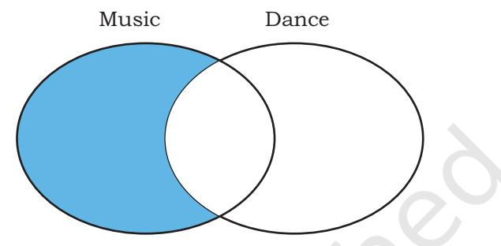

# **Chapter 1 Querying and SQL Functions**


— Lev Manovich


## *In this chapter*

- » *Introduction*
- » *Functions in SQL*
- » *Group By in SQL*
- » *Operations on Relations*
- » *Using Two Relations in a Query*

## **1.1 Introduction**

In Class XI, we have understood database concepts and learned how to create databases using MySQL. We have also learnt how to populate, manipulate and retrieve data from a database using SQL queries.

In this chapter, we are going to learn more SQL commands which are required to perform various queries in a database. We will understand how to use single row functions, multiple row functions, arranging records in ascending or descending order, grouping records based on some criteria, and working on multiple tables using SQL.

Let us create a database called CARSHOWROOM, having the schema as

Chapter 1.indd 1 11/26/2020 12:31:29 PM

shown in Figure 1.1. It has the following four relations:

- **INVENTORY:** Stores name, price, model, year of manufacturing, and fuel type for each car in inventory of the showroom,
- **CUSTOMER:** Stores customer Id, name, address, phone number and email for each customer,
- **SALE:** Stores the invoice number, car Id, customer id, sale date, mode of payment, sales person's employee Id, and selling price of the car sold,
- **EMPLOYEE:** Stores employee Id, name, date of birth, date of joining, designation, and salary of each employee in the showroom.


*Figure 1.1: Schema diagram of database CARSHOWROOM*

The records of the four relations are shown in Tables 1.1, 1.2, 1.3, and 1.4 respectively.

#### **Table 1.1 INVENTORY**

mysql> SELECT * FROM INVENTORY;

| +-------+--------+-----------+-----------+-----------------+----------+ |  |  |  |
| --- | --- | --- | --- |
| CarId   CarName  Price   Model   YearManufacture   Fueltype |  |  |  |
| +-------+--------+-----------+-----------+-----------------+----------+ |  |  |  |
| D001   Car1   582613.00   LXI |  | 2017   Petrol |  |
| D002   Car1   673112.00   VXI |  | 2018   Petrol |  |
| B001   Car2   567031.00   Sigma1.2 |  | 2019   Petrol |  |
| B002   Car2   647858.00   Delta1.2 |  | 2018   Petrol |  |

Chapter 1.indd 2 11/26/2020 12:31:29 PM

| E001   Car3   355205.00   5 STR STD | 2017   CNG |
| --- | --- |
| E002   Car3   654914.00   CARE | 2018   CNG |
| S001   Car4   514000.00   LXI | 2017   Petrol |
| S002   Car4   614000.00   VXI | 2018   Petrol |
| +-------+--------+-----------+-----------+-----------------+----------+ |  |
| 8 rows in set (0.00 sec) |  |
| Table 1.2 CUSTOMER |  |
| mysql> SELECT * FROM CUSTOMER; |  |
| +-------+------------+-----------------------+------------+-------------------+ |  |
| CustId   CustName   CustAdd   Phone | Email |
| +-------+------------+-----------------------+------------+-------------------+ |  |
| C0001  AmitSaha   L-10, Pitampura | 4564587852  amitsaha2@gmail.com |
| C0002  Rehnuma   J-12, SAKET | 5527688761  rehnuma@hotmail.com |
| C0003  CharviNayyar  10/9, FF, Rohini | 6811635425  charvi123@yahoo.com |
| C0004  Gurpreet   A-10/2, SF, MayurVihar  3511056125  gur_singh@yahoo.com |  |
| +-------+------------+-----------------------+------------+-------------------+ |  |
| 4 rows in set (0.00 sec) |  |
| Table 1.3 SALE |  |
| mysql> SELECT * FROM SALE; |  |
| +-----------+-------+--------+------------+--------------+-------+-----------+ |  |
| InvoiceNo   CarId   CustId   SaleDate | PaymentMode  EmpID   SalePrice |
| +-----------+-------+--------+------------+--------------+-------+-----------+ |  |
| I00001   D001   C0001   2019-01-24   Credit Card   E004   613247.00 |  |
| I00002   S001   C0002   2018-12-12   Online | E001   590321.00 |
| I00003   S002   C0004   2019-01-25   Cheque | E010   604000.00 |
| I00004   D002   C0001   2018-10-15   Bank Finance   E007   659982.00 |  |
| I00005   E001   C0003   2018-12-20   Credit Card   E002   369310.00 |  |
| I00006   S002   C0002   2019-01-30   Bank Finance   E007   620214.00 |  |
| +-----------+-------+--------+------------+--------------+-------+-----------+ |  |
| 6 rows in set (0.00 sec) |  |
| Table 1.4 EMPLOYEE |  |
| mysql> SELECT * FROM EMPLOYEE; |  |
| +-------+----------+------------+------------+--------------+--------+ |  |
| EmpID   EmpName   DOB   DOJ | Designation   Salary |
| +-------+----------+------------+------------+--------------+--------+ |  |
| E001  Rushil   1994-07-10   2017-12-12   Salesman | 25550 |
| E002  Sanjay   1990-03-12   2016-06-05   Salesman | 33100 |
| E003  Zohar   1975-08-30   1999-01-08   Peon | 20000 |
| E004  Arpit   1989-06-06   2010-12-02   Salesman | 39100 |
| E006  Sanjucta   1985-11-03   2012-07-01   Receptionist   27350 |  |
| E007  Mayank   1993-04-03   2017-01-01   Salesman | 27352 |
| E010  Rajkumar   1987-02-26   2013-10-23   Salesman | 31111 |
| +-------+----------+------------+------------+--------------+--------+ |  |
| 7 rows in set (0.00 sec) |  |

Chapter 1.indd 3 11/26/2020 12:31:29 PM

## **1.2 Functions in SQL**

We know that a function is used to perform some particular task and it returns zero or more values as a result. Functions are useful while writing SQL queries also. Functions can be applied to work on single or multiple records (rows) of a table. Depending on their application in one or multiple rows, SQL functions are categorised as Single row functions and Aggregate functions.

#### **1.2.1 Single Row Functions**

These are also known as Scalar functions. Single row functions are applied on a single value and return a single value. Figure 1.2 lists different single row functions under three categories — Numeric (Math), String, Date and Time.

Math functions accept numeric value as input, and return a numeric value as a result. String functions accept character value as input, and return either character or numeric values as output. Date and time functions accept date and time values as input, and return numeric or string, or date and time values as output.


*Figure 1.2: Three categories of single row functions in SQL*

Chapter 1.indd 4 11/26/2020 12:31:30 PM

#### *(A) Numeric Functions*

Three commonly used numeric functions are POWER(), ROUND() and MOD(). Their usage along with syntax is given in Table 1.5.

| Function | Description | Example with output |
| --- | --- | --- |
| POWER(X,Y) | Calculates X to the power Y. | mysql> SELECT POWER(2,3); |
| can also be written as POW(X,Y) |  | Output: |
|  |  | 8 |
| ROUND(N,D) | Rounds off number N to D number of decimal places. | mysql>SELECT ROUND(2912.564, 1); Output: |
|  | Note: If D=0, then it rounds off the number to the nearest | 2912.6 |
|  | integer. | mysql> SELECT ROUND(283.2); |
|  |  | Output: |
|  |  | 283 |
| MOD(A, B) | Returns the remainder | mysql> SELECT MOD(21, 2); |
|  | after dividing number A by number B. | Output: |
|  | 1 |  |

#### **Table 1.5 Math Functions**

#### *Example 1.1*

In order to increase sales, suppose the car dealer decides to offer his customers to pay the total amount in 10 easy EMIs (equal monthly installments). Assume that EMIs are required to be in multiples of 10,000. For that, the dealer wants to list the CarID and Price along with the following data from the Inventory table:

- a) Calculate GST as 12% of Price and display the result after rounding it off to one decimal place.

```
mysql> SELECT ROUND(12/100*Price,1) "GST" 
FROM INVENTORY;
+---------+
| GST |
+---------+
| 69913.6 |
| 80773.4 |
| 68043.7 |
| 77743.0 |
| 42624.6 |
| 78589.7 |
| 61680.0 |
| 73680.0 |
+---------+
 8 rows in set (0.00 sec)
```
- b) Add a new column FinalPrice to the table inventory, which will have the value as sum of Price and 12% of the GST.
Chapter 1.indd 5 11/26/2020 12:31:30 PM

mysql> ALTER TABLE INVENTORY ADD FinalPrice Numeric(10,1); Query OK, 8 rows affected (0.03 sec) Records: 8 Duplicates: 0 Warnings: 0

mysql> UPDATE INVENTORY SET FinalPrice=Price+Round(Price*12/100,1); Query OK, 8 rows affected (0.01 sec) Rows matched: 8 Changed: 8 Warnings: 0

mysql> SELECT * FROM INVENTORY;

| +-------+--------+-----------+----------+---------------+----------+-------------+   CarId  CarName   Price   Model  YearManufacture  FuelType   FinalPric   +-------+--------+-----------+----------+---------------+----------+-------------+ |  |  |  |  |  |
| --- | --- | --- | --- | --- | --- |
| D001  Car1   582613.00   LXI |  | 2017 | Petrol |  | 652526.6 |
| D002  Car1   673112.00   VXI |  | 2018 | Petrol |  | 753885.4 |
| B001  Car2   567031.00   Sigma1.2 |  | 2019 | Petrol |  | 635074.7 |
| B002  Car2   647858.00   Delta1.2 |  | 2018 | Petrol |  | 725601.0 |
| E001  Car3   355205.00   5STR STD |  | 2017 | CNG |  | 397829.6 |
| E002  Car3   654914.00   CARE |  | 2018 | CNG |  | 733503.7 |
| S001  Car4   514000.00   LXI |  | 2017 | Petrol |  | 575680.0 |
| S002  Car4   614000.00   VXI |  | 2018 | Petrol |  | 687680.0 |
| +-------+--------+-----------+----------+---------------+----------+-------------+ |  |  |  |  |  |

8 rows in set (0.00 sec)

- c) Calculate and display the amount to be paid each month (in multiples of 1000) which is to be calculated after dividing the FinalPrice of the car into 10 instalments.
- d) After dividing the amount into EMIs, find out the remaining amount to be paid immediately, by performing modular division.

Following SQL query can be used to solve the above mentioned problems:

mysql> select CarId, FinalPrice, ROUND((FinalPrice-MOD(FinalPrice,10000))/10,0) "EMI", MOD(FinalPrice,10000) "Remaining Amount" FROM INVENTORY;

| +-------+------------+-------+------------------+ |  |  |
| --- | --- | --- |
| CarId   FinalPrice   EMI   Remaining Amount |  |  |
| +-------+------------+-------+------------------+ |  |  |
| D001 | 652526.6   65000 | 2526.6 |
| D002 | 753885.4   75000 | 3885.4 |
| B001 | 635074.7   63000 | 5074.7 |
| B002 | 725601.0   72000 | 5601.0 |
| E001 | 397829.6   39000 | 7829.6 |
| E002 | 733503.7   73000 | 3503.7 |
| S001 | 575680.0   57000 | 5680.0 |
| S002 | 687680.0   68000 | 7680.0 |
| +-------+------------+-------+------------------+ |  |  |

8 rows in set (0.00 sec)

Chapter 1.indd 6 19-Sep-2023 10:15:54 AM

#### *Example 1.2*

- a) Let us now add a new column Commission to the SALE table. The column Commission should have a total length of 7 in which 2 decimal places to be there. mysql> ALTER TABLE SALE ADD(Commission Numeric(7,2)); Query OK, 6 rows affected (0.34 sec) Records: 6 Duplicates: 0 Warnings: 0
- b) Let us now calculate commission for sales agents as 12 per cent of the SalePrice, insert the values to the newly added column Commission and then display records of the table SALE where commission > 73000. mysql> UPDATE SALE SET

Commission=12/100*SalePrice; Query OK, 6 rows affected (0.06 sec) Rows matched: 6 Changed: 6 Warnings: 0

```
mysql> SELECT * FROM SALE WHERE Commission > 73000;
```

| +---------------+------+----------+------------+------+-----------+-----------+ | invoiceno carid custid  saledate  paymentmode  empid   saleprice  Commission   +---------------+------+----------+------------+------+-----------+-----------+ |
| --- | --- |
| I00001 | D001  C0001  2019-01-24 Credit Card  E004   613247.00   73589.64 |
| I0000 | D002  C0001  2018-10-15 Bank Finance E007   659982.00   79197.84 |
| I00006 | S002  C0002  2019-01-30 Bank Finance E007   620214.00   74425.68 |
| +---------------+------+-----------+------------+------+----------+-----------+ |  |

- 3 rows in set (0.02 sec)
- c) Display InvoiceNo, SalePrice and Commission such that commission value is rounded off to 0. mysql> SELECT InvoiceNo, SalePrice,

Round(Commission,0) FROM SALE;

| +-----------+-----------+---------------------+   InvoiceNo   SalePrice   Round(Commission,0) |  |  |
| --- | --- | --- |
| +-----------+-----------+---------------------+ |  |  |
| I00001 | 613247.00 | 73590 |
| I00002 | 590321.00 | 70839 |
| I00003 | 604000.00 | 72480 |
| I00004 | 659982.00 | 79198 |
| I00005 | 369310.00 | 44317 |
| I00006 | 620214.00 | 74426 |
| +-----------+-----------+---------------------+ |  |  |

6 rows in set (0.00 sec)

#### *(B) String Functions*

String functions can perform various operations on alphanumeric data which are stored in a table. They can be used to change the case (uppercase to lowercase


Using the table SALE of CARSHOWROOM database, write SQL queries for the following:

- a) Display the InvoiceNo and commission value rounded off to zero decimal places.
- b) Display the details of SALE where payment mode is credit card..

Chapter 1.indd 7 11/26/2020 12:31:30 PM

or vice-versa), extract a substring, calculate the length of a string and so on. String functions and their usage are shown in Table 1.6.

|
|  |

| Function | Description | Example with output |
| --- | --- | --- |
| UCASE(string) | Converts string into uppercase. | mysql> SELECT |
| OR |  | UCASE("Informatics |
| UPPER(string) |  | Practices"); |
|  |  | Output: |
|  |  | INFORMATICS PRACTICES |
| LOWER(string) | Converts string into lowercase. | mysql> SELECT |
| OR |  | LOWER("Informatics |
| LCASE(string) |  | Practices"); |
|  |  | Output: |
|  |  | informatics practices |
| MID(string, pos, n) | Returns a substring of size n | mysql> SELECT |
| OR | starting from the specified position | MID("Informatics", 3, 4); |
| SUBSTRING(string, | (pos) of the string. If n is not | Output: |
| pos, n) | specified, it returns the substring | form |
| OR | from the position pos till end of the |  |
| SUBSTR(string, pos, n) | string. | mysql> SELECT |
|  |  | MID('Informatics',7); |
|  |  | Output: |
|  |  | atics |
| LENGTH(string) | Return the number of characters | mysql> SELECT |
|  | in the specified string. | LENGTH("Informatics"); |
|  |  | Output: |
|  |  | 11 |
| LEFT(string, N) | Returns N number of characters | mysql> SELECT |
|  | from the left side of the string. | LEFT("Computer", 4); |
|  |  | Output: |
|  |  | Comp |
| RIGHT(string, N) | Returns N number of characters | mysql> SELECT |
|  | from the right side of the string. | RIGHT("SCIENCE", 3); |
|  |  | Output: |
|  |  | NCE |
| INSTR(string, | Returns the position of the first | mysql> SELECT |
| substring) | occurrence of the substring in | INSTR("Informatics", "ma"); |
|  | the given string. Returns 0, if the | Output: |
|  | substring is not present in the | 6 |
|  | string. |  |
| LTRIM(string) | Returns the given string after | mysql> SELECT LENGTH(" |
|  | removing leading white space | DELHI"), LENGTH(LTRIM(" |
|  | characters. | DELHI")); |
|  |  | Output: |
|  |  | +--------+--------+ |
|  |  | 7   5 |
|  |  | +--------+--------+ |
|  |  | 1 row in set (0.00 sec) |

Chapter 1.indd 8 11/26/2020 12:31:30 PM

| RTRIM(string) | Returns the | given | string | after | mysql>SELECT LENGTH("PEN ") |  |
| --- | --- | --- | --- | --- | --- | --- |
|  | removing | trailing | white | space | LENGTH(RTRIM("PEN ")); |  |
|  | characters. |  |  |  | Output: |  |
|  |  |  |  |  | +--------+--------+ |  |
|  |  |  |  |  | 5   3 |  |
|  |  |  |  |  | +--------+--------+ |  |
|  |  |  |  |  | 1 row in set (0.00 sec) |  |
| TRIM(string) | Returns the | given | string | after | mysql> SELECT LENGTH(" MADAM |  |
|  | removing both leading and trailing white space characters. |  |  |  | "),LENGTH(TRIM(" MADAM ")); |  |
|  |  |  |  |  | Output: |  |
|  |  |  |  |  | +--------+--------+ |  |
|  |  |  |  |  | 9   5 |  |
|  |  |  |  |  | +--------+--------+ |  |
|  |  |  |  |  | 1 row in set (0.00 sec) |  |

#### *Example 1.3*

Let us use CUSTOMER relation shown in Table 1.2 to understand the working of string functions.

- a) Display customer name in lower case and customer
email in upper case from table CUSTOMER. mysql> SELECT LOWER(CustName), UPPER(Email) FROM CUSTOMER;

```
+-----------------+---------------------+
| LOWER(CustName) | UPPER(Email) |
+-----------------+---------------------+
| amitsaha | AMITSAHA2@GMAIL.COM |
| rehnuma | REHNUMA@HOTMAIL.COM |
| charvinayyar | CHARVI123@YAHOO.COM |
| gurpreet | GUR_SINGH@YAHOO.COM |
+-----------------+---------------------+
4 rows in set (0.00 sec)
```
- b) Display the length of the email and part of the email from the email ID before the character '@'. Note - Do not print '@'.
mysql> SELECT LENGTH(Email), LEFT(Email, INSTR(Email, "@")-1) FROM CUSTOMER;

| +---------------+----------------------------------+   LENGTH(Email)   LEFT(Email, INSTR(Email, "@")-1)   +---------------+----------------------------------+ |  |
| --- | --- |
| 19   amitsaha2 |  |
| 19   rehnuma |  |
| 19   charvi123 |  |
| 19   gur_singh |  |
| +---------------+----------------------------------+ |  |

4 rows in set (0.03 sec)

The function INSTR will return the position of "@" in the email address. So to print email id without "@" we have to use position -1.

#### **Activity 1.2**

Using the table INVENTORY from CARSHOWROOM database, write sql queries for the following:

- a) Convert the CarMake to uppercase if its value starts with the letter 'B'.
- b) If the length of the car's model is greater than 4 then fetch the substring starting from position 3 till the end from attribute Model.

Chapter 1.indd 9 11/26/2020 12:31:30 PM


There are various functions that are used to perform operations on date and time data. Some of the operations include displaying the current date, extracting each element of a date (day, month and year), displaying day of the week and so on. Table 1.7 explains various date and time functions.

c) Let us assume that four digit area code is reflected

Chapter 1.indd 10 12-Apr-2023 3:04:49 PM

| Function | Description | Example with output |
| --- | --- | --- |
| NOW() | It returns the current | mysql> SELECT NOW(); |
|  | system date and time. | Output: |
|  |  | 2019-07-11 19:41:17 |
| DATE() | It returns the date part | mysql> SELECT DATE(NOW()); |
|  | from the given date/ | Output: |
|  | time expression. | 2019-07-11 |
| MONTH(date) | It returns the month in | mysql> SELECT MONTH(NOW()); |
|  | numeric form from the | Output: |
|  | date. | 7 |
| MONTHNAME(date) | It returns the month | mysql> SELECT |
|  | name from the specified | MONTHNAME("2003-11-28"); |
|  | date. | Output: |
|  |  | November |
| YEAR(date) | It returns the year from | mysql> SELECT YEAR("2003-10-03"); |
|  | the date. | Output: |
|  |  | 2003 |
| DAY(date) | It returns the day part | mysql> SELECT DAY("2003-03-24"); |
|  | from the date. | Output: |
|  |  | 24 |
| DAYNAME(date) | It returns the name of | mysql> SELECT |
|  | the day from the date. | DAYNAME("2019-07-11"); |
|  |  | Output: |
|  |  | Thursday |

#### **Table 1.7 Date Functions**

#### *Example 1.4*

Let us use the EMPLOYEE table of CARSHOWROOM database to illustrate the working of some of the date and time functions.

- a) Select the day, month number and year of joining of all employees.
mysql> SELECT DAY(DOJ), MONTH(DOJ), YEAR(DOJ) FROM EMPLOYEE;

| +----------+------------+-----------+ |  |  |  |
| --- | --- | --- | --- |
| DAY(DOJ)   MONTH(DOJ)   YEAR(DOJ) |  |  |  |
| +----------+------------+-----------+ |  |  |  |
|  | 12 | 12 | 2017 |
|  | 5 | 6 | 2016 |
|  | 8 | 1 | 1999 |
|  | 2 | 12 | 2010 |
|  | 1 | 7 | 2012 |
|  | 1 | 1 | 2017 |
|  | 23 | 10 | 2013 |
| +----------+------------+-----------+ |  |  |  |
| 7 rows in set (0.03 sec) |  |  |  |


Using the table EMPLOYEE of CARSHOWROOM database, list the day of birth for all employees whose salary is more than 25000.

- b) If the date of joining is not a Sunday, then display it in the following format "Wednesday, 26, November, 1979."
Chapter 1.indd 11 11/26/2020 12:31:30 PM

#### **Think and Reflect**

Can we use arithmetic operators (+, -. *, or /) on date functions?

mysql> SELECT DAYNAME(DOJ), DAY(DOJ), MONTHNAME(DOJ), YEAR(DOJ) FROM EMPLOYEE WHERE DAYNAME(DOJ)!='Sunday'; +------------+---------+---------------+---------+ |DAYNAME(DOJ)| DAY(DOJ)|MONTHNAME(DOJ) |YEAR(DOJ)| +------------+---------+---------------+---------+ |Tuesday | 12 | December | 2017 | |Friday | 8 | January | 1999 | |Thursday | 2 | December | 2010 | |Wednesday | 23 | October 2013 |

+------------+---------+---------------+---------+ 4 rows in set (0.00 sec)

## **1.2.2 Aggregate Functions**

Aggregate functions are also called multiple row functions. These functions work on a set of records as a whole, and return a single value for each column of the records on which the function is applied. Table 1.8 shows the differences between single row functions and multiple row functions. Table 1.9 describes some of the aggregate functions along with their usage. Note that column must be of numeric type.

#### **Table 1.8 Differences between Single row and Multiple row Functions**

|  | Single_row Functions |  |  |  |  |  | Multiple_row functions |
| --- | --- | --- | --- | --- | --- | --- | --- |
| 1. | It operates on a single row at a time. |  |  |  |  | 1. | It operates on groups of rows. |
| 2. | It returns one result per row. |  |  |  |  | 2. | It returns one result for a group of rows. |
| 3. | It can be used in Select, Where, and Order by clause. |  |  |  |  | 3. | It can be used in the select clause only. |
| 4. | Math, String examples of single row functions. | and | Date | functions | are | 4. | Max(), Min(), Avg(), Sum(), Count() and Count(*) are examples of multiple row functions. |

| Function | Description | Example with output |
| --- | --- | --- |
| MAX(column) | Returns the largest value from | mysql> SELECT MAX(Price) FROM |
|  | the specified column. | INVENTORY; |
|  |  | Output: |
|  |  | 673112.00 |
| MIN(column) | Returns the smallest value from | mysql> SELECT MIN(Price) FROM |
|  | the specified column. | INVENTORY; |
|  |  | Output: |
|  |  | 355205.00 |
| AVG(column) | Returns the average of the values | mysql> SELECT AVG(Price) FROM |
|  | in the specified column. | INVENTORY; |
|  |  | Output: |
|  |  | 576091.625000 |

#### **Table 1.9 Aggregate Functions in SQL**

Chapter 1.indd 12 11/26/2020 12:31:30 PM

| SUM(column) | Returns the sum of the values | mysql> SELECT SUM(Price) FROM |
| --- | --- | --- |
|  | for the specified column. | INVENTORY; |
|  |  | Output: |
|  |  | 4608733.00 |
| COUNT(column) | Returns the number of values | mysql> SELECT * from MANAGER; |
|  | in the specified column ignoring | Output: |
|  | the NULL values. | +------+---------+ |
|  |  | MNO   MEMNAME |
|  | Note: | +------+---------+ |
|  | In this example, let us consider | 1   AMIT |
|  | a MANAGER table having two | 2   KAVREET |
|  | attributes and four records. | 3   KAVITA |
|  |  | 4   NULL |
|  |  | +------+---------+ |
|  |  | 4 rows in set (0.00 sec) |
|  |  | mysql> SELECT COUNT(MEMNAME) |
|  |  | FROM MANAGER; |
|  |  | Output: |
|  |  | +----------------+ |
|  |  | COUNT(MEMNAME) |
|  |  | +----------------+ |
|  |  | 3 |
|  |  | +----------------+ |
|  |  | 1 row in set (0.01 sec) |
| COUNT(*) | Returns the number of records | mysql> SELECT COUNT(*) from |
|  | in a table. | MANAGER; |
|  | Note: In order to display the | Output: |
|  | number of records that matches | +----------+ |
|  | a particular criteria in the table, we have to use COUNT(*) with | count(*) |
|  |  | +----------+ |
|  | WHERE clause. | 4 |
|  |  | +----------+ |
|  |  | 1 row in set (0.00 sec) |

#### *Example 1.5*

a) Display the total number of records from table INVENTORY having a model as VXI. mysql> SELECT COUNT(*) FROM INVENTORY WHERE Model="VXI"; +----------+ | COUNT(*) | +----------+ | 2 | +----------+ 1 row in set (0.00 sec)

- b) Display the total number of different types of Models available from table INVENTORY.
Chapter 1.indd 13 11/26/2020 12:31:30 PM


- a) Find sum of Sale Price of the cars purchased by the customer having ID C0001 from table SALE.
- b) Find the maximum and minimum commission from the SALE table.

mysql> SELECT COUNT(DISTINCT Model) FROM INVENTORY; +-----------------------+

```
| COUNT(DISTINCT MODEL) |
+-----------------------+
| 6 |
+-----------------------+
1 row in set (0.09 sec)
```
- c) Display the average price of all the cars with Model LXI from table INVENTORY. mysql> SELECT AVG(Price) FROM INVENTORY WHERE Model="LXI"; +---------------+ | AVG(Price) | +---------------+
| 548306.500000 |

- +---------------+ 1 row in set (0.03 sec)
## **1.3 GROUP BY in SQL**

At times we need to fetch a group of rows on the basis of common values in a column. This can be done using a GROUP BY clause. It groups the rows together that contain the same values in a specified column. We can use the aggregate functions (COUNT, MAX, MIN, AVG and SUM) to work on the grouped values. HAVING Clause in SQL is used to specify conditions on the rows with GROUP BY clause. Consider the SALE table from the CARSHOWROOM database:

mysql> SELECT * FROM SALE;

+-----------+------+-------+------------+------------------+----

| --+------------+------------+  InvoiceNo CarId CustId  SaleDate   PaymentMode  EmpID  SalePrice Commission |
| --- |
| +-----------+------+-------+------------+------------------+------+------------+------------+ |
| I00001  D001  C0001  2019-01-24  Credit Card   E004  613247.00  73589.64 |
| I00002  S001  C0002  2018-12-12  Online   E001  590321.00  70838.52 |
| I00003  S002  C0004  2019-01-25  Cheque   E010  604000.00  72480.00 |
| I00004  D002  C0001  2018-10-15  Bank Finance   E007  659982.00  79197.84 |
| I00005  E001  C0003  2018-12-20  Credit Card   E002  369310.00  44317.20 |
| I00006  S002  C0002  2019-01-30  Bank Finance   E007  620214.00  74425.68 |
| +-----------+------+-------+------------+------------------+------+------------+------------+ |

6 rows in set (0.11 sec)

CarID, CustID, SaleDate, PaymentMode, EmpID, SalePrice are the columns that can have rows with the same values in it. So, GROUP BY clause can be used

Chapter 1.indd 14 11/26/2020 12:31:30 PM

in these columns to find the number of records of a particular type (column), or to calculate the sum of the price of each car type.

#### *Example 1.6*

- a) Display the number of cars purchased by each customer from the SALE table. mysql> SELECT CustID, COUNT(*) "Number of Cars" FROM SALE GROUP BY CustID; +--------+----------------+ | CustID | Number of Cars | +--------+----------------+ | C0001 | 2 | | C0002 | 2 | | C0003 | 1 | | C0004 | 1 | +--------+----------------+ 4 rows in set (0.00 sec) b) Display the customer Id and number of cars purchased if the customer purchased more than 1 car from SALE table. mysql> SELECT CustID, COUNT(*) FROM SALE GROUP BY CustID HAVING Count(*)>1; +--------+----------+ | CustID | COUNT(*) | +--------+----------+ | C0001 | 2 | | C0002 | 2 | +--------+----------+ 2 rows in set (0.30 sec) c) Display the number of people in each category of payment mode from the table SALE. mysql> SELECT PaymentMode, COUNT(PaymentMode) FROM
SALE GROUP BY Paymentmode ORDER BY Paymentmode;

+--------------+--------------------+ | PaymentMode | Count(PaymentMode) | +--------------+--------------------+ | Bank Finance | 2 | | Cheque | 1 | | Credit Card | 2 | | Online | 1 | +--------------+--------------------+ 4 rows in set (0.00 sec)

- **Activity 1.6**
- a) List the total number of cars sold by each employee.
- b) List the maximum sale made by each employee.
- d) Display the PaymentMode and number of payments made using that mode more than once.

mysql> SELECT PaymentMode, Count(PaymentMode) FROM SALE GROUP BY Paymentmode HAVING COUNT(*)>1 ORDER

Chapter 1.indd 15 11/26/2020 12:31:30 PM

**Notes**

```
BY Paymentmode;
```

| +--------------+--------------------+ |
| --- |
| PaymentMode   Count(PaymentMode) |
| +--------------+--------------------+ |
| Bank Finance   2 |
| Credit Card   2 |
| +--------------+--------------------+ |

- 2 rows in set (0.00 sec)
### **1.4 Operations on Relations**

We can perform certain operations on relations like Union, Intersection, and Set Difference to merge the tuples of two tables. These three operations are binary operations as they work upon two tables. Note here, that these operations can only be applied if both the relations have the same number of attributes, and corresponding attributes in both tables have the same domain.

#### **1.4.1 UNION (U)**

This operation is used to combine the selected rows of two tables at a time. If some rows are the same in both the tables, then the result of the Union operation will show those rows only once. Figure 1.3 shows union of two sets.


*Figure 1.3: Union of two sets*

Let us consider two relations DANCE and MUSIC shown in Tables 1.10 and 1.11 respectively.

#### **Table 1.10 DANCE**

| +------+--------+-------+ |
| --- |
| SNo   Name   Class |
| +------+--------+-------+ |
| 1  Aastha   7A |
| 2  Mahira   6A |
| 3  Mohit   7B |
| 4  Sanjay   7A |
| +------+--------+-------+ |

Chapter 1.indd 16 11/26/2020 12:31:30 PM

| Table 1.11 | MUSIC |  |
| --- | --- | --- |
| +------+---------+-------+ |  |  |
| SNo   Name | Class |  |
| +------+---------+-------+ |  |  |
|  | 1  Mehak   8A |  |
|  | 2  Mahira   6A |  |
|  | 3  Lavanya   7A |  |
|  | 4  Sanjay   7A |  |
|  | 5  Abhay   8A |  |
| +------+---------+-------+ |  |  |

If we need the list of students participating in either of events, then we have to apply UNION operation (represented by symbol U) on relations DANCE and MUSIC. The output of UNION operation is shown in Table 1.12.

| Table 1.12 DANCE MUSIC |  |  |  |
| --- | --- | --- | --- |
| +-------+------+------+ |  |  |  |
| SNo   Name  Class |  |  |  |
| +-------+------+------+ |  |  |  |
| Aastha   7A | 1 |  |  |
| Mahira | 2 | 6A |  |
| Mohit | 3 | 7B |  |
| Sanjay | 4 | 7A |  |
| Mehak | 1 | 8A |  |
| Lavanya   7A | 3 |  |  |
| Abhay | 5 | 8A |  |
| +-------+------+------+ |  |  |  |

#### **1.4.2 INTERSECT (∩)**

Intersect operation is used to get the common tuples from two tables and is represented by the symbol ∩. Figure 1.4 shows intersection of two sets.


*Figure 1.4: Intersection of two sets*

Suppose we have to display the list of students who are participating in both the events (DANCE and MUSIC), then intersection operation is to be applied on these two tables. The output of INTERSECT operation is shown in Table 1.13.

# **Table 1.13 DANCE ∩ MUSIC** +------+---------+-------+

| SNo   Name   Class |
| --- |
| +------+---------+-------+ |
| 2  Mahira   6A |
| 4  Sanjay   7A   +------+---------+-------+ |

**Notes**

Chapter 1.indd 17 11/26/2020 12:31:30 PM

**Notes**

#### **1.4.3 MINUS (-)**

This operation is used to get tuples/rows which are in the first table but not in the second table, and the operation is represented by the symbol - (minus). Figure 1.5 shows minus operation (also called set difference) between two sets.




Suppose, we want the list of students who are only participating in MUSIC and not in DANCE event. Then, we will use the MINUS operation, whose output is given in Table 1.14.

# **Table 1.14 DANCE - MUSIC** +------+---------+-------+

| +------+---------+-------+ |  |  |
| --- | --- | --- |
| SNo   Name   Class |  |  |
| +------+---------+-------+ |  |  |
| 8A | 1  Mehak |  |
|  | 3  Lavanya   7A |  |
| 8A | 5  Abhay |  |
| +------+---------+-------+ |  |  |

#### **1.4.4 Cartesian Product**

Cartesian product operation combines tuples from two relations. It results in all pairs of rows from the two input relations, regardless of whether or not they have the same values on common attributes. It is denoted as 'X'.

The degree of the resulting relation is calculated as the sum of the degrees of both the relations under consideration. The cardinality of the resulting relation is calculated as the product of the cardinality of relations on which cartesian product is applied. Let us use the relations DANCE and MUSIC to show the output of cartesian product. Note that both relations are of degree 3. The cardinality of relations DANCE and MUSIC is 4 and 5 respectively. Applying cartesian product on these two relations will result in a relation of degree 6 and cardinality 20, as shown in Table 1.15.

Chapter 1.indd 18 11/26/2020 12:31:31 PM

|  | Table 1.15 |  | DANCE X MUSIC |  |  |
| --- | --- | --- | --- | --- | --- |
|  |  | +------+--------+-------+------+---------+-------+ |  |  |  |
| SNo | Name | Class  SNo | Name   Class |  |  |
|  |  | +------+--------+-------+------+---------+-------+ |  |  |  |
|  | 1   Aastha   7A |  | 1   Mehak | 8A |  |
|  | 2   Mahira   6A |  | 1   Mehak | 8A |  |
|  | 3   Mohit   7B |  | 1   Mehak | 8A |  |
|  | 4   Sanjay   7A |  | 1   Mehak | 8A |  |
|  | 1   Aastha   7A |  | 2   Mahira   6A |  |  |
|  | 2   Mahira   6A |  | 2   Mahira   6A |  |  |
|  | 3   Mohit   7B |  | 2   Mahira   6A |  |  |
|  | 4   Sanjay   7A |  | 2   Mahira   6A |  |  |
|  | 1   Aastha   7A |  | 3   Lavanya   7A |  |  |
|  | 2   Mahira   6A |  | 3   Lavanya   7A |  |  |
|  | 3   Mohit   7B |  | 3   Lavanya   7A |  |  |
|  | 4   Sanjay   7A |  | 3   Lavanya   7A |  |  |
|  | 1   Aastha   7A |  | 4   Sanjay   7A |  |  |
|  | 2   Mahira   6A |  | 4   Sanjay   7A |  |  |
|  | 3   Mohit   7B |  | 4   Sanjay   7A |  |  |
|  | 4   Sanjay   7A |  | 4   Sanjay   7A |  |  |
|  | 1   Aastha   7A |  | 5   Abhay | 8A |  |
|  | 2   Mahira   6A |  | 5   Abhay | 8A |  |
|  | 3   Mohit   7B |  | 5   Abhay | 8A |  |
|  | 4   Sanjay   7A |  | 5   Abhay | 8A |  |
|  |  | +------+--------+-------+------+---------+-------+ |  |  |  |

20 rows in set (0.03 sec)

### **1.5 Using Two Relations in a Query**

Till now, we have written queries in SQL using a single relation only. In this section, we will learn to write queries using two relations.

#### **1.5.1 Cartesian product on two tables**

From the previous section, we learnt that application of operator cartesian product on two tables results in a table having all combinations of tuples from the underlying tables. When more than one table is to be used in a query, then we must specify the table names by separating commas in the FROM clause, as shown in Example 1.7. On execution of such a query, the DBMS (MySql) will first apply cartesian product on specified tables to have a single table. The following query of Example 1.7 applies cartesian product on the two tables DANCE and MUSIC:

#### *Example 1.7*

- a) Display all possible combinations of tuples of relations DANCE and MUSIC
mysql> SELECT * FROM DANCE, MUSIC;

As we are using SELECT * in the query, the output will be the Table 1.15 having degree 6 and cardinality 20.

Chapter 1.indd 19 11/26/2020 12:31:31 PM

**Notes**

- b) From the all possible combinations of tuples of relations DANCE and MUSIC, display only those rows such that the attribute name in both have the same value.
mysql> SELECT * FROM DANCE D, MUSIC M WHERE D.Name = M.Name;

| Table 1.16 |  | Tuples with same name |  |
| --- | --- | --- | --- |
| +------+--------+-------+------+--------+-------+ |  |  |  |
| Sno   Name |  | Class   Sno   Name   class |  |
| +------+--------+-------+------+--------+-------+ |  |  |  |
|  | 2   Mahira   6A | 2   Mahira   6A |  |
|  | 4   Sanjay   7A | 4   Sanjay   7A |  |
| +------+--------+-------+------+--------+-------+ |  |  |  |

2 rows in set (0.00 sec)

 Note that in this query we have used table aliases (D for DANCE and M for MUSIC), just like column aliases to refer to tables by shortened names. It is important to note that table alias is valid only for current query and the original table name cannot be used in the query if its alias is given in FROM clause.

#### **1.5.2 JOIN on two tables**

JOIN operation combines tuples from two tables on specified conditions. This is unlike cartesian product, which make all possible combinations of tuples. While using the JOIN clause of SQL, we specify conditions on the related attributes of two tables within the FROM clause. Usually, such an attribute is the primary key in one table and foreign key in another table. Let us create two tables UNIFORM (UCode, UName, UColor) and COST (UCode, Size, Price) in the SchoolUniform database. UCode is Primary Key in table UNIFORM. UCode and Size is the Composite Key in table COST. Therefore, Ucode is a common attribute between the two tables which can be used to fetch the common data from both the tables. Hence, we need to define Ucode as foreign key in the Price table while creating this table.

# **Table 1.17 Uniform table** +-------+-------+--------+

| Ucode   Uname   Ucolor   +-------+-------+--------+ |  |
| --- | --- |
| 1 | Shirt   White |
| 2 | Pant   Grey |
| 3 | Tie   Blue |
| +-------+-------+--------+ |  |

Chapter 1.indd 20 11/26/2020 12:31:31 PM

| Table 1.18 Cost table |  |  |  |
| --- | --- | --- | --- |
| +-----+------+-------+ |  |  |  |
| Ucode  Size   Price |  |  |  |
| +-----+------+-------+ |  |  |  |
| 1 | L |  | 580 |
| 1 | M |  | 500 |
| 2 | L |  | 890 |
| 2 | M |  | 810 |
| +-------+----+-------+ |  |  |  |

#### *Example 1.7*

List the UCode, UName, UColor, Size and Price of related tuples of tables UNIFORM and COST.

The given query may be written in three different ways as given below:

- a) Using condition in where clause mysql> SELECT * FROM UNIFORM U, COST C WHERE U.UCode = C.UCode;

| Table 1.19 |  |  | Output of the query |  |
| --- | --- | --- | --- | --- |
| +-------+-------+--------+-------+---------+-------+ |  |  |  |  |
| UCode   UName   UColor   Ucode   Size |  |  |  | Price |
| +-------+-------+--------+-------+---------+-------+ |  |  |  |  |
| Shirt   White   1 | 1 |  | L | 580 |
| Shirt   White   1 | 1 |  | M | 500 |
| Pant   Grey | 2 | 2 | L | 890 |
| Pant   Grey | 2 | 2 | M | 810 |
| +-------+-------+--------+-------+---------+-------+ |  |  |  |  |

4 rows in set (0.08 sec)

 As the attribute Ucode is in both tables, we need to use table alias to remove ambiguity. Hence, we have used qualifier with attribute UCode in SELECT and FROM clauses to indicate its scope.

- b) Explicit use of JOIN clause
mysql> SELECT * FROM UNIFORM U JOIN COST C ON U.Ucode=C.Ucode;

 The output of the query is the same as shown in Table 1.19. In this query, we have used JOIN clause explicitly along with condition in From clause. Hence, no condition needs to be given in where clause.

- c) Explicit use of NATURAL JOIN clause
 The output of queries (a) and (b) shown in Table 1.19 has a repetitive column Ucode having exactly the same values. This redundant column provides no additional information. There is an extension of JOIN operation called NATURAL JOIN which works similar to JOIN clause in SQL, but removes the redundant attribute. This operator can be used **Notes**

Chapter 1.indd 21 11/26/2020 12:31:31 PM

**Notes**

to join the contents of two tables iff there is one common attribute in both the tables. The above SQL query using NATURAL JOIN is shown below:

mysql> SELECT * FROM UNIFORM NATURAL JOIN COST;

| +-------+-------+--------+------+-------+ |  |  |  |
| --- | --- | --- | --- |
| UCode   UName   UColor   Size   Price |  |  |  |
| +-------+-------+--------+------+-------+ |  |  |  |
| 1 | Shirt   White   L |  | 580 |
| 1 | Shirt   White   M |  | 500 |
| 2 | Pant   Grey   L |  | 890 |
| 2 | Pant   Grey   M |  | 810 |
| +-------+-------+--------+------+-------+ |  |  |  |

- 4 rows in set (0.17 sec)
 It is clear from the output that the result of this query is same as that of queries written in (a) and (b), except that the attribute Ucode appears only once.

Following are some of the points to be considered while applying JOIN operations on two or more relations:

- If two tables are to be joined on equality condition on the common attribute, then one may use JOIN with ON clause or NATURAL JOIN in FROM clause. If three tables are to be joined on equality condition, then two JOIN or NATURAL JOIN are required.
- In general, N-1 joins are needed to combine N tables on equality condition.
- With JOIN clause, we may use any relational operators to combine tuples of two tables.

# **Summary**

- A Function is used to perform a particular task and return a value as a result.
- Single row functions work on a single row to return a single value.
- Multiple row functions work on a set of records as a whole and return a single value.
- Numeric functions perform operations on numeric values and return numeric values.
- String functions perform operations on character type values and return either character or numeric values.

Chapter 1.indd 22 11/26/2020 12:31:31 PM

- Date and time functions allow us to deal with date type data values.
- GROUP BY function is used to group the rows together that contain similar values in a specified column. Some of the group functions are COUNT, MAX, MIN, AVG and SUM.
- Join is an operation which is used to combine rows from two or more tables based on one or more common fields between them.

# Exercise

- 1. Answer the following questions:
	- a) Define RDBMS. Name any two RDBMS software.
	- b) What is the purpose of the following clauses in a select statement?
		- i) ORDER BY
		- ii) HAVING
	- c) Site any two differences between Single_row functions and Aggregate functions.
	- d) What do you understand by Cartesian Product?
	- e) Write the name of the functions to perform the following operations:
		- i) To display the day like "Monday", "Tuesday", from the date when India got independence.
		- ii) To display the specified number of characters from a particular position of the given string.
		- iii) To display the name of the month in which you were born.
		- iv) To display your name in capital letters.
- 2. Write the output produced by the following SQL commands:
	- a) SELECT POW(2,3);
	- b) SELECT ROUND(123.2345, 2), ROUND(342.9234,-1);
	- c) SELECT LENGTH("Informatics Practices");
	- d) SELECT YEAR("1979/11/26"), MONTH("1979/11/26"), DAY("1979/11/26"),

### **Notes**

Chapter 1.indd 23 11/26/2020 12:31:31 PM

### **Notes** MONTHNAME("1979/11/26");

- e) SELECT LEFT("INDIA",3), RIGHT("Computer Science",4);
- f) SELECT MID("Informatics",3,4), SUBSTR("Practices",3);
- 3. Consider the following table named "Product", showing details of products being sold in a grocery shop.

| PCode | PName | UPrice | Manufacturer |
| --- | --- | --- | --- |
| P01 | Washing Powder | 120 | Surf |
| P02 | Tooth Paste | 54 | Colgate |
| P03 | Soap | 25 | Lux |
| P04 | Tooth Paste | 65 | Pepsodant |
| P05 | Soap | 38 | Dove |
| P06 | Shampoo | 245 | Dove |

- a) Write SQL queries for the following:
	- i. Create the table Product with appropriate data types and constraints.
	- ii. Identify the primary key in Product.
	- iii.List the Product Code, Product name and price in descending order of their product name. If PName is the same then display the data in ascending order of price.
	- iv. Add a new column Discount to the table Product.
	- v. Calculate the value of the discount in the table Product as 10 per cent of the UPrice for all those products where the UPrice is more than 100, otherwise the discount will be 0.
	- vi. Increase the price by 12 per cent for all the products manufactured by Dove.
	- vii.Display the total number of products manufactured by each manufacturer.
- b) Write the output(s) produced by executing the following queries on the basis of the information given above in the table Product:
	- i. SELECT PName, Average(UPrice) FROM Product GROUP BY Pname;
	- ii. SELECT DISTINCT Manufacturer FROM Product;

Chapter 1.indd 24 11/26/2020 12:31:31 PM

- iii.SELECT COUNT(DISTINCT PName) FROM **Notes** Product;
- iv. SELECT PName, MAX(UPrice), MIN(UPrice) FROM Product GROUP BY PName;
- 4. Using the CARSHOWROOM database given in the chapter, write the SQL queries for the following:
	- a) Add a new column Discount in the INVENTORY table.
	- b) Set appropriate discount values for all cars keeping in mind the following:
		- (i) No discount is available on the LXI model.
		- (ii) VXI model gives a 10% discount.
		- (iii) A 12% discount is given on cars other than LXI model and VXI model.
	- c) Display the name of the costliest car with fuel type "Petrol".
	- d) Calculate the average discount and total discount available on Car4.
	- e) List the total number of cars having no discount.
- 5. Consider the following tables Student and Stream in the Streams_of_Students database. The primary key of the Stream table is StCode (stream code) which is the foreign key in the Student table. The primary key of the Student table is AdmNo (admission number).

| AdmNo | Name | StCode |
| --- | --- | --- |
| 211 | Jay | NULL |
| 241 | Aditya | S03 |
| 290 | Diksha | S01 |
| 333 | Jasqueen | S02 |
| 356 | Vedika | S01 |
| 380 | Ashpreet | S03 |

| StCode | Stream |
| --- | --- |
| S01 | Science |
| S02 | Commerce |
| S03 | Humanities |

Write SQL queries for the following:

- a) Create the database Streams_Of_Students.
Chapter 1.indd 25 11/26/2020 12:31:31 PM

| b) | Create the table Student by choosing appropriate |
| --- | --- |
|  | data types based on the data given in the table. |
| c) | Identify the Primary keys from tables Student |
|  | and Stream. Also, identify the foreign key from |
| the table Stream. |  |
| d) | Jay has now changed his stream to Humanities. |
|  | Write an appropriate SQL query to reflect this |
|  | change. |
| e) | Display the names of students whose names end |
|  | with the character 'a'. Also, arrange the students |
| in alphabetical order. |  |
| f) | Display the names of students enrolled in Science |
|  | and Humanities stream, ordered by student name |
|  | in alphabetical order, then by admission number |
|  | in ascending order (for duplicating names). |
| g) | List the number of students in each stream having |
| more than 1 student. |  |
| h) | Display the names of students enrolled in |
|  | different streams, where students are arranged |
|  | in descending order of admission number. |
| i) | Show the Cartesian product on the Student |
|  | and Stream table. Also mention the degree and |
|  | cardinality produced after applying the Cartesian |
|  | product. |
| j) | Add a new column 'TeacherIncharge" in the |
|  | Stream table. Insert appropriate data in each row. |
| k) | List the names of teachers and students. |
| l) | If Cartesian product is again applied on Student |
|  | and Stream tables, what will be the degree and |
|  | cardinality of this modified table? |
| Notes |  |

Chapter 1.indd 26 11/26/2020 12:31:31 PM

