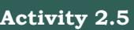

# **Chapter 2 Data Handling Using Pandas - I**

"If you don't think carefully, you might believe that programming is just typing statements in a programming language."

— W. Cunningham


## *In this chapter*

- » *Introduction to Python Libraries*
- » *Series*
- » *DataFrame*
- » *Importing and Exporting Data between CSV Files and DataFrames*
- » *Pandas Series Vs NumPy ndarray*

# **2.1 Introduction to Python Libraries**

Python libraries contain a collection of builtin modules that allow us to perform many actions without writing detailed programs for it. Each library in Python contains a large number of modules that one can import and use.

NumPy, Pandas and Matplotlib are three well-established Python libraries for scientific and analytical use. These libraries allow us to manipulate, transform and visualise data easily and efficiently.

NumPy, which stands for 'Numerical Python', is a library we discussed in class XI. Recall that, it is a package that can be used for numerical data analysis and

Chapter 2.indd 27 11/26/2020 12:32:46 PM

**Notes**

scientific computing. NumPy uses a multidimensional array object and has functions and tools for working with these arrays. Elements of an array stay together in memory, hence, they can be quickly accessed.

PANDAS (PANel DAta) is a high-level data manipulation tool used for analysing data. It is very easy to import and export data using Pandas library which has a very rich set of functions. It is built on packages like NumPy and Matplotlib and gives us a single, convenient place to do most of our data analysis and visualisation work. Pandas has three important data structures, namely – Series, DataFrame and Panel to make the process of analysing data organised, effective and efficient.

The Matplotlib library in Python is used for plotting graphs and visualisation. Using Matplotlib, with just a few lines of code we can generate publication quality plots, histograms, bar charts, scatterplots, etc. It is also built on Numpy, and is designed to work well with Numpy and Pandas.

You may think what the need for Pandas is when NumPy can be used for data analysis. Following are some of the differences between Pandas and Numpy:

- 1. A Numpy array requires homogeneous data, while a Pandas DataFrame can have different data types (float, int, string, datetime, etc.).
- 2. Pandas have a simpler interface for operations like file loading, plotting, selection, joining, GROUP BY, which come very handy in data-processing applications.
- 3. Pandas DataFrames (with column names) make it very easy to keep track of data.
- 4. Pandas is used when data is in Tabular Format, whereas Numpy is used for numeric array based data manipulation.

#### **2.1.1. Installing Pandas**

Installing Pandas is very similar to installing NumPy. To install Pandas from command line, we need to type in:

#### pip install pandas

Note that both NumPy and Pandas can be installed only when Python is already installed on that system. The same is true for other libraries of Python.

Chapter 2.indd 28 11/26/2020 12:32:46 PM

#### **2.1.2. Data Structure in Pandas**

A data structure is a collection of data values and operations that can be applied to that data. It enables efficient storage, retrieval and modification to the data. For example, we have already worked with a data structure ndarray in NumPy in Class XI. Recall the ease with which we can store, access and update data using a NumPy array. Two commonly used data structures in Pandas that we will cover in this book are:

- Series
- DataFrame

#### **2.2 Series**

A Series is a one-dimensional array containing a sequence of values of any data type (int, float, list, string, etc) which by default have numeric data labels starting from zero. The data label associated with a particular value is called its index. We can also assign values of other data types as index. We can imagine a Pandas Series as a column in a spreadsheet. Example of a series containing names of students is given below:

| Index | Value |
| --- | --- |
| 0 | Arnab |
| 1 | Samridhi |
| 2 | Ramit |
| 3 | Divyam |
| 4 | Kritika |

#### **2.2.1 Creation of Series**

There are different ways in which a series can be created in Pandas. To create or use series, we first need to import the Pandas library.

#### *(A) Creation of Series from Scalar Values*

A Series can be created using scalar values as shown in the example below:

```
>>> import pandas as pd #import Pandas with alias pd
>>> series1 = pd.Series([10,20,30]) #create a Series
>>> print(series1) #Display the series
```
Output:

0 10 1 20 2 30 dtype: int64

Chapter 2.indd 29 11/26/2020 12:32:46 PM

Observe that output is shown in two columns - the index is on the left and the data value is on the right. If we do not explicitly specify an index for the data values while creating a series, then by default indices range from 0 through N – 1. Here N is the number of data elements.

We can also assign user-defined labels to the index and use them to access elements of a Series. The following example has a numeric index in random order.

```
>>> series2 = pd.Series(["Kavi","Shyam","Ra
vi"], index=[3,5,1])
```
>>> print(series2) #Display the series

Output:

- 3 Kavi
- 5 Shyam

1 Ravi

dtype: object

Here, data values Kavi, Shyam and Ravi have index values 3, 5 and 1, respectively. We can also use letters or strings as indices, for example:

>>> series2 = pd.Series([2,3,4],index=["Feb","M ar","Apr"])

>>> print(series2) #Display the series

#### **Think and Reflect**

While importing Pandas, is it mandatory to always use pd as an alias name? What would happen if we give any other name?

Output:

| Feb | 2 |
| --- | --- |
| Mar | 3 |
| Apr | 4 |
| dtype: int64 |  |

Here, data values 2,3,4 have index values Feb, Mar and Apr, respectively.

#### *(B) Creation of Series from NumPy Arrays*

We can create a series from a one-dimensional (1D) NumPy array, as shown below:

>>> import numpy as np # import NumPy with alias np >>> import pandas as pd >>> array1 = np.array([1,2,3,4]) >>> series3 = pd.Series(array1)

>>> print(series3)

Output: 0 1 1 2 2 3 3 4 dtype: int32

**Activity 2.1**

Create a series having names of any five famous monuments of India and assign their States as index values.

Chapter 2.indd 30 11/26/2020 12:32:47 PM

The following example shows that we can use letters or strings as indices:

```
>>> series4 = pd.Series(array1, index = ["Jan", 
"Feb", "Mar", "Apr"])
>>> print(series4)
Jan 1
Feb 2
Mar 3
Apr 4
dtype: int32
```
When index labels are passed with the array, then the length of the index and array must be of the same size, else it will result in a ValueError. In the example shown below, array1 contains 4 values whereas there are only 3 indices, hence ValueError is displayed.

```
>>> series5 = pd.Series(array1, index = ["Jan", 
"Feb", "Mar"])
ValueError: Length of passed values is 4, index 
implies 3
```
### *(C) Creation of Series from Dictionary*

Recall that Python dictionary has key: value pairs and a value can be quickly retrieved when its key is known. Dictionary keys can be used to construct an index for a Series, as shown in the following example. Here, keys of the dictionary dict1 become indices in the series.

```
>>> dict1 = {'India': 'NewDelhi', 'UK': 
'London', 'Japan': 'Tokyo'}
>>> print(dict1) #Display the dictionary
{'India': 'NewDelhi', 'UK': 'London', 'Japan': 
'Tokyo'}
>>> series8 = pd.Series(dict1) 
>>> print(series8) #Display the series
India NewDelhi
UK London
Japan Tokyo
dtype: object
```
#### **2.2.2 Accessing Elements of a Series**

There are two common ways for accessing the elements of a series: Indexing and Slicing.

#### *(A) Indexing*

Indexing in Series is similar to that for NumPy arrays, and is used to access elements in a series. Indexes are of two types: positional index and labelled index. Positional index takes an integer value that corresponds to its position in the series starting from 0, whereas labelled index takes any user-defined label as index.

**Notes**

Chapter 2.indd 31 11/26/2020 12:32:47 PM


Write the statement to get NewDelhi as output using positional index.

- Following example shows usage of the positional index for accessing a value from a Series.
>>> seriesNum = pd.Series([10,20,30])

>>> seriesNum[2] 30

Here, the value 30 is displayed for the positional index 2.

When labels are specified, we can use labels as indices while selecting values from a Series, as shown below. Here, the value 3 is displayed for the labelled index Mar.

```
>>> seriesMnths = pd.Series([2,3,4],index=["Feb
","Mar","Apr"])
>>> seriesMnths["Mar"]
3
```
In the following example, value NewDelhi is displayed for the labelled index India.

```
>>> seriesCapCntry = pd.Series(['NewDelhi', 
 'WashingtonDC', 'London', 'Paris'],
```

```
index=['India', 'USA', 'UK', 'France'])
>>> seriesCapCntry['India']
'NewDelhi'
```
We can also access an element of the series using the positional index:

```
>>> seriesCapCntry[1]
'WashingtonDC'
```
More than one element of a series can be accessed using a list of positional integers or a list of index labels as shown in the following examples:

```
>>> seriesCapCntry[[3,2]]
France Paris
UK London
dtype: object
```
>>> seriesCapCntry[['UK','USA']] UK London USA WashingtonDC dtype: object

The index values associated with the series can be altered by assigning new index values as shown in the following example:

>>> seriesCapCntry.index=[10,20,30,40] >>> seriesCapCntry

Chapter 2.indd 32 11/26/2020 12:32:47 PM

10 NewDelhi 20 WashingtonDC 30 London 40 Paris dtype: object

#### *(B) Slicing*

Sometimes, we may need to extract a part of a series. This can be done through slicing. This is similar to slicing used with NumPy arrays. We can define which part of the series is to be sliced by specifying the start and end parameters [start :end] with the series name. When we use positional indices for slicing, the value at the endindex position is excluded, i.e., only (end start) number of data values of the series are extracted. Consider the following series seriesCapCntry:

```
>>> seriesCapCntry = pd.Series(['NewDelhi', 'WashingtonDC', 'London', 
'Paris'], index=['India', 'USA', 'UK', 'France'])
 >>> seriesCapCntry[1:3] #excludes the value at index position 3
USA WashingtonDC
UK London 
dtype: object
```
As we can see that in the above output, only data values at indices 1 and 2 are displayed. If labelled indexes are used for slicing, then value at the end index label is also included in the output, for example:

>>> seriesCapCntry['USA' : 'France']

USA WashingtonDC UK London France Paris dtype: object

We can also get the series in reverse order, for example:

```
>>> seriesCapCntry[ : : -1]
France Paris
UK London
USA WashingtonDC
India NewDelhi
dtype: object
```
Chapter 2.indd 33 11/26/2020 12:32:47 PM

**Notes**

We can also use slicing to modify the values of series elements as shown in the following example:

```
>>> import numpy as np
>>> seriesAlph = pd.Series(np.arange(10,16,1), 
index = ['a', 'b', 'c', 'd', 'e', 'f'])
>>> seriesAlph
a 10
b 11
c 12
d 13
e 14
f 15
dtype: int32
>>> seriesAlph[1:3] = 50 
>>> seriesAlph
a 10
b 50
c 50
d 13
e 14
f 15
dtype: int32
```
Observe that updating the values in a series using slicing also excludes the value at the end index position. But, it changes the value at the end index label when slicing is done using labels.

```
>>> seriesAlph['c':'e'] = 500
>>> seriesAlph
a 10
b 50
c 500
d 500
e 500
f 15
dtype: int32
```
#### **2.2.3 Attributes of Series**

We can access certain properties called attributes of a series by using that property with the series name. Table 2.1 lists some attributes of Pandas series usingseriesCapCntry as an example:

| >>> seriesCapCntry |  |
| --- | --- |
| India | NewDelhi |
| USA | WashingtonDC |
| UK | London |
| France | Paris |
| dtype: object |  |

Chapter 2.indd 34 11/26/2020 12:32:47 PM

| Attribute Name | Purpose | Example |
| --- | --- | --- |
| name | assigns a name to the Series | >>> seriesCapCntry.name = 'Capitals' |
|  |  | >>> print(seriesCapCntry) |
|  |  | India NewDelhi |
|  |  | USA WashingtonDC |
|  |  | UK London |
|  |  | France Paris |
|  |  | Name: Capitals, dtype: object |
| index.name | assigns a name to the index | >>>seriesCapCntry.index.name = |
|  | of the series | 'Countries' |
|  |  | >>> print(seriesCapCntry) |
|  |  | Countries |
|  |  | India NewDelhi |
|  |  | USA WashingtonDC |
|  |  | UK London |
|  |  | France Paris |
|  |  | Name: Capitals, dtype: object |
| values | prints a list of the values in | >>> print(seriesCapCntry.values) |
|  | the series | ['NewDelhi' 'WashingtonDC' 'London' |
|  |  | 'Paris'] |
| size | prints the number of values | >>> print(seriesCapCntry.size) |
|  | in the Series object | 4 |
| empty | prints True if the series is | >>> seriesCapCntry.empty |
|  | empty, and False otherwise | False |
|  |  | # Create an empty series |
|  |  | seriesEmpt=pd.Series() |
|  |  | >>> seriesEmpt.empty |
|  |  | True |

#### **Table 2.1 Attributes of Pandas Series**

#### **2.2.4 Methods of Series**

In this section, we are going to discuss some of the methods that are available for Pandas Series. Let us consider the following series:

```
>>> seriesTenTwenty=pd.Series(np.arange( 10, 
20, 1 ))
>>> print(seriesTenTwenty)
0 10
1 11
2 12
3 13
4 14
5 15
6 16
7 17
8 18
9 19
dtype: int32
```
**Activity 2.3**

- Consider the following code: >>>import pandas as pd >>>import numpy as np >>>s2=pd. Series([12,np.nan,10]) >>>print(s2)
Find output of the above code and write a Python statement to count and display only non null values in the above series.

Chapter 2.indd 35 11/26/2020 12:32:47 PM

| Method | Explanation | Example |
| --- | --- | --- |
| head(n) | Returns the first n members of the series. If | >>> seriesTenTwenty.head(2) |
|  | the value for n is not passed, then by default | 0 10 |
|  | n takes 5 and the first five members are | 1 11 |
|  | displayed. | dtype: int32 |
|  |  | >>> seriesTenTwenty.head() |
|  |  | 0 10 |
|  |  | 1 11 |
|  |  | 2 12 |
|  |  | 3 13 |
|  |  | 4 14 |
|  |  | dtype: int32 |
| count() | Returns the number of non-NaN values in | >>> seriesTenTwenty.count() |
|  | the Series | 10 |
| tail(n) | Returns the last n members of the series. If | >>> seriesTenTwenty.tail(2) |
|  | the value for n is not passed, then by default | 8 18 |
|  | n takes 5 and the last five members are | 9 19 |
|  | displayed. | dtype: int32 |
|  |  | >>> seriesTenTwenty.tail() |
|  |  | 5 15 |
|  |  | 6 16 |
|  |  | 7 17 |
|  |  | 8 18 |
|  |  | 9 19 |
|  |  | dtype: int32 |

#### **2.2.5 Mathematical Operations on Series**

We have learnt in Class XI that if we perform basic mathematical operations like addition, subtraction, multiplication, division, etc., on two NumPy arrays, the operation is done on each corresponding pair of elements. Similarly, we can perform mathematical operations on two series in Pandas.

While performing mathematical operations on series, index matching is implemented and all missing values are filled in with NaN by default.

Consider the following series: seriesA and seriesB for understanding mathematical operations on series in Pandas.

```
>>> seriesA = pd.Series([1,2,3,4,5], index = 
['a', 'b', 'c', 'd', 'e'])
>>> seriesA
a 1
b 2
c 3
d 4
e 5
dtype: int64
```
Chapter 2.indd 36 11/26/2020 12:32:47 PM

Chapter 2.indd 37 11/26/2020 12:32:47 PM

```
Data Handling Using Pandas - I 37
```

```
>>> seriesB = pd.Series([10,20,-10,-50,100], 
index = ['z', 'y', 'a', 'c', 'e'])
>>> seriesB
z 10
y 20
a -10
c -50
e 100
dtype: int64
```
#### *(A) Addition of two Series*

It can be done in two ways. In the first method, two series are simply added together, as shown in the following code. Table 2.2 shows the detailed values that were matched while performing the addition. Note here that the output of addition is NaN if one of the elements or both elements have no value.

|  | >>> seriesA + seriesB |
| --- | --- |
| a | -9.0 |
| b | NaN |
| c | -47.0 |
| d | NaN |
| e | 105.0 |
| y | NaN |
| z | NaN |
|  | dtype: float64 |

| index | value from seriesA | value from seriesB | seriesA + seriesB |
| --- | --- | --- | --- |
| a | 1 | -10 | -9.0 |
| b | 2 |  | NaN |
| c | 3 | -50 | -47.0 |
| d | 4 |  | NaN |
| e | 5 | 100 | 105.00 |
| y |  | 20 | NaN |
| z |  | 10 | NaN |

#### **Table 2.2 Details of addition of two series**

The second method is applied when we do not want to have NaN values in the output. We can use the series method add() and a parameter fill_value to replace missing value with a specified value. That is, calling seriesA.add(seriesB) is equivalent to calling seriesA+seriesB, but add() allows explicit specification of the fill value for any element in seriesA or seriesB that might be missing, as shown in Table 2.3.

**Notes**

# **Activity 2.4**

Draw two tables for subtraction similar to tables 2.2 and 2.3 showing the changes in the series elements and corresponding output without replacing the missing values, and after replacing the missing values with 1000.

>>> seriesA.add(seriesB, fill_value=0)

| a | -9.0 |
| --- | --- |
| b | 2.0 |
| c | -47.0 |
| d | 4.0 |
| e | 105.0 |
| y | 20.0 |
| z | 10.0 |
|  | dtype: float64 |

|
|  |

| index | value from seriesA | value from seriesB | seriesA + seriesB |
| --- | --- | --- | --- |
| a | 1 | -10 | -9.0 |
| b | 2 | 0 | 2.0 |
| c | 3 | -50 | -47.0 |
| d | 4 | 0 | 4.0 |
| e | 5 | 100 | 105.00 |
| y | 0 | 20 | 20.0 |
| z | 0 | 10 | 10.0 |

Note that Table 2.2 shows the changes in the series elements and corresponding output without replacing the missing values, while Table 2.3 shows the changes in the series elements and corresponding output after replacing missing values by 0. Just like addition, subtraction, multiplication and division can also be done using corresponding mathematical operators or explicitly calling of the appropriate method.

#### *(B) Subtraction of two Series*

Again, it can be done in two different ways, as shown in the following examples:

>>> seriesA – seriesB #using subtraction operator a 11.0 b NaN

```
c 53.0
d NaN
e -95.0
y NaN
z NaN
```
dtype: float64

Let us now replace the missing values with 1000 before subtracting seriesB from seriesA using explicit subtraction method sub().



Draw two tables for multiplication similar to Tables 2.2 and 2.3 showing the changes in the series elements and corresponding output without replacing the missing values, and after replacing the missing values with 0.

Chapter 2.indd 38 11/26/2020 12:32:47 PM

```
>>> seriesA.sub(seriesB, fill_value=1000)
# using fill value 1000 while making explicit
# call of the method"
a 11.0 
b -998.0
c 53.0
d -996.0
e -95.0
```
y 980.0

z 990.0

dtype: float64

#### *(C) Multiplication of two Series*

Again, it can be done in two different ways, as shown in the following examples:

>>>seriesA * seriesB #using multiplication operator

| a | -10.0 |
| --- | --- |
| b | NaN |
| c | -150.0 |
| d | NaN |
| e | 500.0 |
| y | NaN |
| z | NaN |
|  | dtype: float64 |

Let us now replace the missing values with 0 before multiplication of seriesB with seriesA using explicit multiplication method mul().

```
>>> seriesA.mul(seriesB, fill_value=0)
# using fill value 0 while making 
#explicit call of the method
a -10.0
b 0.0
c -150.0
d 0.0
e 500.0
y 0.0
z 0.0
dtype: float64
```
#### *(D) Division of two Series*

Again, it can be done in two different ways, as shown in the following examples:

>>> seriesA/seriesB # using division operator

- a -0.10
- b NaN
- c -0.06
- d NaN

#### **Activity 2.6**

Draw two tables for division similar to tables 2.2 and 2.3 showing the changes in the series elements and corresponding output without replacing the missing values, and after replacing the missing values with 0.

> Explicit call to a mathematical operation is preferred when series may have missing values and we want to replace it by a specific value to have a concrete output in place of NaN.

Chapter 2.indd 39 11/26/2020 12:32:47 PM

e 0.05 y NaN z NaN dtype: float64

Let us now replace the missing values with 0 before dividing seriesA by seriesB using explicit division method div().

# using fill value 0 while making explicit # call of the method

a -0.10 b inf c -0.06 d inf e 0.05 y 0.00 z 0.00 dtype: float64

#### **2.3 DataFrame**

Sometimes we need to work on multiple columns at a time, i.e., we need to process the tabular data. For example, the result of a class, items in a restaurant's menu, reservation chart of a train, etc. Pandas store such tabular data using a DataFrame. A DataFrame is a two-dimensional labelled data structure like a table of MySQL. It contains rows and columns, and therefore has both a row and column index. Each column can have a different type of value such as numeric, string, boolean, etc., as in tables of a database.

|  |  |  | Column Indexes |  |
| --- | --- | --- | --- | --- |
|  |  | State | Geographical Area (sq Km) | Area under Very Dense Forests (sq |
|  |  |  |  | Km) |
|  | 1 | Assam | 78438 | 2797 |
| w Indexes | 2 | Delhi | 1483 | 6.72 |
| Ro | 3 | Kerala | 38852 | 1663 |

#### **2.3.1 Creation of DataFrame**

There are a number of ways to create a DataFrame. Some of them are listed in this section.

#### *(A) Creation of an empty DataFrame*

An empty DataFrame can be created as follows:

Chapter 2.indd 40 11/26/2020 12:32:47 PM

```
>>> import pandas as pd
>>> dFrameEmt = pd.DataFrame()
>>> dFrameEmt
```

```
Empty DataFrame
Columns: []
Index: []
```
#### *(B) Creation of DataFrame from NumPy ndarrays*

Consider the following three NumPy ndarrays. Let us create a simple DataFrame without any column labels, using a single ndarray:

```
>>> import numpy as np
 >>> array1 = np.array([10,20,30])
 >>> array2 = np.array([100,200,300])
 >>> array3 = np.array([-10,-20,-30, -40])
 >>> dFrame4 = pd.DataFrame(array1)
 >>> dFrame4
  0
 0 10
 1 20
 2 30
  We can create a DataFrame using more than one 
ndarrays, as shown in the following example:
```

```
>>> dFrame5 = pd.DataFrame([array1, array3, 
array2], columns=[ 'A', 'B', 'C', 'D'])
>>> dFrame5
 A B C D
0 10 20 30 NaN
1 -10 -20 -30 -40.0
2 100 200 300 NaN
```
#### *(C) Creation of DataFrame from List of Dictionaries*

We can create DataFrame from a list of Dictionaries, for example:

```
# Create list of dictionaries
>>> listDict = [{'a':10, 'b':20}, {'a':5, 
'b':10, 'c':20}]
```

```
>>> dFrameListDict = pd.DataFrame(listDict)
>>> dFrameListDict
 a b c
0 10 20 NaN
```
1 5 10 20.0

Here, the dictionary keys are taken as column labels, and the values corresponding to each key are taken as rows. There will be as many rows as the number of dictionaries present in the list. In the above example there are two dictionaries in the list. So, the DataFrame consists of two rows. Number of columns

#### **Think and Reflect**

What would happen if we pass 3 columns or 5 columns instead of 4 in the above code? What is the reason?

Chapter 2.indd 41 11/26/2020 12:32:47 PM

in a DataFrame is equal to the maximum number of keys in any dictionary of the list. Hence, there are three columns as the second dictionary has three elements. Also, note that NaN (Not a Number) is inserted if a corresponding value for a column is missing.

*(D) Creation of DataFrame from Dictionary of Lists* DataFrames can also be created from a dictionary of lists. Consider the following dictionary consisting of the keys 'State', 'GArea' (geographical area) and 'VDF' (very dense forest) and the corresponding values as list.

>>> dictForest = {'State': ['Assam', 'Delhi', 'Kerala'],

 'GArea': [78438, 1483, 38852] , 'VDF' : [2797, 6.72,1663]} >>> dFrameForest= pd.DataFrame(dictForest)

>>> dFrameForest

|  | State | GArea | VDF |
| --- | --- | --- | --- |
| 0 | Assam | 78438 | 2797.00 |
| 1 | Delhi | 1483 | 6.72 |
| 2 | Kerala | 38852 | 1663.00 |

Note that dictionary keys become column labels by default in a DataFrame, and the lists become the rows. Thus, a DataFrame can be thought of as a dictionary of lists or a dictionary of series.

We can change the sequence of columns in a DataFrame. This can be done by assigning a particular sequence of the dictionary keys as columns parameter, for example:

```
>>> dFrameForest1 = pd.DataFrame(dictForest, 
columns = ['State','VDF', 'GArea'])
>>> dFrameForest1
 State VDF GArea
0 Assam 2797.00 78438
1 Delhi 6.72 1483
2 Kerala 1663.00 38852
```
In the output, VDF is now displayed as the middle column instead of last.

*(E) Creation of DataFrame from Series*

Consider the following three Series:

seriesA = pd.Series([1,2,3,4,5], index = ['a', 'b', 'c', 'd', 'e']) seriesB = pd.Series ([1000,2000,-1000,-5000,1000], index = ['a', 'b', 'c', 'd', 'e'])

Chapter 2.indd 42 11/26/2020 12:32:47 PM

seriesC = pd.Series([10,20,-10,-50,100], index = ['z', 'y', 'a', 'c', 'e'])

We can create a DataFrame using a single series as shown below:

```
>>> dFrame6 = pd.DataFrame(seriesA)
>>> dFrame6
 0
a 1
b 2
c 3
d 4
e 5
```
Here, the DataFrame dFrame6 has as many numbers of rows as the numbers of elements in the series, but has only one column. To create a DataFrame using more than one series, we need to pass multiple series in the list as shown below:

>>> dFrame7 = pd.DataFrame([seriesA, seriesB]) >>> dFrame7 a b c d e 0 1 2 3 4 5 1 1000 2000 -1000 -5000 1000

Observe that the labels in the series object become the column names in the DataFrame object and each series becomes a row in the DataFrame. Now look at the following example:

| >>> dFrame8 = pd.DataFrame([seriesA, seriesC]) |  |  |  |  |  |  |  |
| --- | --- | --- | --- | --- | --- | --- | --- |
| >>> dFrame8 |  |  |  |  |  |  |  |
| a | b | c | d | e | z | y |  |
| 0 | 1.0 | 2.0 | 3.0 | 4.0 | 5.0 | NaN | NaN |
| 1 -10.0 |  | NaN -50.0 |  | NaN | 100.0 | 10.0 | 20.0 |

Here, different series do not have the same set of labels. But, the number of columns in a DataFrame equals to distinct labels in all the series. So, if a particular series does not have a corresponding value for a label, NaN is inserted in the DataFrame column.

*(F) Creation of DataFrame from Dictionary of Series* A dictionary of series can also be used to create a DataFrame. For example, ResultSheet is a dictionary of series containing marks of 5 students in three subjects. The names of the students are the keys to the dictionary, and the index values of the series are the subject names as shown below:

Chapter 2.indd 43 11/26/2020 12:32:47 PM


Use the type function to check the datatypes of ResultSheet and ResultDF. Are they the same?

>>> ResultSheet={ 'Arnab': pd.Series([90, 91, 97], index=['Maths','Science','Hindi']), 'Ramit': pd.Series([92, 81, 96], index=['Maths','Science','Hindi']), 'Samridhi': pd.Series([89, 91, 88], index=['Maths','Science','Hindi']), 'Riya': pd.Series([81, 71, 67], index=['Maths','Science','Hindi']), 'Mallika': pd.Series([94, 95, 99], index=['Maths','Science','Hindi'])} >>> ResultDF = pd.DataFrame(ResultSheet) >>> ResultDF Arnab Ramit Samridhi Riya Mallika Maths 90 92 89 81 94 Science 91 81 91 71 95 Hindi 97 96 88 67 99

The following output shows that every column in the DataFrame is a Series:

>>> type(ResultDF.Arnab) <class 'pandas.core.series.Series'>

When a DataFrame is created from a Dictionary of Series, the resulting index or row labels are a union of all series indexes used to create the DataFrame. For example:

```
dictForUnion = { 'Series1' : 
pd.Series([1,2,3,4,5],
 index = ['a', 'b', 'c', 'd', 'e']) ,
    'Series2' : 
pd.Series([10,20,-10,-50,100],
 index = ['z', 'y', 'a', 'c', 'e']),
    'Series3' : 
pd.Series([10,20,-10,-50,100],
 index = ['z', 'y', 'a', 'c', 'e']) }
>>> dFrameUnion = pd.DataFrame(dictForUnion)
>>> dFrameUnion
```

|  | Series1 | Series2 | Series3 |
| --- | --- | --- | --- |
| a | 1.0 | -10.0 | -10.0 |
| b | 2.0 | NaN | NaN |
| c | 3.0 | -50.0 | -50.0 |
| d | 4.0 | NaN | NaN |
| e | 5.0 | 100.0 | 100.0 |
| y | NaN | 20.0 | 20.0 |
| z | NaN | 10.0 | 10.0 |

#### **2.3.2 Operations on rows and columns in DataFrames**

We can perform some basic operations on rows and columns of a DataFrame like selection, deletion, addition, and renaming, as discussed in this section.

Chapter 2.indd 44 11/26/2020 12:32:47 PM

#### *(A) Adding a New Column to a DataFrame*

We can easily add a new column to a DataFrame. Let us consider the DataFrame ResultDF defined earlier. In order to add a new column for another student 'Preeti', we can write the following statement:

```
>>> ResultDF['Preeti']=[89,78,76]
>>> ResultDF
```

|  | Arnab | Ramit | Samridhi | Riya | Mallika Preeti |  |
| --- | --- | --- | --- | --- | --- | --- |
| Maths | 90 | 92 | 89 | 81 | 94 | 89 |
| Science | 91 | 81 | 91 | 71 | 95 | 78 |
| Hindi | 97 | 96 | 88 | 67 | 99 | 76 |

Assigning values to a new column label that does not exist will create a new column at the end. If the column already exists in the DataFrame then the assignment statement will update the values of the already existing column, for example:

| >>> ResultDF['Ramit']=[99, 98, 78] |  |  |  |  |  |  |
| --- | --- | --- | --- | --- | --- | --- |
| >>> ResultDF |  |  |  |  |  |  |
| Arnab |  | Ramit | Samridhi | Riya | Mallika Preeti |  |
| Maths | 90 | 99 | 89 | 81 | 94 | 89 |
| Science | 91 | 98 | 91 | 71 | 95 | 78 |
| Hindi | 97 | 78 | 88 | 67 | 99 | 76 |

We can also change data of an entire column to a particular value in a DataFrame. For example, the following statement sets marks=90 for all subjects for the column name 'Arnab':

>>> ResultDF['Arnab']=90 >>> ResultDF

|  | Arnab | Ramit | Samridhi | Riya | Mallika Preeti |  |
| --- | --- | --- | --- | --- | --- | --- |
| Maths | 90 | 99 | 89 | 81 | 94 | 89 |
| Science | 90 | 98 | 91 | 71 | 95 | 78 |
| Hindi | 90 | 78 | 88 | 67 | 99 | 76 |

#### *(B) Adding a New Row to a DataFrame*

We can add a new row to a DataFrame using the DataFrame.loc[ ] method. Consider the DataFrame ResultDF that has three rows for the three subjects – Maths, Science and Hindi. Suppose, we need to add the marks for English subject in ResultDF, we can use the following statement:

| >>> ResultDF |  |  |  |  |  |  |
| --- | --- | --- | --- | --- | --- | --- |
| Arnab |  | Ramit | Samridhi | Riya | Mallika | Preeti |
| Maths | 90 | 92 | 89 | 81 | 94 | 89 |
| Science | 91 | 81 | 91 | 71 | 95 | 78 |
| Hindi | 97 | 96 | 88 | 67 | 99 | 76 |

Chapter 2.indd 45 11/26/2020 12:32:47 PM

|  |  |  | >>> ResultDF.loc['English'] = [85, 86, 83, 80, 90, 89] |  |  |  |
| --- | --- | --- | --- | --- | --- | --- |
| >>> ResultDF |  |  |  |  |  |  |
| Arnab |  | Ramit | Samridhi | Riya | Mallika | Preeti |
| Maths | 90 | 92 | 89 | 81 | 94 | 89 |
| Science | 91 | 81 | 91 | 71 | 95 | 78 |
| Hindi | 97 | 96 | 88 | 67 | 99 | 76 |
| English | 85 | 86 | 83 | 80 | 90 | 89 |

We cannot use this method to add a row of data with already existing (duplicate) index value (label). In such case, a row with this index label will be updated, for example:

>>> ResultDF.loc['English'] = [95, 86, 95, 80, 95,99] >>> ResultDF

|  | Arnab | Ramit | Samridhi | Riya | Mallika | Preeti |
| --- | --- | --- | --- | --- | --- | --- |
| Maths | 90 | 92 | 89 | 81 | 94 | 89 |
| Science | 91 | 81 | 91 | 71 | 95 | 78 |
| Hindi | 97 | 96 | 88 | 67 | 99 | 76 |
| English | 95 | 86 | 95 | 80 | 95 | 99 |

DataFRame.loc[] method can also be used to change the data values of a row to a particular value. For example, the following statement sets marks in 'Maths' for all columns to 0:

>>> ResultDF.loc['Maths']=0 >>> ResultDF

|  | Arnab | Ramit | Samridhi | Riya | Mallika | Preeti |
| --- | --- | --- | --- | --- | --- | --- |
| Maths | 0 | 0 | 0 | 0 | 0 | 0 |
| Science | 91 | 81 | 91 | 71 | 95 | 78 |
| Hindi | 97 | 96 | 88 | 67 | 99 | 76 |
| English | 95 | 86 | 95 | 80 | 95 | 99 |

#### **Think and Reflect**

Can you write a program to count the number of rows and columns in a DataFrame?

If we try to add a row with lesser values than the number of columns in the DataFrame, it results in a ValueError, with the error message: ValueError: Cannot set a row with mismatched columns.

Similarly, if we try to add a column with lesser values than the number of rows in the DataFrame, it results in a ValueError, with the error message: ValueError: Length of values does not match length of index.

Further, we can set all values of a DataFrame to a particular value, for example:

>>> ResultDF[: ] = 0 # Set all values in ResultDF to 0 >>> ResultDF

|  | Arnab | Ramit | Samridhi | Riya | Mallika | Preeti |
| --- | --- | --- | --- | --- | --- | --- |
| Maths | 0 | 0 | 0 | 0 | 0 | 0 |
| Science | 0 | 0 | 0 | 0 | 0 | 0 |
| Hindi | 0 | 0 | 0 | 0 | 0 | 0 |
| English | 0 | 0 | 0 | 0 | 0 | 0 |

Chapter 2.indd 46 11/26/2020 12:32:47 PM

#### *(C) Deleting Rows or Columns from a DataFrame*

We can use the DataFrame.drop() method to delete rows and columns from a DataFrame. We need to specify the names of the labels to be dropped and the axis from which they need to be dropped. To delete a row, the parameter axis is assigned the value 0 and for deleting a column,the parameter axis is assigned the value 1. Consider the following DataFrame:

| >>> ResultDF |
| --- |

|  | Arnab | Ramit | Samridhi | Riya Mallika |  |
| --- | --- | --- | --- | --- | --- |
| Maths | 90 | 92 | 89 | 81 | 94 |
| Science | 91 | 81 | 91 | 71 | 95 |
| Hindi | 97 | 96 | 88 | 67 | 99 |
| English | 95 | 86 | 95 | 80 | 95 |

 The following example shows how to delete the row with label 'Science':

| >>> ResultDF = ResultDF.drop('Science', axis=0) |  |  |  |  |  |
| --- | --- | --- | --- | --- | --- |
| >>> ResultDF |  |  |  |  |  |
| Riya Mallika | Arnab | Ramit | Samridhi |  |  |
| Maths | 90 | 92 | 89 | 81 | 94 |

| Maths | 90 | 92 | 89 | 81 | 94 |
| --- | --- | --- | --- | --- | --- |
| Hindi | 97 | 96 | 88 | 67 | 99 |
| English | 95 | 86 | 95 | 80 | 95 |

The following example shows how to delete the columns having labels 'Samridhi', 'Ramit' and 'Riya':

| >>> ResultDF = ResultDF.drop(['Samridhi','Rami |  |  |
| --- | --- | --- |
| t','Riya'], axis=1) |  |  |
| >>> ResultDF |  |  |
| Arnab |  | Mallika |
| Maths | 90 | 94 |
| Hindi | 97 | 99 |
| English | 95 | 95 |

 If the DataFrame has more than one row with the same label, the DataFrame.drop() method will delete all the matching rows from it. For example, consider the following DataFrame:

>>> ResultDF

|  | Arnab | Ramit | Samridhi | Riya | Mallika |
| --- | --- | --- | --- | --- | --- |
| Maths | 90 | 92 | 89 | 81 | 94 |
| Science | 91 | 81 | 91 | 71 | 95 |
| Hindi | 97 | 96 | 88 | 67 | 99 |
| Hindi | 97 | 89 | 78 | 60 | 45 |

To remove the duplicate rows labelled 'Hindi', we need to write the following statement:

 >>> ResultDF= ResultDF.drop('Hindi', axis=0) >>> ResultDF

Chapter 2.indd 47 11/26/2020 12:32:47 PM

|  | Arnab | Ramit | Samridhi | Riya | Mallika |
| --- | --- | --- | --- | --- | --- |
| Maths | 90 | 92 | 89 | 81 | 94 |
| Science | 91 | 81 | 91 | 71 | 95 |

#### *(D) Renaming Row Labels of a DataFrame*

We can change the labels of rows and columns in a DataFrame using the DataFrame.rename() method. Consider the following DataFrame. To rename the row indices Maths to sub1, Science to sub2, Hindi to sub3 and English to sub4 we can write the following statement:

| >>> ResultDF |  |  |  |  |  |
| --- | --- | --- | --- | --- | --- |
|  | Arnab | Ramit | Samridhi | Riya | Mallika |
| Maths | 90 | 92 | 89 | 81 | 94 |
| Science | 91 | 81 | 91 | 71 | 95 |
| English | 97 | 96 | 88 | 67 | 99 |
| Hindi | 97 | 89 | 78 | 60 | 45 |

>>> ResultDF=ResultDF.rename({'Maths':'Sub1', 'Science':'Sub2','English':'Sub3', 'Hindi':'Sub4'}, axis='index') >>> print(ResultDF)

|  | Arnab | Ramit | Samridhi | Riya | Mallika |
| --- | --- | --- | --- | --- | --- |
| Sub1 | 90 | 92 | 89 | 81 | 94 |
| Sub2 | 91 | 81 | 91 | 71 | 95 |
| Sub3 | 97 | 96 | 88 | 67 | 99 |
| Sub4 | 97 | 89 | 78 | 60 | 45 |

 The parameter axis='index' is used to specify that the row label is to be changed. If no new label is passed corresponding to an existing label, the existing row label is left as it is, for example:

>>> ResultDF=ResultDF.rename({'Maths':'Sub1','S cience':'Sub2','Hindi':'Sub4'}, axis='index') >>> print(ResultDF)

|  | Arnab | Ramit | Samridhi | Riya | Mallika |
| --- | --- | --- | --- | --- | --- |
| Sub1 | 90 | 92 | 89 | 81 | 94 |
| Sub2 | 91 | 81 | 91 | 71 | 95 |
| English | 97 | 96 | 88 | 67 | 99 |
| Sub4 | 97 | 89 | 78 | 60 | 45 |

#### *(E) Renaming Column Labels of a DataFrame*

To alter the column names of ResultDF we can again use the rename() method, as shown below. The parameter axis='columns' implies we want to change the column labels:

 >>> ResultDF=ResultDF.rename({'Arnab':'Student1','Ramit':'Student2',' Samridhi':'Student3','Mallika':'Student4'},axis='columns') >>> print(RsultDF)

#### **Think and Reflect**

What if in the rename function we pass a value for a row label that does not exist?

Chapter 2.indd 48 11/26/2020 12:32:47 PM

|  | Student1 | Student2 | Student3 | Riya | Student4 |
| --- | --- | --- | --- | --- | --- |
| Maths | 90 | 92 | 89 | 81 | 94 |
| Science | 91 | 81 | 91 | 71 | 95 |
| English | 97 | 96 | 88 | 67 | 99 |
| Hindi | 97 | 89 | 78 | 60 | 45 |

Note that the column Riya remains unchanged since we did not pass any new label.

#### **2.3.3 Accessing DataFrames Element through Indexing**

Data elements in a DataFrame can be accessed using indexing.There are two ways of indexing Dataframes : Label based indexing and Boolean Indexing.

#### *(A) Label Based Indexing*

There are several methods in Pandas to implement label based indexing. DataFrame.loc[ ] is an important method that is used for label based indexing with DataFrames. Let us continue to use the ResultDF created earlier. As shown in the following example, a single row label returns the row as a Series.

| >>> ResultDF |  |  |  |  |  |
| --- | --- | --- | --- | --- | --- |
| Arnab |  | Ramit | Samridhi | Riya | Mallika |
| Maths | 90 | 92 | 89 | 81 | 94 |
| Science | 91 | 81 | 91 | 71 | 95 |
| Hindi | 97 | 96 | 88 | 67 | 99 |

>>> ResultDF.loc['Science']

| Arnab | 91 |
| --- | --- |
| Ramit | 81 |
| Samridhi | 91 |
| Riya | 71 |
| Mallika | 95 |
| Name: Science, dtype: int64 |  |

Also, note that when the row label is passed as an integer value, it is interpreted as a label of the index and not as an integer position along the index, for example:

>>> dFrame10Multiples = pd.DataFrame([10,20,30,40,50])

```
>>> dFrame10Multiples.loc[2]
```
0 30

Name: 2, dtype: int64

When a single column label is passed, it returns the column as a Series.

```
>>> ResultDF.loc[:,'Arnab']
```
#### **Think and Reflect**

What would happen if the label or row index passed is not present in the DataFrame?

Chapter 2.indd 49 11/26/2020 12:32:47 PM

**Notes**

Maths 90 Science 91 Hindi 97 Name: Arnab, dtype: int64

Also, we can obtain the same result that is the marks of 'Arnab' in all the subjects by using the command:

>>> print(df['Arnab'])

Maths 56 Science 91 English 97 Hindi 97 Name: Arnab, dtype: int64

To read more than one row from a DataFrame, a list of row labels is used as shown below. Note that using [[]] returns a DataFrame.

>>> ResultDF.loc[['Science', 'Hindi']]

|  | Arnab | Ramit | Samridhi | Riya | Mallika |
| --- | --- | --- | --- | --- | --- |
| Science | 91 | 81 | 91 | 71 | 95 |
| Hindi | 97 | 96 | 88 | 67 | 99 |

#### *(B) Boolean Indexing*

Boolean means a binary variable that can represent either of the two states - True (indicated by 1) or False (indicated by 0). In Boolean indexing, we can select the subsets of data based on the actual values in the DataFrame rather than their row/column labels. Thus, we can use conditions on column names to filter data values. Consider the DataFrame ResultDF, the following statement displays True or False depending on whether the data value satisfies the given condition or not.

>>> ResultDF.loc['Maths'] > 90 Arnab False Ramit True Samridhi False Riya False Mallika True Name: Maths, dtype: bool

To check in which subjects 'Arnab' has scored more than 90, we can write:

>>> ResultDF.loc[:,'Arnab']>90 Maths False Science True Hindi True Name: Arnab, dtype: bool

#### **2.3.4 Accessing DataFrames Element through Slicing**

We can use slicing to select a subset of rows and/or columns from a DataFrame. To retrieve a set of rows,

Chapter 2.indd 50 11/26/2020 12:32:47 PM

slicing can be used with row labels. For example:

| >>> ResultDF.loc['Maths': 'Science'] |  |  |  |  |  |
| --- | --- | --- | --- | --- | --- |
| Arnab |  | Ramit | Samridhi | Riya | Mallika |
| Maths | 90 | 92 | 89 | 81 | 94 |
| Science | 91 | 81 | 91 | 71 | 95 |

Here, the rows with labels Maths and Science are displayed. Note that in DataFrames slicing is inclusive of the end values. We may use a slice of labels with a column name to access values of those rows in that column only. For example, the following statement displays the rows with label Maths and Science, and column with label Arnab:

| >>> ResultDF.loc['Maths': 'Science', 'Arnab'] |  |
| --- | --- |
| Maths | 90 |
| Science | 91 |
| Name: Arnab, dtype: int64 |  |

We may use a slice of labels with a slice of column names to access values of those rows and columns:

|  |  | >>> ResultDF.loc['Maths': 'Science', 'Arnab':'Samridhi'] |  |
| --- | --- | --- | --- |
|  | Arnab | Ramit | Samridhi |
| Maths | 90 | 92 | 89 |
| Science | 91 | 81 | 91 |

Alternatively, we may use a slice of labels with a list of column names to access values of those rows and columns:

| >>> ResultDF.loc['Maths': 'Science',['Arnab','Samridhi']] |  |  |
| --- | --- | --- |
| Arnab |  | Samridhi |
| Maths | 90 | 89 |
| Science | 91 | 91 |

#### *Filtering Rows in DataFrames*

In DataFrames, Boolean values like True (1) and False (0) can be associated with indices. They can also be used to filter the records using the DataFrmae.loc[] method.

In order to select or omit particular row(s), we can use a Boolean list specifying 'True' for the rows to be shown and 'False' for the ones to be omitted in the output. For example, in the following statement, row having index as Science is omitted:

| >>> ResultDF.loc[[True, False, True]] |  |  |  |  |  |
| --- | --- | --- | --- | --- | --- |
| Arnab |  | Ramit | Samridhi | Riya | Mallika |
| Maths | 90 | 92 | 89 | 81 | 94 |
| Hindi | 97 | 96 | 88 | 67 | 99 |


- a) Using the DataFrame ResultDF, write the statement to access Marks of Arnab in Maths.
- b) Create a DataFrame having 5 rows and write the statement to get the first 4 rows of it.

Chapter 2.indd 51 11/26/2020 12:32:47 PM

**Notes**

#### **2.3.5 Joining, Merging and Concatenation of DataFrames**

#### *(A) Joining*

We can use the pandas.DataFrame.append() method to merge two DataFrames. It appends rowsof the second DataFrame at the end of the first DataFrame. Columns not present in the first DataFrame are added as new columns. For example, consider the two DataFrames dFrame1 and dFrame2described below. Let us use theappend() method to append dFrame2 to dFrame1:

```
>>> dFrame1=pd.DataFrame([[1, 2, 3], [4, 5], 
 [6]], columns=['C1', 'C2', 'C3'], index=['R1', 
 'R2', 'R3'])
 >>> dFrame1
  C1 C2 C3
 R1 1 2.0 3.0
 R2 4 5.0 NaN
 R3 6 NaN NaN
 >>> dFrame2=pd.DataFrame([[10, 20], [30], [40, 
 50]], columns=['C2', 'C5'], index=['R4', 'R2', 
 'R5'])
 >>> dFrame2
  C2 C5
 R4 10 20.0
 R2 30 NaN
 R5 40 50.0
 >>> dFrame1=dFrame1.append(dFrame2)
 >>> dFrame1
  C1 C2 C3 C5
 R1 1.0 2.0 3.0 NaN
 R2 4.0 5.0 NaN NaN
 R3 6.0 NaN NaN NaN
 R4 NaN 10.0 NaN 20.0
 R2 NaN 30.0 NaN NaN
 R5 NaN 40.0 NaN 50.0
   Alternatively, if we append dFrame1 to dFrame2, the 
rows of dFrame2 precede the rows of dFrame1. To get 
the column labels appear in sorted order we can set the 
parameter sort=True. The column labels shall appear in 
unsorted order when the parameter sort = False.
```
# append dFrame1 to dFrame2 >>> dFrame2 =dFrame2.append(dFrame1, sort='True') >>> dFrame2 C1 C2 C3 C5 R4 NaN 10.0 NaN 20.0 R2 NaN 30.0 NaN NaN

Chapter 2.indd 52 11/26/2020 12:32:47 PM

```
R5 NaN 40.0 NaN 50.0
R1 1.0 2.0 3.0 NaN
R2 4.0 5.0 NaN NaN
R3 6.0 NaN NaN NaN
# append dFrame1 to dFrame2 with sort=False 
>>> dFrame2 = dFrame2.append(dFrame1, 
sort='False')
>>> dFrame2
 C2 C5 C1 C3
R4 10.0 20.0 NaN NaN
R2 30.0 NaN NaN NaN
R5 40.0 50.0 NaN NaN
R1 2.0 NaN 1.0 3.0
R2 5.0 NaN 4.0 NaN
R3 NaN NaN 6.0 NaN
```
The parameter verify_integrity of append()method may be set to True when we want to raise an error if the row labels are duplicate. By default, verify_integrity = False. That is why we could append the duplicate row with label R2 when appending the two DataFrames, as shown above.

The parameter ignore_index of append()method may be set to True, when we do not want to use row index labels. By default, ignore_index = False.

```
>>> dFrame1 = dFrame1.append(dFrame2, ignore_
index=True)
>>> dFrame1
 C1 C2 C3 C5
0 1.0 2.0 3.0 NaN
1 4.0 5.0 NaN NaN
2 6.0 NaN NaN NaN
3 NaN 10.0 NaN 20.0
4 NaN 30.0 NaN NaN
```
- 5 NaN 40.0 NaN 50.0
 The append()method can also be used to append a series or a dictionary to a DataFrame.

#### **2.3.6 Attributes of DataFrames**

Like Series, we can access certain properties called attributes of a DataFrame by using that property with the DataFrame name. Table 2.4 lists some attributes of Pandas DataFrame. We are going to use a part of the data from a report called "STATE OF FOREST REPORT 2017", Published by Forest Survey of India, accessible at http://fsi.nic.in/forest-report-2017, as our example data in this section.

As per this report, the geographical area, the area under very dense forests, the area under moderately

#### **Think and Reflect**

How can you check whether a given DataFrame has any missing value or not?

Chapter 2.indd 53 11/26/2020 12:32:47 PM

dense forests, and the area under open forests (all in sq km), in three States of India - Assam, Delhi and Kerala are as shown in the following DataFrame ForestAreaDF:

| >>> ForestArea = { |  |  |  |
| --- | --- | --- | --- |
| 'Assam' :pd.Series([78438, 2797, |  |  |  |
| 10192, 15116], | index = ['GeoArea', 'VeryDense', |  |  |
| 'ModeratelyDense', 'OpenForest']), |  |  |  |
| 'Kerala' :pd.Series([ 38852, 1663, |  |  |  |
| 9407, 9251], | index = ['GeoArea' ,'VeryDense', |  |  |
| 'ModeratelyDense', 'OpenForest']), |  |  |  |
| 'Delhi' :pd.Series([1483, 6.72, 56.24, |  |  |  |
| 129.45], index = ['GeoArea', 'VeryDense', |  |  |  |
| 'ModeratelyDense', 'OpenForest'])} |  |  |  |
| >>> ForestAreaDF = pd.DataFrame(ForestArea) |  |  |  |
| >>> ForestAreaDF |  |  |  |
| Assam |  | Kerala | Delhi |
| GeoArea 78438 |  | 38852 | 1483.00 |
| VeryDense 2797 |  | 1663 | 6.72 |
| ModeratelyDense 10192 |  | 9407 | 56.24 |
| OpenForest 15116 |  | 9251 | 129.45 |

| Table 2.4 |
| --- |
| Some Attributes of Pandas DataFrame |

| Attribute Name | Purpose | Example |
| --- | --- | --- |
| DataFrame.index | to display row | >>> ForestAreaDF.index |
|  | labels | Index(['GeoArea', 'VeryDense', |
|  |  | 'ModeratelyDense', 'OpenForest'], dtype |
|  |  | ='object') |
| DataFrame.columns | to display column | >>> ForestAreaDF.columns |
|  | labels | Index(['Assam', 'Kerala', 'Delhi'], |
|  |  | dtype='object') |
| DataFrame.dtypes | to display data | >>> ForestAreaDF.dtypes |
|  | type of each | Assam int64 |
|  | column in the | Kerala int64 |
|  | DataFrame | Delhi float64 |
|  |  | dtype: object |
| DataFrame.values | to display a NumPy | >>> ForestAreaDF.values |
|  | ndarray having | array([[7.8438e+04, 3.8852e+04, 1.4830e+03], |
|  | all the values in | [2.7970e+03, 1.6630e+03, 6.7200e+00], |
|  | the DataFrame, | [1.0192e+04, 9.4070e+03, 5.6240e+01], |
|  | without the axes | [1.5116e+04, 9.2510e+03, |
|  |  | 1.2945e+02]]) |
|  | labels |  |
| DataFrame.shape | to display a tuple | >>> ForestAreaDF.shape |
|  | representing the | (4, 3) |
|  | dimensionality of | It means ForestAreaDF has 4 rows and 3 |
|  | the DataFrame | columns. |
| DataFrame.size | to display a tuple | >>> ForestAreaDF.size |
|  | representing the 12 |  |
|  | dimensionality of | This means the ForestAreaDF has 12 values in |
|  | it. the DataFrame |  |

Chapter 2.indd 54 11/26/2020 12:32:47 PM

| DataFrame.T | to transpose | >>> ForestAreaDF.T |  |  |  |
| --- | --- | --- | --- | --- | --- |
|  | the DataFrame. | GeoArea VeryDense ModeratelyDense OpenForest |  |  |  |
|  | Means, row indices | Assam 78438.0 2797.00 10192.00 15116.00 |  |  |  |
|  | and column labels | Kerala38852.0 1663.00 9407.00 |  |  | 9251.00 |
|  |  | Delhi 1483.0 56.24 129.45 | 6.72 |  |  |
|  | of the DataFrame |  |  |  |  |
|  | replace each |  |  |  |  |
|  | other's position |  |  |  |  |
| DataFrame.head(n) | to display the | >>> ForestAreaDF.head(2) |  |  |  |
|  | first n rows in the | Assam Kerala |  | Delhi |  |
|  | DataFrame | GeoArea 38852 1483.00 | 78438 |  |  |
|  |  | VeryDense 1663 | 2797 | 6.72 |  |
|  |  | displays the first 2 rows of the DataFrame |  |  |  |
|  |  | ForestAreaDF.If the parameter n is not |  |  |  |
|  |  | specified by default it gives the first 5 rows |  |  |  |
|  |  | of the DataFrame. |  |  |  |
| DataFrame.tail(n) | to display the | >>> ForestAreaDF.tail(2) |  |  |  |
|  | last n rows in the | Assam Kerala |  | Delhi |  |
|  | DataFrame | ModeratelyDense 10192 9407 |  | 56.24 |  |
|  |  | OpenForest 9251 129.45 | 15116 |  |  |
|  |  | displays the last 2 rows of the DataFrame |  |  |  |
|  |  | ForestAreaDF.If the parameter n is not |  |  |  |
|  |  | specified by default it gives the last 5 rows |  |  |  |
|  |  | of the DataFrame. |  |  |  |
|  | to returns the | >>> ForestAreaDF.empty |  |  |  |
|  | value True if | False |  |  |  |
|  | DataFrame is | >>> df=pd.DataFrame() #Create an empty dataFrame |  |  |  |
|  | empty and False | >>> df.empty |  |  |  |
|  | otherwise | True |  |  |  |

## **2.4 Importing and Exporting Data between CSV Files and DataFrames**

We can create a DataFrame by importing data from CSV files where values are separated by commas. Similarly, we can also store or export data in a DataFrame as a .csv file.

#### **2.4.1 Importing a CSV file to a DataFrame**

Let us assume that we have the following data in a csv file named ResultData.csv stored in the folder C:/NCERT. In order to practice the code while we progress, you are suggested to create this csv file using a spreadsheet and save in your computer.

| RollNo | Name | Eco | Maths |
| --- | --- | --- | --- |
| 1 | Arnab | 18 | 57 |
| 2 | Kritika | 23 | 45 |
| 3 | Divyam | 51 | 37 |
| 4 | Vivaan | 40 | 60 |
| 5 | Aaroosh | 18 | 27 |

Chapter 2.indd 55 11/26/2020 12:32:48 PM

**Notes**

We can load the data from the ResultData.csv file into a DataFrame, say marks using Pandas read_csv() function as shown below:

>>> marks = pd.read_csv("C:/NCERT/ResultData. csv",sep =",", header=0) >>> marks RollNo Name Eco Maths 0 1 Arnab 18 57 1 2 Kritika 23 45 2 3 Divyam 51 37 3 4 Vivaan 40 60 4 5 Aaroosh 18 27

- The first parameter to the read_csv() is the name of the comma separated data file along with its path.
- The parameter sep specifies whether the values are separated by comma, semicolon, tab, or any other character. The default value for sepis a space.
- The parameter header specifies the number of the row whose values are to be used as the column names. It also marks the start of the data to be fetched. header=0 implies that column names are inferred from the first line of the file. By default, header=0.

We can exclusively specify column names using the parameter names while creating the DataFrame using the read_csv() function. For example, in the following statement, names parameter is used to specify the labels for columns of the DataFrame marks1:

>>> marks1 = pd.read_csv("C:/NCERT/ResultData1. csv",sep=",",

```
 names=['RNo','StudentName', 'Sub1',
```
'Sub2'])

>>> marks1

|  | RNo | StudentName | Sub1 | Sub2 |
| --- | --- | --- | --- | --- |
| 0 | 1 | Arnab | 18 | 57 |
| 1 | 2 | Kritika | 23 | 45 |
| 2 | 3 | Divyam | 51 | 37 |
| 3 | 4 | Vivaan | 40 | 60 |
| 4 | 5 | Aaroosh | 18 | 27 |

#### **2.4.2 Exporting a DataFrame to a CSV file**

We can use the to_csv() function to save a DataFrame to a text or csv file. For example, to save the DataFrame ResultDF created in the previous section; we can use the following statement:

>>> ResultDF

Chapter 2.indd 56 11/26/2020 12:32:48 PM

|  | Arnab | Ramit | Samridhi | Riya | Mallika |
| --- | --- | --- | --- | --- | --- |
| Maths | 90 | 92 | 89 | 81 | 94 |
| Science | 91 | 81 | 91 | 71 | 95 |
| Hindi | 97 | 96 | 88 | 67 | 99 |

>>> ResultDF.to_csv(path_or_buf='C:/NCERT/ resultout.csv', sep=',')

This creates a file by the name resultout.csv in the folder C:/NCERT on the hard disk. When we open this file in any text editor or a spreadsheet, we will find the above data along with the row labels and the column headers, separated by comma.

In case we do not want the column names to be saved to the file we may use the parameter header=False. Another parameter index=False is used when we do not want the row labels to be written to the file on disk. For example:

>>> ResultDF.to_csv( 'C:/NCERT/resultonly.txt', sep = '@', header = False, index= False)

If we open the file resultonly.txt, we will find the following contents:

90@92@89@81@94 91@81@91@71@95 97@96@88@67@99

### **2.5 Pandas Series Vs NumPy ndarray**

Pandas supports non-unique index values. If an operation that does not support duplicate index values is attempted, an exception will be raised at that time.

A basic difference between Series and ndarray is that operations between Series automatically align the data based on the label. Thus, we can write computations without considering whether all Series involved have the same label or not.

The result of an operation between unaligned Series (i.e. where the corresponding labels of the series are not the same or are not in the same order) will have the union of the indexes involved. If a label is not found in one Series or the other, the result will be marked as missing NaN. Being able to write code without doing any explicit data alignment grants immense freedom and flexibility in interactive data analysis and research.

A Comma-Separated Value (CSV) file is a text file where values are separated by comma. Each line represents a record (row). Each row consists of one or more fields (columns). They can be easily handled through a spreadsheet application.

#### **Think and Reflect**

What are the other parameters that can be used with read_csv() function? You may explore from https:// pandas.pydata.org.

#### **Think and Reflect**

Besides comma, what are the other allowed characters that can be used as a separator while creating a CSV file frmo a DataFrame?

Chapter 2.indd 57 11/26/2020 12:32:48 PM

|
|  |

| Pandas Series | NumPy Arrays |
| --- | --- |
| In series we can define our own labeled index to | NumPy arrays are accessed by their integer |
| access elements of an array. These can be numbers | position using numbers only. |
| or letters. |  |
| The elements can be indexed in descending order | The indexing starts with zero for the first |
| also. | element and the index is fixed. |
| If two series are not aligned, NaN or missing values | There is no concept of NaN values and if there |
| are generated. | are no matching values in arrays, alignment |
|  | fails. |
| Series require more memory. | NumPy occupies lesser memory. |

# **Summary**

- NumPy, Pandas and Matplotlib are Python libraries for scientific and analytical use.
- pip install pandas is the command to install Pandas library.
- A data structure is a collection of data values and the operations that can be applied to that data. It enables efficient storage, retrieval and modification to the data.
- Two main data structures in Pandas library are Series and DataFrame. To use these data structures, we first need to import the Pandas library.
- A Series is a one-dimensional array containing a sequence of values. Each value has a data label associated with it also called its index.
- The two common ways of accessing the elements of a series are Indexing and Slicing.
- There are two types of indexes: positional index and labelled index. Positional index takes an integer value that corresponds to its position in the series starting from 0, whereas labelled index takes any user-defined label as index.
- When positional indices are used for slicing, the value at end index position is excluded, i.e., only (end - start) number of data values of the series are extracted. However with labelled indexes the

Chapter 2.indd 58 11/26/2020 12:32:48 PM

value at the end index label is also included in the output.

- All basic mathematical operations can be performed on Series either by using the operator or by using appropriate methods of the Series object.
- While performing mathematical operations index matching is implemented and if no matching indexes are found during alignment, Pandas returns NaN so that the operation does not fail.
- A DataFrame is a two-dimensional labeled data structure like a spreadsheet. It contains rows and columns and therefore has both a row and column index.
- When using a dictionary to create a DataFrame, keys of the Dictionary become the column labels of the DataFrame. A DataFrame can be thought of as a dictionary of lists/ Series (all Series/columns sharing the same index label for a row).
- Data can be loaded in a DataFrame from a file on the disk by using Pandas read_csv function.
- Data in a DataFrame can be written to a text file on disk by using the pandas.DataFrame.to_ csv() function.
- DataFrame.T gives the transpose of a DataFrame.
- Pandas haves a number of methods that support label based indexing but every label asked for must be in the index, or a KeyError will be raised.
- DataFrame.loc[ ] is used for label based indexing of rows in DataFrames.
- Pandas.DataFrame.append() method is used to merge two DataFrames.
- Pandas supports non-unique index values. Only if a particular operation that does not support duplicate index values is attempted, an exception is raised at that time.
- The basic difference between Pandas Series and NumPy ndarray is that operations between Series automatically align the data based on labels. Thus, we can write computations without considering whether all Series involved have the same label or not whereas in case of ndarrays it raises an error.

### **Notes**

Chapter 2.indd 59 11/26/2020 12:32:48 PM

# **Notes** Exercise

- 1. What is a Series and how is it different from a 1-D array, a list and a dictionary?
- 2. What is a DataFrame and how is it different from a 2-D array?
- 3. How are DataFrames related to Series?
- 4. What do you understand by the size of (i) a Series, (ii) a DataFrame?
- 5. Create the following Series and do the specified operations:
	- a) EngAlph, having 26 elements with the alphabets as values and default index values.
	- b) Vowels, having 5 elements with index labels 'a', 'e', 'i', 'o' and 'u' and all the five values set to zero. Check if it is an empty series.
	- c) Friends, from a dictionary having roll numbers of five of your friends as data and their first name as keys.
	- d) MTseries, an empty Series. Check if it is an empty series.
	- e) MonthDays, from a numpy array having the number of days in the 12 months of a year. The labels should be the month numbers from 1 to 12.
- 6. Using the Series created in Question 5, write commands for the following:
	- a) Set all the values of Vowels to 10 and display the Series.
	- b) Divide all values of Vowels by 2 and display the Series.
	- c) Create another series Vowels1 having 5 elements with index labels 'a', 'e', 'i', 'o' and 'u' having values [2,5,6,3,8] respectively.
	- d) Add Vowels and Vowels1 and assign the result to Vowels3.
	- e) Subtract, Multiply and Divide Vowels by Vowels1.
	- f) Alter the labels of Vowels1 to ['A', 'E', 'I', 'O', 'U'].
- 7. Using the Series created in Question 5, write commands for the following:
	- a) Find the dimensions, size and values of the Series EngAlph, Vowels, Friends, MTseries, MonthDays.
	- b) Rename the Series MTseries as SeriesEmpty.
	- c) Name the index of the Series MonthDays as monthno and that of Series Friends as Fname.

Chapter 2.indd 60 11/26/2020 12:32:48 PM

- d) Display the 3rd and 2nd value of the Series **Notes** Friends, in that order.
- e) Display the alphabets 'e' to 'p' from the Series EngAlph.
- f) Display the first 10 values in the Series EngAlph.
- g) Display the last 10 values in the Series EngAlph.
- h) Display the MTseries.
- 8. Using the Series created in Question 5, write commands for the following:
	- a) Display the names of the months 3 through 7 from the Series MonthDays.
	- b) Display the Series MonthDays in reverse order.
- 9. Create the following DataFrame Sales containing year wise sales figures for five sales persons in INR. Use the years as column labels, and sales person names as row labels.

|  | 2014 | 2015 | 2016 | 2017 |
| --- | --- | --- | --- | --- |
| Madhu | 100.5 | 12000 | 20000 | 50000 |
| Kusum | 150.8 | 18000 | 50000 | 60000 |
| Kinshuk | 200.9 | 22000 | 70000 | 70000 |
| Ankit | 30000 | 30000 | 100000 | 80000 |
| Shruti | 40000 | 45000 | 125000 | 90000 |

- 10. Use the DataFrame created in Question 9 above to do the following:
	- a) Display the row labels of Sales.
	- b) Display the column labels of Sales.
	- c) Display the data types of each column of Sales.
	- d) Display the dimensions, shape, size and values of Sales.
	- e) Display the last two rows of Sales.
	- f) Display the first two columns of Sales.
	- g) Create a dictionary using the following data. Use this dictionary to create a DataFrame Sales2.

|  | 2018 |
| --- | --- |
| Madhu | 160000 |
| Kusum | 110000 |
| Kinshuk | 500000 |
| Ankit | 340000 |
| Shruti | 900000 |

- h) Check if Sales2 is empty or it contains data.
Chapter 2.indd 61 11/26/2020 12:32:48 PM

11. Use the DataFrame created in Question 9 above to do the following: a) Append the DataFrame Sales2 to the DataFrame Sales. b) Change the DataFrame Sales such that it becomes its transpose. c) Display the sales made by all sales persons in the year 2017. d) Display the sales made by Madhu and Ankit in the year 2017 and 2018. e) Display the sales made by Shruti 2016. f) Add data to Sales for salesman Sumeet where the sales made are [196.2, 37800, 52000, 78438, 38852] in the years [2014, 2015, 2016, 2017, 2018] respectively. g) Delete the data for the year 2014 from the DataFrame Sales. h) Delete the data for sales man Kinshuk from the DataFrame Sales. i) Change the name of the salesperson Ankit to Vivaan and Madhu to Shailesh. j) Update the sale made by Shailesh in 2018 to 100000. k) Write the values of DataFrame Sales to a comma separated file SalesFigures.csv on the disk. Do not write the row labels and column labels. l) Read the data in the file SalesFigures.csv into a DataFrame SalesRetrieved and Display it. Now update the row labels and column labels of SalesRetrieved to be the same as that of Sales. **Notes**

Chapter 2.indd 62 11/26/2020 12:32:48 PM

